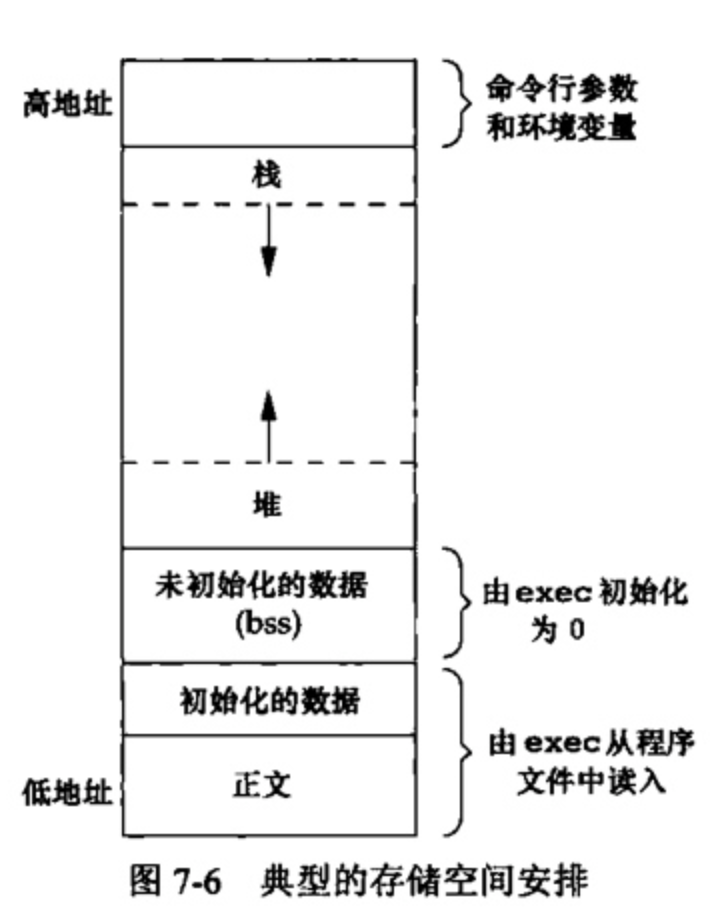

## 一.C++中的资源管理

### 1.程序的存储空间布局

C程序一直由以下几个部分组成：

<div align = center></div>

+  **正文段。** 这是由CPU执行的机器指令部分。通常正文段是可共享的，但通常也只能制度，防止程序由于意外而修改其指令。
+  **初始化数据段。** 通常将此段称为数据段,它包含了程序中需明确地赋初值的变量。
+  **未初始化数据段。** 通常将此段称为bss段 (名称来源于早期汇编程序一个操作符,意思是“由符号开始的块”( block started by symbol))。在程序开始执行之前， **内核将此段中的数据初始化为0或空指针** 。
+  **栈。** 自动变量以及每次函数调用时所需保存的信息都存放在此段中。
+  **堆。** 通常在堆中进行动态存储分配。

> +  a.out 中还有其他类型的段，如符号表的段，包含调试信息的段以及包含动态共享库链接表的段等。这些部分并不装载到进程执行的程序映像中。
> +  未初始化数据段的内容并不存放在磁盘程序文件中。其原因是,内核在程序开始运行前将它们都设置为0。需要存放在磁盘程序文件中的段只有正文段和初始化数据段

### 2.堆，栈 与 RAII


### 3.智能指针的引入

#### (1).什么是智能指针

智能指针是一个类，这个类的构造函数中传入一个普通指针，析构函数中释放传入的指针。智能指针的类都是栈上的对象，所以当函数（或程序）结束时会自动被释放，

#### (2).最常用的智能指针

+ `std::auto_ptr`，有很多问题。 不支持复制（拷贝构造函数）和赋值（operator =），但复制或赋值的时候不会提示出错。因为不能被复制，所以不能被放入容器中。

+ C++11引入的 `unique_ptr`， 也不支持复制和赋值，但比auto_ptr好，直接赋值会编译出错。实在想赋值的话，需要使用：`std::move`。

  + 例如：

    ```c++ 
    std::unique_ptr<int> p1(new int(5));
    std::unique_ptr<int> p2 = p1; // 编译会出错
    std::unique_ptr<int> p3 = std::move(p1); // 转移所有权, 现在那块内存归p3所有, p1成为无效的指针.
    ```

+ C++11或boost的shared_ptr，基于引用计数的智能指针。可随意赋值，直到内存的引用计数为0的时候这个内存会被释放。

+ C++11或boost的weak_ptr，弱引用。 引用计数有一个问题就是互相引用形成环，这样两个指针指向的内存都无法释放。需要手动打破循环引用或使用weak_ptr。顾名思义，weak_ptr是一个弱引用，只引用，不计数。如果一块内存被shared_ptr和weak_ptr同时引用，当所有shared_ptr析构了之后，不管还有没有weak_ptr引用该内存，内存也会被释放。所以weak_ptr不保证它指向的内存一定是有效的，在使用之前需要检查weak_ptr是否为空指针。

#### (3).智能指针的实现

> 下面是一个基于引用计数的智能指针的实现，需要实现构造，析构，拷贝构造，=操作符重载，重载*-和>操作符。

```c++
#ifndef MYSHAREPOINTER_H
#define MYSHAREPOINTER_H
template<typename T>
class MySharePointer {
private:
    T* _ptr;
    size_t *_reference_count;
    //减去引用次数
    void releaseCount() {
        if(_ptr) {
            if(--(*_reference_count) == 0) {
                //智能指针是为了解决动态内存的问题，所以肯定能使用delete
                delete _ptr;
                delete _reference_count;
            }
        }
    }
public:
    //构造函数
    MySharePointer(T* p = nullptr) : _p(_ptr), _reference_count(new size_t) {
        if(_ptr) 
            *_reference_count = 1;
         else 
            *_reference_count = 0;
    }
    //拷贝构造函数
    MySharePointer(const SmartPointer& spr) {
        if(this != &spr) {
            _ptr = spr._ptr;
            _reference_count = spr._reference_count;
            (*_reference_count)++;
        }
    }
    //重载赋值运算符
    MySharePointer& operator= (const MySharePointer& spr){
        if(_ptr == spr._ptr) 
          	return *this;
        //将自己所指的智能指针引用参数 -1
        releaseCount();
        _ptr = spr._ptr;
        _reference_count = spr._reference_count;
        (*_reference_count)++;
        return *this;
    }
    //重载操作符 *
    T& operator* () {
        if(_ptr) 
          	return *_ptr;
    }
    //重载操作符 ->
    T* operator-> (){
        if(_ptr) 
          	return _ptr;
    }
    //析构函数
    ~SharedPointer() {
        if(--(*_reference_count) == 0) {
            delete _ptr;
            delete _reference_count;
        }
    }
    //获取引用次数
    size_t getCount() {
      	return *_reference_count;
    }

};
#endif MYSHAREPOINTER_H
```

```c++
int main(){
    //这边是动态创建的 char('a');所以可以进行delete
    MySharePointer<char> cp1(new char('a'));
    MySharePointer<char> cp2(cp1);
    MySharePointer<char> cp3;
    cp3 = cp2;
    cp3 = cp1;
    cp3 = cp3;
    cout << *cp3 << endl;
    cout << cp3.getCount() << endl;
    MySharePointer<char> cp4(new char('b'));
    cp3 = cp4;
    cout << *cp3 << endl;
    cout << cp3.getCount() << endl;  
}
```

#### (4).智能指针的线程安全问题

智能指针有2个成员，一个是引用计数是原子的，另外一个原始指针并不是；所以综合来说就不是线程安全的。

多个线程同时读同一个shared_ptr对象是线程安全的，但是如果是多个线程对同一个shared_ptr对象进行读和写，则需要加锁。

### (5).智能指针出现的循环引用问题

循环引用是指使用多个智能指针share_ptr时，出现了指针之间相互指向，从而形成环的情况，有点类似于死锁的情况，这种情况下，智能指针往往不能正常调用对象的析构函数，从而造成内存泄漏。举个例 子:

```c++
#include <iostream>
using namespace std;
template <typename T>
class Node
{
public:
    Node(const T& value):_pPre(NULL), _pNext(NULL), _value(value){
        cout << "Node()" << endl;
    }
		~Node() {
        cout << "~Node()" << endl;
        cout << "this:" << this << endl;
    }
    shared_ptr<Node<T>> _pPre;
    shared_ptr<Node<T>> _pNext;
    T _value;
};
void Funtest(){
    shared_ptr<Node<int>> sp1(new Node<int>(1));
    shared_ptr<Node<int>> sp2(new Node<int>(2));
    cout << "sp1.use_count:" << sp1.use_count() << endl;
    cout << "sp2.use_count:" << sp2.use_count() << endl;
		sp1->_pNext = sp2; //sp1的引用+1 
  	sp2->_pPre = sp1; //sp2的引用+1
    cout << "sp1.use_count:" << sp1.use_count() << endl;
    cout << "sp2.use_count:" << sp2.use_count() << endl;
}
int main() {
    Funtest();
    system("pause");
    return 0;
}
//输出结果 
//Node()
//Node() 
//sp1.use_count:1
//sp2.use_count:1
//sp1.use_count:2
//sp2.use_count:2
```

从上面shared_ptr的实现中我们知道了只有当引用计数减减之后等于0，析构时才会释放对象，而上述情 况造成了一个僵局，那就是析构对象时先析构sp2,可是由于sp2的空间sp1还在使用中，所以sp2.use_count 减减之后为1，不释放，sp1也是相同的道理，由于sp1的空间sp2还在使用中，所以sp1.use_count减减之 后为1，也不释放。sp1等着sp2先释放，sp2等着sp1先释放,二者互不相让，导致最终都没能释放，内存泄 漏。

在实际编程过程中，应该尽量避免出现智能指针之前相互指向的情况，如果不可避免，可以使用使用弱指针——weak_ptr，它不增加引用计数，只要出了作用域就会自动析构。

弱指针用于专门解决shared_ptr循环引用的问题，weak_ptr不会修改引用计数，即其存在与否并不影响对 象的引用计数器。循环引用就是:两个对象互相使用一个shared_ptr成员变量指向对方。弱引用并不对对 象的内存进行管理，在功能上类似于普通指针，然而一个比较大的区别是，弱引用能检测到所管理的对 象是否已经被释放，从而避免访问非法内存。

## 二.C++ 11重难点

### 1.Lambda表达式

#### (1).lambda定义

- `lambda表达式`：是一个可调用的代码单元，即一个未命名的`内联函数`。它有捕获列表、返回类型、形参列表、函数体，但可定义在函数内部（函数不可）

- lambda表达式形式:

  ```c++
  [capture list](parameter list) -> return type {function body}
  ```

  - capture list是`捕获列表`，是lambda所在函数中定义的局部变量的列表
  - parameter list、return type、function body与函数一样
  - lambda必须用`尾置返回`
  - 可忽略形参列表和返回类型，但必须有捕获列表和函数体
  - 若函数体不是单一return语句，则必须指定返回类型（否则为void）

- 可用变量定义的形式定义lambda，用函数调用的方式使用lambda

  ```c++
  auto f=[]{return 42;};
  cout<<f()<<endl; //用调用算符使用lambda
  ```

#### (2).向lambda传递参数

- 调用lambda时用实参初始化形参的方式和函数相同，但`lambda不可有默认实参`

- lambda将局部变量包含在捕获列表中来访问它们，只有被捕获到的局部变量才可在函数体中被使用。但只有`局部非static变量`才需要捕获，`lambda可直接使用定义在当前函数之外的名字和局部static变量`

  ```c++
  [sz](const string &a){
    return a.size() > sz;
  }
  ```

- `for_each` 算法：

  - 作用：对输入范围的每个元素调用给定的可调用对象
  - 用法：有3个参数，前2个是输入范围，第3个是可调用对象

- 例子：计数并按字典序打印长度>=给定值的字符串

  ```c++
  void elimDups(vector<string> &words){
      sort(words.begin(), words.end());
      auto end_unique = unique(words.begin(), words.end());
      words.erase(end_unique, words.end());
  }
  //计数并按字典序打印vector<string>中长度>=给定值的sz
  void biggies(vector<string> &words, vector<string>::size_type sz){
      //按字典排序并消除重复
      elimDups(words);
      //对字符串长度做稳定排序，长度相同的单词维持字典序
      //用lambda做二元谓词比较两元素
      stable_sort(words.begin(),words.end(),
                  [](const string &a, const string &b){return a.size()<b.size();});
      //找到第一个长度>=sz的元素
      //用lambda做一元谓词比较元素和变量
      auto wc=find_if(words.begin(),words.end(), [sz](const string &a){return a.size()>=sz;});
      //计算长度>=sz的元素数目
      auto count=words.end()-wc;
      cout<<count<<" "<< ((count>1)?("words"):("word") ) <<" of length "<<sz<<" or longer" <<endl;
      //打印长度>=sz的元素，每个元素后接一个空格
      //用lambda遍历元素
      for_each(wc,words.end(),
               [](const string &s){cout<<s<<" ";});
      cout<<endl;
  }
  int main(){
      vector<string> words {"fox", "jumps", "the", "over", "turtle", "quick", "red", "red", "slow", "the"};
      biggies(words,4);
  }
  ```

#### (3).lambda捕获和返回

- `lambda实际是匿名类`：定义lambda时，编译器生成一个与其对应的未命名的类类型

- 向函数传递lambda时，同时定义了一个新类型和该类型的一个对象，传递的参数就是该对象。用auto定义一个lambda初始化的变量时，该变量也是这种对象。从lambda生成的类都有一个数据成员对应捕获到的变量。lambda的数据成员在创建时被初始化，即`被捕获的变量用于初始化lambda匿名对象的成员`

- lambda捕获变量的方式可用`值捕获`和`引用捕获`

  + `值捕获`存在拷贝，且值捕获的变量是在lambda创建（lambda对象构造）时被拷贝，而不是调用时拷贝，故创建lambda后修改捕获变量不影响lambda中的值。

  + 使用`引用捕获`时必须确保lambda执行时被捕获变量存在。例如，从函数中返回lambda时不可用引用捕获。最佳实践：尽量减少捕获的变量，且避免捕获指针/引用

  ```c++
  void fcn1(){
      size_t v=42;
      auto f1=[v]{return v;};     //值捕获，创建lambda（构造lambda对象）
      auto f2=[&v]{return v;};    //引用捕获，创建lambda（构造lambda对象）
      v=0;                        //改变捕获变量的值
      auto j1=f1();               //j1是42，因为lambda创建时保存了捕获变量的拷贝
      auto j2=f2();               //j2是0，因为lambda创建时未拷贝捕获变量，只是建立了引用
  }
  ```

  + `隐式捕获`：可让编译器根据lambda函数体中的代码来推断要捕获哪些变量。
    + 使用隐式捕获，需在捕获列表中写`&`或`=`，分别对应引用捕获和值捕获
    + 可混合使用隐式捕获和显式捕获，只需在捕获列表中写`&`或`=`，再写显式捕获的变量，要求：
      - 捕获列表第一个元素必须是`&`或`=`，指定默认为引用/值捕获
      - 显式捕获的变量必须使用与隐式捕获不同的方式。即隐式引用捕获，则显式必须为值捕获，反之亦然

  ```c++
  void print_strings(vector<strin> &words, ostream &os=cout, char c=' '){
      //c为显式值捕获，其他变量（os）为隐式引用捕获
      for_each(words.begin(),words.end(),
               [&,c](const string &s){os<<s<<c;});
      //os为显式引用捕获，其他变量（c）为隐式值捕获，等价于上一行
      for_each(words.begin(),words.end(),
               [=,&os](const string &s){os<<s<<c;});
  }
  ```

+ 若lambda函数体包含return之外的任何语句，则编译器推断它返回void，返回void的函数不能返回值，除非手动指定返回类型

  + `transform`算法：

    + 作用：对输入范围的每个元素调用可调用对象，将返回值依次写入目标序列
    + 用法：有4个参数，前2个是输入范围，第3个是目的序列的首迭代器，第4个是可调用对象

  + transform写入的目标序列和输入序列可以相同，即可以向原址写入

    > transform和for_each的区别：
    >
    > - transform可进行非原址写，for_each不可（除非在可调用对象内写非原址目标）
    > - transform通过可调用对象的返回值写入，for_each在可调用对象内部操作

  + 为lambda指定返回类型时，必须使用`尾置返回`

  ```c++
  vector<int> vi={0,1,2,3,4};
  transform(vi.begin(),vi.end(),vi.begin(),
            [](int i) {if(i<0) ? -i : i;});
  //错误,不能推断lambda的返回类型
  transform(vi.begin(),vi.end(),vi.begin(),
            [](int i) {if(i<0) return -i; else return i;}); 
  //使用尾置返回
  transform(vi.begin(),vi.end(),vi.begin(),
            [](int i)->int{if(i<0) return -i; else return i;}); //取绝对值
  ```

#### (4).参数绑定

> + 对于少数地方使用的简单操作用lambda，而多次调用时应该定义函数。
> + 但对于有捕获列表的lambda，很难用函数替换。因为不能在函数中定义函数，导致不能在不修改形参的前提下使用局部变量（例如标准库算法中的可调用对象，其形参必须固定）。
>
> 基于上述原因，提出了参数绑定。

##### 标准库bind函数

- 在`functional`头文件中定义了`bind`函数，可看作通用的函数适配器。它接受一个可调用对象，生成新的可调用对象来适应原对象的参数列表（即改变可调用对象的调用接口）

- 调用bind的形式为：

  ```c++
  auto newCallable = bind(callable,arg_list);
  ```

  - callable是可调用对象，arg_list是逗号分隔的参数列表，对应callable的参数
  - 调用newCallable时，是在用arg_list的参数调用callable
  - arg_list中的参数可包含占位符，即`_n`，其中`n`是传入newCallable的第n个参数

```c++
bool check_size(const string &s, string::size_type sz){
    return s.size() >= sz;
}

int main(){
    vector<string> words {"fox", "jumps", "the", "over", "turtle", "quick", "red", "red", "slow", "the"};
    auto wc = find_if(words.begin(), words.end(), bind(check_size, std::placeholders::_1, 4));
    cout << words.end() - wc << endl;
}
```

##### 绑定check_size的sz参数

- 使用`bind`生成一个调用`check_size`的对象。

```c++
bool check_size(const string &s, string::size_type sz){
    return s.size() >= sz;
}
int main(){
		auto check6 = bind(check_size,std::placeholders::_1,6);
		string s = "hello";
  	bool b1 = check6(s);
  	cout << b1 << endl;
}
```

> 此bind调用生成一个可调用对象，将 check_size 的第二个参数绑定到 sz 的值。当 find_if 对words中的string调用这个对象时，这些对象会调用 check_size ，将给定的string和sz传递给它。因此 find_if 可以有效的输入序列中每个string调用check_size，实现string大小和size的对比。

- 名字`_n`都定义于`placeholders`命名空间中，该命名空间又定义于`std`命名空间。同时，placeholders命名空间定义于`functional`头文件
- 使用`using namespace namespace_name`来说明希望所有来自namespace_name的名字都可在程序中直接使用

```c++
auto g=bind(f,a,b,_2,c,_1); //对g的定义，abc类似于lambda的捕获列表
g(X,Y);                   //调用g
f(a,b,Y,c,X);             //等价于调用f
```

##### 绑定引用参数

- 默认下，bind的非占位符参数被`拷贝`到可调用对象中，类似lambda中的`值捕获`
- 用`ref`函数可实现lambda中的`引用捕获`
- `ref`函数返回一个对象，该对象中包含输入的引用，且可拷贝。若需要包含const引用，则应用`cref`函数。ref和cref也定义于`functional`头文件中
- 例子：用bind和ref捕获引用

```c++
/* 上下文：os是局部变量，引用输出流；c是局部变量，类型为char */
//lambda实现，引用捕获输出流，值捕获字符
for_each(words.begin(),words.end(),
         [&os,c](cons string &s){os<<s<<c;});
//函数实现，要被标准库算法使用，需要用bind捕获os和c
ostream &print(ostream &os, const string &s, char c){
    return os<<s<<c;
}
//错，os不可拷贝，不能用默认方式bind
for_each(words.begin(),words.end(),
         bind(print,os,_1,' '));
//对，用ref返回的对象包含os引用且可拷贝
for_each(words.begin(),words.end(),
         bind(print,ref(os),_1,' '));
```


### 2.右值与移动构造函数


### 3.正则表达式


