# C有关 的重要问题

### 1.main函数是如何被调用的

C程序总是从main函数开始执行，main函数的原型是：

```c
int main(int argc, char *argv);
```

>  其中，argc是命令行参数的数目，argv是指向参数的各个指针所构成的数组

**当内核执行C程序时(使用一个exec函数),在调用main前先调用一个特殊的启动例程**。  

**可执行程序文件将此启动例程指定为程序的起始地址—这是由连接编辑器设置的,而连接编辑器则由C编译器调用。** 启动例程从内核取得命令行参数和环境变量值,然后为按上述方式调用main函数做好安排。

---

### 2.C程序如何启动和终止的

<div align = center>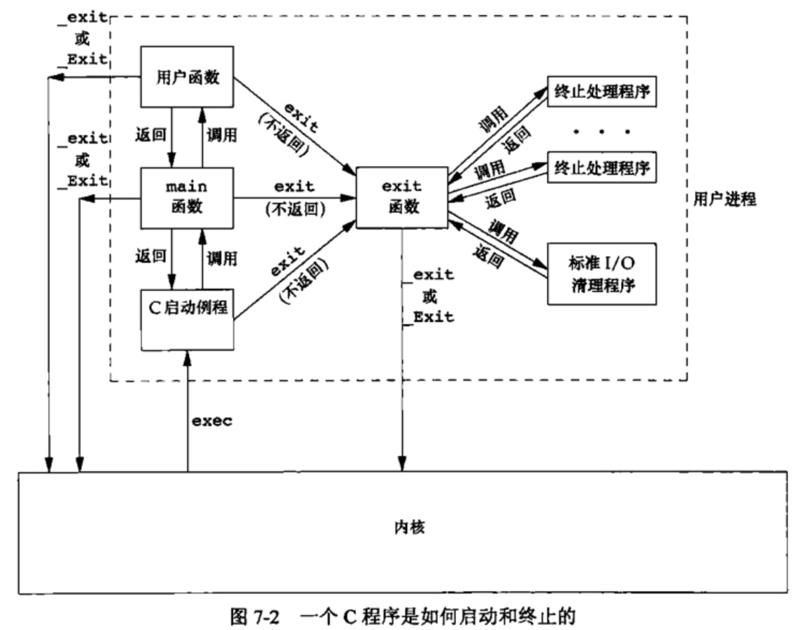</div>

+ 注意,**内核使程序执行的唯一方法是调用一个exec函数。进程自愿终止的唯一方法是显式或隐式地(通过调用exit)调用exit或Exit**。进程也可非自愿地由一个信号使其终止。

+ 当执行一个程序时,调用exec的进程可将命令行参数传递给该新程序。ISO C和POSIX.1都要求argv[argc]是一个空指针。这就使我们可以将参数处理循环改写为

  ```c
  for(i = 0; argv[i] != NULL; i++)
  ```

---

### 3.atexit函数

按照ISO C的规定,一个进程可以登记多至32个函数,这些函数将由exit自动调用。我们称这些函数为终止处理程序( exit handler),并调用 atexit函数来登记这些函数。

```c
#include <stdlib.h>

int atexit(void (*func)(void));
// Returns: 0 if OK, nonzero on error
```

>  其中, `atexit`的参数是一个函数地址,当调用此函数时无需向它传递任何参数,也不期望它返回一个值。exit调用这些函数的顺序与它们登记时候的顺序相反。同一函数如若登记多次也会被调用多次。

```c
#include "apue.h"
static void	my_exit1(void);
static void	my_exit2(void);

int main(void){
	if (atexit(my_exit2) != 0)
		err_sys("can't register my_exit2");

	if (atexit(my_exit1) != 0)
		err_sys("can't register my_exit1");
	if (atexit(my_exit1) != 0)
		err_sys("can't register my_exit1");
	if (atexit(my_exit1) != 0)
		err_sys("can't register my_exit1");

	printf("main is done\n");
	return(0);
}

static void
my_exit1(void)
	printf("first exit handler\n");

static void
my_exit2(void)
	printf("second exit handler\n");
```

<div align = center>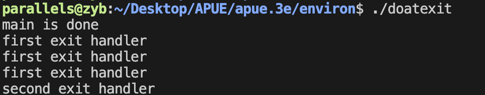</div>

---

### 4.C程序的存储空间布局

C程序一直由以下几个部分组成：

<div align = center></div>

+  **正文段。** 这是由CPU执行的机器指令部分。通常正文段是可共享的，但通常也只能制度，防止程序由于意外而修改其指令。
+  **初始化数据段。** 通常将此段称为数据段,它包含了程序中需明确地赋初值的变量。
+  **未初始化数据段。** 通常将此段称为bss段 (名称来源于早期汇编程序一个操作符,意思是“由符号开始的块”( block started by symbol))。在程序开始执行之前， **内核将此段中的数据初始化为0或空指针** 。
+  **栈。** 自动变量以及每次函数调用时所需保存的信息都存放在此段中。
+  **堆。** 通常在堆中进行动态存储分配。

> +  a.out 中还有其他类型的段，如符号表的段，包含调试信息的段以及包含动态共享库链接表的段等。这些部分并不装载到进程执行的程序映像中。
> +  未初始化数据段的内容并不存放在磁盘程序文件中。其原因是,内核在程序开始运行前将它们都设置为0。需要存放在磁盘程序文件中的段只有正文段和初始化数据段

---

### 5.共享库

+ 共享库使得**可执行文件中不再需要包含公用的库函数** ，而只需在所有进程都可引用的存储区中保存这种库例程的一个副本。
+ 程序第一次执行或者第一次调用某个库函数时,**用动态链接方法将程序与共享库函数相链接**。这减少了每个可执行文件的长度,但增加了一些运行时间开销。这种时间开销发生在该程序第一次被执行时,或者每个共享库函数第一次被调用时。
+ 共享库的另一个优点是**可以用库函数的新版本代替老版本而无需对使用该库的程序重新连接编辑**(假定参数的数目和类型都没有发生改变)

### 6.存储空间分配

ISO C说明了3个用于存储空间动态分配的函数

1. malloc,分配 **指定字节数的存储区** 。此存储区中的初始值不确定。
2. calloc,为 **指定数量 指定长度** 的对象分配存储空间。**该空间中的每一位(bit)都初始化为0**
3. realloc, **增加或减少以前分配区的长度** 。当增加长度时,可能需将以前分配区的内容移到另一个足够大的区域,以便在尾端提供增加的存储区,而新增区域内的初始值则不确定。

```c
#include <stdlib.h>

// All three return: non-null pointer if OK, NULL on error
void *malloc(size_t size);
void *calloc(size_t nobj, size_t size);
void *realloc(void *ptr, size_t newsize);
//这3个分配函数所返回的指针一定是适当对齐的,使其可用于任何数据对象。

void free(void *ptr);
//free函数释放ptr所指向的存储空间。被释放的空间通常被送入可用存储区池。以后可在调用上述3个分配函数时再分配。
```


---

# C++ Primer

##  一.变量与基本类型

### 1.变量声明和定义区别？

- 声明仅仅是把变量的声明的位置及类型提供给编译器，并不分配内存空间；定义要在定义的地方为其分配存储空间。
- 相同变量可以在多处声明（外部变量extern），但只能在一处定义。

---

### 2.哪几种情况必须用到初始化成员列表？

- 初始化一个const成员。
- 初始化一个reference成员。
- 调用一个基类的构造函数，而该函数有一组参数。
- 调用一个数据成员对象的构造函数，而该函数有一组参数。

---

### 3.常量指针和指针常量区别？

- 常量指针是一个指针，读成常量的指针，指向一个只读变量。如`int const *p`或`const int *p`。
- 指针常量是一个不能给改变指向的指针。指针是个常量，不能中途改变指向，如`int *const p`。

---

### 4.野指针和悬空指针

都是是指向无效内存区域(这里的无效指的是"不安全不可控")的指针，访问行为将会导致未定义行为。

**野指针**，指的是没有被初始化过的指针

```c++
int main(void) { 
  int * p;
  std::cout<<*p<<std::endl;
  return 0;
}
```

因此，为了防止出错，对于指针初始化时都是赋值为 `nullptr`，这样在使用时编译器就会直接报错，产生非法内存访问。

**悬空指针**，指针最初指向的内存已经被释放了的一种指针。

```c++
int main(void) { 
  int * p = nullptr;
  int* p2 = new int; 
  p = p2;
  delete p2;
}
```

此时 p和p2就是悬空指针，指向的内存已经被释放。继续使用这两个指针，行为不可预料。需要设置为`p=p2=nullptr`。此时再使用，编译器会直接保错。

避免野指针比较简单，但悬空指针比较麻烦。c++引入了智能指针，C++智能指针的本质就是避免悬空指针的产生。

**产生原因及解决办法：**

野指针：指针变量未及时初始化 => 定义指针变量及时初始化，要么置空。

悬空指针：指针free或delete之后没有及时置空 => 释放操作后立即置空。

---

### 5.区别以下指针类型？

```c++
int *p[10]
int (*p)[10]
int *p(int)
int (*p)(int)
```

- `int *p[10]`表示指针数组， **强调数组概念** ，是一个数组变量，数组大小为10，数组内每个元素都是指向int类型的指针变量。
- `int (*p)[10]`表示数组指针， **强调是指针** ，只有一个变量，是指针类型，不过指向的是一个int类型的数组，这个数组大小是10。
- `int *p(int)`是函数声明，函数名是p，参数是int类型的，返回值是int *类型的。
- `int (*p)(int)`是函数指针，强调是指针，该指针指向的函数具有int类型参数，并且返回值是int类型的。

---

### 6.指针和引用的区别

#### :large_orange_diamond: 性质方面

- 指针是一个变量，存储的是一个地址，引用跟原来的变量实质上是同一个东西，是原变量的别名
- 指针可以有 **多级** ，引用只有一级
- 指针可以为空，引用不能为`NULL`且在定义时 **必须初始化**
- 指针在初始化后 **可以改变指向** ，而引用在初始化之后 **不可再改变**

#### :large_orange_diamond: ​内存

- `sizeof`指针得到的是本指针的大小，`sizeof`引用得到的是引用所指向变量的大小

- 引用只是别名，不占用具体存储空间，只有声明没有定义；指针是具体变量，需要占用存储空间。

#### :large_orange_diamond: ​使用

+ 引用一旦初始化之后就不可以再改变（变量可以被引用为多次，但引用只能作为一个变量引用）；指针变量可以重新指向别的变量。

+ 引用在声明时必须初始化为另一变量，一旦出现必须为`typename refname &varname`形式；指针声明和定义可以分开，可以先只声明指针变量而不初始化，等用到时再指向具体变量。

+ **当把指针作为参数进行传递时，也是<font color = red>将实参的一个拷贝传递给形参，两者指向的地址相同，但不是同一个变量，在函数中改变这个变量的指向不影响实参，而引用却可以。</font>**

```c++
void test(int *p)
{
　　int a=1;
　　p=&a;
　　cout<<p<<" "<<*p<<endl;
}

int main(void)
{
    int *p=NULL;
    test(p);
    if(p==NULL)
    	cout<<"指针p为NULL"<<endl;
    return 0;
}
//运行结果为：
//0x22ff44 1
//指针p为NULL
//*******************************	
void testPTR(int* p) {
    int a = 12;
    p = &a;

}

void testREFF(int& p) {
    int a = 12;
    p = a;

}
void main()
{
    int a = 10;
    int* b = &a;
    testPTR(b);//改变指针指向，但是没改变指针的所指的内容
    cout << a << endl;// 10
    cout << *b << endl;// 10

    a = 10;
    testREFF(a);
    cout << a << endl;//12
}
```

---

### 7.C++中const和static的作用

#### **static**

**:diamonds:  不考虑类的情况**

:small_blue_diamond: **存储区：**

+ 静态变量都在全局数据区分配内存，包括静态局部变量。

  > 一般程序的由new产生的动态数据存放在堆区，函数内部的自动变量存放在栈区。自动变量一般会随着函数的退出而释放空间，静态数据（即使是函数内部的静态局部变量）也存放在全局数据区。全局数据区的数据并不会因为函数的退出而释放空间。

:small_blue_diamond: **初始化：**

+ 全局static变量的初始化在编译的时候进行。在main函数被调用之前初始化并且只初始化一次 。
+ 默认初始化为0，包括未初始化的全局静态变量与局部静态变量，都存在 **全局未初始化区**

:small_blue_diamond: **作用域：**

+ 静态变量在函数内定义，始终存在，且只进行一次初始化，具有记忆性，其作用范围与局部变量相同，函数退出后仍然存在，但不能使用

  ```c++
  int main(void)
  {    
      for(int i = 0;i < 5;i++)
      {
        	static int m = 7;
       	 	cout<< "m=" << m--;
      } 
      cout << m << endl;//这里会显示错误
          return 0;
  ```

+  普通全局变量作用域是整个源程序，当一个程序有多个源文件组成时候，普通全局变量在每个源文件中都是有效的，而 **静态全局变量则限制了作用域，只在定义该变量的源文件中有效。在同一个源程序中的其他源文件不能使用。** 由于静态全局变量的作用域限于一个源文件内，只能为该源文件内的函数公用， 因此可以避免在其它源文件中引起错误。

  

:diamonds:  **考虑类的情况**

:small_blue_diamond:  **static成员变量** 

```c++

#include<iostream>
using namespace std;
 
class Myclass
{
private:
    int a , b , c;
    static int sum;  //声明静态数据成员
public:
    Myclass(int a , int b , int c) : a(a), b(b), c(c){
        sum += a+b+c;
    }
    void GetSum();
};
 
int Myclass::sum = 0;   //定义并初始化静态数据成员

void Myclass::GetSum() {
		cout<<"sum="<<sum<<endl;
}

int main(void)
{
    Myclass M(1 , 2 , 3);
    M.GetSum();						//6
    Myclass N(4 , 5 , 6);
    N.GetSum();						//21
    M.GetSum();						//21
    return 0;
}
```

+ 对于非静态数据成员，每个类对象都有自己的拷贝。而静态数据成员被当作是类的成员。无论这个类的对象被定义了多少个，静态数据成员在程序中也只有一份拷贝，由该类型的所有对象共享访问。也就是说，静态数据成员是该类的所有对象所共有的。对该类的多个对象来说，静态数据成员只分配一次内存(定义时就分配)，供所有对象共用。所以，静态数据成员的值对每个对象都是一样的，它的值可以更新；
+ 静态数据成员存储在全局数据区。静态数据成员定义时要分配空间，所以不能在类声明中定义。在Example中，语句`int Myclass::Sum=0;`是定义静态数据成员；
+ 因为静态数据成员在全局数据区分配内存，属于本类的所有对象共享，所以，它不属于特定的类对象，在没有产生类对象时其作用域就可见，即在没有产生类的实例时，我们就可以操作它；
+ 同全局变量相比，使用静态数据成员有两个优势：
  + 静态数据成员没有进入程序的全局名字空间，因此不存在与程序中其它全局名字冲突的可能性；
  + 可以实现信息隐藏。静态数据成员可以是private成员，而全局变量不能；

:small_blue_diamond:  **static成员函数**

```c
#include<iostream>
using namespace std;
 
class Myclass
{
private:
	int a , b , c;
	static int sum;  //声明静态数据成员
public:
	Myclass(int a , int b , int c) : a(a), b(b), c(c) {
		this->a = a;
		this->b = b;
		this->c = c;
		sum += a+b+c;    //非静态成员函数可以访问静态数据成员
	}
	static void GetSum();  //声明静态成员函数
};
 
int Myclass::sum = 0;   //定义并初始化静态数据成员

void Myclass::GetSum(){    //静态成员函数的实现

	//cout<<a<<endl;    //错误代码，a是非静态数据成员
	cout<<"sum="<<sum<<endl;
}
 
int main(void)
{
	Myclass M(1 , 2 , 3);
	M.GetSum();							//6
	Myclass N(4 , 5 , 6);
	N.GetSum();							//21
	Myclass::GetSum();			//21
	return 0;
}
```


+ 与静态数据成员一样，我们也可以创建一个静态成员函数，它为类的全部服务而不是为某一个类的具体对象服务。静态成员函数与静态数据成员一样，都是类的内部实现，属于类定义的一部分。
+ 普通的成员函数一般都隐含了一个this指针，this指针指向类的对象本身，因为普通成员函数总是具体的属于某个类的具体对象的。通常情况下，this是缺省的。如函数fn()实际上是this->fn()。 **但是与普通函数相比，静态成员函数由于不是与任何的对象相联系，因此它不具有this指针。从这个意义上讲，它无法访问属于类对象的非静态数据成员，也无法访问非静态成员函数，它只能调用其余的静态成员函数。**

+ 出现在类体外的函数定义不能指定关键字static；
+ 静态成员之间可以相互访问，包括静态成员函数访问静态数据成员和访问静态成员函数；
+ 非静态成员函数可以任意地访问静态成员函数和静态数据成员；
+ 静态成员函数不能访问非静态成员函数和非静态数据成员；
+ 由于没有this指针的额外开销，因此静态成员函数与类的全局函数相比速度上会有少许的增长；
+ 调用静态成员函数，可以用成员访问操作符(.)和(->)为一个类的对象或指向类对象的指针调用静态成员函数，也可以直接使用如下格式：
  `＜类名＞::＜静态成员函数名＞（＜参数表＞）`
  调用类的静态成员函数。


#### **const**

:diamonds:   **不考虑类的情况**

- const常量在定义时必须初始化，之后无法更改

- const形参可以接收const和非const类型的实参，例如

  ```c++
  // i 可以是 int 型或者 const int 型
  void fun(const int& i){
      //...
  }
  ```

:diamonds:   **不考虑类的情况**

:small_blue_diamond:  **const成员变量**

- 不能在类定义外部初始化，只能通过构造函数初始化列表进行初始化
- 并且必须有构造函数；
- 不同类对其const数据成员的值可以不同，所以不能在类中声明时初始化

:small_blue_diamond: **const成员函数**

+ const对象不可以调用非const成员函数；
+ 非const对象都可以调用；
+ 不可以改变非mutable（用该关键字声明的变量可以在const成员函数中被修改）数据的值

---

### 8.C++的顶层const和底层const

#### **概念区分**

>  **指针本身是不是一个常量** 以及 **指针所指的是不是一个常量** 是两个独立的问题。

- **顶层**const：指的是 **指针本身是一个常量**
- **底层**const：指的是 **指针所指的对象是一个常量**

#### **举个例子**

```c++
int i= 0；
int* const p1 = &i; 				//不能改变p1的值，顶层const
const int ci = 42;					//不能改变ci的值，顶层const
const int *p2 = &ci; 				//允许改变P2的值，底层const
const int *const p3 = p2;		//靠右的const是顶层const，靠左的const是底层const
const int &r = ci;					//用于声明引用的const都是底层const
```

#### **区分作用**

- 执行对象拷贝时有限制，常量的底层const不能赋值给非常量的底层const
- 使用命名的强制类型转换函数const_cast时，只能改变运算对象的底层const

```c++
const int a;
int const a;
const int *a;
int *const a;
```

- `int const a`和`const int a`均表示定义常量类型a。
- `const int *a`，其中a为指向int型变量的指针，const在 * 左侧，表示a指向不可变常量。(看成`const (*a)`，对引用加const)
- `int *const a`，依旧是指针类型，表示a为指向整型数据的常指针。(看成`const(a)`，对指针const)

---

### 9.constexpr与常量表达式

#### (1).常量表达式

**常量表达式** 是指 **值不会改变** 并且在 **编译过程就能得到计算结果** 的表达式。一个对象（或表达式）是不是常量表达式由它的数据类型和初始值共同决定。

```c++
const int max_files = 20;			// 是常量表达式
const int limit = max_files + 1;	// 是常量表达式
int staff_size = 2;					// 不是常量表达式
//sz本身是一个常量，但是具体值直到运行时才能获取，所以不是常量表达式
const int sz = get_size();			// 不是常量表达式
```

#### (2).constexpr变量

+ C++允许将 **变量声明为constexpr类型以便由编译器来验证变量的值是否是一个常量表达式**
+  **声明为constexpr的变量一定是一个常量，而且必须用常量表达式初始化**
  + 尽管不能使用普通函数作为constexpr变量的初始值，但是 **新标准允许定义一种特殊的 constexpr 函数** 。这种函数应该足够简单以使得编译时就可以计算其结果，这样就能用constexpr函数去初始化constexpr变量了

#### (3).constexpr与指针

+ 一个`constexpr`指针的初始值必须是`nullptr`或者`0`,或者是存储于某个固定地址中的对象；
+ `constexpr`引用必须绑定在存储于某个固定地址中的对象

> - 例如，函数体内定义的变量一般来说并非存放在固定地址中， 因此`constexpr`指针不能指向这样的变量。
> - 相反，**全局变量 以及 局部静态变量地址固定不变，能用来初始化`constexpr`指针**

在constexpr声明中如果定义了一个指针， **限定符constexpr仅对指针有效，与指针所指的对象无关。**

```c++
const int *p = nullptr;
constexpr int *q = nullptr;
```

+ p是一个指向常量的指针

+ q是一个常量指针。

  > constexpr把它所定义的对象置为了顶层const

---

### 10.auto、decltype和decltype(auto)的用法

**（1）auto**

C++11新标准引入了auto类型说明符，用它就能让编译器替我们去分析表达式所属的类型。和原来那些只对应某种特定的类型说明符(例如 int)不同，

auto 让编译器通过初始值来进行类型推演。从而获得定义变量的类型，所以说 auto 定义的变量必须有初始值。举个例子：

```c++
 //普通；类型
 int a = 1, b = 3;
 auto c = a + b;// c为int型
 
 //const类型
 const int i = 5;
 auto j = i; // 变量i是顶层const, 会被忽略, 所以j的类型是int
 auto k = &i; // 变量i是一个常量, 对常量取地址是一种底层const, 所以b的类型是const int*
 const auto l = i; //如果希望推断出的类型是顶层const的, 那么就需要在auto前面加上cosnt
 
 //引用和指针类型
 int x = 2;
 int& y = x;
 auto z = y; //z是int型不是int& 型
 auto& p1 = y; //p1是int&型
 auto p2 = &x; //p2是指针类型int*
```

**（2）decltype**

有的时候我们还会遇到这种情况， **希望从表达式中推断出要定义变量的类型，但却不想用表达式的值去初始化变量。还有可能是函数的返回类型为某表达式的值类型。** 在这些时候auto显得就无力了，所以C++11又引入了第二种类型说明符decltype，它的作用是选择并返回操作数的数据类型。在此过程中，编译器只是分析表达式并得到它的类型，却不进行实际的计算表达式的值。

```c++
 int func() {return 0};
 
 //普通类型
 decltype(func()) sum = 5; // sum的类型是函数func()的返回值的类型int, 但是这时不会实际调用函数func()
 int a = 0;
 decltype(a) b = 4; // a的类型是int, 所以b的类型也是int
 
 //不论是顶层const还是底层const, decltype都会保留   
 const int c = 3;
 decltype(c) d = c; // d的类型和c是一样的, 都是顶层const
 int e = 4;
 const int* f = &e; // f是底层const
 decltype(f) g = f; // g也是底层const
 
 //引用与指针类型
 //1. 如果表达式是引用类型, 那么decltype的类型也是引用
 const int i = 3, &j = i;
 decltype(j) k = 5; // k的类型是 const int&
 
 //2. 如果表达式是引用类型, 但是想要得到这个引用所指向的类型, 需要修改表达式:
 int i = 3, &r = i;
 decltype(r + 0) t = 5; // 此时是int类型
 
 //3. 对指针的解引用操作返回的是引用类型
 int i = 3, j = 6, *p = &i;
 decltype(*p) c = j; // c是int&类型, c和j绑定在一起
 
 //4. 如果一个表达式的类型不是引用, 但是我们需要推断出引用, 那么可以加上一对括号, 就变成了引用类型了
 int i = 3;
 decltype((i)) j = i; // 此时j的类型是int&类型, j和i绑定在了一起
```

**（3）decltype(auto)**

decltype(auto)是C++14新增的类型指示符，可以用来声明变量以及指示函数返回类型。在使用时，会将“=”号左边的表达式替换掉auto，再根据decltype的语法规则来确定类型。举个例子：

```c++
 int e = 4;
 const int* f = &e; // f是底层const
 decltype(auto) j = f;//j的类型是const int* 并且指向的是e
```

> 《auto和decltype的用法总结》：https://www.cnblogs.com/XiangfeiAi/p/4451904.html
>
> 《C++11新特性中auto 和 decltype 区别和联系》：https://www.jb51.net/article/103666.htm


## 二.字符串，向量和数组

### 11.a和&a有什么区别？

```c++
//假设数组int a[10];
int a[10] = {1,2,3,4,5,6,7,8,9,10};
int (*p)[10] = &a;
//int (*p)[10] = a;会报错
cout << *(*p + 1)<< endl;//2
cout << *(a + 1) << endl;//2
```

- a是数组名，是数组首元素地址，+1表示地址值加上一个int类型的大小，如果a的值是0x00000001，加1操作后变为0x00000005。*(a + 1) = a[1]。
- &a是数组的指针，其类型为int (*)[10]（就是前面提到的数组指针），其加1时，系统会认为是数组首地址加上整个数组的偏移（10个int型变量），值为数组a尾元素后一个元素的地址。
- 若(int *)p ，此时输出 *p时，其值为a[0]的值，因为被转为int *类型，解引用时按照int类型大小来读取。

---

### 12.数组名和指针（这里为指向数组首元素的指针）区别？

- 二者均可通过增减偏移量来访问数组中的元素。
- 数组名不是真正意义上的指针，可以理解为常指针，所以数组名没有自增、自减等操作。
- 当数组名当做形参传递给调用函数后，就失去了原有特性，退化成一般指针，多了自增、自减操作，但sizeof运算符不能再得到原数组的大小了。

---

### 13.拷贝初始化和直接初始化

+ 当用于类类型对象时，初始化的拷贝形式和直接形式有所不同：直接初始化直接调用与实参匹配的构造函数，拷贝初始化总是调用拷贝构造函数。拷贝初始化首先使用指定构造函数创建一个临时对象，然后用拷贝构造函数将那个临时对象拷贝到正在创建的对象。举例如下

```c++
string str1("I am a string");//语句1 直接初始化
string str2(str1);//语句2 直接初始化，str1是已经存在的对象，直接调用构造函数对str2进行初始化
string str3 = "I am a string";//语句3 拷贝初始化，先为字符串”I am a string“创建临时对象，再把临时对象作为参数，使用拷贝构造函数构造str3
string str4 = str1;//语句4 拷贝初始化，这里相当于隐式调用拷贝构造函数，而不是调用赋值运算符函数
```

- **为了提高效率，允许编译器跳过创建临时对象这一步，**直接调用构造函数构造要创建的对象，这样就完全等价于**直接初始化了**（语句1和语句3等价）。但是需要辨别两种情况。
- 当拷贝构造函数为private时：语句3和语句4在编译时会报错
- 使用explicit修饰构造函数时：如果构造函数存在隐式转换，编译时会报错

---

### 14.strlen和sizeof区别？

- sizeof是运算符，并不是函数，结果在编译时得到而非运行中获得；strlen是字符处理的库函数。
- sizeof参数可以是任何数据的类型或者数据（sizeof参数不退化）；strlen的参数只能是字符指针且结尾是'\0'的字符串。
- 因为sizeof值在编译时确定，所以不能用来得到动态分配（运行时分配）存储空间的大小。

```c++
int main(int argc, char const *argv[]){   
      const char* str = "name";
      sizeof(str); // 取的是指针str的长度，是8(64位为8字节，32位还是4字节，int*无论是32位还是64位都是4个字节)
      strlen(str); // 取的是这个字符串的长度，不包含结尾的 \0。大小是4
      return 0;
 }
```

---

## 三.函数

### 15宏定义和函数有何区别？

- 宏在编译时完成替换，之后被替换的文本参与编译，相当于直接插入了代码，运行时不存在函数调用，执行起来更快；函数调用在运行时需要跳转到具体调用函数。
- 宏定义属于在结构中插入代码，没有返回值；函数调用具有返回值。
- 宏定义参数没有类型，不进行类型检查；函数参数具有类型，需要检查类型。
- 宏定义不要在最后加分号。

---

### 16.数组形参需要注意的问题

由于 不允许拷贝数组 和 使用数组时通常会将其转换为指针的性质，函数传递数组时，实际上传递的是指向数组首元素的指针。不过可以写成类似数组的形式。

```c++
//这三个函数等价
void print(const int *);
void print(const int[]);
void print(const int[10]);
```

+ **对于数组引用形参**

  + 函数形参可以是数组的引用，而数组的维度也是类型的一部分

    ```c++
    void print(int (&arr)[10]) {
      	for(auto i : arr)
          cout << i << endl;
    }
    ```

    > &arr两端的括号必不可少。
    >
    > ```c++
    > f(int (&arr)[10]) ;	//arr是具有10个整数的整形数组的引用
    > f(int &arr[10]) ;		//将arr声明成引用的数组
    > ```
    >
    > 但是对于上述函数，使用时，传入的数组维度必须严格匹配。

+ **对于传递多维数组**

  + 将多维数组传递给函数时，实际上传递的是指向数组首元素的指针。因为处理的是数组的数组，所以首元素本身就是一个数组，指针就是一个指向数组的指针。

  + 数组第二维的大小都是数组类型的一部分，不能忽略

    ```c++
    //matrix指向数组的首元素，该数组的元素是由10个整数构成的数组
    void print((*matrix)[10], int rowSize);
    //括号必不可少
    /*
    *		(*matrix)[10] 指向含有10个整数的数组的指针
    *		*matrix[10] 	10个指针构成的数组
    */
    void print(matrix[][10], int rowSize);
    ```


### 17.含有可变形参的函数

+ **可变参模板**

+ **使用initializer_list标准库**

  + 函数的形参数量未知但是类型相同时可用。
  + 与vector不同的是，initializer_list对象中的元素永远是常量。
  + 如果想向initializer_list形参中传递一个值的序列，则必须把序列放在一对花括号内。

  ```c++
  void print(initializer_list<string> s) {
      for(auto i : s )
          cout << i << endl;
  }
  int main() {
      print({"hello", "initializer_list"});
      return 0;
  ;}
  ```

---

### 18.尾置返回类型与函数指针

#### 尾置返回类型

尾置返回类型跟在形参列表后面并以一个`->`符号开头。为了表示函数真正的返回类型跟在形参列表之后，我们在本该出现返回类型的地方放置一个auto:

```c
//func接受一个int类型的实参，返回一个指针，该指针指向含有10个整数的数组。
auto func(int i) -> int(*)[10];
```

```c++
auto func(int i) -> int * {
    static int num[10];
    for (int j = 0; j < 10; ++j) {
        num[j] = i;
    }
    return num;
}
int main() {
    int *p= func(2);
    for (int i = 0; i < 10; ++i) {
        cout << *p << endl;
    }
    return 0;
}
```

#### 函数指针

想要声明一个可以指向该函数的指针，只需要用指针代替函数名即可。

```c++
bool print(const string s1, const string s2) {
    if(s1 > s2)
        return true;
}
int main() {
    bool (*pf)(const string, const string );
    //pf = &print;
    pf = print;
    cout << pf("hello", "world");
}
```

和数组类似，虽然不能返回一个函数，但是能返回指向函数类型的指针。把返回类型写成指针形式，编译器不会自动地将函数返回类型当成对应的指针类型处理。

```c++
using F = int (int*, int);			//F是函数类型，不是指针
using PF = int(*)(int*, int);		//PF是指针类型
//显示将返回类型指定为指针
PF f1(int);		//正确：PF是指向函数的指针，f1返回指向函数的指针
F f1(int);		//错误：F是函数类型，f1不能返回一个函数
F *f1(int);		//正确：显示地返回类型是指向函数的指针
//也可以直接声明f1
int (*f1(int)) (int*, int);
//也可以使用尾置返回类型的方式
auto f1(int) -> (int*) (int*, int);
```

---

### 19.内联函数与constexpr函数

+ **内联函数**

将函数指定为内联函数，通常是将它在每一个调用点上"内联地"展开。这样会消除函数的运行开销。一般来说，内联机制用于优化规模较小，流程直接，频繁调用的函数。

+ **constexpr函数**

constexpr函数是指用于常量表达式的函数。此函数的返回类型和所有形参的类型都得是字面值类型，而且函数体中必须有且只有一条return语句。

在能在编译过程中展开，constexpr函数被隐式地指定为内联函数。

---

### 20.内联函数和宏定义的区别

内联(inline)函数和普通函数相比可以加快程序运行的速度，因为不需要中断调用，在编译的时候内联函数可以直接嵌入到目标代码中。

#### **内联函数适用场景**

- 使用宏定义的地方都可以使用inline函数
- 作为类成员接口函数来读写类的私有成员或者保护成员，会提高效率

#### **为什么不能把所有的函数写成内联函数**

内联函数以代码复杂为代价，它以省去函数调用的开销来提高执行效率。所以一方面如果内联函数体内代码执行时间相比函数调用开销较大，则没有太大的意义；另一方面每一处内联函数的调用都要复制代码，消耗更多的内存空间，因此以下情况不宜使用内联函数：

- 函数体内的代码比较长，将导致内存消耗代价
- 函数体内有循环，函数执行时间要比函数调用开销大

#### **主要区别**

- 内联函数在编译时展开，宏在预编译时展开
- 内联函数直接嵌入到目标代码中，宏是简单的做文本替换
- 内联函数有类型检测、语法判断等功能，而宏没有
- 内联函数是函数，宏不是
- 宏定义时要注意书写（参数要括起来）否则容易出现歧义，内联函数不会产生歧义
- 内联函数代码是被放到符号表中，使用时像宏一样展开，没有调用的开销，效率很高；

> 《inline函数和宏定义区别 整理》：https://blog.csdn.net/wangliang888888/article/details/77990650

- 在使用时，宏只做简单字符串替换（编译前）。而内联函数可以进行参数类型检查（编译时），且具有返回值。
- 内联函数本身是函数，强调函数特性，具有重载等功能。
- 内联函数可以作为某个类的成员函数，这样可以使用类的保护成员和私有成员，进而提升效率。而当一个表达式涉及到类保护成员或私有成员时，宏就不能实现了。

---

## 四.类

### 21.初始化和赋值的区别

- 对于简单类型来说，初始化和赋值没什么区别

  + 成员的初始化顺序与它们在类定义中的出现顺序一致，但是构造函数初始值列表中初试值的先后位置关系并不会影响实际的初始化顺序。

- 对于类和复杂数据类型来说，这两者的区别就大了，举例如下：

  ```c++
  class A{
  public:
      int num1;
      int num2;
  public:
      A(int a=0, int b=0):num1(a),num2(b){};
      A(const A& a){};
      //重载 = 号操作符函数
      A& operator=(const A& a){
          num1 = a.num1 + 1;
          num2 = a.num2 + 1;
          return *this;
      };
  };
  int main(){
  
      A a(1,1);
      A a1 = a; //拷贝初始化操作，调用拷贝构造函数
      A b;
      b = a;//赋值操作，对象a中，num1 = 1，num2 = 1；对象b中，num1 = 2，num2 = 2
      return 0;
  }
  ```

---

### 22. C中结构体内存对齐问题？

#### 对齐问题

当定义结构体为：

```c++
struct number_2
{
    char a;
    int b;
    double c;
}st2;
```

> st2所占内存并非1+4+8=13个，而是16个>13个。

结构体中包含有相同类型或不同类型的数据类型，如char（1字节），int（4字节），double（8字节），所以结构体内存出现了一个对齐原则：

**结构体变量中元素是按照定义顺序一个一个放到内存中去的，但并不是紧密排列的。从结构体存储的首地址开始，每一个元素放置到内存中时，它都会认为内存是以它自己的大小来划分的，因此元素放置的位置一定会在自己宽度的整数倍上开始（以结构体变量首地址为0计算）。**

即，当char a时，以char自身大小（一字节）划分，a占有了首地址0一个字节。但是当int b时，以int自身大小（四字节）划分，所以b从四字节的非负整数倍开始存储占用四个字节，由于首地址0已被占用，所以b从第四个地址开始占用四个字节。同理，当double c时，double也以自身大小（八字节）划分内存，而前八个（0——7）已被占用，故c从第八个地址开始占用八个字节。如下左图：

> 如果去掉中间定义的int b，st2仍然占16个字节。因为，double c时，首地址0已被占用，c不能从0（8的0倍）开始，就只能从8（8的1倍）开始。如下右图：

<div align="center">
    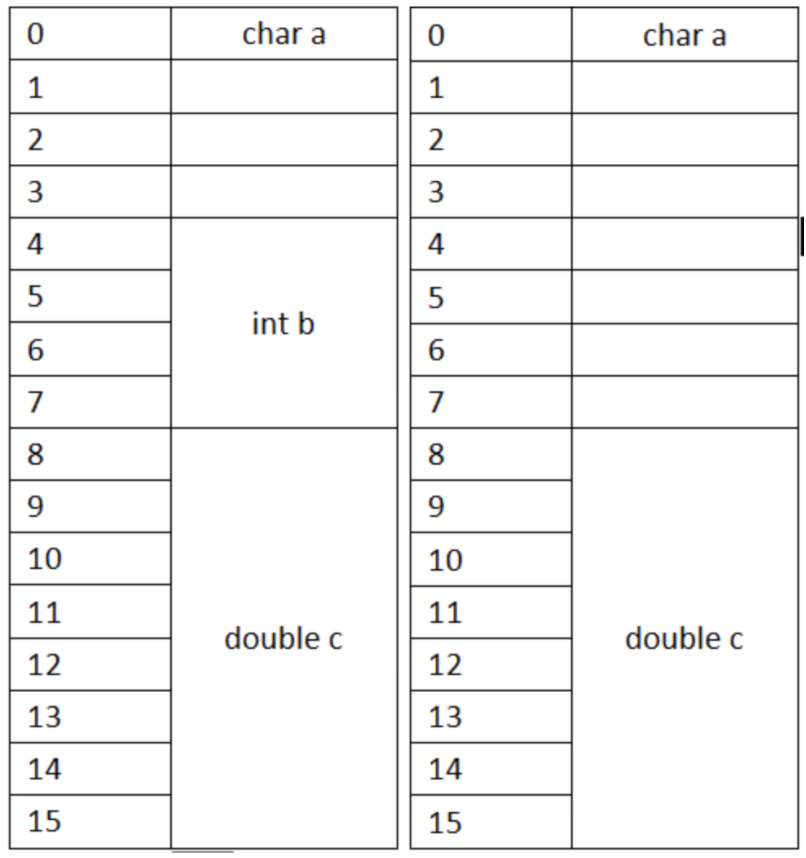
</div>


而且，double b之前空着的内存，在对齐下原则可以随意增加变量，内存是不会增加的。如下图：

<div align="center">
    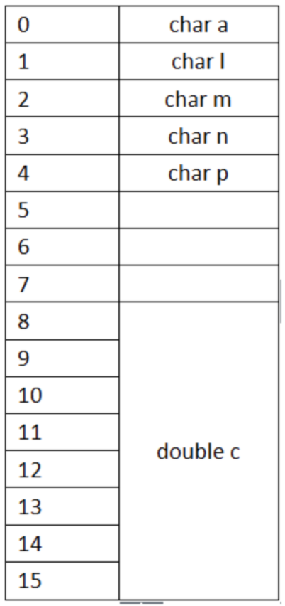
</div>

#### 补齐原则

当定义结构体为：

```c++
struct number_4
{
    char a;
    int b;
    char c;
}st4;
```

> sizeof(st4)=12,而不是4+4+1=9。

这时候就牵扯到一个补齐原则：

**在经过对齐原则分析后，检查计算出的存储单元是否为所有元素中所占内存最大的元素的长度的整数倍，是，则结束；若不是，则补齐为它的整数倍。**

即，当4+4+1=9不是结构体中内存最大元素b的整数倍时，要补齐成其整数倍12。如下图左所示，如果将int换成double，sizeof(st4)=24为最大元素double的整数倍了。如下图右所示：

<div align="center">
    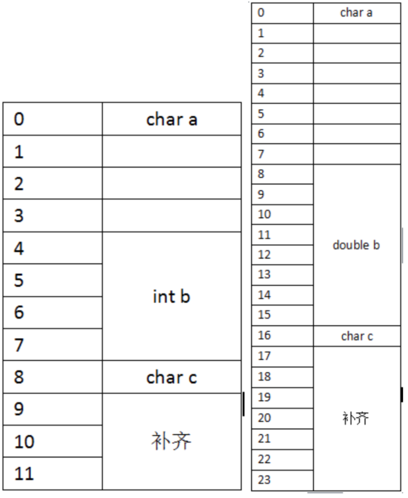
</div>


---

### 22.C++类的对象存储空间？

对于类实例化一个对象，我们要计算这个对象所占的存储空间大小，其存储空间大小计算为（权威解答）：

+ **非静态成员变量总和；**
+ 加上 **编译器为CPU计算做出的数据对齐处理；**
+ 加上 **支持虚函数所产生的负担的总和。**

以上三种的加和即为当前对象的占有的存储空间的大小。

#### 代码实验

```c++
class Test {
};
int main() {
    Test test0;
    cout << sizeof(test0) << endl;
}
```

> 输出为：1
>
> 空类，没有任何成员变量和成员函数，编译器是支持空类实例化对象的，对象必须要被分配内存空间才有意义，这里编译器默认分配了 1Byte 内存空间(不同的编译器可能不同)

```c++
class Test {
private:
    int i;
    char c;
    double d;
};
int main() {
    Test test1;
    cout << sizeof(test1) << endl;
}
// 输出为：16

class A{};
class Test {
private:
    int i;
    char c;
    double d;
    A a;
};
int main() {
    Test test2;
    cout << sizeof(test2) << endl;
}
//输出为：24

class A {
private:
    double dd;
    int ii;
    int* pp;
};
class Test {
private:
    int i;
    A a;
    double d;
    char* p;
};
int main() {
  	A a;
    Test test3;
    cout << sizeof(test3) << endl;
  	cout << sizeof(a) << endl;
    cout << sizeof(test1.pp) << endl;
}
//输出为：
//48
//24
//8
```

> - 这里的类的内存对齐原则与前面写的结构体的内存对齐原则是一样的(不太了解的可以移步我之前的《C/C++中内存对齐问题的一些理解》查看)
> - 测试三中，32bit 目标平台寻址空间是 4Byte(32bit)，所以指针是 4Byte的；64bit 目标平台寻址空间是 8Byte(64bit)，所以指针是 8Byte
> - 另外，静态成员变量是在编译阶段就在静态区分配好内存的，所以静态成员变量的内存大小不计入类空间

```c++
class A {
public:
    int n;
    char c;
    short s;
};
class Test {
public:
    Test() {
    }
    int func0() {
        return n;
    }
    friend int func1();

    int func2() const {
        return s;
    }
    inline void func3() {
        cout << "inline function" << endl;
    }
    static void func4() {
        cout << "static function" << endl;
    }
    virtual void func5() {
        cout << "virtual function" << endl;
    }
    ~Test() {
    }

private:
    int n;
    char c;
    short s;
};

int func1() {
    Test t;
    return t.c;
}
int main() {
  	A a;
    Test test4;
    cout << sizeof(test4) << endl;
  	cout << sizeof(a) << endl;
    cout << sizeof(test1.n) << endl;
  	cout << sizeof(test1.c) << endl;
  	cout << sizeof(test1.s) << endl;
}
//输出:
//16
//8
//4
//1
//2
```

> - 因 C++中成员函数和非成员函数都是存放在代码区的，故类中一般成员函数、友元函数，内联函数还是静态成员函数都不计入类的内存空间，测试一和测试二对比可证明这一点
> - 测试三中，因出现了虚函数，故类要维护一个指向虚函数表的指针，分别在 x86目标平台和x64目标平台下编译运行的结果可证明这一点，x64下虚函数表占了8字节

---

### 23.C++有哪几种的构造函数

C++中的构造函数可以分为4类：

- **默认构造函数**
- **初始化构造函数（有参数）**
- **拷贝构造函数**
- **移动构造函数（move和右值引用）**
- **委托构造函数**
- **转换构造函数**

举个例子：

```c++
#include <iostream>
using namespace std;

class Student{
public:
    Student(){//默认构造函数，没有参数
        this->age = 20;
        this->num = 1000;
    };  
    Student(int a, int n):age(a), num(n){}; //初始化构造函数，有参数和参数列表
    Student(const Student& s){//拷贝构造函数，这里与编译器生成的一致
        this->age = s.age;
        this->num = s.num;
    }; 
    Student(int r){   //转换构造函数,形参是其他类型变量，且只有一个形参
        this->age = r;
        this->num = 1002;
    };
  	Student(std::istream &is) : Student() {//委托构造函数，他委托给了默认构造函数。当这些受委托的构造函数执行完后，接着执行istream&构造函数体的内容。
      	read(is, *this);
    }
    ~Student(){}
public:
    int age;
    int num;
};

int main(){
    Student s1;
    Student s2(18,1001);
    int a = 10;
    Student s3(a);
    Student s4(s3);

    printf("s1 age:%d, num:%d\n", s1.age, s1.num);
    printf("s2 age:%d, num:%d\n", s2.age, s2.num);
    printf("s3 age:%d, num:%d\n", s3.age, s3.num);
    printf("s2 age:%d, num:%d\n", s4.age, s4.num);
    return 0;
}
//运行结果
//s1 age:20, num:1000
//s2 age:18, num:1001
//s3 age:10, num:1002
//s2 age:10, num:1002
```

- 默认构造函数和初始化构造函数在定义类的对象，完成对象的初始化工作
- 复制构造函数用于复制本类的对象
- 转换构造函数用于将其他类型的变量，隐式转换为本类对象

> 《浅谈C++中的几种构造函数》：https://blog.csdn.net/zxc024000/article/details/51153743

---

### 24.有关友元

- 类通过增加friend关键字在函数开头进行声明来将其作为友元，这样就允许函数访问自己的非公有成员。
- 友元声明只能在类的内部，但是 **声明友元之外必须再专门对函数进行一次声明。**

```c++
class Sales_data{
    friend Sales_data add (const Sales_data&, const Sales_data&);
  	...
public:
    Sales_data() = default;
    ...

private:
    double avg_price () const
        { return unit_sold ? revenue/unit_sold : 0; }
    string bookNo;
    ...
};
Sales_data add (const Sales_data&, const Sales_data&);
```

- 当一个类指定了友元类，则友元类的成员函数可以访问此类包括非公有成员在内的所有成员。
- 友元不具有传递性。
- 也可以令成员函数作为友元。
- 当类想把一组重载函数声明成友元时，必须每一个都进行声明。

---

###  25.using 与 typedef

> 在用来定义类型的成员必须先定义后使用，这一点和普通成员变量有所区别。

#### typedef 

别名命名方式： `typedef std::string::size_type pos`

#### using

别名命名方式： `using pos = std::string::size_type`

---

### 26.类的静态成员

- 类的`静态成员`只与类本身相关，与其任何对象都无关。
  + 形式是在成员声明前加`static`关键字
  + 可以是public或private，类型可是常量、引用、指针、类类型等
  + 类的静态成员存在于任何对象之外，任何对象中都不包含与之相关的数据
  + 静态成员不与任何对象绑定，故不存在`this指针`。因此既不能在函数体内使用this指针，也不能被声明为const成员函数。
- 静态成员的定义：
  + `静态成员函数`可在类内或类外定义，在类外定义时不可重复static关键字，`static只出现在声明中`。
  + `静态数据成员`并非在创建类时被定义，因此`静态数据成员不由构造函数初始化`。
  + 不能在类内部初始化`静态数据成员`，`静态数据成员必须在类外定义和初始化`，一个静态数据成员只能被定义一次
  + 静态数据成员定义在任何函数之外，一旦被定义就存在于程序整个生命周期。
  + 为确保静态数据成员只被定义一次，最好将其定义与其他非内联函数的定义放在同一头文件
  + `静态成员函数可在类内和类外定义，静态数据成员只能在类外定义和初始化`
- 静态成员的访问方式：
  + 可用类的`作用域运算符`直接访问静态成员，也可用类的对象、引用、指针来访问静态成员
  + 成员函数不用通过作用域运算符就可访问静态成员

- 例子：声明、定义、访问静态成员

  ```c++
  //声明静态成员
  class Account{
  public:
      void calculate() {amount+=amount*interestRate;}
      static double rate() {return interestRate;} //静态成员函数，它可在类内也可在类外定义
      static void rate(double);                   //静态成员函数
  private:
      string owner;
      double amount;
      static double interestRate;                 //静态成员变量
      static double initRate();                   //静态成员函数
  };
  //定义静态成员
  void Account::rate(double newRate){         //定义静态成员函数，它可在类内也可在类外定义
      interestRate=newRate;
  }
  double Account::interestRate=initRate();    //定义静态成员变量，它只能在类外定义和初始化
  //访问静态成员
  double r;
  r=Account::rate();  //通过作用域访问
  Account ac1;
  Account *ac2=&ac1;
  r=ac1.rate();       //通过类引用访问
  r=ac2->rate();      //通过类指针访问
  ```

- 通常，类的静态数据成员不应在类内初始化。特例是，可为静态数据成员提供`const整型`的`类内初始值`，且该静态数据成员必须是`constexpr类型`，初值必须是常量表达式。它们可用到任何需要常量表达式的地方

- 例子：类内初始化的静态数据成员必须是字面值常量类型的constexpr

  ```c++
  class Account{
  public:
      static double rate(){return interestRate;}
      static void rate(double);
  private:
      static constexpr int period=30; //常量表达式
      double daily_tbl[period];       //可用于需要常量表达式的地方
  };
  ```

---

## 五.IO流

+ [IO类](https://github.com/ZYBO-o/C-plus-plus-Series/tree/main/IO%20library#%E4%B8%80io%E7%B1%BB)
  + [IO对象无拷贝或赋值](https://github.com/ZYBO-o/C-plus-plus-Series/tree/main/IO%20library#1io%E5%AF%B9%E8%B1%A1%E6%97%A0%E6%8B%B7%E8%B4%9D%E6%88%96%E8%B5%8B%E5%80%BC)
  + [条件状态](https://github.com/ZYBO-o/C-plus-plus-Series/tree/main/IO%20library#2%E6%9D%A1%E4%BB%B6%E7%8A%B6%E6%80%81)
  + [管理输出缓冲](https://github.com/ZYBO-o/C-plus-plus-Series/tree/main/IO%20library#3%E7%AE%A1%E7%90%86%E8%BE%93%E5%87%BA%E7%BC%93%E5%86%B2)
+ [二、文件输入输出](https://github.com/ZYBO-o/C-plus-plus-Series/tree/main/IO%20library#%E4%BA%8C%E6%96%87%E4%BB%B6%E8%BE%93%E5%85%A5%E8%BE%93%E5%87%BA)
  + [使用文件流对象](https://github.com/ZYBO-o/C-plus-plus-Series/tree/main/IO%20library#1%E4%BD%BF%E7%94%A8%E6%96%87%E4%BB%B6%E6%B5%81%E5%AF%B9%E8%B1%A1)
  + [文件模式](https://github.com/ZYBO-o/C-plus-plus-Series/tree/main/IO%20library#2%E6%96%87%E4%BB%B6%E6%A8%A1%E5%BC%8F)
+ [三、string流](https://github.com/ZYBO-o/C-plus-plus-Series/tree/main/IO%20library#%E4%B8%89string%E6%B5%81)
  + [使用istringstream](https://github.com/ZYBO-o/C-plus-plus-Series/tree/main/IO%20library#1%E4%BD%BF%E7%94%A8istringstream)
  + [使用ostringstream](https://github.com/ZYBO-o/C-plus-plus-Series/tree/main/IO%20library#2%E4%BD%BF%E7%94%A8ostringstream)

---

## 六.顺序容器

### 1.顺序容器类型

<div align = center></div>

- **线性表：**`string`和`vector`将元素存储在连续空间中，故通过下标的随机访问很快，在中间和头部插入/删除很慢——牵一发而动全身，在 **尾部** 添加元素很快，添加元素可能造成空间的重新分配和元素拷贝。
- **链表：**`list`（双向链表）和`forward_list`（单向链表）的设计目的是让任何位置的插入/删除都快速高效且不需重新分配内存。但不支持随机访问，为访问一个元素需要遍历整个链表。由于要存储指针，故内存开销大。
- **队列：**`deque`（双端队列）支持快速随机访问，且在中间插入/删除元素很慢，但 **两端** 插入/删除很快。
- **固定数组：** `array` 不允许扩张和收缩。

> `forward_list`和`array`是C++11新增的类型：
>
> - array和内置数组一样大小固定，但操作更安全
> - forward_list的设计目标是 **达到与最快的手写单向链表相当的性能** ，故没有size操作（计算和保存都要开销）

---

### 2.容器通用操作

<div align = center></div>

#### :bookmark: 迭代器

- 左闭右开的好处:
  - 若begin与end相等则范围为空，不等则begin指向范围中的第一个元素
  - 可使begin递增直到begin==end。以此条件做循环，可保证迭代器有效
- 迭代器存储方式是链表时最好不要用 `<` , `>` 操作符来进行比较。

```c++
#include<iostream>
#include <vector>
using namespace std;

vector<int>::iterator 
search_vec(vector<int>::iterator  beg, vector<int>::iterator end, int value)
{
    while (beg != end)
        if(*beg == value)
            return beg;
        else
            beg++;
    return end;
}

int main(){
    vector<int> Array {1,2,3,4,5,6,7,8,9};
    cout <<  search_vec(Array.begin(), Array.end(), 5) - Array.begin() << endl;
    return 0;
}
```

#### :bookmark_tabs: 定义与初始化

<div align = center></div>

- 将一个新容器创建为另一个容器的拷贝，方法有2种：
  - 直接拷贝整个容器：两容器的类型和元素类型都必须匹配
  - 拷贝一对迭代器指定的范围： **不要求容器类型相同，也不要求元素类型相同，只要求元素类型可转换。**  ==但不可用于array== 。可拷贝元素的子序列，新容器大小与迭代器范围的大小相同。

- 例子：将一个新容器创建为另一个容器的拷贝

```c++
list<string> authors={"Milton","Shakespeare","Austen"};
vector<const char *> articles={"a","an","the"};
list<string> list2(authors);      //对，类型匹配
deque<string> authList(authors);  //错，容器类型不匹配
vector<string> words(articles);   //错，元素类型不匹配
forward_list<string> words(articles.begin(),articles.end());//对，不需严格匹配
```

+ 对于Array数组：

  + array的大小也是类型的一部分，定义时模板参数包含元素类型和大小

  + 由于array大小固定，故只能用`=`赋值，不可用`assign`，也不可用花括号列表赋值。

  + array不可用普通的容器构造函数，因为它们都隐式确定大小。但可使用指定大小的构造函数

  + 可对array做列表初始化，列表长度须小于等于array大小，如果小于，则初始化靠前元素，剩下的被值初始化。

  + **与内置数组不同的是，array允许做整个容器的拷贝和赋值，要求两array大小和元素类型都一样才行。** 只是不能增减大小。

    ```c++
    array<int,10> ia1;                          //默认初始化
    array<int,10> ia2={0,1,2,3,4,5,6,7,8,9};    //列表初始化
    array<int,10> ia3={42};                     //剩下元素被初始化为0
    int digs[10]={0,1,2,3,4,5,6,7,8,9};
    int cpy[10]=digs;                           //错，内置数组不可拷贝/赋值。digs被转为指针
    array<int,10> digits={0,1,2,3,4,5,6,7,8,9};
    array<int,10> copy=digits;                  //对，只要大小和元素类型相同即可
    ```

#### :open_book: 赋值和交换

<div align = center></div>

- 赋值前两容器大小可不同，赋值后大小都等于右边容器的大小

- 赋值符`=`要求两侧容器类型和元素类型都相等，但`assign`不要求容器类型相同，只需要元素类型可转换即可

- `assign`用参数指定的元素替换该容器的所有元素。其参数可为：

  - 一对迭代器范围
  - 一个initializer_list（或花括号列表）
  - 一个大小和初值的组合

  ```c++
  list<string> names;
  vector<const char *> oldstyle;
  names=oldstyle;                                     //错，容器类型和元素类型不匹配
  names.assign(oldstyle.cbegin(),oldstyle.cend());    //对，只要元素类型可转换
  ```

+ `swap`交换两个相同类型容器的内容
+ **除array外，swap操作都不交换元素本身，只交换数据结构。因此都是`O(1)`时间。**
+ **对array做swap会真正交换元素，故是`O(n)`时间**
+ swap前后迭代器/指针/引用的变化：
  - 除string和array外，指向元素的迭代器/指针/引用，在swap后都指向原来的元素，但已经属于不同的容器了。例如：`it`指向`svec1[3]`，在进行`swap(svec1,svec2);`后，`it`指向`svec2[3]`，对`it`解引用得到的结果前后一致。
  - 对string使用swap导致之前的迭代器/指针/引用都失效
  - 对array使用swap导致之前的迭代器/指针/引用指向的元素不变，但值发生改变，即swap前后解引用得到的值不一致（因为真的交换了值）
+ C++11同时提供swap的成员版本和非成员版本，但在旧标准中只有成员版本。在泛型编程中多用非成员版本，即用`swap(a,b)`而不是`a.swap(b)`

#### :books: 大小操作

- 3个关于大小的成员函数：
  - `size`返回容器中元素的数目
  - `empty`当size为0时返回true，否则false
  - `max_size`返回一个大于等于该类型容器所能容纳的最大元素数量的值
- `forward_list`只支持`empty`和`max_size`，不支持`size`

---

### 3.顺序容器操作

#### :bookmark: 添加元素

> 除array外，所有标准库容器都可在运行时动态添加/删除元素以改变容器大小

<div align = center></div>

+ 在vector/string尾部之外的任何位置，或deque首尾之外的任何位置添加元素，都需要移动大量元素。且向vector/string添加元素可能引起整个容器存储空间重新分配

- `容器元素是拷贝`：用一个元素初始化容器，或把元素插入到容器中，都是拷贝。与原始对象互不影响。

- `push_back`：在尾部插入元素。除array和forward_list外，每个顺序容器都支持push_back

- `push_front`：在头部插入元素。list、forward_list、deque容器支持push_front

- `insert`：在任意位置插入0个/多个元素， **==插入在迭代器之前的位置==** 。vector、string、deque、list都支持insert。forward_list提供了特殊的insert

- vector/string虽不可用push_front，但可用insert在头部进行插入操作：`svec.inster(svec.begin(),"Hello")`。

- insert接受迭代器作为第一个参数，指定插入的位置，在该`迭代器之前`插入。在之前是为了考虑左闭右开区间。

  + **insert操作完成之后返回插入的第一个元素的迭代器。**

  + insert后面的参数指定可插入的值，有4种：

    - 给一个`值`
    - 给`个数和值`，插入多个该值
    - 给一对`迭代器范围`，将此范围内的迭代器插入。 **此范围不可来自被插入容器**
    - 给一个`initializer_list/花括号列表`

    ```c++
    list<string> lst;
    auto iter=lst.begin();
    while(cin>>word)
        iter=lst.insert(iter,word); //等价于反复调用push_front
    ```

- **<font color = red>C++11引入新成员`emplace_front`、`emplace_back`、`emplace`，分别对应`push_front`、`push_back`、`insert`。区别是`emplace`是在原地构造元素，而push/insert是拷贝元素</font>**

  + push/insert可能会创建局部的临时量，再将临时量拷贝到容器
  + 调用`emplace`时，它将参数传递给元素类型的构造函数，使用它们在容器的内存空间中直接构造元素。故`emplace的参数需对应到元素的构造函数参数`

  ```c++
  //在c的末尾构造一个Sales_data对象
  //使用三个参数的Sales_data构造函数
  c.emplace_back("12345678",25,15.99);
  //错误：没有接受三个参数的push_back版本
  c.push_back("12345678",25,15.99);
  //正确：创建一个临时的Sales_data对象传递给push_back
  c.push_back(Sales_data("12345678",25,15.99));
  ```

#### :bookmark_tabs: 访问元素

<div align = center></div>

+ 顺序容器都有`front`成员函数，除forward_list之外的顺序容器都有`back`成员函数。前者返回首元素的引用，后者返回尾元素的引用
+ front/end与begin/end的区别：
  - front/back返回引用，begin/end返回迭代器
  - front/back返回首元素和尾元素，begin/end返回首元素和尾后元素
  - 空元素求front/back是未定义，但可求begin/end且有begin==end

+ 访问元素的成员函数（`front`、`back`、`[]`、`at`）都返回`引用`。若要用auto，**<font color = red>记得将变量声明为引用，否则存在拷贝且不能修改容器。</font>**

  ```c++
  if(!c.empty())
  {
    	c.front() = 42;				//将42赋予c中第一个元素
    	auto &v = c.back();		//获得指向最后一个元素的引用
    	v = 1024;							//改变c中的元素
    	auto v2 = c.back();		//v2不是引用，只是拷贝
    	v2 = 0;								//不能改变c中的元素
  }
  ```

- 提供快速随机访问的容器（string、vector、deque、array）都支持下标运算符`[]`。
- 下标运算`[]`不检查下标是否在合法范围，但`at`成员函数在下标越界时抛出`out_of_range`异常

#### :open_book: 删除元素

<div align = center></div>

- `pop_front`和`pop_back`成员函数分别删除首元素和尾元素

  >  vector/string不支持push_front/pop_front ，forward_list不支持push_back/pop_back，但支持front操作。

- pop_front/pop_back返回void，若需要值，需在pop之前保存

- 不能对空容器做删除操作

- `erase`可从指定的任意位置删除元素，它有两个版本：

  - 接受一个迭代器，删除它指向的元素， **<font color = red>返回它之后位置的迭代器，与insert做好区别</font>**
  - 接受一个迭代器范围，删除**左闭右开区间内**的元素， **<font color = red>返回删除列表最后元素之后位置的迭代器</font>**

- 要删除容器的所有元素，可用`clear`，也可用begin/end调用`erase`

#### :books: 修改容器大小

<div align = center></div>

- 对于给定的目标大小，若比当前大小更小，则容器后面的元素都被删除，若比当前大小更大，则将`值初始化`的新元素添加到容器尾部。
- 如果容器保存的是类类型，且resize向容器中添加新元素，则必须提供初始值，或者元素类型必须提供一个默认构造函数。

#### :blue_book: 特殊的forward_list操作

> 当添加或删除元素时，需要访问它的前驱，以便改变前驱的链接。
>
> 但是forward_list是单向链表，没有简单的方法来获得元素的前驱。所以添加或删除操作是通过改变给定元素之后的元素来完成的。

<div align = center></div>

- 对forward_list（单向链表）的元素做插入/删除，需要知道其`前驱`。

- forward_list定义了`before_begin`迭代器，它指向首元素之前，称为`首前迭代器`

- forward_list的插入/删除改变的不是指定元素，而是指定元素之后的一个元素

- **使用forward_list时需关注两个元素：我们要处理的元素，和它的前驱**

  ```c++
  forward_list<int> flst={0,1,2,3,4,5,6,7,8,9};
  auto prev=flst.before_begin();          //要处理的元素的前驱
  auto curr=flst.begin();                 //要处理的元素
  while(curr!=flst.end()){
      if(*curr%2)
          curr=flst.erase_after(prev);    //删除curr，返回要处理的元素的下一个迭代器，作为下一轮循环要处理的元素
      else{
          prev=curr;                      //更新前驱
          ++curr;                         //更新要处理的元素的迭代器
      }
  }
  ```

---

### 4.哪些容器操作会使迭代器失效

> 向容器中添加/删除元素可能使指向元素的指针/引用/迭代器失效

**:large_blue_diamond: 添加元素后：**

- `vector/string`：若空间被重新分配，则所有指针/引用/迭代器失效。若空间未重新分配，则插入位置的之后的指针/引用/迭代器都失效
- `deque`：插入首尾之外的任何位置都使所有指针/引用/迭代器失效。在首尾插入时，迭代器失效，指向元素的指针/引用不失效
- `list/forward_list`：所有指针/引用/迭代器仍有效

**:large_blue_diamond: 删除元素后：**

- 指向被删除元素的指针/引用/迭代器一定失效
- `vector/string`：删除位置的之后的指针/引用/迭代器都失效。特别是，删除任何元素时，尾后迭代器一定失效
- `deque`：删除首尾之外的任何位置都使所有指针/引用/迭代器失效。删除首元素无影响，删除尾元素使尾后迭代器失效
- `list/forward_list`：除被删除元素之外的所有指针/引用/迭代器仍有效

**:diamond_shape_with_a_dot_inside: 最佳实践：**

-  **最小化要求迭代器有效的程序片段**
-  **保证每次改变容器的操作后都更新迭代器**
-  **不要保存尾后迭代器，每次需要时都用end重新取**

```c++
vector<int> vi={0,1,2,3,4,5,6,7,8,9};
auto iter=vi.begin();
while(iter!=vi.end()){
    if(*iter%2){
        iter=vi.insert(iter,*iter); //复制奇数元素，迭代器实时更新
        iter+=2;
    }
    else
        iter=vi.erase(iter);        //删除偶数元素，迭代器实时更新
}
```

---

### 5.vector对象是如何扩容的？

<div align = center></div>

<div align = center></div>

- `capacity`操作告诉我们容器在不扩张内存时最多还能容纳多少元素
- `reserve`操作允许通知容器它至少需要容纳多少元素
  + reserve不改变元素的数量，即不改变`size`，只影响预分配的内存
  + 传给reserve的值小于等于当前capacity时，reserve什么都不做。特别是，小于时不会退回空间
  + 传给reserve的值大于当前capacity时，reserve扩张容量，至少分配与要求容量一样大的空间，可能更大
- 改变容器大小的`resize`方法只改变元素数量，不影响capacity
- `shrink_to_fit`是C++11的方法，它可要求vector/string/deque退回多余的空间，但具体实现可忽略此要求。即，不保证能退回。
-  **<font color = red>vector采用的`内存扩张策略`一般是：在每次需要分配新空间时，将当前容量翻倍。</font>** 但具体实现可使用不同策略

```c++
vector<int> Array ;
//size应该为0，capacity的值依赖于具体实现
cout << "Array size : " << Array.size() << " capacity : " << Array.capacity() << endl;

//向Array容器中添加24个元素
for (vector<int>::size_type num= 0;  num < 24; num++) 
		Array.push_back(num);
cout << "Array size : " << Array.size() << " capacity : " << Array.capacity() << endl;

//对Array容器调整到25
 Array.resize(25);
 cout << "Array size : " << Array.size() << " capacity : " << Array.capacity() << endl;

//预分配的内存修改为50
Array.reserve(50);
cout << "Array size : " << Array.size() << " capacity : " << Array.capacity() << endl;

//向剩余内存中填值
while (Array.size() != Array.capacity())
		Array.push_back(0);
cout << "Array size : " << Array.size() << " capacity : " << Array.capacity() << endl;

//再一次填入值
Array.push_back(51);
cout << "Array size : " << Array.size() << " capacity : " << Array.capacity() << endl;

//进行调整，capacity()减少成size()大小
Array.shrink_to_fit();
cout << "Array size : " << Array.size() << " capacity : " << Array.capacity() << endl;
//****************输出内容*****************
Array size : 0 capacity : 0
Array size : 24 capacity : 32
Array size : 25 capacity : 32
Array size : 25 capacity : 50
Array size : 50 capacity : 50
Array size : 51 capacity : 100
Array size : 51 capacity : 51
```


### 6.string操作

#### :bookmark: 构造方法

> string 有三个构造方法

<div align = center></div>

- **使用`const char \*`构造string时，字符数组必须以空字符`\0`结尾，用于停止拷贝**。但若给定拷贝大小的计数值，则只需不越界，不需空字符结尾。

```c++
const char *cp = "Hello world";
char noNull[] = {'H','O'};

string string1(cp);
cout << string1 << endl;

string string2(noNull, 2);
cout << string2 << endl;

//未定义：noNull不是空字符结尾的
string string3(noNull, 3);
cout << string3 << endl;

//字符串类型和string类型的对比
/*字符串，所以是字符串的前三个*/
string string4(cp, 3);
cout << string4 << endl;
/*string类，所以是从第三个开始*/
string string5(string1, 3);
cout << string5 << endl;

string string6(string1, 3, 20);
cout << string6 << endl;

//******************输出结果********************
Hello world
HO
HOD
Hel
lo world
lo world
```

+ `substri`操作（表9.12）返回string，其值是原始string的一部分或全部的拷贝。可传递可选的起始位置和计数值。

  <div align = center></div>

#### :bookmark_tabs: 修改操作

<div align = center></div>

- string的`insert/erase`可接受下标，用于指定insert到指定值之前的位置，或是开始删除的位置。

- string的`inset/assign`可接受C风格字符串

- 可将来自其他string或子串的字符串插入到当前string或给其赋值。

  ```c++
  string s("hello world");
  s.insert(s.size(),5,'!');   //s末尾插入5个'!'
  s.erase(s.size()-5,5)       //删除最后5个字符
    
  const char *cp="Stately, plump Buck";
  s.assign(cp,7);             //s=="Stately"
  s.insert(s.size(),cp+7);    //s=="Stately, plump Buck"
  
  string s="some string", s2="some other string";
  s.insert(0,s2);             //s位置0之前插入s2的拷贝
  s.insert(0,s2,0,s2.size()); //s位置0之前插入s2位置0开始的s2.size()个字符
  ```

- `append`是在string末尾插入的简写

- `replace`是调用erase和insert的组合

  ```c++
  string s("C++ Primer"), s2=s;
  s.insert(s.size()," 4th Ed.");  //s=="C++ Primer 4th Ed."
  s2.append(" 4th Ed.");          //等价于上一行
  s.erase(11,3);                  //s=="C++ Primer  Ed."
  s.insert(11,"5th");             //s=="C++ Primer 5th Ed."
  s2.replace(11,3,"5th");         //s2=="C++ Primer 5th Ed."，等价于上两行
  s.replace(11,3,"Fifth");        //s=="C++ Primer Fifth Ed."
  ```

#### :open_book:  搜索操作

<div align = center></div>

- 每个搜索操作都返回`string::size_type`类型值，表示匹配位置的下标。

- 若搜索失败，即无匹配，则返回名为`string::npos`的static成员，它是`string::size_type`类型且初始化为`-1`，即string最大的可能大小

  > + `string::size_type`是无符号类型，不可与int等有符号混用
  >
  > - 搜索操作都是大小写敏感

#### :books: 比较操作

<div align = center></div>

> `compare`函数类似C语言中的`strcmp`，根据源字符串等于、大于、小于给定的字符串，compare成员函数返回0、正数、负数

#### :blue_book: 数值转换

<div align = center></div>

- 要将string转为数值，必须保证string中的第一个非空白字符是该数值类型中可能出现的字符，例如正负号、数字等，也可是`0x`或`0X`表示的十六进制数（此时string中可包含字母）。对于浮点类型，可以小数点`.`开头，并可包含`e`或`E`指定指数部分。
- 如string不能转为指定的数值类型，这些函数抛出`invalid_argument`异常
- 如转换得到的数值无法用任何类型表示，则抛出`out_of_range`异常

### 7.容器适配器

> `适配器`是一种机制，能使某种事物的行为看起来像另一种事物。一个`容器适配器`接受一种已有的容器类型，使其看起来像另一种不同类型

<div align = center></div>

- 每个适配器都有两个构造函数：
  - 默认构造函数，创建空对象
  - 接受一个容器，拷贝该容器来初始化适配器
- 默认情况下，`stack`和`queue`基于deque实现，`priority_queue`基于vector实现。也可在创建时在模板参数里指定一个顺序容器来重载默认容器类型

- 对适配器的容器类型有限制：
  - 不能基于array，因为要添加/删除元素
  - 不能基于forward_list，因为要访问尾元素
  - `stack`要求`back`、`push_back`、`pop_back`操作，故可构建于除array/forward_list外的所有容器
  - `queue`要求`back`、`push_back`、`front`、`push_front`，故可构建于list/deque，不可基于vector
  - `priority_queue`要求`front`、`push_back`、`pop_back`、`随机访问`，故可构建于vector/deque，不能基于list

#### :bookmark: 栈

>  stack定义于`stack头文件`中，其特有操作如下表

<div align = center></div>

#### :bookmark_tabs: 队列

>  queue和priority_queue定义于`queue头文件`中，其特有操作如下表

<div align = center></div>

+ priority_queue允许为队列中的元素建立优先级，新加入的元素会排在所有优先级比它低的已有元素之前。默认情况下使用元素类型的`<`运算符来确定优先级


## 七.泛型算法

### 1.什么是泛型算法

标准库未给容器添加大量功能，而是提供一组独立于容器的`泛型算法`：

- `算法`：它们实现了一些经典算法的公共接口
- `泛型`：它们可用于不同类型的容器和不同类型的元素
- `输入范围`：大多标准库算法都对一个范围内的元素操作，这个范围称为输入范围。接受输入范围的算法总是用前两个参数来表示输入范围。

利用这些算法可实现容器基本操作很难做到的事，例如查找/替换/删除特定值、重排顺序等，标准库算法不直接操作容器，而是遍历迭代器范围。指针就像内置数组上的迭代器，故泛型算法也可操作内置数组和指针

### 2.只读算法

> - `只读算法`只读取输入范围的元素，不改变它们。使用只读算法，最好用cbegin/cend

#### `find`算法

- 作用：将范围中每一个元素与给定值比较，**返回第一个等于给定值的元素的迭代器，如果没有匹配则返回该范围的尾后迭代器。**
- 用法：有3个参数，前2个是输入范围，第3个是给定值。
- 实现：调用给定值类型的`==`算符来比较。

```c++
vector<int> Array {1,2,3,4,5,6,7,8,9};
int value = 6;
auto result = find(Array.cbegin(), Array.cend(), value);
cout << "The value " << value << (result == Array.cend() ? " is not present !" : " is present !") << endl;
//The value 6 is present !
int ia[] = {27, 101, 12, 47, 81};
int val = 12;
auto res = find(begin(ia), end(ia), val);
cout << *res << endl;//12
```

#### `count` 算法

- 作用：将范围中每一个元素与给定值比较，返回给定值在范围中出现的次数。
- 用法：有3个参数，前2个是输入范围，第3个是给定值。
- 实现：调用给定值类型的`==`算符来比较。

#### `accumulate`算法

>  定义于`numeric`

- 作用：对范围中元素求和，再加上给定值，返回求值结果。
- 用法：有3个参数，前2个是输入范围，第3个是给定值。
- 实现：调用给定值类型的`+`算符来求和。

```c++
vector<string> v={"hello","world"};
string sum=accumulate(v.cbegin(),v.cend(),"OK");          //错，const char *类型未定义+算符
string sum=accumulate(v.cbegin(),v.cend(),string(""));  //对，string上定义了+算符
//sum:helloworld
```

#### `equal`算法

- 作用：将第一个序列中的每个元素与第二个序列中的对应元素进行比较，如果对应元素都相等，则返回true；否则返回false。
- 用法：有3个参数，前2个是第一个序列的输入范围，第3个是第二个范围的首迭代器。
- 实现：调用`==`算符来比较，元素类型不必严格一致。

> string类重载了==，可以比较两个字符串是否长度相等且元素对位相等。
>
> c风格字符串本质是char* 类型，用==比较两个char* 对象，只是检查两个指针值是否相等，即地址是否相等。

```c++
vector<string> string1={"hello","world"};
list<const char *> string2 = {"hello","world","OK"};
cout << equal(string1.cbegin(), string1.cend(), string2.cbegin()) << endl;
//输出为true
```

> - 算法要求的是两个序列中的元素，所以元素类型不要求相同，但是必须能够使用`==`来进行比较两个序列中的元素。

### 3.写容器的算法

> 可对序列中元素重新赋值，要求原序列大小不小于要写入的元素数目。算法不执行容器操作，故不可改变序列大小

#### `fill`算法

- 作用：用给定值填满输入范围
- 用法：有3个参数，前2个是输入范围，第3个是给定值。

```c++
vector<string> string1(10);
fill(string1.begin(), string1.end(), "0");
```

#### `fill_n`算法

- 作用：用给定值填满长为n的区间
- 用法：有3个参数，第1个代表序列起始的迭代器，第2个是序列长度的计数值，第3个是填入的给定值。

- fill_n假定长为n的空间总是有效的，类似指针运算。算法不会改变容器的大小。

  > **不能在空容器上调用fill_n，或者类似的写元素的算法，因为是空的，这条语句的结果是未定义的。**

 ```c++
 vector<int> vec;                    //空vector
 //fill_n(vec.begin(),10,0);         //错，算法不可向空vector写值
 ```

#### `back_inserter`函数

> `back_inserter`函数定义于`iterator`头文件中

**`back_inserter`函数接受一个指向容器的引用，返回该容器的一个插入迭代器。通过此迭代器赋值时，赋值符会调用容器类型的`push_back`来添加元素**

```c++
vector<int> vec;                    //空vector   
fill_n(back_inserter(vec),10,0);    //back_inserter创建一个插入迭代器，可用来向vec添加元素
```

> 在每步迭代中，fill_n向给定序列的一个元素赋值。由于传递的参数是back_inserter返回的迭代器，因此每次赋值都会在vec上调用push_back。最终，fill_n调用语句向vec的末尾添加了10个元素，每个元素的值都是0.

#### `copy`算法

- 作用：将输入范围的值拷贝到目标序列，返回目标序列的尾后迭代器

- 用法：有3个参数，前2个是输入范围，第3个是目标序列的起始位置

  > 传递给copy的目的序列至少要包含与输入序列一样多的元素

```c++
int array1[] {1,2,3,4,5,6,7,8,9};
int array2[sizeof(array1)/sizeof(*array1)];
auto ret = copy(begin(a1),end(a1),a2);//把a1的内容拷贝给a2
//ret的值是指向a2尾元素之后的位置
```

#### `replace`算法

- 作用：将序列中所有等于给定值的元素换为另一个值
- 用法：有4个参数，前2个是输入范围，后2个分别是要搜索的值和新值

#### `replace_copy`算法

- 作用：将序列中所有等于给定值的元素换为另一个值，放入新序列，原序列不变。
- 用法：有5个参数，前2个是输入范围，第3个是输出序列的首迭代器，最后2个分别是要搜索的值和新值

```c++
list<int> ilst={0,1,2,3,4};
vector<int> ivec;
//原址版本，将ilst中的0都替换为42
replace(ilst.begin(),ilst.end(),0,42);                              
//ilst:42 1 2 3 4 
//copy版本，将ilst中的0替换为42后插入ivec，ilst不变
replace_copy(ilst.cbegin(),ilst.cend(),back_inserter(ivec),42,1);   
//ilst:42 1 2 3 4 
//ivec:1 1 2 3 4 
```

### 4.重排容器元素的算法

#### `sort`算法

- 作用：重排输入序列的元素使其有序
- 用法：有2个参数，是输入范围
- 实现：调用序列元素类型的`<`算符

#### `unique`算法

- 作用：重排输入序列，消除相邻重复项。返回消除后的无相邻重复值的范围的尾后迭代器
- 用法：有2个参数，是输入范围

+ **<font color = red>unique不真正删除元素，只是将后面的不重复值前移来覆盖前面的重复值，使不重复值在序列前部。</font>**尾部（返回迭代器之后）的元素值是未定义。

> 真正删除元素需要使用容器操作

```c++
//将输入vector中的string元素重排并消除重复
void elimDups(vector<string> &words){
    sort(words.begin(),words.end());                    //将元素排序，使重复项相邻
    auto end_unique=unique(words.begin(),words.end());  //将不重复元素集中到序列前端，返回不重复元素序列的尾后迭代器
    words.erase(end_unique,words.end());                //擦除不重复序列之后的元素
}
```

#### 向算法传递参数

`谓词`：是一个可调用的表达式，其返回值可用作条件（即true/false）。按照参数的数量分为`一元谓词`和`二元谓词`

```c++
//定义了一个谓词，然后就可将该谓词传递给算法sort，sort就会用该算法代替之前的<运算符比较两个元素
//之前的排序用默认的<运算对两个元素的大小进行比较后决定两个元素的次序的
//现在用的谓词是通过比较两个元素的长度大小来决定两个元素的次序的，于是最终结果将是按元素长度进行排序
bool IsShorter(const string& s1, const string& s2){
	return s1.size() < s2.size();
}
```

重写上一节的函数：

```c++
void elimDups(vector<string> &words){
    //按照字典序排序words,以便查找重复单词
    sort(words.begin(), words.end());
    //unique重排输入范围，使得每个单词只出现一次
    //排序在范围的前部，返回指向不重复区域之后的一个位置的迭代器
    auto end_unique = unique(words.begin(), words.end());
    //使用向量操作erase删除重复单词
    words.erase(end_unique, words.end());
}
bool isShorter(const string &s1, const string &s2){
    return s1.size() < s2.size();
}

int main(){
    vector<string> words {"fox", "jumps", "the", "over", "turtle", "quick", "red", "red", "slow", "the"};
    //将Words按字典序排序，并消除重复单词
    elimDups(words);
    for (const auto &s : words)
        cout << s << " ";
    cout << endl;
    //按长度重新排序，长度相同的单词维持字典序
    stable_sort(words.begin(), words.end(), isShorter);
    for (const auto &s : words) 
        cout << s << " ";
    cout << endl;
    return 0;
}
```

### 5.Lambda

#### lambda定义

- `lambda表达式`：是一个可调用的代码单元，即一个未命名的`内联函数`。它有捕获列表、返回类型、形参列表、函数体，但可定义在函数内部（函数不可）

- lambda表达式形式:

  ```c++
  [capture list](parameter list) -> return type {function body}
  ```

  - capture list是`捕获列表`，是lambda所在函数中定义的局部变量的列表
  - parameter list、return type、function body与函数一样
  - lambda必须用`尾置返回`
  - 可忽略形参列表和返回类型，但必须有捕获列表和函数体
  - 若函数体不是单一return语句，则必须指定返回类型（否则为void）

- 可用变量定义的形式定义lambda，用函数调用的方式使用lambda

  ```c++
  auto f=[]{return 42;};
  cout<<f()<<endl; //用调用算符使用lambda
  ```

#### 向lambda传递参数

- 调用lambda时用实参初始化形参的方式和函数相同，但`lambda不可有默认实参`

- lambda将局部变量包含在捕获列表中来访问它们，只有被捕获到的局部变量才可在函数体中被使用。但只有`局部非static变量`才需要捕获，`lambda可直接使用定义在当前函数之外的名字和局部static变量`

  ```c++
  [sz](const string &a){
    return a.size() > sz;
  }
  ```

- `for_each` 算法：

  - 作用：对输入范围的每个元素调用给定的可调用对象
  - 用法：有3个参数，前2个是输入范围，第3个是可调用对象

- 例子：计数并按字典序打印长度>=给定值的字符串

  ```c++
  void elimDups(vector<string> &words){
      sort(words.begin(), words.end());
      auto end_unique = unique(words.begin(), words.end());
      words.erase(end_unique, words.end());
  }
  //计数并按字典序打印vector<string>中长度>=给定值的sz
  void biggies(vector<string> &words, vector<string>::size_type sz){
      //按字典排序并消除重复
      elimDups(words);
      //对字符串长度做稳定排序，长度相同的单词维持字典序
      //用lambda做二元谓词比较两元素
      stable_sort(words.begin(),words.end(),
                  [](const string &a, const string &b){return a.size()<b.size();});
      //找到第一个长度>=sz的元素
      //用lambda做一元谓词比较元素和变量
      auto wc=find_if(words.begin(),words.end(), [sz](const string &a){return a.size()>=sz;});
      //计算长度>=sz的元素数目
      auto count=words.end()-wc;
      cout<<count<<" "<< ((count>1)?("words"):("word") ) <<" of length "<<sz<<" or longer" <<endl;
      //打印长度>=sz的元素，每个元素后接一个空格
      //用lambda遍历元素
      for_each(wc,words.end(),
               [](const string &s){cout<<s<<" ";});
      cout<<endl;
  }
  int main(){
      vector<string> words {"fox", "jumps", "the", "over", "turtle", "quick", "red", "red", "slow", "the"};
      biggies(words,4);
  }
  ```

#### lambda捕获和返回

- `lambda实际是匿名类`：定义lambda时，编译器生成一个与其对应的未命名的类类型

- 向函数传递lambda时，同时定义了一个新类型和该类型的一个对象，传递的参数就是该对象。用auto定义一个lambda初始化的变量时，该变量也是这种对象。从lambda生成的类都有一个数据成员对应捕获到的变量。lambda的数据成员在创建时被初始化，即`被捕获的变量用于初始化lambda匿名对象的成员`

- lambda捕获变量的方式可用`值捕获`和`引用捕获`

  + `值捕获`存在拷贝，且值捕获的变量是在lambda创建（lambda对象构造）时被拷贝，而不是调用时拷贝，故创建lambda后修改捕获变量不影响lambda中的值。

  + 使用`引用捕获`时必须确保lambda执行时被捕获变量存在。例如，从函数中返回lambda时不可用引用捕获。最佳实践：尽量减少捕获的变量，且避免捕获指针/引用

  ```c++
  void fcn1(){
      size_t v=42;
      auto f1=[v]{return v;};     //值捕获，创建lambda（构造lambda对象）
      auto f2=[&v]{return v;};    //引用捕获，创建lambda（构造lambda对象）
      v=0;                        //改变捕获变量的值
      auto j1=f1();               //j1是42，因为lambda创建时保存了捕获变量的拷贝
      auto j2=f2();               //j2是0，因为lambda创建时未拷贝捕获变量，只是建立了引用
  }
  ```

  + `隐式捕获`：可让编译器根据lambda函数体中的代码来推断要捕获哪些变量。
    + 使用隐式捕获，需在捕获列表中写`&`或`=`，分别对应引用捕获和值捕获
    + 可混合使用隐式捕获和显式捕获，只需在捕获列表中写`&`或`=`，再写显式捕获的变量，要求：
      - 捕获列表第一个元素必须是`&`或`=`，指定默认为引用/值捕获
      - 显式捕获的变量必须使用与隐式捕获不同的方式。即隐式引用捕获，则显式必须为值捕获，反之亦然

  ```c++
  void print_strings(vector<strin> &words, ostream &os=cout, char c=' '){
      //c为显式值捕获，其他变量（os）为隐式引用捕获
      for_each(words.begin(),words.end(),
               [&,c](const string &s){os<<s<<c;});
      //os为显式引用捕获，其他变量（c）为隐式值捕获，等价于上一行
      for_each(words.begin(),words.end(),
               [=,&os](const string &s){os<<s<<c;});
  }
  ```

+ 若lambda函数体包含return之外的任何语句，则编译器推断它返回void，返回void的函数不能返回值，除非手动指定返回类型

  + `transform`算法：
    + 作用：对输入范围的每个元素调用可调用对象，将返回值依次写入目标序列
    + 用法：有4个参数，前2个是输入范围，第3个是目的序列的首迭代器，第4个是可调用对象

  + transform写入的目标序列和输入序列可以相同，即可以向原址写入

    > transform和for_each的区别：
    >
    > - transform可进行非原址写，for_each不可（除非在可调用对象内写非原址目标）
    > - transform通过可调用对象的返回值写入，for_each在可调用对象内部操作

  + 为lambda指定返回类型时，必须使用`尾置返回`

  ```c++
  vector<int> vi={0,1,2,3,4};
  transform(vi.begin(),vi.end(),vi.begin(),
            [](int i) {if(i<0) ? -i : i;});
  //错误,不能推断lambda的返回类型
  transform(vi.begin(),vi.end(),vi.begin(),
            [](int i) {if(i<0) return -i; else return i;}); 
  //使用尾置返回
  transform(vi.begin(),vi.end(),vi.begin(),
            [](int i)->int{if(i<0) return -i; else return i;}); //取绝对值
  ```

#### 参数绑定

> + 对于少数地方使用的简单操作用lambda，而多次调用时应该定义函数。
> + 但对于有捕获列表的lambda，很难用函数替换。因为不能在函数中定义函数，导致不能在不修改形参的前提下使用局部变量（例如标准库算法中的可调用对象，其形参必须固定）。
>
> 基于上述原因，提出了参数绑定。

##### 标准库bind函数

- 在`functional`头文件中定义了`bind`函数，可看作通用的函数适配器。它接受一个可调用对象，生成新的可调用对象来适应原对象的参数列表（即改变可调用对象的调用接口）

- 调用bind的形式为：

  ```c++
  auto newCallable = bind(callable,arg_list);
  ```

  - callable是可调用对象，arg_list是逗号分隔的参数列表，对应callable的参数
  - 调用newCallable时，是在用arg_list的参数调用callable
  - arg_list中的参数可包含占位符，即`_n`，其中`n`是传入newCallable的第n个参数

```c++
bool check_size(const string &s, string::size_type sz){
    return s.size() >= sz;
}

int main(){
    vector<string> words {"fox", "jumps", "the", "over", "turtle", "quick", "red", "red", "slow", "the"};
    auto wc = find_if(words.begin(), words.end(), bind(check_size, std::placeholders::_1, 4));
    cout << words.end() - wc << endl;
}
```

##### 绑定check_size的sz参数

- 使用`bind`生成一个调用`check_size`的对象。

```c++
bool check_size(const string &s, string::size_type sz){
    return s.size() >= sz;
}
int main(){
		auto check6 = bind(check_size,std::placeholders::_1,6);
		string s = "hello";
  	bool b1 = check6(s);
  	cout << b1 << endl;
}
```

> 此bind调用生成一个可调用对象，将 check_size 的第二个参数绑定到 sz 的值。当 find_if 对words中的string调用这个对象时，这些对象会调用 check_size ，将给定的string和sz传递给它。因此 find_if 可以有效的输入序列中每个string调用check_size，实现string大小和size的对比。

- 名字`_n`都定义于`placeholders`命名空间中，该命名空间又定义于`std`命名空间。同时，placeholders命名空间定义于`functional`头文件
- 使用`using namespace namespace_name`来说明希望所有来自namespace_name的名字都可在程序中直接使用

```c++
auto g=bind(f,a,b,_2,c,_1); //对g的定义，abc类似于lambda的捕获列表
g(X,Y);                   //调用g
f(a,b,Y,c,X);             //等价于调用f
```

##### 绑定引用参数

- 默认下，bind的非占位符参数被`拷贝`到可调用对象中，类似lambda中的`值捕获`
- 用`ref`函数可实现lambda中的`引用捕获`
- `ref`函数返回一个对象，该对象中包含输入的引用，且可拷贝。若需要包含const引用，则应用`cref`函数。ref和cref也定义于`functional`头文件中
- 例子：用bind和ref捕获引用

```c++
/* 上下文：os是局部变量，引用输出流；c是局部变量，类型为char */
//lambda实现，引用捕获输出流，值捕获字符
for_each(words.begin(),words.end(),
         [&os,c](cons string &s){os<<s<<c;});
//函数实现，要被标准库算法使用，需要用bind捕获os和c
ostream &print(ostream &os, const string &s, char c){
    return os<<s<<c;
}
//错，os不可拷贝，不能用默认方式bind
for_each(words.begin(),words.end(),
         bind(print,os,_1,' '));
//对，用ref返回的对象包含os引用且可拷贝
for_each(words.begin(),words.end(),
         bind(print,ref(os),_1,' '));
```

### 6.再探迭代器

- `iterator`头文件中定义了额外的迭代器：
  - `插入迭代器`：被绑定到一个容器，赋值时向容器中插入元素
  - `流迭代器`：绑定到输入输出流，用于遍历这个流
  - `反向迭代器`：向后而不是向前移动，除forward_list外的所有标准库容器都有反向迭代器
  - `移动迭代器`：不是拷贝元素，而是移动元素

####  插入迭代器

- `插入器`是一种`迭代器适配器`，它接受一个容器，生成一个迭代器，可通过该迭代器向容器添加元素。

- 通过插入迭代器赋值时，该迭代器调用对应的容器操作来向给定位置插入元素

- 插入迭代器支持的操作见表10.2

  <div align="center">  
    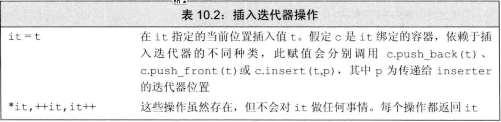 
  </div>

- 有3种插入迭代器，区别在于插入的位置：

  - `back_inserter`函数：创建一个使用`push_back`的迭代器。
  - `front_inserter`函数：创建一个使用`push_front`的迭代器。
  - `inserter`函数：创建一个使用`insert`的迭代器。它接受迭代器作为第二个参数来指定位置。使用返回的迭代器时，插入的元素在指定位置之前

- 只有容器本身支持push_back/push_front/insert，才可用back_inserter/front_inserter/inserter

- inserter等价于两步操作：先`insert`后`++`：

  ```c++
  auto it=inserter(c,iter);   //iter是it的初始位置
  *it=val;
  //上一行等价于下两行
  it=c.insert(it,val);        //先在it前插入，之后it指向插入元素。
  ++it;    
  ```

- 反复调用front_inserter插入元素的顺序与插入顺序相反，而back_inserter/inserter插入元素的顺序与插入顺序相同

  ```c++
  list<int> l1 {1,2,3,4};
  list<int> l2,l3;
  
  copy(l1.begin(),l1.end(),front_inserter(l2));
  
  copy(l1.begin(),l1.end(),inserter(l3,l3.begin()));
  
  for (int i : l2)
  	cout << i << " ";
  cout << endl;
  for (int i : l3)
  	cout << i << " ";
  cout << endl;
  //*********输出**********
  4 3 2 1 
  1 2 3 4 
  ```

- 插入迭代器的`*`和`++`算符不会对迭代器做任何事。

#### iostream迭代器

+ iostream类型不是容器，但也可用迭代器操作：

  - `istream_iterator`：读输入流
  - `ostream_iterator`：写输出流

  > 这些迭代器将它们对应的流当做一个特定类型的元素序列来处理。通过使用流迭代器，可以用泛型算法从流对象读取数据以及向他们写入数据。

##### istream_iterator操作

- 创建流迭代器时需在模板参数中指定读写类型，使用时调用该类型的`<<`、`>>`算符。流迭代器将其对应的流当作该类型的元素序列处理
- 创建istream_iterator时，可将其绑定到一个流。也可默认初始化为`尾后迭代器`。
- 对于绑定到流的迭代器，一旦关联的流遇到文件末尾或IO错误，则迭代器等于尾后迭代器
- 例子：使用istream_iterator

```c++
istream_iterator<int> in_iter(cin), eof;    //in_iter绑定到cin，eof作为输入流的尾后迭代器
//法1：先创建vector再依次读取数据、插入
vector<int> vec;
while(in_iter!=eof)
    vec.push_back(*in_iter++);              //用迭代器从cin中读数据
//法2：直接用输入流迭代器创建vector
vector<int> vec(in_iter,eof);               //等价于上面3行
```

- 标准库只保证在第一次解引用输入流迭代器之前完成从流中读数据的操作，而不一定在绑定时立即读取。如果从两个不同对象同步地读取一个流，或是创建流迭代器还未使用就销毁，则何时读取是重要的。
- istream_iterator的操作见表10.3

<div align="center">  
  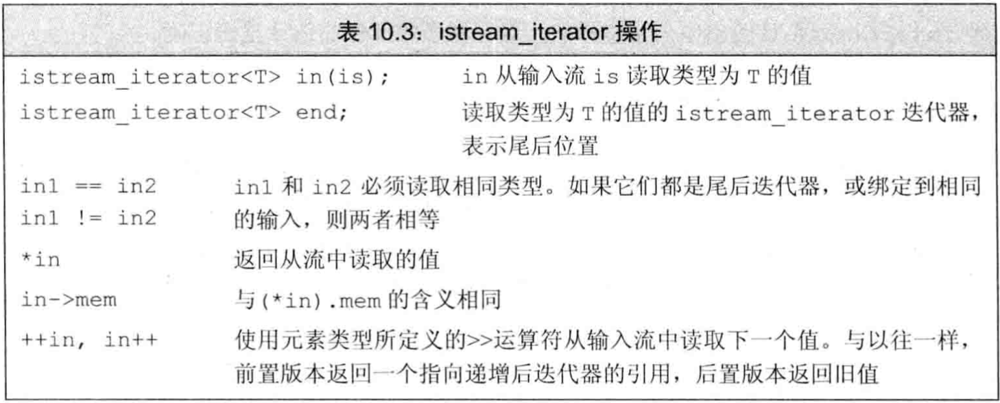 
</div>


- 例子：用算法操作流迭代器

```c++
istream_iterator<int> in(cin), eof;
cout<<accumulate(in,eof,0)<<endl;   //将输入序列读为int并累加输出
```

##### ostream_iterator操作

- 创建ostream_iterator时有可选的第二个参数，必须是C风格字符串，在输出每个元素之后都输出该字符串。
- ostream_iterator创建时必须绑定到流，不允许默认初始化
- ostream_iterator的`*`和`++`算符不会对迭代器做任何事，因为输出操作自动递增。
- ostream_iterator的操作见表10.4

<div align="center">  
  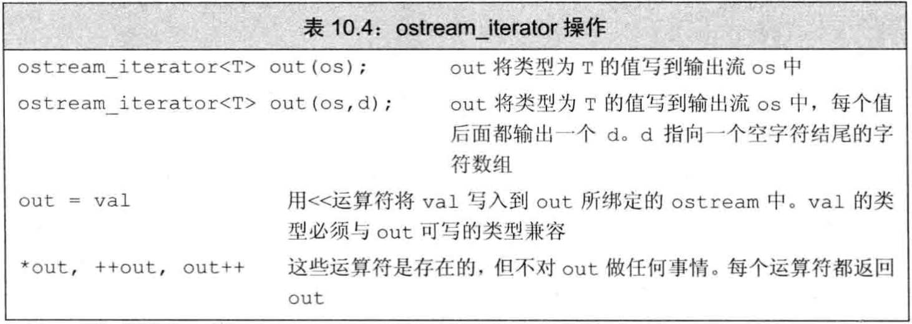 
</div>


- 例子：使用ostream_iterator

```c++
ostream_iterator<int> out_iter(cout," ");
//法1：显式写出解引用和递增
for (auto e:vec)
    *out_iter++=e;
//法2：流自动解引用和递增
for (auto e:vec)
    out_iter=e;
//法3：直接向流中拷贝
copy(vec.begin(),vec.end(),out_iter);
```

#### 反向迭代器

- `反向迭代器`：在容器中从尾元素向首前元素移动，`++`向后移动，`--`向前移动
- 除forward_list外的容器都有反向迭代器。可通过`rbgein`、`crbegin`、`rend`、`crend`函数来得到指向首前元素和尾元素的迭代器，如图10.1。

<div align="center">  
  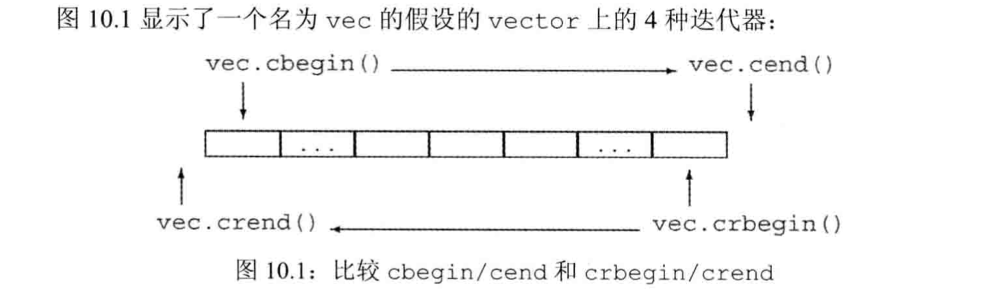 
</div>


- 反向迭代器的作用是让算法透明地向前或向后处理容器，例如向sort传递反向迭代器可反向排序而不需修改算法或算符
- 例子：用反向迭代器做反向排序

```c++
sort(vec.begin(),vec.end());    //递增序
sort(vec.rbegin(),vec.rend());  //递减序
```

- 反向迭代器只能从同时支持`++`和`--`的迭代器来产生。故`forward_list`和`流迭代器`都无反向迭代器

- 反向迭代器只能从同时支持`++`和`--`的迭代器来产生。故`forward_list`和`流迭代器`都无反向迭代器

- 反向迭代器的`base`成员函数返回它对应的正向迭代器。特别的，rbegin对应的正向迭代器是end，rend对应的正向迭代器是begin

- 反向迭代器比它对应的正向迭代器左偏一个位置，原因是左闭右开区间的特性。为了使`[rit1,rit2)`和`[rit1.base(),rit2.base())`表示的元素范围相同

  <div align="center">  
    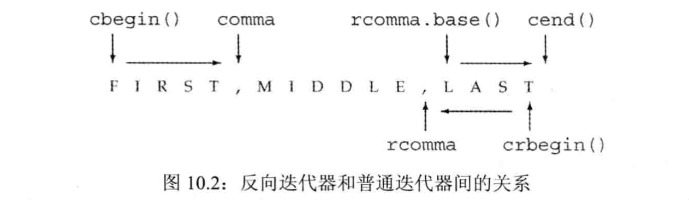 
  </div>

- 从正向迭代器初始化反向迭代器，或是给反向迭代器赋值时，结果迭代器与原迭代器指向的元素不相同。

- 例子：使用反向迭代器

```c++
string line="FIRST,MIDDLE,LAST";
//检测第一个','并打印
auto comma=find(line.cbegin(),line.cend(),',');     //检测第一个`,`
cout<<string(line.cbegin(),comma)<<endl;            //打印"FIRST"
//检测最后一个','并打印
auto rcomma=find(line.crbegin(),line.crend(),',');  //检测最后一个`,`，只需修改迭代器类型，不需修改算法
cout<<string(line.crbegin(),rcomma)<<endl;          //打印"TSAL"
cout<<string(rcomma.base(),line.cend())<<endl;      //打印"LAST"
```

>  上例中`[line.crbegin(),rcomma)`和`[rcomma.base(),line.cend())`表示的范围相同，只是方向相反


### 7.特定容器算法

- 链表类型 list 和 forward_list 定义了成员函数形式的算法，如`sor`t、`merge`、`remove`、`reverse`、`unuque`。
  - 通用sort要求随机访问，不可用于链表
  - 其他算法的通用版本可用于链表，但交换元素代价太高。链表可交换指针而不是交换元素，可提高性能。
- 对于链表类型list和forward_list，应优先使用成员函数版本的算法
- 表10.6是链表的成员函数版本的算法

<div align="center">  
  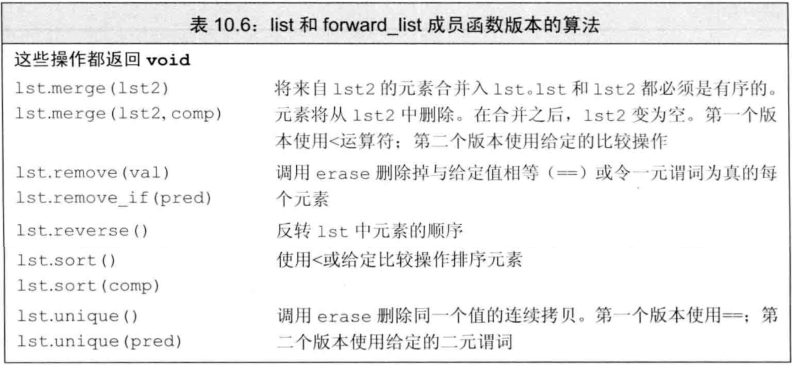 
</div>


- 链表类型特有的算法有`splice`，用于拼接链表，该算法没有通用版本
- 表10.7是链表splice的形参

<div align="center">  
  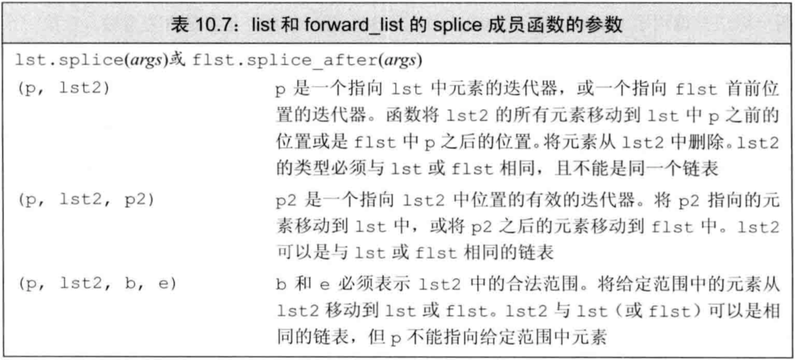 
</div>


- 链表特有算法与通用算法的一个区别是：链表特有的算法会改变底层容器，通用算法不会

## 八.关联容器

### 1.关联容器概述

- 定义关联容器的4种方法：

  - 关联容器都有`默认构造函数`，生成空容器
  - 可将关联容器初始化为另一个`同类型容器的拷贝`
  - 可用`元素范围初始化`关联容器，只要这些元素可转换为关联容器所需类型
  - C++11允许对关联容器使用值初始化（`列表初始化`）

- 对map做列表初始化时，每个元素也是一个花括号列表，其中包含两个值

  ```c++
  map<string, string> authors = {{"joyce", "james"},{"Austen","Jane"}};
  ```

- map和set的关键字必唯一，但multimap和multiset允许多个元素有相同关键字

### 2.pair类型

>  `pair`类型定义于`utility`头文件中，map中的元素是pair类型

- 一个pair保存两个public的数据成员，分别叫first和second
- pair是模板，创建时需在模板参数中指定两个数据成员的类型
- pair的默认构造函数对数据成员做`值初始化`

<div align = center></div>

- 可用`make_pair`函数和auto来创建pair，其类型由传入make_pair的实参（即pair的两个成员）推出

### 3.关联容器额外的类型别名

<div align = center></div>

- 对于set，其`key_type`和`value_type`都是元素类型，即关键字类型。它没有`mapped_type`
- 对于map，其`key_type`是关键字类型，`mapped_type`是值类型，`value_type`是key-value对的pair类型
- `不可改变关键字`，故关键字类型都是const：
  - set的`key_type`和`value_type`都是const
  - map的`key_type`和`value_type.first`都是const，`value_type`可以进行修改
- 使用这些类型别名时，需用作用域指明容器类型，例如`map<string,int>::key_type`

### 4.关联容器操作

#### 添加元素

<div align = center></div>

+ 对map进行insert的4种方法

```c++
word_count.insert({word,1});                                //花括号列表转为initializer_list
word_count.insert(make_pair(word,1));                       //make_pair函数生成pair
word_count.insert(pair<string,size_t>(word,1));             //显式构造pair
word_count.insert(map<string,size_t>::value_type(word,1));  //显式构造value_type
```

- 向set/map添加单一元素，则insert/emplace返回一个pair，其first为`迭代器`，second为`bool`。

  - 若关键字不在容器中，则插入。first指向插入的元素，second为true
  - 若关键字在容器中，则插入失败。first指向给定元素，second为false

- 向multiset/multimap添加单一元素，总是插入成功，insert/emplace返回一个`迭代器指向插入的元素`

- 例子：对map做insert

  ```c++
  ap<string,size_t> word_count;
  string word;
  while(cin>>word){
      //ret的类型是pair<map<string,size_t>::iterator,bool>
      auto ret=word_count.insert({word,1});   //尝试插入关键字和初始计数值1
      if(!ret.second)                         //如果插入失败，说明关键字已存在，只需将值递增
          ++ret.first->second;                //ret.first指向插入的元素，其second是值
  }
  ```

#### 删除元素

<div align = center></div>

>  传递给erase一个迭代器或者迭代器对来删除一个元素或者一个元素范围。指定元素被删除，函数范围void 。

- 关联容器的特殊erase操作：可提供一个关键字，删除与其相关的所有元素，并 **返回删除元素的数量** 。对于关键字不重复的容器， **erase总返回0或1**

#### 下标操作

- 下标操作只适用于关键字不可重复的map容器：
  - map和unordered_map都有下标算符和at函数
  - multimap和unordered_multimap都不支持下标，因为一个关键字可能有多个值
  - 所有的set类型都不支持下标，因为没有与关键字相关联的"值"
- map和unordered_map的下标操作如表11.6：

<div align = center></div>

- map/unordered_map下标接受一个关键字，访问与其关联的值。 **若关键字不在容器中，则创建元素插入容器，关联值进行`值初始化`。**

  ```c++
  map<string,size_t> word_count;
  word_count["Anna"]=1;
  /*上一行的操作步骤：
   *1、容器中搜索关键字"Anna"，未找到
   *2、创建新key-value对，key是const string，value被值初始化为0
   *3、提取新插入的元素，为其赋值为1
   */
  ```

- 由于下标可能插入新元素，故**<font color = red>只可对非const的map/unordered_map使用下标</font>**

- <font color = red>通常解引用迭代器和下标返回的类型一样，但map/unordered_map不一样， **它们==解引用迭代器==得到`value_type`，进行==下标操作==会得到`mapped_type`**</font>

- map的下标返回`左值`

#### 访问元素

<div align = center></div>

> 查找时应用find而不是下标，因为下标的副作用会导致元素未找到时插入，即改变容器
>
> 若multiset/multimap中有重复关键字，则它们`相邻存放`，**因此可找到第一个，然后递增迭代器**

- `lower_bound`和`upper_bound`成员函数查找范围：

  - 若给定关键字在容器中，则lower_bound返回`第一个匹配元素的迭代器`，upper_bound返回`最后一个匹配元素之后的迭代器`
  - 若给定关键字不在容器中，则lower_bound和upper_bound都返回指向第一个大于该关键字的元素的迭代器，该位置称为`安全插入点`，即在此处insert该关键字可保持容器中关键字的顺序
  - lower_bound和upper_bound都 **不支持无序容器**

- `equal_range`成员函数相当于用同样的关键字调用lower_bound和upper_bound，它返回一个迭代器pair。

  - 若关键字在容器中，则first是指向第一个匹配元素的迭代器，second是指向最后一个匹配元素之后的迭代器
  - 若关键字不在容器中，则返回指向第一个大于该关键字的元素的迭代器，即安全插入点

- 例子：关联容器查找元素

  ```c++
  multimap<string,string> authors;
  authors.insert({"Barth, John","Sot-Weed Factor"});
  authors.insert({"Barth, John","Lost in the Funhouse"});
  string search_item("Alain de Botton");
  //法1：用find查找迭代器，count计数
  auto entries=authors.count(search_item);
  auto iter=authors.find(search_item);
  while(entries){
      cout<<iter->second<<endl;
      ++iter;
      --entries;
  }
  //法2：用lower_bound和upper_bound查找范围
  for(auto beg=ahthors.lower_bound(search_item),end=ahthors.upper_bound(search_item);
      beg!=end;++beg)
      cout<<beg->second<<endl;
  //法3：用equal_range查找范围
  for(auto pos=authors.equal_range(search_item);
      pos.first!=pos.second;++pos.first)
      cout<<pos.first->second<<endl;
  ```

### 5.无序容器

<div align = center></div>

- C++11定义了4个无序关联容器，它们组织元素的方式不是关键字的序，而是`哈希函数`和`==`算符
- 使用无序容器的情形：
  - 关键字不存在序
  - 维护关键字的序代价较高
- 除了哈希管理操作之外，无序容器还提供了与有序容器相同的操作：find,insert等。。
- 无序容器在存储上组织为一组`桶`，每个桶中保存0个或多个元素。即，层次化的存储
- 无序容器使用一个`哈希函数`，将关键字映射到桶。访问元素时先计算关键字的哈希值来判断在哪个桶中，再在桶内搜索。
- `哈希值`相同的关键字放在同一桶中，因此关键字相同的元素都在同一桶中
- 无序容器的性能依赖于：哈希函数的质量、桶数量、桶大小

