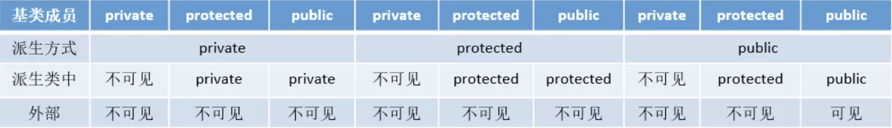
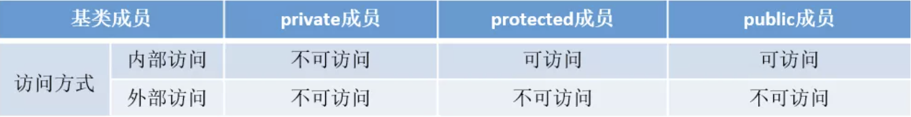
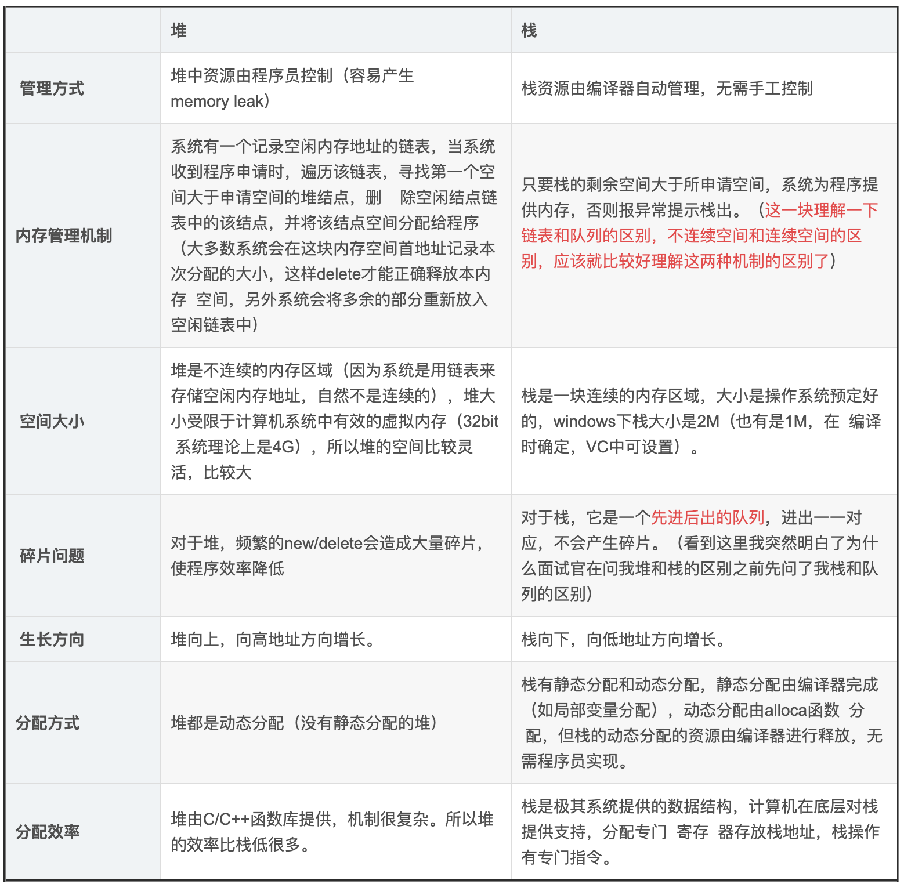
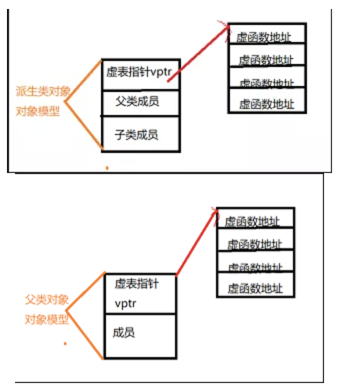
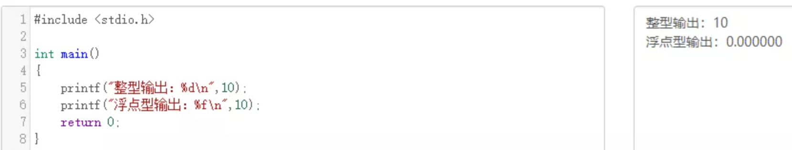
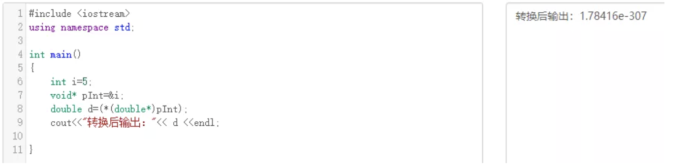
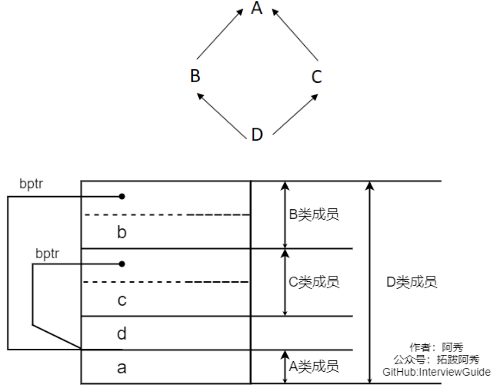

# C有关的重要问题

### 1.main函数是如何被调用的

C程序总是从main函数开始执行，main函数的原型是：

```c
int main(int argc, char *argv);
```

>  其中，argc是命令行参数的数目，argv是指向参数的各个指针所构成的数组

**当内核执行C程序时(使用一个exec函数),在调用main前先调用一个特殊的启动例程**。  

**可执行程序文件将此启动例程指定为程序的起始地址—这是由连接编辑器设置的,而连接编辑器则由C编译器调用。** 启动例程从内核取得命令行参数和环境变量值,然后为按上述方式调用main函数做好安排。

---

### 2.C程序如何启动和终止的

<div align = center></div>

+ 注意,**内核使程序执行的唯一方法是调用一个exec函数。进程自愿终止的唯一方法是显式或隐式地(通过调用exit)调用exit或Exit**。进程也可非自愿地由一个信号使其终止。

+ 当执行一个程序时,调用exec的进程可将命令行参数传递给该新程序。ISO C和POSIX.1都要求argv[argc]是一个空指针。这就使我们可以将参数处理循环改写为

  ```c
  for(i = 0; argv[i] != NULL; i++)
  ```

---

### 3.atexit函数

按照ISO C的规定,一个进程可以登记多至32个函数,这些函数将由exit自动调用。我们称这些函数为终止处理程序( exit handler),并调用 atexit函数来登记这些函数。

```c
#include <stdlib.h>

int atexit(void (*func)(void));
// Returns: 0 if OK, nonzero on error
```

>  其中, `atexit`的参数是一个函数地址,当调用此函数时无需向它传递任何参数,也不期望它返回一个值。exit调用这些函数的顺序与它们登记时候的顺序相反。同一函数如若登记多次也会被调用多次。

```c
#include "apue.h"
static void	my_exit1(void);
static void	my_exit2(void);

int main(void){
	if (atexit(my_exit2) != 0)
		err_sys("can't register my_exit2");

	if (atexit(my_exit1) != 0)
		err_sys("can't register my_exit1");
	if (atexit(my_exit1) != 0)
		err_sys("can't register my_exit1");
	if (atexit(my_exit1) != 0)
		err_sys("can't register my_exit1");

	printf("main is done\n");
	return(0);
}

static void
my_exit1(void)
	printf("first exit handler\n");

static void
my_exit2(void)
	printf("second exit handler\n");
```

<div align = center></div>

---

### 4.C程序的存储空间布局

C程序一直由以下几个部分组成：

<div align = center></div>

+  **正文段。** 这是由CPU执行的机器指令部分。通常正文段是可共享的，但通常也只能制度，防止程序由于意外而修改其指令。
+  **初始化数据段。** 通常将此段称为数据段,它包含了程序中需明确地赋初值的变量。
+  **未初始化数据段。** 通常将此段称为bss段 (名称来源于早期汇编程序一个操作符,意思是“由符号开始的块”( block started by symbol))。在程序开始执行之前， **内核将此段中的数据初始化为0或空指针** 。
+  **栈。** 自动变量以及每次函数调用时所需保存的信息都存放在此段中。
+  **堆。** 通常在堆中进行动态存储分配。

> +  a.out 中还有其他类型的段，如符号表的段，包含调试信息的段以及包含动态共享库链接表的段等。这些部分并不装载到进程执行的程序映像中。
> +  未初始化数据段的内容并不存放在磁盘程序文件中。其原因是,内核在程序开始运行前将它们都设置为0。需要存放在磁盘程序文件中的段只有正文段和初始化数据段

---

### 5.共享库

+ 共享库使得**可执行文件中不再需要包含公用的库函数** ，而只需在所有进程都可引用的存储区中保存这种库例程的一个副本。
+ 程序第一次执行或者第一次调用某个库函数时,**用动态链接方法将程序与共享库函数相链接**。这减少了每个可执行文件的长度,但增加了一些运行时间开销。这种时间开销发生在该程序第一次被执行时,或者每个共享库函数第一次被调用时。
+ 共享库的另一个优点是**可以用库函数的新版本代替老版本而无需对使用该库的程序重新连接编辑**(假定参数的数目和类型都没有发生改变)

### 6.存储空间分配——malloc, realloc, calloc

ISO C说明了3个用于存储空间动态分配的函数

1. malloc,分配 **指定字节数的存储区** 。此存储区中的初始值不确定。
2. calloc,为 **指定数量 指定长度** 的对象分配存储空间。**该空间中的每一位(bit)都初始化为0**
3. realloc, **增加或减少以前分配区的长度** 。当增加长度时,可能需将以前分配区的内容移到另一个足够大的区域,以便在尾端提供增加的存储区,而新增区域内的初始值则不确定。

```c
#include <stdlib.h>

// All three return: non-null pointer if OK, NULL on error
void *malloc(size_t size);
void *calloc(size_t nobj, size_t size);
void *realloc(void *ptr, size_t newsize);
//这3个分配函数所返回的指针一定是适当对齐的,使其可用于任何数据对象。

void free(void *ptr);
//free函数释放ptr所指向的存储空间。被释放的空间通常被送入可用存储区池。以后可在调用上述3个分配函数时再分配。
```

---

### 7.C++中的string与C中的char * 有什么区别？如何实现的？

string继承自basic_string,其实是对char*进行了封装，封装的string包含了char*数组，容量，长度等等属性。

string可以进行动态扩展，在每次扩展的时候另外申请一块原空间大小两倍的空间(2^n)，然后将原字 符串拷贝过去，并加上新增的内容

---

# C++ 基础

## C++ 基本介绍

### 1.C++面向对象的三大特性

#### 继承

 让某种类型对象获得另一个类型对象的属性和方法。** 它可以使用现有类的所有功能，并在无需重新编写原来的类的情况下对这些功能进行扩展 常见的继承有三种方式:

1. 实现继承:指使用基类的属性和方法而无需额外编码的能力
2. 接口继承:指仅使用属性和方法的名称、但是子类必须提供实现的能力
3. 可视继承:指子窗体(类)使用基窗体(类)的外观和实现代码的能力(C++里好像不怎么用)

例如，将人定义为一个抽象类，拥有姓名、性别、年龄等公共属性，吃饭、睡觉、走路等公共方法，在 定义一个具体的人时，就可以继承这个抽象类，既保留了公共属性和方法，也可以在此基础上扩展跳 舞、唱歌等特有方法

#### 封装

数据和代码捆绑在一起，避免外界干扰和不确定性访问。

封装，也就是**把客观事物封装成抽象的类**，并且类可以把自己的数据和方法只让可信的类或者对象操 作，对不可信的进行信息隐藏，例如:将公共的数据或方法使用public修饰，而不希望被访问的数据或 方法采用private修饰。

#### 多态

 同一事物表现出不同事物的能力，即向不同对象发送同一消息，不同的对象在接收时会产生不同的行为 **(重载实现编译时多态，虚函数实现运行时多态)**。

多态性是允许你将父对象设置成为和一个或更多的他的子对象相等的技术，赋值之后，父对象就可以根 据当前赋值给它的子对象的特性以不同的方式运作。**简单一句话:允许将子类类型的指针赋值给父类类 型的指针**

实现多态有二种方式:覆盖(override)，重载(overload)。

+ 覆盖: 是指子类重新定义父类的虚函数的做法。

+ 重载:是指允许存在多个同名函数，而这些函数的参数表不同(或许参数个数不同，或许参数类型不 同，或许两者都不同)。例如:基类是一个抽象对象——人，那教师、运动员也是人，而使用这个抽象 对象既可以表示教师、也可以表示运动员。

##  一.变量与基本类型

### 1.变量声明和定义区别？

- 声明仅仅是把变量的声明的位置及类型提供给编译器，并不分配内存空间；定义要在定义的地方为其分配存储空间。
- 相同变量可以在多处声明（外部变量extern），但只能在一处定义。

---

### 2.哪几种情况必须用到初始化成员列表？

- 初始化一个const成员。
- 初始化一个reference成员。
- 调用一个基类的构造函数，而该函数有一组参数。
- 调用一个数据成员对象的构造函数，而该函数有一组参数。

---

### 3.常量指针和指针常量区别？

- 常量指针是一个指针，读成常量的指针，指向一个只读变量。如`int const *p`或`const int *p`。
- 指针常量是一个不能给改变指向的指针。指针是个常量，不能中途改变指向，如`int *const p`。

---

### 4.野指针和悬空指针

都是是指向无效内存区域(这里的无效指的是"不安全不可控")的指针，访问行为将会导致未定义行为。

**野指针**，指的是没有被初始化过的指针

```c++
int main(void) { 
  int * p;
  std::cout<<*p<<std::endl;
  return 0;
}
```

因此，为了防止出错，对于指针初始化时都是赋值为 `nullptr`，这样在使用时编译器就会直接报错，产生非法内存访问。

**悬空指针**，指针最初指向的内存已经被释放了的一种指针。

```c++
int main(void) { 
  int * p = nullptr;
  int* p2 = new int; 
  p = p2;
  delete p2;
}
```

此时 p和p2就是悬空指针，指向的内存已经被释放。继续使用这两个指针，行为不可预料。需要设置为`p=p2=nullptr`。此时再使用，编译器会直接保错。

避免野指针比较简单，但悬空指针比较麻烦。c++引入了智能指针，C++智能指针的本质就是避免悬空指针的产生。

**产生原因及解决办法：**

野指针：指针变量未及时初始化 => 定义指针变量及时初始化，要么置空。

悬空指针：指针free或delete之后没有及时置空 => 释放操作后立即置空。

---

### 5.区别以下指针类型？

```c++
int *p[10]
int (*p)[10]
int *p(int)
int (*p)(int)
```

- `int *p[10]`表示指针数组， **强调数组概念** ，是一个数组变量，数组大小为10，数组内每个元素都是指向int类型的指针变量。
- `int (*p)[10]`表示数组指针， **强调是指针** ，只有一个变量，是指针类型，不过指向的是一个int类型的数组，这个数组大小是10。
- `int *p(int)`是函数声明，函数名是p，参数是int类型的，返回值是int *类型的。
- `int (*p)(int)`是函数指针，强调是指针，该指针指向的函数具有int类型参数，并且返回值是int类型的。

---

### 6.指针和引用的区别

#### :large_orange_diamond: 性质方面

- 指针是一个变量，存储的是一个地址，引用跟原来的变量实质上是同一个东西，是原变量的别名
- 指针可以有 **多级** ，引用只有一级
- 指针可以为空，引用不能为`NULL`且在定义时 **必须初始化**
- 指针在初始化后 **可以改变指向** ，而引用在初始化之后 **不可再改变**

#### :large_orange_diamond: ​内存

- `sizeof`指针得到的是本指针的大小，`sizeof`引用得到的是引用所指向变量的大小

- 引用只是别名，不占用具体存储空间，只有声明没有定义；指针是具体变量，需要占用存储空间。

#### :large_orange_diamond: ​使用

+ 引用一旦初始化之后就不可以再改变（变量可以被引用为多次，但引用只能作为一个变量引用）；指针变量可以重新指向别的变量。

+ 引用在声明时必须初始化为另一变量，一旦出现必须为`typename refname &varname`形式；指针声明和定义可以分开，可以先只声明指针变量而不初始化，等用到时再指向具体变量。

+ **当把指针作为参数进行传递时，也是<font color = red>将实参的一个拷贝传递给形参，两者指向的地址相同，但不是同一个变量，在函数中改变这个变量的指向不影响实参，而引用却可以。</font>**

```c++
void test(int *p){
　　int a=1;
　　p=&a;
　　cout<<p<<" "<<*p<<endl;
}

int main(void){
    int *p=NULL;
    test(p);
    if(p==NULL)
    	cout<<"指针p为NULL"<<endl;
    return 0;
}
//运行结果为：
//0x22ff44 1
//指针p为NULL
//*******************************	
void testPTR(int* p) {
    int a = 12;
    p = &a;

}
void testREFF(int& p) {
    int a = 12;
    p = a;

}
void main(){
    int a = 10;
    int* b = &a;
    testPTR(b);//改变指针指向，但是没改变指针的所指的内容
    cout << a << endl;// 10
    cout << *b << endl;// 10
    a = 10;
    testREFF(a);
    cout << a << endl;//12
}
```

---

### 7.C++中const和static的作用

#### **static**

**:diamonds:  不考虑类的情况**

:small_blue_diamond: **存储区：**

+ 静态变量都在全局数据区分配内存，包括静态局部变量。

  > 一般程序的由new产生的动态数据存放在堆区，函数内部的自动变量存放在栈区。自动变量一般会随着函数的退出而释放空间，静态数据（即使是函数内部的静态局部变量）也存放在全局数据区。全局数据区的数据并不会因为函数的退出而释放空间。

:small_blue_diamond: **初始化：**

+ 全局static变量的初始化在编译的时候进行。在main函数被调用之前初始化并且只初始化一次 。
+ 默认初始化为0，包括未初始化的全局静态变量与局部静态变量，都存在 **全局未初始化区**

:small_blue_diamond: **作用域：**

+ 静态变量在函数内定义，始终存在，且只进行一次初始化，具有记忆性，其作用范围与局部变量相同，函数退出后仍然存在，但不能使用

  ```c++
  int main(void)
  {    
      for(int i = 0;i < 5;i++)
      {
        	static int m = 7;
       	 	cout<< "m=" << m--;
      } 
      cout << m << endl;//这里会显示错误
          return 0;
  ```

+  普通全局变量作用域是整个源程序，当一个程序有多个源文件组成时候，普通全局变量在每个源文件中都是有效的，而 **静态全局变量则限制了作用域，只在定义该变量的源文件中有效。在同一个源程序中的其他源文件不能使用。** 由于静态全局变量的作用域限于一个源文件内，只能为该源文件内的函数公用， 因此可以避免在其它源文件中引起错误。


:diamonds:  **考虑类的情况**

:small_blue_diamond:  **static成员变量** 

```c++

#include<iostream>
using namespace std;
 
class Myclass
{
private:
    int a , b , c;
    static int sum;  //声明静态数据成员
public:
    Myclass(int a , int b , int c) : a(a), b(b), c(c){
        sum += a+b+c;
    }
    void GetSum();
};
 
int Myclass::sum = 0;   //定义并初始化静态数据成员

void Myclass::GetSum() {
		cout<<"sum="<<sum<<endl;
}

int main(void)
{
    Myclass M(1 , 2 , 3);
    M.GetSum();						//6
    Myclass N(4 , 5 , 6);
    N.GetSum();						//21
    M.GetSum();						//21
    return 0;
}
```

+ 对于非静态数据成员，每个类对象都有自己的拷贝。而静态数据成员被当作是类的成员。无论这个类的对象被定义了多少个，静态数据成员在程序中也只有一份拷贝，由该类型的所有对象共享访问。也就是说，静态数据成员是该类的所有对象所共有的。对该类的多个对象来说，静态数据成员只分配一次内存(定义时就分配)，供所有对象共用。所以，静态数据成员的值对每个对象都是一样的，它的值可以更新；
+ 静态数据成员存储在全局数据区。静态数据成员定义时要分配空间，所以不能在类声明中定义。在Example中，语句`int Myclass::Sum=0;`是定义静态数据成员；
+ 因为静态数据成员在全局数据区分配内存，属于本类的所有对象共享，所以，它不属于特定的类对象，在没有产生类对象时其作用域就可见，即在没有产生类的实例时，我们就可以操作它；
+ 同全局变量相比，使用静态数据成员有两个优势：
  + 静态数据成员没有进入程序的全局名字空间，因此不存在与程序中其它全局名字冲突的可能性；
  + 可以实现信息隐藏。静态数据成员可以是private成员，而全局变量不能；

:small_blue_diamond:  **static成员函数**

```c
#include<iostream>
using namespace std;
 
class Myclass
{
private:
	int a , b , c;
	static int sum;  //声明静态数据成员
public:
	Myclass(int a , int b , int c) : a(a), b(b), c(c) {
		this->a = a;
		this->b = b;
		this->c = c;
		sum += a+b+c;    //非静态成员函数可以访问静态数据成员
	}
	static void GetSum();  //声明静态成员函数
};
 
int Myclass::sum = 0;   //定义并初始化静态数据成员

void Myclass::GetSum(){    //静态成员函数的实现

	//cout<<a<<endl;    //错误代码，a是非静态数据成员
	cout<<"sum="<<sum<<endl;
}
 
int main(void)
{
	Myclass M(1 , 2 , 3);
	M.GetSum();							//6
	Myclass N(4 , 5 , 6);
	N.GetSum();							//21
	Myclass::GetSum();			//21
	return 0;
}
```

+ 与静态数据成员一样，我们也可以创建一个静态成员函数，它为类的全部服务而不是为某一个类的具体对象服务。静态成员函数与静态数据成员一样，都是类的内部实现，属于类定义的一部分。
+ 普通的成员函数一般都隐含了一个this指针，this指针指向类的对象本身，因为普通成员函数总是具体的属于某个类的具体对象的。通常情况下，this是缺省的。如函数fn()实际上是this->fn()。 **但是与普通函数相比，静态成员函数由于不是与任何的对象相联系，因此它不具有this指针。从这个意义上讲，它无法访问属于类对象的非静态数据成员，也无法访问非静态成员函数，它只能调用其余的静态成员函数。**

+ 出现在类体外的函数定义不能指定关键字static；
+ 静态成员之间可以相互访问，包括静态成员函数访问静态数据成员和访问静态成员函数；
+ 非静态成员函数可以任意地访问静态成员函数和静态数据成员；
+ 静态成员函数不能访问非静态成员函数和非静态数据成员；
+ 由于没有this指针的额外开销，因此静态成员函数与类的全局函数相比速度上会有少许的增长；
+ 调用静态成员函数，可以用成员访问操作符(.)和(->)为一个类的对象或指向类对象的指针调用静态成员函数，也可以直接使用如下格式：
  `＜类名＞::＜静态成员函数名＞（＜参数表＞）`
  调用类的静态成员函数。

#### **const**

:diamonds:   **不考虑类的情况**

- const常量在定义时必须初始化，之后无法更改

- const形参可以接收const和非const类型的实参，例如

  ```c++
  // i 可以是 int 型或者 const int 型
  void fun(const int& i){
      //...
  }
  ```

:diamonds:   **不考虑类的情况**

:small_blue_diamond:  **const成员变量**

- 不能在类定义外部初始化，只能通过构造函数初始化列表进行初始化
- 并且必须有构造函数；
- 不同类对其const数据成员的值可以不同，所以不能在类中声明时初始化

:small_blue_diamond: **const成员函数**

+ const对象不可以调用非const成员函数；
+ 非const对象都可以调用；
+ 不可以改变非mutable（用该关键字声明的变量可以在const成员函数中被修改）数据的值

---

### 8.C++的顶层const和底层const

#### **概念区分**

>  **指针本身是不是一个常量** 以及 **指针所指的是不是一个常量** 是两个独立的问题。

- **顶层**const：指的是 **指针本身是一个常量**
- **底层**const：指的是 **指针所指的对象是一个常量**

#### **举个例子**

```c++
int i= 0；
int* const p1 = &i; 				//不能改变p1的值，顶层const
const int ci = 42;					//不能改变ci的值，顶层const
const int *p2 = &ci; 				//允许改变P2的值，底层const
const int *const p3 = p2;		//靠右的const是顶层const，靠左的const是底层const
const int &r = ci;					//用于声明引用的const都是底层const
```

#### **区分作用**

- 执行对象拷贝时有限制，常量的底层const不能赋值给非常量的底层const
- 使用命名的强制类型转换函数const_cast时，只能改变运算对象的底层const

```c++
const int a;
int const a;
const int *a;
int *const a;
```

- `int const a`和`const int a`均表示定义常量类型a。
- `const int *a`，其中a为指向int型变量的指针，const在 * 左侧，表示a指向不可变常量。(看成`const (*a)`，对引用加const)
- `int *const a`，依旧是指针类型，表示a为指向整型数据的常指针。(看成`const(a)`，对指针const)

---

### 9.constexpr与常量表达式

#### (1).常量表达式

**常量表达式** 是指 **值不会改变** 并且在 **编译过程就能得到计算结果** 的表达式。一个对象（或表达式）是不是常量表达式由它的数据类型和初始值共同决定。

```c++
const int max_files = 20;			// 是常量表达式
const int limit = max_files + 1;	// 是常量表达式
int staff_size = 2;					// 不是常量表达式
//sz本身是一个常量，但是具体值直到运行时才能获取，所以不是常量表达式
const int sz = get_size();			// 不是常量表达式
```

#### (2).constexpr变量

+ C++允许将 **变量声明为constexpr类型以便由编译器来验证变量的值是否是一个常量表达式**
+  **声明为constexpr的变量一定是一个常量，而且必须用常量表达式初始化**
  + 尽管不能使用普通函数作为constexpr变量的初始值，但是 **新标准允许定义一种特殊的 constexpr 函数** 。这种函数应该足够简单以使得编译时就可以计算其结果，这样就能用constexpr函数去初始化constexpr变量了

#### (3).constexpr与指针

+ 一个`constexpr`指针的初始值必须是`nullptr`或者`0`,或者是存储于某个固定地址中的对象；
+ `constexpr`引用必须绑定在存储于某个固定地址中的对象

> - 例如，函数体内定义的变量一般来说并非存放在固定地址中， 因此`constexpr`指针不能指向这样的变量。
> - 相反，**全局变量 以及 局部静态变量地址固定不变，能用来初始化`constexpr`指针**

在constexpr声明中如果定义了一个指针， **限定符constexpr仅对指针有效，与指针所指的对象无关。**

```c++
const int *p = nullptr;
constexpr int *q = nullptr;
```

+ p是一个指向常量的指针

+ q是一个常量指针。

  > constexpr把它所定义的对象置为了顶层const

---

### 10.auto、decltype和decltype(auto)的用法

**（1）auto**

C++11新标准引入了auto类型说明符，用它就能让编译器替我们去分析表达式所属的类型。和原来那些只对应某种特定的类型说明符(例如 int)不同，

auto 让编译器通过初始值来进行类型推演。从而获得定义变量的类型，所以说 auto 定义的变量必须有初始值。举个例子：

```c++
 //普通；类型
 int a = 1, b = 3;
 auto c = a + b;// c为int型
 
 //const类型
 const int i = 5;
 auto j = i; // 变量i是顶层const, 会被忽略, 所以j的类型是int
 auto k = &i; // 变量i是一个常量, 对常量取地址是一种底层const, 所以b的类型是const int*
 const auto l = i; //如果希望推断出的类型是顶层const的, 那么就需要在auto前面加上cosnt
 
 //引用和指针类型
 int x = 2;
 int& y = x;
 auto z = y; //z是int型不是int& 型
 auto& p1 = y; //p1是int&型
 auto p2 = &x; //p2是指针类型int*
```

**（2）decltype**

有的时候我们还会遇到这种情况， **希望从表达式中推断出要定义变量的类型，但却不想用表达式的值去初始化变量。还有可能是函数的返回类型为某表达式的值类型。** 在这些时候auto显得就无力了，所以C++11又引入了第二种类型说明符decltype，它的作用是选择并返回操作数的数据类型。在此过程中，编译器只是分析表达式并得到它的类型，却不进行实际的计算表达式的值。

```c++
 int func() {return 0};
 
 //普通类型
 decltype(func()) sum = 5; // sum的类型是函数func()的返回值的类型int, 但是这时不会实际调用函数func()
 int a = 0;
 decltype(a) b = 4; // a的类型是int, 所以b的类型也是int
 
 //不论是顶层const还是底层const, decltype都会保留   
 const int c = 3;
 decltype(c) d = c; // d的类型和c是一样的, 都是顶层const
 int e = 4;
 const int* f = &e; // f是底层const
 decltype(f) g = f; // g也是底层const
 
 //引用与指针类型
 //1. 如果表达式是引用类型, 那么decltype的类型也是引用
 const int i = 3, &j = i;
 decltype(j) k = 5; // k的类型是 const int&
 
 //2. 如果表达式是引用类型, 但是想要得到这个引用所指向的类型, 需要修改表达式:
 int i = 3, &r = i;
 decltype(r + 0) t = 5; // 此时是int类型
 
 //3. 对指针的解引用操作返回的是引用类型
 int i = 3, j = 6, *p = &i;
 decltype(*p) c = j; // c是int&类型, c和j绑定在一起
 
 //4. 如果一个表达式的类型不是引用, 但是我们需要推断出引用, 那么可以加上一对括号, 就变成了引用类型了
 int i = 3;
 decltype((i)) j = i; // 此时j的类型是int&类型, j和i绑定在了一起
```

**（3）decltype(auto)**

decltype(auto)是C++14新增的类型指示符，可以用来声明变量以及指示函数返回类型。在使用时，会将“=”号左边的表达式替换掉auto，再根据decltype的语法规则来确定类型。举个例子：

```c++
 int e = 4;
 const int* f = &e; // f是底层const
 decltype(auto) j = f;//j的类型是const int* 并且指向的是e
```

> 《auto和decltype的用法总结》：https://www.cnblogs.com/XiangfeiAi/p/4451904.html
>
> 《C++11新特性中auto 和 decltype 区别和联系》：https://www.jb51.net/article/103666.htm

### 11.define宏定义和const的区别

#### **编译阶段**

- define是在编译的**预处理**阶段起作用，而const是在编译、运行的时候起作用

#### **安全性**

- define只做替换，不做类型检查和计算，也不求解，容易产生错误，一般最好加上一个大括号包含住全部的内容，要不然很容易出错
- const常量有数据类型，编译器可以对其进行类型安全检查

#### **内存占用**

- define只是将宏名称进行替换，在内存中会产生多分相同的备份。const在程序运行中只有一份备份，且可以执行常量折叠，能将复杂的的表达式计算出结果放入常量表
- 宏替换发生在编译阶段之前，属于文本插入替换；const作用发生于编译过程中。
- 宏不检查类型；const会检查数据类型。
- 宏定义的数据没有分配内存空间，只是插入替换掉；const定义的变量只是值不能改变，但要分配内存空间。\

---

### 12.从汇编层面解释引用

```scss
 9:     		int x = 1;
00401048  	mov     dword ptr [ebp-4],1
10:    			int &b = x;
0040104F 	  lea     eax,[ebp-4]
00401052 		mov     dword ptr [ebp-8],eax
```

x的地址为ebp-4，b的地址为ebp-8，因为栈内的变量内存是从高往低进行分配的，所以b的地址比x的低。

`lea eax,[ebp-4]` 这条语句将x的地址ebp-4放入eax寄存器 

`mov dword ptr [ebp-8],eax` 这条语句将eax的值放入b的地址

`ebp-8` 中上面两条汇编的作用即:将x的地址存入变量b中，这不和将某个变量的地址存入指针变量是一样的吗?所以从汇编层次来看，的确引用是通过指针来实现的。

---

### 13.C++的四种强制转换类型

#### **reinterpret_cast**

`reinterpret_cast<type-id>` (expression) type-id 必须是一个指针、引用、算术类型、函数指针或者成员指针。它可以用于类型之间进行强制转换。

#### **const_cast**

`const_cast<type_id> (expression)` 该运算符用来修改类型的const或volatile属性。除了const 或volatile修饰之外， type_id和expression的类型是一样的。

用法如下:

+ 常量指针被转化成非常量的指针，并且仍然指向原来的对象 
+ 常量引用被转换成非常量的引用，并且仍然指向原来的对象 
+ const_cast一般用于修改底指针。如const char *p形式

#### **static_cast**

`static_cast < type-id >` (expression) 该运算符把expression转换为type-id类型，但没有运行时类型检查来保证转换的安全性。它主要有如下几种用法:

+ 用于类层次结构中基类(父类)和派生类(子类)之间指针或引用引用的转换
  + 进行上行转换(把派生类的指针或引用转换成基类表示)是安全的 
  + 进行下行转换(把基类指针或引用转换成派生类表示)时，由于没有动态类型检查，所以是不安 全的

+ 用于基本数据类型之间的转换，如把int转换成char，把int转换成enum。这种转换的安全性也要开发人 员来保证。

+ 把空指针转换成目标类型的空指
+ 针 把任何类型的表达式转换成void类型

>  注意:static_cast不能转换掉expression的const、volatile、或者__unaligned属性。

#### **dynamic_cast**

有类型检查，基类向派生类转换比较安全，但是派生类向基类转换则不太安全

`dynamic_cast (expression)`

该运算符把expression转换成type-id类型的对象。type-id 必须是类的指针、类的引用或者void*

如果 type-id 是类指针类型，那么expression也必须是一个指针，如果 type-id 是一个引用，那么 expression 也必须是一个引用

dynamic_cast运算符可以在执行期决定真正的类型，也就是说expression必须是多态类型。如果下行转换是安全的(也就说，如果基类指针或者引用确实指向一个派生类对象)这个运算符会传回适当转型过的 指针。如果 如果下行转换不安全，这个运算符会传回空指针(也就是说，基类指针或者引用没有指向一 个派生类对象)

dynamic_cast主要用于类层次间的上行转换和下行转换，还可以用于类之间的交叉转换 

在类层次间进行上行转换时，dynamic_cast和static_cast的效果是一样的 

在进行下行转换时，dynamic_cast具有类型检查的功能，比static_cast更安全

```c++
#include <bits/stdc++.h>
using namespace std;
class Base
{
public:
    Base() :b(1) {}
    virtual void fun() {};
  	int b;
};
class Son : public Base{
public:
    Son() :d(2) {}
		int d; 
};
int main() {
    int n = 97;
    //reinterpret_cast
    int *p = &n;
    //以下两者效果相同
    char *c = reinterpret_cast<char*> (p);
    char *c2 = (char*)(p);
    cout << "reinterpret_cast输出:"<< *c2 << endl; //const_cast
    const int *p2 = &n;
    int *p3 = const_cast<int*>(p2);
    *p3 = 100;
    cout << "const_cast输出:" << *p3 << endl;
  
    Base* b1 = new Son;
    Base* b2 = new Base;
  
    //static_cast
    Son* s1 = static_cast<Son*>(b1); //同类型转换
    Son* s2 = static_cast<Son*>(b2); //下行转换，不安全
    cout << "static_cast输出:"<< endl;
    cout << s1->d << endl;
    cout << s2->d << endl; //下行转换，原先父对象没有d成员，输出垃圾值
    
  	//dynamic_cast
    Son* s3 = dynamic_cast<Son*>(b1); //同类型转换 
  	Son* s4 = dynamic_cast<Son*>(b2); //下行转换，安全 
  	cout << "dynamic_cast输出:" << endl;
    cout << s3->d << endl;
    if(s4 == nullptr)
    		cout << "s4指针为nullptr" << endl; 
  	else
    		cout << s4->d << endl;
    return 0;
}
//输出结果 
//reinterpret_cast输出:a 
//const_cast输出:100 
//static_cast输出:
//2
//-33686019 //dynamic_cast输出:
//2
//s4指针为nullptr  
```


---

## 二.字符串，向量和数组

### 1.a和&a有什么区别？

```c++
//假设数组int a[10];
int a[10] = {1,2,3,4,5,6,7,8,9,10};
int (*p)[10] = &a;
//int (*p)[10] = a;会报错
cout << *(*p + 1)<< endl;//2
cout << *(a + 1) << endl;//2
```

- a是数组名，是数组首元素地址，+1表示地址值加上一个int类型的大小，如果a的值是0x00000001，加1操作后变为0x00000005。*(a + 1) = a[1]。
- &a是数组的指针，其类型为int (*)[10]（就是前面提到的数组指针），其加1时，系统会认为是数组首地址加上整个数组的偏移（10个int型变量），值为数组a尾元素后一个元素的地址。
- 若(int *)p ，此时输出 *p时，其值为a[0]的值，因为被转为int *类型，解引用时按照int类型大小来读取。

---

### 2.数组名和指针（这里为指向数组首元素的指针）区别？

- 二者均可通过增减偏移量来访问数组中的元素。
- 数组名不是真正意义上的指针，可以理解为常指针，所以数组名没有自增、自减等操作。
- 当数组名当做形参传递给调用函数后，就失去了原有特性，退化成一般指针，多了自增、自减操作，但sizeof运算符不能再得到原数组的大小了。

---

### 3.拷贝初始化和直接初始化

+ 当用于类类型对象时，初始化的拷贝形式和直接形式有所不同：直接初始化直接调用与实参匹配的构造函数，拷贝初始化总是调用拷贝构造函数。拷贝初始化首先使用指定构造函数创建一个临时对象，然后用拷贝构造函数将那个临时对象拷贝到正在创建的对象。举例如下

```c++
string str1("I am a string");//语句1 直接初始化
string str2(str1);//语句2 直接初始化，str1是已经存在的对象，直接调用构造函数对str2进行初始化
string str3 = "I am a string";//语句3 拷贝初始化，先为字符串”I am a string“创建临时对象，再把临时对象作为参数，使用拷贝构造函数构造str3
string str4 = str1;//语句4 拷贝初始化，这里相当于隐式调用拷贝构造函数，而不是调用赋值运算符函数
```

- **为了提高效率，允许编译器跳过创建临时对象这一步，**直接调用构造函数构造要创建的对象，这样就完全等价于**直接初始化了**（语句1和语句3等价）。但是需要辨别两种情况。
- 当拷贝构造函数为private时：语句3和语句4在编译时会报错
- 使用explicit修饰构造函数时：如果构造函数存在隐式转换，编译时会报错

---

### 4.strlen和sizeof区别？

- sizeof是运算符，并不是函数，结果在编译时得到而非运行中获得；strlen是字符处理的库函数。
- sizeof参数可以是任何数据的类型或者数据（sizeof参数不退化）；strlen的参数只能是字符指针且结尾是'\0'的字符串。
- 因为sizeof值在编译时确定，所以不能用来得到动态分配（运行时分配）存储空间的大小。

```c++
int main(int argc, char const *argv[]){   
      const char* str = "name";
      sizeof(str); // 取的是指针str的长度，是8(64位为8字节，32位还是4字节，int*无论是32位还是64位都是4个字节)
      strlen(str); // 取的是这个字符串的长度，不包含结尾的 \0。大小是4
      return 0;
 }
```

---

## 三.函数

### 1.形参与实参的区别

1.  形参变量只有在被调用时才分配内存单元，在调用结束时， 即刻释放所分配的内存单元。因此，形参只有在函数内部有效。 函数调用结束返回主调函数后则不能再使用该形参变量。
2. 实参可以是常量、变量、表达式、函数等， 无论实参是何种类型的量，在进行函数调用时，它们都必须具有确定的值， 以便把这些值传送给形参。 因此应预先用赋值，输入等办法使实参获得确定值， 会产生一个临时变量。
3. 实参和形参在数量上，类型上，顺序上应严格一致， 否则会发生“类型不匹配”的错误。
4. 函数调用中发生的数据传送是单向的。 即只能把实参的值传送给形参，而不能把形参的值反向地传送给实参。 因此在函数调用过程中，形参的值发生改变，而实参中的值不会变化。
5. 当形参和实参不是指针类型时，在该函数运行时，形参和实参是不同的变量，他们在内存中位于不 同的位置，形参将实参的内容复制一份，在该函数运行结束的时候形参被释放，而实参内容不会改变。

### 2.宏定义和typedef区别？

- 宏主要用于定义常量及书写复杂的内容；typedef主要用于定义类型别名。
- 宏替换发生在编译阶段之前，属于文本插入替换；typedef是编译的一部分。
- 宏不检查类型；typedef会检查数据类型。
- 宏不是语句，不在在最后加分号；typedef是语句，要加分号标识结束。
- 注意对指针的操作，`typedef char * p_char`和`#define p_char char *`区别巨大。

### 3.宏定义和函数有何区别？

- 宏在编译时完成替换，之后被替换的文本参与编译，相当于直接插入了代码，运行时不存在函数调用，执行起来更快；函数调用在运行时需要跳转到具体调用函数。
- 宏定义属于在结构中插入代码，没有返回值；函数调用具有返回值。
- 宏定义参数没有类型，不进行类型检查；函数参数具有类型，需要检查类型。
- 宏定义不要在最后加分号。

---

### 4.数组形参需要注意的问题

由于 不允许拷贝数组 和 使用数组时通常会将其转换为指针的性质，函数传递数组时，实际上传递的是指向数组首元素的指针。不过可以写成类似数组的形式。

```c++
//这三个函数等价
void print(const int *);
void print(const int[]);
void print(const int[10]);
```

+ **对于数组引用形参**

  + 函数形参可以是数组的引用，而数组的维度也是类型的一部分

    ```c++
    void print(int (&arr)[10]) {
      	for(auto i : arr)
          cout << i << endl;
    }
    ```

    > &arr两端的括号必不可少。
    >
    > ```c++
    > f(int (&arr)[10]) ;	//arr是具有10个整数的整形数组的引用
    > f(int &arr[10]) ;		//将arr声明成引用的数组
    > ```
    >
    > 但是对于上述函数，使用时，传入的数组维度必须严格匹配。

+ **对于传递多维数组**

  + 将多维数组传递给函数时，实际上传递的是指向数组首元素的指针。因为处理的是数组的数组，所以首元素本身就是一个数组，指针就是一个指向数组的指针。

  + 数组第二维的大小都是数组类型的一部分，不能忽略

    ```c++
    //matrix指向数组的首元素，该数组的元素是由10个整数构成的数组
    void print((*matrix)[10], int rowSize);
    //括号必不可少
    /*
    *		(*matrix)[10] 指向含有10个整数的数组的指针
    *		*matrix[10] 	10个指针构成的数组
    */
    void print(matrix[][10], int rowSize);
    ```

---

### 5.含有可变形参的函数

+ **可变参模板**

+ **使用initializer_list标准库**

  + 函数的形参数量未知但是类型相同时可用。
  + 与vector不同的是，initializer_list对象中的元素永远是常量。
  + 如果想向initializer_list形参中传递一个值的序列，则必须把序列放在一对花括号内。

  ```c++
  void print(initializer_list<string> s) {
      for(auto i : s )
          cout << i << endl;
  }
  int main() {
      print({"hello", "initializer_list"});
      return 0;
  ;}
  ```

---

### 6.尾置返回类型与函数指针

#### 尾置返回类型

尾置返回类型跟在形参列表后面并以一个`->`符号开头。为了表示函数真正的返回类型跟在形参列表之后，我们在本该出现返回类型的地方放置一个auto:

```c
//func接受一个int类型的实参，返回一个指针，该指针指向含有10个整数的数组。
auto func(int i) -> int(*)[10];
```

```c++
auto func(int i) -> int * {
    static int num[10];
    for (int j = 0; j < 10; ++j) {
        num[j] = i;
    }
    return num;
}
int main() {
    int *p= func(2);
    for (int i = 0; i < 10; ++i) {
        cout << *p << endl;
    }
    return 0;
}
```

#### 函数指针

想要声明一个可以指向该函数的指针，只需要用指针代替函数名即可。

```c++
bool print(const string s1, const string s2) {
    if(s1 > s2)
        return true;
}
int main() {
    bool (*pf)(const string, const string );
    //pf = &print;
    pf = print;
    cout << pf("hello", "world");
}
```

和数组类似，虽然不能返回一个函数，但是能返回指向函数类型的指针。把返回类型写成指针形式，编译器不会自动地将函数返回类型当成对应的指针类型处理。

```c++
using F = int (int*, int);			//F是函数类型，不是指针
using PF = int(*)(int*, int);		//PF是指针类型
//显示将返回类型指定为指针
PF f1(int);		//正确：PF是指向函数的指针，f1返回指向函数的指针
F f1(int);		//错误：F是函数类型，f1不能返回一个函数
F *f1(int);		//正确：显示地返回类型是指向函数的指针
//也可以直接声明f1
int (*f1(int)) (int*, int);
//也可以使用尾置返回类型的方式
auto f1(int) -> (int*) (int*, int);
```

---

### 7.内联函数与constexpr函数

+ **内联函数**

将函数指定为内联函数，通常是将它在每一个调用点上"内联地"展开。这样会消除函数的运行开销。一般来说，内联机制用于优化规模较小，流程直接，频繁调用的函数。

+ **constexpr函数**

constexpr函数是指用于常量表达式的函数。此函数的返回类型和所有形参的类型都得是字面值类型，而且函数体中必须有且只有一条return语句。

在能在编译过程中展开，constexpr函数被隐式地指定为内联函数。

---

### 8.内联函数和宏定义的区别

内联(inline)函数和普通函数相比可以加快程序运行的速度，因为不需要中断调用，在编译的时候内联函数可以直接嵌入到目标代码中。

#### **内联函数适用场景**

- 使用宏定义的地方都可以使用inline函数
- 作为类成员接口函数来读写类的私有成员或者保护成员，会提高效率

#### **为什么不能把所有的函数写成内联函数**

内联函数以代码复杂为代价，它以省去函数调用的开销来提高执行效率。所以一方面如果内联函数体内代码执行时间相比函数调用开销较大，则没有太大的意义；另一方面每一处内联函数的调用都要复制代码，消耗更多的内存空间，因此以下情况不宜使用内联函数：

- 函数体内的代码比较长，将导致内存消耗代价
- 函数体内有循环，函数执行时间要比函数调用开销大

#### **主要区别**

- 内联函数在编译时展开，宏在预编译时展开
- 内联函数直接嵌入到目标代码中，宏是简单的做文本替换
- 内联函数有类型检测、语法判断等功能，而宏没有
- 内联函数是函数，宏不是
- 宏定义时要注意书写（参数要括起来）否则容易出现歧义，内联函数不会产生歧义
- 内联函数代码是被放到符号表中，使用时像宏一样展开，没有调用的开销，效率很高；

> 《inline函数和宏定义区别 整理》：https://blog.csdn.net/wangliang888888/article/details/77990650

- 在使用时，宏只做简单字符串替换（编译前）。而内联函数可以进行参数类型检查（编译时），且具有返回值。
- 内联函数本身是函数，强调函数特性，具有重载等功能。
- 内联函数可以作为某个类的成员函数，这样可以使用类的保护成员和私有成员，进而提升效率。而当一个表达式涉及到类保护成员或私有成员时，宏就不能实现了。

---

### 9.在传递函数参数时，什么时候该使用指针，什么时候该使用引用？

+ 需要返回函数内局部变量的内存的时候用指针。使用指针传参需要开辟内存，用完要记得释放指针，不然会内存泄漏。而返回局部变量的引用是没有意义的
+  对栈空间大小比较敏感(比如递归)的时候使用引用。使用引用传递不需要创建临时变量，开销要更小

+ 类对象作为参数传递的时候使用引用，这是C++类对象传递的标准方式

---

### 10.值传递，指针传递，引用传递的却别和效率

1. 值传递:有一个形参向函数所属的栈拷贝数据的过程，如果值传递的对象是类对象 或是大的结构体对象，将耗费一定的时间和空间。(传值)

2. 指针传递:同样有一个形参向函数所属的栈拷贝数据的过程，但拷贝的数据是一个固定为4字节的地 址。(传值，传递的是地址值)

3. 引用传递:同样有上述的数据拷贝过程，但其是针对地址的，相当于为该数据所在的地址起了一个 别名。(传地址)

4. 效率上讲，指针传递和引用传递比值传递效率高。一般主张使用引用传递，代码逻辑上更加紧凑、 清晰。

---

### 11.C++ 函数调用的压栈过程

从代码入手，解释这个过程:

```c++
#include <iostream>
using namespace std;
int f(int n) {
    cout << n << endl;
		return n; 
}
void func(int param1, int param2){
    int var1 = param1;
    int var2 = param2;
		printf("var1=%d,var2=%d", f(var1), f(var2));//如果将printf换为cout进行输出，输出结果则刚好相反
}
int main(int argc, char* argv[]){
    func(1, 2);
    return 0; 
}
//输出结果
//2
//1 //var1=1,var2=2
```

当函数从入口函数main函数开始执行时，编译器会将我们操作系统的运行状态，main函数的返回地址、 main的参数、mian函数中的变量、进行依次压栈;

当main函数开始调用func()函数时，编译器此时会将main函数的运行状态进行压栈，再将func()函数的返 回地址、func()函数的参数从右到左、func()定义变量依次压栈;

当func()调用f()的时候，编译器此时会将func()函数的运行状态进行压栈，再将的返回地址、f()函数的参 数从右到左、f()定义变量依次压栈

从代码的输出结果可以看出，函数f(var1)、f(var2)依次入栈，而后先执行f(var2)，再执行f(var1)，最后打 印整个字符串，将栈中的变量依次弹出，最后主函数返回。

**文字化表述**

函数的调用过程: 

1)从栈空间分配存储空间 

2)从实参的存储空间复制值到形参栈空间 

3)进行运算

形参在函数未调用之前都是没有分配存储空间的，在函数调用结束之后，形参弹出栈空间，清除形参空间。

数组作为参数的函数调用方式是地址传递，形参和实参都指向相同的内存空间，调用完成后，形参指针 被销毁，但是所指向的内存空间依然存在，不能也不会被销毁。

当函数有多个返回值的时候，不能用普通的 return 的方式实现，需要通过传回地址的形式进行，即地址/ 指针传递。

## 四.类

### 1.初始化和赋值的区别

- 对于简单类型来说，初始化和赋值没什么区别

  + 成员的初始化顺序与它们在类定义中的出现顺序一致，但是构造函数初始值列表中初试值的先后位置关系并不会影响实际的初始化顺序。

- 对于类和复杂数据类型来说，这两者的区别就大了，举例如下：

  ```c++
  class A{
  public:
      int num1;
      int num2;
  public:
      A(int a=0, int b=0):num1(a),num2(b){};
      A(const A& a){};
      //重载 = 号操作符函数
      A& operator=(const A& a){
          num1 = a.num1 + 1;
          num2 = a.num2 + 1;
          return *this;
      };
  };
  int main(){
  
      A a(1,1);
      A a1 = a; //拷贝初始化操作，调用拷贝构造函数
      A b;
      b = a;//赋值操作，对象a中，num1 = 1，num2 = 1；对象b中，num1 = 2，num2 = 2
      return 0;
  }
  ```

#### 引申1： 哪些情况必须用到成员列表的初始化

1. 当初始化一个引用成员时;
2. 当初始化一个常量成员时;
3. 当调用一个基类的构造函数，而它拥有一组参数时; 
4. 当调用一个成员类的构造函数，而它拥有一组参数时;

> 成员列表的操作：
>
> + 编译器会一一操作初始化列表，以适当的顺序在构造函数之内安插初始化操作，并且在任何显示用 户代码之前;
>
> + list中的项目顺序是由类中的成员声明顺序决定的，不是由初始化列表的顺序决定的;

---

### 2. C中结构体内存对齐问题？

#### 对齐问题

当定义结构体为：

```c++
struct number_2
{
    char a;
    int b;
    double c;
}st2;
```

> st2所占内存并非1+4+8=13个，而是16个>13个。

结构体中包含有相同类型或不同类型的数据类型，如char（1字节），int（4字节），double（8字节），所以结构体内存出现了一个对齐原则：

**结构体变量中元素是按照定义顺序一个一个放到内存中去的，但并不是紧密排列的。从结构体存储的首地址开始，每一个元素放置到内存中时，它都会认为内存是以它自己的大小来划分的，因此元素放置的位置一定会在自己宽度的整数倍上开始（以结构体变量首地址为0计算）。**

即，当char a时，以char自身大小（一字节）划分，a占有了首地址0一个字节。但是当int b时，以int自身大小（四字节）划分，所以b从四字节的非负整数倍开始存储占用四个字节，由于首地址0已被占用，所以b从第四个地址开始占用四个字节。同理，当double c时，double也以自身大小（八字节）划分内存，而前八个（0——7）已被占用，故c从第八个地址开始占用八个字节。如下左图：

> 如果去掉中间定义的int b，st2仍然占16个字节。因为，double c时，首地址0已被占用，c不能从0（8的0倍）开始，就只能从8（8的1倍）开始。如下右图：

<div align="center">
    
</div>


而且，double b之前空着的内存，在对齐下原则可以随意增加变量，内存是不会增加的。如下图：

<div align="center">
    
</div>

#### 补齐原则

当定义结构体为：

```c++
struct number_4
{
    char a;
    int b;
    char c;
}st4;
```

> sizeof(st4)=12,而不是4+4+1=9。

这时候就牵扯到一个补齐原则：

**在经过对齐原则分析后，检查计算出的存储单元是否为所有元素中所占内存最大的元素的长度的整数倍，是，则结束；若不是，则补齐为它的整数倍。**

即，当4+4+1=9不是结构体中内存最大元素b的整数倍时，要补齐成其整数倍12。如下图左所示，如果将int换成double，sizeof(st4)=24为最大元素double的整数倍了。如下图右所示：

<div align="center">
    
</div>


---

### 3.C++类的对象存储空间？

对于类实例化一个对象，我们要计算这个对象所占的存储空间大小，其存储空间大小计算为（权威解答）：

+ **非静态成员变量总和；**
+ 加上 **编译器为CPU计算做出的数据对齐处理；**
+ 加上 **支持虚函数所产生的负担的总和。**

以上三种的加和即为当前对象的占有的存储空间的大小。

#### 代码实验

```c++
class Test {
};
int main() {
    Test test0;
    cout << sizeof(test0) << endl;
}
```

> 输出为：1
>
> 空类，没有任何成员变量和成员函数，编译器是支持空类实例化对象的，对象必须要被分配内存空间才有意义，这里编译器默认分配了 1Byte 内存空间(不同的编译器可能不同)

```c++
class Test {
private:
    int i;
    char c;
    double d;
};
int main() {
    Test test1;
    cout << sizeof(test1) << endl;
}
// 输出为：16

class A{};
class Test {
private:
    int i;
    char c;
    double d;
    A a;
};
int main() {
    Test test2;
    cout << sizeof(test2) << endl;
}
//输出为：24

class A {
private:
    double dd;
    int ii;
    int* pp;
};
class Test {
private:
    int i;
    A a;
    double d;
    char* p;
};
int main() {
  	A a;
    Test test3;
    cout << sizeof(test3) << endl;
  	cout << sizeof(a) << endl;
    cout << sizeof(test1.pp) << endl;
}
//输出为：
//48
//24
//8
```

> - 这里的类的内存对齐原则与前面写的结构体的内存对齐原则是一样的(不太了解的可以移步我之前的《C/C++中内存对齐问题的一些理解》查看)
> - 测试三中，32bit 目标平台寻址空间是 4Byte(32bit)，所以指针是 4Byte的；64bit 目标平台寻址空间是 8Byte(64bit)，所以指针是 8Byte
> - 另外，静态成员变量是在编译阶段就在静态区分配好内存的，所以静态成员变量的内存大小不计入类空间

```c++
class A {
public:
    int n;
    char c;
    short s;
};
class Test {
public:
    Test() {
    }
    int func0() {
        return n;
    }
    friend int func1();

    int func2() const {
        return s;
    }
    inline void func3() {
        cout << "inline function" << endl;
    }
    static void func4() {
        cout << "static function" << endl;
    }
    virtual void func5() {
        cout << "virtual function" << endl;
    }
    ~Test() {
    }

private:
    int n;
    char c;
    short s;
};

int func1() {
    Test t;
    return t.c;
}
int main() {
  	A a;
    Test test4;
    cout << sizeof(test4) << endl;
  	cout << sizeof(a) << endl;
    cout << sizeof(test1.n) << endl;
  	cout << sizeof(test1.c) << endl;
  	cout << sizeof(test1.s) << endl;
}
//输出:
//16
//8
//4
//1
//2
```

> - 因 C++中成员函数和非成员函数都是存放在代码区的，故类中一般成员函数、友元函数，内联函数还是静态成员函数都不计入类的内存空间，测试一和测试二对比可证明这一点
> - 测试三中，因出现了虚函数，故类要维护一个指向虚函数表的指针，分别在 x86目标平台和x64目标平台下编译运行的结果可证明这一点，x64下虚函数表占了8字节

---

### 4.C++有哪几种的构造函数

C++中的构造函数可以分为4类：

- **默认构造函数**
- **初始化构造函数（有参数）**
- **拷贝构造函数**
- **移动构造函数（move和右值引用）**
- **委托构造函数**
- **转换构造函数**

举个例子：

```c++
#include <iostream>
using namespace std;

class Student{
public:
    Student(){//默认构造函数，没有参数
        this->age = 20;
        this->num = 1000;
    };  
    Student(int a, int n):age(a), num(n){}; //初始化构造函数，有参数和参数列表
    Student(const Student& s){//拷贝构造函数，这里与编译器生成的一致
        this->age = s.age;
        this->num = s.num;
    }; 
    Student(int r){   //转换构造函数,形参是其他类型变量，且只有一个形参
        this->age = r;
        this->num = 1002;
    };
  	Student(std::istream &is) : Student() {//委托构造函数，他委托给了默认构造函数。当这些受委托的构造函数执行完后，接着执行istream&构造函数体的内容。
      	read(is, *this);
    }
    ~Student(){}
public:
    int age;
    int num;
};

int main(){
    Student s1;
    Student s2(18,1001);
    int a = 10;
    Student s3(a);
    Student s4(s3);

    printf("s1 age:%d, num:%d\n", s1.age, s1.num);
    printf("s2 age:%d, num:%d\n", s2.age, s2.num);
    printf("s3 age:%d, num:%d\n", s3.age, s3.num);
    printf("s2 age:%d, num:%d\n", s4.age, s4.num);
    return 0;
}
//运行结果
//s1 age:20, num:1000
//s2 age:18, num:1001
//s3 age:10, num:1002
//s2 age:10, num:1002
```

- 默认构造函数和初始化构造函数在定义类的对象，完成对象的初始化工作
- 复制构造函数用于复制本类的对象
- 转换构造函数用于将其他类型的变量，隐式转换为本类对象

> 《浅谈C++中的几种构造函数》：https://blog.csdn.net/zxc024000/article/details/51153743

---

### 5.有关友元

- 类通过增加friend关键字在函数开头进行声明来将其作为友元，这样就允许函数访问自己的非公有成员。
- 友元声明只能在类的内部，但是 **声明友元之外必须再专门对函数进行一次声明。**

```c++
class Sales_data{
    friend Sales_data add (const Sales_data&, const Sales_data&);
  	...
public:
    Sales_data() = default;
    ...

private:
    double avg_price () const
        { return unit_sold ? revenue/unit_sold : 0; }
    string bookNo;
    ...
};
Sales_data add (const Sales_data&, const Sales_data&);
```

- 当一个类指定了友元类，则友元类的成员函数可以访问此类包括非公有成员在内的所有成员。
- 友元不具有传递性。
- 也可以令成员函数作为友元。
- 当类想把一组重载函数声明成友元时，必须每一个都进行声明。

---

###  6.using 与 typedef

> 在用来定义类型的成员必须先定义后使用，这一点和普通成员变量有所区别。

#### typedef 

别名命名方式： `typedef std::string::size_type pos`

#### using

别名命名方式： `using pos = std::string::size_type`

---

### 7.类的静态成员

- 类的`静态成员`只与类本身相关，与其任何对象都无关。
  + 形式是在成员声明前加`static`关键字
  + 可以是public或private，类型可是常量、引用、指针、类类型等
  + 类的静态成员存在于任何对象之外，任何对象中都不包含与之相关的数据
  + 静态成员不与任何对象绑定，故不存在`this指针`。因此既不能在函数体内使用this指针，也不能被声明为const成员函数。
- 静态成员的定义：
  + `静态成员函数`可在类内或类外定义，在类外定义时不可重复static关键字，`static只出现在声明中`。
  + `静态数据成员`并非在创建类时被定义，因此`静态数据成员不由构造函数初始化`。
  + 不能在类内部初始化`静态数据成员`，`静态数据成员必须在类外定义和初始化`，一个静态数据成员只能被定义一次
  + 静态数据成员定义在任何函数之外，一旦被定义就存在于程序整个生命周期。
  + 为确保静态数据成员只被定义一次，最好将其定义与其他非内联函数的定义放在同一头文件
  + `静态成员函数可在类内和类外定义，静态数据成员只能在类外定义和初始化`
- 静态成员的访问方式：
  + 可用类的`作用域运算符`直接访问静态成员，也可用类的对象、引用、指针来访问静态成员
  + 成员函数不用通过作用域运算符就可访问静态成员

- 例子：声明、定义、访问静态成员

  ```c++
  //声明静态成员
  class Account{
  public:
      void calculate() {amount+=amount*interestRate;}
      static double rate() {return interestRate;} //静态成员函数，它可在类内也可在类外定义
      static void rate(double);                   //静态成员函数
  private:
      string owner;
      double amount;
      static double interestRate;                 //静态成员变量
      static double initRate();                   //静态成员函数
  };
  //定义静态成员
  void Account::rate(double newRate){         //定义静态成员函数，它可在类内也可在类外定义
      interestRate=newRate;
  }
  double Account::interestRate=initRate();    //定义静态成员变量，它只能在类外定义和初始化
  //访问静态成员
  double r;
  r=Account::rate();  //通过作用域访问
  Account ac1;
  Account *ac2=&ac1;
  r=ac1.rate();       //通过类引用访问
  r=ac2->rate();      //通过类指针访问
  ```

- 通常，类的静态数据成员不应在类内初始化。特例是，可为静态数据成员提供`const整型`的`类内初始值`，且该静态数据成员必须是`constexpr类型`，初值必须是常量表达式。它们可用到任何需要常量表达式的地方

- 例子：类内初始化的静态数据成员必须是字面值常量类型的constexpr

  ```c++
  class Account{
  public:
      static double rate(){return interestRate;}
      static void rate(double);
  private:
      static constexpr int period=30; //常量表达式
      double daily_tbl[period];       //可用于需要常量表达式的地方
  };
  ```

---

### 8.C++中struct和class的区别

#### **相同点**

- 两者都拥有成员函数、公有和私有部分
- 任何可以使用class完成的工作，同样可以使用struct完成

#### **不同点**

- 两者中如果不对成员不指定公私有，struct默认是公有的，class则默认是私有的
- class默认是private继承，而struct模式是public继承
- class可以作为模板类型，struct不行

#### **引申**：C++和C的struct区别

- C语言中：struct是用户自定义数据类型（UDT）；C++中struct是抽象数据类型（ADT），支持成员函数的定义，（C++中的struct能继承，能实现多态）
- C中struct是没有权限的设置的，且struct中只能是一些变量的集合体，可以封装数据却不可以隐藏数据，而且成员不可以是函数
- C++中，struct增加了访问权限，且可以和类一样有成员函数，成员默认访问说明符为public（为了与C兼容）
- struct作为类的一种特例是用来自定义数据结构的。一个结构标记声明后，在C中必须在结构标记前加上struct，才能做结构类型名（除：typedef struct class{};）;C++中结构体标记（结构体名）可以直接作为结构体类型名使用，此外结构体struct在C++中被当作类的一种特例

---

### 9.public，protected和private访问和继承权限/public/protected/private的区别？

- public的变量和函数在类的内部外部都可以访问。
- protected的变量和函数只能在类的内部和其派生类中访问。
- private修饰的元素只能在类内访问。

#### （一）访问权限

派生类可以继承基类中除了构造/析构、赋值运算符重载函数之外的成员，但是这些成员的访问属性在派生过程中也是可以调整的，三种派生方式的访问权限如下表所示：注意外部访问并不是真正的外部访问，而是在通过派生类的对象对基类成员的访问。

<div align="center">
    
</div>


派生类对基类成员的访问形象有如下两种：

- 内部访问：由派生类中新增的成员函数对从基类继承来的成员的访问
- 外部访问：在派生类外部，通过派生类的对象对从基类继承来的成员的访问

#### （二）继承权限

**public继承**

公有继承的特点是基类的公有成员和保护成员作为派生类的成员时，都保持原有的状态，而基类的私有成员任然是私有的，不能被这个派生类的子类所访问

**protected继承**

保护继承的特点是基类的所有公有成员和保护成员都成为派生类的保护成员，并且只能被它的派生类成员函数或友元函数访问，基类的私有成员仍然是私有的.

**private继承**

私有继承的特点是基类的所有公有成员和保护成员都成为派生类的私有成员，并不被它的派生类的子类所访问，基类的成员只能由自己派生类访问，无法再往下继承，访问规则如下表

<div align="center">
    
</div>

---

### 10.volatile、mutable和explicit关键字的用法

#### （1）**volatile**

volatile 关键字是一种类型修饰符，用它声明的类型变量表示可以被某些编译器未知的因素更改，比如：操作系统、硬件或者其它线程等。遇到这个关键字声明的变量，编译器对访问该变量的代码就不再进行优化，从而可以提供对特殊地址的稳定访问。

当要求使用 volatile 声明的变量的值的时候，系统总是重新从它所在的内存读取数据，即使它前面的指令刚刚从该处读取过数据。

volatile定义变量的值是易变的，每次用到这个变量的值的时候都要去重新读取这个变量的值，而不是读寄存器内的备份。多线程中被几个任务共享的变量需要定义为volatile类型。

**volatile 指针**

volatile 指针和 const 修饰词类似，const 有常量指针和指针常量的说法，volatile 也有相应的概念

修饰由指针指向的对象、数据是 const 或 volatile 的：

```c++
const char* cpch;
volatile char* vpch;
```

指针自身的值——一个代表地址的整数变量，是 const 或 volatile 的：

```c++
char* const pchc;
char* volatile pchv;
```

注意：

- 可以把一个非volatile int赋给volatile int，但是不能把非volatile对象赋给一个volatile对象。
- 除了基本类型外，对用户定义类型也可以用volatile类型进行修饰。
- C++中一个有volatile标识符的类只能访问它接口的子集，一个由类的实现者控制的子集。用户只能用const_cast来获得对类型接口的完全访问。此外，volatile向const一样会从类传递到它的成员。

**多线程下的volatile** 

有些变量是用volatile关键字声明的。当两个线程都要用到某一个变量且该变量的值会被改变时，应该用volatile声明，该关键字的作用是防止优化编译器把变量从内存装入CPU寄存器中。如果变量被装入寄存器，那么两个线程有可能一个使用内存中的变量，一个使用寄存器中的变量，这会造成程序的错误执行。volatile的意思是让编译器每次操作该变量时一定要从内存中真正取出，而不是使用已经存在寄存器中的值。

#### （2）**mutable**

mutable的中文意思是“可变的，易变的”，跟constant（既C++中的const）是反义词。在C++中，mutable也是为了突破const的限制而设置的。被mutable修饰的变量，将永远处于可变的状态，即使在一个const函数中。我们知道，如果类的成员函数不会改变对象的状态，那么这个成员函数一般会声明成const的。但是，有些时候，我们需要在const函数里面修改一些跟类状态无关的数据成员，那么这个函数就应该被mutable来修饰，并且放在函数后后面关键字位置。

#### （3）**explicit**

explicit关键字用来修饰类的构造函数，被修饰的构造函数的类，不能发生相应的隐式类型转换，只能以显示的方式进行类型转换，注意以下几点：

- explicit 关键字只能用于类内部的构造函数声明上
- explicit 关键字作用于单个参数的构造函数
- 被explicit修饰的构造函数的类，不能发生相应的隐式类型转换

---

### 11.C++中类的数据成员和成员函数内存分布

类分为成员变量和成员函数，我们先来讨论成员变量。一个类对象的地址就是类所包含的这一片内存空间的首地址，这个首地址也就对应具体某一个成员变量 的地址。(在定义类对象的同时这些成员变量也就被定义了)，举个例子:

```c++
#include <iostream>
using namespace std;
class Person{
public:
    Person(){
    		this->age = 23;
    }
    void printAge(){
        cout << this->age <<endl;
    }
    ~Person(){}
public:
		int age; 
};
int main() {
    Person p;
    cout << "对象地址:"<< &p <<endl;
    cout << "age地址:"<< &(p.age) <<endl;
    cout << "对象大小:"<< sizeof(p) <<endl; cout << "age大小:"<< sizeof(p.age) <<endl; return 0;
}
//输出结果 
//对象地址:0x7fffec0f15a8 
//age地址:0x7fffec0f15a8 
//对象大小:4
//age大小:4
```

从代码运行结果来看，对象的大小和对象中数据成员的大小是一致的，也就是说，成员函数不占用对象的内存。这是因为所有的函数都是存放在代码区的，不管是全局函数，还是成员函数。

要是成员函数占用类的对象空间，那么将是多么可怕的事情: 定义一次类对象就有成员函数占用一段空间。

我们再来补充一下静态成员函数的存放问题: **静态成员函数与一般成员函数的唯一区别就是没有this指针** ，因此不能访问非静态数据成员。

就像我前面提到的， **所有函数都存放在代码区，静态函数也不例外。所有有人一看到 static 这个单词就 主观的认为是存放在全局数据区，那是不对的。**

---

### 12.类对象的大小受哪些因素影响

+ 类的非静态成员变量大小，静态成员不占据类的空间，成员函数也不占据类的空间大小; 
+ 内存对齐另外分配的空间大小，类内的数据也是需要进行内存对齐操作的;
+ 虚函数的话，会在类对象插入vptr指针，加上指针大小;
+ 当该该类是某类的派生类，那么派生类继承的基类部分的数据成员也会存在在派生类中的空间中， 也会对派生类进行扩展。

```c++
class A {};
int main(){
		cout<<sizeof(A)<<endl;// 输出 1; A a;
		cout<<sizeof(a)<<endl;// 输出 1; return 0;
}
```

空类的大小是1， 在C++中空类会占一个字节，这是为了让对象的实例能够相互区别。具体来说，空类同样可以被实例化，并且每个实例在内存中都有独一无二的地址，因此，编译器会给空类隐含加上一个字节，这样空类实例化之后就会拥有独一无二的内存地址。当该空白类作为基类时，该类的大小就优化为0了，子类的大小就是子类本身的大小。这就是所谓的空白基类最优化。

空类的实例大小就是类的大小，所以sizeof(a)=1字节,如果a是指针，则sizeof(a)就是指针的大小，即4字节。

```c++
class A { 
  	virtual Fun(){} 
};
int main(){
    cout<<sizeof(A)<<endl;// 输出 4(32位机器)/8(64位机器); A a;
    cout<<sizeof(a)<<endl;// 输出 4(32位机器)/8(64位机器); return 0;
}
```

因为有虚函数的类对象中都有一个虚函数表指针 __vptr，其大小是4字节

```c++
class A { static int a; };
int main(){
		cout<<sizeof(A)<<endl;// 输出 1; A a;
		cout<<sizeof(a)<<endl;// 输出 1; return 0;
}
```

静态成员存放在静态存储区，不占用类的大小, 普通函数也不占用类大小

```C++
class A { int a; };
int main(){
    cout<<sizeof(A)<<endl;// 输出 4; A a;
    cout<<sizeof(a)<<endl;// 输出 4; return 0;
}
```

```c++
class A { static int a; int b; };;
int main(){
    cout<<sizeof(A)<<endl;// 输出 4; A a;
    cout<<sizeof(a)<<endl;// 输出 4; return 0;
}
```

静态成员a不占用类的大小，所以类的大小就是b变量的大小 即4个字节

---

### 13.有关this指针

+ this指针是类的指针，指向对象的首地址。

+ this指针只能在成员函数中使用，在全局函数、静态成员函数中都不能用this。 107

+  this指针只有在成员函数中才有定义，且存储位置会因编译器不同有不同存储位置。

**this指针的用处**

一个对象的this指针并不是对象本身的一部分，不会影响 sizeof(对象) 的结果。this作用域是在类内部， 当在类的**非静态成员函数**中访问类的**非静态成员**的时候(全局函数，静态函数中不能使用this指针)， 编译器会自动将对象本身的地址作为一个隐含参数传递给函数。也就是说，即使你没有写上this指针， 编译器在编译的时候也是加上this的，它作为非静态成员函数的隐含形参，对各成员的访问均通过this进 行

**this指针的使用**

一种情况就是，在类的非静态成员函数中返回类对象本身的时候，直接使用 `return *this;`

另外一种情况是当形参数与成员变量名相同时用于区分，如 `this->n = n` (不能写成n = n)

**类的this指针有以下特点**

(1) **this **只能在成员函数中使用，全局函数、静态函数都不能使用this。实际上， **成员函数默认第一个参数为T \* const this**

```C++
 class A{public: int func(int p){}};
```

其中， **func** 的原型在编译器看来应该是:  `int func(A* const this,int p);`

(2) 由此可见， **this** 在成员函数的开始前构造，在成员函数的结束后清除。这个生命周期同任何一个函数的参数是一样的，没有任何区别。当调用一个类的成员函数时，编译器将类的指针作为函数的this参数传递进去。如:

```C++
 A a;a.func(10);//此处，编译器将会编译成:A::func(&a,10);
```

看起来和静态函数没差别，对吗?不过，区别还是有的。编译器通常会对this指针做一些优化，因此， this指针的传递效率比较高，例如VC通常是通过ecx(计数寄存器)传递this参数的.

#### 引申1 this指针是什么时候创建的?

this在成员函数的开始执行前构造，在成员的执行结束后清除。

但是如果class或者struct里面没有方法的话，它们是没有构造函数的，只能当做C的struct使用。采用 TYPE xx的方式定义的话，在栈里分配内存，这时候this指针的值就是这块内存的地址。采用new的方式 创建对象的话，在堆里分配内存，new操作符通过eax(累加寄存器)返回分配的地址，然后设置给指针 变量。之后去调用构造函数(如果有构造函数的话)，这时将这个内存块的地址传给ecx，之后构造函 数里面怎么处理请看上面的回答

#### 引申2 this 指针存放在何处? 

this指针会因编译器不同而有不同的放置位置。可能是栈，也可能是寄存器，甚至全局变量。在汇编级别里面，一个值只会以3种形式出现: 立即数、寄存器值和内存变量值。不是存放在寄存器就是存放在内存中，它们并不是和高级语言变量对应的。

#### 引申3  **this指针是如何传递类中的函数的**

大多数编译器通过ecx(寄数寄存器)寄存器传递this指针。事实上，这也是一个潜规则。一般来说，不同编译器都会遵从一致的传参规则，否则不同编译器产生的obj就无法匹配了。

在call之前，编译器会把对应的对象地址放到eax中。this是通过函数参数的首参来传递的。this指针在调用之前生成，至于“类实例后函数”，没有这个说法。类在实例化时，只分配类中的变量空间，并没有为函数分配空间。自从类的函数定义完成后，它就在那儿，不会跑的

#### 引申4  this指针是如何访问类中的变量的?

如果不是类，而是结构体的话，那么，如何通过结构指针来访问结构中的变量呢?如果你明白这一点的话，就很容易理解这个问题了。

在C++中，类和结构是只有一个区别的:类的成员默认是private，而结构是public。 

this是类的指针，如果换成结构体，那this就是结构的指针了。

#### 引申5 **每个类编译后，是否创建一个类中函数表保存函数指针，以便用来调用函数?**

普通的类函数(不论是成员函数，还是静态函数)都不会创建一个函数表来保存函数指针。只有虚函数才会被放到函数表中。但是，即使是虚函数，如果编译期就能明确知道调用的是哪个函数，编译器就不 会通过函数表中的指针来间接调用，而是会直接调用该函数。正是由于this指针的存在，用来指向不同的对象，从而确保不同对象之间调用相同的函数可以互不干扰。

#### 引申6 在成员函数中调用delete this会出现什么问题?对象还可以使用吗?

在类对象的内存空间中，只有数据成员和虚函数表指针，并不包含代码内容，类的成员函数单独放在代码段中。在调用成员函数时，隐含传递一个this指针，让成员函数知道当前是哪个对象在调用它。 

当调用delete this时，类对象的内存空间被释放。在delete this之后进行的其他任何函数调用，只要不涉及到this指针的内容，都能够正常运行。一旦涉及到this指针，如操作数据成员，调用虚函数等，就会出现 不可预期的问题。

#### 引申7 如果在类的析构函数中调用delete this，会发生什么?

会导致堆栈溢出。原因很简单，delete的本质是 **“为将被释放的内存调用一个或多个析构函数，然后，释放内存”** 。显然，delete this会去调用本对象的析构函数，而析构函数中又调用delete this，形成无限递 归，造成堆栈溢出，系统崩溃。

#### 引申8 **this指针调用成员变量时，堆栈会发生什么变化?**

当在类的非静态成员函数访问类的非静态成员时，编译器会自动将对象的地址传给作为隐含参数传递给 函数，这个隐含参数就是this指针。

即使你并没有写this指针，编译器在链接时也会加上this的，对各成员的访问都是通过this的。

例如你建立了类的多个对象时，在调用类的成员函数时，你并不知道具体是哪个对象在调用，此时你可 以通过查看this指针来查看具体是哪个对象在调用。This指针首先入栈，然后成员函数的参数从右向左进行入栈，最后函数返回地址入栈。

---

### 14. 拷贝构造函数与赋值运算符重载的区别

+  拷贝构造函数是函数，赋值运算符是运算符重载。
+   拷贝构造函数会生成新的类对象，赋值运算符不能。
+   拷贝构造函数是直接构造一个新的类对象，所以在初始化对象前不需要检查源对象和新建对象是否相同;赋值运算符需要上述操作并提供两套不同的复制策略，另外赋值运算符中如果原来的对象有内存分配则需要先把内存释放掉。
+  形参传递是调用拷贝构造函数(调用的被赋值对象的拷贝构造函数)，但并不是所有出现"="的地方 都是使用赋值运算符，如下:

```c++
Student s;
Student s1 = s; // 调用拷贝构造函数 Student s2;
s2 = s; // 赋值运算符操作
```


---

## 五.IO流

+ [IO类](https://github.com/ZYBO-o/C-plus-plus-Series/tree/main/IO%20library#%E4%B8%80io%E7%B1%BB)
  + [IO对象无拷贝或赋值](https://github.com/ZYBO-o/C-plus-plus-Series/tree/main/IO%20library#1io%E5%AF%B9%E8%B1%A1%E6%97%A0%E6%8B%B7%E8%B4%9D%E6%88%96%E8%B5%8B%E5%80%BC)
  + [条件状态](https://github.com/ZYBO-o/C-plus-plus-Series/tree/main/IO%20library#2%E6%9D%A1%E4%BB%B6%E7%8A%B6%E6%80%81)
  + [管理输出缓冲](https://github.com/ZYBO-o/C-plus-plus-Series/tree/main/IO%20library#3%E7%AE%A1%E7%90%86%E8%BE%93%E5%87%BA%E7%BC%93%E5%86%B2)
+ [二、文件输入输出](https://github.com/ZYBO-o/C-plus-plus-Series/tree/main/IO%20library#%E4%BA%8C%E6%96%87%E4%BB%B6%E8%BE%93%E5%85%A5%E8%BE%93%E5%87%BA)
  + [使用文件流对象](https://github.com/ZYBO-o/C-plus-plus-Series/tree/main/IO%20library#1%E4%BD%BF%E7%94%A8%E6%96%87%E4%BB%B6%E6%B5%81%E5%AF%B9%E8%B1%A1)
  + [文件模式](https://github.com/ZYBO-o/C-plus-plus-Series/tree/main/IO%20library#2%E6%96%87%E4%BB%B6%E6%A8%A1%E5%BC%8F)
+ [三、string流](https://github.com/ZYBO-o/C-plus-plus-Series/tree/main/IO%20library#%E4%B8%89string%E6%B5%81)
  + [使用istringstream](https://github.com/ZYBO-o/C-plus-plus-Series/tree/main/IO%20library#1%E4%BD%BF%E7%94%A8istringstream)
  + [使用ostringstream](https://github.com/ZYBO-o/C-plus-plus-Series/tree/main/IO%20library#2%E4%BD%BF%E7%94%A8ostringstream)

---

## 六.顺序容器

### 1.顺序容器类型

<div align = center></div>

- **线性表：**`string`和`vector`将元素存储在连续空间中，故通过下标的随机访问很快，在中间和头部插入/删除很慢——牵一发而动全身，在 **尾部** 添加元素很快，添加元素可能造成空间的重新分配和元素拷贝。
- **链表：**`list`（双向链表）和`forward_list`（单向链表）的设计目的是让任何位置的插入/删除都快速高效且不需重新分配内存。但不支持随机访问，为访问一个元素需要遍历整个链表。由于要存储指针，故内存开销大。
- **队列：**`deque`（双端队列）支持快速随机访问，且在中间插入/删除元素很慢，但 **两端** 插入/删除很快。
- **固定数组：** `array` 不允许扩张和收缩。

> `forward_list`和`array`是C++11新增的类型：
>
> - array和内置数组一样大小固定，但操作更安全
> - forward_list的设计目标是 **达到与最快的手写单向链表相当的性能** ，故没有size操作（计算和保存都要开销）

---

### 2.容器通用操作

<div align = center></div>

#### :bookmark: 迭代器

- 左闭右开的好处:
  - 若begin与end相等则范围为空，不等则begin指向范围中的第一个元素
  - 可使begin递增直到begin==end。以此条件做循环，可保证迭代器有效
- 迭代器存储方式是链表时最好不要用 `<` , `>` 操作符来进行比较。

```c++
#include<iostream>
#include <vector>
using namespace std;

vector<int>::iterator 
search_vec(vector<int>::iterator  beg, vector<int>::iterator end, int value)
{
    while (beg != end)
        if(*beg == value)
            return beg;
        else
            beg++;
    return end;
}

int main(){
    vector<int> Array {1,2,3,4,5,6,7,8,9};
    cout <<  search_vec(Array.begin(), Array.end(), 5) - Array.begin() << endl;
    return 0;
}
```

#### :bookmark_tabs: 定义与初始化

<div align = center></div>

- 将一个新容器创建为另一个容器的拷贝，方法有2种：
  - 直接拷贝整个容器：两容器的类型和元素类型都必须匹配
  - 拷贝一对迭代器指定的范围： **不要求容器类型相同，也不要求元素类型相同，只要求元素类型可转换。**  ==但不可用于array== 。可拷贝元素的子序列，新容器大小与迭代器范围的大小相同。

- 例子：将一个新容器创建为另一个容器的拷贝

```c++
list<string> authors={"Milton","Shakespeare","Austen"};
vector<const char *> articles={"a","an","the"};
list<string> list2(authors);      //对，类型匹配
deque<string> authList(authors);  //错，容器类型不匹配
vector<string> words(articles);   //错，元素类型不匹配
forward_list<string> words(articles.begin(),articles.end());//对，不需严格匹配
```

+ 对于Array数组：

  + array的大小也是类型的一部分，定义时模板参数包含元素类型和大小

  + 由于array大小固定，故只能用`=`赋值，不可用`assign`，也不可用花括号列表赋值。

  + array不可用普通的容器构造函数，因为它们都隐式确定大小。但可使用指定大小的构造函数

  + 可对array做列表初始化，列表长度须小于等于array大小，如果小于，则初始化靠前元素，剩下的被值初始化。

  + **与内置数组不同的是，array允许做整个容器的拷贝和赋值，要求两array大小和元素类型都一样才行。** 只是不能增减大小。

    ```c++
    array<int,10> ia1;                          //默认初始化
    array<int,10> ia2={0,1,2,3,4,5,6,7,8,9};    //列表初始化
    array<int,10> ia3={42};                     //剩下元素被初始化为0
    int digs[10]={0,1,2,3,4,5,6,7,8,9};
    int cpy[10]=digs;                           //错，内置数组不可拷贝/赋值。digs被转为指针
    array<int,10> digits={0,1,2,3,4,5,6,7,8,9};
    array<int,10> copy=digits;                  //对，只要大小和元素类型相同即可
    ```

#### :open_book: 赋值和交换

<div align = center></div>

- 赋值前两容器大小可不同，赋值后大小都等于右边容器的大小

- 赋值符`=`要求两侧容器类型和元素类型都相等，但`assign`不要求容器类型相同，只需要元素类型可转换即可

- `assign`用参数指定的元素替换该容器的所有元素。其参数可为：

  - 一对迭代器范围
  - 一个initializer_list（或花括号列表）
  - 一个大小和初值的组合

  ```c++
  list<string> names;
  vector<const char *> oldstyle;
  names=oldstyle;                                     //错，容器类型和元素类型不匹配
  names.assign(oldstyle.cbegin(),oldstyle.cend());    //对，只要元素类型可转换
  ```

+ `swap`交换两个相同类型容器的内容
+ **除array外，swap操作都不交换元素本身，只交换数据结构。因此都是`O(1)`时间。**
+ **对array做swap会真正交换元素，故是`O(n)`时间**
+ swap前后迭代器/指针/引用的变化：
  - 除string和array外，指向元素的迭代器/指针/引用，在swap后都指向原来的元素，但已经属于不同的容器了。例如：`it`指向`svec1[3]`，在进行`swap(svec1,svec2);`后，`it`指向`svec2[3]`，对`it`解引用得到的结果前后一致。
  - 对string使用swap导致之前的迭代器/指针/引用都失效
  - 对array使用swap导致之前的迭代器/指针/引用指向的元素不变，但值发生改变，即swap前后解引用得到的值不一致（因为真的交换了值）
+ C++11同时提供swap的成员版本和非成员版本，但在旧标准中只有成员版本。在泛型编程中多用非成员版本，即用`swap(a,b)`而不是`a.swap(b)`

#### :books: 大小操作

- 3个关于大小的成员函数：
  - `size`返回容器中元素的数目
  - `empty`当size为0时返回true，否则false
  - `max_size`返回一个大于等于该类型容器所能容纳的最大元素数量的值
- `forward_list`只支持`empty`和`max_size`，不支持`size`

---

### 3.顺序容器操作

#### :bookmark: 添加元素

> 除array外，所有标准库容器都可在运行时动态添加/删除元素以改变容器大小

<div align = center></div>

+ 在vector/string尾部之外的任何位置，或deque首尾之外的任何位置添加元素，都需要移动大量元素。且向vector/string添加元素可能引起整个容器存储空间重新分配

- `容器元素是拷贝`：用一个元素初始化容器，或把元素插入到容器中，都是拷贝。与原始对象互不影响。

- `push_back`：在尾部插入元素。除array和forward_list外，每个顺序容器都支持push_back

- `push_front`：在头部插入元素。list、forward_list、deque容器支持push_front

- `insert`：在任意位置插入0个/多个元素， **==插入在迭代器之前的位置==** 。vector、string、deque、list都支持insert。forward_list提供了特殊的insert

- vector/string虽不可用push_front，但可用insert在头部进行插入操作：`svec.inster(svec.begin(),"Hello")`。

- insert接受迭代器作为第一个参数，指定插入的位置，在该`迭代器之前`插入。在之前是为了考虑左闭右开区间。

  + **insert操作完成之后返回插入的第一个元素的迭代器。**

  + insert后面的参数指定可插入的值，有4种：

    - 给一个`值`
    - 给`个数和值`，插入多个该值
    - 给一对`迭代器范围`，将此范围内的迭代器插入。 **此范围不可来自被插入容器**
    - 给一个`initializer_list/花括号列表`

    ```c++
    list<string> lst;
    auto iter=lst.begin();
    while(cin>>word)
        iter=lst.insert(iter,word); //等价于反复调用push_front
    ```

- **<font color = red>C++11引入新成员`emplace_front`、`emplace_back`、`emplace`，分别对应`push_front`、`push_back`、`insert`。区别是`emplace`是在原地构造元素，而push/insert是拷贝元素</font>**

  + push/insert可能会创建局部的临时量，再将临时量拷贝到容器
  + 调用`emplace`时，它将参数传递给元素类型的构造函数，使用它们在容器的内存空间中直接构造元素。故`emplace的参数需对应到元素的构造函数参数`

  ```c++
  //在c的末尾构造一个Sales_data对象
  //使用三个参数的Sales_data构造函数
  c.emplace_back("12345678",25,15.99);
  //错误：没有接受三个参数的push_back版本
  c.push_back("12345678",25,15.99);
  //正确：创建一个临时的Sales_data对象传递给push_back
  c.push_back(Sales_data("12345678",25,15.99));
  ```

#### :bookmark_tabs: 访问元素

<div align = center></div>

+ 顺序容器都有`front`成员函数，除forward_list之外的顺序容器都有`back`成员函数。前者返回首元素的引用，后者返回尾元素的引用
+ front/end与begin/end的区别：
  - front/back返回引用，begin/end返回迭代器
  - front/back返回首元素和尾元素，begin/end返回首元素和尾后元素
  - 空元素求front/back是未定义，但可求begin/end且有begin==end

+ 访问元素的成员函数（`front`、`back`、`[]`、`at`）都返回`引用`。若要用auto，**<font color = red>记得将变量声明为引用，否则存在拷贝且不能修改容器。</font>**

  ```c++
  if(!c.empty())
  {
    	c.front() = 42;				//将42赋予c中第一个元素
    	auto &v = c.back();		//获得指向最后一个元素的引用
    	v = 1024;							//改变c中的元素
    	auto v2 = c.back();		//v2不是引用，只是拷贝
    	v2 = 0;								//不能改变c中的元素
  }
  ```

- 提供快速随机访问的容器（string、vector、deque、array）都支持下标运算符`[]`。
- 下标运算`[]`不检查下标是否在合法范围，但`at`成员函数在下标越界时抛出`out_of_range`异常

#### :open_book: 删除元素

<div align = center></div>

- `pop_front`和`pop_back`成员函数分别删除首元素和尾元素

  >  vector/string不支持push_front/pop_front ，forward_list不支持push_back/pop_back，但支持front操作。

- pop_front/pop_back返回void，若需要值，需在pop之前保存

- 不能对空容器做删除操作

- `erase`可从指定的任意位置删除元素，它有两个版本：

  - 接受一个迭代器，删除它指向的元素， **<font color = red>返回它之后位置的迭代器，与insert做好区别</font>**
  - 接受一个迭代器范围，删除**左闭右开区间内**的元素， **<font color = red>返回删除列表最后元素之后位置的迭代器</font>**

- 要删除容器的所有元素，可用`clear`，也可用begin/end调用`erase`

#### :books: 修改容器大小

<div align = center></div>

- 对于给定的目标大小，若比当前大小更小，则容器后面的元素都被删除，若比当前大小更大，则将`值初始化`的新元素添加到容器尾部。
- 如果容器保存的是类类型，且resize向容器中添加新元素，则必须提供初始值，或者元素类型必须提供一个默认构造函数。

#### :blue_book: 特殊的forward_list操作

> 当添加或删除元素时，需要访问它的前驱，以便改变前驱的链接。
>
> 但是forward_list是单向链表，没有简单的方法来获得元素的前驱。所以添加或删除操作是通过改变给定元素之后的元素来完成的。

<div align = center></div>

- 对forward_list（单向链表）的元素做插入/删除，需要知道其`前驱`。

- forward_list定义了`before_begin`迭代器，它指向首元素之前，称为`首前迭代器`

- forward_list的插入/删除改变的不是指定元素，而是指定元素之后的一个元素

- **使用forward_list时需关注两个元素：我们要处理的元素，和它的前驱**

  ```c++
  forward_list<int> flst={0,1,2,3,4,5,6,7,8,9};
  auto prev=flst.before_begin();          //要处理的元素的前驱
  auto curr=flst.begin();                 //要处理的元素
  while(curr!=flst.end()){
      if(*curr%2)
          curr=flst.erase_after(prev);    //删除curr，返回要处理的元素的下一个迭代器，作为下一轮循环要处理的元素
      else{
          prev=curr;                      //更新前驱
          ++curr;                         //更新要处理的元素的迭代器
      }
  }
  ```

---

### 4.哪些容器操作会使迭代器失效

> 向容器中添加/删除元素可能使指向元素的指针/引用/迭代器失效

**:large_blue_diamond: 添加元素后：**

- `vector/string`：若空间被重新分配，则所有指针/引用/迭代器失效。若空间未重新分配，则插入位置的之后的指针/引用/迭代器都失效
- `deque`：插入首尾之外的任何位置都使所有指针/引用/迭代器失效。在首尾插入时，迭代器失效，指向元素的指针/引用不失效
- `list/forward_list`：所有指针/引用/迭代器仍有效

**:large_blue_diamond: 删除元素后：**

- 指向被删除元素的指针/引用/迭代器一定失效
- `vector/string`：删除位置的之后的指针/引用/迭代器都失效。特别是，删除任何元素时，尾后迭代器一定失效
- `deque`：删除首尾之外的任何位置都使所有指针/引用/迭代器失效。删除首元素无影响，删除尾元素使尾后迭代器失效
- `list/forward_list`：除被删除元素之外的所有指针/引用/迭代器仍有效

**:diamond_shape_with_a_dot_inside: 最佳实践：**

-  **最小化要求迭代器有效的程序片段**
-  **保证每次改变容器的操作后都更新迭代器**
-  **不要保存尾后迭代器，每次需要时都用end重新取**

```c++
vector<int> vi={0,1,2,3,4,5,6,7,8,9};
auto iter=vi.begin();
while(iter!=vi.end()){
    if(*iter%2){
        iter=vi.insert(iter,*iter); //复制奇数元素，迭代器实时更新
        iter+=2;
    }
    else
        iter=vi.erase(iter);        //删除偶数元素，迭代器实时更新
}
```

---

### 5.vector对象是如何扩容的？

<div align = center></div>

<div align = center></div>

- `capacity`操作告诉我们容器在不扩张内存时最多还能容纳多少元素
- `reserve`操作允许通知容器它至少需要容纳多少元素
  + reserve不改变元素的数量，即不改变`size`，只影响预分配的内存
  + 传给reserve的值小于等于当前capacity时，reserve什么都不做。特别是，小于时不会退回空间
  + 传给reserve的值大于当前capacity时，reserve扩张容量，至少分配与要求容量一样大的空间，可能更大
- 改变容器大小的`resize`方法只改变元素数量，不影响capacity
- `shrink_to_fit`是C++11的方法，它可要求vector/string/deque退回多余的空间，但具体实现可忽略此要求。即，不保证能退回。
-  **<font color = red>vector采用的`内存扩张策略`一般是：在每次需要分配新空间时，将当前容量翻倍。</font>** 但具体实现可使用不同策略

```c++
vector<int> Array ;
//size应该为0，capacity的值依赖于具体实现
cout << "Array size : " << Array.size() << " capacity : " << Array.capacity() << endl;

//向Array容器中添加24个元素
for (vector<int>::size_type num= 0;  num < 24; num++) 
		Array.push_back(num);
cout << "Array size : " << Array.size() << " capacity : " << Array.capacity() << endl;

//对Array容器调整到25
 Array.resize(25);
 cout << "Array size : " << Array.size() << " capacity : " << Array.capacity() << endl;

//预分配的内存修改为50
Array.reserve(50);
cout << "Array size : " << Array.size() << " capacity : " << Array.capacity() << endl;

//向剩余内存中填值
while (Array.size() != Array.capacity())
		Array.push_back(0);
cout << "Array size : " << Array.size() << " capacity : " << Array.capacity() << endl;

//再一次填入值
Array.push_back(51);
cout << "Array size : " << Array.size() << " capacity : " << Array.capacity() << endl;

//进行调整，capacity()减少成size()大小
Array.shrink_to_fit();
cout << "Array size : " << Array.size() << " capacity : " << Array.capacity() << endl;
//****************输出内容*****************
Array size : 0 capacity : 0
Array size : 24 capacity : 32
Array size : 25 capacity : 32
Array size : 25 capacity : 50
Array size : 50 capacity : 50
Array size : 51 capacity : 100
Array size : 51 capacity : 51
```

---

### 6.string操作

#### :bookmark: 构造方法

> string 有三个构造方法

<div align = center></div>

- **使用`const char \*`构造string时，字符数组必须以空字符`\0`结尾，用于停止拷贝**。但若给定拷贝大小的计数值，则只需不越界，不需空字符结尾。

```c++
const char *cp = "Hello world";
char noNull[] = {'H','O'};

string string1(cp);
cout << string1 << endl;

string string2(noNull, 2);
cout << string2 << endl;

//未定义：noNull不是空字符结尾的
string string3(noNull, 3);
cout << string3 << endl;

//字符串类型和string类型的对比
/*字符串，所以是字符串的前三个*/
string string4(cp, 3);
cout << string4 << endl;
/*string类，所以是从第三个开始*/
string string5(string1, 3);
cout << string5 << endl;

string string6(string1, 3, 20);
cout << string6 << endl;

//******************输出结果********************
Hello world
HO
HOD
Hel
lo world
lo world
```

+ `substri`操作（表9.12）返回string，其值是原始string的一部分或全部的拷贝。可传递可选的起始位置和计数值。

  <div align = center></div>

#### :bookmark_tabs: 修改操作

<div align = center></div>

- string的`insert/erase`可接受下标，用于指定insert到指定值之前的位置，或是开始删除的位置。

- string的`inset/assign`可接受C风格字符串

- 可将来自其他string或子串的字符串插入到当前string或给其赋值。

  ```c++
  string s("hello world");
  s.insert(s.size(),5,'!');   //s末尾插入5个'!'
  s.erase(s.size()-5,5)       //删除最后5个字符
    
  const char *cp="Stately, plump Buck";
  s.assign(cp,7);             //s=="Stately"
  s.insert(s.size(),cp+7);    //s=="Stately, plump Buck"
  
  string s="some string", s2="some other string";
  s.insert(0,s2);             //s位置0之前插入s2的拷贝
  s.insert(0,s2,0,s2.size()); //s位置0之前插入s2位置0开始的s2.size()个字符
  ```

- `append`是在string末尾插入的简写

- `replace`是调用erase和insert的组合

  ```c++
  string s("C++ Primer"), s2=s;
  s.insert(s.size()," 4th Ed.");  //s=="C++ Primer 4th Ed."
  s2.append(" 4th Ed.");          //等价于上一行
  s.erase(11,3);                  //s=="C++ Primer  Ed."
  s.insert(11,"5th");             //s=="C++ Primer 5th Ed."
  s2.replace(11,3,"5th");         //s2=="C++ Primer 5th Ed."，等价于上两行
  s.replace(11,3,"Fifth");        //s=="C++ Primer Fifth Ed."
  ```

#### :open_book:  搜索操作

<div align = center></div>

- 每个搜索操作都返回`string::size_type`类型值，表示匹配位置的下标。

- 若搜索失败，即无匹配，则返回名为`string::npos`的static成员，它是`string::size_type`类型且初始化为`-1`，即string最大的可能大小

  > + `string::size_type`是无符号类型，不可与int等有符号混用
  >
  > - 搜索操作都是大小写敏感

#### :books: 比较操作

<div align = center></div>

> `compare`函数类似C语言中的`strcmp`，根据源字符串等于、大于、小于给定的字符串，compare成员函数返回0、正数、负数

#### :blue_book: 数值转换

<div align = center></div>

- 要将string转为数值，必须保证string中的第一个非空白字符是该数值类型中可能出现的字符，例如正负号、数字等，也可是`0x`或`0X`表示的十六进制数（此时string中可包含字母）。对于浮点类型，可以小数点`.`开头，并可包含`e`或`E`指定指数部分。
- 如string不能转为指定的数值类型，这些函数抛出`invalid_argument`异常
- 如转换得到的数值无法用任何类型表示，则抛出`out_of_range`异常

---

### 7.容器适配器

> `适配器`是一种机制，能使某种事物的行为看起来像另一种事物。一个`容器适配器`接受一种已有的容器类型，使其看起来像另一种不同类型

<div align = center></div>

- 每个适配器都有两个构造函数：
  - 默认构造函数，创建空对象
  - 接受一个容器，拷贝该容器来初始化适配器
- 默认情况下，`stack`和`queue`基于deque实现，`priority_queue`基于vector实现。也可在创建时在模板参数里指定一个顺序容器来重载默认容器类型

- 对适配器的容器类型有限制：
  - 不能基于array，因为要添加/删除元素
  - 不能基于forward_list，因为要访问尾元素
  - `stack`要求`back`、`push_back`、`pop_back`操作，故可构建于除array/forward_list外的所有容器
  - `queue`要求`back`、`push_back`、`front`、`push_front`，故可构建于list/deque，不可基于vector
  - `priority_queue`要求`front`、`push_back`、`pop_back`、`随机访问`，故可构建于vector/deque，不能基于list

#### :bookmark: 栈

>  stack定义于`stack头文件`中，其特有操作如下表

<div align = center></div>

#### :bookmark_tabs: 队列

>  queue和priority_queue定义于`queue头文件`中，其特有操作如下表

<div align = center></div>

+ priority_queue允许为队列中的元素建立优先级，新加入的元素会排在所有优先级比它低的已有元素之前。默认情况下使用元素类型的`<`运算符来确定优先级

---

## 七.泛型算法

### 1.什么是泛型算法

标准库未给容器添加大量功能，而是提供一组独立于容器的`泛型算法`：

- `算法`：它们实现了一些经典算法的公共接口
- `泛型`：它们可用于不同类型的容器和不同类型的元素
- `输入范围`：大多标准库算法都对一个范围内的元素操作，这个范围称为输入范围。接受输入范围的算法总是用前两个参数来表示输入范围。

利用这些算法可实现容器基本操作很难做到的事，例如查找/替换/删除特定值、重排顺序等，标准库算法不直接操作容器，而是遍历迭代器范围。指针就像内置数组上的迭代器，故泛型算法也可操作内置数组和指针

---

### 2.只读算法

> - `只读算法`只读取输入范围的元素，不改变它们。使用只读算法，最好用cbegin/cend

#### `find`算法

- 作用：将范围中每一个元素与给定值比较，**返回第一个等于给定值的元素的迭代器，如果没有匹配则返回该范围的尾后迭代器。**
- 用法：有3个参数，前2个是输入范围，第3个是给定值。
- 实现：调用给定值类型的`==`算符来比较。

```c++
vector<int> Array {1,2,3,4,5,6,7,8,9};
int value = 6;
auto result = find(Array.cbegin(), Array.cend(), value);
cout << "The value " << value << (result == Array.cend() ? " is not present !" : " is present !") << endl;
//The value 6 is present !
int ia[] = {27, 101, 12, 47, 81};
int val = 12;
auto res = find(begin(ia), end(ia), val);
cout << *res << endl;//12
```

#### `count` 算法

- 作用：将范围中每一个元素与给定值比较，返回给定值在范围中出现的次数。
- 用法：有3个参数，前2个是输入范围，第3个是给定值。
- 实现：调用给定值类型的`==`算符来比较。

#### `accumulate`算法

>  定义于`numeric`

- 作用：对范围中元素求和，再加上给定值，返回求值结果。
- 用法：有3个参数，前2个是输入范围，第3个是给定值。
- 实现：调用给定值类型的`+`算符来求和。

```c++
vector<string> v={"hello","world"};
string sum=accumulate(v.cbegin(),v.cend(),"OK");          //错，const char *类型未定义+算符
string sum=accumulate(v.cbegin(),v.cend(),string(""));  //对，string上定义了+算符
//sum:helloworld
```

#### `equal`算法

- 作用：将第一个序列中的每个元素与第二个序列中的对应元素进行比较，如果对应元素都相等，则返回true；否则返回false。
- 用法：有3个参数，前2个是第一个序列的输入范围，第3个是第二个范围的首迭代器。
- 实现：调用`==`算符来比较，元素类型不必严格一致。

> string类重载了==，可以比较两个字符串是否长度相等且元素对位相等。
>
> c风格字符串本质是char* 类型，用==比较两个char* 对象，只是检查两个指针值是否相等，即地址是否相等。

```c++
vector<string> string1={"hello","world"};
list<const char *> string2 = {"hello","world","OK"};
cout << equal(string1.cbegin(), string1.cend(), string2.cbegin()) << endl;
//输出为true
```

> - 算法要求的是两个序列中的元素，所以元素类型不要求相同，但是必须能够使用`==`来进行比较两个序列中的元素。

---

### 3.写容器的算法

> 可对序列中元素重新赋值，要求原序列大小不小于要写入的元素数目。算法不执行容器操作，故不可改变序列大小

#### `fill`算法

- 作用：用给定值填满输入范围
- 用法：有3个参数，前2个是输入范围，第3个是给定值。

```c++
vector<string> string1(10);
fill(string1.begin(), string1.end(), "0");
```

#### `fill_n`算法

- 作用：用给定值填满长为n的区间
- 用法：有3个参数，第1个代表序列起始的迭代器，第2个是序列长度的计数值，第3个是填入的给定值。

- fill_n假定长为n的空间总是有效的，类似指针运算。算法不会改变容器的大小。

  > **不能在空容器上调用fill_n，或者类似的写元素的算法，因为是空的，这条语句的结果是未定义的。**

 ```c++
 vector<int> vec;                    //空vector
 //fill_n(vec.begin(),10,0);         //错，算法不可向空vector写值
 ```

#### `back_inserter`函数

> `back_inserter`函数定义于`iterator`头文件中

**`back_inserter`函数接受一个指向容器的引用，返回该容器的一个插入迭代器。通过此迭代器赋值时，赋值符会调用容器类型的`push_back`来添加元素**

```c++
vector<int> vec;                    //空vector   
fill_n(back_inserter(vec),10,0);    //back_inserter创建一个插入迭代器，可用来向vec添加元素
```

> 在每步迭代中，fill_n向给定序列的一个元素赋值。由于传递的参数是back_inserter返回的迭代器，因此每次赋值都会在vec上调用push_back。最终，fill_n调用语句向vec的末尾添加了10个元素，每个元素的值都是0.

#### `copy`算法

- 作用：将输入范围的值拷贝到目标序列，返回目标序列的尾后迭代器

- 用法：有3个参数，前2个是输入范围，第3个是目标序列的起始位置

  > 传递给copy的目的序列至少要包含与输入序列一样多的元素

```c++
int array1[] {1,2,3,4,5,6,7,8,9};
int array2[sizeof(array1)/sizeof(*array1)];
auto ret = copy(begin(a1),end(a1),a2);//把a1的内容拷贝给a2
//ret的值是指向a2尾元素之后的位置
```

#### `replace`算法

- 作用：将序列中所有等于给定值的元素换为另一个值
- 用法：有4个参数，前2个是输入范围，后2个分别是要搜索的值和新值

#### `replace_copy`算法

- 作用：将序列中所有等于给定值的元素换为另一个值，放入新序列，原序列不变。
- 用法：有5个参数，前2个是输入范围，第3个是输出序列的首迭代器，最后2个分别是要搜索的值和新值

```c++
list<int> ilst={0,1,2,3,4};
vector<int> ivec;
//原址版本，将ilst中的0都替换为42
replace(ilst.begin(),ilst.end(),0,42);                              
//ilst:42 1 2 3 4 
//copy版本，将ilst中的0替换为42后插入ivec，ilst不变
replace_copy(ilst.cbegin(),ilst.cend(),back_inserter(ivec),42,1);   
//ilst:42 1 2 3 4 
//ivec:1 1 2 3 4 
```

---

### 4.重排容器元素的算法

#### `sort`算法

- 作用：重排输入序列的元素使其有序
- 用法：有2个参数，是输入范围
- 实现：调用序列元素类型的`<`算符

#### `unique`算法

- 作用：重排输入序列，消除相邻重复项。返回消除后的无相邻重复值的范围的尾后迭代器
- 用法：有2个参数，是输入范围

+ **<font color = red>unique不真正删除元素，只是将后面的不重复值前移来覆盖前面的重复值，使不重复值在序列前部。</font>**尾部（返回迭代器之后）的元素值是未定义。

> 真正删除元素需要使用容器操作

```c++
//将输入vector中的string元素重排并消除重复
void elimDups(vector<string> &words){
    sort(words.begin(),words.end());                    //将元素排序，使重复项相邻
    auto end_unique=unique(words.begin(),words.end());  //将不重复元素集中到序列前端，返回不重复元素序列的尾后迭代器
    words.erase(end_unique,words.end());                //擦除不重复序列之后的元素
}
```

#### 向算法传递参数

`谓词`：是一个可调用的表达式，其返回值可用作条件（即true/false）。按照参数的数量分为`一元谓词`和`二元谓词`

```c++
//定义了一个谓词，然后就可将该谓词传递给算法sort，sort就会用该算法代替之前的<运算符比较两个元素
//之前的排序用默认的<运算对两个元素的大小进行比较后决定两个元素的次序的
//现在用的谓词是通过比较两个元素的长度大小来决定两个元素的次序的，于是最终结果将是按元素长度进行排序
bool IsShorter(const string& s1, const string& s2){
	return s1.size() < s2.size();
}
```

重写上一节的函数：

```c++
void elimDups(vector<string> &words){
    //按照字典序排序words,以便查找重复单词
    sort(words.begin(), words.end());
    //unique重排输入范围，使得每个单词只出现一次
    //排序在范围的前部，返回指向不重复区域之后的一个位置的迭代器
    auto end_unique = unique(words.begin(), words.end());
    //使用向量操作erase删除重复单词
    words.erase(end_unique, words.end());
}
bool isShorter(const string &s1, const string &s2){
    return s1.size() < s2.size();
}

int main(){
    vector<string> words {"fox", "jumps", "the", "over", "turtle", "quick", "red", "red", "slow", "the"};
    //将Words按字典序排序，并消除重复单词
    elimDups(words);
    for (const auto &s : words)
        cout << s << " ";
    cout << endl;
    //按长度重新排序，长度相同的单词维持字典序
    stable_sort(words.begin(), words.end(), isShorter);
    for (const auto &s : words) 
        cout << s << " ";
    cout << endl;
    return 0;
}
```

---

## 八.关联容器

### 1.关联容器概述

- 定义关联容器的4种方法：

  - 关联容器都有`默认构造函数`，生成空容器
  - 可将关联容器初始化为另一个`同类型容器的拷贝`
  - 可用`元素范围初始化`关联容器，只要这些元素可转换为关联容器所需类型
  - C++11允许对关联容器使用值初始化（`列表初始化`）

- 对map做列表初始化时，每个元素也是一个花括号列表，其中包含两个值

  ```c++
  map<string, string> authors = {{"joyce", "james"},{"Austen","Jane"}};
  ```

- map和set的关键字必唯一，但multimap和multiset允许多个元素有相同关键字

---

### 2.pair类型

>  `pair`类型定义于`utility`头文件中，map中的元素是pair类型

- 一个pair保存两个public的数据成员，分别叫first和second
- pair是模板，创建时需在模板参数中指定两个数据成员的类型
- pair的默认构造函数对数据成员做`值初始化`

<div align = center></div>

- 可用`make_pair`函数和auto来创建pair，其类型由传入make_pair的实参（即pair的两个成员）推出

---

### 3.关联容器额外的类型别名

<div align = center></div>

- 对于set，其`key_type`和`value_type`都是元素类型，即关键字类型。它没有`mapped_type`
- 对于map，其`key_type`是关键字类型，`mapped_type`是值类型，`value_type`是key-value对的pair类型
- `不可改变关键字`，故关键字类型都是const：
  - set的`key_type`和`value_type`都是const
  - map的`key_type`和`value_type.first`都是const，`value_type`可以进行修改
- 使用这些类型别名时，需用作用域指明容器类型，例如`map<string,int>::key_type`

---

### 4.关联容器操作

#### 添加元素

<div align = center></div>

+ 对map进行insert的4种方法

```c++
word_count.insert({word,1});                                //花括号列表转为initializer_list
word_count.insert(make_pair(word,1));                       //make_pair函数生成pair
word_count.insert(pair<string,size_t>(word,1));             //显式构造pair
word_count.insert(map<string,size_t>::value_type(word,1));  //显式构造value_type
```

- 向set/map添加单一元素，则insert/emplace返回一个pair，其first为`迭代器`，second为`bool`。

  - 若关键字不在容器中，则插入。first指向插入的元素，second为true
  - 若关键字在容器中，则插入失败。first指向给定元素，second为false

- 向multiset/multimap添加单一元素，总是插入成功，insert/emplace返回一个`迭代器指向插入的元素`

- 例子：对map做insert

  ```c++
  ap<string,size_t> word_count;
  string word;
  while(cin>>word){
      //ret的类型是pair<map<string,size_t>::iterator,bool>
      auto ret=word_count.insert({word,1});   //尝试插入关键字和初始计数值1
      if(!ret.second)                         //如果插入失败，说明关键字已存在，只需将值递增
          ++ret.first->second;                //ret.first指向插入的元素，其second是值
  }
  ```

#### 删除元素

<div align = center></div>

>  传递给erase一个迭代器或者迭代器对来删除一个元素或者一个元素范围。指定元素被删除，函数范围void 。

- 关联容器的特殊erase操作：可提供一个关键字，删除与其相关的所有元素，并 **返回删除元素的数量** 。对于关键字不重复的容器， **erase总返回0或1**

#### 下标操作

- 下标操作只适用于关键字不可重复的map容器：
  - map和unordered_map都有下标算符和at函数
  - multimap和unordered_multimap都不支持下标，因为一个关键字可能有多个值
  - 所有的set类型都不支持下标，因为没有与关键字相关联的"值"
- map和unordered_map的下标操作如表11.6：

<div align = center></div>

- map/unordered_map下标接受一个关键字，访问与其关联的值。 **若关键字不在容器中，则创建元素插入容器，关联值进行`值初始化`。**

  ```c++
  map<string,size_t> word_count;
  word_count["Anna"]=1;
  /*上一行的操作步骤：
   *1、容器中搜索关键字"Anna"，未找到
   *2、创建新key-value对，key是const string，value被值初始化为0
   *3、提取新插入的元素，为其赋值为1
   */
  ```

- 由于下标可能插入新元素，故**<font color = red>只可对非const的map/unordered_map使用下标</font>**

- <font color = red>通常解引用迭代器和下标返回的类型一样，但map/unordered_map不一样， **它们==解引用迭代器==得到`value_type`，进行==下标操作==会得到`mapped_type`**</font>

- map的下标返回`左值`

#### 访问元素

<div align = center></div>

> 查找时应用find而不是下标，因为下标的副作用会导致元素未找到时插入，即改变容器
>
> 若multiset/multimap中有重复关键字，则它们`相邻存放`，**因此可找到第一个，然后递增迭代器**

- `lower_bound`和`upper_bound`成员函数查找范围：

  - 若给定关键字在容器中，则lower_bound返回`第一个匹配元素的迭代器`，upper_bound返回`最后一个匹配元素之后的迭代器`
  - 若给定关键字不在容器中，则lower_bound和upper_bound都返回指向第一个大于该关键字的元素的迭代器，该位置称为`安全插入点`，即在此处insert该关键字可保持容器中关键字的顺序
  - lower_bound和upper_bound都 **不支持无序容器**

- `equal_range`成员函数相当于用同样的关键字调用lower_bound和upper_bound，它返回一个迭代器pair。

  - 若关键字在容器中，则first是指向第一个匹配元素的迭代器，second是指向最后一个匹配元素之后的迭代器
  - 若关键字不在容器中，则返回指向第一个大于该关键字的元素的迭代器，即安全插入点

- 例子：关联容器查找元素

  ```c++
  multimap<string,string> authors;
  authors.insert({"Barth, John","Sot-Weed Factor"});
  authors.insert({"Barth, John","Lost in the Funhouse"});
  string search_item("Alain de Botton");
  //法1：用find查找迭代器，count计数
  auto entries=authors.count(search_item);
  auto iter=authors.find(search_item);
  while(entries){
      cout<<iter->second<<endl;
      ++iter;
      --entries;
  }
  //法2：用lower_bound和upper_bound查找范围
  for(auto beg=ahthors.lower_bound(search_item),end=ahthors.upper_bound(search_item);
      beg!=end;++beg)
      cout<<beg->second<<endl;
  //法3：用equal_range查找范围
  for(auto pos=authors.equal_range(search_item);
      pos.first!=pos.second;++pos.first)
      cout<<pos.first->second<<endl;
  ```

---

### 5.无序容器

<div align = center></div>

- C++11定义了4个无序关联容器，它们组织元素的方式不是关键字的序，而是`哈希函数`和`==`算符
- 使用无序容器的情形：
  - 关键字不存在序
  - 维护关键字的序代价较高
- 除了哈希管理操作之外，无序容器还提供了与有序容器相同的操作：find,insert等。。
- 无序容器在存储上组织为一组`桶`，每个桶中保存0个或多个元素。即，层次化的存储
- 无序容器使用一个`哈希函数`，将关键字映射到桶。访问元素时先计算关键字的哈希值来判断在哪个桶中，再在桶内搜索。
- `哈希值`相同的关键字放在同一桶中，因此关键字相同的元素都在同一桶中
- 无序容器的性能依赖于：哈希函数的质量、桶数量、桶大小

---

## 九.动态内存

### 1.堆与栈的区别

- **申请方式不同**：栈由系统自动分配；堆是自己申请和释放的。
- **申请大小限制不同：** 栈顶和栈底是之前预设好的，栈是向栈底扩展，大小固定，可以通过ulimit -a查看，由ulimit -s修改；堆向高地址扩展，是不连续的内存区域，大小可以灵活调整。
- **申请效率不同**：栈由系统分配，速度快，不会有碎片；堆由程序员分配，速度慢，且会有碎片。

<div align="center">
    
</div>

**形象的比喻**

栈就像我们去饭馆里吃饭，只管点菜（发出申请）、付钱、和吃（使用），吃饱了就走，不必理会切菜、洗菜等准备工作和洗碗、刷锅等扫尾工作，他的好处是快捷，但是自由度小。

堆就象是自己动手做喜欢吃的菜肴，比较麻烦，但是比较符合自己的口味，而且自由度大。

#### 引申1：C++的内存分区管理方式

首先说明,在C++中，内存分为5个区：堆、占、自由存储区、全局/静态存储区、常量存储区

+ **栈：** 是由编译器在需要时自动分配，不需要时自动清除的变量存储区。通常存放局部变量、函数参数等。
+ **堆：** 是由new分配的内存块，由程序员释放（编译器不管），一般一个new与一个delete对应，一个new[]与一个delete[]对应。如果程序员没有释放掉，资源将由操作系统在程序结束后自动回收。
+ **自由存储区：** 是由malloc等分配的内存块，和堆十分相似，用free来释放。
+ **全局/静态存储区：** 全局变量和静态变量被分配到同一块内存中（在C语言中，全局变量又分为初始化的和未初始化的，C++中没有这一区分）。
+ **常量存储区：** 这是一块特殊存储区，里边存放常量，不允许修改。

```c++
//main.cpp
int   a   =   0;   //全局初始化区
char   *p1;        //全局未初始化区
int main(){
  int   b;                     //栈
	char   s[]   =   "abc";      // 栈
	char   *p2;                  //栈
	char   *p3   =   "123456";   // 123456/0在常量区，p3在栈上。
	static int c = 0；           // 全局（静态）初始化区
	p1 =   (char *)malloc(10)
	p2 =   (char *)malloc(20)    // 分配得来得10和20字节的区域就在堆区。
	strcpy(p1, "123456");        // 123456/0放在常量区，编译器可能会将它与p3所指向的"123456"优化成一个地方。
}
```

> 注意：堆和自由存储区其实不过是同一块区域，
>
> new底层实现代码中调用了malloc，new可以看成是malloc智能化的高级版本

#### 引申2：堆和自由存储区是不是同一块区域

自由存储区是C++基于new操作符的一个抽象概念，凡是通过new操作符进行内存申请，该内存即为自由存储区。

而堆是操作系统中的术语，是操作系统所维护的一块特殊内存，用于程序的内存动态分配，C语言使用malloc从堆上分配内存，使用free释放已分配的对应内存。自由存储区不等于堆，如上所述，布局new就可以不位于堆中。

#### 引申3： 堆和栈谁快

毫无疑问是栈快一点。

因为操作系统会在底层对栈提供支持，会分配专门的寄存器存放栈的地址，栈的入栈出栈操作也十分简 单，并且有专门的指令执行，所以栈的效率比较高也比较快。

而堆的操作是由C/C++函数库提供的，在分配堆内存的时候需要一定的算法寻找合适大小的内存。并且 获取堆的内容需要两次访问，第一次访问指针，第二次根据指针保存的地址访问内存，因此堆比较慢。

---

### 2.new / delete 与 malloc / free的异同

#### 相同点

- 都可用于内存的动态申请和释放

#### 不同点

- 前者是C++运算符，后者是C/C++语言标准库函数
- new自动计算要分配的空间大小，malloc需要手工计算
- new是类型安全的，malloc不是。例如：

```c++
int *p = new float[2]; //编译错误
int *p = (int*)malloc(2 * sizeof(double));//编译无错误
```

+ new调用名为**operator new**的标准库函数分配足够空间并调用相关对象的构造函数，delete对指针所指对象运行适当的析构函数；然后通过调用名为**operator delete**的标准库函数释放该对象所用内存。后者均没有相关调用
+ 后者需要库文件支持，前者不用
+ new是封装了malloc，直接free不会报错，但是这只是释放内存，而不会析构对象

---

### 3.new和delete是如何实现的？

- new的实现过程是：首先调用名为**operator new**的标准库函数，分配足够大的原始为类型化的内存，以保存指定类型的一个对象；接下来运行该类型的一个构造函数，用指定初始化构造对象；最后返回指向新分配并构造后的的对象的指针
- delete的实现过程：对指针指向的对象运行适当的析构函数；然后通过调用名为**operator delete**的标准库函数释放该对象所用内存

---

### 4.malloc和new的区别？

- malloc和free是标准库函数，支持覆盖；new和delete是运算符，并且支持重载。
- malloc仅仅分配内存空间，free仅仅回收空间，不具备调用构造函数和析构函数功能，用malloc分配空间存储类的对象存在风险；new和delete除了分配回收功能外，还会调用构造函数和析构函数。
- malloc和free返回的是void类型指针（必须进行类型转换），new和delete返回的是具体类型指针。

**delete和delete[]区别？**

- delete只会调用一次析构函数。
- delete[]会调用数组中每个元素的析构函数。

#### 引申1： 既然有了malloc/free，C++中为什么还需要new/delete?

+ malloc/free和new/delete都是用来申请内存和回收内存的。 
+ 在对非基本数据类型的对象使用的时候，对象创建的时候还需要执行构造函数，销毁的时候要执行析构函数。而malloc/free是库函数，是已经编译的代码，所以不能把构造函数和析构函数的功能强加给 malloc/free，所以new/delete 是必不可少的。

#### 引申2：被free回收的内存是立即返还给操作系统吗？

不是的，被free回收的内存会首先被ptmalloc使用双链表保存起来，当用户下一次申请内存的时候，会尝试从这些内存中寻找合适的返回。这样就避免了频繁的系统调用，占用过多的系统资源。同时ptmalloc 也会尝试对小块内存进行合并，避免过多的内存碎片。

---

### 5.简要说明C++的内存分区

C++中的内存分区，分别是堆、栈、自由存储区、全局/静态存储区、常量存储区和代码区。如下图所示

<div align="center">
    
</div>

**栈**：在执行函数时，函数内局部变量的存储单元都可以在栈上创建，函数执行结束时这些存储单元自动被释放。栈内存分配运算内置于处理器的指令集中，效率很高，但是分配的内存容量有限

**堆**：就是那些由 `new`分配的内存块，他们的释放编译器不去管，由我们的应用程序去控制，一般一个`new`就要对应一个 `delete`。如果程序员没有释放掉，那么在程序结束后，操作系统会自动回收

**自由存储区**：就是那些由`malloc`等分配的内存块，它和堆是十分相似的，不过它是用`free`来结束自己的生命的

**全局/静态存储区**：全局变量和静态变量被分配到同一块内存中，在以前的C语言中，全局变量和静态变量又分为初始化的和未初始化的，在C++里面没有这个区分了，它们共同占用同一块内存区，在该区定义的变量若没有初始化，则会被自动初始化，例如int型变量自动初始为0

**常量存储区**：这是一块比较特殊的存储区，这里面存放的是常量，不允许修改

**代码区**：存放函数体的二进制代码

> 《C/C++内存管理详解》：https://chenqx.github.io/2014/09/25/Cpp-Memory-Management/

---

### 6.C++中有几种类型的new

在C++中，new有三种典型的使用方法：plain new，nothrow new和placement new

#### （1）**plain new**

言下之意就是普通的new，就是我们常用的new，在C++中定义如下：

```c++
void* operator new(std::size_t) throw(std::bad_alloc);
void operator delete(void *) throw();
```

因此**plain new**在空间分配失败的情况下，抛出异常**std::bad_alloc**而不是返回NULL，因此通过判断返回值是否为NULL是徒劳的，举个例子：

```c++
#include <iostream>
#include <string>
using namespace std;
int main()
{
    try
    {
        char *p = new char[10e11];
        delete p;
    }
    catch (const std::bad_alloc &ex)
    {
        cout << ex.what() << endl;
    }
    return 0;
}
//执行结果：bad allocation
```

#### （2）**nothrow new**

nothrow new在空间分配失败的情况下是不抛出异常，而是返回NULL，定义如下：

```c++
void * operator new(std::size_t,const std::nothrow_t&) throw();
void operator delete(void*) throw();
```

举个例子：

```c++
#include <iostream>
#include <string>
using namespace std;

int main()
{
    char *p = new(nothrow) char[10e11];
    if (p == NULL) 
    {
        cout << "alloc failed" << endl;
    }
    delete p;
    return 0;
}
//运行结果：alloc failed
```

#### （3）**placement new**

这种new允许在一块已经分配成功的内存上重新构造对象或对象数组。placement new不用担心内存分配失败，因为它根本不分配内存，它做的唯一一件事情就是调用对象的构造函数。定义如下：

```c++
void* operator new(size_t,void*);
void operator delete(void*,void*);
```

使用placement new需要注意两点：

- palcement new的主要用途就是反复使用一块较大的动态分配的内存来构造不同类型的对象或者他们的数组
- placement new构造起来的对象数组，要显式的调用他们的析构函数来销毁（析构函数并不释放对象的内存），千万不要使用delete，这是因为placement new构造起来的对象或数组大小并不一定等于原来分配的内存大小，使用delete会造成内存泄漏或者之后释放内存时出现运行时错误。

举个例子：

```c++
#include <iostream>
#include <string>
using namespace std;
class ADT{
    int i;
    int j;
public:
    ADT(){
        i = 10;
        j = 100;
        cout << "ADT construct i=" << i << "j="<<j <<endl;
    }
    ~ADT(){
        cout << "ADT destruct" << endl;
    }
};
int main()
{
    char *p = new(nothrow) char[sizeof ADT + 1];
    if (p == NULL) {
        cout << "alloc failed" << endl;
    }
    ADT *q = new(p) ADT;  //placement new:不必担心失败，只要p所指对象的的空间足够ADT创建即可
    //delete q;//错误!不能在此处调用delete q;
    q->ADT::~ADT();//显示调用析构函数
    delete[] p;
    return 0;
}
//输出结果：
//ADT construct i=10j=100
//ADT destruct
```

> 《【C++】几种类型的new介绍》：https://www.jianshu.com/p/9b57e769c3cb

---

### 7.C++中NULL和nullptr区别

算是为了与C语言进行兼容而定义的一个问题吧

NULL来自C语言，一般由宏定义实现，而 nullptr 则是C++11的新增关键字。在C语言中，NULL被定义为(void*)0,而在C++语言中，NULL则被定义为整数0。编译器一般对其实际定义如下：

```c++
#ifdef __cplusplus
#define NULL 0
#else
#define NULL ((void *)0)
#endif
```

在C++中指针必须有明确的类型定义。但是将NULL定义为0带来的另一个问题是无法与整数的0区分。因为C++中允许有函数重载，所以可以试想如下函数定义情况：

```c++
#include <iostream>
using namespace std;

void fun(char* p) {
    cout << "char*" << endl;
}

void fun(int p) {
    cout << "int" << endl;
}

int main()
{
    fun(NULL);
    return 0;
}
//输出结果：int
```

那么在传入NULL参数时，会把NULL当做整数0来看，如果我们想调用参数是指针的函数，该怎么办呢?。nullptr在C++11被引入用于解决这一问题，nullptr可以明确区分整型和指针类型，能够根据环境自动转换成相应的指针类型，但不会被转换为任何整型，所以不会造成参数传递错误。

nullptr的一种实现方式如下：

```c++
const class nullptr_t{
public:
    template<class T>  inline operator T*() const{ return 0; }
    template<class C, class T> inline operator T C::*() const { return 0; }
private:
    void operator&() const;
} nullptr = {};
```

以上通过模板类和运算符重载的方式来对不同类型的指针进行实例化从而解决了(void*)指针带来参数类型不明的问题，**另外由于nullptr是明确的指针类型，所以不会与整形变量相混淆。**但nullptr仍然存在一定问题，例如：

```c++
#include <iostream>
using namespace std;

void fun(char* p){
    cout<< "char* p" <<endl;
}
void fun(int* p){
    cout<< "int* p" <<endl;
}
void fun(int p){
    cout<< "int p" <<endl;
}
int main(){
    fun((char*)nullptr);//语句1
    fun(nullptr);//语句2
    fun(NULL);//语句3
    return 0;
}
//运行结果：
//语句1：char* p
//语句2:报错，有多个匹配
//3：int p
```

在这种情况下存在对不同指针类型的函数重载，此时如果传入nullptr指针则仍然存在无法区分应实际调用哪个函数，这种情况下必须显示的指明参数类型。

> 《NULL和nullptr区别》：https://blog.csdn.net/qq_39380590/article/details/82563571

---

### 8. delete p, delete []p, allocator都有什么作用

1.  动态数组管理new一个数组时，[]中必须是一个整数，但是不一定是常量整数，普通数组必须是一个 常量整数;

2. new动态数组返回的并不是数组类型，而是一个元素类型的指针;

3. delete[]时，数组中的元素按逆序的顺序进行销毁;

4. new在内存分配上面有一些局限性，new的机制是将内存分配和对象构造组合在一起，同样的， delete也是将对象析构和内存释放组合在一起的。allocator将这两部分分开进行，allocator申请一部分内存，不进行初始化对象，只有当需要的时候才进行初始化操作。

---

### 9.new 和 delete 的实现原理，delete 是如何知道释放内存的大小的

#### (1). new简单类型直接调用operator new分配内存;

而对于复杂结构，先调用operator new分配内存，然后在分配的内存上调用构造函数;

对于简单类型，new[]计算好大小后调用operator new;

对于复杂数据结构，new[]先调用operator new[]分配内存，然后在p的前四个字节写入数组大小n，然后调 用n次构造函数，针对复杂类型，new[]会额外存储数组大小;

1. new表达式调用一个名为operator new(operator new[])函数，分配一块足够大的、原始的、未命名的内 存空间;

2.  编译器运行相应的构造函数以构造这些对象，并为其传入初始值;

3.  对象被分配了空间并构造完成，返回一个指向该对象的指针。

#### (2).delete 实现原理

+ delete简单数据类型默认只是调用free函数;复杂数据类型先调用析构函数再调用operator delete;针 对简单类型，delete和delete[]等同。假设指针p指向new[]分配的内存。因为要4字节存储数组大小，实际 分配的内存地址为[p-4]，系统记录的也是这个地址。delete[]实际释放的就是p-4指向的内存。而delete会 直接释放p指向的内存，这个内存根本没有被系统记录，所以会崩溃。

+ 需要在 new [] 一个对象数组时，需要保存数组的维度，C++ 的做法是在分配数组空间时多分配了 4 个字节的大小，专门保存数组的大小，在 delete [] 时就可以取出这个保存的数，就知道了需要调用析构 函数多少次了。

---

### 10. malloc 与 free 的实现原理

1. 在标准C库中，提供了malloc/free函数分配释放内存，这两个函数底层是由brk、mmap、，munmap这些系统调用实现的;

2. brk是将数据段(.data)的最高地址指针_edata往高地址推,mmap是在进程的虚拟地址空间中(堆和栈中间，称为文件映射区域的地方)找一块空闲的虚拟内存。这两种方式分配的都是虚拟内存，没有分配物理内存。在第一次访问已分配的虚拟地址空间的时候，发生缺页中断，操作系统负责分配物理内存，然后建立虚拟内存和物理内存之间的映射关系;
3. malloc小于128k的内存，使用brk分配内存，将_edata往高地址推；malloc大于128k的内存，使用 mmap分配内存，在堆和栈之间找一块空闲内存分配；brk分配的内存需要等到高地址内存释放以后才能释放，而mmap分配的内存可以单独释放。当最高地址空间的空闲内存超过128K(可由 M_TRIM_THRESHOLD选项调节)时，执行内存紧缩操作(trim)。在上一个步骤free的时候，发现最 高地址空闲内存超过128K，于是内存紧缩。
4. malloc是从堆里面申请内存，也就是说函数返回的指针是指向堆里面的一块内存。操作系统中有一个记录空闲内存地址的链表。当操作系统收到程序的申请时，就会遍历该链表，然后就寻找第一个空间大于所申请空间的堆结点，然后就将该结点从空闲结点链表中删除，并将该结点的空间分配给程序。

---

### 11.malloc 申请的存储空间能用delete释放吗？

不能，malloc/free主要为了兼容C，new和delete 完全可以取代malloc /free的。 

malloc/free的操作对象都是必须明确大小的，而且不能用在动态类上。

new 和delete会自动进行类型检查和大小，malloc/free不能执行构造函数与析构函数，所以动态对象它是不行的。

当然从理论上说使用malloc申请的内存是可以通过delete释放的。不过一般不这样写的。而且也不能保证 每个C++的运行时都能正常。

---


## 十. 拷贝控制

### 1.浅拷贝和深拷贝的区别

#### **浅拷贝**

浅拷贝只是拷贝一个指针，并没有新开辟一个地址，拷贝的指针和原来的指针指向同一块地址，如果原来的指针所指向的资源释放了，那么再释放浅拷贝的指针的资源就会出现错误。

#### **深拷贝**

深拷贝不仅拷贝值，还开辟出一块新的空间用来存放新的值，即使原先的对象被析构掉，释放内存了也不会影响到深拷贝得到的值。在自己实现拷贝赋值的时候，如果有指针变量的话是需要自己实现深拷贝的。

```c++
#include <iostream>  
#include <string.h>
using namespace std;

class Student
{
private:
    int num;
    char *name;
public:
    Student(){
        name = new char(20);
        cout << "Student" << endl;
    };
    ~Student(){
        cout << "~Student " << &name << endl;
        delete name;
        name = NULL;
    };
    Student(const Student &s){//拷贝构造函数
        //浅拷贝，当对象的name和传入对象的name指向相同的地址
        name = s.name;
        //深拷贝
        //name = new char(20);
        //memcpy(name, s.name, strlen(s.name));
        cout << "copy Student" << endl;
    };
};

int main()
{
    {// 花括号让s1和s2变成局部对象，方便测试
        Student s1;
        Student s2(s1);// 复制对象
    }
    system("pause");
    return 0;
}
//浅拷贝执行结果：
//Student
//copy Student
//~Student 0x7fffed0c3ec0
//~Student 0x7fffed0c3ed0
//*** Error in `/tmp/815453382/a.out': double free or corruption (fasttop): 0x0000000001c82c20 ***

//深拷贝执行结果：
//Student
//copy Student
//~Student 0x7fffebca9fb0
//~Student 0x7fffebca9fc0
```

从执行结果可以看出，浅拷贝在对象的拷贝创建时存在风险，即被拷贝的对象析构释放资源之后，拷贝对象析构时会再次释放一个已经释放的资源，深拷贝的结果是两个对象之间没有任何关系，各自成员地址不同。

> 《C++面试题之浅拷贝和深拷贝的区别》：https://blog.csdn.net/caoshangpa/article/details/79226270

---

### 2.什么情况下会调用拷贝构造函数

- 用类的一个实例化对象去初始化另一个对象的时候
- 函数的参数是类的对象时（非引用传递）
- 函数的返回值是函数体内局部对象的类的对象时 ,此时虽然发生（Named return Value优化）NRV优化，但是由于返回方式是值传递，所以会在返回值的地方调用拷贝构造函数

另：第三种情况在Linux g++ 下则不会发生拷贝构造函数，不仅如此即使返回局部对象的引用，依然不会发生拷贝构造函数

总结就是：即使发生NRV优化的情况下，Linux+ g++的环境是不管值返回方式还是引用方式返回的方式都不会发生拷贝构造函数，而Windows + VS2019在值返回的情况下发生拷贝构造函数，引用返回方式则不发生拷贝构造函数。

在c++编译器发生NRV优化，如果是引用返回的形式则不会调用拷贝构造函数，如果是值传递的方式依然会发生拷贝构造函数。

**在VS2019下进行下述实验：**

举个例子：

```c++
class A
{
public:
    A() {};
    A(const A& a)
    {
        cout << "copy constructor is called" << endl;
    };
    ~A() {};
};

void useClassA(A a) {}

A getClassA()//此时会发生拷贝构造函数的调用，虽然发生NRV优化，但是依然调用拷贝构造函数
{
    A a;
    return a;
}


//A& getClassA2()//  VS2019下，此时编辑器会进行（Named return Value优化）NRV优化,不调用拷贝构造函数 ，如果是引用传递的方式返回当前函数体内生成的对象时，并不发生拷贝构造函数的调用
//{
//    A a;
//    return a;
//}


int main()
{
    A a1, a2,a3,a4;
    A a2 = a1;  //调用拷贝构造函数,对应情况1
    useClassA(a1);//调用拷贝构造函数，对应情况2
    a3 = getClassA();//发生NRV优化，但是值返回，依然会有拷贝构造函数的调用 情况3
    a4 = getClassA2(a1);//发生NRV优化，且引用返回自身，不会调用
    return 0;
}
```

情况1比较好理解

情况2的实现过程是，调用函数时先根据传入的实参产生临时对象，再用拷贝构造去初始化这个临时对象，在函数中与形参对应，函数调用结束后析构临时对象

情况3在执行return时，理论的执行过程是：产生临时对象，调用拷贝构造函数把返回对象拷贝给临时对象，函数执行完先析构局部变量，再析构临时对象，  依然会调用拷贝构造函数

> 《C++拷贝构造函数详解》：https://www.cnblogs.com/alantu2018/p/8459250.html

---

### 3. 对象复用，零拷贝

**对象复用**

对象复用其本质是一种设计模式:Flyweight享元模式。 通过将对象存储到“对象池”中实现对象的重复利用，这样可以避免多次创建重复对象的开销，节约系统资源。

**零拷贝**

零拷贝就是一种避免 CPU 将数据从一块存储拷贝到另外一块存储的技术。

零拷贝技术可以减少数据拷贝和共享总线操作的次数。

在C++中，vector的一个成员函数 **emplace_back() **很好地体现了零拷贝技术，它跟push_back()函数一样可以将一个元素插入容器尾部，区别在于:

+ 使用 **push_back() **函数需要调用拷贝构造函数和转移构造函数，
+ 使用 **emplace_back()** 插入的元素原地构造，不需要触发拷贝构造和转移构造，效率更高。举个例子:

```c++
#include <vector>
#include <string>
#include <iostream>
using namespace std;
struct Person{
string name;
int age;
		//初始构造函数
		Person(string p_name, int p_age): name(std::move(p_name)), age(p_age) {
         cout << "I have been constructed" <<endl;
    }
		//拷贝构造函数
     Person(const Person& other): name(std::move(other.name)), age(other.age){
         cout << "I have been copy constructed" <<endl;
    }
		//转移构造函数
     Person(Person&& other): name(std::move(other.name)), age(other.age){
         cout << "I have been moved"<<endl;
    }
};
int main() {
		vector<Person> e;
		cout << "emplace_back:" <<endl; e.emplace_back("Jane", 23); //不用构造类对象
    vector<Person> p;
    cout << "push_back:"<<endl;
    p.push_back(Person("Mike",36));
    return 0;
}
//输出结果: 
//emplace_back:
//I have been constructed 
//push_back:
//I have been constructed
//I am being moved.
```

---


## 十一. 重载运算与类型转换


## 十二. 面向对象程序设计

### 1.编译时绑定和运行时绑定

这是基类的两种成员函数：

+ 基类希望 其派生类进行覆盖： 定义为虚函数，使用指针/引用调用时，在运行时动态绑定
+ 基类希望 其派生类直接继承： 解析过程发生在编译期而非运行时

两种绑定操作：

- `动态绑定/运行时绑定`： **使用基类的引用/指针调用虚函数时，函数的版本由运行时的对象类型决定**
- `编译时绑定`：在程序运行前就已经知道方法是属于那个类的，在编译的时候就可以连接到类的中，定位到这个方法。

---

### 2.静态类型与动态类型

静态类型和动态类型：

- `静态类型`在编译期已知，是变量/表达式声明时的类型
- `动态类型`到运行期才可知，是变量/表达式在内存中对象的类型

使用基类的引用/指针时，并不知道它绑定的对象的真实类型，运行时才可确定，而且只有基类的引用/指针才可能发生静态类型和动态类型不一致的情况。

---

### 3.类类型转换与继承

把引用/指针绑定到一个对象的情况：

- 引用/指针的类型与对象一致
- 对象的类型含有可接收的const转换规则
- 可将基类类型的引用/指针绑定到派生类对象

基类和派生类之间的自动类型转换：

- 存在派生类向基类转换，即`基类引用/指针可指向派生类`：每个派生类都有基类部分，基类引用/指针可绑定到基类部分
- 不存在基类向派生类的转换，即`派生类引用/指针不可指向基类`：基类的对象可能是派生类的一部分，也可能不是
- 特别是，即使基类的引用/指针绑定到派生类，也不可将其赋值给该派生类类型的引用/指针

```c++
/* 上下文：Bulk_quote由Quote派生而来 */
Bulk_quote bulk;
Quote *itemP=&bulk;         //对，基类指针可指向派生类对象
Bulk_quote *bulkP=itemp;    //错，基类指针不可转为派生类指针，即使该基类指针实际指向该派生类类型
```

**具有继承关系的类之间的转换规则：**

- 从派生类到基类的类型转换只对引用/指针有效
- 基类向派生类不存在隐式转换
- 派生类向基类的转换也可能因为访问受限而不可行（只有public继承，即派生类中的基类部分可被用户访问时，用户才可用基类指针访问派生类成员）
- 由于拷贝控制成员参数是引用，故经常可将派生类拷贝/移动/赋值给基类，此时只处理基类部分

---

### 4.虚函数注意事项

由于只有运行时才知道调用了哪个虚函数，故所有虚函数都必须有定义

虚函数调用的版本：

- 通过引用/指针调用虚函数时，被调用的版本是引用/指针绑定的动态类型对应的版本
- 通过非引用非指针的表达式调用虚函数时，编译期决定调用的版本为静态类型对应的版本

```c++
/* 上下文：
 * Bulk_quote由Quote派生而来，
 * print_total第二个形参是Quote类型的引用，该函数中调用Quote的net_price方法
 * net_price是虚函数，在Bulk_quote中被覆盖
 */
Quote base("0-201-82470-1",50);
Bulk_quote derived("0-201-82470-1",50,5,0.19);
//执行动态类型的版本
print_total(cout,base,10);      //引用形参绑定到基类对象，内部调用Quote::net_price
print_total(cout,derived,10);   //引用形参绑定到派生类对象，内部调用Bulk_quote::net_price
//执行静态类型的版本
base=derived;                   //拷贝派生类的基类部分
base.net_price(20);             //base是基类类型，调用Quote::net_price
```

当派生类的虚函数调用它覆盖的基类虚函数时，需要手动指定虚函数版本，回避动态绑定（否则调用自身，无限递归）

```c++
double discounted=baseP->net_price(42);             //指针调用虚函数，在运行时确定版本
double undiscounted=baseP->Quote::net_price(42);    //手动指定执行Quote中的版本
```

---

### 5.抽象基类

若一个基类只用于对其派生类提供抽象，但不希望产生该基类的实例，则可将该基类定义为`抽象基类(ABC)`

将一个虚函数定义为`纯虚函数`，可明确告诉编译器这个函数只用于抽象，没有实际意义，无需被定义。将虚函数定义为纯虚函数的方法是在函数体的位置写`=0`，且只能出现在类内部的虚函数声明语句处

```c++
/* 上下文：Quote是基类，其成员函数net_price是虚函数 */
class Disc_quote: public Quote{
public:
    Disc_quote()=default;
    Disc_quote(const string &book,double price,size_t qty,double disc):
              Quote(book,price),quantity(qty),discount(disc) {}
    //该函数在基类中是virtual，此处=0定义为纯虚函数，使得这个类成为抽象基类
    double net_price(size_t) const =0;
protected:
    size_t quantity=0;
    double discount=0.0;
};
```

> 也可为纯虚函数提供定义，但函数体必须在类外部。即，类内部不可为=0的函数再提供函数体

---

### 6.protected访问控制与继承

使用`protected`说明符来说明它希望被派生类访问但不希望被其他用户访问的成员：

- 类似private，protected成员对类的用户不可访问
- 类似public，protected成员对派生类的成员和友元可访问
- 派生类的成员和友元只能通过派生类对象来访问其基类部分的protected成员，对基类对象中的protected成员不可访问

```c++
class Base{
protected:
    int prot_mem;                   //基类中的protected成员
};
class Sneaky: public Base{
    friend void clobber(Sneaky &);  //使用派生类对象来访问
    friend void clobber(Base &);    //使用基类对象来访问
    int j;
};
//对，派生类的友元可通过派生类对象来访问其基类部分的protected
void clobber(Sneaky &s){s.j=s.prot_mem=0;}
//错，不可通过基类对象来访问其protected
void clobber(Base &b){b.prot_mem=0;}
```

某个类对其继承而来的成员的访问权限受两方面影响：

- `基类中该成员的访问说明符`：说明基类成员的权限（派生类能否访问该成员，用户能否访问该成员）
- `类派生列表中的访问说明符`：说明派生类中基类部分的权限（派生类的用户能否访问其基类部分）

派生类的成员/友元能否访问直接基类的成员，只与直接基类成员的访问说明符有关，与派生访问说明符无关

假设D继承自B，则基类部分的访问控制：

- 若是`public继承`：D的基类部分在D中public，D的所有用户都可访问其基类部分（基类部分的成员在D中保持基类中定义的访问控制）
- 若是`protected继承`：D的基类部分在D中protected，D的派生类成员/友元可访问其基类部分（基类部分的public成员在D中变为protected）
- 若是`private继承`：D的基类部分在D中private，只有D的成员/友元可访问其基类部分（基类部分的成员在D中都变为private）

```c++
class Base{
public:
    void pub_mem();
protected:
    int prot_mem;
private:
    char priv_mem;
};
//public派生，基类部分对外可见
struct Pub_Derv: public Base{
    int f(){return prot_mem;}           //对，派生类可访问基类protected成员
    char g(){return priv_mem;}          //错，派生类不可访问基类private成员
};
//private派生，基类部分对外不可见
struct Priv_Derv: private Base{
    int f1() const {return prot_mem;}   //对，派生类可访问基类protected成员
};
Pub_Derv d1;                            //public派生，基类部分是public
Priv_Derv d2;                           //private派生，基类部分是private
d1.pub_mem();                           //对，public派生时基类部分对外可见
d2.pub_mem();                           //错，private派生时基类部分对外不可见
//Base--(public)-->Pub_Derv--(public)-->Derived_from_Public
struct Derived_from_Public: public Pub_Derv{
    int use_base(){return prot_mem;}    //对，Pub_Derv中的Base::prot_mem仍是protected
};
//Base--(private)-->Priv_Derv--(public)-->Derived_from_Private
struct Derived_from_Private: public Priv_Derv{
    int use_base(){return prot_mem;}    //错，Priv_Derv中的Base::prot_mem是private
};
```

而且友元关系不可传递，也不可继承。即，基类的友元不是派生类的友元，派生类的友元不是基类的友元

若需改变派生类继承的某个名字的访问级别，可使用using声明。类内部使用`using声明`，可对该类的直接/间接基类的任何可访问成员重定义访问权限。新的访问权限是该using语句所在处的权限。

```c++
class Base{
public:
    size_t size() const {return n;}
protected:
    size_t n;
};
//private继承，则基类部分所有成员变为派生类的private
class Derived: private Base{
public:
    using Base::size;   //将基类部分的size变为public
protected:
    using Base::n;      //将基类部分的n变为protected
};
```

> 只有该类内部自己可访问的成员，才可用using改变权限

---

### 7.继承中类的作用域

类存在继承关系时，派生类的作用域嵌套在基类作用域中。若一个名字在派生类中无法解析，则去基类中寻找定义。由于继承关系的类作用域嵌套，所以派生类可直接访问基类成员（而不需指定基类作用域）。

派生类调用成员时名字的解析过程，例如`Derv.func()`：

1. 查找调用类型Derv的作用域
2. 查找调用类型Derv的基类的作用域
3. 沿着继承链向最终的基类查找

对象/引用/指针的静态类型决定该对象的哪些成员可见（即名字查找），即使静态类型与动态类型不一致。

```c++
/* 上下文：
 * Quote（定义于15.2.1）派生出Disc_quote（定义于15.3），
 * Disc_quote派生出Bulk_quote（定义于15.3）
 */
class Disc_quote: public Quote{
public:
  	//不是虚函数
    pair<size_t,double> discount_policy() const {return {quantity,discount};}
    /* 其他成员与15.3中一致 */
};
Bulk_quote bulk;
Bulk_quote *bulkP=&bulk;    //静态类型与动态类型一致
Quote *itemP=&bulk;         //静态类型与动态类型不一致
bulkP->discount_policy();   //对，该成员属于派生类，故派生类指针（静态类型）可访问
itemP->discount_policy();   //错，该成员不属于基类，故基类指针（静态类型）不可访问，即使指向的是派生类对象也不行
```

派生类可重用直接/间接基类中的名字，此时内层作用域的定义将`隐藏`外层作用域的同名定义。可用`作用域算符`来显式使用被隐藏的基类成员

```c++
struct Base{
    Base(): mem(0) {}
protected:
    int mem;
};
struct Derived: Base{
    Derived(int i): mem(i) {}
    int gen_mem() {return mem;}             //优先查找该类中的名字
    int get_base_mem() {return Base::mem;}  //显式指定是基类中的该成员
protected:
    int mem;                                //重新定义成员，隐藏基类中的同名成员
};
Derived d(42);
cout<<d.get_mem()<<endl;                    //打印42，是派生类中重定义的mem
cout<<d.get_base_mem()<<endl;               //打印0，是基类中的Base::mem
```

> 最佳实践：除了覆盖继承而来的虚函数外，派生类最好不要重用基类中的其他名字

声明在内层作用域的函数不会重载外层作用域的函数，故派生类中的函数也不会重载其基类的成员。不同作用域中的函数不是重载关系。但可手动指定作用域来访问

```c++
struct Base{
    int memfcn();
};
struct Derived: Base{
    int memfcn(int);    //隐藏基类中的该名字
};
Base b;
Derived d;
b.memfcn();             //对，调用Base::memfcn
d.memfcn(10);           //对，调用Derived::memfcn
d.memfcn();             //错，基类的函数在派生类中被隐藏而非重载
d.Base::memfcn();       //对，显式调用基类函数Base::memfcn
```

---

### 9.基类的虚函数表存放在内存的什么区，虚表指针vptr的初始化时间

首先整理一下虚函数表的特征：

- **虚函数表是全局共享的元素，即全局仅有一个，在编译时就构造完成**
- **虚函数表类似一个数组，类对象中存储`vptr`指针，指向虚函数表，即虚函数表不是函数，不是程序代码，不可能存储在代码段**
- **虚函数表存储虚函数的地址,即虚函数表的元素是指向类成员函数的指针,而类中虚函数的个数在编译时期可以确定，即虚函数表的大小可以确定,即大小是在编译时期确定的，不必动态分配内存空间存储虚函数表，所以不在堆中**

根据以上特征，虚函数表类似于 类中 **静态成员变量** 。静态成员变量也是全局共享，大小确定，因此最有可能存在全局数据区，测试结果显示：

虚函数表`vtable`在Linux/Unix中存放在可执行文件的只读数据段中(rodata)，这与微软的编译器将虚函数表存放在常量段存在一些差别

由于虚表指针`vptr`跟虚函数密不可分，对于有虚函数或者继承于拥有虚函数的基类，对该类进行实例化时，在构造函数执行时会对虚表指针进行初始化，并且存在对象内存布局的最前面。

一般分为五个区域：栈区、堆区、函数区（存放函数体等二进制代码）、全局静态区、常量区

C++中虚函数表位于只读数据段（.rodata），也就是C++内存模型中的常量区；而虚函数则位于代码段（.text），也就是C++内存模型中的代码区。

---

### 10.final和override关键字

#### **override**

当在父类中使用了虚函数时候，你可能需要在某个子类中对这个虚函数进行重写，以下方法都可以：

```c++
class A{
    virtual void foo();
}
class B : public A{
    void foo(); //OK
    virtual void foo(); // OK
    void foo() override; //OK
}
```

如果不使用override，当你手一抖，将foo()写成了foo()会怎么样呢？结果是编译器并不会报错，因为它并不知道你的目的是重写虚函数，而是把它当成了新的函数。如果这个虚函数很重要的话，那就会对整个程序不利。所以，override的作用就出来了，它指定了子类的这个虚函数是重写的父类的，如果你名字不小心打错了的话，编译器是不会编译通过的：

```c++
class A{
    virtual void foo();
};
class B : public A{
    virtual void f00(); //OK，这个函数是B新增的，不是继承的
    virtual void f0o() override; //Error, 加了override之后，这个函数一定是继承自A的，A找不到就报错
};
```

#### **final**

当不希望某个类被继承，或不希望某个虚函数被重写，可以在类名和虚函数后添加final关键字，添加final关键字后被继承或重写，编译器会报错。例子如下：

```c++
class Base{
    virtual void foo();
};

class A : public Base{
    void foo() final; // foo 被override并且是最后一个override，在其子类中不可以重写
};

class B final : A{ // 指明B是不可以被继承的
    void foo() override; // Error: 在A中已经被final了
};

class C : B {// Error: B is final
};
```

---

### 11.为什么析构函数一般写成虚函数

由于类的多态性，基类指针可以指向派生类的对象，如果删除该基类的指针，就会调用该指针指向的派生类析构函数，而派生类的析构函数又自动调用基类的析构函数，这样整个派生类的对象完全被释放。如果析构函数不被声明成虚函数，则编译器实施静态绑定，在删除基类指针时，只会调用基类的析构函数而不调用派生类析构函数，这样就会造成派生类对象析构不完全，造成内存泄漏。所以将析构函数声明为虚函数是十分必要的。在实现多态时，当用基类操作派生类，在析构时防止只析构基类而不析构派生类的状况发生，要将基类的析构函数声明为虚函数。举个例子：

```c++
#include <iostream>
using namespace std;

class Parent{
public:
    Parent(){
        cout << "Parent construct function"  << endl;
    };
    ~Parent(){
        cout << "Parent destructor function" <<endl;
    }
};

class Son : public Parent{
public:
    Son(){
        cout << "Son construct function"  << endl;
    };
    ~Son(){
        cout << "Son destructor function" <<endl;
    }
};

int main()
{
    Parent* p = new Son();
    delete p;
    p = NULL;
    return 0;
}
//运行结果：
//Parent construct function
//Son construct function
//Parent destructor function
```

将基类的析构函数声明为虚函数：

```c++
#include <iostream>
using namespace std;

class Parent{
public:
    Parent(){
        cout << "Parent construct function"  << endl;
    };
    virtual ~Parent(){
        cout << "Parent destructor function" <<endl;
    }
};

class Son : public Parent{
public:
    Son(){
        cout << "Son construct function"  << endl;
    };
    ~Son(){
        cout << "Son destructor function" <<endl;
    }
};

int main()
{
    Parent* p = new Son();
    delete p;
    p = NULL;
    return 0;
}
//运行结果：
//Parent construct function
//Son construct function
//Son destructor function
//Parent destructor function
```

---

### 12.C++中的重载、重写（覆盖）和隐藏的区别

（1）重载（overload）

重载是指在同一范围定义中的同名成员函数才存在重载关系。主要特点是函数名相同，参数类型和数目有所不同，不能出现参数个数和类型均相同，仅仅依靠返回值不同来区分的函数。重载和函数成员是否是虚函数无关。举个例子：

```c++
class A{
    ...
    virtual int fun();
    void fun(int);
    void fun(double, double);
    static int fun(char);
    ...
}
```

（2）重写（覆盖）（override）

重写指的是在派生类中覆盖基类中的同名函数，重写就是重写函数体**，**要求基类函数必须是虚函数且：

- 与基类的虚函数有相同的参数个数
- 与基类的虚函数有相同的参数类型
- 与基类的虚函数有相同的返回值类型

举个例子：

```c++
//父类
class A{
public:
    virtual int fun(int a){}
}
//子类
class B : public A{
public:
    //重写,一般加override可以确保是重写父类的函数
    virtual int fun(int a) override{}
}
```

重载与重写的区别：

- 重写是父类和子类之间的垂直关系，重载是不同函数之间的水平关系
- 重写要求参数列表相同，重载则要求参数列表不同，返回值不要求
- 重写关系中，调用方法根据对象类型决定，重载根据调用时实参表与形参表的对应关系来选择函数体

（3）隐藏（hide）

隐藏指的是某些情况下，派生类中的函数屏蔽了基类中的同名函数，包括以下情况：

- 两个函数参数相同，但是基类函数不是虚函数。**和重写的区别在于基类函数是否是虚函数。**举个例子：

  ```c++
  //父类
  class A{
  public:
      void fun(int a){
          cout << "A中的fun函数" << endl;
      }
  };
  //子类
  class B : public A{
  public:
      //隐藏父类的fun函数
      void fun(int a){
          cout << "B中的fun函数" << endl;
      }
  };
  int main(){
      B b;
      b.fun(2); //调用的是B中的fun函数
      b.A::fun(2); //调用A中fun函数
      return 0;
  }
  ```

- 两个函数参数不同，无论基类函数是不是虚函数，都会被隐藏。和重载的区别在于两个函数不在同一个类中。举个例子：

  ```c++
  //父类
  class A{
  public:
      virtual void fun(int a){
          cout << "A中的fun函数" << endl;
      }
  };
  //子类
  class B : public A{
  public:
      //隐藏父类的fun函数
     virtual void fun(char* a){
         cout << "A中的fun函数" << endl;
     }
  };
  int main(){
      B b;
      b.fun(2); //报错，调用的是B中的fun函数，参数类型不对
      b.A::fun(2); //调用A中fun函数
      return 0;
  }
  ```

---

### 13.C++的多态如何实现

> 允许引用/指针的静态类型和动态类型不一致是C++支持运行时多态的根本

C++的多态性，**一言以蔽之**就是：

在基类的函数前加上**virtual**关键字，在派生类中重写该函数，运行时将会根据所指对象的实际类型来调用相应的函数，如果对象类型是派生类，就调用派生类的函数，如果对象类型是基类，就调用基类的函数。

举个例子：

```c++
#include <iostream>
using namespace std;

class Base{
public:
    virtual void fun(){
        cout << " Base::func()" <<endl;
    }
};

class Son1 : public Base{
public:
    virtual void fun() override{
        cout << " Son1::func()" <<endl;
    }
};

class Son2 : public Base{

};

int main()
{
    Base* base = new Son1;
    base->fun();
    base = new Son2;
    base->fun();
    delete base;
    base = NULL;
    return 0;
}
// 运行结果
// Son1::func()
// Base::func()
```

例子中，Base为基类，其中的函数为虚函数。子类1继承并重写了基类的函数，子类2继承基类但没有重写基类的函数，从结果分析子类体现了多态性，那么为什么会出现多态性，其底层的原理是什么？这里需要引出虚表和虚基表指针的概念。

虚表：虚函数表的缩写，类中含有virtual关键字修饰的方法时，编译器会自动生成虚表

虚表指针：在含有虚函数的类实例化对象时，对象地址的前四个字节存储的指向虚表的指针

<div align="center">
    
</div>


上图中展示了虚表和虚表指针在基类对象和派生类对象中的模型**，**下面阐述实现多态的过程**：**

(1)编译器在发现基类中有虚函数时，会自动为每个含有虚函数的类生成一份虚表，该表是一个一维数组，虚表里保存了虚函数的入口地址

(2)编译器会在每个对象的前四个字节中保存一个虚表指针，即vptr，指向对象所属类的虚表。在构造时，根据对象的类型去初始化虚指针vptr，从而让vptr指向正确的虚表，从而在调用虚函数时，能找到正确的函数

(3)所谓的合适时机，在派生类定义对象时，程序运行会自动调用构造函数，在构造函数中创建虚表并对虚表初始化。在构造子类对象时，会先调用父类的构造函数，此时，编译器只“看到了”父类，并为父类对象初始化虚表指针，令它指向父类的虚表；当调用子类的构造函数时，为子类对象初始化虚表指针，令它指向子类的虚表

(4)当派生类对基类的虚函数没有重写时，派生类的虚表指针指向的是基类的虚表；当派生类对基类的虚函数重写时，派生类的虚表指针指向的是自身的虚表；当派生类中有自己的虚函数时，在自己的虚表中将此虚函数地址添加在后面

这样指向派生类的基类指针在运行时，就可以根据派生类对虚函数重写情况动态的进行调用，从而实现多态性。

> 《C++实现多态的原理》：https://blog.csdn.net/qq_37954088/article/details/79947898

---

### 14.虚析构函数

- 基类通常应定义虚析构函数，使得派生类可用自己的析构函数覆盖它，这样就可动态分配继承体系中的对象。
- delete动态对象的指针时，用此指针调用该对象的析构函数。若该对象处于继承体系中，则指针的静态类型可能与指向对象的动态类型不匹配。基类中将析构函数定义为虚，可确保执行正确的析构版本
- 若基类的析构函数不是虚，则delete一个指向派生类对象的基类指针是未定

```c++
/* 上下文：Bulk_quote由Quote派生而来 */
class Quote{
public:
    virtual ~Quote()=default;   //动态绑定析构函数
};
Quote *itemP=new Quote;         //基类指针
delete itemP;                   //调用基类的析构函数
itemP=new Bulk_quote;
delete itemP;                   //调用派生类的析构函数
```

> 若一个类定义了虚析构函数，即使用=default手动指定合成版本，编译器也不会为该类合成移动操作

#### 引申1 构建析构函数可否抛出异常

+ C++只会析构已经完成的对象，对象只有在其构造函数执行完毕才算是完全构造妥当。在构造函数中发生异常，控制权转出构造函数之外。 因此，在对象b的构造函数中发生异常，对象b的析构函数不会被调用。因此会造成内存泄漏。

+ 用auto_ptr对象来取代指针类成员，便对构造函数做了强化，免除了抛出异常时发生资源泄漏的危 机，不再需要在析构函数中手动释放资源;

+ 如果控制权基于异常的因素离开析构函数，而此时正有另一个异常处于作用状态，C++会调用 terminate函数让程序结束;

+ 如果异常从析构函数抛出，而且没有在当地进行捕捉，那个析构函数便是执行不全的。如果析构函 数执行不全，就是没有完成他应该执行的每一件事情。

#### 引申2 类什么时候会析构

1. 对象生命周期结束，被销毁时;

2. delete指向对象的指针时，或delete指向对象的基类类型指针，而其基类虚构函数是虚函数时; 
3. 对象i是对象o的成员，o的析构函数被调用时，对象i的析构函数也被调用。

---

### 15.派生类中删除的拷贝控制与基类的关系

基类/派生类也可将合成的默认构造函数/拷贝控制成员定义为删除，某些定义基类的方式也可能导致派生类的合成成员被删除：

- 若基类的默认构造函数/拷贝构造函数/拷贝赋值算符/析构函数是删除的或不可被派生类访问，则派生类中相应函数被删除。（编译器无法对派生类的基类部分进行初始化/拷贝/赋值/销毁）
- 若基类的析构函数是删除的或不可被派生类访问，则派生类的默认构造函数/拷贝构造函数将被删除（无法销毁派生类的基类部分）
- 若派生类使用=default请求移动操作，且基类中对应的成员是删除的或不可被派生类访问，则派生类中该操作被删除（无法移动派生类的基类部分）
- 若基类的析构函数是删除的或不可访问，则派生类的移动构造函数被删除

若基类没有默认/拷贝/移动构造函数，则派生类中也不会定义相应操作

```c++
class B{
public:
    B();
    //定义了拷贝构造函数，且定义为删除。因此B没有移动构造函数。因此既不能拷贝又不能移动
    B(const B &)=delete;
};
//基类定义了拷贝构造函数，且定义为删除。则派生类的合成拷贝构造函数也是删除，且没有移动构造函数
class D: public B{};
D d;
D d2(d);            //错，D的合成拷贝构造函数被删除
D d3(std::move(d)); //错，D没有移动构造函数，而合成拷贝构造函数被删除
```

---

### 16. 移动操作与继承

- 大多数基类都会定义虚析构函数，此时基类没有合成的移动操作，因此派生类中也没有合成的移动操作

- 基类缺少移动操作会阻止派生类拥有自己的合成移动操作，故派生类需要移动时应在基类中定义移动操作

- 例子：在基类中定义所有拷贝构造成员

  ```c++
  class Quote{
  public:
      //基类定义一整套完整的拷贝控制操作，其派生类也将获得合成的拷贝控制操作
      Quote()=default;
      Quote(const Quote &)=default;
      Quote(Quote &&)=default;
      Quote &operator=(const Quote &)=default;
      Quote &operator=(Quote &&)=default;
      virtual ~Quote()=default;
  };
  ```

---

### 17.派生类的拷贝控制成员

- 派生类的构造函数不仅要初始化自己的成员，还要初始化其基类部分。类似的，拷贝/移动构造函数/赋值算符也必须处理基类部分的成员，即手动调用基类的对应成员
- 但析构函数只负责销毁派生类自己的成员（隐式销毁）。类似的，派生类的基类部分也是被隐式销毁，析构函数自动被调用。即不需要手动调用基类虚构函数
- 派生类的拷贝控制成员调用基类拷贝控制成员：
  - 派生类定义拷贝/移动构造函数时，通常应在`初值列表`中显式调用基类的对应函数来初始化对象的基类部分。否则基类部分被`默认初始化`
  - 派生类的赋值算符也必须显式调用基类的赋值算符，来为基类部分赋值
  - 派生类的析构函数体执行完成后，成员（包括基类部分）被隐式销毁。故派生类析构函数不需显式调用基类析构函数（基类部分销毁时隐式调用），只需要管理自己的资源。
  - 成员析构的顺序与构造相反：先执行派生类析构函数，再执行基类析构函数，直到继承链顶端
- 例子：派生类拷贝/移动构造函数/赋值算符的初值列表中应显式调用基类的对应函数，析构则不用

```c++
class Base{/* 定义 */};
class D: public Base{
public:
    //派生类拷贝构造函数需要手动拷贝基类部分
    D(const D &d):Base(d)/* 初值列表剩余部分拷贝派生类自己的成员 */{/* 函数体 */}
    //派生类移动构造函数需要手动移动基类部分
    D(D &&d):Base(std::move(d))/* 初值列表剩余部分移动派生类自己的成员 */{/* 函数体 */}
    D &operator=(const D &rhs){
        //派生类赋值算符需要手动调用基类赋值算符（用作用域算符指定）        
        Base::operator=(rhs);
        /* 另外的操作 */
    }
    //基类部分被自动析构，基类析构函数被隐式调用，不需手动调用
    ~D(){/* 函数体 */}
};
```

- 构造和析构基类部分时派生类部分未完成：
  - 派生类构造对象时，基类部分首先被构造。故执行基类构造函数时派生类部分还未初始化
  - 派生类析构对象时，基类部分最后被析构。故执行基类析构函数时派生类部分不存在

---

### 18.继承的构造函数

- C++11中，派生类可重用其直接基类定义的构造函数，但并非常规继承（但为了方便仍称为继承）
- 一个类只初始化它的直接基类，也只继承其直接基类的构造函数
- 类不能继承默认/拷贝/移动构造函数。若派生类未定义它们，编译器将合成它们
- 派生类继承基类构造函数的方式是提供一条`using声明`语句。这条using语句不是为了使名字可见，而是令编译器产生代码：对于基类的每个构造函数，编译器都生成一个对应的形参列表完全相同的派生类构造函数

```c++
/* 上下文：Bulk_quote继承自Disc_quote */
class Bulk_quote:public Disc_quote{
public:
    using Disc_quote::Disc_quote;   //使用using声明继承基类的构造函数
    double net_price(size_t) const;
};
```

#### 引申1 构造函数能否声明成虚函数？

+ 构造函数不能定义为虚函数。在构造函数中可以调用虚函数，不过此时调用的是正在构造的类中的虚 函数，而不是子类的虚函数，因为此时子类尚未构造好。
+  虚函数对应一个vtable(虚函数表)，类中存储一个vptr指向这个vtable。如果构造函数是虚函数，就需 要通过vtable调用，可是对象没有初始化就没有vptr，无法找到vtable，所以构造函数不能是虚函数。

**1.从存储空间角度**

虚函数相应一个指向vtable虚函数表的指针，这大家都知道，但是这个指向vtable的指针事实上是存储在对象的内存空间的。

问题出来了，假设构造函数是虚的，就须要通过 vtable来调用，但是对象还没有实例化，也就是内存空间还没有，怎么找vtable呢?所以构造函数不能是虚函数。

**2.从使用角度**

虚函数主要用于在信息不全的情况下，能使重载的函数得到相应的调用。 构造函数本身就是要初始化实例，那使用虚函数也没有实际意义呀。

所以构造函数没有必要是虚函数。虚函数的作用在于通过父类的指针或者引用来调用它的时候可以变成 调用子类的那个成员函数。而构造函数是在创建对象时自己主动调用的，不可能通过父类的指针或者引 用去调用，因此也就规定构造函数不能是虚函数。

**3.构造函数不须要是虚函数，也不同意是虚函数**

由于创建一个对象时我们总是要明白指定对象的类 型，虽然我们可能通过实验室的基类的指针或引用去訪问它但析构却不一定，我们往往通过基类的指针 来销毁对象。这时候假设析构函数不是虚函数，就不能正确识别对象类型从而不能正确调用析构函数。

**4.从实现上看**

vbtl在构造函数调用后才建立，因而构造函数不可能成为虚函数从实际含义上看，在调 用构造函数时还不能确定对象的真实类型(由于子类会调父类的构造函数);并且构造函数的作用是提 供初始化，在对象生命期仅仅运行一次，不是对象的动态行为，也没有必要成为虚函数。

---

### 19.容器与继承

- 希望在容器中存放具有继承关系的对象时，实际存放的通常是基类的指针/智能指针。指针所指的动态类型可以是基类/派生类
- 可将派生类的内置指针/智能指针转换为基类的内置指针/智能指针

```c++
/* 上下文：Bulk_quote由Quote继承而来，net_price是虚函数，在基类和派生类中实现不一样 */
//容器中存放指向基类的智能指针
vector<shared_ptr<Quote>> basket;
//存放指向基类对象的指针
basket.push_back(make_shared<Quote>("0-201-82470-1",50));
//存放指向派生类对象的指针
basket.push_back(make_shared<Bulk_quote>("0-201-82470-1",50,10,0.25));
//调用派生类版本的虚函数，动态绑定
cout<<basket.back()->net_price(15)<<endl;
```

---

### 20.构造函数、析构函数、虚函数可否声明为内联函数

首先，将这些函数声明为内联函数，在语法上没有错误。因为inline同register一样，只是个建议，编译器并不一定真正的内联。

> register关键字：这个关键字请求编译器尽可能的将变量存在CPU内部寄存器中，而不是通过内存寻址访问，以提高效率

举个例子：

```c
#include <iostream>
using namespace std;
class A
{
public:
    inline A() {
        cout << "inline construct()" <<endl;
    }
    inline ~A() {
        cout << "inline destruct()" <<endl;
    }
    inline virtual void  virtualFun() {
        cout << "inline virtual function" <<endl;
    }
};

int main()
{
    A a;
    a.virtualFun();
    return 0;
}
//输出结果
//inline construct()
//inline virtual function
//inline destruct()
```

**构造函数和析构函数声明为内联函数是没有意义的**

《Effective C++》中所阐述的是：将构造函数和析构函数声明为inline是没有什么意义的，即编译器并不真正对声明为inline的构造和析构函数进行内联操作，因为编译器会在构造和析构函数中添加额外的操作（申请/释放内存，构造/析构对象等），致使构造函数/析构函数并不像看上去的那么精简。其次，class中的函数默认是inline型的，编译器也只是有选择性的inline，将构造函数和析构函数声明为内联函数是没有什么意义的。

**将虚函数声明为inline，要分情况讨论**

有的人认为虚函数被声明为inline，但是编译器并没有对其内联，他们给出的理由是inline是编译期决定的，而虚函数是运行期决定的，即在不知道将要调用哪个函数的情况下，如何将函数内联呢？

上述观点看似正确，其实不然，如果虚函数在编译器就能够决定将要调用哪个函数时，就能够内联，那么什么情况下编译器可以确定要调用哪个函数呢，答案是当用对象调用虚函数（此时不具有多态性）时，就内联展开

综上，当是指向派生类的指针（多态性）调用声明为inline的虚函数时，不会内联展开；当是对象本身调用虚函数时，会内联展开，当然前提依然是函数并不复杂的情况下

> 《构造函数、析构函数、虚函数可否内联，有何意义》：https://www.cnblogs.com/helloweworld/archive/2013/06/14/3136705.htm

---

## 十三. 模板与泛型编程

### 1.**C++模板是什么，你知道底层怎么实现的?**

1. 编译器并不是把函数模板处理成能够处理任意类的函数;编译器从函数模板通过具体类型产生不同 的函数;编译器会对函数模板进行两次编译:在声明的地方对模板代码本身进行编译，在调用的地方对 参数替换后的代码进行编译。
2. 这是因为函数模板要被实例化后才能成为真正的函数，在使用函数模板的源文件中包含函数模板的 头文件，如果该头文件中只有声明，没有定义，那编译器无法实例化该模板，最终导致链接错误。

### 2.模板函数和模板类的特例化

#### **引入原因**

编写单一的模板，它能适应多种类型的需求，使每种类型都具有相同的功能，但对于某种特定类型，如果要实现其特有的功能，单一模板就无法做到，这时就需要模板特例化

#### **定义**

对单一模板提供的一个特殊实例，它将一个或多个模板参数绑定到特定的类型或值上

**（1）模板函数特例化**

必须为原函数模板的每个模板参数都提供实参，且使用关键字template后跟一个空尖括号对<>，表明将原模板的所有模板参数提供实参，举例如下：

```c++
template<typename T> //模板函数
int compare(const T &v1,const T &v2)
{
    if(v1 > v2) return -1;
    if(v2 > v1) return 1;
    return 0;
}
//模板特例化,满足针对字符串特定的比较，要提供所有实参，这里只有一个T
template<> 
int compare(const char* const &v1,const char* const &v2)
{
    return strcmp(p1,p2);
}
```

#### **本质**

特例化的本质是实例化一个模板，而非重载它。特例化不影响参数匹配。参数匹配都以最佳匹配为原则。例如，此处如果是compare(3,5)，则调用普通的模板，若为compare(“hi”,”haha”)则调用**特例化版本**（因为这个cosnt char*相对于T，更匹配实参类型），注意二者函数体的语句不一样了，实现不同功能。

#### **注意**

模板及其特例化版本应该声明在同一个头文件中，且所有同名模板的声明应该放在前面，后面放特例化版本。

**（2）类模板特例化**

原理类似函数模板，不过在类中，我们可以对模板进行特例化，也可以对类进行部分特例化。对类进行特例化时，仍然用template<>表示是一个特例化版本，例如：

```c++
template<>
class hash<sales_data>
{
    size_t operator()(sales_data& s);
    //里面所有T都换成特例化类型版本sales_data
    //按照最佳匹配原则，若T != sales_data，就用普通类模板，否则，就使用含有特定功能的特例化版本。
};
```

#### **类模板的部分特例化**

不必为所有模板参数提供实参，可以指定一部分而非所有模板参数，一个类模板的部分特例化本身仍是一个模板，使用它时还必须为其特例化版本中未指定的模板参数提供实参(特例化时类名一定要和原来的模板相同，只是参数类型不同，按最佳匹配原则，哪个最匹配，就用相应的模板)

#### **特例化类中的部分成员**

可以特例化类中的部分成员函数而不是整个类，举个例子：

```c++
template<typename T>
class Foo
{
    void Bar();
    void Barst(T a)();
};

template<>
void Foo<int>::Bar()
{
    //进行int类型的特例化处理
    cout << "我是int型特例化" << endl;
}

Foo<string> fs;
Foo<int> fi;//使用特例化
fs.Bar();//使用的是普通模板，即Foo<string>::Bar()
fi.Bar();//特例化版本，执行Foo<int>::Bar()
//Foo<string>::Bar()和Foo<int>::Bar()功能不同
```

> 《类和函数模板特例化》：https://blog.csdn.net/wang664626482/article/details/52372789

---

### 3.模板类和模板函数的区别

函数模板的实例化是由编译程序在处理函数调用时自动完成的，而类模板的实例化必须由程序员在程序中显式地指定。即函数模板允许隐式调用和显式调用而类模板只能显示调用。在使用时类模板必须加，而函数模板不必

---

## 十四.异常

### 1.C++的异常处理的方法

在程序执行过程中，由于程序员的疏忽或是系统资源紧张等因素都有可能导致异常，任何程序都无法保证绝对的稳定，常见的异常有：

- 数组下标越界
- 除法计算时除数为0
- 动态分配空间时空间不足
- …

如果不及时对这些异常进行处理，程序多数情况下都会崩溃。

#### **（1）try、throw和catch关键字**

C++中的异常处理机制主要使用**try**、**throw**和**catch**三个关键字，其在程序中的用法如下：

```c++
#include <iostream>
using namespace std;
int main()
{
    double m = 1, n = 0;
    try {
        cout << "before dividing." << endl;
        if (n == 0)
            throw - 1;  //抛出int型异常
        else if (m == 0)
            throw - 1.0;  //拋出 double 型异常
        else
            cout << m / n << endl;
        cout << "after dividing." << endl;
    }
    catch (double d) {
        cout << "catch (double)" << d << endl;
    }
    catch (...) {
        cout << "catch (...)" << endl;
    }
    cout << "finished" << endl;
    return 0;
}
//运行结果
//before dividing.
//catch (...)
//finished
```

代码中，对两个数进行除法计算，其中除数为0。可以看到以上三个关键字，程序的执行流程是先执行try包裹的语句块，如果执行过程中没有异常发生，则不会进入任何catch包裹的语句块。如果发生异常，则使用throw进行异常抛出，再由catch进行捕获，throw可以抛出各种数据类型的信息，代码中使用的是数字，也可以自定义异常class。

catch根据throw抛出的数据类型进行精确捕获（不会出现类型转换），如果匹配不到就直接报错，可以使用catch(…)的方式捕获任何异常（不推荐）。

当然，如果catch了异常，当前函数如果不进行处理，或者已经处理了想通知上一层的调用者，可以在catch里面再throw异常。

#### **（2）函数的异常声明列表**

有时候，程序员在定义函数的时候知道函数可能发生的异常，可以在函数声明和定义时，指出所能抛出异常的列表，写法如下：

```c++
int fun() throw(int,double,A,B,C){...};
```

这种写法表名函数可能会抛出int,double型或者A、B、C三种类型的异常，如果throw中为空，表明不会抛出任何异常，如果没有throw则可能抛出任何异常

#### **（3）C++标准异常类  exception**

C++ 标准库中有一些类代表异常，这些类都是从 exception 类派生而来的，如下图所示

<div align="center">
    
</div>


- bad_typeid：使用typeid运算符，如果其操作数是一个多态类的指针，而该指针的值为 NULL，则会拋出此异常，例如：

```
#include <iostream>
#include <typeinfo>
using namespace std;

class A{
public:
  virtual ~A();
};

using namespace std;
int main() {
    A* a = NULL;
    try {
          cout << typeid(*a).name() << endl; // Error condition
      }
    catch (bad_typeid){
          cout << "Object is NULL" << endl;
      }
    return 0;
}
//运行结果：bject is NULL
```

- bad_cast：在用 dynamic_cast 进行从多态基类对象（或引用）到派生类的引用的强制类型转换时，如果转换是不安全的，则会拋出此异常
- bad_alloc：在用 new 运算符进行动态内存分配时，如果没有足够的内存，则会引发此异常
- out_of_range:用 vector 或 string的at 成员函数根据下标访问元素时，如果下标越界，则会拋出此异常

> 《C++异常处理（try catch throw）完全攻略》：http://c.biancheng.net/view/422.html

---

### 十五. 内存管理

### 1.什么是内存泄露，如何检测与避免

#### **内存泄露**

一般我们常说的内存泄漏是指**堆内存的泄漏**。 堆内存是指程序从堆中分配的，大小任意的(内存块的大 小可以在程序运行期决定)内存块，使用完后必须显式释放的内存。应用程序般使用malloc,、realloc、 new等函数从堆中分配到块内存，使用完后，程序必须负责相应的调用free或delete释放该内存块，否 则，这块内存就不能被再次使用，我们就说这块内存泄漏了

#### **避免内存泄露的几种方式**

+ 计数法:使用new或者malloc时，让该数+1，delete或free时，该数-1，程序执行完打印这个计数，如果不为0则表示存在内存泄露
+  一定要将基类的析构函数声明为**虚函数** 
+ 对象数组的释放一定要用**delete []**

+ 有new就有delete，有malloc就有free，保证它们一定成对出现

#### 检测工具

+ Linux下可以使用**Valgrind工具**

+  Windows下可以使用**CRT库**

---


---

## 十六.C++ 其他问题

### 1.C++和Python的区别

包括但不限于:

+ Python是一种脚本语言，是解释执行的，而C++是编译语言，是需要编译后在特定平台运行的。 python可以很方便的跨平台，但是效率没有C++高。
+  Python使用缩进来区分不同的代码块，C++使用花括号来区分
+  C++中需要事先定义变量的类型，而Python不需要，Python的基本数据类型只有数字，布尔值，字符 串，列表，元组等等

+ Python的库函数比C++的多，调用起来很方便

### 1.C和C++的区别

- C++中new和delete是对内存分配的运算符，取代了C中的malloc和free。
- 标准C++中的字符串类取代了标准C函数库头文件中的字符数组处理函数（C中没有字符串类型）。
- C++中用来做控制态输入输出的iostream类库替代了标准C中的stdio函数库。
- C++中的try/catch/throw异常处理机制取代了标准C中的setjmp()和longjmp()函数。
- 在C++中，允许有相同的函数名，不过它们的参数类型不能完全相同，这样这些函数就可以相互区别开来。而这在C语言中是不允许的。也就是C++可以重载，C语言不允许。
- C++语言中，允许变量定义语句在程序中的任何地方，只要在是使用它之前就可以；而C语言中，必须要在函数开头部分。而且C++允许重复定义变量，C语言也是做不到这一点的
- 在C++中，除了值和指针之外，新增了引用。引用型变量是其他变量的一个别名，我们可以认为他们只是名字不相同，其他都是相同的。
- C++相对与C增加了一些关键字，如：bool、using、dynamic_cast、namespace等等

---

###  2.C++与Java的区别

#### **语言特性**

- Java语言给开发人员提供了更为简洁的语法；完全面向对象，由于JVM可以安装到任何的操作系统上，所以说它的可移植性强
- Java语言中没有指针的概念，引入了真正的数组。不同于C++中利用指针实现的“伪数组”，Java引入了真正的数组，同时将容易造成麻烦的指针从语言中去掉，这将有利于防止在C++程序中常见的因为数组操作越界等指针操作而对系统数据进行非法读写带来的不安全问题
- C++也可以在其他系统运行，但是需要不同的编码（这一点不如Java，只编写一次代码，到处运行），例如对一个数字，在windows下是大端存储，在unix中则为小端存储。Java程序一般都是生成字节码，在JVM里面运行得到结果
- Java用接口(Interface)技术取代C++程序中的多继承性。接口与多继承有同样的功能，但是省却了多继承在实现和维护上的复杂性

#### **垃圾回收**

- C++用析构函数回收垃圾，写C和C++程序时一定要注意内存的申请和释放
- Java语言不使用指针，内存的分配和回收都是自动进行的，程序员无须考虑内存碎片的问题

#### **应用场景**

- Java在桌面程序上不如C++实用，C++可以直接编译成exe文件，指针是c++的优势，可以直接对内存的操作，但同时具有危险性 。（操作内存的确是一项非常危险的事情，一旦指针指向的位置发生错误，或者误删除了内存中某个地址单元存放的重要数据，后果是可想而知的）
- Java在Web 应用上具有C++ 无可比拟的优势，具有丰富多样的框架
- 对于底层程序的编程以及控制方面的编程，C++很灵活，因为有句柄的存在

---

### 3.extern"C"的用法

为了能够正确的在C++代码中调用C语言的代码：在程序中加上extern "C"后，相当于告诉编译器这部分代码是C语言写的，因此要按照C语言进行编译，而不是C++；

哪些情况下使用extern "C"：

（1）C++代码中调用C语言代码；

（2）在C++中的头文件中使用；

（3）在多个人协同开发时，可能有人擅长C语言，而有人擅长C++；

举个例子，C++中调用C代码：

```c++
#ifndef __MY_HANDLE_H__
#define __MY_HANDLE_H__

extern "C"{
    typedef unsigned int result_t;
    typedef void* my_handle_t;

    my_handle_t create_handle(const char* name);
    result_t operate_on_handle(my_handle_t handle);
    void close_handle(my_handle_t handle);
}
```

- 参考的blog中有一篇google code上的文章，专门写extern "C"的，有兴趣的读者不妨去看看

> 《extern "C"的功能和用法研究》：https://blog.csdn.net/sss_369/article/details/84060561

综上，总结出使用方法，在C语言的头文件中，对其外部函数只能指定为extern类型，C语言中不支持extern "C"声明，在.c文件中包含了extern "C"时会出现编译语法错误。所以使用extern "C"全部都放在于cpp程序相关文件或其头文件中。

总结出如下形式：

（1）C++调用C函数：

```c++
/xx.h
extern int add(...)

//xx.c
int add(){

}

//xx.cpp
extern "C" {
    #include "xx.h"
}
```

（2）C调用C++函数

```c++
//xx.h
extern "C"{
    int add();
}
//xx.cpp
int add(){

}
//xx.c
extern int add();
```

---

### 4.C和C++的类型安全

#### **什么是类型安全？**

类型安全很大程度上可以等价于内存安全，类型安全的代码不会试图访问自己没被授权的内存区域。“类型安全”常被用来形容编程语言，其根据在于该门编程语言是否提供保障类型安全的机制；有的时候也用“类型安全”形容某个程序，判别的标准在于该程序是否隐含类型错误。类型安全的编程语言与类型安全的程序之间，没有必然联系。好的程序员可以使用类型不那么安全的语言写出类型相当安全的程序，相反的，差一点儿的程序员可能使用类型相当安全的语言写出类型不太安全的程序。绝对类型安全的编程语言暂时还没有。

**（1）C的类型安全**

C只在局部上下文中表现出类型安全，比如试图从一种结构体的指针转换成另一种结构体的指针时，编译器将会报告错误，除非使用显式类型转换。然而，C中相当多的操作是不安全的。以下是两个十分常见的例子：

- printf格式输出

  <div align="center">
      
  </div>

上述代码中，使用%d控制整型数字的输出，没有问题，但是改成%f时，明显输出错误，再改成%s时，运行直接报segmentation fault错误

- malloc函数的返回值

malloc是C中进行内存分配的函数，它的返回类型是`void*`即空类型指针，常常有这样的用法`char * pStr=(char * )malloc(100 * sizeof(char))`，这里明显做了显式的类型转换。类型匹配尚且没有问题，但是一旦出现`int* pInt=(int*)malloc(100*sizeof(char))`就很可能带来一些问题，而这样的转换C并不会提示错误。

**（2）C++的类型安全**

如果C++使用得当，它将远比C更有类型安全性。相比于C语言，C++提供了一些新的机制保障类型安全：

- 操作符new返回的指针类型严格与对象匹配，而不是`void*`
- C中很多以`void*`为参数的函数可以改写为C++模板函数，而模板是支持类型检查的；
- 引入const关键字代替`#define constants`，它是有类型、有作用域的，而`#define constants`只是简单的文本替换
- 一些#define宏可被改写为inline函数，结合函数的重载，可在类型安全的前提下支持多种类型，当然改写为模板也能保证类型安全
- C++提供了**dynamic_cast**关键字，使得转换过程更加安全，因为`dynamic_cast比static_cast`涉及更多具体的类型检查。

例1：使用`void*`进行类型转换

<div align="center">
    
</div>


例2：不同类型指针之间转换

```c++
#include<iostream>
using namespace std;

class Parent{};
class Child1 : public Parent
{
public:
    int i;
    Child1(int e):i(e){}
};
class Child2 : public Parent
{
public:
    double d;
    Child2(double e):d(e){}
};
int main()
{
    Child1 c1(5);
    Child2 c2(4.1);
    Parent* pp;
    Child1* pc1;

    pp=&c1; 
    pc1=(Child1*)pp;  // 类型向下转换 强制转换，由于类型仍然为Child1*，不造成错误
    cout<<pc1->i<<endl; //输出：5

    pp=&c2;
    pc1=(Child1*)pp;  //强制转换，且类型发生变化，将造成错误
    cout<<pc1->i<<endl;// 输出：1717986918
    return 0;
}
```

上面两个例子之所以引起类型不安全的问题，是因为程序员使用不得当。第一个例子用到了空类型指针`void*`，第二个例子则是在两个类型指针之间进行强制转换。因此，想保证程序的类型安全性，应尽量避免使用空类型指针`void*`，尽量不对两种类型指针做强制转换。

---


---

### 5.如何用代码判断大小端存储

大端存储：字数据的高字节存储在低地址中

小端存储：字数据的低字节存储在低地址中

例如：32bit的数字0x12345678

**所以在Socket编程中，往往需要将操作系统所用的小端存储的IP地址转换为大端存储，这样才能进行网络传输**

小端模式中的存储方式为：

<div align="center">
    
</div>


大端模式中的存储方式为：

<div align="center">
    
</div>


了解了大小端存储的方式，如何在代码中进行判断呢？下面介绍两种判断方式：

**方式一：使用强制类型转换**-这种法子不错

```c++
#include <iostream>
using namespace std;
int main()
{
    int a = 0x1234;
    //由于int和char的长度不同，借助int型转换成char型，只会留下低地址的部分
    char c = (char)(a);
    if (c == 0x12)
        cout << "big endian" << endl;
    else if(c == 0x34)
        cout << "little endian" << endl;
}
```

方式二：巧用union联合体

```c++
#include <iostream>
using namespace std;
//union联合体的重叠式存储，endian联合体占用内存的空间为每个成员字节长度的最大值
union endian
{
    int a;
    char ch;
};
int main()
{
    endian value;
    value.a = 0x1234;
    //a和ch共用4字节的内存空间
    if (value.ch == 0x12)
        cout << "big endian"<<endl;
    else if (value.ch == 0x34)
        cout << "little endian"<<endl;
}
```

> 《写程序判断系统是大端序还是小端序》：https://www.cnblogs.com/zhoudayang/p/5985563.html

### 6.写C++代码时有一类错误是coredump ，调试这个错误?

coredump是程序由于异常或者bug在运行时异常退出或者终止，在一定的条件下生成的一个叫做core的文 件，这个core文件会记录程序在运行时的内存，寄存器状态，内存指针和函数堆栈信息等等。对这个文 件进行分析可以定位到程序异常的时候对应的堆栈调用信息。

使用gdb命令对core文件进行调试 以下例子在Linux上编写一段代码并导致segment fault 并产生core文件

```bash
mkdir coredumpTest
vim coredumpTest.cpp
```

在编辑器内键入

```c++
#include<stdio.h>
int main(){
    int i;
    scanf("%d",i);//正确的应该是&i,这里使用i会导致segment fault 
  	printf("%d\n",i);
    return 0;
}
```

编译

```c++
g++ coredumpTest.cpp -g -o coredumpTest
```

运行

```c++
 ./coredumpTest
```

使用gdb调试coredump

```c++
 gdb [可执行文件名] [core文件名]
```

### 7.如何获得结构成员相对于结构开头的字节偏移量

使用<stddef.h>头文件中的，offsetof宏。

```c++
#include <iostream>
#include <stddef.h>
using namespace std;
#pragma pack(4) //指定4字节对齐方式就可以了。
struct S {
    int x;
    char y;
    int z;
    double a;
};
int main(){
    cout << offsetof(S, x) << endl; // 0
    cout << offsetof(S, y) << endl; // 4
    cout << offsetof(S, z) << endl; // 8
    cout << offsetof(S, a) << endl; // 12
    return 0;
}
```

---

### 8.什么是虚拟继承

由于C++支持多继承，除了public、protected和private三种继承方式外，还支持虚拟(virtual)继承，举

个例子:

```c++
#include <iostream>
using namespace std;
class A{}
class B : virtual public A{};
class C : virtual public A{};
class D : public B, public C{};
int main() {
    cout << "sizeof(A):" << sizeof A <<endl; // 1，空对象，只有一个占位
    cout << "sizeof(B):" << sizeof B <<endl; // 4，一个bptr指针，省去占位,不需要对齐 
  	cout << "sizeof(C):" << sizeof C <<endl; // 4，一个bptr指针，省去占位,不需要对齐 
  	cout << "sizeof(D):" << sizeof D <<endl; // 8，两个bptr，省去占位,不需要对齐
}
```

上述代码所体现的关系是，B和C虚拟继承A，D又公有继承B和C，这种方式是一种**菱形继承或者钻石继承**，可以用如下图来表示



**虚拟继承的情况下，无论基类被继承多少次，只会存在一个实体。**虚拟继承基类的子类中，子类会增加某种形式的指针，或者指向虚基类子对象，或者指向一个相关的表格;表格中存放的不是虚基类子对象的地址，就是其偏移量，此类指针被称为bptr，如上图所示。如果既存在vptr又存在bptr，某些编译器会 将其优化，合并为一个指针。

---

### 9.什么情况下会自动生成默认构造函数

1. 带有默认构造函数的类成员对象，如果一个类没有任何构造函数，但它含有一个成员对象，而后者有默认构造函数，那么编译器就为该类合成出一个默认构造函数。不过这个合成操作只有在构造函数真正被需要的时候才会发生;

>  如果一个类A含有多个成员类对象的话，那么类A的每一个构造函数必须调用每一个成员对象的默认构 造函数而且必须按照类对象在类A中的声明顺序进行;

2. 带有默认构造函数的基类，如果一个没有任务构造函数的派生类派生自一个带有默认构造函数基类， 那么该派生类会合成一个构造函数调用上一层基类的默认构造函数;

3. 带有一个虚函数的类
4. 带有一个虚基类的类
5. 合成的默认构造函数中，只有基类子对象和成员类对象会被初始化。所有其他的非静态数据成员都不 会被初始化。

---

### 10.将字符串“hello world”从开始到打印到屏幕上的全过程?

1. 用户告诉操作系统执行HelloWorld程序(通过键盘输入等)
2. 操作系统:找到helloworld程序的相关信息，检查其类型是否是可执行文件;并通过程序首部信息，确定代码和数据在可执行文件中的位置并计算出对应的磁盘块地址。
3. 操作系统:创建一个新进程，将HelloWorld可执行文件映射到该进程结构，表示由该进程执行 helloworld程序。
4. 操作系统:为helloworld程序设置cpu上下文环境，并跳到程序开始处。
5. 执行helloworld程序的第一条指令，发生缺页异常
6. 操作系统:分配一页物理内存，并将代码从磁盘读入内存，然后继续执行helloworld程序
7. helloword程序执行puts函数(系统调用)，在显示器上写一字符串
8. 操作系统:找到要将字符串送往的显示设备，通常设备是由一个进程控制的，所以，操作系统将要 写的字符串送给该进程
9. 操作系统:控制设备的进程告诉设备的窗口系统，它要显示该字符串，窗口系统确定这是一个合法 的操作，然后将字符串转换成像素，将像素写入设备的存储映像区
10. 视频硬件将像素转换成显示器可接收和一组控制数据信号 
11. 11.显示器解释信号，激发液晶屏
12.  12.OK，我们在屏幕上看到了HelloWorld

### 11.为什么拷贝构造函数必须传引用不能传值

1. 拷贝构造函数的作用就是用来复制对象的，在使用这个对象的实例来初始化这个对象的一个新的实 例。

2. 参数传递过程到底发生了什么?

   将地址传递和值传递统一起来，归根结底还是传递的是"值"(地址也是值，只不过通过它可以找到另一 个值)!

**a 值传递:** 

对于内置数据类型的传递时，直接赋值拷贝给形参(注意形参是函数内局部变量); 对于类类型的传递时，需要首先调用该类的拷贝构造函数来初始化形参(局部对象);

如 `void foo(class_type obj_local){},`  如果调用 `foo(obj);` 首先 `class_type obj_local(obj) `,这样就定义了局部变量 obj_local供函数内部使用

**b 引用传递:** 

无论对内置类型还是类类型，传递引用或指针最终都是传递的地址值!而地址总是指针类型(属于简单类型), 显然参数传递时，按简单类型的赋值拷贝，而不会有拷贝构造函数的调用(对于类类型). 上述1) 2)回答了为什么拷贝构造函数使用值传递会产生无限递归调用，内存溢出。

拷贝构造函数用来初始化一个非引用类类型对象，如果用传值的方式进行传参数，那么构造实参需要调 用拷贝构造函数，而拷贝构造函数需要传递实参，所以会一直递归。

### 12.静态函数能定义为虚函数吗？

1、static成员不属于任何类对象或类实例，所以即使给此函数加上virutal也是没有任何意义的。

2、静态与非静态成员函数之间有一个主要的区别，那就是静态成员函数没有this指针。

虚函数依靠vptr和vtable来处理。vptr是一个指针，在类的构造函数中创建生成，并且只能用this指针来访 问它，因为它是类的一个成员，并且vptr指向保存虚函数地址的vtable.对于静态成员函数，它没有this指 针，所以无法访问vptr。

这就是为何static函数不能为virtual，虚函数的调用关系:this -> vptr -> vtable ->virtual function。

### 13.虚函数的代价

1) 带有虚函数的类，每一个类会产生一个虚函数表，用来存储指向虚成员函数的指针，增大类;
2)  带有虚函数的类的每一个对象，都会有有一个指向虚表的指针，会增加对象的空间大小;
3) 不能再是内敛的函数，因为内敛函数在编译阶段进行替代，而虚函数表示等待，在运行阶段才能确 定到低是采用哪种函数，虚函数不能是内敛函数。

### 14. **什么时候合成构造函数?**

1. 如果一个类没有任何构造函数，但他含有一个成员对象，该成员对象含有默认构造函数，那么编译 器就为该类合成一个默认构造函数，因为不合成一个默认构造函数那么该成员对象的构造函数不能调 用;

2) 没有任何构造函数的类派生自一个带有默认构造函数的基类，那么需要为该派生类合成一个构造函 数，只有这样基类的构造函数才能被调用;

3) 带有虚函数的类，虚函数的引入需要进入虚表，指向虚表的指针，该指针是在构造函数中初始化 的，所以没有构造函数的话该指针无法被初始化;
4) 带有一个虚基类的类

#### 15.**什么时候需要合成拷贝构造函数?**

有三种情况会以一个对象的内容作为另一个对象的初值: 

1. 对一个对象做显示的初始化操作，X xx = x;
2. 当对象被当做参数交给某个函数时;
3. 当函数传回一个类对象时;

1) 如果一个类没有拷贝构造函数，但是含有一个类类型的成员变量，该类型含有拷贝构造函数，此时 编译器会为该类合成一个拷贝构造函数;

2)如果一个类没有拷贝构造函数，但是该类继承自含有拷贝构造函数的基类，此时编译器会为该类合 成一个拷贝构造数;

3)如果一个类没有拷贝构造函数，但是该类声明或继承了虚函数，此时编译器会为该类合成一个拷贝 构造函数;

4)如果一个类没有拷贝构造函数，但是该类含有虚基类，此时编译器会为该类合成一个拷贝构造函 数;

### 16. 构造函数的执行步骤是什么

1) 在派生类构造函数中，所有的虚基类及上一层基类的构造函数调用;
2) 对象的vptr被初始化;
3) 如果有成员初始化列表，将在构造函数体内扩展开来，这必须在vptr被设定之后才做; 
4) 执行程序员所提供的代码;

### 17.哪些函数不能是虚函数

1. 构造函数，构造函数初始化对象，派生类必须知道基类函数干了什么，才能进行构造;当有虚函数时，每一个类有一个虚表，每一个对象有一个虚表指针，虚表指针在构造函数中初始化;

2. 内联函数，内联函数表示在编译阶段进行函数体的替换操作，而虚函数意味着在运行期间进行类型确定，所以内联函数不能是虚函数;

3. 静态函数，静态函数不属于对象属于类，静态成员函数没有this指针，因此静态函数设置为虚函数没 有任何意义。

4. 友元函数，友元函数不属于类的成员函数，不能被继承。对于没有继承特性的函数没有虚函数的说 法。

5. 普通函数，普通函数不属于类的成员函数，不具有继承特性，因此普通函数没有虚函数。
