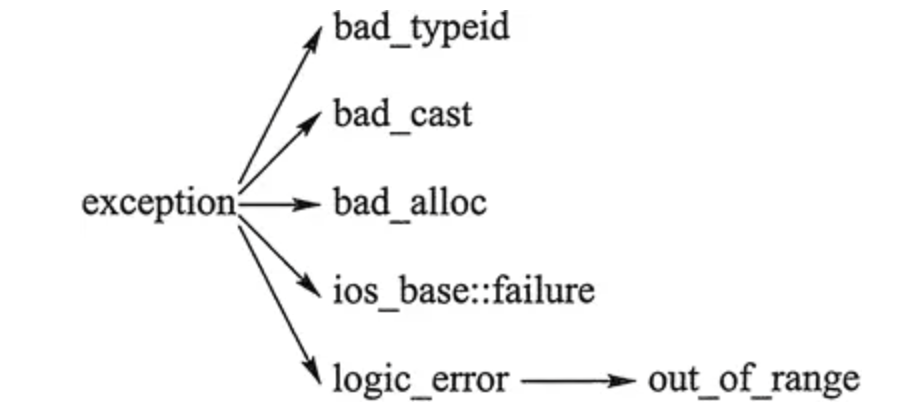

## C++面试知识整理

<!-- GFM-TOC -->

* [1.在main执行之前和之后执行的代码可能是什么？](#1在main执行之前和之后执行的代码可能是什么)
* [2.结构体内存对齐问题？](#2结构体内存对齐问题)
* [3.指针和引用的区别](#3指针和引用的区别)
* [4.堆和栈的区别](#4堆和栈的区别)
* [5.区别以下指针类型？](#5区别以下指针类型)
* [6.基类的虚函数表存放在内存的什么区，虚表指针vptr的初始化时间](#6基类的虚函数表存放在内存的什么区虚表指针vptr的初始化时间)
* [7.new / delete 与 malloc / free的异同](#7new--delete-与-malloc--free的异同exit)
* [8.new和delete是如何实现的？](#8new和delete是如何实现的)
* [9.malloc和new的区别？](#9malloc和new的区别)
* [10宏定义和函数有何区别？](#10宏定义和函数有何区别)
* [11.宏定义和typedef区别？](#11宏定义和typedef区别)
* [12.变量声明和定义区别？](#12变量声明和定义区别)
* [13.哪几种情况必须用到初始化成员列表？](#13哪几种情况必须用到初始化成员列表)
* [14.strlen和sizeof区别？](#14strlen和sizeof区别)
* [15.常量指针和指针常量区别？](#15常量指针和指针常量区别)
* [16.a和&a有什么区别？](#16a和a有什么区别)
* [17.数组名和指针（这里为指向数组首元素的指针）区别？](#17数组名和指针这里为指向数组首元素的指针区别)
* [18.野指针和悬空指针](#18野指针和悬空指针)
* [19.迭代器失效的情况](#19迭代器失效的情况)
* [20.C和C++的区别](#20c和c的区别)
* [21.C++与Java的区别]()
* []()
* []()
* []()
* []()
* []()
* []()
* []()
* []()
* []()
* []()
* []()
* []()
* []()
* []()
* []()
* []()
* []()
* []()
* []()
* []()
* []()
* []()
* []()
* []()
* []()
* []()
* []()
* []()
* []()

<!-- GFM-TOC -->

---

### 1.在main执行之前和之后执行的代码可能是什么？

> 操作系统装载程序之后，首先运行的代码并不是main的第一行，而是某些特别的代码，这些代码准备好main函数执行说需要的环境，并且负责调用main函数，这时候你才可以再main函数里放心大胆的写各种代码：申请内存、使用系统调用、触发异常、访问IO。在main函数返回之后，他会记录main函数的返回值，调用atexit注册的函数，然后结束进程。
>  ——《程序员的自我修养--链接、装载与库》

#### main函数之前

简单来说，main函数之前，主要做了这些：

+ 配置堆栈
+ 初始化静态和全局变量
+ 为未初始化部分的全局变量赋值
+ 运行全局构造器
+ 将main函数的参数（argv，argc等）传递给main函数

这些基本都是变量、环境的配置。因此，如果想执行一段代码，最简单的办法就只有一个了：利用构造函数。
大方向敲定，那么剩下的小细节无非就是类放在哪的问题了。

+ 全局变量

+ 静态变量

+ `include`文件中的全局或静态变量

+ `namespace`中

+ 等等…

比如：

```c++
class A{
public:
    A(){
        cout << "before main()" << endl;
    }
    ~A(){
        cout << "after main()" << endl;
    }
}

A a; //全局变量

int main(){
    cout << "this is in main()" << endl;
    return 0;
}
```

#### main函数之后

- 全局对象的析构函数会在main函数之后执行；

- 可以用 **atexit** 注册一个函数，它会在main 之后执行;

  > `onexit( func )`（对于C）或 `atexit( func )`（对于C++）。不过这两个函数有一点小小的差别：
  >
  > + onexit( func ) 要求注册的函数func返回值为int型；
  > + atexit( func ) 要求函数没有返回值，即返回值类型为void；
  >
  > 不过这两个函数都要求函数没有传入参数。

```c++
void func2(void){
    cout << "function 2" << endl;
}

int main() {
	cout << "this is main 1" << endl;
	atexit(func2);
	cout << "this is main 2" << endl;
        return 0;
}
```

输出：

```shell
this is main 1
this is main 2
function 2
```

---

### 2.结构体内存对齐问题？

#### 对齐问题

当定义结构体为：

```c++
struct number_2
{
    char a;
    int b;
    double c;
}st2;
```

> st2所占内存并非1+4+8=13个，而是16个>13个。

结构体中包含有相同类型或不同类型的数据类型，如char（1字节），int（4字节），double（8字节），所以结构体内存出现了一个对齐原则：

**结构体变量中元素是按照定义顺序一个一个放到内存中去的，但并不是紧密排列的。从结构体存储的首地址开始，每一个元素放置到内存中时，它都会认为内存是以它自己的大小来划分的，因此元素放置的位置一定会在自己宽度的整数倍上开始（以结构体变量首地址为0计算）。**

即，当char a时，以char自身大小（一字节）划分，a占有了首地址0一个字节。但是当int b时，以int自身大小（四字节）划分，所以b从四字节的非负整数倍开始存储占用四个字节，由于首地址0已被占用，所以b从第四个地址开始占用四个字节。同理，当double c时，double也以自身大小（八字节）划分内存，而前八个（0——7）已被占用，故c从第八个地址开始占用八个字节。如下左图：

> 如果去掉中间定义的int b，st2仍然占16个字节。因为，double c时，首地址0已被占用，c不能从0（8的0倍）开始，就只能从8（8的1倍）开始。如下右图：

<div align="center">
    
</div>

而且，double b之前空着的内存，在对齐下原则可以随意增加变量，内存是不会增加的。如下图：

<div align="center">
    
</div>

#### 补齐原则

当定义结构体为：

```c++
struct number_4
{
    char a;
    int b;
    char c;
}st4;
```

> sizeof(st4)=12,而不是4+4+1=9。

这时候就牵扯到一个补齐原则：

**在经过对齐原则分析后，检查计算出的存储单元是否为所有元素中所占内存最大的元素的长度的整数倍，是，则结束；若不是，则补齐为它的整数倍。**

即，当4+4+1=9不是结构体中内存最大元素b的整数倍时，要补齐成其整数倍12。如下图左所示，如果将int换成double，sizeof(st4)=24为最大元素double的整数倍了。如下图右所示：

<div align="center">
    
</div>

---

### 3.指针和引用的区别

#### 性质方面

- 指针是一个变量，存储的是一个地址，引用跟原来的变量实质上是同一个东西，是原变量的别名
- 指针可以有 **多级** ，引用只有一级
- 指针可以为空，引用不能为`NULL`且在定义时 **必须初始化**
- 指针在初始化后 **可以改变指向** ，而引用在初始化之后 **不可再改变**

#### 内存

- `sizeof`指针得到的是本指针的大小，`sizeof`引用得到的是引用所指向变量的大小

- 引用只是别名，不占用具体存储空间，只有声明没有定义；指针是具体变量，需要占用存储空间。

#### 使用

+ 引用一旦初始化之后就不可以再改变（变量可以被引用为多次，但引用只能作为一个变量引用）；指针变量可以重新指向别的变量。

+ 引用在声明时必须初始化为另一变量，一旦出现必须为`typename refname &varname`形式；指针声明和定义可以分开，可以先只声明指针变量而不初始化，等用到时再指向具体变量。

+ **当把指针作为参数进行传递时，也是<font color = red>将实参的一个拷贝传递给形参，两者指向的地址相同，但不是同一个变量，在函数中改变这个变量的指向不影响实参，而引用却可以。</font>**

```c++
void test(int *p)
{
　　int a=1;
　　p=&a;
　　cout<<p<<" "<<*p<<endl;
}

int main(void)
{
    int *p=NULL;
    test(p);
    if(p==NULL)
    	cout<<"指针p为NULL"<<endl;
    return 0;
}
//运行结果为：
//0x22ff44 1
//指针p为NULL
//*******************************	
void testPTR(int* p) {
    int a = 12;
    p = &a;

}

void testREFF(int& p) {
    int a = 12;
    p = a;

}
void main()
{
    int a = 10;
    int* b = &a;
    testPTR(b);//改变指针指向，但是没改变指针的所指的内容
    cout << a << endl;// 10
    cout << *b << endl;// 10

    a = 10;
    testREFF(a);
    cout << a << endl;//12
}
```

---

### 4.堆和栈的区别

- **申请方式不同**：栈由系统自动分配；堆是自己申请和释放的。
- **申请大小限制不同：** 栈顶和栈底是之前预设好的，栈是向栈底扩展，大小固定，可以通过ulimit -a查看，由ulimit -s修改；堆向高地址扩展，是不连续的内存区域，大小可以灵活调整。
- **申请效率不同**：栈由系统分配，速度快，不会有碎片；堆由程序员分配，速度慢，且会有碎片。

<div align="center">
    
</div>

**形象的比喻**

栈就像我们去饭馆里吃饭，只管点菜（发出申请）、付钱、和吃（使用），吃饱了就走，不必理会切菜、洗菜等准备工作和洗碗、刷锅等扫尾工作，他的好处是快捷，但是自由度小。

堆就象是自己动手做喜欢吃的菜肴，比较麻烦，但是比较符合自己的口味，而且自由度大。


#### 引申1：C++的内存分区管理方式

首先说明,在C++中，内存分为5个区：堆、占、自由存储区、全局/静态存储区、常量存储区

+ **栈：** 是由编译器在需要时自动分配，不需要时自动清除的变量存储区。通常存放局部变量、函数参数等。
+ **堆：** 是由new分配的内存块，由程序员释放（编译器不管），一般一个new与一个delete对应，一个new[]与一个delete[]对应。如果程序员没有释放掉，资源将由操作系统在程序结束后自动回收。
+ **自由存储区：** 是由malloc等分配的内存块，和堆十分相似，用free来释放。
+ **全局/静态存储区：** 全局变量和静态变量被分配到同一块内存中（在C语言中，全局变量又分为初始化的和未初始化的，C++中没有这一区分）。
+ **常量存储区：** 这是一块特殊存储区，里边存放常量，不允许修改。

```c++
//main.cpp
int   a   =   0;   //全局初始化区
char   *p1;        //全局未初始化区
int main(){
  int   b;                     //栈
	char   s[]   =   "abc";      // 栈
	char   *p2;                  //栈
	char   *p3   =   "123456";   // 123456/0在常量区，p3在栈上。
	static int c = 0；           // 全局（静态）初始化区
	p1 =   (char *)malloc(10)
	p2 =   (char *)malloc(20)    // 分配得来得10和20字节的区域就在堆区。
	strcpy(p1, "123456");        // 123456/0放在常量区，编译器可能会将它与p3所指向的"123456"优化成一个地方。
}
```

> 注意：堆和自由存储区其实不过是同一块区域，
>
> new底层实现代码中调用了malloc，new可以看成是malloc智能化的高级版本


#### 引申2：堆和自由存储区是不是同一块区域

自由存储区是C++基于new操作符的一个抽象概念，凡是通过new操作符进行内存申请，该内存即为自由存储区。

而堆是操作系统中的术语，是操作系统所维护的一块特殊内存，用于程序的内存动态分配，C语言使用malloc从堆上分配内存，使用free释放已分配的对应内存。自由存储区不等于堆，如上所述，布局new就可以不位于堆中。

---

### 5.区别以下指针类型？

```c++
int *p[10]
int (*p)[10]
int *p(int)
int (*p)(int)
```

- `int *p[10]`表示指针数组， **强调数组概念** ，是一个数组变量，数组大小为10，数组内每个元素都是指向int类型的指针变量。
- `int (*p)[10]`表示数组指针， **强调是指针** ，只有一个变量，是指针类型，不过指向的是一个int类型的数组，这个数组大小是10。
- `int *p(int)`是函数声明，函数名是p，参数是int类型的，返回值是int *类型的。
- `int (*p)(int)`是函数指针，强调是指针，该指针指向的函数具有int类型参数，并且返回值是int类型的。

---

### 6.基类的虚函数表存放在内存的什么区，虚表指针vptr的初始化时间

首先整理一下虚函数表的特征：

- **虚函数表是全局共享的元素，即全局仅有一个，在编译时就构造完成**
- **虚函数表类似一个数组，类对象中存储`vptr`指针，指向虚函数表，即虚函数表不是函数，不是程序代码，不可能存储在代码段**
- **虚函数表存储虚函数的地址,即虚函数表的元素是指向类成员函数的指针,而类中虚函数的个数在编译时期可以确定，即虚函数表的大小可以确定,即大小是在编译时期确定的，不必动态分配内存空间存储虚函数表，所以不在堆中**

根据以上特征，虚函数表类似于 类中 **静态成员变量** 。静态成员变量也是全局共享，大小确定，因此最有可能存在全局数据区，测试结果显示：

虚函数表`vtable`在Linux/Unix中存放在可执行文件的只读数据段中(rodata)，这与微软的编译器将虚函数表存放在常量段存在一些差别

由于虚表指针`vptr`跟虚函数密不可分，对于有虚函数或者继承于拥有虚函数的基类，对该类进行实例化时，在构造函数执行时会对虚表指针进行初始化，并且存在对象内存布局的最前面。

一般分为五个区域：栈区、堆区、函数区（存放函数体等二进制代码）、全局静态区、常量区

C++中虚函数表位于只读数据段（.rodata），也就是C++内存模型中的常量区；而虚函数则位于代码段（.text），也就是C++内存模型中的代码区。

---

### 7.new / delete 与 malloc / free的异同

#### 相同点

- 都可用于内存的动态申请和释放

#### 不同点

- 前者是C++运算符，后者是C/C++语言标准库函数
- new自动计算要分配的空间大小，malloc需要手工计算
- new是类型安全的，malloc不是。例如：

```c++
int *p = new float[2]; //编译错误
int *p = (int*)malloc(2 * sizeof(double));//编译无错误
```

+ new调用名为**operator new**的标准库函数分配足够空间并调用相关对象的构造函数，delete对指针所指对象运行适当的析构函数；然后通过调用名为**operator delete**的标准库函数释放该对象所用内存。后者均没有相关调用
+ 后者需要库文件支持，前者不用
+ new是封装了malloc，直接free不会报错，但是这只是释放内存，而不会析构对象

---

### 8.new和delete是如何实现的？

- new的实现过程是：首先调用名为**operator new**的标准库函数，分配足够大的原始为类型化的内存，以保存指定类型的一个对象；接下来运行该类型的一个构造函数，用指定初始化构造对象；最后返回指向新分配并构造后的的对象的指针
- delete的实现过程：对指针指向的对象运行适当的析构函数；然后通过调用名为**operator delete**的标准库函数释放该对象所用内存

---

### 9.malloc和new的区别？

- malloc和free是标准库函数，支持覆盖；new和delete是运算符，并且支持重载。
- malloc仅仅分配内存空间，free仅仅回收空间，不具备调用构造函数和析构函数功能，用malloc分配空间存储类的对象存在风险；new和delete除了分配回收功能外，还会调用构造函数和析构函数。
- malloc和free返回的是void类型指针（必须进行类型转换），new和delete返回的是具体类型指针。

**delete和delete[]区别？**

- delete只会调用一次析构函数。
- delete[]会调用数组中每个元素的析构函数。

---

### 10宏定义和函数有何区别？

- 宏在编译时完成替换，之后被替换的文本参与编译，相当于直接插入了代码，运行时不存在函数调用，执行起来更快；函数调用在运行时需要跳转到具体调用函数。
- 宏定义属于在结构中插入代码，没有返回值；函数调用具有返回值。
- 宏定义参数没有类型，不进行类型检查；函数参数具有类型，需要检查类型。
- 宏定义不要在最后加分号。

---

### 11.宏定义和typedef区别？

- 宏主要用于定义常量及书写复杂的内容；typedef主要用于定义类型别名。
- 宏替换发生在编译阶段之前，属于文本插入替换；typedef是编译的一部分。
- 宏不检查类型；typedef会检查数据类型。
- 宏不是语句，不在在最后加分号；typedef是语句，要加分号标识结束。
- 注意对指针的操作，`typedef char * p_char`和`#define p_char char *`区别巨大。

---

### 12.变量声明和定义区别？

- 声明仅仅是把变量的声明的位置及类型提供给编译器，并不分配内存空间；定义要在定义的地方为其分配存储空间。
- 相同变量可以在多处声明（外部变量extern），但只能在一处定义。

---

### 13.哪几种情况必须用到初始化成员列表？

- 初始化一个const成员。
- 初始化一个reference成员。
- 调用一个基类的构造函数，而该函数有一组参数。
- 调用一个数据成员对象的构造函数，而该函数有一组参数。

---

### 14.strlen和sizeof区别？

- sizeof是运算符，并不是函数，结果在编译时得到而非运行中获得；strlen是字符处理的库函数。
- sizeof参数可以是任何数据的类型或者数据（sizeof参数不退化）；strlen的参数只能是字符指针且结尾是'\0'的字符串。
- 因为sizeof值在编译时确定，所以不能用来得到动态分配（运行时分配）存储空间的大小。

```c++
int main(int argc, char const *argv[]){   
      const char* str = "name";
      sizeof(str); // 取的是指针str的长度，是8(64位为8字节，32位还是4字节，int*无论是32位还是64位都是4个字节)
      strlen(str); // 取的是这个字符串的长度，不包含结尾的 \0。大小是4
      return 0;
 }
```

---

### 15.常量指针和指针常量区别？

- 常量指针是一个指针，读成常量的指针，指向一个只读变量。如`int const *p`或`const int *p`。
- 指针常量是一个不能给改变指向的指针。指针是个常量，不能中途改变指向，如`int *const p`。

---

### 16.a和&a有什么区别？

```c++
//假设数组int a[10];
int a[10] = {1,2,3,4,5,6,7,8,9,10};
int (*p)[10] = &a;

cout << *(*p + 1)<< endl;//2
cout << *(a + 1) << endl;//2
```

- a是数组名，是数组首元素地址，+1表示地址值加上一个int类型的大小，如果a的值是0x00000001，加1操作后变为0x00000005。*(a + 1) = a[1]。
- &a是数组的指针，其类型为int (*)[10]（就是前面提到的数组指针），其加1时，系统会认为是数组首地址加上整个数组的偏移（10个int型变量），值为数组a尾元素后一个元素的地址。
- 若(int *)p ，此时输出 *p时，其值为a[0]的值，因为被转为int *类型，解引用时按照int类型大小来读取。

---

### 17.数组名和指针（这里为指向数组首元素的指针）区别？

- 二者均可通过增减偏移量来访问数组中的元素。
- 数组名不是真正意义上的指针，可以理解为常指针，所以数组名没有自增、自减等操作。
- 当数组名当做形参传递给调用函数后，就失去了原有特性，退化成一般指针，多了自增、自减操作，但sizeof运算符不能再得到原数组的大小了。

---

### 18.野指针和悬空指针

都是是指向无效内存区域(这里的无效指的是"不安全不可控")的指针，访问行为将会导致未定义行为。

**野指针**，指的是没有被初始化过的指针

```c++
int main(void) { 
  int * p;
  std::cout<<*p<<std::endl;
  return 0;
}
```

因此，为了防止出错，对于指针初始化时都是赋值为 `nullptr`，这样在使用时编译器就会直接报错，产生非法内存访问。

**悬空指针**，指针最初指向的内存已经被释放了的一种指针。

```c++
int main(void) { 
  int * p = nullptr;
  int* p2 = new int; 
  p = p2;
  delete p2;
}
```

此时 p和p2就是悬空指针，指向的内存已经被释放。继续使用这两个指针，行为不可预料。需要设置为`p=p2=nullptr`。此时再使用，编译器会直接保错。

避免野指针比较简单，但悬空指针比较麻烦。c++引入了智能指针，C++智能指针的本质就是避免悬空指针的产生。

**产生原因及解决办法：**

野指针：指针变量未及时初始化 => 定义指针变量及时初始化，要么置空。

悬空指针：指针free或delete之后没有及时置空 => 释放操作后立即置空。

---

### 19.迭代器失效的情况

以vector为例：

**插入元素：**

1、尾后插入：size < capacity时，首迭代器不失效尾迭代失效（未重新分配空间），size == capacity时，所有迭代器均失效（需要重新分配空间）。

2、中间插入：中间插入：size < capacity时，首迭代器不失效但插入元素之后所有迭代器失效，size == capacity时，所有迭代器均失效。

**删除元素：**

尾后删除：只有尾迭代失效。

中间删除：删除位置之后所有迭代失效。

---

### 20.C和C++的区别

- C++中new和delete是对内存分配的运算符，取代了C中的malloc和free。
- 标准C++中的字符串类取代了标准C函数库头文件中的字符数组处理函数（C中没有字符串类型）。
- C++中用来做控制态输入输出的iostream类库替代了标准C中的stdio函数库。
- C++中的try/catch/throw异常处理机制取代了标准C中的setjmp()和longjmp()函数。
- 在C++中，允许有相同的函数名，不过它们的参数类型不能完全相同，这样这些函数就可以相互区别开来。而这在C语言中是不允许的。也就是C++可以重载，C语言不允许。
- C++语言中，允许变量定义语句在程序中的任何地方，只要在是使用它之前就可以；而C语言中，必须要在函数开头部分。而且C++允许重复定义变量，C语言也是做不到这一点的
- 在C++中，除了值和指针之外，新增了引用。引用型变量是其他变量的一个别名，我们可以认为他们只是名字不相同，其他都是相同的。
- C++相对与C增加了一些关键字，如：bool、using、dynamic_cast、namespace等等

---

###  21.C++与Java的区别

#### **语言特性**

- Java语言给开发人员提供了更为简洁的语法；完全面向对象，由于JVM可以安装到任何的操作系统上，所以说它的可移植性强
- Java语言中没有指针的概念，引入了真正的数组。不同于C++中利用指针实现的“伪数组”，Java引入了真正的数组，同时将容易造成麻烦的指针从语言中去掉，这将有利于防止在C++程序中常见的因为数组操作越界等指针操作而对系统数据进行非法读写带来的不安全问题
- C++也可以在其他系统运行，但是需要不同的编码（这一点不如Java，只编写一次代码，到处运行），例如对一个数字，在windows下是大端存储，在unix中则为小端存储。Java程序一般都是生成字节码，在JVM里面运行得到结果
- Java用接口(Interface)技术取代C++程序中的多继承性。接口与多继承有同样的功能，但是省却了多继承在实现和维护上的复杂性

#### **垃圾回收**

- C++用析构函数回收垃圾，写C和C++程序时一定要注意内存的申请和释放
- Java语言不使用指针，内存的分配和回收都是自动进行的，程序员无须考虑内存碎片的问题

#### **应用场景**

- Java在桌面程序上不如C++实用，C++可以直接编译成exe文件，指针是c++的优势，可以直接对内存的操作，但同时具有危险性 。（操作内存的确是一项非常危险的事情，一旦指针指向的位置发生错误，或者误删除了内存中某个地址单元存放的重要数据，后果是可想而知的）
- Java在Web 应用上具有C++ 无可比拟的优势，具有丰富多样的框架
- 对于底层程序的编程以及控制方面的编程，C++很灵活，因为有句柄的存在

---

### 22.C++中struct和class的区别

#### **相同点**

- 两者都拥有成员函数、公有和私有部分
- 任何可以使用class完成的工作，同样可以使用struct完成

#### **不同点**

- 两者中如果不对成员不指定公私有，struct默认是公有的，class则默认是私有的
- class默认是private继承，而struct模式是public继承
- class可以作为模板类型，struct不行

#### **引申**：C++和C的struct区别

- C语言中：struct是用户自定义数据类型（UDT）；C++中struct是抽象数据类型（ADT），支持成员函数的定义，（C++中的struct能继承，能实现多态）
- C中struct是没有权限的设置的，且struct中只能是一些变量的集合体，可以封装数据却不可以隐藏数据，而且成员不可以是函数
- C++中，struct增加了访问权限，且可以和类一样有成员函数，成员默认访问说明符为public（为了与C兼容）
- struct作为类的一种特例是用来自定义数据结构的。一个结构标记声明后，在C中必须在结构标记前加上struct，才能做结构类型名（除：typedef struct class{};）;C++中结构体标记（结构体名）可以直接作为结构体类型名使用，此外结构体struct在C++中被当作类的一种特例

---

### 23.define宏定义和const的区别

#### **编译阶段**

- define是在编译的**预处理**阶段起作用，而const是在编译、运行的时候起作用

#### **安全性**

- define只做替换，不做类型检查和计算，也不求解，容易产生错误，一般最好加上一个大括号包含住全部的内容，要不然很容易出错
- const常量有数据类型，编译器可以对其进行类型安全检查

#### **内存占用**

- define只是将宏名称进行替换，在内存中会产生多分相同的备份。const在程序运行中只有一份备份，且可以执行常量折叠，能将复杂的的表达式计算出结果放入常量表
- 宏替换发生在编译阶段之前，属于文本插入替换；const作用发生于编译过程中。
- 宏不检查类型；const会检查数据类型。
- 宏定义的数据没有分配内存空间，只是插入替换掉；const定义的变量只是值不能改变，但要分配内存空间。

---

#### 24.C++中const和static的作用

#### **static**

- 不考虑类的情况
- 隐藏。所有不加static的全局变量和函数具有全局可见性，可以在其他文件中使用，加了之后只能在该文件所在的编译模块中使用
- 默认初始化为0，包括未初始化的全局静态变量与局部静态变量，都存在全局未初始化区
- 静态变量在函数内定义，始终存在，且只进行一次初始化，具有记忆性，其作用范围与局部变量相同，函数退出后仍然存在，但不能使用
- 考虑类的情况
- static成员变量：只与类关联，不与类的对象关联。定义时要分配空间，不能在类声明中初始化，必须在类定义体外部初始化，初始化时不需要标示为static；可以被非static成员函数任意访问。
- static成员函数：不具有this指针，无法访问类对象的非static成员变量和非static成员函数；**不能被声明为const、虚函数和volatile**；可以被非static成员函数任意访问

#### **const**

- 不考虑类的情况

- const常量在定义时必须初始化，之后无法更改

- const形参可以接收const和非const类型的实参，例如

  ```c++
  // i 可以是 int 型或者 const int 型
  void fun(const int& i){
      //...
  }
  ```

- 考虑类的情况

- const成员变量：不能在类定义外部初始化，只能通过构造函数初始化列表进行初始化，并且必须有构造函数；不同类对其const数据成员的值可以不同，所以不能在类中声明时初始化

- const成员函数：const对象不可以调用非const成员函数；非const对象都可以调用；不可以改变非mutable（用该关键字声明的变量可以在const成员函数中被修改）数据的值

---

### 25.C++的顶层const和底层const

#### **概念区分**

- **顶层**const：指的是const修饰的变量本身是一个常量，无法修改，指的是指针，就是 * 号的右边
- **底层**const：指的是const修饰的变量所指向的对象是一个常量，指的是所指变量，就是 * 号的左边

#### **举个例子**

```c++
int a = 10;
int* const b1 = &a;        //顶层const，b1本身是一个常量
const int* b2 = &a;        //底层const，b2本身可变，所指的对象是常量
const int b3 = 20;            //顶层const，b3是常量不可变
const int* const b4 = &a;  //前一个const为底层，后一个为顶层，b4不可变
const int& b5 = a;           //用于声明引用变量，都是底层const
```

#### **区分作用**

- 执行对象拷贝时有限制，常量的底层const不能赋值给非常量的底层const
- 使用命名的强制类型转换函数const_cast时，只能改变运算对象的底层const

```c++
const int a;
int const a;
const int *a;
int *const a;
```

- int const a和const int a均表示定义常量类型a。
- const int *a，其中a为指向int型变量的指针，const在 * 左侧，表示a指向不可变常量。(看成const (*a)，对引用加const)
- int *const a，依旧是指针类型，表示a为指向整型数据的常指针。(看成const(a)，对指针const)

---

### 26.类的对象存储空间？

- 非静态成员的数据类型大小之和。
- 编译器加入的额外成员变量（如指向虚函数表的指针）。
- 为了边缘对齐优化加入的padding。

---

### 27.final和override关键字

#### **override**

当在父类中使用了虚函数时候，你可能需要在某个子类中对这个虚函数进行重写，以下方法都可以：

```c++
class A
{
    virtual void foo();
}
class B : public A
{
    void foo(); //OK
    virtual void foo(); // OK
    void foo() override; //OK
}
```

如果不使用override，当你手一抖，将foo()写成了foo()会怎么样呢？结果是编译器并不会报错，因为它并不知道你的目的是重写虚函数，而是把它当成了新的函数。如果这个虚函数很重要的话，那就会对整个程序不利。所以，override的作用就出来了，它指定了子类的这个虚函数是重写的父类的，如果你名字不小心打错了的话，编译器是不会编译通过的：

```c++
class A
{
    virtual void foo();
};
class B : public A
{
    virtual void f00(); //OK，这个函数是B新增的，不是继承的
    virtual void f0o() override; //Error, 加了override之后，这个函数一定是继承自A的，A找不到就报错
};
```

#### **final**

当不希望某个类被继承，或不希望某个虚函数被重写，可以在类名和虚函数后添加final关键字，添加final关键字后被继承或重写，编译器会报错。例子如下：

```c++
class Base
{
    virtual void foo();
};

class A : public Base
{
    void foo() final; // foo 被override并且是最后一个override，在其子类中不可以重写
};

class B final : A // 指明B是不可以被继承的
{
    void foo() override; // Error: 在A中已经被final了
};

class C : B // Error: B is final
{
};
```

---

### 28.拷贝初始化和直接初始化

+ 当用于类类型对象时，初始化的拷贝形式和直接形式有所不同：直接初始化直接调用与实参匹配的构造函数，拷贝初始化总是调用拷贝构造函数。拷贝初始化首先使用指定构造函数创建一个临时对象，然后用拷贝构造函数将那个临时对象拷贝到正在创建的对象。举例如下

```c++
string str1("I am a string");//语句1 直接初始化
string str2(str1);//语句2 直接初始化，str1是已经存在的对象，直接调用构造函数对str2进行初始化
string str3 = "I am a string";//语句3 拷贝初始化，先为字符串”I am a string“创建临时对象，再把临时对象作为参数，使用拷贝构造函数构造str3
string str4 = str1;//语句4 拷贝初始化，这里相当于隐式调用拷贝构造函数，而不是调用赋值运算符函数
```

- **为了提高效率，允许编译器跳过创建临时对象这一步，**直接调用构造函数构造要创建的对象，这样就完全等价于**直接初始化了**（语句1和语句3等价）。但是需要辨别两种情况。
- 当拷贝构造函数为private时：语句3和语句4在编译时会报错
- 使用explicit修饰构造函数时：如果构造函数存在隐式转换，编译时会报错

---

### 29.初始化和赋值的区别

- 对于简单类型来说，初始化和赋值没什么区别

- 对于类和复杂数据类型来说，这两者的区别就大了，举例如下：

  ```c++
  class A{
  public:
      int num1;
      int num2;
  public:
      A(int a=0, int b=0):num1(a),num2(b){};
      A(const A& a){};
      //重载 = 号操作符函数
      A& operator=(const A& a){
          num1 = a.num1 + 1;
          num2 = a.num2 + 1;
          return *this;
      };
  };
  int main(){
  
      A a(1,1);
      A a1 = a; //拷贝初始化操作，调用拷贝构造函数
      A b;
      b = a;//赋值操作，对象a中，num1 = 1，num2 = 1；对象b中，num1 = 2，num2 = 2
      return 0;
  }
  ```

---

### 30.extern"C"的用法

为了能够正确的在C++代码中调用C语言的代码：在程序中加上extern "C"后，相当于告诉编译器这部分代码是C语言写的，因此要按照C语言进行编译，而不是C++；

哪些情况下使用extern "C"：

（1）C++代码中调用C语言代码；

（2）在C++中的头文件中使用；

（3）在多个人协同开发时，可能有人擅长C语言，而有人擅长C++；

举个例子，C++中调用C代码：

```c++
#ifndef __MY_HANDLE_H__
#define __MY_HANDLE_H__

extern "C"{
    typedef unsigned int result_t;
    typedef void* my_handle_t;

    my_handle_t create_handle(const char* name);
    result_t operate_on_handle(my_handle_t handle);
    void close_handle(my_handle_t handle);
}
```

- 参考的blog中有一篇google code上的文章，专门写extern "C"的，有兴趣的读者不妨去看看

> 《extern "C"的功能和用法研究》：https://blog.csdn.net/sss_369/article/details/84060561

综上，总结出使用方法，在C语言的头文件中，对其外部函数只能指定为extern类型，C语言中不支持extern "C"声明，在.c文件中包含了extern "C"时会出现编译语法错误。所以使用extern "C"全部都放在于cpp程序相关文件或其头文件中。

总结出如下形式：

（1）C++调用C函数：

```c++
/xx.h
extern int add(...)

//xx.c
int add(){

}

//xx.cpp
extern "C" {
    #include "xx.h"
}
```

（2）C调用C++函数

```c++
//xx.h
extern "C"{
    int add();
}
//xx.cpp
int add(){

}
//xx.c
extern int add();
```

---

### 31.模板函数和模板类的特例化

#### **引入原因**

编写单一的模板，它能适应多种类型的需求，使每种类型都具有相同的功能，但对于某种特定类型，如果要实现其特有的功能，单一模板就无法做到，这时就需要模板特例化

#### **定义**

对单一模板提供的一个特殊实例，它将一个或多个模板参数绑定到特定的类型或值上

**（1）模板函数特例化**

必须为原函数模板的每个模板参数都提供实参，且使用关键字template后跟一个空尖括号对<>，表明将原模板的所有模板参数提供实参，举例如下：

```c++
template<typename T> //模板函数
int compare(const T &v1,const T &v2)
{
    if(v1 > v2) return -1;
    if(v2 > v1) return 1;
    return 0;
}
//模板特例化,满足针对字符串特定的比较，要提供所有实参，这里只有一个T
template<> 
int compare(const char* const &v1,const char* const &v2)
{
    return strcmp(p1,p2);
}
```

#### **本质**

特例化的本质是实例化一个模板，而非重载它。特例化不影响参数匹配。参数匹配都以最佳匹配为原则。例如，此处如果是compare(3,5)，则调用普通的模板，若为compare(“hi”,”haha”)则调用**特例化版本**（因为这个cosnt char*相对于T，更匹配实参类型），注意二者函数体的语句不一样了，实现不同功能。

#### **注意**

模板及其特例化版本应该声明在同一个头文件中，且所有同名模板的声明应该放在前面，后面放特例化版本。

**（2）类模板特例化**

原理类似函数模板，不过在类中，我们可以对模板进行特例化，也可以对类进行部分特例化。对类进行特例化时，仍然用template<>表示是一个特例化版本，例如：

```c++
template<>
class hash<sales_data>
{
    size_t operator()(sales_data& s);
    //里面所有T都换成特例化类型版本sales_data
    //按照最佳匹配原则，若T != sales_data，就用普通类模板，否则，就使用含有特定功能的特例化版本。
};
```

#### **类模板的部分特例化**

不必为所有模板参数提供实参，可以指定一部分而非所有模板参数，一个类模板的部分特例化本身仍是一个模板，使用它时还必须为其特例化版本中未指定的模板参数提供实参(特例化时类名一定要和原来的模板相同，只是参数类型不同，按最佳匹配原则，哪个最匹配，就用相应的模板)

#### **特例化类中的部分成员**

可以特例化类中的部分成员函数而不是整个类，举个例子：

```c++
template<typename T>
class Foo
{
    void Bar();
    void Barst(T a)();
};

template<>
void Foo<int>::Bar()
{
    //进行int类型的特例化处理
    cout << "我是int型特例化" << endl;
}

Foo<string> fs;
Foo<int> fi;//使用特例化
fs.Bar();//使用的是普通模板，即Foo<string>::Bar()
fi.Bar();//特例化版本，执行Foo<int>::Bar()
//Foo<string>::Bar()和Foo<int>::Bar()功能不同
```

> 《类和函数模板特例化》：https://blog.csdn.net/wang664626482/article/details/52372789

---

### 32.C和C++的类型安全

#### **什么是类型安全？**

类型安全很大程度上可以等价于内存安全，类型安全的代码不会试图访问自己没被授权的内存区域。“类型安全”常被用来形容编程语言，其根据在于该门编程语言是否提供保障类型安全的机制；有的时候也用“类型安全”形容某个程序，判别的标准在于该程序是否隐含类型错误。类型安全的编程语言与类型安全的程序之间，没有必然联系。好的程序员可以使用类型不那么安全的语言写出类型相当安全的程序，相反的，差一点儿的程序员可能使用类型相当安全的语言写出类型不太安全的程序。绝对类型安全的编程语言暂时还没有。

**（1）C的类型安全**

C只在局部上下文中表现出类型安全，比如试图从一种结构体的指针转换成另一种结构体的指针时，编译器将会报告错误，除非使用显式类型转换。然而，C中相当多的操作是不安全的。以下是两个十分常见的例子：

- printf格式输出

  <div align="center">
      
  </div>

上述代码中，使用%d控制整型数字的输出，没有问题，但是改成%f时，明显输出错误，再改成%s时，运行直接报segmentation fault错误

- malloc函数的返回值

malloc是C中进行内存分配的函数，它的返回类型是`void*`即空类型指针，常常有这样的用法`char * pStr=(char * )malloc(100 * sizeof(char))`，这里明显做了显式的类型转换。类型匹配尚且没有问题，但是一旦出现`int* pInt=(int*)malloc(100*sizeof(char))`就很可能带来一些问题，而这样的转换C并不会提示错误。

**（2）C++的类型安全**

如果C++使用得当，它将远比C更有类型安全性。相比于C语言，C++提供了一些新的机制保障类型安全：

- 操作符new返回的指针类型严格与对象匹配，而不是`void*`
- C中很多以`void*`为参数的函数可以改写为C++模板函数，而模板是支持类型检查的；
- 引入const关键字代替`#define constants`，它是有类型、有作用域的，而`#define constants`只是简单的文本替换
- 一些#define宏可被改写为inline函数，结合函数的重载，可在类型安全的前提下支持多种类型，当然改写为模板也能保证类型安全
- C++提供了**dynamic_cast**关键字，使得转换过程更加安全，因为`dynamic_cast比static_cast`涉及更多具体的类型检查。

例1：使用`void*`进行类型转换

<div align="center">
    
</div>

例2：不同类型指针之间转换

```c++
#include<iostream>
using namespace std;

class Parent{};
class Child1 : public Parent
{
public:
    int i;
    Child1(int e):i(e){}
};
class Child2 : public Parent
{
public:
    double d;
    Child2(double e):d(e){}
};
int main()
{
    Child1 c1(5);
    Child2 c2(4.1);
    Parent* pp;
    Child1* pc1;

    pp=&c1; 
    pc1=(Child1*)pp;  // 类型向下转换 强制转换，由于类型仍然为Child1*，不造成错误
    cout<<pc1->i<<endl; //输出：5

    pp=&c2;
    pc1=(Child1*)pp;  //强制转换，且类型发生变化，将造成错误
    cout<<pc1->i<<endl;// 输出：1717986918
    return 0;
}
```

上面两个例子之所以引起类型不安全的问题，是因为程序员使用不得当。第一个例子用到了空类型指针`void*`，第二个例子则是在两个类型指针之间进行强制转换。因此，想保证程序的类型安全性，应尽量避免使用空类型指针`void*`，尽量不对两种类型指针做强制转换。

---

### 33.为什么析构函数一般写成虚函数

由于类的多态性，基类指针可以指向派生类的对象，如果删除该基类的指针，就会调用该指针指向的派生类析构函数，而派生类的析构函数又自动调用基类的析构函数，这样整个派生类的对象完全被释放。如果析构函数不被声明成虚函数，则编译器实施静态绑定，在删除基类指针时，只会调用基类的析构函数而不调用派生类析构函数，这样就会造成派生类对象析构不完全，造成内存泄漏。所以将析构函数声明为虚函数是十分必要的。在实现多态时，当用基类操作派生类，在析构时防止只析构基类而不析构派生类的状况发生，要将基类的析构函数声明为虚函数。举个例子：

```c++
#include <iostream>
using namespace std;

class Parent{
public:
    Parent(){
        cout << "Parent construct function"  << endl;
    };
    ~Parent(){
        cout << "Parent destructor function" <<endl;
    }
};

class Son : public Parent{
public:
    Son(){
        cout << "Son construct function"  << endl;
    };
    ~Son(){
        cout << "Son destructor function" <<endl;
    }
};

int main()
{
    Parent* p = new Son();
    delete p;
    p = NULL;
    return 0;
}
//运行结果：
//Parent construct function
//Son construct function
//Parent destructor function
```

将基类的析构函数声明为虚函数：

```c++
#include <iostream>
using namespace std;

class Parent{
public:
    Parent(){
        cout << "Parent construct function"  << endl;
    };
    virtual ~Parent(){
        cout << "Parent destructor function" <<endl;
    }
};

class Son : public Parent{
public:
    Son(){
        cout << "Son construct function"  << endl;
    };
    ~Son(){
        cout << "Son destructor function" <<endl;
    }
};

int main()
{
    Parent* p = new Son();
    delete p;
    p = NULL;
    return 0;
}
//运行结果：
//Parent construct function
//Son construct function
//Son destructor function
//Parent destructor function
```

---

### 34.构造函数能否声明为虚函数或者纯虚函数，析构函数呢？

**析构函数**：

- 析构函数可以为虚函数，并且一般情况下基类析构函数要定义为虚函数。
- 只有在基类析构函数定义为虚函数时，调用操作符delete销毁指向对象的基类指针时，才能准确调用派生类的析构函数（从该级向上按序调用虚函数），才能准确销毁数据。
- 析构函数可以是纯虚函数，含有纯虚函数的类是抽象类，此时不能被实例化。但派生类中可以根据自身需求重新改写基类中的纯虚函数。

**构造函数**：

- 构造函数不能定义为虚函数。在构造函数中可以调用虚函数，不过此时调用的是正在构造的类中的虚函数，而不是子类的虚函数，因为此时子类尚未构造好。

---

### 35.C++中的重载、重写（覆盖）和隐藏的区别

（1）重载（overload）

重载是指在同一范围定义中的同名成员函数才存在重载关系。主要特点是函数名相同，参数类型和数目有所不同，不能出现参数个数和类型均相同，仅仅依靠返回值不同来区分的函数。重载和函数成员是否是虚函数无关。举个例子：

```c++
class A{
    ...
    virtual int fun();
    void fun(int);
    void fun(double, double);
    static int fun(char);
    ...
}
```

（2）重写（覆盖）（override）

重写指的是在派生类中覆盖基类中的同名函数，重写就是重写函数体**，**要求基类函数必须是虚函数且：

- 与基类的虚函数有相同的参数个数
- 与基类的虚函数有相同的参数类型
- 与基类的虚函数有相同的返回值类型

举个例子：

```c++
//父类
class A{
public:
    virtual int fun(int a){}
}
//子类
class B : public A{
public:
    //重写,一般加override可以确保是重写父类的函数
    virtual int fun(int a) override{}
}
```

重载与重写的区别：

- 重写是父类和子类之间的垂直关系，重载是不同函数之间的水平关系
- 重写要求参数列表相同，重载则要求参数列表不同，返回值不要求
- 重写关系中，调用方法根据对象类型决定，重载根据调用时实参表与形参表的对应关系来选择函数体

（3）隐藏（hide）

隐藏指的是某些情况下，派生类中的函数屏蔽了基类中的同名函数，包括以下情况：

- 两个函数参数相同，但是基类函数不是虚函数。**和重写的区别在于基类函数是否是虚函数。**举个例子：

  ```c++
  //父类
  class A{
  public:
      void fun(int a){
          cout << "A中的fun函数" << endl;
      }
  };
  //子类
  class B : public A{
  public:
      //隐藏父类的fun函数
      void fun(int a){
          cout << "B中的fun函数" << endl;
      }
  };
  int main(){
      B b;
      b.fun(2); //调用的是B中的fun函数
      b.A::fun(2); //调用A中fun函数
      return 0;
  }
  ```

- 两个函数参数不同，无论基类函数是不是虚函数，都会被隐藏。和重载的区别在于两个函数不在同一个类中。举个例子：

  ```c++
  //父类
  class A{
  public:
      virtual void fun(int a){
          cout << "A中的fun函数" << endl;
      }
  };
  //子类
  class B : public A{
  public:
      //隐藏父类的fun函数
     virtual void fun(char* a){
         cout << "A中的fun函数" << endl;
     }
  };
  int main(){
      B b;
      b.fun(2); //报错，调用的是B中的fun函数，参数类型不对
      b.A::fun(2); //调用A中fun函数
      return 0;
  }
  ```

---

### 36.C++的多态如何实现

C++的多态性，**一言以蔽之**就是：

在基类的函数前加上**virtual**关键字，在派生类中重写该函数，运行时将会根据所指对象的实际类型来调用相应的函数，如果对象类型是派生类，就调用派生类的函数，如果对象类型是基类，就调用基类的函数。

举个例子：

```c++
#include <iostream>
using namespace std;

class Base{
public:
    virtual void fun(){
        cout << " Base::func()" <<endl;
    }
};

class Son1 : public Base{
public:
    virtual void fun() override{
        cout << " Son1::func()" <<endl;
    }
};

class Son2 : public Base{

};

int main()
{
    Base* base = new Son1;
    base->fun();
    base = new Son2;
    base->fun();
    delete base;
    base = NULL;
    return 0;
}
// 运行结果
// Son1::func()
// Base::func()
```

例子中，Base为基类，其中的函数为虚函数。子类1继承并重写了基类的函数，子类2继承基类但没有重写基类的函数，从结果分析子类体现了多态性，那么为什么会出现多态性，其底层的原理是什么？这里需要引出虚表和虚基表指针的概念。

虚表：虚函数表的缩写，类中含有virtual关键字修饰的方法时，编译器会自动生成虚表

虚表指针：在含有虚函数的类实例化对象时，对象地址的前四个字节存储的指向虚表的指针

<div align="center">
    
</div>

上图中展示了虚表和虚表指针在基类对象和派生类对象中的模型**，**下面阐述实现多态的过程**：**

(1)编译器在发现基类中有虚函数时，会自动为每个含有虚函数的类生成一份虚表，该表是一个一维数组，虚表里保存了虚函数的入口地址

(2)编译器会在每个对象的前四个字节中保存一个虚表指针，即vptr，指向对象所属类的虚表。在构造时，根据对象的类型去初始化虚指针vptr，从而让vptr指向正确的虚表，从而在调用虚函数时，能找到正确的函数

(3)所谓的合适时机，在派生类定义对象时，程序运行会自动调用构造函数，在构造函数中创建虚表并对虚表初始化。在构造子类对象时，会先调用父类的构造函数，此时，编译器只“看到了”父类，并为父类对象初始化虚表指针，令它指向父类的虚表；当调用子类的构造函数时，为子类对象初始化虚表指针，令它指向子类的虚表

(4)当派生类对基类的虚函数没有重写时，派生类的虚表指针指向的是基类的虚表；当派生类对基类的虚函数重写时，派生类的虚表指针指向的是自身的虚表；当派生类中有自己的虚函数时，在自己的虚表中将此虚函数地址添加在后面

这样指向派生类的基类指针在运行时，就可以根据派生类对虚函数重写情况动态的进行调用，从而实现多态性。

> 《C++实现多态的原理》：https://blog.csdn.net/qq_37954088/article/details/79947898

---

### 37.C++有哪几种的构造函数

C++中的构造函数可以分为4类：

- 默认构造函数
- 初始化构造函数（有参数）
- 拷贝构造函数
- 移动构造函数（move和右值引用）
- 委托构造函数
- 转换构造函数

举个例子：

```c++
#include <iostream>
using namespace std;

class Student{
public:
    Student(){//默认构造函数，没有参数
        this->age = 20;
        this->num = 1000;
    };  
    Student(int a, int n):age(a), num(n){}; //初始化构造函数，有参数和参数列表
    Student(const Student& s){//拷贝构造函数，这里与编译器生成的一致
        this->age = s.age;
        this->num = s.num;
    }; 
    Student(int r){   //转换构造函数,形参是其他类型变量，且只有一个形参
        this->age = r;
        this->num = 1002;
    };
    ~Student(){}
public:
    int age;
    int num;
};

int main(){
    Student s1;
    Student s2(18,1001);
    int a = 10;
    Student s3(a);
    Student s4(s3);

    printf("s1 age:%d, num:%d\n", s1.age, s1.num);
    printf("s2 age:%d, num:%d\n", s2.age, s2.num);
    printf("s3 age:%d, num:%d\n", s3.age, s3.num);
    printf("s2 age:%d, num:%d\n", s4.age, s4.num);
    return 0;
}
//运行结果
//s1 age:20, num:1000
//s2 age:18, num:1001
//s3 age:10, num:1002
//s2 age:10, num:1002
```

- 默认构造函数和初始化构造函数在定义类的对象，完成对象的初始化工作
- 复制构造函数用于复制本类的对象
- 转换构造函数用于将其他类型的变量，隐式转换为本类对象

> 《浅谈C++中的几种构造函数》：https://blog.csdn.net/zxc024000/article/details/51153743

---

### 38.浅拷贝和深拷贝的区别

#### **浅拷贝**

浅拷贝只是拷贝一个指针，并没有新开辟一个地址，拷贝的指针和原来的指针指向同一块地址，如果原来的指针所指向的资源释放了，那么再释放浅拷贝的指针的资源就会出现错误。

#### **深拷贝**

深拷贝不仅拷贝值，还开辟出一块新的空间用来存放新的值，即使原先的对象被析构掉，释放内存了也不会影响到深拷贝得到的值。在自己实现拷贝赋值的时候，如果有指针变量的话是需要自己实现深拷贝的。

```c++
#include <iostream>  
#include <string.h>
using namespace std;

class Student
{
private:
    int num;
    char *name;
public:
    Student(){
        name = new char(20);
        cout << "Student" << endl;
    };
    ~Student(){
        cout << "~Student " << &name << endl;
        delete name;
        name = NULL;
    };
    Student(const Student &s){//拷贝构造函数
        //浅拷贝，当对象的name和传入对象的name指向相同的地址
        name = s.name;
        //深拷贝
        //name = new char(20);
        //memcpy(name, s.name, strlen(s.name));
        cout << "copy Student" << endl;
    };
};

int main()
{
    {// 花括号让s1和s2变成局部对象，方便测试
        Student s1;
        Student s2(s1);// 复制对象
    }
    system("pause");
    return 0;
}
//浅拷贝执行结果：
//Student
//copy Student
//~Student 0x7fffed0c3ec0
//~Student 0x7fffed0c3ed0
//*** Error in `/tmp/815453382/a.out': double free or corruption (fasttop): 0x0000000001c82c20 ***

//深拷贝执行结果：
//Student
//copy Student
//~Student 0x7fffebca9fb0
//~Student 0x7fffebca9fc0
```

从执行结果可以看出，浅拷贝在对象的拷贝创建时存在风险，即被拷贝的对象析构释放资源之后，拷贝对象析构时会再次释放一个已经释放的资源，深拷贝的结果是两个对象之间没有任何关系，各自成员地址不同。

> 《C++面试题之浅拷贝和深拷贝的区别》：https://blog.csdn.net/caoshangpa/article/details/79226270

---

### 39.内联函数和宏定义的区别

内联(inline)函数和普通函数相比可以加快程序运行的速度，因为不需要中断调用，在编译的时候内联函数可以直接嵌入到目标代码中。

#### **内联函数适用场景**

- 使用宏定义的地方都可以使用inline函数
- 作为类成员接口函数来读写类的私有成员或者保护成员，会提高效率

#### **为什么不能把所有的函数写成内联函数**

内联函数以代码复杂为代价，它以省去函数调用的开销来提高执行效率。所以一方面如果内联函数体内代码执行时间相比函数调用开销较大，则没有太大的意义；另一方面每一处内联函数的调用都要复制代码，消耗更多的内存空间，因此以下情况不宜使用内联函数：

- 函数体内的代码比较长，将导致内存消耗代价
- 函数体内有循环，函数执行时间要比函数调用开销大

#### **主要区别**

- 内联函数在编译时展开，宏在预编译时展开
- 内联函数直接嵌入到目标代码中，宏是简单的做文本替换
- 内联函数有类型检测、语法判断等功能，而宏没有
- 内联函数是函数，宏不是
- 宏定义时要注意书写（参数要括起来）否则容易出现歧义，内联函数不会产生歧义
- 内联函数代码是被放到符号表中，使用时像宏一样展开，没有调用的开销，效率很高；

> 《inline函数和宏定义区别 整理》：https://blog.csdn.net/wangliang888888/article/details/77990650

- 在使用时，宏只做简单字符串替换（编译前）。而内联函数可以进行参数类型检查（编译时），且具有返回值。
- 内联函数本身是函数，强调函数特性，具有重载等功能。
- 内联函数可以作为某个类的成员函数，这样可以使用类的保护成员和私有成员，进而提升效率。而当一个表达式涉及到类保护成员或私有成员时，宏就不能实现了。

---

### 40.构造函数、析构函数、虚函数可否声明为内联函数

首先，将这些函数声明为内联函数，在语法上没有错误。因为inline同register一样，只是个建议，编译器并不一定真正的内联。

> register关键字：这个关键字请求编译器尽可能的将变量存在CPU内部寄存器中，而不是通过内存寻址访问，以提高效率

举个例子：

```c
#include <iostream>
using namespace std;
class A
{
public:
    inline A() {
        cout << "inline construct()" <<endl;
    }
    inline ~A() {
        cout << "inline destruct()" <<endl;
    }
    inline virtual void  virtualFun() {
        cout << "inline virtual function" <<endl;
    }
};

int main()
{
    A a;
    a.virtualFun();
    return 0;
}
//输出结果
//inline construct()
//inline virtual function
//inline destruct()
```

**构造函数和析构函数声明为内联函数是没有意义的**

《Effective C++》中所阐述的是：将构造函数和析构函数声明为inline是没有什么意义的，即编译器并不真正对声明为inline的构造和析构函数进行内联操作，因为编译器会在构造和析构函数中添加额外的操作（申请/释放内存，构造/析构对象等），致使构造函数/析构函数并不像看上去的那么精简。其次，class中的函数默认是inline型的，编译器也只是有选择性的inline，将构造函数和析构函数声明为内联函数是没有什么意义的。

**将虚函数声明为inline，要分情况讨论**

有的人认为虚函数被声明为inline，但是编译器并没有对其内联，他们给出的理由是inline是编译期决定的，而虚函数是运行期决定的，即在不知道将要调用哪个函数的情况下，如何将函数内联呢？

上述观点看似正确，其实不然，如果虚函数在编译器就能够决定将要调用哪个函数时，就能够内联，那么什么情况下编译器可以确定要调用哪个函数呢，答案是当用对象调用虚函数（此时不具有多态性）时，就内联展开

综上，当是指向派生类的指针（多态性）调用声明为inline的虚函数时，不会内联展开；当是对象本身调用虚函数时，会内联展开，当然前提依然是函数并不复杂的情况下

> 《构造函数、析构函数、虚函数可否内联，有何意义》：https://www.cnblogs.com/helloweworld/archive/2013/06/14/3136705.html

---

### 41.auto、decltype和decltype(auto)的用法

**（1）auto**

C++11新标准引入了auto类型说明符，用它就能让编译器替我们去分析表达式所属的类型。和原来那些只对应某种特定的类型说明符(例如 int)不同，

auto 让编译器通过初始值来进行类型推演。从而获得定义变量的类型，所以说 auto 定义的变量必须有初始值。举个例子：

```c++
//普通；类型
int a = 1, b = 3;
auto c = a + b;// c为int型

//const类型
const int i = 5;
auto j = i; // 变量i是顶层const, 会被忽略, 所以j的类型是int
auto k = &i; // 变量i是一个常量, 对常量取地址是一种底层const, 所以b的类型是const int*
const auto l = i; //如果希望推断出的类型是顶层const的, 那么就需要在auto前面加上cosnt

//引用和指针类型
int x = 2;
int& y = x;
auto z = y; //z是int型不是int& 型
auto& p1 = y; //p1是int&型
auto p2 = &x; //p2是指针类型int*
```

**（2）decltype**

有的时候我们还会遇到这种情况，我们希望从表达式中推断出要定义变量的类型，但却不想用表达式的值去初始化变量。还有可能是函数的返回类型为某表达式的值类型。在这些时候auto显得就无力了，所以C++11又引入了第二种类型说明符decltype，它的作用是选择并返回操作数的数据类型。在此过程中，编译器只是分析表达式并得到它的类型，却不进行实际的计算表达式的值。

```c++
int func() {return 0};

//普通类型
decltype(func()) sum = 5; // sum的类型是函数func()的返回值的类型int, 但是这时不会实际调用函数func()
int a = 0;
decltype(a) b = 4; // a的类型是int, 所以b的类型也是int

//不论是顶层const还是底层const, decltype都会保留   
const int c = 3;
decltype(c) d = c; // d的类型和c是一样的, 都是顶层const
int e = 4;
const int* f = &e; // f是底层const
decltype(f) g = f; // g也是底层const

//引用与指针类型
//1. 如果表达式是引用类型, 那么decltype的类型也是引用
const int i = 3, &j = i;
decltype(j) k = 5; // k的类型是 const int&

//2. 如果表达式是引用类型, 但是想要得到这个引用所指向的类型, 需要修改表达式:
int i = 3, &r = i;
decltype(r + 0) t = 5; // 此时是int类型

//3. 对指针的解引用操作返回的是引用类型
int i = 3, j = 6, *p = &i;
decltype(*p) c = j; // c是int&类型, c和j绑定在一起

//4. 如果一个表达式的类型不是引用, 但是我们需要推断出引用, 那么可以加上一对括号, 就变成了引用类型了
int i = 3;
decltype((i)) j = i; // 此时j的类型是int&类型, j和i绑定在了一起
```

**（3）decltype(auto)**

decltype(auto)是C++14新增的类型指示符，可以用来声明变量以及指示函数返回类型。在使用时，会将“=”号左边的表达式替换掉auto，再根据decltype的语法规则来确定类型。举个例子：

```c++
int e = 4;
const int* f = &e; // f是底层const
decltype(auto) j = f;//j的类型是const int* 并且指向的是e
```

> 《auto和decltype的用法总结》：https://www.cnblogs.com/XiangfeiAi/p/4451904.html
>
> 《C++11新特性中auto 和 decltype 区别和联系》：https://www.jb51.net/article/103666.htm

---

### 42.public，protected和private访问和继承权限/public/protected/private的区别？

- public的变量和函数在类的内部外部都可以访问。
- protected的变量和函数只能在类的内部和其派生类中访问。
- private修饰的元素只能在类内访问。

#### （一）访问权限

派生类可以继承基类中除了构造/析构、赋值运算符重载函数之外的成员，但是这些成员的访问属性在派生过程中也是可以调整的，三种派生方式的访问权限如下表所示：注意外部访问并不是真正的外部访问，而是在通过派生类的对象对基类成员的访问。

<div align="center">
    
</div>

派生类对基类成员的访问形象有如下两种：

- 内部访问：由派生类中新增的成员函数对从基类继承来的成员的访问
- 外部访问：在派生类外部，通过派生类的对象对从基类继承来的成员的访问

#### （二）继承权限

**public继承**

公有继承的特点是基类的公有成员和保护成员作为派生类的成员时，都保持原有的状态，而基类的私有成员任然是私有的，不能被这个派生类的子类所访问

**protected继承**

保护继承的特点是基类的所有公有成员和保护成员都成为派生类的保护成员，并且只能被它的派生类成员函数或友元函数访问，基类的私有成员仍然是私有的.

**private继承**

私有继承的特点是基类的所有公有成员和保护成员都成为派生类的私有成员，并不被它的派生类的子类所访问，基类的成员只能由自己派生类访问，无法再往下继承，访问规则如下表

<div align="center">
    
</div>

---

### 43.如何用代码判断大小端存储

大端存储：字数据的高字节存储在低地址中

小端存储：字数据的低字节存储在低地址中

例如：32bit的数字0x12345678

**所以在Socket编程中，往往需要将操作系统所用的小端存储的IP地址转换为大端存储，这样才能进行网络传输**

小端模式中的存储方式为：

<div align="center">
    
</div>

大端模式中的存储方式为：

<div align="center">
    
</div>

了解了大小端存储的方式，如何在代码中进行判断呢？下面介绍两种判断方式：

**方式一：使用强制类型转换**-这种法子不错

```c++
#include <iostream>
using namespace std;
int main()
{
    int a = 0x1234;
    //由于int和char的长度不同，借助int型转换成char型，只会留下低地址的部分
    char c = (char)(a);
    if (c == 0x12)
        cout << "big endian" << endl;
    else if(c == 0x34)
        cout << "little endian" << endl;
}
```

方式二：巧用union联合体

```c++
#include <iostream>
using namespace std;
//union联合体的重叠式存储，endian联合体占用内存的空间为每个成员字节长度的最大值
union endian
{
    int a;
    char ch;
};
int main()
{
    endian value;
    value.a = 0x1234;
    //a和ch共用4字节的内存空间
    if (value.ch == 0x12)
        cout << "big endian"<<endl;
    else if (value.ch == 0x34)
        cout << "little endian"<<endl;
}
```

> 《写程序判断系统是大端序还是小端序》：https://www.cnblogs.com/zhoudayang/p/5985563.html

---

### 44.volatile、mutable和explicit关键字的用法

#### （1）**volatile**

volatile 关键字是一种类型修饰符，用它声明的类型变量表示可以被某些编译器未知的因素更改，比如：操作系统、硬件或者其它线程等。遇到这个关键字声明的变量，编译器对访问该变量的代码就不再进行优化，从而可以提供对特殊地址的稳定访问。

当要求使用 volatile 声明的变量的值的时候，系统总是重新从它所在的内存读取数据，即使它前面的指令刚刚从该处读取过数据。

volatile定义变量的值是易变的，每次用到这个变量的值的时候都要去重新读取这个变量的值，而不是读寄存器内的备份。多线程中被几个任务共享的变量需要定义为volatile类型。

**volatile 指针**

volatile 指针和 const 修饰词类似，const 有常量指针和指针常量的说法，volatile 也有相应的概念

修饰由指针指向的对象、数据是 const 或 volatile 的：

```c++
const char* cpch;
volatile char* vpch;
```

指针自身的值——一个代表地址的整数变量，是 const 或 volatile 的：

```c++
char* const pchc;
char* volatile pchv;
```

注意：

- 可以把一个非volatile int赋给volatile int，但是不能把非volatile对象赋给一个volatile对象。
- 除了基本类型外，对用户定义类型也可以用volatile类型进行修饰。
- C++中一个有volatile标识符的类只能访问它接口的子集，一个由类的实现者控制的子集。用户只能用const_cast来获得对类型接口的完全访问。此外，volatile向const一样会从类传递到它的成员。

**多线程下的volatile** 

有些变量是用volatile关键字声明的。当两个线程都要用到某一个变量且该变量的值会被改变时，应该用volatile声明，该关键字的作用是防止优化编译器把变量从内存装入CPU寄存器中。如果变量被装入寄存器，那么两个线程有可能一个使用内存中的变量，一个使用寄存器中的变量，这会造成程序的错误执行。volatile的意思是让编译器每次操作该变量时一定要从内存中真正取出，而不是使用已经存在寄存器中的值。

#### （2）**mutable**

mutable的中文意思是“可变的，易变的”，跟constant（既C++中的const）是反义词。在C++中，mutable也是为了突破const的限制而设置的。被mutable修饰的变量，将永远处于可变的状态，即使在一个const函数中。我们知道，如果类的成员函数不会改变对象的状态，那么这个成员函数一般会声明成const的。但是，有些时候，我们需要在const函数里面修改一些跟类状态无关的数据成员，那么这个函数就应该被mutable来修饰，并且放在函数后后面关键字位置。

#### （3）**explicit**

explicit关键字用来修饰类的构造函数，被修饰的构造函数的类，不能发生相应的隐式类型转换，只能以显示的方式进行类型转换，注意以下几点：

- explicit 关键字只能用于类内部的构造函数声明上
- explicit 关键字作用于单个参数的构造函数
- 被explicit修饰的构造函数的类，不能发生相应的隐式类型转换

---

### 45.什么情况下会调用拷贝构造函数

- 用类的一个实例化对象去初始化另一个对象的时候
- 函数的参数是类的对象时（非引用传递）
- 函数的返回值是函数体内局部对象的类的对象时 ,此时虽然发生（Named return Value优化）NRV优化，但是由于返回方式是值传递，所以会在返回值的地方调用拷贝构造函数

另：第三种情况在Linux g++ 下则不会发生拷贝构造函数，不仅如此即使返回局部对象的引用，依然不会发生拷贝构造函数

总结就是：即使发生NRV优化的情况下，Linux+ g++的环境是不管值返回方式还是引用方式返回的方式都不会发生拷贝构造函数，而Windows + VS2019在值返回的情况下发生拷贝构造函数，引用返回方式则不发生拷贝构造函数。

在c++编译器发生NRV优化，如果是引用返回的形式则不会调用拷贝构造函数，如果是值传递的方式依然会发生拷贝构造函数。

**在VS2019下进行下述实验：**

举个例子：

```c++
class A
{
public:
    A() {};
    A(const A& a)
    {
        cout << "copy constructor is called" << endl;
    };
    ~A() {};
};

void useClassA(A a) {}

A getClassA()//此时会发生拷贝构造函数的调用，虽然发生NRV优化，但是依然调用拷贝构造函数
{
    A a;
    return a;
}


//A& getClassA2()//  VS2019下，此时编辑器会进行（Named return Value优化）NRV优化,不调用拷贝构造函数 ，如果是引用传递的方式返回当前函数体内生成的对象时，并不发生拷贝构造函数的调用
//{
//    A a;
//    return a;
//}


int main()
{
    A a1, a2,a3,a4;
    A a2 = a1;  //调用拷贝构造函数,对应情况1
    useClassA(a1);//调用拷贝构造函数，对应情况2
    a3 = getClassA();//发生NRV优化，但是值返回，依然会有拷贝构造函数的调用 情况3
    a4 = getClassA2(a1);//发生NRV优化，且引用返回自身，不会调用
    return 0;
}
```

情况1比较好理解

情况2的实现过程是，调用函数时先根据传入的实参产生临时对象，再用拷贝构造去初始化这个临时对象，在函数中与形参对应，函数调用结束后析构临时对象

情况3在执行return时，理论的执行过程是：产生临时对象，调用拷贝构造函数把返回对象拷贝给临时对象，函数执行完先析构局部变量，再析构临时对象，  依然会调用拷贝构造函数

> 《C++拷贝构造函数详解》：https://www.cnblogs.com/alantu2018/p/8459250.html

---

### 46.C++中有几种类型的new

在C++中，new有三种典型的使用方法：plain new，nothrow new和placement new

#### （1）**plain new**

言下之意就是普通的new，就是我们常用的new，在C++中定义如下：

```c++
void* operator new(std::size_t) throw(std::bad_alloc);
void operator delete(void *) throw();
```

因此**plain new**在空间分配失败的情况下，抛出异常**std::bad_alloc**而不是返回NULL，因此通过判断返回值是否为NULL是徒劳的，举个例子：

```c++
#include <iostream>
#include <string>
using namespace std;
int main()
{
    try
    {
        char *p = new char[10e11];
        delete p;
    }
    catch (const std::bad_alloc &ex)
    {
        cout << ex.what() << endl;
    }
    return 0;
}
//执行结果：bad allocation
```

#### （2）**nothrow new**

nothrow new在空间分配失败的情况下是不抛出异常，而是返回NULL，定义如下：

```c++
void * operator new(std::size_t,const std::nothrow_t&) throw();
void operator delete(void*) throw();
```

举个例子：

```c++
#include <iostream>
#include <string>
using namespace std;

int main()
{
    char *p = new(nothrow) char[10e11];
    if (p == NULL) 
    {
        cout << "alloc failed" << endl;
    }
    delete p;
    return 0;
}
//运行结果：alloc failed
```

####（3）**placement new**

这种new允许在一块已经分配成功的内存上重新构造对象或对象数组。placement new不用担心内存分配失败，因为它根本不分配内存，它做的唯一一件事情就是调用对象的构造函数。定义如下：

```c++
void* operator new(size_t,void*);
void operator delete(void*,void*);
```

使用placement new需要注意两点：

- palcement new的主要用途就是反复使用一块较大的动态分配的内存来构造不同类型的对象或者他们的数组
- placement new构造起来的对象数组，要显式的调用他们的析构函数来销毁（析构函数并不释放对象的内存），千万不要使用delete，这是因为placement new构造起来的对象或数组大小并不一定等于原来分配的内存大小，使用delete会造成内存泄漏或者之后释放内存时出现运行时错误。

举个例子：

```c++
#include <iostream>
#include <string>
using namespace std;
class ADT{
    int i;
    int j;
public:
    ADT(){
        i = 10;
        j = 100;
        cout << "ADT construct i=" << i << "j="<<j <<endl;
    }
    ~ADT(){
        cout << "ADT destruct" << endl;
    }
};
int main()
{
    char *p = new(nothrow) char[sizeof ADT + 1];
    if (p == NULL) {
        cout << "alloc failed" << endl;
    }
    ADT *q = new(p) ADT;  //placement new:不必担心失败，只要p所指对象的的空间足够ADT创建即可
    //delete q;//错误!不能在此处调用delete q;
    q->ADT::~ADT();//显示调用析构函数
    delete[] p;
    return 0;
}
//输出结果：
//ADT construct i=10j=100
//ADT destruct
```

> 《【C++】几种类型的new介绍》：https://www.jianshu.com/p/9b57e769c3cb

---

### 47.C++中NULL和nullptr区别

算是为了与C语言进行兼容而定义的一个问题吧

NULL来自C语言，一般由宏定义实现，而 nullptr 则是C++11的新增关键字。在C语言中，NULL被定义为(void*)0,而在C++语言中，NULL则被定义为整数0。编译器一般对其实际定义如下：

```c++
#ifdef __cplusplus
#define NULL 0
#else
#define NULL ((void *)0)
#endif
```

在C++中指针必须有明确的类型定义。但是将NULL定义为0带来的另一个问题是无法与整数的0区分。因为C++中允许有函数重载，所以可以试想如下函数定义情况：

```c++
#include <iostream>
using namespace std;

void fun(char* p) {
    cout << "char*" << endl;
}

void fun(int p) {
    cout << "int" << endl;
}

int main()
{
    fun(NULL);
    return 0;
}
//输出结果：int
```

那么在传入NULL参数时，会把NULL当做整数0来看，如果我们想调用参数是指针的函数，该怎么办呢?。nullptr在C++11被引入用于解决这一问题，nullptr可以明确区分整型和指针类型，能够根据环境自动转换成相应的指针类型，但不会被转换为任何整型，所以不会造成参数传递错误。

nullptr的一种实现方式如下：

```c++
const class nullptr_t{
public:
    template<class T>  inline operator T*() const{ return 0; }
    template<class C, class T> inline operator T C::*() const { return 0; }
private:
    void operator&() const;
} nullptr = {};
```

以上通过模板类和运算符重载的方式来对不同类型的指针进行实例化从而解决了(void*)指针带来参数类型不明的问题，**另外由于nullptr是明确的指针类型，所以不会与整形变量相混淆。**但nullptr仍然存在一定问题，例如：

```c++
#include <iostream>
using namespace std;

void fun(char* p)
{
    cout<< "char* p" <<endl;
}
void fun(int* p)
{
    cout<< "int* p" <<endl;
}

void fun(int p)
{
    cout<< "int p" <<endl;
}
int main()
{
    fun((char*)nullptr);//语句1
    fun(nullptr);//语句2
    fun(NULL);//语句3
    return 0;
}
//运行结果：
//语句1：char* p
//语句2:报错，有多个匹配
//3：int p
```

在这种情况下存在对不同指针类型的函数重载，此时如果传入nullptr指针则仍然存在无法区分应实际调用哪个函数，这种情况下必须显示的指明参数类型。

> 《NULL和nullptr区别》：https://blog.csdn.net/qq_39380590/article/details/82563571

---

### 48.简要说明C++的内存分区

C++中的内存分区，分别是堆、栈、自由存储区、全局/静态存储区、常量存储区和代码区。如下图所示

<div align="center">
    
</div>

**栈**：在执行函数时，函数内局部变量的存储单元都可以在栈上创建，函数执行结束时这些存储单元自动被释放。栈内存分配运算内置于处理器的指令集中，效率很高，但是分配的内存容量有限

**堆**：就是那些由 `new`分配的内存块，他们的释放编译器不去管，由我们的应用程序去控制，一般一个`new`就要对应一个 `delete`。如果程序员没有释放掉，那么在程序结束后，操作系统会自动回收

**自由存储区**：就是那些由`malloc`等分配的内存块，它和堆是十分相似的，不过它是用`free`来结束自己的生命的

**全局/静态存储区**：全局变量和静态变量被分配到同一块内存中，在以前的C语言中，全局变量和静态变量又分为初始化的和未初始化的，在C++里面没有这个区分了，它们共同占用同一块内存区，在该区定义的变量若没有初始化，则会被自动初始化，例如int型变量自动初始为0

**常量存储区**：这是一块比较特殊的存储区，这里面存放的是常量，不允许修改

**代码区**：存放函数体的二进制代码

> 《C/C++内存管理详解》：https://chenqx.github.io/2014/09/25/Cpp-Memory-Management/

---

### 49.C++的异常处理的方法

在程序执行过程中，由于程序员的疏忽或是系统资源紧张等因素都有可能导致异常，任何程序都无法保证绝对的稳定，常见的异常有：

- 数组下标越界
- 除法计算时除数为0
- 动态分配空间时空间不足
- …

如果不及时对这些异常进行处理，程序多数情况下都会崩溃。

#### **（1）try、throw和catch关键字**

C++中的异常处理机制主要使用**try**、**throw**和**catch**三个关键字，其在程序中的用法如下：

```c++
#include <iostream>
using namespace std;
int main()
{
    double m = 1, n = 0;
    try {
        cout << "before dividing." << endl;
        if (n == 0)
            throw - 1;  //抛出int型异常
        else if (m == 0)
            throw - 1.0;  //拋出 double 型异常
        else
            cout << m / n << endl;
        cout << "after dividing." << endl;
    }
    catch (double d) {
        cout << "catch (double)" << d << endl;
    }
    catch (...) {
        cout << "catch (...)" << endl;
    }
    cout << "finished" << endl;
    return 0;
}
//运行结果
//before dividing.
//catch (...)
//finished
```

代码中，对两个数进行除法计算，其中除数为0。可以看到以上三个关键字，程序的执行流程是先执行try包裹的语句块，如果执行过程中没有异常发生，则不会进入任何catch包裹的语句块。如果发生异常，则使用throw进行异常抛出，再由catch进行捕获，throw可以抛出各种数据类型的信息，代码中使用的是数字，也可以自定义异常class。

catch根据throw抛出的数据类型进行精确捕获（不会出现类型转换），如果匹配不到就直接报错，可以使用catch(…)的方式捕获任何异常（不推荐）。

当然，如果catch了异常，当前函数如果不进行处理，或者已经处理了想通知上一层的调用者，可以在catch里面再throw异常。

#### **（2）函数的异常声明列表**

有时候，程序员在定义函数的时候知道函数可能发生的异常，可以在函数声明和定义时，指出所能抛出异常的列表，写法如下：

```c++
int fun() throw(int,double,A,B,C){...};
```

这种写法表名函数可能会抛出int,double型或者A、B、C三种类型的异常，如果throw中为空，表明不会抛出任何异常，如果没有throw则可能抛出任何异常

#### **（3）C++标准异常类  exception**

C++ 标准库中有一些类代表异常，这些类都是从 exception 类派生而来的，如下图所示



- bad_typeid：使用typeid运算符，如果其操作数是一个多态类的指针，而该指针的值为 NULL，则会拋出此异常，例如：

```
#include <iostream>
#include <typeinfo>
using namespace std;

class A{
public:
  virtual ~A();
};

using namespace std;
int main() {
    A* a = NULL;
    try {
          cout << typeid(*a).name() << endl; // Error condition
      }
    catch (bad_typeid){
          cout << "Object is NULL" << endl;
      }
    return 0;
}
//运行结果：bject is NULL
```

- bad_cast：在用 dynamic_cast 进行从多态基类对象（或引用）到派生类的引用的强制类型转换时，如果转换是不安全的，则会拋出此异常
- bad_alloc：在用 new 运算符进行动态内存分配时，如果没有足够的内存，则会引发此异常
- out_of_range:用 vector 或 string的at 成员函数根据下标访问元素时，如果下标越界，则会拋出此异常

> 《C++异常处理（try catch throw）完全攻略》：http://c.biancheng.net/view/422.html

---

