## 一.STL 概要

标准模板库（英文：Standard Template Library，缩写：STL），是一个 C++ 软件库。

STL 的价值在于两个方面，就底层而言，STL 带给我们一套极具实用价值的零部件以及一个整合的组织；除此之外，STL 还带给我们一个高层次的、以泛型思维 (Generic Paradigm) 为基础的、系统化的“软件组件分类学”。

STL 提供六大组件，了解这些为接下来的阅读打下基础。

 **1、容器（containers）** :各种数据结构，如 vector, list, deque, set, map 用来存放数据。从实现的角度来看，STL 容器是一种 class template。

 **2、算法（algorithms）** ：各种常用的算法如 sort, search, copy, erase…从实现角度来看，STL 算法是一种 function template。

 **3、迭代器（iterators）** ：扮演容器与算法之间的胶合剂，是所谓的“泛型指针”。从实现角度来看，迭代器是一种将 operator *, operator ->, operator++, operator-- 等指针相关操作予以重载的class template。

 **4、仿函数（functors）** ：行为类似函数，可以作为算法的某种策略。从实现角度来看，仿函数是一种重载了 operator() 的 class 或class template。

 **5、适配器（adapters）** ：一种用来修饰容器或仿函数或迭代器接口的东西。例如 STL 提供的 queue 和 stack，虽然看似容器，其实只能算是一种容器适配器，因为它们的底部完全借助 deque，所有操作都由底层的 deque 供应。

 **6、配置器（allocator）** ：负责空间配置与管理，从实现角度来看，配置器是一个实现了动态空间配置、空间管理、空间释放的 class template。

---

## 二.空间配置器

>  STL空间配置器(allocator)在所有容器内部默默工作，负责空间的配置和回收。

### 1.设计原则

对象构造和析构之后的内存管理诸项事宜，由 <stl_alloc.h> 一律负责。SGI 对此的设计原则如下：

a. 向 system heap 要求空间

b. 考虑多线程 (multi-threads) 状态

c. 考虑内存不足时的应变措施

d. 考虑过多“小型区块”可能造成的内存碎片 (fragment) 问题

### 2.配置器设计

考虑到小型区块可能造成的内存破碎问题，SGI 为此设计了双层级配置器。

+ 当配置区块超过 128bytes 时，称为足够大，使用第一级配置器，直接使用 malloc() 和 free()。

+ 当配置区块不大于 128bytes 时，为了降低额外负担，直接使用第二级配置器，采用 memory pool 处理方式。

无论使用第一级配接器（\__malloc_alloc_template）或是第二级配接器（__default_alloc_template），alloc 都为其包装了接口，使其能够符合 STL 标准。

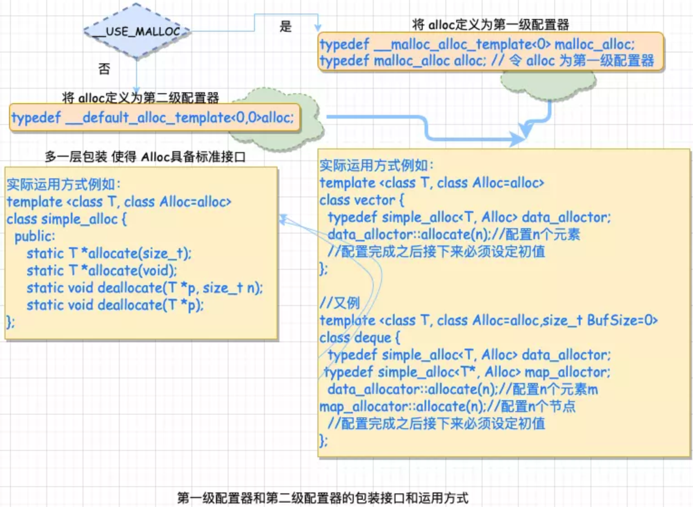

### 3.一级配置器设计

+ 第一级配置器以 malloc(), free(), realloc() 等 C 函数执行实际的内存配置、释放和重配置操作，并实现类似 C++ new-handler 的机制（因为它并非使用 ::operator new 来配置内存，所以不能直接使用C++ new-handler 机制）。

> 不使用 ::operator new 来配置内存的原因：
>
> + 历史原因
> + C++并未提供相应于 realloc() 的内存配置操作
>
> 因此SGI不能直接使用C++的set_new_handler()，必须仿真一个类似的set_malloc_handler

+ SGI 第一级配置器的 allocate() 和 reallocate() 都是在调用malloc() 和 realloc() 不成功后，改调用 oom_malloc() 和oom_realloc()。

```c++
template <int inst>
class __malloc_alloc_template {
private:
    static void *oom_malloc(size_t);								     // malloc内存不足处理例程
    static void *oom_realloc(void *, size_t);				 		 // realloc内存不足处理例程
    #ifndef __STL_STATIC_TEMPLATE_MEMBER_BUG
        static void (* __malloc_alloc_oom_handler)();    //函数指针，保存用户定义的内存不足处理函数
    #endif
 
public:
    static void * allocate(size_t n){
        void *result = malloc(n);								   		   //第一级配置器：直接调用malloc
        if (0 == result) result = oom_malloc(n);				 //内存不足 调用处理例程oom_malloc
        return result;
    }
    static void deallocate(void *p, size_t /* n */){
        free(p);																	  		 //第一级配置器：直接调用free
    }
    static void * reallocate(void *p, size_t /* old_sz */, size_t new_sz){
        void * result = realloc(p, new_sz);					     //第一级配置器：直接调用remalloc
        if (0 == result) result = oom_realloc(p, new_sz);//内存不足 调用处理例程oom_realloc
        return result;
    }
    //以下仿真 C++ 的 set_malloc_handler 。
  	//换句话说，可以通过它指定自己的 out-of-memory handler
    static void (* set_malloc_handler(void (*f)()))(){
        void (* old)() = __malloc_alloc_oom_handler;
        __malloc_alloc_oom_handler = f;
        return(old);
    }
};
```

+ oom_malloc() 和 oom_realloc() 都有内循环，不断调用“内存不足处理例程”，期望某次调用后，获得足够的内存而圆满完成任务，哪怕有一丝希望也要全力以赴申请啊，
+ 如果用户并没有指定“内存不足处理程序”，这个时候便无力乏天，真的是没内存了，STL 便抛出异常。或调用exit(1) 终止程序。

```c++
// malloc_alloc out-of-memory handling
//初值为0，有待客端设定
template <int inst>
void (* __malloc_alloc_template<inst>::__malloc_alloc_oom_handler)() = 0;

template <int inst>
void * __malloc_alloc_template<inst>::oom_malloc(size_t n){
    void (* my_malloc_handler)();
    void *result;
    for (;;) {													//反复调用用户定义(通过set_malloc_hander函数)的内存不足函数
        my_malloc_handler = __malloc_alloc_oom_handler;
        if (0 == my_malloc_handler) { __THROW_BAD_ALLOC; }
        (*my_malloc_handler)();					//调用处理例程，企图释放内存
        result = malloc(n); 						// 不断尝试分配内存
        if (result) return(result);
    }
}
template <int inst>//和oom_malloc类似
void * __malloc_alloc_template<inst>::oom_realloc(void *p, size_t n){
    void (* my_malloc_handler)();
    void *result;
    for (;;) {											 	 //反复调用用户定义(通过set_malloc_hander函数)的内存不足函数
        my_malloc_handler = __malloc_alloc_oom_handler;
        if (0 == my_malloc_handler) { __THROW_BAD_ALLOC; }
        (*my_malloc_handler)();			   //调用处理例程，企图释放内存
        result = realloc(p, n);				 // 不断尝试分配内存
        if (result) return(result);
    }
}
```

### 4.二级配置器设计

>  第二级配置器多了一些机制，专门针对内存碎片。内存碎片化带来的不仅仅是回收时的困难，配置也是一个负担，额外负担永远无法避免，毕竟系统要划出这么多的资源来管理另外的资源，但是区块越小，额外负担率就越高。

SGI第二级配置器的做法是：sub-allocation （层次架构）：

+ SGI STL 的第一级配置器是直接使用 malloc()， free(), realloc() 并配合类似 C++ new-handler 机制实现的。

+ 第二级配置器的工作机制要根据区块的大小是否大于 128bytes 来采取不同的策略：

  <div align = center></div>

+ 二级配置器 memory pool 原理：

  <div align = center></div>

#### (1).自由链表的设计与维护

+ 内存池管理(次层配置)设计：
  + 每次配置一大块内存，并维护对应的自由链表(free lists)
  + 下次若再有相同大小的内存需求，就直接从free lists中拨出
  + 如果客端释还小额内存，就由配置器回收到 free lists中
  + 为了方便管理，二级配置器自动将任何小额区块的内存需求量上调至8的倍数，维护16个 free lists (8->128 bytes)

+ free lists的结点设计

  <div align = center></div>

  ```c++
  union obj {
    	union obj* free_list_link;		//指向链表中的下一个节点；
    	char client_data[1];					//指向链表中的下一个节点；
  }
  ```

  > 一物二用的好处就是不会为了维护链表所必须的指针而造成内存的另一种浪费，或许这就是所谓的自由奥义所在！大师的智慧跃然纸上。

+ 第二级配置器的部分实现内容

```c++
enum __freelist_setting {
    __ALIGN = 8,													//区块上调边界
    __MAX_BYTES = 128,										//区块上限
    __NFREELISTS = __MAX_BYTES / __ALIGN	//freelist个数
};
// 第二级配置器
template <bool threads, int inst>
class __default_alloc {
private:
    static size_t ROUND_UP(size_t bytes){ // 将bytes上调至8的倍数
        return (((bytes) + static_cast<size_t>(__ALIGN) - 1) & 
                				 ~(static_cast<size_t>(__ALIGN) - 1));
    }
private:
    // free_list节点构造
    union obj {
        union obj *free_list_link;  //指向下一节点
        char client_data[1];        //指向资源
    };
private:
    static obj *volatile free_list[__NFREELISTS];
    // 决定使用第几号节点，从1起算
    static size_t FREELIST_INDEX(size_t bytes) {
        return (bytes + static_cast<size_t>(__ALIGN) - 1) /
                   static_cast<size_t>(__ALIGN) -
               1;
    }
    // 传回一个大小为n的对象，并且可能加入大小为n的其它区块到free_list
    static void *refill(size_t n);
    // 配置一大块空间，可容纳 nobjs 个大小为 size 的区块
    // 如果不便配置 nobjs 可能会降低
    static char *chunk_alloc(size_t size, int &nobjs);
  
    // chunk allocation state
    static char *start_free;  //内存池起始位置，只在chunk_alloc()中变化
    static char *end_free;    //内存池结束位置，只在chunk_alloc()中变化
    static size_t heap_size;
public:
    static void *allocate(size_t n);
    static void deallocate(void *p, size_t n);
    static void *reallocate(void *p, size_t old_sz, size_t new_sz);
};
char *__default_alloc::start_free = nullptr;
char *__default_alloc::end_free   = nullptr;
size_t __default_alloc::heap_size = 0;
__default_alloc::obj *volatile __default_alloc::free_list[__NFREELISTS] = {
    nullptr, nullptr, nullptr, nullptr, nullptr, nullptr, nullptr, nullptr,
    nullptr, nullptr, nullptr, nullptr, nullptr, nullptr, nullptr, nullptr};
```

#### (2).空间配置器函数allocate

第二级配置器拥有配置器的标准接口函数 allocate()。

+ 此函数首先判断区块的大小，如果大于 128bytes –> 调用第一级配置器；
+ 小于128bytes–> 就检查对应的 free_list
  + 如果没有可用区块，就将区块上调至 8 倍数的边界，然后调用 refill(), 为 free list 重新填充空间。

<div align = center></div>

```c++
static void *allocate(size_t n) {
    obj *volatile *my_free_list;
    obj *result;
    // 若n大于128,则采用第一级适配器
    if (n > __MAX_BYTES) 
      	return (malloc_alloc::allocate(n));
    // 选择采用第几区块
    my_free_list = free_list + FREELIST_INDEX(n);
    result = *my_free_list;
    if (result == nullptr) {
        // 未找到可用free_list，准备填充free_list
        void *r = refill(ROUND_UP(n));
        return r;
    }
    // 调整freelist
    *my_free_list = result->free_list_link;
    return result;
}
```

#### (3).空间释放函数 deallocte

作为第二级配置器拥有配置器标准接口函数 deallocate()。

+ 该函数首先判断区块大小，大于 128bytes 就调用第一级配置器。
+ 小于 128bytes 就找出对应的 free_list，将区块回收。

<div align = center></div>

```c++
static void deallocate(void *p, size_t n) {
  	//大于128则直接调用第一级配置器
    if (n > static_cast<size_t>(__MAX_BYTES))
        malloc_alloc::deallocate(p, n);
    else {
        // 寻找对应的free list
        obj *volatile *my_free_list = free_list + FREELIST_INDEX(n);
        obj *q = reinterpret_cast<obj *>(p);
        // 调整free list，回收区块
        q->free_list_link = *my_free_list;
        *my_free_list = q;
    }
}
```

#### (4).重新填充 free lists

1. 当发现 free list 中没有可用区块时，就会调用 refill() 为free_list 重新填充空间；
2. 新的空间将取自内存池（经由 chunk_alloc() 完成）；
3. 缺省取得20个新节点（区块），但万一内存池空间不足，获得的节点数可能小于 20。

```c++
// 当free_list无可用区块时，重新填充空间
// 返回一个大小为 n 的对象，而且有时候会为适当的 free lists 增加结点
void *__default_alloc::refill(size_t n) {
    int nobjs = 20;
    // 尝试调用chunk_alloc,尝试取得 nobjs 个区块作为 free list 的新结点
  	// 注意nobjs以pass-by-reference传入
    char *chunk = chunk_alloc(n, nobjs);
    obj *volatile *my_free_list;
    obj *result;
    obj *current_obj, *next_obj;

    // 若只获取了一个区块则直接分配给调用者，不加入free_list
    if (1 == nobjs) return (chunk);
  	//否则准备调整free list，纳入新结点
    my_free_list = free_list + FREELIST_INDEX(n);

    // 在chunk空间内建立free_list
    result = reinterpret_cast<obj *>(chunk);
    // 引导free_list指向内存池分配的空间
    // chunk指向的内存直接分给用户，free_list指向剩下（19或更少）的区块
    *my_free_list = next_obj = reinterpret_cast<obj *>(chunk + n);
    for (int i = 1;; ++i) {
        current_obj = next_obj;
        next_obj =
            reinterpret_cast<obj *>(reinterpret_cast<char *>(next_obj) + n);
        if (nobjs - 1 == i) {
            current_obj->free_list_link = nullptr;
            break;
        } else {
            current_obj->free_list_link = next_obj;
        }
    }
    return result;
}
```

#### (5).内存池的设计与使用

使用  chunk_alloc()  函数，从内存池中取空间给 free_list 使用。chunk_alloc() 函数以 end_free – start_free 来判断内存池的“水量”，具体逻辑如下图所示：

<div align = center></div>

> 如果第一级配置器的 malloc() 也失败了，就发出 bad_alloc 异常。

<div align = center>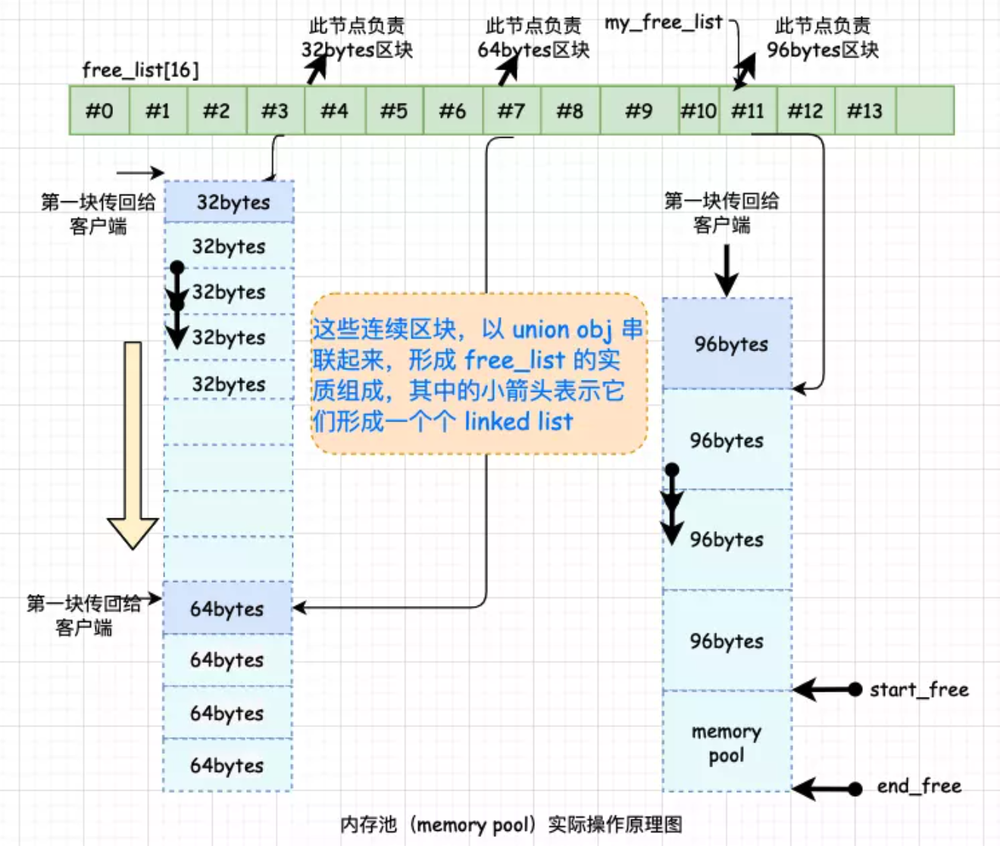</div>

```c++
// 默认size为8的整数倍
char *__default_alloc::chunk_alloc(size_t size, int &nobjs) {
    char *result;
    size_t total_bytes = size * nobjs;
    size_t bytes_left = end_free - start_free;  //内存池剩余空间
    if (bytes_left >= total_bytes) {
        // 容量满足需求
        result = start_free;
        start_free += total_bytes;
        return result;
    } else if (bytes_left > size) {
        // 容量至少满足一个区块需求
        nobjs = static_cast<int>(bytes_left / size);
        total_bytes = size * nobjs;
        result = start_free;
        start_free += total_bytes;
        return result;
    } else {
        // 内存池一个区块都无法提供
      	// 向heap申请注入的内存，heap_size将随着配置次数增加而增加
        size_t bytes_to_get = 2 * total_bytes + ROUND_UP( heap_size >> 4);  
        if (bytes_left > 0) {
            // 当前内存池还有一部分内存，为了不浪费分配给free_list
            obj *volatile *my_free_list =
                free_list + FREELIST_INDEX(bytes_left);
            reinterpret_cast<obj *>(start_free)->free_list_link = *my_free_list;
            *my_free_list = reinterpret_cast<obj *>(start_free);
        }
        // 配置heap空间以补充内存池
        start_free = reinterpret_cast<char *>(malloc(bytes_to_get));
        if (!start_free) {
            // heap空间不足，malloc失败
            obj *volatile *my_free_list;
            obj *p;
            // 在free_list中检查是否有符合需求的区块
            for (size_t i = size; i <= static_cast<size_t>(__MAX_BYTES);
                 i += static_cast<size_t>(__ALIGN)) {
                my_free_list = free_list + FREELIST_INDEX(i);
                p = *my_free_list;
                if (p) {
                    // 存在足以分配的区块
                    *my_free_list = p->free_list_link;  // 抽离当前区块
                    start_free = reinterpret_cast<char *>(p);
                    end_free = start_free + i;
                    return (chunk_alloc(
                        size,
                        nobjs));  // 递归调用以修正nobjs，此时必然进入else_if分支
                }
            }
            end_free = nullptr;  // 到处都找不到内存
            // 调用第一级适配器观察其能否分配内存，或抛出异常
            start_free =
                reinterpret_cast<char *>(malloc_alloc::allocate(bytes_to_get));
        }
        heap_size += bytes_to_get;  // 已占用的堆内存
        end_free = start_free + bytes_to_get;
        return chunk_alloc(size, nobjs);  // 调用自身以修正nobjs
    }
}
```

---

## 三.迭代器与traits编程技法

### 1.迭代器

> 为什么需要迭代器？
>
> + 在 STL 中，容器和算法是独立设计的，容器里存放数据，算法提供对数据的操作，在算法操作数据的过程中，要用到迭代器，迭代器可以看做是容器和算法中间的桥梁。

#### (1).迭代器的基本介绍

+ iterator 的描述如下：**一种能够顺序访问容器中每个元素的方法，使用该方法不能暴露容器内部的表达方式。而类型萃取技术就是为了要解决和 iterator 有关的问题的。**
+ 迭代器其实也是一种智能指针，拥有一般指针的所有特点—— 能够对其进行 `*`和 `->` 操作。

---

### 2.traits编程技法

> 算法需要知道处理的范围，数据类型以及迭代器的类型等(5种)消息，所以需要向迭代器进行询问，如果迭代器是class类型，则可以直接返回，但是如果迭代器是原生指针类型，则无法返回。
>
> 基于此，就提出了traits技法，利用模板偏特化来进行返回消息。

traits 编程技法 **就是增加一层中间的模板** **`class`**，以解决获取迭代器的型别中的原生指针问题。

<div align = center></div>

```c++
#include <iostream>
template <class T>
struct MyIter {
    typedef T value_type; // 内嵌型别声明
    T* ptr;
    MyIter(T* p = 0) : ptr(p) {}
    T& operator*() const { return *ptr; }
};
// class type
template <class T>
struct my_iterator_traits {
    typedef typename T::value_type value_type;
};
// 偏特化 1
template <class T>
struct my_iterator_traits<T*> {
    typedef T value_type;
};
// 偏特化 2
template <class T>
struct my_iterator_traits<const T*> {
    typedef T value_type;
};

// 首先询问 iterator_traits<I>::value_type
//如果传递的 I 为指针,则进入特化版本,iterator_traits 直接回答;
//如果传递的 I 为 class type,就去询问 T::value_type.
template <class I>
typename my_iterator_traits<I>::value_type Func(I ite) {
    std::cout << "normal version" << std::endl;
    return *ite;
}
int main(int argc, const  char *argv[]) {
    MyIter<int> ite(new int(6));
    std::cout << Func(ite)<<std::endl;//print=> 6
    int *p = new int(7);
    std::cout<<Func(p)<<std::endl;//print=> 7
    const int k = 8;
    std::cout<<Func(&k)<<std::endl;//print=> 8
}
```

通俗的解释可以参照下图：


<div align = center>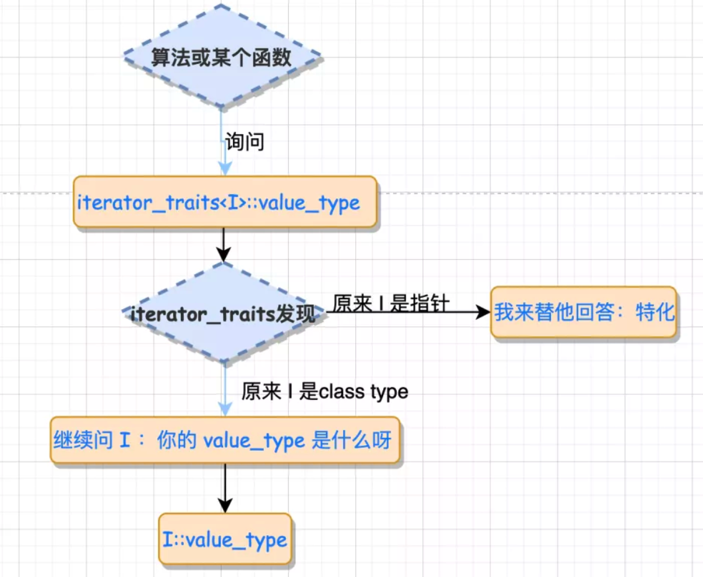</div>

核心知识点在于 **模板参数推导机制+内嵌类型定义机制**， 为了能处理原生指针这种特殊的迭代器，引入了**偏特化机制**。`traits` 就像一台 “特性萃取机”，把迭代器放进去，就能榨取出迭代器的特性。

<div align = center>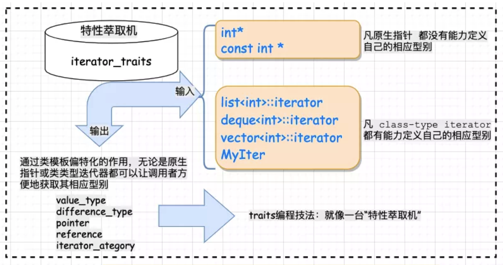</div>

---

## 四.序列式容器

### 1.vector

#### (1).vector的设计

基本上，STL 里面所有的容器的源码都包含至少三个部分：

- 迭代器，遍历容器的元素，控制容器空间的边界和元素的移动；
- 构造函数，满足容器的多种初始化；
- 属性的获取，比如 begin()，end()等；

vector 也不例外，其实看了源码之后就发现，vector 相反是所有容器里面最简单的一种。

```c++
template <class T, class Alloc = alloc>
class vector {
public:
   // 定义 vector 自身的嵌套型别
    typedef T value_type;
    typedef value_type* pointer;
    typedef const value_type* const_pointer;
    // 定义迭代器, 这里就只是一个普通的指针
    typedef value_type* iterator;
    typedef const value_type* const_iterator;
    typedef value_type& reference;
    typedef const value_type& const_reference;
    typedef size_t size_type;
    typedef ptrdiff_t difference_type;
    ...
protected:
    typedef simple_alloc<value_type, Alloc> data_allocator; // 设置其空间配置器
    iterator start;    				// 当前使用空间的头
    iterator finish;   				// 当前使用空间的尾
    iterator end_of_storage;  // 当前可用空间的尾
    ...
};
```

因为 vector 需要表示用户操作的当前数据的起始地址，结束地址，还需要其真正的最大地址。所以总共需要 3 个迭代器，分别来指向数据的头(start)，数据的尾(finish)，数组的尾(end_of_storage)。

> 所以vector空对象的大小为三个指针大小。

#### (2).属性获取

下面的部分就涉及到了位置参数的获取， 比如返回 vector 的开始和结尾，返回最后一个元素，返回当前元素个数，元素容量，是否为空等。

这里需要注意的是因为 end() 返回的是 finish，而 finish 是指向**最后一个元素的后一个位置的指针**，所以使用 end() 的时候要注意。

```c++
public:
 // 获取数据的开始以及结束位置的指针. 记住这里返回的是迭代器, 也就是 vector 迭代器就是该类型的指针.
    iterator begin() { return start; }
    iterator end() { return finish; }
    reference front() { return *begin(); } // 获取值
    reference back() { return *(end() - 1); } 
    ...
    size_type size() const { return size_type(end() - begin()); }  // 数组元素的个数
    size_type max_size() const { return size_type(-1) / sizeof(T); } // 最大能存储的元素个数
    size_type capacity() const { return size_type(end_of_storage - begin()); } // 数组的实际大小
    bool empty() const { return begin() == end(); } 
    //判断 vector 是否为空， 并不是比较元素为 0，是直接比较头尾指针。
```

#### (3).元素操作

##### push_back操作

调用 push_back 插入新元素时，首先会检查是否有备用空间，有就直接在备用空间上构造元素，并调整迭代器 finish。

<div align = center>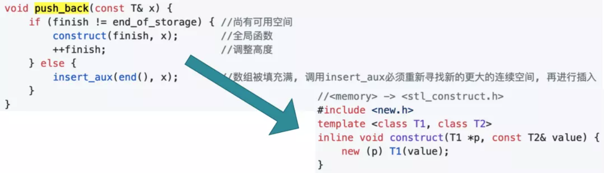</div>

当没有备用空间，则扩充空间(重新配置—>移动数据—>释放原空间)，这里调用了另外一个函数：insert_aux 函数。

<div align = center>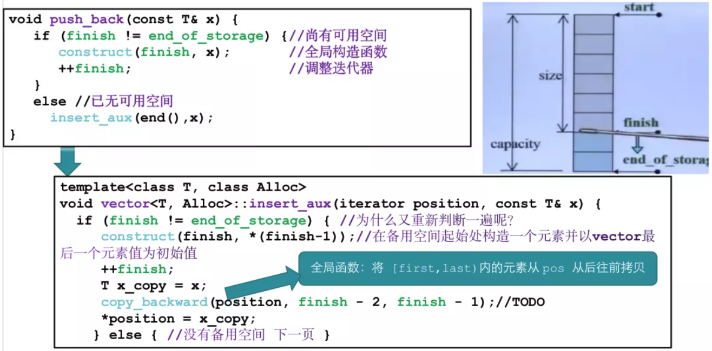</div>

> insert_aux 函数里面又判断了一次 finish != end_of_storage 。 原因是 insert_aux 函数可能还被其他函数调用哦。

在 else 分支里面，可以看出 **vector 的动态扩容机制**：如果原空间大小为 0 则分配 1 个元素，如果大于 0 则分配原空间两倍的新空间，然后把数据拷贝过去。

<div align = center>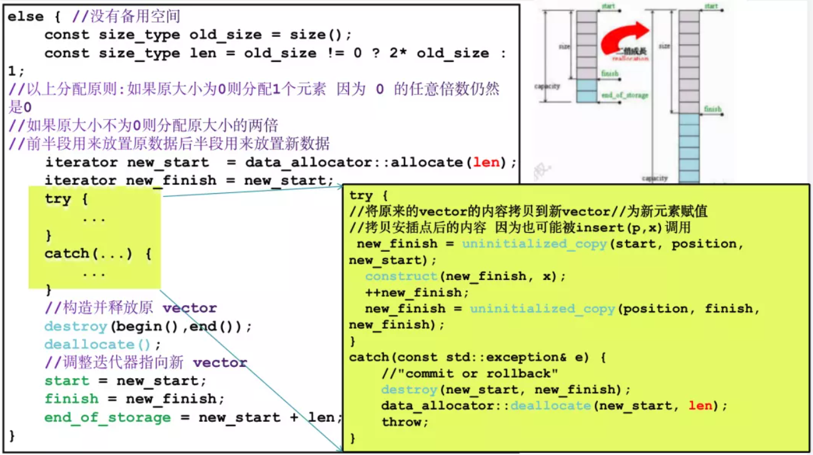</div>

##### pop_back操作

从尾端删除一个元素

```c++
public:
//将尾端元素拿掉 并调整大小
void pop_back() {
  	--finish;//将尾端标记往前移动一个位置 放弃尾端元素
  	destroy(finish);
}
```

##### erase操作

将删除元素后面所有元素往前移动，对于 vector 来说删除元素的操作开销还是很大的，所以不适合频繁的删除操作。

<div align = center></div>

```c++
//清楚[first, last)中的所有元素
iterator erase(iterator first, iterator last) {
    iterator i = copy(last, finish, first);
    destroy(i, finish);
    finish = finish - (last - first);
    return first;
}
//清除指定位置的元素
iterator erase(iterator position) {
  	if (position + 1 != end()) 
    		copy(position + 1, finish, position);//copy 全局函数    
    --finish;
    destroy(finish);
    return position;
}
void clear() {
  	erase(begin(), end());
}
```

##### insert操作

+ vector 的插入元素具体来说呢，又分三种情况：

  1、如果备用空间足够且插入点的现有元素多于新增元素；

  2、如果备用空间足够且插入点的现有元素小于新增元素；

  3、如果备用空间不够；

当插入点之后的现有元素个数 > 新增元素个数：

<div align = center>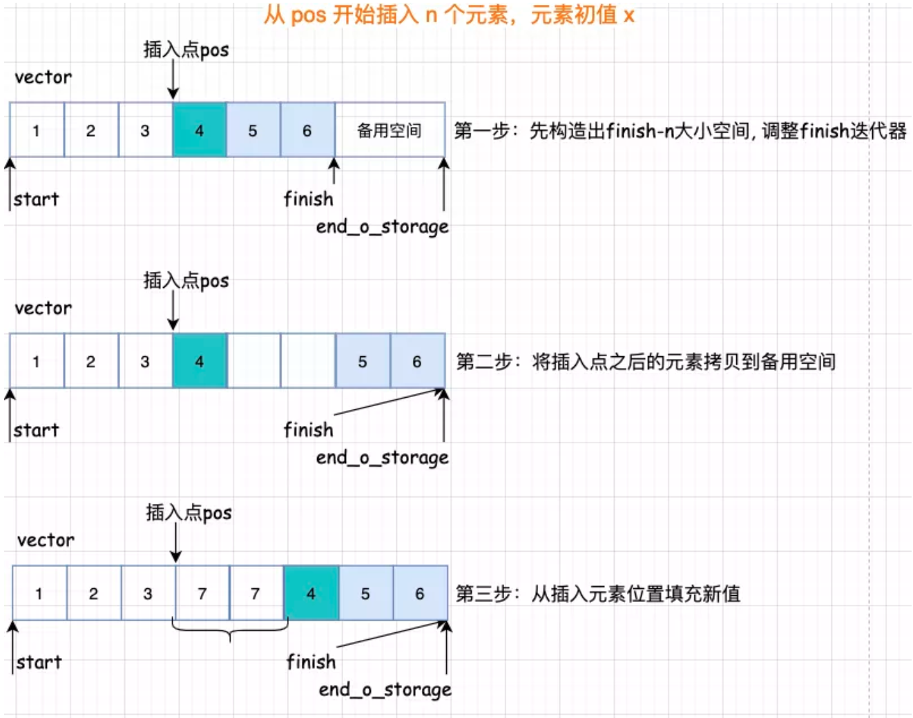</div>

插入点之后的现有元素个数 <= 新增元素个数

<div align = center>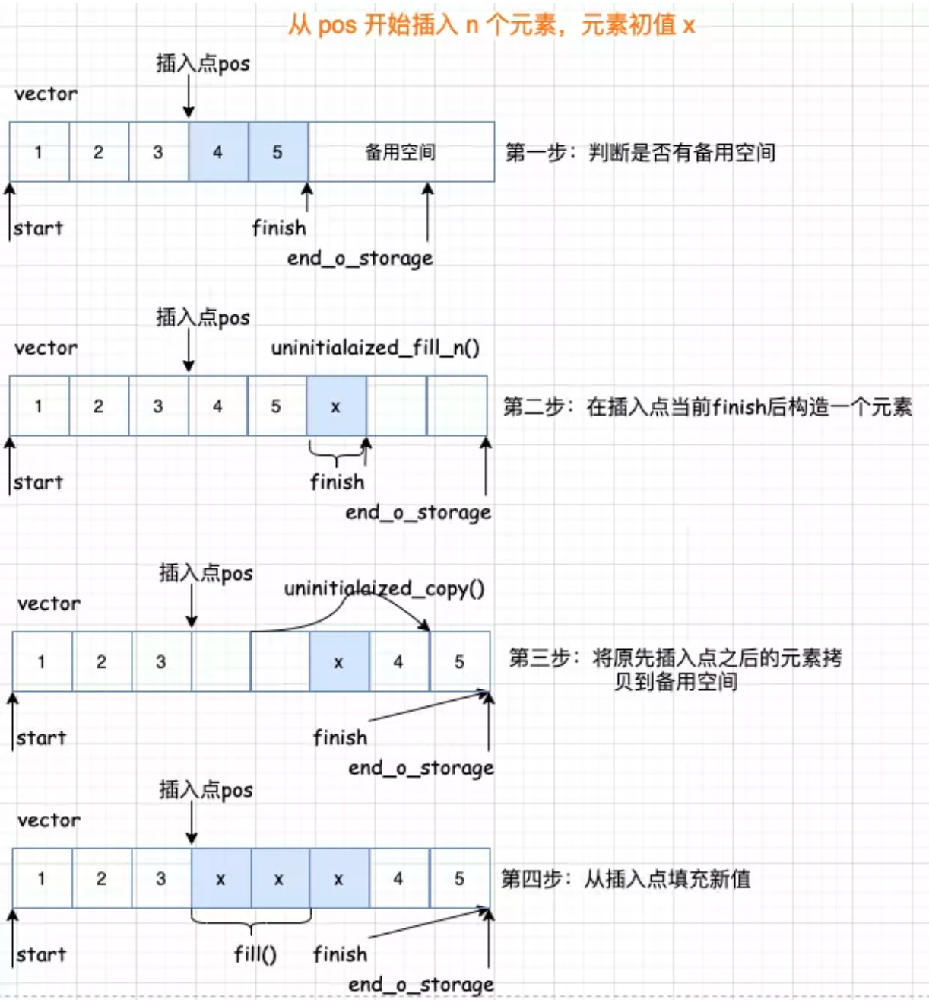</div>

如果备用空间不足

<div align = center>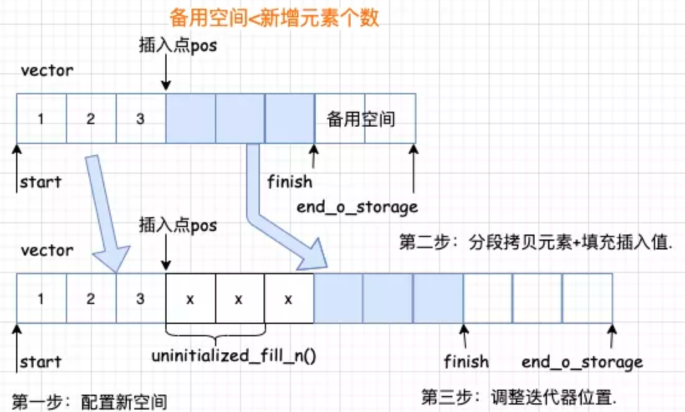</div>

> - copy(a,b,c)：将(a,b)之间的元素拷贝到(c,c-(b-a))位置
> - uninitialized_copy(first, last, result)：具体作用是将 [first,last)内的元素拷贝到 result 从前往后拷贝
> - copy_backward(first, last, result)：将 [first,last)内的元素拷贝到 result 从后往前拷贝

---

### 2.list

> list 源码里分了两个部分，一个部分是 list 结构，另一部分是 list 节点的结构。

#### (1).list结点的设计

__list_node 用来实现节点，数据结构中就储存前后指针和属性。

<div align = center></div>

```c++
template <class T> struct __list_node {
   typedef void* void_pointer;// 前后指针
   void_pointer next;
   void_pointer prev;
   T data;										// 属性
};
```

---

#### (2).迭代器的设计

```c++
template<class T, class Ref, class Ptr> struct __list_iterator {
   typedef __list_iterator<T, T&, T*>     iterator; // 迭代器
   typedef __list_iterator<T, const T&, const T*> const_iterator;
   typedef __list_iterator<T, Ref, Ptr>    self;  
    // 迭代器是bidirectional_iterator_tag类型
   typedef bidirectional_iterator_tag iterator_category;
   typedef T value_type;
   typedef Ptr pointer;
   typedef Ref reference;
   typedef size_t size_type;
   typedef ptrdiff_t difference_type;
    ... 
};
```

+ iterator++与++iterator的设计

> 设计原则就是向 整数 类型致敬，所以支持 ++++it，不支持 it++++

```c++
// ++和--是直接操作的指针指向next还是prev, 因为list是一个双向链表
self& operator++() { 
    node = (link_type)((*node).next);
    return *this;
}
```

> + 返回的是引用类型，所以支持再运算。

```c++
self operator++(int) { 
    self tmp = *this;
    ++*this;
    return tmp;
}
```

> + 返回的是数值类型，所以不支持再运算
> + `self tmp = *this;`先调用的是 拷贝构造函数，没有涉及*重载
> + `++*this;`调用的是++重载，没有涉及*重载

+ \* 与 -> 的设计

```c++
reference operator*() const {
  	return (*node).data;
}
pointer operator->() const {
  	return &(operator*());
}
```

---

#### (3).list结构的设计

list 自己定义了嵌套类型满足 traits 编程， list 迭代器是 bidirectional_iterator_tag 类型，并不是一个普通指针。

<div align = center>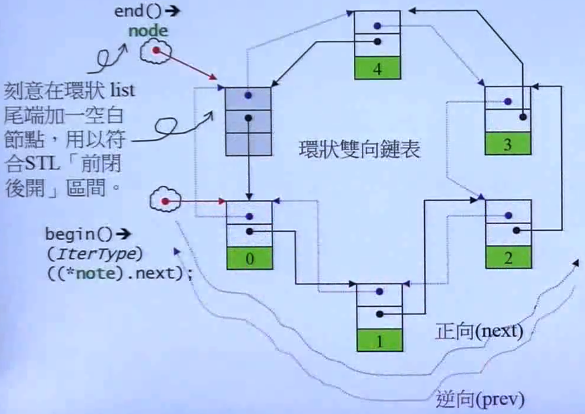</div>

list 在定义 node 节点时， 定义的不是一个指针，这里要注意。

```c++
template <class T, class Alloc = alloc>
class list {
protected:
    typedef void* void_pointer;
    typedef __list_node<T> list_node; // 节点 就是前面分析过的
    typedef simple_alloc<list_node, Alloc> list_node_allocator; // 空间配置器
public:      
    // 定义嵌套类型
    typedef T value_type;
    typedef value_type* pointer;
    typedef const value_type* const_pointer;
    typedef value_type& reference;
    typedef const value_type& const_reference;
    typedef list_node* link_type;
    typedef size_t size_type;
    typedef ptrdiff_t difference_type;
    
protected:
    link_type node; // 定义一个节点, 这里节点并不是一个指针.
public:
    typedef __list_iterator<T, T&, T*>             iterator;// 定义迭代器
    typedef __list_iterator<T, const T&, const T*> const_iterator;
 ...
};
```

---

### 3.deque

#### (1).基本介绍

+ deque 和 vector 的差异在于 deque 允许常数时间内对头/尾端进行元素的插入或移除操作。

+ deque 没有容量概念，它是动态地以分段连续空间组合而成，随时可以增加一块新的空间并拼接起来。

+ 虽然 deque 也提供随机访问的迭代器，但和前面两种容器的不一样，设计相当复杂度和精妙，会对各种运算产生一定影响，除非必要，尽可能的选择使用 vector 而非 deque。

#### (2).deque的中控器

deque 采用一块所谓的 map （不是 STL 里面的 map ）作为中控器，其实就是一小块连续空间，其中的每个元素都是指针，指向另外一段较大的连续线性空间，称之为**缓冲区。**

<div align = center>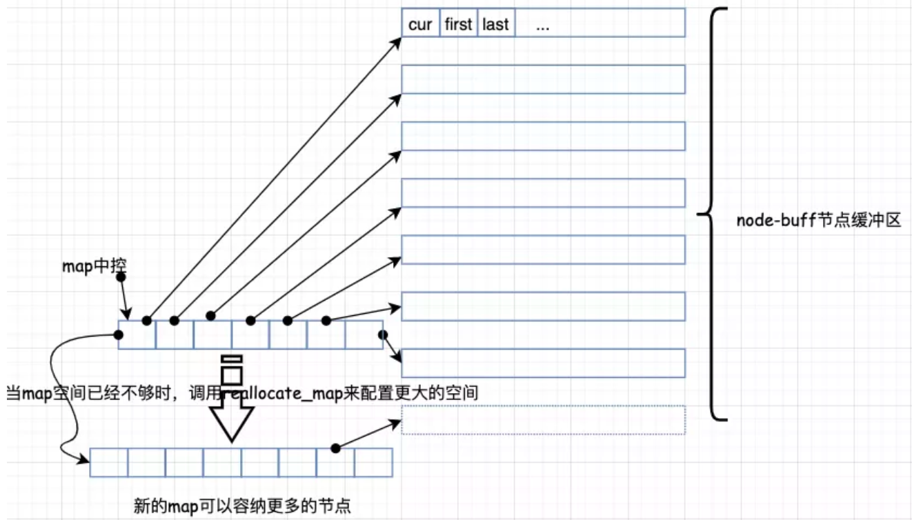</div>

```c++
#ifndef __STL_NON_TYPE_TMPL_PARAM_BUG
template <class T, class Ref, class Ptr, size_t BufSiz>
class deque {
public:
    typedef T value_type;
    typedef value_type* pointer;
    ...
protected:
    typedef pointer** map_pointer;
    map_pointer map;//指向 map，map 是连续空间，其内的每个元素都是一个指针。
    size_type map_size;
    ...
};
```

#### (3).deque的迭代器设计

```c++
template <class T, class Ref, class Ptr, size_t BufSiz>
struct __deque_iterator {
    // 迭代器定义
    typedef __deque_iterator<T, T&, T*, BufSiz>             iterator;
    typedef __deque_iterator<T, const T&, const T*, BufSiz> const_iterator;
    static size_t buffer_size() {return __deque_buf_size(BufSiz, sizeof(T)); }
    // deque是random_access_iterator_tag类型
    typedef random_access_iterator_tag iterator_category;
    // 基本类型的定义, 满足traits编程
    typedef T value_type;
    typedef Ptr pointer;
    typedef Ref reference;
    typedef size_t size_type;
    typedef ptrdiff_t difference_type;
    // node
    typedef T** map_pointer;
    map_pointer node;
    typedef __deque_iterator self;
    ...
};
```

deque 的每一个缓冲区又设计了三指针

```c++
struct __deque_iterator {
    ...
    typedef T value_type;
    T* cur;
    T* first;
    T* last;
    typedef T** map_pointer;
    map_pointer node;
    ...
};
```

<div align = center>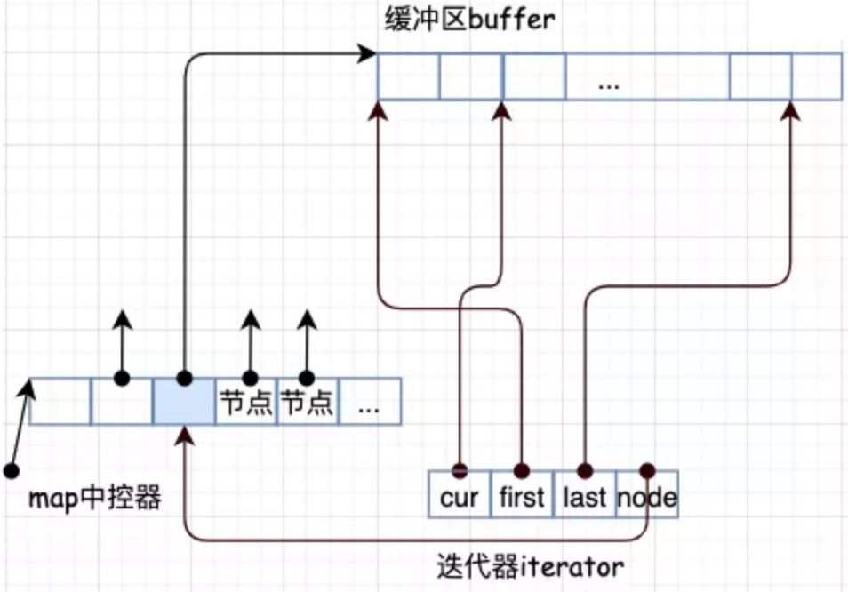</div>

>  其中 cur 表示当前所指的位置；first 表示当前数组中头的位置；last 表示当前数组中尾的位置。
>
> 需要注意的是 deque 的空间是由 map 管理的， 它是一个指向指针的指针， 所以三个参数都是指向当前的数组，但这样的数组可能有多个，只是每个数组都管理这3个变量。

决定缓冲区大小的是一个全局函数:

```c++
//如果 n 不为0，则返回 n，表示缓冲区大小由用户自定义
//如果 n == 0，表示 缓冲区大小默认值
//如果 sz = (元素大小 sizeof(value_type)) 小于 512 则返回 521/sz
//如果 sz 不小于 512 则返回 1
inline size_t __deque_buf_size(size_t n, size_t sz) {
  return n != 0 ? n : (sz < 512 ? size_t(512 / sz): size_t(1));
}
```

#### (4).deque的迭代器操作

operator++ 操作代表是需要切换到下一个元素，这里需要先切换再判断是否已经到达缓冲区的末尾

```c++
void set_node(map_pointer new_node) {
    node = new_node;
    first = *new_node;
    last = first + static_cast<difference_type>(buffer_size());
}
self& operator++() { 
    ++cur;      //切换至下一个元素
    if (cur == last) {   //如果已经到达所在缓冲区的末尾
       set_node(node+1);  //切换下一个节点
       cur = first;  
    }
    return *this;
}
```

operator-- 操作代表切换到上一个元素所在的位置，需要先判断是否到达缓冲区的头部，再后退。

```c++
self& operator--() {     
    if (cur == first) {    //如果已经到达所在缓冲区的头部
       set_node(node - 1); //切换前一个节点的最后一个元素
       cur = last;  
    }
    --cur;       //切换前一个元素
    return *this;
}  //结合前面的分段连续空间，你在想一想这样的设计是不是合理呢？
```

operator+= n 操作代表向前前进 n 个元素，所以需要判断是否跳转到其他的缓冲区

```c++
self &operator+=(difference_type n) {
    difference_type offset = n + (cur - first);
    if (offset >= 0 && offset < static_cast<difference_type>(buffer_size())) {
        // 不需要跳转
        cur += n;
    } else {
        // off_set小于0则必然需要跳转
        difference_type node_offset = offset > 0
                          ? offset / static_cast<difference_type>(buffer_size())
                          : -static_cast<difference_type>((-offset - 1) / buffer_size()) - 1;
        set_node(node + node_offset);
        cur = first + (offset - node_offset * static_cast<difference_type>(buffer_size()));
    }
    return *this;
}
```

因为 deque 是由数组构成，所以地址空间是连续的，删除也就像 vector一样，要移动所有的元素。deque 为了保证效率尽可能的高，就判断删除的位置是中间偏后还是中间偏前来进行移动。

```c++
iterator erase(iterator pos) {
    iterator next = pos;
    ++next;
    difference_type index = pos - start;
    // 删除的地方是中间偏前, 移动前面的元素
    if (index < (size() >> 1)) {
        copy_backward(start, pos, next);
        pop_front();
    }
    // 删除的地方是中间偏后, 移动后面的元素
    else {
        copy(next, finish, pos);
        pop_back();
    }
    return start + index;
}
// 范围删除, 实际也是调用上面的erase函数.
iterator erase(iterator first, iterator last);
```

deque 源码的基本每一个insert 重载函数都会调用了 insert_auto 判断插入的位置离头还是尾比较近。

+ 如果离头进：则先将头往前移动，调整将要移动的距离，用 copy 进行调整。

+ 如果离尾近：则将尾往前移动，调整将要移动的距离，用 copy 进行调整。

---

### 4.stack与queue

两者都是以 deque 为底层容器的适配器。

**栈-stack：** 先入后出，只允许在栈顶添加和删除元素，称为出栈和入栈。

**队列-queue：** 先入先出，在队首取元素，在队尾添加元素，称为出队和入队。

---

### 5.heap

利用vector与heap算法实现的。

---

### 6.priority_queue 

priority_queue 是一个优先级队列，是带权值的， 支持插入和删除操作，其只能从尾部插入，头部删除， 并且其顺序也并非是根据加入的顺序排列的。

priority_queue 本身也不算是一个容器，它是 **以 vector 为容器以 heap为数据操作的配置器。**

```c++
#ifndef __STL_LIMITED_DEFAULT_TEMPLATES
template <class T, class Sequence = vector<T>, 
          class Compare = less<typename Sequence::value_type> >
#else
template <class T, class Sequence, class Compare>
#endif
class  priority_queue {
public:
   // 符合traits编程规范
    typedef typename Sequence::value_type value_type;
    typedef typename Sequence::size_type size_type;
    typedef typename Sequence::reference reference;
    typedef typename Sequence::const_reference const_reference;
protected:
    Sequence c; // 定义vector容器的对象
    Compare comp; // 定义比较函数(伪函数)
    ...
};
```

priority_queue 只有简单的 3 个属性获取的函数, 其本身的操作也很简单, 实现依赖了 vector 和 heap 就变得比较复杂。

```c++
class  priority_queue {
 ...
public:
    bool empty() const { return c.empty(); }
    size_type size() const { return c.size(); }
    const_reference top() const { return c.front(); }
      ...
};
```

push 和 pop 具体都是采用的 heap 算法。

##  五.关联式容器

实现在C++中，set 和 map 分别提供了以下三种数据结构，其底层实现以及优劣如下表所示：

| 集合                 | 底层实现 | 是否有序 | 数值是否可以重复 | 能否更改数值 | 查询效率   | 增删效率   |
| -------------------- | -------- | -------- | ---------------- | ------------ | ---------- | ---------- |
| `std::set`           | 红黑树   | 有序     | 否               | 否           | $O(log_n)$ | $O(log_n)$ |
| `std::multiset`      | 红黑树   | 有序     | 是               | 否           | $O(log_n)$ | $O(log_n)$ |
| `std::unordered_set` | 哈希表   | 无序     | 否               | 否           | $O(1)$     | $O(1)$     |

`std::unordered_set`底层实现为哈希表，`std::set` 和`std::multiset` 的底层实现是红黑树， **红黑树是一种平衡二叉搜索树，所以key值是有序的，但key不可以修改，改动key值会导致整棵树的错乱，所以只能删除和增加。**

| 映射                 | 底层实现 | 是否有序 | 数值是否可以重复 | 能否更改数值 | 查询效率   | 增删效率   |
| -------------------- | -------- | -------- | ---------------- | ------------ | ---------- | ---------- |
| `std::map`           | 红黑树   | Key有序  | key不可重复      | key不可修改  | $O(log_n)$ | $O(log_n)$ |
| `std::multimap`      | 红黑树   | Key有序  | key可重复        | key不可修改  | $O(log_n)$ | $O(log_n)$ |
| `std::unordered_map` | 哈希表   | Key无序  | key不可重复      | key不可修改  | $O(1)$     | $O(1)$     |

`std::unordered_map` 底层实现为哈希表，`std::map` 和`std::multimap` 的底层实现是红黑树。同理，`std::map` 和`std::multimap` 的key也是有序的（这个问题也经常作为面试题，考察对语言容器底层的理解）。

当我们要使用集合来解决哈希问题的时候，优先使用unordered_set，因为它的查询和增删效率是最优的，如果需要集合是有序的，那么就用set，如果要求不仅有序还要有重复数据的话，那么就用multiset。

###  1.红黑树

#### (1).基本介绍

+ 红黑树是一种二叉查找树，但在每个结点上增加一个存储位表示结点的颜色，可以是 Red或 Black。 通过对任何一条从根到叶子的路径上各个结点着色方式的限制，确保没有一条路径会比其他路径长出两倍，因而是接近平衡的。

+ 红黑树在二叉查找树的基础上增加了着色和相关的性质使得红黑树相对平衡，保证了一棵 n 个结点的红黑树始终保持了 Iogn 的高度，从而保证了红黑树的查找 、 插入、删除的时间复杂度最坏为 O(logn)。性质如下：

  1. 每个节点或者是黑色，或者是红色。
  2. 根节点是黑色。
  3. 每个叶子节点是黑色。 [注意：这里叶子节点，是指为空的叶子节点！]
  4. 如果一个节点是红色的，则它的子节点必须是黑色的。
  5. 从一个节点到该节点的子孙节点的所有路径上包含相同数目的黑节点。

+ 红黑树性能比较高，插入删除时间复杂度保持在logn。和AVL相比，要求不是那么严格，它只要求到叶节点的最长路径不超过最短路径的两倍。

  > 场景：插入删除频繁。Nginx用红黑树管理定时器，EPOLL用红黑树管理监听的事件。

+ AVL：要求左右子树相差高度不超过一，简单的插入或者删除都会导致树的不平衡需要旋转操作，维护这种高度平衡所付出的代价比从中获得的效率收益还大。

  > 应用：场景中对插入删除不频繁，只是对查找要求较高，AVL更好。 **Windows NT内核中广泛存在**

+ 至于普通的二叉搜索树，可能出现瘸腿现象，展现为链表，时间复杂度为 n 。

#### (2).时间复杂度证明

<font color = red>**一棵含有n个节点的红黑树的高度至多为2log(n+1)**.</font>

>  含有n个节点的红黑树的高度至多为2log(n+1) 的**逆否命题**: 高度为h的红黑树，包含的内节点个数至少为 $2^{h/2}-1$个

从某个节点x出发（不包括该节点）到达一个叶节点的任意一条路径上，黑色节点的个数称为该节点的黑高度，记为**bh(x)**。关于bh(x)有两点需要说明： 

+ 根据 从一个节点到该节点的子孙节点的所有路径上包含相同数目的黑节点 可知，从节点x出发到达的所有的叶节点具有相同数目的黑节点。**这也就意味着，bh(x)的值是唯一的**！
+ 根据 如果一个节点是红色的，则它的子节点必须是黑色的 可知，从节点x出发达到叶节点"所经历的黑节点数目">= "所经历的红节点的数目"。

假设x是根节点，则得出结论"**bh(x) >= h/2**"。只需证明  高度为h的红黑树，它的包含的黑节点个数至少为 $2^{bh(x)}-1$个

通过"数学归纳法"开始论证：

1. 当树的高度h=0时，  内节点个数是0，bh(x) 为0，$2^{bh(x)}-1$ 也为 0。显然，原命题成立。

2. 当h>0，且树的高度为 h-1 时，它包含的节点个数至少为 $2^{bh(x)-1}-1$。

   当树的高度为 h 时，

   + 对于节点x(x为根节点)，其黑高度为bh(x)。
   + 对于节点x的左右子树，它们黑高度为 bh(x) 或者 bh(x)-1。

   根据(02)的已知条件，已知 "x的左右子树，即高度为 h-1 的节点，它包含的节点至少为 $2^{bh(x)-1}-1$ 个"；

   所以，节点x所包含的节点至少为 ( $2^{bh(x)-1}-1$ ) + ( $2^{bh(x)-1}-1$ ) + 1 = $2^{bh(x)}-1$

---

#### (3).红黑树的操作

##### 旋转

旋转包括两种：**左旋** 和 **右旋**。下面分别对它们进行介绍。

+ 对x进行左旋，即将“x的右孩子”设为“x的父亲节点”。 因此，**“左”，意味着“被旋转的节点将变成一个左节点”**。

```c
                               z
   x                          /                  
  / \      --(x左旋)-->       x
 y   z                      /
                           y
```

+ 对x进行右旋，即将“x的左孩子”设为“x的父亲节点”。 因此，**“右”，意味着“被旋转的节点将变成一个右节点”**。

```c
                               y
   x                            \                 
  / \      --(x右旋)-->           x
 y   z                            \
                                   z
```

##### 插入

1. 将红黑树当作一颗二叉查找树，将节点插入。
2. 将插入的节点着色为"红色"。
3. 通过一系列的旋转或着色等操作，使之重新成为一颗红黑树。

根据被插入节点的父节点的情况，可以将"当节点z被着色为红色节点，并插入二叉树"划分为三种情况来处理。

1. 情况说明：被插入的节点是根节点。

   >  处理方法：直接把此节点涂为黑色。

2. 情况说明：被插入的节点的父节点是黑色。

   >  处理方法：什么也不需要做。节点被插入后，仍然是红黑树。

3. 情况说明：被插入的节点的父节点是红色。

   > 处理方法：那么，该情况与红黑树的“特性(5)”相冲突。这种情况下，被插入节点也一定存在叔叔节点(即使叔叔节点为空，我们也视之为存在，空节点本身就是黑色节点)。然后依据"叔叔节点的情况"，将这种情况进一步划分为3种情况(Case)。

<div align = center>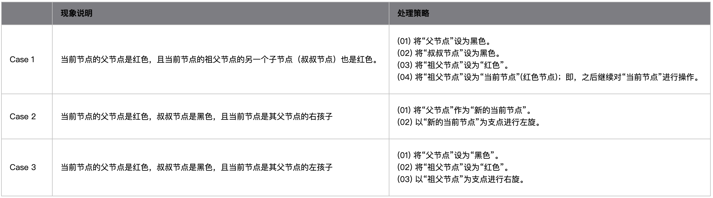</div>

+ 情况1：叔叔是红色

  <div align = center>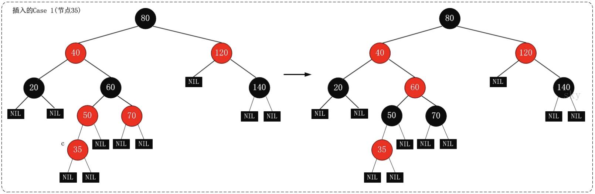</div>

+ 情况2：叔叔是黑色，且当前节点是右孩子

  <div align = center>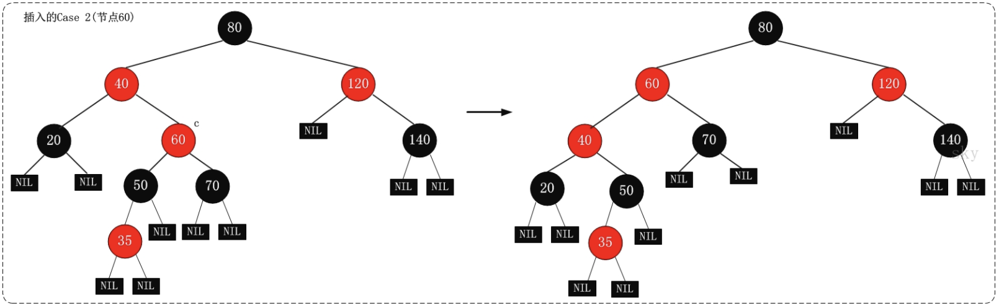</div>

+ 情况3：叔叔是黑色，且当前节点是左孩子

  <div align = center>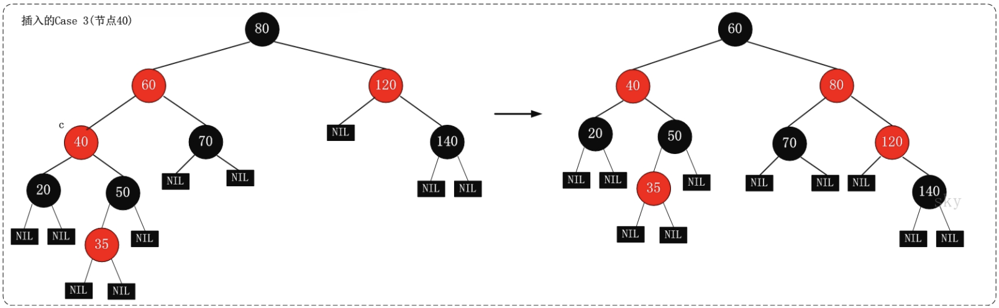</div>

---

##### 删除

1. 将红黑树当作一颗二叉查找树，将节点删除。
   +  被删除节点没有儿子，即为叶节点。那么，直接将该节点删除就OK了。
   + 被删除节点只有一个儿子。那么，直接删除该节点，并用该节点的唯一子节点顶替它的位置。
   + 被删除节点有两个儿子。那么，先找出它的后继节点；然后把“它的后继节点的内容”复制给“该节点的内容”；之后，删除“它的后继节点”。
2. 通过"旋转和重新着色"等一系列来修正该树，使之重新成为一棵红黑树。

第一步删除之后可能违反 特性2、4、5三个特性。第二步需要解决上面的三个问题，进而保持红黑树的全部特性。

---

#### (4).红黑树的节点设计

以下为GUN2.9的设计：

```c++
template <class Key, class Value, class KeyOfValue, class Compare, class Alloc = alloc>
class rb_tree {
protected:
  	typedef _rb_tree_node<Value> rb_tree_node;//见下面的设计
  	...
public:
  	typedef rb_tree_node* link_type;
 		...
private:                   // data member
    size_type node_count;  // 用节点数量表征树的大小
    link_type header;      // root的父亲，实现技巧:为了实现方便 
    Compare key_compare;
};//大小为4+4+1 ——> 12
```

```c++
using rb_tree_color_type = bool;
const rb_tree_color_type rb_tree_red = false;
const rb_tree_color_type rb_tree_black = true;
struct __rb_tree_node_base {
    using color_type = rb_tree_color_type;
    using base_ptr = __rb_tree_node_base *;

    color_type color;
    base_ptr parent;
    base_ptr left;
    base_ptr right;
};

template <class T>
struct __rb_tree_node : public __rb_tree_node_base {
    using link_type = __rb_tree_node<T> *;
    T value_field;
};
```

---

#### (5).红黑树迭代器的设计

红黑树的迭代器属于双向迭代器，不具备随机定位的功能。设计为基层迭代器与正规迭代器。

基层迭代器

```c++
struct rb_tree_base_iterator {
    using base_ptr = __rb_tree_node_base::base_ptr;
    using iterator_category = bidirectional_iterator_tag;//双向迭代器
    using difference_type = ptrdiff_t;

    base_ptr node;

    void increment() {
        if (node->right) {  // 存在右子结点，则下一节点必为右子树的最左下角
            node = node->right;//一直往右走
            while (node->left) node = node->left;//然后一直往左子树走到底
        } else {  // 当前不存在右子结点
            base_ptr p = node->parent;	//找出父节点
            while (node == p->right) {  // 不断上溯，直至找到第一个不为右子的祖先
                node = p;
                p = p->parent;
            }
            // 正常情况下该祖先之父即为结果
            if (node->right != p) node = p;
            // 若右子等于父节点，node即为自增结果（此为特殊情况，适用于迭代器指向root而后者无right）
        }
    }

    void decrement() {
        if (node->color == rb_tree_red && node->parent->parent == node)
            // 此为特例，当迭代器指向end()将触发此情况
            node = node->right;
        else if (node->left) {  // 存在左子，前一节点必然是左子树的最右下角
            base_ptr l = node->left;
            while (l->right) l = l->right;
            node = l;
        } else {  // 既非root，亦无左子
            base_ptr p = node->parent;
            while (node == p->left) {  // 不断上溯，直至找到第一个不为左子的祖先
                node = p;
                p = p->parent;
            }
            node = p;  // 该祖先的父亲即为答案
        }
    }
};
```

正规迭代器

```c++
template <class T, class Ref, class Ptr>
struct rb_tree_iterator : public rb_tree_base_iterator {
    using value_type = T;
    using reference = Ref;
    using pointer = Ptr;
    using iterator = rb_tree_iterator<T, T &, T *>;
    using const_iterator = rb_tree_iterator<T, const T &, const T *>;
    using self = rb_tree_iterator<T, Ref, Ptr>;
    using link_type = __rb_tree_node<T> *;

    rb_tree_iterator() {}
    rb_tree_iterator(link_type x) { node = x; }
    rb_tree_iterator(const iterator &it) { node = it.node; }

    reference operator*() const {
        return reinterpret_cast<link_type>(node)->value_field;
    }
    pointer operator->() const { return &(operator*()); }
		//++ 与 -- 分别继承自 基层迭代器的increase()与decrease()
    self &operator++() {
        increment();
        return *this;
    }

    self operator++(int) {
        self temp = *this;
        increment();
        return temp;
    }

    self &operator--() {
        decrement();
        return *this;
    }

    self operator--(int) {
        self temp = *this;
        decrement();
        return temp;
    }
};
```

#### (6).红黑树在STL中的操作设计

##### 红黑树的构造与内存管理

内部调用 rb_tree_node_allocator ，每次恰恰配置一个节点，会调用 simple_alloc 空间配置器来配置节点。

```c++
template <class Key, class Value, class KeyOfValue, class Compare, class Alloc = alloc>
class re_tree{
  	using rb_tree_node = __rb_tree_node<Value>;
  	using rb_tree_node_allocator = simpleAlloc<rb_tree_node>;
  	...
};
```

并且分别调用四个节点函数来进行初始化和构造化。

```c++
//get_node(), put_node(), create_node(), clone_node(), destroy_node();
link_type get_node() { return rb_tree_node_allocator::allocate(); }
void put_node(link_type p) { rb_tree_node_allocator::deallocate(p); }

link_type create_node(const value_type &value) {
    link_type temp = get_node();
    try {
     	 construct(&temp->value_field, value);
    } catch (std::exception &) {
     	 put_node(temp);
    }
    return temp;
}

link_type clone_node(link_type p) {
    link_type temp = create_node(p->value_field);
    temp->color = p->color;
    temp->left = nullptr;
    temp->right = nullptr;
    return temp;
}

void destroy_node(link_type p) {
    destroy(&p->value_field);
    put_node(p);
}
```

RB-tree 的构造方式也有两种：一种是以现有的 RB-tree 复制一个新的 RB-tree，另一种是产生一棵空的树。

##### 红黑树的元素操作

RB-tree 里面分两种插入方式，一种是允许键值重复插入，一种不允许。可以简单的理解，如果调用 insert_unique 插入重复的元素，在 RB-tree 里面其实是无效的。

```c++
//不允许键值重复插入
pair<iterator, bool> insert_unique(const value_type& x);

//允许键值重复插入
iterator insert_equal(const value_type& x);
```

其实在 RB-tree 源码里面，上面两个函数走到最底层，调用的是同一个 __insert() 函数。

---

### 2.set,multiset与map,multimap

#### (1).set与multiset

set/multiset 都是以 rb_tree 为底层结构，因此具有 元素自动排序 的特征，排序依据为key，两者的key 与 value 合一。

set/multiset 提供遍历操作以及迭代器 iterators。按照正常规则遍历，便能获得排序状态(sorted)。

set/multiset 无法使用迭代器进行改变元素值的大小。因为set/multiset的iterator是底部的 rb_tree 的 const-iterator ，目的就是为了禁止使用者来进行元素赋值。

Set 元素的 key 必须独一无二，因此 insert 用的是 rb_tree 的 **insert_unique()** 。

multiset 元素的 key 可以重复，因此 insert 用的是 rb_tree 的 **insert_equal()** 。

```c++
template <class Key, class Compare = less<Key>, class Alloc = alloc>
class set {
public:
    // typedefs:
    typedef Key key_type;
    typedef Key value_type;
    typedef Compare key_compare;
    typedef Compare value_compare;
private:
    // 一RB-tree为接口封装
    typedef rb_tree<key_type, value_type, identity<value_type>, key_compare, Alloc> rep_type; 
    rep_type t;  // red-black tree representing set
public:
    // 定义的类型都是const类型, 不能修改
    typedef typename rep_type::const_pointer pointer;
};
```

#### (2).map与multimap

map/multimap 都是以 rb_tree 为底层结构，因此具有 元素自动排序 的特征，排序依据为key。

map/multimap 提供遍历操作以及迭代器 iterators。按照正常规则遍历，便能获得排序状态(sorted)。

map/multimap 无法使用迭代器进行改变元素值的 key 大小。但可以改变元素的 date 。因次 map/multimap 的iterator 将指定的 key type 设为 const，因此便能禁止对 元素 key 的赋值。

map 元素的 key 必须独一无二，因此 insert 用的是 rb_tree 的 **insert_unique()** 。

multimap 元素的 key 可以重复，因此 insert 用的是 rb_tree 的 **insert_equal()** 。

```c++
//=============================pair====================================
template <class T1, class T2> // 两个参数类型
struct pair {
    typedef T1 first_type;
    typedef T2 second_type;
    T1 first; 
    T2 second;
    pair() : first(T1()), second(T2()) {}
    pair(const T1& a, const T2& b) : first(a), second(b) {}
};
//=============================map====================================
template <class Key, class T, class Compare = less<Key>, class Alloc = alloc>
class map {
public:
    typedef Key key_type; // 定义键值
    typedef T data_type; // 定义数据
    typedef T mapped_type;
    typedef pair<const Key, T> value_type; // 定义map的数据类型为pair, 且键值为const类型, 不能修改
    typedef Compare key_compare;
private:
    // 定义红黑树, map是以rb-tree结构为基础的
  	//select1st：从一堆东西找出第一个，即key
    typedef rb_tree<key_type, value_type, select1st<value_type>, key_compare, Alloc> rep_type; 
    rep_type t;  // red-black tree representing map 
public:
		typedef typename rep_type::iterator iterator;
};
```

**重载 operator[] 的注意点：**

+ 利用二分查找进行查找，如果找到，则返回一个 iterator 指向的第一个元素。

+ 如果没有找到，即访问的键值 key 不存在，则会自动新建 map 对象，键值 key 为访问的键值 key，实值 value 为空

```c++
data_type &operator[](const key_type &k) {
    iterator i = lower_bound(k);										//首先通过二分查找进行查找
    if (i == end() || key_comp()(k, (*i).first))		//如果没有找到，则进行插入
      	i = insert(i, value_type(k, data_type()));
    return (*i).second;
}
```

> - map 键不能重复，支持 [] 运算符；
> - multimap 支持重复的键，不支持 [] 运算符；

---

### 3.hashtable 

#### (1).基本介绍

哈希表，也被称为散列表，是一种常用的数据结构，这种结构在插入、删除、查找等操作上也具有”常数平均时间“的表现。

也可以视为一种字典结构。

在讲具体的 hashtable 源码之前，我们先来认识两个概念：

- 散列函数：使用某种映射函数，将大数映射为小数。负责将某一个元素映射为一个”大小可接受内的索引“，这样的函数称为 hash function（散列函数）。
- 使用散列函数可能会带来问题：可能会有不同的元素被映射到相同的位置，这无法避免，因为元素个数有可能大于分配的 array 容量，这就是所谓的碰撞问题，解决碰撞问题一般有：线性探测、二次探测、开链等。

不同的方法有不同的效率差别，本文以 SGI STL 源码里采用的开链法来进行 hashtable 的学习。

拉链法，其思路是：如果多个关键字映射到了哈希表的同一个位置处，则将这些关键字记录在同一个线性链表中，如果有重复的，就顺序拉在这条链表的后面。 

<div align = center>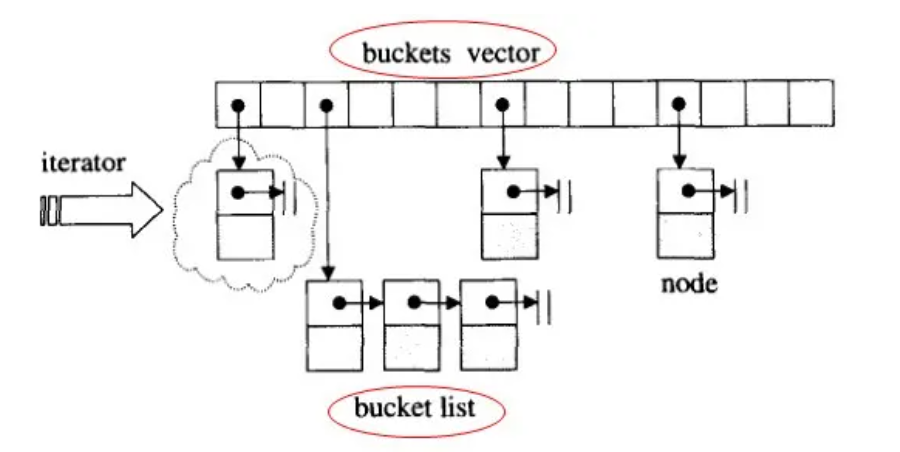</div>

> bucket 维护的链表，并不采用 STL 的 list ，而是自己维护的 hash table node，至于 buckets 表格，则是以 vector 构造完成，以便具有动态扩充能力。

```c++
//模板参数定义
/* 
Value： 节点的实值类型 
Key：   节点的键值类型 
HashFcn：hash function的类型 
ExtractKey：从节点中取出键值的方法（函数或仿函数） 
EqualKey：判断键值是否相同的方法（函数或仿函数） 
Alloc：空间配置器
*/ 
//hash table的线性表是用 vector 容器维护
template <class _Val, class _Key, class _HashFcn,
          class _ExtractKey, class _EqualKey, class _Alloc>
class hashtable {
public:
    typedef _Key key_type;
    typedef _Val value_type;
    typedef _HashFcn hasher;
    typedef _EqualKey key_equal;

    typedef size_t            size_type;
    typedef ptrdiff_t         difference_type;
    typedef value_type*       pointer;
    typedef const value_type* const_pointer;
    typedef value_type&       reference;
    typedef const value_type& const_reference;

    hasher hash_funct() const { return _M_hash; }
    key_equal key_eq() const { return _M_equals; }

private:
  	typedef _Hashtable_node<_Val> _Node;
};
```

这里需要注意的是，hashtable 的迭代器是正向迭代器，且必须维持这整个 buckets vector 的关系，并记录目前所指的节点。其前进操作是目前所指的节点，前进一个位置。

```c++
//以下是hash table的成员变量
private:
    hasher                _M_hash;
    key_equal             _M_equals;
    _ExtractKey           _M_get_key;
    vector<_Node*,_Alloc> _M_buckets;//用vector维护buckets
    size_type             _M_num_elements;//hashtable中list节点个数

public:
 	 typedef _Hashtable_iterator<_Val,_Key,_HashFcn,_ExtractKey,_EqualKey,_Alloc> iterator;
 	 typedef _Hashtable_const_iterator<_Val,_Key,_HashFcn,_ExtractKey,_EqualKey,_Alloc> 		 
     const_iterator;

public:
 //构造函数
  hashtable(size_type __n,
            const _HashFcn&    __hf,
            const _EqualKey&   __eql,
            const _ExtractKey& __ext,
            const allocator_type& __a = allocator_type())
    : __HASH_ALLOC_INIT(__a)
      _M_hash(__hf),
      _M_equals(__eql),
      _M_get_key(__ext),
      _M_buckets(__a),
      _M_num_elements(0) {
        	//预留空间大小为大于n的最小素数
          _M_initialize_buckets(__n);//预留空间,并将其初始化为空0
       
  }
```

提供两种插入元素的方法：insert_equal允许重复插入；insert_unique不允许重复插入。

```c++
//插入元素节点,不允许存在重复元素
pair<iterator, bool> insert_unique(const value_type& __obj) {
		//判断容量是否够用, 否则就重新配置 
  	resize(_M_num_elements + 1);
  	//插入元素,不允许存在重复元素
    return insert_unique_noresize(__obj);
}

//插入元素节点,允许存在重复元素
iterator insert_equal(const value_type& __obj){
  	//判断容量是否够用, 否则就重新配置
    resize(_M_num_elements + 1);
 		//插入元素,允许存在重复元素
    return insert_equal_noresize(__obj);
}
```

#### (2).基本操作

hash table 不需要要求输入数据具有随机性，在插入、删除和搜素操作都能达到常数平均时间。

SGI 中实现 hash table 的方式，是在每个 buckets 表格元素中维护一个链表, 在链表上执行元素的插入、搜寻、删除等操作，该表格中的每个元素被称为桶 (bucket)。

虽然开链法并不要求表格大小为质数，但 SGI STL 仍然已质数来设计表格大小，将 28 个质数计算好，以备随时访问。

```c++
// Note: assumes long is at least 32 bits.
// 注意：假设long至少为32-bits, 可以根据自己需要修改
//定义28个素数用作hashtable的大小 
enum { __stl_num_primes = 28 };

static const unsigned long __stl_prime_list[__stl_num_primes] = {
    53ul,         97ul,         193ul,       389ul,       769ul,
    1543ul,       3079ul,       6151ul,      12289ul,     24593ul,
    49157ul,      98317ul,      196613ul,    393241ul,    786433ul,
    1572869ul,    3145739ul,    6291469ul,   12582917ul,  25165843ul,
    50331653ul,   100663319ul,  201326611ul, 402653189ul, 805306457ul, 
    1610612741ul, 3221225473ul, 4294967291ul
};

//返回大于n的最小素数
inline unsigned long __stl_next_prime(unsigned long __n) {
const unsigned long* __first = __stl_prime_list;
const unsigned long* __last = __stl_prime_list + (int)__stl_num_primes;
const unsigned long* pos = lower_bound(__first, __last, __n);
```

hashtable的节点配置和释放分别由 new_node 和 delete_node 来完成，并且插入操作和表格重整分别由 insert_unique 和 insert_equal ,resize 三个函数来完成。

C++ STL 标准库中，不仅是 unordered_xxx 容器，所有无序容器的底层实现都采用的是哈希表存储结构。更准确地说，是用 “链地址法” 解决数据存储位置发生冲突的哈希表，整个存储结构如图所示。

<div align = center>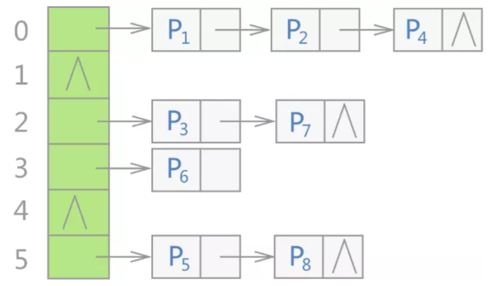</div>

其中，Pi 表示存储的各个键值对。

最左边的绿色称之为 bucket 桶，可以看到，当使用无序容器存储键值对时，会先申请一整块连续的存储空间，但此空间并不用来直接存储键值对，而是存储各个链表的头指针，各键值对真正的存储位置是各个链表的节点。

在 C++ STL 标准库中，将图 1 中的各个链表称为桶（bucket），每个桶都有自己的编号（从 0 开始）。当有新键值对存储到无序容器中时，整个存储过程分为如下几步：

- 将该键值对中键的值带入设计好的哈希函数，会得到一个哈希值（一个整数，用 H 表示）；
- 将 H 和无序容器拥有桶的数量 n 做整除运算（即 H % n），该结果即表示应将此键值对存储到的桶的编号；
- 建立一个新节点存储此键值对，同时将该节点链接到相应编号的桶上。

哈希表存储结构还有一个重要的属性，**称为负载因子（load factor）。**

该属性同样适用于无序容器，用于衡量容器存储键值对的空/满程序，

+ 即负载因子越大，意味着容器越满，即各链表中挂载着越多的键值对，这无疑会降低容器查找目标键值对的效率；
+ 反之，负载因子越小，容器肯定越空，但并不一定各个链表中挂载的键值对就越少。

举个例子，如果设计的哈希函数不合理，使得各个键值对的键带入该函数得到的哈希值始终相同（所有键值对始终存储在同一链表上）。这种情况下，即便增加桶数是的负载因子减小，该容器的查找效率依旧很差。

无序容器中，负载因子的计算方法为：

**负载因子 = 容器存储的总键值对 / 桶数**

默认情况下，无序容器的最大负载因子为 1.0。如果操作无序容器过程中，使得最大复杂因子超过了默认值，则容器会自动增加桶数，并重新进行哈希，以此来减小负载因子的值。

需要注意的是，此过程会导致容器迭代器失效，但指向单个键值对的引用或者指针仍然有效。

#### (3).unordered_set,unordered_mulitiset与unordered_map,unordered_mulitimap

unordered_set将哈希表的接口在进行了一次封装, 实现与 set 类似的功能.

```c++
template <class Value, class HashFcn = hash<Value>,
          class EqualKey = equal_to<Value>,
          class Alloc = alloc>
#else
template <class Value, class HashFcn, class EqualKey, class Alloc = alloc>
#endif
class hash_set {
private:
    // 将哈希表的接口在进行了一次封装
  	typedef hashtable<Value, Value, HashFcn, identity<Value>,  EqualKey, Alloc> ht;
  	ht rep;

public:
    typedef typename ht::key_type key_type;
    typedef typename ht::value_type value_type;
    typedef typename ht::hasher hasher;
    typedef typename ht::key_equal key_equal;

    // 定义为const类型, 键值不允许修改
    typedef typename ht::size_type size_type;
    typedef typename ht::difference_type difference_type;
    typedef typename ht::const_pointer pointer;
    typedef typename ht::const_pointer const_pointer;
    typedef typename ht::const_reference reference;
    typedef typename ht::const_reference const_reference;

    // 定义迭代器
    typedef typename ht::const_iterator iterator;
    typedef typename ht::const_iterator const_iterator;
    // 仿函数
    hasher hash_funct() const { return rep.hash_funct(); }
    key_equal key_eq() const { return rep.key_eq(); }
    ...
};
```

insert调用的是insert_unqiue函数

```c++
class hash_set{
public:
    // 都是调用hashtable的接口, 这里insert_unqiue函数
  	pair<iterator, bool> insert(const value_type& obj){
        pair<typename ht::iterator, bool> p = rep.insert_unique(obj);
        return pair<iterator, bool>(p.first, p.second);
    }
		...
};
```

unordered_set 与 unordered_multiset 特性完全相同，唯一差别在于它允许键值重复，因此插入操作采用的是底层机制 hashtable 的 insert_equal() 而非 insert_unique()。

```c++
template <class Key, class Value, class HashFcn = hash<Value>,
          class EqualKey = equal_to<Value>, class Alloc = simpleAlloc<Value>>
class hash_multimap {
private: 
  	//将哈希表的接口在进行了一次封装
    using ht = hashtable<pair<const Key, Value>, Key, HashFcn,
 							 select1st<pair<const Key, Value>>, EqualKey, Alloc>;
    ht rep;

public:  // alias declarations
    using key_type = typename ht::key_type;
    using data_type = Value;
    using mapped_type = Value;
    using value_type = typename ht::value_type;
    using hasher = typename ht::hasher;
    using key_equal = typename ht::key_equal;

    using iterator = typename ht::iterator;
    using const_iterator = typename ht::const_iterator;

    using size_type = typename ht::size_type;
  	...
};
```

---

## 六.算法

### 1.sort

std::sort有两个重载：

```cpp
  template<typename _RAIter>
    void 
    sort(_RAIter, _RAIter);

  template<typename _RAIter, typename _Compare>
    void 
    sort(_RAIter, _RAIter, _Compare);
```

殊途同归，调用了同一个函数std::__sort，只是第三个参数不同。

STL的sort算法，

+ 数据量大时采用**QuickSort快排算法**，分段归并排序。

+ 一旦分段后的数据量小于某个门槛（16），为避免QuickSort快排的递归调用带来过大的额外负荷，就改用**Insertion Sort插入排序**。
+ 如果递归层次过深，还会改用**HeapSort堆排序**。
