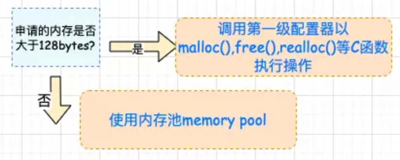
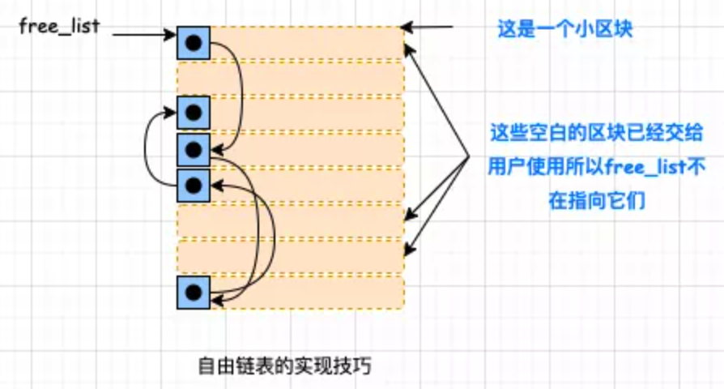
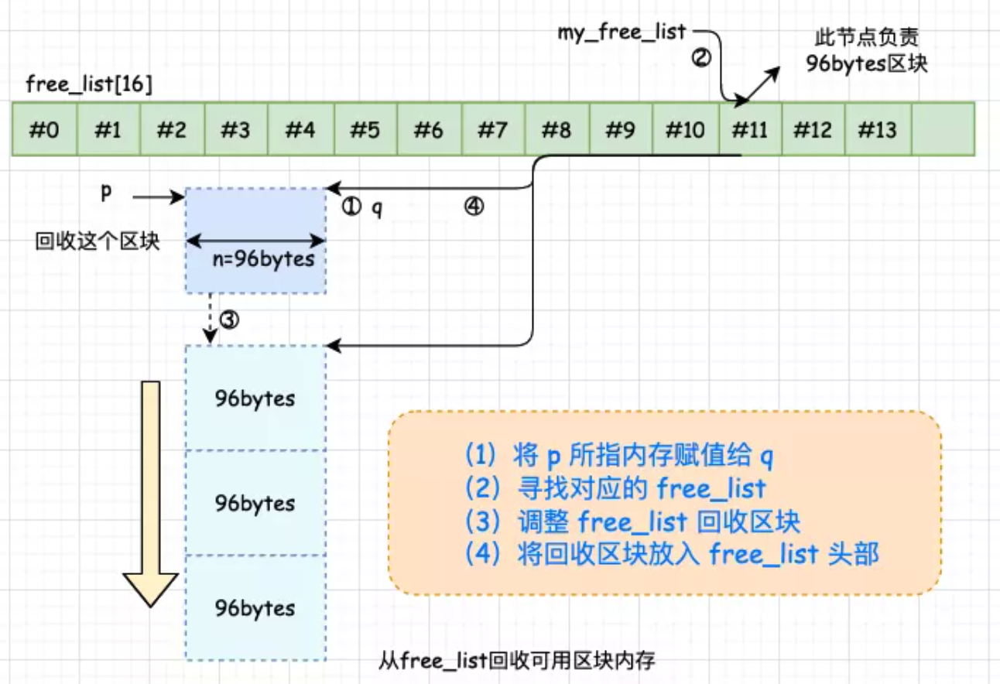
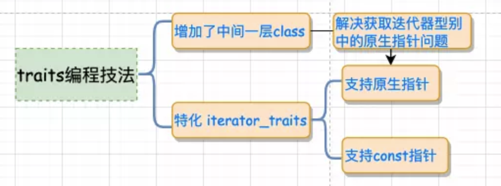
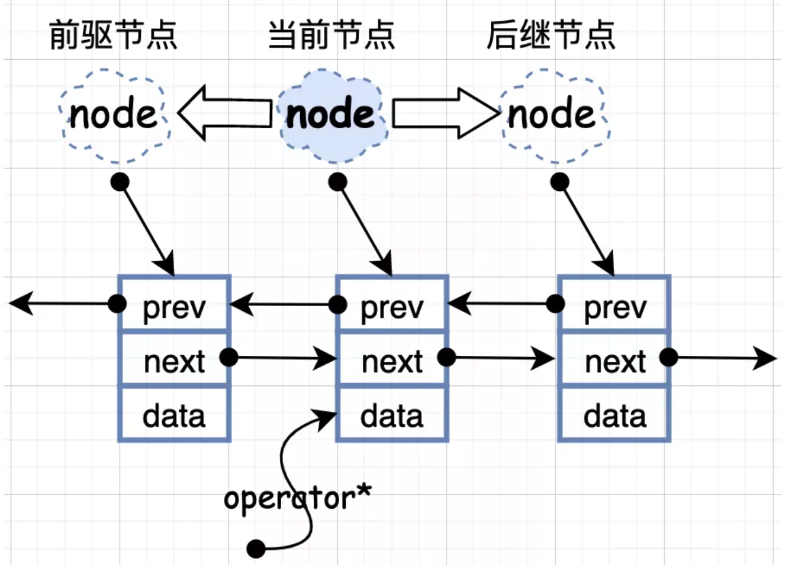

## 一.STL 概要

标准模板库（英文：Standard Template Library，缩写：STL），是一个 C++ 软件库。

STL 的价值在于两个方面，就底层而言，STL 带给我们一套极具实用价值的零部件以及一个整合的组织；除此之外，STL 还带给我们一个高层次的、以泛型思维 (Generic Paradigm) 为基础的、系统化的“软件组件分类学”。

STL 提供六大组件，了解这些为接下来的阅读打下基础。

 **1、容器（containers）** :各种数据结构，如 vector, list, deque, set, map 用来存放数据。从实现的角度来看，STL 容器是一种 class template。

 **2、算法（algorithms）** ：各种常用的算法如 sort, search, copy, erase…从实现角度来看，STL 算法是一种 function template。

 **3、迭代器（iterators）** ：扮演容器与算法之间的胶合剂，是所谓的“泛型指针”。从实现角度来看，迭代器是一种将 operator *, operator ->, operator++, operator– 等指针相关操作予以重载的class template。

 **4、仿函数（functors）** ：行为类似函数，可以作为算法的某种策略。从实现角度来看，仿函数是一种重载了 operator() 的 class 或class template。

 **5、适配器（adapters）** ：一种用来修饰容器或仿函数或迭代器接口的东西。例如 STL 提供的 queue 和 stack，虽然看似容器，其实只能算是一种容器适配器，因为它们的底部完全借助 deque，所有操作都由底层的 deque 供应。

 **6、配置器（allocator）** ：负责空间配置与管理，从实现角度来看，配置器是一个实现了动态空间配置、空间管理、空间释放的 class template。

---

## 二.空间配置器

>  STL空间配置器(allocator)在所有容器内部默默工作，负责空间的配置和回收。

### 1.设计原则

对象构造和析构之后的内存管理诸项事宜，由 <stl_alloc.h> 一律负责。SGI 对此的设计原则如下：

a. 向 system heap 要求空间

b. 考虑多线程 (multi-threads) 状态

c. 考虑内存不足时的应变措施

d. 考虑过多“小型区块”可能造成的内存碎片 (fragment) 问题

### 2.配置器设计

考虑到小型区块可能造成的内存破碎问题，SGI 为此设计了双层级配置器。

+ 当配置区块超过 128bytes 时，称为足够大，使用第一级配置器，直接使用 malloc() 和 free()。

+ 当配置区块不大于 128bytes 时，为了降低额外负担，直接使用第二级配置器，采用 memory pool 处理方式。

无论使用第一级配接器（\__malloc_alloc_template）或是第二级配接器（__default_alloc_template），alloc 都为其包装了接口，使其能够符合 STL 标准。


### 3.一级配置器设计

+ 第一级配置器以 malloc(), free(), realloc() 等 C 函数执行实际的内存配置、释放和重配置操作，并实现类似 C++ new-handler 的机制（因为它并非使用 ::operator new 来配置内存，所以不能直接使用C++ new-handler 机制）。

> 不使用 ::operator new 来配置内存的原因：
>
> + 历史原因
> + C++并未提供相应于 realloc() 的内存配置操作
>
> 因此SGI不能直接使用C++的set_new_handler()，必须仿真一个类似的set_malloc_handler

+ SGI 第一级配置器的 allocate() 和 reallocate() 都是在调用malloc() 和 realloc() 不成功后，改调用 oom_malloc() 和oom_realloc()。

```c++
template <int inst>
class __malloc_alloc_template {
private:
    static void *oom_malloc(size_t);								     // malloc内存不足处理例程
    static void *oom_realloc(void *, size_t);				 		 // realloc内存不足处理例程
    #ifndef __STL_STATIC_TEMPLATE_MEMBER_BUG
        static void (* __malloc_alloc_oom_handler)();    //函数指针，保存用户定义的内存不足处理函数
    #endif
 
public:
    static void * allocate(size_t n){
        void *result = malloc(n);								   		   //第一级配置器：直接调用malloc
        if (0 == result) result = oom_malloc(n);				 //内存不足 调用处理例程oom_malloc
        return result;
    }
    static void deallocate(void *p, size_t /* n */){
        free(p);																	  		 //第一级配置器：直接调用free
    }
    static void * reallocate(void *p, size_t /* old_sz */, size_t new_sz){
        void * result = realloc(p, new_sz);					     //第一级配置器：直接调用remalloc
        if (0 == result) result = oom_realloc(p, new_sz);//内存不足 调用处理例程oom_realloc
        return result;
    }
    //以下仿真 C++ 的 set_malloc_handler 。
  	//换句话说，可以通过它指定自己的 out-of-memory handler
    static void (* set_malloc_handler(void (*f)()))(){
        void (* old)() = __malloc_alloc_oom_handler;
        __malloc_alloc_oom_handler = f;
        return(old);
    }
};
```

+ oom_malloc() 和 oom_realloc() 都有内循环，不断调用“内存不足处理例程”，期望某次调用后，获得足够的内存而圆满完成任务，哪怕有一丝希望也要全力以赴申请啊，
+ 如果用户并没有指定“内存不足处理程序”，这个时候便无力乏天，真的是没内存了，STL 便抛出异常。或调用exit(1) 终止程序。

```c++
// malloc_alloc out-of-memory handling
//初值为0，有待客端设定
template <int inst>
void (* __malloc_alloc_template<inst>::__malloc_alloc_oom_handler)() = 0;

template <int inst>
void * __malloc_alloc_template<inst>::oom_malloc(size_t n){
    void (* my_malloc_handler)();
    void *result;
    for (;;) {													//反复调用用户定义(通过set_malloc_hander函数)的内存不足函数
        my_malloc_handler = __malloc_alloc_oom_handler;
        if (0 == my_malloc_handler) { __THROW_BAD_ALLOC; }
        (*my_malloc_handler)();					//调用处理例程，企图释放内存
        result = malloc(n); 						// 不断尝试分配内存
        if (result) return(result);
    }
}
template <int inst>//和oom_malloc类似
void * __malloc_alloc_template<inst>::oom_realloc(void *p, size_t n){
    void (* my_malloc_handler)();
    void *result;
    for (;;) {											 	 //反复调用用户定义(通过set_malloc_hander函数)的内存不足函数
        my_malloc_handler = __malloc_alloc_oom_handler;
        if (0 == my_malloc_handler) { __THROW_BAD_ALLOC; }
        (*my_malloc_handler)();			   //调用处理例程，企图释放内存
        result = realloc(p, n);				 // 不断尝试分配内存
        if (result) return(result);
    }
}
```

### 4.二级配置器设计

>  第二级配置器多了一些机制，专门针对内存碎片。内存碎片化带来的不仅仅是回收时的困难，配置也是一个负担，额外负担永远无法避免，毕竟系统要划出这么多的资源来管理另外的资源，但是区块越小，额外负担率就越高。

SGI第二级配置器的做法是：sub-allocation （层次架构）：

+ SGI STL 的第一级配置器是直接使用 malloc()， free(), realloc() 并配合类似 C++ new-handler 机制实现的。

+ 第二级配置器的工作机制要根据区块的大小是否大于 128bytes 来采取不同的策略：

  <div align = center></div>

+ 二级配置器 memory pool 原理：

  <div align = center></div>

#### (1).自由链表的设计与维护

+ 内存池管理(次层配置)设计：
  + 每次配置一大块内存，并维护对应的自由链表(free lists)
  + 下次若再有相同大小的内存需求，就直接从free lists中拨出
  + 如果客端释还小额内存，就由配置器回收到 free lists中
  + 为了方便管理，二级配置器自动将任何小额区块的内存需求量上调至8的倍数，维护16个 free lists (8->128 bytes)

+ free lists的结点设计

  <div align = center></div>

  ```c++
  union obj {
    	union obj* free_list_link;		//指向链表中的下一个节点；
    	char client_data[1];					//指向链表中的下一个节点；
  }
  ```

  > 一物二用的好处就是不会为了维护链表所必须的指针而造成内存的另一种浪费，或许这就是所谓的自由奥义所在！大师的智慧跃然纸上。

+ 第二级配置器的部分实现内容

```c++
enum __freelist_setting {
    __ALIGN = 8,													//区块上调边界
    __MAX_BYTES = 128,										//区块上限
    __NFREELISTS = __MAX_BYTES / __ALIGN	//freelist个数
};
// 第二级配置器
template <bool threads, int inst>
class __default_alloc {
private:
    static size_t ROUND_UP(size_t bytes){ // 将bytes上调至8的倍数
        return (((bytes) + static_cast<size_t>(__ALIGN) - 1) & 
                				 ~(static_cast<size_t>(__ALIGN) - 1));
    }
private:
    // free_list节点构造
    union obj {
        union obj *free_list_link;  //指向下一节点
        char client_data[1];        //指向资源
    };
private:
    static obj *volatile free_list[__NFREELISTS];
    // 决定使用第几号节点，从1起算
    static size_t FREELIST_INDEX(size_t bytes) {
        return (bytes + static_cast<size_t>(__ALIGN) - 1) /
                   static_cast<size_t>(__ALIGN) -
               1;
    }
    // 传回一个大小为n的对象，并且可能加入大小为n的其它区块到free_list
    static void *refill(size_t n);
    // 配置一大块空间，可容纳 nobjs 个大小为 size 的区块
    // 如果不便配置 nobjs 可能会降低
    static char *chunk_alloc(size_t size, int &nobjs);
  
    // chunk allocation state
    static char *start_free;  //内存池起始位置，只在chunk_alloc()中变化
    static char *end_free;    //内存池结束位置，只在chunk_alloc()中变化
    static size_t heap_size;
public:
    static void *allocate(size_t n);
    static void deallocate(void *p, size_t n);
    static void *reallocate(void *p, size_t old_sz, size_t new_sz);
};
char *__default_alloc::start_free = nullptr;
char *__default_alloc::end_free   = nullptr;
size_t __default_alloc::heap_size = 0;
__default_alloc::obj *volatile __default_alloc::free_list[__NFREELISTS] = {
    nullptr, nullptr, nullptr, nullptr, nullptr, nullptr, nullptr, nullptr,
    nullptr, nullptr, nullptr, nullptr, nullptr, nullptr, nullptr, nullptr};
```

#### (2).空间配置器函数allocate

第二级配置器拥有配置器的标准接口函数 allocate()。

+ 此函数首先判断区块的大小，如果大于 128bytes –> 调用第一级配置器；
+ 小于128bytes–> 就检查对应的 free_list
  + 如果没有可用区块，就将区块上调至 8 倍数的边界，然后调用 refill(), 为 free list 重新填充空间。

<div align = center></div>

```c++
static void *allocate(size_t n) {
    obj *volatile *my_free_list;
    obj *result;
    // 若n大于128,则采用第一级适配器
    if (n > __MAX_BYTES) 
      	return (malloc_alloc::allocate(n));
    // 选择采用第几区块
    my_free_list = free_list + FREELIST_INDEX(n);
    result = *my_free_list;
    if (result == nullptr) {
        // 未找到可用free_list，准备填充free_list
        void *r = refill(ROUND_UP(n));
        return r;
    }
    // 调整freelist
    *my_free_list = result->free_list_link;
    return result;
}
```

#### (3).空间释放函数 deallocte

作为第二级配置器拥有配置器标准接口函数 deallocate()。

+ 该函数首先判断区块大小，大于 128bytes 就调用第一级配置器。
+ 小于 128bytes 就找出对应的 free_list，将区块回收。

<div align = center></div>

```c++
static void deallocate(void *p, size_t n) {
  	//大于128则直接调用第一级配置器
    if (n > static_cast<size_t>(__MAX_BYTES))
        malloc_alloc::deallocate(p, n);
    else {
        // 寻找对应的free list
        obj *volatile *my_free_list = free_list + FREELIST_INDEX(n);
        obj *q = reinterpret_cast<obj *>(p);
        // 调整free list，回收区块
        q->free_list_link = *my_free_list;
        *my_free_list = q;
    }
}
```

#### (4).重新填充 free lists

1. 当发现 free list 中没有可用区块时，就会调用 refill() 为free_list 重新填充空间；
2. 新的空间将取自内存池（经由 chunk_alloc() 完成）；
3. 缺省取得20个新节点（区块），但万一内存池空间不足，获得的节点数可能小于 20。

```c++
// 当free_list无可用区块时，重新填充空间
// 返回一个大小为 n 的对象，而且有时候会为适当的 free lists 增加结点
void *__default_alloc::refill(size_t n) {
    int nobjs = 20;
    // 尝试调用chunk_alloc,尝试取得 nobjs 个区块作为 free list 的新结点
  	// 注意nobjs以pass-by-reference传入
    char *chunk = chunk_alloc(n, nobjs);
    obj *volatile *my_free_list;
    obj *result;
    obj *current_obj, *next_obj;

    // 若只获取了一个区块则直接分配给调用者，不加入free_list
    if (1 == nobjs) return (chunk);
  	//否则准备调整free list，纳入新结点
    my_free_list = free_list + FREELIST_INDEX(n);

    // 在chunk空间内建立free_list
    result = reinterpret_cast<obj *>(chunk);
    // 引导free_list指向内存池分配的空间
    // chunk指向的内存直接分给用户，free_list指向剩下（19或更少）的区块
    *my_free_list = next_obj = reinterpret_cast<obj *>(chunk + n);
    for (int i = 1;; ++i) {
        current_obj = next_obj;
        next_obj =
            reinterpret_cast<obj *>(reinterpret_cast<char *>(next_obj) + n);
        if (nobjs - 1 == i) {
            current_obj->free_list_link = nullptr;
            break;
        } else {
            current_obj->free_list_link = next_obj;
        }
    }
    return result;
}
```

#### (5).内存池的设计与使用

使用  chunk_alloc()  函数，从内存池中取空间给 free_list 使用。chunk_alloc() 函数以 end_free – start_free 来判断内存池的“水量”，具体逻辑如下图所示：

<div align = center></div>

> 如果第一级配置器的 malloc() 也失败了，就发出 bad_alloc 异常。

<div align = center></div>

```c++
// 默认size为8的整数倍
char *__default_alloc::chunk_alloc(size_t size, int &nobjs) {
    char *result;
    size_t total_bytes = size * nobjs;
    size_t bytes_left = end_free - start_free;  //内存池剩余空间
    if (bytes_left >= total_bytes) {
        // 容量满足需求
        result = start_free;
        start_free += total_bytes;
        return result;
    } else if (bytes_left > size) {
        // 容量至少满足一个区块需求
        nobjs = static_cast<int>(bytes_left / size);
        total_bytes = size * nobjs;
        result = start_free;
        start_free += total_bytes;
        return result;
    } else {
        // 内存池一个区块都无法提供
      	// 向heap申请注入的内存，heap_size将随着配置次数增加而增加
        size_t bytes_to_get = 2 * total_bytes + ROUND_UP( heap_size >> 4);  
        if (bytes_left > 0) {
            // 当前内存池还有一部分内存，为了不浪费分配给free_list
            obj *volatile *my_free_list =
                free_list + FREELIST_INDEX(bytes_left);
            reinterpret_cast<obj *>(start_free)->free_list_link = *my_free_list;
            *my_free_list = reinterpret_cast<obj *>(start_free);
        }
        // 配置heap空间以补充内存池
        start_free = reinterpret_cast<char *>(malloc(bytes_to_get));
        if (!start_free) {
            // heap空间不足，malloc失败
            obj *volatile *my_free_list;
            obj *p;
            // 在free_list中检查是否有符合需求的区块
            for (size_t i = size; i <= static_cast<size_t>(__MAX_BYTES);
                 i += static_cast<size_t>(__ALIGN)) {
                my_free_list = free_list + FREELIST_INDEX(i);
                p = *my_free_list;
                if (p) {
                    // 存在足以分配的区块
                    *my_free_list = p->free_list_link;  // 抽离当前区块
                    start_free = reinterpret_cast<char *>(p);
                    end_free = start_free + i;
                    return (chunk_alloc(
                        size,
                        nobjs));  // 递归调用以修正nobjs，此时必然进入else_if分支
                }
            }
            end_free = nullptr;  // 到处都找不到内存
            // 调用第一级适配器观察其能否分配内存，或抛出异常
            start_free =
                reinterpret_cast<char *>(malloc_alloc::allocate(bytes_to_get));
        }
        heap_size += bytes_to_get;  // 已占用的堆内存
        end_free = start_free + bytes_to_get;
        return chunk_alloc(size, nobjs);  // 调用自身以修正nobjs
    }
}
```

---

## 三.迭代器与traits编程技法

### 1.迭代器

> 为什么需要迭代器？
>
> + 在 STL 中，容器和算法是独立设计的，容器里存放数据，算法提供对数据的操作，在算法操作数据的过程中，要用到迭代器，迭代器可以看做是容器和算法中间的桥梁。

#### (1).迭代器的基本介绍

+ iterator 的描述如下：**一种能够顺序访问容器中每个元素的方法，使用该方法不能暴露容器内部的表达方式。而类型萃取技术就是为了要解决和 iterator 有关的问题的。**
+ 迭代器其实也是一种智能指针，拥有一般指针的所有特点—— 能够对其进行 `*`和 `->` 操作。


---

### 2.traits编程技法

> 算法需要知道处理的范围，数据类型以及迭代器的类型等(5种)消息，所以需要向迭代器进行询问，如果迭代器是class类型，则可以直接返回，但是如果迭代器是原生指针类型，则无法返回。
>
> 基于此，就提出了traits技法，利用模板偏特化来进行返回消息。

traits 编程技法 **就是增加一层中间的模板** **`class`**，以解决获取迭代器的型别中的原生指针问题。

<div align = center></div>

```c++
#include <iostream>
template <class T>
struct MyIter {
    typedef T value_type; // 内嵌型别声明
    T* ptr;
    MyIter(T* p = 0) : ptr(p) {}
    T& operator*() const { return *ptr; }
};
// class type
template <class T>
struct my_iterator_traits {
    typedef typename T::value_type value_type;
};
// 偏特化 1
template <class T>
struct my_iterator_traits<T*> {
    typedef T value_type;
};
// 偏特化 2
template <class T>
struct my_iterator_traits<const T*> {
    typedef T value_type;
};

// 首先询问 iterator_traits<I>::value_type
//如果传递的 I 为指针,则进入特化版本,iterator_traits 直接回答;
//如果传递的 I 为 class type,就去询问 T::value_type.
template <class I>
typename my_iterator_traits<I>::value_type Func(I ite) {
    std::cout << "normal version" << std::endl;
    return *ite;
}
int main(int argc, const  char *argv[]) {
    MyIter<int> ite(new int(6));
    std::cout << Func(ite)<<std::endl;//print=> 6
    int *p = new int(7);
    std::cout<<Func(p)<<std::endl;//print=> 7
    const int k = 8;
    std::cout<<Func(&k)<<std::endl;//print=> 8
}
```

通俗的解释可以参照下图：


<div align = center></div>

核心知识点在于 **模板参数推导机制+内嵌类型定义机制**， 为了能处理原生指针这种特殊的迭代器，引入了**偏特化机制**。`traits` 就像一台 “特性萃取机”，把迭代器放进去，就能榨取出迭代器的特性。

<div align = center></div>

---

## 四.序列式容器

### 1.array


### 2.vector


### 3.list

> list 源码里分了两个部分，一个部分是 list 结构，另一部分是 list 节点的结构。

#### (1).list结点的设计

__list_node 用来实现节点，数据结构中就储存前后指针和属性。

<div align = center></div>

```c++
template <class T> struct __list_node {
   typedef void* void_pointer;// 前后指针
   void_pointer next;
   void_pointer prev;
   T data;										// 属性
};
```

---

#### (2).迭代器的设计

```c++
template<class T, class Ref, class Ptr> struct __list_iterator {
   typedef __list_iterator<T, T&, T*>     iterator; // 迭代器
   typedef __list_iterator<T, const T&, const T*> const_iterator;
   typedef __list_iterator<T, Ref, Ptr>    self;  
    // 迭代器是bidirectional_iterator_tag类型
   typedef bidirectional_iterator_tag iterator_category;
   typedef T value_type;
   typedef Ptr pointer;
   typedef Ref reference;
   typedef size_t size_type;
   typedef ptrdiff_t difference_type;
    ... 
};
```

+ iterator++与++iterator的设计

> 设计原则就是向 整数 类型致敬，所以支持 ++++it，不支持 it++++

```c++
// ++和--是直接操作的指针指向next还是prev, 因为list是一个双向链表
self& operator++() { 
    node = (link_type)((*node).next);
    return *this;
}
```

> + 返回的是引用类型，所以支持再运算。

```c++
self operator++(int) { 
    self tmp = *this;
    ++*this;
    return tmp;
}
```

> + 返回的是数值类型，所以不支持再运算
> + `self tmp = *this;`先调用的是 拷贝构造函数，没有涉及*重载
> + `++*this;`调用的是++重载，没有涉及*重载

+ \* 与 -> 的设计

```c++
reference operator*() const {
  	return (*node).data;
}
pointer operator->() const {
  	return &(operator*());
}
```

---

#### (3).list结构的设计

list 自己定义了嵌套类型满足 traits 编程， list 迭代器是 bidirectional_iterator_tag 类型，并不是一个普通指针。

<div align = center></div>

list 在定义 node 节点时， 定义的不是一个指针，这里要注意。

```c++
template <class T, class Alloc = alloc>
class list {
protected:
    typedef void* void_pointer;
    typedef __list_node<T> list_node; // 节点 就是前面分析过的
    typedef simple_alloc<list_node, Alloc> list_node_allocator; // 空间配置器
public:      
    // 定义嵌套类型
    typedef T value_type;
    typedef value_type* pointer;
    typedef const value_type* const_pointer;
    typedef value_type& reference;
    typedef const value_type& const_reference;
    typedef list_node* link_type;
    typedef size_t size_type;
    typedef ptrdiff_t difference_type;
    
protected:
    link_type node; // 定义一个节点, 这里节点并不是一个指针.
public:
    typedef __list_iterator<T, T&, T*>             iterator;// 定义迭代器
    typedef __list_iterator<T, const T&, const T*> const_iterator;
 ...
};
```


