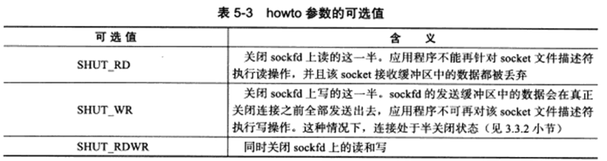
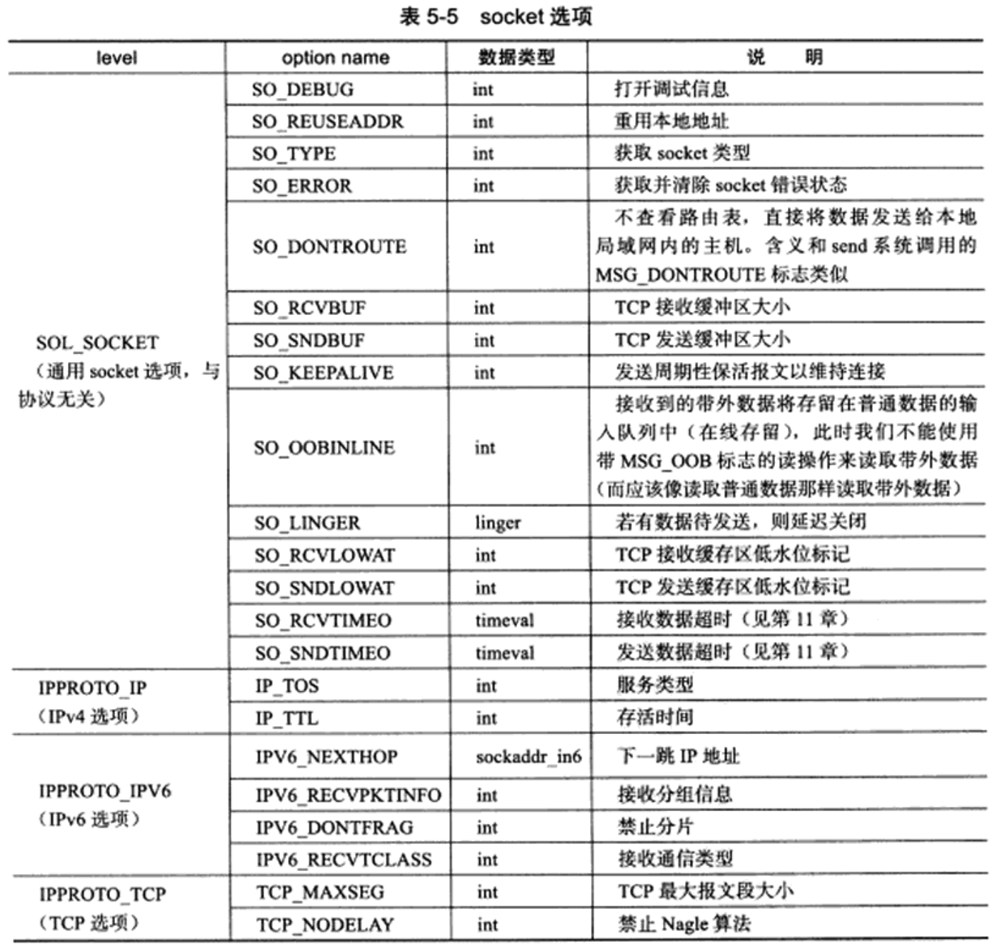
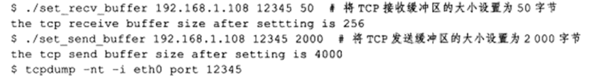
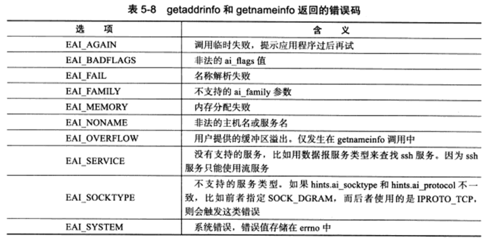
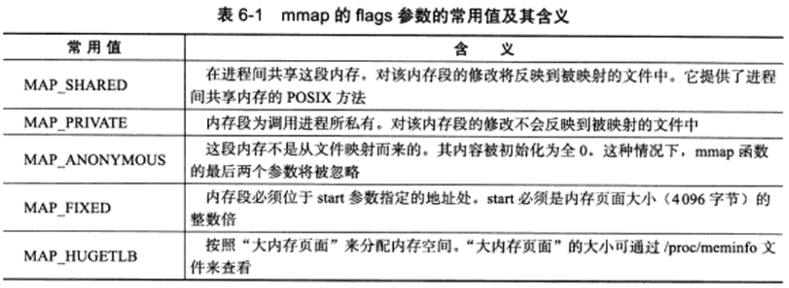
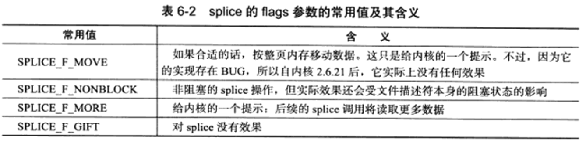
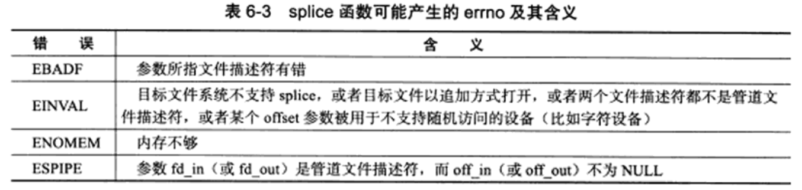
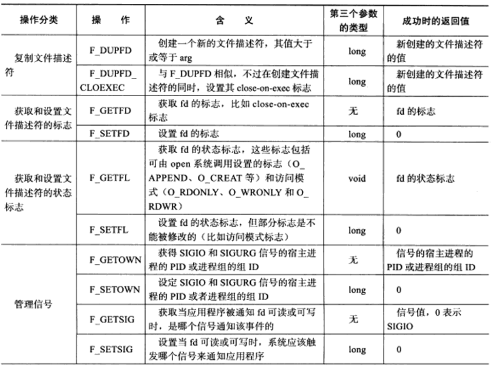
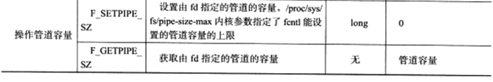

## 一.套接字编程简介

### 1.字节排序函数

内存中的多字节数据相对于内存地址有大端和小端之分，磁盘文件中的多字节数据相对于文件中的偏移地址也有大端小端之分。网络数据流同样有大端小端之分，那么如何定义网络数据流的地址呢？

发送主机通常将发送缓冲区中的数据按内存地址从低到高的顺序发出，接收主机把从网络上接到的字节依次保存在接收缓冲区中，也是按内存地址从低到高的顺序保存，因此，网络数据流的地址应这样规定： **<font color = red>先发出的数据是低地址，后发出的数据是高地址。(12为高位，78为低位)</font>**

<div align = "center">
  
</div>


**<font color = red>TCP/IP协议规定，网络数据流应采用大端字节序，计算机为小端存储，即低地址高字节。</font>**

> + 大端字节序：低地址存高位
> + 小端字节序：低地址存低位

例如UDP段格式，地址0-1是16位的源端口号，如果这个端口号是1000（0x3e8），则地址0是0x03，地址1是0xe8，也就是先发0x03，再发0xe8，这16位在发送主机的缓冲区中也应该是低地址存0x03，高地址存0xe8。但是，如果发送主机是小端字节序的，这16位被解释成0xe803，而不是1000。因此，发送主机把1000填到发送缓冲区之前需要做字节序的转换。同样地，接收主机如果是小端字节序的，接到16位的源端口号也要做字节序的转换。如果主机是大端字节序的，发送和接收都不需要做转换。同理，32位的IP地址也要考虑网络字节序和主机字节序的问题。

为使网络程序具有可移植性，使同样的C代码在大端和小端计算机上编译后都能正常运行，可以调用以下库函数做**网络字节序和主机字节序的转换**。

```c
#include <arpa/inet.h>
uint32_t htonl(uint32_t hostlong);
uint16_t htons(uint16_t hostshort);
uint32_t ntohl(uint32_t netlong);
uint16_t ntohs(uint16_t netshort);
```

>  h表示host，n表示network，l表示32位长整数，s表示16位短整数。
>
>  hton： **将数据从主机字节序转换成网络字节序**
>
>  ntoh： **将数据从网络字节序转换为主机字节序**

如果主机是小端字节序，这些函数将参数做相应的大小端转换然后返回，如果主机是大端字节序，这些函数不做转换，将参数原封不动地返回。

### 2.字节操控函数

Berkeley 版：

```c
#include <strings.h>

//bzero把目标字节串中指定数目的字节置为0。我们经常使用该函数来把一个套接字地址结构初始化为0。
void bzero(void *dest, size_t nbytes);// 将目标设置为 0
//bcopy将指定数目的字节从源字节串移到目标字节串。
void bcopy(const void *src, void *dest, size_t nbytes);
//bcmp比较两个任意的字节串，若相同则返回值为0，否则返回值为非0
int bcmp(const void *ptrl, const void *ptr2, size_t nbytes);
```

ANSI C 版：

```c
#include<string.h>

//memset把目标字节串指定数目的字节置为值c。
void *memset(void *dest, int c, size_t len);
//memcpy类似bcopy，不过两个指针参数的顺序是相反的。当源字节串与目标字节串重叠时，bcopy能够正确处理，但是memcpy的操作结果却不可知。
void *memcpy(void *dest,const void *src, size_t nbytes);
int memcmp(const void *ptrl, const void *ptr2, sise_t nbytes);
```

> tip：memcpy 类似 bcopy 但是指针参数相反
> memcpy参数顺序记忆：
> dest = src；

### 3.socket地址

`strcut sockaddr` 很多网络编程函数诞生早于IPv4协议，那时候都使用的是sockaddr结构体,为了向前兼容，现在sockaddr退化成了（void *）的作用，传递一个地址给函数，至于这个函数是`sockaddr_in`还是`sockaddr_in6`，由地址族确定，然后函数内部再强制类型转化为所需的地址类型。

<div align = "center"></div>

+ sockaddr数据结构的结构体：

```c
struct sockaddr {
	sa_family_t sa_family; 		/* address family, AF_xxx */
	char sa_data[14];			/* 14 bytes of protocol address */
};
```

+ 可以看出sockaddr无法容纳多数协议族的地址值。因此定义了下面这个新的通用的socket地址结构体。

+ 使用 `sudo grep -r "struct sockaddr_in {"  /usr `命令可查看到`struct sockaddr_in`结构体的定义。一般其默认的存储位置：`/usr/include/linux/in.h` 文件中。

  ```c
  struct sockaddr_in {
  	__kernel_sa_family_t sin_family; 			/* Address family */  	地址结构类型
  	__be16 sin_port;					 		/* Port number */		端口号
  	struct in_addr sin_addr;					/* Internet address */	IP地址
  	/* Pad to size of `struct sockaddr'. */
  	unsigned char __pad[__SOCK_SIZE__ - sizeof(short int) -
  	sizeof(unsigned short int) - sizeof(struct in_addr)];
  };
  
  struct in_addr {						/* Internet address. */
  	__be32 s_addr;
  };
  
  struct sockaddr_in6 {
  	unsigned short int sin6_family; 		/* AF_INET6 */
  	__be16 sin6_port; 					/* Transport layer port # */
  	__be32 sin6_flowinfo; 				/* IPv6 flow information */
  	struct in6_addr sin6_addr;			/* IPv6 address */
  	__u32 sin6_scope_id; 				/* scope id (new in RFC2553) */
  };
  
  struct in6_addr {
  	union {
  		__u8 u6_addr8[16];
  		__be16 u6_addr16[8];
  		__be32 u6_addr32[4];
  	} in6_u;
  	#define s6_addr 		in6_u.u6_addr8
  	#define s6_addr16 	in6_u.u6_addr16
  	#define s6_addr32	 	in6_u.u6_addr32
  };
  
  //本地协议族专用define UNIX_PATH_MAX 108
  	struct sockaddr_un {
  	__kernel_sa_family_t sun_family; 	/* AF_UNIX */
  	char sun_path[UNIX_PATH_MAX]; 	/* pathname */
  };
  ```

+ Pv4和IPv6的地址格式定义在`netinet/in.h`中，IPv4地址用`sockaddr_in`结构体表示，包括16位端口号和32位IP地址，IPv6地址用`sockaddr_in6`结构体表示，包括16位端口号、128位IP地址和一些控制字段。

+ UNIX Domain Socket的地址格式定义在`sys/un.h`中，用`sock-addr_un`结构体表示。各种socket地址结构体的开头都是相同的，前16位表示整个结构体的长度（并不是所有UNIX的实现都有长度字段，如Linux就没有），后16位表示地址类型。IPv4、IPv6和Unix Domain Socket的地址类型分别定义为常数AF_INET、AF_INET6、AF_UNIX。这样，只要取得某种sockaddr结构体的首地址，不需要知道具体是哪种类型的sockaddr结构体，就可以根据地址类型字段确定结构体中的内容。

+ 因此，socket API可以接受各种类型的sockaddr结构体指针做参数，例如bind、accept、connect等函数，这些函数的参数应该设计成void *类型以便接受各种类型的指针，但是sock API的实现早于ANSI C标准化，那时还没有void *类型，因此这些函数的参数都用struct sockaddr *类型表示，在传递参数之前要强制类型转换一下，例如：

  ```c
  struct sockaddr_in servaddr;
  bind(listen_fd, (struct sockaddr *)&servaddr, sizeof(servaddr));		/* initialize servaddr */
  ```

### 4.IP 地址转换函数

```c
#include <arpa/inet.h>

//返回：若字符串有效则为1，否则为0
int inet_aton(const char *strptr, struct in_addr *addrptr);
//返回：若字符串有效则为32位二进制网络字节序的IPv4地址，否则为INADDR_NONE
in_addr_t inet_addr(const char *strptr);
//返回：指向一个点分十进制数串的指针
char *inet_ntoa(struct in_addr inaddr);
```

> 以上都是旧版，都是使用下面的新版本。

这两个函数是随IPv6出现的新函数，对于IPv4地址和IPv6地址都适用。本书通篇都在使用这两个函数。函数名中p和n分别代表表达(presentation)和数值(numeric)。

```c 
#include <arpa/inet.h>

//返回：若成功则为1，若输入不是有效的表达格式则为 0，若出错则为-1
int inet_pton(int family, const char *strptr, void*addrptr);
//返回：若成功则为指向结果的指针，若出错则为NULL
const char *inet_ntop(int family, const void *addrptr, char *strptr, size_t len);
```

+ family 可以是AF_INET 或 AF_INET6

+  len 是目标存储单元大小,在 <netinet/in.h>中

   ```c
   #define INET_ADDRSTRLEN 16
   #define INET6_ADDRSTRLEN 46
   ```

+ inet_ntop函数的strptr参数不可以是一个空指针。调用者必须为目标存储单元分配内存并指定其大小。调用成功时，这个指针就是该函数的返回值。


---

## 二.基本套接字编程

TCP客户端/服务器端套接字通信流程

<div align = "center"></div>

### 1.创建socket—socket函数

+ socket()打开一个网络通讯端口，如果成功的话，就像open()一样返回一个文件描述符，应用程序可以像读写文件一样用read/write在网络上收发数据，如果socket()调用出错则返回-1。

+ 对于IPv4，domain参数指定为AF_INET。对于TCP协议，type参数指定为SOCK_STREAM，表示面向流的传输协议。如果是UDP协议，则type参数指定为SOCK_DGRAM，表示面向数据报的传输协议。protocol参数的介绍从略，指定为0即可。

+ 头文件与函数调用

  ```c
  #include <sys/types.h> /* See NOTES */
  #include <sys/socket.h>
  int socket(int domain, int type, int protocol);
  ```

+ 参数内容与返回值：

  + domain:

    > 套接字中使用的协议族信息

    + AF_INET 这是大多数用来产生socket的协议，使用TCP或UDP来传输，用IPv4的地址
    + AF_INET6 与上面类似，不过是来用IPv6的地址
    + AF_UNIX 本地协议，使用在Unix和Linux系统上，一般都是当客户端和服务器在同一台及其上的时候使用

  + type:

    > 套接字数据传输类型信息

    +   SOCK_STREAM 面向连接的套接字。这个协议是按照顺序的、可靠的、数据完整的基于字节流的连接。这是一个使用最多的socket类型，这个socket是使用TCP来进行传输。
    +   SOCK_DGRAM 面向消息的套接字。这个协议是无连接的、固定长度的传输调用。该协议是不可靠的，使用UDP来进行它的连接。
    +   SOCK_SEQPACKET该协议是双线路的、可靠的连接，发送固定长度的数据包进行传输。必须把这个包完整的接受才能进行读取。
    +   SOCK_RAW socket类型提供单一的网络访问，这个socket类型使用ICMP公共协议。（ping、traceroute使用该协议）
    +   SOCK_RDM 这个类型是很少使用的，在大部分的操作系统上没有实现，它是提供给数据链路层使用，不保证数据包的顺序

  + protocol:

    > 在前两个参数构成的协议集合下，再选择一个具体的协议。
    >
    > 大部分情况下参数传递0，除非同一协议族中存在多个数据传输方式相同的协议。

    + 传0 表示使用默认协议。

  + 返回值：

    + 成功：返回指向新创建的socket的文件描述符，失败：返回-1，设置errno

### 2.命名socket—bind函数

> 创建socket时，我们给它指定了地址族，但是并未指定使用该地址族中哪个具体socket地址，将一个socket与socket地址绑定称为socket命名。

+ 服务器程序所监听的网络地址和端口号通常是固定不变的，客户端程序得知服务器程序的地址和端口号后就可以向服务器发起连接，因此服务器需要调用bind绑定一个固定的网络地址和端口号。

+ **bind()的作用是将参数sockfd和addr绑定在一起，使sockfd这个用于网络通讯的文件描述符监听addr所描述的地址和端口号。** 

+ 头文件与函数调用：

  ```c
  #include <sys/types.h> /* See NOTES */
  #include <sys/socket.h>
  
  int bind(int sockfd, const struct sockaddr *addr, socklen_t addrlen);
  ```

+ 参数内容与返回值

  + sockfd：
    + socket文件描述符
  + addr:
    + 构造出IP地址加端口号
  + addrlen:
    + sizeof(addr)长度
  + 返回值：
    + 成功返回0，失败返回-1, 设置errno
    + 常见的两种errno
      + EACCES：被绑定的地址是被保护的，仅超级用户能够访问。
      + EADDRINUSE：被绑定的地址正在使用中。

+ 前面讲过，struct sockaddr *是一个通用指针类型，addr参数实际上可以接受多种协议的sockaddr结构体，而它们的长度各不相同，所以需要第三个参数addrlen指定结构体的长度。如：

  ```c
  struct sockaddr_in servaddr;
  bzero(&servaddr, sizeof(servaddr));
  servaddr.sin_family = AF_INET;
  servaddr.sin_addr.s_addr = htonl(INADDR_ANY);
  servaddr.sin_port = htons(6666);
  ```

  > 首先将整个结构体清零，然后设置地址类型为AF_INET，**网络地址为INADDR_ANY，这个宏表示本地的任意IP地址**，因为服务器可能有多个网卡，每个网卡也可能绑定多个IP地址，这样设置可以在所有的IP地址上监听，直到与某个客户端建立了连接时才确定下来到底用哪个IP地址，端口号为6666。

### 3.监听socket—listen函数

> socket被命名之后，还不能马上接受客户连接，需要如下系统用来创建一个监听队列以存放待处理的客户连接。

+ 典型的服务器程序可以同时服务于多个客户端，当有客户端发起连接时，服务器调用的accept()返回并接受这个连接，如果有大量的客户端发起连接而服务器来不及处理，尚未accept的客户端就处于连接等待状态，listen()声明sockfd处于监听状态，并且最多允许有backlog个客户端处于连接待状态，如果接收到更多的连接请求就忽略。listen()成功返回0，失败返回-1。

+ 头文件与函数调用

  ```c
  #include <sys/types.h> /* See NOTES */
  #include <sys/socket.h>
  int listen(int sockfd, int backlog);
  ```

+ 参数内容

  + sockfd:
    + socket文件描述符

  + backlog：
    +  排队建立3次握手队列和刚刚建立3次握手队列的连接数和
    +  提示内核监听队列的最大长度

+ 查看系统默认backlog

  ```bash
  cat /proc/sys/net/ipv4/tcp_max_syn_backlog
  ```

### 4.接受连接—accept函数

+ 三方握手完成后，服务器调用accept()接受连接，如果服务器调用accept()时还没有客户端的连接请求，就阻塞等待直到有客户端连接上来。

+ accept成功时返回一个新的连接socket，该socket唯一地标识了被接受的这个连接，服务器可以通过读写该socket来与被接受连接对应的客户端通信。

+ addr是一个传出参数，accept()返回时传出客户端的地址和端口号。addrlen参数是一个传入传出参数（value-result argument）， **传入的是调用者提供的缓冲区addr的长度以避免缓冲区溢出问题，传出的是客户端地址结构体的实际长度（有可能没有占满调用者提供的缓冲区）。** 如果给addr参数传NULL，表示不关心客户端的地址。

+ 头文件与函数调用

  ```c
  #include <sys/types.h> 		/* See NOTES */
  #include <sys/socket.h>
  int accept(int sockfd, struct sockaddr *addr, socklen_t *addrlen);
  ```

+ 参数内容与返回值

  + sockdf:
    + socket文件描述符
  + addr:
    +  传出参数，返回链接客户端地址信息，含IP地址和端口号

  + addrlen:
    + 传入传出参数（值-结果）,传入sizeof(addr)大小，函数返回时返回真正接收到地址结构体的大小

  + 返回值：
    + 成功返回 **<font color = red>一个新的socket文件描述符</font>** ，用于和客户端通信，失败返回-1，设置errno

+ 服务器程序结构：

  ```c
  while (1) {
  	cliaddr_len = sizeof(cliaddr);
  	connfd = accept(listenfd, (struct sockaddr *)&cliaddr, &cliaddr_len);
  	n = read(connfd, buf, MAXLINE);
  	......
  	close(connfd);
  }
  ```

  > + 整个是一个while死循环，每次循环处理一个客户端连接。
  > + 由于cliaddr_len是传入传出参数，每次调用accept()之前应该重新赋初值。accept()的参数listenfd是先前的监听文件描述符，而accept()的返回值是另外一个文件描述符connfd，之后与客户端之间就通过这个connfd通讯，最后关闭connfd断开连接，而不关闭listenfd，再次回到循环开头listenfd仍然用作accept的参数。accept()成功返回一个文件描述符，出错返回-1。

### 5.发起连接—connect函数

#### connect 函数

+ 客户端需要调用connect()连接服务器，connect和bind的参数形式一致，区别在于bind的参数是自己的地址，而connect的参数是对方的地址。connect()成功返回0，出错返回-1。

+ 头文件与函数调用

  ```c
  #include <sys/types.h> 					/* See NOTES */
  #include <sys/socket.h>
  int connect(int sockfd, const struct sockaddr *addr, socklen_t addrlen);
  ```

+ 参数内容与返回值

  + sockdf:
    + socket文件描述符
  + addr:
    + 传入参数，指定服务器端地址信息，含IP地址和端口号
  + addrlen:
    + 传入参数,传入sizeof(addr)大小
  + 返回值：
    + 成功返回0，失败返回-1，设置errno
    + 错误情况：
      + ECONNREFUSED：目标端口不存在，连接被拒绝
      + ETIMEDOUT：连接超时

### 6.关闭链接—close函数与shutdown函数

关闭一个连接就是关闭连接对应的socket，这可以通过如下关闭普通文件描述符的系统调用来完成：

```c
#include<unistd.h>
int close(int fd);
```

+ 参数内容与返回值
  + fd:
    + fd是待关闭的socket。close系统调用并非总是关闭一个连接，而是将fd的引用计数减一，当fd的引用计数等于0的时候，才是真正的关闭。

也有半关闭系统调用shutdown函数：

```c
#include<sys/socket>
int shutdown(int sockfd, int howto);
```

sockfd参数是待关闭的socket。howto参数决定了shutdown的行为，它可取表中的值。

<div align = center></div>

shutdown能够分别关闭socket上的读或者写，或者都关闭。而close在关闭连接时只能将socket上的读写同时关闭。

shutdown成功时返回0，失败返回-1并设置errno。

### 7.地址信息函数

如果想知道一个连接socket的本端socket地址，以及远端的socket地址。下面这两个函数就是用来解决这两个函数：

```c
#include<sys.socket.h>
int getsockname(int sockfd, struct sockaddr* address, socklen_t* address_len);
int getpeername(int sockfd, struct sockaddr* address, socklen_t* address_len);
```

+ getsockname获取sockfd对应的本端socket地址，并将其存储于address参数指定的内存中，该socket地址的长度则存储于address_len参数指定的变量中。如果实际socket地址的长度大于address所指内存区的大小，那么该socket地址将被截断。getsockname成功返回0，失败返回-1，并设置errno。
+ getpeername获取sockfd对应的远端socket地址，其参数及返回值的含义与getsockname的参数以及返回值相同。

### 8.TCP客户/服务器程序示例

+ 服务器端：

  ```c
  #include <stdio.h>
  #include<stdlib.h>
  #include <string.h>
  #include <sys/socket.h>
  #include <sys/types.h>
  #include <unistd.h>
  #include <fcntl.h>
  #include <ctype.h>
  #include <arpa/inet.h>
  
  # define PORT 6666
  
  int main() {
      //创建socket
      int sfd = socket(AF_INET, SOCK_STREAM, 0);
      if(sfd < 0) {
          perror("socket error");
          exit(1);
      }
  
      //命名socket
      struct sockaddr_in serv_addr;
      bzero(&serv_addr, sizeof(serv_addr));
      serv_addr.sin_family = AF_INET;
      serv_addr.sin_port = htons(PORT);
      serv_addr.sin_addr.s_addr = htonl(INADDR_ANY);
  
      if(bind(sfd, (struct sockaddr *)& serv_addr, sizeof(serv_addr)) < 0 ) {
          perror("bind error");
          exit(1);
      }
  
      //监听socket
      if(listen(sfd, 5) < 0) {
          perror("listen error");
          exit(1);
      }
  
      printf("wait for client connect ...\n");
  
      //链接socket
      struct sockaddr_in clie_addr;
       /*获取客户端地址结构大小*/ 
      socklen_t clie_addr_len = sizeof(clie_addr_len);
      int cfd = accept(sfd, (struct sockaddr*)&clie_addr, &clie_addr_len);
      if(cfd < 0) {
          perror("accpet error");
          exit(1);
      }
  
      char clie_IP[BUFSIZ];
      printf("client IP:%s\tport:%d\n", 
              inet_ntop(AF_INET, &clie_addr.sin_addr.s_addr, clie_IP, sizeof(clie_IP)), 
              ntohs(clie_addr.sin_port));
      
      //处理客户端请求
      char buf[BUFSIZ];
      while(1) {
          /*读取客户端发送数据*/
          int len = read(cfd, buf, sizeof(buf));
          write(STDOUT_FILENO, buf, len);
  
          /*处理客户端数据*/
          for (int i = 0; i < len; i++)
              buf[i] = toupper(buf[i]);
  
          /*处理完数据回写给客户端*/
          write(cfd, buf, len); 
      }
  
      close(cfd);
      close(sfd);
  
      return 0;
  }
  ```

+ 客户端：

```c
#include <stdio.h>
#include<stdlib.h>
#include <string.h>
#include <sys/socket.h>
#include <sys/types.h>
#include <unistd.h>
#include <fcntl.h>
#include <ctype.h>
#include <arpa/inet.h>

#define SERV_IP "127.0.0.1"
#define PORT 6666

int main() {

    //创建socket
    int cfd = socket(AF_INET, SOCK_STREAM, 0);
    if(cfd < 0) {
        perror("socket error");
        exit(1);
    }

    //连接服务器
    struct sockaddr_in clie_addr;
    bzero(&clie_addr, sizeof(clie_addr));
    clie_addr.sin_family = AF_INET;
    clie_addr.sin_port = htons(PORT);
    inet_pton(AF_INET, SERV_IP, &clie_addr.sin_addr.s_addr);

    if(connect(cfd, (struct sockaddr*)&clie_addr, sizeof(clie_addr))) {
        perror("connect error");
        exit(1);
    }

    //向服务器端写内容
    char buf[BUFSIZ];
    while(1) {
        /*从标准输入获取数据*/
        fgets(buf, sizeof(buf), stdin);
         /*将数据写给服务器*/
        write(cfd, buf, strlen(buf));       //写个服务器
        /*从服务器读回转换后数据*/
        int len = read(cfd, buf, sizeof(buf));
        /*写至标准输出*/
        write(STDOUT_FILENO, buf, len);
    }

    close(cfd);

    return 0;
}
```

### 8.数据读写

#### TCP 数据读写

```c
#include <sys/socket.h>
#include <sys/types.h>

ssize_t
recv(int socket, void *buffer, size_t length, int flags);

ssize_t
  send(int socket, const void *buffer, size_t length, int flags);
```

+ recv读取socket上的数据
  + buffer 和 length参数分别指定读缓冲区的位置和大小
  + flags参数通常设置为0
+ recv成功时返回实际读到的数据的长度，可能小于期望的长度length。因此可能需要多次调用recv，才能读取到完整的数据。
+ recv可能返回0，意味着通信对方已经关闭链接了。出错时返回-1并设置errno

+ send往socket上写数据，buffer和length参数分别指定写缓冲区的位置和大小。
+ send成功时返回实际写入的数据的长度，失败时返回-1并设置errno。


#### UDP数据读写

```c
#include <sys/socket.h>
#include <sys/types.h>

ssize_t
recvfrom(int socket, void *restrict buffer, size_t length, int flags,
struct sockaddr *restrict address, socklen_t *restrict address_len);

ssize_t
  sendto(int socket, const void *buffer, size_t length, int flags,
         const struct sockaddr *dest_addr, socklen_t dest_len);
```

+ recvfrom读取socket上的数据。buffer 和 length参数分别指定读缓冲区的位置和大小。
+ 因为UDP通信没有连接的概念，所以每次读取数据的时候都需要获取发送端的socket地址，即参数address所指的内容，address_len则指定该地址的长度。

+ sendto往socket上写数据，buffer和length参数分别指定写缓冲区的位置和大小。dest_addr参数指定接收端的socket地址，dest_len参数则指定该地址的长度。

recvfrom/sendto系统调用也可以用于面向连接的socket的数据读写，只需要把最后两个参数都设置为NULL以忽略发送端/接收端的socket地址。

#### 通用数据读写函数

```c
#include <sys/socket.h>
#include <sys/types.h>

ssize_t
recvmsg(int socket, struct msghdr *message, int flags);

ssize_t
  sendmsg(int socket, const struct msghdr *message, int flags);
```

+ 它们不仅能用于TCP流数据，也能用于UDP数据报。

+ socket参数指定被操作的目标，message参数是msghdr结构体类型的指针

  + msghdr的结构体定义如下：

    ```c
    struct msghdr {
    		void            *msg_name;      /* optional address socket地址*/
    		socklen_t       msg_namelen;    /* size of address socket地址的长度*/
    		struct          iovec *msg_iov; /* scatter/gather array 分散的内存块*/
    		int             msg_iovlen;     /* # elements in msg_iov 内存块的数量*/
    		void            *msg_control;   /* ancillary data, see below 指向辅助数据的起始位置*/
    		socklen_t       msg_controllen; /* ancillary data buffer len 辅助数据的大小*/
    		int             msg_flags;      /* flags on received message 复制函数中的flags参数，并在调用过程中更新*/
    };
    ```

  + msg_name成员指向一个socket地址结构变量，指向通信对方的socket地址。对于TCP协议，该成员无意义，必须设置为NULL。

  + msg_namelen成员指定了msg_name所指socket地址的长度

  + msg_iov成员时iovec结构体类型的指针，iovec结构体定义：

    ```c
    struct iovec
    {
    		void *iov_base;
    		size_t iov_len;
    }
    ```

    + iovec结构体封装了一块内存的起始位置和长度

  + msg_control和msg_controllen成员用于辅助数据的传送。

  + msg_flags成员无须设定，会复制recvmsg/sendmsg的flags参数的内容以影响数据读写过程。

+ recvmsg/sendmsg的flags参数以及返回值的含义均与send/recv的flags参数及返回值相同。

### 9.socket选项

> 如果fcntl系统调用是控制文件描述符属性的通用POSIX方法，那么下面两个系统调用则是专门用来读取和设置socket文件描述符属性的方法。

```c
#include<sys/socket>
int getsockopt(int socket, int level, int option_name, void *restrict option_value,
         socklen_t *restrict option_len);

int setsockopt(int socket, int level, int option_name, const void *option_value,
             socklen_t option_len);
```

+ **参数：**

  + sockfd参数指定被操作的目标socket
  + level参数指定要操作哪个协议的选项，比如IPv4,IPv6,TCP
  + option_name参数指定选项的名字，下表列举了socket通信中常见的socket选项
  + option_value和option_len参数分别是被操作选项的值和长度

  <div align = center></div>

  + getsockopt与setsockopt函数成功时返回0，失败返回-1并设置errno。

+ 对于服务器而言，有部分socket选项 **只能在调用listen系统调用前针对监听socket设置才有效果。**

  + 这是因为连接socket只能由accept调用返回，而accept从listen监听队列中接受的连接至少已经完成了TCP三次握手的前两个步骤(listen监听队列中的连接至少已经进入STN_RCVD状态)，这说明服务器已经往被接受连接上发送出了TCP同步报文段。

+ 但有的socket选项却应该在TCP同步报文段中设置，比如TCP最大报文段选项。

  + 对于这种现象，Linux给开发人员提供的解决方案是：对监听socket设置这些socket选项，那么accpet返回的连接socket将自动继承这些选项。

+ 对客户端而言，这些socket选项应该在调用connect函数之前设置，因为connect调用成功返回之后，TCP三次握手已完成。

#### SO_REUSEADDR选项

+ 服务器可以通过设置socket选项SO_REUSEADDR来强制使用被处于TIME_WAIT状态的连接占用的socket地址。

  ```c
  int sock = socket(AF_INET, SOCK_STREAM, 0);
  int reuse = 1;
  setsockopt(sock, SOL_SOCKET, SO_REUSEADDR, &reuse, sizeof(reuse));
  ```

+ 经过setsockopt的设置之后，即使sock处于TIME_WAIT状态，与之绑定的socket地址也可以立即被重用。

#### SO_RECBUF 和 SO_SNDBUF 选项

+ SO_RECBUF 和 SO_SNDBUF 选项分别表示TCP接收缓冲区和发送缓冲区的大小。
+ 不过用setsockopt来设置TCP的接收缓冲区和发送缓冲区的大小时，系统都会将其值加倍，而且不得小于某个最小值。
+ TCP接收缓冲区的最小值是256字节，而发送缓冲区的最小值是2048字节。系统这样做是为了确保一个TCP连接拥有足够的空闲缓冲区来处理拥塞。

<div align = center></div>

+ 从服务器的输出来看，系统允许的TCP接受缓冲区最小为256字节。当设置TCP接收缓冲区的大小为50字节时，系统将忽略我们的设置。
+ 从客户端的输出来看，设置TCP发送缓冲区的大小被系统增加了一倍。

#### SO_RCVLOWAT 和 SO_SNDLOWAT 选项

+ SO_RCVLOWAT 和 SO_SNDLOWAT 选项分别表示TCP接收缓冲区和发送缓冲区的低水位标记。它们一般被I/O复用系统调用来判断socket是否可读或可写。
+ 当TCP接收缓冲区中可读数据的总数大于其低水位标记时，I/O复用系统调用将通知应用程序可以从对应的socket上读取数据。
+ 当TCP发送缓冲区中的空余空间大于其低水位标记时，I/O复用系统调用将通知应用程序可以往对应的socket上写数据。

#### SO_LINGER 选项

+ SO_LINGER 选项用于控制close系统调用在关闭TCP连接时的行为。在默认情况下，当使用close系统调用来关闭一个socket时，close将立即返回，TCP模块负责把该socket对应的TCP发送缓冲区中残留的数据发送给对方。

+ 在设置(获取)SO_LINGER选项的值时，需要给setsockopt系统调用传递一个linger类型的结构体：

  ```c
  #include<sys/socket.h>
  struct linger 
  {
    	int l_onoff; //开启(非0)还是关闭(0)该选项
    	int l_linger; //滞留时间
  }
  ```

+ 根据linger结构体中两个成员变量的不同值，close系统调用可能产生如下三种行为之一：

  + l_onoff = 0。此时SO_LINGER 不起作用，close用默认行为来关闭socket

  + l_onoff 不为0，l_linger = 0。此时close系统调用立即返回，TCP模块将丢弃被关闭的socket对应的TCP发送缓冲区中残留的数据，同时给对方发送一个复位报文段。这是一种异常终止连接的方法。

  + l_onoff 不为0，l_linger 大于 0。此时close行为取决于两个条件：

    + 被关闭的socket对应的TCP发送缓冲区是否还有残留的数据
    + 该socket是阻塞的还是非阻塞的

    > + 对于阻塞的socket，close将等待一段长为l_linger的时间，直到TCP模块发送完所有残留数据并得到对方的确认。那么close系统调用返回-1并设置errno为EWOULDBLOCK。
    > + 如果socket非阻塞，close将立即返回，此时需要根据其返回值和errno来判断残留的数据是否已经发送完毕。

### 10.网络信息API

socket地址的两个要素IP地址与端口号，都是用数值表示，不便于记忆，所以用服务名称来代替，更有利于记忆。有些网络信息API就是来实现这些功能的。

#### gethostbyname 和 gethostbyaddr

+ gethostbyname 函数根据主机名称获取主机完整信息，通常现在本地的`/etc/hosts`配置文件中查找主机，如果没找到，再去访问DNS服务器。
+ gethostbyaddr函数根据IP地址获取主机完整信息。

```c
#include <netdb.h>   
struct hostent * gethostbyname(const char *name);
struct hostent * gethostbyaddr(const void *addr, socklen_t len, int type);
```

+ **参数:**
  + name参数指定目标主机的主机名
  + addr参数指定目标主机的IP地址
  + len参数指定addr所指IP地址的长度
  + type参数指定addr所指IP地址的类型(AF_INET，AF_INET6)
+ 这两个函数返回的都是hostent结构体类型的指针(man 查阅手册)

#### getservbyname 和 getservbyport

+ getservbyname 函数根据名称获取某个服务的完整信息
+ getservbyport函数根据端口号获取某个服务的完整信息，两种都是读取`/etc/services`文件来获取服务信息。

```c
#include <netdb.h>

struct servent * getservbyname(const char *name, const char *proto);
struct servent * getservbyport(int port, const char *proto);
```

+ 参数：
  + name参数指定目标服务的名字
  + port参数指定目标服务对应的端口号
  + proto参数指定服务类型，给它传递"tcp"表示获取流服务，传递"udp"表示获取数据报服务，传递NULL表示获取所里有类型的服务
+ 两个函数都是返回servent结构体的指针。

> 以上四个函数都是不可重入，即非线性安全的。如果使用可重入版本，函数后面加上`_r`。

#### getaddrinfo

+ getaddrinfo函数既能通过主机名获取IP地址，也能通过服务名获取端口号。它是否可重入取决于其内部调用的gethostbyname和getservbyname函数是否是它们可重入版本。

+ 函数定义：

  ```c
  #include <netdb.h>
  
  int getaddrinfo(const char *hostname, const char *servname, const struct addrinfo *hints, struct addrinfo **res);
  ```

  + hostname可以接受主机名也能接受字符串表示的IP地址
  + servname可以接受字符串表示的十进制端口号，也可以接收服务名
  + hints参数可以被设置为NULL，表示允许getaddrinfo反馈任何可用的结果
  + res指向一个链表，用于存储getaddrinfo反馈的结果，反馈的每个结果都是addrinfo结构体类型的对象。

#### getnameinfo

+ getnameinfo可以通过socket地址同时获取字符串表示的主机名和服务名。是否可重入取决于其内部调用的gethostbyaddr和getservbyport函数是否是它们的可重入版本。

+ 函数定义：

  ```c
  #include <netdb.h>
  
  int getnameinfo(const struct sockaddr *sa, socklen_t salen, char *host, socklen_t hostlen, char *serv, socklen_t servlen, int flags);
  ```

  + getnameinfo将返回的主机名存储在host参数指向的缓存中
  + 服务名存储在serv参数指向的缓存中
  + hostlen和servlen分别制定这两块缓存的长度
  + flags参数控制getnameinfo的行为

getaddrinfo和getnameinfo函数成功时返回0，失败则返回错误码。

<div align = center></div>

> Linux 下的strerror函数能将数值错误码errno转换成易读的字符串形式。下面的函数可将表中的错误码转换成其字符串形式：
>
> ```c
> #include<netdb.h>
> const char* gai_strerror(int error)
> ```


## 三.高级I/O函数

Linux提供了很多高级的I/O函数。它们不像Linux基础I/O函数(open,read)那么常用，但是在特定的条件会表现出优秀的性能。本章讨论几个和网络编程相关的。

+ 用于创建文件描述符的函数：pipe,dup/dup2
+ 用于读写数据的函数：readv/writev,sendfile,mmap/munmap,splice和tee函数
+ 用于控制I/O行为和属性的函数，包括fcntl函数

### 1.pipe函数

>  pipe函数可用于创建一个管道，以实现进程间通信。具体介绍见：[管道和FIFO]()

函数定义：

```c
#include<unistd.h>
init pipe(int fd[2]);
```

pipe函数的参数是一个包含两个int型整数的数组指针。

+ 成功返回0，并将一对打开的文件描述符值填入其参数指向的数组
+ 失败返回-1,并设置errno

管道内部传输的数据是字节流，这和TCP字节流的概念相同。但是二者又有细微的区别。

+ 应用层程序能往一个TCP连接中写入多少字节的数据，取决于对方的接收通告窗口的大小和本端的拥塞窗口的大小。
+ 管道本身拥有一个容量限制，它规定如果应用程序不将数据从管道读走的话，该管道最多能被写入多少字节的数据。Linux 2.6.11起，管道容量的大小默认为65536字节。可以使用fcntl函数来修改管道容量。

socket的基础API中有一个socketpair函数。能够方便地创建双向管道。定义如下：

```c
#include <sys/types.h>
#include <sys/socket.h>
int socketpair(int domain, int type, int protocol, int socket_vector[2]);
```

+ socketpair前的三个参数的含义与socket系统调用的三个参数相同，但domain只能使用UNIX本地域协议族AF_UNIX，因为仅能在本地使用这两个双向管道。
+ 最后一个参数与pipe系统调用的参数一样，但是socketpair创建的这对文件描述符即可以读也可以写。
+ 函数成功返回0；失败返回-1并设置errno。

### 2.dup函数和dup2函数

当有需求把标准输入重定向到一个文件，或者把标准输出重定向到一个网络连接。可以通过下面的用于复制文件描述符的dup和dup2函数来实现：

```c++
#include <unistd.h>

int dup(int fildes);
int dup2(int fildes, int fildes2);
```

+ dup函数创建一个新的文件描述符，该新文件描述符和原有文件描述符fildes指向相同的文件，管道或者网络连接。而且dup返回的文件描述符总是取系统当前可用的最小整数值。
+ dup2与dup类似，不过它将返回第一个不小于filedes2的整数值。
+ dup2与dup系统调用失败时返回-1，并设置errno

> dup2与dup创建的文件描述符并不继承原文件描述符的属性。

CGI服务器使用dup函数示例：

```c
int connfd = accept( sock, ( struct sockaddr* )&client, &client_addrlength );
if ( connfd < 0 )
{
  	printf( "errno is: %d\n", errno );
}
else
{
  	//先关闭标准输出文件描述符STDOUT_FILENO(1)
  	close( STDOUT_FILENO );
  	//复制socket文件描述符connfd。
  	//因为dup总是返回系统中最小的可用文件描述符，所以它的返回值是1，即上面关闭的标准输出文件描述符的值
  	dup( connfd );
  	//这样，服务器输出到标准输出的内容(abcd)就会直接发送到与客户连接对应的socket上
  	//此时，printf调用的输出将被客户端获得
  	printf( "abcd\n" );
  	close( connfd );
}
//以上就是CGI服务器的基本工作原理
```


### 3.readv 函数和 writev 函数

> + readv函数将数据从文件描述符读到分散的内存块中，即分散读
> + writev函数将多块分散的内存数据一并写入文件描述符，即集中写
> + 具体介绍见：[高级I/O]()

函数定义：

```c++
#include <sys/types.h>
#include <sys/uio.h>
#include <unistd.h>

ssize_t readv(int d, const struct iovec *iov, int iovcnt);
ssize_t writev(int d, const struct iovec *iov, int iovcnt);
```

+ fd参数是被操作的目标文件描述符

+ vector参数类型是iovec结构体数组。

  ```c
  struct iovec
  {
  		void *iov_base;
  		size_t iov_len;
  }
  ```

  - iovec结构体封装了一块内存的起始位置和长度

+ count参数是vector数组的长度，即有多少块内存数据需要从fd读出或写到fd

+ readv 和 writev 在成功时返回读出/写入fd的字节数，失败返回-1并设置errno

+ 相当于简化版的recvmsg和sendmsg函数

+ HTTP应答包含1个状态行，多个头部字段，1个空行和文档的内容。前三部分的内容可能被Web服务器放置在一个内存中，而文档的内容则通常被读入到另一块单独的内存中。我们并不需要把这两部分内容拼接到一起再发送，而是可以使用writev函数将它们同时写出：

  ```c
  	//定义两种HTTP状态码和状态信息
  	static const char* status_line[2] = { "200 OK", "500 Internal server error" };
  	...
  	struct sockaddr_in client;
      socklen_t client_addrlength = sizeof( client );
      int connfd = accept( sock, ( struct sockaddr* )&client, &client_addrlength );
      if ( connfd < 0 )
      {
          printf( "errno is: %d\n", errno );
      }
      else
      {		//用于保存HTTP应答的状态行，头部字段和一个空行的缓冲区
          char header_buf[ BUFFER_SIZE ];
          memset( header_buf, '\0', BUFFER_SIZE );
          
          char* file_buf;
          struct stat file_stat;
          bool valid = true;
          int len = 0;
          if( stat( file_name, &file_stat ) < 0 )
          {
              valid = false;
          }
          else
          {
              if( S_ISDIR( file_stat.st_mode ) )
              {
                  valid = false;
              }
              else if( file_stat.st_mode & S_IROTH )
              {
                  int fd = open( file_name, O_RDONLY );
                  file_buf = new char [ file_stat.st_size + 1 ];
                  memset( file_buf, '\0', file_stat.st_size + 1 );
                  if ( read( fd, file_buf, file_stat.st_size ) < 0 )
                  {
                      valid = false;
                  }
              }
              else
              {
                  valid = false;
              }
          }
          
          if( valid )
          {
              ret = snprintf( header_buf, BUFFER_SIZE-1, "%s %s\r\n", "HTTP/1.1", status_line[0] );
              len += ret;
              ret = snprintf( header_buf + len, BUFFER_SIZE-1-len, 
                               "Content-Length: %d\r\n", file_stat.st_size );
              len += ret;
              ret = snprintf( header_buf + len, BUFFER_SIZE-1-len, "%s", "\r\n" );
              struct iovec iv[2];
              iv[ 0 ].iov_base = header_buf;
              iv[ 0 ].iov_len = strlen( header_buf );
              iv[ 1 ].iov_base = file_buf;
              iv[ 1 ].iov_len = file_stat.st_size;
              ret = writev( connfd, iv, 2 );
          }
          else
          {
              ret = snprintf( header_buf, BUFFER_SIZE-1, "%s %s\r\n", "HTTP/1.1", status_line[1] );
              len += ret;
              ret = snprintf( header_buf + len, BUFFER_SIZE-1-len, "%s", "\r\n" );
              send( connfd, header_buf, strlen( header_buf ), 0 );
          }
          close( connfd );
          delete [] file_buf;
      }
  ```


###  4.sendfile函数

> sendfile函数在两个文件描述符之间传递数据(完全在内核中操作)，从而避免了内核缓冲区和用户缓冲区之间的数据拷贝，效率高，这被称为零拷贝。

sendfile函数的定义：

```c
#include <sys/types.h>
#include <sys/socket.h>
#include <sys/uio.h>

int
sendfile(int out_fd, int in_fd, off_t* offset, size_t count);
```

+ in_fd是待读出内容的文件描述符；out_fd是待写入内容的文件描述符
  + in_fd必须是一个支持类似mmap函数的文件描述符，必须指向真实的文件，不能是socket和管道
  + out_fd必须是一个socket
+ offset参数指定从读入文件流的哪个位置开始读，如果为空，则使用读入文件流默认的初始位置。
+ count参数指定在文件描述符in_fd和out_fd之间传输的字节数。
+ sendfil成功返回传输的字节数；失败返回-1并设置errno

> sendfile几乎是专门为了网络上传输文件而设计的。

+ 利用sendfile函数将服务器上的一个文件传送到客户端示例：

  ```c
  //将文件作为第三个参数传递给服务器程序
  const char* file_name = argv[3];
  
  int filefd = open( file_name, O_RDONLY );
  assert( filefd > 0 );
  struct stat stat_buf;
  fstat( filefd, &stat_buf );
  ...
  struct sockaddr_in client;
  socklen_t client_addrlength = sizeof( client );
  int connfd = accept( sock, ( struct sockaddr* )&client, &client_addrlength );
  if ( connfd < 0 )
  {
    	printf( "errno is: %d\n", errno );
  }
  else
  {
    	sendfile( connfd, filefd, NULL, stat_buf.st_size );
    	close( connfd );
  }
  ```

### 5.mmap函数和munmap函数

> + mmap函数用于申请一段内存空间。可以将这段内存作为进程间通信的共享内存，也可以将文件直接映射到其中。
> + unmmap函数则释放有mmap创建的这段内存空间。
> + 具体介绍见[共享内存区介绍]()

定义如下：

```c
#include <sys/mman.h>

void *
mmap(void *addr, size_t length, int prot, int flags, int fd, off_t offset);
int 
munmap(void *start, size_t length);
```

+ addr参数允许用户使用某个特定的地址作为这段内存的起始地址。如果被设置为NULL，则系统会自动分配一个地址。

+ length参数指定内存段的长度

+ prot参数用来设置内存段的访问权限。可以和下面几个值进行按位或：

  ```c
  PORT_READ		//内存段可读
  PORT_WRITE	//内存段可写
  PORT_EXEC		//内存段可执行
  PORT_NONE		//内存段不能被访问
  ```

+ flags参数控制内存段内容中容易被修改后程序的行为。可以被设置为下表中的值的按位或(MAP_SHARED和MAP_PRIVATE是互斥的，不能同时指定)。

  <div align = center><div>

+ fd参数是被映射文件对应的文件描述符，一般通过open系统调用获得。
+ offset参数设置从文件的何处开始映射。
+ mmap函数成功时返回指向目标内存区域的指针，失败返回MAP_FAILED并设置errno
+ unmmap函数成功返回0，失败返回-1并设置errno

### 6.splice函数

> splice函数用于在两个文件描述符之间移动数据，也是零拷贝操作。

函数定义：

```c
#include<fcntl.h>
ssize_t spilce(int fd_in, loff_t* off_in, int fd_out, loff_t* off_out, size_t len, unsigned int flags);
```

+ fd_in参数是待输入数据的文件描述符。

  + 如果fd_in是一个管道文件描述符，那么off_in参数必须被设置为NULL
  + 如果fd_in不是一个管道文件描述符，那么off_in表示从输入数据流的何处开始读取数据。
    + 此时，若off_in被设置为NULL，则表示从输入数据流的当前偏移位置读入
    + 如果off_in不是NULL，则它将指出具体偏移位置。

+ Fd_out/off_out参数的含义与fd_in/off_in相同，不过用于输出数据流

+ len参数指定移动数据的长度

+ flags参数则控制数据如何移动，可以设置为下表中某些值的按位或：

  <div align = center></div>

+ 使用splice函数时，fd_in和fd_out必须至少有一个是管道文件描述符。

+ splice函数调用成功时返回移动字节的数量。可能返回0，表示没有数据需要移动，这发生在管道中读取数据(fd_in是管道文件描述符)而该管道没有被写入任何数据时。失败时返回-1并设置errno。常见的errno如下表所示：

  <div align = center></div>

使用splice函数实现零拷贝的回射服务器示例：

```c
struct sockaddr_in client;
socklen_t client_addrlength = sizeof( client );
int connfd = accept( sock, ( struct sockaddr* )&client, &client_addrlength );
if ( connfd < 0 )
{
  	printf( "errno is: %d\n", errno );
}
else
{
  	int pipefd[2];
  	assert( ret != -1 );
  	//创建管道
  	ret = pipe( pipefd );
  	//将connfd上流入的客户数据定向到管道中
    ret = splice( connfd, NULL, pipefd[1], NULL, 32768, SPLICE_F_MORE | SPLICE_F_MOVE ); 
    assert( ret != -1 );
    //将管道的输出定向到connfd客户连接文件描述符
    ret = splice( pipefd[0], NULL, connfd, NULL, 32768, SPLICE_F_MORE | SPLICE_F_MOVE );
    assert( ret != -1 );
    close( connfd );
}
```

### 7.tee函数

> tee函数在两个管道文件描述符之间复制数据，也是零拷贝操作，不消耗数据，因此源文件描述符上的数据仍然可以用于后续的读操作。

tee函数定义：

```c
#include<fcntl.h>
ssize_t tee(int fd_in, int fd_out, size_t len, unsigned int flags);
```

+ 该函数参数的含义与splice相同，但是fd_in和fd_out必须都是管道文件描述符。
+ 函数成功时返回两个文件描述符之间复制的数据数量(字节数)。返回0表示没有复制任何数据。失败时返回-1并设置errno

利用tee函数与splice函数，实现Linux下tee程序的基本功能：

```c
if ( argc != 2 )
{
		printf( "usage: %s <file>\n", argv[0] );
		return 1;
}
int filefd = open( argv[1], O_CREAT | O_WRONLY | O_TRUNC, 0666 );
assert( filefd > 0 );

int pipefd_stdout[2];
int ret = pipe( pipefd_stdout );
assert( ret != -1 );

int pipefd_file[2];
ret = pipe( pipefd_file );
assert( ret != -1 );

//将标准输入内容输入管道
ret = splice( STDIN_FILENO, NULL, pipefd_stdout[1], NULL, 32768, SPLICE_F_MORE | SPLICE_F_MOVE );
assert( ret != -1 );
//将管道pipefd_stdout的输出复制到管道pipefd_file的输入端
ret = tee( pipefd_stdout[0], pipefd_file[1], 32768, SPLICE_F_NONBLOCK ); 
assert( ret != -1 );
//将管道pipefd_file的输出定向到文件描述符filefd上，从而将标准输入的内容写入文件
ret = splice( pipefd_file[0], NULL, filefd, NULL, 32768, SPLICE_F_MORE | SPLICE_F_MOVE );
assert( ret != -1 );
//将管道pipefd_stdout的输出定向到标准输出，其内容和写入文件的内容完全一致
ret = splice( pipefd_stdout[0], NULL, STDOUT_FILENO, NULL, 32768, SPLICE_F_MORE | SPLICE_F_MOVE );
assert( ret != -1 );

close( filefd );
close( pipefd_stdout[0] );
close( pipefd_stdout[1] );
close( pipefd_file[0] );
close( pipefd_file[1] );
return 0;
```

### 8.fcntl函数

> fcntl函数提供对文件描述符的各种控制操作。另一个是ioctl，但是对于控制文件描述符常用的属性和行为，fcntl是由POSIX规定的首选方法。

函数定义：

```c
 #include <fcntl.h>

int fcntl(int fd, int cmd, ...);
```

+ fd参数是被操作的文件描述符

+ cmd参数指定执行何种类型的操作。根据操作的不同，该函数可能还需要第三个可选参数arg。fcntl函数支持的常用操作及其参数如下表所示：

  <div align = center>
  </div>

+ fcntl函数成功时的返回值如上表最后一列所示。失败返回-1并设置errno

+ 在网络编程中，fcntl函数通常用来将一个文件描述符设置为非阻塞的

  ```c
  int setnonblocking(int fd) {
    	//获取文件描述符旧的状态标志
    	int old_option = ftcnl(fd, F_GETFL);
    	//设置非阻塞标志
    	int new_option = old_option | O_NONBLOCK;
    	fcntl(fd, F_SETFL, new_option);
    	 //返回文件描述符旧的状态，以便日后恢复该状态标志
    	return old_option;
  }
  ```

  

   


