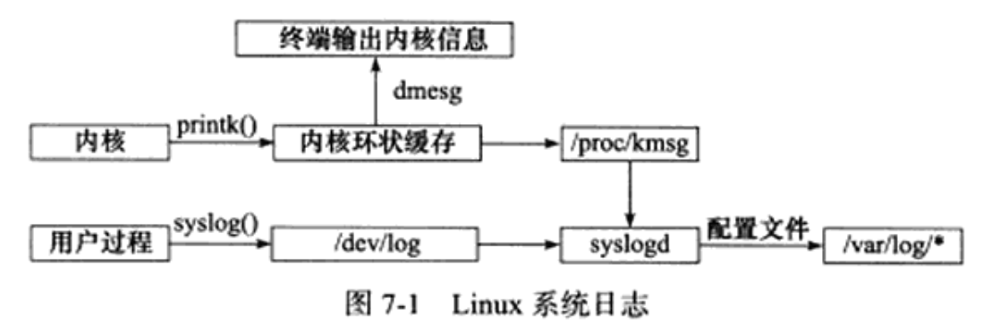
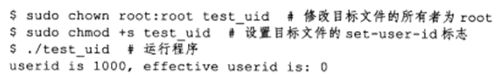
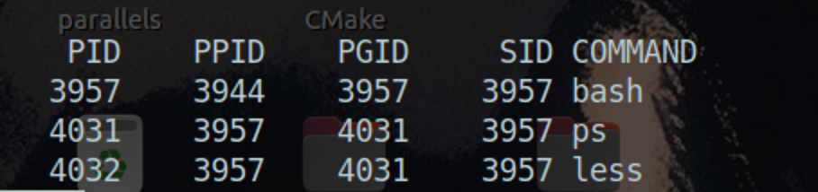
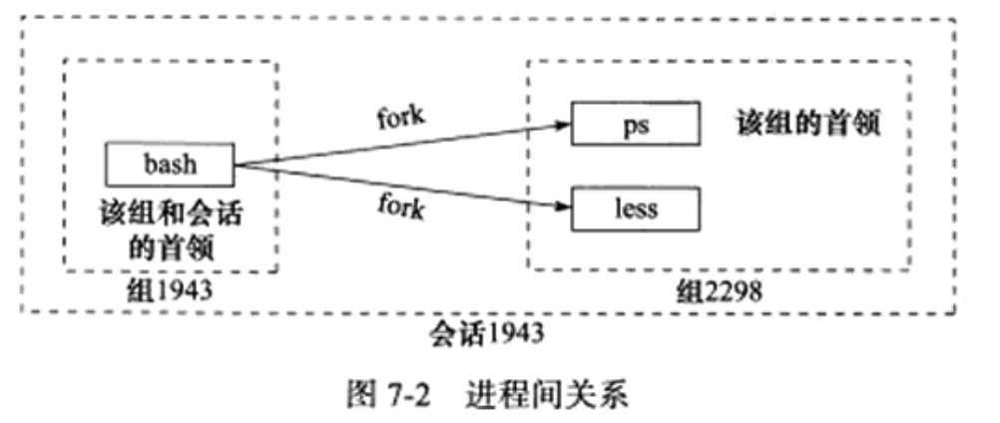

## 一.Linux服务器程序规范


### 1.日志

#### Linux系统日志

+ 服务器的调试和维护都需要一个专业的日志系统。Linux提供syslogd这个守护进程来处理系统日志。不过现在的Linux使用的是它的升级版——rsyslogd。

+ rsyslogd守护进程既能接收用户进程传输的日志，又能接收内核日志。

  + 用户进程是通过调用syslog函数生成系统日志。该函数将日志输出到一个UNIX本地域socket类型(AF_UNIX)的文件`/dec/log`中，rsyslogd则监听该文件以获取用户进程的输出。
  + 内核日志在老系统上是通过另一个守护进程rklogd来管理的，rsyslogd利用额外的模块实现了相同的功能。内核日志由printk等函数打印到内核的环状缓存(ring buffer)中。环状缓存的内容直接映射到`/proc/kmsg`文件中。rsyslogd则通过读取该文件获得内核日志。

+ rsyslogd守护进程在接收到用户进程或内核输入的日志后，会把它们输出至某些特定的日志文件。默认情况下：

  + 调试信息会保存至`/var/log/debug`文件
  + 普通信息保存至`/var/log/message`文件
  + 内核信息则保存至`/var/log/kern.log`文件

  日志信息具体如何分发，可以在rsyslogd的配置文件中设置。rsyslogd的主要配置文件是`/etc/rsyslog.conf`，其中主要可以设置的项包括：

  + 内核日志输入路径
  + 是否接收UDP日志及其监听端口(默认是514，见`/etc/services`文件)
  + 是否接收TCP日志及其监听端口
  + 日志文件的权限
  + 包含哪些子配置文件(`/etc/rsyslog.d/*.conf`)。rsyslogd的子配置文件则指定各类日志的目标存储文件。

+ 下图总结了Linux系统的日志体系：

  <div align = center></div>

#### syslog函数

> 应用程序使用syslog函数与rsyslogd守护进程通信。

函数定义：

```c
#include<syslog.h>
void syslog(int priority, const char* message, ...);
```

+ 该函数采用可变参数来结构化输出。

+ priority参数是所谓的设施值与日志级别的按位或。设施值的默认值是LOG_USER，下面的讨论也只限于这一种设施值。日志级别有如下几个：

  ```c
  #include<syslog.h>
  #define LOG_EMERG			0		//系统不可用
  #define LOG_ALERT			1		//报警，需要立即采取动作
  #define LOG_CRIT			2		//非常严重的情况
  #define LOG_ERR				3		//错误
  #define LOG_WARNING		4		//警告
  #define LOG_NOTICE		5		//通知
  #define LOG_INFO			6		//信息
  #define LOG_DEBUG			7		//调试
  ```

openlog函数可以改变syslog的默认输出方式，进一步结构化日志内容：

```c
#include<syslog.h>
void openlog(const char* ident, int logopt, int facility);
```

+ ident参数指定的字符串被添加到日志消息的日期和事件之后，通常被设置为程序的名字

+ logopt参数对后续syslog调用的行为进行配置，可以取以下值进行按位或：

  ```c
  #define LOG_PID				0x01		//在日志消息中包含程序PID
  #define LOG_CONS			0x01		//如果消息不能记录到日志文件，则打印至终端
  #define LOG_ODELAY		0x04		//延迟打开日志功能直到第一次调用syslog
  #define LOG_NDELAY		0x08		//不延迟打开日志功能
  ```

+ facility参数可以用来修改syslog函数中的默认设施值。

程序发布后通过setlogmask函数，使日志级别大于日志掩码的日志信息被系统忽略。

```c
#include<syslog.h>
int setlogmask(int maskpri);
```

+ maskpri参数指定日志掩码值。该函数始终会成功，返回调用进程先前的日志掩码值。

关闭日志功能函数：

```c
#include<syslog.h>
void closelog();
```


### 2.用户信息

#### UID ,EUID, GID 和 EGID

>  下面这组函数可以获取和设置当前进程的真实用户ID(UID)，有效用户ID(EUID)，真实组ID(GID)和有效组ID(EGID):

```c
#include <unistd.h>
#include <sys/types.h>
uid_t getuid();						//获取真实用户ID
uid_t geteuid();						//获取有效用户ID
uid_t getgid();							//获取真实组ID
uid_t getegid();						//获取有效组ID
int setuid(uid_t uid);			//设置真实用户ID
int seteuid(uid_t euid);		//设置有效用户ID
int setgid(gid_t gid);			//设置真实组ID
int setegid(gid_t egid);		//设置有效组ID
```

+ 一个进程拥有两个用户ID：UID和EUID。

  + EUID存在的目的是为了方便资源访问：它使得运行程序的用户拥有该程序的有效用户的权限。
    + 用户用su来修改自己账户信息时，其有效用户就是该程序的所有者root。根据有效用户的含义，任何运行su程序的普通用户都能访问`/etc/passwd`文件。
    + 有效用户为root的进程称为特权进程。
  + EGID的含义与EUID类似：给运行目标程序的组用户提供有效的权限。

+ 测试UID与EUID的区别：

  ```c
  #include <unistd.h>
  #include <stdio.h>
  
  int main()
  {
      uid_t uid = getuid();
      uid_t euid = geteuid();
      printf( "userid is %d, effective userid is: %d\n", uid, euid );
      return 0;
  }
  ```

  <div align = center></div>

  > 进程的UID是启动程序的用户的ID，EUID则是root账户(文件所有者)的ID。

#### 切换用户

```c
gid_t gid = getgid();
uid_t uid = getuid();
//切换到目标用户
if ( ( setgid( gp_id ) < 0 ) || ( setuid( user_id ) < 0 ) )
{
  	return false;
}

return true;
```


### 3.进程间关系

#### 进程组

Linux下每一个进程都隶属于一个进程组，因此除了PID之外，还有进程组ID(PGID)。可以使用如下函数来获取指定进程的PGID：

```c
#include <unistd.h>

pid_t getpgid(pid_t pid);
```

+ 成功返回进程pid所属进程组的PGID，失败返回-1并设置errno
+ 每个进程组都有一个首领进程，PID与PGID相同。进程组将一直存在，直到没有成员进程。

下面函数用于设置PGID:

```c
#include <unistd.h>

int setpgid(pid_t pid, pid_t pgid);
```

+ 此函数将PID的pid的进程的PGID设置为pgid。
+ 如果pid与pgid相同，则pid进程为进程组首领
+ 如果pid=0，则当前进程的PGID为pgid；如果pgid=0，则使用pid作为目标PGID。
+ 函数成功返回0，失败返回-1并设置errno

一个进程只能设置自己或者子进程的PGID。当子进程调用exec系列函数之后，不能再在父进程中对它设置PGID。

#### 会话

一些有关联的进程组将形成一个会话(session)。下面的函数用于创建一个会话：

```c
#include <unistd.h>

int setsid(void);
```

+ 该函数不能由首领进程调用，否则会产生错误
+ 非首领进程调用后会产生以下额外效果：
  + 调用进程称为会话的首领，此时该进程是新会话的唯一成员
  + 新建一个进程组，其PGID是调用进程PID，调用进程称为该组的首领
  + 调用进程将甩开终端
+ 函数调用成功返回新的进程组的PGID，失败返回-1并设置errno

#### 用PS命令查看进程关系

```bash
ps -o pid,ppid,pgid,sid,comm | less
```

<div align = center></div>

+ ps和less命令的父进程是命令。

+ 三者关系如下图所示：

  <div align = center></div>

### 4.系统资源限制

> Linux上运行的程序都会受到资源限制的影响，比如物理设备限制，系统策略限制，具体实现的限制。

Linux系统资源限制可以通过下面这一对函数来读取和设置：

```c
#include <sys/resource.h>

int getrlimit(int resource, struct rlimit *rlim);
int setrlimit(int resource, const struct rlimit *rlim);
```

+ rlim参数是rlimit结构体类型的指针，结构体如下

  ```c
  struct rlimit
  {
    	rlim_t rlim_cur;//指定资源的软限制
    	rlim_t rlim_max;//指定资源的硬限制
  }
  ```

  

### 5.改变工作目录和根目录

> 一般来说，Web服务器的逻辑根目录并非文件系统的根目录`/`，而是站点的根目录(Linux的Web服务器一般来说是`/var/www`)

获取进程当前工作目录和改变进程目录的函数是：

```c
#include <unistd.h>

char* getcwd(char *buf, size_t size);
int chdir(const char* path);
```

+ getcwd函数的buf参数指向内存用于存储进程当前工作目录的绝对路径名，大小由size参数指定。
  + 如果当前工作目录的绝对路径的长度(加上`\0`)超过了size，则返回NULL，并设置errno为ERANGE
  + 如果buf为NULL且size非0,则getcwd可能在内部使用malloc动态分配内存，并将进程的当前工作目录存储在其中。这种情况下，需要自己手动释放创建的内存。
  + 成功返回一个指向目标存储区的指针，失败返回NULL并设置errno
+ chair函数的path参数指定要切换到目标路径。成功返回0，失败返回-1并设置errno

改变进程根目录的函数为chroot：

```c
#include <unistd.h>

int chroot(const char* path);
```

+ path参数指定要切换到的目标根目录。成功返回0，失败返回-1并设置errno
+ chroot并不改变进程的当前工作目录，所以调用chroot之后，仍需要使用chdir("/")来将工作目录切换到新的根目录。

### 6.服务器程序后台化

+ 让一个进程以守护进程的方式运行的示例：

  ```c
  bool daemonize()
  {
    	//创建子进程，关闭父进程，这样可以使程序在后台运行
      pid_t pid = fork();
      if ( pid < 0 )
      {
          return false;
      }
      else if ( pid > 0 )
      {
          exit( 0 );
      }
  		//设置文件权限掩码。当进程创建新文件时，文件的权限将是mode & 0777
      umask( 0 );
    	//创建新的会话，设置本进程为进程组的首领
      pid_t sid = setsid();
      if ( sid < 0 )
      {
          return false;
      }
  		//切换工作目录
      if ( ( chdir( "/" ) ) < 0 )
      {
          /* Log the failure */
          return false;
      }
  		//关闭标准输入设备，标准输出设备和标准错误输出设备
      close( STDIN_FILENO );
      close( STDOUT_FILENO );
      close( STDERR_FILENO );
  		//关闭其他已经打开的文件描述符
    	//将标准输入，标准输出，标准错误输出都定向到/dev/null文件
      open( "/dev/null", O_RDONLY );
      open( "/dev/null", O_RDWR );
      open( "/dev/null", O_RDWR );
      return true;
  }
  ```

Linux提供了完成同样功能的库函数daemon:

```c
#include <stdlib.h>

int daemon(int nochdir, int noclose);
```

+ nochdir参数用于指定是否改变工作目录，如果传递0，则工作目录将设置为`/`，否则继续使用当前工作目录
+ noclose为0时，将标准输入，标准输出，标准错误输出都定向到/dev/null文件，否则依然使用原来的设备。
+ 函数成功返回0，失败返回-1并设置errno


