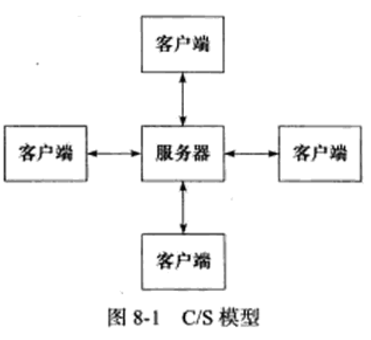
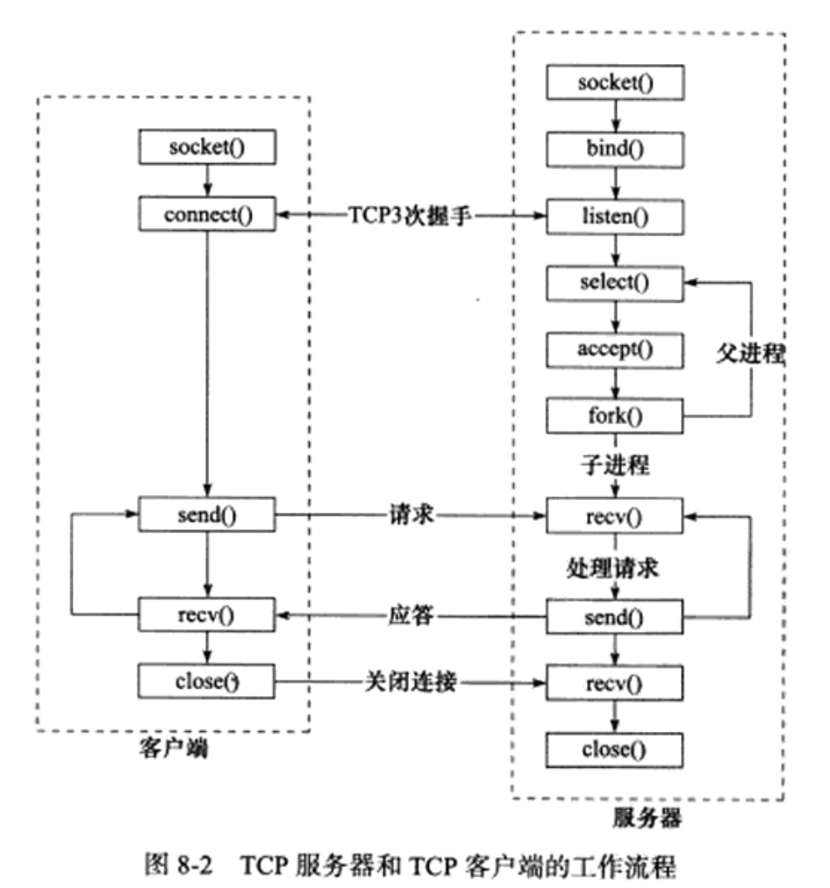
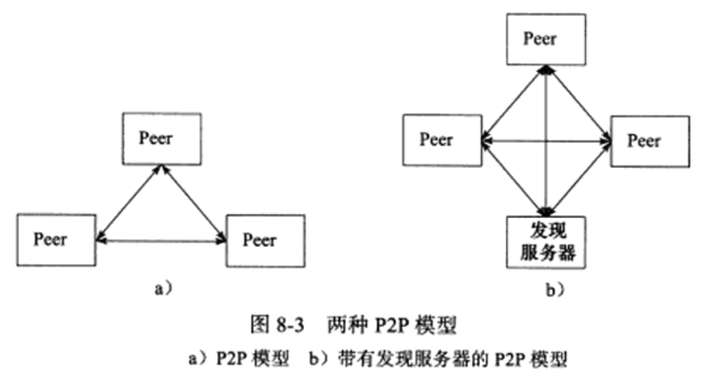
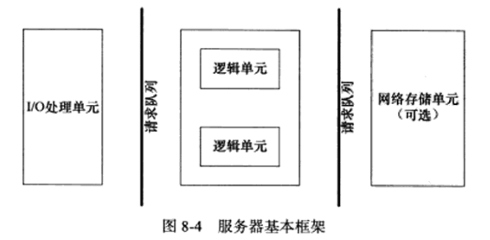
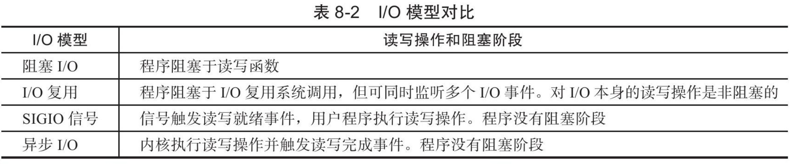
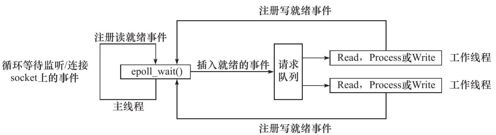
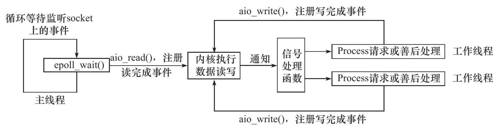
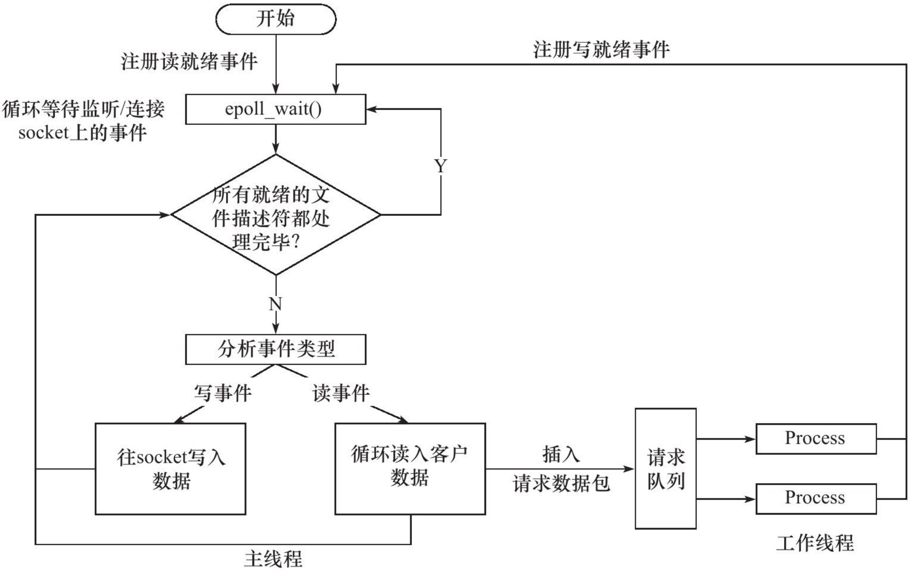
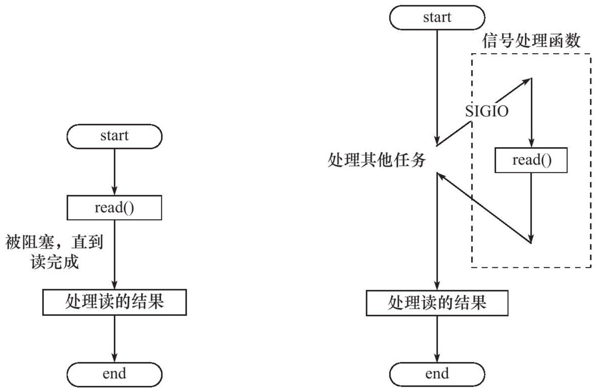
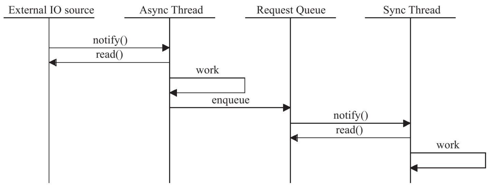

## 一.Linux服务器程序规范


### 1.日志

#### Linux系统日志

+ 服务器的调试和维护都需要一个专业的日志系统。Linux提供syslogd这个守护进程来处理系统日志。不过现在的Linux使用的是它的升级版——rsyslogd。

+ rsyslogd守护进程既能接收用户进程传输的日志，又能接收内核日志。

  + 用户进程是通过调用syslog函数生成系统日志。该函数将日志输出到一个UNIX本地域socket类型(AF_UNIX)的文件`/dec/log`中，rsyslogd则监听该文件以获取用户进程的输出。
  + 内核日志在老系统上是通过另一个守护进程rklogd来管理的，rsyslogd利用额外的模块实现了相同的功能。内核日志由printk等函数打印到内核的环状缓存(ring buffer)中。环状缓存的内容直接映射到`/proc/kmsg`文件中。rsyslogd则通过读取该文件获得内核日志。

+ rsyslogd守护进程在接收到用户进程或内核输入的日志后，会把它们输出至某些特定的日志文件。默认情况下：

  + 调试信息会保存至`/var/log/debug`文件
  + 普通信息保存至`/var/log/message`文件
  + 内核信息则保存至`/var/log/kern.log`文件

  日志信息具体如何分发，可以在rsyslogd的配置文件中设置。rsyslogd的主要配置文件是`/etc/rsyslog.conf`，其中主要可以设置的项包括：

  + 内核日志输入路径
  + 是否接收UDP日志及其监听端口(默认是514，见`/etc/services`文件)
  + 是否接收TCP日志及其监听端口
  + 日志文件的权限
  + 包含哪些子配置文件(`/etc/rsyslog.d/*.conf`)。rsyslogd的子配置文件则指定各类日志的目标存储文件。

+ 下图总结了Linux系统的日志体系：

  <div align = center></div>

#### syslog函数

> 应用程序使用syslog函数与rsyslogd守护进程通信。

函数定义：

```c
#include<syslog.h>
void syslog(int priority, const char* message, ...);
```

+ 该函数采用可变参数来结构化输出。

+ priority参数是所谓的设施值与日志级别的按位或。设施值的默认值是LOG_USER，下面的讨论也只限于这一种设施值。日志级别有如下几个：

  ```c
  #include<syslog.h>
  #define LOG_EMERG			0		//系统不可用
  #define LOG_ALERT			1		//报警，需要立即采取动作
  #define LOG_CRIT			2		//非常严重的情况
  #define LOG_ERR				3		//错误
  #define LOG_WARNING		4		//警告
  #define LOG_NOTICE		5		//通知
  #define LOG_INFO			6		//信息
  #define LOG_DEBUG			7		//调试
  ```

openlog函数可以改变syslog的默认输出方式，进一步结构化日志内容：

```c
#include<syslog.h>
void openlog(const char* ident, int logopt, int facility);
```

+ ident参数指定的字符串被添加到日志消息的日期和事件之后，通常被设置为程序的名字

+ logopt参数对后续syslog调用的行为进行配置，可以取以下值进行按位或：

  ```c
  #define LOG_PID				0x01		//在日志消息中包含程序PID
  #define LOG_CONS			0x01		//如果消息不能记录到日志文件，则打印至终端
  #define LOG_ODELAY		0x04		//延迟打开日志功能直到第一次调用syslog
  #define LOG_NDELAY		0x08		//不延迟打开日志功能
  ```

+ facility参数可以用来修改syslog函数中的默认设施值。

程序发布后通过setlogmask函数，使日志级别大于日志掩码的日志信息被系统忽略。

```c
#include<syslog.h>
int setlogmask(int maskpri);
```

+ maskpri参数指定日志掩码值。该函数始终会成功，返回调用进程先前的日志掩码值。

关闭日志功能函数：

```c
#include<syslog.h>
void closelog();
```


### 2.用户信息

#### UID ,EUID, GID 和 EGID

>  下面这组函数可以获取和设置当前进程的真实用户ID(UID)，有效用户ID(EUID)，真实组ID(GID)和有效组ID(EGID):

```c
#include <unistd.h>
#include <sys/types.h>
uid_t getuid();						//获取真实用户ID
uid_t geteuid();						//获取有效用户ID
uid_t getgid();							//获取真实组ID
uid_t getegid();						//获取有效组ID
int setuid(uid_t uid);			//设置真实用户ID
int seteuid(uid_t euid);		//设置有效用户ID
int setgid(gid_t gid);			//设置真实组ID
int setegid(gid_t egid);		//设置有效组ID
```

+ 一个进程拥有两个用户ID：UID和EUID。

  + EUID存在的目的是为了方便资源访问：它使得运行程序的用户拥有该程序的有效用户的权限。
    + 用户用su来修改自己账户信息时，其有效用户就是该程序的所有者root。根据有效用户的含义，任何运行su程序的普通用户都能访问`/etc/passwd`文件。
    + 有效用户为root的进程称为特权进程。
  + EGID的含义与EUID类似：给运行目标程序的组用户提供有效的权限。

+ 测试UID与EUID的区别：

  ```c
  #include <unistd.h>
  #include <stdio.h>
  
  int main()
  {
      uid_t uid = getuid();
      uid_t euid = geteuid();
      printf( "userid is %d, effective userid is: %d\n", uid, euid );
      return 0;
  }
  ```

  <div align = center></div>

  > 进程的UID是启动程序的用户的ID，EUID则是root账户(文件所有者)的ID。

#### 切换用户

```c
gid_t gid = getgid();
uid_t uid = getuid();
//切换到目标用户
if ( ( setgid( gp_id ) < 0 ) || ( setuid( user_id ) < 0 ) )
{
  	return false;
}

return true;
```


### 3.进程间关系

#### 进程组

Linux下每一个进程都隶属于一个进程组，因此除了PID之外，还有进程组ID(PGID)。可以使用如下函数来获取指定进程的PGID：

```c
#include <unistd.h>

pid_t getpgid(pid_t pid);
```

+ 成功返回进程pid所属进程组的PGID，失败返回-1并设置errno
+ 每个进程组都有一个首领进程，PID与PGID相同。进程组将一直存在，直到没有成员进程。

下面函数用于设置PGID:

```c
#include <unistd.h>

int setpgid(pid_t pid, pid_t pgid);
```

+ 此函数将PID的pid的进程的PGID设置为pgid。
+ 如果pid与pgid相同，则pid进程为进程组首领
+ 如果pid=0，则当前进程的PGID为pgid；如果pgid=0，则使用pid作为目标PGID。
+ 函数成功返回0，失败返回-1并设置errno

一个进程只能设置自己或者子进程的PGID。当子进程调用exec系列函数之后，不能再在父进程中对它设置PGID。

#### 会话

一些有关联的进程组将形成一个会话(session)。下面的函数用于创建一个会话：

```c
#include <unistd.h>

int setsid(void);
```

+ 该函数不能由首领进程调用，否则会产生错误
+ 非首领进程调用后会产生以下额外效果：
  + 调用进程称为会话的首领，此时该进程是新会话的唯一成员
  + 新建一个进程组，其PGID是调用进程PID，调用进程称为该组的首领
  + 调用进程将甩开终端
+ 函数调用成功返回新的进程组的PGID，失败返回-1并设置errno

#### 用PS命令查看进程关系

```bash
ps -o pid,ppid,pgid,sid,comm | less
```

<div align = center></div>

+ ps和less命令的父进程是命令。

+ 三者关系如下图所示：

  <div align = center></div>

### 4.系统资源限制

> Linux上运行的程序都会受到资源限制的影响，比如物理设备限制，系统策略限制，具体实现的限制。

Linux系统资源限制可以通过下面这一对函数来读取和设置：

```c
#include <sys/resource.h>

int getrlimit(int resource, struct rlimit *rlim);
int setrlimit(int resource, const struct rlimit *rlim);
```

+ rlim参数是rlimit结构体类型的指针，结构体如下

  ```c
  struct rlimit
  {
    	rlim_t rlim_cur;//指定资源的软限制
    	rlim_t rlim_max;//指定资源的硬限制
  }
  ```

  

### 5.改变工作目录和根目录

> 一般来说，Web服务器的逻辑根目录并非文件系统的根目录`/`，而是站点的根目录(Linux的Web服务器一般来说是`/var/www`)

获取进程当前工作目录和改变进程目录的函数是：

```c
#include <unistd.h>

char* getcwd(char *buf, size_t size);
int chdir(const char* path);
```

+ getcwd函数的buf参数指向内存用于存储进程当前工作目录的绝对路径名，大小由size参数指定。
  + 如果当前工作目录的绝对路径的长度(加上`\0`)超过了size，则返回NULL，并设置errno为ERANGE
  + 如果buf为NULL且size非0,则getcwd可能在内部使用malloc动态分配内存，并将进程的当前工作目录存储在其中。这种情况下，需要自己手动释放创建的内存。
  + 成功返回一个指向目标存储区的指针，失败返回NULL并设置errno
+ chair函数的path参数指定要切换到目标路径。成功返回0，失败返回-1并设置errno

改变进程根目录的函数为chroot：

```c
#include <unistd.h>

int chroot(const char* path);
```

+ path参数指定要切换到的目标根目录。成功返回0，失败返回-1并设置errno
+ chroot并不改变进程的当前工作目录，所以调用chroot之后，仍需要使用chdir("/")来将工作目录切换到新的根目录。

### 6.服务器程序后台化

+ 让一个进程以守护进程的方式运行的示例：

  ```c
  bool daemonize()
  {
    	//创建子进程，关闭父进程，这样可以使程序在后台运行
      pid_t pid = fork();
      if ( pid < 0 )
      {
          return false;
      }
      else if ( pid > 0 )
      {
          exit( 0 );
      }
  		//设置文件权限掩码。当进程创建新文件时，文件的权限将是mode & 0777
      umask( 0 );
    	//创建新的会话，设置本进程为进程组的首领
      pid_t sid = setsid();
      if ( sid < 0 )
      {
          return false;
      }
  		//切换工作目录
      if ( ( chdir( "/" ) ) < 0 )
      {
          /* Log the failure */
          return false;
      }
  		//关闭标准输入设备，标准输出设备和标准错误输出设备
      close( STDIN_FILENO );
      close( STDOUT_FILENO );
      close( STDERR_FILENO );
  		//关闭其他已经打开的文件描述符
    	//将标准输入，标准输出，标准错误输出都定向到/dev/null文件
      open( "/dev/null", O_RDONLY );
      open( "/dev/null", O_RDWR );
      open( "/dev/null", O_RDWR );
      return true;
  }
  ```

Linux提供了完成同样功能的库函数daemon:

```c
#include <stdlib.h>

int daemon(int nochdir, int noclose);
```

+ nochdir参数用于指定是否改变工作目录，如果传递0，则工作目录将设置为`/`，否则继续使用当前工作目录
+ noclose为0时，将标准输入，标准输出，标准错误输出都定向到/dev/null文件，否则依然使用原来的设备。
+ 函数成功返回0，失败返回-1并设置errno

---

## 二.高性能服务器程序框架

通常服务器解构为如下三个模块：

+ I/O处理单元。本章介绍I/O处理单元和四种I/O模型和两种高效事件处理模式。
+ 逻辑单元。本章介绍逻辑单元的两种高校并发模式，以及高效的逻辑处理方式——有限状态机。
+ 存储单元。

### 1.服务器模型

#### C/S模型

> TCP/IP协议再设计和实现上没有客户端和服务器的概念，在通信过程中所有机器都是对等的。

但资源都被数据提供者所垄断，所以几乎所有的网络应用程序都很自然的采用了下图中的C/S模型：所有用户都通过访问服务器来获取所需的资源。

<div align = center></div>

采用C/S模型的TCP服务器和TCP客户端的工作流程如下图所示：

<div align = center></div>

+ 客户连接的请求是随机到达的异步请求，服务器需要使用某种I/O模型来监听这一事件。I/O模型有多种。上图中服务器使用的是I/O复用技术之一的select系统调用：
  + 当监听到连接请求后，服务器就调用accept函数接受它，并分配一个逻辑单元为新的连接服务。
  + 逻辑单元可以是新创建的子进程，子进程或其他。
+ 图中，服务器给客户端分配的逻辑单元是由fork系统调用创建的子进程。逻辑单元读取客户请求，处理该请求，然后处理结果返回给客户端。客户端接收到服务器反馈的结果之后，可以继续向服务器发送请求，也可以立即主动关闭连接。如果客户端主动关闭连接，则服务器执行被动关闭连接。

> **CS模型适合资源相对集中的场景，而且实现简单。**
>
> **但缺点也明显：服务器是通信的中心，当访问量过大时，可能所有客户都将得到很慢的响应。**

#### P2P模型

P2P模型比C/S模型更符合网络通信的实际情况。使每一台机器在消耗服务的同时也给别人提供服务，这样资源能够充分，自由地共享。

但是缺点也明显：当用户之间传输的请求过多时，网络的负载将加重。

<div align = center></div>

上图a所示的P2P存在一个显著的问题，即主机之间很难相互发现，所以实际中会像b图中一样提供一个发现服务器，提供查找服务，使每个客户都能尽快地找到自己需要的资源。

### 2.服务器编程框架

虽然服务器种类很多，但基本框架都一样，不同之处在于逻辑处理。基本框架如下图所示：

<div align = center></div>

上图既能描述一台服务器，也能描述一个服务器机群。两种情况下各个部件的含义与功能如下表所示：

|     模块     |                        单个服务器程序                        |          服务器集群          |
| :----------: | :----------------------------------------------------------: | :--------------------------: |
| I/O处理单元  | 处理理客户连接，读写网络数据（数据的收发不一定在I/O处理单元中执行，也可能在逻辑单元中执行，具体取决于事件处理模式） | 作为接入服务器，实现负载均衡 |
|   逻辑单元   | (通常是一个进程或线程。分析并处理客户数据，结果传递给I/O单元或直接传递给客户端，具体如何取决于事件处理模式)业务进程或线程 |          逻辑服务器          |
| 网络存储单元 |                    本地数据库，文件或缓存                    |         数据库服务器         |
|   请求队列   |                     各单元之间的通信方式                     |  各服务器之间的永久TCP连接   |


### 3.I/O模型

> socket在创建的时候默认是阻塞的。我们可以给socket系统调用的第2个参数传递SOCK_NONBLOCK标志，或者通过fcntl系统调用的F_SETFL命令，将其设置为非阻塞的。阻塞和非阻塞的概念能应用于所有文件描述符，而不仅仅是socket。我们称阻塞的文件描述符为阻塞I/O，称非阻塞的文件描述符为非阻塞I/O。

+  **针对阻塞I/O执行的系统调用可能因为无法立即完成而被操作系统挂起，直到等待的事件发生为止。** socket的基础API中，可能被阻塞的系统调用包括accept、send、recv和connect。

+  **针对非阻塞I/O执行的系统调用则总是立即返回，而不管事件是否已经发生。如果事件没有立即发生，这些系统调用就返回-1，和出错的情况一样。** 

  > + 此时需要根据errno来区分这两种情况。
  >
  >   + 对accept、send和recv而言，事件未发生时errno通常被设置成EAGAIN（意为“再来一次”）或者EWOULDBLOCK（意为“期望阻塞”）；
  >
  >   + 对connect而言，errno则被设置成EINPROGRESS（意为“在处理中”）。

很显然， **只有在事件已经发生的情况下操作非阻塞I/O（读、写等），才能提高程序的效率。因此，非阻塞I/O通常要和其他I/O通知机制一起使用** ，比如I/O复用和SIGIO信号。

> + I/O复用是最常使用的I/O通知机制。它指的是，应用程序通过I/O复用函数向内核注册一组事件，内核通过I/O复用函数把其中就绪的事件通知给应用程序。Linux上常用的I/O复用函数是select、poll和epoll_wait。需要指出的是， **I/O复用函数本身是阻塞的，它们能提高程序效率的原因在于它们具有同时监听多个I/O事件的能力。**
> + SIGIO信号也可以用来报告I/O事件。比如为一个目标文件描述符指定宿主进程，那么被指定的宿主进程将捕获到SIGIO信号。这样，当目标文件描述符上有事件发生时，SIGIO信号的信号处理函数将被触发，我们也就可以在该信号处理函数中对目标文件描述符执行非阻塞I/O操作了。

+  **阻塞I/O、I/O复用和信号驱动I/O都是同步I/O模型。** 因为在这三种I/O模型中，I/O的读写操作，都是在I/O事件发生之后，由应用程序来完成的。对异步I/O而言，用户可以直接对I/O执行读写操作，这些操作告诉内核用户读写缓冲区的位置，以及I/O操作完成之后内核通知应用程序的方式。 **异步I/O的读写操作总是立即返回，而不论I/O是否是阻塞的，因为真正的读写操作已经由内核接管。**
+  同步I/O模型要求用户代码自行执行I/O操作（将数据从内核缓冲区读入用户缓冲区，或将数据从用户缓冲区写入内核缓冲区）。异步I/O机制则由内核来执行I/O操作（数据在内核缓冲区和用户缓冲区之间的移动是由内核在“后台”完成的）。
+ 同步I/O向应用程序通知的是I/O就绪事件，而异步I/O向应用程序通知的是I/O完成事件。

I/O模型对比：

<div align = center></div>


### 4.两种高效的事件处理模式

> 服务器程序通常需要处理三类时间：
>
> + I/O事件
> + 信号
> + 定时事件

本节介绍两种高效的事件处理模式：Reactor和Proactor。同步I/O模型通常用于实现Reactor模式，异步I/O模型则用于Proactor模式。

#### Reactor模式

Reactor模式要求主线程（I/O处理单元，下同）只负责监听文件描述上是否有事件发生，有的话就立即将该事件通知工作线程（逻辑单元，下同）。除此之外，主线程不做任何其他实质性的工作。读写数据，接受新的连接，以及处理客户请求均在工作线程中完成。

使用同步I/O模型（以epoll_wait为例）实现的Reactor模式的工作流程是：

1. 主线程往epoll内核事件表中注册socket上的读就绪事件。
2. 主线程调用epoll_wait等待socket上有数据可读。
3. 当socket上有数据可读时，epoll_wait通知主线程。主线程则将socket可读事件放入请求队列。
4. 睡眠在请求队列上的某个工作线程被唤醒，它从socket读取数据，并处理客户请求，然后往epoll内核事件表中注册该socket上的写就绪事件。
5. 主线程调用epoll_wait等待socket可写。
6. 当socket可写时，epoll_wait通知主线程。主线程将socket可写事件放入请求队列。
7. 睡眠在请求队列上的某个工作线程被唤醒，它往socket上写入服务器处理客户请求的结果。

如下图所示：

<div align = center></div>

>  工作线程从请求队列中取出事件后，将根据事件的类型来决定如何处理它。

#### Proactor模式

Proactor模式将所有I/O操作都交给主线程和内核来处理，工作线程仅仅负责业务逻辑。

使用异步I/O模型（以aio_read和aio_write为例）实现的Proactor模式的工作流程是：

1. 主线程调用aio_read函数向内核注册socket上的读完成事件，并告诉内核用户读缓冲区的位置，以及读操作完成时如何通知应用程序（这里以信号为例，详情请参考sigevent的man手册）。
2. 主线程继续处理其他逻辑。
3. 当socket上的数据被读入用户缓冲区后，内核将向应用程序发送一个信号，以通知应用程序数据已经可用。
4. 应用程序预先定义好的信号处理函数选择一个工作线程来处理客户请求。工作线程处理完客户请求之后，调用aio_write函数向内核注册socket上的写完成事件，并告诉内核用户写缓冲区的位置，以及写操作完成时如何通知应用程序（仍然以信号为例）。
5. 主线程继续处理其他逻辑。
6. 当用户缓冲区的数据被写入socket之后，内核将向应用程序发送一个信号，以通知应用程序数据已经发送完毕。
7. 应用程序预先定义好的信号处理函数选择一个工作线程来做善后处理，比如决定是否关闭socket。

如下图所示：

<div align = center></div>

> 连接socket上的读写事件是通过aio_read/aio_write向内核注册的，因此内核将通过信号来向应用程序报告连接socket上的读写事件。所以， **主线程中的epoll_wait调用仅能用来检测监听socket上的连接请求事件，而不能用来检测连接socket上的读写事件。**

#### 模拟Proactor模式

提出使用同步I/O方式模拟出Proactor模式的一种方法。其原理是：主线程执行数据读写操作，读写完成之后，主线程向工作线程通知这一“完成事件”。那么从工作线程的角度来看，它们就直接获得了数据读写的结果，接下来要做的只是对读写的结果进行逻辑处理。

使用同步I/O模型（仍然以epoll_wait为例）模拟出的Proactor模式的工作流程如下：

1. 主线程往epoll内核事件表中注册socket上的读就绪事件。 
2. 主线程调用epoll_wait等待socket上有数据可读。
3. 当socket上有数据可读时，epoll_wait通知主线程。主线程从socket循环读取数据，直到没有更多数据可读，然后将读取到的数据封装成一个请求对象并插入请求队列。
4. 睡眠在请求队列上的某个工作线程被唤醒，它获得请求对象并处理客户请求，然后往epoll内核事件表中注册socket上的写就绪事件。
5. 主线程调用epoll_wait等待socket可写。
6. 当socket可写时，epoll_wait通知主线程。主线程往socket上写入服务器处理客户请求的结果。

如下图所示：

<div align = center></div>

### 两种高效的并发模式

> 并发模式是指I/O处理单元和多个逻辑单元之间协调完成任务的方法。服务器主要有两种并发编程模式：半同步/半异步（half-sync/half-async）模式和领导者/追随者（Leader/Followers）模式。

半同步/半异步模式中的“同步”和“异步”与前面讨论的I/O模型中的“同步”和“异步”是完全不同的概念。

+ 在I/O模型中，“同步”和“异步”区分的是内核向应用程序通知的是何种I/O事件（是就绪事件还是完成事件），以及该由谁来完成I/O读写（是应用程序还是内核）。
+ 在并发模式中，“同步”指的是程序完全按照代码序列的顺序执行；“异步”指的是程序的执行需要由系统事件来驱动。常见的系统事件包括中断、信号等。比如，图a描述了同步的读操作，而图b则描述了异步的读操作。

<div align = center></div>

异步线程的执行效率高，实时性强，但执行的程序相对复杂，难于调试和扩展，不适合于大量的并发。而同步线程则相反，它虽然效率相对较低，实时性较差，但逻辑简单。因此，对于像服务器这种既要求较好的实时性，又要求能同时处理多个客户请求的应用程序，应同采用半同步/半异步模式来实现。

半同步/半异步模式中：

+ 同步线程用于处理客户逻辑，相当于逻辑单元；
+ 异步线程用于处理I/O事件，相当于I/O处理单元。

异步线程监听到客户请求后，就将其封装成请求对象并插入请求队列中。请求队列将通知某个工作在同步模式的工作线程来读取并处理该请求对象。具体选择哪个工作线程来为新的客户请求服务，则取决于请求队列的设计。下图总结了半同步/半异步模式的工作流程。

<div align = center></div>

