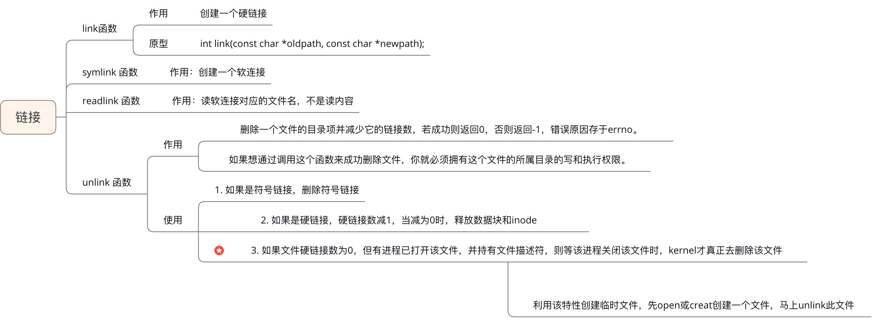
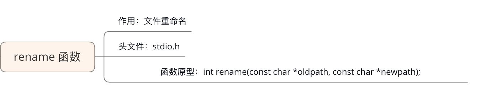

# 一.Linux系统编程

## (一).IO操作函数

### 1.C库函数


> 标准C库中提供了对应的IO缓冲区，缓冲区的速度比硬盘更快，操作文件效率更高
>
> Linux 系统函数没有IO缓存区，需要自己提供

+ **C库函数与系统函数的关系：**


### 2.虚拟机地址空间


> 32位分配4G(2^32)
>
> + 栈空间从上往下分配，堆空间从下往上分配
> + C标准库和Linux系统IO函数为动态库，生成与位置无关的代码，地址为相对地址

+ **文件描述符：**


**cpu 为什么要使用虚拟地址空间与物理地址空间映射？解决了什么样的问题？**

+ 方便编译器和操作系统安排程序的地址分布。
  + 程序可以使用一系列相邻的虚拟地址来访问物理内存中不相邻的大内存缓冲区。
+ 方便进程之间隔离
  + 不同进程使用的虚拟地址彼此隔离。一个进程中的代码无法更改正在由另一进程使用的物理内存。
+ 3.方便OS使用你那可怜的内存。
  + 程序可以使用一系列虚拟地址来访问大于可用物理内存的内存缓冲区。当物理内存的供应量变小时，		
  + 内存管理器会将物理内存页（通常大小为 4 KB）保存到磁盘文件。数据或代码页会根据需要在物理内存与磁盘之间移动。

### 3.open函数

#### open函数基础

+ **查找系统open函数：**

  ```bash
  man 2 open
  ```


#### close函数


#### open函数中的errno


#### 查阅文档

+ 写函数是跳到对应的文档

  ```bash
  # 精确的跳到对应的文档：把光标放到函数身上，按以下快捷键
  2 + shift + k
  ```

### 4.read与write函数


#### 5.lseek函数


---

## (二).文件操作函数

### 1.stat函数


+ 其中st_mode介绍

  

  

+ 使用stat查阅文件大小

  ```c
  #include <stdio.h>
  #include <stdlib.h>
  #include <sys/types.h>
  #include <sys/stat.h>
  #include <unistd.h>
  int main(int argc, char* argv[])
  {
      if(argc < 2)
      {
          printf("a.out filename\n");
          exit(1);
      }
  
      struct stat st;
      int ret = lstat(argv[1], &st);
  
      if(ret == -1)
      {
          perror("stat");
          exit(1);
      }
      printf("file size = %d\n", (int)st.st_size);
      return 0;
  }
  ```

  

+ 使用stat写出`ls -al`功能

  ```c
  #include <stdio.h>
  #include <string.h>
  #include <sys/types.h>
  #include <sys/stat.h>
  #include <stdlib.h>
  #include <time.h>
  #include <pwd.h>
  #include <grp.h>
  int main(int argc, char* argv[])
  {
      if(argc < 2)
      {
          printf("./a.out filename\n");
          exit(1);
      }
  
      struct stat st;
      int ret = stat(argv[1], &st);
      if(ret == -1)
      {
          perror("stat");
          exit(1);
      }
  
      // 存储文件类型和访问权限
      char perms[11] = {0};
      // 判断文件类型
      switch(st.st_mode & S_IFMT)
      {
          case S_IFLNK:
              perms[0] = 'l';
              break;
          case S_IFDIR:
              perms[0] = 'd';
              break;
          case S_IFREG:
              perms[0] = '-';
              break;
          case S_IFBLK:
              perms[0] = 'b';
              break;
          case S_IFCHR:
              perms[0] = 'c';
              break;
          case S_IFSOCK:
              perms[0] = 's';
              break;
          case S_IFIFO:
              perms[0] = 'p';
              break;
          default:
              perms[0] = '?';
              break;
      }
      // 判断文件的访问权限
      // 文件所有者
      perms[1] = (st.st_mode & S_IRUSR) ? 'r' : '-';
      perms[2] = (st.st_mode & S_IWUSR) ? 'w' : '-';
      perms[3] = (st.st_mode & S_IXUSR) ? 'x' : '-';
      // 文件所属组
      perms[4] = (st.st_mode & S_IRGRP) ? 'r' : '-';
      perms[5] = (st.st_mode & S_IWGRP) ? 'w' : '-';
      perms[6] = (st.st_mode & S_IXGRP) ? 'x' : '-';
      // 其他人
      perms[7] = (st.st_mode & S_IROTH) ? 'r' : '-';
      perms[8] = (st.st_mode & S_IWOTH) ? 'w' : '-';
      perms[9] = (st.st_mode & S_IXOTH) ? 'x' : '-';
  
      // 硬链接计数
      int linkNum = st.st_nlink;
      // 文件所有者
      char* fileUser = getpwuid(st.st_uid)->pw_name;
      // 文件所属组
      char* fileGrp = getgrgid(st.st_gid)->gr_name;
      // 文件大小
      int fileSize = (int)st.st_size;
      // 修改时间
      char* time = ctime(&st.st_mtime);
      char mtime[512] = {0};
      strncpy(mtime, time, strlen(time)-1);
  
      char buf[1024];
      sprintf(buf, "%s  %d  %s  %s  %d  %s  %s", perms, linkNum, fileUser, fileGrp, fileSize, mtime, argv[1]);
      
      printf("%s\n", buf);
      return 0;
  }
  ```


### 2.lstat函数


> lstat 对于软连接不穿透，不追踪，只是显示软连接的信息。
>
> stat穿透，显示软连接所链接的文件的信息。

### 3.access函数


```c
#include <stdio.h>
#include <stdlib.h>
#include <unistd.h>


int main(int argc, char* argv[])
{
    if(argc < 2)
    {
        printf("a.out filename\n");
        exit(1);
    }

    int ret = access(argv[1], W_OK);
    if(ret == -1)
    {
        perror("access");
        exit(1);
    }
    printf("you can write this file.\n");
    return 0;
}
```


### 4.chmod函数


```c
#include <stdio.h>
#include <stdlib.h>
#include <sys/stat.h>

int main(int argc, char* argv[])
{
    if(argc < 2)
    {
        printf("a.out filename\n");
        exit(1);
    }

    int ret = chmod(argv[1], 0755);
    if(ret == -1)
    {
        perror("chmod");
        exit(1);
    }
    return 0;
```

### 5.chown 函数


```c
#include <stdio.h>
#include <stdlib.h>


int main(int argc, char* argv[])
{
    if(argc < 2)
    {
        printf("a.out filename!\n");
        exit(1);
    }

    // user->ftp  group->ftp
    int ret = chown(argv[1], 116, 125);
    if(ret == -1)
    {
        perror("chown");
        exit(1);
    }
    return 0;
}
```

### 6.truncate函数


```c
#include <stdio.h>
#include <stdlib.h>
#include <unistd.h>
#include <sys/types.h>

int main(int argc, char* argv[])
{
    if(argc < 3)
    {
        printf("a.out filename 111\n");
        exit(1);
    }

    long int len = strtol(argv[2], NULL, 10); 
    int  aa = truncate(argv[1], len);
    if(aa == -1)
    {
        perror("truncate");
        exit(1);
    }
    return 0;
}
```

### 7.链接函数



```c
//link
#include <stdio.h>
#include <stdlib.h>
#include <unistd.h>

int main(int argc, char* argv[])
{
    if(argc < 3)
    {
        printf("a.out oldpath newpath\n");
        exit(0);
    }

    int ret = link(argv[1], argv[2]);
    if(ret == -1)
    {
        perror("link");
        exit(1);
    }
    return 0;
}
```

```c
//symlink
#include <unistd.h>
#include <stdio.h>
#include <stdlib.h>

int main(int argc, char* argv[])
{
    if(argc < 3)
    {
        printf("a.out oldpath newpath\n");
        exit(1);
    }

    int ret = symlink(argv[1], argv[2]);
    if(ret == -1)
    {
        perror("symlink");
        exit(1);
    }

    return 0;
}
```

```c
//readlink
#include <stdio.h>
#include <stdlib.h>
#include <unistd.h>

int main(int argc, char* argv[])
{
    if(argc < 2)
    {
        printf("a.out softlink\n");
        exit(1);
    }

    char buf[512];
    int ret = readlink(argv[1], buf, sizeof(buf));
    if(ret == -1)
    {
        perror("readlink");
        exit(1);
    }
    buf[ret] = 0;
    printf("buf = %s\n", buf);

    return 0;
```

```c
//unlick
//创建临时文件来进行读写
#include <stdio.h>
#include <stdlib.h>
#include <sys/types.h>
#include <sys/stat.h>
#include <fcntl.h>
#include <unistd.h>

int main(void)
{
    int fd = open("tempfile", O_CREAT | O_RDWR, 0755);
    if(fd == -1)
    {
        perror("open");
        exit(1);
    }

    int ret = unlink("tempfile");
    if(ret == -1)
    {
        perror("unlink");
        exit(1);
    }

    char buf[512];
    write(fd, "hello", 5);
    lseek(fd, 0, SEEK_SET);
    int len = read(fd, buf, sizeof(buf));
    write(STDOUT_FILENO, buf, len);

    close(fd);

    return 0;
}
```

### 8.rename函数



```c
#include <stdio.h>
#include <stdlib.h>

int main(int argc, char* argv[])
{
    if(argc < 3)
    {
        printf("a.out oldName newName\n");
        exit(1);
    }

    int ret = rename(argv[1], argv[2]);
    if(ret == -1)
    {
        perror("rename");
        exit(1);
    }
    return 0;
}
```


## (三).目录操作函数

### 1.chdir和getcwd函数


```c
#include <stdio.h>
#include <fcntl.h>
#include <sys/types.h>
#include <sys/stat.h>
#include <stdlib.h>
#include <unistd.h>

int main(int argc, char* argv[])
{
    if(argc < 2)
    {
        printf("a.out dir\n");
        exit(1);
    }

    int ret = chdir(argv[1]);
    if(ret == -1)
    {
        perror("chdir");
        exit(1);
    }

    int fd = open("chdir.txt", O_CREAT | O_RDWR, 0777);
    if(fd == -1)
    {
        perror("open");
        exit(1);
    }
    close(fd);

    char buf[128];
    getcwd(buf, sizeof(buf));
    printf("current dir: %s\n", buf);

    return 0;
}
```

### 2.mkdir和rmdir函数


```c
#include <stdio.h>
#include <stdlib.h>
#include <sys/types.h>
#include <sys/stat.h>

int main(int argc, char* argv[])
{
    if(argc < 3)
    {
        printf("a.out newDir mode\n");
        exit(1);
    }

    int mode = strtol(argv[2], NULL, 8);
    int ret = mkdir(argv[1], mode);
    if(ret == -1)
    {
        perror("mkdir");
        exit(1);
    }
    return 0;
}
```

### 3.opendir函数


```c++
#include <stdio.h>
#include <unistd.h>
#include <stdlib.h>
#include <dirent.h>

int main(int argc, char* argv[])
{
    if(argc < 2)
    {
        printf("a.out path\n");
        exit(1);
    }

    DIR* dir = opendir(argv[1]);
    if(dir == NULL)
    {
        perror("opendir");
        exit(1);
    }
    char buf[512];
    getcwd(buf, sizeof(buf));
    printf("current dir: %s\n", buf);

    return 0;
}
```

### 4.readdir与closedir函数


```c
//获取文件的个数
#include <stdio.h>
#include <string.h>
#include <stdlib.h>
#include <dirent.h>

int get_file_count(char* root)
{
  	//打开目录
    DIR* dir;
    dir = opendir(root);
    if(dir == NULL)
    {
        perror("opendir");
        exit(1);
    }

  	//遍历当前目录
  	struct dirent* ptr = NULL;
  	int total = 0;
    char path[1024];
    while((ptr = readdir(dir)) != NULL)
    {
      	//过滤 . 与 ..
        if(strcmp(ptr->d_name, ".") == 0 || strcmp(ptr->d_name, "..") == 0)
        {
            continue;
        }
        if(ptr->d_type == DT_DIR)
        {
          	//递归读目录
            sprintf(path, "%s/%s", root, ptr->d_name);
            total += get_file_count(path);
        }
        if(ptr->d_type == DT_REG)
        {
            total ++;
        }
    }
    closedir(dir);

    return total;
}

int main(int argc, char* argv[])
{
    if(argc < 2)
    {
        printf("a.out path\n");
        exit(1);
    }
    int total = get_file_count(argv[1]);
    printf("%s has %d files!\n", argv[1], total);
    return 0;
}
```

### 5.fcntl函数


```c
#include <stdio.h>
#include <stdlib.h>
#include <fcntl.h>
#include <unistd.h>
#include <string.h>
int main(void)
{
    int fd;
    int flag;
    // 测试字符串
    char *p = "我们是一个有中国特色的社会主义国家！！！！！！";
    char *q = "呵呵, 社会主义好哇。。。。。。";
    // 只写的方式打开文件
    fd = open("test.txt", O_WRONLY);
    if(fd == -1)
    {
        perror("open");
        exit(1);
    }
    // 输入新的内容，该部分会覆盖原来旧的内容
    if(write(fd, p, strlen(p)) == -1)
    {
        perror("write");
        exit(1);
    }
    // 使用 F_GETFL 命令得到文件状态标志
    flag = fcntl(fd, F_GETFL, 0);
    if(flag == -1)
    {
        perror("fcntl");
        exit(1);
    }
    // 将文件状态标志添加 ”追加写“ 选项
    flag |= O_APPEND;
    // 将文件状态修改为追加写
    if(fcntl(fd, F_SETFL, flag) == -1)
    {
        perror("fcntl -- append write");
        exit(1);
    }
    // 再次输入新内容，该内容会追加到旧内容的后面
    if(write(fd, q, strlen(q)) == -1)
    {
        perror("write again");
        exit(1);
    }
    // 关闭文件
    close(fd);
    return 0;
}
```


---

### 1.Linux 快捷键

<div align="center">
    
</div>

