# Linux系统编程

## (一).IO操作函数

### 1.C库函数


> 标准C库中提供了对应的IO缓冲区，缓冲区的速度比硬盘更快，操作文件效率更高
>
> Linux 系统函数没有IO缓存区，需要自己提供

+ **C库函数与系统函数的关系：**


### 2.虚拟机地址空间


> 32位分配4G(2^32)
>
> + 栈空间从上往下分配，堆空间从下往上分配
> + C标准库和Linux系统IO函数为动态库，生成与位置无关的代码，地址为相对地址

+ **文件描述符：**


**cpu 为什么要使用虚拟地址空间与物理地址空间映射？解决了什么样的问题？**

+ 方便编译器和操作系统安排程序的地址分布。
  + 程序可以使用一系列相邻的虚拟地址来访问物理内存中不相邻的大内存缓冲区。
+ 方便进程之间隔离
  + 不同进程使用的虚拟地址彼此隔离。一个进程中的代码无法更改正在由另一进程使用的物理内存。
+ 3.方便OS使用你那可怜的内存。
  + 程序可以使用一系列虚拟地址来访问大于可用物理内存的内存缓冲区。当物理内存的供应量变小时，		
  + 内存管理器会将物理内存页（通常大小为 4 KB）保存到磁盘文件。数据或代码页会根据需要在物理内存与磁盘之间移动。

### 3.open函数

#### open函数基础

+ **查找系统open函数：**

  ```bash
  man 2 open
  ```


#### close函数

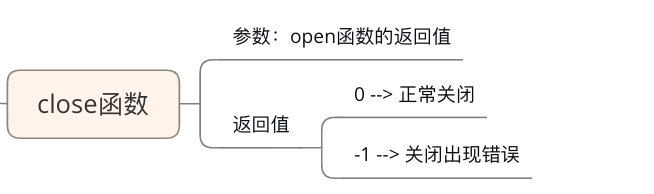

#### open函数中的errno

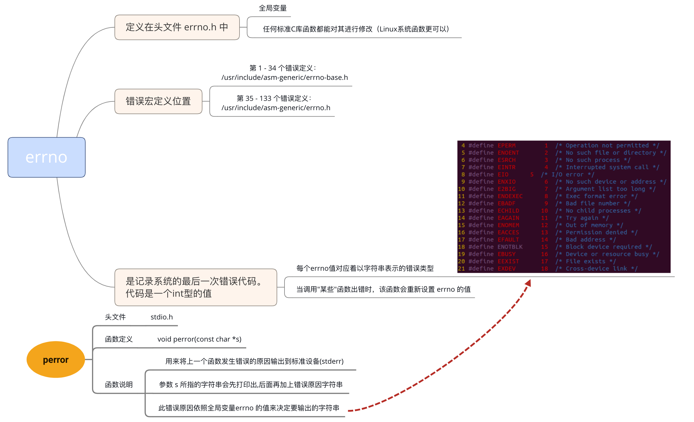

#### 查阅文档

+ 写函数是跳到对应的文档

  ```bash
  # 精确的跳到对应的文档：把光标放到函数身上，按以下快捷键
  2 + shift + k
  ```

### 4.read与write函数

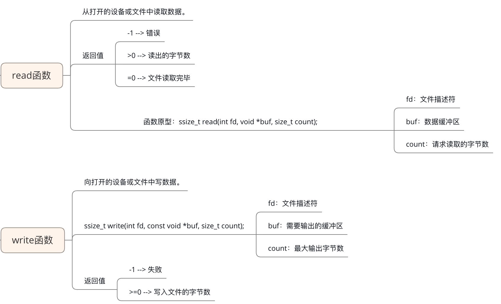

#### 5.lseek函数

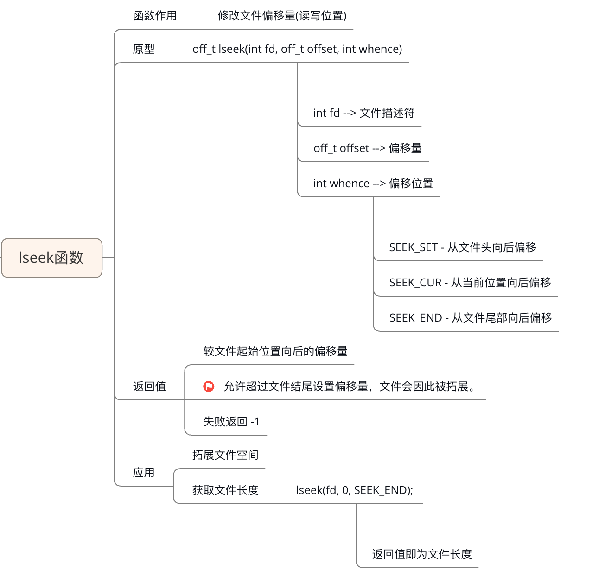


---

## (二).文件操作函数

### 1.stat函数

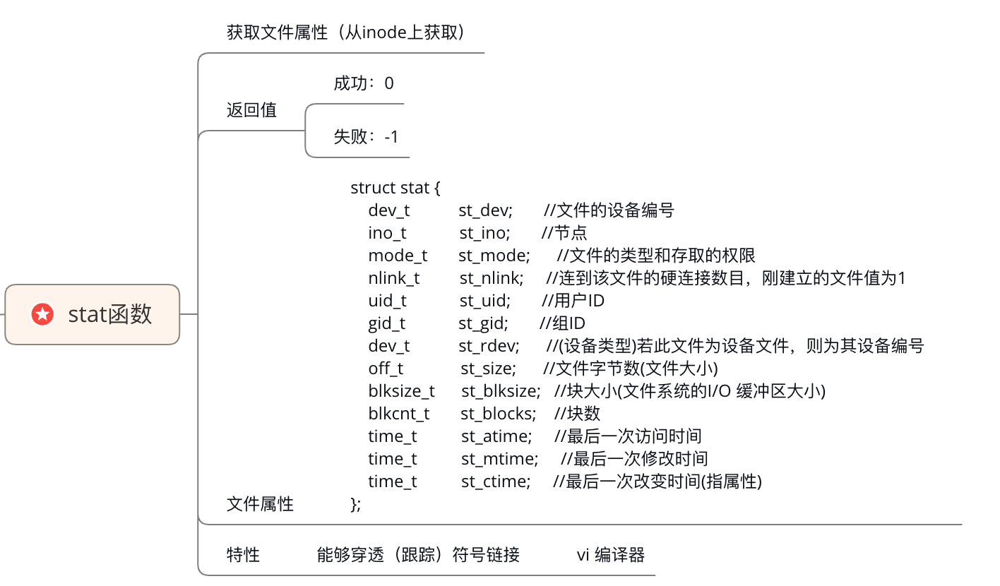

+ 其中st_mode介绍

  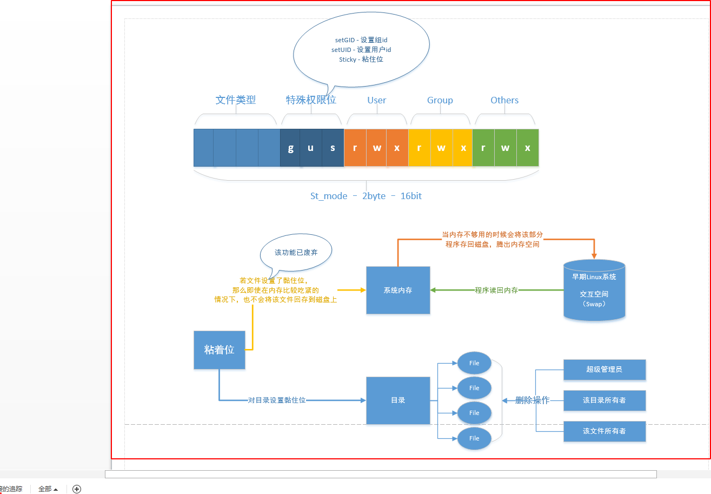

  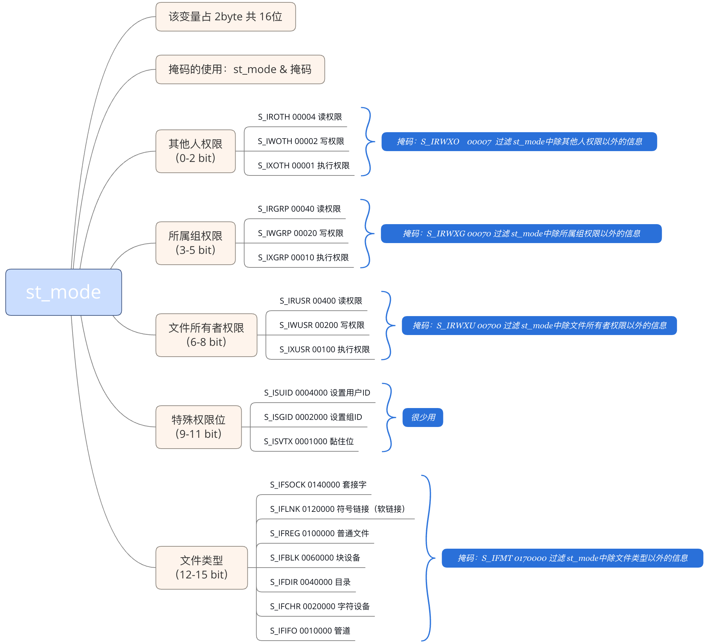

+ 使用stat查阅文件大小

  ```c
  #include <stdio.h>
  #include <stdlib.h>
  #include <sys/types.h>
  #include <sys/stat.h>
  #include <unistd.h>
  int main(int argc, char* argv[])
  {
      if(argc < 2)
      {
          printf("a.out filename\n");
          exit(1);
      }
  
      struct stat st;
      int ret = lstat(argv[1], &st);
  
      if(ret == -1)
      {
          perror("stat");
          exit(1);
      }
      printf("file size = %d\n", (int)st.st_size);
      return 0;
  }
  ```

  

+ 使用stat写出`ls -al`功能

  ```c
  #include <stdio.h>
  #include <string.h>
  #include <sys/types.h>
  #include <sys/stat.h>
  #include <stdlib.h>
  #include <time.h>
  #include <pwd.h>
  #include <grp.h>
  int main(int argc, char* argv[])
  {
      if(argc < 2)
      {
          printf("./a.out filename\n");
          exit(1);
      }
  
      struct stat st;
      int ret = stat(argv[1], &st);
      if(ret == -1)
      {
          perror("stat");
          exit(1);
      }
  
      // 存储文件类型和访问权限
      char perms[11] = {0};
      // 判断文件类型
      switch(st.st_mode & S_IFMT)
      {
          case S_IFLNK:
              perms[0] = 'l';
              break;
          case S_IFDIR:
              perms[0] = 'd';
              break;
          case S_IFREG:
              perms[0] = '-';
              break;
          case S_IFBLK:
              perms[0] = 'b';
              break;
          case S_IFCHR:
              perms[0] = 'c';
              break;
          case S_IFSOCK:
              perms[0] = 's';
              break;
          case S_IFIFO:
              perms[0] = 'p';
              break;
          default:
              perms[0] = '?';
              break;
      }
      // 判断文件的访问权限
      // 文件所有者
      perms[1] = (st.st_mode & S_IRUSR) ? 'r' : '-';
      perms[2] = (st.st_mode & S_IWUSR) ? 'w' : '-';
      perms[3] = (st.st_mode & S_IXUSR) ? 'x' : '-';
      // 文件所属组
      perms[4] = (st.st_mode & S_IRGRP) ? 'r' : '-';
      perms[5] = (st.st_mode & S_IWGRP) ? 'w' : '-';
      perms[6] = (st.st_mode & S_IXGRP) ? 'x' : '-';
      // 其他人
      perms[7] = (st.st_mode & S_IROTH) ? 'r' : '-';
      perms[8] = (st.st_mode & S_IWOTH) ? 'w' : '-';
      perms[9] = (st.st_mode & S_IXOTH) ? 'x' : '-';
  
      // 硬链接计数
      int linkNum = st.st_nlink;
      // 文件所有者
      char* fileUser = getpwuid(st.st_uid)->pw_name;
      // 文件所属组
      char* fileGrp = getgrgid(st.st_gid)->gr_name;
      // 文件大小
      int fileSize = (int)st.st_size;
      // 修改时间
      char* time = ctime(&st.st_mtime);
      char mtime[512] = {0};
      strncpy(mtime, time, strlen(time)-1);
  
      char buf[1024];
      sprintf(buf, "%s  %d  %s  %s  %d  %s  %s", perms, linkNum, fileUser, fileGrp, fileSize, mtime, argv[1]);
      
      printf("%s\n", buf);
      return 0;
  }
  ```


### 2.lstat函数

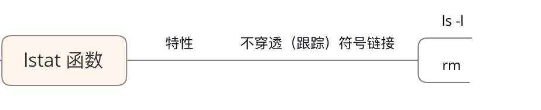

> lstat 对于软连接不穿透，不追踪，只是显示软连接的信息。
>
> stat穿透，显示软连接所链接的文件的信息。

### 3.access函数

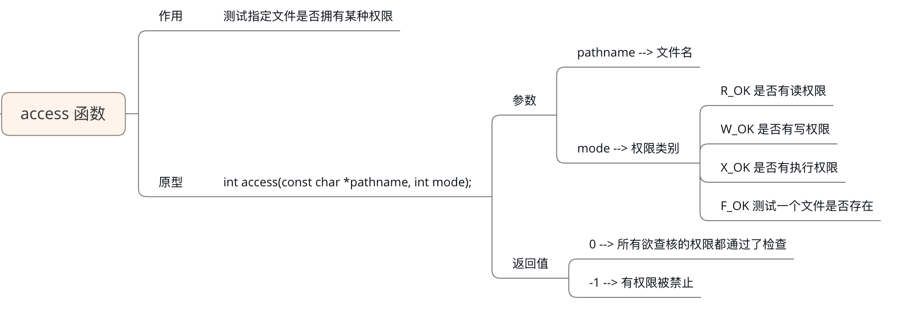

```c
#include <stdio.h>
#include <stdlib.h>
#include <unistd.h>


int main(int argc, char* argv[])
{
    if(argc < 2)
    {
        printf("a.out filename\n");
        exit(1);
    }

    int ret = access(argv[1], W_OK);
    if(ret == -1)
    {
        perror("access");
        exit(1);
    }
    printf("you can write this file.\n");
    return 0;
}
```


### 4.chmod函数

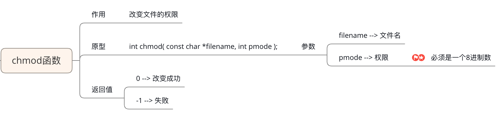

```c
#include <stdio.h>
#include <stdlib.h>
#include <sys/stat.h>

int main(int argc, char* argv[])
{
    if(argc < 2)
    {
        printf("a.out filename\n");
        exit(1);
    }

    int ret = chmod(argv[1], 0755);
    if(ret == -1)
    {
        perror("chmod");
        exit(1);
    }
    return 0;
```

### 5.chown 函数

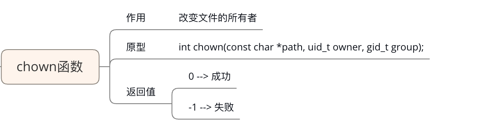

```c
#include <stdio.h>
#include <stdlib.h>


int main(int argc, char* argv[])
{
    if(argc < 2)
    {
        printf("a.out filename!\n");
        exit(1);
    }

    // user->ftp  group->ftp
    int ret = chown(argv[1], 116, 125);
    if(ret == -1)
    {
        perror("chown");
        exit(1);
    }
    return 0;
}
```

### 6.truncate函数


```c
#include <stdio.h>
#include <stdlib.h>
#include <unistd.h>
#include <sys/types.h>

int main(int argc, char* argv[])
{
    if(argc < 3)
    {
        printf("a.out filename 111\n");
        exit(1);
    }

    long int len = strtol(argv[2], NULL, 10); 
    int  aa = truncate(argv[1], len);
    if(aa == -1)
    {
        perror("truncate");
        exit(1);
    }
    return 0;
}
```

### 7.链接函数


```c
//link
#include <stdio.h>
#include <stdlib.h>
#include <unistd.h>

int main(int argc, char* argv[])
{
    if(argc < 3)
    {
        printf("a.out oldpath newpath\n");
        exit(0);
    }

    int ret = link(argv[1], argv[2]);
    if(ret == -1)
    {
        perror("link");
        exit(1);
    }
    return 0;
}
```

```c
//symlink
#include <unistd.h>
#include <stdio.h>
#include <stdlib.h>

int main(int argc, char* argv[])
{
    if(argc < 3)
    {
        printf("a.out oldpath newpath\n");
        exit(1);
    }

    int ret = symlink(argv[1], argv[2]);
    if(ret == -1)
    {
        perror("symlink");
        exit(1);
    }

    return 0;
}
```

```c
//readlink
#include <stdio.h>
#include <stdlib.h>
#include <unistd.h>

int main(int argc, char* argv[])
{
    if(argc < 2)
    {
        printf("a.out softlink\n");
        exit(1);
    }

    char buf[512];
    int ret = readlink(argv[1], buf, sizeof(buf));
    if(ret == -1)
    {
        perror("readlink");
        exit(1);
    }
    buf[ret] = 0;
    printf("buf = %s\n", buf);

    return 0;
```

```c
//unlick
//创建临时文件来进行读写
#include <stdio.h>
#include <stdlib.h>
#include <sys/types.h>
#include <sys/stat.h>
#include <fcntl.h>
#include <unistd.h>

int main(void)
{
    int fd = open("tempfile", O_CREAT | O_RDWR, 0755);
    if(fd == -1)
    {
        perror("open");
        exit(1);
    }

    int ret = unlink("tempfile");
    if(ret == -1)
    {
        perror("unlink");
        exit(1);
    }

    char buf[512];
    write(fd, "hello", 5);
    lseek(fd, 0, SEEK_SET);
    int len = read(fd, buf, sizeof(buf));
    write(STDOUT_FILENO, buf, len);

    close(fd);

    return 0;
}
```

### 8.rename函数


```c
#include <stdio.h>
#include <stdlib.h>

int main(int argc, char* argv[])
{
    if(argc < 3)
    {
        printf("a.out oldName newName\n");
        exit(1);
    }

    int ret = rename(argv[1], argv[2]);
    if(ret == -1)
    {
        perror("rename");
        exit(1);
    }
    return 0;
}
```


## (三).目录操作函数

### 1.chdir和getcwd函数

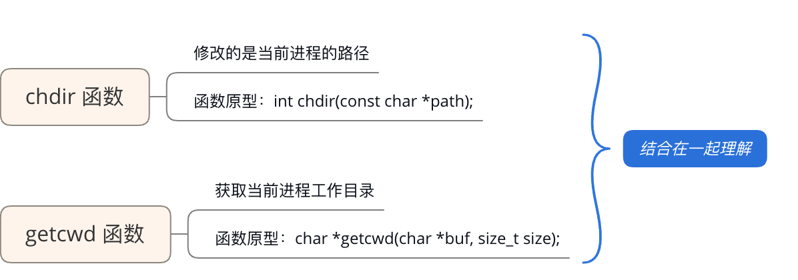

```c
#include <stdio.h>
#include <fcntl.h>
#include <sys/types.h>
#include <sys/stat.h>
#include <stdlib.h>
#include <unistd.h>

int main(int argc, char* argv[])
{
    if(argc < 2)
    {
        printf("a.out dir\n");
        exit(1);
    }

    int ret = chdir(argv[1]);
    if(ret == -1)
    {
        perror("chdir");
        exit(1);
    }

    int fd = open("chdir.txt", O_CREAT | O_RDWR, 0777);
    if(fd == -1)
    {
        perror("open");
        exit(1);
    }
    close(fd);

    char buf[128];
    getcwd(buf, sizeof(buf));
    printf("current dir: %s\n", buf);

    return 0;
}
```

### 2.mkdir和rmdir函数

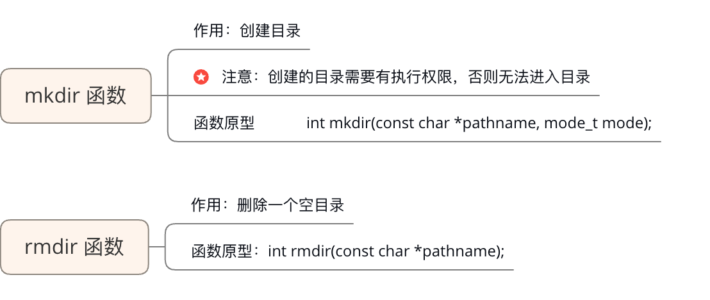

```c
#include <stdio.h>
#include <stdlib.h>
#include <sys/types.h>
#include <sys/stat.h>

int main(int argc, char* argv[])
{
    if(argc < 3)
    {
        printf("a.out newDir mode\n");
        exit(1);
    }

    int mode = strtol(argv[2], NULL, 8);
    int ret = mkdir(argv[1], mode);
    if(ret == -1)
    {
        perror("mkdir");
        exit(1);
    }
    return 0;
}
```

### 3.opendir函数

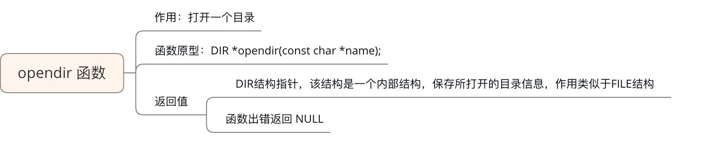

```c++
#include <stdio.h>
#include <unistd.h>
#include <stdlib.h>
#include <dirent.h>

int main(int argc, char* argv[])
{
    if(argc < 2)
    {
        printf("a.out path\n");
        exit(1);
    }

    DIR* dir = opendir(argv[1]);
    if(dir == NULL)
    {
        perror("opendir");
        exit(1);
    }
    char buf[512];
    getcwd(buf, sizeof(buf));
    printf("current dir: %s\n", buf);

    return 0;
}
```

### 4.readdir与closedir函数

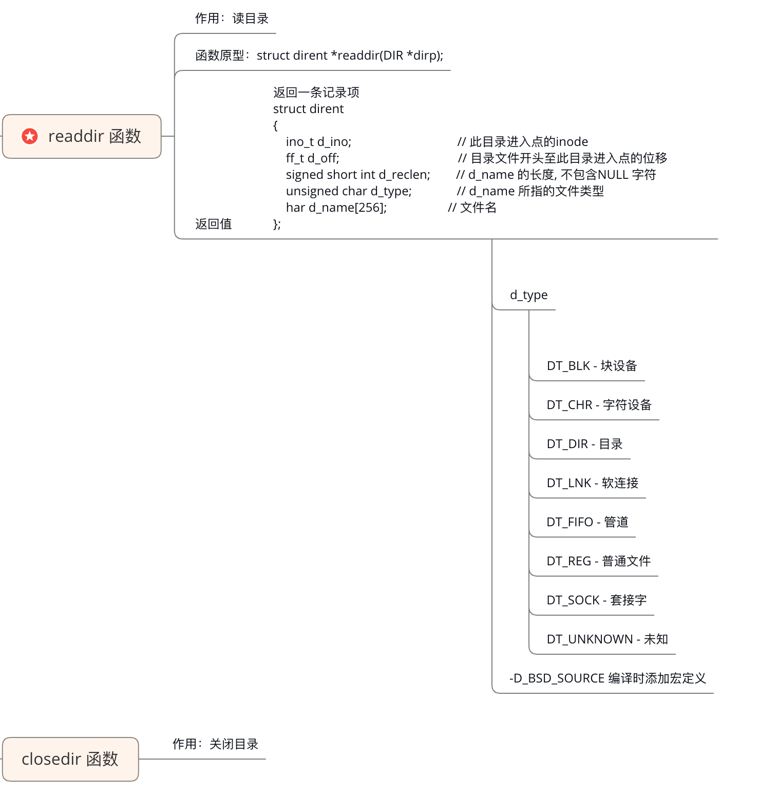

```c
//获取文件的个数
#include <stdio.h>
#include <string.h>
#include <stdlib.h>
#include <dirent.h>

int get_file_count(char* root)
{
  	//打开目录
    DIR* dir;
    dir = opendir(root);
    if(dir == NULL)
    {
        perror("opendir");
        exit(1);
    }

  	//遍历当前目录
  	struct dirent* ptr = NULL;
  	int total = 0;
    char path[1024];
    while((ptr = readdir(dir)) != NULL)
    {
      	//过滤 . 与 ..
        if(strcmp(ptr->d_name, ".") == 0 || strcmp(ptr->d_name, "..") == 0)
        {
            continue;
        }
        if(ptr->d_type == DT_DIR)
        {
          	//递归读目录
            sprintf(path, "%s/%s", root, ptr->d_name);
            total += get_file_count(path);
        }
        if(ptr->d_type == DT_REG)
        {
            total ++;
        }
    }
    closedir(dir);

    return total;
}

int main(int argc, char* argv[])
{
    if(argc < 2)
    {
        printf("a.out path\n");
        exit(1);
    }
    int total = get_file_count(argv[1]);
    printf("%s has %d files!\n", argv[1], total);
    return 0;
}
```

### 5.fcntl函数

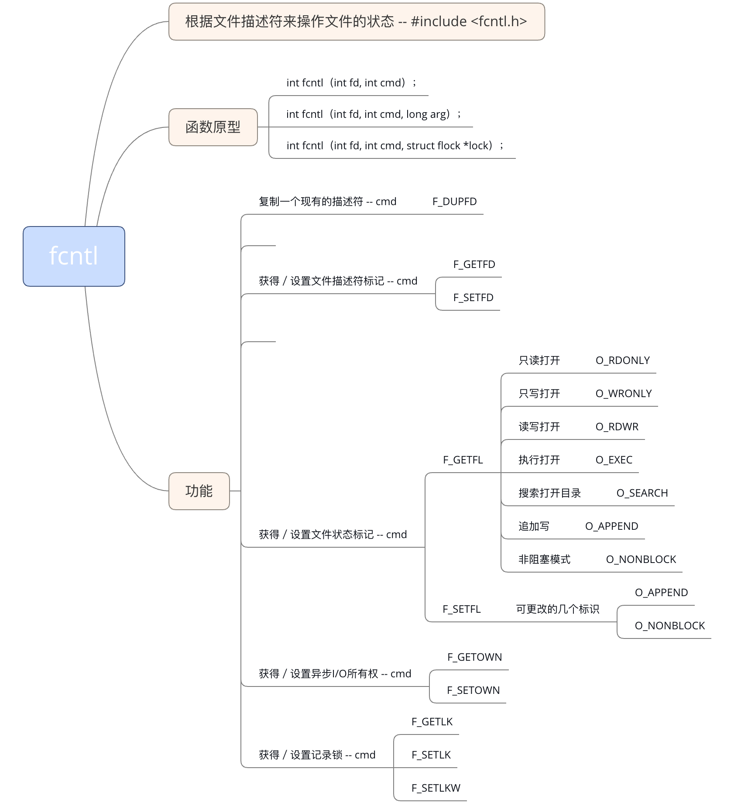

```c
#include <stdio.h>
#include <stdlib.h>
#include <fcntl.h>
#include <unistd.h>
#include <string.h>
int main(void)
{
    int fd;
    int flag;
    // 测试字符串
    char *p = "我们是一个有中国特色的社会主义国家！！！！！！";
    char *q = "呵呵, 社会主义好哇。。。。。。";
    // 只写的方式打开文件
    fd = open("test.txt", O_WRONLY);
    if(fd == -1)
    {
        perror("open");
        exit(1);
    }
    // 输入新的内容，该部分会覆盖原来旧的内容
    if(write(fd, p, strlen(p)) == -1)
    {
        perror("write");
        exit(1);
    }
    // 使用 F_GETFL 命令得到文件状态标志
    flag = fcntl(fd, F_GETFL, 0);
    if(flag == -1)
    {
        perror("fcntl");
        exit(1);
    }
    // 将文件状态标志添加 ”追加写“ 选项
    flag |= O_APPEND;
    // 将文件状态修改为追加写
    if(fcntl(fd, F_SETFL, flag) == -1)
    {
        perror("fcntl -- append write");
        exit(1);
    }
    // 再次输入新内容，该内容会追加到旧内容的后面
    if(write(fd, q, strlen(q)) == -1)
    {
        perror("write again");
        exit(1);
    }
    // 关闭文件
    close(fd);
    return 0;
}
```

---

## (四).进程基本概念

### 1.程序与进程

+ 程序：
  + 编译好的二进制文件，在磁盘上不占用系统资源。
+ 进程：
  + 一个抽象的概念，与操作系统原理紧密联系。进程是在内存中运行着的程序，占用系统资源。

### 2.并发与并行

+ 并发：
  + 在操作系统中，一个时间段中有多个进程都处在运行到运行完毕之间的状态。但任意一个时刻点上仍只有一个进程在运行。

+ 并行：


> 因为以上概念，就有了单道程序设计与多道程序设计的概念。
>
> + **单道程序设计：**所有进程一个一个排对执行。若A阻塞，B只能等待，即使CPU处于空闲状态。而在人机交互时阻塞的出现时必然的。所有这种模型在系统资源利用上及其不合理。
> + **多道程序设计：**在计算机内存中同时存放几道相互独立的程序，它们在管理程序控制之下，相互穿插的运行。多道程序设计必须有硬件基础作为保证。**时钟中断**即为多道程序设计模型的理论基础。 并发时，任意进程在执行期间都不希望放弃cpu。因此系统需要一种强制让进程让出cpu资源的手段。时钟中断有硬件基础作为保障，对进程而言不可抗拒。 操作系统中的中断处理函数，来负责调度程序执行。

### 3.中央处理器的简易架构

#### CPU取址执行简单介绍

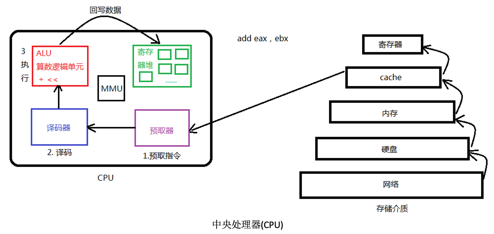

+ 取值执行时，预取器将缓存中的指令取出
+ 译码器将预取指令进行译码
+ 译码过程中分析需要进行的操作，然后调用操作所需要的算数逻辑单元，将数值放入寄存器中，进行计算操作

#### MMU映射地址简单介绍

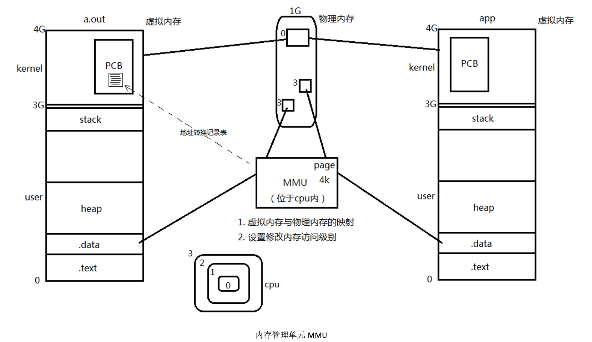

+ 产生进程的时候就会产生虚拟内存。
+ 虚拟地址是程序可用的地址范围是4G
+ MMU可以将虚拟地址映射到物理地址
+ MMU可以设置和修改内存访问级别(CPU)

### 4.进程控制块

+ 每个进程在内核中都有一个进程控制块（PCB）来维护进程相关的信息，Linux内核的进程控制块是task_struct结构体。
+ `/usr/src/linux-headers-3.16.0-30/include/linux/sched.h`文件中可以查看struct task_struct 结构体定义。其内部成员有很多，重点部分如下：
  + 进程id。系统中每个进程有唯一的id，在C语言中用pid_t类型表示，其实就是一个非负整数。
  + 进程的状态，有就绪、运行、挂起、停止等状态。
  + 进程切换时需要保存和恢复的一些CPU寄存器。
  + 描述虚拟地址空间的信息。
  + 描述控制终端的信息。
  + 当前工作目录（Current Working Directory）。
  + umask掩码。
  + 文件描述符表，包含很多指向file结构体的指针。
  + 和信号相关的信息。
  + 用户id和组id。
  + 会话（Session）和进程组。
  + 进程可以使用的资源上限（Resource Limit）。

### 5.环境变量

#### 基本简介

环境变量，是指在操作系统中用来指定操作系统运行环境的一些参数。

+ 通常具备以下特征：

  + 字符串(本质) 
  + 有统一的格式：名=值[:值] 
  +  值用来描述进程环境信息。

+ 存储形式：与命令行参数类似。char *[]数组，数组名environ，内部存储字符串，NULL作为哨兵结尾。

+ 使用形式：与命令行参数类似。

+ 加载位置：与命令行参数类似。位于用户区，高于stack的起始位置。

+ 引入环境变量表：须声明环境变量。extern char ** environ;     

+ 打印当前进程的所有环境变量：

  ```c
  #include <stdio.h>
  
  extern char **environ;
  int main(void)
  {
  	int i;
  	for(i = 0; environ[i] != NULL; i++){
  		printf("%s\n", environ[i]);
  	}
  	return 0;
  }
  ```

#### 常见环境变量

> 按照惯例，环境变量字符串都是name=value这样的形式，大多数name由大写字母加下划线组成，一般把name的部分叫做环境变量，value的部分则是环境变量的值。环境变量定义了进程的运行环境，一些比较重要的环境变量的含义如下：

+ **PATH:**

  + 可执行文件的搜索路径。ls命令也是一个程序，执行它不需要提供完整的路径名/bin/ls，然而通常我们执行当前目录下的程序a.out却需要提供完整的路径名./a.out，这是因为PATH环境变量的值里面包含了ls命令所在的目录/bin，却不包含a.out所在的目录。PATH环境变量的值可以包含多个目录，用:号隔开。在Shell中用echo命令可以查看这个环境变量的值：

    `echo $PATH`

+ **SHELL:**

  + 当前Shell，它的值通常是/bin/bash。

+ **TERM:**

  + 当前终端类型，在图形界面终端下它的值通常是xterm，终端类型决定了一些程序的输出显示方式，比如图形界面终端可以显示汉字，而字符终端一般不行。

+ **LANG:**

  + 语言和locale，决定了字符编码以及时间、货币等信息的显示格式。

+ **HOME:**

  + 当前用户主目录的路径，很多程序需要在主目录下保存配置文件，使得每个用户在运行该程序时都有自己的一套配置。

#### 常见环境变量操作函数

+ **getenv函数：**
  + 获取环境变量值
  + ` char *getenv(const char *name);`  成功：返回环境变量的值；失败：NULL (name不存在)

+ **setenv函数：**
  + 设置环境变量的值    
  + `int setenv(const char *name, const char *value, int overwrite);` 
  + 成功：0；失败：-1；
  + 参数overwrite取值：
    + 1：覆盖原环境变量 
    + 0：不覆盖。(该参数常用于设置新环境变量，如：ABC = haha-day-night)

+ **unsetenv函数：**

  + 删除环境变量name的定义

  + `int unsetenv(const char *name);`

  +   成功：0；失败：-1  

    >  注意事项：name不存在仍返回0(成功)，当name命名为"ABC="时则会出错。

+ 例子：

  ```c
  #include <stdio.h>
  #include <stdlib.h>
  #include <string.h>
  
  int main(void)
  {
  	char *val;
  	const char *name = "ABD";
  
  	val = getenv(name);
  	printf("1, %s = %s\n", name, val);
  
  	setenv(name, "haha-day-and-night", 1);
  
  	val = getenv(name);
  	printf("2, %s = %s\n", name, val);
  
  #if 1
  	int ret = unsetenv("ABD=");
      printf("ret = %d\n", ret);
  
  	val = getenv(name);
  	printf("3, %s = %s\n", name, val);
  
  #else
  	int ret = unsetenv("ABD");  //name=value:value
  	printf("ret = %d\n", ret);
  
  	val = getenv(name);
  	printf("3, %s = %s\n", name, val);
  
  #endif
  
  	return 0;
  }
  ```

---


## (五).进程创建

### 1.进程控制

#### fork函数

+ 创建一个子进程。

  + `pid_t fork(void);`

  +    失败返回-1；成功返回：① 父进程返回子进程的ID(非负)  ②子进程返回 0 

  + pid_t类型表示进程ID，但为了表示-1，它是有符号整型。(0不是有效进程ID，init最小，为1)

    >  注意返回值，不是fork函数能返回两个值，而是fork后，fork函数变为两个，父子需【各自】返回一个值。

#### 循环创建n个子进程

+ 一次fork函数调用可以创建一个子进程。那么创建N个子进程应该怎样实现呢？

  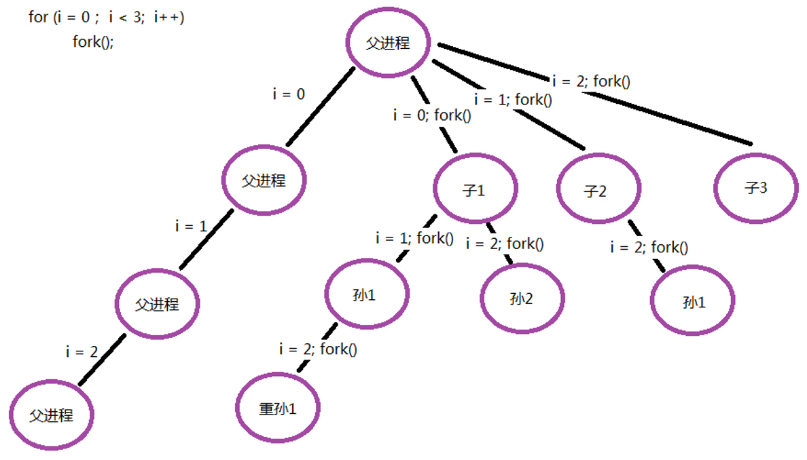

+ 从上图我们可以很清晰的看到，当n为3时候，循环创建了(2^n)-1个子进程，而不是N的子进程。需要在循环的过程，保证子进程不再执行fork ，因此当(fork() == 0)时，子进程应该立即break;才正确。

  ```c
  #include <stdio.h>
  #include <unistd.h>
  #include <stdlib.h>
  
  int main(int argc, char *argv[])
  {
  	int n = 5, i;				//默认创建5个子进程
  
  	if(argc == 2){	
  		n = atoi(argv[1]);
  	}
  
  	for(i = 0; i < n; i++)	//出口1,父进程专用出口
  		if(fork() == 0)
  			break;			//出口2,子进程出口,i不自增
  
  	if(n == i){
  		sleep(n);
  		printf("I am parent, pid = %d\n", getpid());
  	} else {
  		sleep(i);
  		printf("I'm %dth child, pid = %d\n", i+1, getpid());
  	}
  
  	return 0;
  }
  ```

### 2.进程共享

父子进程之间在fork后

+  **父子相同处:**  全局变量、.data、.text、栈、堆、环境变量、用户ID、宿主目录、进程工作目录、信号处理方式...

+ **父子不同处:**  
  + 进程ID  
  + fork返回值  
  + 父进程ID  
  + 进程运行时间  
  + 闹钟(定时器)  
  + 未决信号集

+ 似乎，子进程复制了父进程0-3G用户空间内容，以及父进程的PCB，但pid不同。真的每fork一个子进程都要将父进程的0-3G地址空间完全拷贝一份，然后在映射至物理内存吗？

+ 当然不是!父子进程间遵循 **<font color = red>读时共享写时复制</font>** 的原则。这样设计，无论子进程执行父进程的逻辑还是执行自己的逻辑都能节省内存开销。  

+  **父子进程共享：** 
  + 文件描述符(打开文件的结构体) 
  +  mmap建立的映射区 (进程间通信详解)

+ 特别的，fork之后父进程先执行还是子进程先执行不确定。取决于内核所使用的调度算法。

### 3.gdb调试

+ 使用gdb调试的时候，gdb只能跟踪一个进程。可以在fork函数调用之前，通过指令设置gdb调试工具跟踪父进程或者是跟踪子进程。默认跟踪父进程。

  + `set follow-fork-mode child` 命令设置gdb在fork之后跟踪子进程。
  + `set follow-fork-mode parent` 设置跟踪父进程。

  > 注意，一定要在fork函数调用之前设置才有效。  

### 4.exec函数族

fork创建子进程后执行的是和父进程相同的程序（但有可能执行不同的代码分支），子进程往往要调用一种exec函数以执行另一个程序。当进程调用一种exec函数时，该进程的用户空间代码和数据完全被新程序替换，从新程序的启动例程开始执行。调用exec并不创建新进程，所以调用exec前后该进程的id并未改变。

将当前进程的.text、.data替换为所要加载的程序的.text、.data，然后让进程从新的.text第一条指令开始执行，但进程ID不变，换核不换壳。

有六种以exec开头的函数，统称exec函数：

+ int execl(const char *path, const char *arg, ...);
+ int execlp(const char *file, const char *arg, ...);
+ int execle(const char *path, const char *arg, ..., char *const envp[]);
+ int execv(const char *path, char *const argv[]);
+ int execvp(const char *file, char *const argv[]);
+ int execve(const char *path, char *const argv[], char *const envp[]);

#### execlp函数

+ 加载一个进程，借助PATH环境变量    
  + `int execlp(const char *file, const char *arg, ...);   `  
  +  成功：无返回；
  + 失败：-1

+ 参数1：要加载的程序的名字。该函数需要配合PATH环境变量来使用，当PATH中所有目录搜索后没有参数1则出错返回。

+  该函数通常用来调用系统程序。如：ls、date、cp、cat等命令。

```c
//execlp实现ls -al命令
#include<stdio.h>
#include <sys/types.h>
#include <unistd.h>

int main() {
    pid_t pid;
    pid = fork();
    if(pid == -1)
    {
	perror("fork error");
    }else if(pid > 0) {
	sleep(1);
	printf("parent\n");
    }else {
	execlp("ls","ls","-l","-a",NULL);
    }
    return 0;
}
```

#### execl函数

+ 加载一个进程， 通过 `路径+程序名` 来加载。 
  + int execl(const char *path, const char *arg, ...);      
  + 成功：无返回；
  + 失败：-1

+ 对比execlp，如加载"ls"命令带有-l，-F参数
  + `execlp("ls", "ls", "-l", "-F", NULL);  `   使用程序名在PATH中搜索。
  + `execl("/bin/ls", "ls", "-l", "-F", NULL);  `使用参数1给出的绝对路径搜索。

####  execv函数

+ 加载一个进程，使用使用字符串参数
  + `int execv(const char *path, const char *argv[]);`

+ 变参形式： ①... ② argv[] (main函数也是变参函数，形式上等同于 int main(int argc, char *argv0, ...)) 

+ 变参终止条件：① NULL结尾 ② 固参指定

> execv与exec参数形式不同，原理一致。

```c
//execlp实现ls -al命令
#include<stdio.h>
#include <sys/types.h>
#include <unistd.h>

int main() {
    pid_t pid;
    pid = fork();
    if(pid == -1)
    {
	perror("fork error");
    }else if(pid > 0) {
	sleep(1);
	printf("parent\n");
    }else {
      char argv[] = {"ls","ls","-l","-a",NULL};
			execvp("/bin/ls",argv);
    }
    return 0;
}
```

#### exec函数族总结

+ exec函数一旦调用成功即执行新的程序，不返回。**只有失败才返回，错误值-1**。所以通常我们直接在exec函数调用后直接调用perror()和exit()，无需if判断。

+ 参数含义：
  + l (list)          命令行参数列表
  + p (path)         搜素file时使用path变量
  + v (vector)        使用命令行参数数组
  + e (environment)   使用环境变量数组,不使用进程原有的环境变量，设置新加载程序运行的环境变量

+ 事实上，只有execve是真正的系统调用，其它五个函数最终都调用execve，所以execve在man手册第2节，其它函数在man手册第3节。这些函数之间的关系如下图所示。

  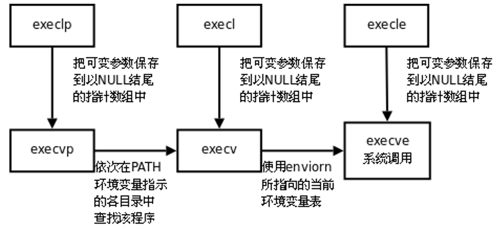

### 5.回收子进程

#### 孤儿进程

+ 孤儿进程: 父进程先于子进程结束，则子进程成为孤儿进程，子进程的父进程成为init进程，称为init进程领养孤儿进程。

#### 僵尸进程

+ 僵尸进程: 进程终止，父进程尚未回收，子进程残留资源（PCB）存放于内核中，变成僵尸（Zombie）进程。

> 特别注意，僵尸进程是不能使用kill命令清除掉的。因为kill命令只是用来终止进程的，而僵尸进程已经终止。

+ 例子：

  ```c
  #include <stdio.h>
  #include <stdlib.h>
  #include <unistd.h>
  #include <sys/wait.h>
  
  int main(void)
  {
      pid_t pid, wpid;
      pid = fork();
      int status;
      
      if (pid == 0) {
              printf("---child, my parent= %d, going to sleep 10s\n", getppid());
              printf("-------------child die--------------\n");
      } else if (pid > 0) {
          while (1) {
              printf("I am parent, pid = %d, myson = %d\n", getpid(), pid);
  
          }
      } else {
          perror("fork");
          return 1;
      }
  
      return 0;
  }
  ```

  > 出现僵尸进程


#### wait函数

一个进程在终止时会关闭所有文件描述符，释放在用户空间分配的内存，但它的PCB还保留着，内核在其中保存了一些信息：如果是正常终止则保存着退出状态，如果是异常终止则保存着导致该进程终止的信号是哪个。这个进程的父进程可以调用wait或waitpid获取这些信息，然后彻底清除掉这个进程。我们知道一个进程的退出状态可以在Shell中用特殊变量$?查看，因为Shell是它的父进程，当它终止时Shell调用wait或waitpid得到它的退出状态同时彻底清除掉这个进程。

父进程调用wait函数可以回收子进程终止信息。该函数有三个功能：

+  阻塞等待子进程退出
+  回收子进程残留资源 
+  获取子进程结束状态(退出原因)。

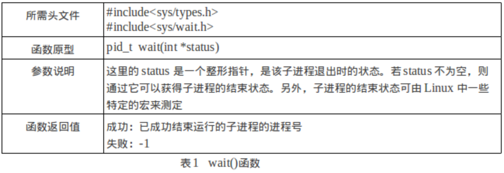

**pid_t wait(int \*status);**  成功：清理掉的子进程ID；失败：-1 (没有子进程)

```c
#include <stdio.h>
#include <stdlib.h>
#include <unistd.h>
#include <sys/wait.h>

int main(void)
{
    pid_t pid, wpid;
    pid = fork();
    int status;
    
    if (pid == 0) {
            printf("---child, my parent= %d, going to sleep 10s\n", getppid());
	    sleep(10);
            printf("-------------child die--------------\n");
    } else if (pid > 0) {
      //回收子进程
			wpid = wait(NULL);
			if(wpid > 0) {
				while (1) {
			    printf("I am parent, pid = %d, myson = %d\n", getpid(), pid);
				}
			}
    } else {
        perror("fork");
        return 1;
    }
    return 0;
}
```

当进程终止时，操作系统的隐式回收机制会：

+ 关闭所有文件描述符 
+  释放用户空间分配的内存。

内核的PCB仍存在。其中保存该进程的退出状态。(正常终止→退出值；异常终止→终止信号)

可使用wait函数传出参数status来保存进程的退出状态。借助宏函数来进一步判断进程终止的具体原因。宏函数可分为如下三组：

+  WIFEXITED(status) 为非0  → 进程正常结束
  + WEXITSTATUS(status) 如上宏为真，使用此宏 → 获取进程退出状态 (exit的参数)

+ WIFSIGNALED(status) 为非0 → 进程异常终止
  + WTERMSIG(status) 如上宏为真，使用此宏 → 取得使进程终止的那个信号的编号。

+ WIFSTOPPED(status) 为非0 → 进程处于暂停状态
  +  WSTOPSIG(status) 如上宏为真，使用此宏 → 取得使进程暂停的那个信号的编号。
  +   WIFCONTINUED(status) 为真 → 进程暂停后已经继续运行

+ 例子

```c
#include <stdio.h>
#include <stdlib.h>
#include <unistd.h>
#include <sys/wait.h>

int main(void)
{
    pid_t pid, wpid;
    int status;
    pid = fork();
    
    if (pid == 0) {
            printf("---child, my parent= %d, going to sleep 60s\n", getppid());
	    sleep(60);
            printf("-------------child die--------------\n");
	    return 100;
    } else if (pid > 0) {
	wpid = wait(&status);
	if(wpid == -1) {
	    perror("wait error");
	    exit(-1);
	}
	if(WIFEXITED(status)){
	    printf("child exited with %d\n",WEXITSTATUS(status));
	}
	if(WIFSIGNALED(status)){
	    printf("child killed with %d\n",WTERMSIG(status));
	}

	while (1) {
	    printf("I am parent, pid = %d, myson = %d\n", getpid(), pid);
	    sleep(1);
	}
    } else {
        perror("fork");
        return 1;
    }

    return 0;
}
```

+ 正常结束

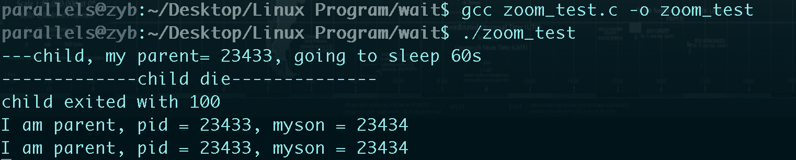

+ 异常结束

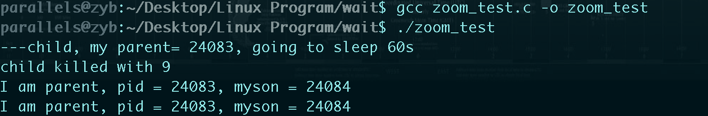

#### waitpid函数

+ 函数功能：用来等待某个特定进程的结束
+ status如果不为空，会把状态信息写到它指向的位置
+ options允许改变waitpid的行为，最有用的一个选项是WNOHANG，它的作用是防止waitpid把调用者的执行挂起
+ 返回值：成功返回等待子进程的pid，失败返回-1

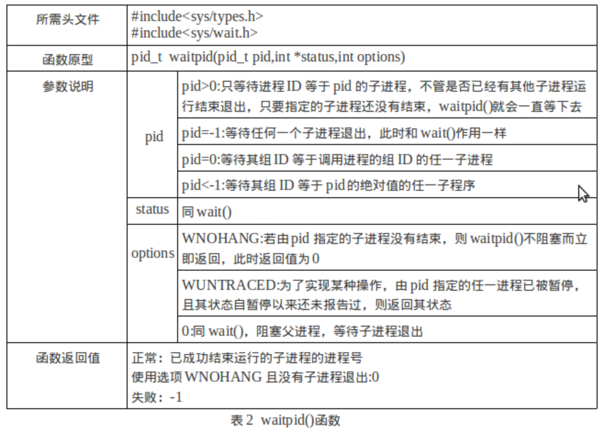

+ 例子

  ```c
  #include <unistd.h>
  #include <stdlib.h>
  #include <stdio.h>
  #include <sys/wait.h>
  
  int main(void)
  {
  	pid_t pid, pid2, wpid;
  	int flg = 0;
  
  	pid = fork();
  	pid2 = fork();
  
  	if(pid == -1){
  		perror("fork error");
  		exit(1);
  	} else if(pid == 0){		//son
  		printf("I'm process child, pid = %d\n", getpid());
  		sleep(5);				
  		exit(4);
  	} else {					//parent
  		do {
  			wpid = waitpid(pid, NULL, WNOHANG);
              //wpid = wait(NULL);
  			printf("---wpid = %d--------%d\n", wpid, flg++);
  			if(wpid == 0){
  				printf("NO child exited\n");
  				sleep(1);		
  			}
  		} while (wpid == 0);		//子进程不可回收
  
  		if(wpid == pid){		//回收了指定子进程
  			printf("I'm parent, I catched child process,"
  					"pid = %d\n", wpid);
  		} else {
  			printf("other...\n");
  		}
  	}
  	return 0;
  }
  ```


## (六).进程间通信

### 1.IPC方法

Linux环境下，进程地址空间相互独立，每个进程各自有不同的用户地址空间。任何一个进程的全局变量在另一个进程中都看不到，所以进程和进程之间不能相互访问，要交换数据必须通过内核，在内核中开辟一块缓冲区，进程1把数据从用户空间拷到内核缓冲区，进程2再从内核缓冲区把数据读走，内核提供的这种机制称为进程间通信（IPC，InterProcess Communication）。

<div align="center">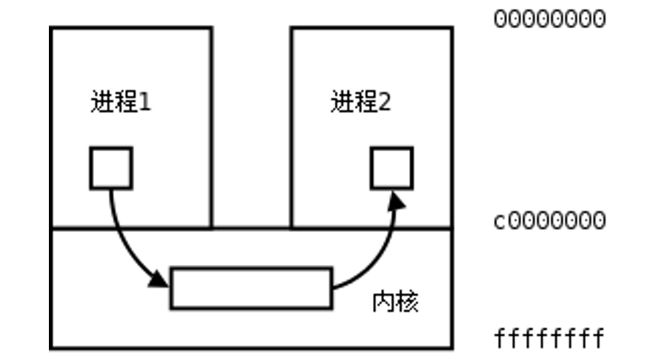</div>

在进程间完成数据传递需要借助操作系统提供特殊的方法，如：文件、管道、信号、共享内存、消息队列、套接字、命名管道等。随着计算机的蓬勃发展，一些方法由于自身设计缺陷被淘汰或者弃用。现今常用的进程间通信方式有：

+ 管道 (使用最简单)
+ 信号 (开销最小)
+  共享映射区 (无血缘关系)
+  本地套接字 (最稳定)

### 2.管道

#### 管道的概念

+ 管道是一种最基本的IPC机制，作用于有血缘关系的进程之间，完成数据传递。调用pipe系统函数即可创建一个管道。有如下特质：
  + 其本质是一个伪文件(实为内核缓冲区) 
  + 由两个文件描述符引用，一个表示读端，一个表示写端。
  + 规定数据从管道的写端流入管道，从读端流出。

+ 管道的原理: 管道实为内核使用环形队列机制，借助内核缓冲区(4k)实现。

+ 管道的局限性：
  +  数据自己读不能自己写。
  + 数据一旦被读走，便不在管道中存在，不可反复读取。
  + 由于管道采用半双工通信方式。因此，数据只能在一个方向上流动。
  + 只能在有公共祖先的进程间使用管道。

#### pipe函数

+ 功能：创建管道
+ 形式：
  + `int pipe(int pipefd[2]);`      
  + 成功：0；失败：-1，设置errno
+ 函数调用成功返回r/w两个文件描述符。无需open，但需手动close。
+ 规定：fd[0] → r； fd[1] → w，就像0对应标准输入，1对应标准输出一样。向管道文件读写数据其实是在读写内核缓冲区。

+ 管道创建成功以后，创建该管道的进程（父进程）同时掌握着管道的读端和写端。父子进程间通信的实现方式如下图所示：

  <div align="center">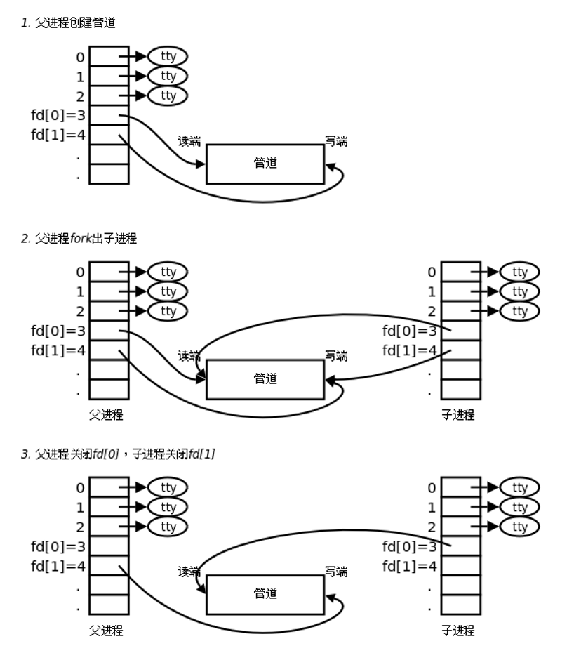 </div>

  + 父进程调用pipe函数创建管道，得到两个文件描述符fd[0]、fd[1]指向管道的读端和写端。
  + 父进程调用fork创建子进程，那么子进程也有两个文件描述符指向同一管道。
  + 父进程关闭管道读端，子进程关闭管道写端。父进程可以向管道中写入数据，子进程将管道中的数据读出。由于管道是利用环形队列实现的，数据从写端流入管道，从读端流出，这样就实现了进程间通信。

#### 管道的读写行为

+ **读管道：**

  + 管道中有数据，read返回实际读到的字节数。

  + 管道中无数据：

    + 管道写端被全部关闭，read返回0 (好像读到文件结尾)
    + 写端没有全部被关闭，read阻塞等待(不久的将来可能有数据递达，此时会让出cpu)

  + 例子：

    ```c
    #include<unistd.h>
    #include<stdio.h>
    #include<stdlib.h>
    
    int main() {
    
        int fd[2];
        int ret;
        char writebuf[] = "hello linux";
        char readbuf[128] = {0};
    
        ret = pipe(fd);
        if(ret < 0) {
            perror("pip error");
            exit(1);
        }
        printf("create pipe sucess fd[0]=%d, fd[1]=%d\n",fd[0],fd[1]);
    		//write into pipe
        write(fd[1],writebuf,sizeof(writebuf));
    
        //read from pipe
        read(fd[0], readbuf, 128);
        printf("readbuf = %s\n", readbuf);
    
        read(fd[0], readbuf, 128);
        printf("second readbuf");
    
        return 0;
    }
    ```

    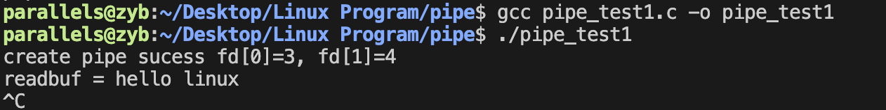

    > 第二次进行读操作时出现阻塞。
    >
    > 特点：
    >
    > + 管道中读完会删除内容。
    > + 管道中无内容时进行读，会出现阻塞现象。

+ **写管道：**

  + 管道读端全部被关闭， 进程异常终止(也可使用捕捉SIGPIPE信号，使进程不终止)
  + 管道读端没有全部关闭：
    + 管道已满，write阻塞。
    + 管道未满，write将数据写入，并返回实际写入的字节数。

+ **读写管道实现父子进程间的先后运行：**

  ```c
  #include"stdio.h"
  #include"sys/types.h"
  #include"stdlib.h"
  #include"unctrl.h"
  #include"unctrl.h"
  int main() {
      int fd[2];
      //进程间的锁
      char process_inter = 0;
      //创建管程
      int ret = pipe(fd);
      if(ret < 0){
          perror("pipe error");
          exit(1);
      }
      printf("create pip successfully\n");
      //创建子进程
      pid_t pid = fork();
      //子进程运行
      if (pid == 0)
      {
          read(fd[0], &process_inter, 1);
          //等待父进程修改管程信息为1
          while(process_inter == 0);
          for (int i = 0; i < 5; i++)
          {
              printf("this is child process, id = %d\n", i);
              sleep(1);
          }
      }
      //父进程运行
      else if(pid > 0) 
      {
          for (int i = 0; i < 5; i++)
          {
              printf("this is parent process, id = %d\n", i);
              sleep(1);
          }
          process_inter = 1;
          //修改process_inter
          write(fd[1], &process_inter, 1);
      }
      while (1);
      return 0;
  }
  ```

#### 管道的优劣

+ 优点：
  + 简单，相比信号，套接字实现进程间通信，简单很多。
+ 缺点：
  + 只能单向通信，双向通信需建立两个管道。
  + 只能用于父子、兄弟进程(有共同祖先)间通信。该问题后来使用fifo有名管道解决。


### 3.FIFO

+ FIFO常被称为命名管道，以区分管道(pipe)。管道(pipe)只能用于“有血缘关系”的进程间。但通过FIFO，不相关的进程也能交换数据。

+ FIFO是Linux基础文件类型中的一种。但，FIFO文件在磁盘上没有数据块，仅仅用来标识内核中一条通道。各进程可以打开这个文件进行read/write，实际上是在读写内核通道，这样就实现了进程间通信。

+ 创建方式：

  + 命令：mkfifo 管道名
  + 库函数：`int mkfifo(const char *pathname,  mode_t mode); `
    + 成功：0
    + 失败：-1

+ 一旦使用mkfifo创建了一个FIFO，就可以使用open打开它，常见的文件I/O函数都可用于fifo。如：close、read、write、unlink等。

  > 只有生成FIFO之后，使用open打开时才会在内核中出现管道。

+ 创建有名管道：

  ```c
  #include"stdlib.h"
  #include"unistd.h"
  #include"stdio.h"
  
  int main() {
      int ret = mkfifo("./myfifo",0777);
  
      if(ret < 0) {
          perror("mkfifo error");
          exit(1);
      }
      printf("create myfifo successfully\n");
  
      return 0;
  }
  ```

+ 利用有名管道进行无血缘关系进程之间的通信：

  ```c
  //first.c
  #include"stdlib.h"
  #include"sys/types.h"
  #include"stdio.h"
  #include"fcntl.h"
  #include"unistd.h"
  int main() {
      char process_inter = 0;
  
      int fd = open("./myfifo",O_WRONLY);
  
      if(fd < 0) {
          perror("mkfifo error");
          exit(1);
      }
  
      printf("open myfifo successfully\n");
  
      for (int i = 0; i < 5; i++)
      {
          printf("this is first process id = %d\n", i);
          sleep(1);
      }
      process_inter = 1;
      sleep(5);
      write(fd,&process_inter,1);
      while (1);  
      return 0;
  }
  //=======================================================
  //second.c
  #include"stdlib.h"
  #include"sys/types.h"
  #include"stdio.h"
  #include"fcntl.h"
  #include"unistd.h"
  
  int main() {
      char process_inter = 0;
  
      int fd = open("./myfifo",O_RDONLY);
  
      if(fd < 0) {
          perror("mkfifo error");
          exit(1);
      }
      printf("open myfifo successfully\n");
  
     read(fd, &process_inter, 1);
     while (process_inter == 0);
  
      for (int i = 0; i < 5; i++)
      {
          printf("this is second process id = %d\n", i);
          sleep(1);
      }
      process_inter = 1;
      while (1);  
      return 0;
  }
  ```


### 4.文件映射存储

#### 存储映射IO

存储映射I/O (Memory-mapped I/O) 使一个磁盘文件与存储空间中的一个缓冲区相映射。于是当从缓冲区中取数据，就相当于读文件中的相应字节。于此类似，将数据存入缓冲区，则相应的字节就自动写入文件。这样，就可在不适用read和write函数的情况下，使用地址（指针）完成I/O操作。

使用这种方法，首先应通知内核，将一个指定文件映射到存储区域中。这个映射工作可以通过mmap函数来实现。

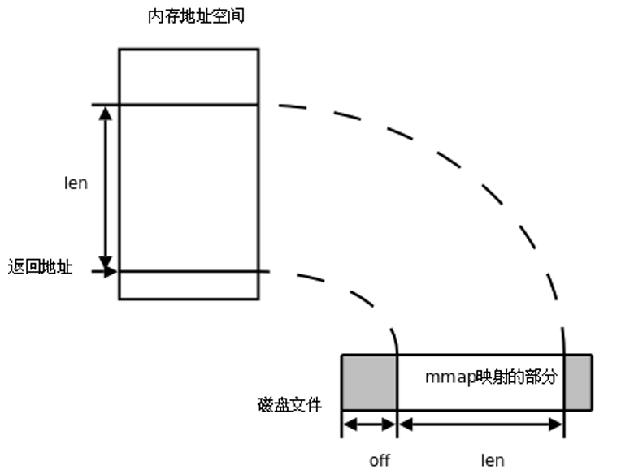

#### mmap函数

+ `void *mmap(void *adrr, size_t length, int prot, int flags, int fd, off_t offset); `

+ **返回值：**
  + 成功：返回创建的映射区首地址；
  + **失败：MAP_FAILED宏**

+ **参数：**  
  + addr:    建立映射区的首地址，由Linux内核指定。使用时，直接传递NULL
  + length： 欲创建映射区的大小
  + prot：  映射区权限PROT_READ、PROT_WRITE、PROT_READ|PROT_WRITE
  + flags：  标志位参数(常用于设定更新物理区域、设置共享、创建匿名映射区)
    + MAP_SHARED: 会将映射区所做的操作反映到物理设备（磁盘）上。
    + MAP_PRIVATE: 映射区所做的修改不会反映到物理设备。
  + fd：    用来建立映射区的文件描述符
  + offset：  映射文件的偏移(4k的整数倍)

#### munmap函数

+ 同malloc函数申请内存空间类似的，mmap建立的映射区在使用结束后也应调用类似free的函数来释放。
+ `int munmap(void *addr, size_t length); `
+ **返回值：**成功：0； 失败：-1

#### mmap进行文件映射例子

```c
#include <stdio.h>
#include <sys/stat.h>
#include <unistd.h>
#include <stdlib.h>
#include <fcntl.h>
#include <string.h>
#include <sys/mman.h>

int main()
{
	int len, ret;
	char *p = NULL;

	//打开文件
	int fd = open("mytest.txt",O_CREAT|O_RDWR, 0644);
	if(fd < 0) {
		perror("open error");
		exit(1);
	}

	//设置文件大小
	len = ftruncate(fd, 4);
	if(len == -1) {
		perror("ftruncate error");
		exit(-1);
	}

	//创建MMAP
	p = mmap(NULL, 4, PROT_READ|PROT_WRITE, MAP_SHARED, fd, 0);
	if(p == MAP_FAILED) {
		perror("mmap error");
		exit(-1);
	}
	//P可以进行操作
	strcpy(p, "mmp");

	//结束mmap操作
	ret = munmap(p, 4);
	//关闭文件
	close(fd);	
    return 0;
}
```

#### mmap注意事项

+ 可以open的时候O_CREAT一个新文件来创建映射区吗?

  > 可以

+ 如果mem++，munmmp可否成功？

  > 不能成功，首地址发生了改变

+ 如果open时O_RDONLY, mmap时PROT参数指定PROT_READ|PROT_WRITE会怎样？

  > 不能，会出现权限不足的错误
  >
  > 但是如果flags参数修改为MAP_PRIVATE，还是能够成功的
  >
  > +  创建映射区的过程中，隐含着一次对映射文件的读操作。
  >
  > + **当MAP_SHARED时，要求：映射区的权限应 <=文件打开的权限(出于对映射区的保护)。而MAP_PRIVATE则无所谓，因为mmap中的权限是对内存的限制。**

+ 如果文件偏移量为1000会怎样？

  > 文件偏移量必须为4K的整数倍

+ 文件描述符先关闭，对mmap映射有没有影响？

  > 映射区的释放与文件关闭无关。只要映射建立成功，文件可以立即关闭。

#### mmap父子进程通信

父子等有血缘关系的进程之间也可以通过mmap建立的映射区来完成数据通信。但相应的要在创建映射区的时候指定对应的标志位参数flags：

+ MAP_PRIVATE: (私有映射) 父子进程各自独占映射区；
+ MAP_SHARED: (共享映射) 父子进程共享映射区；

+ 例子：

  ```c
  #include <stdio.h>
  #include <stdlib.h>
  #include <unistd.h>
  #include <fcntl.h>
  #include <sys/mman.h>
  #include <sys/wait.h>
  
  int var = 100;
  
  int main(void)
  {
      int *p;
      pid_t pid;
  
      int fd;
      fd = open("temp", O_RDWR|O_CREAT|O_TRUNC, 0644);
      if(fd < 0){
          perror("open error");
          exit(1);
      }
      unlink("temp");				//删除临时文件目录项,使之具备被释放条件.
      ftruncate(fd, 4);
  
      //p = (int *)mmap(NULL, 4, PROT_READ|PROT_WRITE, MAP_SHARED, fd, 0);
      p = (int *)mmap(NULL, 4, PROT_READ|PROT_WRITE, MAP_PRIVATE, fd, 0);
      if(p == MAP_FAILED){		//注意:不是p == NULL
          perror("mmap error");
          exit(1);
      }
      close(fd);					//映射区建立完毕,即可关闭文件
  
      pid = fork();				//创建子进程
      if(pid == 0){
          *p = 2000;
          var = 1000;
          printf("child, *p = %d, var = %d\n", *p, var);
      } else {
          sleep(1);
          printf("parent, *p = %d, var = %d\n", *p, var);
          wait(NULL);
  
          int ret = munmap(p, 4);				//释放映射区
          if (ret == -1) {
              perror("munmap error");
              exit(1);
          }
      }
      return 0;
  }
  ```

  


#### 匿名映射

+ 使用映射区来完成文件读写操作十分方便，父子进程间通信也较容易。但缺陷是，每次创建映射区一定要依赖一个文件才能实现。通常为了建立映射区要open一个temp文件，创建好了再unlink、close掉，比较麻烦。 

+ 可以直接使用匿名映射来代替。其实Linux系统给我们提供了创建匿名映射区的方法，无需依赖一个文件即可创建映射区。同样需要借助标志位参数flags来指定。

+ 使用MAP_ANONYMOUS (或MAP_ANON)， 如: 

  `int *p = mmap(NULL, 4, PROT_READ|PROT_WRITE, MAP_SHARED|MAP_ANONYMOUS, -1, 0); `

  ```c
  #include <stdio.h>
  #include <stdlib.h>
  #include <unistd.h>
  #include <fcntl.h>
  #include <sys/mman.h>
  #include <sys/wait.h>
  
  int var = 100;
  
  int main(void)
  {
      int *p;
      pid_t pid;
  
      p = (int *)mmap(NULL, 4, PROT_READ|PROT_WRITE, MAP_SHARED|MAP_ANON, -1, 0);
     
      if(p == MAP_FAILED){		//注意:不是p == NULL
          perror("mmap error");
          exit(1);
      }
   
      pid = fork();				//创建子进程
      if(pid == 0){
          *p = 2000;
          var = 1000;
          printf("child, *p = %d, var = %d\n", *p, var);
      } else {
          sleep(1);
          printf("parent, *p = %d, var = %d\n", *p, var);
          wait(NULL);
  
          int ret = munmap(p, 4);				//释放映射区
          if (ret == -1) {
              perror("munmap error");
              exit(1);
          }
      }
      return 0;
  }
  ```

+ 需注意的是，MAP_ANONYMOUS和MAP_ANON这两个宏是Linux操作系统特有的宏。在类Unix系统中如无该宏定义，可使用如下两步来完成匿名映射区的建立。

  + fd = open("/dev/zero", O_RDWR);
  + p = mmap(NULL, size, PROT_READ|PROT_WRITE, MMAP_SHARED, fd, 0);

  ```c
  #include <stdio.h>
  #include <stdlib.h>
  #include <unistd.h>
  #include <fcntl.h>
  #include <sys/mman.h>
  #include <sys/wait.h>
  
  int var = 100;
  
  int main(void)
  {
      int *p;
      pid_t pid;
  
      int fd;
      fd = open("/dev/zero", O_RDWR);
      if(fd < 0){
          perror("open error");
          exit(1);
      }
      unlink("temp");				//删除临时文件目录项,使之具备被释放条件.
      ftruncate(fd, 4);
  
      p = mmap(NULL, size, PROT_READ|PROT_WRITE, MMAP_SHARED, fd, 0);
    
      if(p == MAP_FAILED){		//注意:不是p == NULL
          perror("mmap error");
          exit(1);
      }
      close(fd);					//映射区建立完毕,即可关闭文件
  
      pid = fork();				//创建子进程
      if(pid == 0){
          *p = 2000;
          var = 1000;
          printf("child, *p = %d, var = %d\n", *p, var);
      } else {
          sleep(1);
          printf("parent, *p = %d, var = %d\n", *p, var);
          wait(NULL);
  
          int ret = munmap(p, 4);				//释放映射区
          if (ret == -1) {
              perror("munmap error");
              exit(1);
          }
      }
      return 0;
  }
  ```

#### mmap无血缘关系进程间通信

实质上mmap是内核借助文件帮我们创建了一个映射区，多个进程之间利用该映射区完成数据传递。由于内核空间多进程共享，因此无血缘关系的进程间也可以使用mmap来完成通信。只要设置相应的标志位参数flags即可。若想实现共享，当然应该使用MAP_SHARED了。

```c
//写
#include <stdio.h>
#include <sys/stat.h>
#include <sys/types.h>
#include <fcntl.h>
#include <unistd.h>
#include <stdlib.h>
#include <sys/mman.h>
#include <string.h>

struct STU {
    int id;
    char name[20];
    char sex;
};

void sys_err(char *str)
{
    perror(str);
    exit(1);
}

int main(int argc, char *argv[])
{
    int fd;
    struct STU student = {10, "xiaoming", 'm'};
    char *mm;

    if (argc < 2) {
        printf("./a.out file_shared\n");
        exit(-1);
    }

    fd = open(argv[1], O_RDWR | O_CREAT, 0664);
    ftruncate(fd, sizeof(student));

    mm = mmap(NULL, sizeof(student), PROT_READ|PROT_WRITE, MAP_SHARED, fd, 0);
    if (mm == MAP_FAILED)
        sys_err("mmap");

    close(fd);

    while (1) {
        memcpy(mm, &student, sizeof(student));
        student.id++;
        sleep(1);
    }

    munmap(mm, sizeof(student));

    return 0;
}

//读
#include <stdio.h>
#include <sys/stat.h>
#include <fcntl.h>
#include <unistd.h>
#include <stdlib.h>
#include <sys/mman.h>
#include <string.h>

struct STU {
    int id;
    char name[20];
    char sex;
};

void sys_err(char *str)
{
    perror(str);
    exit(-1);
}

int main(int argc, char *argv[])
{
    int fd;
    struct STU student;
    struct STU *mm;

    if (argc < 2) {
        printf("./a.out file_shared\n");
        exit(-1);
    }

    fd = open(argv[1], O_RDONLY);
    if (fd == -1)
        sys_err("open error");

    mm = mmap(NULL, sizeof(student), PROT_READ, MAP_SHARED, fd, 0);
    if (mm == MAP_FAILED)
        sys_err("mmap error");
    
    close(fd);

    while (1) {
        printf("id=%d\tname=%s\t%c\n", mm->id, mm->name, mm->sex);
        sleep(2);
    }

    munmap(mm, sizeof(student));

    return 0;
}
```


### 5.信号基本概念

#### 信号的概念与机制

+ 信号的共性：1. 简单 2. 不能携带大量信息 3. 满足某个特设条件才发送。
+ 信号的机制：A给B发送信号，B收到信号之前执行自己的代码，收到信号后，不管执行到程序的什么位置，都要暂停运行，去处理信号，处理完毕再继续执行。与硬件中断类似——异步模式。但信号是软件层面上实现的中断，早期常被称为“软中断”。
+ 信号的特质：由于信号是通过软件方法实现，其实现手段导致信号有很强的延时性。但对于用户来说，这个延迟时间非常短，不易察觉。

> **每个进程收到的所有信号，都是由内核负责发送的，内核处理。**

#### 与信号相关的事件与状态

+  **产生信号：**

  + 按键产生，如：Ctrl+c、Ctrl+z、Ctrl+\
  +  系统调用产生，如：kill、raise、abort
  + 软件条件产生，如：定时器alarm
  +  硬件异常产生，如：非法访问内存(段错误)、除0(浮点数例外)、内存对齐出错(总线错误)
  +  命令产生，如：kill命令

+ **递达：** 递送并且到达进程。

+  **未决：** 产生和递达之间的状态。主要由于阻塞(屏蔽) ，并没有递达目的地，导致该状态。

+ **阻塞信号集(信号屏蔽字)**： 将某些信号加入集合，对他们设置屏蔽，当屏蔽x信号后，再收到该信号，该信号的处理将推后(解除屏蔽后)。

+ **未决信号集**: 

  +  信号产生，未决信号集中描述该信号的位立刻翻转为1，表信号处于未决状态。当信号被处理对应位翻转回为0。这一时刻往往非常短暂。
  + 信号产生后由于某些原因(主要是阻塞)不能抵达。这类信号的集合称之为未决信号集。在屏蔽解除前，信号一直处于未决状态。 

  > 阻塞信号集会影响未决信号集

  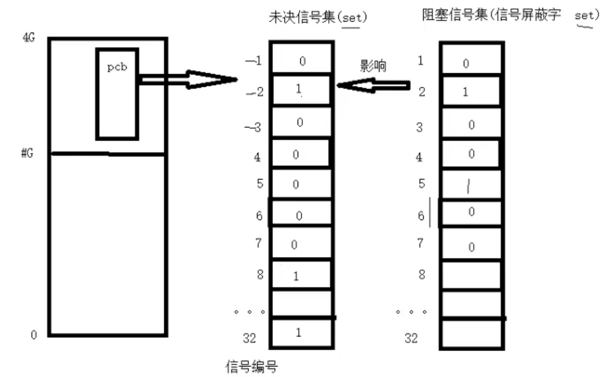

+ **信号的处理方式:** 

  + **执行默认处理动作（有五种）** 

  + **忽略(丢弃)** 

    > 对信号的处理方式是丢弃

  + **捕捉(调用户处理函数)**

    > 抓住对应的信号，不去执行它的默认动作，去执行自己定义的行为

+ Linux内核的进程控制块PCB是一个结构体，task_struct, 除了包含进程id，状态，工作目录，用户id，组id，文件描述符表，还包含了信号相关的信息，主要指阻塞信号集和未决信号集。

#### 信号编号

+ 可以使用`kill –l`命令查看当前系统可使用的信号有哪些。
+ 不存在编号为0的信号。其中1-31号信号称之为常规信号（也叫普通信号或标准信号），34-64称之为实时信号，驱动编程与硬件相关。名字上区别不大。而前32个名字各不相同。

#### 信号4要素

+ 与变量三要素类似的，每个信号也有其必备4要素，分别是：
  + **编号** 
  + **名称** 
  + **事件** 
  + **默认处理动作** 

+ 可通过`man 7 signal`查看帮助文档获取。也可查看`/usr/src/linux-headers-3.16.0-30/arch/s390/include/uapi/asm/signal.h`

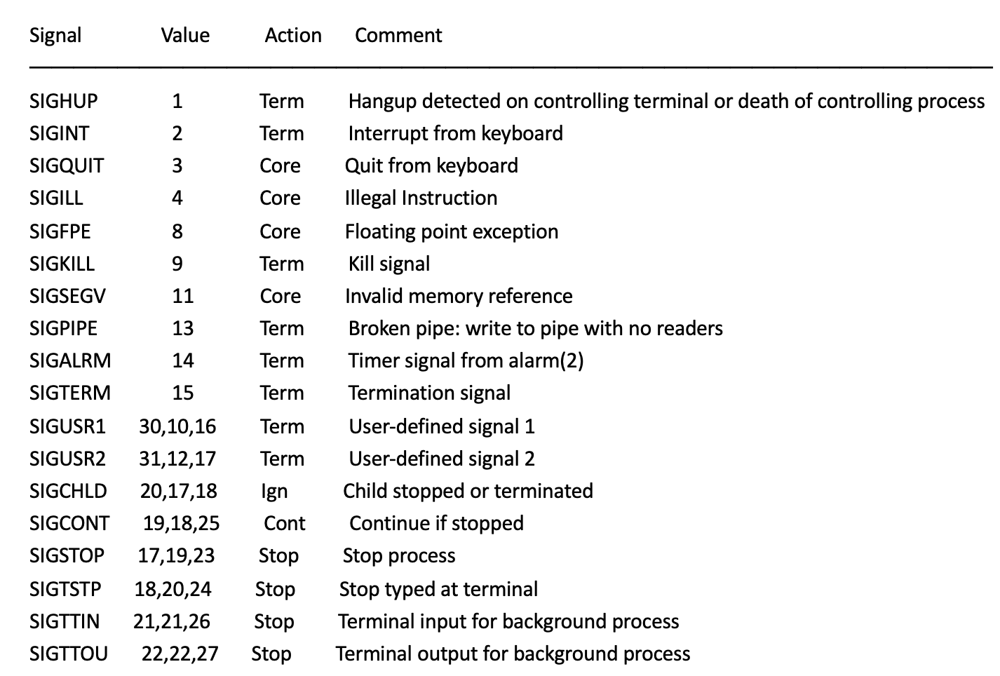

<div align = center></div>

+ **主要的默认处理动作**
  
  + Term：终止进程
  + Ign： 忽略信号 (默认即时对该种信号忽略操作)
  + Core：终止进程，生成Core文件。(查验进程死亡原因， 用于gdb调试)
  + Stop：停止（暂停）进程
  + Cont：继续运行进程
  
+ 注意从man 7 signal帮助文档中可看到 : The signals SIGKILL and SIGSTOP cannot be caught, blocked, or ignored.

  >  <font color = red>特别强调了**9) SIGKILL** **和19) SIGSTOP**信号， **不允许忽略和捕捉，只能执行默认动作。甚至不能将其设置为阻塞。**</font>


### 6.信号的产生

#### 终端按键产生信号

+  Ctrl + c → 2) SIGINT（终止/中断）  "INT" ----Interrupt
+  Ctrl + z → 20) SIGTSTP（暂停/停止） "T" ----Terminal 终端。
+  Ctrl + \ → 3) SIGQUIT（退出） 

#### 硬件异常产生信号

+  除0操作  → 8) SIGFPE (浮点数例外)   "F" -----float 浮点数。
+  非法访问内存 → 11) SIGSEGV (段错误)
+  总线错误 → 7) SIGBUS  

#### kill函数/命令 产生信号

+ kill命令产生信号：kill -SIGKILL pid
+ kill函数：给指定进程发送指定信号(不一定杀死)
  + `int kill(pid_t pid, int sig); ` 
    + 成功：0；
    + 失败：-1 (ID非法，信号非法，普通用户杀init进程等权级问题)，设置errno
  + sig：不推荐直接使用数字，应使用宏名，因为不同操作系统信号编号可能不同，但名称一致。
  + pid > 0: 发送信号给指定的进程。
  + pid = 0: 发送信号给 与调用kill函数进程属于同一进程组的所有进程。
  + pid < 0: 取|pid|发给对应进程组。
  + pid = -1：发送给进程有权限发送的系统中所有进程。
  + 进程组：每个进程都属于一个进程组，进程组是一个或多个进程集合，他们相互关联，共同完成一个实体任务，每个进程组都有一个进程组长，默认进程组ID与进程组长ID相同。
  + 权限保护：super用户(root)可以发送信号给任意用户，普通用户是不能向系统用户发送信号的。 kill -9 (root用户的pid) 是不可以的。同样，普通用户也不能向其他普通用户发送信号，终止其进程。 只能向自己创建的进程发送信号。普通用户基本规则是：发送者实际或有效用户ID == 接收者实际或有效用户ID

#### raise 和 abort 函数

+ raise 函数：给当前进程发送指定信号(自己给自己发)  `raise(signo) == kill(getpid(), signo);`
  +  `int raise(int sig);` 
  + 成功：0，失败非0值
+  abort 函数：给自己发送异常终止信号 6) SIGABRT 信号，终止并产生core文件
  + void abort(void); 该函数无返回

#### 软件条件产生信号1——alarm函数

+ 设置定时器(闹钟)。在指定seconds后，内核会给当前进程发送14）SIGALRM信号。进程收到该信号，默认动作终止。

+ **每个进程都有且只有唯一个定时器。**

+ `unsigned int alarm(unsigned int seconds); `
  + 返回0或剩余的秒数，无失败。

+ 常用：取消定时器alarm(0)，返回旧闹钟余下秒数。

+  定时，与进程状态无关(自然定时法)！就绪、运行、挂起(阻塞、暂停)、终止、僵尸...无论进程处于何种状态，alarm都计时。

#### 软件条件产生信号2——setitimer函数

+ 设置定时器(闹钟)。 可代替alarm函数。精度微秒us，可以实现周期定时。
+ `int setitimer(int which, const struct itimerval *new_value, struct itimerval *old_value); `
  +  成功：0；
  + 失败：-1，设置errno

+ 参数：which：指定定时方式

  +  自然定时：ITIMER_REAL → 14）SIGLARM                  计算自然时间

  +  虚拟空间计时(用户空间)：ITIMER_VIRTUAL → 26）SIGVTALRM   只计算进程占用cpu的时间

  +  运行时计时(用户+内核)：ITIMER_PROF → 27）SIGPROF     计算占用cpu及执行系统调用的时间

### 7.信号集操作函数

内核通过读取未决信号集来判断信号是否应被处理。信号屏蔽字mask可以影响未决信号集。而我们可以在应用程序中自定义set来改变mask。已达到屏蔽指定信号的目的。

#### 信号集设定

+ sigset_t set;    // typedef unsigned long sigset_t; 

+ int sigemptyset(sigset_t *set);           将某个信号集清0           成功：0；失败：-1

+  int sigfillset(sigset_t *set);              将某个信号集置1           成功：0；失败：-1

+ int sigaddset(sigset_t *set, int signum);     将某个信号加入信号集       成功：0；失败：-1

+ int sigdelset(sigset_t *set, int signum);     将某个信号清出信号集       成功：0；失败：-1

+ int sigismember(const sigset_t *set, int signum);判断某个信号是否在信号集中   返回值：在集合：1；不在：0；出错：-1 

+ sigset_t类型的本质是位图。但不应该直接使用位操作，而应该使用上述函数，保证跨系统操作有效。

#### sigpromask函数

+ 用来屏蔽信号、解除屏蔽也使用该函数。其本质，读取或修改进程的信号屏蔽字(PCB中)

+ **严格注意，屏蔽信号：只是将信号处理延后执行(****延至解除屏蔽)****；而忽略表示将信号丢处理。**

+ `int sigprocmask(int how, const sigset_t *set, sigset_t *oldset); ` 
  + 成功：0；
  + 失败：-1，设置errno

+ 参数：
  + set：传入参数，是一个位图，set中哪位置1，就表示当前进程屏蔽哪个信号。
  + oldset：传出参数，保存旧的信号屏蔽集。
  + how参数取值：  假设当前的信号屏蔽字为mask
    + SIG_BLOCK: 当how设置为此值，set表示需要屏蔽的信号。相当于 mask = mask|set
    + SIG_UNBLOCK: 当how设置为此，set表示需要解除屏蔽的信号。相当于 mask = mask & ~set
    +  SIG_SETMASK: 当how设置为此，set表示用于替代原始屏蔽及的新屏蔽集。相当于 mask = set若，调用sigprocmask解除了对当前若干个信号的阻塞，则在sigprocmask返回前，至少将其中一个信号递达。

#### sigpending函数

+ 读取当前进程的**未决**信号集

+ `int sigpending(sigset_t *set); `set传出参数。  
+ 返回值：
  + 成功：0；
  + 失败：-1，设置errno

+ 例子

  ```c
  #include <stdio.h>
  #include <unistd.h>
  #include <signal.h>
  
  void printped(sigset_t *ped)
  {
      int i;
      for (i = 1; i < 32; i++) {
          if (sigismember(ped, i) == 1) {
              putchar('1');
          } else {
              putchar('0');
          }
      }
      printf("\n");
  }
  int main(void)
  {
      sigset_t myset, oldset, ped;
      sigemptyset(&myset);
      sigaddset(&myset, SIGQUIT);
      sigprocmask(SIG_BLOCK, &myset, &oldset);
      while (1) {
          sigpending(&ped);
          printped(&ped);
          sleep(1);
      }
      return 0;
  }
  ```

### 8.信号捕捉

#### signal函数

+ 注册一个信号捕捉函数：`typedef void (*sighandler_t)(int);`
+ `sighandler_t signal(int signum, sighandler_t handler);`

+ 该函数由ANSI定义，由于历史原因在不同版本的Unix和不同版本的Linux中可能有不同的行为。因此应该尽量避免使用它，取而代之使用sigaction函数。

#### sigaction函数

+ 修改信号处理动作（通常在Linux用其来注册一个信号的捕捉函数）

+ `int sigaction(int signum, const struct sigaction *act, struct sigaction *oldact);`

  +  成功：0；
  + 失败：-1，设置errno

+ 参数：

  + act：传入参数，新的处理方式。

  + oldact：传出参数，旧的处理方式。 

+ struct sigaction结构体

  ```c
   struct sigaction {
          void     (*sa_handler)(int);
          void     (*sa_sigaction)(int, siginfo_t *, void *);
          sigset_t   sa_mask; 
          int       sa_flags; 
          void     (*sa_restorer)(void);
   };
  ```

  + sa_restorer：该元素是过时的，不应该使用，POSIX.1标准将不指定该元素。(弃用)

  + sa_sigaction：当sa_flags被指定为SA_SIGINFO标志时，使用该信号处理程序。(很少使用) 
  + **sa_handler：指定信号捕捉后的处理函数名(即注册函数)。也可赋值为SIG_IGN表忽略 或 SIG_DFL表执行默认动作**
  + **sa_mask: 调用信号处理函数时，所要屏蔽的信号集合(信号屏蔽字)。注意：仅在处理函数被调用期间屏蔽生效，是临时性设置。**
  + **sa_flags：通常设置为0，表使用默认属性，函数执行期间自动屏蔽本信号。**

+ 例子

  ```c
  #include <stdio.h>
  #include <stdlib.h>
  #include <unistd.h>
  #include <signal.h>
  
  /*自定义的信号捕捉函数*/
  void sig_int(int signo)
  {
  	printf("catch signal SIGINT\n");//单次打印
      sleep(10);
      printf("----slept 10 s\n");
  }
  
  int main(void)
  {
  	struct sigaction act;		
  
  	act.sa_handler = sig_int;
  	act.sa_flags = 0;
  	sigemptyset(&act.sa_mask);		//不屏蔽任何信号
      sigaddset(&act.sa_mask, SIGQUIT);
  
  	sigaction(SIGINT, &act, NULL);
  
      printf("------------main slept 10\n");
      sleep(10);
  
  	while(1);//该循环只是为了保证有足够的时间来测试函数特性
  
  	return 0;
  }
  ```

#### 信号捕捉特征

+ 进程正常运行时，默认PCB中有一个信号屏蔽字，假定为☆，它决定了进程自动屏蔽哪些信号。当注册了某个信号捕捉函数，捕捉到该信号以后，要调用该函数。而该函数有可能执行很长时间，在这期间所屏蔽的信号不由☆来指定。而是用sa_mask来指定。调用完信号处理函数，再恢复为☆。
+  XXX信号捕捉函数执行期间，XXX信号自动被屏蔽。
+   阻塞的常规信号不支持排队，产生多次只记录一次。（后32个实时信号支持排队）

#### 内核实现信号捕捉过程

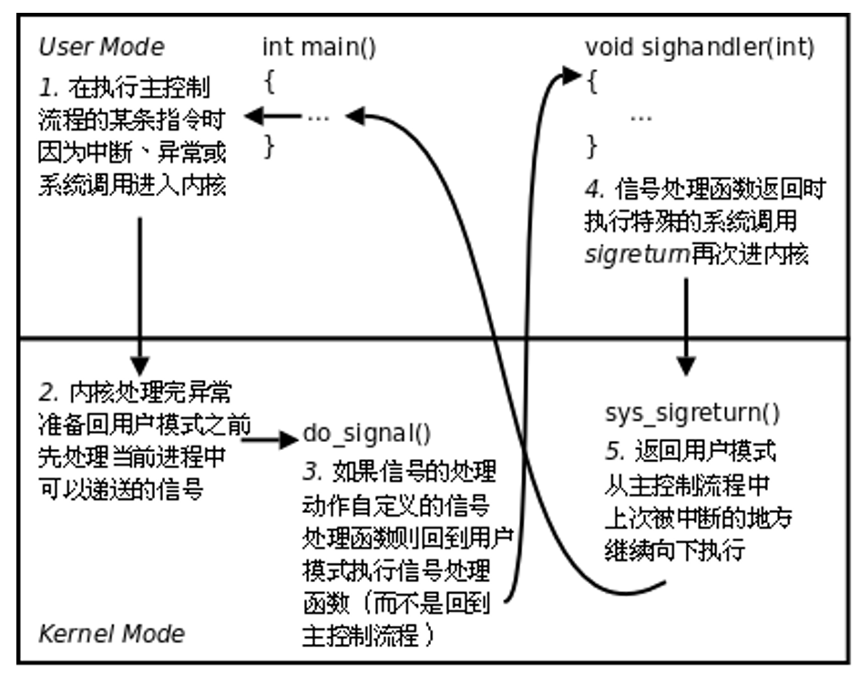

### 9.竞态条件(时序竞态)

#### pause函数

+ 调用该函数可以造成进程主动挂起，等待信号唤醒。调用该系统调用的进程将处于阻塞状态(主动放弃cpu) 直到有信号递达将其唤醒。

+ `int pause(void);`

  + 返回值：-1 并设置errno为EINTR

+ 返回值：

  + 如果信号的默认处理动作是终止进程，则进程终止，pause函数么有机会返回。

  + 如果信号的默认处理动作是忽略，进程继续处于挂起状态，pause函数不返回。

  + 如果信号的处理动作是捕捉，则【调用完信号处理函数之后，pause返回-1】errno设置为EINTR，表示“被信号中断”。

  + pause收到的信号不能被屏蔽，如果被屏蔽，那么pause就不能被唤醒。

+ pause函数实现sleep函数

  ```c
  #include <stdio.h>
  #include <signal.h>
  #include <unistd.h>
  
  /*所有信号处理函数的原型，都类此，
   *无返回值(void)，只有一个参数，表示信号编号*/
  void sig_alrm(int signo)
  {
  	/*用来占位，可以不做任何事,但这个函数存在
  	 *SIGALRM信号
  	 *就不执行默认动作终止进程，而做其它事情*/
  }
  
  unsigned int mysleep(unsigned int sec)
  {
  	struct sigaction act, old;
  	unsigned int unslept;			//保存未休眠够的时间
  
  	act.sa_handler = sig_alrm;
  	sigemptyset(&act.sa_mask);		//清空
  	act.sa_flags = 0;
  	sigaction(SIGALRM, &act, &old);	//注册信号处理函数sig_alrm
  									//同时要保存旧的处理方式
  
  	alarm(sec);						//设置sec秒闹钟
  	pause();			//进程阻塞,收到一个信号后,pause返回-1,解除阻塞
  
  	unslept = alarm(0);	//取消旧的定时器,将剩余时间保存
  	/*
  	 *正常情况下，闹钟到sec秒后发送SIGALRM信号，
  	 *pause函数收到信号，调用信号处理函数sig_alrm
  	 *pause函数返回，此时定时器已经到时，
  	 *执行unslept=alarm(0)不起作用，unslept为0
  	 
  	 *如果是异常情况下，定时器还没到sec秒，
  	 *pause函数被别的信号唤醒，需要将定时器取消
  	 *定时器返回剩余时间，也就是未休眠够的时间
  	 */
  
  	sigaction(SIGALRM, &old, NULL);	//恢复SIGALRM信号原来的处理方式
  	/*因为是在实现库函数,有可能用户之前设置过SIGALRM信号的处理方式*/
  
  	return unslept;
  }
  
  int main(void)
  {
  	while(1){
  		mysleep(5);
  		printf("Five seconds passed\n");
  	}
  
  	return 0;
  }
  
  ```

#### 时序竞态问题分析

回顾，借助pause和alarm实现的mysleep函数。设想如下时序：

1. 注册SIGALRM信号处理函数  （sigaction...)

2. 调用alarm(1) 函数设定闹钟1秒。

3. 函数调用刚结束，开始倒计时1秒。当前进程失去cpu，内核调度优先级高的进程(有多个)取代当前进程。当前进程无法获得cpu，进入就绪态等待cpu。

4. 1秒后，闹钟超时，内核向当前进程发送SIGALRM信号(自然定时法，与进程状态无关)，高优先级进程尚未执行完，当前进程仍处于就绪态，信号无法处理(未决)

5. 优先级高的进程执行完，当前进程获得cpu资源，内核调度回当前进程执行。SIGALRM信号递达，信号设置捕捉，执行处理函数sig_alarm。

6. 信号处理函数执行结束，返回当前进程主控流程，pause()被调用挂起等待。（欲等待alarm函数发送的SIGALRM信号将自己唤醒）

7. SIGALRM信号已经处理完毕，pause不会等到。

#### 解决时序问题

+ 可以通过设置屏蔽SIGALRM的方法来控制程序执行逻辑，但无论如何设置，程序都有可能在“解除信号屏蔽”与“挂起等待信号”这个两个操作间隙失去cpu资源。除非将这两步骤合并成一个“原子操作”。sigsuspend函数具备这个功能。在对时序要求严格的场合下都应该使用sigsuspend替换pause。     

+  `int sigsuspend(const sigset_t *mask);`  挂起等待信号。

+ sigsuspend函数调用期间，进程信号屏蔽字由其**参数mask**指定。

+ 可将某个信号（如SIGALRM）从临时信号屏蔽字mask中删除，这样在调用sigsuspend时将解除对该信号的屏蔽，然后挂起等待，当sigsuspend返回时，进程的信号屏蔽字恢复为原来的值。如果原来对该信号是屏蔽态，sigsuspend函数返回后仍然屏蔽该信号。

+ 改进版的mysleep

  ```c
  #include <unistd.h>
  #include <signal.h>
  #include <stdio.h>
  
  void sig_alrm(int signo)
  {
      /* nothing to do */
  }
  
  unsigned int mysleep(unsigned int nsecs)
  {
      struct sigaction newact, oldact;
      sigset_t newmask, oldmask, suspmask;
      unsigned int unslept;
  
      //1.为SIGALRM设置捕捉函数，一个空函数
      newact.sa_handler = sig_alrm;
      sigemptyset(&newact.sa_mask);
      newact.sa_flags = 0;
      sigaction(SIGALRM, &newact, &oldact);
  
      //2.设置阻塞信号集，阻塞SIGALRM信号
      sigemptyset(&newmask);
      sigaddset(&newmask, SIGALRM);
     sigprocmask(SIG_BLOCK, &newmask, &oldmask);   //信号屏蔽字 mask
  
      //3.定时n秒，到时后可以产生SIGALRM信号
      alarm(nsecs);
  
      /*4.构造一个调用sigsuspend临时有效的阻塞信号集，
       *  在临时阻塞信号集里解除SIGALRM的阻塞*/
      suspmask = oldmask;
      sigdelset(&suspmask, SIGALRM);
  
      /*5.sigsuspend调用期间，采用临时阻塞信号集suspmask替换原有阻塞信号集
       *  这个信号集中不包含SIGALRM信号,同时挂起等待，
       *  当sigsuspend被信号唤醒返回时，恢复原有的阻塞信号集*/
      sigsuspend(&suspmask); 
  
      unslept = alarm(0);
      //6.恢复SIGALRM原有的处理动作，呼应前面注释1
      sigaction(SIGALRM, &oldact, NULL);
  
      //7.解除对SIGALRM的阻塞，呼应前面注释2
      sigprocmask(SIG_SETMASK, &oldmask, NULL);
  
      return(unslept);
  }
  
  int main(void)
  {
      while(1){
          mysleep(2);
          printf("Two seconds passed\n");
      }
  
      return 0;
  }
  
  ```

#### 总结

+ 竞态条件，跟系统负载有很紧密的关系，体现出信号的不可靠性。系统负载越严重，信号不可靠性越强。

+  不可靠由其实现原理所致。信号是通过软件方式实现(跟内核调度高度依赖，延时性强)，每次系统调用结束后，或中断处理处理结束后，需通过扫描PCB中的未决信号集，来判断是否应处理某个信号。当系统负载过重时，会出现时序混乱。

+ 这种意外情况只能在编写程序过程中，提早预见，主动规避，而无法通过gdb程序调试等其他手段弥补。且由于该错误不具规律性，后期捕捉和重现十分困难。

#### 全局变量异步I/O

分析如下父子进程交替数数程序。当捕捉函数里面的sleep取消，程序即会出现问题。请分析原因。

```c
#include <stdio.h>
#include <signal.h>
#include <unistd.h>
#include <stdlib.h>

int n = 0, flag = 0;
void sys_err(char *str)
{
    perror(str);
    exit(1);
}
void do_sig_child(int num)
{
    printf("I am child  %d\t%d\n", getpid(), n);
    n += 2;
    flag = 1;
    sleep(1);
}
void do_sig_parent(int num)
{
    printf("I am parent %d\t%d\n", getpid(), n);
    n += 2;
    flag = 1;
    sleep(1);
}
int main(void)
{
    pid_t pid;
struct sigaction act;

    if ((pid = fork()) < 0)
        sys_err("fork");
    else if (pid > 0) {     
        n = 1;
        sleep(1);
        act.sa_handler = do_sig_parent;
        sigemptyset(&act.sa_mask);
        act.sa_flags = 0;
        sigaction(SIGUSR2, &act, NULL);             //注册自己的信号捕捉函数  父使用SIGUSR2信号
        do_sig_parent(0);						  
        while (1) {
            /* wait for signal */;
           if (flag == 1) {                         //父进程数数完成
                kill(pid, SIGUSR1);
                flag = 0;                        //标志已经给子进程发送完信号
            }
        }
    } else if (pid == 0) {       
        n = 2;
        act.sa_handler = do_sig_child;
        sigemptyset(&act.sa_mask);
        act.sa_flags = 0;
        sigaction(SIGUSR1, &act, NULL);

        while (1) {
            /* waiting for a signal */;
            if (flag == 1) {
                kill(getppid(), SIGUSR2);
                flag = 0;
            }
        }
    }
    return 0;
}			
```

+ 示例中，通过flag变量标记程序实行进度。flag置1表示数数完成。flag置0表示给对方发送信号完成。

+ 问题出现的位置，在父子进程kill函数之后需要紧接着调用 flag，将其置0，标记信号已经发送。但，在这期间很有可能被kernel调度，失去执行权利，而对方获取了执行时间，通过发送信号回调捕捉函数，从而修改了全局的flag。

+ 如何解决该问题呢？可以使用后续课程讲到的“锁”机制。当操作全局变量的时候，通过加锁、解锁来解决该问题。

#### 可/不可重入函数

+ 一个函数在被调用执行期间(尚未调用结束)，由于某种时序又被重复调用，称之为“重入”。根据函数实现的方法可分为“可重入函数”和“不可重入函数”两种。看如下时序。

  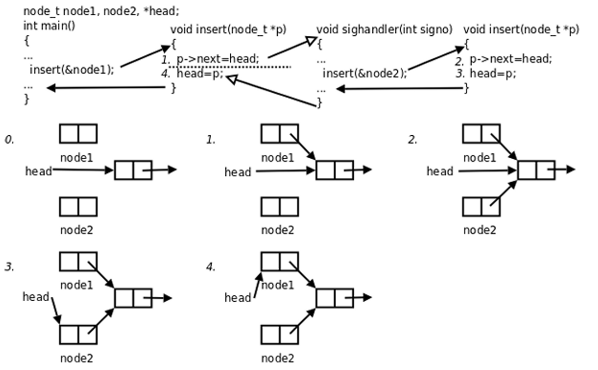

+ 显然，insert函数是不可重入函数，重入调用，会导致意外结果呈现。究其原因，是该函数内部实现使用了全局变量。

### 10.SIGCHLD信号

+ 子进程结束运行，其父进程会收到SIGCHLD信号。该信号的默认处理动作是忽略。可以捕捉该信号，在捕捉函数中完成子进程状态的回收。

+ 代码：

  ```c
  #include <stdio.h>
  #include <stdlib.h>
  #include <unistd.h>
  #include <sys/wait.h>
  #include <signal.h>
  
  void sys_err(char *str)
  {
      perror(str);
      exit(1);
  }
  void do_sig_child(int signo)
  {
      int status;    pid_t pid;
      while ((pid = waitpid(0, &status, WNOHANG)) > 0) {
          if (WIFEXITED(status))
              printf("child %d exit %d\n", pid, WEXITSTATUS(status));
          else if (WIFSIGNALED(status))
              printf("child %d cancel signal %d\n", pid, WTERMSIG(status));
      }
  }
  int main(void)
  {
      pid_t pid;    int i;
      for (i = 0; i < 10; i++) {
          if ((pid = fork()) == 0)
              break;
          else if (pid < 0)
              sys_err("fork");
      }
      if (pid == 0) {    
          int n = 1;
          while (n--) {
              printf("child ID %d\n", getpid());
              sleep(1);
          }
          return i+1;
      } else if (pid > 0) {
          struct sigaction act;
          act.sa_handler = do_sig_child;
          sigemptyset(&act.sa_mask);
          act.sa_flags = 0;
          sigaction(SIGCHLD, &act, NULL);
          
          while (1) {
              printf("Parent ID %d\n", getpid());
              sleep(1);
          }
      }
      return 0;
  }
  
  ```

+ 结合 17)SIGCHLD 信号默认动作，掌握父使用捕捉函数回收子进程的方式。

+ 代码

  ```c
  #include <stdio.h>
  #include <stdlib.h>
  #include <unistd.h>
  #include <errno.h>
  #include <sys/types.h>
  #include <sys/wait.h>
  #include <signal.h>
  
  void sys_err(char *str)
  {
      perror(str);
      exit(1);
  }
  
  void do_sig_child(int signo)
  {
      int status;
      pid_t pid;
  
  //    if ((pid = waitpid(0, &status, WNOHANG)) > 0) {
      while ((pid = waitpid(0, &status, WNOHANG)) > 0) {
          if (WIFEXITED(status))
              printf("------------child %d exit %d\n", pid, WEXITSTATUS(status));
          else if (WIFSIGNALED(status))
              printf("child %d cancel signal %d\n", pid, WTERMSIG(status));
      }
  }
  
  int main(void)
  {
      pid_t pid;
      int i;
      //阻塞SIGCHLD
      for (i = 0; i < 10; i++) {
          if ((pid = fork()) == 0)
              break;
          else if (pid < 0)
              sys_err("fork");
      }
  
      if (pid == 0) {     //10个子进程
          int n = 1;
          while (n--) {
              printf("child ID %d\n", getpid());
              sleep(1);
          }
          return i+1;
      } else if (pid > 0) {
          //SIGCHLD阻塞
          struct sigaction act;
  
          act.sa_handler = do_sig_child;
          sigemptyset(&act.sa_mask);
          act.sa_flags = 0;
          sigaction(SIGCHLD, &act, NULL);
          //解除对SIGCHLD的阻塞
          
          while (1) {
              printf("Parent ID %d\n", getpid());
              sleep(1);
          }
      }
      return 0;
  }
  ```

### 11.信号传参

#### 发送信号传参

+ sigqueue函数对应kill函数，但可在向指定进程发送信号的同时携带参数

+ `int sigqueue(pid_t pid, int sig, const union sigval value);`成功：0；失败：-1，设置errno

+ 结构体

  ```c
  union sigval {
                 int   sival_int;
                 void *sival_ptr;
             };
  ```

+ 向指定进程发送指定信号的同时，携带数据。但，如传地址，需注意，不同进程之间虚拟地址空间各自独立，将当前进程地址传递给另一进程没有实际意义。

#### 捕捉函数传参

+ int sigaction(int signum, const struct sigaction *act, struct sigaction *oldact);

+ 结构体：

  ```c
  struct sigaction {
       void     (*sa_handler)(int);
       void     (*sa_sigaction)(int, siginfo_t *, void *);
       sigset_t   sa_mask;
       int       sa_flags;
       void     (*sa_restorer)(void);
  };
  ```

### 12.中断系统调用

+ 系统调用可分为两类：慢速系统调用和其他系统调用。
  + 慢速系统调用：可能会使进程永远阻塞的一类。如果在阻塞期间收到一个信号，该系统调用就被中断,不再继续执行(早期)；也可以设定系统调用是否重启。如，read、write、pause、wait...
  +   其他系统调用：getpid、getppid、fork...

+ 结合pause，回顾慢速系统调用：
  +  慢速系统调用被中断的相关行为，实际上就是pause的行为： 如，read
    + 想中断pause，信号不能被屏蔽。
    + 信号的处理方式必须是捕捉 (默认、忽略都不可以)
    + 中断后返回-1， 设置errno为EINTR(表“被信号中断”)

+ 可修改sa_flags参数来设置被信号中断后系统调用是否重启。SA_INTERRURT不重启。 SA_RESTART重启。


## (七).守护进程

### 1.概念

+ Daemon(精灵)进程，是Linux中的后台服务进程，通常独立于控制终端并且周期性地执行某种任务或等待处理某些发生的事件。一般采用以d结尾的名字。

+ Linux后台的一些系统服务进程，没有控制终端，不能直接和用户交互。不受用户登录、注销的影响，一直在运行着，他们都是守护进程。如：预读入缓输出机制的实现；ftp服务器；nfs服务器等。

+ 创建守护进程，最关键的一步是调用setsid函数创建一个新的Session，并成为Session Leader。

### 2.创建守护进程模型

1. 创建子进程，父进程退出

所有工作在子进程中进行形式上脱离了控制终端

2. 在子进程中创建新会话

　　    setsid()函数

　　    使子进程完全独立出来，脱离控制

3. 改变当前目录为根目录

　　    chdir()函数

　　    防止占用可卸载的文件系统

　　    也可以换成其它路径

4. 重设文件权限掩码

　　    umask()函数

　　    防止继承的文件创建屏蔽字拒绝某些权限

　　    增加守护进程灵活性

5. 关闭文件描述符

　　    继承的打开文件不会用到，浪费系统资源，无法卸载

6. 开始执行守护进程核心工作
7. 守护进程退出处理程序模型       

---

## (八).线程

### 1.线程的概念

#### 什么是线程

+ LWP：light weight process 轻量级的进程，本质仍是进程(在Linux环境下)
+ 进程：独立地址空间，拥有PCB
+ 线程：也有PCB，但没有独立的地址空间(共享)
+ 区别：在于是否共享地址空间。    独居(进程)；合租(线程)。
+ Linux下：   线程：最小的执行单位。进程：最小分配资源单位，可看成是只有一个线程的进程。

#### Linux内核线程实现原理

类Unix系统中，早期是没有“线程”概念的，80年代才引入，借助进程机制实现出了线程的概念。因此在这类系统中，进程和线程关系密切。

1. 轻量级进程(light-weight process)，也有PCB，创建线程使用的底层函数和进程一样，都是clone

2. 从内核里看进程和线程是一样的，都有各自不同的PCB，但是PCB中指向内存资源的三级页表是相同的

3. 进程可以蜕变成线程

4. 线程可看做寄存器和栈的集合

 5. 在linux下，线程最是小的执行单位；进程是最小的分配资源单位

>  察看LWP号：ps –Lf pid 查看指定线程的lwp号。

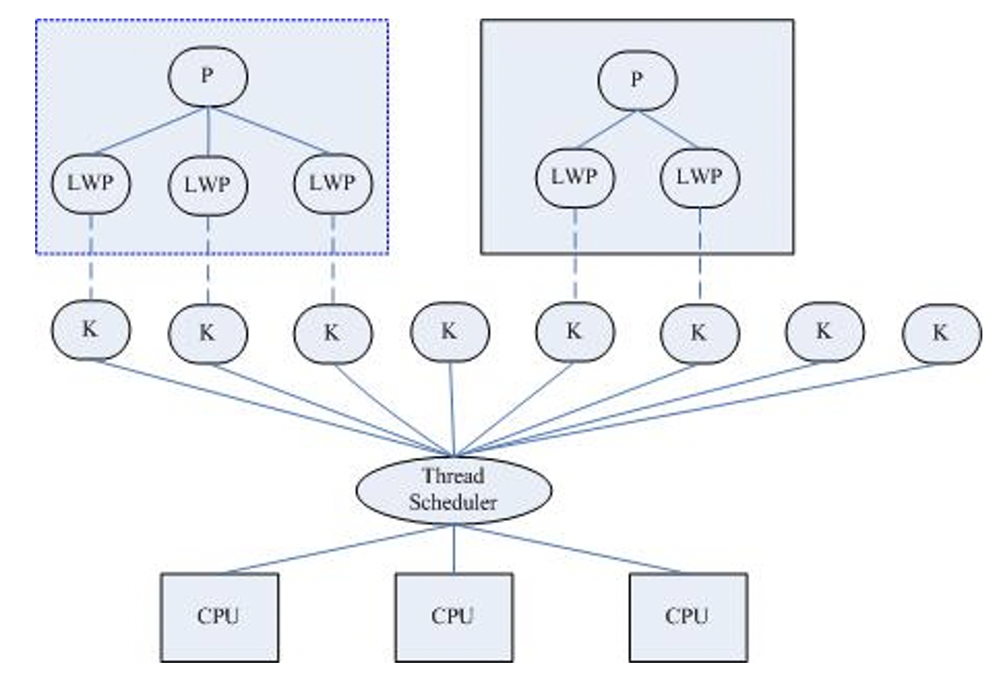

+ 三级映射：进程PCB --> 页目录(可看成数组，首地址位于PCB中) --> 页表 --> 物理页面 --> 内存单元
+ 对于进程来说，相同的地址(同一个虚拟地址)在不同的进程中，反复使用而不冲突。原因是他们虽虚拟址一样，但，页目录、页表、物理页面各不相同。相同的虚拟址，映射到不同的物理页面内存单元，最终访问不同的物理页面。
+ 但！线程不同！两个线程具有各自独立的PCB，但共享同一个页目录，也就共享同一个页表和物理页面。所以两个PCB共享一个地址空间。
+  实际上，无论是创建进程的fork，还是创建线程的pthread_create，底层实现都是调用同一个内核函数clone。
+ 如果复制对方的地址空间，那么就产出一个“进程”；如果共享对方的地址空间，就产生一个“线程”.
+  因此：Linux内核是不区分进程和线程的。只在用户层面上进行区分。所以，线程所有操作函数 pthread_* 是库函数，而非系统调用。

#### 线程共享资源

1. 文件描述符表

2. 每种信号的处理方式

 3.  当前工作目录

4. 用户ID和组ID

5. 内存地址空间 (.text/.data/.bss/heap/共享库)

#### 线程非共享资源

1. 线程id

2. 处理器现场和栈指针(内核栈)

3. 独立的栈空间(用户空间栈)

4. errno变量

5. 信号屏蔽字

6. 调度优先级

#### 线程优缺点

优点：  1. 提高程序并发性   2. 开销小   3. 数据通信、共享数据方便

缺点：  1. 库函数，不稳定   2. 调试、编写困难、gdb不支持    3. 对信号支持不好

优点相对突出，缺点均不是硬伤。Linux下由于实现方法导致进程、线程差别不是很大。

### 2.线程控制原语

#### pthread_self函数

+  **功能：**
  + 获取线程ID。其作用对应进程中 getpid() 函数。
+  **使用：**
  + `pthread_t pthread_self(void);`
  + 返回值：成功：0；   
  + 失败：无！
+ 线程ID：pthread_t类型，本质：在Linux下为无符号整数(%lu)，其他系统中可能是结构体实现
+ 线程ID是进程内部，识别标志。(两个进程间，线程ID允许相同)
+ 注意：不应使用全局变量 pthread_t tid，在子线程中通过pthread_create传出参数来获取线程ID，而应使用pthread_self。

#### pthread_create函数

+  **功能：**

  + 创建一个新线程。其作用，对应进程中fork() 函数。

+  **使用：**

  + `int pthread_create(pthread_t *thread, const pthread_attr_t *attr, void *(*start_routine) (void *), void *arg);`

  + 返回值：成功：0； 

  +  失败：错误号  

    > Linux环境下，所有线程特点，失败均直接返回错误号。

+ pthread_t：当前Linux中可理解为：`typedef unsigned long int pthread_t;`

+  **参数：**

  + 参数1：传出参数，保存系统为我们分配好的线程ID
  + 参数2：通常传NULL，表示使用线程默认属性。若想使用具体属性也可以修改该参数。
  + 参数3：函数指针，指向线程主函数(线程体)，该函数运行结束，则线程结束。
  + 参数4：线程主函数执行期间所使用的参数。

+ 在一个线程中调用pthread_create()创建新的线程后，当前线程从pthread_create()返回继续往下执行，而新的线程所执行的代码由我们传给pthread_create的函数指针start_routine决定。start_routine函数接收一个参数，是通过pthread_create的arg参数传递给它的，该参数的类型为void *，这个指针按什么类型解释由调用者自己定义。start_routine的返回值类型也是void *，这个指针的含义同样由调用者自己定义。start_routine返回时，这个线程就退出了，其它线程可以调用pthread_join得到start_routine的返回值，类似于父进程调用wait(2)得到子进程的退出状态，稍后详细介绍pthread_join。

+ pthread_create成功返回后，新创建的线程的id被填写到thread参数所指向的内存单元。我们知道进程id的类型是pid_t，每个进程的id在整个系统中是唯一的，调用getpid(2)可以获得当前进程的id，是一个正整数值。线程id的类型是thread_t，它只在当前进程中保证是唯一的，在不同的系统中thread_t这个类型有不同的实现，它可能是一个整数值，也可能是一个结构体，也可能是一个地址，所以不能简单地当成整数用printf打印，调用pthread_self(3)可以获得当前线程的id。

+ attr参数表示线程属性，本节不深入讨论线程属性，所有代码例子都传NULL给attr参数，表示线程属性取缺省值。

+ 例子：

  ```c
  #include <pthread.h>
  #include <stdio.h>
  #include <unistd.h>
  #include <stdlib.h>
  
  void *tfn(void *arg)
  {
  	int i;
  
  	i = (int)arg;
  	sleep(i);	 //通过i来区别每个线程
  	printf("I'm %dth thread, Thread_ID = %lu\n", i+1, pthread_self());
  
  	return NULL;
  }
  
  int main(int argc, char *argv[])
  {
  	int n = 5, i;
  	pthread_t tid;
  
  	if (argc == 2)
  		n = atoi(argv[1]);
  
  	for (i = 0; i < n; i++) {
  		pthread_create(&tid, NULL, tfn, (void *)i);
  		//将i转换为指针，在tfn中再强转回整形。
  	}
  	sleep(n);
  	printf("I am main, and I am not a process, I'm a thread!\n" 
  			"main_thread_ID = %lu\n", pthread_self());
  
  	return 0;
  }
  ```

  + 注意传参时，pthread_create函数参4修改为(void *)&i, 将线程主函数内改为 i=*((int *)arg) 是不可以的，这样会使i的值和main中主线程的一致。

#### pthread_exit函数

+  **功能：**
  + 将单个线程退出
+  **使用：**
  + `void pthread_exit(void *retval);  `
  + 参数：retval表示线程退出状态，通常传NULL
+ 线程环境中，应尽量少用，或者不使用exit函数，取而代之使用pthread_exit函数，将单个线程退出。任何线程里exit导致进程退出，其他线程未工作结束，主控线程退出时不能return或exit。
+ pthread_exit或者return返回的指针所指向的内存单元必须是全局的或者是用malloc分配的，不能在线程函数的栈上分配，因为当其它线程得到这个返回指针时线程函数已经退出了。

#### pthread_join函数

+  **功能：**
  + 阻塞等待线程退出，获取线程退出状态。其作用对应进程中 waitpid() 函数。
+  **使用：**
  + `int pthread_join(pthread_t thread, void **retval); `
  + 成功：0；失败：错误号

+  **参数：**

  + 参数：thread：线程ID （【注意】：不是指针）；retval：存储线程结束状态。

+ 对比记忆：

  + 进程中：main返回值、exit参数-->int；等待子进程结束 wait 函数参数-->int *

  + 线程中：线程主函数返回值、`pthread_exit-->void *`；等待线程结束 `pthread_join` 函数参数`-->void  **`

+ 调用该函数的线程将挂起等待，直到id为thread的线程终止。thread线程以不同的方法终止，通过pthread_join得到的终止状态是不同的，总结如下：

  + 如果thread线程通过return返回，retval所指向的单元里存放的是thread线程函数的返回值。
  + 如果thread线程被别的线程调用pthread_cancel异常终止掉，retval所指向的单元里存放的是常数PTHREAD_CANCELED。
  +  如果thread线程是自己调用pthread_exit终止的，retval所指向的单元存放的是传给pthread_exit的参数。
  + 如果对thread线程的终止状态不感兴趣，可以传NULL给retval参数。

+ 例子

  ```c
  #include <stdio.h>
  #include <string.h>
  #include <unistd.h>
  #include <stdlib.h>
  #include <pthread.h>
  
  typedef struct {
      char ch;
      int var;
      char str[64];
  } exit_t;
  
  void *thrd_func(void *arg)
  {
      exit_t *retvar = (exit_t *)arg;
  
      retvar->ch = 'm';
      retvar->var = 200;
      strcpy(retvar->str, "my thread");
  
      pthread_exit((void *)retvar);
  }
  
  int main(void)
  {
      pthread_t tid;
      int ret;
    	//分配空间创建
      exit_t *retval = malloc(sizeof(exit_t));
  		//创建线程
      ret = pthread_create(&tid, NULL, thrd_func, (void *)retval);
      if (ret != 0) {
          fprintf(stderr, "pthread_create error:%s\n", strerror(ret));
          exit(1);
      }
      pthread_join(tid, (void **)&retval);
      printf("ch = %c, var = %d, str = %s\n", retval->ch, retval->var, retval->str);
  		//回收空间
      free(retval);
      pthread_exit((void *)1);
  }
  ```

#### pthread_detach函数

+  **功能：**
  + 实现线程分离
+  **使用：**
  + `int pthread_detach(pthread_t thread);`
  +  成功：0；失败：错误号
+ 线程分离状态：指定该状态，线程主动与主控线程断开关系。线程结束后，其退出状态不由其他线程获取，而直接自己自动释放。网络、多线程服务器常用。
+  进程若有该机制，将不会产生僵尸进程。僵尸进程的产生主要由于进程死后，大部分资源被释放，一点残留资源仍存于系统中，导致内核认为该进程仍存在。

#### pthread_cancel函数

+  **功能：**
  + 杀死(取消)线程 。其作用对应进程中 kill() 函数。
+  **使用：**
  + `int pthread_cancel(pthread_t thread); `
  + 成功：0；失败：错误号
+  **注意事项：**
  + 线程的取消并不是实时的，而有一定的延时。 **<font color = red>需要等待线程到达某个取消点(检查点)。</font>**
+ 类似于玩游戏存档，必须到达指定的场所(存档点，如：客栈、仓库、城里等)才能存储进度。杀死线程也不是立刻就能完成，必须要到达取消点。
+ 取消点：是线程检查是否被取消，并按请求进行动作的一个位置。通常是一些系统调用creat，open，pause，close，read，write..... 执行命令man 7 pthreads可以查看具备这些取消点的系统调用列表。也可参阅 APUE.12.7 取消选项小节。
+ 可粗略认为一个系统调用(进入内核)即为一个取消点。 **如线程中没有取消点，可以通过调用pthread_testcancel函数自行设置一个取消点。**
+ 被取消的线程，  退出值定义在Linux的pthread库中。常数PTHREAD_CANCELED的值是-1。可在头文件pthread.h中找到它的定义：**#define PTHREAD_CANCELED ((void \*) -1)**。因此当我们对一个已经被取消的线程使用pthread_join回收时，得到的返回值为-1。

+ 例子：

  ```c
  #include <stdio.h>
  #include <unistd.h>
  #include <pthread.h>
  #include <stdlib.h>
  
  
  void *tfn1(void *arg)
  {
  	printf("thread 1 returning\n");
  
  	return (void *)111; 
  }
  
  void *tfn2(void *arg)
  {
  	printf("thread 2 exiting\n");
  	pthread_exit((void *)222);
  }
  
  void *tfn3(void *arg)
  {
  	while (1) {
  		//printf("thread 3: I'm going to die in 3 seconds ...\n");
  		//sleep(1);
  
  		pthread_testcancel();	//自己添加取消点*/
  	}
  
      return (void *)666;
  }
  
  int main(void)
  {
  	pthread_t tid;
  	void *tret = NULL;
  
  	pthread_create(&tid, NULL, tfn1, NULL);
  	pthread_join(tid, &tret);
  	printf("thread 1 exit code = %d\n\n", (int)tret);
  
  	pthread_create(&tid, NULL, tfn2, NULL);
  	pthread_join(tid, &tret);
  	printf("thread 2 exit code = %d\n\n", (int)tret);
  
  	pthread_create(&tid, NULL, tfn3, NULL);
  	sleep(3);
      pthread_cancel(tid);
  	pthread_join(tid, &tret);
  	printf("thread 3 exit code = %d\n", (int)tret);
  
  	return 0;
  }
  ```

  + 杀死线程可以再回收，但是分离之后就不能再回收了，分离已经等于回收过了。

#### 终止线程的方式

+ 总结：终止某个线程而不终止整个进程，有三种方法：

1. 从线程主函数return。这种方法对主控线程不适用，从main函数return相当于调用exit。

2. 一个线程可以调用pthread_cancel终止同一进程中的另一个线程。

3. 线程可以调用pthread_exit终止自己。

#### pthread_equal函数

+  **功能：**

  + 比较两个线程ID是否相等。

+  **使用：**

  + int pthread_equal(pthread_t t1, pthread_t t2);

    >  有可能Linux在未来线程ID pthread_t 类型被修改为结构体实现。

### 3.线程属性

#### 线程结构体

```c
typedef struct
{
    int 					etachstate; 	//线程的分离状态
    int 					schedpolicy; 	//线程调度策略
    struct sched_param	schedparam; 	//线程的调度参数
    int 					inheritsched; 	//线程的继承性
    int 					scope; 		//线程的作用域
    size_t 				guardsize; 	//线程栈末尾的警戒缓冲区大小
    int					stackaddr_set; //线程的栈设置
    void* 				stackaddr; 	//线程栈的位置
    size_t 				stacksize; 	//线程栈的大小
} pthread_attr_t; 
```

+ 主要结构体成员：

1. 线程分离状态

2. 线程栈大小（默认平均分配）

3. 线程栈警戒缓冲区大小（位于栈末尾）                    

+ 属性值不能直接设置，须使用相关函数进行操作，初始化的函数为pthread_attr_init，这个函数必须在pthread_create函数之前调用。之后须用pthread_attr_destroy函数来释放资源。

+ 线程属性主要包括如下属性：作用域（scope）、栈尺寸（stack size）、栈地址（stack address）、优先级（priority）、分离的状态（detached state）、调度策略和参数（scheduling policy and parameters）。默认的属性为非绑定、非分离、缺省的堆栈、与父进程同样级别的优先级。

#### 线程属性初始化

+ 注意：应先初始化线程属性，再pthread_create创建线程

+ 初始化线程属性
  + `int pthread_attr_init(pthread_attr_t *attr);`
  +  成功：0；失败：错误号

+ 销毁线程属性所占用的资源
  + `int pthread_attr_destroy(pthread_attr_t *attr); `
  + 成功：0；失败：错误号

#### 线程分离状态

+ 线程的分离状态决定一个线程以什么样的方式来终止自己。
  + 非分离状态：线程的默认属性是非分离状态，这种情况下，原有的线程等待创建的线程结束。只有当pthread_join()函数返回时，创建的线程才算终止，才能释放自己占用的系统资源。
  + 分离状态：分离线程没有被其他的线程所等待，自己运行结束了，线程也就终止了，马上释放系统资源。应该根据自己的需要，选择适当的分离状态。

+ 线程分离状态的函数：
  + 设置线程属性，分离or非分离
    + `int pthread_attr_setdetachstate(pthread_attr_t *attr, int detachstate); `
  + 获取程属性，分离or非分离
    + `int pthread_attr_getdetachstate(pthread_attr_t *attr, int *detachstate); `
  + 参数：
    + attr：已初始化的线程属性
    + detachstate： 
      + PTHREAD_CREATE_DETACHED（分离线程）
      + PTHREAD _CREATE_JOINABLE（非分离线程）
+ 这里要注意的一点是，如果设置一个线程为分离线程，而这个线程运行又非常快，它很可能在pthread_create函数返回之前就终止了，它终止以后就可能将线程号和系统资源移交给其他的线程使用，这样调用pthread_create的线程就得到了错误的线程号。要避免这种情况可以采取一定的同步措施，最简单的方法之一是可以在被创建的线程里调用pthread_cond_timedwait函数，让这个线程等待一会儿，留出足够的时间让函数pthread_create返回。设置一段等待时间，是在多线程编程里常用的方法。但是注意不要使用诸如wait()之类的函数，它们是使整个进程睡眠，并不能解决线程同步的问题。

#### 线程的栈地址

+ POSIX.1定义了两个常量_POSIX_THREAD_ATTR_STACKADDR 和_POSIX_THREAD_ATTR_STACKSIZE检测系统是否支持栈属性。也可以给sysconf函数传递_SC_THREAD_ATTR_STACKADDR或 _SC_THREAD_ATTR_STACKSIZE来进行检测。
+ 当进程栈地址空间不够用时，指定新建线程使用由malloc分配的空间作为自己的栈空间。通过pthread_attr_setstack和pthread_attr_getstack两个函数分别设置和获取线程的栈地址。
  + `int pthread_attr_setstack(pthread_attr_t *attr, void *stackaddr, size_t stacksize); `
    + 成功：0；失败：错误号
  + `int pthread_attr_getstack(pthread_attr_t *attr, void **stackaddr, size_t *stacksize);`
    + 成功：0；失败：错误号
  + 参数：
    + attr：指向一个线程属性的指针
    + stackaddr：返回获取的栈地址
    + stacksize：返回获取的栈大小

#### 线程的栈大小

+ 当系统中有很多线程时，可能需要减小每个线程栈的默认大小，防止进程的地址空间不够用，当线程调用的函数会分配很大的局部变量或者函数调用层次很深时，可能需要增大线程栈的默认大小。
+ 函数pthread_attr_getstacksize和 pthread_attr_setstacksize提供设置。
  + `int pthread_attr_setstacksize(pthread_attr_t *attr, size_t stacksize); `
    + 成功：0；失败：错误号
  + `int pthread_attr_getstacksize(pthread_attr_t *attr, size_t *stacksize);`
    +  成功：0；失败：错误号
  + 参数：
    + attr：指向一个线程属性的指针
    + stacksize：返回线程的堆栈大小

---

## (九).同步机制

### 1.同步


### 2.互斥量


### 3.读写锁


### 4.条件变量


### 5.信号量


### 6.进程间同步


### 7.哲学家吃饭问题


