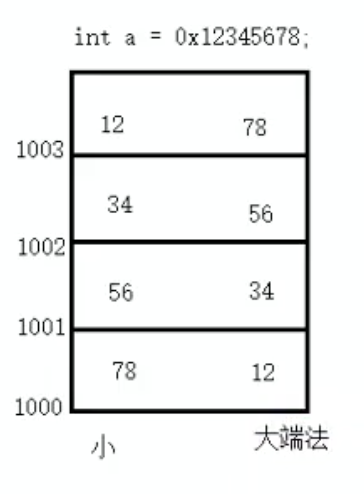
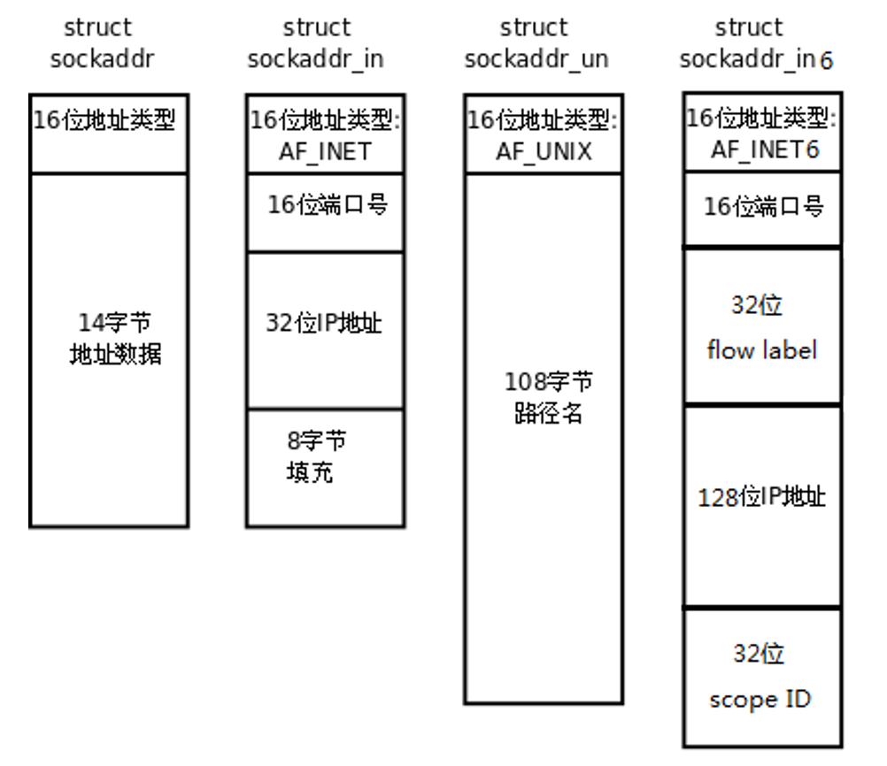
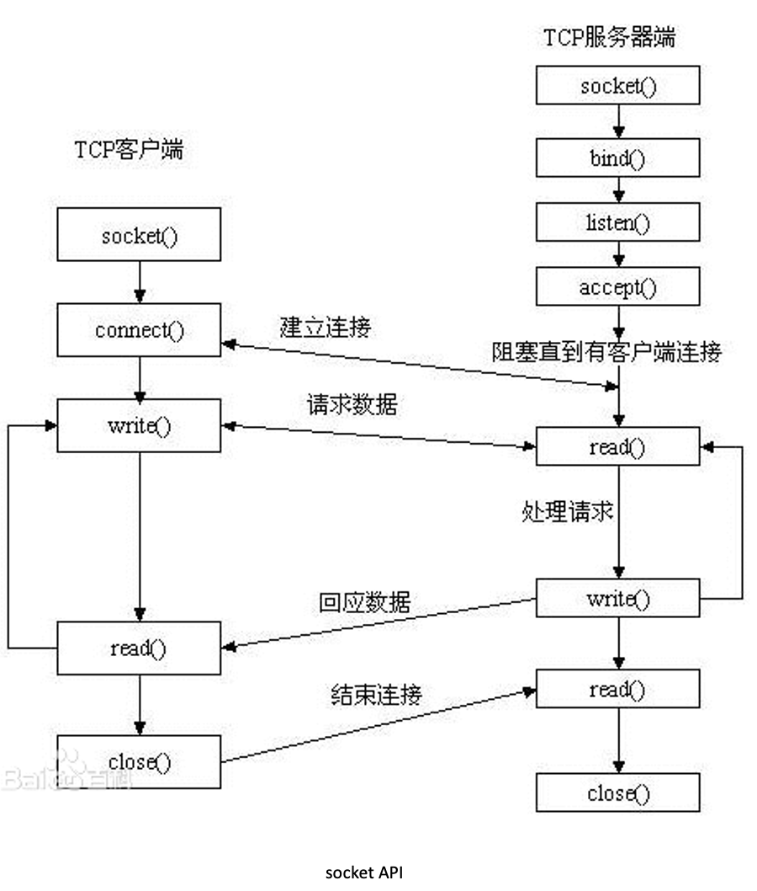

# 一.Linux网络编程

## (一).计算机网络概要


---

## (二).预备知识

### 1.网络字节序

内存中的多字节数据相对于内存地址有大端和小端之分，磁盘文件中的多字节数据相对于文件中的偏移地址也有大端小端之分。网络数据流同样有大端小端之分，那么如何定义网络数据流的地址呢？

发送主机通常将发送缓冲区中的数据按内存地址从低到高的顺序发出，接收主机把从网络上接到的字节依次保存在接收缓冲区中，也是按内存地址从低到高的顺序保存，因此，网络数据流的地址应这样规定： **<font color = red>先发出的数据是低地址，后发出的数据是高地址。(12为高位，78为低位)</font>**

<div align = "center">
  
</div>

**<font color = red>TCP/IP协议规定，网络数据流应采用大端字节序，计算机为小端存储，即低地址高字节。</font>**

> + 大端字节序：低地址存高位
> + 小端字节序：低地址存低位

例如UDP段格式，地址0-1是16位的源端口号，如果这个端口号是1000（0x3e8），则地址0是0x03，地址1是0xe8，也就是先发0x03，再发0xe8，这16位在发送主机的缓冲区中也应该是低地址存0x03，高地址存0xe8。但是，如果发送主机是小端字节序的，这16位被解释成0xe803，而不是1000。因此，发送主机把1000填到发送缓冲区之前需要做字节序的转换。同样地，接收主机如果是小端字节序的，接到16位的源端口号也要做字节序的转换。如果主机是大端字节序的，发送和接收都不需要做转换。同理，32位的IP地址也要考虑网络字节序和主机字节序的问题。

为使网络程序具有可移植性，使同样的C代码在大端和小端计算机上编译后都能正常运行，可以调用以下库函数做**网络字节序和主机字节序的转换**。

```c
#include <arpa/inet.h>

uint32_t htonl(uint32_t hostlong);
uint16_t htons(uint16_t hostshort);
uint32_t ntohl(uint32_t netlong);
uint16_t ntohs(uint16_t netshort);
```

>  h表示host，n表示network，l表示32位长整数，s表示16位短整数。
>
>  hton： **将数据从主机字节序转换成网络字节序**
>
>  ntoh： **将数据从网络字节序转换为主机字节序**

如果主机是小端字节序，这些函数将参数做相应的大小端转换然后返回，如果主机是大端字节序，这些函数不做转换，将参数原封不动地返回。

### 2.IP 地址转换函数

```c 
#include <arpa/inet.h>
//af确定ip类型
//src为源
//dst为目标，为传出参数
int inet_pton(int af, const char *src, void *dst);

//size为缓冲区大小
const char *inet_ntop(int af, const void *src, char *dst, socklen_t size);
```

+  **<font color = red>直接从点分十进制的ip地址转换为网络字节序</font>**
+  其中inet_pton和inet_ntop不仅可以转换IPv4的in_addr，还可以转换IPv6的in6_addr。
+ 因此函数接口是void *addrptr。
+ 成功返回1，如果src不包含表示指定地址族中有效网络地址的字符串，则返回0。 如果af不包含有效的地址族，则返回-1并将errno设置为EAFNOSUPPORT。

### 3.sockaddr数据结构

strcut sockaddr 很多网络编程函数诞生早于IPv4协议，那时候都使用的是sockaddr结构体,为了向前兼容，现在sockaddr退化成了（void *）的作用，传递一个地址给函数，至于这个函数是sockaddr_in还是sockaddr_in6，由地址族确定，然后函数内部再强制类型转化为所需的地址类型。

<div align = "center"></div>

+ sockaddr数据结构的结构体：

```c
struct sockaddr {
	sa_family_t sa_family; 		/* address family, AF_xxx */
	char sa_data[14];			/* 14 bytes of protocol address */
};
```

+ 使用 sudo grep -r "struct sockaddr_in {"  /usr 命令可查看到struct sockaddr_in结构体的定义。一般其默认的存储位置：/usr/include/linux/in.h 文件中。

  ```c
  struct sockaddr_in {
  	__kernel_sa_family_t sin_family; 			/* Address family */  	地址结构类型
  	__be16 sin_port;					 		/* Port number */		端口号
  	struct in_addr sin_addr;					/* Internet address */	IP地址
  	/* Pad to size of `struct sockaddr'. */
  	unsigned char __pad[__SOCK_SIZE__ - sizeof(short int) -
  	sizeof(unsigned short int) - sizeof(struct in_addr)];
  };
  
  struct in_addr {						/* Internet address. */
  	__be32 s_addr;
  };
  
  struct sockaddr_in6 {
  	unsigned short int sin6_family; 		/* AF_INET6 */
  	__be16 sin6_port; 					/* Transport layer port # */
  	__be32 sin6_flowinfo; 				/* IPv6 flow information */
  	struct in6_addr sin6_addr;			/* IPv6 address */
  	__u32 sin6_scope_id; 				/* scope id (new in RFC2553) */
  };
  
  struct in6_addr {
  	union {
  		__u8 u6_addr8[16];
  		__be16 u6_addr16[8];
  		__be32 u6_addr32[4];
  	} in6_u;
  	#define s6_addr 		in6_u.u6_addr8
  	#define s6_addr16 	in6_u.u6_addr16
  	#define s6_addr32	 	in6_u.u6_addr32
  };
  
  #define UNIX_PATH_MAX 108
  	struct sockaddr_un {
  	__kernel_sa_family_t sun_family; 	/* AF_UNIX */
  	char sun_path[UNIX_PATH_MAX]; 	/* pathname */
  };
  ```

+ Pv4和IPv6的地址格式定义在netinet/in.h中，IPv4地址用sockaddr_in结构体表示，包括16位端口号和32位IP地址，IPv6地址用sockaddr_in6结构体表示，包括16位端口号、128位IP地址和一些控制字段。

+ UNIX Domain Socket的地址格式定义在sys/un.h中，用sock-addr_un结构体表示。各种socket地址结构体的开头都是相同的，前16位表示整个结构体的长度（并不是所有UNIX的实现都有长度字段，如Linux就没有），后16位表示地址类型。IPv4、IPv6和Unix Domain Socket的地址类型分别定义为常数AF_INET、AF_INET6、AF_UNIX。这样，只要取得某种sockaddr结构体的首地址，不需要知道具体是哪种类型的sockaddr结构体，就可以根据地址类型字段确定结构体中的内容。

+ 因此，socket API可以接受各种类型的sockaddr结构体指针做参数，例如bind、accept、connect等函数，这些函数的参数应该设计成void *类型以便接受各种类型的指针，但是sock API的实现早于ANSI C标准化，那时还没有void *类型，因此这些函数的参数都用struct sockaddr *类型表示，在传递参数之前要强制类型转换一下，例如：

  ```c
  struct sockaddr_in servaddr;
  bind(listen_fd, (struct sockaddr *)&servaddr, sizeof(servaddr));		/* initialize servaddr */
  ```

---

## (三).Socket编程

### 1.网络套接字函数

#### socket函数

+ socket()打开一个网络通讯端口，如果成功的话，就像open()一样返回一个文件描述符，应用程序可以像读写文件一样用read/write在网络上收发数据，如果socket()调用出错则返回-1。

+ 对于IPv4，domain参数指定为AF_INET。对于TCP协议，type参数指定为SOCK_STREAM，表示面向流的传输协议。如果是UDP协议，则type参数指定为SOCK_DGRAM，表示面向数据报的传输协议。protocol参数的介绍从略，指定为0即可。

+ 头文件与函数调用

  ```c
  #include <sys/types.h> /* See NOTES */
  #include <sys/socket.h>
  int socket(int domain, int type, int protocol);
  ```

+ 参数内容与返回值：

  + domain:

    > 套接字中使用的协议族信息

    + AF_INET 这是大多数用来产生socket的协议，使用TCP或UDP来传输，用IPv4的地址
    + AF_INET6 与上面类似，不过是来用IPv6的地址
    + AF_UNIX 本地协议，使用在Unix和Linux系统上，一般都是当客户端和服务器在同一台及其上的时候使用

  + type:

    > 套接字数据传输类型信息

    +   SOCK_STREAM 面向连接的套接字。这个协议是按照顺序的、可靠的、数据完整的基于字节流的连接。这是一个使用最多的socket类型，这个socket是使用TCP来进行传输。
    + SOCK_DGRAM 面向消息的套接字。这个协议是无连接的、固定长度的传输调用。该协议是不可靠的，使用UDP来进行它的连接。
    + SOCK_SEQPACKET该协议是双线路的、可靠的连接，发送固定长度的数据包进行传输。必须把这个包完整的接受才能进行读取。
    + SOCK_RAW socket类型提供单一的网络访问，这个socket类型使用ICMP公共协议。（ping、traceroute使用该协议）
    + SOCK_RDM 这个类型是很少使用的，在大部分的操作系统上没有实现，它是提供给数据链路层使用，不保证数据包的顺序

  + protocol:

    > 计算机间通信中使用的协议标准
    >
    > 大部分情况下参数传递0，除非同一协议族中存在多个数据传输方式相同的协议。

    + 传0 表示使用默认协议。

  + 返回值：

    + 成功：返回指向新创建的socket的文件描述符，失败：返回-1，设置errno

#### bind 函数

+ 服务器程序所监听的网络地址和端口号通常是固定不变的，客户端程序得知服务器程序的地址和端口号后就可以向服务器发起连接，因此服务器需要调用bind绑定一个固定的网络地址和端口号。

+ **bind()的作用是将参数sockfd和addr绑定在一起，使sockfd这个用于网络通讯的文件描述符监听addr所描述的地址和端口号。** 

+ 头文件与函数调用：

  ```c
  #include <sys/types.h> /* See NOTES */
  #include <sys/socket.h>
  int bind(int sockfd, const struct sockaddr *addr, socklen_t addrlen);
  ```

+ 参数内容与返回值

  + sockfd：
    + socket文件描述符
  + addr:
    + 构造出IP地址加端口号
  + addrlen:
    + sizeof(addr)长度
  + 返回值：
    + 成功返回0，失败返回-1, 设置errno

+ 前面讲过，struct sockaddr *是一个通用指针类型，addr参数实际上可以接受多种协议的sockaddr结构体，而它们的长度各不相同，所以需要第三个参数addrlen指定结构体的长度。如：

  ```c
  struct sockaddr_in servaddr;
  bzero(&servaddr, sizeof(servaddr));
  servaddr.sin_family = AF_INET;
  servaddr.sin_addr.s_addr = htonl(INADDR_ANY);
  servaddr.sin_port = htons(6666);
  ```

  > 首先将整个结构体清零，然后设置地址类型为AF_INET，**网络地址为INADDR_ANY，这个宏表示本地的任意IP地址**，因为服务器可能有多个网卡，每个网卡也可能绑定多个IP地址，这样设置可以在所有的IP地址上监听，直到与某个客户端建立了连接时才确定下来到底用哪个IP地址，端口号为6666。

#### listen函数

+ 典型的服务器程序可以同时服务于多个客户端，当有客户端发起连接时，服务器调用的accept()返回并接受这个连接，如果有大量的客户端发起连接而服务器来不及处理，尚未accept的客户端就处于连接等待状态，listen()声明sockfd处于监听状态，并且最多允许有backlog个客户端处于连接待状态，如果接收到更多的连接请求就忽略。listen()成功返回0，失败返回-1。

+ 头文件与函数调用

  ```c
  #include <sys/types.h> /* See NOTES */
  #include <sys/socket.h>
  int listen(int sockfd, int backlog);
  ```

+ 参数内容

  + sockfd:
    + socket文件描述符

  + backlog：
    +  排队建立3次握手队列和刚刚建立3次握手队列的链接数和

+ 查看系统默认backlog

  ```bash
  cat /proc/sys/net/ipv4/tcp_max_syn_backlog
  ```

#### accept函数

+ 三方握手完成后，服务器调用accept()接受连接，如果服务器调用accept()时还没有客户端的连接请求，就阻塞等待直到有客户端连接上来。

+ addr是一个传出参数，accept()返回时传出客户端的地址和端口号。addrlen参数是一个传入传出参数（value-result argument），传入的是调用者提供的缓冲区addr的长度以避免缓冲区溢出问题，传出的是客户端地址结构体的实际长度（有可能没有占满调用者提供的缓冲区）。如果给addr参数传NULL，表示不关心客户端的地址。

+ 头文件与函数调用

  ```c
  #include <sys/types.h> 		/* See NOTES */
  #include <sys/socket.h>
  int accept(int sockfd, struct sockaddr *addr, socklen_t *addrlen);
  ```

+ 参数内容与返回值

  + sockdf:
    + socket文件描述符
  + addr:
    +  传出参数，返回链接客户端地址信息，含IP地址和端口号

  + addrlen:
    + 传入传出参数（值-结果）,传入sizeof(addr)大小，函数返回时返回真正接收到地址结构体的大小

  + 返回值：
    + 成功返回 **<font color = red>一个新的socket文件描述符</font>** ，用于和客户端通信，失败返回-1，设置errno

+ 服务器程序结构：

  ```c
  while (1) {
  	cliaddr_len = sizeof(cliaddr);
  	connfd = accept(listenfd, (struct sockaddr *)&cliaddr, &cliaddr_len);
  	n = read(connfd, buf, MAXLINE);
  	......
  	close(connfd);
  }
  ```

  > + 整个是一个while死循环，每次循环处理一个客户端连接。
  > + 由于cliaddr_len是传入传出参数，每次调用accept()之前应该重新赋初值。accept()的参数listenfd是先前的监听文件描述符，而accept()的返回值是另外一个文件描述符connfd，之后与客户端之间就通过这个connfd通讯，最后关闭connfd断开连接，而不关闭listenfd，再次回到循环开头listenfd仍然用作accept的参数。accept()成功返回一个文件描述符，出错返回-1。

#### connect 函数

+ 客户端需要调用connect()连接服务器，connect和bind的参数形式一致，区别在于bind的参数是自己的地址，而connect的参数是对方的地址。connect()成功返回0，出错返回-1。

+ 头文件与函数调用

  ```c
  #include <sys/types.h> 					/* See NOTES */
  #include <sys/socket.h>
  int connect(int sockfd, const struct sockaddr *addr, socklen_t addrlen);
  ```

+ 参数内容与返回值

  + sockdf:
    + socket文件描述符
  + addr:
    + 传入参数，指定服务器端地址信息，含IP地址和端口号
  + addrlen:
    + 传入参数,传入sizeof(addr)大小
  + 返回值：
    + 成功返回0，失败返回-1，设置errno

### 2.C/S模型—TCP

#### 创建流程

<div align = "center"></div>

+ **服务器端操作：**

  + 服务端首先调用socket函数，创建socket套接字。

  + 使用bind函数向套接字绑定ip地址与端口号

    > 此时初始化sockaddr_in结构体

  + 使用listen函数设置监听限定，设置最大同时发起连接数目

  + 使用accept函数等待用户发起链接，阻塞直到客户端建立连接

  + 客户端发起连接后，读客户端的请求数据

  + 处理请求，在accept函数中往回写

  + 最后读取到客户端关闭连接

  + 服务器端关闭连接

+ **客户端操作：**

  + 客户端调用socket函数，创建socket套接字。

  + 可以默认进行绑定端口号

    > 服务器端不能默认，因为客户端需要知道服务器端的端口号来进行通信，所以不能默认绑定

  + 使用connect函数连接到服务器端的IP与端口号

  + 使用write写数据给服务器端
  + 使用read从服务器端读数据
  + 关闭连接

#### 代码实现

+ server.c

  ```c
  #include <stdio.h>
  #include <unistd.h>
  #include <sys/types.h>
  #include <sys/socket.h>
  #include <strings.h>
  #include <string.h>
  #include <ctype.h>
  #include <arpa/inet.h>
  
  #define SERV_PORT 9527
  
  int main(void)
  {
      int sfd, cfd;
      int len, i;
      char buf[BUFSIZ], clie_IP[BUFSIZ];
  
      struct sockaddr_in serv_addr, clie_addr;
      socklen_t clie_addr_len;
  
      /*创建一个socket 指定IPv4协议族 TCP协议*/
      sfd = socket(AF_INET, SOCK_STREAM, 0);
  	if(sfd == -1) {
  		perror("socket error");
  		exit(1);
  	}
  
      /*初始化一个地址结构 man 7 ip 查看对应信息*/
      bzero(&serv_addr, sizeof(serv_addr));           //将整个结构体清零
      serv_addr.sin_family = AF_INET;                 //选择协议族为IPv4
      serv_addr.sin_addr.s_addr = htonl(INADDR_ANY);  //监听本地所有IP地址
      serv_addr.sin_port = htons(SERV_PORT);          //绑定端口号    
  
      /*绑定服务器地址结构*/
      if(bind(sfd, (struct sockaddr *)&serv_addr, sizeof(serv_addr)) == -1) {
  		perror("bind error");
  		exit(1);
  	}
  
      /*设定链接上限,注意此处不阻塞*/
      if(listen(sfd, 64) == -1) {
  		perror("listen error");
  		exit(1);
  	}                               //同一时刻允许向服务器发起链接请求的数量
  
      printf("wait for client connect ...\n");
  
      /*获取客户端地址结构大小*/ 
      clie_addr_len = sizeof(clie_addr_len);
      /*参数1是sfd; 参2传出参数, 参3传入传入参数, 全部是client端的参数*/
      cfd = accept(sfd, (struct sockaddr *)&clie_addr, &clie_addr_len);           /*监听客户端链接, 会阻塞*/
  	if(cfd == -1) {
  		perror("accept error");
  		exit(1);
  	}
  
      printf("client IP:%s\tport:%d\n", 
              inet_ntop(AF_INET, &clie_addr.sin_addr.s_addr, clie_IP, sizeof(clie_IP)), 
              ntohs(clie_addr.sin_port));
  
      while (1) {
          /*读取客户端发送数据*/
          len = read(cfd, buf, sizeof(buf));
          write(STDOUT_FILENO, buf, len);
  
          /*处理客户端数据*/
          for (i = 0; i < len; i++)
              buf[i] = toupper(buf[i]);
  
          /*处理完数据回写给客户端*/
          write(cfd, buf, len); 
      }
      /*关闭链接*/
      close(sfd);
      close(cfd);
      return 0;
  }
  ```

+ Client.c

  ```c
  #include <stdio.h>
  #include <unistd.h>
  #include <string.h>
  #include <sys/socket.h>
  #include <arpa/inet.h>
  
  #define SERV_IP "127.0.0.1"
  #define SERV_PORT 9527
  
  int main(void)
  {
      int sfd, len;
      struct sockaddr_in serv_addr;
      char buf[BUFSIZ]; 
  
      /*创建一个socket 指定IPv4 TCP*/
      sfd = socket(AF_INET, SOCK_STREAM, 0);
  
      /*初始化一个地址结构:*/
      bzero(&serv_addr, sizeof(serv_addr));                       //清零
      serv_addr.sin_family = AF_INET;                             //IPv4协议族
      inet_pton(AF_INET, SERV_IP, &serv_addr.sin_addr.s_addr);    //指定IP 字符串类型转换为网络字节序 参3:传出参数
      serv_addr.sin_port = htons(SERV_PORT);                      //指定端口 本地转网络字节序
  
      /*根据地址结构链接指定服务器进程*/
      connect(sfd, (struct sockaddr *)&serv_addr, sizeof(serv_addr));
  
      while (1) {
          /*从标准输入获取数据*/
          fgets(buf, sizeof(buf), stdin);
          /*将数据写给服务器*/
          write(sfd, buf, strlen(buf));       //写个服务器
          /*从服务器读回转换后数据*/
          len = read(sfd, buf, sizeof(buf));
          /*写至标准输出*/
          write(STDOUT_FILENO, buf, len);
      }
      /*关闭链接*/
      close(sfd);
      return 0;
  }
  ```
  
+ 注意事项：

  + 需要先关闭client，然后关闭server，不然端口号没有被安全释放。

#### 出错处理封装

为使错误处理的代码不影响主程序的可读性，把与socket相关的一些系统函数加上错误处理代码包装成新的函数，做成一个模块：

+ Wrap.h

  ```c
  #ifndef __WRAP_H_
  #define __WRAP_H_
  
  void perr_exit(const char *s);
  int Accept(int fd, struct sockaddr *sa, socklen_t *salenptr);
  int Bind(int fd, const struct sockaddr *sa, socklen_t salen);
  int Connect(int fd, const struct sockaddr *sa, socklen_t salen);
  int Listen(int fd, int backlog);
  int Socket(int family, int type, int protocol);
  ssize_t Read(int fd, void *ptr, size_t nbytes);
  ssize_t Write(int fd, const void *ptr, size_t nbytes);
  int Close(int fd);
  ssize_t Readn(int fd, void *vptr, size_t n);
  ssize_t Writen(int fd, const void *vptr, size_t n);
  ssize_t my_read(int fd, char *ptr);
  ssize_t Readline(int fd, void *vptr, size_t maxlen);
  
  #endif
  ```

+ Wrap.c

  ```c
  #include <stdlib.h>
  #include <stdio.h>
  #include <unistd.h>
  #include <errno.h>
  #include <sys/socket.h>
  
  void perr_exit(const char *s)
  {
  	perror(s);
  	exit(-1);
  }
  
  int Accept(int fd, struct sockaddr *sa, socklen_t *salenptr)
  {
  	int n;
  
  again:
  	if ((n = accept(fd, sa, salenptr)) < 0) {
  		if ((errno == ECONNABORTED) || (errno == EINTR))
  			goto again;
  		else
  			perr_exit("accept error");
  	}
  	return n;
  }
  
  int Bind(int fd, const struct sockaddr *sa, socklen_t salen)
  {
      int n;
  
  	if ((n = bind(fd, sa, salen)) < 0)
  		perr_exit("bind error");
  
      return n;
  }
  
  int Connect(int fd, const struct sockaddr *sa, socklen_t salen)
  {
      int n;
      n = connect(fd, sa, salen);
  	if (n < 0) {
  		perr_exit("connect error");
      }
  
      return n;
  }
  
  int Listen(int fd, int backlog)
  {
      int n;
  
  	if ((n = listen(fd, backlog)) < 0)
  		perr_exit("listen error");
  
      return n;
  }
  
  int Socket(int family, int type, int protocol)
  {
  	int n;
  
  	if ((n = socket(family, type, protocol)) < 0)
  		perr_exit("socket error");
  
  	return n;
  }
  
  ssize_t Read(int fd, void *ptr, size_t nbytes)
  {
  	ssize_t n;
  
  again:
  	if ( (n = read(fd, ptr, nbytes)) == -1) {
  		if (errno == EINTR)
  			goto again;
  		else
  			return -1;
  	}
  
  	return n;
  }
  
  ssize_t Write(int fd, const void *ptr, size_t nbytes)
  {
  	ssize_t n;
  
  again:
  	if ((n = write(fd, ptr, nbytes)) == -1) {
  		if (errno == EINTR)
  			goto again;
  		else
  			return -1;
  	}
  	return n;
  }
  
  int Close(int fd)
  {
      int n;
  	if ((n = close(fd)) == -1)
  		perr_exit("close error");
  
      return n;
  }
  
  /*参三: 应该读取的字节数*/                          //socket 4096  readn(cfd, buf, 4096)   nleft = 4096-1500
  ssize_t Readn(int fd, void *vptr, size_t n)
  {
  	size_t  nleft;              //usigned int 剩余未读取的字节数
  	ssize_t nread;              //int 实际读到的字节数
  	char   *ptr;
  
  	ptr = vptr;
  	nleft = n;                  //n 未读取字节数
  
  	while (nleft > 0) {
  		if ((nread = read(fd, ptr, nleft)) < 0) {
  			if (errno == EINTR)
  				nread = 0;
  			else
  				return -1;
  		} else if (nread == 0)
  			break;
  
  		nleft -= nread;   //nleft = nleft - nread 
  		ptr += nread;
  	}
  	return n - nleft;
  }
  
  ssize_t Writen(int fd, const void *vptr, size_t n)
  {
  	size_t nleft;
  	ssize_t nwritten;
  	const char *ptr;
  
  	ptr = vptr;
  	nleft = n;
  	while (nleft > 0) {
  		if ( (nwritten = write(fd, ptr, nleft)) <= 0) {
  			if (nwritten < 0 && errno == EINTR)
  				nwritten = 0;
  			else
  				return -1;
  		}
  		nleft -= nwritten;
  		ptr += nwritten;
  	}
  	return n;
  }
  
  static ssize_t my_read(int fd, char *ptr)
  {
  	static int read_cnt;
  	static char *read_ptr;
  	static char read_buf[100];
  
  	if (read_cnt <= 0) {
  again:
  		if ( (read_cnt = read(fd, read_buf, sizeof(read_buf))) < 0) {   //"hello\n"
  			if (errno == EINTR)
  				goto again;
  			return -1;
  		} else if (read_cnt == 0)
  			return 0;
  
  		read_ptr = read_buf;
  	}
  	read_cnt--;
  	*ptr = *read_ptr++;
  
  	return 1;
  }
  
  /*readline --- fgets*/    
  //传出参数 vptr
  ssize_t Readline(int fd, void *vptr, size_t maxlen)
  {
  	ssize_t n, rc;
  	char    c, *ptr;
  	ptr = vptr;
  
  	for (n = 1; n < maxlen; n++) {
  		if ((rc = my_read(fd, &c)) == 1) {   //ptr[] = hello\n
  			*ptr++ = c;
  			if (c == '\n')
  				break;
  		} else if (rc == 0) {
  			*ptr = 0;
  			return n-1;
  		} else
  			return -1;
  	}
  	*ptr = 0;
  
  	return n;
  }
  ```

+ 封装后的server.c

  ```c
  #include <stdio.h>
  #include <unistd.h>
  #include <sys/types.h>
  #include <sys/socket.h>
  #include <strings.h>
  #include <string.h>
  #include <ctype.h>
  #include <arpa/inet.h>
  
  #include "wrap.h"
  
  #define SERV_PORT 6666
  
  int main(void)
  {
      int sfd, cfd;
      int len, i;
      char buf[BUFSIZ], clie_IP[BUFSIZ];
  
      struct sockaddr_in serv_addr, clie_addr;
      socklen_t clie_addr_len;
  
      sfd = Socket(AF_INET, SOCK_STREAM, 0);
  
      bzero(&serv_addr, sizeof(serv_addr));           
      serv_addr.sin_family = AF_INET;                 
      serv_addr.sin_addr.s_addr = htonl(INADDR_ANY);  
      serv_addr.sin_port = htons(SERV_PORT);          
  
      Bind(sfd, (struct sockaddr *)&serv_addr, sizeof(serv_addr));
  
      Listen(sfd, 2);                                
  
      printf("wait for client connect ...\n");
  
      clie_addr_len = sizeof(clie_addr_len);
      cfd = Accept(sfd, (struct sockaddr *)&clie_addr, &clie_addr_len);
      printf("cfd = ----%d\n", cfd);
  
      printf("client IP: %s  port:%d\n", 
              inet_ntop(AF_INET, &clie_addr.sin_addr.s_addr, clie_IP, sizeof(clie_IP)), 
              ntohs(clie_addr.sin_port));
  
      while (1) {
          len = Read(cfd, buf, sizeof(buf));
          Write(STDOUT_FILENO, buf, len);
  
          for (i = 0; i < len; i++)
              buf[i] = toupper(buf[i]);
          Write(cfd, buf, len); 
      }
  
      Close(sfd);
      Close(cfd);
  
      return 0;
  }
  ```

+ 封装后的client.c

  ```c
  #include <stdio.h>
  #include <unistd.h>
  #include <string.h>
  #include <sys/socket.h>
  #include <arpa/inet.h>
  
  #include "wrap.h"
  
  #define SERV_IP "127.0.0.1"
  #define SERV_PORT 6666
  
  int main(void)
  {
      int sfd, len;
      struct sockaddr_in serv_addr;
      char buf[BUFSIZ]; 
  
      sfd = Socket(AF_INET, SOCK_STREAM, 0);
  
      bzero(&serv_addr, sizeof(serv_addr));                       
      serv_addr.sin_family = AF_INET;                             
      inet_pton(AF_INET, SERV_IP, &serv_addr.sin_addr.s_addr);    
      serv_addr.sin_port = htons(SERV_PORT);                      
  
      Connect(sfd, (struct sockaddr *)&serv_addr, sizeof(serv_addr));
  
      while (1) {
          fgets(buf, sizeof(buf), stdin);
          int r = Write(sfd, buf, strlen(buf));       
          printf("Write r ======== %d\n", r);
          len = Read(sfd, buf, sizeof(buf));
          printf("Read len ========= %d\n", len);
          Write(STDOUT_FILENO, buf, len);
      }
  
      Close(sfd);
  
      return 0;
  }
  ```

+ makefile

  ```makefile
  src = $(wildcard *.c)
  obj = $(patsubst %.c, %.o, $(src))
  
  all: server client
  
  server: server.o wrap.o
  	gcc server.o wrap.o -o server -Wall
  client: client.o wrap.o
  	gcc client.o wrap.o -o client -Wall
  
  %.o:%.c
  	gcc -c $< -Wall
  
  .PHONY: clean all
  clean: 
  	-rm -rf server client $(obj)
  ```


