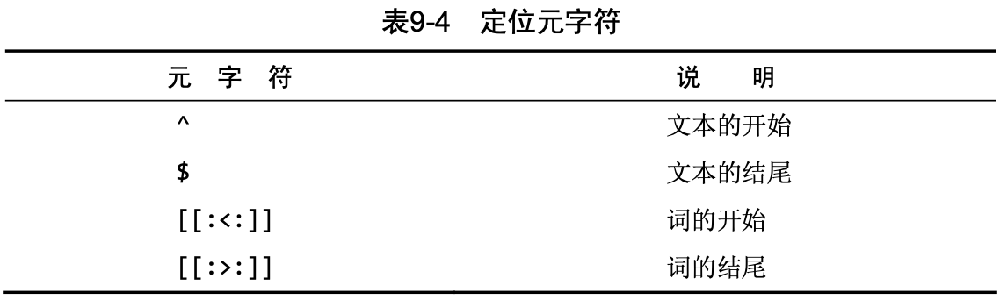

# 一.基本概念

## (一).数据库基础

### 1.什么是数据库

+  **数据库（database）** 是一个以某种有组织的方式存储的数据集合。是保存有组织的数据的容器(通常是一个文件或一组文件)。

+  **表（table）** 是一种结构化的文件，可用来存储某种特定类型的数据。是某种特定类型数据的结构化清单。
+  **列（column）**  是表中的一个字段。所有表都是由一个或多个列组成的。
+  **数据类型（datatype）** 所容许的数据的类型。每个表列都有相应的数据类型，它限制(或容许)该列中存储的数据。
+  **行（row）** 表中的一个记录。表中的数据是按行存储的，所保存的每个记录存储在自己的行内。
+  **主键（primary key）** 一列(或一组列)，其值能够唯一区分表中每个行。

### 2.什么是MySQL

+ 数据的所有存储、 检索、管理和处理实际上是由数据库软件—— **DBMS(数据库管理系统)** 完成的。MySQL是一种DBMS，即它是一种数据库软件

+ DBMS可分为两类：

  + 基于共享文件系统的DBMS

    + 用于桌面用途，通常不用于高端或更关键的应用(如Microsoft Access和FileMaker)。

  + 基于客户机—服务器的DBMS

    + 服务器负责数据访问和处理的一个软件。这个软件运行在称为数据库服务器的计算机上。
    + 客户机是与用户打交道的软件。

    > 客户机软件通过网络提交该请求给服务器软件。服务器软件处理这个请求，根据需要过滤、丢弃和排序数据；然后把结果送回到你的客户机软件。

# 二.基本操作

## (一).链接

+ `SHOW COLUMNS` 对表的每个字段返回一行，行中包含字段名、数据类型、是否允许NULL、键信息、默认值以及其他信息(如字段的auto_increment)。

  ```sql
  SHOW COLUMNS FROM costomers;
  ```

+ `SHOW STATUS` 用于显示广泛的服务器状态信息;

+ `SHOW CREATE DATABASE` 和 `SHOW CREATE TABLE` 用来显示创建特定数据库或表的MySQ语句;

+ `SHOW GRANTS` 用来显示授予用户(所有用户或特定用户)的安全权限;

+ `SHOW ERRORS` 和 `SHOW WARNINGS` 用来显示服务器错误或警告消息。

---

## (二).创建数据表

### 1.创建表

为利用CREATE TABLE创建表，必须给出下列信息:

+ 新表的名字，在关键字CREATE TABLE之后给出; 
+ 表列的名字和定义，用逗号分隔。

```sql
CREATE TABLE customers
(
  cust_id      int       NOT NULL AUTO_INCREMENT,
  cust_name    char(50)  NOT NULL ,
  cust_address char(50)  NULL ,
  cust_city    char(50)  NULL ,
  cust_state   char(5)   NULL ,
  cust_zip     char(10)  NULL ,
  cust_country char(50)  NULL ,
  cust_contact char(50)  NULL ,
  cust_email   char(255) NULL ,
  PRIMARY KEY (cust_id)
) ENGINE=InnoDB;
```

### 2.更新表

为更新表定义，可使用ALTER TABLE语句。但是，理想状态下，当表 中存储数据以后，该表就不应该再被更新。在表的设计过程中需要花费 大量时间来考虑，以便后期不对该表进行大的改动。

为了使用ALTER TABLE更改表结构，必须给出下面的信息:

+ 在ALTER TABLE之后给出要更改的表名(该表必须存在，否则将出错);
+ 所做更改的列表。

```sql
ALTER TABLE vendors
ADD venf_phone CHAR(20);
```

ALTER TABLE的一种常见用途是定义外键。下面是用来定义本书中的表所用的外键的代码:

```sql
ALTER TABLE products ADD CONSTRAINT fk_products_vendors FOREIGN KEY (vend_id) REFERENCES vendors (vend_id);
```

### 3.删除表

删除表(删除整个表而不是其内容)非常简单，使用DROP TABLE语句即可:

```sql
DROP TABLE customers;
```

### 4.重命名表

使用RENAME TABLE语句可以重命名一个表:

```sql
RENAME TABLE customer2 TO customer;
```

---

## (三).数据操作

### 1.插入数据

使用INSERT进行操作

```sql
INSERT INTO vendors(vend_id, vend_name, vend_address, vend_city, vend_state, vend_zip, vend_country)
VALUES(1001,'Anvils R Us','123 Main Street','Southfield','MI','48075', 'USA');
```

### 2. 更新数据

为了更新(修改)表中的数据，可使用UPDATE语句。可采用两种方式使用UPDATE:

+ 更新表中特定行; 
+ 更新表中所有行。

基本的 UPDATE语句由3部分组成，分别是:

+ 要更新的表;
+ 列名和它们的新值
+ 确定要更新行的过滤条件

```sql
UPDATE customers
SET cust_email = 'elmer@qq.com'
WHERE cust_id = 1005;
```

为了删除某个列的值，可设置它为NULL(假如表定义允许NULL值)。如下进行:

```sql
UPDATE customers
SET cust_email = 'NULL'
WHERE cust_id = 1005;
```

其中NULL用来去除cust_email列中的值。

### 3.删除数据

为了从一个表中删除(去掉)数据，使用DELETE语句。可以两种方式使用DELETE:

+ 从表中删除特定的行; 
+ 从表中删除所有行。

```sql
DELETE FROM customers 
WHERE cust_id = 10006;
```

+ 如果想从表中删除所有行，不要使用DELETE。 可使用TRUNCATE TABLE语句，它完成相同的工作，但速度更快
+ TRUNCATE实际是删除原来的表并重新创建一个表，而不是逐行删除表中的数据

## (四).检索语句

### 1.select语句

```sql
SELECT COLUMN_1, COLUMN_2 FROM tablename;		  			#检索多行
SELECT * FROM tablename;														#检索全部行
#进行限制，返回唯一值
SELECT DISTINCT COLUMN_1 FROM FROM tablename;				#返回不同(唯一)的COLUMN_1
#返回特定的行
SELECT COLUMN_1, COLUMN_2 FROM tablename LIMIT 5; 	#返回结果不多于5行。
SELECT COLUMN_1, COLUMN_2 FROM tablename LIMIT 4,5;	#返回从行4开始的5行(第一行为行0，类似于数组)
#使用完全限定的表名
SELECT tablename.COLUMN_1 FROM databasename.tablename;
```

> + `DISTINCT` 关键字进行限制返回的值唯一
> + `LIMIT` 关键字进行限制返回的起始行与行数

### 2.进行排序

```sql
#将返回的行以 COLUMN_1 进行升序排序（默认升序）
SELECT COLUMN_1, COLUMN_2 FROM tablename ORDER BY COLUMN_1;
#将返回的行以 COLUMN_1 进行降序排序
SELECT COLUMN_1, COLUMN_2 FROM tablename ORDER BY COLUMN_1 DESC;
```

> + `ORDER BY` 字句进行升序排序
>
> + `DESC` 修饰排序为降序； `ASC` 为升序
> + 使用 `ORDER BY` 和 `LIMIT` 进行组合时，保证 `LIMIT` 在后面

### 3.过滤数据

SELECT语句中，数据根据WHERE子句指定的搜索条件进行过滤。 在同时使用 `ORDERBY` 和 `WHERE` 子句时，应该让 `ORDER BY` 位于 `WHERE` 之后，否则将会产生错误。

<div align = "center"></div>

```sql
SELECT COLUMN_1, COLUMN_2 FROM tablename WHERE COLUMN_1 BETWEEN A AND B;
```

#### 空值检查

+ 在创建表时可以指定其中的列是否可以不包含值。在一个列不包含值时，称其为包含空值NULL。
+ NULL 无值(no value)，与字段包含0、空字符串或仅仅包含空格不同。

```sql
SELECT COLUMN_1, COLUMN_2 FROM tablename WHERE COLUMN_1 IS NULL;
```

### 4.数据过滤

> MySQL允许给出多个WHERE子句：以AND子句的方式或OR子句的方式使用。

#### (1).AND操作符

为了通过不止一个列进行过滤，可使用AND操作符给WHERE子句附加条件。

```sql
SELECT prod_id, prod_price, prod_name
FROM products
WHERE vend_id = 1003 AND prod_price <= 10;
```

#### (2).OR操作符

OR操作符与AND操作符不同，它指示MySQL检索匹配任一条件的行。

```sql
SELECT prod_id, prod_price, prod_name
FROM products
WHERE vend_id = 1003 OR vend_id = 1002;
```

其中 AND 的计算次序比 OR 优先级更高。

```sql
SELECT prod_id, prod_price, prod_name
FROM products
WHERE vend_id = 1003 OR vend_id = 1002 AND prod_price >= 10;
```

理解为 1003制造的价格为10美元(含)以上的产品，或者1002制造的任何产品， 而不管其价格如何。 **此问题的解决方法是使用圆括号明确地分组相应的操作符。**

```sql
SELECT prod_id, prod_price, prod_name
FROM products
WHERE (vend_id = 1003 OR vend_id = 1002) AND prod_price >= 10;
```

#### (3).IN操作符

IN操作符用来指定条件范围，范围中的每个条件都可以进行匹配。

```sql
SELECT prod_id, prod_price, prod_name
FROM products
WHERE vend_id IN (1002,1003)
ORDER BY prod_name;
```

+ IN的最大优点是可以包含其他SELECT语句，使得能够更动态地建立WHERE子句
+ IN操作符的语法更清楚且更直观。计算的次序更容易管理
+ IN操作符一般比OR操作符清单执行更快。

#### (4).NOT操作符

WHERE子句中的NOT操作符有且只有一个功能，那就是否定它之后所跟的任何条件。

```sql
SELECT prod_id, prod_price, prod_name
FROM products
WHERE vend_id NOT IN (1002,1003)
ORDER BY prod_name;
```

>  MySQL不是匹配1002和1003的vend_id，而是匹配1002和1003之外供应商的 vend_id。

### 5. 用通配符与LIKE进行过滤

> +  **通配符(wildcard)**  用来匹配值的一部分的特殊字符。 
> +  **搜索模式(search pattern)** 由字面值、通配符或两者组合构成的搜索条件。

LIKE 指示MySQL后跟的搜索模式利用通配符匹配而不是直接相等匹配进行比较。

#### (1).百分号(%)通配符

%表示任何字符出现任意次数。

```sql
SELECT prod_id, prod_price, prod_name
FROM products
WHERE pro_name LIKE 'jet%';	#找出所有以词jet起头的产品
```

> + 搜索可以是区分大小写的。如果区分大小写，'jet%' 与JetPack将不匹配
> + 尾空格可能会干扰通配符匹配。例如在保存词 anvil时，如果后面有一个或多个空格，则子句``WHERE prod_name LIKE '%anvil' `不会匹配它们，因为在最后的`l  `后有多余的字符。

通配符可在搜索模式中任意位置使用，并且可以使用多个通配符。

```sql
SELECT prod_id, prod_price, prod_name
FROM products
WHERE pro_name LIKE '%anvil%';
```

> 虽然似乎%通配符可以匹配任何东西，除了NULL。即使是WHERE prod_name LIKE '%'也不能匹配用值NULL作为产品名的行。

#### (2).下划线(_)通配符

下划线的用途与%一样，但下划线只匹配单个字符而不是多个字符。

```sql
SELECT prod_id, prod_price, prod_name
FROM products
WHERE pro_name LIKE '_ to anvil';
```

#### (3).通配符的使用代价

通配 符搜索的处理一般要比前面讨论的其他搜索所花时间更长。

+ 不要过度使用通配符。如果其他操作符能达到相同的目的，应该使用其他操作符。
+ 在确实需要使用通配符时，除非绝对有必要，否则不要用在搜索模式的开始处。把通配符置于搜索模式的开始处，搜索起来是最慢的。

### 6.正则表达式

MySQL 用 WHERE 子句指定正则表达式过滤SELECT检索出的数据。

#### (1).使用REGEXP

##### 基本字符匹配

```sql
SELECT prod_id, prod_price, prod_name
FROM products
WHERE pro_name REGEXP '1000'
ORDER BY pro_name;
```

这条语句非常像使用LIKE。REGEXP后所跟的东西作为正则表达式(与文字正文1000匹配)处理

##### 与LIKE的区别

+ LIKE匹配整个列。如果被匹配的文本在列值 中出现，LIKE将不会找到它，相应的行也不被返回（除非使用通配符）。
+ REGEXP在列值内进行匹配，如果被匹配的文本在列值中出现，REGEXP将会找到它，相应的行将被返回。 

<div align = "center"></div>

##### 区分大小写

MySQL中的正则表达式匹配不区分大小写。为区分大小写，可使用 **BINARY** 关键字，如：

```sql
WHERE prod_name REGEXP BINARY 'JetPack .000';
```

#### (2).进行OR匹配

为搜索两个串之一(或者为这个串，或者为另一个串)，使用`|`。

```sql
SELECT prod_id, prod_price, prod_name
FROM products
WHERE pro_name REGEXP '1000 | 2000'
ORDER BY pro_name;
```

使用 `|` 从功能上类似于在SELECT语句中使用OR语句，多个OR条件可并入单个正则表达式。

#### (3).匹配几个字符之一

匹配特定的字符可通过指定  `[]`  括起来的字符来完成，如下所示:

```sql
SELECT prod_id, prod_price, prod_name
FROM products
WHERE pro_name REGEXP '[123] Ton'
ORDER BY pro_name;
```

+ `[123]`  定义一组字符，它的意思是匹配1或2或3，因此表中的 1 ton和2 ton都匹配且返回
+ 字符集合也可以被否定，为否定一个字符集，在集合的开始处放置一个 `^` 即可。

#### (4).匹配范围

简化类型集合，可使用 `-` 来定义一个范围。

```sql
SELECT prod_id, prod_price, prod_name
FROM products
WHERE pro_name REGEXP '[1-5] Ton'
ORDER BY pro_name;
```

#### (5).匹配特殊字符

为了匹配特殊字符，必须用 `\\` 为前导。`\\-` 表示查找 `-` ，`\\.`表示查找 `.`

```sql
SELECT vend_name
FROM vendors
WHERE vend_name REGEXP '\\.'
ORDER BY vend_name;
```

<div align = "center"></div>

> MySQL要求两个反斜杠(MySQL 自己解释一个，正则表达式库解释另一个)

#### (6).匹配字符类

存在找出你自己经常使用的数字、所有字母字符或所有数字字母字符等的匹配。为更方便工作，可以使用预定义的字符集，称为字符类(character class)。

<div align = "center"></div>

#### (7).匹配多个实例

需要寻找所有的数，不管数中包含多少数字，或者你可能想寻找一个单词并且还能够适应一个尾 随的s(如果存在)，等等。这可以用下表列出的正则表达式重复元字符来完成。

<div align = "center"></div>

```sql
SELECT vend_name
FROM vendors
WHERE vend_name REGEXP '\\([0-9] sticks?\\)'
ORDER BY vend_name;
```

`\\`(匹配)，[0-9]匹配任意数字(这个例子中为1和5)，sticks?匹配stick 和sticks(s后的?使s可选，因为?匹配它前面的任何字符的0次或1次出现)，\\)匹配)。没有?，匹配stick和sticks会非常困难。

```sql
SELECT vend_name
FROM vendors
WHERE vend_name REGEXP '[[:digit:]]{4}'
ORDER BY vend_name;
```

[:digit:]匹配任意数字。{4}确切地要求它前面的字符出现4次，所以匹配连在一起的任意4位数字。

#### (8).定位符

匹配特定位置的文本，需要使用下表列出的定位符。

<div align = "center"></div>

```sql
SELECT vend_name
FROM vendors
WHERE vend_name REGEXP '^[0-9\\.]'
ORDER BY vend_name;
```

`^[0-9\\.]`只在.或任意数字为串中第一个字符时才匹配它们。

> ^有两种用法。在集合中(用[和]定义)，用它 来否定该集合，否则，用来指串的开始处。

### 7.创建计算字段

#### (1).拼接

+  **字段(field)**  基本上与列(column)的意思相同，经常互换使用，不过数据库列一般称为列，而术语字段通常用在计算字段的 连接上。
+  **拼接(concatenate)**  将值联结到一起构成单个值。

```sql
SELECT Concat(vend_name, '(', vend_country, ')')
FROM vendors
ORDER BY vend_name;
```

Concat()拼接串，即把多个串连接起来形成一个较长的串。

#### (2).使用别名

别名(alias)是一个字段或值 的替换名。别名用AS关键字赋予。

```sql
SELECT Concat(RTrim(vend_name), '(', RTrim(vend_country), ')') AS vend_title
FROM vendors
ORDER BY vend_name;
```

语句中跟了`AS vend_title`，指示SQL创建一个包含指定计算的名为vend_title的计算字段。

#### (3).执行算术计算

MySQL支持下表中列出的基本算术操作符。此外，圆括号可用来区分优先顺序。

<div align = "center"></div>

---

### 8.数据处理函数

#### (1).文本处理函数

+ 如字符转换为大写函数

```sql
SELECT vend_name, Upper(vend_name) AS vend_name_upcase
FROM vendors
ORDER BY vend_name;
```

常见的文本处理函数如下表：


SOUNDEX是一个将任何文本串转换为描述其语音表示的字母数字模式的算法。SOUNDEX考虑了类似 的发音字符和音节，使得能对串进行发音比较而不是字母比较。

#### (2).日期和时间处理函数

下表列出了某些常用的日期和时间处理函数。


不管是插入或更新表值还是用WHERE子句进行过滤，日期必须为 格式yyyy-mm-dd。

进行查询时仅将给出的日期与列中的日期部分进行比较，而不是将给出的日期与整个列值进行比较。

```sql
SELECT cust_id, order_num
FROM orders
WHERE Data(order_data) = '2005-09-10';
```

也可以使用 Year 与 Month 函数来查询年份与月数。

#### (3).数值处理函数

下表列出一些常用的数值处理函数。


### 9.汇总数据

#### (1).聚集函数

+  **聚集函数(aggregate function)**  运行在行组上，计算和返回单 个值的函数。

MySQL给出了5个聚集函数，见下表。 这些函数能进行上述罗列的检索。


##### AVG函数

+ AVG()通过对表中行数计数并计算特定列值之和，求得该列的平均值。

```sql
SELECT AVG(prod_price) AS avg_price
FROM products
WHERE vend_id = 1003;
```

##### COUNT函数

+ COUNT()函数进行计数。可利用COUNT()确定表中行的数目或符合特定条件的行的数目。

  + 使用COUNT(*)对表中行的数目进行计数，不管表列中包含的是空 值(NULL)还是非空值。

    使用COUNT(column)对特定列中具有值的行进行计数，忽略 NULL值

```sql
SELECT COUNT(*) AS num_cust
FROM customers;
```

##### MAX函数

+ MAX()返回指定列中的最大值。

```sql
SELECT MAX(prod_price) AS max_price
FROM products;
```

##### MIN 函数

+ MIN()返回指定列的最小值。

```sql
SELECT MIN(prod_price) AS min_price
FROM products;
```

##### SUM函数

+ SUM()用来返回指定列值的和(总计)。

```sql
SELECT SUM(quantity) AS items_ordered
FROM orderitems
WHERE order_num = 20005;
```

#### (2).聚集不同的值

+ 对所有的行执行计算，指定ALL参数或不给参数(因为ALL是默认行为);
+ 只包含不同的值，指定DISTINCT参数。
  + DISTINCT只能用于COUNT()。DISTINCT 不能用于COUNT(*)，因此不允许使用COUNT(DISTINCT)， 否则会产生错误。

```sql
SELECT AVG(DISTINCT prod_price) AS avg_price
FROM products
WHERE vend_id = 1003;
```

> + 使用AVG()函数返回特定供应商提供的产品的平均价格。使用AVG()函数返回特定供应商提供的产品的平均价格。

#### (3).组合聚集函数

```sql
SELECT COUNT(*) AS nums_items
			 MIN(prod_price) AS price_min
			 MAX(prod_price) AS price_max
			 AVG(prod_price) AS price_avg
FROM products;
```

---

### 10.分组数据

分组允许把数据分为多个逻辑组，以便能对每个组进行聚集计算。

#### (1).创建分组(Group By)

分组是在SELECT语句的GROUP BY子句中建立的。

```sql
SELECT vend_id, COUNT(*) AS num_prods
FROM products
GROUP BY vend_id;
```

`GROUP BY` 子句指示MySQL按vend_id排序并分组数据。这导致对每个vend_id而不是整个表计算num_prods一次。

注意事项：

+ GROUP BY子句可以包含任意数目的列。这使得能对分组进行嵌套， 为数据分组提供更细致的控制。
+ 如果在GROUP BY子句中嵌套了分组，数据将在最后规定的分组上进行汇总
+ GROUP BY子句中列出的每个列都必须是检索列或有效的表达式
+ 除聚集计算语句外，SELECT语句中的每个列都必须在GROUP BY子 句中给出。
+  GROUP BY子句必须出现在WHERE子句之后，ORDER BY子句之前。

#### (2).过滤分组(Having)

+ WHERE没有分组的概念。MYSQL提供HAVING子句。目前为止所学过的所有类型的WHERE子句都可以用HAVING来替代。唯一的差别是 WHERE过滤行，而HAVING过滤分组。

```sql
SELECT cust_id, COUNT(*) AS orders
FROM orders
GROUP BY cust_id
HAVING COUNT(*) >= 2;
```

#### (3).分组和排序

虽然GROUP BY和ORDER BY经常完成相同的工作，但它们是非常不同的。


```sql
SELECT order_num, SUM(quantity*item_price) AS ordertotal
FROM orderitems
GROUP BY order_num
HAVING SUM(quantity*item_price)>= 50
ORDER BY ordertotal;
```

#### (4).SELECT 子句顺序

下表以在SELECT语句中 使用时必须遵循的次序，列出迄今为止所学过的子句


----

### 11.使用子查询

#### (1).使用子查询进行过滤

在SELECT语句中，子查询总是从内向外处理。

```sql
SELECT cust_id
FROM orders
WHERE order_num IN 
(SELECT order_num FROM orderitems WHERE prod_id = 'TNT');
```

+ WHERE子句中使用子查询，应该保证SELECT语句具有与WHERE子句中相同数目的列。

#### (2).作为计算字段使用子查询

任何时候只要列名可能有多义性，就必须使用表名和列名由一个句点分隔。

```sql
SELECT cust_name, cust_state (SELECT COUNT(*) FROM orders WHERE orders.cust_id = customers.cust_id) AS orders 
FROM customers
ORDER BY cust_name;
```

---

### 12.联结表

#### (1).创建联结

分解数据为多个表能更有效地存储，更方便地处理，有更大的可伸缩性。但这些好处是有代价的。如果数据存储在多个表中，利用联结就可以用单条SELECT语句检索出数据

```sql
SELECT vend_name, prod_name, prod_price
FROM vendors, products
WHERE vendors.vend_id = products.vend_id
ORDER BY vend_name, prod_name;
```

>  在引用的列可能出现二义性时，必须使用完全限定列名(用一个点分隔的表名和列名)。

**笛卡儿积(cartesian product)**  由没有联结条件的表关系返回的结果为笛卡儿积。检索出的行的数目将是第一个表中的行数乘以第二个表中的行数。

#### (2).内部联结

上面使用的联结称为等值联结(equijoin)，它基于两个表之间的相等测试。这种联结也称为内部联结。

对于这种联结可以使用稍微不同的语法来明确指定联结的类型。

```sql
SELECT vend_name, prod_name, prod_price
FROM vendors INNER JOIN products
ON vendors.vend_id = products.vend_id;
```

量个表之间的关系是FROM子句的组成部分，以INNER JOIN指定。在使用这种语法时，联结条件用特定的ON子句而不是WHERE 子句给出。

#### (3).联结多个表

SQL对一条SELECT语句中可以联结的表的数目没有限制。创建联结的基本规则也相同。首先列出所有表，然后定义表之间的关系。

```sql
SELECT prod_name, vend_name, prod_price, quantity
FROM orderitems, products, vendors
WHERE products.vend_id = vendors.vend_id
AND orderitems.prod_id = products.prod_id
AND order_num = 20005;
```

---

### 13.创建高级联结

#### (1).使用表别名

SQL还允许给表名起别名。这样做有两个主要理由:

+ 缩短SQL语句;
+ 允许在单条SELECT语句中多次使用相同的表。

```sql
SELECT cust_name, cust_contact
FROM customers AS c, orders AS o, orderitems AS oi
WHERE c.cust_id = o.cust_id
AND oi.order_num = o.order_num
AND prod_id = 'TNT';
```

#### (2).使用不同的联结

##### 自联结

```sql
SELECT p1.prod_id, p1.prod_name
FROM products AS p1, products AS p2
WHERE p1.vend_id = p2.vend_id
AND p2.prod_id = 'DTNTR';
```

自联结通常作为外部语句用来替代从相同表中检索数据时使用的子查询语句。虽然最终的结果是相同的，但有时候处理联结远比处理子查询快得多。

##### 自然联结

标准的联结(前一章中介绍的内部联结)返回所有数据，甚 至相同的列多次出现。自然联结排除多次出现，使每个列只返回一次。 

```sql
SELECT c.*,o.order_num,o.order_data,oi.prod_id, oi.quantity,OI.item_price
FROM customer AS C, orders AS o, orderitems AS oi
WHERE c.cust_id = o.cust_id
AND oi.order_num = o.order_num
AND prod_id = 'FB';
```

##### 外部联结

联结包含了那些在相关表中没有关联行的行。这种类型的联结称为外部联结。

```sql
SELECT customers.cust_id, orders.order_num
FROM customers LEFT OUTER JOIN orders
ON customers.cust_id = orders.cust_id;
```

外部联结还包括没 有关联行的行。在使用OUTER JOIN语法时，必须使用RIGHT或LEFT关键字 指定包括其所有行的表(RIGHT指出的是OUTER JOIN右边的表，而LEFT 指出的是OUTER JOIN左边的表)。上面的例子使用LEFT OUTER JOIN从FROM 子句的左边表(customers表)中选择所有行。

> 存在两种基本的外部联结形式:左外部联结 和右外部联结。它们之间的唯一差别是所关联的表的顺序不 同。

#### (3).带聚集函数的联结

```sql
SELECT customer.cust_name,customers.cust_id,COUNT(orders.order_num) AS num_ord
FROM customers INNER JOIN orders
ON customers.cust_id = orders.cust_id
GROUP BY customer.cust_id;
```

此SELECT语句使用INNER JOIN将customers和orders表互相关联。GROUP BY子句按客户分组数据，因此，函数调用COUNT (orders.order_num)对每个客户的订单计数，将它作为num_ord返回。

#### (4).使用联结与联结条件

+ 注意所使用的联结类型。一般使用内部联结，但使用外部联结也是有效的。
+ 保证使用正确的联结条件，否则将返回不正确的数据。
+ 应该总是提供联结条件，否则会得出笛卡儿积。
+ 在一个联结中可以包含多个表，甚至对于每个联结可以采用不同的联结类型。虽然这样做是合法的，一般也很有用，但应该在一 起测试它们前，分别测试每个联结。这将使故障排除更为简单。

---

### 14.组合查询

MySQL也允许执行多个查询(多条SELECT语句)，并将结果作为单个查询结果集返回。这些组合查询通常称为并(union)或复合查询(compound query)。

有两种基本情况，其中需要使用组合查询:

+ 在单个查询中从不同的表返回类似结构的数据; 
+ 对单个表执行多个查询，按单个查询返回数据。

#### (1).使用UNION与UNION ALL

+ UNION必须由两条或两条以上的SELECT语句组成，语句之间用关键字UNION分隔
+ UNION中的每个查询必须包含相同的列、表达式或聚集函数(不过各个列不需要以相同的次序列出)。
+ 列数据类型必须兼容:类型不必完全相同，但必须是DBMS可以隐含地转换的类型(例如，不同的数值类型或不同的日期类型)。

UNION从查询结果集中自动去除了重复的行(换句话说，它的行为与单条SELECT语句中使用多个WHERE子句条件一样)

UNION ALL，MySQL不取消重复的行。

```sql
SELECT vend_id, prod_id, prod_price
FROM products
WHERE prod_price <= 5
UNION
SELECT vend_id, prod_id, prod_price
FROM products
WHERE vend_id IN (1000,2000)
ORDER BY vend_id, prod_price;
```


### 15.全文本搜索

为了进行全文本搜索，必须索引被搜索的列，而且要随着数据的改 变不断地重新索引。在对表列进行适当设计后，MySQL会自动进行所有 的索引和重新索引。

在索引之后，SELECT可与Match()和Against()一起使用以实际执行 搜索。

#### (1).启动全文本搜索支持

一般在创建表时启用全文本搜索。CREATE TABLE语句接受FULLTEXT子句，它给出被索引列的一个逗号分隔的列表。

```sql
CREATE TABLE productnotes
(
  note_id    int           NOT NULL AUTO_INCREMENT,
  prod_id    char(10)      NOT NULL,
  note_date datetime       NOT NULL,
  note_text  text          NULL ,
  PRIMARY KEY(note_id),
  FULLTEXT(note_text) #启动全文本搜索支持
) ENGINE=MyISAM;
```

#### (2).进行全文本搜索

在索引之后，使用两个函数Match()和Against()执行全文本搜索，

+ Match()指定被搜索的列
+ Against()指定要使用的搜索表达式。

```sql
SELECT note_text
FROM productnotes
WHERE Match(note_text) Against('rabbit');
```

。Match(note_text)指示MySQL针对指定的 列进行搜索，Against('rabbit')指定词rabbit作为搜索文本。返回有包含词rabbit的行内容。

#### (3).使用查询拓展

查询扩展用来设法放宽所返回的全文本搜索结果的范围。查询扩展用来设法放宽所返回的全文本搜索结果的范围。

+ 首先，进行一个基本的全文本搜索，找出与搜索条件匹配的所有行;
+ 其次，MySQL检查这些匹配行并选择所有有用的词(解释MySQL如何断定什么有用，什么无用)。

+ 再其次，MySQL再次进行全文本搜索，这次不仅使用原来的条件， 而且还使用所有有用的词。

利用查询扩展，能找出可能相关的结果，即使它们并不精确包含所查找的词。

```sql
SELECT note_text
FROM productnotes
WHERE Match(note_text) Against('anvils' WITH QUERY EXPANSION);
```

#### (4).布尔文本搜索

MySQL支持全文本搜索的另外一种形式，称为布尔方式(boolean mode)。以布尔方式，可以提供关于如下内容的细节:

+ 要匹配的词;
+  要排斥的词(如果某行包含这个词，则不返回该行，即使它包含其他指定的词也是如此);
+ 排列提示(指定某些词比其他词更重要，更重要的词等级更高);  表达式分组;
+ 另外一些内容。

```sql
SELECT note_text
FROM productnotes
WHERE Match(note_text) Against('anvils' IN BOOLEAN MODE);
```


搜索匹配包含词 rabbit 与 bait 的行

```sql
SELECT note_text
FROM productnotes
WHERE Match(note_text) Against('+rabit +bait' IN BOOLEAN MODE);
```

搜索匹配包含词 rabbit 与 bait 中的至少一个词就行

```sql
SELECT note_text
FROM productnotes
WHERE Match(note_text) Against('rabit bait' IN BOOLEAN MODE);
```

搜索匹配短语 rabbit  bait 而不是匹配两个词rabbit和bait

```sql
SELECT note_text
FROM productnotes
WHERE Match(note_text) Against('"rabit bait"' IN BOOLEAN MODE);
```

搜索匹配rabbit和carrot，增加前者的等级，降低后者的等级

```sql
SELECT note_text
FROM productnotes
WHERE Match(note_text) Against('>rabit <bait' IN BOOLEAN MODE);
```

搜索匹配包含词 safe与 combination ，降低后者的等级

```sql
SELECT note_text
FROM productnotes
WHERE Match(note_text) Against('+safe +(<combination)' IN BOOLEAN MODE);
```

#### (5).全文本搜索的使用说明

+  在索引全文本数据时，短词被忽略且从索引中排除。短词定义为那些具有3个或3个以下字符的词(如果需要，这个数目可以更改)。
+ MySQL带有一个内建的非用词(stopword)列表，这些词在索引全文本数据时总是被忽略。如果需要，可以覆盖这个列表。
+ MySQL规定了一条50%规则，如果一个词出现在50%以上 的行中，则将它作为一个非用词忽略。50%规则不用于IN BOOLEAN MODE。
+ 如果表中的行数少于3行，则全文本搜索不返回结果(因为每个词 或者不出现，或者至少出现在50%的行中)。
+ 忽略词中的单引号。例如，don't索引为dont。
+ 不具有词分隔符(包括日语和汉语)的语言不能恰当地返回全文本搜索结果。
+ 如前所述，仅在MyISAM数据库引擎中支持全文本搜索。

---

## (五).使用视图(VIEW)

### 1.基本介绍

视图（View）是一种虚拟存在的表。它并不在数据库中实际存在，行和列数据来自定义视图的查询中使用的表，并且是在使用视图时动态生成的。

通俗的讲，视图是一条SELECT语句执行后返回的结果集。所以在创建视图时，主要工作落在创建SQL查询语句上。

视图相对于普通的表的优势主要包括以下几项：

-  **简单：** 使用视图时不需要关心后面对应的表的结构、关联条件和筛选条件，这是过滤好的复合条件的结果集。
-  **安全**： 使用视图时只能访问被允许查询的结果集，对表的权限管理并不能限制到某个行某个列，但是通过视图就可以简单的实现。
-  **数据独立：** 一旦视图的结构确定了，可以屏蔽表结构变化对用户的影响，源表增加列对视图没有影响；源表修改列名，则可以通过修改视图来解决，不会造成对访问者的影响。

视图（View）是一种虚拟存在的表。它并不在数据库中实际存在，行和列数据来自定义视图的查询中使用的表，并且是在使用视图时动态生成的。

通俗的讲，视图是一条SELECT语句执行后返回的结果集。所以在创建视图时，主要工作落在创建SQL查询语句上。

视图相对于普通的表的优势主要包括以下几项：

-  **简单：** 使用视图时不需要关心后面对应的表的结构、关联条件和筛选条件，这是过滤好的复合条件的结果集。
-  **安全**： 使用视图时只能访问被允许查询的结果集，对表的权限管理并不能限制到某个行某个列，但是通过视图就可以简单的实现。
-  **数据独立：** 一旦视图的结构确定了，可以屏蔽表结构变化对用户的影响，源表增加列对视图没有影响；源表修改列名，则可以通过修改视图来解决，不会造成对访问者的影响。

### 2. 创建或者修改视图

创建视图的语法为：

```mysql
CREATE [OR REPLACE] [ALGORITHM = {UNDEFINED | MERGE | TEMPTABLE}]
VIEW view_name [(column_list)]
AS select_statement
[WITH [CASCADED | LOCAL] CHECK OPTION]
```

示例：

```mysql
create or replace view city_country_view 
as 
select t.*,c.country_name from country c , city t where c.country_id = t.country_id;
```

<div align = center></div>

修改视图的语法为：

```mysql
ALTER [ALGORITHM = {UNDEFINED | MERGE | TEMPTABLE}]

VIEW view_name [(column_list)]

AS select_statement

[WITH [CASCADED | LOCAL] CHECK OPTION]
```

选项 : 

```mysql
WITH [CASCADED | LOCAL] CHECK OPTION 决定了是否允许更新数据使记录不再满足视图的条件。
LOCAL ： 只要满足本视图的条件就可以更新。
CASCADED ： 必须满足所有针对该视图的所有视图的条件才可以更新。 默认值.
```

### 3.查看视图

从 MySQL 5.1 版本开始，使用 SHOW TABLES 命令的时候不仅显示表的名字，同时也会显示视图的名字，而不存在单独显示视图的 SHOW VIEWS 命令。

<div align = center></div>

同样，在使用 SHOW TABLE STATUS 命令的时候，不但可以显示表的信息，同时也可以显示视图的信息。

<div align = center></div>

如果需要查询某个视图的定义，可以使用 SHOW CREATE VIEW 命令进行查看 ：

<div align = center></div>

---

### 4.删除视图

语法 :

```mysql
DROP VIEW [IF EXISTS] view_name [, view_name] ...[RESTRICT | CASCADE]	
```

示例 , 删除视图city_country_view :

```mysql
DROP VIEW city_country_view ;
```

<div align = center></div>

---

## (六).使用存储过程(PROCEDURE)

### 1.存储过程和函数概述

 存储过程和函数是 **事先经过编译并存储在数据库中的一段 SQL 语句的集合** ，调用存储过程和函数可以简化应用开发人员的工作，减少数据在数据库和应用服务器之间的传输，提高数据处理的效率。

 函数 ： 是一个有返回值的过程 ；

 过程 ： 是一个没有返回值的函数 ；

>  存储过程和函数的区别在于函数必须有返回值，而存储过程没有。

---

### 2.创建存储过程

创建语法：

```mysql
CREATE PROCEDURE procedure_name ([proc_parameter[,...]])
begin
	-- SQL语句
end ;
```

示例 ：

```mysql
delimiter $										-- 声明分隔符为 $

create procedure pro_test1()
begin
	select 'Hello Mysql' ;
end$

delimiter ;										-- 重新声明分隔符为 ;
```

>  **DELIMITER** 用来声明SQL语句的分隔符 , 表明命令是否已经结束了，mysql是否可以执行了。
>
>  默认情况下，delimiter是 分号 `;` 。在命令行客户端中，如果有一行命令以分号结束，那么回车后，mysql将会执行该命令。

---

### 3.调用存储过程

调用语法：

```mysql
call procedure_name() ;	
```

---

### 4.查看存储过程

查看语法：

```mysql
-- 查询db_name数据库中的所有的存储过程
select name from mysql.proc where db='db_name';

-- 查询存储过程的状态信息
show procedure status;

-- 查询某个存储过程的定义
show create procedure test.pro_test1 \G;
```

---

### 5.删除存储过程

删除语法：

```mysql
DROP PROCEDURE  [IF EXISTS] sp_name ；
```

---

### 6.语法

存储过程是可以编程的，意味着可以使用变量，表达式，控制结构 ， 来完成比较复杂的功能。

#### 1.变量

##### DECLARE

通过 DECLARE 可以定义一个局部变量，该变量的作用范围只能在 BEGIN…END 块中。

```mysql
DECLARE var_name[,...] type [DEFAULT value]
```

示例 :

```mysql
 delimiter $

 create procedure pro_test1() 
 begin 
 		declare num int default 5;
 		select num + 10; 
 end$

 delimiter ; 
```

<div align = center></div>

##### SET

直接赋值使用 SET，可以赋常量或者赋表达式，具体语法如下：

```mysql
  SET var_name = expr [, var_name = expr] ...
```

示例 :

```mysql
DELIMITER $

CREATE  PROCEDURE pro_test2()
BEGIN
 	DECLARE NAME VARCHAR(20);
  SET NAME = 'MYSQL';
  SELECT NAME ;
END$

DELIMITER ;
```

<div align = center></div>

也可以通过select ... into 方式进行赋值操作 :

```mysql
DELIMITER $

CREATE  PROCEDURE pro_test3()
BEGIN
	declare  countnum int;
	select count(*) into countnum from city;
	select countnum;
END$

DELIMITER ;
```

<div align = center></div>

#### 2.if条件判断

语法结构 :

```mysql
if search_condition then statement_list

	[elseif search_condition then statement_list] ...
	
	[else statement_list]

end if;
```

需求：

```
根据定义的身高变量，判定当前身高的所属的身材类型 
	180 及以上 ----------> 身材高挑
	170 - 180  ---------> 标准身材
	170 以下  ----------> 一般身材
```

示例 :

```mysql
delimiter $

create procedure pro_test6()
begin
  declare  height  int  default  175; 
  declare  description  varchar(50);
  
  if  height >= 180  then
    set description = '身材高挑';
  elseif height >= 170 and height < 180  then
    set description = '标准身材';
  else
    set description = '一般身材';
  end if;
  
  select description ;
end$

delimiter ;
```

调用结果为 :

<div align = center></div>

#### 3.传递参数

语法格式 :

```
create procedure procedure_name([in/out/inout] 参数名   参数类型)
...
IN :   该参数可以作为输入，也就是需要调用方传入值 , 默认
OUT:   该参数作为输出，也就是该参数可以作为返回值
INOUT: 既可以作为输入参数，也可以作为输出参数
```

##### IN

需求 :

```
根据定义的身高变量，判定当前身高的所属的身材类型 
```

示例 :

```mysql
delimiter $

create procedure pro_test5(in height int)
begin
    declare description varchar(50) default '';
  if height >= 180 then
    set description='身材高挑';
  elseif height >= 170 and height < 180 then
    set description='标准身材';
  else
    set description='一般身材';
  end if;
  select concat('身高 ', height , '对应的身材类型为:',description);
end$

delimiter ;
```

<div align = center></div>

**OUT-输出**

需求 :

```
根据传入的身高变量，获取当前身高的所属的身材类型  
```

示例:

```mysql
create procedure pro_test7(in height int , out description varchar(100))
begin
  if height >= 180 then
    set description='身材高挑';
  elseif height >= 170 and height < 180 then
    set description='标准身材';
  else
    set description='一般身材';
  end if;
end$	
```

调用:

```mysql
call pro_test5(168, @description)$
select @description$
```

<div align = center></div>

> @description : 这种变量要在变量名称前面加上“@”符号，叫做用户会话变量，代表整个会话过程他都是有作用的，这个类似于全局变量一样。
>
> @@global.sort_buffer_size : 这种在变量前加上 "@@" 符号, 叫做 系统变量

#### 4.case结构

语法结构 :

```mysql
-- 方式一 : 
CASE case_value

  WHEN when_value THEN statement_list
  
  [WHEN when_value THEN statement_list] ...
  
  [ELSE statement_list]
  
END CASE;


-- 方式二 : 
CASE

  WHEN search_condition THEN statement_list
  
  [WHEN search_condition THEN statement_list] ...
  
  [ELSE statement_list]
  
END CASE;
```

需求:

```
给定一个月份, 然后计算出所在的季度
```

示例 :

```mysql
delimiter $

create procedure pro_test9(month int)
begin
  declare result varchar(20);
  case 
    when month >= 1 and month <=3 then 
      set result = '第一季度';
    when month >= 4 and month <=6 then 
      set result = '第二季度';
    when month >= 7 and month <=9 then 
      set result = '第三季度';
    when month >= 10 and month <=12 then 
      set result = '第四季度';
  end case;
  select concat('您输入的月份为 :', month , ' , 该月份为 : ' , result) as content ;
end$

delimiter ;
```

#### 5.while循环

语法结构:

```mysql
while search_condition do

	statement_list
	
end while;
```

需求:

```
计算从1加到n的值
```

示例 :

```mysql
delimiter $

create procedure pro_test8(n int)
begin
    declare total int default 0;
    declare num int default 1;
    while num <= n do
      	set total = total + num;
    set num = num + 1;
    end while;
    select total;
end$

delimiter ;
```

<div align = center></div>

#### 6.repeat结构

有条件的循环控制语句, 当满足条件的时候退出循环 。while 是满足条件才执行，repeat 是满足条件就退出循环。

语法结构 :

```mysql
REPEAT

  statement_list

  UNTIL search_condition

END REPEAT;
```

需求:

```
计算从1加到n的值
```

示例 :

```mysql
delimiter $

create procedure pro_test10(n int)
begin
  declare total int default 0;
  repeat 
    set total = total + n;
    set n = n - 1;
    until n=0  
  end repeat;
  select total ;
end$

delimiter ;
```

<div align = center></div>

#### 7.loop语句

LOOP 实现简单的循环，退出循环的条件需要使用其他的语句定义，通常可以使用 LEAVE 语句实现，具体语法如下：

```mysql
[begin_label:] LOOP

  statement_list

END LOOP [end_label]
```

如果不在 statement_list 中增加退出循环的语句，那么 LOOP 语句可以用来实现简单的死循环。

#### 8.leave语句

用来从标注的流程构造中退出，通常和 BEGIN ... END 或者循环一起使用。下面是一个使用 LOOP 和 LEAVE 的简单例子 , 退出循环：

```mysql
delimiter $

CREATE PROCEDURE pro_test11(n int)
BEGIN
  declare total int default 0;
  ins: LOOP
    
    IF n <= 0 then
      leave ins;
    END IF;
    
    set total = total + n;
    set n = n - 1;
  	
  END LOOP ins;
  
  select total;
END$

delimiter ;
```

<div align = center></div>

## (七).使用游标/光标(cursor)

游标是用来存储查询结果集的数据类型 , 在存储过程和函数中可以使用光标对结果集进行循环的处理。光标的使用包括光标的声明、OPEN、FETCH 和 CLOSE，其语法分别如下。

声明光标：

```mysql
DECLARE cursor_name CURSOR FOR select_statement ;
```

OPEN 光标：

```mysql
OPEN cursor_name ;
```

FETCH 光标：

```mysql
FETCH cursor_name INTO var_name [, var_name] ...
```

CLOSE 光标：

```mysql
CLOSE cursor_name ;
```

示例 :

初始化脚本:

```mysql
create table emp2(
    id int(11) not null auto_increment ,
    name varchar(50) not null comment '姓名',
    age int(11) comment '年龄',
    salary int(11) comment '薪水',
    primary key(`id`)
)engine=innodb default charset=utf8 ;

insert into emp2(id,name,age,salary) values(null,'金毛狮王',55,3800),(null,'白眉鹰王',60,4000),(null,'青翼蝠王',38,2800),(null,'紫衫龙王',42,1800);
```

通过循环结构 , 获取游标中的数据 :

```mysql
DELIMITER $

create procedure pro_test12()
begin
    DECLARE id int(11);
    DECLARE name varchar(50);
    DECLARE age int(11);
    DECLARE salary int(11);
    DECLARE has_data int default 1;
		#声明游标
    DECLARE emp_result CURSOR FOR select * from emp2;
    DECLARE EXIT HANDLER FOR NOT FOUND set has_data = 0;#声明在游标之后

    open emp_result;

    repeat
      fetch emp_result into id , name , age , salary;
      select concat('id为',id, ', name 为' ,name , ', age为 ' ,age , ', 薪水为: ', salary);
      until has_data = 0
    end repeat;

    close emp_result;
end$

DELIMITER ; 
```

---

## (八).使用存储函数(FUNCTION)

语法结构:

```
CREATE FUNCTION function_name([param type ... ]) 
RETURNS type 
BEGIN
	...
END;
```

案例 :

定义一个存储过程, 请求满足条件的总记录数 ;

```mysql
delimiter $

create function func1(countryId int)
returns int
begin
  declare cnum int;
  
  select count(*) into cnum from city where country_id = countryId;
  
  return cnum;
end$

delimiter ;
```

调用:

```mysql
select func1(1);
select func1(2);
```

---

## (九).使用触发器(trigger)

### 1.介绍触发器

触发器是与表有关的数据库对象，指在 insert/update/delete 之前或之后，触发并执行触发器中定义的SQL语句集合。触发器的这种特性可以协助应用在数据库端确保数据的完整性 , 日志记录 , 数据校验等操作 。

使用别名 OLD 和 NEW 来引用触发器中发生变化的记录内容。现在触发器还只支持行级触发，不支持语句级触发。

| 触发器类型      | NEW 和 OLD的使用                                        |
| --------------- | ------------------------------------------------------- |
| INSERT 型触发器 | NEW 表示将要或者已经新增的数据                          |
| UPDATE 型触发器 | OLD 表示修改之前的数据 , NEW 表示将要或已经修改后的数据 |
| DELETE 型触发器 | OLD 表示将要或者已经删除的数据                          |

### 2.创建触发器

#### (1).语法结构 

```mysql
create trigger trigger_name 				#创建触发器
before/after insert/update/delete		#操作的顺序
on tbl_name 												#表名
[ for each row ]  									#行级触发器
begin
	trigger_stmt ;										#触发器具体内容
end;
```

#### (2).示例

首先创建一张日志表 :

```mysql
create table emp_logs(
    id int(11) not null auto_increment,
    operation varchar(20) not null comment '操作类型, insert/update/delete',
    operate_time datetime not null comment '操作时间',
    operate_id int(11) not null comment '操作表的ID',
    operate_params varchar(500) comment '操作参数',
    primary key(`id`)
)engine=innodb default charset=utf8;
```

创建 insert 型触发器，完成插入数据时的日志记录 :

```mysql
DELIMITER $

create trigger emp_logs_insert_trigger		#创建触发器
after insert 															#在insert之后
on emp 																		#在emp表中
for each row 															#行级触发器
begin																			#具体操作
  	insert into emp_logs (id, operation, operate_time, operate_id, operate_params) 	
    values(null, 'insert',now(), new.id, concat('插入后(id:', new.id, ', name:', new.name, 
    ', age:',new.age,', salary:',new.salary,')'));	
end $

DELIMITER ;
```

创建 update 型触发器，完成更新数据时的日志记录 :

```mysql
DELIMITER $

create trigger emp_logs_update_trigger
after update 
on emp 
for each row 
begin
    insert into emp_logs (id, operation,operate_time,  operate_id, operate_params) 
    values(null, 'update', now(), new.id,concat('修改前(id:',old.id,', name:',old.name, 
    ', age:',old.age,', salary:',old.salary,') , 修改后(id',new.id, 'name:',new.name, 
   ', age:',new.age,', salary:',new.salary,')'));                                                                      
end $

DELIMITER ;
```

创建delete 行的触发器 , 完成删除数据时的日志记录 :

```mysql
DELIMITER $

create trigger emp_logs_delete_trigger
after delete 
on emp 
for each row 
begin
  	insert into emp_logs (id,operation,operate_time,operate_id,operate_params)
    values(null,'delete',now(),old.id,concat('删除前(id:',old.id,', name:',old.name,
    ', age:',old.age,', salary:',old.salary,')'));                                                                      
end $

DELIMITER ;
```

测试：

```mysql
insert into emp(id,name,age,salary) values(null, '光明左使',30,3500);
insert into emp(id,name,age,salary) values(null, '光明右使',33,3200);

update emp set age = 39 where id = 3;

delete from emp where id = 5;
```

### 3.删除触发器

语法结构 :

```mysql
drop trigger [schema_name.]trigger_name
```

如果没有指定 schema_name，默认为当前数据库 。

### 4.查看触发器

可以通过执行 SHOW TRIGGERS 命令查看触发器的状态、语法等信息。

语法结构 ：

```mysql
show triggers ；
```

---

## (十).使用索引(INDEX)

###  1.索引的概述

索引（index）是帮助数据库高效获取数据的数据结构（有序）。以某种方式引用（指向）数据， 实现高级查找算法。

<div align = center></div>

最左边的是数据记录的物理地址（逻辑上相邻的记录在磁盘上不一定物理相邻）。为了加快查找，可以维护一个二叉查找树，每个节点分别包含索引键值和一个指向对应数据记录物理地址的指针，这样可以运用二叉查找快速获取到相应数据。

一般索引本身也很大，不可能全部存储在内存中，因此索引往往以索引文件的形式存储在磁盘上。

### 2.创建索引

```mysql
CREATE 	[UNIQUE|FULLTEXT|SPATIAL]  INDEX index_name 
[USING  index_type] #索引类型，默认B+树
ON tbl_name(index_col_name,...)

index_col_name : column_name[(length)][ASC | DESC]
```

示例 ： 为city表中的city_name字段创建索引 ；

<div align = center></div>

### 3.查看索引

语法：

```MYSQL
show index  from  table_name;
show index  from  table_name\G;
```

<div align = center></div>

###  4.删除索引

语法 ：

```mysql
DROP  INDEX  index_name  ON  tbl_name;
```

<div align = center></div>

### 5.alter命令

```mysql
alter  table  tb_name  add  primary  key(column_list); 
#该语句添加一个主键，这意味着索引值必须是唯一的，且不能为NULL
	
alter  table  tb_name  add  unique index_name(column_list);
#这条语句创建索引的值必须是唯一的（除了NULL外，NULL可能会出现多次）
	
alter  table  tb_name  add  index index_name(column_list);
#添加普通索引， 索引值可以出现多次。

alter  table  tb_name  add  fulltext  index_name(column_list);
#该语句指定了索引为FULLTEXT， 用于全文索引
```

<div align = center></div>

### 6.索引的设计原则

索引的设计可以遵循一些已有的原则，创建索引的时候请尽量考虑符合这些原则，便于提升索引的使用效率，更高效的使用索引。

- 对查询频次较高，且数据量比较大的表建立索引。

- 索引字段的选择，最佳候选列应当从where子句的条件中提取，如果where子句中的组合比较多，那么应当挑选最常用、过滤效果最好的列的组合。

- 使用唯一索引，区分度越高，使用索引的效率越高。

- 索引可以有效的提升查询数据的效率，但索引数量不是多多益善，索引越多，维护索引的代价自然也就水涨船高。对于插入、更新、删除等DML操作比较频繁的表来说，索引过多，会引入相当高的维护代价，降低DML操作的效率，增加相应操作的时间消耗。另外索引过多的话，MySQL也会犯选择困难病，虽然最终仍然会找到一个可用的索引，但无疑提高了选择的代价。

- 使用短索引，索引创建之后也是使用硬盘来存储的，因此提升索引访问的I/O效率，也可以提升总体的访问效率。假如构成索引的字段总长度比较短，那么在给定大小的存储块内可以存储更多的索引值，相应的可以有效的提升MySQL访问索引的I/O效率。

- 利用最左前缀，N个列组合而成的组合索引，那么相当于是创建了N个索引，如果查询时where子句中使用了组成该索引的前几个字段，那么这条查询SQL可以利用组合索引来提升查询效率。

```sql
创建复合索引:
	CREATE INDEX idx_name_email_status ON tb_seller(NAME,email,STATUS);

就相当于
	对name 创建索引 ;
	对name , email 创建了索引 ;
	对name , email, status 创建了索引 ;
```

## (十一).管理事务处理

### 1.事务的概述

事务处理(transaction processing)可以用来维护数据库的完整性，它保证成批的MySQL操作要么完全执行，要么完全不执行。

在使用事务和事务处理时，有几个关键词汇反复出现。下面是关于事务处理需要知道的几个术语:

+ 事务(transaction)指一组SQL语句;
+ 回退(rollback)指撤销指定SQL语句的过程;
+ 提交(commit)指将未存储的SQL语句结果写入数据库表;
+ 保留点(savepoint)指事务处理中设置的临时占位符(place-holder)，你可以对它发布回退(与回退整个事务处理不同)。

### 2.控制事务处理(START TRANSACTION)

>  MySQL使用下面的语句来标识事务的开始:`START TRANSACTION`

#### (1).使用ROLLBACK

MySQL的ROLLBACK命令用来回退(撤销)MySQL语句，请看下面的语句:

```sql
SELECT * FROM ordertotals;
START TRANSACTION;
DELETE FROM ordertotals;
SELECT * FROM ordertotals;
ROLLBACK;
SELECT * FROM ordertotals;
```

+ 首先执行一条SELECT以显示该表不为空。
+ 然后开始一个事务处理，用一条DELETE语句删除ordertotals中的所有行。
+ 另一条 SELECT语句验证ordertotals确实为空。
+ 这时用一条ROLLBACK语句回退 START TRANSACTION之后的所有语句，最后一条SELECT语句显示该表不为空。

>  哪些语句可以回退? 
>
> + 事务处理用来管理INSERT、UPDATE和 DELETE语句。你不能回退SELECT语句。(这样做也没有什么意 义。)
> + 不能回退CREATE或DROP操作。事务处理块中可以使用这两条语句，但如果执行回退，它们不会被撤销。

#### (2).使用COMMIT

一般的MySQL语句都是直接针对数据库表执行和编写的。这就是所谓的隐含提交(implicit commit)，即提交(写或保存)操作是自动进行的。

```sql
START TRANSACTION;
DELETE FROM ordertotals WHERE order_num = 20010;
DELETE FROM orders WHERE order_num  = 20010;
COMMIT;
```

从系统中完全删除订单20010。因为涉及更新两个数据库表orders和orderItems，所以使用事务处理块来 保证订单不被部分删除。

最后的COMMIT语句仅在不出错时写出更改。如 果第一条DELETE起作用，但第二条失败，则DELETE不会提交(实际上， 它是被自动撤销的)。

> 当COMMIT或ROLLBACK语句执行后，事务会自 动关闭(将来的更改会隐含提交)。

#### (3).使用保留点（SAVEPOINT ）

简单的ROLLBACK和COMMIT语句就可以写入或撤销整个事务处理。但 是，只是对简单的事务处理才能这样做，更复杂的事务处理可能需要部分提交或回退。

为了支持回退部分事务处理，必须能在事务处理块中合适的位置放 置占位符。这样，如果需要回退，可以回退到某个占位符。

这些占位符称为保留点。为了创建占位符，可如下使用SAVEPOINT 语句:

```sql
SAVEPOINT delete1;
```

每个保留点都取标识它的唯一名字，以便在回退时，MySQL知道要 回退到何处。为了回退到本例给出的保留点，可如下进行:

```sql
ROLLBACK TO delete1;
```

> + 可以在MySQL代码中设置任意多的保留点，越多越好。因为保留点越多，就越能按自己的意愿灵活地进行回退。
> + 保留点在事务处理完成(执行一条ROLLBACK或 COMMIT)后自动释放。可以用RELEASE SAVEPOINT明确地释放保留点。

#### (4).更改默认的提交(autocommit)

认的MySQL行为是自动提交所有更改。换句话说，任何 时候你执行一条MySQL语句，该语句实际上都是针对表执行的，而且所做 的更改立即生效。为指示MySQL不自动提交更改，需要使用以下语句:

```sql
SET autocommit = 0;
```

设置autocommit为0(假)指示MySQL不自动提交更改.

---

