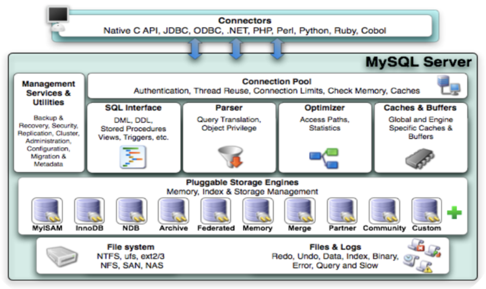

##  一.MYSQL的体系结构

整个MySQL Server由以下组成

- Connection Pool : 连接池组件

- Management Services & Utilities : 管理服务和工具组件

  >  可以进行数据的备份与恢复；集群安全；以及系统配置

- SQL Interface : SQL接口组件

  > 可以封装DML语句，DDL语句，存储过程，触发器等

- Parser : 查询分析器组件

  > 解析客户端发送的请求，过滤等操作

- Optimizer : 优化器组件

  > 对SQL语句进行优化处理 

- Caches & Buffers : 缓冲池组件

  > 查询缓存，是否有对应信息

- Pluggable Storage Engines : 存储引擎

- File System : 文件系统

### 1.连接层

最上层是一些客户端和链接服务，包含本地sock 通信和大多数基于客户端/服务端工具实现的类似于 TCP/IP的通信。主要完成一些类似于连接处理、授权认证、及相关的安全方案。在该层上引入了线程池的概念，为通过认证安全接入的客户端提供线程。同样在该层上可以实现基于SSL的安全链接。服务器也会为安全接入的每个客户端验证它所具有的操作权限。

### 2.服务层

第二层架构主要完成大多数的核心服务功能，如SQL接口，并完成缓存的查询，SQL的分析和优化，部分内置函数的执行。所有跨存储引擎的功能也在这一层实现，如 过程、函数等。在该层，服务器会解析查询并创建相应的内部解析树，并对其完成相应的优化如确定表的查询的顺序，是否利用索引等， 最后生成相应的执行操作。如果是select语句，服务器还会查询内部的缓存，如果缓存空间足够大，这样在解决大量读操作的环境中能够很好的提升系统的性能。

### 3.引擎层

存储引擎层， 存储引擎真正的负责了MySQL中数据的存储和提取，服务器通过API和存储引擎进行通信。不同的存储引擎具有不同的功能，这样我们可以根据自己的需要，来选取合适的存储引擎。

### 4.存储层

数据存储层， 主要是将数据存储在文件系统之上，并完成与存储引擎的交互。

和其他数据库相比，MySQL有点与众不同，它的架构可以在多种不同场景中应用并发挥良好作用。主要体现在存储引擎上，插件式的存储引擎架构，将查询处理和其他的系统任务以及数据的存储提取分离。这种架构可以根据业务的需求和实际需要选择合适的存储引擎。
