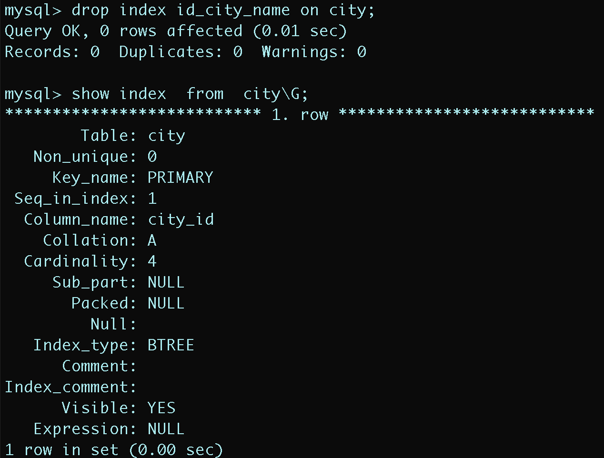

##  一.索引的概述

索引（index）是帮助数据库高效获取数据的数据结构（有序）。以某种方式引用（指向）数据， 实现高级查找算法。

<div align = center></div>

最左边的是数据记录的物理地址（逻辑上相邻的记录在磁盘上不一定物理相邻）。为了加快查找，可以维护一个二叉查找树，每个节点分别包含索引键值和一个指向对应数据记录物理地址的指针，这样可以运用二叉查找快速获取到相应数据。

一般索引本身也很大，不可能全部存储在内存中，因此索引往往以索引文件的形式存储在磁盘上。

---

## 二.索引的优势与劣势

**优势**

+ 类似于书籍的目录索引，提高数据检索的效率，降低数据库的IO成本。

+ 通过索引列对数据进行排序，降低数据排序的成本，降低CPU的消耗。

**劣势**

+ 实际上索引也是一张表，保存了主键与索引字段，并指向实体类的记录，所以也要占用空间。

+ 虽然大大提高了查询效率，却也降低更新表的速度，如对表进行INSERT、UPDATE、DELETE。因为更新表时，MySQL 不仅要保存数据，还要保存一下索引文件每次更新添加了索引列的字段，都会调整因为更新所带来的键值变化后的索引信息。

---

## 三.索引的结构

索引是在MySQL的存储引擎层中实现的，而不是在服务器层实现的。所以每种存储引擎的索引都不一定完全相同，也不是所有的存储引擎都支持所有的索引类型的。MySQL目前提供了以下4种索引：

- BTREE 索引 ： 最常见的索引类型，大部分索引都支持 B 树索引。
- HASH 索引：只有Memory引擎支持 ， 使用场景简单 。
- R-tree 索引（空间索引）：MyISAM引擎的一个特殊索引类型，主要用于地理空间数据类型，通常使用较少。
- Full-text （全文索引） ：MyISAM的一个特殊索引类型，主要用于全文索引，InnoDB从Mysql5.6版本开始支持全文索引

**MyISAM、InnoDB、Memory三种存储引擎对各种索引类型的支持**

| 索引        | InnoDB引擎      | MyISAM引擎 | Memory引擎 |
| ----------- | --------------- | ---------- | ---------- |
| BTREE索引   | 支持            | 支持       | 支持       |
| HASH 索引   | 不支持          | 不支持     | 支持       |
| R-tree 索引 | 不支持          | 支持       | 不支持     |
| Full-text   | 5.6版本之后支持 | 支持       | 不支持     |

平常所说的索引，如果没有特别指明，都是指B+树（多路搜索树，并不一定是二叉的）结构组织的索引。其中聚集索引、复合索引、前缀索引、唯一索引默认都是使用 B+tree 索引，统称为 索引。

### 1.BTREE结构

BTree又叫多路平衡搜索树，一颗m叉的BTree特性如下：

- 树中每个节点最多包含m个孩子。
- 除根节点与叶子节点外，每个节点至少有[ceil(m/2)]个孩子。
- 若根节点不是叶子节点，则至少有两个孩子。
- 所有的叶子节点都在同一层。
- 每个非叶子节点由n个key与n+1个指针组成，其中[ceil(m/2)-1] <= n <= m-1

以5叉BTree为例，key的数量：公式推导 `[ceil(m/2)-1] <= n <= m-1` 。所以 `2 <= n <=4` 。当 `n>4` 时，中间节点分裂到父节点，两边节点分裂。

插入 C N G A H E K Q M F W L T Z D P R X Y S 数据为例。

演变过程如下：

1. 插入前4个字母 C N G A

<div align = "center"></div>

2. 插入H，n>4，中间元素G字母向上分裂到新的节点

   <div align = "center"></div>

3. 插入E，K，Q不需要分裂

   <div align = "center"></div>

4. 插入M，中间元素M字母向上分裂到父节点G

   <div align = "center"></div>

5. 插入F，W，L，T不需要分裂

   <div align = "center"></div>

6. 插入Z，中间元素T向上分裂到父节点中

   <div align = "center"></div>

7. 插入D，中间元素D向上分裂到父节点中。然后插入P，R，X，Y不需要分裂

   <div align = "center"></div>

8. 最后插入S，NPQR节点n>5，中间节点Q向上分裂，但分裂后父节点DGMT的n>5，中间节点M向上分裂

   <div align = "center"></div>

到此，该BTREE树就已经构建完成了， BTREE树 和 二叉树 相比， 查询数据的效率更高， 因为对于相同的数据量来说，BTREE的层级结构比二叉树小，因此搜索速度快。

### 2.B+TREE结构

B+Tree为BTree的变种，B+Tree与BTree的区别为：

1. n叉B+Tree最多含有n个key，而BTree最多含有n-1个key。
2. B+Tree的叶子节点保存所有的key信息，依key大小顺序排列。
3. 所有的非叶子节点都可以看作是key的索引部分。

<div align = center></div>

B+Tree只有叶子节点保存key信息，查询任何key都要从root走到叶子。所以查询效率更加稳定。

### 3.MYSQL中的B+树

<div align = center></div>

MySql索引数据结构对经典的B+Tree进行了优化。在原B+Tree的基础上，增加一个指向相邻叶子节点的链表指针，就形成了带有顺序指针的B+Tree，提高区间访问的性能。

---

## 四.索引的分类

### 1.单值索引

一个索引只包含单个列，一个表可以有多个单列索引。

> 比如一个student表中可以有 id ， name 这两个单列索引

### 2.唯一索引 

索引列的值必须唯一，但允许有空值

### 3. 复合索引 

即一个索引包含多个列

---

## 五.索引的语法

索引在创建表的时候，可以同时创建， 也可以随时增加新的索引。

### 1.环境准备

```mysql
create database demo_01 default charset=utf8mb4;

use demo_01;

CREATE TABLE `city` (
  `city_id` int(11) NOT NULL AUTO_INCREMENT,
  `city_name` varchar(50) NOT NULL,
  `country_id` int(11) NOT NULL,
  PRIMARY KEY (`city_id`)
) ENGINE=InnoDB DEFAULT CHARSET=utf8;

CREATE TABLE `country` (
  `country_id` int(11) NOT NULL AUTO_INCREMENT,
  `country_name` varchar(100) NOT NULL,
  PRIMARY KEY (`country_id`)
) ENGINE=InnoDB DEFAULT CHARSET=utf8;


insert into `city` (`city_id`, `city_name`, `country_id`) values(1,'西安',1);
insert into `city` (`city_id`, `city_name`, `country_id`) values(2,'NewYork',2);
insert into `city` (`city_id`, `city_name`, `country_id`) values(3,'北京',1);
insert into `city` (`city_id`, `city_name`, `country_id`) values(4,'上海',1);

insert into `country` (`country_id`, `country_name`) values(1,'China');
insert into `country` (`country_id`, `country_name`) values(2,'America');
insert into `country` (`country_id`, `country_name`) values(3,'Japan');
insert into `country` (`country_id`, `country_name`) values(4,'UK');
```

### 2.创建索引

```mysql
CREATE 	[UNIQUE|FULLTEXT|SPATIAL]  INDEX index_name 
[USING  index_type] #索引类型，默认B+树
ON tbl_name(index_col_name,...)

index_col_name : column_name[(length)][ASC | DESC]
```

示例 ： 为city表中的city_name字段创建索引 ；

<div align = center></div>

### 3.查看索引

语法：

```MYSQL
show index  from  table_name;
show index  from  table_name\G;
```

<div align = center></div>

###  4.删除索引

语法 ：

```mysql
DROP  INDEX  index_name  ON  tbl_name;
```

<div align = center></div>

### 5.alter命令

```mysql
alter  table  tb_name  add  primary  key(column_list); 
#该语句添加一个主键，这意味着索引值必须是唯一的，且不能为NULL
	
alter  table  tb_name  add  unique index_name(column_list);
#这条语句创建索引的值必须是唯一的（除了NULL外，NULL可能会出现多次）
	
alter  table  tb_name  add  index index_name(column_list);
#添加普通索引， 索引值可以出现多次。

alter  table  tb_name  add  fulltext  index_name(column_list);
#该语句指定了索引为FULLTEXT， 用于全文索引
```

<div align = center></div>

## 六.索引的设计原则

索引的设计可以遵循一些已有的原则，创建索引的时候请尽量考虑符合这些原则，便于提升索引的使用效率，更高效的使用索引。

- 对查询频次较高，且数据量比较大的表建立索引。

- 索引字段的选择，最佳候选列应当从where子句的条件中提取，如果where子句中的组合比较多，那么应当挑选最常用、过滤效果最好的列的组合。

- 使用唯一索引，区分度越高，使用索引的效率越高。

- 索引可以有效的提升查询数据的效率，但索引数量不是多多益善，索引越多，维护索引的代价自然也就水涨船高。对于插入、更新、删除等DML操作比较频繁的表来说，索引过多，会引入相当高的维护代价，降低DML操作的效率，增加相应操作的时间消耗。另外索引过多的话，MySQL也会犯选择困难病，虽然最终仍然会找到一个可用的索引，但无疑提高了选择的代价。

- 使用短索引，索引创建之后也是使用硬盘来存储的，因此提升索引访问的I/O效率，也可以提升总体的访问效率。假如构成索引的字段总长度比较短，那么在给定大小的存储块内可以存储更多的索引值，相应的可以有效的提升MySQL访问索引的I/O效率。

- 利用最左前缀，N个列组合而成的组合索引，那么相当于是创建了N个索引，如果查询时where子句中使用了组成该索引的前几个字段，那么这条查询SQL可以利用组合索引来提升查询效率。

  ```mysql
  创建复合索引:
  	CREATE INDEX idx_name_email_status ON tb_seller(NAME,email,STATUS);
  
  就相当于
  	对name 创建索引 ;
  	对name , email 创建了索引 ;
  	对name , email, status 创建了索引 ;
  ```