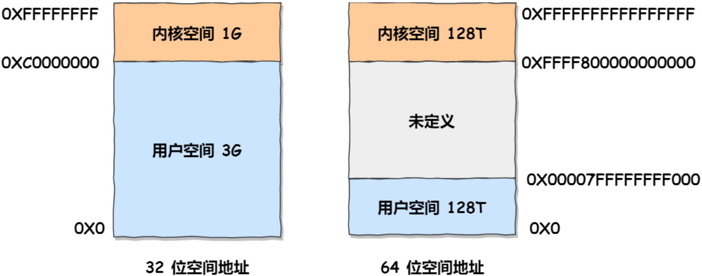

### 序：为什么需要虚拟内存

DOS和1980年代的Windows，或者那些1960年代的大型机，一般都没有虚拟内存的功能，程序指令所访问的内存地址就是物理内存地址，也就是不得不把程序的全部装进内存当中，然后运行。物理内存其实就是插在计算机主板内存槽上的实际物理内存，CPU可以直接进行寻址。物理内存的容量是固定的，但是寻址空间却取决于cpu地址线条数，如32位机，则寻址空间为2^32 = 4G，所以最大支只持4G的寻址空间，即使插了8G的内存条也只能使用4G内存

在这种直接使用物理内存的状态下就会产生一些问题：

1. **内存空间利用率的问题**

**各个进程对内存的使用会导致内存碎片化，当要用malloc分配一块很大的内存空间时，可能会出现虽然有足够多的空闲物理内存，却没有足够大的连续空闲内存这种情况，东一块西一块的内存碎片就被浪费掉了**

2. **读写内存的安全性问题**

**物理内存本身是不限制访问的，任何地址都可以读写，而现代操作系统需要实现不同的页面具有不同的访问权限，例如只读的数据等等**

3. **进程间的安全问题**

**各个进程之间没有独立的地址空间，一个进程由于执行错误指令或是恶意代码都可以直接修改其它进程的数据，甚至修改内核地址空间的数据，这是操作系统所不愿看到的**

4. **内存读写的效率问题**

**当多个进程同时运行，需要分配给进程的内存总和大于实际可用的物理内存时，需要将其他程序暂时拷贝到硬盘当中，然后将新的程序装入内存运行。由于大量的数据频繁装入装出，内存的使用效率会非常低**

正因为有上面这些问题，大佬们设计了“虚拟内存”和相关的概念。

**==虚拟内存是硬件异常、硬件地址翻译、主存、磁盘文件和内核软件的完美交互，它为每个进程提供了一个大的、一致的和私有的地址空间。==** 

通过一个很清晰的机制，虚拟内存提供了三个重要的能力：

1. **它将主存看成是一个存储在磁盘上的地址空间的高速缓存，在主存中只保存活动区域，并根据需要在磁盘和主存之间来回传送数据，通过这种方式，它高效地使用了主存。**
2. **它为每个进程提供了一致的地址空间，从而简化了内存管理。**
3. **它保护了每个进程的地址空间不被其他进程破坏。**

### 一.物理和虚拟寻址

计算机系统的主存被组织成一个由 M 个连续的字节大小的单元组成的数组。每字节都有一个唯一的**物理地址**（Physical Address，PA）。CPU 访问内存的最自然的方式就是使用物理地址。这种方式称为**物理寻址**（physical addressing）。

图 9-1 展示了一个物理寻址的示例，该示例的上下文是一条加载指令，它读取从物理地址 4 处开始的 4 字节字。当 CPU 执行这条加载指令时，会生成一个有效物理地址，通过内存总线，把它传递给主存。主存取岀从物理地址 4 处开始的 4 字节字，并将它返回给 CPU，CPU 会将它存放在一个寄存器里。

现代处理器使用的是一种称为**虚拟寻址**（virtual addressing）的寻址形式，参见图 9-2。

使用虚拟寻址，CPU 通过生成一个**虚拟地址**（Virtual Address，VA）来访问主存，这个虚拟地址在被送到内存之前通过 **地址翻译**（address translation）将虚拟地址转换为物理地址。就像异常处理一样，地址翻译需要 CPU 硬件和操作系统之间的紧密合作。

CPU 芯片上叫做**内存管理单元**（Memory Management Unit，MMU）的专用硬件，利用存放在主存中的查询表来动态翻译虚拟地址，该表的内容由操作系统管理。

### 二.内存分段

程序是由若干个逻辑分段组成的，如可由代码分段、数据分段、栈段、堆段组成。不同的段是有不同的属性的，所以就用分段(**Segmentation**)的形式把这些段分离出来。

分段机制下的虚拟地址由两部分组成，**段选择因子** 和 **段内偏移量**。

+ **段选择因子**就保存在段寄存器里面。段选择因子里面最重要的是**段号**，用作段表的索引。段表里面保存的是这个**段的基地址、段的界限和特权等级**等。

+ 虚拟地址中的**段内偏移量**应该位于 0 和段界限之间，如果段内偏移量是合法的，就将段基地址加上段内偏移量得到物理内存地址。

在上面，知道了虚拟地址是通过段表与物理地址进行映射的，分段机制会把程序的虚拟地址分成 4 个段， 每个段在段表中有一个项，在这一项找到段的基地址，再加上偏移量，于是就能找到物理内存中的地址， 如下图:

如果要访问段 3 中偏移量 500 的虚拟地址，我们可以计算出物理地址为，段 3 基地址 7000 + 偏移量 500 = 7500。

分段的办法很好，解决了程序本身不需要关心具体的物理内存地址的问题，但它也有一些不足之处:

+ 第一个就是**内存碎片**的问题。
+ 第二个就是**内存交换的效率低**的问题。

#### 1.分段产生内存碎片的原因

假设有 1G 的物理内存，用户执行了多个程序，其中:

+ 游戏占用了 512MB 内存 
+ 浏览器占用了 128MB 内存 
+ 音乐占用了 256 MB 内存。

这个时候，如果关闭了浏览器，则空闲内存还有 1024 - 512 - 256 = 256MB。如果这个 256MB 不是连续的，被分成了两段 128 MB 内存，这就会导致没有空间再打开一个 200MB 的程 序。

这里的内存碎片的问题共有两处地方:

+ 外部内存碎片，也就是产生了多个不连续的小物理内存，导致新的程序无法被装载;
+ 内部内存碎片，由于系统分配给进程的空间大于其所申请的大小，处于（操作系统分配的用于装载某一进程的内存）区域内部或页面内部的存储块，占有这些区域或页面的进程并不使用这个存储块。而在进程占有这块存储块时，系统无法利用它。直到进程释放它，或进程结束时，系统才有可能利用这个存储块。

针对上面两种内存碎片的问题，解决的方式会有所不同。

+  **内存交换** 解决外部内存碎片的问题。

  + 可以把音乐程序占用的那 256MB 内存写到硬盘上，然后再从硬盘上读回来到内存里。不过再读回的时候不能装载回原来的位置，而是紧紧跟着那已经被占用了的 512MB 内存后面。这样就能空缺出连续的 256MB 空间，于是新的 200MB 程序就可以装载进来。

    > 在 Linux 系统里，内存交换空间就是 Swap 空间，这块空间是从硬盘划分出来的， 用于内存与硬盘的空间交换。

+ 

#### 2.分段导致内存交换效率低的原因

对于多进程的系统来说，用分段的方式，内存碎片是很容易产生的，产生了内存碎片，那不得不重新 **Swap** 内存区域，这个过程会产生性能瓶颈。

+ 因为**硬盘的访问速度要比内存慢太多了**，每一次内存交换，我们都需要把一大段连续的内存数据写到硬盘上。

+ 所以，如果内存交换的时候，交换的是一个占内存空间很大的程序，这样整个机器都会显得卡顿。 **为了解决内存分段的内存碎片和内存交换效率低的问题，就出现了内存分⻚。**

### 三.内存分页

> **分段的好处** ： 能产生连续的内存空间，但是会出现内存碎片和内存交换的空间太大的问题。
>
> **解决方法：**减少内存碎片的出现，以及减少进行内存交换的数据。 于是有了 **内存分⻚ (*Paging*)。**

**分⻚是把整个虚拟和物理内存空间切成一段段固定尺寸的大小。 **这样一个连续并且尺寸固定的内存空间， 我们叫 **⻚(*Page*)** 。**在 Linux 下，每一⻚的大小为 4KB 。**

虚拟地址与物理地址之间通过⻚表来映射，如下图:

⻚表是存储在内存里的，**内存管理单元 (*MMU*)** 就做将虚拟内存地址转换成物理地址的工作。

而当进程访问的虚拟地址在⻚表中查不到时，系统会产生一个**缺⻚异常**，进入系统内核空间分配物理内存、更新进程⻚表，最后再返回用户空间，恢复进程的运行。

#### 1.分页解决分段内存碎片和内存交换率低的方式

由于内存空间都是预先划分好的，也就不会像分段会产生间隙非常小的内存，这正是分段会产生内存碎片的原因。而 **采用了分⻚，那么释放的内存都是以⻚为单位释放的，也就不会产生无法给进程使用的小内存。**

如果内存空间不够，操作系统会把其他正在运行的进程中的「最近没被使用」的内存⻚面给释放掉，也就是**暂时写在硬盘上，称为换出(*Swap Out*) 。** **一旦需要的时候，再加载进来，称为换入(*Swap In*)。** 所以，**一次性写入磁盘的也只有少数的一个⻚或者几个⻚，不会花太多时间，内存交换的效率就相对比较高。**

更进一步地，分⻚的方式使得在加载程序的时候，不再需要一次性都把程序加载到物理内存中。完全可以**在进行虚拟内存和物理内存的⻚之间的映射之后，并不真的把⻚加载到物理内存里，而是只有在 程序运行中，需要用到对应虚拟内存⻚里面的指令和数据时，再加载到物理内存里面去。**

#### 2.分⻚机制下，虚拟地址映射成物理地址的方式

在分⻚机制下，虚拟地址分为两部分，**⻚号** 和 **⻚内偏移**。⻚号作为⻚表的索引，**⻚表 **包含物理⻚每⻚所在**物理内存的基地址**，这个基地址与⻚内偏移的组合就形成了物理内存地址，⻅下图。

总结一下，对于一个内存地址转换，其实就是这样三个步骤:

1. **把虚拟内存地址，切分成⻚号和偏移量;**
2. **根据⻚号，从⻚表里面，查询对应的物理⻚号;**
3. **直接拿物理⻚号，加上前面的偏移量，就得到了物理内存地址。**

下面举个例子，虚拟内存中的⻚通过⻚表映射为了物理内存中的⻚，如下图:

> 这看起来似乎没什么毛病，但是放到实际中操作系统，这种简单的分⻚是肯定是会有问题的。

#### 3.简单分页的缺陷

有空间上的缺陷。因为操作系统是可以同时运行非常多的进程的，那这不就意味着⻚表会非常的庞大。

在 32 位的环境下，虚拟地址空间共有 4GB，假设一个⻚的大小是 4KB($2^{12}$​)，那么就需要大约 100 万 ($2^{20}$) 个⻚，每个「⻚表项」需要 4 个字节大小来存储，那么整个 4GB 空间的映射就需要有 4MB 的内存来存储⻚表。

这 4MB 大小的⻚表，看起来也不是很大。但是要知道每个进程都是有自己的虚拟地址空间的，也就说都有自己的⻚表。

那么， 100 个进程的话，就需要 400MB 的内存来存储⻚表，这是非常大的内存了，更别说 64 位的环境了。

#### 4.多级页表

>  引入 **多级⻚表(*Multi-Level Page Table*)** 解决上述问题。

对于单⻚表的实现方式，在 32 位和⻚大小 4KB 的环境下，一个进程的⻚表需要装 下 100 多万个「⻚表项」，并且每个⻚表项是占用 4 字节大小的，于是相当于每个⻚表需占用 4MB 大小 的空间。

把这个 100 多万个「⻚表项」的单级⻚表**再分⻚**，将⻚表(一级⻚表)分为 **1024** 个⻚表(二级⻚表)，每个表(二级⻚表)中包含 **1024** 个「⻚表项」，形成**二级分⻚**。如下图所示:

> 可能又这样的疑虑，分了二级表，映射 4GB 地址空间就需要 4KB(一级⻚表)+ 4MB(二级⻚表)的内存，这样占用空间不是更大了吗?
>
> 当然如果 4GB 的虚拟地址全部都映射到了物理内存上的话，二级分⻚占用空间确实是更大了，但是，我们往往不会为一个进程分配那么多内存。
>
> 即换个⻆度来看问题，这就涉及到了计算机组成原理里面无处不在的**局部性原理**

每个进程都有 4GB 的虚拟地址空间，而显然对于大多数程序来说，**其使用到的空间远未达到 4GB**，**因为会存在部分对应的⻚表项都是空的，根本没有分配，对于已分配的⻚表项，如果存在最近一定时间未访问的⻚表，在物理内存紧张的情况下，操作系统会将⻚面换出到硬盘，也就是说不会占用物理内存。**

如果使用了二级分⻚，一级⻚表就可以覆盖整个 4GB 虚拟地址空间，但**如果某个一级⻚表的⻚表项没有被用到，也就不需要创建这个⻚表项对应的二级⻚表了，即可以在需要时才创建二级⻚表。**

>  做个简单的计算，假设只有 20% 的一级⻚表项被用到了，那么⻚表占用的内存空间就只有 4KB(一级⻚表) + 20% * 4MB(二级⻚表)= 0.804MB ，对比单级⻚表的 4MB 是巨大的节约。

对于不分级的⻚表就做不到这样节约。从⻚表的性质来看，保存在内存中的⻚表承担的职责是将虚拟地址翻译成物理地址。**假如虚拟地址在⻚表中找不到对应的⻚表项，计算机系统就不能工作 了。所以⻚表一定要覆盖全部虚拟地址空间，不分级的⻚表就需要有 100 多万个⻚表项来映射，而二级分⻚则只需要 1024 个⻚表项**(此时一级⻚表覆盖到了全部虚拟地址空间，二级⻚表在需要时创建)。

>  把二级分⻚再推广到多级⻚表，就会发现⻚表占用的内存空间更少了，这一切都要归功于对局部性原理的充分应用。

对于 64 位的系统，两级分⻚肯定不够了，就变成了四级目录，分别是:

+ 全局⻚目录项 PGD(*Page Global Directory*); 
+ 上层⻚目录项 PUD(*Page Upper Directory*); 
+ 中间⻚目录项 PMD(*Page Middle Directory*); 
+ ⻚表项 PTE(*Page Table Entry*);

#### 5.TLB

> 多级⻚表虽然解决了空间上的问题，但是虚拟地址到物理地址的转换就多了几道转换的工序，这显然就降低了这俩地址转换的速度，也就是带来了时间上的开销。

程序是有局部性的，即在一段时间内，整个程序的执行仅限于程序中的某一部分。相应地，**执行所访问的存储空间也局限于某个内存区域。**

可以利用这一特性，**把最常访问的几个⻚表项存储到访问速度更快的硬件**，于是**在 CPU 中，加入了一个专⻔存放程序最常访问的⻚表项的 Cache**，这个 Cache 就是 **TLB (*Translation Lookaside Buffer*)** ，通常称为**⻚表缓存、转址旁路缓存、快表**等。

在 CPU 芯片里面，封装了**内存管理单元(*Memory Management Unit*)芯片**，它用来完成地址转换和 TLB 的访问与交互。

有了 TLB 后，那么 CPU 在寻址时，会先查 TLB，如果没找到，才会继续查常规的⻚表。 TLB 的命中率其实是很高的，因为程序最常访问的⻚就那么几个。

### 四.段页式内存管理

内存分段和内存分⻚并不是对立的，它们是可以组合起来在同一个系统中使用的，那么组合起来后，通常称为**段⻚式内存管理**。

段⻚式内存管理实现的方式:

+ **先将程序划分为多个有逻辑意义的段**，也就是前面提到的分段机制;
+ 接着再**把每个段划分为多个⻚**，也就是对分段划分出来的连续空间，再划分固定大小的⻚;

这样，地址结构就由段号、段内⻚号和⻚内位移三部分组成。

用于段⻚式地址变换的数据结构是每一个程序一张段表，每个段又建立一张⻚表，段表中的地址是⻚表的起始地址，而⻚表中的地址则为某⻚的物理⻚号，如图所示:

段⻚式地址变换中要得到物理地址须经过三次内存访问:

1. **访问段表，得到⻚表起始地址;**
2. **访问⻚表，得到物理⻚号;**
3. **将物理⻚号与⻚内位移组合，得到物理地址。**

可用软、硬件相结合的方法实现段⻚式地址变换，这样虽然增加了硬件成本和系统开销，但提高了内存的利用率。

### 五.Linux 内存管理

#### 1.先入为主——Intel处理器的发展历史

早期 Intel 的处理器从 80286 开始使用的是段式内存管理。但是很快发现，光有段式内存管理而没有⻚式内存管理是不够的。因此在 80386 中就实现了对 ⻚式内存管理。也就是说，80386 除了完成并完善从 80286 开始的段式内存管理的同时还实现了⻚式内存管理。

但是这个 80386 的⻚式内存管理设计时，没有绕开段式内存管理，而是建立在段式内存管理的基础上，这就意味着，**⻚式内存管理的作用是在由段式内存管理所映射而成的地址上再加上一层地址映射。**

由于此时由段式内存管理映射而成的地址不再是“物理地址”了，Intel 就称之为“线性地址”(也称虚拟地 址)。于是，段式内存管理先将逻辑地址映射成线性地址，然后再由⻚式内存管理将线性地址映射成物理地址。

这里说明下逻辑地址和线性地址:

+ 程序所使用的地址，通常是没被段式内存管理映射的地址，称为逻辑地址;
+ 通过段式内存管理映射的地址，称为线性地址，也叫虚拟地址;

逻辑地址是「段式内存管理」转换前的地址，线性地址则是「⻚式内存管理」转换前的地址。

#### 2.被逼无奈——Linux管理内存的方式

> 因为 Intel X86 CPU 一律对程序中使用的地址先进行段式映射，然后才能进行⻚式映射。既然 CPU 的硬件结构是这样，Linux 内核也只好服从 Intel 的选择。
>
> 但是事实上，Linux 内核所采取的办法是使段式映射的过程实际上不起什么作用。也就是说，“上有政策，下有对策”，若惹不起就躲着走。

**Linux内存主要采用的是⻚式内存管理，但同时也不可避免地涉及了段机制。**

**Linux** 系统中的每个段都是从 **0** 地址开始的整个 **4GB** 虚拟空间(**32** 位环境下)，也就是所有的段的起始地址都是一样的。这意味着，**Linux** 系统中的代码，包括操作系统本身的代码和应用程序代码，所面对的地址空间都是线性地址空间(虚拟地址)，这种做法相当于屏蔽了处理器中的逻辑地址概念，段只被用于访问控制和内存保护。

#### 3. 大展身手——Linux 的虚拟地址空间的分布方式

在 Linux 操作系统中，虚拟地址空间的内部又被分为 **内核空间和用户空间** 两部分，不同位数的系统，地址 空间的范围也不同。比如最常⻅的 32 位和 64 位系统，如下所示:

通过这里可以看出:

+ 32 位系统的内核空间占用 1G ，位于最高处，剩下的 3G 是用户空间;
+ 64 位系统的内核空间和用户空间都是 128T ，分别占据整个内存空间的最高和最低处，剩下的中间部分是未定义的。

再来说说，内核空间与用户空间的区别:

+ **进程在用户态时，只能访问用户空间内存;**
+ **只有进入内核态后，才可以访问内核空间的内存;**

虽然每个进程都各自有独立的虚拟内存，但是**每个虚拟内存中的内核地址，其实关联的都是相同的物理内存**。这样，进程切换到内核态后，就可以很方便地访问内核空间内存。

接下来，进一步了解虚拟空间的划分情况，用户空间和内核空间划分的方式是不同的，内核空间的分布情况就不多说了。看看用户空间分布的情况，以 32 位系统为例：

通过这张图你可以看到，用户空间内存，从低到高分别是 7 种不同的内存段:

+  **程序文件段，**包括二进制可执行代码;
+ **已初始化数据段**，包括静态常量;
+ **未初始化数据段，**包括未初始化的静态变量;
+ **堆段**，包括动态分配的内存，从低地址开始向上增⻓;
+ **文件映射段，**包括动态库、共享内存等，从低地址开始向上增⻓(跟硬件和内核版本有关);

+ **栈段**，包括局部变量和函数调用的上下文等。栈的大小是固定的，一般是 8 MB 。当然系统也提供了参数，以便我们自定义大小;

在这 7 个内存段中，堆和文件映射段的内存是动态分配的。比如说，使用 C 标准库的 malloc() 或者 mmap() ，就可以分别在堆和文件映射段动态分配内存。