# 一.简单动态字符串

Redis里，C字符串只会作为字符串字面量用在一些无需对字符串值进行修改的地方，比如打印日志。Redis构建了 简单动态字符串（simple dynamic string，SDS）来表示字符串值。

在Redis里，包含字符串值的键值对在底层都是由SDS实现的。除此之外，SDS还被用作缓冲区：AOF缓冲区，客户端状态中的输入缓冲区。

## (一).SDSD定义

每个sds.h/sdshdr结构表示一个SDS值：

```c
struct sdshdr {
    // 记录buf数组中已使用字节的数量
    int len;		// 等于SDS所保存字符串的长度
    int free;		// 记录buf数组中未使用字节的数量
    char buf[];	// 字节数组，用于保存字符串
}
```

示例：

<div align = center>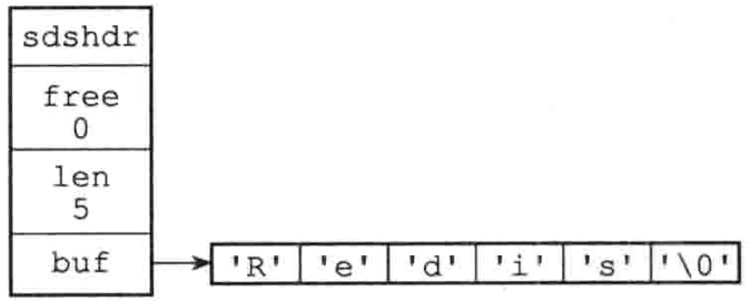</div>

SDS遵循C字符串以空字符结尾的管理，空字符不计算在len属性中。这样，SDS可以重用一部分C字符串函数库，如printf。

## (二).SDS与C字符串的区别

### 1.常数复杂度获取字符串长度

+ C字符串必须遍历整个字符串才能获得长度，复杂度是O(N)。
+ SDS在len属性中记录了SDS的长度，复杂度为O(1)。

### 2.杜绝缓冲区溢出

+ C字符串不记录长度的带来的另一个问题是缓冲区溢出。假设s1和s2是紧邻的两个字符串，对s1的strcat操作，有可能污染s2的内存空间。

+ SDS的空间分配策略杜绝了缓冲区溢出的可能性：但SDS API修改SDS时， **会先检查SDS的空间是否满足修改所需的要求，不满足的话，API会将SDS的空间扩展至执行修改所需的大小，然后再执行实际的修改操作。**

### 3.减少修改字符串时带来的内存重分配次数

>  每次增长或缩短一个C字符串，程序都要对保存这个C字符串的数组进行一次内存重分配操作。

Redis作为数据库，数据会被平凡修改，如果每次修改字符串都会执行一次内存重分配的话，会对新嗯呢该造成影响。SDS通过未使用空间接触了字符串长度和底层数组长度的关联：在SDS中，buf数组的长度不一定就是字符数量+1，数组里面可以包含未使用的字节，由free属性记录。对于未使用空间，SDS使用了空间预分配和惰性空间释放两种优化策略：

1.  **空间预分配：** 当SDS的API对SDS修改并需要空间扩展时，程序不仅为SDS分配修改所需的空间，还会分配额外的未使用空间（取决于长度是否小于1MB）。
2.  **惰性空间释放：** 当SDS的API需要缩短时，程序不立即触发内存重分配，而是使用free属性将这些字节的数量记录下来，并等待将来使用。与此同时，SDS API也可以让我们真正师范未使用空间，防止内存浪费。

### 4.二进制安全

+ C字符串中的字符必须复合某种编码（如ASCII），除了字符串末尾之外，字符串里不能包含空字符。这些限制使得C字符串只能保存文本，而不是不能保存二进制数据。

+ SDS API会以处理二进制的方式处理SDS存放在buf数组中的数据，写入时什么样，读取时就是什么样。SDS 使用 len 属性的值而不是空字符来判断字符串是否结束。

### 5.兼容部分C字符串函数

+ 遵循C字符串以空字符结尾的管理，SDS可以重用<string.h>函数库。

### 6.总结

| C字符串                          | SDS                                |
| -------------------------------- | ---------------------------------- |
| 获取长度的复杂度O(N)             | O(1)                               |
| API不安全，缓冲区溢出            | API安全，不会缓冲区溢出            |
| 修改字符串长度必然导致内存重分配 | 修改字符串长度不一定导致内存重分配 |
| 只能保存文本数据                 | 可以保存文本或二进制数据           |
| 可使用所有<string.h>库的函数     | 可使用部分<string.h>库的函数       |

## (三).SDS API

|    函数     | 作用                                                       |   时间复杂度   |
| :---------: | ---------------------------------------------------------- | :------------: |
|   sdsnew    | 创建一个包含给定C字符串的SDS                               |      O(N)      |
|  sdsempty   | 创建一个不包含任何内容的SDS                                |      O(1)      |
|   sdsfree   | 释放SDS                                                    |      O(N)      |
|   sdslen    | 返回SDS已使用的字节数                                      |      O(1)      |
|  sdsavail   | 返回SDS未使用的字节数                                      |      O(1)      |
|   sdsdup    | 创建一个给定SDS的副本                                      |      O(N)      |
|  sdsclear   | 清空SDS保存的字符串内容                                    | O(1)，惰性释放 |
|   sdscat    | 将给定C字符串拼接到SDS字符串的末尾                         |      O(N)      |
|  sdscatsds  | 将给定SDS字符串拼接到另一个SDS的末尾                       |      O(N)      |
|   sdscpy    | 复制                                                       |      O(N)      |
| sdsgrowzero | 用空字符将SDS扩展至给定长度                                |      O(N)      |
|  sdsrange   | 保留SDS给定区间内的数据，不在区间内的数据会被覆盖或清除    |      O(N)      |
|   sdstrim   | 接受一个SDS和C字符为参数，从SDS中移除C字符串中出现过的字符 |     O(N^2)     |
|   sdscmp    | 比较                                                       |      O(N)      |

---

# 二.链表

Redis构建了自己的链表实现。列表键的底层实现之一就是链表。当一个列表键包含数量比较多的元素，又或者列表中包含的元素都是比较长的字符串时，Redis就会使用链表作为列表键的底层实现。

出列表键外，发布、订阅、慢查询、监视器都用到了链表。Redis服务器还用链表保存多个客户端的状态信息，以及构建客户端输出缓冲区。

## (一).链表与链表节点的实现

链表节点用adlist.h/listNode结构来表示

```c
typedef struct listNode {
    struct listNode *prev;
    struct listNode *next;
    void *value;
} listNode;
```

<div align = center>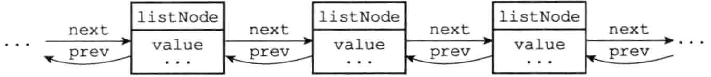</div>

使用adlist.h/list来持有链表:

```c
typedef struct list {
    listNode *head;											//表头节点
    listNode *tail;											//表尾节点
    unsigned long len;									//链表包含的节点数量
    void *(dup)(void *ptr); 						// 节点复制函数
    void (*free)(void *ptr); 						// 节点释放函数
    int (*match)(void *ptr, void *key); // 节点值对比函数
} list;
```

<div align = center>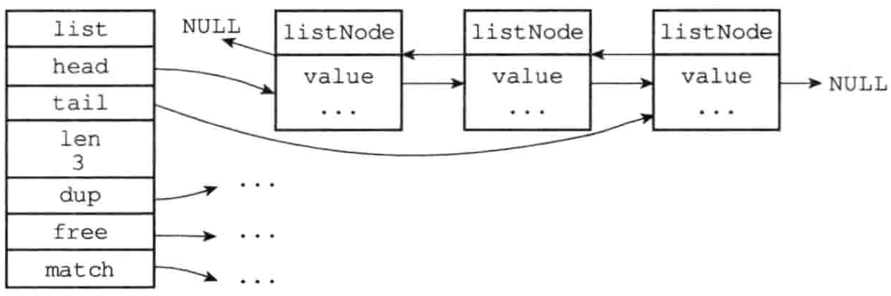</div>

Redis的链表实现可总结如下：

1.  **双端：** 获取某个节点的前置节点与后置节点复杂度都为O(1)
2.  **无环：** 表头结点的prev和表尾节点的next都指向NULL
3.  **带表头指针和表尾指针**
4.  **带链表长度计数器：** 程序获取链表中的节点数量的复杂度为O(1)
5.  **多态：** 使用void*指针来保存节点值，并通过list结构的dup、free。match三个属性为节点值设置类型特定函数

## (二).链表和链表节点的API

| 函数                                                    | 作用                                                         | 复杂度 |
| ------------------------------------------------------- | ------------------------------------------------------------ | ------ |
| listSetDupMethod, listSetFreeMethod, listSetMatchMethod | 将给定函数设置为链表的节点值复制/释放/对比函数               | O(1)   |
| listGetDupMethod, listGetFreeMethod, listGetMatchMethod | 返回链表当前正在使用的节点值复制/释放/对比函数               | O(1)   |
| listLength                                              | 返回链表长度                                                 | O(1)   |
| listFrist                                               | 返回表头结点                                                 | O(1)   |
| listLast                                                | 返回表尾结点                                                 | O(1)   |
| listPrevNode, listNextNode                              | 返回给定节点的前置/后置节点                                  | O(1)   |
| listNodeValue                                           | 返回给定节点目前正在保存的值                                 | O(1)   |
| listCreate                                              | 创建一个不包含任何节点的新链表                               | O(1)   |
| listAddNodeHead, listAddNodeTail                        | 将一个包含给定值的新节点添加到表头/表尾                      | O(1)   |
| listSearchKey                                           | 查找并返回包含给定值的节点                                   | *O(N)* |
| listIndex                                               | 返回链表在给定索引上的节点                                   | *O(N)* |
| listDelNote                                             | 删除给定节点                                                 | *O(N)* |
| listRotate                                              | 将链表的表尾结点弹出，然后将被弹出的节点插入到链表的表头，成为新的表头结点 | O(1)   |
| listDup                                                 | 复制一个给定链表的副本                                       | *O(N)* |
| listRelease                                             | 释放给定链表，及所有节点                                     | *O(N)* |

---

# 三.字典

在字典中一个键(Key)可以与一个值(value)进行关联，这件关联的键与值就被称为键值对。

Redis的数据库就是使用字典来作为底层实现的，对数据库的增删改查都是构建在字典的操作之上。

字典还是哈希键的底层实现之一，但一个哈希键包含的键值对比较多，又或者键值对中的元素都是较长的字符串时，Redis就会用字典作为哈希键的底层实现。

## (一).字典的实现

Redis的字典使用 **哈希表** 作为底层实现，每个哈希表节点就保存了字典中的一个键值对。

### 1.哈希表

Redis字典所用的**哈希表**由dict.h/dictht结构定义：

```c
typedef struct dictht {
    dict Entry **table;			// 哈希表数组
    unsigned long size;			// 哈希表大小
    unsigned long sizemask;	// 哈希表大小掩码，用于计算索引值，总是等于size - 1
    unsigned long used;			// 该哈希表已有节点的数量
} dictht;
```

> sizemask与哈希值决定一个键应该被放到table数组的哪个索引上。

### 2.哈希表节点

**哈希表节点** 使用dictEntry结构表示，每个dictEntry结构都保存着一个键值对：

```c
ypedef struct dictEntry {
    void *key; 							// 键

    union {
        void *val;
        uint64_t u64;
        int64_t s64;
    } v;									// 值

    struct dictEntry *next; // 指向下个哈希表节点，形成链表。一次解决键冲突的问题
}
```

<div align = center>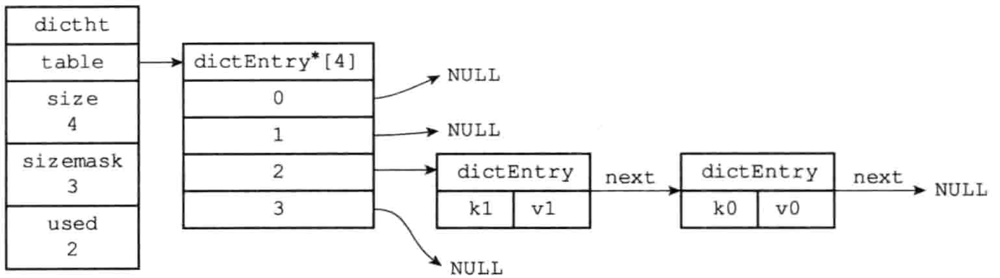</div>

### 3.字典

Redis中的 **字典** 由dict.h/dict结构表示：

```c
typedef struct dict {
    dictType *type; // 类型特定函数
    void *privdata; // 私有数据

    /*
 			哈希表一般情况下，字典只是用ht[0]哈希表，ht[1]只会在对ht[0]哈希表进行rehash时是用
    */
    dictht ht[2]; 

    // rehash索引，但rehash不在进行时，值为-1
    int trehashidx; // 记录了rehash的进度
} dict;
```

type和privdata是针对不同类型大家键值对，为创建多态字典而设置的：

- type是一个指向dictType结构的指针，每个dictType都保存了一簇用于操作特定类型键值对的函数，Redis会为用途不同的字典设置不同的类型特定函数。
- privdata保存了需要传给那些类型特定函数的可选参数。

```c
typedef struct dictType {
    // 计算哈希值的函数
    unsigned int (*hashFunction) (const void *key);

    // 复制键的函数
    void *(*keyDup) (void *privdata, const void *obj);

    // 对比键的函数
    void *(*keyCompare) (void *privdata, const void *key1, const void *key2);

    // 销毁键的函数
    void (*keyDestructor) (void *privdata, void *key);

    // 销毁值的函数
    void (*valDestructor) (void *privdata, void *obj);
} dictType;

```

<div align = center>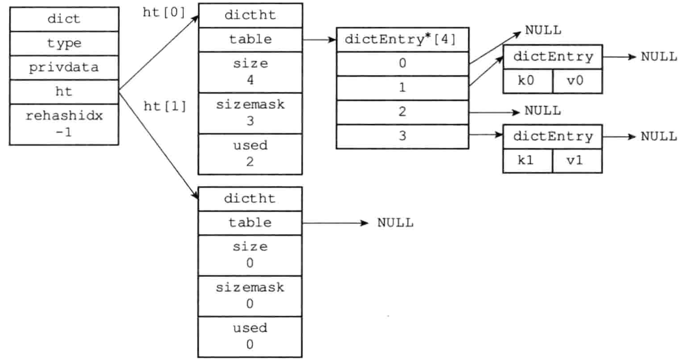</div>

> ht属性是一个包含两个项的数组，数组中每个项都是一个dictht哈希表，一般情况下，字典只是用ht[0]哈希表，ht[1]只会在对ht[0]哈希表进行rehash时是用

## (二).哈希算法

Redis计算哈希值和索引值的方法如下：

```c
// 使用字典设置的哈希函数，计算key的哈希值
hash = dict.type.hashFucntion(key)
// 使用哈希表的sizemask属性和哈希值，计算出索引值
// 根据情况的不同，ht[x]可以使ht[0]或ht[1]
index = hash & dict.ht[x].sizemask
```

当字典被用作数据库或哈希键的底层实现时，使用MurmurHash2算法来计算哈希值，即使输入的键是有规律的，算法人能有一个很好的随机分布性，计算速度也很快。

## (三).解决键冲突

Redis使用链地址法解决键冲突，每个哈希表节点都有个next指针。

<div align = center>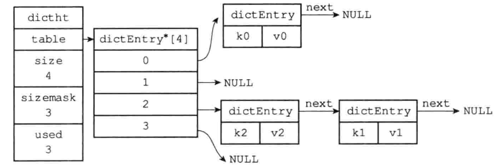</div>

## (四).rehash

随着操作的不断执行，哈希表保存的键值对会增加或减少。为了让哈希表的负载因子维持在合理范围，需要对哈希表的大小进行扩展或收缩，即通过执行rehash（重新散列）来完成：

1. 为字典的ht[1]哈希表分配空间：

   + 如果执行的是扩展操作，ht[1]的大小为第一个大于等于ht[0].used * 2 的2^n

   + 如果执行的是收缩操作，ht[1]的大小为第一个大于等于ht[0].used的2^n

2. 将保存在ht[0]中的所有键值对rehash到ht[1]上。rehash是重新设计的计算键的哈希值和索引值

3. 释放ht[0]，将ht[1]设置为ht[0]，并为ht[1]新建一个空白哈希表

### 哈希表的扩展与收缩

满足一下任一条件，程序会自动对哈希表执行扩展操作：

+ 服务器目前没有执行BGSAVE或BGREWRITEAOF，且哈希表负载因子大于等于1
+ 服务器正在执行BGSAVE或BGREWRITEAOF，且负载因子大于5

哈希表执行收缩操作的条件：

+ 当哈希表的负载因子小于0.1时，程序自动开始对哈希表执行收缩操作

其中负载因子的计算公式：

```bash
# 负载因子 = 哈希表已保存节点数量 / 哈希表大小
load_factor = ht[0].used / ht[0].size
```

执行BGSAVE或BGREWRITEAOF过程中，Redis需要创建当前服务器进程的子进程，而多数操作系统都是用写时复制来优化子进程的效率，所以在子进程存在期间，服务器会提高执行扩展操作所需的负载因子，从而尽可能地避免在子进程存在期间扩展哈希表，避免不避免的内存写入，节约内存。

## (五).渐进式rehash

将ht[0]中的键值对rehash到ht[1]中的操作不是一次性完成的，而是分多次渐进式的：

1. 为ht[1]分配空间
2. 在字典中维持一个索引计数器变量rehashidx，设置为0，表示rehash工作正式开始
3. rehash期间， **每次对字典的增删改查操作** ，会顺带将ht[0]在rehashidx索引上的所有键值对rehash到ht[1]，rehash完成之后，rehashidx属性的值+1
4. 最终ht[0]会全部rehash到ht[1]，这是将rehashidx设置为-1，表示rehash完成

渐进式rehash的好处在于它采用了分而治之的方式，将rehash键值对所需的计算工作均摊到对字典的 增删改查 操作上，从而避免了集中式 rehash 而带来的庞大计算量。

### 渐进式rehash执行期间的哈希表操作

+ 进式rehash过程中，字典会有两个哈希表，字典的 **删除，查找，更新** 会在两个哈希表上进行。

+ 另外，进式rehash过程中，新添加到字典的键值对一律会被保存到ht[1]

---

# 四.跳跃表

跳跃表是一种**有序数据结构**，它通过在每个节点中维持多个指向其他节点的指针，从而达到快速访问的目的。跳跃表支持平均*O(logN)*、最坏*O(N)*的查找，还可以通过顺序性操作来批量处理节点。

Redis使用跳跃表作为有序集合键的底层实现之一，如果有序集合包含的元素数量较多，或者有序集合中元素的成员是比较长的字符串时，Redis使用跳跃表来实现有序集合键。

Redis只在两个地方用到了跳跃表：

+ 实现有序集合键
+ 在集群结点中用作内部数据结构

## (一).跳跃表的实现

Redis的跳跃表由redis.h/zskiplistNode和redis.h/zskiplist两个结构定义，其中zskiplistNode代表跳跃表节点，zskiplist保存跳跃表节点的相关信息，比如节点数量、以及指向表头/表尾结点的指针等。

<div align = center>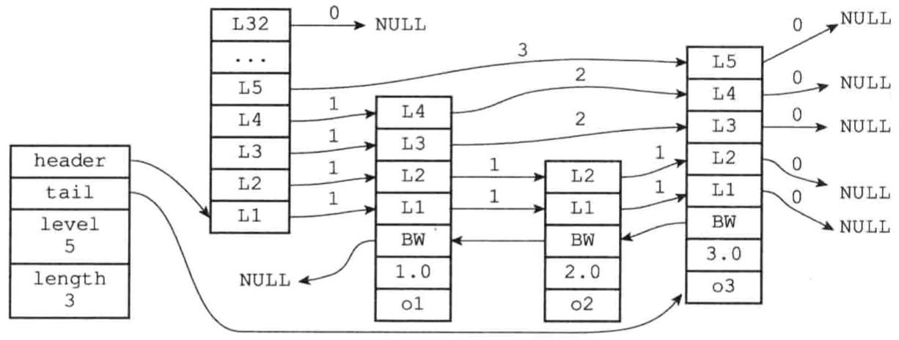</div>

### 1.跳跃表节点

```c++
typedef struct zskiplistNode {
    struct zskiplistNode *backward;
    double score;
    robj *obj;
    struct zskiplistLevel {
        struct zskiplistNode *forward;
        unsigned int span; // 跨度
    } level[]; 
} zskiplistNode;
```

zskiplistNode包含：

- level：节点中用L1、L2、L3来标记节点的各个层，每个层都有两个属性：前进指针和跨度。前进指针用来访问表尾方向的其他节点，跨度记录了前进指针所指向节点和当前节点的距离（图中曲线上的数字）。

  level数组可以包含多个元素，每个元素都有一个指向其他节点的指针，程序可以通过这些层来加快访问其他节点。层数越多，访问速度就越快。没创建一个新节点的时候，根据幂次定律（越大的数出现的概率越小）随机生成一个介于1-32之间的值作为level数组的大小。这个大小就是层的高度。

  跨度用来计算排位（rank）：在查找某个节点的过程中，将沿途访问过的所有层的跨度累计起来，得到就是目标节点的排位。

- 后退指针：BW，指向位于当前节点的前一个节点。只能回退到前一个节点，不可跳跃。

- 分值（score）：节点中的1.0/2.0/3.0保存的分值，节点按照各自保存的分值从小到大排列。节点的分值可以相同。

- 成员对象（obj）：节点中的o1/o2/o3。它指向一个字符串对象，字符串对象保存着一个SDS值。

注：表头结点也有后退指针、分值和成员对象，只是不被用到。

遍历所有节点的路径：

1. 访问跳跃表的表头，然后从第四层的前景指正到表的第二个节点。
2. 在第二个节点时，沿着第二层的前进指针到表中的第三个节点。
3. 在第三个节点时，沿着第二层的前进指针到表中的第四个节点。
4. 但程序沿着第四个程序的前进指针移动时，遇到NULL。结束遍历。

### 2.跳跃表

```c++
typedef struct zskiplist {
    struct zskiplistNode *header, *tail;
    unsigned long length;									//表中节点的数量
    int level;														//表中层数最大的节点的层数
} zskiplist;
```

zskiplist结构包含：

- header：指向跳跃表的表头结点
- tail：指向跳跃表的表尾节点
- level：记录跳跃表内，层数最大的那个节点的层数（表头结点不计入）
- length：记录跳跃表的长度， 即跳跃表目前包含节点的数量（表头结点不计入）

## (二). 跳跃表API

| 函数                             | 作用                                                | 时间复杂度                       |
| -------------------------------- | --------------------------------------------------- | -------------------------------- |
| zslCreate                        | 创建一个跳跃表                                      | O(1)                             |
| zslFree                          | 释放跳跃表，以及表中的所有节点                      | O(N)                             |
| zslInsert                        | 添加给定成员和分值的新节点                          | 平均O(logN)，最坏O(N)            |
| zslDelete                        | 删除节点                                            | 平均O(logN)，最坏O(N)            |
| zslGetRank                       | 返回包含给定成员和分值的节点在跳跃表中的排位        | 平均O(logN)，最坏O(N)            |
| zslGetElementByRank              | 返回给定排位上的节点                                | 平均O(logN)，最坏O(N)            |
| zslIsInRange                     | 给定一个range，跳跃表中如果有节点位于该range，返回1 | O(1)，通过表头结点和表尾节点完成 |
| zslFirstInRange， zslLastInRange | 返回第一个/最后一个符合范围的节点                   | 平均O(logN)，最坏O(N)            |
| zslDeleteRangeByScore            | 删除所有分值在给定范围内的节点                      | O(N)                             |
| zslDeleteRangeByRank             | 删除所有排位在给定范围内的节点                      | O(N)                             |

---

# 五.整数集合

整数集合（intset）是集合键的底层实现之一，当一个集合只包含整数值元素，并且数量不多时，Redis采用整数集合作为集合键的底层实现。

## (一).整数集合的表现

整数集合，可以保存int16_t、int32_t或者int64_t的整数值，且元素不重复，intset.h/intset结构表示一个整数集合：

```c++
typedef struct intset {
    uint32_t encoding; // 决定contents保存的真正类型
    uint32_t length;	 // 集合包含的元素数量
    int8_t contents[]; // 各项从小到大排序
} inset;
```

<div align = center>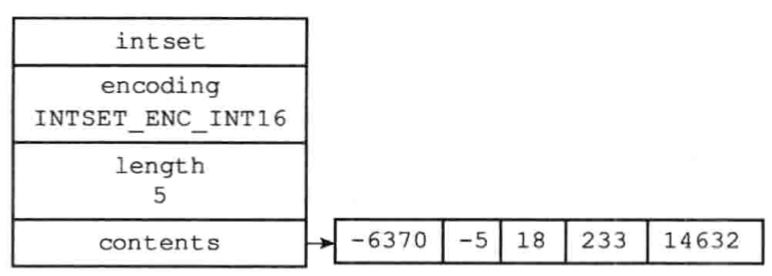</div>

注意事项：

+ 虽然contents属性声明是 int8_t 类型的数组，但实际上取决于 encoding 属性的值。

> 上图中，整数集合的底层实现为 int16_t 类型的数组，大小为sizeof(int16_t) * 5 = 80位。

## (二).升级

每当添加一个新元素到整数集合中，且新元素的类型比现有所有元素的类型都要长时，整数集合需要先升级（update），然后才能添加新元素：

1. 根据新元素的类型，扩展底层数组的空间大小，并未新元素分配空间。
2. 将底层数组现有元素转换成与新元素相同的类型，并放置在正确的位置上（从后向前遍历）。放置过程中，维持底层数组的有序性质不变。
3. 将新元素添加到底层数组里。

因为每次升级都可能对所有元素进行类型转换，所以复杂度为*O(N)*。

PS. 因为引发升级的新元素长度比当前元素都大，所以它的值要么大于当前所有元素，要么就小于。前种情况放置在底层数组的末尾，后种情况放置在头部。

## (三).升级的好处

升级有两个好处

+ **提升整数集合的灵活性**
  + 我们可以随意地将int16_t、int32_t添加到集合中，不必担心出现类型错误，毕竟C是个静态语言。

+  **尽可能解约内存**
  + 只有要将更大类型的数值进行添加时才进行升级，如果一直使用小类型，如int16_t，可以让整数集合的底层的实现一直是int16_t。只有将int32_t进行添加时才升级。

## (四).降级

**整数集合不支持降级**。

## (五).整数集合API

| 函数          | 作用                 | 时间复杂度                    |
| ------------- | -------------------- | ----------------------------- |
| intsetNew     | 创建一个新的整数集合 | O(1)                          |
| intsetAdd     | 添加指定元素         | O(N)                          |
| intsetRemove  | 移除指定元素         | O(N)                          |
| intsetFind    | 检查给定值是否存在   | 因为底层数组有序，所以O(logN) |
| insetRandom   | 随机返回一个元素     | O(1)                          |
| intsetGet     | 返回给定索引上的元素 | O(1)                          |
| intsetLen     | 返回元素个数         | O(1)                          |
| intsetBlobLen | 返回占用的内存字节数 | O(1)                          |

---

# 六.压缩列表

压缩列表（ziplist）是列表键和哈希键的底层实现之一。当一个列表键只包含少量列表现，并且每个列表项要么就是小整数值，要么就是长度较短的字符串，那么Redis就会使用压缩列表来实现列表键。

当一个哈希键只包含少量键值对，并且每个键值对要么是小整数值，要么是长度较短的字符串，Redis就会使用压缩列表来实现哈希键。

## (一).压缩列表的构成

压缩列表是Redis为了节约内存而开发的，由一系列特殊编码的连续内存块组成的顺序型（sequential）数据结构。一个压缩列表可以包含多个节点（entry），每个节点可以保存一个字节数组或者一个整数值。

压缩列表的各组成部分：

<div align = center>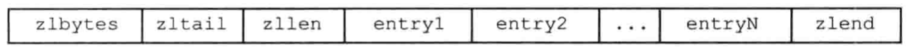</div>

其中，

| 属性    | 类型     | 长度  | 用途                                                         |
| ------- | -------- | ----- | ------------------------------------------------------------ |
| zlbytes | uint32_t | 4字节 | 记录压缩列表占用的内存字节数：在内存重分配，或计算zlend的位置时使用 |
| zltail  | uint32_t | 4字节 | 记录表尾结点距离起始地址的字节数：通过这个偏移量，程序可以直接确定表尾结点的地址 |
| zllen   | uint16_t | 2字节 | 记录节点数量：但这个属性小于UINT16_MAX（65535）时，这个属性的值就是节点的数量。如果等于UINT16_MAX，节点的真实数量要遍历整个压缩列表才能得到 |
| entryX  | 列表节点 | 不定  | 各个节点，节点的长度由保存的内容决定                         |
| zlend   | uint8_t  | 1字节 | 特殊值0xFF，标记压缩列表的尾端                               |

如下图所示：

<div align = center>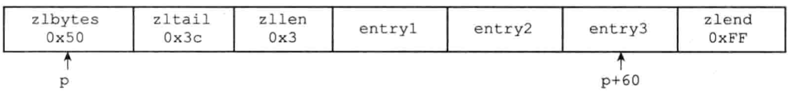</div>

+ zlbytes 属性值为 0x50(十进制80)，表示压缩列表总厂为80字节
+ zltail 属性值为 0x3c(十进制60)，表示若有指向压缩表其实地址的指针p，则p加上偏移量60就能计算出表尾结点 entry30 的地址
+ zllen 属性值为 0x3(十进制3)，表示压缩列表包含三个节点

## (二).压缩列表节点的构成

压缩列表的节点可以保存一个字节数组或者一个整数值。压缩节点的各个组成部分：

> previous_entry_length | encoding | content

### 1.previous_entry_length 

previous_entry_length以字节为单位，记录前一个节点的长度。previous_entry_length属性的长度可以是1字节或5字节：

1. 若前一节点的长度小于254字节，那么previous_entry_length属性的长度就是1字节。前一节点的长度保存在其中。
2. 若前一节点的长度大于254字节，那么previous_entry_length属性的长度就是5字节： **其中属性的第一个字节被设置为0xFE（十进制254），而之后的四个字节则用于保存前一节点的长度。**

程序可以通过指针运算，根据当前节点的起始地址来计算出前一个结点的起始地址。压缩列表的从尾向头遍历就是据此实现的。

### 2.encoding

- 1字节、2字节或者5字节长，值的最高位为00、01或10的是字节数组编码：这种编码表示节点的content保存的是字节数组，数组的长度由编码除去最高两位置后的其他位记录。
- 1字节长。值的最高位以11开头的是整数编码：表示content保存着整数值，整数值的类型和长度由编码除去最高两位之后的其他位记录。

<div align = center>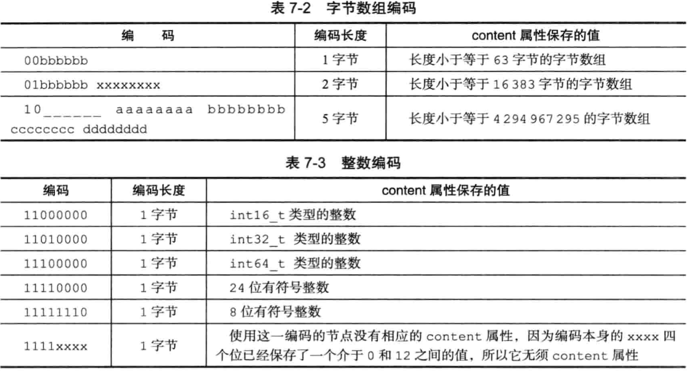</div>

### 3.content

content保存节点的值，可以使字节数组或整数，值的类型和长度由encoding属性决定。

保存字节数组“hello world”的节点：

| previoid_entry_length | encoding | content       |
| --------------------- | -------- | ------------- |
| ...                   | 00001011 | "hello world" |

保存整数10086的节点：

| previoid_entry_length | encoding | content |
| --------------------- | -------- | ------- |
| ...                   | 11000000 | 10086   |

## (三).连锁更新

因为previoid_entry_length的长度限制，添加或删除节点都有可能引发「连锁更新」。在最坏的情况下，需要执行*N*次重分配操作，而每次空间重分配的最坏复杂度是*O(N)*，合起来就是*O(N^2)*。

尽管如此，连锁更新造成性能问题的概率还是比较低的：

1. 压缩列表里有多个连续的、长度介于250和253字节之间的节点，连锁更新才有可能触发。
2. 即使出现连锁更新，只要需要更新的节点数量不多，性能也不会受影响。

## (四).压缩列表API

| 函数               | 作用                                         | 复杂度                                                       |
| ------------------ | -------------------------------------------- | ------------------------------------------------------------ |
| ziplistNew         | 创建新的压缩列表                             | O(1)                                                         |
| ziplistPush        | 创建一个包含给定值的新节点，并添加到表头或尾 | 平均O(N)，最坏O(N^2)                                         |
| ziplistInsert      | 将包含给定值的新节点插入到给定节点之后       | 平均O(N)，最坏O(N^2)                                         |
| ziplistIndex       | 返回给定索引上的节点                         | O(N)                                                         |
| ziplistFind        | 查找并返回给定值的节点                       | 因为节点的值可能是一个数组，所以检查节点值和给定值是否相同的复杂度为O(N)，查找整个列表的复杂度为O(N^2) |
| ziplistNext        | 返回给定节点的下一个节点                     | O(1)                                                         |
| ziplistPrev        | 返回给定节点的前一个节点                     | O(1)                                                         |
| ziplistGet         | 获取给定节点所保存的值                       | O(1)                                                         |
| ziplistDelete      | 删除给定节点                                 | 平均O(N)，最坏O(N^2)                                         |
| ziplistDeleteRange | 删除在给定索引上的连续多个节点               | 平均O(N)，最坏O(N^2)                                         |
| ziplistBlobLen     | 返回压缩列表占用的内存字节数                 | O(1)                                                         |
| ziplistLen         | 返回包含的节点数量                           | 节点数量小于65535时为O(1)，否则为O(N)                        |

---

# 七.对象

Redis并没有使用SDS、双端链表、字典、压缩列表、整数集合来实现键值对数据库，而是基于这些数据结构创建了一个对象系统。这个系统包含字符串对象、列表对象、哈希对象、集合对象和有序集合对象。

通过这五种类型的对象，Redis可以在执行命令之前，根据对象的类型判断一个对象是否执行给定的命令。使用对象的好处是，可以针对不同的场景，为对象设置多种不同的数据结构的实现，从而优化使用效率。

除此之外，Redis还实现了引用计数的内存回收机制。当程序不再需要某个对象的时候，它所占用的内存会被自动释放。另外，Redis还用引用计数实现了对象共享，让多个数据库键共享同一个对象来节约内存。

最后，Redis的对象带有访问时间记录信息，用于计算数据库键的空转时间，在服务器启用maxmemory功能的情况下，空转时长较大的键可能被优先删除。

## (一). 对象的类型与编码

Redis使用对象来表示数据库中的键和值。创建一个新键值对时，至少会创建两个对象，一个对象用作键，一个对象用作值。每个对象都由一个redisObject结构表示：

```c++
typedef struct redisObject {
    unsigned type: 4; 			// 类型
    unsigned encoding: 4; 	// 编码
    void *ptr; 							// 指向底层实现数据结构的指针
    // ...
} robj;
```

### 1.类型

对象的type记录了对象的类型，它的值可以使

| type常量     | 对象的名称   |
| ------------ | ------------ |
| REDIS_STRING | 字符串对象   |
| REDIS_LIST   | 列表对象     |
| REDIS_HASH   | 哈希对象     |
| REDIS_SET    | 集合对象     |
| REDIS_ZSET   | 有序集合对象 |

键总是一个字符串对象，值可以是字符串对象、列表对象、哈希对象、集合对象、有序集合对象。

但数据库执行TYPE命令时，返回的结果为数据库键对应的值对象的类型，而不是键对象的类型。

### 2.编码与底层实现

对象的ptr指向对象的底层实现数据结构，而这些数据结构由对象的encoding决定，它可以是：

| encoding常量              | 对应的底层数据结构 |
| ------------------------- | ------------------ |
| REDIS_ENCODING_INT        | long类型的整数     |
| REDIS_ENCODING_EMBSTR     | embstr编码的SDS    |
| REDIS_ENCODING_RAW        | SDS                |
| REDIS_ENCODING_HT         | 字典               |
| REDIS_ENCODING_LINKEDLIST | 双端链表           |
| REDIS_ENCODING_ZIPLIST    | 压缩列表           |
| REDIS_ENCODING_INTSET     | 整数集合           |
| REDIS_ENCODING_SKIPLIST   | 跳跃表和字典       |

每种类型的对象至少使用了两种编码。

<div align = center>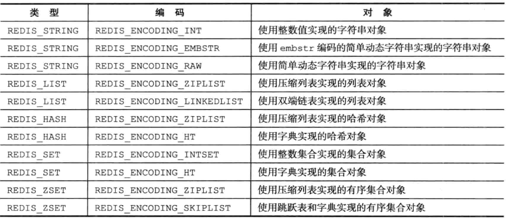</div>

使用OBJECT ENCODING命令可以查看一个数据库键的值对象的编码。

## (二).字符串对象

字符串对象的编码可以是int、raw或embstr。

1. 如果字符串对象保存的是整数值，且可以用long类型表示，那么字符串对象会将整数值保存在ptr中（将void* 转换成 long），并将编码设置为int。
2. 如果字符串对象保存到是一个字符串值，且长度大于32字节，那么字符串对象使用SDS来保存这个字符串值，并将编码设置为raw。
3. 如果字符串对象保存到是一个字符串值，且长度小于等于32字节，那么字符串对象使用embstr编码的方式来存储这个字符串值。

embstr编码是专门用来保存短字符串的优化方式。和raw编码一样，都是用redisObject结构和sdshdr结构来表示字符串对象，但raw会调用两次内存分配函数分别创建redisObject结构和sdshdr结构，而embstr则通过一次内存分配一块连续空间，依次包含两个结构：

<div align = center>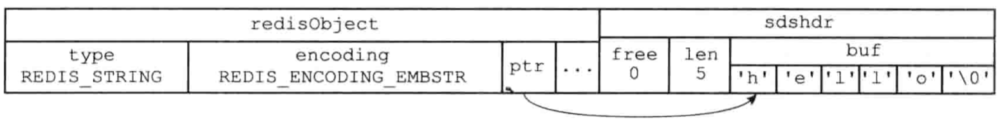</div>

embstr的好处：

1. 内存分配次数降为一次。
2. 释放字符串对象只要一次内存释放函数。
3. 因为内存连续，可以更好地利用缓存。

> PS. 用`long double`类型表示的浮点数在Redis中也是作为字符串值存储的。程序会先将浮点数转成字符串值，然后再保存转换的字符串值。

### 1.编码的转换

int编码和embstr编码的字符串对象可以被转换为raw编码的字符串对象。

1. 对int编码的字符串对象执行一些命令，可使其不再是整数值，而是字符串值，那么编码也就变为raw了。如APPEND。
2. 对embstr编码的字符串，执行修改命令，也会变成raw对象。如APPEND。

### 2.字符串命令的实现

用于字符串键的所有命令都是针对字符串对象来构建的。

| 命令       | int编码的实现方法                                            | embstr编码的实现方法                                         | raw编码的实现方法                                            |
| ---------- | ------------------------------------------------------------ | ------------------------------------------------------------ | ------------------------------------------------------------ |
| SET        | int编码保存值                                                | embstr编码保存值                                             | raw编码保存值                                                |
| GET        | 拷贝对象所保存的整数值，将这个拷贝转换为字符串值，然后向客户端返回这个字符串值 | 直接向客户端返回字符串值                                     | 直接向客户端返回字符串值                                     |
| APPEND     | 将对象转换为raw编码，然后按raw方式执行此操作                 | 将对象转换为raw编码，然后按raw方式执行此操作                 | 调用sdscatlen函数，将给定字符串追加到现有字符串的末尾        |
| INCBYFLOAT | 取出整数值并将其转换为long double的浮点数，对这个浮点数进行加法计算，然后将结果保存起来 | 取出整数值并将其转换为long double的浮点数，对这个浮点数进行加法计算，然后将结果保存起来。如果字符串值不能被转换为浮点数，那么客户端会报错 | 取出整数值并将其转换为long double的浮点数，对这个浮点数进行加法计算，然后将结果保存起来。如果字符串值不能被转换为浮点数，那么客户端会报错 |
| INCBY      | 对整数值进行加法计算，得出的结果作为整数被保存起来           | 不能执行此命令，客户端报错                                   | 不能执行此命令，客户端报错                                   |
| DECBY      | 对整数值进行减法计算，得出的结果作为整数被保存起来           | 不能执行此命令，客户端报错                                   | 不能执行此命令，客户端报错                                   |
| STRLEN     | 拷贝对象保存的整数值，将这个拷贝转换为字符串值，计算并返回这个字符串值的长度 | 调用sdslen函数，返回字符串的长度                             | 调用sdslen函数，返回字符串的长度                             |
| SETRANGE   | 将对象转换为raw编码，然后按raw方式执行此命令                 | 将对象转换为raw编码，然后按raw方式执行此命令                 | 将字符串特定索引上的值设置为给定的字符                       |
| GETRANGE   | 拷贝对象保存的整数值，将这个拷贝转换为字符串，然后取出返回字符串指定索引上的字符 | 直接取出并返回给定索引上的字符                               | 直接取出并返回给定索引上的字符                               |

## (三). 列表对象

列表对象的编码是ziplist或linkedlist。

使用ziplist时，每个压缩列表的节点保存了一个列表元素。使用linkedlist时，每个链表节点保存了一个字符串对象，而每个字符串对象都保存了一个列表元素。

> **字符串对象是Redis五种类型的对象中唯一一种会被嵌套的对象。**

### 1.编码转换

当列表对象同时满足以下两个条件时，使用ziplist编码：

1. 保存的字符串对象的长度都小于64字节。
2. 保存的元素数量小于512个。

否则就是用linkedlist编码。

> 以上两个条件的上限可以修改，使用list-max-ziplist-value选项和list-max-ziplist-entries选项。

### 2.列表命令的实现

| 命令    | ziplist编码的实现                                            | linkedlist编码的实现                                         |
| ------- | ------------------------------------------------------------ | ------------------------------------------------------------ |
| LPUSH   | 调用ziplistPush函数，将新元素压入表头                        | 调用listAddNodeHead函数，将新元素压入表头                    |
| RPUSH   | 调用ziplistPush函数，将新元素压入表尾                        | 调用listAddNodeTail函数，将新元素压入表尾                    |
| LPOP    | 调用ziplistIndex定位表头节点，返回节点保存的元素后，调用ziplistDelete删除表头结点 | 调用lsitFrist定位表头节点，返回节点保存的元素后，调用listDelNode删除表头结点 |
| RPOP    | 调用ziplistIndex定位表尾节点，返回节点保存的元素后，调用ziplistDelete删除表尾结点 | 调用listLast定位表尾节点，返回节点保存的元素后，调用listDelNode删除表尾结点 |
| LINDEX  | 调用ziplistIndex                                             | 调用listIndex                                                |
| LLEN    | 调用ziplistLen                                               | 调用listLength                                               |
| LINSERT | 插入新节点到表头或表尾时，使用ziplistPush；其他位置使用ziplistInsert | 调用listInsertNode                                           |
| LREM    | 遍历节点，调用ziplistDelete删除包含给定元素的节点            | 遍历节点，调用listDelNode删除包含给定元素的节点              |
| LTRIM   | 调用ziplistDeleteRange函数删除不再指定索引范围内的节点       | 遍历节点，调用listDelNode                                    |
| LSET    | 调用ziplistDelete，先删除给定索引上的节点，然后调用ziplistInsert插入新节点 | 调用listIndex函数，定位给定索引上的节点，然后通过赋值操作更新节点的值 |

## (四).哈希对象

希对象的编码可以是ziplist或hashtable。

使用ziplist时，每当有新的键值对要加入哈希对象时，程序先保将存了**键**的压缩列表对象推入到表尾，然后再将保存了**值**的节点推入到表尾。因此：

1. 保存了同一键值对的两个节点总是挨在一起。
2. 先添加的键值对会被放在表头，后添加的在表尾。

<div align = center>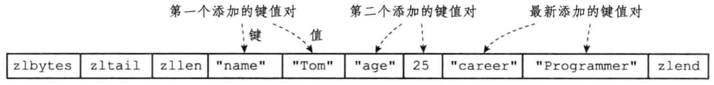</div>

使用hashtable时，哈希对象中的每个键值对都使用一个字典键值对来保存：

- 字典的每个键都是一个字符串对象，对象中保存了键值对的键。
- 字典的每个值都是一个字符串独显，对象中保存了键值对的值。

<div align = center>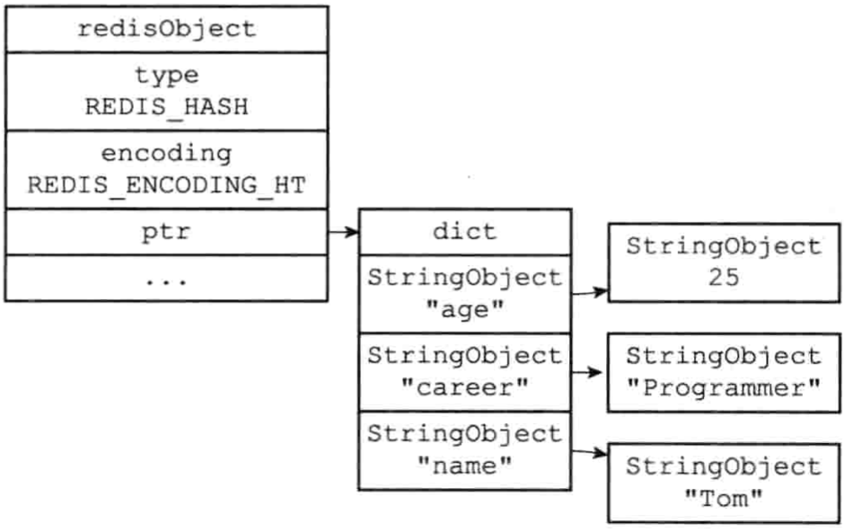</div>

### 1.编码转换

当哈希对象同时满足以下两个条件时，使用ziplist编码：

1. 哈希对象保存的所有键值对的键和值的字符串长度都小于64字节。
2. 哈希对象保存的键值对数量小于512个。

否则就使用hashtable编码。

> 以上两个条件的上限可以修改，使用hash-max-ziplist-value选项和hah-max-ziplist-entries选项。

### 2.哈希命令的实现

| 命令    | ziplist编码的实现                                            | hashtable编码的实现                            |
| ------- | ------------------------------------------------------------ | ---------------------------------------------- |
| HSET    | ziplistPush将元素压入表尾，然后再ziplistPush将值压入表尾     | dictAdd添加新节点                              |
| HGET    | ziplistFind查找指定键对应的节点，再ziplistNext将指针移动到键节点旁边的值节点，返回直值节点 | dictFind查找给定键，然后dictGetVal返回对应的值 |
| HEXISTS | ziplistFind查找指定键对应的节点                              | dictFind                                       |
| HDEL    | ziplistFind，然后删除键节点和值节点                          | dictDelete                                     |
| HLEN    | ziplistLen，然后除以2                                        | dictSize                                       |
| HGETALL | 遍历ziplist，ziplistGet返回所有的键和值                      | 遍历字典，dictGetKey返回键，dictGetVal返回值   |

## (五).集合对象

集合对象的编码可以使intset或hashtable。

1. inset编码，集合对象的所有元素都被保存在整数集合中。

<div align = center>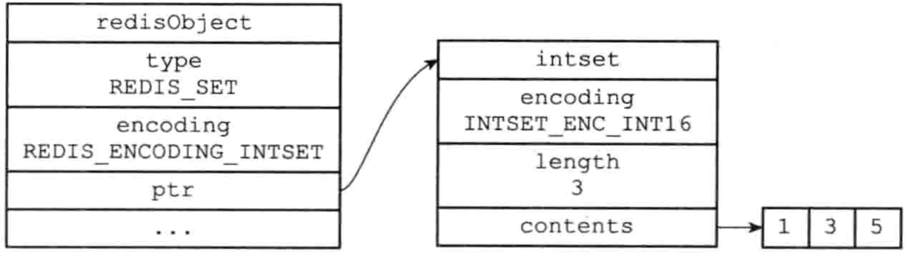</div>

2. hashtable编码，字典的每个键都是一个字符串对象，每个字符串对象都包含了一个集合元素，字典的值全部为NULL。

<div align = center>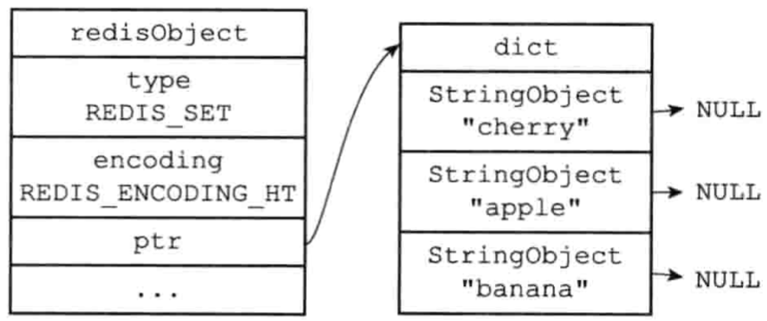</div>

### 1.编码的转换

当集合对象同时满足一下两个条件时，使用inset编码：

1. 所有元素都是整数值。
2. 元素数量不超过512个。

> 第二个的上限修改，查看set-max-intset-entries选项。

### 2.集合命令的实现

| 命令        | intset编码的实现                | hashtable编码的实现              |
| ----------- | ------------------------------- | -------------------------------- |
| SADD        | intsetAdd                       | dictAdd                          |
| SCARD       | intsetLen                       | dictSize                         |
| SISMEMBER   | intsetFind                      | dictFind                         |
| SMEMBERS    | 遍历集合，使用intsetGet返回元素 | 遍历字典，使用dictGetKey返回元素 |
| SRANDMEMBER | intsetRandom随机返回一个元素    | dictGetRandomKey                 |
| SPOP        | intsetRandom，然后intsetRemove  | dictGetRandomKey，然后dictDelete |
| SREM        | intsetRemove                    | dictDelete                       |

## (六).有序集合对象

有序集合的编码是ziplist或skiplist。

ziplist编码：每个集合元素使用两个紧挨在一起的ziplist节点来存储。

第一个节点保存元素的成员（member），第二元素保存元素的分值（score）。元素按分值的从小到大排序。

<div align = center>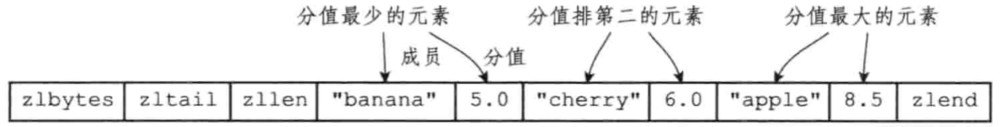</div>

skiplist编码：一个zset结构同时包含一个字典和一个跳跃表。

+ 跳跃表按分值从小到大保存了所有集合元素，每个跳跃表节点都保存了一个集合元素，节点的object保存了元素的成员，score保存了元素的分值。
+ 字典为有序集合创建了一个从成员到分值的映射，字典中的每个键值对都保存了一个集合元素，键保存了元素的成员，值保存了元素的分值。

<div align = center>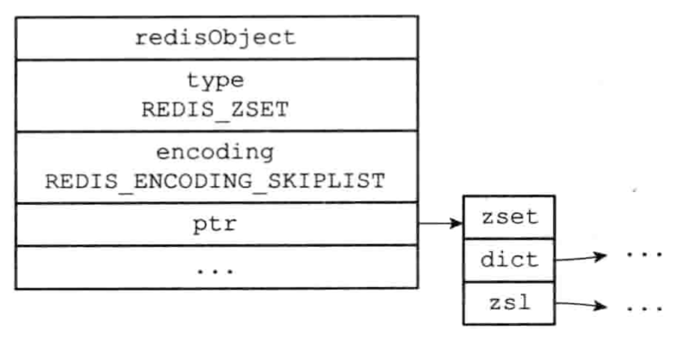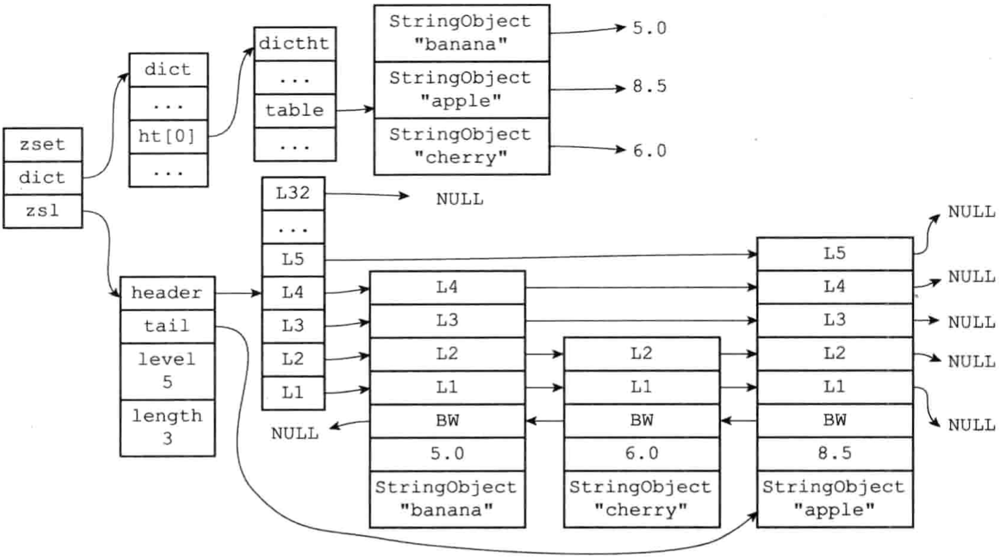</div>

**有序集合同时使用跳跃表与字典来实现的原因：**

+ 如果只以字典来实现有序集合，以*O(1)*的时间复杂度查找成员的特性会被保留，但是进行排序需要至少 *O(NlogN)* 时间复杂度
+ 如果执意跳跃表来实现有序集合，则跳跃表执行范围性操作的所有优点都会保留，但是查找分值的操作的时间复杂度从 *O(1)* 上升到 *O(logN)* 
+ 所以同时使用两者能各取其所长

> 值得注意的是：实际中，字典与跳跃表共享元素的成员与分值，不会造成任何数据的重复，因此不会浪费内存。

### 1.编码的转换

有序集合满足以下两个条件时，使用ziplist编码：

1. 元素数量小于128。
2. 元素成员的长度小于64个字节。

不满足上述条件，则使用skiplist编码

> 两个条件的上限参考zset-max-ziplist-entries和zset-max-ziplist-value选项。

### 2.有序集合命令的实现

| 命令      | ziplist编码的实现                                | zset编码的实现                                               |
| --------- | ------------------------------------------------ | ------------------------------------------------------------ |
| ZADD      | ziplistInsert将成员和分值两个节点分别插入        | zslInsert，将新元素插入跳跃表，然后dictAdd将新元素关联到字典 |
| ZCARD     | ziplistLen，然后除以2                            | 访问跳跃表的length                                           |
| ZCOUNT    | 遍历列表，统计分值在给定范围内的节点的数量       | 遍历跳跃表                                                   |
| ZRANGE    | 从头到尾遍历                                     | 从头到尾遍历跳跃表                                           |
| ZREVRANGE | 从尾向头遍历                                     | 从尾向头遍历                                                 |
| ZRANK     | 从头到尾遍历，查找给定成员，并记录经过节点的数量 | 从头到尾遍历，查找给定成员，并记录经过节点的数量             |
| ZREVRANK  | 从尾向头遍历，查找给定成员，并记录经过节点的数量 | 从尾向头遍历，查找给定成员，并记录经过节点的数量             |
| ZREM      | 遍历，删除包含给定成员的节点及旁边的分值节点     | 遍历跳跃表，删除节点，并在字典中解除被删除元素的成员和分值的关联 |
| ZSCORE    | 遍历查找成员节点，返回旁边的分值节点             | 从字典中取出给定成员的分值                                   |

## (七).类型检查与命令多态

Redis中用于操作键的命令基本上可以分为两种类型：

+ 可以对任何类型的键执行，如 DEL，EXPIRE，RENAME，TYPE，OBJECT等
+ 只能对特定类型的键执行，如 SET，GET，APPEND，STRLEN

### 1.类型检查的实现

类型检查是通过redisObject的type属性来的。

+ 在执行一个类型特定的命令之前，Redis会先检查输入键的类型是否正确，然后再决定是否执行。

+ 否则，服务器会拒绝执行命令，并向客户端返回一个类型错误。

### 2.多态命令的实现

DEL，EXPIRE，TYPE等命令是多态命令。

+ DEL，EXPIRE是类型的多态——一个命令可以同时用于处理多个不同类型的键
+ TYPE 是编码的多态——一个命令可以同时用于处理多种不同的编码

Redis根据值对象的类型，编码方式来选择正确的实现命令来执行。这就是多态。

LLEN命令的执行过程：

<div align = center>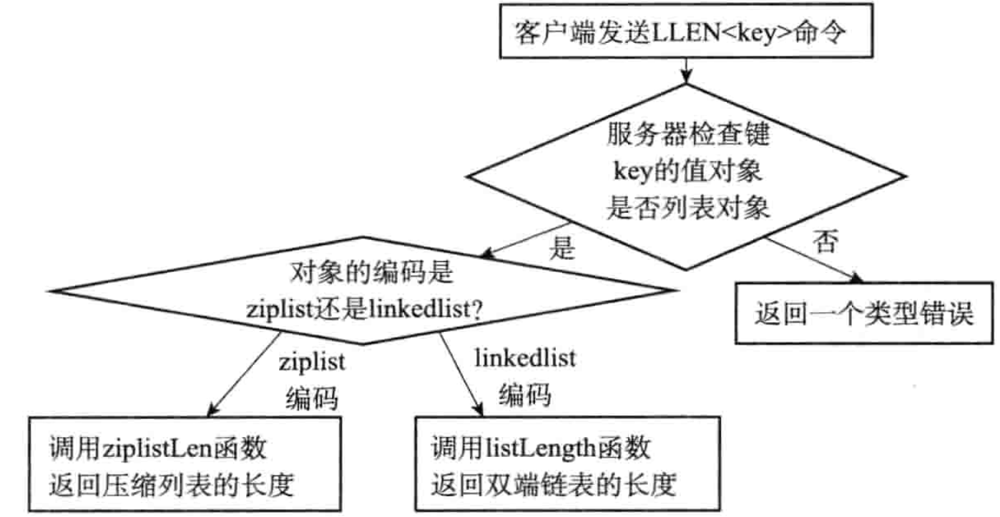</div>

## (八).内存回收

edis为对象系统构建了一个引用计数垃圾回收。每个对象的引用计数由redisObject结构的refcount保存。

| 操作                   | 引用计数的变化 |
| ---------------------- | -------------- |
| 创建一个新对象         | 初始化为1      |
| 对象被一个新程序使用   | +1             |
| 对象不再被一个程序使用 | -1             |

当计数变为0时，对象占用的内存就会被释放。

修改对象引用计数器的API：

<div align = center>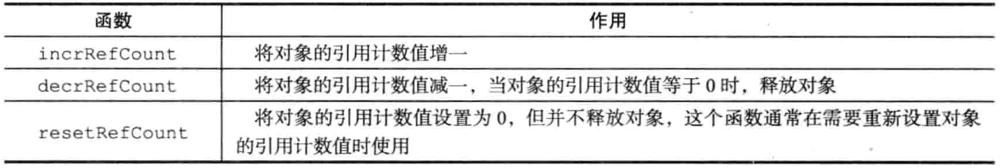</div>

## (九).对象共享

refcount还可用于对象共享：

1. 将数据库键的值指向现有的值对象。
2. refcount++。

Redis在初始化服务器时，创建了10000个字符串对象，包含0 ~ 9999的所有整数值，用于共享。

> 数量通过redis.h/REDIS_SHARED_INTSETGERS常量控制。

使用OBJECT REFCOUNT可查看值对象的引用计数。

**但Redis只对包含整数值的字符串对象共享**。 即只有共享对象和目标对象完全相同的情况下。一个共享对象保存的值越复杂，验证共享对象和目标对象是否相同的操作也就越复杂。

## (十).对象的空转时长

redisObject最后一个属性lru，记录了对象最后一次被访问的时间，用OBJECT IDLETIME可查看。

> OBJECT IDLETIME不修改对象的lru属性

如果服务器打开了maxmemory属性，lru对象可用于回收内存，回收算法为：volatile-lru，allkeys-lru。

