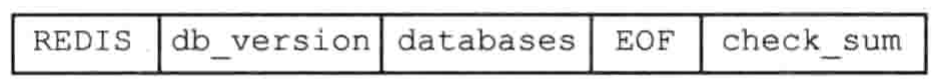
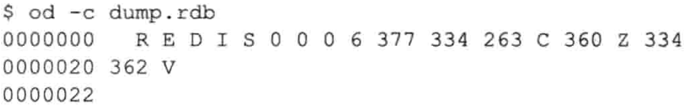
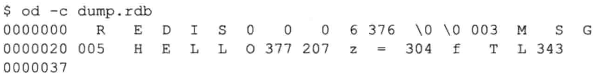
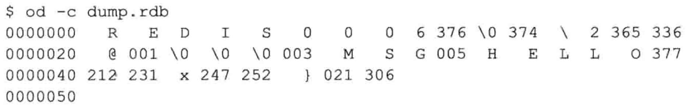
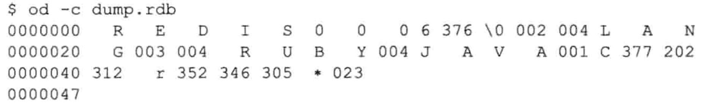

# 九.数据库

## (一.)服务器中的数据库

Redis服务器将所有数据库都保存在服务器状态redis.h/redisServer结构的db数组中，数组的每个项都是一个redis.h/redisDb结构，每个redisDb结构代表一个数据库：

```c++
struct redisServer {
    // ...
    redisDb *db;
    int dbnum; 		// 数据库的数量
    // ...
};
```

其中dbnum的值有服务器配置的database选项决定，默认为16，即Redis服务器默认会创建16个数据库。

## (二).切换数据库

每个Redis客户端都有自己的目标数据库，每当客户端执行数据库读写命令时，目标数据库都会成为这些命令的操作对象。

服务器内部，客户端状态 `redisClient` 结构的db属性记录了客户端当前的目标数据库，这个属性是一个指向redisDb结构的指针：

```c++
typedef struct redisClient {
    // ...
    redisDb *db;	//记录客户端当前正在使用的数据库
    // ...
} redisClient;
```

`redisClient.db` 指针指向 `redisServer.db` 数组的其中一个元素，它就是客户端的目标数据库。 

如果某个客户端的目标数据库为1号的数据库，下图就表示这个客户端所对应的客户端与服务器之间的关系。

<div align = center></div>


## (三).数据库键空间

Redis是一个键值对（key-value pair）数据库服务器，服务器中的每个数据库都由一个 `redis.h/redisDb` 结构表示。其中，redisDb结构的dict字典保存了数据库的所有键值对，这个字典就是键空间(key space)。

```c++
typedef struct redisDb {
    // ...
    dict *dict;	//数据库键空间，保存着数据库中的所有键值对
    // ...
} redisDb;
```

键空间和用户所见的数据库是直接对应的：

- 键空间的键也就是数据库的键。每个键都是一个字符串对象。
- 键空间的值也是数据库的值。每个值可以使字符串对象、列表对象、哈希表对象、集合对象、有序集合对象。

以下面的代码为例：

<div align = center></div>

执行后，数据库的键空间如下图所示：

<div align = center></div>

所有针对数据库的操作，实际上都是通过键空间字典来实现。

### 1.添加新键

添加一个新键值对到数据库，就是将新键值对添加到键空间字典中。

### 2.删除键

删除数据库中的一个键，就是在键空间中删除键所对应的键值对对象。

### 3.更新键

更新数据库的一个键，就是对键空间里键所对应的值对象进行更新。根据值对象类型的不同，更新的具体方法也不同。

#### 4.对键取值

对一个数据库键取值，就是在键空间中取出键所对应的值对象。

> 操作基本都是分两步：
>
> 1. 查找键
> 2. 取值

### 5.读写键空间时的维护操作

当Redis对数据库读写时，不仅对键空间执行指定的操作，还会执行一些额外的维护：

1. 读取一个键后，更新服务器的键命中次数或不命中次数。这两个值可通过`INFO stats`命令的`keyspace_hits`与`keyspace_misses` 两个属性进行查看。
2. 读取一个键后，更新LRU时间。`OBJECT idletime <key>`查看键key的闲置时间。
3. 读取键时发现已过期，服务器会删除这个过期键。
4. 如果有客户端`WATCH`了某个键，修改后将键标记为dirty，从而让事物程序注意到这个键已被修改过。
5. 每次修改一个键后，将dirty键计数器的值+1，这个计数器会触发服务器的持久化和赋值操作。
6. 如果服务器开启了通知功能，键修改后，服务器会按照配置发送通知。

## (四).设置键的生存时间或过期时间

### 1.设置过期时间

+  `EXPIRE <key> <ttl>`命令将键key的生存时间设置为ttl秒
+  `PEXPIRE <key> <ttl>` 命令将键key的生存时间设置为ttl毫秒

+  `EXPIREAT <key> <timestamp>`用于将键key的过期时间设置为timestamp所指定的秒数时间戳
+ `PEXPIREAT <key> <timestamp>`用于将键key的过期时间设置为timestamp所指定的毫秒数时间戳

实际上，`EXPIRE`、`PEXPIRE`、`EXPIREAT`三个命令都是使用`PEXPIREAT`来实现的。

### 2.保存过期时间

redisDb结构的expires字典保存了所有键的过期时间：

- 过期字典的键是一个指针，指向键空间中的某个键对象。
- 过期字典的值是一个`long long`类型的整数，保存了一个UNIX时间戳。

```c++
typedef struct redisDb {
    // ...
    dict *expires;	//过期字典，保存着键的过期时间
    // ...
} redisDb;
```

下图展示了一个带有过期字典的数据库例子

<div align = center></div>

> 重复出现的对象是为了方便展示，实际中键空间的键和过期字典的键都指向同一个键对象。

`PEXPIREAT`的伪代码定义：

```python
def PEXPIREAT(key, expire_time_in_ms):
    # 如果键不存在于键空间，那么不能设置过期时间
    if key not in redisDb.dict:
        return 0
    # 在过期字典中关联键和过期时间
    redisDb.expires[key] = expire_time_in_ms
    # 设置成功过
    return 1
```

### 3.移除过期时间

`PERSIST`可以移除一个键的过期时间，在过期字典中找到给定的键，解除键和值(过期时间)的关联。

```Python
def PERSIST(key):
    # 如果键不存在或者没有设置过期时间
    if key not in redisBb.expires:
        return 0
    redisDb.expires.remove(key)
    return 1
```

### 4.计算并返回剩余生存时间

+ `TTL` 命令以秒为单位返回键的剩余生存时间
+ `PTTL` 命令以毫秒为单位返回键的剩余生存时间

`TTL`和`PTTL`都是通过计算键的过期时间和当前时间的差来实现的：

```Python
def PTTL(key):
  	#键不存在与数据库
    if key not in redisDb.dict:
        return -2
    #尝试取得键的过期时间
    #如果键没有设置过期时间，那么 expire_time_in_ms 将为None
    expire_time_in_ms = redisDb.expires.get(key)
    
    #键没有设置过期时间
    if expire_time_in_ms is None:
        return -1
    
    #获取当前时间
    now_ms = get_current_unix_timestamp_in_ms()
    
    #过期时间减去当前时间，得出的差就是键的剩余生存时间
    return expire_time_in_ms - now_ms
  
def TTL(key)
		#获取以毫秒为单位的剩余生存时间
		ttl_in_ms = PTTL(key)
  
  	if ttl_in_ms < 0 :
      	#处理返回值为-2与-1的情况
      	return ttl_in_ms
    else:
      	#将毫秒转换为秒
      	return ms_to_sec(ttl_in_ms)
```

### 5.过期键的判定

通过过期字典，程序可通过以下步骤来判定键是否过期：

1. 检查给定键是否存在于过期字典，如果存在，取得其过期时间
2. 检查当前UNIX时间戳是否大于其过期时间

## (五).过期键删除策略

有三种不同的键删除策略：

>  定时删除与定期删除为主动删除策略，惰性删除为被动删除策略

| 策略     | 操作                                                         | 优点                             | 缺点                         |
| -------- | ------------------------------------------------------------ | -------------------------------- | ---------------------------- |
| 定时删除 | 设置键的过期时间的同时，创建一个定时器，让定时器在键的过期时间来临时立即执行删除操作。 | 对内存最友好，保证会尽快释放内存 | 对CPU时间不友好              |
| 惰性删除 | 每次从键空间获取键时，检查其是否过期，过期则删除；否则就返回该键。 | 对CPU时间最友好                  | 对内存不友好                 |
| 定期删除 | 每隔一段时间，对数据库进行一次检查，删除所有的过期键。       | 上述两种策略的整合和折中         | 难点在于确定删除的时长和频率 |

## (六).Redis的过期键删除策略

Redis服务器使用的是 **惰性删除** 和 **定期删除** 两种策略。

### 1.惰性删除策略的实现

惰性删除的策略由db.c/exipireIfNeeded函数实现，所有读写数据库的Redis命令都会在执行前调用该函数对输入键进行检查：

+ 如果输入键已经过期，那么exipireIfNeeded函数将输入键从数据库中删除
+ 如果输入键未过期，那么exipireIfNeeded函数不作为

exipireIfNeeded函数就像一个过滤器，在命令真正执行之前，过滤掉过期的输入键，从而避免命令接触到的过期键。

<div align = center></div>

### 2.定期删除策略的实现

定期删除的策略由redis.c/activeExpireCycle函数实现，每当Redis服务器周期性操作redis.c/serverCron 函数执行时，该函数会被调用。它在规定时间内，分多次遍历各个数据库，检查过期时间并删除过期键。

```python
DEFAULT_DB_NUMBERS = 16			#默认每次检查的数据库数量
DEFAULT_KEY_NUMBERS = 20		#默认每个数据库检查的键数量
current_db = 0							#全局变量，记录检查进度

def activeExpireCycle():
  
  	# 初始化要检查的数据库数量
    # 如果服务器的数据库数量比 DEFAUKT_DB_NUMBERS 小
    # 那么以服务器的数据库数量为准
    if server.dbnum < DEFAUKT_DB_NUMBERS:
        db_numbers = server.dbnum
    else:
    	db_numbers = DEFAULT_DB_NUMBERS
       
    # 遍历各个数据库
    for i in range(db_numbers):
        # 如果 current_db 的值等于服务器的数据库数量
        # 这表示检查程序已经遍历了服务器的所有数据库一次
        # 将current_db重置为0，开始新一轮的遍历
        if current_db == server.dbnum:
            current_db = 0
        
        # 获取当前要处理的数据库
        redisDb = server.db[current_db]
        # 将数据库索引增1，指向下一个要处理的数据库
        current_db += 1
        
        # 检查数据库键
        for j in range(DEFAULT_KEY_NUMBERS):
          
          	# 如果数据库中没有一个键带有过期时间，那么跳过这个数据库
            if redisDb.expires.size() == 0:
                break
            
            # 随机获取一个带有过期时间的键
            key_with_ttl = redisBb.expires.get_random_key()
            
            # 检查键是否过期，如果过期就删除它
            if is_expired(key_with_ttl):
                delete_key(key_with_ttl)
            
            # 已达时间上限，停止处理
            if reach_time_limit(): 
                return
```

activeExpireCycle的工作模式总结如下：

- 函数运行时，会从一定数量的数据库中取出一定数量的随机键检查并删除。
- 全局变量current_db记录当前检查的进度，并在下一次调用时接着处理上一次的进度。
- 随着activeExpireCycle的不断执行，所有数据库都会被检查一遍，这是current_db重置为0，再次开始新一轮动机检查。

## (七).AOF，RDB 和复制功能对过期键的处理

### 1.RDB文件生成与载入

执行SAVE或BGSAVE命令时会创建一个新的RDB文件，已过期的键不会保存到RDB中。

在启动服务器时，如果开启了RDB功能，服务器会载入RDB文件：

- 如果服务器以主服务器模式运行，那么载入RDB时，会检查文件中的键，过期键会被忽略。
- 如果服务器以从服务器模式运行，那么载入RDB时，不管键是否过期，一律载入。其后，在主从服务器同步时，从服务器的数据库就会被清空。

### 2.AOF文件写入与重写

服务器以AOF持久化模式运行时，如果某个键已过期，但还没有被删除，那么AOF文件不会因为这个过期键而产生任何影响。但过期键被删除后，程序会向AOF文件追加一条DEL命令，显式记录该键已被删除。如果执行的是GET命令，会向客户端返回空回复。

AOF重写过程中，程序会对键进行检查，已过期的键不会被保存到重写后的AOF文件中。

### 3.复制

**当服务器处于复制模式下时，过期键删除动作由主服务器控制，这就保证了一致性：**

- 主服务器删除一个过期键后，显式向从服务器发送DEL命令，让从服务器删除这个过期键
- 从服务器执行客户端发送的读命令时，即时碰到过期键也不会删除，而是像初期未过期的键一样
- 从服务器接到主服务器的DEL命令后，才会删除过期键

## (八).数据库通知

数据库通知是Redis 2.8新增加的功能，让客户端通过订阅可给定的频道或模式，来获取数据库中键的变化，以及数据库命令的执行情况。

+  “某个键执行了什么命令”的通知成为「键空间通知」。
+  “某个命令被什么键执行了”是「键时间通知」。

服务器配置的notify-keyspace-events选项决定了服务器发送通知的类型。

### 1.发送通知

发送通知的功能由notify.h/notifyKeyspaceEvent函数实现的：

```C++
void notifyKeyspaceEvent(int type, char *event, robj *key, int dbid);
```

+ type参数是当前想要发送的通知的类型，程序以此来判断通知是否为服务器配置notify-Keyspace-events选项所选定的通知类型，从而决定是否发送通知。
+ `event,keys,dbid`分别是事件的名称，产生事件的键，以及产生事件的数据库号码，函数会根据type参数type参数以及这三个参数来构建事件通知的内容，以及接收通知的频道名。

每当一个Redis命令需要发送数据库通知时，该命令的实现函数就会调用notifyKeyspaceEvent函数，并向函数传递传递该命令所引发的事件的相关信息。

### 2.发送通知的实现

以下为notifyKeyspaceEvent函数的伪代码实现：

```python
def notifyKeyspaceEvent(type, event, key, bdid):
  	# 如果给定的通知不是服务器允许发送的通知，那么直接返回
    if not (server.notify_keyspace_events & type):
        return
    
    # 发送键空间通知
    if server.notify_keyspace_events & REDIS_NOTIFY_KEYSPACE:
        # 将通知发送给频道 __keyspace@<dbid>__:<key>
        # 内容为键所产生的事件 <event>
        
        # 构建频道的名字
        chan = "_keyspace@{bdid}__:{key}".format(dbid_dbid, key=key)
        # 发送通知
        pubsubPublishMessage(chan, event)
    
    # 发送键事件通知
    if server.notify_keyspace_events & REDIS_NOTIFY_KEYEVENT:
      	# 将通知发送给频道 __keyspace@<dbid>__:<event>
        # 内容为键所产生的事件 <key>
        
        #构建频道名字
        chan = "_keyspace@{bdid}__:{event}".format(dbid_dbid, event=event)
       	#发送通知
        pubsubPublishMessage(chan, key)
```

---

# 十.RDB持久化

RDB持久化可将内存中的数据库状态保存到磁盘上，避免数据丢失。持久化可以手动，也可以根据服务器配置选项定期执行。

RDB持久化生成的RDB文件是一个压缩过的二进制文件，通过该文件可以还原生成RDB文件时的数据库状态

## (一).RDB文件的创建与载入

有两个命令可以生成RDB文件：

1. SAVE。该命令会阻塞Redis服务器进程，直到RDB文件创建完毕，期间拒绝任何命令请求。
2. BGSAVE。派生出一个子进程来创建RDB文件，服务器进程（父进程）继续处理命令请求。

> 在BGSAVE命令执行期间，服务器处理SAVE、GBSAVE、BGREWRITEAOF命令会被拒绝执行。
>
> + 对于SAVE、GBSAVE都是避免父进程(服务器进程)与子进程同时执行两个rdbSave调用，防止产生竞争条件。
> + 对于BGREWRITEAOF，在执行BGREWRITEAOF期间会拒绝BGSAVE操作，相反时会进行等待，再执行BGREWRITEAOF操作。不能同时执行是为了性能方面的考虑，而且两个子进程同时执行大量的磁盘写入操作并不是一个好主意。

创建RDB文件的操作由`rdb.c/rdbSave`函数完成。

RDB文件的载入工作在服务器启动时自动执行。

另外，AOF文件的更新频率比RDB文件要高，所以：

- 如果服务器开启了AOF，那么优先用AOF来还原数据库。
- 只有在AOF关闭时，服务器才会用RDB来还原数据库。

载入RDB文件的工作由`rdb.c/rdbLoad`函数完成。载入RDB文件期间，服务器一直处于阻塞状态。

##(二).自动间隔性保存

### 1.设置保存条件

Redis允许用户通过设置服务器配置的save选项，每隔一段时间执行一次BGSAVE命令。配置如下：

> save 900 1
>
> save 300 10
>
> save 60 10000

那么上述三个条件只要满足任意一个，BGSAVE命令就会被执行：

1. 服务器在900秒内，对服务器进行了至少1次修改。
2. 服务器在300秒内，对服务器进行了至少10次修改。
3. 服务器在60秒内，对服务器进行了至少10000次修改。

当Redis服务器启动时，用户可以指定配置文件或者传入启动参数的方式设置save选项。如果没有主动设置，服务器默认使用上述三个条件。接着，服务器会根据save的条件，设置`redisServer`结构的`saveParams`属性。

```c++
struct redisServer {
    // ...
    struct saveparam *saveparams; // 保存条件的数组
    long long dirty;							// 修改计数器
    time_t lastsave;							// 上一次执行保存的时间
    //...
}

struct saveparam {
    time_t seconds; 	// 秒数
    int changes; 			// 修改数
}
```

除此之外，服务器还维持着一个dirty计数器，以及一个lastsave属性。

- dirty记录上一次成功`SAVE`或`BGSAVE`之后，服务器对数据库状态进行了多少次修改。
- lastsave是一个UNIX时间戳，记录了服务器上一次成功`SAVE`或`BGSAVE`的时间。

### 2.检查保存条件是否满足

服务器的周期性操作函数`serverCron`默认每个100毫秒就会执行一次，其中一项工作是检查save选项所设置的保存条件是否满足，如果满足，就会自动执行BGSAVE命令，这就是进行间隔性数据保存的实现原理。

## (三).RDB文件结构

RDB文件的各个部分包括：

<div align = center></div>

+ 开头是REDIS部分，长度为5。保存了五个字符，以便载入时确认是否为RDB文件。
+ db_version长4字节，是一个字符串表示的整数，记录了RDB文件的版本号，如`0006`。
+ databases部分包含数据库，以及各个数据库的键值对数据。
+ EOF长度为1字节，标识这RDB正文内容的结束。
+ check_sum是8字节长度的无符号整数，保存着检验和。

### 1.databases部分

databases部分包含了0个或多个数据库，以及各个数据库中的键值对数据。一个保存了0号和3号数据库的RDB文件如下：

<div align = center></div>

每个非空数据库在RDB文件中都可保存为以下三部分：

<div align = center></div>

- SELECTEDB：1字节。但程序遇到这个值的时候，它就知道接下来要读入的将是一个数据库号码。
- db_number：保存着一个数据库号码，根据号码的大小不同，长度可以是1字节，2字节或者5字节。当程序读取号码之后，服务器会调用`SELECT`命令切换数据库。
- key_value_pairs：保存着数据库中的所有键值对数据，根据键值对的数量，类型，内容以及是否过期时间等条件的不同，key_value_pairs部分的长度也会有所不同。

### 2.key_value_pairs部分

RDB文件中的每个key_value_pairs部分都保存了一个或以上数量的键值对，如果带有过期时间的话，那么键值对的过期时间也会保存在内。

不带过期时间的键值对如下图所示：

<div align = center></div>

+ TYPE：记录value的类型，长度为1字节。
+ key：字符串对象，编码方式与REDIS_RDB_TYPE_STRING类型的value一样。
+ value：根据TYPE类型不同，以及保存内容长度的不同，保存value的结构和长度也会有所不同。

带有过期时间的键值对如下图所示：

<div align = center></div>

+ EXPIRETIME_MS：长度为1字节的常量，标识着将要读入的是一个过期时间
+ ms：长度为8字节的带符号整数，记录着一个以毫秒为单位的UNIX时间戳

### 3.value的编码

#### (1).字符串对象

 TYPE的值为REDIS_RDB_TYPE_STRING时，value保存的是一个字符串对象，对象的编码方式有以下两种：

+ REDIS_ENCODING_INT：对象保存的是长度不超过32位的整数

+ REDIS_ENCODING_RAW：对象保存的是一个字符串值，根据字符串长度的不同，保存方法是：

  + 长度小于等于20字节，字符串会被原样保存，结构为：`长度|字符串`

  + 长度大于20字节，字符串会被压缩后保存，结构如下图

    <div align = center></div>

    + REDIS_RDB_ENC_LZF：常量标识字符串已被LZF算法压缩过
    + compressed_len：记录字符串压缩后的长度
    + origin_len：记录字符串原来的长度
    + compressed_string：记录压缩后的字符串

#### (2).列表对象

 TYPE的值为REDIS_RDB_TYPE_LIST时，value保存的是一个编码为REDIS_ENCODE_LINKEDLIST的列表对象。保存的结构如下图所示：

<div align = center></div>

+ list_length：表示列表的长度，记录保存了多少个项

+ item1：表示记录的每一个项

#### (3).集合对象

 TYPE的值为REDIS_RDB_TYPE_SET时，value保存的是一个编码为REDIS_ENCODE_HT的集合对象。保存的结构如下图所示：

<div align = center></div>

+ set_size：表示集合的大小，记录保存了多少对象
+ elem1：记录每一个元素

#### (4).哈希表对象

 TYPE的值为REDIS_RDB_TYPE_HASH时，value保存的是一个编码为REDIS_ENCODE_HT的集合对象。保存的结构如下图所示：

<div align = center></div>

+ hash_size：表示哈希表的大小，记录了保存的键值对个数
+ key_value_pair：表示键值对元素

#### (5).有序集合对象

 TYPE的值为REDIS_RDB_TYPE_ZSET时，value保存的是一个编码为REDIS_ENCODE_SKIPLIST的有序集合对象。保存的结构如下图所示：

<div align = center></div>

+ sorted_set_size：表示有序集合的大小，记录了保存的有序集合个数
+ element：表示有序集合元素，分为两部分：
  + 记录元素长度的变量member
  + 记录元素值的变量score

#### (6).INTSET编码的集合

TYPE的值为REDIS_RDB_TYPE_SET_INTSET时，value保存的是一个整数集合对象。

RDB的保存方法是先把整数集合转换为字符串对象，然后将这个字符串对象保存到RDB文件中。

#### (7).ZIPLIST编码的列表,哈希表或者有序集合

TYPE的值为REDIS_RDB_TYPE_LIST_ZIPLIST，REDIS_RDB_TYPE_HASH_ZIPLIST，REDIS_RDB_TYPE_ZSET_ZIPLIST时，value保存的是一个压缩列表对象。

RDB的保存方法是：

1. 将压缩列表转换成一个字符串对象
2. 将转换的字符串对象保存到RDB文件中

如果程序在读入RDB文件时碰到有压缩列表对象转换成的字符串对象，那么程序会根据TYPE值的知识，执行以下操作：

1. 读入字符串对象，并将它转换成原来的压缩列表对象
2. 根据TYPE的值，设置压缩列表对象的类型

## (四).分析RDB文件

od命令分析RDB文件。-c参数可以以ASCII编码打印文件。Redis自带的文件检查工具是redis-check-dump。

### 1.不包含任何键值对的RDB文件

<div align = center></div>

+ `REDIS` ：5个字节的开头标识
+ `0006` ：4个字节的版本号
+ `337` ：1个字节的EOF常量
+ `334 263 C 360 Z 334` ：8个字节的检验和

### 2.包含字符串键的RDB文件

<div align = center></div>

+ `REDIS` ：5个字节的开头标识
+ `0006` ：4个字节的版本号
+ `376 \0` ：整数0，表示保存的数据库为0号数据库
+ `\0` ：常量整数0，代表TYPE的类型为 REDIS_RDB_TYPE_STRING
+ `003 MSG` ：键MSG的长度
+ `005 HELLO` ：值HELLO的长度
+ `337` ：1个字节的EOF常量

### 3.包含过期时间的字符串键的RDB文件

<div align = center></div>

+ `REDIS` ：5个字节的开头标识
+ `0006` ：4个字节的版本号
+ `376 \0` ：整数0，表示保存的数据库为0号数据库
+ `\ 2 365 336 @ 001 \0 \0` ：代表8字节长的过期时间
+ `003 MSG` ：键MSG的长度
+ `005 HELLO` ：值HELLO的长度
+ `337` ：1个字节的EOF常量

### 4.包含一个集合键的RDB文件

<div align = center></div>

+ `REDIS` ：5个字节的开头标识
+ `0006` ：4个字节的版本号
+ `376 \0` ：整数0，表示保存的数据库为0号数据库
+ `002 004 L A N G` ：
  + 002 是常量REDIS_RDB_TYPR_SET
  + 004 是键的长度
  + LANG 是键的名称
+ `003` ：集合的大小
+ `004 RUDY 004 JAVA 001` ：集合中的三个元素
+ `337` ：1个字节的EOF常量


