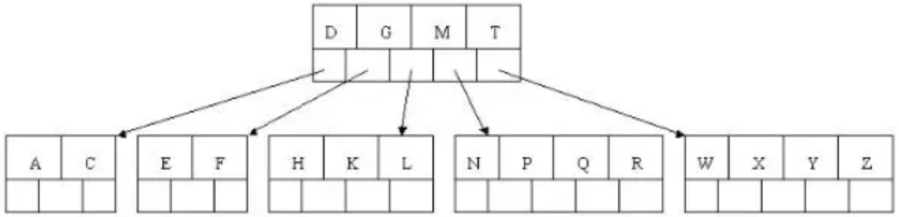
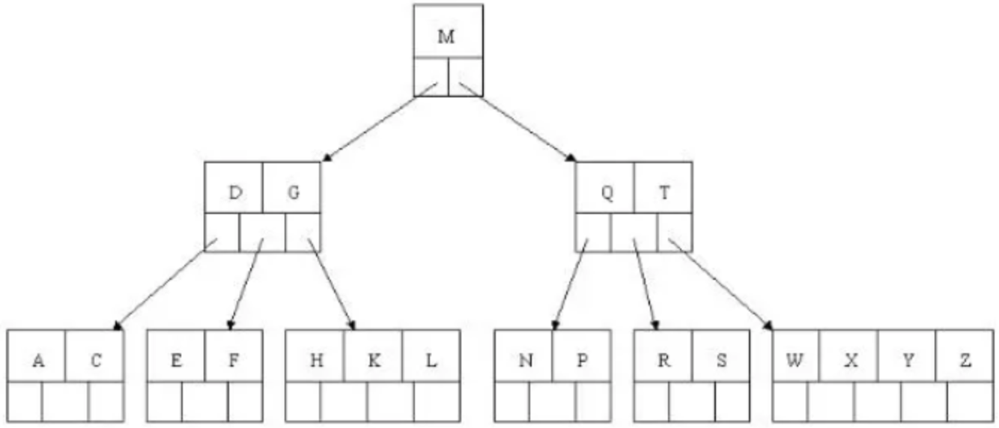

## Mysql

+ 数据库锁有哪些，造成原因
+ 如果在数据库上进行了误操作该怎么处理
+ 数据库sga问题
+ B树和B+树的区别，ACID, 索引种类，explain关键字
+ 介绍一下数据库索引(B+树、哈希索引、LSM树之类)
+ Mysql如何实现主从一致性

#### MYSQL基础

---

#####   1. **你知道关系型和非关系型数据库吗？区别了解多少?**

+ 关系型数据库
  + 采用关系模型来组织数据的数据库。关系模式简单来说就是二维表格模型。代表：SQL Server,Oracle,Mysql
  + 优点：
    + 容易理解，二维表的结构非常贴近现实世界
    + 使用方便，通用的sql语句使得操作关系型数据库非常方便。
    + 易于维护，数据库的ACID属性，大大降低了数据冗余和数据不一致的概率。
  + 缺点：
    + 不适合海量数据的读写效率。对于传统关系型数据库来说，硬盘I/O是一个很大的挑战。
    + 无高扩展性和可用性。在基于web的结构中，数据库是最难以横向拓展的
+ 非关系型数据库
  + 非关系型数据库也叫NOSQL，采用键值对的形式进行存储。代表：MongoDB，Redis
  + 优点：
    + 不需要经过SQL层的解析，读写效率高。 
    + 基于键值对，数据的扩展性很好。 
    + 支持多种类型数据的存储，如图片，文档等等。
  + 缺点：
    + 由于Nosql约束少，不能像sql那样通过字段属性的查询。适合存储较为简单的数据。
    + 有一些不能够持久化数据，所以需要和关系型数据库结合。

---

##### 2. 说一下MySQL是如何执行一条SQL的?具体步骤有哪些?

1. 客户端请求->
2. 连接器 (验证用户身份，给予权限) ->
3. 查询缓存(存在缓存则直接返回，不存在则执行后续操作)->
4. 分析器 (对SQL进行词法分析和语法分析操作) ->
5. 优化器(主要对执行的sql优化选择最优的执行方案方法) ->
6. 执行器(查看是否有执行权限，然后使用引擎提供的接口)-> 
7. 去引擎层获取数据返回(如果开启查询缓存则会缓存查询结果)

---

##### 3. **你了解MySQL的内部构造吗?**

以分为服务层和存储引擎层两部分：

+ 服务层： **连接器、查询缓存、分析器、优化器、执行器等**，涵盖MySQL的大多数核心服务功能，以及所有的内置函数，跨存储引擎的功能都在这一层实现，比如存储过程、触发器、视图等。
+ 存储引擎层：**负责数据的存储和提取**。其架构模式是插件式的，支持InnoDB、MyISAM、Memory等多个存储引擎。现在最常用的存储引擎是InnoDB

---

##### 4.**数据库中的主键、超键、候选键、外键是什么?**

+  **超键** : 在关系中能唯一标识 **元组的属性集** 称为关系模式的超键 
+  **候选键** : 不含有 **多余属性的超键** 称为候选键。也就是在候选键中，若再删除属性，就不是键了!
+  **主键** : **用户选作元组标识的一个候选键程序主键**
+  **外键** : 如果关系模式 **R中属性K是其它模式的主键** ，那么 **k在模式R中称为外键** 。

在学生表中：

1. 超键 : 学号是标识学生实体的唯一标识。那么该元组的超键就为学号。 除此之外还可以把它跟其他属性组合起来，比如:(学号，性别)，(学号，年龄)
2. 候选键：学号是一个可以唯一标识元组的唯一标识，因此学号是一个候选键，实际上，候选键是超键的子集，比如 (学号，年龄)是超键，但是它不是候选键。因为它还有了额外的 属性。
3. 主键：元组的候选键为学号，但是我们选定他作为该元组的唯一标识，那么学号就为主键。
4. 外键：是相对于主键的，比如在学生记录里，主键为学号，在成绩单表中也有学号字段，因此学号为成绩单表的外键，为学生表的主键。

---

##### 5.说一说Drop、Delete与Truncate的共同点和区别

+ Drop、Delete、Truncate都表示删除，但是三者有一些差别: 

  +  **Delete** ：用来删除表的全部或者一部分数据行，执行delete之后，用户需要提交(commmit)或者回滚 (rollback)来执行删除或者撤销删除，会触发这个表上所有的delete触发器。
  +  **Truncate** ：删除表中的所有数据，这个操作不能回滚，也不会触发这个表上的触发器，TRUNCATE比 delete更快，占用的空间更小。 
  +  **Drop** ：命令从数据库中删除表，所有的数据行，索引和权限也会被删除，所有的DML触发器也不会被触 发，这个命令也不能回滚。

  删除部分数据行用Delete；在保留表而删除所有数据用Truncate。不再需要一张表用Drop；

---

##### 6.**SQL中的NOW()和CURRENT_DATE()两个函数有什么区别?**

+ NOW()命令用于显示当前年份，月份，日期，小时，分钟和秒。
+ CURRENT_DATE()仅显示当前年份，月份和日期

---

##### 7.MySQL中CHAR和VARCHAR的区别有哪些?

+ char的长度是不可变的，用空格填充到指定长度大小，而varchar的长度是可变的。 
+ char的存取数度还是要比varchar要快得多 char的存储方式是:对英文字符(ASCII)占用1个字节，对一个汉字占用两个字节。
+ varchar的存储方 式是:对每个英文字符占用2个字节，汉字也占用2个字节

---

##### 8. **数据库悲观锁和乐观锁的原理和应用场景分别有什么?**

+  悲观锁，先获取锁，再进行业务操作，一般就是利用类似 SELECT ... FOR UPDATE 这样的语句，对数据加锁，避免其他事务意外修改数据。
   + 当数据库执行SELECT ... FOR UPDATE时会获取被select中的数据行的行锁，select for update获取的行锁会在当前事务结束时自动释放，因此必须在事务中使用。
+  乐观锁，先进行业务操作，只在最后实际更新数据时进行检查数据是否被更新过。腾讯上的电子文档

---

##### 9.**听说过视图吗?那游标呢?**

+ 视图是一种虚拟的表，通常是有一个表或者多个表的行或列的子集，具有和物理表相同的功能 
+ 游标是对查询出来的结果集作为一个单元来有效的处理。一般不使用游标，但是需要逐条处理数据的时候，游标显得十分重要。

---

#### MYSQL引擎

##### 1. 数据库引擎InnoDB与MyISAM的区别

+ MySQL5.7后的默认的事务型引擎。它被设计成为大量的短期事务，短期事务大部分情况下是正常提交的，很少被回滚。InnoDB的性能与自动崩溃恢复的特性，使得它在非事务存储需求中也很流行。优先考虑InnoDB引擎，除非有特别的原因使用其他引擎。
+ MySQL 5.1 及之前的版本，MyISAM是默认引擎。提供了大量的特性，包括压缩表、空间数据索引等。但MyISAM并不支持事务以及行级锁，缺陷是崩溃后无法安全恢复。
+ 区别：
  + 事务: InnoDB 是事务型的，可以使用 Commit 和 Rollback 语句。
  + 并发: MyISAM 只支持表级锁，而 InnoDB 还支持行级锁。 
  + 外键: InnoDB 支持外键。
  + 备份: InnoDB 支持在线热备份。
  + 崩溃恢复: MyISAM 崩溃后发生损坏的概率比 InnoDB 高很多，而且恢复的速度也更慢。
  + 其它特性: MyISAM 支持压缩表和空间数据索引。

---

##### **2.MyISAM和InnoDB实现B树索引方式的区别是什么?**

+ MyISAM，B+Tree叶节点的data域存放的是数据记录的地址，在索引检索的时候，首先按照B+Tree搜 索算法搜索索引，如果指定的key存在，则取出其data域的值，然后以data域的值为地址读取相应的数 据记录，这被称为“非聚簇索引”
+ InnoDB，其数据文件本身就是索引文件，相比MyISAM，索引文件和数据文件是分离的，其表数据文件本身就是按B+Tree组织的一个索引结构，树的节点data域保存了完整的数据记录，这个索引的 key是数据表的主键，因此InnoDB表数据文件本身就是主索引，这被称为“聚簇索引”或者聚集索引， 而其余的索引都作为辅助索引，辅助索引的data域存储相应记录主键的值而不是地址，这也是和 MyISAM不同的地方。
+ 在根据主索引搜索时，直接找到key所在的节点即可取出数据;在根据辅助索引查找时，则需要先取 出主键的值，再走一遍主索引。因此，在设计表的时候，不建议使用过长的字段为主键，也不建议使 用非单调的字段作为主键，这样会造成主索引频繁分裂。

---

##### 3.**Innodb为什么要用自增id作为主键?**

+ 使用自增主键，每次插入新的记录时会顺序添加到当前索引节点的后续位置，当一页写满，就会自动开辟一个新的页
+ 使用非自增主键(如果身份证号或学号等)，由于每次插入主键的值近似于随机，每次新纪录都要被插到现有索引页得中间某个位置， 频繁的移动、分页操作造成了大量的碎片，形成不够紧凑的索引结构，后续不得不通过optimize table来重建表并优化填充页面。

---

#### Mysql优化

#####  1.MySQL优化了解吗?说一下从哪些方面可以做到性能优化?

+ 为搜索字段创建索引
+ 避免使用 Select *，列出需要查询的字段 
+ 垂直分割分表
+ 选择正确的存储引擎

---

##### 2.你知道哪些数据库结构优化的手段？

+ **范式优化** : 比如消除冗余(节省空间。。) 
+ **反范式优化** :比如适当加冗余等(减少join)
+ **限定数据的范围**: 务必禁止不带任何限制数据范围条件的查询语句
+ **读写分离**: 经典的数据库拆分方案，主库负责写，从库负责读
+ **拆分表** :分区将数据在物理上分隔开，不同分区的数据可以制定保存在处于不同磁盘上的数据文件里。这样，当对这个表进行查询时，只需要在表分区中进行扫描，而不必进行全表扫描，明显缩短查询时间

---

#### 事务及其特性

##### 1.什么是事务，它有哪些特性？ACID 

+ 事务是指是程序中一系列严密的逻辑操作，而且所有操作必须全部成功完成，否则在每个操作中所作的所有更改都会被撤消。可以通俗理解为：就是把多件事情当做一件事情来处理，好比大家同在一条船上，要活一起活，要完一起完 
+ 特性 **（ACID）** ：
  + 原子性：操作这些指令时，要么全部执行成功，要么全部不执行。只要其中一个指令执行失败，所有的指令都执行失败，数据进行回滚，回到执行指令前的数据状态。
  + 一致性：事务的执行使数据从一个状态转换为另一个状态，但是对于整个数据的完整性保持稳定。
  + 隔离性：当多个用户并发访问数据库时，比如操作同一张表时，数据库为每一个用户开启的事务，不能被其他事务的操作所干扰，多个并发事务之间要相互隔离。
  + 持久性：当事务正确完成后，它对于数据的改变是永久性的。

---

##### 2.数据库如何保证原子性A(Atomicity)

+ 利用 Innodb 的回滚日志是实现原子性的关键，当事务执行失败调用了**rollback**，让事务需要回滚，撤销所有已经成功执行的 SQL语句，将数据回滚到修改之前的样子。

---

##### 3.数据库如何保证一致性C(Consistency)

+ 从两个层面来讲解：
  +  **数据库层面** ，数据库通过原子性、隔离性、持久性来保证一致性。也就是说ACID四大特性之中， C(一致性)是目的，A(原子性)、I(隔离性)、D(持久性)是手段，是为了保证一致性，数据库必须要实现AID三大特性，才有可能实现一致性。
  +  **应用层面** ，通过代码判断数据库数据是否有效，然后决定回滚还是提交数据

---

##### 4.数据库如何保证持久性D(Durability)

+ 利用Innodb的 **redo log** ，即重写日志。
+ 当做数据修改的时候，不仅在内存中操作，还会在 **redo log** 中记录这次操作。当事务提交的时候，会将重写日志进行刷盘(重写日志一部分在内存中，一部分在磁盘上)。
+ 当数据库宕机重启的时候，会将redo log中的内容恢复到数据库中，再根据 **undo log** 和 **binlog** 内容决定回滚数据还是提交数据。

---

##### 5.介绍一下数据库的隔离级别

SQL 标准定义了四种隔离级别，MySQL 全都支持。这四种隔离级别分别是：

1. 读未提交（READ UNCOMMITTED）
2. 读提交 （READ COMMITTED）
3. 可重复读 （REPEATABLE READ）
4. 串行化 （SERIALIZABLE）

从上往下，隔离强度逐渐增强，性能逐渐变差。采用哪种隔离级别要根据系统需求权衡决定，其中，**可重复读**是 MySQL 的默认级别。

事务隔离其实就是为了解决上面提到的脏读、不可重复读、幻读这几个问题，下面展示了 4 种隔离级别对这三个问题的解决程度。

<div align = "center"></div>

只有串行化的隔离级别解决了全部这 3 个问题，其他的 3 个隔离级别都有缺陷。

---

##### 6.数据库并发事务会带来什么问题

数据库并发会带来脏读、幻读、丢弃更改、不可重复读这四个常见问题，其中:

+  **脏读** :在第一个修改事务和读取事务进行的时候，读取事务读到的数据为100，这是修改之后的数据后为满足一致性等特性而做了回滚操作，那么读取事务得到的结果就是脏数据了。
+  **幻读** ：一般是T1在某个范围内进行修改操作(增加或者删除)，而T2读取该范围导致读到的数据是修改之后不同的数据；强调范围和新增/删除
+  **丢弃修改** : T1 和 T2 两个事务都对一个数据进行修改，T1 先修改，T2 随后修改，T2 的修改覆盖了 T1 的修改。
+  **不可重复读** : T2 读取一个数据，然后T1 对该数据做了修改。如果 T2 再次读取这个数据，此时读取的结果和第一次读取的结果不同。

---

##### 7. **不可重复读和幻读区别是什么?可以举个例子吗?**

+  **不可重复读的重点是修改，幻读的重点在于新增或者删除。**
   + (同样的条件, 读取过的数据, 再次读取出来发现值不一样了 ):事务1中的A先生读取自己的工资为 1000的操作还没完成，事务2中的B先生就修改了A的工资为2000，导致A再读自己的工资时工资 变为 2000 ;这就是不可重复读。
   + (同样的条件, 第1次和第2次读出来的记录数不一样 ):假如工资单表中工资大于3000的有4人， 事务1读取了所有工资大于3000的人共查到4条记录，这时事务2又插入了一条工资大于3000的记录，事务1再次读取时查到的记录就变为了5条，这样就导致了幻读。

---

##### 8.MySQL中为什么要有事务回滚机制?

- 在MySQL 中，恢复机制是通过回滚日志(undo log)实现的，所有事务进行的修改都会先记录到这个回滚日志中，然后在对数据库中的对应行进行写入。 当事务已经被提交之后，就无法再次回滚了。
- 回滚日志的作用：
  - 在发生错误或者用户执行 ROLLBACK 时提供回滚相关的信息
  - 在整个系统发生崩溃、数据库进程直接被杀死后，当用户再次启动数据库进程时，还能够立刻通过查询回滚日志将之前未完成的事务进行回滚

---

#### 索引

##### 1.什么是索引？为什么使用索引？

+ 索引（index）是帮助数据库高效获取数据的数据结构（有序）。以某种方式引用（指向）数据， 实现高级查找算法。

+ 使用索引的原因：
  + 提高数据检索的效率，降低数据库的IO成本。
  + 通过索引列对数据进行排序，降低数据排序的成本，降低CPU的消耗。
  + 可以加速表和表之间的连接，特别是在实现数据的参考完整性方面特别有意义

---

##### 2.什么时候需要建立数据库索引呢?

+ 在最频繁使用的、用以缩小查询范围的字段,需要排序的字段上建立索引。 
+ 不宜:
  + 1)对于查询中很少涉及的列或者重复值比较多的列 
  + 2)对于一些特殊的数据类型，不宜建立索引，比如文本字段(text)等。

---

##### 3.索引设计的原则

+ 对查询频次较高，且数据量比较大的表建立索引。
+ 索引字段的选择，最佳候选列应当从where子句的条件中提取，如果where子句中的组合比较多，那么应当挑选最常用、过滤效果最好的列的组合。
+ 使用唯一索引，区分度越高，使用索引的效率越高。

+ 索引越多，维护索引的代价自然也就高。对于插入、更新、删除等操作频繁的表，索引过多，会引入相当高的维护代价，降低操作的效率，增加相应操作的时间消耗。
+ 使用短索引，索引创建之后也是使用硬盘来存储的，因此提升索引访问的I/O效率，也可以提升总体的访问效率。
+ 利用最左前缀，N个列组合而成的组合索引，那么相当于是创建了N个索引，如果查询时where子句中使用了组成该索引的前几个字段，那么这条查询SQL可以利用组合索引来提升查询效率。

---

##### 4.MYSQL中有哪些索引？有什么特点？

1.  **Primary Key（聚集索引）** ：InnoDB存储引擎的表会存在主键（唯一非null），如果建表的时候没有指定主键，则会使用第一非空的唯一索引作为聚集索引，否则InnoDB会自动帮你创建一个不可见的、长度为6字节的row_id用来作为聚集索引。
2.  **单列索引** ：单列索引即一个索引只包含单个列
3.  **组合索引** ：组合索引指在表的多个字段组合上创建的索引，只有在查询条件中使用了这些字段的左边字段时，索引才会被使用。使用组合索引时**遵循最左前缀集合**
4.  **Unique（唯一索引）** ：索引列的值必须唯一，但允许有空值。若是组合索引，则列值的组合必须唯一。主键索引是一种特殊的唯一索引，不允许有空值
5.  **Key（普通索引）** ：是MySQL中的基本索引类型，允许在定义索引的列中插入重复值和空值
6.  **FULLTEXT（全文索引）** ：全文索引类型为FULLTEXT，在定义索引的列上支持值的全文查找，允许在这些索引列中插入重复值和空值。全文索引可以在CHAR、VARCHAR或者TEXT类型的列上创建
7.  **SPATIAL（空间索引）** ：空间索引是对空间数据类型的字段建立的索引，MySQL中的空间数据类型有4种，分别是GEOMETRY、POINT、LINESTRING和POLYGON。MySQL使用SPATIAL关键字进行扩展，使得能够用于创建正规索引类似的语法创建空间索引。创建空间索引的列必须声明为NOT NULL

---

##### 5. 覆盖索引是什么?

+ 如果一个索引包含了（或覆盖了）满足查询语句中字段与条件的数据就叫做覆盖索引。
+ 覆盖索引（covering index）使得一个查询语句的执行只用从索引中就能够取得，不必从数据表中读取。也可以称之为实现了索引覆盖。

> 在InnoDB存储引擎中，如果不是主键索引，叶子节点存储的是主键+列值。最终还是要“回表”，也就是要通过主键再查找一次,这样就会比较慢。覆盖索引就是把要查询出的列和索引是对应的，不做回表操作!

---

##### 6.什么是聚合索引 ?

+ 聚集索引表记录的排列顺序与索引的排列顺序一致


---

##### 7.什么是非聚合索引？

+ 

---

##### 8.聚合索引与非聚合索引的区别是什么？


---

##### 9.MySQL索引主要使用的两种数据结构是什么?

+ **哈希索引** ，对于哈希索引来说，底层的数据结构肯定是哈希表，因此 **在绝大多数需求为单条记录查询** 的时候，可以选择哈希索引，查询性能最快；其余大部分场景，建议选择BTree索引

+ **BTree索引** ，Mysql的BTree索引的是B+Tree，BTREE索引就是一种将索引值按一定的算法，存入一个树形的数据结构中(二叉树)，每次查询都是从树的入口root开始，依次遍历node，获取leaf。

但对于主要的两种存储引擎(MyISAM和InnoDB)的实现方式是不同的。

---

##### 10. 简单介绍B树的数据结构

BTree又叫多路平衡搜索树，一颗m叉的BTree特性如下：

- 树中每个节点最多包含m个孩子。
- 除根节点与叶子节点外，每个节点至少有[ceil(m/2)]个孩子。
- 若根节点不是叶子节点，则至少有两个孩子。
- 所有的叶子节点都在同一层。
- 每个非叶子节点由n个key与n+1个指针组成，其中[ceil(m/2)-1] <= n <= m-1

以5叉BTree为例，key的数量：公式推导[ceil(m/2)-1] <= n <= m-1。所以 2 <= n <=4 。当n>4时，中间节点分裂到父节点，两边节点分裂。

---

##### 11.介绍一下B+树的数据结构

B+Tree为BTree的变种，B+Tree与BTree的区别为：

1. n叉B+Tree最多含有n个key，而BTree最多含有n-1个key。

2. B+Tree的叶子节点保存所有的key信息，依key大小顺序排列。

3. 所有的非叶子节点都可以看作是key的索引部分。

由于B+Tree只有叶子节点保存key信息，查询任何key都要从root走到叶子。所以B+Tree的查询效率更加稳定。

---

##### 12.数据库中的B+树结构

<div align = center></div>

MySql索引数据结构对经典的B+Tree进行了优化。在原B+Tree的基础上，增加一个指向相邻叶子节点的链表指针，就形成了带有顺序指针的B+Tree，提高区间访问的性能。

---

##### 13.B树的插入操作

以5叉BTree为例，key的数量：公式推导[ceil(m/2)-1] <= n <= m-1。所以 2 <= n <=4 。当n>4时，中间节点分裂到父节点，两边节点分裂。

插入 C N G A H E K Q M F W L T Z D P R X Y S 数据为例。

演变过程如下：

1. 插入前4个字母 C N G A

<div align = "center"></div>

2. 插入H，n>4，中间元素G字母向上分裂到新的节点

   <div align = "center"></div>

3. 插入E，K，Q不需要分裂

   <div align = "center"></div>

4. 插入M，中间元素M字母向上分裂到父节点G

   <div align = "center"></div>

5. 插入F，W，L，T不需要分裂

   <div align = "center"></div>

6. 插入Z，中间元素T向上分裂到父节点中

   <div align = "center"></div>

7. 插入D，中间元素D向上分裂到父节点中。然后插入P，R，X，Y不需要分裂

   <div align = "center"></div>

8. 最后插入S，NPQR节点n>5，中间节点Q向上分裂，但分裂后父节点DGMT的n>5，中间节点M向上分裂

   <div align = "center"></div>

到此，该BTREE树就已经构建完成了， BTREE树 和 二叉树 相比， 查询数据的效率更高， 因为对于相同的数据量来说，BTREE的层级结构比二叉树小，因此搜索速度快。

---

##### 14.为什么MySQL索引要使用B+树，而不是B树或者红黑树?

+  **B+树只有叶节点存放数据，其余节点用来索引，B树是每个索引节点都会有Data域。**  所以从Mysql（Inoodb）的角度来看，B+树是用来充当索引的，一般来说索引非常大，为了减少内存的占用，索引也会被存储在磁盘上
+  Mysql通过磁盘IO次数来衡量查询效率。B树/B+树 的特点就是每层节点数目非常多，层数很少，目的就是为了就少磁盘IO次数，但是B-树的每个节点都有data域（指针），增大了节点大小，说白了增加了磁盘IO次数（磁盘IO一次读出的数据量大小是固定的，单个数据变大，每次读出的就少，IO次数增多，一次IO多耗时），而B+树除了叶子节点其它节点并不存储数据，节点小，磁盘IO次数就少。**这是优点之一。** 
+  **另一个优点是：**  B+树所有的Data域在叶子节点，一般来说都会进行一个优化，就是 **将所有的叶子节点用指针串起来** 。这样 **遍历** 叶子节点就能获得全部数据，这样就能进行区间访问啦。在数据库中基于范围的查询是非常频繁的，而B树不支持这样的遍历操作。

+  **B树是多路树，红黑树是二叉树！红黑树一个节点只能存出一个值，B树一个节点可以存储多个值，红黑树的深度会更大,定位时 红黑树的查找次数会大一些。** 

---

##### 15. 为什么MySQL索引适用用B+树而不用hash表和B树?

+ 利用Hash需要把数据全部**加载到内存中**，如果数据量大，是一件很**消耗内存**的事，而采用B+树，是 基于**按照节点分段加载，由此减少内存消耗**。 
+ 和业务场景有段，**对于唯一查找**(查找一个值)，Hash确实更快，**但数据库中经常查询多条数据**，这 时候由于B+数据的有序性，与叶子节点又有链表相连，他的查询效率会比Hash快的多。
+  b+树的 **非叶子节点不保存数据**，**只保存子树的临界值** (最大或者最小)，所以同样大小的节点，  **b+** 树相对于b树能够有更多的分支，使得这棵树更加矮胖， **查询时做的 IO 操作次数也更少**。

---

##### 16. 既然Hash比B+树更快，为什么MySQL用B+树来存储索引呢?

MySQL中存储索引用到的数据结构是B+树，B+树的查询时间跟树的高度有关，是log(n)，如果用hash存储，那么查询时间是O(1)。 采用Hash来存储确实要更快，但是采用B+树来存储索引的原因主要有以下两点:

一、**从内存角度上说**，数据库中的索引一般是在磁盘上，数据量大的情况可能无法一次性装入内存， B+树的设计可以允许数据分批加载。

二、**从业务场景上说**，如果只选择一个数据那确实是hash更快，但是数据库中经常会选中多条，这时候 由于B+树索引有序，并且又有链表相连，它的查询效率比hash就快很多了。

---

##### 17. 文件索引和数据库索引为什么使用B+树?(第9个问题的详细回答)

+ 文件与数据库都是需要较大的存储，不可能全部存储在内存中，需要存储到磁盘上。而设置索引是为了数据的快速定位与查找，那么索引的结构组织要尽量减少查找过程中磁盘I/O 的存取次数，因此B+树相比B树更为合适。
+ 数据库系统巧妙利用了局部性原理与磁盘预读原理，将节点的大小设为等于一个页，这样每个节点只需要一次I/O就可以完全载入
+ B+树还有一个最大的好处:方便扫库。 B树必须用中序遍历的方法按序扫库，而B+树直接从叶子结点挨个扫一遍就完了，非常方便，而B树不支持，这是数据库选用B+树的最主要原因。 

---

##### 18. **为什么说B+tree比B 树更适合实际应用中操作系统的文件索引和数据库索引?**

+ B+tree的磁盘读写代价更低，B+tree的查询效率更加稳定 
+ 主要原因：B+树只要遍历叶子节点就可以实现整棵树的遍历，而且在 数据库中基于范围的查询是非常频繁的，而B树只能中序遍历所有节点，效率太低。
+ **B+树的特点**
  + 所有关键字都出现在叶子结点的链表中(稠密索引)，且链表中的关键字恰好是有序的；不可能在非叶子结点命中；非叶子结点相当于是叶子结点的索引(稀疏索引)，叶子结点相当于是存储(关键字)数据的数据层

----


---

##### 数据库高并发是我们经常会遇到的，你有什么好的解决方案吗?

+ 在web服务框架中加入缓存。在服务器与数据库层之间加入缓存层，将高频访问的数据存入缓存中， 减少数据库的读取负担。 
+ 增加数据库索引，进而提高查询速度。(不过索引太多会导致速度变慢，并且数据库的写入会导致索 引的更新，也会导致速度变慢)

+ 主从读写分离，让主服务器负责写，从服务器负责读。
+ 将数据库进行拆分，使得数据库的表尽可能小，提高查询的速度。
+ 使用分布式架构，分散计算压力。


## Redis

#### Redis基础

##### 1.听说过Redis吗?它是什么?

+ Redis是一个**数据库**，不过与传统数据库不同的是Redis的数据库是存在**内存**中，所以**读写速度非常快**， 因此 Redis被广泛应用于**缓存**方向。

+ Redis经常用来做分布式锁，提供了多种数据类型来支持不同的业务场景。而且支持事务持久化、LUA脚本、LRU驱动事件、多种集群方案。

---

##### 2.有MySQL不就够用了吗?为什么要用Redis这种新的数据库?

主要是因为 Redis 具备高性能和高并发两种特性。

+ **高性能** ：第一次访问数据库中的数据时会比较慢，因为是从硬盘上读取。将访问的数据存在缓存中，下一次再访问时可以直接从缓存中获取，速度更快。
+  **高并发** ：直接操作缓存能够承受的请求是远远大于直接访问数据库的，所以可以考虑把数据库中的部分数据转移到缓存中去，这样用户的一部分请求会直接到缓存这里而不用经过数据库。

---

##### 3.使用Redis的好处有哪些?

1. 访问速度快，因为数据存在内存中，类似于C++中的哈希表，优势就是查找和操作的时间复杂度都是O(1)
2.  数据类型丰富，支持String，list，set，sorted set，hash这五种数据结构
3. 支持事务，Redis中的操作都是原子性，换句话说就是对数据的更改要么全部执行，要么全部不执行
4. 特性丰富：Redis可用于缓存，消息，按key设置过期时间，过期后将会自动删除。

---

##### 4.C++中的Map也是一种缓存型数据结构，为什么不用Map，而选择 Redis做缓存?

+ 严格意义上来说缓存分为 **本地缓存** 和 **分布式缓存** 。
+ 使用 STL 下自带的容器 map 来实现缓存，但只能实现本地缓存，最主要的特点是轻量以及快速，但是其生命周期随着程序的销毁而结束，并且在多实例的情况下，每个实例都需要各自保存一份缓存，缓存不具有一致性。
+ 使用 Redis 或 Memcached 之类的称为分布式缓存，在多实例的情况下，各实例共享一份缓存数据，缓存具有一致性。这是Redis或者Memcached的优点所在，但它也有缺点，那就是需要保持 Redis 或 Memcached服务的高可用，整个程序架构上较为复杂。

---

##### 5.**Memcached与Redis的区别都有哪些?**

+ 存储方式:
  + Memecache把数据全部存在内存之中，断电后会挂掉，没有持久化功能，数据不能超过内存大小。
  + Redis有部份存在硬盘上，这样能保证数据的持久性。
+ Value 值大小不同
  + Redis 最大可以达到 512MB;
  + Memcached 只有 1MB。
+ 数据支持类型
  + Memcache对数据类型支持相对简单,只有String这一种类型 
  + Redis不仅仅支持简单的k/v类型的数据，同时还提供 list，set，zset，hash等 数据结构的存储。
+ 使用底层模型不同
  + 它们之间底层实现方式以及与客户端之间通信的应用协议不一样。
  + Redis直接自己构建了VM 机制 ，因为一般的系统调用系统函数的话，会浪费一定的时间去移动和请求。
+ 集群模式:
  + Memcached没有原生的集群模式，需要依靠客户端来实现往集群中分片写入数据;
  + Redis 目前是原生支持 cluster 模式的.
+ Memcached是多线程，非阻塞IO复用的网络模型；Redis使用单线程的多路 IO 复用模型。

---

##### 6.Redis比Memcached的优势在哪里?

+ Memcached所有的值均是简单字符串，Redis作为其替代者，支持更为丰富的数据类型 
+ Redis 的速度比 Memcached 快很多
+ Redis可以做到持久化数据

---

##### 7.**缓存中常说的热点数据和冷数据是什么?**

+ 热数据就是访问次数较多的数据，冷数据就是访问很少或者从不访问的数据。
  + 需要注意的是只有热点数据，缓存才有价值
  + 对于冷数据而言，大部分数据可能还没有再次访问到就已经被挤出内存，不仅占用内存，而且价值不大。
+  **数据更新前至少读取两次** ，缓存才有意义。这个是最基本的策略，如果缓存还没有起作用就失效了，那就没有太大价值了。

---

#### Redis数据结构

##### 1.Redis的五种数据结构整理

+  ==**简单动态字符串(Simple Dynamic String，SDS)**==

  + Redis没有直接使用C语言传统的字符串，构建了SDS的抽象类型，并将SDS用作Redis的默认字符串表示。等同于C语言中的char * ，但它可以存储任意二进制数据，不能像C语言字符串那样以字符’\0’来标识字符串的结束，因此它必然有个长度字段。

  ```c
  struct sdshdr {
      int len;     // 记录buf数组中已使用字节的数量；等于sds所保存字符串的长度
    	int free;   // 记录buf数组中未使用字节的数量 
      char buf[]; // 字节数组，用于保存字符串
  }
  ```

  + 优点：
    + 获取字符串长度的复杂度为O(1)。
    +  杜绝缓冲区溢出。 减少修改字符串长度时所需要的内存重分配次数。 
    + 二进制安全。兼容部分C字符串函数。

+  ==**链表**==

  + 当有一个列表键包含了数量比较多的元素，或列表中包含的元素都是比较长的字符串时，Redis会使用链表作为列表建的底层实现。

  + 结点设计：

    ```c++
    typedef struct listNode { 
        struct listNode *prev;// 前置节点
        struct listNode *next;// 后置节点
        void *value;					// 节点的值
    } listNode;
    ```

  + 链表设计：

    ```c
    typedef struct list { 
        listNode *head;												// 表头节点
        listNode *tail; 											// 表尾节点
      	unsigned long len;										// 链表所包含的节点数量 
        void *(*dup)(void *ptr);							// 节点值复制函数
        void (*free)(void *ptr);							// 节点值是放过函数
        int(*match)(void *ptr, void *key);	  // 节点值对比函数
    } list;
    ```

  + 特性：

    + 链表被广泛用于实现Redis的各种功能，比如列表建、发布与订阅、慢查询、监视器等。 
    + 因为链表表头的前置节点和表尾节点的后置节点都指向NULL，所以Redis的链表实现是无环链表。
    +  通过为链表设置不同的类型特定函数，Redis的链表可以用于保存各种不同类型的值。

+  ==**字典**==

  + 字典的底层是哈希表，类似 C++中的 map ，也就是键值对。

    ```c++
    typedef struct dictht { 
      dictEntry **table;			// 哈希表数组
      unsigned long size;			// 哈希表大小
      unsigned long sizemark; // 哈希表大小掩码，用于计算索引值 // 总是等于size-1
      unsigned long used;			// 该哈希表已有节点的数量 
    } dichht;
    ```

  + 哈希算法：

    + 当字典被用作数据库的底层实现，或者哈希键的底层实现时，Redis使用MurmurHash算法。这种算法的 优点在于即使输入的键是规律的，算法仍能给出一个个很好的随机分布性，并且算法的计算速度非常 快。

  + 解决哈希冲突：

    + 使用链地址法来解决键冲突，每个哈希表节点有一个next指针，多个哈希表节点可以用这个单向链表连接起来

  + 特性：

    + Redis中的字典使用哈希表作为底层结构实现，每个字典带有两个哈希表，一个平时使用，另一个仅在进行rehash时使用。
    + Redis使用MurmurHash2算法来计算键的哈希值。
    + 哈希表使用链地址法来解决键冲突。

+  ==**跳跃表**==

  + 链表查找效率比较低，把列表的某些节点拔高一层，例如每两个节点中有一个节点变成两层。那么第二层的节点只有第一层的一半，查找效率也就会提高。

    <div align = center></div>

  + 查找的步骤是从头节点的顶层开始，查到第一个大于指定元素的节点时，退回上一节点，在下一层继续查找。

  + 为了避免插入操作的时间复杂度是O(N)，skiplist每层的数量不会严格按照2:1的比例，而是对每个要插入的元素随机一个层数。

  + 随机层数的计算过程如下:

    1. 每个节点都有第一层
    2. 那么它有第二层的概率是p，有第三层的概率是p*p 
    3. 不能超过最大层数

  +  zskiplistNode

    ```c++
    typedef struct zskiplistNode { 
        struct zskiplistNode *backward;   // 后退指针
        double score;											// 分值 权重
        robj *obj;												// 成员对象
        struct zskiplistLevel {						// 层
            struct zskiplistNode *forward; 		// 前进指针
            unsigned int span;								// 跨度
        } leval[];
    } zskiplistNode;
    ```

    > 一般来说，层的数量越多，访问其他节点的速度越快。

  + zskipList

    ```c++
    typedef struct zskiplist {
        struct zskiplistNode *header, *tail; 		// 表头节点和表尾节点
        unsigned long length;										// 表中节点的数量
        int leval;															// 表中层数最大的节点的层数
    } zskiplist;
    ```

  + 特性：

    + Redis的跳跃表实现由zskiplist和zskiplistNode两个结构组成，zskiplist用于保存跳跃表信息(比如表头节点、表尾节点、长度)，zskiplistNode则用于表示跳跃表节点 
    + 每个跳跃表节点的层高都是1至32之间的随机数 
    + 在同一个跳跃表中，多个节点可以包含相同的分值，但每个节点的成员对象必须是唯一的。 
    + 跳跃表中的节点按照分值大小进行排序，当分值相同时，节点按照成员对象的大小进行排序。 
    + 跳表是一种实现起来很简单，单层多指针的链表，它查找效率很高，堪比优化过的二叉平衡树，且比平衡树的实现。

+  ==**压缩列表**==
  + 压缩列表(ziplist)是列表键和哈希键的底层实现之一。当一个列表键只包含少量列表项，并且每个列表项要么就是小整数值，要么就是长度比较短的字符串，那么Redis就会使用压缩列表来做列表键的底层实现。

---

##### 2.Redis常见数据结构以及使用场景分别是什么?

+ string
  + 简单的key-value类型，value其实不仅可以是String，也可以是数字。 常规key-value缓存应用；常规计数:微博数，粉丝数等。
+ Hash
  + Hash 是一个 string 类型的 field 和 value 的映射表，hash 特别适合用于存储对象，后续操作时可以直接仅仅修改这个对象中的某个字段的值。 比如可以Hash数据结构来存储用户信息，商品信息等。
+ List
  + List 就是链表，Redis list 的应用场景非常多，也是Redis最重要的数据结构之一，比如微博的关注列表， 粉丝列表， 消息列表等功能都可以用Redis的 list 结构来实现。
  + Redis list 的实现为一个双向链表，即可以支持反向查找和遍历，更方便操作，不过带来了部分额外的内存开销。
  + 另外可以通过 lrange 命令，就是从某个元素开始读取多少个元素，可以基于 list 实现分页查询，这个很棒的一个功 能，基于 Redis 实现简单的高性能分页，可以做类似微博那种下拉不断分页的东西(一页一 页的往下走)，性能高。

+ Set
  + set 对外提供的功能与list类似是一个列表的功能，特殊之处在于 set 是可以自动排重的。
  + 当需要存储一个列表数据，又不希望出现重复数据时，set是一个很好的选择，并且set提供了判断某个 成员是否在 一个set集合内的重要接口，这个也是list所不能提供的。可以基于 set 轻易实现交集、并集、 差集的操作。
+ Sorted Set
  + 和set相比，sorted set增加了一个权重参数score，使得集合中的元素能够按score进行有序排列。
  + 举例: 在直播系统中，实时排行信息包含直播间在线用户列表，各种礼物排行榜，弹幕消息(可以理解为按消息维 度的消息排行榜)等信息，适合使用 Redis 中的 SortedSet 结构进行存储。

---

