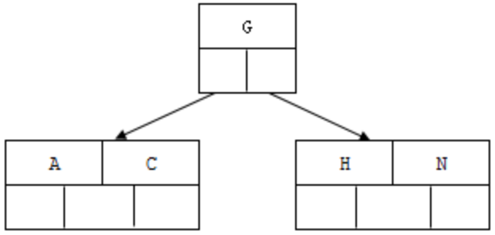
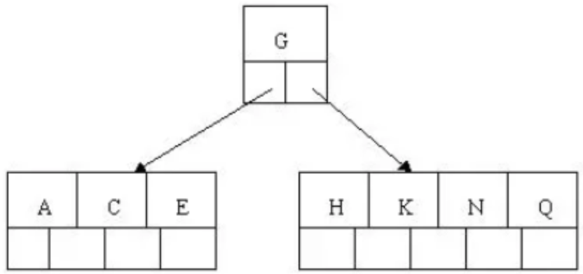
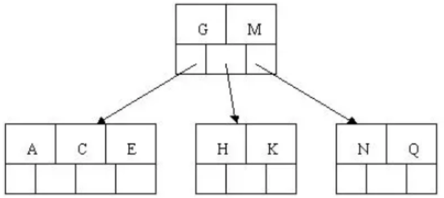

## Mysql

#### MYSQL基础

---

#####   1. **你知道关系型和非关系型数据库吗？区别了解多少?**

+ 关系型数据库
  + 采用关系模型来组织数据的数据库。关系模式简单来说就是二维表格模型。代表：SQL Server,Oracle,Mysql
  + 优点：
    + 容易理解，二维表的结构非常贴近现实世界
    + 使用方便，通用的sql语句使得操作关系型数据库非常方便。
    + 易于维护，数据库的ACID属性，大大降低了数据冗余和数据不一致的概率。
  + 缺点：
    + 不适合海量数据的读写效率。对于传统关系型数据库来说，硬盘I/O是一个很大的挑战。
    + 无高扩展性和可用性。在基于web的结构中，数据库是最难以横向拓展的
+ 非关系型数据库
  + 非关系型数据库也叫NOSQL，采用键值对的形式进行存储。代表：MongoDB，Redis
  + 优点：
    + 不需要经过SQL层的解析，读写效率高。 
    + 基于键值对，数据的扩展性很好。 
    + 支持多种类型数据的存储，如图片，文档等等。
  + 缺点：
    + 由于Nosql约束少，不能像sql那样通过字段属性的查询。适合存储较为简单的数据。
    + 有一些不能够持久化数据，所以需要和关系型数据库结合。

---

##### 2. 说一下MySQL是如何执行一条SQL的?具体步骤有哪些?

1. 客户端请求->
2. 连接器 (验证用户身份，给予权限) ->
3. 查询缓存(存在缓存则直接返回，不存在则执行后续操作)->
4. 分析器 (对SQL进行词法分析和语法分析操作) ->
5. 优化器(主要对执行的sql优化选择最优的执行方案方法) ->
6. 执行器(查看是否有执行权限，然后使用引擎提供的接口)-> 
7. 去引擎层获取数据返回(如果开启查询缓存则会缓存查询结果)

---

##### 3. **你了解MySQL的内部构造吗?**

以分为服务层和存储引擎层两部分：

+ 服务层： **连接器、查询缓存、分析器、优化器、执行器等**，涵盖MySQL的大多数核心服务功能，以及所有的内置函数，跨存储引擎的功能都在这一层实现，比如存储过程、触发器、视图等。
+ 存储引擎层：**负责数据的存储和提取**。其架构模式是插件式的，支持InnoDB、MyISAM、Memory等多个存储引擎。现在最常用的存储引擎是InnoDB

---

##### 4.**数据库中的主键、超键、候选键、外键是什么?**

+  **超键** : 在关系中能唯一标识 **元组的属性集** 称为关系模式的超键 
+  **候选键** : 不含有 **多余属性的超键** 称为候选键。也就是在候选键中，若再删除属性，就不是键了!
+  **主键** : **用户选作元组标识的一个候选键程序主键**
+  **外键** : 如果关系模式 **R中属性K是其它模式的主键** ，那么 **k在模式R中称为外键** 。

在学生表中：

1. 超键 : 学号是标识学生实体的唯一标识。那么该元组的超键就为学号。 除此之外还可以把它跟其他属性组合起来，比如:(学号，性别)，(学号，年龄)
2. 候选键：学号是一个可以唯一标识元组的唯一标识，因此学号是一个候选键，实际上，候选键是超键的子集，比如 (学号，年龄)是超键，但是它不是候选键。因为它还有了额外的 属性。
3. 主键：元组的候选键为学号，但是我们选定他作为该元组的唯一标识，那么学号就为主键。
4. 外键：是相对于主键的，比如在学生记录里，主键为学号，在成绩单表中也有学号字段，因此学号为成绩单表的外键，为学生表的主键。

---

##### 5.说一说Drop、Delete与Truncate的共同点和区别

+ Drop、Delete、Truncate都表示删除，但是三者有一些差别: 

  +  **Delete** ：用来删除表的全部或者一部分数据行，执行delete之后，用户需要提交(commmit)或者回滚 (rollback)来执行删除或者撤销删除，会触发这个表上所有的delete触发器。
  +  **Truncate** ：删除表中的所有数据，这个操作不能回滚，也不会触发这个表上的触发器，TRUNCATE比 delete更快，占用的空间更小。 
  +  **Drop** ：命令从数据库中删除表，所有的数据行，索引和权限也会被删除，所有的DML触发器也不会被触 发，这个命令也不能回滚。

  删除部分数据行用Delete；在保留表而删除所有数据用Truncate。不再需要一张表用Drop；

---

##### 6.**SQL中的NOW()和CURRENT_DATE()两个函数有什么区别?**

+ NOW()命令用于显示当前年份，月份，日期，小时，分钟和秒。
+ CURRENT_DATE()仅显示当前年份，月份和日期

---

##### 7.MySQL中CHAR和VARCHAR的区别有哪些?

+ char的长度是不可变的，用空格填充到指定长度大小，而varchar的长度是可变的。 
+ char的存取数度还是要比varchar要快得多 char的存储方式是:对英文字符(ASCII)占用1个字节，对一个汉字占用两个字节。
+ varchar的存储方 式是:对每个英文字符占用2个字节，汉字也占用2个字节

---

##### 8.LIKE与REGEXP的区别

LIKE匹配整个串而REGEXP匹配子串。利用定位符，通过用^开始每个表达式，用$结束每个表达式，可以使 REGEXP的作用与LIKE一样。

---

##### 8. **数据库悲观锁和乐观锁的原理和应用场景分别有什么?**

+  悲观锁，先获取锁，再进行业务操作，一般就是利用类似 SELECT ... FOR UPDATE 这样的语句，对数据加锁，避免其他事务意外修改数据。
   + 当数据库执行SELECT ... FOR UPDATE时会获取被select中的数据行的行锁，select for update获取的行锁会在当前事务结束时自动释放，因此必须在事务中使用。
+  乐观锁，先进行业务操作，只在最后实际更新数据时进行检查数据是否被更新过。腾讯上的电子文档

---

##### 9.**听说过视图吗?那游标呢?**

+ 视图是一种虚拟的表，通常是有一个表或者多个表的行或列的子集，具有和物理表相同的功能 
+ 游标是对查询出来的结果集作为一个单元来有效的处理。一般不使用游标，但是需要逐条处理数据的时候，游标显得十分重要。

---

##### 10.数据库为什么要进行分库和分表呢?

分库与分表的目的在于，减小数据库的单库单表负担，提高查询性能，缩短查询时间。

**通过分表**，可以减少数据库的单表负担，将压力分散到不同的表上，同时因为不同的表上的数据量少 了，起到提高查询性能，缩短查询时间的作用，此外，可以很大的缓解表锁的问题。 分表策略可以归纳为垂直拆分和水平拆分: 

+  **水平分表**:取模分表就属于随机分表，而时间维度分表则属于连续分表。 如何设计好垂直拆分，我的建议:将不常用的字段单独拆分到另外一张扩展表. 将大文本的字段单独拆分到另外一张扩展表, 将不经常修改的字段放在同一张表中，将经常改变的字段放在另一张表中。 对于海量用户场景，可以考虑取模分表，数据相对比较均匀，不容易出现热点和并发访问的瓶颈。

+  **库内分表**，仅仅是解决了单表数据过大的问题，但并没有把单表的数据分散到不同的物理机上，因此并 不能减轻 MySQL 服务器的压力，仍然存在同一个物理机上的资源竞争和瓶颈，包括 CPU、内存、磁盘 IO、网络带宽等。

**分库与分表带来的分布式困境与应对之策**

数据迁移与扩容问题----一般做法是通过程序先读出数据，然后按照指定的分表策略再将数据写入到各 个分表中。 

分页与排序问题----需要在不同的分表中将数据进行排序并返回，并将不同分表返回的结果集进行汇总 和再次排序，最后再返回给用户。

---

##### 11.MYSQL数据库中的三大范式

简单归纳:

+ 第一范式(1NF):字段不可分;
+ 第二范式(2NF):有主键，非主键字段依赖主键; 
+ 第三范式(3NF):非主键字段不能相互依赖。

解释:

1NF:原子性。 字段不可再分,否则就不是关系数据库;

2NF:唯一性 。一个表只说明一个事物;

3NF:每列都与主键有直接关系，不存在传递依赖。

##### 12.详细介绍一下三大范式

###### **第一范式**

在任何一个关系数据库中，第一范式(1NF)是对关系模式的基本要求，所谓第一范式(1NF)是指数据库表的每一列都是不可分割的基本数据项，同一列中不能有多个值，即实体中的某个属性不能有多个值或者不能有重复的属性。

如果出现重复的属性，就可能需要定义一个新的实体，新的实体由重复的属性构成，新实体与原实体之 间为一对多关系。在第一范式(1NF)中表的每一行只包含一个实例的信息。

简而言之，**第一范式就是无重复的列**。

###### **第二范式**

第二范式(2NF)是在第一范式(1NF)的基础上建立起来的，即满足第二范式(2NF)必须先满足第 一范式(1NF)。第二范式(2NF)要求数据库表中的每个实例或行必须可以被惟一地区分。

为实现区分通常需要为表加上一个列，以存储各个实例的惟一标识。这个惟一属性列被称为主关键字或 主键、主码。 第二范式(2NF)要求实体的属性完全依赖于主关键字。

所谓完全依赖是指不能存在仅依赖主关键字一部分的属性，如果存在，那么这个属性和主关键字的这一 部分应该分离出来形成一个新的实体，新实体与原实体之间是一对多的关系。为实现区分通常需要为表 加上一个列，以存储各个实例的惟一标识。

简而言之，**第二范式就是非主属性非部分依赖于主关键字**。

###### **第三范式**

满足第三范式(3NF)必须先满足第二范式(2NF)。简而言之，第三范式(3NF)要求一个数据库表中不包含已在其它表中已包含的非主关键字信息。

例如，**存在一个部门信息表，其中每个部门有部门编号(dept_id)、部门名称、部门简介等信息。那么 在员工信息表中列出部门编号后就不能再将部门名称、部门简介等与部门有关的信息再加入员工信息表 中。如果不存在部门信息表，则根据第三范式(3NF)也应该构建它，否则就会有大量的数据冗余。**

简而言之，**第三范式就是属性不依赖于其它非主属性。**

---

##### 13. **SQL语法中内连接、自连接、外连接(左、右、全)、交叉连接的区别分别是什么?**

+ 内连接:只有两个元素表相匹配的才能在结果集中显示。
+ 外连接: 
  + 左外连接: 左边为驱动表，驱动表的数据全部显示，匹配表的不匹配的不会显示。 
  + 右外连接:右边为驱动表，驱动表的数据全部显示，匹配表的不匹配的不会显示。
  +  全外连接:连接的表中不匹配的数据全部会显示出来。
+  交叉连接: 笛卡尔效应，显示的结果是链接表数的乘积。

##### 14.MYSQL 最左匹配原则的原理

在mysql建立联合索引时会遵循最左前缀匹配的原则，即最左优先，在检索数据时从联合索引的最左边开始匹配

**原理：**

最左匹配原则都是针对联合索引来说的，所以可以从联合索引的原理来了解最左匹配原则。

索引的底层是一颗 B+ 树，那么联合索引当然还是一颗 B+ 树，只不过联合索引的键值数量不是一个，而是多个。构建一颗 B+ 树只能根据一个值来构建，因此数据库依据联合索引最左的字段来构建 B+ 树。例子：假如创建一个（a,b,c)的联合索引，那么它的索引树是这样的：


该图就是一个形如(a,b,c)联合索引的 b+ 树，其中的非叶子节点存储的是第一个关键字的索引 a，而叶子节点存储的是三个关键字的数据。这里可以看出 a 是有序的，而 b，c 都是无序的。但是当在 a 相同的时候，b 是有序的，b 相同的时候，c 又是有序的。

通过对联合索引的结构的了解，那么就可以很好的了解为什么最左匹配原则中如果遇到范围查询就会停止了。以 select * from t where a=5 and b>0 and c =1; #这样a,b可以用到（a,b,c），c不可以 为例子，当查询到 b 的值以后（这是一个范围值），c 是无序的。所以就不能根据联合索引来确定到底该取哪一行。

##### 15.为什么要用到联合索引

- 减少开销。建一个联合索引(col1,col2,col3)，实际相当于建了(col1),(col1,col2),(col1,col2,col3)三个索引。每多一个索引，都会增加写操作的开销和磁盘空间的开销。对于大量数据的表，使用联合索引会大大的减少开销！
- 覆盖索引。对联合索引(col1,col2,col3)，如果有如下的sql: select col1,col2,col3 from test where col1=1 and col2=2。那么MySQL可以直接通过遍历索引取得数据，而无需回表，这减少了很多的随机io操作。减少io操作，特别的随机io其实是dba主要的优化策略。所以，在真正的实际应用中，覆盖索引是主要的提升性能的优化手段之一。
- 效率高。索引列越多，通过索引筛选出的数据越少。有1000W条数据的表，有如下sql:select from table where col1=1 and col2=2 and col3=3,假设假设每个条件可以筛选出10%的数据，如果只有单值索引，那么通过该索引能筛选出1000W10%=100w条数据，然后再回表从100w条数据中找到符合col2=2 and col3= 3的数据，然后再排序，再分页；如果是联合索引，通过索引筛选出1000w10% 10% *10%=1w，效率提升可想而知！

##### 16.使用索引优化查询

+ 创建单列索引还是多列索引？如果查询语句中的where、order by、group 涉及多个字段，一般需要创建多列索引，比如：

```sql
select * from user where nick_name = 'ligoudan' and job = 'dog';
```

+ 多列索引的顺序如何选择？一般情况下，把选择性高的字段放在前面，比如：查询sql：

```sql
select * from user where age = '20' and name = 'zh' order by nick_name;
```

+ 避免使用范围查询 很多情况下，范围查询都可能导致无法使用索引。
+ 尽量避免查询不需要的数据

```sql
explain select * from user where job like '%ligoudan%';
explain select job from user where job like '%ligoudan%';
```

> 同样的查询，不同的返回值，第二个就可以使用覆盖索引，第一个只能全表遍历了。

+ 查询的数据类型要正确

```sql
explain select * from user where create_date >= now();
explain select * from user where create_date >= '2020-05-01 00:00:00';
```

##### 17.Mysql中的explain

常常使用explain这个命令来查看一个这些SQL语句的执行计划，查看该SQL语句有没有使用上了索引，有没有做全表扫描，这都可以通过explain命令来查看。

所以我们深入了解MySQL的基于开销的优化器，还可以获得很多可能被优化器考虑到的访问策略的细节，以及当运行SQL语句时哪种策略预计会被优化器采用。（QEP：sql生成一个执行计划query Execution plan）


##### 18.Mysql如何实现主从一致性


---

#### MYSQL 锁机制

##### 1.介绍数据库的锁机制及其原理

> 一、按操作划分，可分为`DML锁`、`DDL锁`
>
> 二、按锁的粒度划分，可分为[`表级锁`](http://www.hollischuang.com/archives/914)、[`行级锁`](http://www.hollischuang.com/archives/914)、[`页级锁`](http://www.hollischuang.com/archives/914)（mysql）
>
> 三、按锁级别划分，可分为[`共享锁`](http://www.hollischuang.com/archives/923)、[`排他锁`](http://www.hollischuang.com/archives/923)
>
> 四、按加锁方式划分，可分为`自动锁`、`显示锁`
>
> 五、按使用方式划分，可分为[`乐观锁`](http://www.hollischuang.com/archives/934)、`悲观锁`
>
> DML锁（data locks，数据锁），用于保护数据的完整性，其中包括行级锁(Row Locks (TX锁))、表级锁(table lock(TM锁))。
>
> DDL锁（dictionary locks，数据字典锁），用于保护数据库对象的结构，如表、索引等的结构定义。其中包排他DDL锁（Exclusive DDL lock）、共享DDL锁（Share DDL lock）、可中断解析锁（Breakable parse locks）

+ 表级锁：
  + 表级锁是MySQL中锁定粒度最大的一种锁，表示对当前操作的整张表加锁，它实现简单，资源消耗较少，被大部分MySQL引擎支持。最常使用的MYISAM与INNODB都支持表级锁定。表级锁定分为**`表共享读锁`（[共享锁](http://www.hollischuang.com/archives/923)）**与**`表独占写锁`（[排他锁](http://www.hollischuang.com/archives/923)）**。
  + 开销小，加锁快；不会出现死锁；锁定粒度大，发出锁冲突的概率最高，并发度最低。
+ 页级锁：
  + 页级锁是MySQL中锁定粒度介于行级锁和表级锁中间的一种锁。表级锁速度快，但冲突多，行级冲突少，但速度慢。所以取了折衷的页级，一次锁定相邻的一组记录。BDB支持页级锁
  + 开销和加锁时间界于表锁和行锁之间；会出现死锁；锁定粒度界于表锁和行锁之间，并发度一般
+ 行级锁：
  + 行级锁是Mysql中锁定粒度最细的一种锁，表示只针对当前操作的行进行加锁。行级锁能大大减少数据库操作的冲突。其加锁粒度最小，但加锁的开销也最大。行级锁分为**[`共享锁`](http://www.hollischuang.com/archives/923)** 和 **[`排他锁`](http://www.hollischuang.com/archives/923)**。
  + 开销大，加锁慢；会出现死锁；锁定粒度最小，发生锁冲突的概率最低，并发度也最高。å

---

#### MYSQL引擎

##### 1. 数据库引擎InnoDB与MyISAM的区别

+ MySQL5.7后的默认的事务型引擎。它被设计成为大量的短期事务，短期事务大部分情况下是正常提交的，很少被回滚。InnoDB的性能与自动崩溃恢复的特性，使得它在非事务存储需求中也很流行。优先考虑InnoDB引擎，除非有特别的原因使用其他引擎。
+ MySQL 5.1 及之前的版本，MyISAM是默认引擎。提供了大量的特性，包括压缩表、空间数据索引等。但MyISAM并不支持事务以及行级锁，缺陷是崩溃后无法安全恢复。
+ 区别：
  + 事务: InnoDB 是事务型的，可以使用 Commit 和 Rollback 语句。
  + 并发: MyISAM 只支持表级锁，而 InnoDB 还支持行级锁。 
  + 外键: InnoDB 支持外键。
  + 备份: InnoDB 支持在线热备份。
  + 崩溃恢复: MyISAM 崩溃后发生损坏的概率比 InnoDB 高很多，而且恢复的速度也更慢。
  + 其它特性: MyISAM 支持压缩表和空间数据索引。

---

##### **2.MyISAM和InnoDB实现B树索引方式的区别是什么?**

+ MyISAM，B+Tree叶节点的data域存放的是数据记录的地址，在索引检索的时候，首先按照B+Tree搜 索算法搜索索引，如果指定的key存在，则取出其data域的值，然后以data域的值为地址读取相应的数 据记录，这被称为“非聚簇索引”
+ InnoDB，其数据文件本身就是索引文件，相比MyISAM，索引文件和数据文件是分离的，其表数据文件本身就是按B+Tree组织的一个索引结构，树的节点data域保存了完整的数据记录，这个索引的 key是数据表的主键，因此InnoDB表数据文件本身就是主索引，这被称为“聚簇索引”或者聚集索引， 而其余的索引都作为辅助索引，辅助索引的data域存储相应记录主键的值而不是地址，这也是和 MyISAM不同的地方。
+ 在根据主索引搜索时，直接找到key所在的节点即可取出数据;在根据辅助索引查找时，则需要先取 出主键的值，再走一遍主索引。因此，在设计表的时候，不建议使用过长的字段为主键，也不建议使 用非单调的字段作为主键，这样会造成主索引频繁分裂。

---

##### 3.**Innodb为什么要用自增id作为主键?**

+ 使用自增主键，每次插入新的记录时会顺序添加到当前索引节点的后续位置，当一页写满，就会自动开辟一个新的页
+ 使用非自增主键(如果身份证号或学号等)，由于每次插入主键的值近似于随机，每次新纪录都要被插到现有索引页得中间某个位置， 频繁的移动、分页操作造成了大量的碎片，形成不够紧凑的索引结构，后续不得不通过optimize table来重建表并优化填充页面。

---

#### Mysql优化

#####  1.MySQL优化了解吗?说一下从哪些方面可以做到性能优化?

+ 为搜索字段创建索引
+ 避免使用 Select *，列出需要查询的字段 
+ 垂直分割分表
+ 选择正确的存储引擎

---

##### 2.你知道哪些数据库结构优化的手段？

+ **范式优化** : 比如消除冗余(节省空间。。) 
+ **反范式优化** :比如适当加冗余等(减少join)
+ **限定数据的范围**: 务必禁止不带任何限制数据范围条件的查询语句
+ **读写分离**: 经典的数据库拆分方案，主库负责写，从库负责读
+ **拆分表** :分区将数据在物理上分隔开，不同分区的数据可以制定保存在处于不同磁盘上的数据文件里。这样，当对这个表进行查询时，只需要在表分区中进行扫描，而不必进行全表扫描，明显缩短查询时间

---

##### 3.**假如你所在的公司选择MySQL数据库作数据存储，一 天五万条以上的增量，预计运维三年，你有哪些优化手段?**

+ 设计良好的数据库结构，允许部分数据冗余，尽量避免join查询，提高效率。 
+ 选择合适的表字段数据类型和存储引擎，适当的添加索引。 
+ MySQL库主从读写分离。 找规律分表，减少单表中的数据量提高查询速度。
+  添加缓存机制，比如Memcached，Apc等。 不经常改动的页面，生成静态页面。

+ 书写高效率的SQL。比如 SELECT * FROM TABEL 改为 SELECT field_1, field_2, field_3 FROM TABLE。

---

##### 4.**数据库优化中有一个比较常用的手段就是把数据表进行拆分，关于拆 分数据表你了解哪些?**

拆分其实又分**垂直拆分**和**水平拆分**

案例: 简单购物系统暂设涉及如下表:

1. 产品表(数据量10w，稳定)
2. 订单表(数据量200w，且有增趋势)
3. 用户表 (数据量100w，且有增长趋势)

以 MySQL 为例讲述下水平拆分和垂直拆分，MySQL能容忍的数量级在百万静态数据可以到千万 **垂直拆分**

决问题:表与表之间的io竞争

不解决问题:单表中数据量增长出现的压力

方案: 把产品表和用户表放到一个server上 订单表单独放到一个server上

**水平拆分**

解决问题:单表中数据量增长出现的压力

不解决问题:表与表之间的io争夺

**方案:**

**用户表** 通过性别拆分为男用户表和女用户表，**订单表** 通过已完成和完成中拆分为已完成订单和 未完成订单，**产品表** 未完成订单放一个server上，已完成订单表盒男用户表放一个server上，女用户表放 一个server上(女的爱购物 哈哈)。

---

#### 事务及其特性

##### 1.什么是事务，它有哪些特性？ACID 

+ 事务是指是程序中一系列严密的逻辑操作，而且所有操作必须全部成功完成，否则在每个操作中所作的所有更改都会被撤消。可以通俗理解为：就是把多件事情当做一件事情来处理，好比大家同在一条船上，要活一起活，要完一起完 
+ 特性 **（ACID）** ：
  + 原子性：操作这些指令时，要么全部执行成功，要么全部不执行。只要其中一个指令执行失败，所有的指令都执行失败，数据进行回滚，回到执行指令前的数据状态。
  + 一致性：事务的执行使数据从一个状态转换为另一个状态，但是对于整个数据的完整性保持稳定。
  + 隔离性：当多个用户并发访问数据库时，比如操作同一张表时，数据库为每一个用户开启的事务，不能被其他事务的操作所干扰，多个并发事务之间要相互隔离。
  + 持久性：当事务正确完成后，它对于数据的改变是永久性的。

---

##### 2.数据库如何保证原子性A(Atomicity)

+ 利用 Innodb 的回滚日志是实现原子性的关键，当事务执行失败调用了**rollback**，让事务需要回滚，撤销所有已经成功执行的 SQL语句，将数据回滚到修改之前的样子。

---

##### 3.数据库如何保证一致性C(Consistency)

+ 从两个层面来讲解：
  +  **数据库层面** ，数据库通过原子性、隔离性、持久性来保证一致性。也就是说ACID四大特性之中， C(一致性)是目的，A(原子性)、I(隔离性)、D(持久性)是手段，是为了保证一致性，数据库必须要实现AID三大特性，才有可能实现一致性。
  +  **应用层面** ，通过代码判断数据库数据是否有效，然后决定回滚还是提交数据

---

##### 4.数据库如何保证持久性D(Durability)

+ 利用Innodb的 **redo log** ，即重写日志。
+ 当做数据修改的时候，不仅在内存中操作，还会在 **redo log** 中记录这次操作。当事务提交的时候，会将重写日志进行刷盘(重写日志一部分在内存中，一部分在磁盘上)。
+ 当数据库宕机重启的时候，会将redo log中的内容恢复到数据库中，再根据 **undo log** 和 **binlog** 内容决定回滚数据还是提交数据。

---

##### 5. **关系型数据库的四大特性在得不到保障的情况下会怎样?**

ACID，原子性(Atomicity)、一致性(Consistency)、隔离性(Isolation)、持久性(Durability)

我们以从A账户转账50元到B账户为例进行说明一下ACID这四大特性。

###### **原子性**

原子性是指一个事务是一个不可分割的工作单位，**其中的操作要么都做，要么都不做**。即要么转账成 功，要么转账失败，是不存在中间的状态!

**如果无法保证原子性会怎么样?**

OK，就会出现数据不一致的情形，A账户减去50元，而B账户增加50元操作失败。系统将无故丢失50元 ~

###### **一致性**

一致性是指事务执行前后，数据处于一种合法的状态，这种状态是语义上的而不是语法上的。 那什么是 合法的数据状态呢?这个状态是满足预定的约束就叫做合法的状态，再通俗一点，这状态是由你自己来 定义的。**满足这个状态，数据就是一致的，不满足这个状态，数据就是不一致的!**

**如果无法保证一致性会怎么样?**

例一:A账户有200元，转账300元出去，此时A账户余额为-100元。你自然就发现了此时数据是不一致 的，为什么呢?因为你定义了一个状态，余额这列必须大于0。

 例二:A账户200元，转账50元给B账户，A账户的钱扣了，但是B账户因为各种意外，余额并没有增 加。你也知道此时数据是不一致的，为什么呢?因为你定义了一个状态，要求A+B的余额必须不变。

###### **隔离性**

隔离性是指**多个事务并发执行的时候，事务内部的操作与其他事务是隔离的**，并发执行的各个事务之间不能互相干扰。

**如果无法保证隔离性会怎么样**?

假设A账户有200元，B账户0元。A账户往B账户转账两次，金额为50元，分别在两个事务中执行。如果无法保证隔离性，A可能就会出现扣款两次的情形，而B只加款一次，凭空消失了50元，依然出现了数 据不一致的情形!

###### **持久性** 

根据定义，**持久性是指事务一旦提交，它对数据库的改变就应该是永久性的**。接下来的其他操作或故障不应该对其有任何影响。

**如果无法保证持久性会怎么样?**

在MySQL中，为了解决CPU和磁盘速度不一致问题，MySQL是将磁盘上的数据加载到内存，对内存进 行操作，然后再回写磁盘。好，假设此时宕机了，在内存中修改的数据全部丢失了，持久性就无法保证。

设想一下，系统提示你转账成功。但是你发现金额没有发生任何改变，此时数据出现了不合法的数据状 态，我们将这种状态认为是**数据不一致**的情形。

---

##### 6.介绍一下数据库的隔离级别

SQL 标准定义了四种隔离级别，MySQL 全都支持。这四种隔离级别分别是：

1. 读未提交（READ UNCOMMITTED）
2. 读提交 （READ COMMITTED）
3. 可重复读 （REPEATABLE READ）
4. 串行化 （SERIALIZABLE）

从上往下，隔离强度逐渐增强，性能逐渐变差。采用哪种隔离级别要根据系统需求权衡决定，其中，**可重复读**是 MySQL 的默认级别。

事务隔离其实就是为了解决上面提到的脏读、不可重复读、幻读这几个问题，下面展示了 4 种隔离级别对这三个问题的解决程度。

<div align = "center"></div>

只有串行化的隔离级别解决了全部这 3 个问题，其他的 3 个隔离级别都有缺陷。

---

##### 7.数据库并发事务会带来什么问题

数据库并发会带来脏读、幻读、丢弃更改、不可重复读这四个常见问题，其中:

+  **脏读** :在第一个修改事务和读取事务进行的时候，读取事务读到的数据为100，这是修改之后的数据后为满足一致性等特性而做了回滚操作，那么读取事务得到的结果就是脏数据了。
+  **幻读** ：一般是T1在某个范围内进行修改操作(增加或者删除)，而T2读取该范围导致读到的数据是修改之后不同的数据；强调范围和新增/删除
+  **丢弃修改** : T1 和 T2 两个事务都对一个数据进行修改，T1 先修改，T2 随后修改，T2 的修改覆盖了 T1 的修改。
+  **不可重复读** : T2 读取一个数据，然后T1 对该数据做了修改。如果 T2 再次读取这个数据，此时读取的结果和第一次读取的结果不同。

---

##### 8. **不可重复读和幻读区别是什么?可以举个例子吗?**

+  **不可重复读的重点是修改，幻读的重点在于新增或者删除。**
   + (同样的条件, 读取过的数据, 再次读取出来发现值不一样了 ):事务1中的A先生读取自己的工资为 1000的操作还没完成，事务2中的B先生就修改了A的工资为2000，导致A再读自己的工资时工资 变为 2000 ;这就是不可重复读。
   + (同样的条件, 第1次和第2次读出来的记录数不一样 ):假如工资单表中工资大于3000的有4人， 事务1读取了所有工资大于3000的人共查到4条记录，这时事务2又插入了一条工资大于3000的记录，事务1再次读取时查到的记录就变为了5条，这样就导致了幻读。

---

##### 9.MySQL中为什么要有事务回滚机制?

- 在MySQL 中，恢复机制是通过回滚日志(undo log)实现的，所有事务进行的修改都会先记录到这个回滚日志中，然后在对数据库中的对应行进行写入。 当事务已经被提交之后，就无法再次回滚了。
- 回滚日志的作用：
  - 在发生错误或者用户执行 ROLLBACK 时提供回滚相关的信息
  - 在整个系统发生崩溃、数据库进程直接被杀死后，当用户再次启动数据库进程时，还能够立刻通过查询回滚日志将之前未完成的事务进行回滚

---

#### 索引

##### 1.什么是索引？为什么使用索引？

+ 索引（index）是帮助数据库高效获取数据的数据结构（有序）。以某种方式引用（指向）数据， 实现高级查找算法。

+ 使用索引的原因：
  + 提高数据检索的效率，降低数据库的IO成本。
  + 通过索引列对数据进行排序，降低数据排序的成本，降低CPU的消耗。
  + 可以加速表和表之间的连接，特别是在实现数据的参考完整性方面特别有意义

---

##### 2.什么时候需要建立数据库索引呢?

+ 在最频繁使用的、用以缩小查询范围的字段,需要排序的字段上建立索引。 
+ 不宜:
  + 1)对于查询中很少涉及的列或者重复值比较多的列 
  + 2)对于一些特殊的数据类型，不宜建立索引，比如文本字段(text)等。

---

##### 3.索引设计的原则

+ 对查询频次较高，且数据量比较大的表建立索引。
+ 索引字段的选择，最佳候选列应当从where子句的条件中提取，如果where子句中的组合比较多，那么应当挑选最常用、过滤效果最好的列的组合。
+ 使用唯一索引，区分度越高，使用索引的效率越高。

+ 索引越多，维护索引的代价自然也就高。对于插入、更新、删除等操作频繁的表，索引过多，会引入相当高的维护代价，降低操作的效率，增加相应操作的时间消耗。
+ 使用短索引，索引创建之后也是使用硬盘来存储的，因此提升索引访问的I/O效率，也可以提升总体的访问效率。
+ 利用最左前缀，N个列组合而成的组合索引，那么相当于是创建了N个索引，如果查询时where子句中使用了组成该索引的前几个字段，那么这条查询SQL可以利用组合索引来提升查询效率。

---

##### 4.MYSQL中有哪些索引？有什么特点？

1.  **Primary Key（聚集索引）** ：InnoDB存储引擎的表会存在主键（唯一非null），如果建表的时候没有指定主键，则会使用第一非空的唯一索引作为聚集索引，否则InnoDB会自动帮你创建一个不可见的、长度为6字节的row_id用来作为聚集索引。
2.  **单列索引** ：单列索引即一个索引只包含单个列
3.  **组合索引** ：组合索引指在表的多个字段组合上创建的索引，只有在查询条件中使用了这些字段的左边字段时，索引才会被使用。使用组合索引时**遵循最左前缀集合**
4.  **Unique（唯一索引）** ：索引列的值必须唯一，但允许有空值。若是组合索引，则列值的组合必须唯一。主键索引是一种特殊的唯一索引，不允许有空值
5.  **Key（普通索引）** ：是MySQL中的基本索引类型，允许在定义索引的列中插入重复值和空值
6.  **FULLTEXT（全文索引）** ：全文索引类型为FULLTEXT，在定义索引的列上支持值的全文查找，允许在这些索引列中插入重复值和空值。全文索引可以在CHAR、VARCHAR或者TEXT类型的列上创建
7.  **SPATIAL（空间索引）** ：空间索引是对空间数据类型的字段建立的索引，MySQL中的空间数据类型有4种，分别是GEOMETRY、POINT、LINESTRING和POLYGON。MySQL使用SPATIAL关键字进行扩展，使得能够用于创建正规索引类似的语法创建空间索引。创建空间索引的列必须声明为NOT NULL

---

##### 5.MYSQL索引注意事项

MySQL 索引通常是被用于提高 WHERE 条件的数据行匹配时的搜索速度，在索引的使用过程中，存在

一些使用细节和注意事项。 函数，运算，否定操作符，连接条件，多个单列索引，最左前缀原则，范围查询，不会包含有NULL值的列，like 语句不要在列上使用函数和进行运算

+  **不要在列上使用函数，这将导致索引失效而进行全表扫描**
+ **尽量避免使用 != 或 not in或<> 等否定操作符**
  + 应该尽量避免在 where 子句中使用 != 或 not in 或 <> 操作符，因为这几个操作符都会导致索引失效而进 行全表扫描。尽量避免使用 or 来连接条件应该尽量避免在 where 子句中使用 or 来连接条件，因为这会导致索引失效而进行全表扫描。
+ **多个单列索引并不是最佳选择**
  + MySQL 只能使用一个索引，会从多个索引中选择一个限制最为严格的索引，因此，为多个列创建单列 索引，并不能提高 MySQL 的查询性能。
+ **复合索引的最左前缀原则**
  + 复合索引遵守“最左前缀”原则，即在查询条件中使用了复合索引的第一个字段，索引才会被使用。因 此，在复合索引中索引列的顺序至关重要。如果不是按照索引的最左列开始查找，则无法使用索引。

---

##### 6.**既然索引有那么多优点，为什么不对表总的每一列创建一个索引呢?**

+ 当对表中的数据进行增加、删除和修改的时候，**索引也要动态的维护**，这样就降低了数据的维护速 度。
+  **索引需要占物理空间**，除了数据表占数据空间之外，每一个索引还要占一定的物理空间，如果要建立 簇索引，那么需要的空间就会更大。 
+ **创建索引和维护索引要耗费时间**，这种时间随着数据量的增加而增加

---

##### 7.索引是如何提高查询速度的

将无序的数据变成相对有序的数据(就像查有目的一样)

---

##### 8. 覆盖索引是什么?

+ 如果一个索引包含了（或覆盖了）满足查询语句中字段与条件的数据就叫做覆盖索引。
+ 覆盖索引（covering index）使得一个查询语句的执行只用从索引中就能够取得，不必从数据表中读取。也可以称之为实现了索引覆盖。

> 在InnoDB存储引擎中，如果不是主键索引，叶子节点存储的是主键+列值。最终还是要“回表”，也就是要通过主键再查找一次,这样就会比较慢。覆盖索引就是把要查询出的列和索引是对应的，不做回表操作!

---

##### 9.什么是聚合索引 ?

+ 聚集索引表记录的排列顺序与索引的排列顺序一致

+ 优点是查询速度快，因为一旦具有第一个索引值的纪录被找到，具有连续索引值的记录也一定物理的紧跟其后。

  缺点是对表进行修改速度较慢，这是为了保持表中的记录的物理顺序与索引的顺序一致，而把记录插入到数据页的相应位置，必须在数据页中进行数据重排， 降低了执行速度。建议使用聚集索引的场合为：
   a. 此列包含有限数目的不同值；
   b. 查询的结果返回一个区间的值；
   c. 查询的结果返回某值相同的大量结果集。

---

##### 10.什么是非聚合索引？

+ **非聚集索引指定了表中记录的逻辑顺序，但记录的物理顺序和索引的顺序不一致**，聚集索引和非聚集索引都采用了B+树的结构，但非聚集索引的叶子层并不与实际的数据页相重叠，而采用叶子层包含一个指向表中的记录在数据页中的指针的方式。

+ 非聚集索引比聚集索引层次多，添加记录不会引起数据顺序的重组。
   建议使用非聚集索引的场合为：
   a. 此列包含了大量数目不同的值；
   b. 查询的结束返回的是少量的结果集；
   c. order by 子句中使用了该列。

---

##### 11.MySQL索引主要使用的两种数据结构是什么?

+ **哈希索引** ，对于哈希索引来说，底层的数据结构肯定是哈希表，因此 **在绝大多数需求为单条记录查询** 的时候，可以选择哈希索引，查询性能最快；其余大部分场景，建议选择BTree索引

+ **BTree索引** ，Mysql的BTree索引的是B+Tree，BTREE索引就是一种将索引值按一定的算法，存入一个树形的数据结构中(二叉树)，每次查询都是从树的入口root开始，依次遍历node，获取leaf。

但对于主要的两种存储引擎(MyISAM和InnoDB)的实现方式是不同的。

---

##### 12. 简单介绍B树的数据结构

BTree又叫多路平衡搜索树，一颗m叉的BTree特性如下：

- 树中每个节点最多包含m个孩子。
- 除根节点与叶子节点外，每个节点至少有[ceil(m/2)]个孩子。
- 若根节点不是叶子节点，则至少有两个孩子。
- 所有的叶子节点都在同一层。
- 每个非叶子节点由n个key与n+1个指针组成，其中[ceil(m/2)-1] <= n <= m-1

以5叉BTree为例，key的数量：公式推导[ceil(m/2)-1] <= n <= m-1。所以 2 <= n <=4 。当n>4时，中间节点分裂到父节点，两边节点分裂。

---

##### 13.介绍一下B+树的数据结构

B+Tree为BTree的变种，B+Tree与BTree的区别为：

1. n叉B+Tree最多含有n个key，而BTree最多含有n-1个key。

2. B+Tree的叶子节点保存所有的key信息，依key大小顺序排列。

3. 所有的非叶子节点都可以看作是key的索引部分。

由于B+Tree只有叶子节点保存key信息，查询任何key都要从root走到叶子。所以B+Tree的查询效率更加稳定。

---

##### 14.数据库中的B+树结构

<div align = center></div>

MySql索引数据结构对经典的B+Tree进行了优化。在原B+Tree的基础上，增加一个指向相邻叶子节点的链表指针，就形成了带有顺序指针的B+Tree，提高区间访问的性能。

---

##### 15.B树的插入操作

以5叉BTree为例，key的数量：公式推导[ceil(m/2)-1] <= n <= m-1。所以 2 <= n <=4 。当n>4时，中间节点分裂到父节点，两边节点分裂。

插入 C N G A H E K Q M F W L T Z D P R X Y S 数据为例。

演变过程如下：

1. 插入前4个字母 C N G A

<div align = "center"></div>

2. 插入H，n>4，中间元素G字母向上分裂到新的节点

   <div align = "center"></div>

3. 插入E，K，Q不需要分裂

   <div align = "center"></div>

4. 插入M，中间元素M字母向上分裂到父节点G

   <div align = "center"></div>

5. 插入F，W，L，T不需要分裂

   <div align = "center"></div>

6. 插入Z，中间元素T向上分裂到父节点中

   <div align = "center"></div>

7. 插入D，中间元素D向上分裂到父节点中。然后插入P，R，X，Y不需要分裂

   <div align = "center"></div>

8. 最后插入S，NPQR节点n>5，中间节点Q向上分裂，但分裂后父节点DGMT的n>5，中间节点M向上分裂

   <div align = "center"></div>

到此，该BTREE树就已经构建完成了， BTREE树 和 二叉树 相比， 查询数据的效率更高， 因为对于相同的数据量来说，BTREE的层级结构比二叉树小，因此搜索速度快。

---

##### 16.为什么MySQL索引要使用B+树，而不是B树或者红黑树?

+  **B+树只有叶节点存放数据，其余节点用来索引，B树是每个索引节点都会有Data域。**  所以从Mysql（Inoodb）的角度来看，B+树是用来充当索引的，一般来说索引非常大，为了减少内存的占用，索引也会被存储在磁盘上
+  Mysql通过磁盘IO次数来衡量查询效率。B树/B+树 的特点就是每层节点数目非常多，层数很少，目的就是为了就少磁盘IO次数，但是B-树的每个节点都有data域（指针），增大了节点大小，说白了增加了磁盘IO次数（磁盘IO一次读出的数据量大小是固定的，单个数据变大，每次读出的就少，IO次数增多，一次IO多耗时），而B+树除了叶子节点其它节点并不存储数据，节点小，磁盘IO次数就少。**这是优点之一。** 
+  **另一个优点是：**  B+树所有的Data域在叶子节点，一般来说都会进行一个优化，就是 **将所有的叶子节点用指针串起来** 。这样 **遍历** 叶子节点就能获得全部数据，这样就能进行区间访问啦。在数据库中基于范围的查询是非常频繁的，而B树不支持这样的遍历操作。

+  **B树是多路树，红黑树是二叉树！红黑树一个节点只能存出一个值，B树一个节点可以存储多个值，红黑树的深度会更大,定位时 红黑树的查找次数会大一些。** 

---

##### 17. 为什么MySQL索引适用用B+树而不用hash表和B树?

+ 利用Hash需要把数据全部**加载到内存中**，如果数据量大，是一件很**消耗内存**的事，而采用B+树，是 基于**按照节点分段加载，由此减少内存消耗**。 
+ 和业务场景有段，**对于唯一查找**(查找一个值)，Hash确实更快，**但数据库中经常查询多条数据**，这 时候由于B+数据的有序性，与叶子节点又有链表相连，他的查询效率会比Hash快的多。
+  b+树的 **非叶子节点不保存数据**，**只保存子树的临界值** (最大或者最小)，所以同样大小的节点，  **b+** 树相对于b树能够有更多的分支，使得这棵树更加矮胖， **查询时做的 IO 操作次数也更少**。

---

##### 18. 既然Hash比B+树更快，为什么MySQL用B+树来存储索引呢?

MySQL中存储索引用到的数据结构是B+树，B+树的查询时间跟树的高度有关，是log(n)，如果用hash存储，那么查询时间是O(1)。 采用Hash来存储确实要更快，但是采用B+树来存储索引的原因主要有以下两点:

一、**从内存角度上说**，数据库中的索引一般是在磁盘上，数据量大的情况可能无法一次性装入内存， B+树的设计可以允许数据分批加载。

二、**从业务场景上说**，如果只选择一个数据那确实是hash更快，但是数据库中经常会选中多条，这时候 由于B+树索引有序，并且又有链表相连，它的查询效率比hash就快很多了。

---

##### 19. 文件索引和数据库索引为什么使用B+树?(第9个问题的详细回答)

+ 文件与数据库都是需要较大的存储，不可能全部存储在内存中，需要存储到磁盘上。而设置索引是为了数据的快速定位与查找，那么索引的结构组织要尽量减少查找过程中磁盘I/O 的存取次数，因此B+树相比B树更为合适。
+ 数据库系统巧妙利用了局部性原理与磁盘预读原理，将节点的大小设为等于一个页，这样每个节点只需要一次I/O就可以完全载入
+ B+树还有一个最大的好处:方便扫库。 B树必须用中序遍历的方法按序扫库，而B+树直接从叶子结点挨个扫一遍就完了，非常方便，而B树不支持，这是数据库选用B+树的最主要原因。 

---

##### 20. **为什么说B+tree比B 树更适合实际应用中操作系统的文件索引和数据库索引?**

+ B+tree的磁盘读写代价更低，B+tree的查询效率更加稳定 
+ 主要原因：B+树只要遍历叶子节点就可以实现整棵树的遍历，而且在 数据库中基于范围的查询是非常频繁的，而B树只能中序遍历所有节点，效率太低。
+ **B+树的特点**
  + 所有关键字都出现在叶子结点的链表中(稠密索引)，且链表中的关键字恰好是有序的；不可能在非叶子结点命中；非叶子结点相当于是叶子结点的索引(稀疏索引)，叶子结点相当于是存储(关键字)数据的数据层

----

##### **21.增加B+树的路数可以降低树的高度，那么无限增加树的路数是不是可 以有最优的查找效率?**

不可以。因为这样会形成一个有序数组，文件系统和数据库的索引都是存在硬盘上的，并且如果数据量 大的话，不一定能一次性加载到内存中。有序数组没法一次性加载进内存，这时候B+树的多路存储威力就出来了，可以每次加载B+树的一个结点，然后一步步往下找，

---

##### 22.数据库高并发是我们经常会遇到的，你有什么好的解决方案吗?

+ 在web服务框架中加入缓存。在服务器与数据库层之间加入缓存层，将高频访问的数据存入缓存中， 减少数据库的读取负担。 
+ 增加数据库索引，进而提高查询速度。(不过索引太多会导致速度变慢，并且数据库的写入会导致索 引的更新，也会导致速度变慢)

+ 主从读写分离，让主服务器负责写，从服务器负责读。
+ 将数据库进行拆分，使得数据库的表尽可能小，提高查询的速度。
+ 使用分布式架构，分散计算压力。

## Redis

#### Redis基础

##### 1.听说过Redis吗?它是什么?

+ Redis是一个**数据库**，不过与传统数据库不同的是Redis的数据库是存在**内存**中，所以**读写速度非常快**， 因此 Redis被广泛应用于**缓存**方向。

+ Redis经常用来做分布式锁，提供了多种数据类型来支持不同的业务场景。而且支持事务持久化、LUA脚本、LRU驱动事件、多种集群方案。

---

##### 2.有MySQL不就够用了吗?为什么要用Redis这种新的数据库?

主要是因为 Redis 具备高性能和高并发两种特性。

+ **高性能** ：第一次访问数据库中的数据时会比较慢，因为是从硬盘上读取。将访问的数据存在缓存中，下一次再访问时可以直接从缓存中获取，速度更快。
+  **高并发** ：直接操作缓存能够承受的请求是远远大于直接访问数据库的，所以可以考虑把数据库中的部分数据转移到缓存中去，这样用户的一部分请求会直接到缓存这里而不用经过数据库。

---

##### 3.使用Redis的好处有哪些?

1. 访问速度快，因为数据存在内存中，类似于C++中的哈希表，优势就是查找和操作的时间复杂度都是O(1)
2.  数据类型丰富，支持String，list，set，sorted set，hash这五种数据结构
3. 支持事务，Redis中的操作都是原子性，换句话说就是对数据的更改要么全部执行，要么全部不执行
4. 特性丰富：Redis可用于缓存，消息，按key设置过期时间，过期后将会自动删除。

---

##### 4.C++中的Map也是一种缓存型数据结构，为什么不用Map，而选择 Redis做缓存?

+ 严格意义上来说缓存分为 **本地缓存** 和 **分布式缓存** 。
+ 使用 STL 下自带的容器 map 来实现缓存，但只能实现本地缓存，最主要的特点是轻量以及快速，但是其生命周期随着程序的销毁而结束，并且在多实例的情况下，每个实例都需要各自保存一份缓存，缓存不具有一致性。
+ 使用 Redis 或 Memcached 之类的称为分布式缓存，在多实例的情况下，各实例共享一份缓存数据，缓存具有一致性。这是Redis或者Memcached的优点所在，但它也有缺点，那就是需要保持 Redis 或 Memcached服务的高可用，整个程序架构上较为复杂。

---

##### 5.**Memcached与Redis的区别都有哪些?**

+ 存储方式:
  + Memecache把数据全部存在内存之中，断电后会挂掉，没有持久化功能，数据不能超过内存大小。
  + Redis有部份存在硬盘上，这样能保证数据的持久性。
+ Value 值大小不同
  + Redis 最大可以达到 512MB;
  + Memcached 只有 1MB。
+ 数据支持类型
  + Memcache对数据类型支持相对简单,只有String这一种类型 
  + Redis不仅仅支持简单的k/v类型的数据，同时还提供 list，set，zset，hash等 数据结构的存储。
+ 使用底层模型不同
  + 它们之间底层实现方式以及与客户端之间通信的应用协议不一样。
  + Redis直接自己构建了VM 机制 ，因为一般的系统调用系统函数的话，会浪费一定的时间去移动和请求。
+ 集群模式:
  + Memcached没有原生的集群模式，需要依靠客户端来实现往集群中分片写入数据;
  + Redis 目前是原生支持 cluster 模式的.
+ Memcached是多线程，非阻塞IO复用的网络模型；Redis使用单线程的多路 IO 复用模型。

---

##### 6.Redis比Memcached的优势在哪里?

+ Memcached所有的值均是简单字符串，Redis作为其替代者，支持更为丰富的数据类型 
+ Redis 的速度比 Memcached 快很多
+ Redis可以做到持久化数据

---

##### 7.**缓存中常说的热点数据和冷数据是什么?**

+ 热数据就是访问次数较多的数据，冷数据就是访问很少或者从不访问的数据。
  + 需要注意的是只有热点数据，缓存才有价值
  + 对于冷数据而言，大部分数据可能还没有再次访问到就已经被挤出内存，不仅占用内存，而且价值不大。
+  **数据更新前至少读取两次** ，缓存才有意义。这个是最基本的策略，如果缓存还没有起作用就失效了，那就没有太大价值了。

---

##### 8.布隆过滤器

> 一般用于在大数据量的集合中判定某元素是否存在。

布隆过滤器是引入了k(k>1)个相互独立的哈希函数，保证在给定的空间、误判率下，完成元素判重的过程。 

+ 优点是空间效率和查询时间都远远超过一般的算法
+ 缺点是有一定的误识别率和删除困难。

+ **核心思想** ： 
  + 就是利用多个不同的Hash函数来解决“冲突”。Hash存在一个冲突(碰撞)的问题，用同一个Hash得到的两个URL的值有可能相同。
  + 为了减少冲突，可以多引入几个Hash，如果通过其中的一个Hash值我们得出某元素不在集合中，那么该元素肯定不在集合中。只有在所有的 Hash函数告诉我们该元素在集合中时，才能确定该元素存在于集合中。这便是布隆过滤器的基本思想，一般用于在大数据量的集合中判定某元素是否存在。

---

##### 9.缓存雪崩

缓存雪崩指的是缓存同一时间大面积的失效，所以，后面的请求都会落到数据库上，造成数据库短时间 内承受大量请求而崩掉。

>  由于原有缓存失效，新缓存未到期间(例如:我们设置缓存时采用了相同的过 期时间，在同一时刻出现大面积的缓存过期)，所有原本应该访问缓存的请求都去查询数据库了，而对 数据库CPU和内存造成巨大压力，严重的会造成数据库宕机，从而形成一系列连锁反应，造成整个系统 崩溃。

**解决办法**

+ 事前：尽量保证整个 Redis 集群的高可用性，发现机器宕机尽快补上，选择合适的内存淘汰策略。 
+ 事中：本地ehcache缓存 + hystrix限流&降级，避免MySQL崩掉， 通过加锁或者队列来控制读数据库 写缓存的线程数量。比如对某个key只允许一个线程查询数据和写缓存，其他线程等待。
+ 事后:利用 Redis 持久化机制保存的数据尽快恢复缓存

##### 10.缓存穿透

一般是黑客故意去请求缓存中不存在的数据，导致所有的请求都落到数据库上，造成数据库短时间内承 受大量 请求而崩掉。

>  缓存穿透是指查询一个一定不存在的数据，由于缓存不命中，接着查询数据库也无法查询出结果，因此 也不会写入到缓存中，这将会导致每个查询都会去请求数据库，造成缓存穿透。

**解决办法**

+ **布隆过滤器**
  + 将所有可能存在的数据哈希到一个足够大的**bitmap**中，一个一定不 存在的数据会被 这个bitmap拦截掉，从而避免了对底层存储系统的查询压力。
  + 对所有可能查询的参数以hash形式存储，在控制层先进行校验，不符合则丢弃，从而避免了对底层存储 系统的查询压力;
+ **缓存空对象**
  + 当存储层不命中后，即使返回的空对象也将其缓存起来，同时会设置一个过期时间，之后再访问这个数据将会从缓存中获取，保护了后端数据源；如果一个**查询返回的数据为空**(不管是数据不存在，还是系统故障)，我们仍然把这个空结果进行缓存，但它的**过期时间会很短**，最长不超过五分钟
  + 但是这种方法会存在两个问题:
    	+  如果空值能够被缓存起来，这就意味着缓存需要更多的空间存储更多的键，因为这当中可能会有很多的空值的键;
    	+  即使对空值设置了过期时间，还是会存在缓存层和存储层的数据会有一段时间窗口的不一致，这对于需要保持一致性的业务会有影响。

**使用场景：**

+ 缓存空对象适用于
  + 数据命中不高 
  + 数据频繁变化且实时性较高 
+ 布隆过滤器适用
  + 数据命中不高 
  + 数据相对固定即实时性较低

---

##### 11.缓存预热

缓存预热是指系统上线后，将相关的缓存数据直接加载到缓存系统。这样就可以避免在用户请求的时候，先查询数据库，然后再将数据缓存的问题。用户会直接查询事先被预热的缓存数据!

**解决思路**

1. 直接写个缓存刷新页面，上线时手工操作下; 
2. 数据量不大，可以在项目启动的时候自动进行加载; 
3. 定时刷新缓

##### 12.缓存更新

除了缓存服务器自带的缓存失效策略之外(Redis默认的有6中策略可供选择)，我们还可以根据具体的业务需求进行自定义的缓存淘汰，常见的策略有两种:

+ 定时去清理过期的缓存：**定时删除和惰性删除** 
+ 当有用户请求过来时，再判断这个请求所用到的缓存是否过期，过期的话就去底层系统得到新数据并更新缓存。

两者各有优劣：

+ 第一种的缺点是维护大量缓存的key是比较麻烦的
+ 第二种的缺点就是每次用户请求过来都要判断缓存失效，逻辑相对比较复杂!具体用哪种方案，可以根据自己的应用场景来权衡

##### 13.缓存击穿

缓存击穿，是指一个key非常热点，在不停的扛着大并发，大并发集中对这一个点进行访问，当这个key 在失效的瞬间，持续的大并发就穿破缓存，直接请求数据库，就像在一个屏障上凿开了一个洞。

比如常见的电商项目中，某些货物成为“爆款”了，可以对一些主打商品的缓存直接设置为永不过期。即便某些商品自己发酵成了爆款，也是直接设为永不过期就好了。mutex key互斥锁基本上是用不上的，有个词叫做大道至简。

##### 14.缓存降级

当访问量剧增、服务出现问题(如响应时间慢或不响应)或非核心服务影响到核心流程的性能时，仍然需要保证服务还是可用的，即使是有损服务。系统可以根据一些关键数据进行自动降级，也可以配置开关实现人工降级。 降级的最终目的是保证核心服务可用，即使是有损的。而且有些服务是无法降级的(如加入购物车、结算)。

以参考日志级别设置预案:

+ 一般：比如有些服务偶尔因为网络抖动或者服务正在上线而超时，可以自动降级;

+ 警告：有些服务在一段时间内成功率有波动(如在95~100%之间)，可以自动降级或人工降级，并发送告警;
+ 错误：比如可用率低于90%，或者数据库连接池被打爆了，或者访问量突然猛增到系统能承受的 最大阀值，此时可以根据情况自动降级或者人工降级; 
+ 严重错误：比如因为特殊原因数据错误了，此时需要紧急人工降级。

服务降级的目的，是为了防止Redis服务故障，导致数据库跟着一起发生雪崩问题。因此，对于不重要的缓存数据，可以采取服务降级策略，例如一个比较常见的做法就是，Redis出现问题，不去数据库查询， 而是直接返回默认值给用户。

---

#### Redis数据重点

##### 1.Redis的五种数据结构整理

+  ==**简单动态字符串(Simple Dynamic String，SDS)**==

  + Redis没有直接使用C语言传统的字符串，构建了SDS的抽象类型，并将SDS用作Redis的默认字符串表示。等同于C语言中的char * ，但它可以存储任意二进制数据，不能像C语言字符串那样以字符’\0’来标识字符串的结束，因此它必然有个长度字段。

  ```c
  struct sdshdr {
      int len;     // 记录buf数组中已使用字节的数量；等于sds所保存字符串的长度
    	int free;   // 记录buf数组中未使用字节的数量 
      char buf[]; // 字节数组，用于保存字符串
  }
  ```

  + 优点：
    + 获取字符串长度的复杂度为O(1)。
    +  杜绝缓冲区溢出。 减少修改字符串长度时所需要的内存重分配次数。 
    + 二进制安全。兼容部分C字符串函数。

+  ==**链表**==

  + 当有一个列表键包含了数量比较多的元素，或列表中包含的元素都是比较长的字符串时，Redis会使用链表作为列表建的底层实现。

  + 结点设计：

    ```c++
    typedef struct listNode { 
        struct listNode *prev;// 前置节点
        struct listNode *next;// 后置节点
        void *value;					// 节点的值
    } listNode;
    ```

  + 链表设计：

    ```c
    typedef struct list { 
        listNode *head;												// 表头节点
        listNode *tail; 											// 表尾节点
      	unsigned long len;										// 链表所包含的节点数量 
        void *(*dup)(void *ptr);							// 节点值复制函数
        void (*free)(void *ptr);							// 节点值是放过函数
        int(*match)(void *ptr, void *key);	  // 节点值对比函数
    } list;
    ```

  + 特性：

    + 链表被广泛用于实现Redis的各种功能，比如列表建、发布与订阅、慢查询、监视器等。 
    + 因为链表表头的前置节点和表尾节点的后置节点都指向NULL，所以Redis的链表实现是无环链表。
    +  通过为链表设置不同的类型特定函数，Redis的链表可以用于保存各种不同类型的值。

+  ==**字典**==

  + 字典的底层是哈希表，类似 C++中的 map ，也就是键值对。

    ```c++
    typedef struct dictht { 
      dictEntry **table;			// 哈希表数组
      unsigned long size;			// 哈希表大小
      unsigned long sizemark; // 哈希表大小掩码，用于计算索引值 // 总是等于size-1
      unsigned long used;			// 该哈希表已有节点的数量 
    } dichht;
    ```

  + 哈希算法：

    + 当字典被用作数据库的底层实现，或者哈希键的底层实现时，Redis使用MurmurHash算法。这种算法的 优点在于即使输入的键是规律的，算法仍能给出一个个很好的随机分布性，并且算法的计算速度非常 快。

  + 解决哈希冲突：

    + 使用链地址法来解决键冲突，每个哈希表节点有一个next指针，多个哈希表节点可以用这个单向链表连接起来

  + 特性：

    + Redis中的字典使用哈希表作为底层结构实现，每个字典带有两个哈希表，一个平时使用，另一个仅在进行rehash时使用。
    + Redis使用MurmurHash2算法来计算键的哈希值。
    + 哈希表使用链地址法来解决键冲突。

+  ==**跳跃表**==

  + 链表查找效率比较低，把列表的某些节点拔高一层，例如每两个节点中有一个节点变成两层。那么第二层的节点只有第一层的一半，查找效率也就会提高。

    <div align = center></div>

  + 查找的步骤是从头节点的顶层开始，查到第一个大于指定元素的节点时，退回上一节点，在下一层继续查找。

  + 为了避免插入操作的时间复杂度是O(N)，skiplist每层的数量不会严格按照2:1的比例，而是对每个要插入的元素随机一个层数。

  + 随机层数的计算过程如下:

    1. 每个节点都有第一层
    2. 那么它有第二层的概率是p，有第三层的概率是p*p 
    3. 不能超过最大层数

  +  zskiplistNode

    ```c++
    typedef struct zskiplistNode { 
        struct zskiplistNode *backward;   // 后退指针
        double score;											// 分值 权重
        robj *obj;												// 成员对象
        struct zskiplistLevel {						// 层
            struct zskiplistNode *forward; 		// 前进指针
            unsigned int span;								// 跨度
        } leval[];
    } zskiplistNode;
    ```

    > 一般来说，层的数量越多，访问其他节点的速度越快。

  + zskipList

    ```c++
    typedef struct zskiplist {
        struct zskiplistNode *header, *tail; 		// 表头节点和表尾节点
        unsigned long length;										// 表中节点的数量
        int leval;															// 表中层数最大的节点的层数
    } zskiplist;
    ```

  + 特性：

    + Redis的跳跃表实现由zskiplist和zskiplistNode两个结构组成，zskiplist用于保存跳跃表信息(比如表头节点、表尾节点、长度)，zskiplistNode则用于表示跳跃表节点 
    + 每个跳跃表节点的层高都是1至32之间的随机数 
    + 在同一个跳跃表中，多个节点可以包含相同的分值，但每个节点的成员对象必须是唯一的。 
    + 跳跃表中的节点按照分值大小进行排序，当分值相同时，节点按照成员对象的大小进行排序。 
    + 跳表是一种实现起来很简单，单层多指针的链表，它查找效率很高，堪比优化过的二叉平衡树，且比平衡树的实现。

+  ==**压缩列表**==
  + 压缩列表(ziplist)是列表键和哈希键的底层实现之一。当一个列表键只包含少量列表项，并且每个列表项要么就是小整数值，要么就是长度比较短的字符串，那么Redis就会使用压缩列表来做列表键的底层实现。

---

##### 2.Redis常见数据结构以及使用场景分别是什么?

+ string
  + 简单的key-value类型，value其实不仅可以是String，也可以是数字。 常规key-value缓存应用；常规计数:微博数，粉丝数等。
+ Hash
  + Hash 是一个 string 类型的 field 和 value 的映射表，hash 特别适合用于存储对象，后续操作时可以直接仅仅修改这个对象中的某个字段的值。 比如可以Hash数据结构来存储用户信息，商品信息等。
+ List
  + List 就是链表，Redis list 的应用场景非常多，也是Redis最重要的数据结构之一，比如微博的关注列表， 粉丝列表， 消息列表等功能都可以用Redis的 list 结构来实现。
  + Redis list 的实现为一个双向链表，即可以支持反向查找和遍历，更方便操作，不过带来了部分额外的内存开销。
  + 另外可以通过 lrange 命令，就是从某个元素开始读取多少个元素，可以基于 list 实现分页查询，这个很棒的一个功 能，基于 Redis 实现简单的高性能分页，可以做类似微博那种下拉不断分页的东西(一页一 页的往下走)，性能高。

+ Set
  + set 对外提供的功能与list类似是一个列表的功能，特殊之处在于 set 是可以自动排重的。
  + 当需要存储一个列表数据，又不希望出现重复数据时，set是一个很好的选择，并且set提供了判断某个 成员是否在 一个set集合内的重要接口，这个也是list所不能提供的。可以基于 set 轻易实现交集、并集、 差集的操作。
+ Sorted Set
  + 和set相比，sorted set增加了一个权重参数score，使得集合中的元素能够按score进行有序排列。
  + 举例: 在直播系统中，实时排行信息包含直播间在线用户列表，各种礼物排行榜，弹幕消息(可以理解为按消息维 度的消息排行榜)等信息，适合使用 Redis 中的 SortedSet 结构进行存储。

---

##### 3.Redis为什么是单线程而不是多线程

这主要是基于一种客观原因来考虑的。因为Redis是基于内存的操作，CPU不是Redis的瓶颈，Redis的瓶 颈最有可能是机器内存的大小或者网络带宽。既然单线程容易实现，而且CPU不会成为瓶颈，那就顺理 成章地采用单线程的方案了(毕竟采用多线程会有很多麻烦!)

---

##### 4.单线程的Redis为什么这么快？

1. Redis的全部操作都是纯内存的操作;
2. Redis采用单线程，有效避免了频繁的上下文切换;
3. 采用了非阻塞I/O多路复用机制。

---

##### 5.Redis线程模型

Redis 内部使用文件事件处理器 file event handler，这个文件事件处理器是单线程的，所以 Redis 才叫做单线程的模型。它采用 IO 多路复用机制同时监听多个 socket，根 据 socket 上的事件来选择对应的事件处理器进行处理。


文件事件处理器的结构包含 4 个部分:

+ 多个 socket
+  IO多路复用程序
+  文件事件分派器 
+ 事件处理器(连接应答处理器、命令请求处理器、命令回复处理器)

使用 I/O 多路复用程序来同时监听多个套接字， 并根据套接字目前执行的任务来为套接字关联不同的事 件处理器。当被监听的套接字准备好执行连接应答(accept)、读取(read)、写入(write)、关闭 (close)等操作时， 与操作相对应的文件事件就会产生， 这时文件事件处理器就会调用套接字之前关 联好的事件处理器来处理这些事件。

多个 socket 可能会并发产生不同的操作，每个操作对应不同的文件事件，但是 IO 多路复用程序会监听多个 socket，会将 socket 产生的事件放入队列中排队，事件分派器每次从队列中取出一个事件，把该事 件交给对应的事件处理器进行处理。

**一句话总结就是:“I/O 多路复用程序负责监听多个套接字， 并向文件事件分派器传送那些产生了事件的 套接字。”**

---

##### 6.Redis设置过期时间的两种方案是什么?

Redis中有个设置时间过期的功能，即对存储在 Redis 数据库中的值可以设置一个过期时间。

作为一个缓存数据库， 这是非常实用的，比如一些 token 或者登录信息，尤其是短信验证码都是有时间限制的，按照传统的数据库处理方式，一般都是自己判断过期，这样无疑会严重影响项目性能。

我们 set key 的时候，都可以给一个 expire time，就是过期时间，通过过期时间我们可以指定这个 key 可以存活的时间，主要可采用**定期删除和惰性删除**两种方案。

+ 定期删除

  + Redis默认是每隔 100ms 就随机抽取一些设置了过期时间的key，检查其是否过期，如果过期就删除。注意这里是随机抽取的。

    >  为什么要随机呢?
    >
    > 假如 Redis 存了几十万个 key ，每隔 100ms就遍历所 有的设置过期时间的 key 的话，就会给 CPU 带来很大的负载!

+ 惰性删除
  + 定期删除可能会导致很多过期 key 到了时间并没有被删除掉。所以就有了惰性删除。它是指某个键值过期后，此键值不会马上被删除，而是等到下次被使用的时候，才会被检查到过期，此时才能得到删除
  + 惰性删除的缺点很明显是浪费内存。 除非你的系统去查一下那个 key，才会被Redis给删除 掉。这就是所谓的惰性删除!

---

##### 7.**定期和惰性一定能保证删除数据吗?如果不能，Redis会有什么应对 措施?**

并不能保证一定删除，Redsi有一个Redis 内存淘汰机制来确保数据一定会被删除。

首先介一下定期删除和惰性删除的工作流程:

1. 定期删除，Redis默认每隔100ms随机抽取检查，是否有过期的key，有过期key则删除。因此，如果只采用定期删除策略，会导致很多key到时间没有删除。
2. 于是，惰性删除派上用场。在获取某个key的时候，Redis会检查一下，这个key如果设置了过期时间那么是否过期了?如果过期了此时就会删除。
3. 如果定期删除没删除key。然后你也没即时去请求key，也就是说惰性删除也没生效。这样， Redis内存会越来越高。那么就应该采用内存淘汰机制。

在Redis.conf中有一行配置:maxmemory-policy volatile-lru

该配置就是配内存淘汰策略的，主要有以下六种方案:

+  **volatile-lru**:从已设置过期时间的数据集(server.db[i].expires)中挑选最近最少使用的数据淘汰 
+ **volatile-ttl**:从已设置过期时间的数据集(server.db[i].expires)中挑选将要过期的数据淘汰 
+ **volatile-random**:从已设置过期时间的数据集(server.db[i].expires)中任意选择数据淘汰 
+ **allkeys-lru**:从数据集(server.db[i].dict)中挑选最近最少使用的数据淘汰
+  **allkeys-random**:从数据集(server.db[i].dict)中任意选择数据淘汰
+ **no-enviction**(驱逐):禁止驱逐数据，新写入操作会报错

ps:如果没有设置 expire 的key, 不满足先决条件(prerequisites); 那么 volatile-lru, volatile-random 和 volatile-ttl 策略的行为, 和 noeviction(不删除) 基本上一致。

---

##### 8.Redis持久化机制

Redis是一个支持持久化的内存数据库，通过持久化机制把内存中的数据同步到硬盘文件来保证数据持久化。当Redis重启后通过把硬盘文件重新加载到内存，就能达到恢复数据的目的。 

很多时候我们需要持久化数据也就是将内存中的数据写入到硬盘里面，大部分原因是为了之后重用数据(比如重启机器、机器故障之后回复数据)，或者是为了防止系统故障而将数据备份到一个远程位置。

**实现**

单独创建fork()一个子进程，将当前父进程的数据库数据复制到子进程的内存中，然后由子进程写入到临时文件中，持久化的过程结束了，再用这个临时文件替换上次的快照文件，然后子进程退出， 内存释放。

**以下有两种持久化机制**

+ **快照(snapshotting)持久化(RDB持久化)**

  + Redis可以通过创建快照来获得存储在内存里面的数据在某个时间点上的副本。Redis创建快照之后，可以对快照进行备份，可以将快照复制到其他服务器从而创建具有相同数据的服务器副本(Redis主从结构，主要用来提高Redis性 能)，还可以将快照留在原地以便重启服务器的时候使用。
  + 快照持久化是Redis默认采用的持久化方式，在Redis.conf配置文件中默认有此下配置:

  ```sql
  save 900 1 #在900秒(15分钟)之后，如果至少有1个key发生变化，Redis就会自动触发BGSAVE命令 创建快照。
  save 300 10 #在300秒(5分钟)之后，如果至少有10个key发生变化，Redis就会自动触发BGSAVE命令创建 快照。
  save 60 10000 #在60秒(1分钟)之后，如果至少有10000个key发生变化，Redis就会自动触发BGSAVE命令 创建快照。
  ```

+ **AOF(append-only file)持久化**

  + 与快照持久化相比，AOF**持久化的实时性更好**，因此已成为主流的持久化方案。默认情况下Redis没有开启 AOF(append only file)方式的持久化，可以通过appendonly参数开启:appendonly yes
  + 开启AOF持久化后每执行一条会更改Redis中的数据的命令，Redis就会将该命令写入硬盘中的AOF文 件。AOF文件的 保存位置和RDB文件的位置相同，都是通过dir参数设置的，默认的文件名是 appendonly.aof。
  + 在Redis的配置文件中存在三种不同的 AOF 持久化方式，它们分别是:

  ```sql
  appendfsync always #每次有数据修改发生时都会写入AOF文件,这样会严重降低Redis的速度 
  appendfsync everysec #每秒钟同步一次，显示地将多个写命令同步到硬盘
  appendfsync no #让操作系统决定何时进行同步
  ```

  + 为了兼顾数据和写入性能，用户可以考虑 appendfsync everysec选项 ，让Redis每秒同步一次AOF文件， Redis性能 几乎没受到任何影响。而且这样即使出现系统崩溃，用户最多只会丢失一秒之内产生的数 据。当硬盘忙于执行写入操作的时候，Redis还会优雅的放慢自己的速度以便适应硬盘的最大写入速度。

**Redis 4.0** **对于持久化机制的优化**

 Redis 4.0 开始支持 RDB 和 AOF 的混合持久化(默认关闭，可以通过配置项 aof-use-rdb-preamble 开启)。

如果把混合持久化打开，AOF 重写的时候就直接把 RDB 的内容写到 AOF 文件开头。这样做的好处是可 以结合 RDB 和 AOF 的优点, 快速加载同时避免丢失过多的数据。当然缺点也是有的， AOF 里面的 RDB 部分是压缩格式不再是 AOF 格式，可读性较差。

---

##### 9.**AOF重写**

AOF重写可以产生一个新的AOF文件，这个新的AOF文件和原有的AOF文件所保存的数据库状态一样，**但体积更小**。

 AOF重写是一个有歧义的名字，该功能是通过读取数据库中的**键值**对来实现的，程序无须对现有AOF文件进行任意读 入、分析或者写入操作。

在执行 BGREWRITEAOF 命令时，Redis 服务器会维护一个 AOF **重写缓冲区**，该缓冲区会在子进程创建新AOF文件期间，记录服务器执行的所有写命令。**当子进程完成创建新AOF文件的工作之后，服务器会将重写缓冲区中的所有内容 追加到新AOF文件的末尾，使得新旧两个AOF文件所保存的数据库状态 一致**。最后，服务器用新的AOF文件替换旧的 AOF文件，以此来完成AOF文件重写操作。

---

##### 10.Redis集群原理

Redis Sentinel(哨兵)着眼于高可用，在master宕机时会自动将slave提升为master，继续提供服务。

Sentinel(哨兵)可以监听集群中的服务器，并在主服务器进入下线状态时，自动从服务器中选举出新的 主服务器。

Redis Cluster(集群)着眼于扩展性，在单个Redis内存不足时，使用Cluster进行分片存储。

---

##### 11.**如何保证缓存与数据库双写时的数据一致性**

只要用缓存，就可能会涉及到缓存与数据库双存储双写，只要是双写，就一定会有数据一致性的问题.

最好将**读请求和写请求串行化**，串到一个内存队列里去，这 样就可以保证一定不会出现不一致的情况。串行化之后，就会导致系统的吞吐量会大幅度的降低，用比正常情况下多几倍的机器去支撑线上的一个 请求。

最经典的缓存+数据库读写的模式，就是 **预留缓存模式**Cache Aside Pattern。

+ 读的时候，先读缓存，缓存没有的话，就读数据库，然后取出数据后放入缓存，同时返回响应。 
+ 更新的时候，**先删除缓存，然后再更新数据库，这样读的时候就会发现缓存中没有数据而直接去数据 库中拿数据了**。(因为要删除，狗日的编辑器可能会背着你做一些优化，要彻底将缓存中的数据进行 删除才行)


---

####  Redis情景问题

##### 1.Redis对于大量的请求是如何处理的？

1、Redis是一个单线程程序，也就说同一时刻它只能处理一个客户端请求; 

2、Redis是通过IO多路复用(select，epoll，kqueue，依据不同的平台，采取不同的实现)来处理多个客户端请求。

---

##### 2.**假如MySQL有1000万数据，采用Redis作为中间缓存，取其中的10** 万，如何保证Redis中的数据都是热点数据?

可以使用Redis的**数据淘汰策略**，Redis 内存数据集大小上升到一定大小的时候，就会施行这种策略。具 体说来，主要有 6种内存淘汰策略:

+ voltile-lru:从已设置过期时间的数据集(server.db[i].expires)中挑选最近最少使用的数据淘汰

+ volatile-ttl:从已设置过期时间的数据集(server.db[i].expires)中挑选将要过期的数据淘汰 
+ volatile-random:从已设置过期时间的数据集(server.db[i].expires)中任意选择数据淘汰 
+ allkeys-lru:从数据集(server.db[i].dict)中挑选最近最少使用的数据淘汰 
+ allkeys-random:从数据集(server.db[i].dict)中任意选择数据淘汰 no-enviction(驱逐):禁止驱逐数据

##### 3.**如何解决Redis的并发竞争Key问题**

所谓 Redis 的并发竞争 Key 的问题也就是多个系统同时对一个 key 进行操作，但是最后执行的顺序和我们期望的顺序不同，这样也就导致了结果的不同!

推荐一种方案:分布式锁(zookeeper 和 Redis 都可以实现分布式锁)。(如果不存在 Redis 的并发竞争Key问题，不要使用分布式锁，这样会影响性能)

基于zookeeper临时有序节点可以实现的分布式锁。大致思想为:

+ 每个客户端对某个方法加锁时，在 zookeeper上的 与该方法对应的指定节点的目录下，生成一个唯一的瞬时有序节点。 判断是否获取锁的方式很简单，只需要判断有 序节点中序号最小的一个。
+  当释放锁的时候，只需将这个瞬时节点删除即可。同时，其可以避免服务宕机导致的锁无法释放，而产生的死锁问题。完成业务流程后，删除对应的 子节点释放锁。

在实践中，当然是从以可靠性为主。所以首推Zookeeper。

---

##### 4.介绍一下Zookeeper


---

##### 5.**数据为什么会出现不一致的情况?**

这样的问题主要是在并发读写访问的时候，缓存和数据相互交叉执行。

+ **单库情况下**

  + 同一时刻发生了并发读写请求，**例如为A(写) B (读)2个请求**

  

  		1. A请求发送一个写操作到服务端，第一步会淘汰cache，然后因为各种原因卡主了，不在执行后面业务 (例:大量的业务操作、调用其他服务处理消耗了1s)。
    		2. B请求发送一个读操作，读cache，因为cache淘汰，所以为空
    		3. B请求继续读DB，读出一个脏数据，并写入cache
    		4. A请求终于执行完全，在写入数据到DB

  + 总结：因最后才把写操作数据入DB，并没同步。cache里面一直保持脏数据

  > 脏数据是指源系统中的数据不在给定的范围内或对于实际业务毫无意义，或是数据格式非法，以及在源系统中存在不规范的编码和含糊的业务逻辑。

+ **主从同步，读写分离的情况下，读从库而产生脏数据**

  

  1. A请求发送一个写操作到服务端，第一步会淘汰cache
  2. A请求写主数据库，写了最新的数据。
  3. B请求发送一个读操作，读cache，因为cache淘汰，所以为空
  4.  B请求继续读DB，读的是从库，此时主从同步还没同步成功。读出脏数据，然后脏数据入cache 
  5.  最后数据库主从同步完成

  总结:这种情况下请求A和请求B操作时序没问题，是主从同步的时延问题(假设1s)，导致读请求读取从 库读到脏数据导致的数据不一致

  **根本原因**:

  + 单库下，逻辑处理中消耗1s，可能读到旧数据入缓存 
  + 主从+读写分离，在1s的主从同步时延中，到从库的旧数据入缓存

---

##### 6.常见的数据库优化方案


**缓存双淘汰法**

1. 先淘汰缓存
2. 再写数据库
3. 往消息总线esb发送一个淘汰消息，发送立即返回。写请求的处理时间几乎没有增加，这个方法淘汰了缓存两次。因此被称为“缓存双淘汰法“，而在消息总线下游，有一个异步淘汰缓存的消费者，在拿 到淘汰消息在1s后淘汰缓存，这样，即使在一秒内有脏数据入缓存，也能够被淘汰掉。

**异步淘汰缓存**

上述的步骤，都是在业务线里面执行，新增一个线下的读取binlog异步淘汰缓存模块，读取binlog总的数 据，然后进行异步淘汰。


这里简单提供一个思路

1. 思路:

MySQL binlog增量发布订阅消费+消息队列+增量数据更新到Redis 

+ 读请求走Redis:热数据基本都在Redis
+ 写请求走MySQL: 增删改都操作MySQL 
+ 更新Redis数据:MySQ的数据操作binlog，来更新到Redis 

2. Redis更新

+  数据操作主要分为两块:
  + 一个是全量(将全部数据一次写入到Redis) 
  + 一个是增量(实时更新)

这里说的是增量,指的是mysql的update、insert、delate变更数据。这样一旦MySQL中产生了新的写入、更 新、删除等操作，就可以把binlog相关的消息推送至Redis，Redis再根据binlog中的记录，对Redis进行更 新，就无需在从业务线去操作缓存内容。
