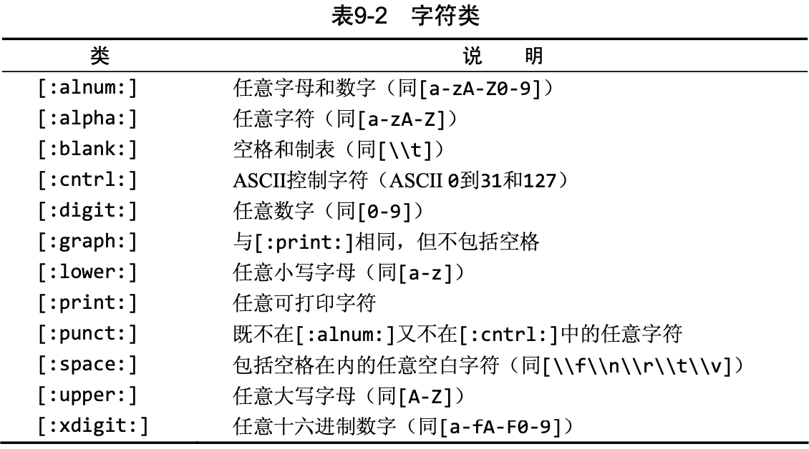
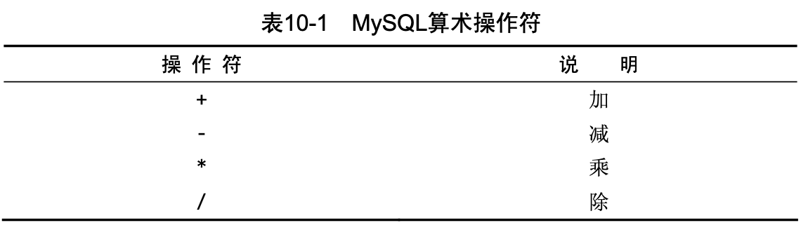
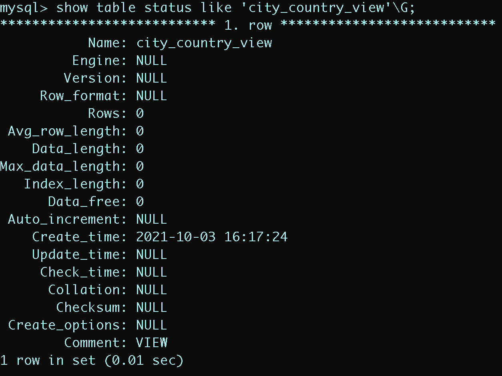
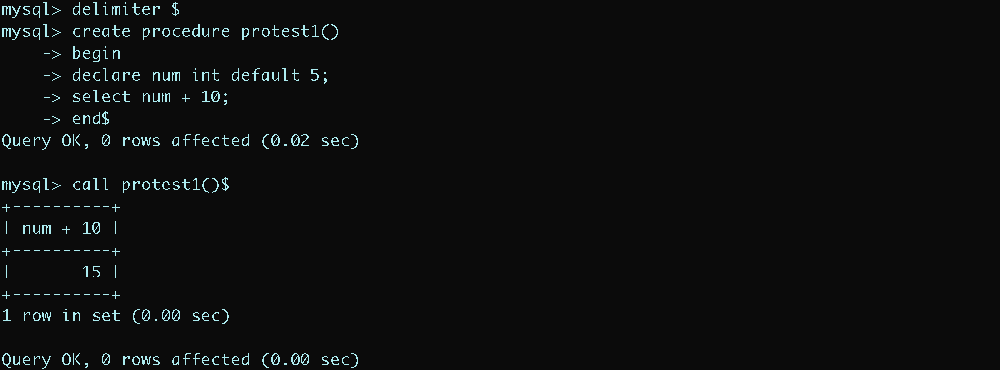
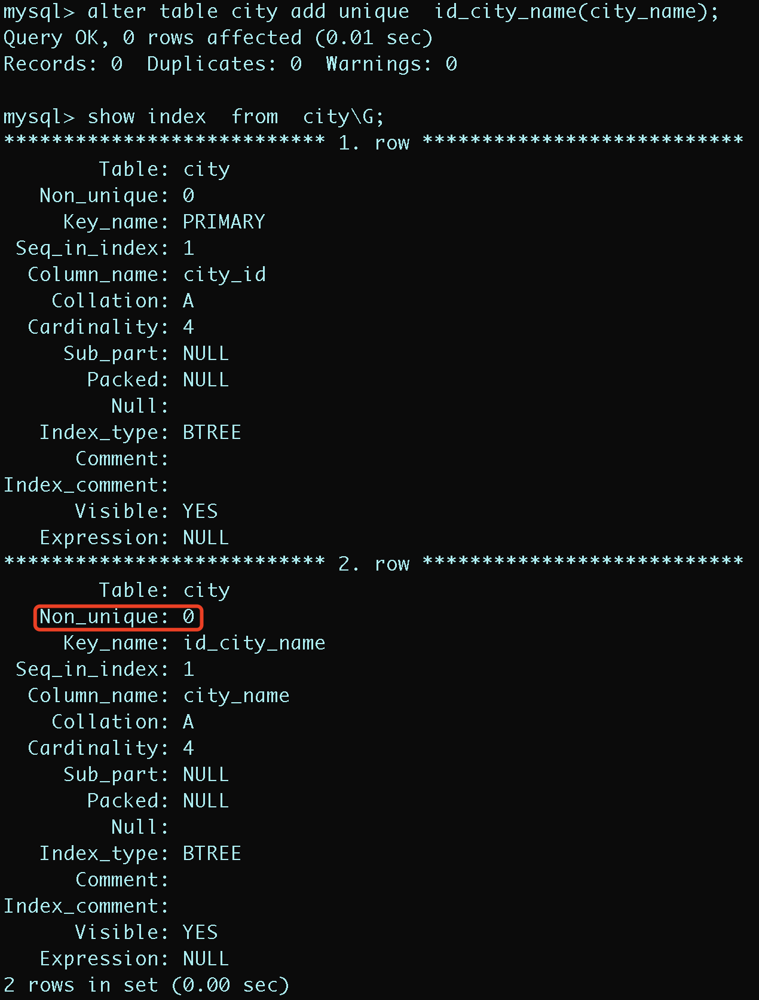
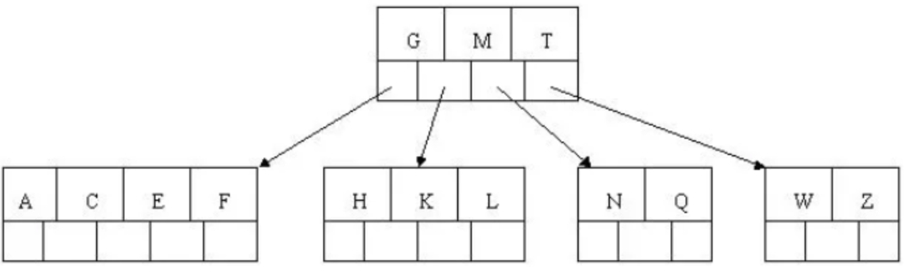

# MYSQL操作

## (一).链接

+ `SHOW COLUMNS` 对表的每个字段返回一行，行中包含字段名、数据类型、是否允许NULL、键信息、默认值以及其他信息(如字段的auto_increment)。

  ```sql
  SHOW COLUMNS FROM costomers;
  ```

+ `SHOW STATUS` 用于显示广泛的服务器状态信息;

+ `SHOW CREATE DATABASE` 和 `SHOW CREATE TABLE` 用来显示创建特定数据库或表的MySQ语句;

+ `SHOW GRANTS` 用来显示授予用户(所有用户或特定用户)的安全权限;

+ `SHOW ERRORS` 和 `SHOW WARNINGS` 用来显示服务器错误或警告消息。

---

## (二).创建数据表

### 1.创建表

为利用CREATE TABLE创建表，必须给出下列信息:

+ 新表的名字，在关键字CREATE TABLE之后给出; 
+ 表列的名字和定义，用逗号分隔。

```sql
CREATE TABLE customers
(
  cust_id      int       NOT NULL AUTO_INCREMENT,
  cust_name    char(50)  NOT NULL ,
  cust_address char(50)  NULL ,
  cust_city    char(50)  NULL ,
  cust_state   char(5)   NULL ,
  cust_zip     char(10)  NULL ,
  cust_country char(50)  NULL ,
  cust_contact char(50)  NULL ,
  cust_email   char(255) NULL ,
  PRIMARY KEY (cust_id)
) ENGINE=InnoDB;
```

### 2.更新表

为更新表定义，可使用ALTER TABLE语句。但是，理想状态下，当表 中存储数据以后，该表就不应该再被更新。在表的设计过程中需要花费 大量时间来考虑，以便后期不对该表进行大的改动。

为了使用ALTER TABLE更改表结构，必须给出下面的信息:

+ 在ALTER TABLE之后给出要更改的表名(该表必须存在，否则将出错);
+ 所做更改的列表。

```sql
ALTER TABLE vendors
ADD venf_phone CHAR(20);
```

ALTER TABLE的一种常见用途是定义外键。下面是用来定义本书中的表所用的外键的代码:

```sql
ALTER TABLE products ADD CONSTRAINT fk_products_vendors FOREIGN KEY (vend_id) REFERENCES vendors (vend_id);
```

### 3.删除表

删除表(删除整个表而不是其内容)非常简单，使用DROP TABLE语句即可:

```sql
DROP TABLE customers;
```

### 4.重命名表

使用RENAME TABLE语句可以重命名一个表:

```sql
RENAME TABLE customer2 TO customer;
```

---

## (三).数据操作

### 1.插入数据

使用INSERT进行操作

```sql
INSERT INTO vendors(vend_id, vend_name, vend_address, vend_city, vend_state, vend_zip, vend_country)
VALUES(1001,'Anvils R Us','123 Main Street','Southfield','MI','48075', 'USA');
```

### 2. 更新数据

为了更新(修改)表中的数据，可使用UPDATE语句。可采用两种方式使用UPDATE:

+ 更新表中特定行; 
+ 更新表中所有行。

基本的 UPDATE语句由3部分组成，分别是:

+ 要更新的表;
+ 列名和它们的新值
+ 确定要更新行的过滤条件

```sql
UPDATE customers
SET cust_email = 'elmer@qq.com'
WHERE cust_id = 1005;
```

为了删除某个列的值，可设置它为NULL(假如表定义允许NULL值)。如下进行:

```sql
UPDATE customers
SET cust_email = 'NULL'
WHERE cust_id = 1005;
```

其中NULL用来去除cust_email列中的值。

### 3.删除数据

为了从一个表中删除(去掉)数据，使用DELETE语句。可以两种方式使用DELETE:

+ 从表中删除特定的行; 
+ 从表中删除所有行。

```sql
DELETE FROM customers 
WHERE cust_id = 10006;
```

+ 如果想从表中删除所有行，不要使用DELETE。 可使用TRUNCATE TABLE语句，它完成相同的工作，但速度更快
+ TRUNCATE实际是删除原来的表并重新创建一个表，而不是逐行删除表中的数据

## (四).检索语句

### 1.select语句

```sql
SELECT COLUMN_1, COLUMN_2 FROM tablename;		  			#检索多行
SELECT * FROM tablename;														#检索全部行
#进行限制，返回唯一值
SELECT DISTINCT COLUMN_1 FROM FROM tablename;				#返回不同(唯一)的COLUMN_1
#返回特定的行
SELECT COLUMN_1, COLUMN_2 FROM tablename LIMIT 5; 	#返回结果不多于5行。
SELECT COLUMN_1, COLUMN_2 FROM tablename LIMIT 4,5;	#返回从行4开始的5行(第一行为行0，类似于数组)
#使用完全限定的表名
SELECT tablename.COLUMN_1 FROM databasename.tablename;
```

> + `DISTINCT` 关键字进行限制返回的值唯一
> + `LIMIT` 关键字进行限制返回的起始行与行数

### 2.进行排序(ORDER BY)

```sql
#将返回的行以 COLUMN_1 进行升序排序（默认升序）
SELECT COLUMN_1, COLUMN_2 FROM tablename ORDER BY COLUMN_1;
#将返回的行以 COLUMN_1 进行降序排序
SELECT COLUMN_1, COLUMN_2 FROM tablename ORDER BY COLUMN_1 DESC;
```

> + `ORDER BY` 字句进行升序排序
>
> + `DESC` 修饰排序为降序； `ASC` 为升序
> + 使用 `ORDER BY` 和 `LIMIT` 进行组合时，保证 `LIMIT` 在后面

### 3.过滤数据(WHERE)

SELECT语句中，数据根据WHERE子句指定的搜索条件进行过滤。 在同时使用 `ORDERBY` 和 `WHERE` 子句时，应该让 `ORDER BY` 位于 `WHERE` 之后，否则将会产生错误。

<div align = "center"></div>

```sql
SELECT COLUMN_1, COLUMN_2 FROM tablename WHERE COLUMN_1 BETWEEN A AND B;
```

#### 空值检查

+ 在创建表时可以指定其中的列是否可以不包含值。在一个列不包含值时，称其为包含空值NULL。
+ NULL 无值(no value)，与字段包含0、空字符串或仅仅包含空格不同。

```sql
SELECT COLUMN_1, COLUMN_2 FROM tablename WHERE COLUMN_1 IS NULL;
```

### 4.数据过滤(AND,OR,IN)

> MySQL允许给出多个WHERE子句：以AND子句的方式或OR子句的方式使用。

#### (1).AND操作符

为了通过不止一个列进行过滤，可使用AND操作符给WHERE子句附加条件。

```sql
SELECT prod_id, prod_price, prod_name
FROM products
WHERE vend_id = 1003 AND prod_price <= 10;
```

#### (2).OR操作符

OR操作符与AND操作符不同，它指示MySQL检索匹配任一条件的行。

```sql
SELECT prod_id, prod_price, prod_name
FROM products
WHERE vend_id = 1003 OR vend_id = 1002;
```

其中 AND 的计算次序比 OR 优先级更高。

```sql
SELECT prod_id, prod_price, prod_name
FROM products
WHERE vend_id = 1003 OR vend_id = 1002 AND prod_price >= 10;
```

理解为 1003制造的价格为10美元(含)以上的产品，或者1002制造的任何产品， 而不管其价格如何。 **此问题的解决方法是使用圆括号明确地分组相应的操作符。**

```sql
SELECT prod_id, prod_price, prod_name
FROM products
WHERE (vend_id = 1003 OR vend_id = 1002) AND prod_price >= 10;
```

#### (3).IN操作符

IN操作符用来指定条件范围，范围中的每个条件都可以进行匹配。

```sql
SELECT prod_id, prod_price, prod_name
FROM products
WHERE vend_id IN (1002,1003)
ORDER BY prod_name;
```

+ IN的最大优点是可以包含其他SELECT语句，使得能够更动态地建立WHERE子句
+ IN操作符的语法更清楚且更直观。计算的次序更容易管理
+ IN操作符一般比OR操作符清单执行更快。

#### (4).NOT操作符

WHERE子句中的NOT操作符有且只有一个功能，那就是否定它之后所跟的任何条件。

```sql
SELECT prod_id, prod_price, prod_name
FROM products
WHERE vend_id NOT IN (1002,1003)
ORDER BY prod_name;
```

>  MySQL不是匹配1002和1003的vend_id，而是匹配1002和1003之外供应商的 vend_id。

### 5. 用通配符与LIKE进行过滤

> +  **通配符(wildcard)**  用来匹配值的一部分的特殊字符。 
> +  **搜索模式(search pattern)** 由字面值、通配符或两者组合构成的搜索条件。

LIKE 指示MySQL后跟的搜索模式利用通配符匹配而不是直接相等匹配进行比较。

#### (1).百分号(%)通配符

%表示任何字符出现任意次数。

```sql
SELECT prod_id, prod_price, prod_name
FROM products
WHERE pro_name LIKE 'jet%';	#找出所有以词jet起头的产品
```

> + 搜索可以是区分大小写的。如果区分大小写，'jet%' 与JetPack将不匹配
> + 尾空格可能会干扰通配符匹配。例如在保存词 anvil时，如果后面有一个或多个空格，则子句``WHERE prod_name LIKE '%anvil' `不会匹配它们，因为在最后的`l  `后有多余的字符。

通配符可在搜索模式中任意位置使用，并且可以使用多个通配符。

```sql
SELECT prod_id, prod_price, prod_name
FROM products
WHERE pro_name LIKE '%anvil%';
```

> 虽然似乎%通配符可以匹配任何东西，除了NULL。即使是WHERE prod_name LIKE '%'也不能匹配用值NULL作为产品名的行。

#### (2).下划线(_)通配符

下划线的用途与%一样，但下划线只匹配单个字符而不是多个字符。

```sql
SELECT prod_id, prod_price, prod_name
FROM products
WHERE pro_name LIKE '_ to anvil';
```

#### (3).通配符的使用代价

通配 符搜索的处理一般要比前面讨论的其他搜索所花时间更长。

+ 不要过度使用通配符。如果其他操作符能达到相同的目的，应该使用其他操作符。
+ 在确实需要使用通配符时，除非绝对有必要，否则不要用在搜索模式的开始处。把通配符置于搜索模式的开始处，搜索起来是最慢的。

### 6.正则表达式(REGEXP)

MySQL 用 WHERE 子句指定正则表达式过滤SELECT检索出的数据。

#### (1).使用REGEXP

##### 基本字符匹配

```sql
SELECT prod_id, prod_price, prod_name
FROM products
WHERE pro_name REGEXP '1000'
ORDER BY pro_name;
```

这条语句非常像使用LIKE。REGEXP后所跟的东西作为正则表达式(与文字正文1000匹配)处理

##### 与LIKE的区别

+ LIKE匹配整个列。如果被匹配的文本在列值 中出现，LIKE将不会找到它，相应的行也不被返回（除非使用通配符）。
+ REGEXP在列值内进行匹配，如果被匹配的文本在列值中出现，REGEXP将会找到它，相应的行将被返回。 

<div align = "center"></div>

##### 区分大小写

MySQL中的正则表达式匹配不区分大小写。为区分大小写，可使用 **BINARY** 关键字，如：

```sql
WHERE prod_name REGEXP BINARY 'JetPack .000';
```

#### (2).进行OR匹配

为搜索两个串之一(或者为这个串，或者为另一个串)，使用`|`。

```sql
SELECT prod_id, prod_price, prod_name
FROM products
WHERE pro_name REGEXP '1000 | 2000'
ORDER BY pro_name;
```

使用 `|` 从功能上类似于在SELECT语句中使用OR语句，多个OR条件可并入单个正则表达式。

#### (3).匹配几个字符之一([])

匹配特定的字符可通过指定  `[]`  括起来的字符来完成，如下所示:

```sql
SELECT prod_id, prod_price, prod_name
FROM products
WHERE pro_name REGEXP '[123] Ton'
ORDER BY pro_name;
```

+ `[123]`  定义一组字符，它的意思是匹配1或2或3，因此表中的 1 ton和2 ton都匹配且返回
+ 字符集合也可以被否定，为否定一个字符集，在集合的开始处放置一个 `^` 即可。

#### (4).匹配范围([1-5])

简化类型集合，可使用 `-` 来定义一个范围。

```sql
SELECT prod_id, prod_price, prod_name
FROM products
WHERE pro_name REGEXP '[1-5] Ton'
ORDER BY pro_name;
```

#### (5).匹配特殊字符(\\\\.)

为了匹配特殊字符，必须用 `\\` 为前导。`\\-` 表示查找 `-` ，`\\.`表示查找 `.`

```sql
SELECT vend_name
FROM vendors
WHERE vend_name REGEXP '\\.'
ORDER BY vend_name;
```

<div align = "center"></div>

> MySQL要求两个反斜杠(MySQL 自己解释一个，正则表达式库解释另一个)

#### (6).匹配字符类

存在找出你自己经常使用的数字、所有字母字符或所有数字字母字符等的匹配。为更方便工作，可以使用预定义的字符集，称为字符类(character class)。

<div align = "center"></div>

#### (7).匹配多个实例

需要寻找所有的数，不管数中包含多少数字，或者你可能想寻找一个单词并且还能够适应一个尾 随的s(如果存在)，等等。这可以用下表列出的正则表达式重复元字符来完成。

<div align = "center"></div>

```sql
SELECT vend_name
FROM vendors
WHERE vend_name REGEXP '\\([0-9] sticks?\\)'
ORDER BY vend_name;
```

`\\`(匹配)，[0-9]匹配任意数字(这个例子中为1和5)，sticks?匹配stick 和sticks(s后的?使s可选，因为?匹配它前面的任何字符的0次或1次出现)，\\)匹配)。没有?，匹配stick和sticks会非常困难。

```sql
SELECT vend_name
FROM vendors
WHERE vend_name REGEXP '[[:digit:]]{4}'
ORDER BY vend_name;
```

[:digit:]匹配任意数字。{4}确切地要求它前面的字符出现4次，所以匹配连在一起的任意4位数字。

#### (8).定位符(**^[0-9\\\\.]**)

匹配特定位置的文本，需要使用下表列出的定位符。

<div align = "center"></div>

```sql
SELECT vend_name
FROM vendors
WHERE vend_name REGEXP '^[0-9\\.]'
ORDER BY vend_name;
```

`^[0-9\\.]`只在.或任意数字为串中第一个字符时才匹配它们。

> ^有两种用法。在集合中(用[和]定义)，用它 来否定该集合，否则，用来指串的开始处。

### 7.创建计算字段

#### (1).拼接(Concat)

+  **字段(field)**  基本上与列(column)的意思相同，经常互换使用，不过数据库列一般称为列，而术语字段通常用在计算字段的 连接上。
+  **拼接(concatenate)**  将值联结到一起构成单个值。

```sql
SELECT Concat(vend_name, '(', vend_country, ')')
FROM vendors
ORDER BY vend_name;
```

Concat()拼接串，即把多个串连接起来形成一个较长的串。

#### (2).使用别名(AS)

别名(alias)是一个字段或值 的替换名。别名用AS关键字赋予。

```sql
SELECT Concat(RTrim(vend_name), '(', RTrim(vend_country), ')') AS vend_title
FROM vendors
ORDER BY vend_name;
```

语句中跟了`AS vend_title`，指示SQL创建一个包含指定计算的名为vend_title的计算字段。

#### (3).执行算术计算

MySQL支持下表中列出的基本算术操作符。此外，圆括号可用来区分优先顺序。

<div align = "center"></div>

---

### 8.数据处理函数

#### (1).文本处理函数

+ 如字符转换为大写函数

```sql
SELECT vend_name, Upper(vend_name) AS vend_name_upcase
FROM vendors
ORDER BY vend_name;
```

常见的文本处理函数如下表：


SOUNDEX是一个将任何文本串转换为描述其语音表示的字母数字模式的算法。SOUNDEX考虑了类似 的发音字符和音节，使得能对串进行发音比较而不是字母比较。

#### (2).日期和时间处理函数

下表列出了某些常用的日期和时间处理函数。


不管是插入或更新表值还是用WHERE子句进行过滤，日期必须为 格式yyyy-mm-dd。

进行查询时仅将给出的日期与列中的日期部分进行比较，而不是将给出的日期与整个列值进行比较。

```sql
SELECT cust_id, order_num
FROM orders
WHERE Data(order_data) = '2005-09-10';
```

也可以使用 Year 与 Month 函数来查询年份与月数。

#### (3).数值处理函数

下表列出一些常用的数值处理函数。


### 9.汇总数据(AVG,SUM)

#### (1).聚集函数

+  **聚集函数(aggregate function)**  运行在行组上，计算和返回单 个值的函数。

MySQL给出了5个聚集函数，见下表。 这些函数能进行上述罗列的检索。


##### AVG函数

+ AVG()通过对表中行数计数并计算特定列值之和，求得该列的平均值。

```sql
SELECT AVG(prod_price) AS avg_price
FROM products
WHERE vend_id = 1003;
```

##### COUNT函数

+ COUNT()函数进行计数。可利用COUNT()确定表中行的数目或符合特定条件的行的数目。

  + 使用COUNT(*)对表中行的数目进行计数，不管表列中包含的是空 值(NULL)还是非空值。

    使用COUNT(column)对特定列中具有值的行进行计数，忽略 NULL值

```sql
SELECT COUNT(*) AS num_cust
FROM customers;
```

##### MAX函数

+ MAX()返回指定列中的最大值。

```sql
SELECT MAX(prod_price) AS max_price
FROM products;
```

##### MIN 函数

+ MIN()返回指定列的最小值。

```sql
SELECT MIN(prod_price) AS min_price
FROM products;
```

##### SUM函数

+ SUM()用来返回指定列值的和(总计)。

```sql
SELECT SUM(quantity) AS items_ordered
FROM orderitems
WHERE order_num = 20005;
```

#### (2).聚集不同的值

+ 对所有的行执行计算，指定ALL参数或不给参数(因为ALL是默认行为);
+ 只包含不同的值，指定DISTINCT参数。
  + DISTINCT只能用于COUNT()。DISTINCT 不能用于COUNT(*)，因此不允许使用COUNT(DISTINCT)， 否则会产生错误。

```sql
SELECT AVG(DISTINCT prod_price) AS avg_price
FROM products
WHERE vend_id = 1003;
```

> + 使用AVG()函数返回特定供应商提供的产品的平均价格。使用AVG()函数返回特定供应商提供的产品的平均价格。

#### (3).组合聚集函数

```sql
SELECT COUNT(*) AS nums_items
			 MIN(prod_price) AS price_min
			 MAX(prod_price) AS price_max
			 AVG(prod_price) AS price_avg
FROM products;
```

---

### 10.分组数据(GROUP BY)

分组允许把数据分为多个逻辑组，以便能对每个组进行聚集计算。

#### (1).创建分组(Group By)

分组是在SELECT语句的GROUP BY子句中建立的。

```sql
SELECT vend_id, COUNT(*) AS num_prods
FROM products
GROUP BY vend_id;
```

`GROUP BY` 子句指示MySQL按vend_id排序并分组数据。这导致对每个vend_id而不是整个表计算num_prods一次。

注意事项：

+ GROUP BY子句可以包含任意数目的列。这使得能对分组进行嵌套， 为数据分组提供更细致的控制。
+ 如果在GROUP BY子句中嵌套了分组，数据将在最后规定的分组上进行汇总
+ GROUP BY子句中列出的每个列都必须是检索列或有效的表达式
+ 除聚集计算语句外，SELECT语句中的每个列都必须在GROUP BY子 句中给出。
+  GROUP BY子句必须出现在WHERE子句之后，ORDER BY子句之前。

#### (2).过滤分组(Having)

+ WHERE没有分组的概念。MYSQL提供HAVING子句。目前为止所学过的所有类型的WHERE子句都可以用HAVING来替代。唯一的差别是 WHERE过滤行，而HAVING过滤分组。

```sql
SELECT cust_id, COUNT(*) AS orders
FROM orders
GROUP BY cust_id
HAVING COUNT(*) >= 2;
```

#### (3).分组和排序

虽然GROUP BY和ORDER BY经常完成相同的工作，但它们是非常不同的。


```sql
SELECT order_num, SUM(quantity*item_price) AS ordertotal
FROM orderitems
GROUP BY order_num
HAVING SUM(quantity*item_price)>= 50
ORDER BY ordertotal;
```

#### (4).SELECT 子句顺序

下表以在SELECT语句中 使用时必须遵循的次序，列出迄今为止所学过的子句


----

### 11.使用子查询

#### (1).使用子查询进行过滤

在SELECT语句中，子查询总是从内向外处理。

```sql
SELECT cust_id
FROM orders
WHERE order_num IN 
(SELECT order_num FROM orderitems WHERE prod_id = 'TNT');
```

+ WHERE子句中使用子查询，应该保证SELECT语句具有与WHERE子句中相同数目的列。

#### (2).作为计算字段使用子查询

任何时候只要列名可能有多义性，就必须使用表名和列名由一个句点分隔。

```sql
SELECT cust_name, cust_state (SELECT COUNT(*) FROM orders WHERE orders.cust_id = customers.cust_id) AS orders 
FROM customers
ORDER BY cust_name;
```

---

### 12.联结表(JOIN)

#### (1).创建联结

分解数据为多个表能更有效地存储，更方便地处理，有更大的可伸缩性。但这些好处是有代价的。如果数据存储在多个表中，利用联结就可以用单条SELECT语句检索出数据

```sql
SELECT vend_name, prod_name, prod_price
FROM vendors, products
WHERE vendors.vend_id = products.vend_id
ORDER BY vend_name, prod_name;
```

>  在引用的列可能出现二义性时，必须使用完全限定列名(用一个点分隔的表名和列名)。

**笛卡儿积(cartesian product)**  由没有联结条件的表关系返回的结果为笛卡儿积。检索出的行的数目将是第一个表中的行数乘以第二个表中的行数。

#### (2).内部联结

上面使用的联结称为等值联结(equijoin)，它基于两个表之间的相等测试。这种联结也称为内部联结。

对于这种联结可以使用稍微不同的语法来明确指定联结的类型。

```sql
SELECT vend_name, prod_name, prod_price
FROM vendors INNER JOIN products
ON vendors.vend_id = products.vend_id;
```

量个表之间的关系是FROM子句的组成部分，以INNER JOIN指定。在使用这种语法时，联结条件用特定的ON子句而不是WHERE 子句给出。

#### (3).联结多个表

SQL对一条SELECT语句中可以联结的表的数目没有限制。创建联结的基本规则也相同。首先列出所有表，然后定义表之间的关系。

```sql
SELECT prod_name, vend_name, prod_price, quantity
FROM orderitems, products, vendors
WHERE products.vend_id = vendors.vend_id
AND orderitems.prod_id = products.prod_id
AND order_num = 20005;
```

---

### 13.创建高级联结

#### (1).使用表别名

SQL还允许给表名起别名。这样做有两个主要理由:

+ 缩短SQL语句;
+ 允许在单条SELECT语句中多次使用相同的表。

```sql
SELECT cust_name, cust_contact
FROM customers AS c, orders AS o, orderitems AS oi
WHERE c.cust_id = o.cust_id
AND oi.order_num = o.order_num
AND prod_id = 'TNT';
```

#### (2).使用不同的联结

##### 自联结

```sql
SELECT p1.prod_id, p1.prod_name
FROM products AS p1, products AS p2
WHERE p1.vend_id = p2.vend_id
AND p2.prod_id = 'DTNTR';
```

自联结通常作为外部语句用来替代从相同表中检索数据时使用的子查询语句。虽然最终的结果是相同的，但有时候处理联结远比处理子查询快得多。

##### 自然联结

标准的联结(前一章中介绍的内部联结)返回所有数据，甚 至相同的列多次出现。自然联结排除多次出现，使每个列只返回一次。 

```sql
SELECT c.*,o.order_num,o.order_data,oi.prod_id, oi.quantity,OI.item_price
FROM customer AS C, orders AS o, orderitems AS oi
WHERE c.cust_id = o.cust_id
AND oi.order_num = o.order_num
AND prod_id = 'FB';
```

##### 外部联结

联结包含了那些在相关表中没有关联行的行。这种类型的联结称为外部联结。

```sql
SELECT customers.cust_id, orders.order_num
FROM customers LEFT OUTER JOIN orders
ON customers.cust_id = orders.cust_id;
```

外部联结还包括没 有关联行的行。在使用OUTER JOIN语法时，必须使用RIGHT或LEFT关键字 指定包括其所有行的表(RIGHT指出的是OUTER JOIN右边的表，而LEFT 指出的是OUTER JOIN左边的表)。上面的例子使用LEFT OUTER JOIN从FROM 子句的左边表(customers表)中选择所有行。

> 存在两种基本的外部联结形式:左外部联结 和右外部联结。它们之间的唯一差别是所关联的表的顺序不 同。

#### (3).带聚集函数的联结

```sql
SELECT customer.cust_name,customers.cust_id,COUNT(orders.order_num) AS num_ord
FROM customers INNER JOIN orders
ON customers.cust_id = orders.cust_id
GROUP BY customer.cust_id;
```

此SELECT语句使用INNER JOIN将customers和orders表互相关联。GROUP BY子句按客户分组数据，因此，函数调用COUNT (orders.order_num)对每个客户的订单计数，将它作为num_ord返回。

#### (4).使用联结与联结条件

+ 注意所使用的联结类型。一般使用内部联结，但使用外部联结也是有效的。
+ 保证使用正确的联结条件，否则将返回不正确的数据。
+ 应该总是提供联结条件，否则会得出笛卡儿积。
+ 在一个联结中可以包含多个表，甚至对于每个联结可以采用不同的联结类型。虽然这样做是合法的，一般也很有用，但应该在一 起测试它们前，分别测试每个联结。这将使故障排除更为简单。

---

### 14.组合查询(UNION/ALL)

MySQL也允许执行多个查询(多条SELECT语句)，并将结果作为单个查询结果集返回。这些组合查询通常称为并(union)或复合查询(compound query)。

有两种基本情况，其中需要使用组合查询:

+ 在单个查询中从不同的表返回类似结构的数据; 
+ 对单个表执行多个查询，按单个查询返回数据。

#### (1).使用UNION与UNION ALL

+ UNION必须由两条或两条以上的SELECT语句组成，语句之间用关键字UNION分隔
+ UNION中的每个查询必须包含相同的列、表达式或聚集函数(不过各个列不需要以相同的次序列出)。
+ 列数据类型必须兼容:类型不必完全相同，但必须是DBMS可以隐含地转换的类型(例如，不同的数值类型或不同的日期类型)。

UNION从查询结果集中自动去除了重复的行(换句话说，它的行为与单条SELECT语句中使用多个WHERE子句条件一样)

UNION ALL，MySQL不取消重复的行。

```sql
SELECT vend_id, prod_id, prod_price
FROM products
WHERE prod_price <= 5
UNION
SELECT vend_id, prod_id, prod_price
FROM products
WHERE vend_id IN (1000,2000)
ORDER BY vend_id, prod_price;
```


### 15.全文本搜索(FULLTEXT)

为了进行全文本搜索，必须索引被搜索的列，而且要随着数据的改 变不断地重新索引。在对表列进行适当设计后，MySQL会自动进行所有 的索引和重新索引。

在索引之后，SELECT可与Match()和Against()一起使用以实际执行 搜索。

#### (1).启动全文本搜索支持

一般在创建表时启用全文本搜索。CREATE TABLE语句接受FULLTEXT子句，它给出被索引列的一个逗号分隔的列表。

```sql
CREATE TABLE productnotes
(
  note_id    int           NOT NULL AUTO_INCREMENT,
  prod_id    char(10)      NOT NULL,
  note_date datetime       NOT NULL,
  note_text  text          NULL ,
  PRIMARY KEY(note_id),
  FULLTEXT(note_text) #启动全文本搜索支持
) ENGINE=MyISAM;
```

#### (2).进行全文本搜索

在索引之后，使用两个函数Match()和Against()执行全文本搜索，

+ Match()指定被搜索的列
+ Against()指定要使用的搜索表达式。

```sql
SELECT note_text
FROM productnotes
WHERE Match(note_text) Against('rabbit');
```

。Match(note_text)指示MySQL针对指定的 列进行搜索，Against('rabbit')指定词rabbit作为搜索文本。返回有包含词rabbit的行内容。

#### (3).使用查询拓展

查询扩展用来设法放宽所返回的全文本搜索结果的范围。查询扩展用来设法放宽所返回的全文本搜索结果的范围。

+ 首先，进行一个基本的全文本搜索，找出与搜索条件匹配的所有行;
+ 其次，MySQL检查这些匹配行并选择所有有用的词(解释MySQL如何断定什么有用，什么无用)。

+ 再其次，MySQL再次进行全文本搜索，这次不仅使用原来的条件， 而且还使用所有有用的词。

利用查询扩展，能找出可能相关的结果，即使它们并不精确包含所查找的词。

```sql
SELECT note_text
FROM productnotes
WHERE Match(note_text) Against('anvils' WITH QUERY EXPANSION);
```

#### (4).布尔文本搜索

MySQL支持全文本搜索的另外一种形式，称为布尔方式(boolean mode)。以布尔方式，可以提供关于如下内容的细节:

+ 要匹配的词;
+  要排斥的词(如果某行包含这个词，则不返回该行，即使它包含其他指定的词也是如此);
+ 排列提示(指定某些词比其他词更重要，更重要的词等级更高);  表达式分组;
+ 另外一些内容。

```sql
SELECT note_text
FROM productnotes
WHERE Match(note_text) Against('anvils' IN BOOLEAN MODE);
```


搜索匹配包含词 rabbit 与 bait 的行

```sql
SELECT note_text
FROM productnotes
WHERE Match(note_text) Against('+rabit +bait' IN BOOLEAN MODE);
```

搜索匹配包含词 rabbit 与 bait 中的至少一个词就行

```sql
SELECT note_text
FROM productnotes
WHERE Match(note_text) Against('rabit bait' IN BOOLEAN MODE);
```

搜索匹配短语 rabbit  bait 而不是匹配两个词rabbit和bait

```sql
SELECT note_text
FROM productnotes
WHERE Match(note_text) Against('"rabit bait"' IN BOOLEAN MODE);
```

搜索匹配rabbit和carrot，增加前者的等级，降低后者的等级

```sql
SELECT note_text
FROM productnotes
WHERE Match(note_text) Against('>rabit <bait' IN BOOLEAN MODE);
```

搜索匹配包含词 safe与 combination ，降低后者的等级

```sql
SELECT note_text
FROM productnotes
WHERE Match(note_text) Against('+safe +(<combination)' IN BOOLEAN MODE);
```

#### (5).全文本搜索的使用说明

+  在索引全文本数据时，短词被忽略且从索引中排除。短词定义为那些具有3个或3个以下字符的词(如果需要，这个数目可以更改)。
+ MySQL带有一个内建的非用词(stopword)列表，这些词在索引全文本数据时总是被忽略。如果需要，可以覆盖这个列表。
+ MySQL规定了一条50%规则，如果一个词出现在50%以上 的行中，则将它作为一个非用词忽略。50%规则不用于IN BOOLEAN MODE。
+ 如果表中的行数少于3行，则全文本搜索不返回结果(因为每个词 或者不出现，或者至少出现在50%的行中)。
+ 忽略词中的单引号。例如，don't索引为dont。
+ 不具有词分隔符(包括日语和汉语)的语言不能恰当地返回全文本搜索结果。
+ 如前所述，仅在MyISAM数据库引擎中支持全文本搜索。

---

## (五).使用视图(VIEW)

### 1.基本介绍

视图（View）是一种虚拟存在的表。它并不在数据库中实际存在，行和列数据来自定义视图的查询中使用的表，并且是在使用视图时动态生成的。

通俗的讲，视图是一条SELECT语句执行后返回的结果集。所以在创建视图时，主要工作落在创建SQL查询语句上。

视图相对于普通的表的优势主要包括以下几项：

-  **简单：** 使用视图时不需要关心后面对应的表的结构、关联条件和筛选条件，这是过滤好的复合条件的结果集。
-  **安全**： 使用视图时只能访问被允许查询的结果集，对表的权限管理并不能限制到某个行某个列，但是通过视图就可以简单的实现。
-  **数据独立：** 一旦视图的结构确定了，可以屏蔽表结构变化对用户的影响，源表增加列对视图没有影响；源表修改列名，则可以通过修改视图来解决，不会造成对访问者的影响。

视图（View）是一种虚拟存在的表。它并不在数据库中实际存在，行和列数据来自定义视图的查询中使用的表，并且是在使用视图时动态生成的。

通俗的讲，视图是一条SELECT语句执行后返回的结果集。所以在创建视图时，主要工作落在创建SQL查询语句上。

视图相对于普通的表的优势主要包括以下几项：

-  **简单：** 使用视图时不需要关心后面对应的表的结构、关联条件和筛选条件，这是过滤好的复合条件的结果集。
-  **安全**： 使用视图时只能访问被允许查询的结果集，对表的权限管理并不能限制到某个行某个列，但是通过视图就可以简单的实现。
-  **数据独立：** 一旦视图的结构确定了，可以屏蔽表结构变化对用户的影响，源表增加列对视图没有影响；源表修改列名，则可以通过修改视图来解决，不会造成对访问者的影响。

### 2. 创建或者修改视图

创建视图的语法为：

```mysql
CREATE [OR REPLACE] [ALGORITHM = {UNDEFINED | MERGE | TEMPTABLE}]
VIEW view_name [(column_list)]
AS select_statement
[WITH [CASCADED | LOCAL] CHECK OPTION]
```

示例：

```mysql
create or replace view city_country_view 
as 
select t.*,c.country_name from country c , city t where c.country_id = t.country_id;
```

<div align = center></div>

修改视图的语法为：

```mysql
ALTER [ALGORITHM = {UNDEFINED | MERGE | TEMPTABLE}]

VIEW view_name [(column_list)]

AS select_statement

[WITH [CASCADED | LOCAL] CHECK OPTION]
```

选项 : 

```mysql
WITH [CASCADED | LOCAL] CHECK OPTION 决定了是否允许更新数据使记录不再满足视图的条件。
LOCAL ： 只要满足本视图的条件就可以更新。
CASCADED ： 必须满足所有针对该视图的所有视图的条件才可以更新。 默认值.
```

### 3.查看视图

从 MySQL 5.1 版本开始，使用 SHOW TABLES 命令的时候不仅显示表的名字，同时也会显示视图的名字，而不存在单独显示视图的 SHOW VIEWS 命令。

<div align = center></div>

同样，在使用 SHOW TABLE STATUS 命令的时候，不但可以显示表的信息，同时也可以显示视图的信息。

<div align = center></div>

如果需要查询某个视图的定义，可以使用 SHOW CREATE VIEW 命令进行查看 ：

<div align = center></div>

---

### 4.删除视图

语法 :

```mysql
DROP VIEW [IF EXISTS] view_name [, view_name] ...[RESTRICT | CASCADE]	
```

示例 , 删除视图city_country_view :

```mysql
DROP VIEW city_country_view ;
```

<div align = center></div>

---

## (六).使用存储过程(PROCEDURE)

### 1.存储过程和函数概述

 存储过程和函数是 **事先经过编译并存储在数据库中的一段 SQL 语句的集合** ，调用存储过程和函数可以简化应用开发人员的工作，减少数据在数据库和应用服务器之间的传输，提高数据处理的效率。

 函数 ： 是一个有返回值的过程 ；

 过程 ： 是一个没有返回值的函数 ；

>  存储过程和函数的区别在于函数必须有返回值，而存储过程没有。

---

### 2.创建存储过程

创建语法：

```mysql
CREATE PROCEDURE procedure_name ([proc_parameter[,...]])
begin
	-- SQL语句
end ;
```

示例 ：

```mysql
delimiter $										-- 声明分隔符为 $

create procedure pro_test1()
begin
	select 'Hello Mysql' ;
end$

delimiter ;										-- 重新声明分隔符为 ;
```

>  **DELIMITER** 用来声明SQL语句的分隔符 , 表明命令是否已经结束了，mysql是否可以执行了。
>
>  默认情况下，delimiter是 分号 `;` 。在命令行客户端中，如果有一行命令以分号结束，那么回车后，mysql将会执行该命令。

---

### 3.调用存储过程

调用语法：

```mysql
call procedure_name() ;	
```

---

### 4.查看存储过程

查看语法：

```mysql
-- 查询db_name数据库中的所有的存储过程
select name from mysql.proc where db='db_name';

-- 查询存储过程的状态信息
show procedure status;

-- 查询某个存储过程的定义
show create procedure test.pro_test1 \G;
```

---

### 5.删除存储过程

删除语法：

```mysql
DROP PROCEDURE  [IF EXISTS] sp_name ；
```

---

### 6.语法

存储过程是可以编程的，意味着可以使用变量，表达式，控制结构 ， 来完成比较复杂的功能。

#### 1.变量

##### DECLARE

通过 DECLARE 可以定义一个局部变量，该变量的作用范围只能在 BEGIN…END 块中。

```mysql
DECLARE var_name[,...] type [DEFAULT value]
```

示例 :

```mysql
 delimiter $

 create procedure pro_test1() 
 begin 
 		declare num int default 5;
 		select num + 10; 
 end$

 delimiter ; 
```

<div align = center></div>

##### SET

直接赋值使用 SET，可以赋常量或者赋表达式，具体语法如下：

```mysql
  SET var_name = expr [, var_name = expr] ...
```

示例 :

```mysql
DELIMITER $

CREATE  PROCEDURE pro_test2()
BEGIN
 	DECLARE NAME VARCHAR(20);
  SET NAME = 'MYSQL';
  SELECT NAME ;
END$

DELIMITER ;
```

<div align = center></div>

也可以通过select ... into 方式进行赋值操作 :

```mysql
DELIMITER $

CREATE  PROCEDURE pro_test3()
BEGIN
	declare  countnum int;
	select count(*) into countnum from city;
	select countnum;
END$

DELIMITER ;
```

<div align = center></div>

#### 2.if条件判断

语法结构 :

```mysql
if search_condition then statement_list

	[elseif search_condition then statement_list] ...
	
	[else statement_list]

end if;
```

需求：

```
根据定义的身高变量，判定当前身高的所属的身材类型 
	180 及以上 ----------> 身材高挑
	170 - 180  ---------> 标准身材
	170 以下  ----------> 一般身材
```

示例 :

```mysql
delimiter $

create procedure pro_test6()
begin
  declare  height  int  default  175; 
  declare  description  varchar(50);
  
  if  height >= 180  then
    set description = '身材高挑';
  elseif height >= 170 and height < 180  then
    set description = '标准身材';
  else
    set description = '一般身材';
  end if;
  
  select description ;
end$

delimiter ;
```

调用结果为 :

<div align = center></div>

#### 3.传递参数

语法格式 :

```
create procedure procedure_name([in/out/inout] 参数名   参数类型)
...
IN :   该参数可以作为输入，也就是需要调用方传入值 , 默认
OUT:   该参数作为输出，也就是该参数可以作为返回值
INOUT: 既可以作为输入参数，也可以作为输出参数
```

##### IN

需求 :

```
根据定义的身高变量，判定当前身高的所属的身材类型 
```

示例 :

```mysql
delimiter $

create procedure pro_test5(in height int)
begin
    declare description varchar(50) default '';
  if height >= 180 then
    set description='身材高挑';
  elseif height >= 170 and height < 180 then
    set description='标准身材';
  else
    set description='一般身材';
  end if;
  select concat('身高 ', height , '对应的身材类型为:',description);
end$

delimiter ;
```

<div align = center></div>

**OUT-输出**

需求 :

```
根据传入的身高变量，获取当前身高的所属的身材类型  
```

示例:

```mysql
create procedure pro_test7(in height int , out description varchar(100))
begin
  if height >= 180 then
    set description='身材高挑';
  elseif height >= 170 and height < 180 then
    set description='标准身材';
  else
    set description='一般身材';
  end if;
end$	
```

调用:

```mysql
call pro_test5(168, @description)$
select @description$
```

<div align = center></div>

> @description : 这种变量要在变量名称前面加上“@”符号，叫做用户会话变量，代表整个会话过程他都是有作用的，这个类似于全局变量一样。
>
> @@global.sort_buffer_size : 这种在变量前加上 "@@" 符号, 叫做 系统变量

#### 4.case结构

语法结构 :

```mysql
-- 方式一 : 
CASE case_value

  WHEN when_value THEN statement_list
  
  [WHEN when_value THEN statement_list] ...
  
  [ELSE statement_list]
  
END CASE;


-- 方式二 : 
CASE

  WHEN search_condition THEN statement_list
  
  [WHEN search_condition THEN statement_list] ...
  
  [ELSE statement_list]
  
END CASE;
```

需求:

```
给定一个月份, 然后计算出所在的季度
```

示例 :

```mysql
delimiter $

create procedure pro_test9(month int)
begin
  declare result varchar(20);
  case 
    when month >= 1 and month <=3 then 
      set result = '第一季度';
    when month >= 4 and month <=6 then 
      set result = '第二季度';
    when month >= 7 and month <=9 then 
      set result = '第三季度';
    when month >= 10 and month <=12 then 
      set result = '第四季度';
  end case;
  select concat('您输入的月份为 :', month , ' , 该月份为 : ' , result) as content ;
end$

delimiter ;
```

#### 5.while循环

语法结构:

```mysql
while search_condition do

	statement_list
	
end while;
```

需求:

```
计算从1加到n的值
```

示例 :

```mysql
delimiter $

create procedure pro_test8(n int)
begin
    declare total int default 0;
    declare num int default 1;
    while num <= n do
      	set total = total + num;
    set num = num + 1;
    end while;
    select total;
end$

delimiter ;
```

<div align = center></div>

#### 6.repeat结构

有条件的循环控制语句, 当满足条件的时候退出循环 。while 是满足条件才执行，repeat 是满足条件就退出循环。

语法结构 :

```mysql
REPEAT

  statement_list

  UNTIL search_condition

END REPEAT;
```

需求:

```
计算从1加到n的值
```

示例 :

```mysql
delimiter $

create procedure pro_test10(n int)
begin
  declare total int default 0;
  repeat 
    set total = total + n;
    set n = n - 1;
    until n=0  
  end repeat;
  select total ;
end$

delimiter ;
```

<div align = center></div>

#### 7.loop语句

LOOP 实现简单的循环，退出循环的条件需要使用其他的语句定义，通常可以使用 LEAVE 语句实现，具体语法如下：

```mysql
[begin_label:] LOOP

  statement_list

END LOOP [end_label]
```

如果不在 statement_list 中增加退出循环的语句，那么 LOOP 语句可以用来实现简单的死循环。

#### 8.leave语句

用来从标注的流程构造中退出，通常和 BEGIN ... END 或者循环一起使用。下面是一个使用 LOOP 和 LEAVE 的简单例子 , 退出循环：

```mysql
delimiter $

CREATE PROCEDURE pro_test11(n int)
BEGIN
  declare total int default 0;
  ins: LOOP
    
    IF n <= 0 then
      leave ins;
    END IF;
    
    set total = total + n;
    set n = n - 1;
  	
  END LOOP ins;
  
  select total;
END$

delimiter ;
```

<div align = center></div>

## (七).使用游标/光标(cursor)

游标是用来存储查询结果集的数据类型 , 在存储过程和函数中可以使用光标对结果集进行循环的处理。光标的使用包括光标的声明、OPEN、FETCH 和 CLOSE，其语法分别如下。

声明光标：

```mysql
DECLARE cursor_name CURSOR FOR select_statement ;
```

OPEN 光标：

```mysql
OPEN cursor_name ;
```

FETCH 光标：

```mysql
FETCH cursor_name INTO var_name [, var_name] ...
```

CLOSE 光标：

```mysql
CLOSE cursor_name ;
```

示例 :

初始化脚本:

```mysql
create table emp2(
    id int(11) not null auto_increment ,
    name varchar(50) not null comment '姓名',
    age int(11) comment '年龄',
    salary int(11) comment '薪水',
    primary key(`id`)
)engine=innodb default charset=utf8 ;

insert into emp2(id,name,age,salary) values(null,'金毛狮王',55,3800),(null,'白眉鹰王',60,4000),(null,'青翼蝠王',38,2800),(null,'紫衫龙王',42,1800);
```

通过循环结构 , 获取游标中的数据 :

```mysql
DELIMITER $

create procedure pro_test12()
begin
    DECLARE id int(11);
    DECLARE name varchar(50);
    DECLARE age int(11);
    DECLARE salary int(11);
    DECLARE has_data int default 1;
		#声明游标
    DECLARE emp_result CURSOR FOR select * from emp2;
    DECLARE EXIT HANDLER FOR NOT FOUND set has_data = 0;#声明在游标之后

    open emp_result;

    repeat
      fetch emp_result into id , name , age , salary;
      select concat('id为',id, ', name 为' ,name , ', age为 ' ,age , ', 薪水为: ', salary);
      until has_data = 0
    end repeat;

    close emp_result;
end$

DELIMITER ; 
```

---

## (八).使用存储函数(FUNCTION)

语法结构:

```
CREATE FUNCTION function_name([param type ... ]) 
RETURNS type 
BEGIN
	...
END;
```

案例 :

定义一个存储过程, 请求满足条件的总记录数 ;

```mysql
delimiter $

create function func1(countryId int)
returns int
begin
  declare cnum int;
  
  select count(*) into cnum from city where country_id = countryId;
  
  return cnum;
end$

delimiter ;
```

调用:

```mysql
select func1(1);
select func1(2);
```

---

## (九).使用触发器(trigger)

### 1.介绍触发器

触发器是与表有关的数据库对象，指在 insert/update/delete 之前或之后，触发并执行触发器中定义的SQL语句集合。触发器的这种特性可以协助应用在数据库端确保数据的完整性 , 日志记录 , 数据校验等操作 。

使用别名 OLD 和 NEW 来引用触发器中发生变化的记录内容。现在触发器还只支持行级触发，不支持语句级触发。

| 触发器类型      | NEW 和 OLD的使用                                        |
| --------------- | ------------------------------------------------------- |
| INSERT 型触发器 | NEW 表示将要或者已经新增的数据                          |
| UPDATE 型触发器 | OLD 表示修改之前的数据 , NEW 表示将要或已经修改后的数据 |
| DELETE 型触发器 | OLD 表示将要或者已经删除的数据                          |

### 2.创建触发器

#### (1).语法结构 

```mysql
create trigger trigger_name 				#创建触发器
before/after insert/update/delete		#操作的顺序
on tbl_name 												#表名
[ for each row ]  									#行级触发器
begin
	trigger_stmt ;										#触发器具体内容
end;
```

#### (2).示例

首先创建一张日志表 :

```mysql
create table emp_logs(
    id int(11) not null auto_increment,
    operation varchar(20) not null comment '操作类型, insert/update/delete',
    operate_time datetime not null comment '操作时间',
    operate_id int(11) not null comment '操作表的ID',
    operate_params varchar(500) comment '操作参数',
    primary key(`id`)
)engine=innodb default charset=utf8;
```

创建 insert 型触发器，完成插入数据时的日志记录 :

```mysql
DELIMITER $

create trigger emp_logs_insert_trigger		#创建触发器
after insert 															#在insert之后
on emp 																		#在emp表中
for each row 															#行级触发器
begin																			#具体操作
  	insert into emp_logs (id, operation, operate_time, operate_id, operate_params) 	
    values(null, 'insert',now(), new.id, concat('插入后(id:', new.id, ', name:', new.name, 
    ', age:',new.age,', salary:',new.salary,')'));	
end $

DELIMITER ;
```

创建 update 型触发器，完成更新数据时的日志记录 :

```mysql
DELIMITER $

create trigger emp_logs_update_trigger
after update 
on emp 
for each row 
begin
    insert into emp_logs (id, operation,operate_time,  operate_id, operate_params) 
    values(null, 'update', now(), new.id,concat('修改前(id:',old.id,', name:',old.name, 
    ', age:',old.age,', salary:',old.salary,') , 修改后(id',new.id, 'name:',new.name, 
   ', age:',new.age,', salary:',new.salary,')'));                                                                      
end $

DELIMITER ;
```

创建delete 行的触发器 , 完成删除数据时的日志记录 :

```mysql
DELIMITER $

create trigger emp_logs_delete_trigger
after delete 
on emp 
for each row 
begin
  	insert into emp_logs (id,operation,operate_time,operate_id,operate_params)
    values(null,'delete',now(),old.id,concat('删除前(id:',old.id,', name:',old.name,
    ', age:',old.age,', salary:',old.salary,')'));                                                                      
end $

DELIMITER ;
```

测试：

```mysql
insert into emp(id,name,age,salary) values(null, '光明左使',30,3500);
insert into emp(id,name,age,salary) values(null, '光明右使',33,3200);

update emp set age = 39 where id = 3;

delete from emp where id = 5;
```

### 3.删除触发器

语法结构 :

```mysql
drop trigger [schema_name.]trigger_name
```

如果没有指定 schema_name，默认为当前数据库 。

### 4.查看触发器

可以通过执行 SHOW TRIGGERS 命令查看触发器的状态、语法等信息。

语法结构 ：

```mysql
show triggers ；
```

---

## (十).使用索引(INDEX)

###  1.索引的概述

索引（index）是帮助数据库高效获取数据的数据结构（有序）。以某种方式引用（指向）数据， 实现高级查找算法。

<div align = center></div>

最左边的是数据记录的物理地址（逻辑上相邻的记录在磁盘上不一定物理相邻）。为了加快查找，可以维护一个二叉查找树，每个节点分别包含索引键值和一个指向对应数据记录物理地址的指针，这样可以运用二叉查找快速获取到相应数据。

一般索引本身也很大，不可能全部存储在内存中，因此索引往往以索引文件的形式存储在磁盘上。

### 2.创建索引

```mysql
CREATE 	[UNIQUE|FULLTEXT|SPATIAL]  INDEX index_name 
[USING  index_type] #索引类型，默认B+树
ON tbl_name(index_col_name,...)

index_col_name : column_name[(length)][ASC | DESC]
```

示例 ： 为city表中的city_name字段创建索引 ；

<div align = center></div>

### 3.查看索引

语法：

```MYSQL
show index  from  table_name;
show index  from  table_name\G;
```

<div align = center></div>

###  4.删除索引

语法 ：

```mysql
DROP  INDEX  index_name  ON  tbl_name;
```

<div align = center></div>

### 5.alter命令

```mysql
alter  table  tb_name  add  primary  key(column_list); 
#该语句添加一个主键，这意味着索引值必须是唯一的，且不能为NULL
	
alter  table  tb_name  add  unique index_name(column_list);
#这条语句创建索引的值必须是唯一的（除了NULL外，NULL可能会出现多次）
	
alter  table  tb_name  add  index index_name(column_list);
#添加普通索引， 索引值可以出现多次。

alter  table  tb_name  add  fulltext  index_name(column_list);
#该语句指定了索引为FULLTEXT， 用于全文索引
```

<div align = center></div>

### 6.索引的设计原则

索引的设计可以遵循一些已有的原则，创建索引的时候请尽量考虑符合这些原则，便于提升索引的使用效率，更高效的使用索引。

- 对查询频次较高，且数据量比较大的表建立索引。

- 索引字段的选择，最佳候选列应当从where子句的条件中提取，如果where子句中的组合比较多，那么应当挑选最常用、过滤效果最好的列的组合。

- 使用唯一索引，区分度越高，使用索引的效率越高。

- 索引可以有效的提升查询数据的效率，但索引数量不是多多益善，索引越多，维护索引的代价自然也就水涨船高。对于插入、更新、删除等DML操作比较频繁的表来说，索引过多，会引入相当高的维护代价，降低DML操作的效率，增加相应操作的时间消耗。另外索引过多的话，MySQL也会犯选择困难病，虽然最终仍然会找到一个可用的索引，但无疑提高了选择的代价。

- 使用短索引，索引创建之后也是使用硬盘来存储的，因此提升索引访问的I/O效率，也可以提升总体的访问效率。假如构成索引的字段总长度比较短，那么在给定大小的存储块内可以存储更多的索引值，相应的可以有效的提升MySQL访问索引的I/O效率。

- 利用最左前缀，N个列组合而成的组合索引，那么相当于是创建了N个索引，如果查询时where子句中使用了组成该索引的前几个字段，那么这条查询SQL可以利用组合索引来提升查询效率。

```sql
创建复合索引:
	CREATE INDEX idx_name_email_status ON tb_seller(NAME,email,STATUS);

就相当于
	对name 创建索引 ;
	对name , email 创建了索引 ;
	对name , email, status 创建了索引 ;
```

## (十一).管理事务处理

### 1.事务的概述

事务处理(transaction processing)可以用来维护数据库的完整性，它保证成批的MySQL操作要么完全执行，要么完全不执行。

在使用事务和事务处理时，有几个关键词汇反复出现。下面是关于事务处理需要知道的几个术语:

+ 事务(transaction)指一组SQL语句;
+ 回退(rollback)指撤销指定SQL语句的过程;
+ 提交(commit)指将未存储的SQL语句结果写入数据库表;
+ 保留点(savepoint)指事务处理中设置的临时占位符(place-holder)，你可以对它发布回退(与回退整个事务处理不同)。

### 2.控制事务处理(START TRANSACTION)

>  MySQL使用下面的语句来标识事务的开始:`START TRANSACTION`

#### (1).使用ROLLBACK

MySQL的ROLLBACK命令用来回退(撤销)MySQL语句，请看下面的语句:

```sql
SELECT * FROM ordertotals;
START TRANSACTION;
DELETE FROM ordertotals;
SELECT * FROM ordertotals;
ROLLBACK;
SELECT * FROM ordertotals;
```

+ 首先执行一条SELECT以显示该表不为空。
+ 然后开始一个事务处理，用一条DELETE语句删除ordertotals中的所有行。
+ 另一条 SELECT语句验证ordertotals确实为空。
+ 这时用一条ROLLBACK语句回退 START TRANSACTION之后的所有语句，最后一条SELECT语句显示该表不为空。

>  哪些语句可以回退? 
>
> + 事务处理用来管理INSERT、UPDATE和 DELETE语句。你不能回退SELECT语句。(这样做也没有什么意 义。)
> + 不能回退CREATE或DROP操作。事务处理块中可以使用这两条语句，但如果执行回退，它们不会被撤销。

#### (2).使用COMMIT

一般的MySQL语句都是直接针对数据库表执行和编写的。这就是所谓的隐含提交(implicit commit)，即提交(写或保存)操作是自动进行的。

```sql
START TRANSACTION;
DELETE FROM ordertotals WHERE order_num = 20010;
DELETE FROM orders WHERE order_num  = 20010;
COMMIT;
```

从系统中完全删除订单20010。因为涉及更新两个数据库表orders和orderItems，所以使用事务处理块来 保证订单不被部分删除。

最后的COMMIT语句仅在不出错时写出更改。如 果第一条DELETE起作用，但第二条失败，则DELETE不会提交(实际上， 它是被自动撤销的)。

> 当COMMIT或ROLLBACK语句执行后，事务会自 动关闭(将来的更改会隐含提交)。

#### (3).使用保留点（SAVEPOINT ）

简单的ROLLBACK和COMMIT语句就可以写入或撤销整个事务处理。但 是，只是对简单的事务处理才能这样做，更复杂的事务处理可能需要部分提交或回退。

为了支持回退部分事务处理，必须能在事务处理块中合适的位置放 置占位符。这样，如果需要回退，可以回退到某个占位符。

这些占位符称为保留点。为了创建占位符，可如下使用SAVEPOINT 语句:

```sql
SAVEPOINT delete1;
```

每个保留点都取标识它的唯一名字，以便在回退时，MySQL知道要 回退到何处。为了回退到本例给出的保留点，可如下进行:

```sql
ROLLBACK TO delete1;
```

> + 可以在MySQL代码中设置任意多的保留点，越多越好。因为保留点越多，就越能按自己的意愿灵活地进行回退。
> + 保留点在事务处理完成(执行一条ROLLBACK或 COMMIT)后自动释放。可以用RELEASE SAVEPOINT明确地释放保留点。

#### (4).更改默认的提交(autocommit)

认的MySQL行为是自动提交所有更改。换句话说，任何 时候你执行一条MySQL语句，该语句实际上都是针对表执行的，而且所做 的更改立即生效。为指示MySQL不自动提交更改，需要使用以下语句:

```sql
SET autocommit = 0;
```

设置autocommit为0(假)指示MySQL不自动提交更改.


# Mysql

#### SQL语句

  ##### 1.常用 JOIN  连接的区别

| 操作符     | 描述                               |
| ---------- | ---------------------------------- |
| INNER JOIN | 表中至少有一个匹配，则返回行       |
| LEFT JOIN  | 即使右表无匹配，也从左表返回所有行 |
| RIGHT JOIN | 即使左表无匹配，也从右表返回所有行 |

  ```sql
SELECT s.studentno,studentname,subjectno,StudentResult
FROM student s
INNER JOIN result r
ON r.studentno = s.studentno
  ```

  `join (表) on ...` 为联接查询，不同于`WHERE`等值查询

  三张表的查询：

  ```sql
-- 查询参加了考试的同学信息(学号,学生姓名,科目名,分数)
SELECT s.studentno,studentname,subjectname,StudentResult
FROM student s
INNER JOIN result r
ON r.studentno = s.studentno
INNER JOIN `subject` sub
ON sub.subjectno = r.subjectno
  ```

---

  ##### 2.HAVING 与 WHERE 区别

  `WHERE` 用于对原数据进行过滤。`HAVING` 对筛选出的结果再次过滤。

  `WHERE` 作用对象是表和视图，`HAVING` 作用对象是组或聚集，必须是查询出来的。因此 `HAVING` 必须引用 `GROUP BY` 子句种的列或合计函数种的列。并且 `HAVING` 可以用聚合函数，`WHERE` 不行。没有 `GROUP BY` 的话 `HAVING` 并没有意义，因为其效率不如 `WHERE` 。

---

  ##### 3.UNION 与 UNION ALL 区别

  两者都是将两个结果集合并为一个，`UNION` 取的是唯一值，会去除重复记录，且会按照字段顺序进行排序；`UNION ALL` 直接取所有值，简单进行合并，可能重复。

  效率上来讲，`UNION ALL` 要快得多，且合并结果集的唯一性可以从业务层保证，没必要在 SQL 中进行。

---

##### 4.说一说Drop、Delete与Truncate的共同点和区别

+ Drop、Delete、Truncate都表示删除，但是三者有一些差别: 

  +  **Delete** ：用来删除表的全部或者一部分数据行，执行delete之后，用户需要提交(commmit)或者回滚 (rollback)来执行删除或者撤销删除，会触发这个表上所有的delete触发器。
  +  **Truncate** ：删除表中的所有数据，这个操作不能回滚，也不会触发这个表上的触发器，TRUNCATE比 delete更快，占用的空间更小。 
  +  **Drop** ：命令从数据库中删除表，所有的数据行，索引和权限也会被删除，所有的DML触发器也不会被触 发，这个命令也不能回滚。

  删除部分数据行用Delete；在保留表而删除所有数据用Truncate。不再需要一张表用Drop；

---

##### 5.**SQL中的NOW()和CURRENT_DATE()两个函数有什么区别?**

+ NOW()命令用于显示当前年份，月份，日期，小时，分钟和秒。
+ CURRENT_DATE()仅显示当前年份，月份和日期

---

##### 6.MySQL中CHAR和VARCHAR的区别有哪些?

+ char的长度是不可变的，用空格填充到指定长度大小，而varchar的长度是可变的。 
+ char的存取数度还是要比varchar要快得多 char的存储方式是:对英文字符(ASCII)占用1个字节，对一个汉字占用两个字节。
+ varchar的存储方式是:对每个英文字符占用2个字节，汉字也占用2个字节

---

##### 7.LIKE与REGEXP的区别

LIKE匹配整个串而REGEXP匹配子串。利用定位符，通过用^开始每个表达式，用$结束每个表达式，可以使 REGEXP的作用与LIKE一样。

---

##### 8.Mysql中的explain

常常使用explain这个命令来查看一个这些SQL语句的执行计划，查看该SQL语句有没有使用上了索引，有没有做全表扫描，这都可以通过explain命令来查看。

所以我们深入了解MySQL的基于开销的优化器，还可以获得很多可能被优化器考虑到的访问策略的细节，以及当运行SQL语句时哪种策略预计会被优化器采用。（QEP：sql生成一个执行计划query Execution plan）


---

#### MYSQL基础

---

#####   1. **你知道关系型和非关系型数据库吗？区别了解多少?**

+ 关系型数据库
  + 采用关系模型来组织数据的数据库。关系模式简单来说就是二维表格模型。代表：SQL Server,Oracle,Mysql
  + 优点：
    + 容易理解，二维表的结构非常贴近现实世界
    + 使用方便，通用的sql语句使得操作关系型数据库非常方便。
    + 易于维护，数据库的ACID属性，大大降低了数据冗余和数据不一致的概率。
  + 缺点：
    + 不适合海量数据的读写效率。对于传统关系型数据库来说，硬盘I/O是一个很大的挑战。
    + 无高扩展性和可用性。在基于web的结构中，数据库是最难以横向拓展的
+ 非关系型数据库
  + 非关系型数据库也叫NOSQL，采用键值对的形式进行存储。代表：MongoDB，Redis
  + 优点：
    + 不需要经过SQL层的解析，读写效率高。 
    + 基于键值对，数据的扩展性很好。 
    + 支持多种类型数据的存储，如图片，文档等等。
  + 缺点：
    + 由于Nosql约束少，不能像sql那样通过字段属性的查询。适合存储较为简单的数据。
    + 有一些不能够持久化数据，所以需要和关系型数据库结合。

---

##### 2. 说一下MySQL是如何执行一条SQL的?具体步骤有哪些?

1. 客户端请求->
2. 连接器 (验证用户身份，给予权限) ->
3. 查询缓存(存在缓存则直接返回，不存在则执行后续操作)->
4. 分析器 (对SQL进行词法分析和语法分析操作) ->
5. 优化器(主要对执行的sql优化选择最优的执行方案方法) ->
6. 执行器(查看是否有执行权限，然后使用引擎提供的接口)-> 
7. 去引擎层获取数据返回(如果开启查询缓存则会缓存查询结果)

---

##### 3. **你了解MySQL的内部构造吗?**

以分为服务层和存储引擎层两部分：

+ 服务层： **连接器、查询缓存、分析器、优化器、执行器等**，涵盖MySQL的大多数核心服务功能，以及所有的内置函数，跨存储引擎的功能都在这一层实现，比如存储过程、触发器、视图等。
+ 存储引擎层：**负责数据的存储和提取**。其架构模式是插件式的，支持InnoDB、MyISAM、Memory等多个存储引擎。现在最常用的存储引擎是InnoDB

---

##### 4.**数据库中的主键、超键、候选键、外键是什么?**

+  **超键** : 在关系中能唯一标识 **元组的属性集** 称为关系模式的超键 
+  **候选键** : 不含有 **多余属性的超键** 称为候选键。也就是在候选键中，若再删除属性，就不是键了!
+  **主键** : **用户选作元组标识的一个候选键程序主键**
+  **外键** : 如果关系模式 **R中属性K是其它模式的主键** ，那么 **k在模式R中称为外键** 。

在学生表中：

1. 超键 : 学号是标识学生实体的唯一标识。那么该元组的超键就为学号。 除此之外还可以把它跟其他属性组合起来，比如:(学号，性别)，(学号，年龄)
2. 候选键：学号是一个可以唯一标识元组的唯一标识，因此学号是一个候选键，实际上，候选键是超键的子集，比如 (学号，年龄)是超键，但是它不是候选键。因为它还有了额外的 属性。
3. 主键：元组的候选键为学号，但是我们选定他作为该元组的唯一标识，那么学号就为主键。
4. 外键：是相对于主键的，比如在学生记录里，主键为学号，在成绩单表中也有学号字段，因此学号为成绩单表的外键，为学生表的主键。

---

##### 5. **数据库悲观锁和乐观锁的原理和应用场景分别有什么?**

+  悲观锁，先获取锁，再进行业务操作，一般就是利用类似 SELECT ... FOR UPDATE 这样的语句，对数据加锁，避免其他事务意外修改数据。
   + 当数据库执行SELECT ... FOR UPDATE时会获取被select中的数据行的行锁，select for update获取的行锁会在当前事务结束时自动释放，因此必须在事务中使用。
+  乐观锁，先进行业务操作，只在最后实际更新数据时进行检查数据是否被更新过。腾讯上的电子文档

---

##### 6.**听说过视图吗?那游标呢?**

+ 视图是一种虚拟的表，通常是有一个表或者多个表的行或列的子集，具有和物理表相同的功能 
+ 游标是对查询出来的结果集作为一个单元来有效的处理。一般不使用游标，但是需要逐条处理数据的时候，游标显得十分重要。

---

##### 7.数据库为什么要进行分库和分表呢?

分库与分表的目的在于，减小数据库的单库单表负担，提高查询性能，缩短查询时间。

**通过分表**，可以减少数据库的单表负担，将压力分散到不同的表上，同时因为不同的表上的数据量少 了，起到提高查询性能，缩短查询时间的作用，此外，可以很大的缓解表锁的问题。 分表策略可以归纳为垂直拆分和水平拆分: 

+  **水平分表**:取模分表就属于随机分表，而时间维度分表则属于连续分表。 如何设计好垂直拆分，我的建议:将不常用的字段单独拆分到另外一张扩展表. 将大文本的字段单独拆分到另外一张扩展表, 将不经常修改的字段放在同一张表中，将经常改变的字段放在另一张表中。 对于海量用户场景，可以考虑取模分表，数据相对比较均匀，不容易出现热点和并发访问的瓶颈。

+  **库内分表**，仅仅是解决了单表数据过大的问题，但并没有把单表的数据分散到不同的物理机上，因此并 不能减轻 MySQL 服务器的压力，仍然存在同一个物理机上的资源竞争和瓶颈，包括 CPU、内存、磁盘 IO、网络带宽等。

**分库与分表带来的分布式困境与应对之策**

数据迁移与扩容问题----一般做法是通过程序先读出数据，然后按照指定的分表策略再将数据写入到各 个分表中。 

分页与排序问题----需要在不同的分表中将数据进行排序并返回，并将不同分表返回的结果集进行汇总 和再次排序，最后再返回给用户。

---

##### 8. **SQL语法中内连接、自连接、外连接(左、右、全)、交叉连接的区别分别是什么?**

+ 内连接:只有两个元素表相匹配的才能在结果集中显示。
+ 外连接: 
  + 左外连接: 左边为驱动表，驱动表的数据全部显示，匹配表的不匹配的不会显示。 
  + 右外连接:右边为驱动表，驱动表的数据全部显示，匹配表的不匹配的不会显示。
  +  全外连接:连接的表中不匹配的数据全部会显示出来。
+  交叉连接: 笛卡尔效应，显示的结果是链接表数的乘积。

##### ==9.MYSQL 最左匹配原则的原理==

在mysql建立联合索引时会遵循最左前缀匹配的原则，即最左优先，在检索数据时从联合索引的最左边开始匹配

**原理：**

最左匹配原则都是针对联合索引来说的，所以可以从联合索引的原理来了解最左匹配原则。

索引的底层是一颗 B+ 树，那么联合索引当然还是一颗 B+ 树，只不过联合索引的键值数量不是一个，而是多个。构建一颗 B+ 树只能根据一个值来构建，因此数据库依据联合索引最左的字段来构建 B+ 树。例子：假如创建一个（a,b,c)的联合索引，那么它的索引树是这样的：


该图就是一个形如(a,b,c)联合索引的 b+ 树，其中的非叶子节点存储的是第一个关键字的索引 a，而叶子节点存储的是三个关键字的数据。这里可以看出 a 是有序的，而 b，c 都是无序的。但是当在 a 相同的时候，b 是有序的，b 相同的时候，c 又是有序的。

通过对联合索引的结构的了解，那么就可以很好的了解为什么最左匹配原则中如果遇到范围查询就会停止了。以 select * from t where a=5 and b>0 and c =1; #这样a,b可以用到（a,b,c），c不可以 为例子，当查询到 b 的值以后（这是一个范围值），c 是无序的。所以就不能根据联合索引来确定到底该取哪一行。

##### 10.为什么要用到联合索引

- 减少开销。建一个联合索引(col1,col2,col3)，实际相当于建了(col1),(col1,col2),(col1,col2,col3)三个索引。每多一个索引，都会增加写操作的开销和磁盘空间的开销。对于大量数据的表，使用联合索引会大大的减少开销！
- 覆盖索引。对联合索引(col1,col2,col3)，如果有如下的sql: select col1,col2,col3 from test where col1=1 and col2=2。那么MySQL可以直接通过遍历索引取得数据，而无需回表，这减少了很多的随机io操作。减少io操作，特别的随机io其实是dba主要的优化策略。所以，在真正的实际应用中，覆盖索引是主要的提升性能的优化手段之一。
- 效率高。索引列越多，通过索引筛选出的数据越少。有1000W条数据的表，有如下sql:select from table where col1=1 and col2=2 and col3=3,假设假设每个条件可以筛选出10%的数据，如果只有单值索引，那么通过该索引能筛选出1000W10%=100w条数据，然后再回表从100w条数据中找到符合col2=2 and col3= 3的数据，然后再排序，再分页；如果是联合索引，通过索引筛选出1000w10% 10% *10%=1w，效率提升可想而知！

##### 11.使用索引优化查询

+ 创建单列索引还是多列索引？如果查询语句中的where、order by、group 涉及多个字段，一般需要创建多列索引，比如：

```sql
select * from user where nick_name = 'ligoudan' and job = 'dog';
```

+ 多列索引的顺序如何选择？一般情况下，把选择性高的字段放在前面，比如：查询sql：

```sql
select * from user where age = '20' and name = 'zh' order by nick_name;
```

+ 避免使用范围查询 很多情况下，范围查询都可能导致无法使用索引。
+ 尽量避免查询不需要的数据

```sql
explain select * from user where job like '%ligoudan%';
explain select job from user where job like '%ligoudan%';
```

> 同样的查询，不同的返回值，第二个就可以使用覆盖索引，第一个只能全表遍历了。

+ 查询的数据类型要正确

```sql
explain select * from user where create_date >= now();
explain select * from user where create_date >= '2020-05-01 00:00:00';
```

---

  ##### 12.单表最大记录数是多少

  没有明确上限，只是阿里手册中认为大于 500万 条或大于 2GB 时需要分表。不过， MySQL 限制每个表最多存储 4096 列，并且每一行数据的大小不能超过 65535 字节。

---

  ##### 13.为什么不建议用 UUID 作主键

  - UUID 无序，将会导致频繁的**页面分裂**，进而导致大量的数据移动，以便为新行分配空间
  - 由于**无顺序性**以及频繁的**页面分裂**，将会使数据页变得**稀疏**，产生**页面碎片**。在有时使用 **OPTIMIZE TABLE** 来重建表并优化**页面填充**时也会浪费时间。

---

  ##### 14.为什么不建议用 UTF-8

  因为 MySQL 里的 `utf-8` 是个假的 UTF-8，正常的 UTF-8 有四字节，MySQL 的最多只有三字节，这导致所有的 emoji 符号 *（对，就是这个😓）* 和部分特殊字符、繁体字都无法写入。真 UTF-8 在 MySQL 里叫 `utf8mb4` ，是 MySQL 在 2010 年悄悄发布的。

---

  ##### 15.为什么不建议使用默认 NULL 值

  > null value always leads to many uncertainties when disposing sql statement.It may cause bad performance accidentally.

  列中使用`NULL`值容易引发不受控制的事情发生,有时候还会严重托慢系统的性能.

  例如:

  > null value will not be estimated in aggregate function() which may cause inaccurate results.

  对含有NULL值的列进行统计计算,eg. `count()`,`max()`,`min()`,结果并不符合我们的期望值.

  > null value will influence the behavior of the operations such as “distinct”,“group by”,“order by” which causes wrong sort.

  干扰排序，分组，去重操作产生错误结果。

  > null value needs ifnull() function to do judgement which makes the program code more complex.

  有的时候为了消除`NULL`带来的影响，我们需要在SQL中使用`IFNULL()`来确保结果可控，但是这使程序变得复杂。

  > null value needs a extra 1 byte to store the null information in the rows.

  `NULL`值并是占用原有的字段空间存储，而是额外申请一个字节去标注，这个字段添加了`NULL`约束。(就像额外的标志位一样)

  > As these above drawbacks,it’s not recommended to define columns with default null.
  > We recommand to define “not null” on all columns and use zero number & vacant string to substitute relevant data type of null.

  根据以上缺点，我们并不推荐在列中设置NULL作为列的默认值，你可以使用`NOT NULL`消除默认设置，使用`0`或者`''`空字符串来代替`NULL`.

  https://blog.csdn.net/weixin_36380516/article/details/113821275

---

  ##### 16.为什么尽量选择最小数据类型

  小类型占用磁盘、内存、CPU缓存更少

---

  ##### 17.查询优化

  - 慢查询记录
    - 响应时间
    - 扫描的行数和返回的行数
  - 重构查询
    - 切分查询：将一个大的查询切分为许多小的查询，每个小查询功能完全一样，返回一部分结果，我们只需重复执行小查询就行
    - 分解关联查询：将单条的多表关联查询分解为多条查询，对每一个表进行一次单表查询，然后将结果在**应用层**中进行关联，这样**缓存效率**高，减少了锁的竞争。
  - 结果缓存
  - 特定查询特定优化
    - COUNT()
    - 关联查询
    - 子查询

##### ==18.Mysql如何实现主从一致性==

**BIN LOG：**用于记录数据库执行的**写入性**操作信息，以二进制的形式保存在磁盘中。通过追加的方式进行写入。使用场景主要有两个：

- 使用场景：
  - 主从复制：在 master 端开启 binlog，然后将 binlog 发送到各个 slave 端，slave 端执行 binlog 内容，从而达到主从数据一致。
  - 数据恢复：通过使用 mysqlbinlog 工具来恢复数据。

---

#### MYSQL范式

##### 1.MYSQL数据库中的三大范式

简单归纳:

+ 第一范式(1NF):字段不可分;
+ 第二范式(2NF):有主键，非主键字段依赖主键; 
+ 第三范式(3NF):非主键字段不能相互依赖。

解释:

1NF:原子性。 字段不可再分,否则就不是关系数据库;

2NF:唯一性 。一个表只说明一个事物;

3NF:每列都与主键有直接关系，不存在传递依赖。

---

##### 2.详细介绍一下三大范式

###### **第一范式**

在任何一个关系数据库中，第一范式(1NF)是对关系模式的基本要求，所谓第一范式(1NF)是指数据库表的每一列都是不可分割的基本数据项，同一列中不能有多个值，即实体中的某个属性不能有多个值或者不能有重复的属性。

如果出现重复的属性，就可能需要定义一个新的实体，新的实体由重复的属性构成，新实体与原实体之 间为一对多关系。在第一范式(1NF)中表的每一行只包含一个实例的信息。

简而言之，**第一范式就是无重复的列**。

###### **第二范式**

第二范式(2NF)是在第一范式(1NF)的基础上建立起来的，即满足第二范式(2NF)必须先满足第 一范式(1NF)。第二范式(2NF)要求数据库表中的每个实例或行必须可以被惟一地区分。

为实现区分通常需要为表加上一个列，以存储各个实例的惟一标识。这个惟一属性列被称为主关键字或 主键、主码。 第二范式(2NF)要求实体的属性完全依赖于主关键字。

所谓完全依赖是指不能存在仅依赖主关键字一部分的属性，如果存在，那么这个属性和主关键字的这一 部分应该分离出来形成一个新的实体，新实体与原实体之间是一对多的关系。为实现区分通常需要为表 加上一个列，以存储各个实例的惟一标识。

简而言之，**第二范式就是非主属性非部分依赖于主关键字**。

###### **第三范式**

满足第三范式(3NF)必须先满足第二范式(2NF)。简而言之，第三范式(3NF)要求一个数据库表中不包含已在其它表中已包含的非主关键字信息。

例如，**存在一个部门信息表，其中每个部门有部门编号(dept_id)、部门名称、部门简介等信息。那么 在员工信息表中列出部门编号后就不能再将部门名称、部门简介等与部门有关的信息再加入员工信息表 中。如果不存在部门信息表，则根据第三范式(3NF)也应该构建它，否则就会有大量的数据冗余。**

简而言之，**第三范式就是属性不依赖于其它非主属性。**

---

##### 3.范式的优缺点

优点： 更新操作通常更快、冗余数据少
缺点： 通常需要大量的表关联，查询代价太大

---

##### 4.反范式的优缺点

优点： 一定程度上避免关联，查询效率高
缺点： 数据冗余

---

##### 5.混合使用范式和反范式

实际上三大范式很可能与数据表性能需求相违背，例如有可能造成一次查询需要到多张表查找碎片信息，此时选择违背范式（混合使用范式和反范式），让少量数据项直接耦合起来会更好（常见的方法是复制或缓存，在不同表中存储已有的特定列，同时**使用触发器，定期更新缓存**），让这些条目的维护落到业务逻辑层。

---

#### MYSQL 锁机制

##### 1.介绍数据库的锁机制及其原理

> 一、按操作划分，可分为`DML锁`、`DDL锁`
>
> 二、按锁的粒度划分，可分为[`表级锁`](http://www.hollischuang.com/archives/914)、[`行级锁`](http://www.hollischuang.com/archives/914)、[`页级锁`](http://www.hollischuang.com/archives/914)（mysql）
>
> 三、按锁级别划分，可分为[`共享锁`](http://www.hollischuang.com/archives/923)、[`排他锁`](http://www.hollischuang.com/archives/923)
>
> 四、按加锁方式划分，可分为`自动锁`、`显示锁`
>
> 五、按使用方式划分，可分为[`乐观锁`](http://www.hollischuang.com/archives/934)、`悲观锁`
>
> DML锁（data locks，数据锁），用于保护数据的完整性，其中包括行级锁(Row Locks (TX锁))、表级锁(table lock(TM锁))。
>
> DDL锁（dictionary locks，数据字典锁），用于保护数据库对象的结构，如表、索引等的结构定义。其中包排他DDL锁（Exclusive DDL lock）、共享DDL锁（Share DDL lock）、可中断解析锁（Breakable parse locks）

+ 表级锁：
  + 表级锁是MySQL中锁定粒度最大的一种锁，表示对当前操作的整张表加锁，它实现简单，资源消耗较少，被大部分MySQL引擎支持。最常使用的MYISAM与INNODB都支持表级锁定。表级锁定分为**`表共享读锁`（[共享锁](http://www.hollischuang.com/archives/923)）**与**`表独占写锁`（[排他锁](http://www.hollischuang.com/archives/923)）**。
  + 开销小，加锁快；不会出现死锁；锁定粒度大，发出锁冲突的概率最高，并发度最低。
+ 页级锁：
  + 页级锁是MySQL中锁定粒度介于行级锁和表级锁中间的一种锁。表级锁速度快，但冲突多，行级冲突少，但速度慢。所以取了折衷的页级，一次锁定相邻的一组记录。BDB支持页级锁
  + 开销和加锁时间界于表锁和行锁之间；会出现死锁；锁定粒度界于表锁和行锁之间，并发度一般
+ 行级锁：
  + 行级锁是Mysql中锁定粒度最细的一种锁，表示只针对当前操作的行进行加锁。行级锁能大大减少数据库操作的冲突。其加锁粒度最小，但加锁的开销也最大。行级锁分为**[`共享锁`](http://www.hollischuang.com/archives/923)** 和 **[`排他锁`](http://www.hollischuang.com/archives/923)**。
  + 开销大，加锁慢；会出现死锁；锁定粒度最小，发生锁冲突的概率最低，并发度也最高。

---

##### 2. **数据库悲观锁和乐观锁的原理和应用场景分别有什么?**

+  悲观锁，先获取锁，再进行业务操作，一般就是利用类似 SELECT ... FOR UPDATE 这样的语句，对数据加锁，避免其他事务意外修改数据。
   + 当数据库执行SELECT ... FOR UPDATE时会获取被select中的数据行的行锁，select for update获取的行锁会在当前事务结束时自动释放，因此必须在事务中使用。
+  乐观锁，先进行业务操作，只在最后实际更新数据时进行检查数据是否被更新过。腾讯上的电子文档

---

#### MYSQL引擎

##### 1. 数据库引擎InnoDB与MyISAM的区别

+ MySQL5.7后的默认的事务型引擎。它被设计成为大量的短期事务，短期事务大部分情况下是正常提交的，很少被回滚。InnoDB的性能与自动崩溃恢复的特性，使得它在非事务存储需求中也很流行。优先考虑InnoDB引擎，除非有特别的原因使用其他引擎。
+ MySQL 5.1 及之前的版本，MyISAM是默认引擎。提供了大量的特性，包括压缩表、空间数据索引等。但MyISAM并不支持事务以及行级锁，缺陷是崩溃后无法安全恢复。
+ 区别：
  + 事务: InnoDB 是事务型的，可以使用 Commit 和 Rollback 语句。
  + 并发: MyISAM 只支持表级锁，而 InnoDB 还支持行级锁。 
  + 外键: InnoDB 支持外键。
  + 备份: InnoDB 支持在线热备份。
  + 崩溃恢复: MyISAM 崩溃后发生损坏的概率比 InnoDB 高很多，而且恢复的速度也更慢。
  + 其它特性: MyISAM 支持压缩表和空间数据索引。

> - MyISAM 只有**表级锁**，InnoDB 默认即为**行级锁**
>   因此 InnoDB 并发情况下性能更好，行级锁粒度小，减少数据库操作冲突，但开销也更大，加锁慢，会出现死锁
>
> - MyISAM 不支持**事务**，InnoDB 支持事务
>   InnoDB 具有提交和回滚事务能力
>
>   > MyISAM 不支持崩溃后安全恢复，InnoDB 支持
>   > InnoDB 的恢复依赖于 `redo log`（重做日志），能够保证事务**持久性**，`undo log`（回滚日志）保证事务**原子性**
>
> - MyISAM 支持**全文索引**，InnoDB 不支持 （5.7以后也支持）
>
> - InnoDB 支持 **MVCC**
>
>   > 通过 MVCC 和 锁机制（行锁作为悲观锁，间隙锁用于防止部分幻读） 来保证事务的**隔离性**，被称为事务安全型引擎
>
> - InnoDB 基于**聚簇索引**建立； MyISAM 非聚簇，数据和索引文件分离
>
> - InnoDB支持**外键**，而MyISAM不支持。

---

##### **2.MyISAM和InnoDB实现B树索引方式的区别是什么?**

+ MyISAM，B+Tree叶节点的data域存放的是数据记录的地址，在索引检索的时候，首先按照B+Tree搜 索算法搜索索引，如果指定的key存在，则取出其data域的值，然后以data域的值为地址读取相应的数 据记录，这被称为“非聚簇索引”
+ InnoDB，其数据文件本身就是索引文件，相比MyISAM，索引文件和数据文件是分离的，其表数据文件本身就是按B+Tree组织的一个索引结构，树的节点data域保存了完整的数据记录，这个索引的 key是数据表的主键，因此InnoDB表数据文件本身就是主索引，这被称为“聚簇索引”或者聚集索引， 而其余的索引都作为辅助索引，辅助索引的data域存储相应记录主键的值而不是地址，这也是和 MyISAM不同的地方。
+ 在根据主索引搜索时，直接找到key所在的节点即可取出数据;在根据辅助索引查找时，则需要先取 出主键的值，再走一遍主索引。因此，在设计表的时候，不建议使用过长的字段为主键，也不建议使 用非单调的字段作为主键，这样会造成主索引频繁分裂。

---

##### 3.**Innodb为什么要用自增id作为主键?**

+ 使用自增主键，每次插入新的记录时会顺序添加到当前索引节点的后续位置，当一页写满，就会自动开辟一个新的页
+ 使用非自增主键(如果身份证号或学号等)，由于每次插入主键的值近似于随机，每次新纪录都要被插到现有索引页得中间某个位置， 频繁的移动、分页操作造成了大量的碎片，形成不够紧凑的索引结构，后续不得不通过optimize table来重建表并优化填充页面。

---

##### 4.InnoDB 三特征

**插入缓存**

为了减轻非聚集索引页造成插入性能变低，InnoDB设计出了插入缓冲技术，对于非聚集类索引的插入和更新操作，不是每一次都直接插入到索引页中，而是先插入到内存中。具体做法是：如果该索引页在缓冲池中，直接插入；否则，先将其放入插入缓冲区中，再以一定的频率和索引页合并，这时，就可以将同一个索引页中的多个插入合并到一个IO操作中，大大提高写性能。

插入缓冲主要带来如下两个坏处：
1）可能导致数据库宕机后实例恢复时间变长。如果应用程序执行大量的插入和更新操作，且涉及非唯一的聚集索引，一旦出现宕机，这时就有大量内存中的插入缓冲区数据没有合并至索引页中，导致实例恢复时间会很长。
2）在写密集的情况下，插入缓冲会占用过多的缓冲池内存，默认情况下最大可以占用1/2，这在实际应用中会带来一定的问题。

原文链接：https://blog.csdn.net/dbanote/article/details/9077113

**两次写**

为了解决从内存向磁盘写数据页时可能丢失数据，而 Redo Log 只记录对页的物理修改，页本身可能已经损坏，无法通过 Redo Log 恢复了

> 由于数据库（MySQL） IO 的最小单位是 16K，文件系统 IO 的最小单位是 4K，磁盘 IO 的最小单位是 512字节，因此 IO 写入时存在坏页风险（如中途意外掉电）。Redo Log 由于是记录物理修改的，没法解决这一问题。
>
> 同时，log 由于写入单位本身就是 512 字节，没有所谓的数据损坏。

因此，两次写相当于对原始页的一个副本。

两次写需要额外添加两个部分：
1）内存中的两次写缓冲（doublewrite buffer），大小为2MB
2）磁盘上共享表空间中连续的128页，大小也为2MB

其原理是这样的：
1）当刷新缓冲池脏页时，并不直接写到数据文件中，而是先拷贝至内存中的两次写缓冲区。
2）接着从两次写缓冲区分两次写入磁盘共享表空间中，每次写入1MB
3）待第2步完成后，再将两次写缓冲区写入数据文件

这样就可以解决上文提到的部分写失效的问题，因为在磁盘共享表空间中已有数据页副本拷贝，如果数据库在页写入数据文件的过程中宕机，在实例恢复时，可以从共享表空间中找到该页副本，将其拷贝覆盖原有的数据页，再应用重做日志即可。

原文链接：https://blog.csdn.net/dbanote/article/details/9078091

---

##### 5.InnoDB 引擎的物理存储文件

- **frm**
  存储与表相关的元数据信息，包括表结构的定义信息等。 
- **idb**
  存储 InooDB 所有表数据和索引

---

#### Mysql优化

#####  1.MySQL优化了解吗?

+ 为搜索字段创建索引
+ 避免使用 Select *，列出需要查询的字段 
+ 垂直分割分表
+ 选择正确的存储引擎

---

##### 2.哪些数据库结构优化的手段？

+ **范式优化** : 比如消除冗余(节省空间。。) 
+ **反范式优化** :比如适当加冗余等(减少join)
+ **限定数据的范围**: 务必禁止不带任何限制数据范围条件的查询语句
+ **读写分离**: 经典的数据库拆分方案，主库负责写，从库负责读
+ **拆分表** :分区将数据在物理上分隔开，不同分区的数据可以制定保存在处于不同磁盘上的数据文件里。这样，当对这个表进行查询时，只需要在表分区中进行扫描，而不必进行全表扫描，明显缩短查询时间

---

##### 3.**假如你所在的公司选择MySQL数据库作数据存储，一 天五万条以上的增量，预计运维三年，你有哪些优化手段?**

+ 设计良好的数据库结构，允许部分数据冗余，尽量避免join查询，提高效率。 
+ 选择合适的表字段数据类型和存储引擎，适当的添加索引。 
+ MySQL库主从读写分离。 找规律分表，减少单表中的数据量提高查询速度。
+  添加缓存机制，比如Memcached，Apc等。 不经常改动的页面，生成静态页面。

+ 书写高效率的SQL。比如 SELECT * FROM TABEL 改为 SELECT field_1, field_2, field_3 FROM TABLE。

---

##### 4.**数据库优化中有一个比较常用的手段就是把数据表进行拆分，关于拆 分数据表你了解哪些?**

拆分其实又分**垂直拆分**和**水平拆分**

案例: 简单购物系统暂设涉及如下表:

1. 产品表(数据量10w，稳定)
2. 订单表(数据量200w，且有增趋势)
3. 用户表 (数据量100w，且有增长趋势)

以 MySQL 为例讲述下水平拆分和垂直拆分，MySQL能容忍的数量级在百万静态数据可以到千万 **垂直拆分**

决问题:表与表之间的io竞争

不解决问题:单表中数据量增长出现的压力

方案: 把产品表和用户表放到一个server上 订单表单独放到一个server上

**水平拆分**

解决问题:单表中数据量增长出现的压力

不解决问题:表与表之间的io争夺

**方案:**

**用户表** 通过性别拆分为男用户表和女用户表，**订单表** 通过已完成和完成中拆分为已完成订单和 未完成订单，**产品表** 未完成订单放一个server上，已完成订单表盒男用户表放一个server上，女用户表放 一个server上(女的爱购物 哈哈)。

---


---

#### 事务(InnoDB 和 NDB 支持事务)

##### 1.什么是事务，它有哪些特性？ACID 

+ 事务是指是程序中一系列严密的逻辑操作，而且所有操作必须全部成功完成，否则在每个操作中所作的所有更改都会被撤消。可以通俗理解为：就是把多件事情当做一件事情来处理，好比大家同在一条船上，要活一起活，要完一起完 
+ 特性 **（ACID）** ：
  + 原子性：操作这些指令时，要么全部执行成功，要么全部不执行。只要其中一个指令执行失败，所有的指令都执行失败，数据进行回滚，回到执行指令前的数据状态。
  + 一致性：事务的执行使数据从一个状态转换为另一个状态，但是对于整个数据的完整性保持稳定。
  + 隔离性：当多个用户并发访问数据库时，比如操作同一张表时，数据库为每一个用户开启的事务，不能被其他事务的操作所干扰，多个并发事务之间要相互隔离。
  + 持久性：当事务正确完成后，它对于数据的改变是永久性的。

---

##### 2.数据库如何保证原子性A(Atomicity)

+ 利用 Innodb 的回滚日志是实现原子性的关键，当事务执行失败调用了**rollback**，让事务需要回滚，撤销所有已经成功执行的 SQL语句，将数据回滚到修改之前的样子。

---

##### 3.数据库如何保证一致性C(Consistency)

+ 从两个层面来讲解：
  +  **数据库层面** ，数据库通过原子性、隔离性、持久性来保证一致性。也就是说ACID四大特性之中， C(一致性)是目的，A(原子性)、I(隔离性)、D(持久性)是手段，是为了保证一致性，数据库必须要实现AID三大特性，才有可能实现一致性。
  +  **应用层面** ，通过代码判断数据库数据是否有效，然后决定回滚还是提交数据

---

##### 4.数据库如何保证持久性D(Durability)

+ 利用Innodb的 **redo log** ，即重写日志。
+ 当做数据修改的时候，不仅在内存中操作，还会在 **redo log** 中记录这次操作。当事务提交的时候，会将重写日志进行刷盘(重写日志一部分在内存中，一部分在磁盘上)。
+ 当数据库宕机重启的时候，会将redo log中的内容恢复到数据库中，再根据 **undo log** 和 **binlog** 内容决定回滚数据还是提交数据。

---

##### 5. **关系型数据库的四大特性在得不到保障的情况下会怎样?**

ACID，原子性(Atomicity)、一致性(Consistency)、隔离性(Isolation)、持久性(Durability)

我们以从A账户转账50元到B账户为例进行说明一下ACID这四大特性。

###### **原子性**

原子性是指一个事务是一个不可分割的工作单位，**其中的操作要么都做，要么都不做**。即要么转账成 功，要么转账失败，是不存在中间的状态!

**如果无法保证原子性会怎么样?**

OK，就会出现数据不一致的情形，A账户减去50元，而B账户增加50元操作失败。系统将无故丢失50元 ~

###### **一致性**

一致性是指事务执行前后，数据处于一种合法的状态，这种状态是语义上的而不是语法上的。 那什么是 合法的数据状态呢?这个状态是满足预定的约束就叫做合法的状态，再通俗一点，这状态是由你自己来 定义的。**满足这个状态，数据就是一致的，不满足这个状态，数据就是不一致的!**

**如果无法保证一致性会怎么样?**

例一:A账户有200元，转账300元出去，此时A账户余额为-100元。你自然就发现了此时数据是不一致 的，为什么呢?因为你定义了一个状态，余额这列必须大于0。

 例二:A账户200元，转账50元给B账户，A账户的钱扣了，但是B账户因为各种意外，余额并没有增 加。你也知道此时数据是不一致的，为什么呢?因为你定义了一个状态，要求A+B的余额必须不变。

###### **隔离性**

隔离性是指**多个事务并发执行的时候，事务内部的操作与其他事务是隔离的**，并发执行的各个事务之间不能互相干扰。

**如果无法保证隔离性会怎么样**?

假设A账户有200元，B账户0元。A账户往B账户转账两次，金额为50元，分别在两个事务中执行。如果无法保证隔离性，A可能就会出现扣款两次的情形，而B只加款一次，凭空消失了50元，依然出现了数 据不一致的情形!

###### **持久性** 

根据定义，**持久性是指事务一旦提交，它对数据库的改变就应该是永久性的**。接下来的其他操作或故障不应该对其有任何影响。

**如果无法保证持久性会怎么样?**

在MySQL中，为了解决CPU和磁盘速度不一致问题，MySQL是将磁盘上的数据加载到内存，对内存进 行操作，然后再回写磁盘。好，假设此时宕机了，在内存中修改的数据全部丢失了，持久性就无法保证。

设想一下，系统提示你转账成功。但是你发现金额没有发生任何改变，此时数据出现了不合法的数据状 态，我们将这种状态认为是**数据不一致**的情形。

---

##### ==6.数据库的隔离级别==

SQL 标准定义了四种隔离级别，MySQL 全都支持。这四种隔离级别分别是：

1. 读未提交（READ UNCOMMITTED）
2. 读提交 （READ COMMITTED）
3. 可重复读 （REPEATABLE READ）
4. 串行化 （SERIALIZABLE）

从上往下，隔离强度逐渐增强，性能逐渐变差。采用哪种隔离级别要根据系统需求权衡决定，其中，**可重复读**是 MySQL 的默认级别。

事务隔离其实就是为了解决上面提到的脏读、不可重复读、幻读这几个问题，下面展示了 4 种隔离级别对这三个问题的解决程度。

<div align = "center"></div>

只有串行化的隔离级别解决了全部这 3 个问题，其他的 3 个隔离级别都有缺陷。

---

##### ==7.并发事务会带来什么问题==

数据库并发会带来脏读、幻读、丢弃更改、不可重复读这四个常见问题，其中:

+  **脏读** :在第一个修改事务和读取事务进行的时候，读取事务读到的数据为100，这是修改之后的数据后为满足一致性等特性而做了回滚操作，那么读取事务得到的结果就是脏数据了。
+  **幻读** ：一般是T1在某个范围内进行修改操作(增加或者删除)，而T2读取该范围导致读到的数据是修改之后不同的数据；强调范围和新增/删除
+  **丢弃修改** : T1 和 T2 两个事务都对一个数据进行修改，T1 先修改，T2 随后修改，T2 的修改覆盖了 T1 的修改。
+  **不可重复读** : T2 读取一个数据，然后T1 对该数据做了修改。如果 T2 再次读取这个数据，此时读取的结果和第一次读取的结果不同。

---

##### 8. **不可重复读和幻读区别是什么?可以举个例子吗?**

+  **不可重复读的重点是修改，幻读的重点在于新增或者删除。**
   + (同样的条件, 读取过的数据, 再次读取出来发现值不一样了 ):事务1中的A先生读取自己的工资为 1000的操作还没完成，事务2中的B先生就修改了A的工资为2000，导致A再读自己的工资时工资 变为 2000 ;这就是不可重复读。
   + (同样的条件, 第1次和第2次读出来的记录数不一样 ):假如工资单表中工资大于3000的有4人， 事务1读取了所有工资大于3000的人共查到4条记录，这时事务2又插入了一条工资大于3000的记录，事务1再次读取时查到的记录就变为了5条，这样就导致了幻读。

---

##### 9.MySQL中为什么要有事务回滚机制?

- 在MySQL 中，恢复机制是通过回滚日志(undo log)实现的，所有事务进行的修改都会先记录到这个回滚日志中，然后在对数据库中的对应行进行写入。 当事务已经被提交之后，就无法再次回滚了。
- 回滚日志的作用：
  - 在发生错误或者用户执行 ROLLBACK 时提供回滚相关的信息
  - 在整个系统发生崩溃、数据库进程直接被杀死后，当用户再次启动数据库进程时，还能够立刻通过查询回滚日志将之前未完成的事务进行回滚

---

##### 10.MySQL 事务的提交模式

MySQL 默认的事务提交模式是 **自动提交** ，即每条 SQL 语句都被当作单独的事务自动执行。通过 `SET autocommit` 语句来设置自动提交模式：

```sql
SET autocommit = 0|1|ON|OFF;
```

关闭自动提交后，相当于作为一个事务的起点，直到执行 `COMMIT` 或 `ROLLBACK`，事务才会结束。使用 `BEGIN` 或 `START TRANSACTION` 开启一个事务之后，自动提交将保持禁用状态，直到使用`COMMIT` 或 `ROLLBACK`，然后回到 `BEGIN` 前状态。

---

#### 索引

##### 0.单表最多多少索引，索引最多多少个列

MySQL 5.0 后单表最多创建 16 个索引，每个最长 256 字节，因此索引最多包含 16 列

##### 1.什么是索引？为什么使用索引？

+ 索引（index）是帮助数据库高效获取数据的数据结构（有序）。以某种方式引用（指向）数据， 实现高级查找算法。

+ 使用索引的原因：
  + 提高数据检索的效率，降低数据库的IO成本。
  + 通过索引列对数据进行排序，降低数据排序的成本，降低CPU的消耗。
  + 可以加速表和表之间的连接，特别是在实现数据的参考完整性方面特别有意义

---

##### 2.什么时候需要建立数据库索引呢?

+ 在最频繁使用的、用以缩小查询范围的字段,需要排序的字段上建立索引。 
+ 不宜:
  + 1)对于查询中很少涉及的列或者重复值比较多的列 
  + 2)对于一些特殊的数据类型，不宜建立索引，比如文本字段(text)等。

---

##### 3.索引设计的原则

+ 对查询频次较高，且数据量比较大的表建立索引。
+ 索引字段的选择，最佳候选列应当从where子句的条件中提取，如果where子句中的组合比较多，那么应当挑选最常用、过滤效果最好的列的组合。
+ 使用唯一索引，区分度越高，使用索引的效率越高。
+ 索引越多，维护索引的代价自然也就高。对于插入、更新、删除等操作频繁的表，索引过多，会引入相当高的维护代价，降低操作的效率，增加相应操作的时间消耗。
+ 使用短索引，索引创建之后也是使用硬盘来存储的，因此提升索引访问的I/O效率，也可以提升总体的访问效率。
+ 利用最左前缀，N个列组合而成的组合索引，那么相当于是创建了N个索引，如果查询时where子句中使用了组成该索引的前几个字段，那么这条查询SQL可以利用组合索引来提升查询效率。

---

##### 4.索引失效场景

1. 索引列参与了计算

2. 索引列使用了 MySQL 中的函数

3. 使用了前置模糊查询，like '%hello' 不走索引，like ‘hello%'走索引

   由于最左前缀匹配原则，只要没有指定索引第一列，就不会用索引

4. 索引列使用了正则表达式

5. 索引列进行了非等值查询，也就是范围查询(不满足最左匹配)。

6. 字符串与数字进行了比较

7. OR 条件连接时某些列没有加索引

8. MySQL 内部优化器如果估计全表扫描比索引更快，将放弃索引。

---

##### 5.索引命名规范

```sql
普通索引名：IX_<table>_<column>_<column>
唯一索引名：UN_<table>_<column>_<column>
```

> 其中<table>是建立索引的表名，<column>是建立索引的字段名
> 索引名限制在30个字符内。当索引名超过30字符时，可用缩写来减少索引名的长度，如description –> desc；information –> info；address –> addr等

---

##### 6.MYSQL中有哪些索引？有什么特点？

1.  **Primary Key（聚集索引）** ：InnoDB存储引擎的表会存在主键（唯一非null），如果建表的时候没有指定主键，则会使用第一非空的唯一索引作为聚集索引，否则InnoDB会自动帮你创建一个不可见的、长度为6字节的row_id用来作为聚集索引。
2.  **单列索引** ：单列索引即一个索引只包含单个列
3.  **组合索引** ：组合索引指在表的多个字段组合上创建的索引，只有在查询条件中使用了这些字段的左边字段时，索引才会被使用。使用组合索引时**遵循最左前缀集合**
4.  **Unique（唯一索引）** ：索引列的值必须唯一，但允许有空值。若是组合索引，则列值的组合必须唯一。主键索引是一种特殊的唯一索引，不允许有空值
5.  **Key（普通索引）** ：是MySQL中的基本索引类型，允许在定义索引的列中插入重复值和空值
6.  **FULLTEXT（全文索引）** ：全文索引类型为FULLTEXT，在定义索引的列上支持值的全文查找，允许在这些索引列中插入重复值和空值。全文索引可以在CHAR、VARCHAR或者TEXT类型的列上创建
7.  **前缀索引(Prefix)** ：前缀索引只适用于字符串类型的数据。前缀索引是对文本的前几个字符创建索引，相比普通索引建立的数据更小， 因为只取前几个字符。
8.  **SPATIAL（空间索引）** ：空间索引是对空间数据类型的字段建立的索引，MySQL中的空间数据类型有4种，分别是GEOMETRY、POINT、LINESTRING和POLYGON。MySQL使用SPATIAL关键字进行扩展，使得能够用于创建正规索引类似的语法创建空间索引。创建空间索引的列必须声明为NOT NULL

---

##### 7.MYSQL索引注意事项

MySQL 索引通常是被用于提高 WHERE 条件的数据行匹配时的搜索速度，在索引的使用过程中，存在

一些使用细节和注意事项。 函数，运算，否定操作符，连接条件，多个单列索引，最左前缀原则，范围查询，不会包含有NULL值的列，like 语句不要在列上使用函数和进行运算

+  **不要在列上使用函数，这将导致索引失效而进行全表扫描**
+ **尽量避免使用 != 或 not in或<> 等否定操作符**
  + 应该尽量避免在 where 子句中使用 != 或 not in 或 <> 操作符，因为这几个操作符都会导致索引失效而进 行全表扫描。尽量避免使用 or 来连接条件应该尽量避免在 where 子句中使用 or 来连接条件，因为这会导致索引失效而进行全表扫描。
+ **多个单列索引并不是最佳选择**
  + MySQL 只能使用一个索引，会从多个索引中选择一个限制最为严格的索引，因此，为多个列创建单列 索引，并不能提高 MySQL 的查询性能。
+ **复合索引的最左前缀原则**
  + 复合索引遵守“最左前缀”原则，即在查询条件中使用了复合索引的第一个字段，索引才会被使用。因 此，在复合索引中索引列的顺序至关重要。如果不是按照索引的最左列开始查找，则无法使用索引。

---

##### 8.**既然索引有那么多优点，为什么不对表总的每一列创建一个索引呢?**

+ 当对表中的数据进行增加、删除和修改的时候，**索引也要动态的维护**，这样就降低了数据的维护速 度。
+  **索引需要占物理空间**，除了数据表占数据空间之外，每一个索引还要占一定的物理空间，如果要建立 簇索引，那么需要的空间就会更大。 
+ **创建索引和维护索引要耗费时间**，这种时间随着数据量的增加而增加

---

##### 9.索引是如何提高查询速度的

将无序的数据变成相对有序的数据(就像查有目的一样)

---

##### ==10. 覆盖索引是什么?==

+ 如果一个索引包含了（或覆盖了）满足查询语句中字段与条件的数据就叫做覆盖索引。
+ 覆盖索引（covering index）使得一个查询语句的执行只用从索引中就能够取得，不必从数据表中读取。也可以称之为实现了索引覆盖。

> 在InnoDB存储引擎中，如果不是主键索引，叶子节点存储的是主键+列值。最终还是要“回表”，也就是要通过主键再查找一次,这样就会比较慢。覆盖索引就是把要查询出的列和索引是对应的，不做回表操作!

---

##### ==11.什么是聚合索引 ?==

+ 聚集索引表记录的排列顺序与索引的排列顺序一致

+ 优点是查询速度快，因为一旦具有第一个索引值的纪录被找到，具有连续索引值的记录也一定物理的紧跟其后。

  缺点是对表进行修改速度较慢，这是为了保持表中的记录的物理顺序与索引的顺序一致，而把记录插入到数据页的相应位置，必须在数据页中进行数据重排， 降低了执行速度。建议使用聚集索引的场合为：
   a. 此列包含有限数目的不同值；
   b. 查询的结果返回一个区间的值；
   c. 查询的结果返回某值相同的大量结果集。

---

##### ==12.什么是非聚合索引？==

+ **非聚集索引指定了表中记录的逻辑顺序，但记录的物理顺序和索引的顺序不一致**，聚集索引和非聚集索引都采用了B+树的结构，但非聚集索引的叶子层并不与实际的数据页相重叠，而采用叶子层包含一个指向表中的记录在数据页中的指针的方式。
+ 非聚集索引比聚集索引层次多，添加记录不会引起数据顺序的重组。
   建议使用非聚集索引的场合为：
   a. 此列包含了大量数目不同的值；
   b. 查询的结束返回的是少量的结果集；
   c. order by 子句中使用了该列。

---

##### 13.什么是聚集索引

> 聚簇索引并不是一种单独的索引类型，而**是一种数据存储方式**。具体细节依赖于其实现方式。
>
> MySQL数据库中innodb存储引擎，B+树索引可以分为聚簇索引（也称聚集索引，clustered index）和辅助索引（有时也称非聚簇索引或二级索引，secondary index，non-clustered index）。这两种索引内部都是B+树，聚集索引的叶子节点存放着一整行的数据。
>
> Innobd中的主键索引是一种聚簇索引，非聚簇索引都是辅助索引，像复合索引、前缀索引、唯一索引。
>
> Innodb使用的是聚簇索引，MyISam使用的是非聚簇索引

聚簇索引就是按照每张表的主键构造一颗B+树，同时叶子节点中存放的就是整张表的行记录数据，也将聚集索引的叶子节点称为数据页。这个特性决定了索引组织表中数据也是索引的一部分，每张表只能拥有一个聚簇索引。

Innodb通过主键聚集数据，如果没有定义主键，innodb会选择非空的唯一索引代替。如果没有这样的索引，innodb会隐式的定义一个主键来作为聚簇索引。

聚簇索引的优缺点

+ 优点：
  + 数据访问更快，因为聚簇索引将索引和数据保存在同一个B+树中，因此从聚簇索引中获取数据比非聚簇索引更快
  + 聚簇索引对于主键的排序查找和范围查找速度非常快
+ 缺点：
  + 插入速度严重依赖于插入顺序，按照主键的**顺序插入**是最快的方式，否则将会出现页分裂，严重影响性能。因此，对于InnoDB表，我们一般都会定义一个**自增的ID列为主键**
  +  **更新主键的代价很高**，因为将会导致被更新的行移动。因此，对于InnoDB表，我们一般定义主键为不可更新。
  + 二级索引访问需要两次索引查找，第一次找到主键值，第二次根据主键值找到行数据。

---

##### 14.什么是非聚集索引(辅助索引)

+ 在**聚簇索引之上创建的索引称之为辅助索引**，辅助索引访问数据总是需要二次查找。辅助索引叶子节点存储的不再是行的物理位置，而是主键值。通过辅助索引首先找到的是主键值，再通过主键值找到数据行的数据页，再通过数据页中的Page Directory找到数据行。
+ Innodb辅助索引的叶子节点并**不包含行记录的全部数据**，叶子节点除了包含键值外，还包含了相应行数据的聚簇索引键。
+ 辅助索引的存在不影响数据在聚簇索引中的组织，所以一张表可以有多个辅助索引。在innodb中有时也称辅助索引为二级索引。

---

##### 15.为什么有聚簇索引还要二级索引

（纯个人看法）聚簇索引也就是主键索引，在 InnoDB 中毕竟因为和数据在同一文件下，不一定适合用于检索（所能涵盖信息维度有限），需要二级索引进行辅助。

---

##### ==16.**聚集索引与非聚集索引的区别是什么**==

非聚集索引和聚集索引的区别在于， 通过聚集索引可以查到需要查找的数据， 而通过非聚集索引可以 查到记录对应的主键值 ， 再使用主键的值通过聚集索引查找到需要的数据。 聚集索引和非聚集索引的根本区别是表记录的排列顺序和与索引的排列顺序是否一致。

聚集索引(Innodb)的叶节点就是数据节点，而非聚集索引(MyisAM)的叶节点仍然是索引节点，只不 过其包含一个指向对应数据块的指针。

---

##### 17.数据库引擎的聚集索引的实现

**MyISAM 的索引实现（非聚集索引）**

MyISAM 索引文件仅保存数据记录地址，与数据文件分离。


主辅索引结构上没有区别，辅索引同样存地址，辅索引同样可以建立一个索引结构。


**InnoDB 的索引实现（聚集索引）**


InnoDB 数据文件本身为索引文件，按照 B+Tree 组织索引结构，Key 就是数据表的主键，叶节点保存完整数据记录。因此，主键最好单调，<u>非单调的主键再插入新纪录时会面临更多调整，效率很低。因此，建议使用 `auto_increment` 字段作为主键</u>。


辅助索引的数据域记录主键的**值**而非地址，因此辅助索引搜索需要先检索辅助索引获得主键，然后用主键到主索引中检索获得记录。因此，<u>不建议用过长的字段作为主键</u>。

同一个叶子节点内（大小为一个内存页或磁盘页）各条数据记录按主键顺序存放，如果插入后页面达到装载因子（InnoDB 为 `15 / 16`），则开辟新节点。

---

##### 18.MySQL索引主要使用的两种数据结构是什么?

+ **哈希索引** ，对于哈希索引来说，底层的数据结构肯定是哈希表，因此 **在绝大多数需求为单条记录查询** 的时候，可以选择哈希索引，查询性能最快；其余大部分场景，建议选择BTree索引

+ **BTree索引** ，Mysql的BTree索引的是B+Tree，BTREE索引就是一种将索引值按一定的算法，存入一个树形的数据结构中(二叉树)，每次查询都是从树的入口root开始，依次遍历node，获取leaf。

但对于主要的两种存储引擎(MyISAM和InnoDB)的实现方式是不同的。

---

##### 19. 简单介绍B树的数据结构

BTree又叫多路平衡搜索树，一颗m叉的BTree特性如下：

- 树中每个节点最多包含m个孩子。
- 除根节点与叶子节点外，每个节点至少有[ceil(m/2)]个孩子。
- 若根节点不是叶子节点，则至少有两个孩子。
- 所有的叶子节点都在同一层。
- 每个非叶子节点由n个key与n+1个指针组成，其中[ceil(m/2)-1] <= n <= m-1

以5叉BTree为例，key的数量：公式推导[ceil(m/2)-1] <= n <= m-1。所以 2 <= n <=4 。当n>4时，中间节点分裂到父节点，两边节点分裂。

---

##### ==20.介绍一下B+树的数据结构==

B+Tree为BTree的变种，B+Tree与BTree的区别为：

1. n叉B+Tree最多含有n个key，而BTree最多含有n-1个key。

2. B+Tree的叶子节点保存所有的key信息，依key大小顺序排列。

3. 所有的非叶子节点都可以看作是key的索引部分。

由于B+Tree只有叶子节点保存key信息，查询任何key都要从root走到叶子。所以B+Tree的查询效率更加稳定。

##### ==20.5 B+树一个节点多大==

一页，也就是 16k。

> 进一步，我们可以算一下 B+ 树的容量。对于叶子节点，如果一行数据大小为 1k，一页就能村 16 条数据；非叶子节点，如果 `key` 用 `bitint` 则为 8 字节，指针在 MySql 中 6 字节，一共 14 字节，因此 16k 一共能方大约 1170 个索引指针。
>
> 因此，深度为 2 的 B+树，根节点村索引指针，则可以有 1170 个叶子节点，每个存 16 条 1k 数据，一共 1170 × 16 = 18720 条数据。高度为 3 的 B+ 树，可存放 1170 × 1170 × 16 = 21_902_400 条数据，因此理论上高度为 3 的 B+ 树能存两千万条 1k 数据。因此，B+树的高度一般为 3 层。

---

##### 21.数据库中的B+树结构

<div align = center></div>

MySql索引数据结构对经典的B+Tree进行了优化。在原B+Tree的基础上，增加一个指向相邻叶子节点的链表指针，就形成了带有顺序指针的B+Tree，提高区间访问的性能。

---

##### 22.B树的插入操作

以5叉BTree为例，key的数量：公式推导[ceil(m/2)-1] <= n <= m-1。所以 2 <= n <=4 。当n>4时，中间节点分裂到父节点，两边节点分裂。

插入 C N G A H E K Q M F W L T Z D P R X Y S 数据为例。

演变过程如下：

1. 插入前4个字母 C N G A

<div align = "center"></div>

2. 插入H，n>4，中间元素G字母向上分裂到新的节点

   <div align = "center"></div>

3. 插入E，K，Q不需要分裂

   <div align = "center"></div>

4. 插入M，中间元素M字母向上分裂到父节点G

   <div align = "center"></div>

5. 插入F，W，L，T不需要分裂

   <div align = "center"></div>

6. 插入Z，中间元素T向上分裂到父节点中

   <div align = "center"></div>

7. 插入D，中间元素D向上分裂到父节点中。然后插入P，R，X，Y不需要分裂

   <div align = "center"></div>

8. 最后插入S，NPQR节点n>5，中间节点Q向上分裂，但分裂后父节点DGMT的n>5，中间节点M向上分裂

   <div align = "center"></div>

到此，该BTREE树就已经构建完成了， BTREE树 和 二叉树 相比， 查询数据的效率更高， 因为对于相同的数据量来说，BTREE的层级结构比二叉树小，因此搜索速度快。

---

##### ==23.为什么MySQL索引要使用B+树，而不是B树或者红黑树?==

> - B树的中间节点要放数据，B+树只放索引，因此读过相同磁盘块能检索到更多节点，**I/O 读写次数低**
> - B+树的数据位于同一层（叶子节点），因此**查询效率非常稳定**
> - B+树叶子节点通过链表串联，**对于遍历和范围查询支持更好**，相比之下B树只能中序遍历
>

+  **B+树只有叶节点存放数据，其余节点用来索引，B树是每个索引节点都会有Data域。**  所以从Mysql（Inoodb）的角度来看，B+树是用来充当索引的，一般来说索引非常大，为了减少内存的占用，索引也会被存储在磁盘上
+  Mysql通过磁盘IO次数来衡量查询效率。B树/B+树 的特点就是每层节点数目非常多，层数很少，目的就是为了就少磁盘IO次数，但是B树的每个节点都有data域（指针），增大了节点大小，说白了增加了磁盘IO次数（磁盘IO一次读出的数据量大小是固定的，单个数据变大，每次读出的就少，IO次数增多，一次IO多耗时），而B+树除了叶子节点其它节点并不存储数据，节点小，磁盘IO次数就少。**这是优点之一。** 
+  **另一个优点是：**  B+树所有的Data域在叶子节点，一般来说都会进行一个优化，就是 **将所有的叶子节点用指针串起来** 。这样 **遍历** 叶子节点就能获得全部数据，这样就能进行区间访问啦。在数据库中基于范围的查询是非常频繁的，而B树不支持这样的遍历操作。

+  **B树是多路树，红黑树是二叉树！红黑树一个节点只能存出一个值，B树一个节点可以存储多个值，红黑树的深度会更大,定位时 红黑树的查找次数会大一些。** 

---

##### 23. 为什么MySQL索引适用用B+树而不用hash表和B树?

+ 利用Hash需要把数据全部**加载到内存中**，如果数据量大，是一件很**消耗内存**的事，而采用B+树，是 基于**按照节点分段加载，由此减少内存消耗**。 
+ 和业务场景有段，**对于唯一查找**(查找一个值)，Hash确实更快，**但数据库中经常查询多条数据**，这 时候由于B+数据的有序性，与叶子节点又有链表相连，他的查询效率会比Hash快的多。
+  b+树的 **非叶子节点不保存数据**，**只保存子树的临界值** (最大或者最小)，所以同样大小的节点，  **b+** 树相对于b树能够有更多的分支，使得这棵树更加矮胖， **查询时做的 IO 操作次数也更少**。

---

##### 18. 既然Hash比B+树更快，为什么MySQL用B+树来存储索引呢?

MySQL中存储索引用到的数据结构是B+树，B+树的查询时间跟树的高度有关，是log(n)，如果用hash存储，那么查询时间是O(1)。 采用Hash来存储确实要更快，但是采用B+树来存储索引的原因主要有以下两点:

一、**从内存角度上说**，数据库中的索引一般是在磁盘上，数据量大的情况可能无法一次性装入内存， B+树的设计可以允许数据分批加载。

二、**从业务场景上说**，如果只选择一个数据那确实是hash更快，但是数据库中经常会选中多条，这时候 由于B+树索引有序，并且又有链表相连，它的查询效率比hash就快很多了。

---

##### 24. 文件索引和数据库索引为什么使用B+树?(第9个问题的详细回答)

+ 文件与数据库都是需要较大的存储，不可能全部存储在内存中，需要存储到磁盘上。而设置索引是为了数据的快速定位与查找，那么索引的结构组织要尽量减少查找过程中磁盘I/O 的存取次数，因此B+树相比B树更为合适。
+ 数据库系统巧妙利用了局部性原理与磁盘预读原理，将节点的大小设为等于一个页，这样每个节点只需要一次I/O就可以完全载入
+ B+树还有一个最大的好处:方便扫库。 B树必须用中序遍历的方法按序扫库，而B+树直接从叶子结点挨个扫一遍就完了，非常方便，而B树不支持，这是数据库选用B+树的最主要原因。 

---

##### ==25. **为什么说B+tree比B 树更适合实际应用中操作系统的文件索引和数据库索引?**==

+ B+tree的磁盘读写代价更低，B+tree的查询效率更加稳定 
+ 主要原因：B+树只要遍历叶子节点就可以实现整棵树的遍历，而且在 数据库中基于范围的查询是非常频繁的，而B树只能中序遍历所有节点，效率太低。
+ **B+树的特点**
  + 所有关键字都出现在叶子结点的链表中(稠密索引)，且链表中的关键字恰好是有序的；不可能在非叶子结点命中；非叶子结点相当于是叶子结点的索引(稀疏索引)，叶子结点相当于是存储(关键字)数据的数据层

----

##### **26.增加B+树的路数可以降低树的高度，那么无限增加树的路数是不是可以有最优的查找效率?**

不可以。因为这样会形成一个有序数组，文件系统和数据库的索引都是存在硬盘上的，并且如果数据量 大的话，不一定能一次性加载到内存中。有序数组没法一次性加载进内存，这时候B+树的多路存储威力就出来了，可以每次加载B+树的一个结点，然后一步步往下找，

---

##### 27.数据库高并发是我们经常会遇到的，你有什么好的解决方案吗?

+ 在web服务框架中加入缓存。在服务器与数据库层之间加入缓存层，将高频访问的数据存入缓存中， 减少数据库的读取负担。 
+ 增加数据库索引，进而提高查询速度。(不过索引太多会导致速度变慢，并且数据库的写入会导致索 引的更新，也会导致速度变慢)
+ 主从读写分离，让主服务器负责写，从服务器负责读。
+ 将数据库进行拆分，使得数据库的表尽可能小，提高查询的速度。
+ 使用分布式架构，分散计算压力。

---

#### MYSQL三大日志

> [原文地址](https://mp.weixin.qq.com/s?__biz=MzI4Njc5NjM1NQ==&mid=2247495901&idx=2&sn=1e02ebaebcc3e6a420c267beb260e97b&chksm=ebd5cff1dca246e7cb17386d00f79ba92d5a7d68cd329ad5e9a9b710c7e614b0b21e16f8f5fc&mpshare=1&scene=24&srcid=0820BOU74VHoJGesRWPD6ykC&sharer_sharetime=1597917853827&sharer_shareid=459d60cb1cece625a6a0b23694c741b3#rd)，因为事务的实现依赖于 REDO 和 UNDO 日志，就插在这里了

**BIN LOG：**用于记录数据库执行的**写入性**操作信息，以二进制的形式保存在磁盘中。通过追加的方式进行写入。使用场景主要有两个：

- 使用场景：
  - 主从复制：在 master 端开启 binlog，然后将 binlog 发送到各个 slave 端，slave 端执行 binlog 内容，从而达到主从数据一致。
  - 数据恢复：通过使用 mysqlbinlog 工具来恢复数据。
- 日志格式：
  - **STATMENT：**每一条会修改数据的 SQL 语句会记录到 binlog 中。
  - **ROW：**不记录每条 SQL 语句的上下文信息，需记录哪条数据被修改了。
  - **MIXED：**一般的复制使用 STATEMENT 模式保存 binlog，对于 STATEMENT 模式无法复制的操作使用 ROW 模式保存 binlog。

Binglog 只用于归档，因此没有 crash-safe 能力，必须靠其它 log 弥补。

> 刷盘时机：
>
> - 0：不去强制要求，由系统自行判断何时写入磁盘；
> - 1：每次commit的时候都要将binlog写入磁盘；
> - N：每N个事务，才会将binlog写入磁盘。

**REDO LOG：**只记录事务对**数据页**做了哪些**物理修改**，**保证事务的原子性与持久性**。

保证持久性最好的方法是直接将修改数据页刷新到磁盘中，但这样会存在性能问题：1.事务可能涉及修改多个数据页，且这些数据页在物理上不连续；2.InnoDB以页为单位进行磁盘交互，如果单次只修改几个字节太浪费资源，等多次效率更高。

- 主要组成部分：MySQL 每执行一条 DML 语句，先将记录写入**内存**中的**日志缓冲**（redo log buffer），后续某个时间点再一次性将多个操作记录写到**磁盘**上的**日志文件**（redo log file）。
- 记录形式：大小固定，循环写入，当写到结尾时，会回到开头循环写日志。

Redo Log 是 InnoDB 的实现，适用于崩溃恢复。

> 刷入时机
>
> 
>
> 
>
> 注意 REDO log 是两阶段提交的，如下图所示，为了保证和 BIN log 的一致
>
> 

**UNDO LOG：** **逻辑日志**，记录数据的逻辑变化，**保证事务的原子性与一致性**。一条 INSERT 语句，对应一条 DELETE 的 undo log，对于每个 UPDATE 语句，对应一条相反的 UPDATE 的 undo log。也是 MVCC 实现的关键

# Redis

#### Redis基础

##### 1.听说过Redis吗?它是什么?

+ Redis是一个**数据库**，不过与传统数据库不同的是Redis的数据库是存在**内存**中，所以**读写速度非常快**， 因此 Redis被广泛应用于**缓存**方向。

+ Redis经常用来做分布式锁，提供了多种数据类型来支持不同的业务场景。而且支持事务持久化、LUA脚本、LRU驱动事件、多种集群方案。

---

##### 2.为什么需要缓存?

主要是因为 Redis 具备高性能和高并发两种特性。

+ **高性能** ：第一次访问数据库中的数据时会比较慢，因为是从硬盘上读取。将访问的数据存在缓存中，下一次再访问时可以直接从缓存中获取，速度更快。
+  **高并发** ：直接操作缓存能够承受的请求是远远大于直接访问数据库的，所以可以考虑把数据库中的部分数据转移到缓存中去，这样用户的一部分请求会直接到缓存这里而不用经过数据库。

---

##### 3.使用Redis的好处有哪些?

1. 访问速度快，因为数据存在内存中，类似于C++中的哈希表，优势就是查找和操作的时间复杂度都是O(1)
2.  数据类型丰富，支持String，list，set，sorted set，hash这五种数据结构
3. 支持事务，Redis中的操作都是原子性，换句话说就是对数据的更改要么全部执行，要么全部不执行
4. 特性丰富：Redis可用于缓存，消息，按key设置过期时间，过期后将会自动删除。

---

##### 4.为什么不用Map而用 Redis?

+ 严格意义上来说缓存分为 **本地缓存** 和 **分布式缓存** 。
+ 使用 STL 下自带的容器 map 来实现缓存，但只能实现本地缓存，最主要的特点是轻量以及快速，但是其生命周期随着程序的销毁而结束，并且在多实例的情况下，每个实例都需要各自保存一份缓存，缓存不具有一致性。
+ 使用 Redis 或 Memcached 之类的称为分布式缓存，在多实例的情况下，各实例共享一份缓存数据，缓存具有一致性。这是Redis或者Memcached的优点所在，但它也有缺点，那就是需要保持 Redis 或 Memcached服务的高可用，整个程序架构上较为复杂。

---

##### 5.**Memcached与Redis的区别?**

+ 存储方式:
  + Memecache把数据全部存在内存之中，断电后会挂掉，没有持久化功能，数据不能超过内存大小。
  + Redis有部份存在硬盘上，这样能保证数据的持久性。
+ Value 值大小不同
  + Redis 最大可以达到 512MB;
  + Memcached 只有 1MB。
+ 数据支持类型
  + Memcache对数据类型支持相对简单,只有String这一种类型 
  + Redis不仅仅支持简单的k/v类型的数据，同时还提供 list，set，zset，hash等 数据结构的存储。
+ 使用底层模型不同
  + 它们之间底层实现方式以及与客户端之间通信的应用协议不一样。
  + Redis直接自己构建了VM 机制 ，因为一般的系统调用系统函数的话，会浪费一定的时间去移动和请求。
+ 集群模式:
  + Memcached没有原生的集群模式，需要依靠客户端来实现往集群中分片写入数据;
  + Redis 目前是原生支持 cluster 模式的.
+ Memcached是多线程，非阻塞IO复用的网络模型；Redis使用单线程的多路 IO 复用模型。

---

##### 6.Redis比Memcached的优势?

+ Memcached所有的值均是简单字符串，Redis作为其替代者，支持更为丰富的数据类型 
+ Redis 的速度比 Memcached 快很多
+ Redis可以做到持久化数据

---

##### 7.**缓存中的热点数据和冷数据?**

+ 热数据就是访问次数较多的数据，冷数据就是访问很少或者从不访问的数据。
  + 需要注意的是只有热点数据，缓存才有价值
  + 对于冷数据而言，大部分数据可能还没有再次访问到就已经被挤出内存，不仅占用内存，而且价值不大。
+  **数据更新前至少读取两次** ，缓存才有意义。这个是最基本的策略，如果缓存还没有起作用就失效了，那就没有太大价值了。

---

##### 8.布隆过滤器

> 一般用于在大数据量的集合中判定某元素是否存在。

布隆过滤器是引入了k(k>1)个相互独立的哈希函数，保证在给定的空间、误判率下，完成元素判重的过程。 

+ 优点是空间效率和查询时间都远远超过一般的算法
+ 缺点是有一定的误识别率和删除困难。

+ **核心思想** ： 
  + 就是利用多个不同的Hash函数来解决“冲突”。Hash存在一个冲突(碰撞)的问题，用同一个Hash得到的两个URL的值有可能相同。
  + 为了减少冲突，可以多引入几个Hash，如果通过其中的一个Hash值我们得出某元素不在集合中，那么该元素肯定不在集合中。只有在所有的 Hash函数告诉我们该元素在集合中时，才能确定该元素存在于集合中。这便是布隆过滤器的基本思想，一般用于在大数据量的集合中判定某元素是否存在。

---

##### 9.缓存雪崩

缓存雪崩指的是缓存同一时间大面积的失效，所以，后面的请求都会落到数据库上，造成数据库短时间 内承受大量请求而崩掉。

>  由于原有缓存失效，新缓存未到期间(例如:我们设置缓存时采用了相同的过 期时间，在同一时刻出现大面积的缓存过期)，所有原本应该访问缓存的请求都去查询数据库了，而对 数据库CPU和内存造成巨大压力，严重的会造成数据库宕机，从而形成一系列连锁反应，造成整个系统 崩溃。

**解决办法**

+ 事前：尽量保证整个 Redis 集群的高可用性，发现机器宕机尽快补上，选择合适的内存淘汰策略。 
+ 事中：本地ehcache缓存 + hystrix限流&降级，避免MySQL崩掉， 通过加锁或者队列来控制读数据库 写缓存的线程数量。比如对某个key只允许一个线程查询数据和写缓存，其他线程等待。
+ 事后:利用 Redis 持久化机制保存的数据尽快恢复缓存

##### 10.缓存穿透

一般是黑客故意去请求缓存中不存在的数据，导致所有的请求都落到数据库上，造成数据库短时间内承 受大量 请求而崩掉。

>  缓存穿透是指查询一个一定不存在的数据，由于缓存不命中，接着查询数据库也无法查询出结果，因此 也不会写入到缓存中，这将会导致每个查询都会去请求数据库，造成缓存穿透。

**解决办法**

+ **布隆过滤器**
  + 将所有可能存在的数据哈希到一个足够大的**bitmap**中，一个一定不 存在的数据会被 这个bitmap拦截掉，从而避免了对底层存储系统的查询压力。
  + 对所有可能查询的参数以hash形式存储，在控制层先进行校验，不符合则丢弃，从而避免了对底层存储 系统的查询压力;
+ **缓存空对象**
  + 当存储层不命中后，即使返回的空对象也将其缓存起来，同时会设置一个过期时间，之后再访问这个数据将会从缓存中获取，保护了后端数据源；如果一个**查询返回的数据为空**(不管是数据不存在，还是系统故障)，我们仍然把这个空结果进行缓存，但它的**过期时间会很短**，最长不超过五分钟
  + 但是这种方法会存在两个问题:
    	+  如果空值能够被缓存起来，这就意味着缓存需要更多的空间存储更多的键，因为这当中可能会有很多的空值的键;
    	+  即使对空值设置了过期时间，还是会存在缓存层和存储层的数据会有一段时间窗口的不一致，这对于需要保持一致性的业务会有影响。

**使用场景：**

+ 缓存空对象适用于
  + 数据命中不高 
  + 数据频繁变化且实时性较高 
+ 布隆过滤器适用
  + 数据命中不高 
  + 数据相对固定即实时性较低

---

##### 11.缓存预热

缓存预热是指系统上线后，将相关的缓存数据直接加载到缓存系统。这样就可以避免在用户请求的时候，先查询数据库，然后再将数据缓存的问题。用户会直接查询事先被预热的缓存数据!

**解决思路**

1. 直接写个缓存刷新页面，上线时手工操作下; 
2. 数据量不大，可以在项目启动的时候自动进行加载; 
3. 定时刷新缓

##### 12.缓存更新

除了缓存服务器自带的缓存失效策略之外(Redis默认的有6中策略可供选择)，我们还可以根据具体的业务需求进行自定义的缓存淘汰，常见的策略有两种:

+ 定时去清理过期的缓存：**定时删除和惰性删除** 
+ 当有用户请求过来时，再判断这个请求所用到的缓存是否过期，过期的话就去底层系统得到新数据并更新缓存。

两者各有优劣：

+ 第一种的缺点是维护大量缓存的key是比较麻烦的
+ 第二种的缺点就是每次用户请求过来都要判断缓存失效，逻辑相对比较复杂!具体用哪种方案，可以根据自己的应用场景来权衡

##### 13.缓存击穿

缓存击穿，是指一个key非常热点，在不停的扛着大并发，大并发集中对这一个点进行访问，当这个key 在失效的瞬间，持续的大并发就穿破缓存，直接请求数据库，就像在一个屏障上凿开了一个洞。

比如常见的电商项目中，某些货物成为“爆款”了，可以对一些主打商品的缓存直接设置为永不过期。即便某些商品自己发酵成了爆款，也是直接设为永不过期就好了。mutex key互斥锁基本上是用不上的，有个词叫做大道至简。

##### 14.缓存降级

当访问量剧增、服务出现问题(如响应时间慢或不响应)或非核心服务影响到核心流程的性能时，仍然需要保证服务还是可用的，即使是有损服务。系统可以根据一些关键数据进行自动降级，也可以配置开关实现人工降级。 降级的最终目的是保证核心服务可用，即使是有损的。而且有些服务是无法降级的(如加入购物车、结算)。

以参考日志级别设置预案:

+ 一般：比如有些服务偶尔因为网络抖动或者服务正在上线而超时，可以自动降级;

+ 警告：有些服务在一段时间内成功率有波动(如在95~100%之间)，可以自动降级或人工降级，并发送告警;
+ 错误：比如可用率低于90%，或者数据库连接池被打爆了，或者访问量突然猛增到系统能承受的 最大阀值，此时可以根据情况自动降级或者人工降级; 
+ 严重错误：比如因为特殊原因数据错误了，此时需要紧急人工降级。

服务降级的目的，是为了防止Redis服务故障，导致数据库跟着一起发生雪崩问题。因此，对于不重要的缓存数据，可以采取服务降级策略，例如一个比较常见的做法就是，Redis出现问题，不去数据库查询， 而是直接返回默认值给用户。

---

##### 15.  事务 (Transaction)

关系型数据库的事务具备四大特性（ACID），合起来就是：

1. ~~原子性~~

   确保都成功或都失败

   > Redis **不具备原子性**，因为不支持回滚，当然这也带来部分性能提升和开发便捷性

2. 隔离性

   并发访问时，单用户事务不被其他事务所干扰，防止数据损坏

   > Redis **不具备隔离级别概念**，命令在事务中没有被直接执行。只有发起执行命令时才会执行。

3. ~~持久性~~

   事务一旦提交，对数据库中数据的改变是持久的，被持久化写到存储器中，不会被系统其它问题改变

   > Redis 同样不具备，但是当 AOF 持久化模式下，并且 `appendfsync` 选项值为 `always` 时，事务具有耐久性

4. 一致性

   执行事务前后数据保持一致，多个事务对同一数据读取的结果相同

Redis 事务实际提供了将多个命令请求打包功能，再按顺序执行打包的所有命令，且不会被中途打断。具备 **一次性**、**顺序性**、**排他性**，分以下两种情况：

> 编译型异常中
>
> 当命令出现错误，后续命令依旧可以添加到命令队列中，但所有命令都不会被执行

> 运行时异常中
>
> 当命令出现错误，其它命令可以正常执行，只有错误命令抛出异常

------

##### ==16.如何解决 Redis 宕机问题==

- 事发前：增设缓存集群，**异地多活**，通过高可用架构（主从架构 + Sentinel 或 Cluster），避免 Redis 挂掉这种情况发生；**数据预热**，预访问数据，使得尽可能多的数据被加载到缓存中，但要注意设置不同的过期时间，使缓存失效的时间点尽量均匀
- 事发中：要是真的挂了，**限流降级**，通过加锁或队列来控制都数据库写缓存的线程数量，通过设置本地缓存（ehcache）+ 限流（hystrix），避免数据库被干掉
- 事发后：Redis 持久化，重启后自动从磁盘加载数据，快速恢复缓存数据

---

#### Redis数据重点

##### 1.Redis的五种数据结构整理

+  ==**简单动态字符串(Simple Dynamic String，SDS)**==

  + Redis没有直接使用C语言传统的字符串，构建了SDS的抽象类型，并将SDS用作Redis的默认字符串表示。等同于C语言中的char * ，但它可以存储任意二进制数据，不能像C语言字符串那样以字符’\0’来标识字符串的结束，因此它必然有个长度字段。

  ```c
  struct sdshdr {
      int len;     // 记录buf数组中已使用字节的数量；等于sds所保存字符串的长度
    	int free;   // 记录buf数组中未使用字节的数量 
      char buf[]; // 字节数组，用于保存字符串
  }
  ```

  + 优点：
    + 获取字符串长度的复杂度为O(1)。
    +  杜绝缓冲区溢出。 减少修改字符串长度时所需要的内存重分配次数。 
    + 二进制安全。兼容部分C字符串函数。

+  ==**链表**==

  + 当有一个列表键包含了数量比较多的元素，或列表中包含的元素都是比较长的字符串时，Redis会使用链表作为列表建的底层实现。

  + 结点设计：

    ```c++
    typedef struct listNode { 
        struct listNode *prev;// 前置节点
        struct listNode *next;// 后置节点
        void *value;					// 节点的值
    } listNode;
    ```

  + 链表设计：

    ```c
    typedef struct list { 
        listNode *head;												// 表头节点
        listNode *tail; 											// 表尾节点
      	unsigned long len;										// 链表所包含的节点数量 
        void *(*dup)(void *ptr);							// 节点值复制函数
        void (*free)(void *ptr);							// 节点值是放过函数
        int(*match)(void *ptr, void *key);	  // 节点值对比函数
    } list;
    ```

  + 特性：

    + 链表被广泛用于实现Redis的各种功能，比如列表建、发布与订阅、慢查询、监视器等。 
    + 因为链表表头的前置节点和表尾节点的后置节点都指向NULL，所以Redis的链表实现是无环链表。
    +  通过为链表设置不同的类型特定函数，Redis的链表可以用于保存各种不同类型的值。

+  ==**字典**==

  + 字典的底层是哈希表，类似 C++中的 map ，也就是键值对。

    ```c++
    typedef struct dictht { 
      dictEntry **table;			// 哈希表数组
      unsigned long size;			// 哈希表大小
      unsigned long sizemark; // 哈希表大小掩码，用于计算索引值 // 总是等于size-1
      unsigned long used;			// 该哈希表已有节点的数量 
    } dichht;
    ```

  + 哈希算法：

    + 当字典被用作数据库的底层实现，或者哈希键的底层实现时，Redis使用MurmurHash算法。这种算法的 优点在于即使输入的键是规律的，算法仍能给出一个个很好的随机分布性，并且算法的计算速度非常 快。

  + 解决哈希冲突：

    + 使用链地址法来解决键冲突，每个哈希表节点有一个next指针，多个哈希表节点可以用这个单向链表连接起来

  + 特性：

    + Redis中的字典使用哈希表作为底层结构实现，每个字典带有两个哈希表，一个平时使用，另一个仅在进行rehash时使用。
    + Redis使用MurmurHash2算法来计算键的哈希值。
    + 哈希表使用链地址法来解决键冲突。

+  ==**跳跃表**==

  + 链表查找效率比较低，把列表的某些节点拔高一层，例如每两个节点中有一个节点变成两层。那么第二层的节点只有第一层的一半，查找效率也就会提高。

    <div align = center></div>

  + 查找的步骤是从头节点的顶层开始，查到第一个大于指定元素的节点时，退回上一节点，在下一层继续查找。

  + 为了避免插入操作的时间复杂度是O(N)，skiplist每层的数量不会严格按照2:1的比例，而是对每个要插入的元素随机一个层数。

  + 随机层数的计算过程如下:

    1. 每个节点都有第一层
    2. 那么它有第二层的概率是p，有第三层的概率是p*p 
    3. 不能超过最大层数

  +  zskiplistNode

    ```c++
    typedef struct zskiplistNode { 
        struct zskiplistNode *backward;   // 后退指针
        double score;											// 分值 权重
        robj *obj;												// 成员对象
        struct zskiplistLevel {						// 层
            struct zskiplistNode *forward; 		// 前进指针
            unsigned int span;								// 跨度
        } leval[];
    } zskiplistNode;
    ```

    > 一般来说，层的数量越多，访问其他节点的速度越快。

  + zskipList

    ```c++
    typedef struct zskiplist {
        struct zskiplistNode *header, *tail; 		// 表头节点和表尾节点
        unsigned long length;										// 表中节点的数量
        int leval;															// 表中层数最大的节点的层数
    } zskiplist;
    ```

  + 特性：

    + Redis的跳跃表实现由zskiplist和zskiplistNode两个结构组成，zskiplist用于保存跳跃表信息(比如表头节点、表尾节点、长度)，zskiplistNode则用于表示跳跃表节点 
    + 每个跳跃表节点的层高都是1至32之间的随机数 
    + 在同一个跳跃表中，多个节点可以包含相同的分值，但每个节点的成员对象必须是唯一的。 
    + 跳跃表中的节点按照分值大小进行排序，当分值相同时，节点按照成员对象的大小进行排序。 
    + 跳表是一种实现起来很简单，单层多指针的链表，它查找效率很高，堪比优化过的二叉平衡树，且比平衡树的实现。

+  ==**压缩列表**==
  + 压缩列表(ziplist)是列表键和哈希键的底层实现之一。当一个列表键只包含少量列表项，并且每个列表项要么就是小整数值，要么就是长度比较短的字符串，那么Redis就会使用压缩列表来做列表键的底层实现。

---

##### 2.Redis常见数据结构以及使用场景分别是什么?

+ string
  + 简单的key-value类型，value其实不仅可以是String，也可以是数字。 常规key-value缓存应用；常规计数:微博数，粉丝数等。
+ Hash
  + Hash 是一个 string 类型的 field 和 value 的映射表，hash 特别适合用于存储对象，后续操作时可以直接仅仅修改这个对象中的某个字段的值。 比如可以Hash数据结构来存储用户信息，商品信息等。
+ List
  + List 就是链表，Redis list 的应用场景非常多，也是Redis最重要的数据结构之一，比如微博的关注列表， 粉丝列表， 消息列表等功能都可以用Redis的 list 结构来实现。
  + Redis list 的实现为一个双向链表，即可以支持反向查找和遍历，更方便操作，不过带来了部分额外的内存开销。
  + 另外可以通过 lrange 命令，就是从某个元素开始读取多少个元素，可以基于 list 实现分页查询，这个很棒的一个功 能，基于 Redis 实现简单的高性能分页，可以做类似微博那种下拉不断分页的东西(一页一 页的往下走)，性能高。

+ Set
  + set 对外提供的功能与list类似是一个列表的功能，特殊之处在于 set 是可以自动排重的。
  + 当需要存储一个列表数据，又不希望出现重复数据时，set是一个很好的选择，并且set提供了判断某个 成员是否在 一个set集合内的重要接口，这个也是list所不能提供的。可以基于 set 轻易实现交集、并集、 差集的操作。
+ Sorted Set
  + 和set相比，sorted set增加了一个权重参数score，使得集合中的元素能够按score进行有序排列。
  + 举例: 在直播系统中，实时排行信息包含直播间在线用户列表，各种礼物排行榜，弹幕消息(可以理解为按消息维 度的消息排行榜)等信息，适合使用 Redis 中的 SortedSet 结构进行存储。

---

##### 3.Redis为什么是单线程而不是多线程

这主要是基于一种客观原因来考虑的。因为Redis是基于内存的操作，CPU不是Redis的瓶颈，Redis的瓶 颈最有可能是机器内存的大小或者网络带宽。既然单线程容易实现，而且CPU不会成为瓶颈，那就顺理 成章地采用单线程的方案了(毕竟采用多线程会有很多麻烦!)

---

##### 4.单线程的Redis为什么这么快？

1. Redis的全部操作都是纯内存的操作;
2. Redis采用单线程，有效避免了频繁的上下文切换;
3. 采用了非阻塞I/O多路复用机制。

---

##### ==4.单线程模型==

Redis 事件处理模型对应其中单线程的**文件事件处理器**(File Event Handler)，因此是单线程模型。通过 IO 多路复用来监听大量连接，跟据套接字执行任务关联不同的事件处理器，不需要创建多余线程来监听连接。

> **虽然文件事件处理器以单线程方式运行，但通过使用 I/O 多路复用程序来监听多个套接字**，文件事件处理器既实现了高性能的网络通信模型，又可以很好地与 Redis 服务器中其他同样以单线程方式运行的模块进行对接，这保持了 Redis 内部单线程设计的简单性。

---

##### ==4.  Redis 6.0 之前为什么不使用多线程==

- 单线程开发、维护容易
- Redis性能瓶颈在内存和网络，CPU瓶颈不明显
- 多线程带来了死锁、线程上下文切换等问题，甚至可能影响性能

6.0 后引入多线程也是为了提高网络 IO 读写性能，仅用在网络数据读写这类耗时操作上，无需担心线程安全问题。

---

##### 5.Redis线程模型

Redis 内部使用文件事件处理器 file event handler，这个文件事件处理器是单线程的，所以 Redis 才叫做单线程的模型。它采用 IO 多路复用机制同时监听多个 socket，根 据 socket 上的事件来选择对应的事件处理器进行处理。


文件事件处理器的结构包含 4 个部分:

+ 多个 socket
+  IO多路复用程序
+  文件事件分派器 
+ 事件处理器(连接应答处理器、命令请求处理器、命令回复处理器)

使用 I/O 多路复用程序来同时监听多个套接字， 并根据套接字目前执行的任务来为套接字关联不同的事 件处理器。当被监听的套接字准备好执行连接应答(accept)、读取(read)、写入(write)、关闭 (close)等操作时， 与操作相对应的文件事件就会产生， 这时文件事件处理器就会调用套接字之前关 联好的事件处理器来处理这些事件。

多个 socket 可能会并发产生不同的操作，每个操作对应不同的文件事件，但是 IO 多路复用程序会监听多个 socket，会将 socket 产生的事件放入队列中排队，事件分派器每次从队列中取出一个事件，把该事 件交给对应的事件处理器进行处理。

**一句话总结就是:“I/O 多路复用程序负责监听多个套接字， 并向文件事件分派器传送那些产生了事件的 套接字。”**

---

##### ==6.设置过期时间的两种方案是什么?（删除策略）==

Redis中有个设置时间过期的功能，即对存储在 Redis 数据库中的值可以设置一个过期时间。

作为一个缓存数据库， 这是非常实用的，比如一些 token 或者登录信息，尤其是短信验证码都是有时间限制的，按照传统的数据库处理方式，一般都是自己判断过期，这样无疑会严重影响项目性能。

我们 set key 的时候，都可以给一个 expire time，就是过期时间，通过过期时间我们可以指定这个 key 可以存活的时间，主要可采用**定期删除和惰性删除**两种方案。

+ 定期删除

  + Redis默认是每隔 100ms 就随机抽取一些设置了过期时间的key，检查其是否过期，如果过期就删除。注意这里是随机抽取的。

    >  为什么要随机呢?
    >
    > 假如 Redis 存了几十万个 key ，每隔 100ms就遍历所 有的设置过期时间的 key 的话，就会给 CPU 带来很大的负载!

+ 惰性删除
  + 定期删除可能会导致很多过期 key 到了时间并没有被删除掉。所以就有了惰性删除。它是指某个键值过期后，此键值不会马上被删除，而是等到下次被使用的时候，才会被检查到过期，此时才能得到删除
  + 惰性删除的缺点很明显是浪费内存。 除非你的系统去查一下那个 key，才会被Redis给删除 掉。这就是所谓的惰性删除!

---

##### 7.**定期和惰性一定能保证删除数据吗?如果不能，Redis会有什么应对 措施?**

并不能保证一定删除，Redsi有一个Redis 内存淘汰机制来确保数据一定会被删除。

首先介一下定期删除和惰性删除的工作流程:

1. 定期删除，Redis默认每隔100ms随机抽取检查，是否有过期的key，有过期key则删除。因此，如果只采用定期删除策略，会导致很多key到时间没有删除。
2. 于是，惰性删除派上用场。在获取某个key的时候，Redis会检查一下，这个key如果设置了过期时间那么是否过期了?如果过期了此时就会删除。
3. 如果定期删除没删除key。然后你也没即时去请求key，也就是说惰性删除也没生效。这样， Redis内存会越来越高。那么就应该采用内存淘汰机制。

在Redis.conf中有一行配置:maxmemory-policy volatile-lru

该配置就是配内存淘汰策略的，主要有以下六种方案:

+  **volatile-lru**:从已设置过期时间的数据集(server.db[i].expires)中挑选最近最少使用的数据淘汰 
+ **volatile-ttl**:从已设置过期时间的数据集(server.db[i].expires)中挑选将要过期的数据淘汰 
+ **volatile-random**:从已设置过期时间的数据集(server.db[i].expires)中任意选择数据淘汰 
+ **allkeys-lru**:从数据集(server.db[i].dict)中挑选最近最少使用的数据淘汰
+  **allkeys-random**:从数据集(server.db[i].dict)中任意选择数据淘汰
+ **no-enviction**(驱逐):禁止驱逐数据，新写入操作会报错

ps:如果没有设置 expire 的key, 不满足先决条件(prerequisites); 那么 volatile-lru, volatile-random 和 volatile-ttl 策略的行为, 和 noeviction(不删除) 基本上一致。

---

##### ==8.内存淘汰机制==

跟据从中挑选淘汰数据的数据集不同，分为三大类：

1. 从**已设置过期时间的数据集**中 `volatile`

   1. `volatile-lru` (least recently used)

      移除**最近最少使用**的 `key`

   2. `volatile-ttl` 

      移除**将要过期**的数据

      > 这一策略下，缓存对象的 `TTL` 最好有差异，防止雪崩。

   3. `volatile-random`

      移除**随机**选择的数据

   4. `volatile-lfu`

      (4.0新增) 移除**最不经常使用**的数据

2. 从**数据集（所有）**中 `allkeys`

   1. `allkeys-lru` (least recently used)

      移除**最近最少使用**的 `key`

      > 这种策略适用一部分元素比其它被访问更多的场景。由于可以不为键设置过期时间，这种策略更加节省内存。

   2. `allkeys-random`

      移除**随机**选择的数据

      > 适用所有元素被访问概率差不多的场景。

   3. `allkeys-lfu` (least frequently used)

      (4.0新增) 移除**最不经常使用**的 `key`

3. 不进行数据淘汰 `no` 

   1. `no-eviction`

      内存不足以容纳新写入数据就直接报错


如图所示，Redis通过一个过期字典（类似HashTable）来保存数据过期时间，对应内存淘汰机制中 `server.db[i].expires` 。

---

##### ==8.Redis持久化机制==

Redis是一个支持持久化的内存数据库，通过持久化机制把内存中的数据同步到硬盘文件来保证数据持久化。当Redis重启后通过把硬盘文件重新加载到内存，就能达到恢复数据的目的。 

很多时候我们需要持久化数据也就是将内存中的数据写入到硬盘里面，大部分原因是为了之后重用数据(比如重启机器、机器故障之后回复数据)，或者是为了防止系统故障而将数据备份到一个远程位置。

**实现**

单独创建fork()一个子进程，将当前父进程的数据库数据复制到子进程的内存中，然后由子进程写入到临时文件中，持久化的过程结束了，再用这个临时文件替换上次的快照文件，然后子进程退出， 内存释放。

**以下有两种持久化机制**

+ **快照(snapshotting)持久化(RDB持久化)**

  + Redis可以通过创建快照来获得存储在内存里面的数据在某个时间点上的副本。Redis创建快照之后，可以对快照进行备份，可以将快照复制到其他服务器从而创建具有相同数据的服务器副本(Redis主从结构，主要用来提高Redis性 能)，还可以将快照留在原地以便重启服务器的时候使用。
  + 快照持久化是Redis默认采用的持久化方式，在Redis.conf配置文件中默认有此下配置:

  ```sql
  save 900 1 #在900秒(15分钟)之后，如果至少有1个key发生变化，Redis就会自动触发BGSAVE命令 创建快照。
  save 300 10 #在300秒(5分钟)之后，如果至少有10个key发生变化，Redis就会自动触发BGSAVE命令创建 快照。
  save 60 10000 #在60秒(1分钟)之后，如果至少有10000个key发生变化，Redis就会自动触发BGSAVE命令 创建快照。
  ```

  + **优点**：只有一个文件，容灾行好，且通过`fork`子进程来完成写操作，性能最大化，启动效率也更高
  + **缺点**：数据安全性低，因为是有间隙的持久化，实时性不好

+ **AOF(append-only file)持久化**

  + 与快照持久化相比，AOF**持久化的实时性更好**，因此已成为主流的持久化方案。默认情况下Redis没有开启 AOF(append only file)方式的持久化，可以通过appendonly参数开启:appendonly yes
  + 开启AOF持久化后每执行一条会更改Redis中的数据的命令，Redis就会将该命令写入硬盘中的AOF文 件。AOF文件的 保存位置和RDB文件的位置相同，都是通过dir参数设置的，默认的文件名是 appendonly.aof。
  + 在Redis的配置文件中存在三种不同的 AOF 持久化方式，它们分别是:

  ```sql
  appendfsync always #每次有数据修改发生时都会写入AOF文件,这样会严重降低Redis的速度 
  appendfsync everysec #每秒钟同步一次，显示地将多个写命令同步到硬盘
  appendfsync no #让操作系统决定何时进行同步
  ```

  + 为了兼顾数据和写入性能，用户可以考虑 appendfsync everysec选项 ，让Redis每秒同步一次AOF文件， Redis性能 几乎没受到任何影响。而且这样即使出现系统崩溃，用户最多只会丢失一秒之内产生的数 据。当硬盘忙于执行写入操作的时候，Redis还会优雅的放慢自己的速度以便适应硬盘的最大写入速度。
  
  + **优点**：写入性能非常高；即时日志文件过大出现后台重写也不会影响客户端读写（`fork()`新线程进行重写）；记录方式可读，适合用作紧急恢复
  
  + **缺点**：日志文件更大，且恢复速度慢，气动效率较低
  
  +  **总结**
  
    Redis 重启时优先载入 AOF，因为 AOF 数据集一般更加完整，但 RDB 更适合用于备份数据库，快速重启，且没有 AOF 潜在 BUG

**Redis 4.0** **对于持久化机制的优化**

 Redis 4.0 开始支持 RDB 和 AOF 的混合持久化(默认关闭，可以通过配置项 aof-use-rdb-preamble 开启)。

如果把混合持久化打开，AOF 重写的时候就直接把 RDB 的内容写到 AOF 文件开头。这样做的好处是可 以结合 RDB 和 AOF 的优点, 快速加载同时避免丢失过多的数据。当然缺点也是有的， AOF 里面的 RDB 部分是压缩格式不再是 AOF 格式，可读性较差。

---

##### 9.**AOF重写**

AOF重写可以产生一个新的AOF文件，这个新的AOF文件和原有的AOF文件所保存的数据库状态一样，**但体积更小**。

 AOF重写是一个有歧义的名字，该功能是通过读取数据库中的**键值**对来实现的，程序无须对现有AOF文件进行任意读 入、分析或者写入操作。

在执行 BGREWRITEAOF 命令时，Redis 服务器会维护一个 AOF **重写缓冲区**，该缓冲区会在子进程创建新AOF文件期间，记录服务器执行的所有写命令。**当子进程完成创建新AOF文件的工作之后，服务器会将重写缓冲区中的所有内容 追加到新AOF文件的末尾，使得新旧两个AOF文件所保存的数据库状态 一致**。最后，服务器用新的AOF文件替换旧的 AOF文件，以此来完成AOF文件重写操作。

---

##### ==10.Redis集群原理==

Redis Sentinel(哨兵)着眼于高可用，在master宕机时会自动将slave提升为master，继续提供服务。

Sentinel(哨兵)可以监听集群中的服务器，并在主服务器进入下线状态时，自动从服务器中选举出新的 主服务器。

Redis Cluster(集群)着眼于扩展性，在单个Redis内存不足时，使用Cluster进行分片存储。

---

##### ==11.**如何保证缓存与数据库双写时的数据一致性**==

只要用缓存，就可能会涉及到缓存与数据库双存储双写，只要是双写，就一定会有数据一致性的问题.

最好将**读请求和写请求串行化**，串到一个内存队列里去，这 样就可以保证一定不会出现不一致的情况。串行化之后，就会导致系统的吞吐量会大幅度的降低，用比正常情况下多几倍的机器去支撑线上的一个 请求。

最经典的缓存+数据库读写的模式，就是 **预留缓存模式**Cache Aside Pattern。

+ 读的时候，先读缓存，缓存没有的话，就读数据库，然后取出数据后放入缓存，同时返回响应。 
+ 更新的时候，**先删除缓存，然后再更新数据库，这样读的时候就会发现缓存中没有数据而直接去数据 库中拿数据了**。(因为要删除，狗日的编辑器可能会背着你做一些优化，要彻底将缓存中的数据进行 删除才行)

---

####  Redis情景问题

##### 1.Redis对于大量的请求是如何处理的？

1、Redis是一个单线程程序，也就说同一时刻它只能处理一个客户端请求; 

2、Redis是通过IO多路复用(select，epoll，kqueue，依据不同的平台，采取不同的实现)来处理多个客户端请求。

---

##### 2.**假如MySQL有1000万数据，采用Redis作为中间缓存，取其中的10** 万，如何保证Redis中的数据都是热点数据?

可以使用Redis的**数据淘汰策略**，Redis 内存数据集大小上升到一定大小的时候，就会施行这种策略。具 体说来，主要有 6种内存淘汰策略:

+ voltile-lru:从已设置过期时间的数据集(server.db[i].expires)中挑选最近最少使用的数据淘汰

+ volatile-ttl:从已设置过期时间的数据集(server.db[i].expires)中挑选将要过期的数据淘汰 
+ volatile-random:从已设置过期时间的数据集(server.db[i].expires)中任意选择数据淘汰 
+ allkeys-lru:从数据集(server.db[i].dict)中挑选最近最少使用的数据淘汰 
+ allkeys-random:从数据集(server.db[i].dict)中任意选择数据淘汰 no-enviction(驱逐):禁止驱逐数据

##### 3.**如何解决Redis的并发竞争Key问题**

所谓 Redis 的并发竞争 Key 的问题也就是多个系统同时对一个 key 进行操作，但是最后执行的顺序和我们期望的顺序不同，这样也就导致了结果的不同!

推荐一种方案:分布式锁(zookeeper 和 Redis 都可以实现分布式锁)。(如果不存在 Redis 的并发竞争Key问题，不要使用分布式锁，这样会影响性能)

基于zookeeper临时有序节点可以实现的分布式锁。大致思想为:

+ 每个客户端对某个方法加锁时，在 zookeeper上的 与该方法对应的指定节点的目录下，生成一个唯一的瞬时有序节点。 判断是否获取锁的方式很简单，只需要判断有 序节点中序号最小的一个。
+  当释放锁的时候，只需将这个瞬时节点删除即可。同时，其可以避免服务宕机导致的锁无法释放，而产生的死锁问题。完成业务流程后，删除对应的 子节点释放锁。

在实践中，当然是从以可靠性为主。所以首推Zookeeper。

---

##### 4.介绍一下Zookeeper


---

##### 5.**数据为什么会出现不一致的情况?**

这样的问题主要是在并发读写访问的时候，缓存和数据相互交叉执行。

+ **单库情况下**

  + 同一时刻发生了并发读写请求，**例如为A(写) B (读)2个请求**

  

  		1. A请求发送一个写操作到服务端，第一步会淘汰cache，然后因为各种原因卡主了，不在执行后面业务 (例:大量的业务操作、调用其他服务处理消耗了1s)。
  		2. B请求发送一个读操作，读cache，因为cache淘汰，所以为空
  		3. B请求继续读DB，读出一个脏数据，并写入cache
  		4. A请求终于执行完全，在写入数据到DB

  + 总结：因最后才把写操作数据入DB，并没同步。cache里面一直保持脏数据

  > 脏数据是指源系统中的数据不在给定的范围内或对于实际业务毫无意义，或是数据格式非法，以及在源系统中存在不规范的编码和含糊的业务逻辑。

+ **主从同步，读写分离的情况下，读从库而产生脏数据**

  

  1. A请求发送一个写操作到服务端，第一步会淘汰cache
  2. A请求写主数据库，写了最新的数据。
  3. B请求发送一个读操作，读cache，因为cache淘汰，所以为空
  4.  B请求继续读DB，读的是从库，此时主从同步还没同步成功。读出脏数据，然后脏数据入cache 
  5.  最后数据库主从同步完成

  总结:这种情况下请求A和请求B操作时序没问题，是主从同步的时延问题(假设1s)，导致读请求读取从 库读到脏数据导致的数据不一致

  **根本原因**:

  + 单库下，逻辑处理中消耗1s，可能读到旧数据入缓存 
  + 主从+读写分离，在1s的主从同步时延中，到从库的旧数据入缓存

---

##### 6.常见的数据库优化方案


**缓存双淘汰法**

1. 先淘汰缓存
2. 再写数据库
3. 往消息总线esb发送一个淘汰消息，发送立即返回。写请求的处理时间几乎没有增加，这个方法淘汰了缓存两次。因此被称为“缓存双淘汰法“，而在消息总线下游，有一个异步淘汰缓存的消费者，在拿 到淘汰消息在1s后淘汰缓存，这样，即使在一秒内有脏数据入缓存，也能够被淘汰掉。

**异步淘汰缓存**

上述的步骤，都是在业务线里面执行，新增一个线下的读取binlog异步淘汰缓存模块，读取binlog总的数 据，然后进行异步淘汰。


这里简单提供一个思路

1. 思路:

MySQL binlog增量发布订阅消费+消息队列+增量数据更新到Redis 

+ 读请求走Redis:热数据基本都在Redis
+ 写请求走MySQL: 增删改都操作MySQL 
+ 更新Redis数据:MySQ的数据操作binlog，来更新到Redis 

2. Redis更新

+  数据操作主要分为两块:
  + 一个是全量(将全部数据一次写入到Redis) 
  + 一个是增量(实时更新)

这里说的是增量,指的是mysql的update、insert、delate变更数据。这样一旦MySQL中产生了新的写入、更 新、删除等操作，就可以把binlog相关的消息推送至Redis，Redis再根据binlog中的记录，对Redis进行更 新，就无需在从业务线去操作缓存内容。

---

###  常见缓存读写策略及如何保证缓存数据库数据一致

缓存读写策略实际上也就是缓存和数据库间的位置关系，主要有以下三种

#### 1) 旁路缓存模式 (Cache Aside Pattern)

适用**读请求较多**的场景

**写：**

- 先更新 DB 中数据
- 直接删除 cache

> 之所以先更新 DB ，是因为 cache 的删除操作相对快很多，数据不一致的可能性大大降低。相反，如果先删除 cache，此时如果有并行请求直接从 DB 中读取数据，这一操作很可能在 DB 中数据被更新前完成。

**读：**

- 从 cache 中读取数据，读到直接返回
- 读不到就从 DB 中读取并返回
- 数据放到 cache 中

缺点一、 首次请求数据一定不在 cache ，但是这一问题可以通过热点数据的提前缓存解决。

缺点二、 写操作如果频繁，则 cache 数据被频繁删除，缓存命中率降低，缓存很大程度上被架空。在强一致场景下需要锁/分布锁保证更新 cache 时不存在线程问题；弱一致场景下可以 cache 和 DB 一起更新，cache 设置较短的过期事件以提高缓存命中率。

#### 2) 读写穿透模式 (Read/Write Through Pattern)

cache 负责将数据读取和写入 DB，作为服务端和 DB 间的中间件。然而相当难实现，因为 Redis 不提供 DB 读写功能。

**写：**

- 查 cache，不存在则直接更新 DB
- cache 存在，则先更新 cache，cache 服务自己更新 DB（cache 和 DB 同步更新）

**读：**

- 从 cache 读数据，读到直接返回
- 没读到就从 DB 加载到 cache，然后返回响应

由于 Redis 不提供 DB 读写，这一模式实际上只是在旁路模式上进行了封装。同样具有首次请求数据不在 cache 问题。

#### 3) 异步缓存写入 (Write Behind Pattern)

和 读写穿透模式 相似，但只更新缓存，不直接更新 DB，用异步批量的方式来更新 DB。消息队列中消息异步写入磁盘、MySQL 的 InnoDB Buffer Pool 机制都用到这种策略。

DB 的写性能非常高，适合数据频繁变化，数据一致性要求又不高的场景，如浏览量、点赞量。

缺点很明显，数据一致性很难维护，cache 可能在数据异步更新前宕机。

#### 如何保证缓存数据库数据一致

旁路缓存模式下，可以增加 cache 更新重试机制——如果 cache 服务不可用而暂时无法删除缓存，就隔一段时间再试，多次失败就将更新失败 key 存入队列，等缓存恢复后进行删除。

</br>

---

### 11. Redis Cluster集群

Redis 集群主要解决的是性能问题，在缓存数据量过大的情况下将数据分散到各台 Redis 主机上，可以看作是一种**负载均衡**手段，方便业务进行横向拓展。

Redis Cluster 有多个节点，是去中心化的分布式结构，每个节点都负责数据读写操作，各节点间会进行通信。通过分片 (sharding) 来进行数据管理，提供复制和故障转移功能。

</br>

#### 1) Hash Slot

共 16384 个槽被平均分配给节点进行管理，每个节点对自己负责的槽进行读写操作。各个节点间彼此通信，知晓其它节点负责管理的槽范围。

作为一个分布式系统，各结点需要互相通信来维护一份所有其它示例的状态信息，基于 Gossip 协议实现数据的最终一致性。

</br>

#### 2) 访问流程

客户端访问任意节点时，对数据 `key` 按照 CRC16 进行 Hash 计算，然后对运算结果模 16384 ，判断槽是否在当前节点管理范围内：如果在，则执行命令，返回结果；如果不在，返回moved重定向异常，之后由客户端跟据重定向异常中目标节点信息去发送命令。

</br>

#### 3) 迁移

如果节点在迁移过程中收到客户端命令，会返回 ASK 重定向异常。

</br>

---

### 12. Redis Replication主从复制

Redis 主从主要解决的是可用性问题，读吞吐量过大情况下，可以通过一主多从来提高可用性和读吞吐量，从机多少取决于读吞吐量大小。

从机只能读，不能写。主机断开连接，从机仍然连接到主机，只是没有任何写操作传入，如果主机上线，从机依然可以直接获取。通过指令 `SLAVEOF no one` 来脱离从机身份。

</br>

#### 1) 复制

- `SYNC`

  每次执行 `SYNC` ，主服务器需要 `BGSAVE` 来生成 RDB，并发送给从服务器；从服务器载入 RDB 期间阻塞进程，无法处理请求。

- `PSYNC`

  部分重同步，主服务器收到 `PSYNC` 后返回 `+CONTINUE` ，示意准备执行部分重同步，然后继续发送新指令以完成同步。

  > 主从服务器分别维护“**复制偏移量**”，记录收到的数据长度（字节数）。通过对比主从复制偏移量可以直到是否处于一致状态。
  >
  > 主服务器维护一个定长 FIFO 队列，作为复制积压缓冲区。主服务器将写命令发给从机，同时入队到复制积压缓冲区。

  </br>

- 如果从机先前没有复制过任何主机，或执行过 `SLAVEOF no one` ，则为了开始新复制而发送 `PSYNC ? -1` ，请求主机进行完整重同步。主机返回 `+FULLRESYNC <runid> <offsetid>` 示意准备完整重同步。

- 反之，发送 `PSYNC <runid> <offset>` ，供主机判断执行哪种同步

</br>

#### 2) 哨兵

主从的问题在于一旦主机宕机，从机晋升，将需要人工重新配置其余所有从机，复制新的主机，并改变应用方主机地址，为此需要一个（实际上一般是多个）哨兵来干这件事。

单个哨兵如果检测到主服务器宕机，不会马上进行 `failover` ，而是认为主服务器“**主观下线**”。当检测到主服务器不可用的哨兵达到一定数量，则哨兵间进行投票，决定接替的从机，切换成功后，通过发布订阅模式，让各个哨兵把监控的从服务器实现切换主机，称为“**客观下线**”。

**客观下线**后，即使原主机重新上线，也只能作为新主机的从机。

**缺点**：无法在线扩容，集群容量到达上限，不好在线扩容；实现哨兵模式配置有很多选择，较为复杂
