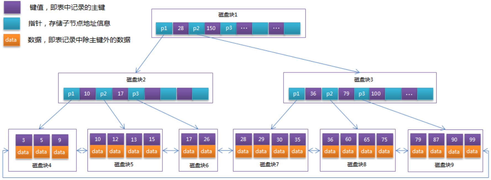

## 一.Linux下MYSQL的安装与配置

## 二.索引

##### 1.什么是索引？为什么使用索引？

+ 索引（index）是帮助数据库高效获取数据的数据结构（有序）。以某种方式引用（指向）数据， 实现高级查找算法。

+ 使用索引的原因：
  + 提高数据检索的效率，降低数据库的IO成本。
  + 通过索引列对数据进行排序，降低数据排序的成本，降低CPU的消耗。
  + 可以加速表和表之间的连接，特别是在实现数据的参考完整性方面特别有意义

---

##### 2.什么时候需要建立数据库索引呢?

+ 在最频繁使用的、用以缩小查询范围的字段,需要排序的字段上建立索引。 
+ 不宜:
  + 1)对于查询中很少涉及的列或者重复值比较多的列 
  + 2)对于一些特殊的数据类型，不宜建立索引，比如文本字段(text)等。

---

##### 3.索引设计的原则

+ 对查询频次较高，且数据量比较大的表建立索引。
+ 索引字段的选择，最佳候选列应当从where子句的条件中提取，如果where子句中的组合比较多，那么应当挑选最常用、过滤效果最好的列的组合。
+ 使用唯一索引，区分度越高，使用索引的效率越高。

+ 索引越多，维护索引的代价自然也就高。对于插入、更新、删除等操作频繁的表，索引过多，会引入相当高的维护代价，降低操作的效率，增加相应操作的时间消耗。
+ 使用短索引，索引创建之后也是使用硬盘来存储的，因此提升索引访问的I/O效率，也可以提升总体的访问效率。
+ 利用最左前缀，N个列组合而成的组合索引，那么相当于是创建了N个索引，如果查询时where子句中使用了组成该索引的前几个字段，那么这条查询SQL可以利用组合索引来提升查询效率。

---

##### 4.MYSQL中有哪些索引？有什么特点？

1.  **Primary Key（聚集索引）** ：InnoDB存储引擎的表会存在主键（唯一非null），如果建表的时候没有指定主键，则会使用第一非空的唯一索引作为聚集索引，否则InnoDB会自动帮你创建一个不可见的、长度为6字节的row_id用来作为聚集索引。
2.  **单列索引** ：单列索引即一个索引只包含单个列
3.  **组合索引** ：组合索引指在表的多个字段组合上创建的索引，只有在查询条件中使用了这些字段的左边字段时，索引才会被使用。使用组合索引时**遵循最左前缀集合**
4.  **Unique（唯一索引）** ：索引列的值必须唯一，但允许有空值。若是组合索引，则列值的组合必须唯一。主键索引是一种特殊的唯一索引，不允许有空值
5.  **Key（普通索引）** ：是MySQL中的基本索引类型，允许在定义索引的列中插入重复值和空值
6.  **FULLTEXT（全文索引）** ：全文索引类型为FULLTEXT，在定义索引的列上支持值的全文查找，允许在这些索引列中插入重复值和空值。全文索引可以在CHAR、VARCHAR或者TEXT类型的列上创建
7.  **SPATIAL（空间索引）** ：空间索引是对空间数据类型的字段建立的索引，MySQL中的空间数据类型有4种，分别是GEOMETRY、POINT、LINESTRING和POLYGON。MySQL使用SPATIAL关键字进行扩展，使得能够用于创建正规索引类似的语法创建空间索引。创建空间索引的列必须声明为NOT NULL

---

##### 5. 覆盖索引是什么?

+ 如果一个索引包含了（或覆盖了）满足查询语句中字段与条件的数据就叫做覆盖索引。
+ 覆盖索引（covering index）使得一个查询语句的执行只用从索引中就能够取得，不必从数据表中读取。也可以称之为实现了索引覆盖。

> 在InnoDB存储引擎中，如果不是主键索引，叶子节点存储的是主键+列值。最终还是要“回表”，也就是要通过主键再查找一次,这样就会比较慢。覆盖索引就是把要查询出的列和索引是对应的，不做回表操作!

---

##### 6.什么是聚合索引 ?

+ 聚集索引表记录的排列顺序与索引的排列顺序一致

---

##### 7.什么是非聚合索引？

+ 

---

##### 8.聚合索引与非聚合索引的区别是什么？

---

##### 9.MySQL索引主要使用的两种数据结构是什么?

+ **哈希索引** ，对于哈希索引来说，底层的数据结构肯定是哈希表，因此 **在绝大多数需求为单条记录查询** 的时候，可以选择哈希索引，查询性能最快；其余大部分场景，建议选择BTree索引

+ **BTree索引** ，Mysql的BTree索引的是B+Tree，BTREE索引就是一种将索引值按一定的算法，存入一个树形的数据结构中(二叉树)，每次查询都是从树的入口root开始，依次遍历node，获取leaf。

但对于主要的两种存储引擎(MyISAM和InnoDB)的实现方式是不同的。

---

##### 10. 简单介绍B树的数据结构

BTree又叫多路平衡搜索树，一颗m叉的BTree特性如下：

- 树中每个节点最多包含m个孩子。
- 除根节点与叶子节点外，每个节点至少有[ceil(m/2)]个孩子。
- 若根节点不是叶子节点，则至少有两个孩子。
- 所有的叶子节点都在同一层。
- 每个非叶子节点由n个key与n+1个指针组成，其中[ceil(m/2)-1] <= n <= m-1

以5叉BTree为例，key的数量：公式推导[ceil(m/2)-1] <= n <= m-1。所以 2 <= n <=4 。当n>4时，中间节点分裂到父节点，两边节点分裂。

---

##### 11.介绍一下B+树的数据结构

B+Tree为BTree的变种，B+Tree与BTree的区别为：

1. n叉B+Tree最多含有n个key，而BTree最多含有n-1个key。

2. B+Tree的叶子节点保存所有的key信息，依key大小顺序排列。

3. 所有的非叶子节点都可以看作是key的索引部分。

由于B+Tree只有叶子节点保存key信息，查询任何key都要从root走到叶子。所以B+Tree的查询效率更加稳定。

---

##### 12.数据库中的B+树结构

MySql索引数据结构对经典的B+Tree进行了优化。在原B+Tree的基础上，增加一个指向相邻叶子节点的链表指针，就形成了带有顺序指针的B+Tree，提高区间访问的性能。

---

##### 13.B树的插入操作

以5叉BTree为例，key的数量：公式推导[ceil(m/2)-1] <= n <= m-1。所以 2 <= n <=4 。当n>4时，中间节点分裂到父节点，两边节点分裂。

插入 C N G A H E K Q M F W L T Z D P R X Y S 数据为例。

演变过程如下：

1. 插入前4个字母 C N G A

2. 插入H，n>4，中间元素G字母向上分裂到新的节点

   

3. 插入E，K，Q不需要分裂

   

4. 插入M，中间元素M字母向上分裂到父节点G

   

5. 插入F，W，L，T不需要分裂

   

6. 插入Z，中间元素T向上分裂到父节点中

   

7. 插入D，中间元素D向上分裂到父节点中。然后插入P，R，X，Y不需要分裂

   

8. 最后插入S，NPQR节点n>5，中间节点Q向上分裂，但分裂后父节点DGMT的n>5，中间节点M向上分裂

   

到此，该BTREE树就已经构建完成了， BTREE树 和 二叉树 相比， 查询数据的效率更高， 因为对于相同的数据量来说，BTREE的层级结构比二叉树小，因此搜索速度快。

---

##### 14.为什么MySQL索引要使用B+树，而不是B树或者红黑树?

+  **B+树只有叶节点存放数据，其余节点用来索引，B树是每个索引节点都会有Data域。**  所以从Mysql（Inoodb）的角度来看，B+树是用来充当索引的，一般来说索引非常大，为了减少内存的占用，索引也会被存储在磁盘上
+  Mysql通过磁盘IO次数来衡量查询效率。B树/B+树 的特点就是每层节点数目非常多，层数很少，目的就是为了就少磁盘IO次数，但是B-树的每个节点都有data域（指针），增大了节点大小，说白了增加了磁盘IO次数（磁盘IO一次读出的数据量大小是固定的，单个数据变大，每次读出的就少，IO次数增多，一次IO多耗时），而B+树除了叶子节点其它节点并不存储数据，节点小，磁盘IO次数就少。**这是优点之一。** 
+  **另一个优点是：**  B+树所有的Data域在叶子节点，一般来说都会进行一个优化，就是 **将所有的叶子节点用指针串起来** 。这样 **遍历** 叶子节点就能获得全部数据，这样就能进行区间访问啦。在数据库中基于范围的查询是非常频繁的，而B树不支持这样的遍历操作。

+  **B树是多路树，红黑树是二叉树！红黑树一个节点只能存出一个值，B树一个节点可以存储多个值，红黑树的深度会更大,定位时 红黑树的查找次数会大一些。** 

---

##### 15. 为什么MySQL索引适用用B+树而不用hash表和B树?

+ 利用Hash需要把数据全部**加载到内存中**，如果数据量大，是一件很**消耗内存**的事，而采用B+树，是 基于**按照节点分段加载，由此减少内存消耗**。 
+ 和业务场景有段，**对于唯一查找**(查找一个值)，Hash确实更快，**但数据库中经常查询多条数据**，这 时候由于B+数据的有序性，与叶子节点又有链表相连，他的查询效率会比Hash快的多。
+  b+树的 **非叶子节点不保存数据**，**只保存子树的临界值** (最大或者最小)，所以同样大小的节点，  **b+** 树相对于b树能够有更多的分支，使得这棵树更加矮胖， **查询时做的 IO 操作次数也更少**。

---

##### 16. 既然Hash比B+树更快，为什么MySQL用B+树来存储索引呢?

MySQL中存储索引用到的数据结构是B+树，B+树的查询时间跟树的高度有关，是log(n)，如果用hash存储，那么查询时间是O(1)。 采用Hash来存储确实要更快，但是采用B+树来存储索引的原因主要有以下两点:

一、**从内存角度上说**，数据库中的索引一般是在磁盘上，数据量大的情况可能无法一次性装入内存， B+树的设计可以允许数据分批加载。

二、**从业务场景上说**，如果只选择一个数据那确实是hash更快，但是数据库中经常会选中多条，这时候 由于B+树索引有序，并且又有链表相连，它的查询效率比hash就快很多了。

---

##### 17. 文件索引和数据库索引为什么使用B+树?(第9个问题的详细回答)

+ 文件与数据库都是需要较大的存储，不可能全部存储在内存中，需要存储到磁盘上。而设置索引是为了数据的快速定位与查找，那么索引的结构组织要尽量减少查找过程中磁盘I/O 的存取次数，因此B+树相比B树更为合适。
+ 数据库系统巧妙利用了局部性原理与磁盘预读原理，将节点的大小设为等于一个页，这样每个节点只需要一次I/O就可以完全载入
+ B+树还有一个最大的好处:方便扫库。 B树必须用中序遍历的方法按序扫库，而B+树直接从叶子结点挨个扫一遍就完了，非常方便，而B树不支持，这是数据库选用B+树的最主要原因。 

---

##### 18. **为什么说B+tree比B 树更适合实际应用中操作系统的文件索引和数据库索引?**

+ B+tree的磁盘读写代价更低，B+tree的查询效率更加稳定 
+ 主要原因：B+树只要遍历叶子节点就可以实现整棵树的遍历，而且在 数据库中基于范围的查询是非常频繁的，而B树只能中序遍历所有节点，效率太低。
+ **B+树的特点**
  + 所有关键字都出现在叶子结点的链表中(稠密索引)，且链表中的关键字恰好是有序的；不可能在非叶子结点命中；非叶子结点相当于是叶子结点的索引(稀疏索引)，叶子结点相当于是存储(关键字)数据的数据层

----

