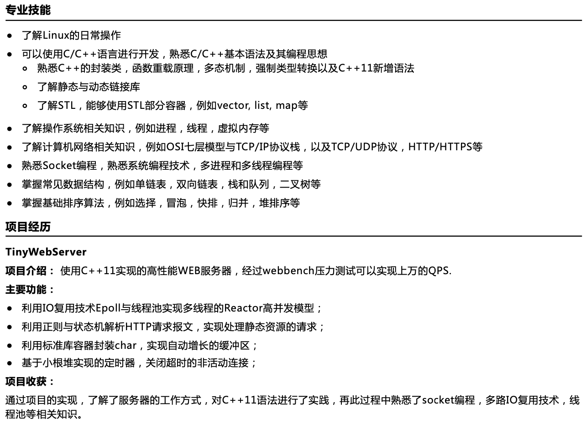

---

---

## 模拟面试

+ 简单介绍一下你的项目
+ 介绍一下IO复用技术，epoll与其他两个的区别
+ 如何利用正则表达式来解析HTTP请求的
+ 如何设计的自动增长缓冲区
+ 怎么设计的定时器，写一个最小根堆

+ EPOLL中利用了mmap，你知道mmap吗？
+ 你知道匿名映射吗？
+ 你知道零拷贝技术吗？知道哪些零拷贝系统调用
+ 进程，线程，携程的区别
+ 进程间有哪些通信方式
+ 进程和线程的上下文转换
+ 介绍一下虚拟内存，虚拟内存利用了哪些技术
+ 讲一讲socket编程中的系统调用，API函数越详细越好
+ TCP三次握手，四次挥手
+ TCP与UDP的却别
+ HTTP与HTTPS的区别
+ 静态库与动态库
+ 静态链接与动态链接
+ C++的多态是怎么实现的
+ 你知道哪些强制转换类型
+ 你知道哪些C++11的新增语法
