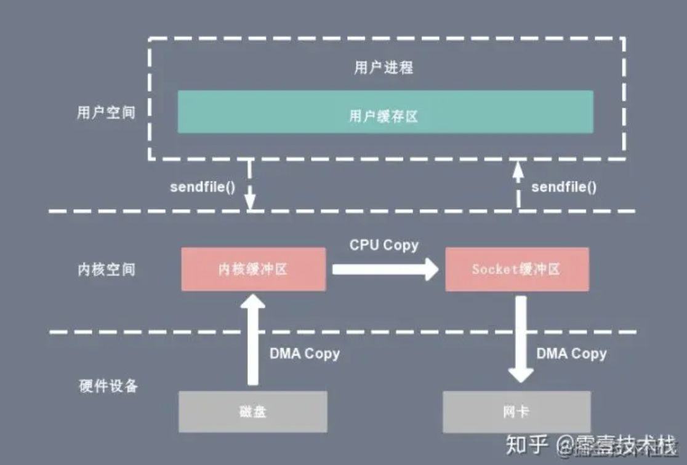
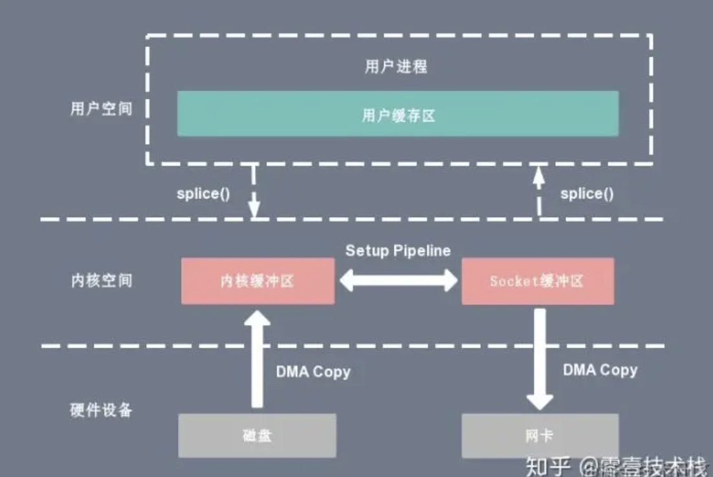
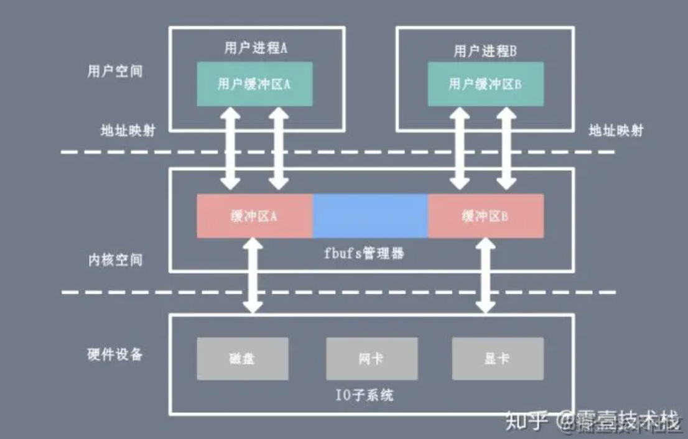

一.Linux命令

### 1.调试编译命令

##### 1.strace 的使用

strace 是一个通过跟踪系统调用来让开发者知道一个程序在后台所做事情的工具。

- `strace ./test`：跟踪./test后的系统调用
- 可以使用 strace 来跟踪信号传递：打开新终端输入命令：`killall test` ，会出现`++ killed by SIGTERM +++`
- 使用参数 -c，能将进程所有的系统调用做一个统计分析井返回 : `strace -c ./test`
- 使用 -o 与2> 的用法是一样的： `strace -c -o test.txt ./test`； `strace -c ./test 2>test.txt`将内容输入到文本中
- 参数 -T 将每个系统调用所花费的时间打印出来： `strace -T ./test`
- -t、 -tt、 -t忧参数则是记录每次系统调用发生的时间，分别精确到秒、微秒、和 UNIX 时间戳的微秒。
- `strace -p pid` ：追踪现有的进程

> 情景：读写文件出错了，可以使用

##### 2.top的使用

top命令是 Linux下常用的性能分析工具，能够动态实时显示系统中各个进程的资源占用状况

- 第 1 行显示：系统当前时间、系统运行时间、当前用户登录数和系统负载 。 
- 第 2行显示: total(进程总数)、running(正在运行的进程数)、sleeping(睡眠的进程数)、 stopped (停止的进程数)和 zombie (僵尸进程数) 
- 第 3 行显示: %us(用户空间占用 CPU 百分比)、%sy(内核空间占用 CPU 百分比)、 %id (空闲 CPU 百分比)等
- 第 4行显示内存 MEM 的数据: total (物理内存总量)、 used (使用的物理内存总量)，free (空闲内存总量)、 buffers (用作内核缓存的内存量) 
- 第 5 行显示交换器 SWAP 的数据: total(交换区总量)、used(使用的交换区总量)、free(空闲交换区总fil)、 cached (缓冲的交换区总量)。
- 第 6行则显示 PID (进程号)、USER (运行用户)、PR (优先级)、NI (任务 nice值)、VIRT (虚 拟内存用量)VIRT=SWAP+RES,RES(物理内存用量) 、SHR(共享内存用量)、 S(进程状态)、 %CPU (CPU 占用比)等

##### 3.top的命令cache和buffer区别

- buffer是块设备的读写缓冲区，比如磁盘
- cache是文件系统的缓存，常用于文件

##### 4.ps的使用

> - ps (process status)列出当前运行的进程的快照，就是执行 ps命令的那个时刻的那些进程
> - top动态地显示进程信息。
> - kill用来杀死进程

- ps 工具标识进程的 5 种状态码，如下所述 。
  - D 不可中断 : uninterruptible sleep (usually IO)。
  - R运行: runnable(onrunqueue)。
  - s 中断 :   sleeping。
  - T 停止 :  traced or stopped。
  - z 僵死 : a defunct (”zombie”) process。
- `ps -u sharexu`：显示指定用户信息
- `ps-ef`：显示所有进程信息，连同命令行
- `ps -ef|grep test`：查找特定进程 。
- `ps aux`：目前所有的正在内存当中的程序 。
- `ps -l`：将目前登人的 PID 与相关信息列示出来 。


> - 查看当前运行的进程： `ps aux|grep programName`
> - 查看当前运行的线程：`ps -aL|grep programName`
> - 查看主线程与子线程关系：`pstree -p 主线程id`

##### 5.Valgrind的介绍

> Valgrind 是 Linux 下的开放源代码的仿真调试工具的集合。Valgrind 由内核以及基于内核的其他调试工具组成 。

- Valgrind 提供的工具：
  - Memcheck：一个重量级的内存检查器，能够发现开发中绝大多数内存错误使用情况
  - Cachegrind：用来检查程序中缓存使用出现的问题。 
  - Helgrind：用来检查多线程程序中出现的竞争问题。 
    - 寻找内存中被多个线程访问，又没有一贯加锁的区域，这些区域往往是线程之间失去同步的地方，而且会导致 难以发掘的错误。 
  - Massif：堆栈分析器，能测量程序在堆栈中使用了多少内存，告诉我们堆块、堆管理块和栈的大小。 
  - Extension:可以利用 Core 提供的功能，自己编写特定的内存调试工具 。
- Valgrind 默认的工具就是 Memcheck，也可以通过 `--tool = tool name` 的形式指定其他工具

##### 6.Memcheck进行内存检查的原理

- Memcheck 能够检测出内存问题，关键在于其建立了两个全局表：
  - Valid-Value表 ：对于进程的整个地址空间中每字节的每 8 bit；以及CPU寄存器对应的bit向量。 这些bit负责记录该字节  或者 寄存器值 是否具有有效的 、已初始化的值 。
  - Valid-Address 表 ：记录进程地址空间中的每一个字节的地址是否能够被读写 。
- 检测原理 ：当要读写内存中某个字节时， 首先检查这个字节对应的 bit位。 如果该 bit 显示该位置是无效位置，Memcheck 则报告读写错误 。

##### 7.Valgrind Memcheck的使用

- 使用未初始化的内存(uninitialised value)
- 内存读写越界(Invalid Read/Write)
- 内存覆盖：strcpy, stmcpy、memcpy 需要设置源地址 re 和目标地址 dst，src 和 dst指向的地址不能重叠(overlap)
- 动态内存管理错误：静态存储、栈上分配、堆上分配。
  - 申请和释放不一致 malloc 申请，delete释放。(mismatched ,operator free 11)
  - 申请和释放不匹配 多进行一次delete （invalid free）
  - 释放后仍然读写 （Invalid write）
- 内存泄露：动态申请的内存，在使用完后既没有释放，又无法被程序其他部分访问
  - 可能的内存泄露( possibly lost)：仍然存在某个指针能够访问某块内存 ，但该指针指向的已经不是该内存首地址。
  - 确定的内存泄露( definitely lost)：已经不能够访问这块内存
    - 直接的( direct)：没有任何指针指向该内存
    - 间接的( indirect)：指向该内存的指针都位于内存泄露处

```
 #include <stdlib.h>
 void f(void){
          int*x = (int *)malloc(10 * sizeof(int));
          x[10]= 0;
 }
 int main(void){
          f();
          return 0;
 }
 //1. fun 函数中动态申请的堆内存没有释放; 
 //2. 对堆内存的访问越界
```

调试命令：

```
 gcc -g test.c -o test
 valgrind --tool=memcheck ./test
```

显示内容

```
 # 0.进程 id，下面是 Valgrind 的版本信息
 ==29936== Memcheck, a memory error detector
 ==29936== Copyright (C) 2002-2015, and GNU GPL'd, by Julian Seward et al.
 ==29936== Using Valgrind-3.11.0 and LibVEX; rerun with -h for copyright info
 ==29936== Command: ./a
 ==29936== 
 ==29936== Invalid write of size 4      #1.这是一个对内存的非法写操作，非法写操作的内存是 4Byte。
 ==29936==    at 0x40054E: f (test.c:3) #2.发生错误时的函数堆栈
 ==29936==    by 0x40055E: main (test.c:7)#3.非法写操作的具体地址空间 
 ==29936==  Address 0x5203068 is 0 bytes after a block of size 40 alloc'd
 ==29936==    at 0x4C29C3D: malloc (vg_replace_malloc.c:299)
 ==29936==    by 0x400541: f (test.c:4)
 ==29936==    by 0x40055E: main (test.c:10)
 ==29936== 
 ==29936== 
 ==29936== HEAP SUMMARY:
 ==29936==     in use at exit: 40 bytes in 1 blocks
 ==29936==   total heap usage: 1 allocs, 0 frees, 40 bytes allocated
 ==29936== 
 ==29936== 40 bytes in 1 blocks are definitely lost in loss record 1 of 1
 ==29936==    at 0x4C29C3D: malloc (vg_replace_malloc.c:299)
 ==29936==    by 0x400541: f (a.c:4)
 ==29936==    by 0x40055E: main (a.c:10)
 ==29936== 
             #发现的内存问题和内存泄漏问题的总结 
             # 程序结束时，程序泄漏了 40Byte 的内存
 ==29936== LEAK SUMMARY:
 ==29936==    definitely lost: 40 bytes in 1 blocks
 ==29936==    indirectly lost: 0 bytes in 0 blocks
 ==29936==      possibly lost: 0 bytes in 0 blocks
 ==29936==    still reachable: 0 bytes in 0 blocks
 ==29936==         suppressed: 0 bytes in 0 blocks
 ==29936== 
 ==29936== For counts of detected and suppressed errors, rerun with: -v
 ==29936== ERROR SUMMARY: 2 errors from 2 contexts (suppressed: 6 from 6
```

### 2.网络分析命令

##### 1.ping的使用

> - 利用 ping命令可以检查网络是否连通，可以很好地帮助分析和判定网络故障 。
> - 发送一个 ICMP (Internet Control Messages Protocol，因特网信报控制协议)，请求 消息给目的地并报告是否收到所希望的 ICMP echo ( ICMP 回声应答)，它是用来检查网络是 否通畅或者网络连接速度的命令 。

- 原理：利用网络上机器 IP地址的唯一性，给目标 IP地址发送一个数据包，再要求对方返问 一个同样大小的数据包来确定两台网络机器是否连接相通以及时延是多少。
- Linux下ping与Windows下的区别：
  - Linux 的 ping数据包 是 64Byte，Windows是 32Byte
  - Windows下默认发送 4次数据包后结束， Linux下默认不停发送数据包，直到用户手动停止(停止指令是 Ctrl+c)。

##### 2.tcpdump的使用

> 可以将传送的数据包“ 头”截获下来分析。支持针对协议、主机、网络或端口的过滤，并提供逻辑语句去掉无用信息

- tcpdump 采用命令行方式，它的命令格式为 :

  

```
 tcpdump -i eth0 -s 0 -w a.cap #抓取eth0网络接口中，无大小限制的包，写入文件a.cap中
 tcpdump -r a.cap #查看a.cap中的数据包信息
 tcpdump -A -r a.cap #以ASCII码形式查看数据包信息
 tcpdump -X -r a.cap #以16进制形式查看数据包信息
 tcpdump -i eth0 tcp port 22#抓取eth0网络接口中，TCP协议下，22端口的网络包
```

- tcpdump进行筛选

  ```
   tcpdump -n -r http.cap | awk '{print $3}' | sort -u 
   #以ip地址的形式，读取http.cap文件中的信息 | 读取第三列 | 进行排序，取出重复项
   tcpdump -n src host 145.254.160.237 -r http.cap
   #以ip地址的形式，读取http.cap文件中 源地址为 145.254.160.237的信息
   tcpdump -n tcp port 53 -r http.cap
   #以ip地址的形式，读取http.cap文件中 tcp 协议下 端口号为53 的信息
  ```

##### 3.netstat的使用

> 用于查看网络状态，能显示：协议；本地地址：端口号；外部地址：端口号；状态

- -a：显示所有连接与监听端口
- -n：以ip地址的形式显示地址和端口号
- -p：显示拥有的与每个连接相关联的进程ID

##### 4.lsof的使用

> lsof ( list open file) 是一个列出当前系统打开文件的工具。 Linux下一切以文件的形式存在，通过文件不仅仅可以访问常规数据，还可以访问网络连接和硬件。

- 常用命令参数列表：


```
 lsof | more # 每行显示一个打开的文件，若不指定条件默认将显示所有进程打开的所有文件 。
 lsof -a -u root -d txt #查看所属 root用户进程 所打开的文件，文件类型为 .txt
 lsof /dev/ttyl  #监控打开的文件和设备。查看设备/dev/ttyl 被哪些进程占用
 lsof -c server  #监控程序 。如查看指定程序 server 打开的文件
 lsof -u sharexu #监控用户 。 比如查看指定用户 sharexu 打开的文件
```

##### 5.nc命令的使用

> 通过TCP或UDP协议传输读写数据。还是一个网络应用Debug分析器，可以根据需要创建各种不同类型的网络连接。

- 常见命令参数使用，默认TCP

  - -u ：使用UDP传输协议。
  - -w<超时秒数>： 设置等待连线的时间。
  - -s<来源地址>： 设置本地主机送出数据包的IP地址。

- 远程拷贝文件

  ```
   #接收方
   nc -l 端口号 > 接收的文件
   # 发送方
   nc IP 地址 端口号 < 要发送的文件
  ```

- 聊天，发送数据

  - socket编写中测试可以使用`nc 127.0.0.1`

### 3.磁盘分析命令

##### 1.df命令

> 检查文件系统的磁盘空间占用情况。可以利用该命令来获取硬盘被占用了多少空间，目前还剩下多少空间等信息。

- 选项与参数：
  - -a ：列出所有的文件系统，包括系统特有的 /proc 等文件系统；
  - -k ：以 KBytes 的容量显示各文件系统；
  - -m ：以 MBytes 的容量显示各文件系统；
  - -h ：以人们较易阅读的 GBytes, MBytes, KBytes 等格式自行显示；
  - -H ：以 M=1000K 取代 M=1024K 的进位方式；
  - -T ：显示文件系统类型, 连同该 partition 的 filesystem 名称 (例如 ext3) 也列出；
  - -i ：不用硬盘容量，而以 inode 的数量来显示

##### 2.du命令

> Linux du 命令与 df查看分区 不同的是  **du 命令是对文件和目录磁盘使用的空间的查看** 主要看文件

- 选项与参数：
  - -a ：列出所有的文件与目录容量，因为默认仅统计目录底下的文件量而已。
  - -h ：以人们较易读的容量格式 (G/M) 显示；
  - -s ：列出总量而已，而不列出每个各别的目录占用容量；
  - -S ：不包括子目录下的总计，与 -s 有点差别。
  - -k ：以 KBytes 列出容量显示；
  - -m ：以 MBytes 列出容量显示；

> - df不光考虑文件占用空间，还统计被命令和程序占用的空间
> - du命令只计算文件或目录占用的空间
>
> df统计的会大于du统计的。

##### 3.fdisk命令

> fdisk 是 Linux 的磁盘分区表操作工具。

- `fdisk [-l]` 装置名称
  - 输出后面接的装置所有的分区内容。若仅有 fdisk -l 时，把整个系统内能够搜寻到的装置的分区均列出来


### 4.GDB

##### 1.你知道哪些gdb基本命令

|        命令        | 简写 | 命令说明                                                     |
| :----------------: | :--: | ------------------------------------------------------------ |
|        list        |  l   | 列出 函数代码及其行数 。(最好还是打开代码)                   |
|       break        |  b   | 设置断点，可以指定 **行数** 或者 **函数名称**                |
|        run         |  r   | 开始运行程序，到断点的位置会停下来                           |
|        next        |  n   | 执行当前语句，不会进入函数内部                               |
|        step        |  s   | 执行当前语句，可进入函数内部，但如果是库函数或第三方函数没有源代码，则进不去 |
|       print        |  p   | 显示变量值，也可以执行语句并输出                             |
|      continue      |  c   | 继续指向程序，直到遇到下一个断点                             |
| set var name = val |      | 设置变量的值，                                               |
|      set args      |      | 设置主程序的参数，如果参数有特殊字符，用 "" 进行包起来       |
|       finish       |  f   | 退出函数                                                     |
|        quit        |  q   | 退出调试                                                     |
|                    |  bt  | 查看调用栈                                                   |
|                    | info | 可以查看断点，进程(info inferiors)，线程(info threads)等     |

##### 2.怎么利用gdb调试段错误，怎么调试core文件

> [1]    23204 segmentation fault (core dumped)  ./stackcorn

- 首先利用 `ulimit -a` 来查看系统参数设置

  

  > - 最大文件描述符：65536
  > - 栈大小：8M

- 将 core file size 修改成不限制 ： `ulimit -c unlimited`

- 这就继续运行程序就能生成 core 文件，然后利用gdb调试 core ： `gdb programName coreName`

- 会直接跳到出问题的行数，然后利用 `bt` 来查看调用栈

  

##### 3.如何调试一个正在运行的程序

> 可以将运行时在后面 + & 挂在后台运行

- 首先得知道程序名称
- 利用 `ps --ef|grep processName` 查找到进程ID
- 利用 `gdb -p ID` 进行调试，此时程序会停下来，根据调试情况再运行

##### 4.如何调试多进程程序

> 在创建进程代码之前输入命令

- 调试父进程 ： `set follow-fork-node parent` 默认模式
- 调试子进程 ：`set follow-fork-node child`
- 设置调试模式：
  - `set detach-on-fork on`  ： 默认模式，调试当前进程的时候其他进程继续执行
  - `set detach-on-fork off`：调试当前进程的时候其他进程被gdb挂起
- 查看调试的进程：`info inferiors`
- 切换当前调试的进程：inferior 进程编号

##### 5.如何调试多线程程序

> - 查看当前运行的进程： `ps aux|grep programName`
> - 查看当前运行的线程：`ps -aL|grep programName`
> - 查看主线程与子线程关系：`pstree -p 主线程id`

- 查看线程：`info threads`
- 切换线程：`thread 线程编号`
- 只运行当前线程：`set scheduler-locking on`
- 运行全部的线程：`set scheduler-locking off`
- 指定某个线程执行某几个gdb命令：`thread apply 线程编号1 线程编号2 gdb命令`
- 指定全部线程执行某个gdb命令：`thread apply all gdb命令`

##### 6.如何调试多文件程序

- 同一个文件夹中的文件，可以用 `break file1.cpp: linenum`

- 不同文件夹下用`directory` 命令修改路径：

  ```
   (gdb) directory ../test1/ #进入文件
   Source directories searched: /mnt/hgfs/share/C++/GDB/ManyFiles/../test1:$cdir:$cwd 
   (gdb) b test1.cpp:2 #设置断点
   Breakpoint 1 at 0x4008b2: file ../test1/test1.cpp, line 2.
   (gdb) r
   Starting program: /mnt/hgfs/share/C++/GDB/ManyFiles/test 
   
   Breakpoint 1, test1 () at ../test1/test1.cpp:5
   5    cout<<"test1"<<endl;
   (gdb) info b
   Num     Type           Disp Enb Address            What
   1       breakpoint     keep y   0x00000000004008b2 in test1() at ../test1/test1.cpp:2
   breakpoint already hit 1 time
  ```

##### 7.服务器运行日志

> 设置断点或者单步跟踪可能会严重干扰多进程或多线程之间的竞争状态，导致我们看到的是一个假象。
>
> 一旦对某一个线程设置了断点，该线程在断点处停住了，只剩下另一个进程在跑。这时候并发的场景就被破坏了，通过调试器看到的知识一个和谐的场景。

- 输出log日志，可以避免断点和单步所导致的副作用
- 在屏幕通过打印输出日志：
  - 屏幕显示的内容有限，而且没有时间显示
- 自己封装一个日志类，然后将程序运行的情况，比如输出时间，进程ID，重要的变量内容等，详细记录在日志中，这样通过查日志的方式知道程序的运行状态，判断程序的错误出现在哪里

### 5.Makefile

##### 1.为什么使用Makefile？

- makefile记录了整个项目工程的所有需要编译的文件列表，在编译时仅需要输入简单的make命令就能编译出结果。
- makefile文件反映了整个项目中各个模块的依赖关系，当改动了某些源文件后，仅需简单的输入make命令，make工具就会根据makefile文件里描述的依赖关系帮助我们分析哪些模块需要重新编译，并执行相应的操作。

##### 2.简单的Makefile语法

```
 target:prerequisites
 <tab> command1
 <tab> command2
 .....
 <tab> commandN
 
 complicated: main.o complicated.o
     gcc -o complicated main.o complicated.o
 
 main.o: main.c
     gcc -o main.o -c main.c
 
 complicated.o: complicated.c
     gcc -o complicated.o -c complicated.c
 
 终极目标：依赖A  依赖B 依赖C
     终极目标命令
 依赖A：子依赖A1 子依赖A2 
     依赖A命令
 
 依赖B：子依赖B1 子依赖B2 
     依赖B命令
 
 依赖C：子依赖C1 子依赖C2 
     依赖C命令
```

- target：规则的目标，可以简单理解为**这条规则存在的目的是什么**。通常是**程序中间或者最后需要生成的文件名**，也可以不对应具体的文件，而仅仅就是个概念上的规则目标。
- prerequisites：规则的依赖列表，可以简单的理解为**要达到本条规则的目标所需要的先决条件是什么**。可以是文件名，也可以是其他规则的目标；
- command：规则的命令，可以简单的理解为**当目标所需要的先决条件的满足了之后，需要执行什么动作来达成规则的目标**。规则的命令其实就是shell命令。一条规则中可以有多行命令，**特别注意：每行命令都必须以tab键开始！**

##### 3.Makefile多文件使用


## 二.C/C++ 重要问题

##### 1.C中内存对齐原则?

```
 struct number_2{
     char a;
     int b;
     double c;
 }st2;
```

> st2所占内存并非1+4+8=13个，而是16个>13个。

- **对齐原则： 变量按照定义顺序放到内存中时并不是紧密排列的。它都会认为内存是以它自己的大小来划分的，放置的位置一定会在自己宽度的整数倍上开始。**

##### 2.C中的内存补齐原则？

```
 struct number_4{
     char a;
     int b;
     char c;
 }st4;
```

> sizeof(st4)=12,而不是4+4+1=9。

- 补齐原则： 在经过对齐原则分析后，检查计算存储单元是否为所有元素中所占内存最大的元素的长度的整数倍
  - 是，则结束
  - 若不是，则补齐为它的整数倍。
- **作用：**
  - 移植原因：不是所有的硬件平台都能访问任意地址上的任意数据的；这样补齐对移植后操作更友好。
  - 性能原因：程序员看来，内存是由字节组成。而CPU在读取内存时是一块块进行读取的，块的大小可以是2，4，8，16字节。经过内存对齐/补齐后，CPU的内存访问速度大大提升。

##### 3.pragma pack的用法

- 结构或联合的数据成员，第一个数据成员放在offset为0的地方，以后每个数据成员的对齐按照`#pragma pack`指定的数值和这个数据成员自身长度中，比较小的那个进行。

##### .为什么需要extern C

- C++之父比雅尼·斯特劳斯特鲁普在设计C++之时，考虑到当时已经存在了大量的C代码，为了支持原来的C代码和已经写好C库，需要在C++中尽可能的支持C，而extern "C"就是其中的一个策略。

- 因为C++和C是两种完全不同的编译链接处理方式，如果直接在CC++里面调用C函数，会找不到函数体，报链接错误。

  > - C++使用倾轧技术，来改名函数名，区分参数不同的同名函数。`void func(int val)` —> `_func_int`
  > - C没有这个技术，编译后的函数命名为`_func`；这也是C语法无法实现函数重载的原因

- 所以C++为了兼容C，在符号管理上，C++使用extern "C"关键字来声明或者定义一个C的符号。告诉C++编译器在extern "C"的大括号里面的代码当作C语言代码处理，C++的名称修饰机制将不再起作用。

```
 extern "C" {
     int func (int);
     //或者引入头文件
     #include “myheader.h” // 其它C 头文件
 }
```

##### .如何用代码判断大小端存储

- 大端存储：字数据的高字节存储在低地址中
- 小端存储：字数据的低字节存储在低地址中

例如：32bit（4字节）的数字0x12345678

小端模式中的存储方式为：


大端模式中的存储方式为：


- 使用强制类型转换 ： 借助int型转换成char型，只会留下低地址的部分

```
 int a = 0x12345678;//四字节
 char c = (char)(a);//1字节
 if (c == 0x12)
   cout << "big endian" << endl;
 else if(c == 0x78)
   cout << "little endian" << endl;
```

##### .using namespace 的作用

- 命名空间就是一个由程序设计者命名的内存区域。程序设计者可以根据需要制定一些有名字的空间域，把一些全局实体分别放在各个命名空间中，从而与其他全局实体分隔开来
- 不然会出现重复定义，这就是名字冲突，即在同一个作用域中有两个或者多个同名的实体。

```
 //PeopleA.h
 namespace PeopleA
 struct Student{
     Student(string name):name(name){
         //.....
     }
 private:
     string name;
 };
 int fun(int a, int b){
     return a + b;
 }
 
 //PeopleB.h
 namespace PeopleB
 struct Student{
     Student(string name):name(name){
         //.....
     }
 private:
     string name;
 };
 int fun(int a, int b)
 {
     return a + b;
 }
 //=================================
 #include <iostream>
 #include "People A.h"
 #include "People B.h"
 int main(){
     PeopleA::Student stdu1(101, 18, "wang");
     cout << PeopleA::fun(5, 3) << endl;
     PeopleB::Student stdu1(101, 18, "wang");
     cout << PeopleB::fun(5, 3) << endl;
     return 0;
 }
```

##### .使用命名空间的方法

- 最基本的是用 **命名空间名** 和 **作用域分辨符** 对命名空间成员进行限定，区别不同命名空间中的同名标识符。

  `命名空间名::命名空间成员名`

- 使用命名空间别名：`namespace PeopleA`；`namespace PA = PeopleA`

- 使用using命名空间成员名：`using AA::i；`  (命名空间成员名必须是由命名空间限定的名字)

- 使用using namespace命名空间名 `using namespace AA;` (声明了在本作用域中要用到命名空间AA中的成员，在使用该AA的任何成员时不必再使用命名空间限定)

##### .无名的命名空间

- 只在本文件的作用域有效，其他文件中显然无法引用。

---

##### .32位于64位字节大小

- 32位
  - char*（即指针变量）: 4个字节(32位的寻址空间是2^32, 即32个bit)
  - short 两字节
  - short int : 2个字节
  - float: 4个字节
  - double: 8个字节
  - long long: 8个字节
  - long: 4个字节；unsigned long: 4个字节
- 64位
  - char*(即指针变量): 8个字节
  - short 两字节
  - short int : 2个字节
  - float: 4个字节
  - double: 8个字节
  - long long: 8个字节
  - long: 8个字节；unsigned long: 8个字节

---

## 操作系统重要知识

###虚拟内存

##### 1.什么是虚拟内存

+ OS将物理内存抽象成虚拟地址空间。使得每个进程从逻辑上都有自己独立的地址空间。
+ 利用内存覆盖技术，实现不用将程序所需要的所有代码与数据装入内存就能运行程序。
+ 虚拟内存通常是被分隔成多个物理内存碎片，还有部分暂时存储在外部磁盘存储器上，在需要时进行数据交换，加载到物理内存中来。从而使得程序从逻辑上看起来能获得了更大的内存。

---

##### 2.在用户进程和物理内存之间引入虚拟内存的优点

+ 地址空间：提供更大的地址空间，并且地址空间是连续的，使得程序编写、链接更加简单
+ 进程隔离：不同进程的虚拟地址之间没有关系，所以一个进程的操作不会对其它进程造成影响
+ 数据保护：每块虚拟内存都有相应的读写属性，这样就能保护程序的代码段不被修改，增加了系统的安全性
+ 内存映射：有了虚拟内存之后，可以直接映射磁盘上的文件（可执行文件或动态库）到虚拟地址空间。这样可以做到物理内存延时分配，只有在需要读相应的文件的时候，才将它真正的从磁盘上加载到内存中来，而在内存吃紧的时候又可以将这部分内存清空掉，提高物理内存利用效率，并且所有这些对应用程序是都透明的
+ 共享内存：比如动态库只需要在内存中存储一份，然后将它映射到不同进程的虚拟地址空间中，让进程觉得自己独占了这个文件。进程间的内存共享也可以通过映射同一块物理内存到进程的不同虚拟地址空间来实现共享
+ 物理内存管理：物理地址空间全部由操作系统管理，进程无法直接分配和回收，从而系统可以更好的利用内存，平衡进程间对内存的需求

---

##### 3.谈谈你理解的逻辑地址，线性地址，物理地址和虚拟地址

+ 物理地址：实际存在的硬件里面的空间地址
+ 虚拟地址：对物理内存的抽像描述。通过 CPU中的内存管理单元(MMU)的映射关系转换变成物理地址
+ 逻辑地址：也是虚拟地址。Intel为了兼容，将远古时代的段式内存管理方式保留下来。逻辑地址是硬件平台段式管理转换前的地址
+ 线性地址：也叫虚拟地址(virtual address)。跟逻辑地址类似，线性地址是硬件平台页式管理的转换前的地址。

---

##### 4.既然已经有分页了，为什么还要分段？

+ 之前看过的博文介绍，好像是因为Intel的历史遗留原因

+ 一开始限于技术和成本所以寄存器的位数不够，因此为了扩大寻址范围搞了个分段访问内存。而随后技术起来了，位数都扩充了，寄存器其实已经可以访问全部内存空间了，所以分段已经没用了。

+ 但是为了向前兼容还是保留着分段访问的形式，随后为了更好的管理内存（段的碎片问题），提高内存的利用率和内存交互性能引入了分页管理。所以就变成了先分段，然后再分页的段页式。

+ 当然也可以和 Linux 那样让每一段的基地址都设为 0 ，这样就等于“绕开”了段机制。

> Intel 推出的处理器限于当时的技术背景和经济，寄存器只有 16 位，而地址总线是 20 位。因为无法使用16位的寄存器访问20位的地址总线。
>
> 于是引入段的概念，让 CPU 通过「段基地址+段内偏移」来访问内存。即段基地址左移 4 位（就是乘16）再加上段内偏移，这样得到的就是 20 位的地址。
>
> 至于为什么称之为段，其实就是因为寄存器只有 16 位一段只能访问 64 KB，所以需要移动基地址，一段一段的去访问所有的内存空间。还有专门为分段而生的寄存器为段寄存器，当时里面直接存放段基地址。

----

##### 5.什么是MMU(Memory Management Unit)内存管理单元机制？

1. `MMU`：完成的工作就是虚拟地址到物理地址的转换，可以让系统中的多个程序跑在自己独立的虚拟地址空间中，相互不会影响。程序可以对底层的物理内存一无所知，物理地址可以是不连续的，但是不妨碍映射连续的虚拟地址空间。
2. `TLB`：`MMU`工作的过程就是查询页表的过程，页表放置在内存中时查询开销太大，因此专门有一小片访问更快的区域用于存放`地址转换条目`，用于提高查找效率。当页表内容有变化的时候，需要清除`TLB`，以防止地址映射出错。
3. `Cache`：处理器和存储器之间的缓存机制，用于提高访问速率，在ARMv8上会存在多级Cache，其中
   + `L1 Cache`分为`指令Cache`和`数据Cache`，在`CPU Core`的内部，支持虚拟地址寻址；
   + `L2 Cache`容量更大，同时存储指令和数据，为多个`CPU Core`共用，这多个`CPU Core`也就组成了一个`Cluster`。

##### 6.进程如何查询页表

+ 每个进程维护了一个单独的页表，虚拟内存和物理内存就是通过这个页表实现地址空间的映射的。

+ 当进程执行一个程序时，需要先从先内存中读取该进程的指令，然后执行，获取指令时用到的就是虚拟地址。这个虚拟地址是程序链接时确定的（内核加载并初始化进程时会调整动态库的地址范围）。为了获取到实际的数据，CPU 需要将虚拟地址转换成物理地址，CPU 转换地址时需要用到进程的页表（Page Table），而页表（Page Table）里面的数据由操作系统维护。

+ 转换过程就是上面的过程

---

##### 7.用户进程申请并访问物理内存（或磁盘存储空间）的过程

1. 用户进程向操作系统发出内存申请请求
2. 系统会检查进程的虚拟地址空间是否被用完，如果有剩余，给进程分配虚拟地址
3. 系统为这块虚拟地址创建的内存映射（Memory Mapping），并将它放进该进程的页表（Page Table）
4. 系统返回虚拟地址给用户进程，用户进程开始访问该虚拟地址
5. CPU 根据虚拟地址在此进程的页表中找到了相应的内存映射（Memory Mapping），但是这个内存映射没有和物理内存关联，于是产生缺页中断
6. 操作系统收到缺页中断后，分配真正的物理内存并将它关联到页表相应的内存映射。完成后 CPU 就可以访问内存了
7. 当然缺页中断不是每次都会发生，只有系统觉得有必要延迟分配内存的时候才用的着，也即很多时候在上面的第 3 步系统会分配真正的物理内存并和内存映射（Memory Mapping）进行关联。

---

##### 8.**程序从堆中动态分配内存时，虚拟内存上怎么操作的**

+ 在进行动态内存分配时，例如malloc()函数，操作系统会 **在硬盘中申请一段虚拟内存空间** ，分配一个页表条目(PTE)，指向硬盘上新创建的虚拟页

  > 页表:是一个存放在物理内存中的数据结构，它记录了虚拟页与物理页的映射关系

---

##### 9.什么是缺页异常(缺页中断)？

当 CPU 访问的⻚面不在物理内存时，会产生缺⻚中断，请求操作系统将所缺⻚调入到物理内存。

缺⻚中断的处理流程：

1. 在 CPU 取指执行时，去找指令所对应的⻚表项。
2. 如果该⻚表项的状态位是「有效的」， CPU 直接访问物理内存，如果状态位是「无效的」， CPU 发送缺⻚中断请求
3. 操作系统收到了缺⻚中断后执行缺⻚异常处理函数，查找该⻚面在磁盘中位置。
4. 找到磁盘中对应的⻚面后，在物理内存中找空闲⻚，换入到物理内存中，将⻚表项中的状态位修改为「有效的」
5. 最后，CPU 重新执行导致缺⻚异常的指令。

>  第4步，找不到空闲⻚则说明此时内存已满了，这时需要「⻚面置换算法」选择一个有被修改过物理页(脏⻚)，把它换出到磁盘，然后把该被置换出去的⻚表项的状态改成「无效的」，最后把正在访问的⻚面装入到这个物理⻚中

与一般中断的区别在:

+   缺⻚中断在指令执行「期间」产生和处理中断信号，而一般中断在一条指令执行「完成」后检查和处理中断信号。
+   缺⻚中断返回到该指令的开始重新执行「该指令」，而一般中断返回回到该指令的「下一个指令」执行。

---

##### 10.页面置换算法你知道多少？

功能：当出现缺⻚异常需调入新⻚面而内存已满时，选择物理⻚面换出到磁盘，然后把需要访问的⻚面换入到物理内存

算法目标：尽可能减少⻚面的换入换出的次数，常⻅的⻚面置换算法有：

1. **最佳⻚面置换算法(*OPT*)** ：淘汰以后最长时间内访问次数最少的页面

   + 可以保证最低的缺页率，但操作系统无法提前预判页面访问序列。因此，最佳置换算法是无法实现的

2. **先进先出置换算法(*FIFO*)** ：选择淘汰的页面是最早进入内存的页面

   + 把调入内存的页面根据调入的先后顺序排成一个队列，需要换出页面时选择队头页面，队列的最大长度取决于系统为进程分配了多少个内存块。

   + 经常被访问的页在FIFO算法下被反复调入和调出，会出现Belady现象。（局部性原理）

     > Belady异常：当为进程分配的物理块数增大时，缺页次数不减反增的异常现象。

3. **最近最少未使用的置换算法(*LRU：least recently used*)** ：淘汰的页面是最近最久未使用的页面

   + 实现方法：用访问字段记录该页面自上次被访问以来所经历的时间 t 。当需要淘汰一个页面时， 选择现有页面中 t 值最大的，即最近最久未使用的页面。
   + 该算法的实现需要寄存器和栈的硬件支持，虽然算法性能好，但是实现困难，开销大

4. **时钟⻚面置换算法(*CLock*)** ：时钟置换算法是一种性能和开销较均衡的算法，又称CLOCK算法

   + 为每个页面设置一个访问位，把所有的⻚面都保存在「环形链表」中，表针指向最老的⻚面。
   + 当某页被访问时，访问位置为1。需要淘汰一个页面时，只需检查页的访问位：
     + 如果是0，就选择该页换出
     + 如果是1，则将它置为0，暂不换出
   + 实现简单，算法开销小；但未考虑页面是否被修改过。

5. **改进型的时钟置换算法**

   + 如果被淘汰的页面没有被修改过，不需要执行I/O操作写回外存。被淘汰的页面被修改过时，才需要写回外存。

   + 除了考虑一个页面最近有没有被访问过之外，操作系统还应考虑页面有没有被修改过。在其他条件都相同时，应优先淘汰没有修改过的页面，避免I/O操作。
   + 该算法选择一个淘汰页面最多会进行四轮扫描：若用 (访问位，修改位) 的形式表述：
     + 第一轮:淘汰(0,0) 
     + 第二淘汰(0,1)，并将扫描过的页面访问位都置为0 
     + 第三轮:淘汰 (0, 0) 
     + 第四轮:淘汰(0, 1)

---

### 系统中断知识

##### 1. Linux中异常和中断的区别

+ 中断是由硬件设备产生，通过中断控制器发送给CPU，CPU判断收到的中断来自于哪个硬件设备后发送给内核处理
+ 异常是由 CPU 执行指令的内部事件引起，如地址越界、算术溢出等。它会发送给内核处理
+ 相同点：
  + 最后都是由CPU发送给内核，由内核去处理 
  + 处理程序的流程设计上是相似的
+ 不同点：
  + 产生源不相同，中断是由硬件设备产生的，异常是由CPU产生的
  + 中断不是时钟同步的，这意味着中断可能随时到来；异常由于是CPU产生的，所以它是时钟同步的 
  + 当处理中断时，处于中断上下文中；处理异常时，处于进程上下文中

---

##### 2.软中断与硬中断的区别

+ 硬中断
  + 硬中断是由外部事件引起的因此具有随机性和突发性；
  + 硬中断的中断号是由中断控制器提供的
  + 硬中断是可屏蔽的
  + 硬中断处理程序要确保它能快速地完成任务，这样程序执行时才不会等待较长时间，称为上半部。

+ 软中断
  + 软中断是执行中断指令产生的，无面外部施加中断请求信号，因此中断的发生不是随机的而是由程序安排好的。
  + 软中断的中断号由指令直接指出，无需使用中断控制器。
  + 软中断不可屏蔽。
  + 软中断处理硬中断未完成的工作，是一种推后执行的机制，属于下半部。

---

##### 3.中断处理机制的实现：

+ 设备产生中断，通过总线把电信号发送给中断控制器，处理器会立即停止它正在做的事，关闭中断系统，然后跳到内存中预定义的位置开始执行那里的代码。这个预定义的位置是由内核设置的，是中断处理程序的入口点。

---

##### 4.什么是中断控制器？

+ 个人理解是可以接收多个外部中断源的中断请求，并进行优先级判断，选中当前优先级最高的中断请求，并将此请求送到CPU。当CPU响应中断并进入中断服务程序的处理过程后，中断控制器仍负责对外部中断请求的管理。

---

##### 5.介绍一下系统调原理

+ 系统调用主要是通过中断门实现的，通过软中断int发出中断信号。 
+ 由于要支持的系统功能很多，不可能每个系统调用就占用一个中断向量。 所以规定了0x80为系统调用的中断向量号，在进行系统调用之前，向eax中写入系统调用的子功能号，再进行系统调用的时候，系统就会根据eax的值来决定调用哪个中断处理函数。

---

##### 6.什么是中断处理函数？

在响应一个特定中断的时候，内核会执行一个函数，该函数叫中断处理程序。产生中断的每个设备都有一个相应的中断处理程序。**一个设备的中断处理程序是它设备驱动程序的一部分。**

+ 中断处理程序与其他内核的真正区别在于：中断处理程序是被内核调用来响应中断的，而它们运行于我们称之为中断上下文的特殊上下文中。

##### 7.键盘敲入字符后，操作系统发生了哪些事情？


+ 那当用户输入了键盘字符，**键盘控制器** 就会产生扫描码数据，并将其缓冲在键盘控制器的寄存器中，紧接着键盘控制器通过 **总线** 给 CPU 发送 **中断请求** 。

+ CPU 收到中断请求后，操作系统会保存被中断进程的 **CPU** 上下文，然后调用键盘的 **中断处理程序** 

  >  键盘的 **中断处理程序** 是在 **键盘驱动程序** 初始化时注册的 。

+ 键盘 **中断处理函数** 的功能就是 **从键盘控制器的寄存器的缓冲区读取扫描码，再根据扫描码找到用户在键盘输入的字符，如果输入的字符是显示字符，那 就会把扫描码翻译成对应显示字符的 ASCII 码，比如用户在键盘输入的是字母 A，是显示字符，于是就会把扫描码翻译成 A 字符的 ASCII 码。**

+ 得到了显示字符的 ASCII 码后，就会把 ASCII 码放到 **「读缓冲区队列」** ，显示设备的驱动程序会定时从「读缓冲区队列」读取数据放到「写缓冲区队列」，最后把「写缓冲区队列」的数据写入显示设备控制器的寄存器中的数据缓冲区，最后将这些数据显示在屏幕上。

+ 显示出结果后，恢复被中断进程的上下文。

> + 键盘控制器是计算机内部的一种集成电路，用来接收来自键盘的输入 并将其传输到CPU ，然后再由CPU将其传递给操作系统进行解释，当键盘控制器接收到来自键盘或类似输入设备的信号时，它会产生一个被称为中断的信号，使CPU暂时停止执行，以便处理键盘控制器发送的信号。
> + 在响应一个特定中断的时候，内核会执行一个函数，该函数叫中断处理程序。产生中断的每个设备都有一个相应的中断处理程序。**一个设备的中断处理程序是它设备驱动程序的一部分。**
>   + 中断处理程序与其他内核的真正区别在于：中断处理程序是被内核调用来响应中断的，而它们运行于我们称之为中断上下文的特殊上下文中。

---

### 零拷贝知识

##### 1.什么是零拷贝？

+ 零拷贝技术指CPU 不需要先将数据从一个内存区域复制到另一个内存区域，从而减少上下文切换以及 CPU 的拷贝时间。这样在数据报从网络设备到用户程序空间传递的过程中，减少数据拷贝次数，减少系统调用，实现 CPU 的零参与，彻底消除 CPU 在这方面的负载。
+ 实现零拷贝用到的最主要技术是 DMA 数据传输技术和内存区域映射技术。
  - 零拷贝机制可以减少数据在内核缓冲区和用户进程缓冲区之间反复的 I/O 拷贝操作。
  - 零拷贝机制可以减少用户进程地址空间和内核地址空间之间因为上下文切换而带来的 CPU 开销。

---

##### 2.介绍一下DMA直接内存存取（Direct Memory Access）原理

+ DMA是一种允许外围设备（硬件子系统）直接访问系统主内存的机制。也就是说，基于 DMA 访问方式，系统主内存于硬盘或网卡之间的数据传输可以绕开 CPU 的全程调度。
+ 整个数据传输操作在一个 DMA 控制器的控制下进行的。CPU 除了在数据传输开始和结束时做中断处理外，在传输过程中 CPU 可以继续进行其他的工作。CPU 计算和 I/O 操作都处于并行操作，使整个计算机系统的效率大大提高。
+ 有了 DMA 磁盘控制器接管数据读写请求以后，CPU 从繁重的 I/O 操作中解脱，数据读取操作的流程如下：
  1. 用户进程向 CPU 发起 read 系统调用读取数据，由用户态切换为内核态，然后一直阻塞等待数据的返回。
  2. CPU 在接收到指令以后对 DMA 磁盘控制器发起调度指令。
  3. DMA 磁盘控制器对磁盘发起 I/O 请求，将磁盘数据先放入磁盘控制器缓冲区，CPU 全程不参与此过程。
  4. 数据读取完成后，DMA 磁盘控制器会接受到磁盘的通知，将数据从磁盘控制器缓冲区拷贝到内核缓冲区。
  5. DMA 磁盘控制器向 CPU 发出数据读完的信号，由 CPU 负责将数据从内核缓冲区拷贝到用户缓冲区。
  6. 用户进程由内核态切换回用户态，解除阻塞状态，然后等待 CPU 的下一个执行时间钟。

---

##### 3.一些要注意的基本操作：

+ 上下文切换：当用户程序向内核发起系统调用时，CPU 将用户进程从用户态切换到内核态；当系统调用返回时，CPU 将用户进程从内核态切换回用户态。
+ CPU拷贝：由 CPU 直接处理数据的传送，数据拷贝时会一直占用 CPU 的资源。
+ DMA拷贝：由 CPU 向DMA磁盘控制器下达指令，让 DMA 控制器来处理数据的传送，数据传送完毕再把信息反馈给 CPU，从而减轻了 CPU 资源的占有率。

---

##### 4.介绍一下传统IO读写操作的过程

+ 传统读操作：

  + 当应用程序执行 read 系统调用读取一块数据的时候，如果数据已经存在于用户进程的页内存中，就直接从内存中读取数据；如果数据不存在，则先将数据从磁盘加载数据到内核空间的读缓存中，再从读缓存拷贝到用户进程的页内存中。

    ```c
    read(file_fd, tmp_buf, len);
    ```

  + 基read 系统调用会触发 2 次上下文切换，1 次 DMA 拷贝和 1 次 CPU 拷贝，发起数据读取的流程如下：

    1. 用户进程通过 read() 函数向内核发起系统调用，上下文从 **用户态切换** 为 **内核态** 。
    2. CPU利用 **DMA控制器** 将数据从 **主存或硬盘拷贝** 到 **内核空间** 的 **读缓冲区** 。
    3. CPU将 **读缓冲区** 中的数据拷贝到 **用户空间** 的 **用户缓冲区** 。
    4. 上下文从 **内核态** 切换回 **用户态** ，read 调用执行返回。

+ 传统写操作：

  + 当应用程序准备好数据，执行 **write 系统调用** 发送网络数据时，先将数据从 **用户空间的页缓存** 拷贝到 **内核空间的网络缓冲区** 中，然后再将 **写缓存中的数据** 拷贝到网卡设备完成数据发送。

    ```c
    write(socket_fd, tmp_buf, len);
    ```

  + write() 系统调用会触发 2 次上下文切换，1 次 CPU 拷贝和 1 次 DMA 拷贝，用户程序发送网络数据的流程如下：

    1. 用户进程通过 write() 函数向 **内核** 发起系统调用，上下文从 **用户态** 切换为 **内核态** 。
    2. CPU 将 **用户缓冲区中的数据** 拷贝到 **内核空间的网络缓冲区** 。
    3. CPU 利用 **DMA 控制器** 将数据从 **网络缓冲区** 拷贝到 **网卡** 进行数据传输。
    4. 上下文从 **内核态** 切换回 **用户态** ，write 系统调用执行返回。

---

##### 5.Linux下提供的零拷贝方式

在 Linux 中零拷贝技术主要有 3 个实现思路：用户态直接 I/O、减少数据拷贝次数以及写时复制技术。

-  **用户态直接 I/O ：** 应用程序直接访问硬件存储，操作系统内核只是辅助数据传输。这种方式依旧存在用户空间和内核空间的上下文切换，硬件上的数据直接拷贝至了用户空间，不经过内核空间。因此， **直接 I/O 不存在内核空间缓冲区和用户空间缓冲区之间的数据拷贝。**
-  **减少数据拷贝次数：** 在数据传输过程中，避免数据在 **用户空间缓冲区** 和 **系统内核空间缓冲区之间** 的CPU拷贝，以及数据在系统内核空间内的CPU拷贝，这也是当前主流零拷贝技术的实现思路。
-  **写时复制技术：** 写时复制指的是当多个进程共享同一块数据时，如果其中一个进程需要对这份数据进行修改，那么将其拷贝到自己的进程地址空间中，数据读取操作则不需要进行拷贝操作。

---

##### 6.mmap+write操作


+ 使用 mmap 的目的是将 **内核中读缓冲区的地址** 与 **用户空间的缓冲区** 进行映射，从而实现 **内核缓冲区与应用程序内存** 的共享，省去了将数据从 **内核读缓冲区** 拷贝到 **用户缓冲区** 的过程
+ 然而 **内核读缓冲区** 仍需将数据写到 **内核写缓冲区**
+ 基于 mmap + write 系统调用的零拷贝方式，整个拷贝过程会发生 4 次上下文切换，1 次 CPU 拷贝和 2 次 DMA 拷贝，用户程序读写数据的流程如下：
  1. 用户进程通过 mmap() 函数向 **内核** 发起系统调用，上下文从 **用户态** 切换为 **内核态**
  2. 将用户进程的内核空间的 **读缓冲区** 与 **用户空间的缓存区** 进行内存地址映射。
  3. CPU利用 **DMA控制器** 将数据从 **主存或硬盘** 拷贝到 **内核空间的读缓冲区** 。
  4. 上下文从 **内核态** 切换回 **用户态** ，mmap 系统调用执行返回。
  5. 用户进程通过 write() 函数向 **内核** 发起系统调用，上下文从 **用户态** 切换为 **内核态** 。
  6. CPU将 **读缓冲区** 中的数据拷贝到的 **网络缓冲区** 。
  7. CPU利用 **DMA控制器** 将数据从 **网络缓冲区** 拷贝到 **网卡** 进行数据传输。
  8. 上下文从 **内核态** 切换回 **用户态** ，write 系统调用执行返回。

> + mmap 主要的用处是提高 I/O 性能，特别是针对大文件。对于小文件，内存映射文件反而会导致碎片空间的浪费，因为内存映射总是要对齐页边界，最小单位是 4 KB，一个 5 KB 的文件将会映射占用 8 KB 内存，也就会浪费 3 KB 内存。
> + mmap 的拷贝虽然减少了 1 次拷贝，提升了效率，但也存在一些隐藏的问题。当 mmap 一个文件时，如果这个文件被另一个进程所截获，那么 write 系统调用会因为访问非法地址被 SIGBUS 信号终止，SIGBUS 默认会杀死进程并产生一个 coredump，服务器可能因此被终止。

##### 7.sendfile



+ sendfile 系统调用的引入，不仅减少了 CPU 拷贝的次数，还减少了上下文切换的次数

  ```c
  sendfile(socket_fd, file_fd, len);
  ```

+ 通过 sendfile 系统调用，数据可以直接在内核空间内部进行 I/O 传输，从而省去了数据在用户空间和内核空间之间的来回拷贝。

  > 与 mmap 内存映射方式不同的是， sendfile 调用中 I/O 数据对用户空间是完全不可见的。也就是说，这是一次完全意义上的数据传输过程。

+ 基于 sendfile 系统调用的零拷贝方式，整个拷贝过程会发生 **2 次上下文切换， **1 次 CPU 拷贝和 2 次 DMA 拷贝，用户程序读写数据的流程如下：

  1. 用户进程通过 sendfile() 函数向 **内核** 发起系统调用，上下文从 **用户态** 切换为**内核态** 。
  2. CPU 利用 **DMA 控制器** 将数据从 **主存或硬盘拷贝** 到 **内核空间的读缓冲区** 。
  3. CPU 将 **读缓冲区** 中的数据拷贝到的 **网络缓冲区** 。
  4. CPU 利用 **DMA 控制器** 将数据从 **网络缓冲区** 拷贝到 **网卡** 进行数据传输。
  5. 上下文从 **内核态** 切换回 **用户态** ，sendfile 系统调用执行返回。

> 相比较于 mmap 内存映射的方式，sendfile 少了 2 次上下文切换，但是仍然有 1 次 CPU 拷贝操作。sendfile 存在的问题是用户程序不能对数据进行修改，而只是单纯地完成了一次数据传输过程。

---

##### 8.DMA gather copy技术


+ 这样 DMA 引擎直接利用 gather 操作将页缓存中数据打包发送到网络中即可，本质就是和虚拟内存映射的思路类似。
+ 整个过程不再有CPU的拷贝

---

##### 9.splice技术



+ splice 系统调用可以在内核空间的读缓冲区（read buffer）和网络缓冲区（socket buffer）之间建立管道（pipeline），从而避免了两者之间的 CPU 拷贝操作。
+ 基于 splice 系统调用的零拷贝方式，整个拷贝过程会发生 2 次上下文切换，0 次 CPU 拷贝以及 2 次 DMA 拷贝，用户程序读写数据的流程如下：
  1. 用户进程通过 splice() 函数向 **内核** 发起系统调用，上下文从 **用户态** 切换为 **内核态** 。
  2. CPU 利用 **DMA 控制器** 将数据从 **主存或硬盘** 拷贝到 **内核空间的读缓冲区** 。
  3. CPU 在内核空间的 **读缓冲区** 和 **网络缓冲区** 之间建立 **管道** 。
  4. CPU 利用 **DMA 控制器** 将数据从 **网络缓冲区** 拷贝到 **网卡** 进行数据传输。
  5. 上下文从 **内核态** 切换回 **用户态** ，splice 系统调用执行返回

> splice 拷贝方式也同样存在用户程序不能对数据进行修改的问题。除此之外，它使用了 Linux 的管道缓冲机制，可以用于任意两个文件描述符中传输数据，但是它的两个文件描述符参数中有一个必须是管道设备。

---

##### 10.缓冲区共享技术



+ 传统 I/O 接口都是基于数据拷贝进行的，要避免拷贝就得去掉原先的那套接口并重新改写，所以这种方法是比较全面的零拷贝技术，目前比较成熟的一个方案是在 Solaris 上实现的 fbuf
+ fbuf 的思想是每个进程都维护着一个缓冲区池，这个缓冲区池能被同时映射到 **用户空间** 和 **内核态** ，内核和用户共享这个缓冲区池，这样就避免了一系列的拷贝操作。
+ 难度在于管理共享缓冲区池需要应用程序、网络软件以及设备驱动程序之间的紧密合作，而且如何改写 API 目前还处于试验阶段并不成熟。
