## 一.Linux命令

### 1.调试编译命令

##### 1.strace 的使用

strace 是一个通过跟踪系统调用来让开发者知道一个程序在后台所做事情的工具。 **追踪系统调用与信号**

+ `strace ./test`：跟踪./test后的系统调用
+ 可以使用 strace 来跟踪信号传递：打开新终端输入命令：`killall test` ，会出现`++ killed by SIGTERM +++`
+ 使用参数 -c，能将进程所有的系统调用做一个统计分析井返回 : `strace -c ./test`
+ 使用 -o 与2> 的用法是一样的： `strace -c -o test.txt ./test`； `strace -c ./test 2>test.txt`将内容输入到文本中
+ 参数 -T 将每个系统调用所花费的时间打印出来： `strace -T ./test`
+ -t、 -tt、 -t忧参数则是记录每次系统调用发生的时间，分别精确到秒、微秒、和 UNIX 时间戳的微秒。
+ `strace -p pid` ：追踪现有的进程

> 情景：读写文件出错了，可以使用

---

##### 2.top的使用

top命令是 Linux下常用的性能分析工具，能够动态实时显示系统中各个进程的资源占用状况

+ 第 1 行显示：系统当前时间、系统运行时间、当前用户登录数和系统负载 。 
+ 第 2行显示: total(进程总数)、running(正在运行的进程数)、sleeping(睡眠的进程数)、 stopped (停止的进程数)和 zombie (僵尸进程数) 
+ 第 3 行显示: %us(用户空间占用 CPU 百分比)、%sy(内核空间占用 CPU 百分比)、 %id (空闲 CPU 百分比)等
+ 第 4行显示内存 MEM 的数据: total (物理内存总量)、 used (使用的物理内存总量)，free (空闲内存总量)、 buffers (用作内核缓存的内存量) 
+ 第 5 行显示交换器 SWAP 的数据: total(交换区总量)、used(使用的交换区总量)、free(空闲交换区总fil)、 cached (缓冲的交换区总量)。
+ 第 6行则显示 PID (进程号)、USER (运行用户)、PR (优先级)、NI (任务 nice值)、VIRT (虚 拟内存用量)VIRT=SWAP+RES,RES(物理内存用量) 、SHR(共享内存用量)、 S(进程状态)、 %CPU (CPU 占用比)等

---

##### 3.top的命令cache和buffer区别

+ buffer是块设备的读写缓冲区，比如磁盘
+ cache是文件系统的缓存，常用于文件

---

##### 4.ps的使用

> + ps (process status)列出当前运行的进程的快照，就是执行 ps命令的那个时刻的那些进程
> + top动态地显示进程信息。
> + kill用来杀死进程

+ ps 工具标识进程的 5 种状态码，如下所述 。
  + D 不可中断 : uninterruptible sleep (usually IO)。
  + R运行: runnable(onrunqueue)。
  + s 中断 :   sleeping。
  + T 停止 :  traced or stopped。
  + z 僵死 : a defunct (”zombie”) process。
+ `ps -u sharexu`：显示指定用户信息
+ `ps-ef`：显示所有进程信息，连同命令行
+ `ps -ef|grep test`：查找特定进程 。
+ `ps aux`：目前所有的正在内存当中的程序 。
+ `ps -l`：将目前登人的 PID 与相关信息列示出来 。

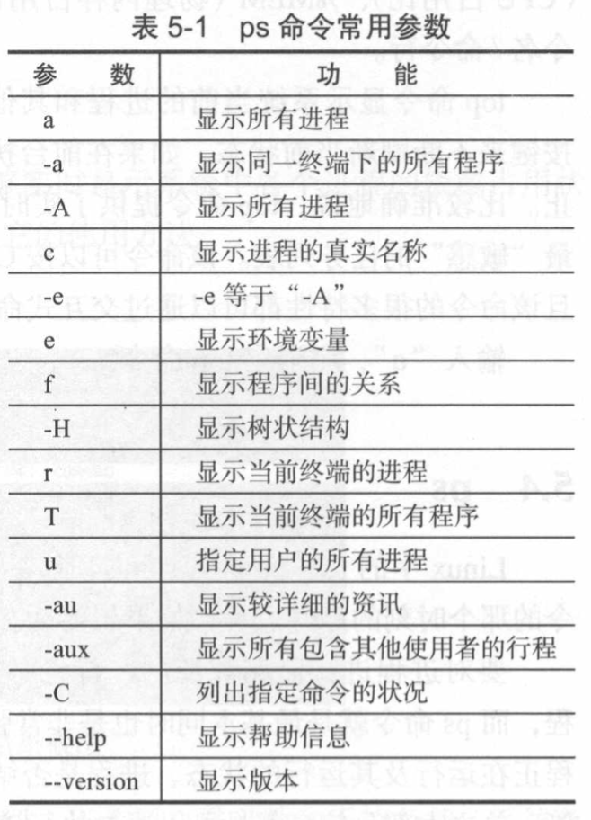

> + 查看当前运行的进程： `ps aux|grep programName`
> + 查看当前运行的线程：`ps -aL|grep programName `
> + 查看主线程与子线程关系：`pstree -p 主线程id`

---

##### 5.Valgrind的介绍

> Valgrind 是 Linux 下的开放源代码的仿真调试工具的集合。Valgrind 由内核以及基于内核的其他调试工具组成 。

+ Valgrind 提供的工具：
  + Memcheck：一个重量级的内存检查器，能够发现开发中绝大多数内存错误使用情况
  + Cachegrind：用来检查程序中缓存使用出现的问题。 
  + Helgrind：用来检查多线程程序中出现的竞争问题。 
    + 寻找内存中被多个线程访问，又没有一贯加锁的区域，这些区域往往是线程之间失去同步的地方，而且会导致 难以发掘的错误。 
  + Massif：堆栈分析器，能测量程序在堆栈中使用了多少内存，告诉我们堆块、堆管理块和栈的大小。 
  + Extension:可以利用 Core 提供的功能，自己编写特定的内存调试工具 。
+  Valgrind 默认的工具就是 Memcheck，也可以通过 `--tool = tool name` 的形式指定其他工具

---

##### 6.Memcheck进行内存检查的原理

+ Memcheck 能够检测出内存问题，关键在于其建立了两个全局表：
  + Valid-Value表 ：对于进程的整个地址空间中每字节的每 8 bit；以及CPU寄存器对应的bit向量。 这些bit负责记录该字节  或者 寄存器值 是否具有有效的 、已初始化的值 。
  + Valid-Address 表 ：记录进程地址空间中的每一个字节的地址是否能够被读写 。
+ 检测原理 ：当要读写内存中某个字节时， 首先检查这个字节对应的 bit位。 如果该 bit 显示该位置是无效位置，Memcheck 则报告读写错误 。

---

##### 7.Valgrind Memcheck的使用

+ 使用未初始化的内存(uninitialised value)
+ 内存读写越界(Invalid Read/Write)
+ 内存覆盖：strcpy, stmcpy、memcpy 需要设置源地址 re 和目标地址 dst，src 和 dst指向的地址不能重叠(overlap)
+ 动态内存管理错误：静态存储、栈上分配、堆上分配。
  + 申请和释放不一致 malloc 申请，delete释放。(mismatched ,operator free 11)
  + 申请和释放不匹配 多进行一次delete （invalid free）
  + 释放后仍然读写 （Invalid write）

+ 内存泄露：动态申请的内存，在使用完后既没有释放，又无法被程序其他部分访问
  + 可能的内存泄露( possibly lost)：仍然存在某个指针能够访问某块内存 ，但该指针指向的已经不是该内存首地址。
  + 确定的内存泄露( definitely lost)：已经不能够访问这块内存
    + 直接的( direct)：没有任何指针指向该内存
    + 间接的( indirect)：指向该内存的指针都位于内存泄露处

```c
#include <stdlib.h>
void f(void){
         int*x = (int *)malloc(10 * sizeof(int));
         x[10]= 0;
}
int main(void){
         f();
         return 0;
}
//1. fun 函数中动态申请的堆内存没有释放; 
//2. 对堆内存的访问越界
```

调试命令：

```bash
gcc -g test.c -o test
valgrind --tool=memcheck ./test
```

显示内容

```bash
# 0.进程 id，下面是 Valgrind 的版本信息
==29936== Memcheck, a memory error detector
==29936== Copyright (C) 2002-2015, and GNU GPL'd, by Julian Seward et al.
==29936== Using Valgrind-3.11.0 and LibVEX; rerun with -h for copyright info
==29936== Command: ./a
==29936== 
==29936== Invalid write of size 4      #1.这是一个对内存的非法写操作，非法写操作的内存是 4Byte。
==29936==    at 0x40054E: f (test.c:3) #2.发生错误时的函数堆栈
==29936==    by 0x40055E: main (test.c:7)#3.非法写操作的具体地址空间 
==29936==  Address 0x5203068 is 0 bytes after a block of size 40 alloc'd
==29936==    at 0x4C29C3D: malloc (vg_replace_malloc.c:299)
==29936==    by 0x400541: f (test.c:4)
==29936==    by 0x40055E: main (test.c:10)
==29936== 
==29936== 
==29936== HEAP SUMMARY:
==29936==     in use at exit: 40 bytes in 1 blocks
==29936==   total heap usage: 1 allocs, 0 frees, 40 bytes allocated
==29936== 
==29936== 40 bytes in 1 blocks are definitely lost in loss record 1 of 1
==29936==    at 0x4C29C3D: malloc (vg_replace_malloc.c:299)
==29936==    by 0x400541: f (a.c:4)
==29936==    by 0x40055E: main (a.c:10)
==29936== 
            #发现的内存问题和内存泄漏问题的总结 
						# 程序结束时，程序泄漏了 40Byte 的内存
==29936== LEAK SUMMARY:
==29936==    definitely lost: 40 bytes in 1 blocks
==29936==    indirectly lost: 0 bytes in 0 blocks
==29936==      possibly lost: 0 bytes in 0 blocks
==29936==    still reachable: 0 bytes in 0 blocks
==29936==         suppressed: 0 bytes in 0 blocks
==29936== 
==29936== For counts of detected and suppressed errors, rerun with: -v
==29936== ERROR SUMMARY: 2 errors from 2 contexts (suppressed: 6 from 6
```

---

### 2.网络分析命令

##### 1.ping的使用

> + 利用 ping命令可以检查网络是否连通，可以很好地帮助分析和判定网络故障 。
>
> + 发送一个 ICMP (Internet Control Messages Protocol，因特网信报控制协议)，请求 消息给目的地并报告是否收到所希望的 ICMP echo ( ICMP 回声应答)，它是用来检查网络是 否通畅或者网络连接速度的命令 。

+ 原理：利用网络上机器 IP地址的唯一性，给目标 IP地址发送一个数据包，再要求对方返问 一个同样大小的数据包来确定两台网络机器是否连接相通以及时延是多少。
+ Linux下ping与Windows下的区别：
  +  Linux 的 ping数据包 是 64Byte，Windows是 32Byte
  + Windows下默认发送 4次数据包后结束， Linux下默认不停发送数据包，直到用户手动停止(停止指令是 Ctrl+c)。

---

##### 2.tcpdump的使用

> 可以将传送的数据包“ 头”截获下来分析。支持针对协议、主机、网络或端口的过滤，并提供逻辑语句去掉无用信息

+ tcpdump 采用命令行方式，它的命令格式为 :

  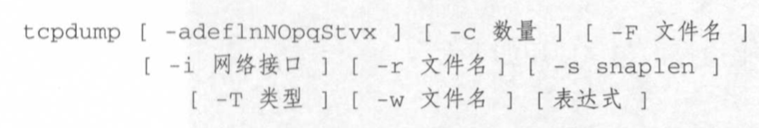

```bash
tcpdump -i eth0 -s 0 -w a.cap #抓取eth0网络接口中，无大小限制的包，写入文件a.cap中
tcpdump -r a.cap #查看a.cap中的数据包信息
tcpdump -A -r a.cap #以ASCII码形式查看数据包信息
tcpdump -X -r a.cap #以16进制形式查看数据包信息
tcpdump -i eth0 tcp port 22#抓取eth0网络接口中，TCP协议下，22端口的网络包
```

+ tcpdump进行筛选

  ```bash
  tcpdump -n -r http.cap | awk '{print $3}' | sort -u 
  #以ip地址的形式，读取http.cap文件中的信息 | 读取第三列 | 进行排序，取出重复项
  tcpdump -n src host 145.254.160.237 -r http.cap
  #以ip地址的形式，读取http.cap文件中 源地址为 145.254.160.237的信息
  tcpdump -n tcp port 53 -r http.cap
  #以ip地址的形式，读取http.cap文件中 tcp 协议下 端口号为53 的信息
  ```

---

##### 3.netstat的使用

> 用于查看网络状态，能显示：协议；本地地址：端口号；外部地址：端口号；状态

+ -a：显示所有连接与监听端口
+ -n：以ip地址的形式显示地址和端口号
+ -p：显示拥有的与每个连接相关联的进程ID

---

##### 4.lsof的使用

> lsof ( list open file) 是一个列出当前系统打开文件的工具。 Linux下一切以文件的形式存在，通过文件不仅仅可以访问常规数据，还可以访问网络连接和硬件。

+ 常用命令参数列表：

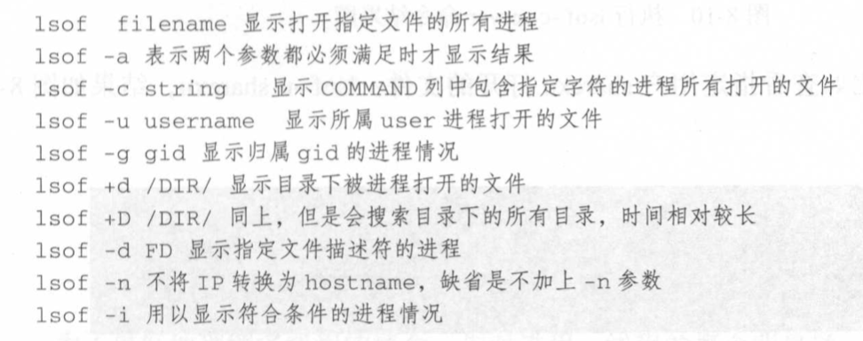

```bash
lsof | more # 每行显示一个打开的文件，若不指定条件默认将显示所有进程打开的所有文件 。
lsof -a -u root -d txt #查看所属 root用户进程 所打开的文件，文件类型为 .txt
lsof /dev/ttyl  #监控打开的文件和设备。查看设备/dev/ttyl 被哪些进程占用
lsof -c server  #监控程序 。如查看指定程序 server 打开的文件
lsof -u sharexu #监控用户 。 比如查看指定用户 sharexu 打开的文件
```

---

##### 5.nc命令的使用

> 通过TCP或UDP协议传输读写数据。还是一个网络应用Debug分析器，可以根据需要创建各种不同类型的网络连接。

+ 常见命令参数使用，默认TCP

  + -u ：使用UDP传输协议。
  + -w<超时秒数>： 设置等待连线的时间。
  + -s<来源地址>： 设置本地主机送出数据包的IP地址。

+ 远程拷贝文件

  ```bash
  #接收方
  nc -l 端口号 > 接收的文件
  # 发送方
  nc IP 地址 端口号 < 要发送的文件
  ```

+ 聊天，发送数据

  + socket编写中测试可以使用`nc 127.0.0.1`

---

### 3.磁盘分析命令

##### 1.df命令

> 检查文件系统的磁盘空间占用情况。可以利用该命令来获取硬盘被占用了多少空间，目前还剩下多少空间等信息。

+ 选项与参数：
  + -a ：列出所有的文件系统，包括系统特有的 /proc 等文件系统；
  + -k ：以 KBytes 的容量显示各文件系统；
  + -m ：以 MBytes 的容量显示各文件系统；
  + -h ：以人们较易阅读的 GBytes, MBytes, KBytes 等格式自行显示；
  + -H ：以 M=1000K 取代 M=1024K 的进位方式；
  + -T ：显示文件系统类型, 连同该 partition 的 filesystem 名称 (例如 ext3) 也列出；
  + -i ：不用硬盘容量，而以 inode 的数量来显示

---

##### 2.du命令

> Linux du 命令与 df查看分区 不同的是  **du 命令是对文件和目录磁盘使用的空间的查看** 主要看文件

+ 选项与参数：
  - -a ：列出所有的文件与目录容量，因为默认仅统计目录底下的文件量而已。
  - -h ：以人们较易读的容量格式 (G/M) 显示；
  - -s ：列出总量而已，而不列出每个各别的目录占用容量；
  - -S ：不包括子目录下的总计，与 -s 有点差别。
  - -k ：以 KBytes 列出容量显示；
  - -m ：以 MBytes 列出容量显示；

> - df不光考虑文件占用空间，还统计被命令和程序占用的空间
> - du命令只计算文件或目录占用的空间
>
> df统计的会大于du统计的。

---

##### 3.fdisk命令

> fdisk 是 Linux 的磁盘分区表操作工具。

+ `fdisk [-l]` 装置名称
  + 输出后面接的装置所有的分区内容。若仅有 fdisk -l 时，把整个系统内能够搜寻到的装置的分区均列出来


### 4.GDB

##### 1.你知道哪些gdb基本命令

|        命令        | 简写 | 命令说明                                                     |
| :----------------: | :--: | ------------------------------------------------------------ |
|        list        |  l   | 列出 函数代码及其行数 。(最好还是打开代码)                   |
|       break        |  b   | 设置断点，可以指定 **行数** 或者 **函数名称**                |
|        run         |  r   | 开始运行程序，到断点的位置会停下来                           |
|        next        |  n   | 执行当前语句，不会进入函数内部                               |
|        step        |  s   | 执行当前语句，可进入函数内部，但如果是库函数或第三方函数没有源代码，则进不去 |
|       print        |  p   | 显示变量值，也可以执行语句并输出                             |
|      continue      |  c   | 继续指向程序，直到遇到下一个断点                             |
| set var name = val |      | 设置变量的值，                                               |
|      set args      |      | 设置主程序的参数，如果参数有特殊字符，用 "" 进行包起来       |
|       finish       |  f   | 退出函数                                                     |
|        quit        |  q   | 退出调试                                                     |
|                    |  bt  | 查看调用栈                                                   |
|                    | info | 可以查看断点，进程(info inferiors)，线程(info threads)等     |

##### 2.怎么利用gdb调试段错误，怎么调试core文件

> [1]    23204 segmentation fault (core dumped)  ./stackcorn

+ 首先利用 `ulimit -a` 来查看系统参数设置

  

  > + 最大文件描述符：65536
  >
  > + 栈大小：8M

+ 将 core file size 修改成不限制 ： `ulimit -c unlimited`

+ 这就继续运行程序就能生成 core 文件，然后利用gdb调试 core ： `gdb programName coreName`

+ 会直接跳到出问题的行数，然后利用 `bt` 来查看调用栈

  

---

##### 3.如何调试一个正在运行的程序

> 可以将运行时在后面 + & 挂在后台运行

+ 首先得知道程序名称
+ 利用 `ps --ef|grep processName` 查找到进程ID
+ 利用 `gdb -p ID` 进行调试，此时程序会停下来，根据调试情况再运行

---

##### 4.如何调试多进程程序

>  在创建进程代码之前输入命令

+ 调试父进程 ： `set follow-fork-node parent` 默认模式
+ 调试子进程 ：`set follow-fork-node child`
+ 设置调试模式：
  + `set detach-on-fork on`  ： 默认模式，调试当前进程的时候其他进程继续执行
  + `set detach-on-fork off`：调试当前进程的时候其他进程被gdb挂起
+ 查看调试的进程：`info inferiors`
+ 切换当前调试的进程：inferior 进程编号

---

##### 5.如何调试多线程程序

> + 查看当前运行的进程： `ps aux|grep programName`
> + 查看当前运行的线程：`ps -aL|grep programName `
> + 查看主线程与子线程关系：`pstree -p 主线程id`

+ 查看线程：`info threads`
+ 切换线程：`thread 线程编号`
+ 只运行当前线程：`set scheduler-locking on`
+ 运行全部的线程：`set scheduler-locking off`
+ 指定某个线程执行某几个gdb命令：`thread apply 线程编号1 线程编号2 gdb命令`
+ 指定全部线程执行某个gdb命令：`thread apply all gdb命令`

---

##### 6.如何调试多文件程序

+ 同一个文件夹中的文件，可以用 `break file1.cpp: linenum`

+ 不同文件夹下用`directory` 命令修改路径：

  ```bash
  (gdb) directory ../test1/ #进入文件
  Source directories searched: /mnt/hgfs/share/C++/GDB/ManyFiles/../test1:$cdir:$cwd 
  (gdb) b test1.cpp:2	#设置断点
  Breakpoint 1 at 0x4008b2: file ../test1/test1.cpp, line 2.
  (gdb) r
  Starting program: /mnt/hgfs/share/C++/GDB/ManyFiles/test 
  
  Breakpoint 1, test1 () at ../test1/test1.cpp:5
  5    cout<<"test1"<<endl;
  (gdb) info b
  Num     Type           Disp Enb Address            What
  1       breakpoint     keep y   0x00000000004008b2 in test1() at ../test1/test1.cpp:2
  breakpoint already hit 1 time
  ```

---

##### 7.服务器运行日志

> 设置断点或者单步跟踪可能会严重干扰多进程或多线程之间的竞争状态，导致我们看到的是一个假象。
>
> 一旦对某一个线程设置了断点，该线程在断点处停住了，只剩下另一个进程在跑。这时候并发的场景就被破坏了，通过调试器看到的知识一个和谐的场景。

+ 输出log日志，可以避免断点和单步所导致的副作用
+ 在屏幕通过打印输出日志：
  + 屏幕显示的内容有限，而且没有时间显示
+ 自己封装一个日志类，然后将程序运行的情况，比如输出时间，进程ID，重要的变量内容等，详细记录在日志中，这样通过查日志的方式知道程序的运行状态，判断程序的错误出现在哪里

---

### 5.Makefile

##### 1.为什么使用Makefile？

+ makefile记录了整个项目工程的所有需要编译的文件列表，在编译时仅需要输入简单的make命令就能编译出结果。
+ makefile文件反映了整个项目中各个模块的依赖关系，当改动了某些源文件后，仅需简单的输入make命令，make工具就会根据makefile文件里描述的依赖关系帮助我们分析哪些模块需要重新编译，并执行相应的操作。

---

##### 2.简单的Makefile语法

```makefile
target:prerequisites
<tab> command1
<tab> command2
.....
<tab> commandN

complicated: main.o complicated.o
    gcc -o complicated main.o complicated.o

main.o: main.c
    gcc -o main.o -c main.c

complicated.o: complicated.c
    gcc -o complicated.o -c complicated.c

终极目标：依赖A  依赖B 依赖C
    终极目标命令
依赖A：子依赖A1 子依赖A2 
    依赖A命令

依赖B：子依赖B1 子依赖B2 
    依赖B命令

依赖C：子依赖C1 子依赖C2 
    依赖C命令
```

- target：规则的目标，可以简单理解为**这条规则存在的目的是什么**。通常是**程序中间或者最后需要生成的文件名**，也可以不对应具体的文件，而仅仅就是个概念上的规则目标。
- prerequisites：规则的依赖列表，可以简单的理解为**要达到本条规则的目标所需要的先决条件是什么**。可以是文件名，也可以是其他规则的目标；
- command：规则的命令，可以简单的理解为**当目标所需要的先决条件的满足了之后，需要执行什么动作来达成规则的目标**。规则的命令其实就是shell命令。一条规则中可以有多行命令，**特别注意：每行命令都必须以tab键开始！**

---

##### 3.Makefile多文件使用

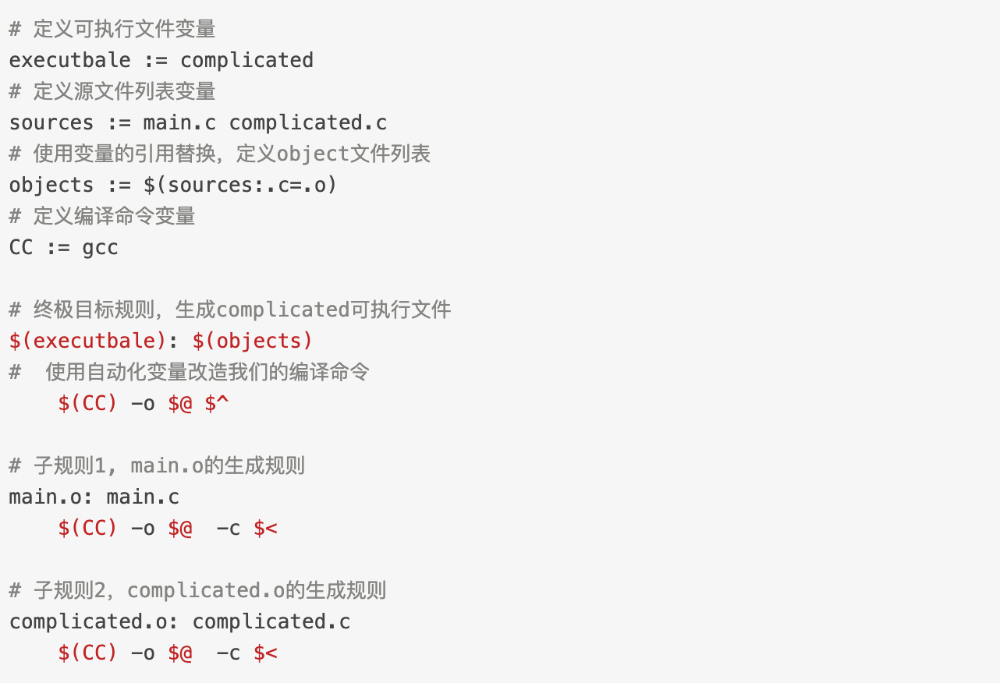

---

### 6.shell编程

#### shell基础

##### 1.有哪些shell？

+ sh：由Steven Bourne开发，各个UNIX系统都有
+ bash：由GNU开发的shell，主要目的是与POSIX标准保持一致。

---

##### 2.shell编程的格式

```bash
#! /bash/sh #指定解释器
```

---

##### 3.shell的执行方式

```bash
chmod a+x test.sh  #修改权限
./test.sh					 #执行
```

```bash
/bin/sh ./test.sh  #利用可执行程序进行执行
```

---

##### 4.shell的执行原理

+ Shell会fork一个子进程并调用exec执行./test.sh 这个程序，exec系统调用应该把子进程的代码段替换成./test.sh程序的代码段，并从它的\_start开始执行。

+ 然而test.sh是个文本文件，根本没有代码段和\_start函数，怎么办呢？其实exec还有另外一种机制，如果要执行的是一个文本文件，并且第一行指定了解释器，则用解释器程序的代码段替换当前进程，并且从解释器的_start开始执行，而这个文本文件被当作命令行参数传给解释器。因此，执行上述脚本相当于执行程序

---

##### 5.加()进行执行的原理

+ fork出一个子Shell执行小括号中的命令

---

#### 基本语法

---

### 7.sed操作

##### 1.sed的基本介绍

+ sed意为流编辑器（Stream Editor），在Shell脚本和Makefile中作为过滤器使用非常普遍，也就是把前一个程序的输出引入sed的输入，经过一系列编辑命令转换为另一种格式输出。sed和vi都源于早期UNIX的ed工具，所以很多sed命令和vi的末行命令是相同的。

---

##### 2.基本使用

```bash
-i #执行文本
-n #静默输出
-e #多条指令
```

+ 格式一：`sed 参数  '脚本语句' 执行文件`

+ 格式二：`sed 参数  -f '脚本文件' 执行文件`

+ 基本操作：

  + 追加a(append)：`sed -i '4a xxxxxx' test.sh`
  + 删除d(delete)： `sed -i '2,7d' test.sh`
  + 插入i(insert)：   `sed -i '4i yyyyyyy' test.sh ` 
  + 替换s(substitution)： `sed -i 's/BUF/buffer/g' test.sh` ： 表示将test.sh文件中的BUF替换成buffer

  ```bash
  /pattern/p #打印匹配pattern的行
  /pattern/d #删除匹配pattern的行
  /pattern/s/pattern1/pattern2/ #查找符合pattern的行，将该行第一个匹配pattern1的字符串替换为pattern2
  /pattern/s/pattern1/pattern2/g #查找符合pattern的行，将该行所有匹配pattern1的字符串替换为pattern2
  sed '/yyyyyy/p' test.sh -n #将 test.sh 文件中包含yyyyyy的行输出
  sed '/BUF/--&--/s' test.sh -i #将test.sh文件中BUF的两端加上--
  sed -e 's/yes/no/g' -e 's/BUF/buffer/g' test.sh -i #多条替换
  sed's/yes/no/g ; s/BUF/buffer/g' test.sh -i #多条替换
  ```

---

### 8.awk的使用

##### 1.awk的基本介绍

+ awk比sed强的地方在于不仅能以行为单位还能以列为单位处理文件。**awk缺省的行分隔符是换行，缺省的列分隔符是连续的空格和Tab**，但是行分隔符和列分隔符都可以自定义，比如/etc/passwd文件的每一行有若干个字段，字段之间以:分隔，就可以重新定义awk的列分隔符为:并以列为单位处理这个文件。

---

##### 2.基本使用

+ 格式一：`awk 参数  '脚本语句(/pattern/{actions})' 执行文件`
+ 格式二：`awk 参数  -f '脚本文件' 执行文件`

```bash
ps aux | awk '{print $2}' #输出 ps aux 结果的第二列
ps aux | awk '{print $(NF-1)}' #输出 ps aux 结果的倒数第二列
ps aux | awk '$2>2700 && $2 <= 2800 {count=count+1} END {print count}'
awk -F: "{print $7}" /etc/password #输出  /etc/password 以 : 为分割的第七列
```

```bash
awk '$2<75 {printf "%s\t%s\n", $0, "REORDER";} $2>=75 {print $0;}' testfile
testfile：
roductA 30 
ProductB 76
ProductC 55 
---------------
roductA 30 REORDER
ProductB 76
ProductC 55 REORDER
```

----

### 9.find操作

```bash
find ./ -name *.cpp
find ./ -type f/d/p/c/b/s
find ./ -size +3M -size -7M #默认为512B 一个扇区大小
```

---

## 二.C/C++ 重要问题

##### 1.C中内存对齐原则?

```c++
struct number_2{
    char a;
    int b;
    double c;
}st2;
```

> st2所占内存并非1+4+8=13个，而是16个>13个。

+  **对齐原则： 变量按照定义顺序放到内存中时并不是紧密排列的。它都会认为内存是以它自己的大小来划分的，放置的位置一定会在自己宽度的整数倍上开始。**

---

##### 2.C中的内存补齐原则？

```c++
struct number_4{
    char a;
    int b;
    char c;
}st4;
```

> sizeof(st4)=12,而不是4+4+1=9。

+ 补齐原则： 在经过对齐原则分析后，计算检查存储单元是否为所有元素中所占内存最大的元素的长度的整数倍
  + 是，则结束
  + 若不是，则补齐为它的整数倍。

+ **作用：**
  + 移植原因：不是所有的硬件平台都能访问任意地址上的任意数据的；这样补齐对移植后操作更友好。
  + 性能原因：程序员看来，内存是由字节组成。而CPU在读取内存时是一块块进行读取的，块的大小可以是2，4，8，16字节。经过内存对齐/补齐后，CPU的内存访问速度大大提升。

---

##### 3.pragma pack的用法

+ 结构或联合的数据成员，第一个数据成员放在offset为0的地方，以后每个数据成员的对齐按照`#pragma pack`指定的数值和这个数据成员自身长度中，比较小的那个进行。

---

##### 4.为什么需要extern C

+ C++之父比雅尼·斯特劳斯特鲁普在设计C++之时，考虑到当时已经存在了大量的C代码，为了支持原来的C代码和已经写好C库，需要在C++中尽可能的支持C，而extern "C"就是其中的一个策略。

+ 因为C++和C是两种完全不同的编译链接处理方式，如果直接在CC++里面调用C函数，会找不到函数体，报链接错误。

  > + C++使用倾轧技术，来改名函数名，区分参数不同的同名函数。`void func(int val)` —> `_func_int`
  > + C没有这个技术，编译后的函数命名为`_func`；这也是C语法无法实现函数重载的原因

+ 所以C++为了兼容C，在符号管理上，C++使用extern "C"关键字来声明或者定义一个C的符号。告诉C++编译器在extern "C"的大括号里面的代码当作C语言代码处理，C++的名称修饰机制将不再起作用。

```c
extern "C" {
    int func (int);
    //或者引入头文件
  	#include “myheader.h” // 其它C 头文件
}
```

---

##### 5.如何用代码判断大小端存储

+ 大端存储：字数据的高字节存储在低地址中

+ 小端存储：字数据的低字节存储在低地址中

例如：32bit（4字节）的数字0x12345678

小端模式中的存储方式为：

<div align="center">
    
</div>


大端模式中的存储方式为：

<div align="center">
    
</div>


+ 使用强制类型转换 ： 借助int型转换成char型，只会留下低地址的部分

```c++
int a = 0x12345678;//四字节
char c = (char)(a);//1字节
if (c == 0x12)
  cout << "big endian" << endl;
else if(c == 0x78)
  cout << "little endian" << endl;
```

---

##### 6.using namespace 的作用

+ 命名空间就是一个由程序设计者命名的内存区域。程序设计者可以根据需要制定一些有名字的空间域，把一些全局实体分别放在各个命名空间中，从而与其他全局实体分隔开来
+ 不然会出现重复定义，这就是名字冲突，即在同一个作用域中有两个或者多个同名的实体。

```c++
//PeopleA.h
namespace PeopleA
struct Student{
    Student(string name):name(name){
        //.....
    }
private:
    string name;
};
int fun(int a, int b){
    return a + b;
}

//PeopleB.h
namespace PeopleB
struct Student{
    Student(string name):name(name){
        //.....
    }
private:
    string name;
};
int fun(int a, int b)
{
    return a + b;
}
//=================================
#include <iostream>
#include "People A.h"
#include "People B.h"
int main(){
    PeopleA::Student stdu1(101, 18, "wang");
    cout << PeopleA::fun(5, 3) << endl;
    PeopleB::Student stdu1(101, 18, "wang");
    cout << PeopleB::fun(5, 3) << endl;
    return 0;
}
```

---

##### 7.使用命名空间的方法

+ 最基本的是用 **命名空间名** 和 **作用域分辨符** 对命名空间成员进行限定，区别不同命名空间中的同名标识符。

  `命名空间名::命名空间成员名`

+ 使用命名空间别名：`namespace PeopleA`；`namespace PA = PeopleA`

+ 使用using命名空间成员名：`using AA::i；`  (命名空间成员名必须是由命名空间限定的名字)

+ 使用using namespace命名空间名 `using namespace AA;` (声明了在本作用域中要用到命名空间AA中的成员，在使用该AA的任何成员时不必再使用命名空间限定)

##### 8.无名的命名空间

+ 只在本文件的作用域有效，其他文件中显然无法引用。

---

##### 9.main函数执行之前与之后打印

+ \_\_attribute\__((constructor)) 表示这段代码将在main函数前调用,就像在C++里面的全局变量类的构造一样.

+ \_\_attribute\__((destructor)) 表示这段代码将在main函数后调用,就像在C++里面的全局变量类的析构一样。

```c++
#include<iostream>  
using namespace std;  
__attribute__((constructor)) void before_main()  {  
    cout<<"Before Main"<<endl;  
}  
__attribute__((destructor)) void after_main()  {  
    cout<<"After Main"<<endl;  
}  
class AAA{  
public:  
    AAA(){  
        cout<<"AAA construct"<<endl;  
    }     
    ~AAA(){  
        cout<<"AAA destructor" <<endl;  
    }     
};  
AAA A;  
int main()  {  
    cout<<"in main"<<endl;  
    return 0;  
} 

//带优先级
static  __attribute__((constructor(103))) void before3()

static  __attribute__((constructor(101))) void before1()

static  __attribute__((constructor(102))) void before2()
```

+ 全局类的构造过程发生在before_main()函数前面,而析构也发生在after_main()前面.

---

#####10.\_\_attribute\__机制 

+ __\_\_attribute\____可以设置函数属性(Function Attribute)、变量属性(Variable Attribute)和类型属性(Type Attribute)

+ __\_\_attribute\____前后都有两个下划线，并且后面会紧跟一对原括弧，括弧里面是相应的\_\_attribute\__参数

  `__attribute__ ((attribute-list))`

---

##### 11.main函数执行之前的操作

```css
__start:
　　　　 :
　　　　 init stack;
　　　　 init heap;
　　　　 open stdin;
　　　　 open stdout;
　　　　 open stderr;
　　　　 :
　　　　 push argv;
　　　　 push argc;
　　　　 call _main;    (调用 main)
　　　　 :
　　　　 destory heap;
　　　　 close stdin;
　　　　 close stdout;
　　　　 close stderr;
　　　　 :
　　　　 call __exit;
```

+ 创建进程后，把控制权交给程序的入口函数，即为运行时库的某个入口函数。

  + glibc的入口函数是_start
  + msvc(vc 6.0)的是mainCRTStartup

+ 入口函数对运行库和运行环境进行初始化，包括堆、I/O、线程、全局变量构造

  + 初始化堆，栈（设置栈指针）

  + 全局变量、对象和静态变量、对象的空间分配和初始化。
    + 初始化静态static变量和global全局变量，即.data段的内容
    + 将未初始化部分的全局变量赋初值:数值型short，int，long等为0，bool为FALSE，指针为NULL等 等，即.bss段的内容

  + 初始化C/C++库

  + 参数压栈  argc,argv ,获取环境变量 
  + 打开标准输入，输出、错误流

+ 注册析构函数，使用atexit注册析构函数（注册时在链表头插入链接，main函数退出也从链表头开始获取链表函数，进行调用）

---

##### 12.main函数之后的操作

- 返回入口函数，进行清理工作
- 包括全局变量析构、堆销毁、关闭I/O
  - 销毁堆内存
  - 关闭标准输入、输出、关闭错误流
- 调用exit系统API退出进程

---

##### 13.atexit注册析构函数

```c++
void func1(){
    printf("The process is done...\n");
}
void func2(){
    printf("Clean up the processing\n");
}
void func3(){
    printf("Exit sucessful..\n");
}
int main() { 
　　//其作用是注册某一个函数，当进程执行结束时，会自动调用注册的函数
　　//注册几次，就执行几次
    atexit(func1); 
    atexit(func2); 
    atexit(func3); 
    exit(0); 
}
```

+ 最后的调用顺序与main函数中的定义顺序相反
+ 还是在全局变量类的析构函数之前调用

---

##### 14.面向对象编程和泛型编程的区别

+ 面向对象是将数据与操作这些数据的函数方法联系在一起。
+ 泛型编程将数据与函数方法分开，利用迭代器来进行操作。分开来可以让容器与算法进行单独的设计，利用迭代器来进行沟通实现。

---

##### 15.32位于64位字节大小

+ 32位
  + char*（即指针变量）: 4个字节(32位的寻址空间是2^32, 即32个bit)
  + short 两字节
  + short int : 2个字节
  + float: 4个字节
  + double: 8个字节
  + long long: 8个字节
  + long: 4个字节；unsigned long: 4个字节
+ 64位
  + ==char*(即指针变量): 8个字节==
  + short 两字节
  + short int : 2个字节
  + float: 4个字节
  + double: 8个字节
  + long long: 8个字节
  + ==long: 8个字节；unsigned long: 8个字节==

---

## 三 .C++

+ 在一台内存为2G的机器上，malloc(20G)会怎么样？new 20G呢？
+ 虚函数的作用及实现原理
+ 局部变量、全局变量、常量还有malloc开辟的内存变量分别放在哪个区
+ 全局变量的初始化位置
+ 游戏中，有些资源文件需要频繁使用，如何进行加速  
+ 游戏中，如果有一个AOE的BUFF（类似皇子的旗子E技能），如何实时快速计算这些技能的影响单位 

---

### C相关问题

##### 1. **C程序如何启动和终止的**

+ 启动：内核调用一个exec函数，并将命令行参数传递给启动例程，然后启动例程调用main函数。
+ 终止：显式或隐式地(通过调用exit)调用\_exit或 \_Exit函数。也可能是信号使其终止。

---

#####  main函数调用前的初始化过程

+ 设置栈指针
+ 初始化静态static变量和global全局变量；即.data段的内容
+ 将未初始化部分的全局变量赋初值，数值初始化为0，指针初始化为NULL；即.bss段的内容
+ 全局对象初始化，在main之前调用构造函数，这是可能会执行前的一些代码
+ 将main函数的参数argc，argv等传递给main函数，然后才真正运行main函数

---

##### 2. **atexit函数**

+ atexit函数类似于C++类中的析构函数，在main函数结束之后被exit调用，调用顺序与登记顺序相反。同一函数如若登记多次也会被调用多次。
+ `atexit`的参数是一个函数地址，无需传递参数,也不期望返回值。

---

##### 3. ==**C程序的存储地址空间布局**==

+ 从低地址往高地址分别为： 正文段—> 初始化数据段—> 未初始化数据段—> 堆——>栈。
+ 它们的主要作用：
  + 正文段：这部分是共享的，也是只读的，是CPU执行的机器指令部分。
  + 已初始化数据段：包含程序中需明确地赋初值的变量
  + 未初始化数据段：在程序执行之前，内核将该段中的数据初始化为0或空指针。
  + 堆：动态分配存储的区域
  + 栈：自动变量与函数调用所需要保存信息的区域

---

##### 4. ==**讲一下存储空间分配函数——malloc, realloc, calloc各自的用法**==

+ `void *malloc(size_t size);`  分配指定字节数的存储区
+ `void *calloc(size_t nobj, size_t size);` 分配指定 数目 的存储空间， 初始化为0
+ `void *realloc(void *ptr, size_t newsize);` 将指针指定的存储区大小进行修改

```c
int *a = (int*)calloc(n, sizeof(int));
int * a = (int*)malloc(sizeof(int) * n);
realloc(a, sizeof(int) * 2*n);
```

---

##### 5. **C++ 中的 string 与 C 中的 `char *` 有什么区别？**

+ string继承自 basic_string ，是对 `char` 进行了封装，包含 char 数组，容量，长度等属性
+ string可以动态扩展，每次扩展是原空间的两倍，将原内容拷贝进去。

---

##### 6.C++和Python的区别

包括但不限于:

+ Python是脚本语言，解释执行的，C++是编译语言，是需要编译后在特定平台运行的。
+  python可以很方便的跨平台，但是效率没有C++高。
+ Python使用缩进来区分不同的代码块，C++使用花括号来区分
+ C++中需要事先定义变量的类型，而Python不需要
+ Python的库函数比C++的多，调用起来很方便

---

##### 7.C和C++的区别

+ C++提出了面向对象的概念，使用class或struct定义类，而C是面向过程，struct是结构体
+ C++可以重载，覆盖实现多态，C语言不允许。
+ C++可以继承，C也不允许
+ 在C++中，除了值和指针之外，新增了引用。

- C++中new和delete是对内存分配的运算符，取代了C中的malloc和free。
- C++中用来做控制态输入输出的iostream类库替代了标准C中的stdio函数库

---

#####  8.C++与Java的区别

- Java语言完全面向对象，给开发人员提供了更为简洁的语法
- Java的可移植性更强，JVM可以安装到任何的操作系统上
- Java语言中没有指针的概念，引入了真正的数组，将指针从语言中去掉，防止指针操作不规范带来的安全问题
- C++的执行效率与编译速度更快

**垃圾回收**

- C++用析构函数回收垃圾，写C和C++程序时一定要注意内存的申请和释放
- Java语言不使用指针，内存的分配和回收都是自动进行的，程序员无须考虑内存碎片的问题

---

##### 9.extern"C"的用法

+ 告诉C++编译器，下面的代码按照C的方式进行编译。通常在C++程序中使用C函数或者模块时，需要用到这个功能。

---

##### 10.C和C++的类型安全

+ 可以等价于内存安全，类型安全的代码不会试图访问自己没被授权的内存区域。
+ 有时候也用“类型安全”形容某个程序，查看程序是否隐含类型错误。

- C语言中
  - malloc函数类型不匹配时，编译器并不会报错：`int* pInt=(int*)malloc(100*sizeof(char))`
- C++中
  - new对比与malloc就更安全了，因为返回的指针类型严格与对象匹配

---

##### ==11.如何用代码判断大小端存储==

+ 大端存储：字数据的高字节存储在低地址中

+ 小端存储：字数据的低字节存储在低地址中

例如：32bit的数字0x12345678

小端模式中的存储方式为：

<div align="center">
    
</div>


大端模式中的存储方式为：

<div align="center">
    
</div>

+ 使用强制类型转换 ： 借助int型转换成char型，只会留下低地址的部分

```c++
int a = 0x1234;
char c = (char)(a);
if (c == 0x12)
  cout << "big endian" << endl;
else if(c == 0x34)
  cout << "little endian" << endl;
```

---

##### 12.如何获得结构成员相对于结构开头的字节偏移量（offsetof(Obj,int)）

使用<stddef.h>头文件中的，offsetof宏。

```c++
#include <iostream>
#include <stddef.h>
using namespace std;
#pragma pack(4) //指定4字节对齐方式就可以了。
struct S {
    int x;
    char y;
    int z;
    double a;
};
int main(){
    cout << offsetof(S, x) << endl; // 0
    cout << offsetof(S, y) << endl; // 4
    cout << offsetof(S, z) << endl; // 8
    cout << offsetof(S, a) << endl; // 12
    return 0;
}
```

##### 13.struct和union 的区别

+ 在任何同一时刻, union中只存放了一个被选中的成员；而struct的所有成员都存在。

+ 在struct中，各成员都占有自己的内存空间，它们是同时存在的,一个struct变量的总长度等于所有成员长度之和，遵从字节对其原则; 
+ 在Union中，所有成员不能同时占用它的内存空间，它们不能同时存在 , Union变量的长度等于最长的成员的长度。

---

### C++基本介绍

##### ==1. 聊一聊C++面向对象的三大特性==

> C++ 的三大特性就是继承，封装和多态。

+ 封装：用变量和方法组合封装成类，可以对它们进行信息隐藏，只让可信的对象和类进行操作。

+ 继承：让某种类型对象获得另一个类型对象的属性和方法。有三种继承方式：
  + 实现继承：指使用基类的属性和方法而无需再隐藏或覆盖
  + 接口继承：指仅使用属性和方法的名称、但是子类必须提供实现的能力
  + 可视继承：(C++里好像不怎么用)
+ 多态：同一事物表现出不同事物的能力。实现多态的两种方式：
  + 运行时多态： 虚函数实现。是指子类override父类的虚函数。
  + 编译时多态：函数重载，是指允许存在多个同名函数，而函数的参数表不同

---

### 变量与基本类型

---

##### 1. **声明与定义的区别**

+ 声明仅仅将变量声明的位置与类型提供给编译器，并不分配内存。
+ 定义时会直接分配存储空间。相同变量可在多处声明，但只能一处定义。

---

##### 2. **什么情况下必须用到初始化成员列表**

+ 初始化const成员
+ 初始化reference成员
+ 调用基类的构造函数，这个基类构造函数有参数
+ 调用数据成员对象的构造函数，这个数据成员对象本身的构造函数有参数

---

##### 3. ==**常量指针与指针常量的区别**==

+ 常量指针指常量的指针，注重常量，不能修改指定的值 ：`int const *p` 或 `const int *p` ；是底层const修饰
+ 指针常量指不能修改指针的指向，指针是一个常量： `int *const p` 。；是顶层const修饰

---

##### 4.**介绍野指针与空悬指针，如何避免？**

+ 野指针：没有初始化的指针；指针在创建的同时应当被初始化，要么将指针设置为nullptr，要么指向合法的内存。
+ 空悬指针： 最初指向的内存已经被释放了的指针。
+ 解决方法：使用完置空，或者使用智能指针。

---

##### 5.  区别以下指针类型？

- `int* p[10]`
  - 表示指针数组， **强调数组概念** ，是一个数组变量，数组大小为10，数组内每个元素都是指向int类型的指针变量。
- `int (*p)[10]`
  - 表示数组指针， **强调是指针** ，只有一个变量，是指针类型，不过指向的是一个int类型的数组，这个数组大小是10。
- `int *p(int)`
  - 是函数声明，函数名是p，参数是int类型的，返回值是int *类型的。
- `int (*p)(int)`
  - 是函数指针，强调是指针，该指针指向的函数具有int类型参数，并且返回值是int类型的。

---

##### 6.==指针和引用的区别==

- 指针是一个存储地址的变量，占内存；引用原变量的别名，不占内存
- 指针可以有 **多级** ，引用只有一级
- 指针可以先声明，之后在定义；引用必须在定义 **初始化**
- 指针在初始化后 **可以改变指向** ，而引用在初始化之后 **不可再改变**

- 使用`sizeof` ，
  - 指针得到的是本指针的大小
  - 引用得到的是指向变量的大小

+ **当把指针作为参数进行传递时，使用的是地址传递，函数复制了一份指针副本；引用是使用引用传递</font>**

---

##### 7.==C++中static成员变量的作用==

+ 静态数据成员在类中声明，在类外定义，存储在全局数据区。只有一份拷贝让类的所有对象共享访问。

+ 使用静态数据成员有两个优势：
  + 静态数据成员没有进入程序的全局名字空间，不会与程序中其它全局名字冲突
  + 可以实现信息隐藏。封装成private成员变量，而全局变量不能

##### ==8.C++中static成员函数的作用==

+ 静态成员函数只与类本身相关，不与任何对象绑定，没有this指针。因此调用速度与类的全局函数速度更快
+ 它无法访问非静态成员变量与非静态成员函数，它只能调用其余的静态成员函数与静态成员变量。
  + 调用格式：＜类名＞::＜静态成员函数名＞

##### 9.C++中const成员

- 必须有构造函数；只能通过构造函数初始化列表进行初始化
- 不能在类中声明时初始化，不同类对其const数据成员的值可以不同

##### 10. **const成员函数**

+ const对象不可以调用非const成员函数；
+ 非const对象都可以调用；
+ 不可以改变非mutable（用该关键字声明的变量可以在const成员函数中被修改）数据的值

---

##### 11.constexpr与常量表达式

+ **常量表达式** 是指 **值不会改变** 并且在 **编译过程就能得到计算结果** 的表达式。
  + 一个对象（或表达式）是不是常量表达式由它的数据类型和初始值共同决定。

+ C++将 变量声明为constexpr类型，以便由编译器来验证变量的值是否是一个常量表达式 。

---

##### ==12.auto、decltype的用法==

+ C++11新标准引入了auto类型让编译器去分析表达式所属的类型。 auto 定义的变量必须有初始化。

+ decltype作用是选择并返回 操作数 的数据类型。 编译器只分析操作数并得到它的类型，不一定要初始化变量。

  ```c++
  int i = 3, &j = i;
  decltype(j) k = 5; // k的类型是 int&
  decltype(j + 0) t = 5; // 此时是int类型
  decltype((i)) c = 5; // k的类型是 int&
  ```

---

##### 13.define宏定义和const的区别

+ 宏定义
  + define是 **预处理** 时展开，只做替换，不做类型检查和计算，容易产生错误；
  + 宏定义的数据没有分配内存空间
+ const
  + const是在编译、运行的时候起作用；const常量有数据类型，编译器可以进行类型安全检查；
    + const定义的变量要分配内存空间。

---

### 字符串，向量和数组

##### 1.数组名和指针（这里为指向数组首元素的指针）区别？

- 二者均可通过增减偏移量来访问数组中的元素。
- 数组名不是真正意义上的指针，不能自增、自减；可以理解为常指针。
- 数组名当做形参传递给调用函数后，会失去原有特性，退化成一般指针，多了自增、自减操作，但sizeof运算符不能再得到原数组的大小了。

---

##### ==2.拷贝初始化和直接初始化==

+ 直接初始化是让编译器选择参数最匹配的构造函数来进行初始化
+ 拷贝初始化是让编译器将右侧运算对象拷贝到正在创建的对象中，用拷贝构造函数来完成

---

##### 3.strlen和sizeof区别？

- sizeof是运算符，并不是函数，结果在编译时得到而非运行中获得，不能用来得到动态分配（运行时分配）存储空间的大小。sizeof参数可以是任何数据的类型或者数据
- strlen是字符处理的库函数。参数只能是字符指针且结尾是'\0'的字符串。

---

### 函数

##### 1.形参与实参的区别

+ 进行函数调用时，将实参的内容复制一份传送给形参。
+ 形参只有在函数内部有效，在函数被调用时分配内存单元，在调用结束时，即刻释放所分配的内存。

---

#####  2. using 与 typedef

> 在用来定义类型的成员必须先定义后使用，这一点和普通成员变量有所区别。

**typedef**  ：别名命名方式： `typedef std::string::size_type pos`

**using** ：别名命名方式： `using pos = std::string::size_type`

---

##### 3.宏定义和typedef区别？

- 宏主要用于文本替换；typedef主要用于定义类型别名。

- 宏替换发生在预编译阶段；typedef是编译的一部分。

- 宏不检查类型；typedef会检查数据类型。

- 宏不是语句，不在在最后加分号；typedef是语句，要加分号标识结束。

  > 注意对指针的操作，`typedef char * p_char`和`#define p_char char *`区别巨大。

---

##### 4.宏定义和函数有何区别？

- 宏在在预编译阶段进行文本替换，函数调用在运行时需要跳转到具体调用函数。
- 宏定义属于在结构中插入代码，没有返回值；函数调用具有返回值。
- 宏定义不进行类型检查；函数参数具有类型，需要进行检查。
- 宏定义不是语句不要在最后加分号。

---

##### 5.含有可变形参的函数——使用initializer_list标准库

+ 函数的形参数量未知但是类型相同时可用。initializer_list对象中的元素永远是常量。
+ 如果想向initializer_list形参中传递一个值的序列，则必须把序列放在一对花括号内。

```c++
void print(initializer_list<string> s) {
    for(auto i : s )
        cout << i << endl;
}
int main() {
    print({"hello", "initializer_list"});
    return 0;
;}
```

---

##### 6.对尾置返回类型了解吗？

+ 尾置返回类型跟在形参列表后面并以一个`->`符号开头。在本该出现返回类型的地方放置一个auto:

```c++
//声明一个返回指向数组的指针的函数
//传统定义
int (* func1(int arr[][3], int n))[3] {
    return &arr[n];
}
//使用尾置返回类型后
auto func1(int arr[][3], int n) -> int(*)[3] {
    return &arr[n];
}
```

---

##### 7.什么是函数指针

+ 想要声明一个可以指向该函数的指针，只需要用指针代替函数名即可。

```c++
bool print(const string s1, const string s2) {
    if(s1 > s2)
        return true;
}
int main() {
    bool (*pf)(const string, const string );
    //pf = &print;
    pf = print;
    cout << pf("hello", "world");
}
```

---

##### 8.什么是内联函数

+ 形式在函数声明之前加上 inline ，通常是将它在每一个调用点上"内联地"展开。这样会消除函数的运行开销。一般来说，内联机制用于优化规模较小，流程直接，频繁调用的函数。

---

##### 9.内联函数与宏定义的区别

- 内联函数在编译时展开，宏在预编译时展开
- 内联函数直接嵌入到目标代码中，宏是简单的做文本替换
- 内联函数有类型检测、语法判断等功能，而宏没有
- 内联函数本身是函数，强调函数特性，具有重载等功能。

---

##### 10.在传递函数参数时，什么时候该使用指针，什么时候该使用引用？

+ 需要返回函数内局部变量的内存的时候用指针。使用指针传参需要开辟内存，用完要记得释放指针，不然会内存泄漏。而返回局部变量的引用是没有意义的
+ 对栈空间大小比较敏感(比如递归)的时候使用引用。使用引用传递不需要创建临时变量，开销要更小

+ 类对象作为参数传递的时候使用引用，这是C++类对象传递的标准方式

---

##### 11.值传递，指针传递，引用传递的取别和效率

1. 值传递：有一个形参向函数所属的栈拷贝数据的过程，如果值传递的对象是类或是大的结构体对象，将耗费一定的时间和空间。(传递的是值)
2. 指针传递：同样有一个形参向函数所属的栈拷贝数据的过程，但拷贝的数据是一个固定为4字节的地址。(传值，传递的是地址值)
3. 引用传递：同样有上述的数据拷贝过程，其实是传递地址的，相当于为该数据所在的地址起了一个别名。三者效率最高(传地址)

---

##### 12.函数重载

+ 在C++中，利用name mangling（倾轧）技术来实现重载，通过命名倾轧来改名函数名，区分参数不同的同名函数。

```c++
void print(int a); // print_i
void print(char a); // print_c
void print(int a, char b); // print_ic
void print(char a, int b); // print_ci
```

---

##### 13.为什么C中无法进行函数重载

+ C中，符号表中的函数标识符是函数本身，所以重载会出现两个同名函数
+ C++中，通过命名倾轧来改名函数名，区分参数不同的同名函数。

---

##### ==14.C++中的压栈过程==

---

### 类

##### 1.初始化和赋值的区别

- 对于简单类型来说，初始化和赋值没什么区别。类中成员初始化顺序与它们在类定义中的出现顺序一致
- 对于类来说，定义时，初始化会调用构造函数，赋值初始化会调用拷贝构造函数，如果是定义好的变量进行赋值，会调用赋值操作符重载函数。

---

##### 2.拷贝构造函数与赋值运算符重载的区别

+  拷贝构造函数是函数，赋值运算符是运算符重载
+  赋值运算符需要检查是否和源对象相同，不相同时，如果原对象有内存分配的话，需要先把内存释放掉。拷贝构造函数是直接构造一个新的类对象，不需要比对。
+  并不是所有出现"="的地方 都是使用赋值运算符重载，新建对象使用 “=” 时会调用拷贝构造函数。

```c++
Student s;
Student s1 = s; // 调用拷贝构造函数 Student s2;
s2 = s; // 赋值运算符操作
```

---


##### 3.哪些情况必须用到成员列表的初始化

1. 当初始化一个引用成员时;
2. 当初始化一个const成员时;
3. 当调用一个基类的构造函数，而它拥有一组参数时; 
4. 当调用一个数据成员是类的构造函数，而数据成员本身的构造函数拥有一组参数时;

> 编译器会一一操作初始化列表，以适当的顺序在构造函数之内安插初始化操作，并且在任何显示用 户代码之前;

---

##### 4.==C中内存对齐原则与补齐原则？==

```c++
struct number_2{
    char a;
    int b;
    double c;
}st2;
```

> st2所占内存并非1+4+8=13个，而是16个>13个。

+  **对齐原则： 变量按照定义顺序放到内存中时并不是紧密排列的。它都会认为内存是以它自己的大小来划分的，放置的位置一定会在自己宽度的整数倍上开始。**

```c++
struct number_4{
    char a;
    int b;
    char c;
}st4;
```

> sizeof(st4)=12,而不是4+4+1=9。

+ 补齐原则： 在经过对齐原则分析后，检查计算存储单元是否为所有元素中所占内存最大的元素的长度的整数倍
  + 是，则结束
  + 若不是，则补齐为它的整数倍。

+ **作用：**
  + 移植原因：不是所有的硬件平台都能访问任意地址上的任意数据的；这样补齐对移植后操作更友好。
  + 性能原因：程序员看来，内存是由字节组成。而CPU在读取内存时是一块块进行读取的，块的大小可以是2，4，8，16字节。经过内存对齐/补齐后，CPU的内存访问速度大大提升。


---

##### 5.==C++类的对象存储空间？==

对于类实例化一个对象，我们要计算这个对象所占的存储空间大小，其存储空间大小计算为（权威解答）：

+ **非静态成员变量总和；**
+   **编译器做出的数据对齐处理；**
+  **支持虚函数所产生的负担**

以上三个加起来就是目前对象占有的存储空间的大小。

```c++
class Test {
};
int main() {
    Test test0;
    cout << sizeof(test0) << endl;
}
```

> 输出为：1
>
> 空类，没有任何成员变量和成员函数，编译器是支持空类实例化对象的，对象必须要被分配内存空间才有意义，这里编译器默认分配了 1Byte 内存空间(不同的编译器可能不同)

```c++
class Test {
private:
    int i;
    char c;
    double d;
};
int main() {
    Test test1;
    cout << sizeof(test1) << endl;
}
// 输出为：16

class A{};
class Test {
private:
    int i;
    char c;
    double d;
    A a;
};
int main() {
    Test test2;
    cout << sizeof(test2) << endl;
}
//输出为：24

class A {
private:
    double dd;
    int ii;
    int* pp;
};
class Test {
private:
    int i;
    A a;
    double d;
    char* p;
};
int main() {
  	A a;
    Test test3;
    cout << sizeof(test3) << endl;
  	cout << sizeof(a) << endl;
    cout << sizeof(test1.pp) << endl;
}
//输出为：
//48
//24
//8
```

> - 这里的类的内存对齐原则与前面写的结构体的内存对齐原则是一样的(不太了解的可以移步我之前的《C/C++中内存对齐问题的一些理解》查看)
> - 测试三中，32bit 目标平台寻址空间是 4Byte(32bit)，所以指针是 4Byte的；64bit 目标平台寻址空间是 8Byte(64bit)，所以指针是 8Byte
> - 另外，静态成员变量是在编译阶段就在静态区分配好内存的，所以静态成员变量的内存大小不计入类空间

```c++
class A {
public:
    int n;
    char c;
    short s;
};
class Test {
public:
    Test() {
    }
    int func0() {
        return n;
    }
    friend int func1();

    int func2() const {
        return s;
    }
    inline void func3() {
        cout << "inline function" << endl;
    }
    static void func4() {
        cout << "static function" << endl;
    }
    virtual void func5() {
        cout << "virtual function" << endl;
    }
    ~Test() {
    }

private:
    int n;
    char c;
    short s;
};

int func1() {
    Test t;
    return t.c;
}
int main() {
  	A a;
    Test test4;
    cout << sizeof(test4) << endl;
  	cout << sizeof(a) << endl;
    cout << sizeof(test1.n) << endl;
  	cout << sizeof(test1.c) << endl;
  	cout << sizeof(test1.s) << endl;
}
//输出:
//16
//8
//4
//1
//2
```

> - 因 C++中成员函数和非成员函数都是存放在代码区的，故类中一般成员函数、友元函数，内联函数还是静态成员函数都不计入类的内存空间，测试一和测试二对比可证明这一点
> - 测试三中，因出现了虚函数，故类要维护一个指向虚函数表的指针，分别在 x86目标平台和x64目标平台下编译运行的结果可证明这一点，x64下虚函数表占了8字节

---

##### 6.C++中struct和class的区别

+ 相同点
  + 两者都拥有成员函数、公有和私有部分
  + 任何可以使用struct完成的工作，同样可以使用class完成

+ 不同点
  + struct默认成员是公有的，class则默认是私有的
  + struct模式是public继承，class默认是private继承
  + class可以作为模板类型，struct不行

---

##### 7.C++和C的struct区别

- C语言中：struct是用户自定义数据类型（UDT），是结构体；没有权限的设置的，可以封装数据却不可以隐藏数据，而且成员不可以是函数
- C++中struct是抽象数据类型（ADT）是类，具有访问权限，具有成员函数，成员默认访问说明符为public（为了与C兼容）

---

##### 8.public，protected和private访问和继承权限/public/protected/private的区别？

+ 访问权限：
  + public的变量和函数在类的内部外部都可以访问。
  + protected的变量和函数只能在类的内部和其派生类中访问。
  + private修饰的元素只能在类内访问。

+ 继承权限
  + public继承：
    + 基类的成员作为派生类的成员时保持原有的状态
  + protected继承：
    + 基类的公有成员和保护成员都成为派生类的保护成员，只能被它的派生类成员函数或友元函数访问，基类的私有成员仍然是私有的
  + private继承：
    + 基类的公有成员和保护成员都成为派生类的私有成员，基类的成员只能由自己派生类访问，无法再往下继承


---

##### 9.==volatile、mutable和explicit关键字的用法==

+ volatile 关键字是一种类型修饰符，在c/c++中的作用：
  + 告诉编译器不要将定义的变量优化掉。
  + 让编译器每次操作该变量时一定要从内存中真正取出，而不是使用已经存在寄存器中的值
+ 优化的现象：
  + 一些激进的编译器会对代码进行优化，比如声明了 i ，从内存中读入i 进入寄存器之后，先把 i 赋值给a，一段时间又把 i 赋值给b。如果编译器发现在ab之间没有对i进行操作，会直接把a的数据给b，而不是从i里面读。
  +  volatile 指出 i 是随时可能发生变化的，必须从 i 的地址中读取，因而编译器生成的汇编代码会重新从 i 的地址读取数据放在 b 中。

+  **多线程下使用volatile的原因** 
  + 当两个线程都用一个要改变值的变量时，用volatile声明，防止优化编译器把变量从内存装入CPU寄存器。如果变量被装入寄存器，两个线程有可能一个使用内存中的变量，一个使用寄存器中的变量，这会造成程序的错误执行。

+ mutable 是为了突破 const 的限制而设置的。被 mutable 修饰的变量将永远处于可变的状态，在 const 函数中，甚至类对象是 const，其 mutable 成员也可以被修改。

+ explicit关键字用来修饰类的构造函数，被修饰的构造函数不能发生相应的隐式类型转换，只能以显示的方式进行类型转换。explicit 关键字作用于单个参数的构造函数。

---

##### 10.C++中类的数据成员和成员函数内存分布

类分为成员变量和成员函数：

+ 类对象的地址是类所包含的这一片内存空间的首地址，这个首地址对应某个成员变量的地址，不过也可能是虚指针的地址。
+ 成员函数不占用对象的内存。函数都是存放在代码区，包括静态成员函数。静态成员函数与一般成员函数的唯一区别就是没有this指针

```c++
#include <iostream>
using namespace std;
class Person{
public:
    Person(){
    		this->age = 23;
    }
    void printAge(){
        cout << this->age <<endl;
    }
    ~Person(){}
public:
		int age; 
};
int main() {
    Person p;
    cout << "对象地址:"<< &p <<endl;
    cout << "age地址:"<< &(p.age) <<endl;
    cout << "对象大小:"<< sizeof(p) <<endl; cout << "age大小:"<< sizeof(p.age) <<endl; return 0;
}
//输出结果 
//对象地址:0x7fffec0f15a8 
//age地址:0x7fffec0f15a8 
//对象大小:4
//age大小:4
```

---

##### ==11.类对象的大小受哪些因素影响==

+ 类的非静态成员变量大小，静态成员不占据类的空间，成员函数也不占据类的空间大小; 
+ 虚函数的话，会在类对象插入vptr指针，加上指针大小;
+ 如果是派生类，继承的基类部分的数据成员也存在派生类的内存空间中

```c++
class A {};
int main(){
		cout<<sizeof(A)<<endl;// 输出 1; A a;
		cout<<sizeof(a)<<endl;// 输出 1; return 0;
}
```

空类的大小是1， 在C++中空类会占一个字节，这是为了让对象的实例能够相互区别。

当该空白类作为基类时，该类的大小就优化为0了，子类的大小就是子类本身的大小。这就是所谓的空白基类最优化。

```c++
class A { 
  	virtual Fun(){} 
};
int main(){
    cout<<sizeof(A)<<endl;// 输出 4(32位机器)/8(64位机器); A a;
    cout<<sizeof(a)<<endl;// 输出 4(32位机器)/8(64位机器); return 0;
}
```

因为有虚函数的类对象中都有一个虚函数表指针 __vptr，其大小是4字节

```c++
class A { static int a; };
int main(){
		cout<<sizeof(A)<<endl;// 输出 1; 
  	A a;
		cout<<sizeof(a)<<endl;// 输出 1; 
  	return 0;
}
```

```C++
class A { int a; };
int main(){
    cout<<sizeof(A)<<endl;// 输出 4; 
  	A a;
    cout<<sizeof(a)<<endl;// 输出 4; 
  	return 0;
}
```

```c++
class A { static int a; int b; };;
int main(){
    cout<<sizeof(A)<<endl;// 输出 4; 
  	A a;
    cout<<sizeof(a)<<endl;// 输出 4;静态成员a不占用类的大小，所以类的大小就是b变量的大小 即4个字节 
  	return 0;
}
```

---

##### 12.介绍一下this指针

+ this指针是类的指针，指向对象的首地址。在成员函数中作为隐藏参数使用，在全局函数、静态成员函数中都不能用this。 

##### 13.this指针是什么时候创建的?

+ this在成员函数的开始执行前构造，在成员的执行结束后清除。

##### 14.this 指针存放在何处? 

+ this指针会因编译器不同而有不同的放置位置。可能是栈，也可能是寄存器，甚至全局变量。

##### 15. **this指针是如何传递类中的函数的**

+ this是通过成员函数参数的首参来传递的。在调用之前，编译器会把对应的对象地址放到eax（寄数寄存器）中。在类实例化时，只分配类中的成员变量空间，并没有为成员函数分配空间。自从类的函数定义完成后，它就在那儿，不会跑的.

##### 16.**每个类编译后，是否创建一个类中函数表保存函数指针，以便用来调用函数?**

+ 只有虚函数才会被放到函数表中。而且即使是虚函数，如果是静态绑定，也不会使用虚指针来调用，而是直接利用this指针调用该函数。

##### 17.在成员函数中调用delete this会出现什么问题?对象还可以使用吗?

+ 当调用delete this时，类对象的内存空间被释放。
+ 在delete this之后只要不涉及到this指针的内容，都能够正常运行。一旦涉及到this指针，就会出现不可预期的问题。

##### 18.如果在类的析构函数中调用delete this，会发生什么?

+ 会导致堆栈溢出。
+ delete的本质是 **“为将被delete的对象调用一个或多个析构函数，然后，释放内存”** 。显然，delete this会去调用本对象的析构函数，而析构函数中又调用delete this，形成无限递归，造成堆栈溢出，系统崩溃。

##### 19.**this指针调用成员变量时，堆栈会发生什么变化?**

+ 类调用成员函数时，编译器会自动将this指针，也就是对象的地址作为隐含参数传递给函数。通过this指针就知道具体是哪个对象调用。
+ 所以，this指针首先入栈，然后成员函数的参数从右向左进行入栈，最后函数返回地址入栈。

---

##### 20.有关友元

- 类通过增加friend关键字在函数开头进行声明来将其作为友元，这样就允许函数访问自己的非公有成员。
- 友元声明只能在类的内部，但是 **声明友元之外必须再专门对函数进行一次声明。**

```c++
class Sales_data{
    friend Sales_data add (const Sales_data&, const Sales_data&);
  	...
public:
    Sales_data() = default;
    ...

private:
    double avg_price () const
        { return unit_sold ? revenue/unit_sold : 0; }
    string bookNo;
    ...
};
Sales_data add (const Sales_data&, const Sales_data&);
```

- 当一个类指定了友元类，则友元类的成员函数可以访问此类包括非公有成员在内的所有成员。
- 友元不具有传递性。
- 也可以令成员函数作为友元。
- 当类想把一组重载函数声明成友元时，必须每一个都进行声明。

---

### 动态内存

##### ==1.linux进程的内存分布==

从低地址到高地址：

1. 代码段(.text)：由各个函数产生，最终经过编绎和汇编生成二进制机器代码，该部分空间只能读，不可写；
2. 初始化数据段(.data)：包含程序中需明确地赋初值的变量
3. 未初始化数据段(. bss:block started by symbol)，在程序执行之前，内核将该段中的数据初始化为0或空指针。
4. 堆：就是平时所说的动态内存， `malloc/new` 分配的内存来源于此。
5. 文件映射区域：如动态库、共享内存mmap等映射物理空间的内存。
6. 栈：用于维护函数调用的上下文空间，一般为 8 M ，可通过 `ulimit –s` 查看。
7. 内核虚拟空间：用户代码不可见的内存区域，由内核管理(页表就存放在内核虚拟空间)


---

##### 2.==**C程序的存储地址空间布局**==

+ 从低地址往高地址分别为： 正文段—> 初始化数据段—> 未初始化数据段—> 堆——>栈。
+ 它们的主要作用：
  + 正文段：这部分是共享的，也是只读的，是CPU执行的机器指令部分。
  + 已初始化数据段：包含程序中需明确地赋初值的变量
  + 未初始化数据段：在程序执行之前，内核将该段中的数据初始化为0或空指针。
  + 堆：动态分配存储的区域
  + 栈：自动变量与函数调用所需要保存信息的区域

---

##### 3.==C++的内存分区管理方式==

首先说明,在C++中，内存分为5个区：堆、占、自由存储区、全局/静态存储区、常量存储区

+ **栈：** 是由编译器在需要时自动分配，不需要时自动清除的变量存储区。通常存放局部变量、函数参数等。
+ **堆：** C++两个动态内存区域之一，使用malloc、free以及他们的变形体来进行分配和回收。
+ **自由存储区：** 是另一个动态存储区域，使用new和delete来予以分配和释放。
+ **全局/静态存储区：** 全局变量和静态变量被分配到同一块内存中
+ **常量存储区：** 这是一块特殊存储区，里边存放常量，不允许修改。

> 在C语言中，全局变量又分为初始化的和未初始化的，C++中没有这一区分。

```c
//main.cpp
int   a   =   0;   //全局初始化区
char   *p1;        //全局未初始化区
int main(){
  int   b;                     //栈
	char   s[]   =   "abc";      // 栈
	char   *p2;                  //栈
	char   *p3   =   "123456";   // 123456/0在常量区，p3在栈上。
	static int c = 0；           // 全局（静态）初始化区
	p1 =   (char *)malloc(10)
	p2 =   (char *)malloc(20)    // 分配得来得10和20字节的区域就在堆区。
	strcpy(p1, "123456");        // 123456/0放在常量区，编译器可能会将它与p3所指向的"123456"优化成一个地方。
}
```

> 注意：堆和自由存储区其实不过是同一块区域，
>
> new底层实现代码中调用了malloc，new可以看成是malloc智能化的高级版本

---

##### 4.堆和自由存储区是不是同一块区域

+ 堆 是c语言和操作系统的术语。是操作系统所维护的一块特殊内存，提供了动态分配的功能，通过malloc和free从中分配和释放。

+ 自由存储区是C++中的概念。通过new和delete动态分配和释放，通过new申请的内存区域可称为自由存储区。

+  C++编译器默认用堆来实现自由存储区

  >  缺省的全局运算符new和delete会按照malloc和free的方式来实现，这时由new运算符分配的对象，说它在堆上也对，说它在自由存储区也对。

---

#####  5.==堆和栈的区别==

- **申请方式不同**：栈由系统自动分配；堆是自己申请和释放的。
- **申请大小限制不同：** 
  - 栈是从栈顶向低地址扩展，栈顶和栈底是之前预设好的，大小固定
  - 堆向高地址扩展，是不连续的内存区域，大小可以灵活调整。
- **申请效率不同**：栈由系统分配，速度快，不会有碎片；堆由程序员分配，速度慢，且会有碎片。

---

##### 6.==堆和栈谁快？==

+ 栈快

+ 操作系统会分配专门的寄存器存放栈的地址，入栈出栈操作也十分简单，并且由专门的指令执行，所以栈的效率比堆高。

+ 堆的操作是由C/C++函数库提供的，在分配堆内存时需要寻找合适大小的内存。并且获取堆的内容需要两次访问，第一次访问指针，第二次根据指针保存的地址访问内存，因此堆比较慢。

---

##### ==7.new / delete 与 malloc / free的异同==

+ 相同点：
  + 都可用于内存的动态申请和释放
+ 不同点：
  + new / delete是C++ **运算符** ，malloc / free是C/C++语言标准库函数
  + new是类型安全的，在编译时会指出错误`bad_alloc`，而malloc不是
  + 在构造函数与析构函数角度回答
  + new自动计算要分配的空间大小`new int[4]`，malloc需要手工计算`malloc(sizeof(int)*4)`
  + new/delete是保留字，不需要头文件支持；malloc/free需要头文件库函数支持。

---

##### ==8.new和delete是如何实现的,实现原理是什么？==

+ new的实现过程：
  + 先调用 **operator new** 标准库函数，分配内存，然后保存一个指定类型的对象；
  + 然后调用该类型的构造函数初始化对象；
  + 最后返回构造后的对象的指针
+ delete的实现过程：
  + 对指针指向的对象运行对应的析构函数；
  + 然后调用 **operator delete** 标准库函数释放该对象所用内存

---

##### 9.==malloc 与 free 的实现原理==

+ 两个函数底层是由brk、mmap、munmap这些系统调用实现的;
+ malloc申请动态内存：
  + malloc小于128k的内存使用brk分配，将_edata指针往高地址推；brk分配的内存要等到高地址内存释放以后才能释放
  + malloc大于128k的内存，使用 mmap分配内存，在堆和栈之间的文件映射区找一块空闲内存分配；free利用ummap可以单独释放。
+ 函数返回的指针是指向堆里面的一块内存。
+ 操作系统中有一个记录空闲内存地址的链表。当操作系统收到程序的申请时，就会遍历该链表，然后就寻找第一个空间大于所申请空间的堆结点，然后就将该结点从空闲结点链表中删除，并将该结点的空间分配给程序。

---

##### 10.malloc 申请的存储空间能用delete释放吗？

+ 不能，malloc/free，new和delete 按照要求是需要对应使用的
+ malloc/free不能执行构造函数与析构函数
+ 不过从理论上说使用malloc申请的内存是可以通过delete释放的。而且自己也做过实验都成功了，但不能保证每次C++的运行时都能正常。

---

##### 11.==new 与 malloc 的区别==

+ malloc和free是标准库函数，支持覆盖；new和delete是运算符，并且支持重载。
+ malloc/free仅仅分配和回收内存空间，不具备调用构造函数和析构函数功能；new/delete除了分配回收功能外，还能调用构造函数和析构函数
+ malloc返回的是void类型指针（必须进行类型转换），new返回的是具体类型指针。

---

##### 12.delete和delete[]区别？

+ delete只会调用一次析构函数。
+ delete[]会从后往前调用数组中每个元素的析构函数。

---

##### 13.delete[] 怎么知道释放内存的大小的

+ C++ 的做法是在 **new操作** 分配数组空间时多分配了 4 个字节专门保存数组的大小，在 delete [] 时就可以取出这个保存的数，就知道了需要调用析构函数多少次了。

---

##### 14.==既然有了malloc/free，C++中为什么还需要new/delete?==

+ malloc/free和new/delete都是用来申请内存和回收内存的。 
+ C++中创建对象的时候还需要执行构造函数，销毁的时候要执行析构函数。而malloc/free是库函数，是已经编译的代码，不能把构造函数和析构函数的功能强加给它们，所以new/delete 是必不可少的。

---

##### ==15.被free回收的内存是立即返还给操作系统吗？==

+ 不是的，被free回收的内存会首先被ptmalloc使用双链表保存起来，当用户下一次申请内存时会先从链表中寻找合适的返回。这样就避免了频繁的系统调用，占用过多的系统资源。
+ 同时ptmalloc 也会尝试对小块内存进行合并，避免过多的内存碎片。

---

##### 16.有几种类型的new

+  **plain new** ：普通的new，常用的new

  +  **plain new** 在空间分配失败的情况下，抛出异常 **std::bad_alloc** 而不是返回NULL，通过判断返回值是否为NULL是徒劳的

  ```c++
  void* operator new(std::size_t) throw(std::bad_alloc);
  char *p = new char[10e11];
  ```

+  **nothrow new** : 

  + 在空间分配失败的情况下是不抛出异常，而是返回NULL

  ```c
  void * operator new(std::size_t,const std::nothrow_t&) throw();
  char *p = new(nothrow) char[10e11];
  ```

+  ==**placement new**== ：允许在一块已经分配成功的内存上重新构造对象或对象数组。

  + 主要用途是反复使用一块较大的动态分配的内存来构造不同类型的对象或对象数组
  + placement new构造起来的对象数组，要显式的调用他们的析构函数来销毁（析构函数并不释放对象的内存），不要使用delete，因为placement new构造起来的对象或数组大小并不一定等于原来分配的内存大小，使用delete会造成内存泄漏或者之后释放内存时出现运行时错误。

  ```c++
  char *p = new(nothrow) char[sizeof ADT + 1];
  if (p == NULL) {
    	cout << "alloc failed" << endl;
  }
  ADT *q = new(p) ADT;  //placement new:不必担心失败，只要p所指对象的的空间足够ADT创建即可
  //delete q;           //错误!不能在此处调用delete q;
  q->ADT::~ADT();       //显示调用析构函数
  delete[] p;
  ```

---

##### ==17.C++中NULL和nullptr区别==

+ NULL在C++中存在二义性，宏定义为`#define NULL 0`，既是整数，也是一个指针。作为实参传给形参为`void* p`是会报二义性错误。
+ C++ 11为了解决这个问题而提出了 nullptr ，若想使用整数特性，就赋值为0，若想使用指针特性，就赋值为nullptr
+ 优先用nullptr

---

##### 18.allocator作用

+ C++中new首先会分配内存，然后自动的完成对象构造
+ allocator将这两部分拆开，可以先分配对象，在需要构造时利用 construt 进行构造

```c++
allocator<char> str;
char* base = str.allocate(10), *p = base; //内存分配
str.construct(p++, 'a');  //对象构造并初始化
str.construct(p++, 'b');
cout << base[0] << base[1];
```

> allocator对应 dealloctor ；construct 对应 destory

---

##### ==19.深拷贝和浅拷贝的区别==

+ 浅拷贝只是拷贝一个指针，没有新开辟一个地址，拷贝的指针和原来的指针指向同一块地址，如果原来的指针所指向的资源释放了，再释放浅拷贝的指针的资源就会出现错误。
+ 深拷贝不仅拷贝值，还开辟出一块新的空间用来存放新的值，即使原先的对象被析构掉，释放内存了也不会影响到深拷贝得到的值。
  + 在实现拷贝赋值的时候，如果有指针变量的话是需要自己实现深拷贝的。

---

##### ==20.什么是对象复用，零拷贝技术，C++中哪里用到了==

+ 对象复用：
  + 对象复用其本质是 享元 设计模式。 通过将对象存储到“对象池”中实现对象的重复利用，可以避免多次重复创建对象的开销，节约系统资源。
+ 零拷贝技术：
  + 避免 CPU 将数据从一块存储拷贝到另外一块存储的技术。可以减少数据拷贝和共享总线操作的次数。
  + vector的一个成员函数 **emplace_back() **很好地体现了零拷贝技术
    + 使用 **push_back() **函数需要调用拷贝构造函数和移动构造函数，
    + 使用 **emplace_back()** 插入的元素原地构造，不需要触发拷贝构造和转移构造，效率更高

---

##### ==21. strcpy,strncp,memcpy使用及其区别==

+ 使用strncp时要注意最后一个字符是否设置为\0，否则会乱码

1. 复制的内容不同：
   + strcpy(),strncpy()只能复制字符串，而memcpy()可以复制任意内容

2. 复制的方法不同：
   + strcpy()不指定长度，遇到”\0”才结束拷贝，所以容易溢出
   + strncpy()根据第三方参数指定长度，但也是遇到”\0”直接结束拷贝。
   + memcpy()则是根据其第三个参数决定复制的长度；

3. 用途不同：
   + strncpy()在一定程度上更安全，还是要注意最后的`\0`问题，如果源字符串长度比n大，则需要手动添加`\0`
   + 而需要复制其他类型数据时则一般用memcpy()；

##### 22.为什么要分堆区和栈区

+ 栈内存分配运算内置于处理器的指令集中，效率很高，但分配的内存容量有限。

+ 堆的话，可以分配的容量更多，但是需要程自己负责在适当的时候用free或delete释放内存。动态内存的生存期可以由我们决定，如果某动态内存不再使用，需要将其释放掉，否则就会发生内存泄漏现象。
+ 可以试想一下，如果函数使用堆的话，每次都手动进行分配和释放，不仅速度不够，还麻烦。
+ 可以根据具体所需要的情形来进行使用栈还是堆。

---

### 面向对象程序设计

##### 1.继承中类的作用域

+ 派生类的作用域嵌套在基类作用域中。若一个名字在派生类中无法解析，则去基类中寻找定义。由于继承关系的类作用域嵌套，所以派生类可直接访问基类成员（而不需指定基类作用域）。
+ 声明在内层作用域的函数不会重载外层作用域的函数，故派生类中的函数也不会重载其基类的成员。不同作用域中的函数不是重载关系。但可手动指定作用域来访问

```c++
struct Base{
    int memfcn();
};
struct Derived: Base{
    int memfcn(int);    //隐藏基类中的该名字
};
Base b;
Derived d;
b.memfcn();             //对，调用Base::memfcn
d.memfcn(10);           //对，调用Derived::memfcn
d.memfcn();             //错，基类的函数在派生类中被隐藏而非重载
d.Base::memfcn();       //对，显式调用基类函数Base::memfcn
```

---

##### 2.类对其继承而来的成员的访问权限受什么影响？

- 基类中该成员的访问说明符
- 类派生列表中的访问说明符

---

##### 3.派生类的成员能否访问直接基类的成员与什么有关？

+ 派生类的成员/友元能否访问直接基类的成员，只与直接基类成员的访问说明符有关，与派生访问说明符无关
+ 假设D继承自B，则基类部分的访问控制：

  - 若是`public继承`：D的基类部分在D中public，D的所有用户都可访问其基类部分
  - 若是`protected继承`：D的基类部分在D中protected，D的派生类成员/友元可访问其基类部分（基类部分的public成员在D中变为protected）
  - 若是`private继承`：D的基类部分在D中private，只有D的成员/友元可访问其基类部分（基类部分的成员在D中都变为private）

---

##### 4.==C++有哪几种的构造函数==

- **默认构造函数**
- **初始化构造函数（有参数）**
- **拷贝构造函数**
- **移动构造函数（move和右值引用）**
- **委托构造函数**：委托构造函数，他委托给了默认构造函数。当这些受委托的构造函数执行完后，接着执行函数体的内容。
- **转换构造函数**：转换构造函数,形参是其他类型变量，且只有一个形参

举个例子：

```c++
#include <iostream>
using namespace std;

class Student{
public:
    Student(){//默认构造函数，没有参数
        this->age = 20;
        this->num = 1000;
    };  
    Student(int a, int n):age(a), num(n){}; //初始化构造函数，有参数和参数列表
    Student(const Student& s){//拷贝构造函数，这里与编译器生成的一致
        this->age = s.age;
        this->num = s.num;
    }; 
    Student(int r){   //转换构造函数,形参是其他类型变量，且只有一个形参
        this->age = r;
        this->num = 1002;
    };
  	Student(std::istream &is) : Student() {//委托构造函数，他委托给了默认构造函数。当这些受委托的构造函数执行完后，接着执行istream&构造函数体的内容。
      	read(is, *this);
    }
    ~Student(){}
public:
    int age;
    int num;
};

int main(){
    Student s1;
    Student s2(18,1001);
    int a = 10;
    Student s3(a);
    Student s4(s3);

    printf("s1 age:%d, num:%d\n", s1.age, s1.num);
    printf("s2 age:%d, num:%d\n", s2.age, s2.num);
    printf("s3 age:%d, num:%d\n", s3.age, s3.num);
    printf("s2 age:%d, num:%d\n", s4.age, s4.num);
    return 0;
}
//运行结果
//s1 age:20, num:1000
//s2 age:18, num:1001
//s3 age:10, num:1002
//s2 age:10, num:1002
```

- 默认构造函数和初始化构造函数在定义类的对象，完成对象的初始化工作
- 复制构造函数用于复制本类的对象
- 转换构造函数用于将其他类型的变量，隐式转换为本类对象

---

##### 5.什么情况下会调用拷贝构造函数

- 用类的一个实例化对象去初始化另一个对象的时候
- 函数的参数是类的对象时（非引用传递）
  - 调用函数时，会用拷贝构造利用实参来初始化函数中的临时变量
- 函数的返回值是函数体内局部对象的类的对象时 ,此时虽然发生（Named return Value优化）NRV优化，但是由于返回方式是值传递，所以会在返回值的地方调用拷贝构造函数（Linux g++不会调用，Windows VS19会）
  - 产生临时对象，调用拷贝构造函数把返回对象拷贝给临时对象，函数执行完先析构局部变量，再析构临时对象，  依然会调用拷贝构造函数

---

##### 6.为什么拷贝构造函数必须是引用传递？

+ 如果不是引用类型，为了调用拷贝构造函数，我们必须拷贝它的实参，但为了拷贝实参，我们又需要调用拷贝构造函数，如此无限循环，造成错误。

---

##### 7.派生类拷贝控制成员时的注意事项

- 派生类定义拷贝/移动构造函数时，通常应在`初值列表`中显式调用基类的对应函数来初始化对象的基类部分。否则基类部分被`默认初始化`
- 派生类的赋值运算符也必须显式调用基类的赋值运算符，来为基类部分赋值
- 成员构造的顺序：先执行基类构造函数，再执行派生类构造函数，直到继承链底端
- 成员析构的顺序：先执行派生类析构函数，再执行基类析构函数，直到继承链顶端

---

##### 8.能否在构造函数中抛出异常？

1. 构造函数中尽量不要抛出异常，能避免的就避免，如果必须，要考虑不要内存泄露！（智能指针）
2. 有时在构造函数中抛出异常，可能会导致构造不完全，使得析构函数不能被调用，造成内存泄露或系统资源未被释放。

---

##### 9.能否在析构函数中抛出异常？

1. 不要在析构函数中抛出异常！会导致程序过早结束或出现不明确的行为。

2. 如果某个操作可能会抛出异常，class应提供一个普通函数（而非析构函数），来执行该操作。目的是给客户一个处理错误的机会。

   + 在下面这个例子中，如果定义了students[10]之后，经过一些操作进行 delete[]，按从后往前的顺序逐个析构，但是析构第一个时抛出异常，剩下的9个就无法继续析构了，造成资源泄露。

   ```c++
   class student{
   		~student(){}//抛出异常
   }
   class Class {
     	vector<student> sudents;
     	...
   }
   ```

---

##### 10.类什么时候会析构

1. 对象生命周期结束，被销毁时;
2. delete指向对象的指针
3. 对象i是对象o的成员，o的析构函数被调用时，对象i的析构函数也被调用。

---

##### 11.=delete的使用

+ 如果不希望类提供拷贝构造/移动构造的功能，则只进行声明，并在后面加上`=delete`

```c++
class B{
public:
    B();
    B(const B &)=delete;//定义了拷贝构造函数，且定义为删除。因此B没有移动构造函数。因此既不能拷贝又不能移动
};
class D: public B{};//基类定义了拷贝构造函数，且定义为删除。则派生类的合成拷贝构造函数也是删除，且没有移动构造函数
D d;
D d2(d);            //错，D的合成拷贝构造函数被删除
D d3(std::move(d)); //错，D没有移动构造函数，而合成拷贝构造函数被删除
```

---

##### 12.构造函数可以继承吗？

+ 不能继承默认/拷贝/移动构造函数。若派生类未定义它们，编译器将合成它们
+ 派生类继承基类构造函数的方式是提供一条`using声明`语句。对于基类的每个构造函数，让编译器都生成一个对应的形参列表完全相同的派生类构造函数
+ 继承构造函数无法初始化派生类数据成员，方法如下：
  + 可以通过 =、{} 对非静态成员快速地就地初始化
  + 新增派生类构造函数，使用构造函数初始化列表初始化

```c++
/* 上下文：Bulk_quote继承自Disc_quote */
class Bulk_quote:public Disc_quote{
public:
    using Disc_quote::Disc_quote;   //使用using声明继承基类的构造函数
    double net_price(size_t) const;
};
```

---

##### 13.构造函数的执行步骤是什么？

1) 在派生类构造函数中，所有的虚基类及上一层基类的构造函数调用;
2) 对象的vptr被初始化;
3) 如果有成员初始化列表，将在构造函数体内扩展开来，这必须在vptr被设定之后才做; 
4) 执行程序员所提供的代码;

---

##### 14.什么情况下会自动生成默认构造函数

1. 带有默认构造函数的类成员对象，其本身没有定义任何构造函数
2. 带有默认构造函数的基类，派生出没有构造函数的派生类

3. 带有虚函数的类，虚函数的引入需要进入虚表，指向虚表的指针，该指针是在构造函数中初始化的，所以没有构造函数的话该指针无法被初始化;

---

##### 15.什么时候需要合成拷贝构造函数?

1. 对一个对象做显示的初始化操作，X xx = x
2. 当对象被当做参数交给某个函数时
3. 当函数传回一个类对象时

---

##### 16.构造函数、析构函数、虚函数可否声明为内联函数

+ 将这些函数声明为内联函数，在语法上没有错误。因为inline只是个建议，编译器并不一定真正的内联。
+ 构造函数和析构函数声明为内联函数是没有意义的，因为编译器会在构造和析构函数中进行申请/释放内存，构造/析构对象等，并不像看上去的那么精简。
+ 当虚函数体不复杂时：
  + 派生类的指针调用声明为inline的虚函数时，不会内联展开；
  + 对象本身调用虚函数时，会内联展开

---

##### 17.介绍一下C++中的静态类型与动态类型

+ `静态类型`在编译期已知，是变量/表达式声明时的类型
+ `动态类型`到运行期才可知，是变量/表达式在内存中对象的类型

只有基类的引用/指针才可能发生静态类型和动态类型不一致的情况，即编译时绑定和运行时绑定。

---

##### 18.什么是编译时绑定和运行时绑定？

+ 使用指针/引用调用虚函数，并且进行了向上转型时，由运行时的对象类型决定调用哪个虚函数：this->vptr->vtable[i]->vfunc

  ```c
  child* c = new Parent();
  c->virtualFunc();
  ```

+ 普通成员函数： 在编译期间就已经知道函数的版本，直接定位到类中的方法。

---

##### 19.哪些情况下，可以把类的引用/指针绑定到一个对象

1. 引用/指针的类型与对象一致
2. 将基类类型的引用/指针绑定到派生类对象
3. 对象的类型含有可接收的const转换规则

---

##### 20.类类型的转换与继承，即基类与继承类之间的转换

- `基类引用/指针可指向派生类`：可以让派生类向基类转换
  - 派生类都有基类部分，基类引用/指针可绑定到基类部分
- `派生类引用/指针不可指向基类`：不可以让基类向派生类的转换
  - 派生类派生的那部分基类并没有。
- 特别是，即使基类的引用/指针绑定到派生类，也不可将其赋值给该派生类类型的引用/指针

```c
/* 上下文：Bulk_quote由Quote派生而来 */
Bulk_quote bulk;
Quote *itemP=&bulk;         //对，基类指针可指向派生类对象
Bulk_quote *bulkP=itemp;    //错，基类指针不可转为派生类指针，即使该基类指针实际指向该派生类类型
```

> 从派生类到基类的类型转换只对引用/指针有效

---

##### 为什么需要多态

在基类中定义一个虚函数，通过接口与最基本的实现，让派生类按照自己的需求来进行拓展

1. 组织结构清晰
2. 可读性强
3. 易于扩展，可维护性高；在实际开发中，提倡扩展而不提倡修改，也正是多态的优势所在

##### ==21.介绍一下虚函数的作用和实现原理==

+ 虚函数：函数前面用 virtual 来修饰

+ 作用：主要是实现了多态的机制。当设计者希望派生类override基类中的某个方法时，就把它定义成虚函数。
+ 实现原理：**虚表指针 + 虚函数表**
  + 虚函数是依赖于虚函数指针实现，每个拥有虚函数的类都有一个虚表，类的对象存在一个虚函数指针，指向实际类型的虚表。虚函数运行的时候，会根据虚函数指针找到正确的虚表，从而执行正确的虚函数。

---

##### 22.==虚函数与纯虚函数的区别==

+ 声明不同：
  + 虚函数是virtual void funtion1(); 
  + 纯虚函数是virtual void funtion1() = 0；
+  函数实现角度：
  + **虚函数必须实现的**，哪怕是空实现，如果不实现，编译器会报错
  + **纯虚函数一定没有实现**，只是一个接口
+ 继承给子类后：
  + 虚函数在子类里面可以不override；
  + 纯虚必须在子类中一定要重新复写；

---

##### 23.==虚函数的使用注意事项==

+ 由于只有运行时才知道调用了哪个虚函数，故所有虚函数都必须有定义

+ 虚函数调用的版本：

  - 通过引用/指针调用虚函数时，进行动态编译，函数的版本由运行时的对象类型决定
  - 通过非引用非指针表达式调用虚函数时，进行静态编译，在编译期间就知道函数的版本，直接定位到类中的方法。

+ 当派生类的虚函数调用它覆盖的基类虚函数时，需要手动指定虚函数版本，回避动态绑定

  ```c++
  double discounted=baseP->net_price(42);             //指针调用虚函数，在运行时确定版本
  double undiscounted=baseP->Quote::net_price(42);    //手动指定执行Quote中的版本
  ```

---

##### 24.介绍一下抽象基类

+ 若一个基类只用于对其派生类提供抽象，不希望产生该基类的实例，则可将该基类定义为`抽象基类(ABC)`
+ 将虚函数定义为`纯虚函数`，即将基类定义为抽象类。
+ 将虚函数定义为纯虚函数的方法是在函数体的位置写`=0`，且只能出现在类内部的虚函数声明语句处

---

##### 25.虚函数有什么代价？

1) 带有虚函数的类，每一个类会产生一个虚函数表，用来存储指向虚成员函数的指针;
2) 带有虚函数的类的每一个对象，都会有有一个指向虚表的指针，会增加对象的空间大小;
3) 不能再是inline内敛函数，因为内敛函数在编译阶段进行替代，而虚函数有时需要动态绑定，在运行时才知道调用哪个

----

##### 26.哪些函数不能是虚函数？

1. 构造函数，构造函数初始化对象，派生类必须知道基类函数干了什么，才能进行构造；当有虚函数时，每一个类有一个虚表，每一个对象有一个虚表指针，虚表指针在构造函数中初始化;

2. 内联函数，内联函数表示在编译阶段进行函数体的替换操作，而虚函数意味着在运行期间进行类型确定，所以内联函数不能是虚函数;

3. 静态函数，静态函数不属于对象属于类，静态成员函数没有this指针，因此静态函数设置为虚函数没 有任何意义。

4. 友元函数，友元函数不属于类的成员函数，不能被继承。对于没有继承特性的函数没有虚函数的说 法。

5. 普通函数，普通函数不属于类的成员函数，不具有继承特性，因此普通函数没有虚函数。

---

##### ==27.你了解虚函数表和虚表指针吗？== 

+ 类中含有virtual关键字修饰的方法时，编译器会自动生成虚表；是全局共享的元素，在编译时就构造完成。虚函数表类似一个数组，

+ 虚表指针：在含有虚函数的类实例化对象时，对象地址的前四个字节存储的指向虚表的指针vptr

---

##### 28.==基类的虚函数表存放在内存的什么区，虚表指针vptr的初始化时间==

+ C++中虚函数表位于只读数据段（.rodata），也就是C++内存模型中的常量区；
+ 虚函数则位于代码段（.text），也就是C++内存模型中的代码区。
+ 虚表指针`vptr`跟虚函数密不可分，对于有虚函数或者继承于拥有虚函数的基类，对该类进行实例化时，在构造函数执行时会对虚表指针进行初始化，并且存在对象内存布局的最前面。

---

##### 28.5 为什么虚表指针存放在对象内存布局的首地址？

+ 可能是为了更方便的找到虚表指针，来寻找虚函数
+ 或者是为了表示这个类具有虚函数

---

##### 29. 使用虚函数有什么便利之处吗？

+ 在容器中存储 基类指针，就能直接指不同的派生类对象了，不需要再甄别具体类型

---

##### 30.final与 override关键字

+ override：
  + 指定子类的这个虚函数是重写的父类的，万一名字不小心打错了的话，编译器是不会编译通过的，更安全也更醒目
+ final：
  + 当不希望类被继承或虚函数被重写，在类名和虚函数后添加final关键字，添加后被继承或重写，编译器会报错。

---

##### 31.==为什么析构函数一般写成虚函数==

原因：在实现多态时，当用基类操作派生类，析构时防止只析构基类而不析构派生类的状况发生

+ 如果析构函数不被声明成虚函数，当基类指针指向派生类对象时，删除该基类的指针则编译器实施静态绑定，只会调用基类的析构函数而不调用派生类析构函数，这样就会造成派生类对象析构不完全，造成内存泄漏。

+ 由于类的多态性，设置为虚函数时，调用该指针指向的派生类析构函数，而派生类的析构函数又自动调用基类的析构函数，这样整个派生类的对象完全被释放。

---

##### 32.C++中的重载、重写（覆盖）和隐藏的区别

+ 重载 overload
  + 在同一范围定义中的同名成员函数才存在重载关系。主要特点是函数名相同，参数类型和数目有所不同
+ 重写（覆盖） override
  + 在派生类中覆盖基类中的同名函数，重写函数体**，**要求基类函数必须是虚函数且参数类型，个数，返回值都相同

> 重写并不在同一个范围内，是垂直关系(父与子)

+ 隐藏
  + 隐藏指的是某些情况下，派生类中的函数屏蔽了基类中的同名函数；想调用基类中的函数必须指明，否则报错

```c++
class A{
public:
    virtual void fun(int a){
        cout << "A中的fun函数" << endl;
    }
};
class B : public A{
public:
   virtual void fun(char* a){//隐藏父类的fun函数
       cout << "B中的fun函数" << endl;
   }
};
int main(){
    B b;
    b.fun(2);    //报错，调用的是B中的fun函数，参数类型不对
    b.A::fun(2); //调用A中fun函数
    return 0;
}
```

---

##### 33.C++ 中的多态是如何实现的？

多态同一事物表现出不同事物的能力。C++实现多态的两种方式：

+ 覆盖/重写 override： 是指子类重新定义父类的虚函数的做法。实现运行时绑定
+ 重载：是指同意范围允许存在多个同名函数，但函数的参数表不同

---

##### 34.C++中如何利用虚函数表和虚函数指针来实现多态的？

+ 编译器发现基类中有虚函数时，会自动为每个含有虚函数的类生成一份一维数组的虚表，保存虚函数的入口地址；虚表可以继承，如果子类没有重写虚函数，那么子类虚表中仍然会有该函数的地址，只不过这个地址指向的是基类的虚函数实现。如果基类3个虚函数，那么基类的虚表中就有三项(虚函数地址)，派生类也会有虚表，至少有三项
+ 如果派生类重写了相应的虚函数，那么虚表中的地址就会改变，指向自身的虚函数实现。如果派生类有自己的虚函数，那么虚表中就会添加该项。
+ 编译器会在每个对象的前四个字节中保存一个虚表指针vptr，指向对象所属类的虚表。在构造时，根据对象的类型去初始化虚指针vptr，从而让vptr指向正确的虚表，从而在调用虚函数时，能找到正确的函数

---

##### 35.构造函数能否声名称虚函数

+ 构造对象的时候，必须知道对象的实际类型。而虚函数行为是在运行期间确定实际类型的，在构造对象的时，对象还没有构造成功，编译器无法知道对象的实际类型是该类本身还是其派生类。
+ 虚函数的运行依赖于虚函数指针，而虚函数指针在构造函数中进程初始化，让它指向正确的虚函数表，而在对象构造期间，虚函数指针还未构造完成。

---

##### 36.静态函数能定义为虚函数吗？

+ static成员不属于任何类对象或类实例，即使给此函数加上virutal也是没有任何意义的。
+ 虚函数的调用关系:this -> vptr -> vtable ->virtual function。静态成员函数没有this指针，无法调用虚函数

---

### 模板类

##### 1.模板类的原理


---

##### 2.全特化与偏特化

+ 模板为什么要特化，因为编译器认为，对于特定的类型，如果你能对某一功能更好的实现，那么就该听你的。
+ 模板分为类模板与函数模板，特化分为全特化与偏特化。全特化就是限定死模板实现的具体类型，偏特化就是如果这个模板有多个类型，那么只限定其中的一部分。

```c++
template<typename T1, typename T2>
class Test{
public:
    Test(T1 i,T2 j):a(i),b(j){cout<<"模板类"<<endl;}
private:
    T1 a;
    T2 b;
};

template<>
class Test<int , char>{
public:
    Test(int i, char j):a(i),b(j){cout<<"全特化"<<endl;}
private:
    int a;
    char b;
};

template <typename T2>
class Test<char, T2>{
public:
    Test(char i, T2 j):a(i),b(j){cout<<"偏特化"<<endl;}
private:
    char a;
    T2 b;
};
```

```c++
Test<double , double> t1(0.1,0.2);  
Test<int , char> t2(1,'A');  
Test<char, bool> t3('A',true);  
//依次打印：
//模板类
//全特化
//偏特化
```

---

##### 2.模板特例化的实现方式

模板分为类模板与函数模板，特化分为全特化与偏特化。全特化就是限定死模板实现的具体类型，偏特化就是如果这个模板有多个类型，那么只限定其中的一部分。

而对于函数模板，却只有全特化，不能偏特化：

至于为什么函数不能偏特化，似乎不是因为语言实现不了，而是因为偏特化的功能可以通过函数的重载完成。

---

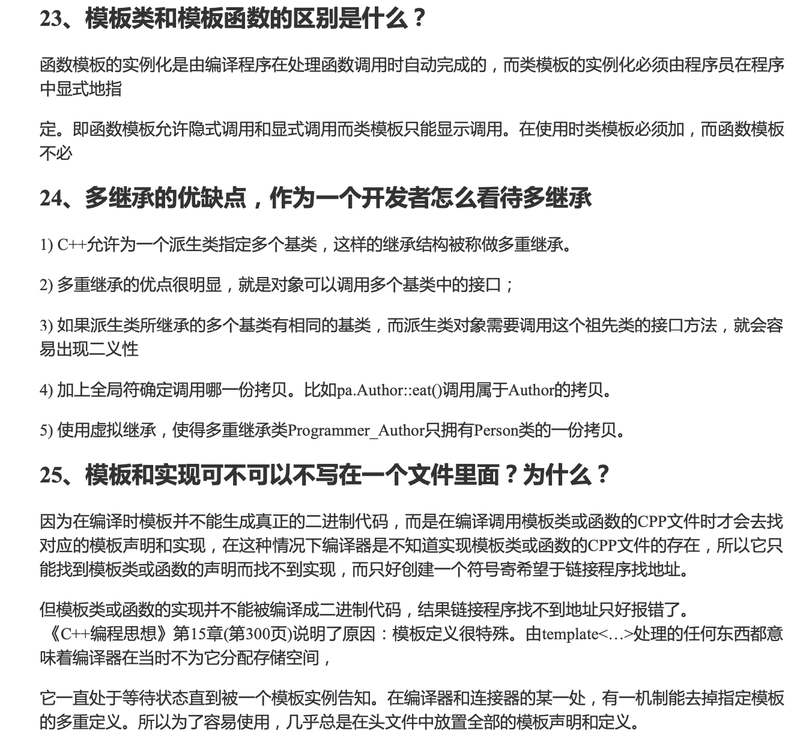


---

### 异常


---

## 四. 计算机网络

### 1.计算机网络基础

##### 1. **OSI的七层模型是什么？有哪些功能？**

+ 物理层：底层数据传输，如网线；网卡标准。传输的数据称为比特流
+  数据链路层：定义数据的基本格式，封装成帧，进行透明传输；如网卡MAC地址。 传输的数据称为帧
+ 网络层：定义IP编址，定义路由功能：如不同设备的数据转发。 传输的数据称为包
+ 传输层：端到端传输数据的基本功能；如 TCP、UDP。 传输的数据称为段
+ 会话层：控制应用程序之间会话能力；如不同软件数据分发给不同软件。 
+ 表示层：数据格式标识，基本压缩加密功能。
+ 应用层：各种应用软件，包括 Web 应用。

---

##### 2.TCP/IP四层模型

+ 网络接口层——负责接收IP数据包并通过网络发送，封装成帧，透明传输等
+ 网际层——定义了IP地址格式，提供路由与转发的功能
+ 传输层——提供应用程序间的通信，TCP/IP协议族在这一层的协议有TCP和UDP。
+ 应用层——各种应用进程的服务

---

##### 3. **计算机网络体系为什么要按照现有体系进行分层？**

+ 根据计算机网络的功能与提供的服务将网络系统进行这样分层，更易于设计，实现和标准化

+ 各层之间相互独立：高层不需要知道底层功能是如何实现的，只需知道利用底层提供的接口来获得所需要的服务
+ 灵活性好：各层的实现无论如何修改，只要提供的功能与接口保持不变，就不会对其他各层以及整个系统产生影响

---

##### 4. **网络的七层/五层模型主要的协议有哪些？**


+  **ARP(地址解析协议)：实现由 IP 地址得到 MAC 地址。**
  + 主机 A 知道主机 B 的 IP 地址，但是 ARP 高速缓存中没有该 IP 地址到 MAC 地址的映射，A 会通过广播发送 ARP 请求分组，B 收到请求后会发送 ARP 响应分组给 A 告知其 MAC 地址，随后 A 在高速缓存中写入 B 的 IP 地址到 MAC 地址的映射。
+  **RIP(内部网关协议)：基于距离向量的路由选择协议。**
  + RIP 按固定的时间间隔仅和相邻路由器交换自己的路由表，经过若干次交换之后，所有路由器最终会知道到达本自治系统中任何一个网络的最短距离和下一跳路由器地址。
+  **IP(互联网协议)：提供一种不可靠，无连接的数据包交付服务。依赖其他层协议进行差错控制。转发路由需要IP**
+  **ICMP(网际控制报文协议)：ICMP允许主机或路由器报告差错情况和提供相关异常情况的报告。**
  + ICMP报文作为IP层数据报的数据，加上数据报的首部，组成 IP 数据报发送出去。
  + ICMP报文种类：
    + 差错报告报文：（类型值：报文类别）
      + 3：终点不可达
      + 11：时间超过
      + 12：参数问题
      + 5：改变路由
    + 询问报文：
      + 8/0：会送请求或回答
      + 13/14：时间戳请求或回答
  + 应用：
    + ping：测试两台主机之间的连通性。
    + Traceroute：用来跟踪一个分组从源点到终点的路径。
+  **IGMP(网际组管理协议)：负责IP组播成员管理的协议，用来在IP主机和与其直接相邻的组播路由器之间建立、维护组播组成员关系。**

---

##### 5.计算机网络的通信方式

+ 第一种方式：**客户-服务器方式：客户是服务请求方，服务器是服务提供方。**
  + 优点：
    + 由于客户端实现与服务器的直接相连，没有中间环节，因此响应速度快；
  + 缺点：
    + 资源分配不均，只有服务器端有资源
    + 由于是针对性开发，缺少通用性的特点，业务变更或改变不够灵活，若改变需要重新设计和开发，增加了维护和管理的难度，进一步的业务拓展困难较多。

+ 第二种方式：**对等连接（P2P）** ： 是指两台主机在通信时并不区分哪一个是服务请求方哪一个是服务提供方。只要两台主机都运行了对等连接软件（P2P软件），他们就可以进行对等连接通信。
  + 优点：
    + 淡化服务提供者与服务使用者的界限，P2P网络中的每台计算机即可以是网络服务使用者也可以是提供者
    + 具有分布性特点，可以随时随地进行业务处理；
    + 业务扩展简单方便，通过增加网页即可增加服务器功能。
  + 缺点：
    + 消息的延迟：各节点转发消息不是同时发送给所有节点的，在有些网络中，是随机转发给其他部分节点的，这就导致消息需要进行多次转发才能到所有节点。
    + 分页显示给数据库访问造成较大的压力 

---

### 2.网络层

##### 1.网络层有什么作用？

+ **网络层** 提供 **路由** 和 **寻址** 的功能，使两终端系统能够互连且决定最佳路径，**<font color = red>实现主机与主机之间的通信，也叫点对点(end to end)通信</font>**；

---

##### 2. 子网掩码的作用

+ 子网掩码是一种用来指明一个IP地址所标示的主机处于哪个子网中。
+ 不能单独存在，必须结合IP地址一起使用。一个作用就是将某个IP地址划分成 **网络地址** 和 **主机地址** 两部分。

---

##### 2.简单介绍一下IP协议

IP协议属于网络层协议提供了一种不可靠，无连接的数据包交付服务。依赖其他层的协议进行差错控制。所有的TCP, UDP, ICMP, IGMP数据都通过IP数据报传输。

+  **不可靠:** IP数据报不保证能成功的到达目的地，如果出现错误则选择丢弃该数据，然后发送ICMP消息报给信源端 
+  **无连接:** 尽最大努力交付，不保证网络包的有序性，完整性。

与 IP 协议配套使用的还有三个协议：

- 地址解析协议 ARP（Address Resolution Protocol）
- 网际控制报文协议 ICMP（Internet Control Message Protocol）
- 网际组管理协议 IGMP（Internet Group Management Protocol）

---

##### 3.介绍一下IP数据报格式

在TCP/IP的标准中，各种数据格式常常以32位(4字节)为单位来进行描述。下图为IP数据报的完整格式。

<div align = center></div>

- **版本** : 有 4（IPv4）和 6（IPv6）两个值；

- **首部长度** : 占 4 位，因此最大值为 15。值为 1 表示的是 1 个 32 位字的长度，也就是 4 字节。因为固定部分长度为 20 字节，因此该值最小为 5。如果可选字段的长度不是 4 字节的整数倍，就用尾部的填充部分来填充。

- **区分服务** : 用来获得更好的服务，一般情况下不使用。

- **总长度** : 包括首部长度和数据部分长度。

- **生存时间** ：TTL，它的存在是为了防止无法交付的数据报在互联网中不断兜圈子。以路由器跳数为单位，当 TTL 为 0 时就丢弃数据报。

- **协议** ：指出携带的数据应该上交给哪个协议进行处理，例如 ICMP、TCP、UDP 等。

- **首部检验和** ：因为数据报每经过一个路由器，都要重新计算检验和，因此检验和不包含数据部分可以减少计算的工作量。

- **标识** : 在数据报长度过长从而发生分片的情况下，相同数据报的不同分片具有相同的标识符。

- **片偏移** : 和标识符一起，用于发生分片的情况。片偏移的单位为 8 字节。

  <div align = center></div>

- 生存时间（TTL，time to live）：占用8位二进制位，它指定了数据报可以在网络中传输的最长时间。

- 协议：占用8位，协议字段指出此数据报携带的数据是使用何种协议，以便使用目的主机的IP层知道应该将数据部分上交给那个协议进行处理。

  + 一些协议和相应的协议字段值如下：

    <div align = center></div>

- 首部检验和：占用16位，用于 **数据报首部** 数据有效性的校验，可以保证IP报头区在传输时的正确性和完整性。头部检验和字段是根据IP协议头计算出的检验和，它不对头部后面的数据进行计算。

- 源地址：占用32位二进制数，表示发送端IP地址。

- 目的地址：占用32位二进制数，表述目的端IP地址。

---

##### 4.介绍一下路由转发算法：

在路由表中，对每一条路由最主要的是以下两个信息：

<div align = center>(目的网络地址，下一条地址)</div>

<div align = center></div>

**路由分组转发算法：**

1. 从数据报的首部提取目的主机的IP地址D，得出目的网络地址为N。
2. 若N就是与此路由器直接相连的某个网络地址，则直接交付；否则执行步骤3。
3. 若路由表中有目的地址为D的特定主机路由，则把数据报传送给路由表中所指明的下一路由器；否则执行步骤4.
4. 若路由表中有到达网络N的路由，则把数据报传送给路由表中所指明的下一跳路由器；否则，执行步骤5.
5. 若路由器中有一个默认路由，则把数据报传送给路由表中所指明的默认路由器；否则执行步骤6.
6. 报告转发分组出错

---

##### 5.什么是分组交换？优缺点？

+ 分组交换采用存储转发技术，把一个**报文**划分为几个**分组**后再进行传送。分组的首部包含了**目的地址和源地址**等重要控制信息，每个分组能在互联网中独立地选择传输路径，并被正确地交付到分组传输的终点，最后再组合起来。

+ 优点：
  1. 高效，在分组传输时动态分配带宽，对通信链路逐段占用。
  2. 灵活，为每一个分组独立地选择最合适的转发路由。
  3. 迅速，以分组为单位，可以不先建立连接就能向主机发送数据。
  4. 可靠，分布式多路由的分组交换网，使传输鲁棒性强。
+ 缺点：
  1. 分组在路由器存储转发时需要排队，有时延。
  2. 分组必须携带控制信息（头部）也造成了开销。

---

##### ==6.介绍一下地址解析协议ARP==

ARP 实现由 IP 地址得到 MAC 地址。

<div align = center></div>

每个主机都有一个 ARP 高速缓存，里面有本局域网上的各主机和路由器的 IP 地址到 MAC 地址的映射表。

如果主机 A 知道主机 B 的 IP 地址，但是 ARP 高速缓存中没有该 IP 地址到 MAC 地址的映射，此时主机 A 通过广播的方式发送 ARP 请求分组，主机 B 收到该请求后会发送 ARP 响应分组给主机 A 告知其 MAC 地址，随后主机 A 向其高速缓存中写入主机 B 的 IP 地址到 MAC 地址的映射。

<div align = center></div>

> MAC 地址的缓存是有一定期限的，超过这个期限，缓存的内容将被清除。

---

##### ==6.介绍一下网络控制报文协议ICMP==

+ **确认 IP 包是否成功送达目标地址、报告发送过程中 IP 包被废弃的原因和改善网络设置等。**在 IP 通信中如果某个 IP 包因为某种原因未能达到目标地址，那么这个具体的原因将**由 ICMP 负责通知。** 
+ ICMP报文作为IP层数据报的数据，加上数据报的首部，组成 IP 数据报发送出去。
+ 主机 A 向主机 B 发送了数据包，由于某种原因，途中的路由器 未能发现主机 B 的存在， 这时路由器就会向主机 A 发送一个 ICMP 目标不可达数据包，说明发往主机 B 的包未能成功。

<div align = center></div>

+ 应用：ping，Traceroute

---

##### ==7.介绍一下ping方法的原理==

> 主要是利用ICMP协议

+ 假设有两个主机，主机A（192.168.0.1）和主机B（192.168.0.2），主机A上输入命令：ping 192.168.0.2；
+ ping命令构建一个 ICMP的请求数据包，然后 ICMP协议将这个数据包以及目标IP等信息交给IP层协议
+ IP层协议得到信息后，将源地址、目标地址、再加上一些其它的控制信息，构建成一个IP数据包；
+ IP数据包构建完成后，通过ARP映射表找出目标IP所对应的MAC地址。当拿到了目标主机的MAC地址和本机MAC后，一并交给数据链路层，组装成一个数据帧，依据以太网的介质访问规则，将它们传送出出去；
+ 主机B收到后,
  + 首先检查它的目标MAC地址是不是本机，如果是就接收下来处理，
  + 接收之后会检查这个数据帧，将数据帧中的IP数据包取出来，交给本机的IP层协议，
  + 然后IP层协议检查完之后，再将ICMP数据包取出来交给ICMP协议处理，
  + 当这一步也处理完成之后，就会构建一个ICMP应答数据包，回发给主机A；
+ 在一定的时间内，如果主机A收到了应答包，则说明它与主机B之间网络可达，如果没有收到，则说明网络不可达。除了监测是否可达以外，还可以利用应答时间和发起时间之间的差值，计算出数据包的延迟耗时。

---

##### ==8.介绍一下Traceroute方法的原理==

> 定位从源主机到目标主机之间经过了哪些路由器，以及到达各个路由器的耗时。

+ 原理就是利用 IP 包的**生存期限** 从 1 开始按照顺序递增的同时发送 **UDP** 包，强制接收 **ICMP** **超时消息**的一 种方法。
  + 比如，将 TTL 设置 为 1 ，则遇到第一个路由器，就牺牲了，接着返回 ICMP 差错报文网络包，类型是时间超时。
  + 接下来将 TTL 设置为 2 ，第一个路由器过了，遇到第二个路由器也牺牲了，也同时返回了 ICMP 差错报文数据 包，如此往复，直到到达目的主机。
  + 这样的过程，traceroute 就可以拿到了所有的路由器 IP。

##### 发送方如何知道UDP包是否到达了目的主机？

traceroute 在发送 UDP 包时，会**填入一个不可能的端口号值作为 UDP 目标端口号(大于 3000 )。**当目的主机收到 UDP 包后，会返回 ICMP 差错报文消息，但这个差错报文消息的类型是**「端口不可达」。**(11)

所以，**当差错报文类型是端口不可达时，说明发送方发出的 UDP 包到达了目的主机。**(3)

---

### 3.传输层

#### 传输层基本知识

##### 1. **传输层的工作内容是什么？**

+ 从通信和信息处理的角度看，运输层向上面的应用层提供通信服务，属于面向通信部分的最高层，也是用户功能部分的最底层。(只有网络边缘部分的主机协议栈才有运输层)

---

##### 2. **网络层与传输层的区别？**

+ 网络层是为主机之间提供逻辑通信
+ 传输层为应用进程之间提供端到端的逻辑通信

---

##### 3. **运输层有什么重要功能？**

+ 主机中实现多个应用进程分别与另一台主机中的多个应用进程通信，拥有复用与分用的能力
  + 复用： 发送方不同应用进程都能使用同一个运输层协议传输数据（加上适当的首部）
  + 分用： 接收方的运输层在剥去报文的首部后，能把数据正确的交付给对应的目的进程

---

##### 4. **在运输层中端口有什么作用？**

+ 从运输层的角度看，通信的对象是进程，而端口就代表了进程。
  + 端口用一个16位端口号进行标记
  + 只需有本地意义，只标记了本计算机应用层的各个进程

---

##### 5. **一台机器能够使用的端口号上限是多少，是否可以修改?如果想要用的端口超过这个限制怎么办? **

+ 65536个。 TCP的报文头部源端口号和目的端口号的长度是16位，表示 $2^{16}=65536$ 个不同端口号。但0到1023是知名服务端口，所以实际上会少1024个端口号。
+ 而对于服务器来说，端口数目与65536无关，受限Linux可以打开的文件数量，并且通过MaxUserPort 进行配置。
+ 默认能打开的文件描述符最大为65535

---

#### TCP与UDP报文知识

##### 1. **封包和拆包你听说过吗?它是基于TCP还是UDP的?**

+  封包和拆包都是基于TCP的。因为 **TCP是无边界的流传输，所以需要对TCP进行封包和拆包，确保发送和接收的数据不粘连** 。
   + 封包：发送方在发送时为每个TCP数据报加上一个报头，将数据报分为报头和报体两个部分。
   + 拆包：接收方在接收到报文后提取包头中的长度信息进行截取。

---

##### 2.**是什么是TCP 粘包 ？ 发生的原因？**

+ 发送方和接收方都有可能出现粘包问题。
  + 发送端：由 **Nagle算法** 造成。 当要提交一段数据给 TCP 发送时， TCP 并不立刻发送此段数据，而是等待一小段时间，看看在等待期间是否还有要发送的数据，若有则会一次把多段数据发送出去。
  +  接收端：接收不及时造成的接收端粘包 。 TCP 会把接收到的数据存在自己的缓冲区中然后通知应用层取数据。 当应用层由于某些原因不能及时取出 TCP 的数据，就会造成 TCP 缓冲区中存放了多段数据 。
+ 解决方法：
  + 科学**封包和解包**。 报头加上发送内容的长度，对方先收 4 Byte，解析获得接下来需要接收的长度，再进行收包。

---

##### 3.什么是Nagle算法

+ Nagle算法简单的说，当提交一段数据给TCP时，TCP并不立刻发送此段数据，而是等待一段时间，看看在等待期间是否还有要发送的数据，若有则会一次把多段数据发送出去。

---

##### 4.为什么UDP没有粘包现象

+ 从TCP和UDP的**头部结构体**就可以很明显的看到，**UDP头部是记录了数据的长度的**，而**TCP头部里面并没有记录数据长度的变量**。

---

##### 5. **用户数据报协议UDP(User Datagram Protocol) 有什么特点？**

1. UDP是面向报文的，不合并也不拆分，加上首部之后直接发送

   > + 报文太长，交给IP层之后，IP层可能会分片，降低IP层效率
   > + 报文太短，交给IP层之后，显得IP数据报首部相对长度太长，也降低IP层效率

2. 无连接的：发送消息之前不需要建立连接，减少了开销与发送数据之前的延迟

3. 尽最大努力交付：不保证可靠交付，因此主机之间不需要维持复杂的连接状态表

4. 没有拥塞控制：因此网络拥塞时不会使源主机的发送速率降低，符合多媒体通信要求

5. 支持一对一，一对多，多对一，多对多的交互通信

6. 首部开销小，只有8字节，比TCP的20字节小

---

##### 6. **介绍一下UDP的首部格式**

+ UDP有两个字段：  首部字段 和 数据字段。首部字段有8个字节，由4个字段组成，每个字段占两个字节：
  + 源端口： 源端口号。需要给对方回信时使用，不用时赋予0
  + 目的端口： 目的端口号。 在终点交付报文时必须使用
  + 长度：UDP数据报的长度，最小值为8
  + 检验和：检验UDP 数据报在传输过程中是否出错，出错则丢弃

---

##### 7. **在进行UDP编程的时候，一次发送多少bytes好?**

+ IP数据报大于1500字节(MTU)时需要分片。建议将UDP的数据控制在1472字节以下(1500-ip头20-UDP头8).
+ 进行Internet编程时则不同，因为Internet上的路由器可能会将MTU设为不同的值. 如果我们假定MTU为1500来发送数据的,而途经的某个网络的MTU值小于1500字节,那么系统将会使用一 系列的机制来调整MTU值,使数据报能够顺利到达目的地,这样就会做许多不必要的操作.
+ 鉴于Internet上的标准MTU值为576字节。建议在进行Internet的UDP编程时. 最好将UDP的数据长度控件在548字节(576-8-20)以内

---

##### 8. **为什么需要TCP协议？**

+ IP层是不可靠，不保证网络包的按需交付与数据完整性。
+ 如果需要保证传输过程可靠，则需要上层的TCP协议来负责，TCP能保证接收端收到的网络包是按序，无损坏的

---

##### 9. **介绍一下 传输控制协议TCP(Transmission Control Protocol)，它有什么特点？**

+ TCP是面向连接的运输层协议，提供 **可靠交付** 的 **基于字节流** 的传输

  + 面向连接： TCP连接只支持点对点的，只有两个端点

  + 可靠的：传输过程中无论网络链路怎么变化，TCP能保证报文能达到接收端

  + 面向字节流： 虽然应用程序与TCP以数据块的形式交互，但TCP把上层交付下来的数据仅看成是一连串无结构的字节流

    > TCP 不保证接收方应用程序数据块与发出的数据块大小对应，但字节流必须完全一样。

+ 传输过程的特点：

  + TCP 根据对方给出的窗口值和当前网络拥塞的程度来决定一个报文段应包含多少个字节（UDP 发送的报文⻓ 度是应用进程给出的）
  + TCP 可把太⻓的数据块划分短一些再传送
  + TCP 也可等待积累有足够多的字节后再构成报文段发送出去

---

##### 10.TCP报文段首部有哪些字段？**

##### ==11.TCP 头部有哪些信息？具体什么作用？==

+ 从前往后分别是
  + 源端口号 (2 bytes)；目的端口号 (2 bytes)
  + 序号  (4 bytes)：TCP 连接中传送的数据流的序号。序号字段的值是报文段所发送数据的第一个字节的序号。
  + 确认号  (4 bytes)：期望收到对方下一个报文数据中第一个字节的序号。
  + 数据偏移 (4 bits)：TCP 报文段的数据起始处距离 TCP 报文段的起始处有多远
  +  保留 (6 bits)：保留为今后使用，但目前应置为 0。
  + 紧急URG (1 bits)：当 URG=1 表明 **紧急指针** 有效，此报文段中有紧急数据，应尽快传送(相当于高优先级的数据)
  + 确认ACK (1 bits)：ACK=1 时确认号字段才有效。当 ACK =0 时，确认号无效。
  + 推送PSH (1 bits)： PSH=1 表示应尽快地交付接收应用进程，而不再等到整个缓存都填满了后再向上交付。
  + 复位RST (1 bits)： RST=1 表明 TCP 连接中出现严重差错，必须释放连接，然后再重新建立运输连接。
  + 同步SYN (1 bits)：SYN=1 表示这是一个连接请求或连接接受报文。
  + 终止FIN (1 bits)：用来释放一个连接。FIN=1 表明此报文段的发送端的数据已发送完毕，并要求释放运输连接。
  + 窗口 (2 bytes)：用来让对方设置发送窗口的依据，单位为字节。
  + 检验和  (2 bytes)：检验和字段检验的范围包括首部和数据这两部分
  + 紧急指针 (2 bytes)：指出在本报文段中紧急数据共有多少个字节（紧急数据放在本报文段数据的最前面）
  + 选项字段 ：长度可变
  + 填充(首部是4字节的整数倍)： 使整个首部长度是 4 字节的整数倍

---

##### ==12.UDP如何保证可靠传输==

- 添加seq/ack机制，确保数据发送到对端
- 添加发送和接收缓冲区，主要是用户超时重传。
- 添加超时重传机制。

> 1. 送端发送数据时，生成一个随机seq=x，然后每一片按照数据大小分配seq。
> 2. 数据到达接收端后接收端放入缓存，并发送一个ack=x的包，表示对方已经收到了数据。
> 3. 发送端收到了ack包后，删除缓冲区对应的数据。时间到后，定时任务检查是否需要重传数据。

基于UDP的数据传输协议（UDP-basedData Transfer Protocol，简称UDT）是一种互联网数据传输协议。**UDT的主要目的是支持高速广域网上的海量数据传输**，而互联网上的标准数据传输协议TCP在高带宽长距离网络上性能很差。

顾名思义，UDT建于UDP之上，并引入新的拥塞控制和数据可靠性控制机制。UDT是面向连接的双向的应用层协议。它同时支持可靠的数据流传输和部分可靠的数据报传输。由于UDT完全在UDP上实现，它也可以应用在除了高速数据传输之外的其它应用领域，例如点到点技术（P2P），防火墙穿透，多媒体数据传输等等。

#### TCP链接知识

##### 1. **常见TCP的连接状态有哪些?**

---

##### 2. **介绍一下TCP的连接的端点与协商内容**

+ TCP面向的是套接字，连接端点称为socket或者插口

  <div align  = center>socket = ip地址 + 端口号 </div>

+ 建立TCP连接时需要通信两端达成三个信息的共识

  + socket：即IP地址与端口号
  + 序列号：用来解决乱序问题
  + 窗口大小：用作流量控制

---

##### 3. **如何确定一个TCP连接**

+ 源地址，源端口，目的地址，目的端口，这四元组能确定一个连接
  + 源地址，目的地址 在IP头部，通过IP协议将报文发送到具体主机
  + 源端口，目的端口 在TCP头部，通过TCP协议将报文发送到具体进程

---

##### 4. **有一个 IP 的服务器监听了一个端口，它的 TCP 的最大连接数是多少？**

+ 最大TCP连接数 = 客户端 IP 数 * 客户端的端口数

+ 对 IPv4， IP 数最多为 $2^{32}$ ，端口数最多为$2^{16}$，则最大 TCP连接数为 $2^{48}$。但远不能到达这个上限值。

  > + 文件描述符限制，Socket 都是文件，要通过 ulimit 配置文件描述符的数目;
  > + 内存限制

---

#####  ==5.**讲讲TCP KeepAlive(保活机制,即心跳包)**==

+ TCP连接双方在连接空闲状态时，如果一方发生意外，另一方无法得知TCP连接已经失效，会一直维护这个连接。长时间的积累会导致非常多的半打开连接，造成端系统资源的消耗和浪费，
+ 所以 TCP 连接建立后，启用 TCP Keepalive 的一端便会启动一个计时器，当tcp_keep-alive_time时间到达 0 之后便会被发出纯 ACK 包去进行探测。根据对方的回应做出后序操作。

---

##### 6. **什么是半连接队列？**

+ 服务器第一次收到客户端的 SYN 之后处于 SYN_RCVD 状态，此时双方还没有完全建立其连接，服务器会把此种状态下请求连接放在一个 **队列** 里，这就是 **半连接队列** 。
+ 对应自然有 **全连接队列**，就是已经完成三次握手，建立起连接的就会放在全连接队列中。如果队列满了就有可能会出现丢包现象。

---

##### ==7. **TCP与UDP有哪些区别？**==

1. 连接：
   +  TCP面向连接传输协议，传输数据之前需建立连接，UDP无连接，即可传输
2. 服务对象
   + TCP点对点
   + UDP都行
3. 传输方式
   + TCP 面向连接，基于字节流，无边界，但保证有序与可靠
   + UDP直接发送包，有边界，但可能出现丢包与乱序
4. 可靠性
   + TCP是可靠交付数据，有序，不丢失，无损伤
   + UDP尽最大努力传输，不保证可靠性
5. 拥塞控制，流量控制
   + TCP有拥塞控制与流量控制机制，保证数据传输的安全性
   + UDP没有，就算网络拥堵也不影响发送速率
6. 首部开销
   + TCP首部较长，没有使用选项字段时为20字节，开销较大
   + UDP首部只有8字节，固定不变，开销较小
7. 分片方法
   + TCP是在传输层进行分片，当数据大于MSS，TCP会进行分片，若中途丢失一个分片，只需重发对应分片即可
   + UDP是在网络层进行分片，当数据大于MTU，IP会进行分片，若中途丢失一个分片，在实现可靠传输的 UDP 时需重传整个的数据包，所以通常UDP报文应该小于MTU
8. 应用场景
   + TCP是可靠交付，用于
     + FTP文件传输
     + HTTP/HTTPS
   + UDP 无连接，可随时发送，处理简单高效
     + 包总量较小的通信，如DNS，SNMP
     + 视频，音频等多媒体通信
     + 广播通信

---

##### 8. **为什么UDP头部没有 首部长度 字段，而TCP有？**

+ TCP有可变长的 选项 字段，所以需要记录长度
+ UDP首部大小固定，无需记录

---

##### 23. **为什么 UDP 头部有「包⻓度」字段，而 TCP 头部则没有「包⻓度」字段呢?**

+ TCP 是计算负载数据⻓度:  TCP数据的⻓度 =  IP总⻓度 - IP首部⻓度 - IP首部⻓度
+ UDP其实也可以这么计算，但可能是为了网络设备硬件设计和处理方便，首部⻓度需 **4** 字节整数倍。利用字段可能可能是为了补全。

---

##### 24. **TCP连接建立过程中要解决哪些问题？**

- 要使每一方都能够确知对方的存在。
- 要允许双方协商一些参数(如最大窗口值，是否使用窗口扩大选项和时间戳选项以及服务质量等)。
- 能够对运输实体资源(如缓存大小，连接表中的项目等)进行分配。

---

##### 25.  **TCP链接建立过程**

+ 首先服务器端进程创建运输控制块TCB，处于 LISTEN(监听) 状态，等待客户端的链接到来
+ 客户端进程创建运输控制块TCB，想要建立TCB连接时， 向服务器端发送 TCB请求报文， 报文首部中的 同部位SYN=1，同时初始化序列号 seq=x， SYN报文中不能携带数据，但需要消耗一个序号。此时客户端处于 SYN-SENT(同步已发送)状态。
+ 服务器端接收到请求报文后，如果同意建立TCB连接，想客户端发送ACK确认报文报文首部中的 同部位SYN=1，ACK=1，同时初始化序列号 seq=y，确认序列 ack=x+1，此时报文中也不能携带数据，需要消耗一个序列号，此时服务器端处于 SYN-RECV(同步收到) 状态。
+ 客户端收到服务器端的确认后，需要向服务器端发送确认报文，报文中 ACK=1，SYN序列 seq=x+1，确认序列 ack=y+1。此时的确认报文可以携带数据，如果不需要携带，则不消耗序列号。此时客户端进入 ESTABLISHED 状态
+ 服务器端接收到确认报文后，也进入ESTABLISHED状态，TCP连接建立完成。

---

##### 26. **TCP建立连接中维护「序列号」的作用？**

+ 接收方可以去除重复的数据; 
+ 接收方可以根据数据包的序列号按序接收; 
+ 可以标识发送出去的数据包中， 哪些是已经被对方收到的

---

##### 27. **TCP建立连接为什么是三次握手，而不是两次或四次？**

+ TCP 建立连接时，通过三次握手能防止历史连接的建立，能减少双方不必要的资源开销，能帮助双方同步初始化序列号。序列号能够保证数据包不重复、不丢弃和按序传输。
+ 不使用「两次握手」和「四次握手」的原因:
  + 「两次握手」:无法防止历史连接的建立，会造成双方资源的浪费，也无法可靠的同步双方序列号; 
  + 「四次握手」:三次握手就已经理论上最少可靠连接建立，所以不需要使用更多的通信次数。

---

##### 28. **为什么客户端和服务端的初始序列号 ISN 是不相同的**

+ 如果序列号相同，那么就无法分辨出该报文是不是历史报文，如果历史报文被新的连接接收了，则会产生数据错乱
+ 为了安全性，防止黑客伪造的相同序列号的 TCP 报文被对方接收。

---

##### 29. **初始序列号 ISN(Initial Sequence Number) 是如何随机产生的?**

+ ISN = M + F (localhost, localport, remotehost, remoteport)

  > + M 是一个计时器，这个计时器每隔 4 毫秒加 1。
  > + F 是一个 Hash 算法，根据源 IP、目的 IP、源端口、目的端口生成一个随机数值。要保证 Hash 算法不能被外部轻易推算得出，用 MD5 算法是一个比较好的选择。

---

##### 30. **既然 IP 层会分片，为什么 TCP 层还需要 MSS 呢?**

> +  **MTU :** 一个网络包的最大⻓度，以太网中一般为 1500 字节;
> +  **MSS :** 除去 IP 和 TCP 头部之后，一个网络包所能容纳的 TCP 数据的最大⻓度;

+ 将 TCP 的整个报文(头部 + 数据)交给 IP 层进行分片的话，如果一个 **IP** 分片丢失，整个 **IP** 报文的所有分片都得重传。  IP 层本身没有超时重传机制，由传输层的 TCP 来负责超时和重传。
+ 当接收方发现 TCP 报文(头部 + 数据)的某一片丢失后，则不会响应 ACK 给对方，那么发送方的 TCP 在超时后，就重会发「整个 TCP 报文(头部 + 数据)」。非常没有效率。
+ 为了达到最佳的传输效能， TCP 协议在建立连接的时候通常要协商双方的 **MSS** 值，当 TCP 层发现数据超过 MSS 时，则就先会进行分片，经过 TCP 层分片后，如果一个 TCP 分片丢失后，进行重发时也是以 **MSS** 为单位，而不用传所有 的分片，大大增加了重传的效率。

---

##### 31. **什么是SYN攻击？**

+ 攻击者短时间伪造不同 IP 地址的 SYN 请求报文，服务端每接收到一个 SYN 报文就进入 SYN_RCVD 状态，但服务端发送出去的 ACK + SYN 报文，无法得到未知 IP 主机的 ACK 应答，久而久之就会占满服务端的未连接队列，使得服务器不能为正常用户服务。

---

##### 32. **如何避免SYN攻击？**

+ 比如**降低SYN timeout时间**，使得主机尽快释放半连接的占用。
+ 当网卡接收数据包的速度大于内核处理的速度时，会有一个队列保存这些数据包。超出处理能时，对新的 SYN 直接回报 RST 复位包、丢弃连接。
+ **SYN cookie设置**，就是给每一个请求连接的IP地址分配一个Cookie，如果短时间内连续受到某个IP的重复SYN报文，就认定是受到了攻击，以后从这个IP地址来的包会被丢弃。

---

##### 如何应对短连接、高并发的场景？

+ 针对于大量短连接同时高并发的情况：最常用的一个手段就是优化主机系统设置。
  + 比如**降低SYN timeout时间**，使得主机尽快释放半连接的占用。
  + **SYN cookie设置**，就是给每一个请求连接的IP地址分配一个Cookie，如果短时间内连续受到某个IP的重复SYN报文，就认定是受到了攻击，以后从这个IP地址来的包会被丢弃。
  + **使用长连接**。在使用长连接的情况下，当一个网页打开完成后，客户端和服务器之间用于传输HTTP数据的 TCP连接不会关闭，如果客户端再次访问这个服务器上的网页，会继续使用这一条已经建立的连接。
+ 对于服务器高并发的场景，有以下处理手段：
  + 采用多IO复用模型，如select、epoll，甚至采用异步IO
  + 还可以采用缓存的方式
  + 采用多服务器负载均衡手段

---

##### 33. **TCP链接释放的过程**

+ 客户端进程向服务器端发送释放连接的报文，其中 FIN=1，初始化序列号seq=u，并停止发送数据，主动关闭TCP连接，进入 **FIN-WAIT1终止等待1** 状态，等待服务器端的确认。
+ 服务器端收到客户端的释放连接报文后，发送确认报文，其中ACK=1，序列号seq=v，确认报文ack=u+1，服务器端进入 **CLOSE_WAIT关闭等待** 状态，此时TCP处于半关闭状态，客户端到服务器端的链接释放。
+ 客户端在接收到服务器端的确认报文后，进入 **FIN_WAIT2终止等待2** 状态，等待服务器端发送连接释放报文
+ 等到服务器端没有需要向客户端发送的数据时，发送连接释放报文，其中FIN=1，ACK=1，序列号seq=w，确认序列ack=u+1，服务器端进入 **LAST_ACK最后确认** 状态，等待客户端的确认
+ 客户端收到服务器端的释放连接报文后，发出确认报文，其中ACK=1，序列号seq=u+1，确认序列ack=w+1，客户端进入 **TIME_WAIT时间等待** 状态。经过时间 **2MSL** 后，客户端进入 **CLOSED** 状态。
+ 服务器端收到确认报文后，也进入 **CLOSED** 状态。

---

##### 34. **释放连接为什么需要四次挥手？**

+ 关闭连接时，客户端向服务端发送 FIN 时，仅仅表示客户端不再发送数据了但是还能接收数据。
+ 服务器收到客户端的 FIN 报文时，先回一个 ACK 应答报文，而服务端可能还有数据需要处理和发送，等服务端不再发送数据时，才发送 FIN 报文给客户端来表示同意现在关闭连接。
+ 从上面过程可知，服务端通常需要等待完成数据的发送和处理，所以服务端的 ACK 和 FIN 一般都会分开发送，从而比三次握手导致多了一次。

---

##### 35. **对于FIN_WAIT_2，CLOSE_WAIT状态和TIME_WAIT状态?你知道多少?**

+ FIN_WAIT_2:

  + 半关闭状态。
  + 发送断开请求一方还有接收数据能力，但已经没有发送数据能力。

+ CLOSE_WAIT状态:

  + 被动关闭连接一方接收到FIN包会立即回应ACK包表示已接收到断开请求。

  + 被动关闭连接一方如果还有剩余数据要发送就会进入CLOSED_WAIT状态。

+ TIME_WAIT状态:

  + 又叫2MSL等待状态。 如果客户端直接进入CLOSED状态，如果服务端没有接收到最后一次ACK包会在超时之后重新再发FIN包，此时因为客户端已经CLOSED，所以服务端就不会收到ACK而是收到RST。
  + 所以 TIME_WAIT状态目的是防止最后一次握手数据没有到达对方而触发重传FIN准备的。 在2MSL时间内，同一个socket不能再被使用，否则有可能会和旧连接数据混淆(如果新连接和旧 连接的socket相同的话)。

---

##### 36. **MSL 与 TTL 的区别是什么？**

+  MSL 是 Maximum Segment Lifetime，表示任何报文在网络上存在的最⻓时间，超过这个时间报文将被丢弃。
+  因为 TCP 报文基于是 IP 协议的，而 IP 头中有一个 TTL 字段，表示经过的最大路由数，每经过一个路由器就减 1，为 0 则被丢弃，同时发送 ICMP 报文通知源主机。
+  MSL 的单位是时间，而 TTL 是经过路由跳数。往往 **MSL** 应该要大于等于 **TTL** 消耗为 **0** 的 时间，以确保报文已被自然消亡。

---

##### 37. **为什么需要 TIME_WAIT 状态?**

+  **保证客户端发送的最后一个ACK报文段能够到达服务器**。
  + 如果没有 TIME_WAIT状态，服务端如果没有接收到最后一次ACK包，会在超时之后重新再发FIN包，但此时客户端已经CLOSED，服务端就不会收到ACK而是收到RST。 服务端则会一直处在 LASE_ACK 状态。
  + 如果客户端等待2MSL，服务器就会超时重传FIN报文段，而客户端就能在2MSL时间内收到这个重传的FIN-ACK报文段。接着客户端重传一个确认，重新启动2MSL计时器。当服务器收到最后一个ACK后就可以正常关闭了。

+  消除旧连接的数据包，经过 2MSL 时间两个方向上的数据包都会在网络中自然消失，再出现的数据包一定都是新建立连接所产生的。

---

##### 38. **为什么 TIME_WAIT 等待的时间是 2MSL?**

+  网络中可能存在来自发送方的数据包，当这些数据包被接收方处理后又会向对方发送响应，一来一回需要等待 **2** 倍的时间。
+  在 Linux 系统里 2MSL 默认是 60 秒，那么一个 MSL 也就是 30 秒。**Linux** 系统停留在 **TIME_WAIT** 的时间为固定的 **60** 秒。
+  RFC793 定义 MSL 为 2 分钟，Linux 实现会默认设置 30 秒。

---

##### 39. **可以解释一下 ** **RTO** **，** **RTT** **和超时重传分别是什么吗?**

+ 超时重传： 发送端发送报文后若长时间未收到确认则需要重发该报文。可能有以下几种情况:
  + 发送的数据没能到达接收端，所以对方没有响应。 
  + 接收端接收到数据，但是ACK报文在返回过程中丢失。 
  + 接收端拒绝或丢弃数据。
+ RTO：从上一次发送数据，因为长期没有收到ACK响应，到下一次重发之间的时间。就是重传间隔。
  + 通常每次重传RTO是前一次重传间隔的两倍，计量单位通常是RTT。例:1RTT，2RTT，4RTT， 8RTT......
    重传次数到达上限之后停止重传。
+ RTT：数据从发送到接收到对方响应之间的时间间隔，即数据报在网络中一个往返用时。大小不稳定。

---

##### TIME_WAIT和CLOSE_WAIT的区别。

+ TIME_WAIT是主动关闭连接时形成的，等待2MSL时间，防止最后一个释放确认动作丢失。
+ CLASE_WAIT是被动关闭连接形成的。服务端收到客户端的释放连接请求并进行确认胡进入CLOSE_WAIT状态。如果服务器端不执行close，就不能由CLOSE_WAIT迁移到LAST_ACK.

---

##### 40. **TIME_WAIT 过多的原因，有什么危害以及解决方法?**

+ 原因：

  +  短时间内出现过多的TCP链接释放

+ 危害：

  +  客户端TIME_WAIT过多，就会导致端口资源被占用，被占满就会导致无法创建新的连接。
  +  服务端只监听一个端口，但是会把连接扔给处理线程，理论上监听的端口可以继续监听。但是当服务端出现大量 TIME_WAIT 时，系统资源被占满时，会导致处理不过来新的连接。

+ 处理方法：

  + 调整系统内核参数：

    +   修改系统默认的 TIMEOUT 时间 tcp_fin_timeout
    +   减少保持TIME_WAIT套接字的最大数量 tcp_max_tw_buckets
    +   增加可用端口范围

  + 调整短链接为长链接

    + 短连接：连接->传输数据->关闭连接

      > 短连接是指SOCKET连接后发送后接收完数据后马上断开连接。

    + 长链接：连接->传输数据->保持连接 -> 传输数据-> ... ->关闭连接

      > 长连接指建立SOCKET连接后不管是否使用都保持连接，但安全性较差。

---

##### 41. **服务器出现大量close_wait的连接的原因是什么?有什么解决方法?**

+ 原因:

  + 服务器内部业务处理占用了过多时间，都没能处理完；或者还有数据需要发送；或者服务器的业务逻辑有问题，没有执行close()方法 
  + 服务器的父进程派生出子进程，子进程继承了socket，收到FIN的时候子进程处理但父进程没有处理该信号，导致socket的引用不为0无法回收

+ 危害：socket资源会被耗尽

+ 处理方法: 

  + 停止应用程序

  + 修改程序里的bug

---

#### TCP可靠传输

##### ==1. **TCP如何实现的可靠传输？**==

+ 首先，采用三次握手来建立TCP连接，四次握手来释放TCP连接，从而保证建立的传输信道是可靠的。
+ 其次，TCP采用连续ARQ协议来保证数据传输顺序的正确性，使用滑动窗口协议来进行流量控制，保证接方能够及时处理所接收到的数据。
+ 最后，TCP使用慢开始、拥塞避免、快重传和快恢复来进行拥塞控制，避免网络拥塞。

---

##### 2. **介绍一下停止等待协议**

+ **“**停止等待**”**就是每发送完一个分组就停止发送，等待对方的确认。在收到确认后再发送下一个分组。
+ 发送方如何知道对方正确收到消息的？
  + 每一个已发送的分组都设置了一个超时计时器。 只要在超时计时器到期之前收到了相应的确认，就撤销该超时计时器，继续发送下一个分组 ，否则重发
+ 如何知道收到了重复的分组，需要丢弃呢？
  + 每一个发送的分组都进行编号。接收方收到了编号相同的分组，则认为收到了重复分组，会进行丢弃，并回送确认
  + 发送方也为发送的确认也进行编号，指示该确认是对哪一个分组的确认。
  + 接收方根据确认其编号，可以确定它是对哪一个分组的确认，避免重发发送。若为重复的确认，则将其丢弃。
+ 改进：为了提高传输效率，发送方可以不使用低效率的停止等待协议，而是采用流水线传输。

---

##### 3. **介绍一下 连续ARQ协议**

+ 发送方设置
  + 发送方设置发送窗口，将发送窗口中的分组连续发送出去，而不用逐个等待对方的确认，提高了信道利用率
  + 发送方每接收到一个确认，就会把发送窗口向前滑动一个分组的位置
+ 接收方设置
  + 不需要逐个发送确认，只需对按序到达的最后一个分组发送确认，表示到这个分组为止的所有分组都已正确收到。
+ 回退N机制：如果发送方发送了前 5 个分组，而中间的第 **3** 个分组丢失了。这时接收方只能对前两个分组发出确认。发送方无法知道后面三个分组的下落，而只好把后面的三个分组都再重传一次。 
+ 优点：容易实现，即使确认丢失也不必重传
+ 缺点：不能向发送方反映出接收方已经正确收到的所有分组的信息。

---

##### ==4. **介绍一下TCP的流量控制方法**==

+ TCP利用滑动窗口实现流量控制。窗口用来暂时存放字节流。发送方和接收方各有一个窗口。接收方通过 TCP 报文段中的窗口字段告诉发送方自己的窗口大小，发送方根据这个值和其它信息设置自己的窗口大小。
  + 发送方：发送窗口内的字节都允许被发送，窗口左部的字节如果已经发送并且收到了确认，就将窗口右滑动一定距离，直到左部第一个字节不是已发送并且已确认的状态。
  + 接收方：接收窗口内的字节都允许被接收，窗口左部字节如果已经发送确认并交付主机，就向右滑动接收窗口。接收窗口只会对窗口内最后一个按序到达的字节进行确认。

---

##### ==5. **介绍一下TCP的拥塞控制原理**==

+ 流量控制是为了让接收方能来得及接收，而拥塞控制是为了降低整个网络的拥塞程度。否则导致网络拥塞程度更高，重发分组数目也会更多

+ TCP 主要通过四个算法来进行拥塞控制: 慢开始、拥塞避免、快重传、快恢复。

+ 发送方需要维护一个叫做拥塞窗口(cwnd)的状态变量

  >  拥塞窗口 与 发送方窗口 的区别：拥塞窗口只是一个状态变量，实际决定发送方能发送多少数据的是发送方窗口。

+ **慢开始与拥塞避免**

  + 发送的最初执行慢开始，令 cwnd = 1，只能发送 1 个报文段；当收到确认后，将 cwnd 加倍
  + 设置一个慢开始⻔限 ssthresh，当 cwnd >= ssthresh 时，进入拥塞避免，每个轮次只将 cwnd 加 1
  + 如果出现了**==超时==**，则令 ssthresh = cwnd / 2，然后重新执行慢开始。

+  **快重传与快恢复**

  + 在接收方，要求每次接收到报文段都应该对最后一个已收到的有序报文段进行确认。例如已接收到 M1，M2，此时收到 M4，应当发送对 M2 的确认。 
  + 在发送方，如果收到三个重复确认，则知道下一个报文段丢失，应执行快重传，立即重传下一个报文段。例如收到三个 M2，则 M3 丢失，立即重传 M3。
  + 在这种情况下，只是**==丢失==**个别报文段，而不是网络拥塞。因此执行快恢复，令 ssthresh = cwnd / 2 ，cwnd = ssthresh，注意到此时直接进入拥塞避免。

> 区分好 两者的区别和使用场景。
>
> +  发生超时：说明对方的确认包发不过来，说明网络拥堵，则进行慢开始和拥塞避免
> + 发生丢失：说明重复三次ACK，有丢失，则进行快重传和快恢复，避免拥塞。


### 4.应用层

#### 基本介绍

##### 1. **应用层的功能是什么？**

+ 利用应用层相关的协议来为下层网络提供服务。

---

##### ==2.**应用层中分别基于TCP，UDP的协议**==

+ TCP：
  + HTTP协议(80端口)
  + FTP(21端口)：
    + 提供在服务器和客户机之间上传和下载文件的有效方式。基于TCP的传输，采用双TCP连接方式；支持授权与认证机制，提供目录列表功能
  + Telnet：它是一种用于远程登陆的协议,23端口 
+ UDP：
  + DNS：用于域名解析服务，用的是53号端口 
  + DHCP：动态主机配置协议，客户端发送消息到DHCP服务器的67号端口，服务器返回消息给客户端的68号端口。
  + TFTP(Trival File Transfer Protocal)：简单文件传输协议，69

---

##### 3.**介绍一下动态主机配置协议DHCP（Dynamic Host Configuration Protocol）**

+ 提供了即插即用的连网方式，让DHCP服务器自动分配IP 地址 。

  1. 客户端基于UDP发送 Discover 报文，广播到同一个子网的所有主机上。

     >  目的地址为 255.255.255.255:67，源地址为 0.0.0.0:68

  2. DHCP 服务器收到后发送 Offer 报文，其中包含了客户端所需要的信息

  3. 客户端受到后，选择其中某个消息，再发送请求报文。

  4. DHCP 服务器受到后发送确认报文，表示此时可以使用提供给客户端的IP地址。

---

#### DNS介绍

##### 1.**介绍一下域名解析系统 DNS（Domain Name System）**

+ 它是一个分布式数据库，提供域名和 IP 地址相互转换的服务。
+ DNS 可以使用 UDP 或 TCP 进行传输，端口号都为 53。多数情况使用 UDP 。

---

##### ==2.**介绍一下域名解析系统的工作方式：**==

1. 输入域名后，浏览器先检查缓存中是否有域名映射的ip地址，有解析结束。
2. 若无，则检查操作系统缓存(如Windows的hosts)中有无解析过的结果，有解析结束。
3. 若无，则向 **本地DNS服务器** 进行查询，找到对应的IP地址映射或者缓存信息则结束。
4. 若无，则根据 **本地DNS服务器设置的转发器** 进行查询：
   + 未用转发模式：(迭代查询)
     + 本地DNS就把请求发至根DNS进行迭代查询，根服务器收到请求后会判断域名由谁授权管理，返回负责管理的顶级域名服务器IP。
     + 本地DNS服务器收到IP后，联系负责域名管理的服务器，若无法解析，它会找下一级服务器地址给本地DNS。本地服务器收到IP后继续联系域名域服务器，重复上面动作，直至找到域名对应的ip地址返回给主机
   + 使用转发模式：（递归查询）
     + 本地DNS服务器把请求转发至上一级DNS服务器进行递归查询，若不能解析，把请求转至上上级，以此循环，直至找到并原路回来。最后DNS服务器把结果再返回给客户机

---

##### 3.**为什么域名解析基本上使用 UDP 协议？**

+  UDP的DNS协议只要一个请求、一个应答就好了。TCP需要三次握手建立连接

---

##### 4.**哪些时候DNS使用 TCP 协议？**

+ 如果返回的响应报文大小超过的 512 字节（UDP 最大只支持 512 字节的数据）。
+ 主域名服务器向辅助域名服务器进行 区域传送， 发送数据时。从主DNS服务器上复制内容需要进行可靠传输。
  + 因为TCP协议可靠性好，而且同步的数据可能大于512字节。

---

##### 5.**介绍一下DNS的负载均衡策略**

+ 为同一个主机名配置多个IP地址，在应答DNS查询时，服务器根据一些设置，比如根据地区分配，将客户端的访问引导到不同的服务器，达到负载均衡的目的。

---

##### 6.介绍一下负载均衡

+ 建立多个服务器，组成一个服务器集群，当用户访问时，先访问中间服务器，再让中间服务器在服务器集群中选择一个压力较小的，将该访问请求引入该服务器。这样就保证了服务器集群中的每个服务器压力趋于均衡。
+ 负载均衡有几种方式实现
  + 轮询（默认）：请求依次轮流往每个应用服务器上进行分配，分配策略比较简单。
    + 缺点：服务器接受不均匀。另外服务器之间需要进行session同步。
  + 权重轮询（权重越高，进入的几率越大）
    + 优点：可以根据情况进行调整。可控，仍然需要进行session同步。
  + IP-Hash
    + 优点：采用hash的方式来映射服务器。无需进行session同步，固定IP会固定访问一台服务器。
    + 缺点：恶意攻击会造成某台服务器压垮。提供服务不同，面向地区不同，IP可能会出现集中，造成不均匀，不可控。
  + Fair
    + 相当于自适应，根据服务器处理请求的速度进行负载均衡分配。处理请求最早结束的，拿到下一个请求。看上去是不是很好。但是一般都不使用，说是考虑到网络不稳定因素。还有待研究。这种也需要进行session同步。
  + URL-Hash
    + 根据URL进行hash，利于利用服务器的缓存，但是可能由于URL的哈希值分布不均匀，以及业务侧重造成某些服务器压力大，某些负荷低。这种也需要进行session同步。

---

#### HTTP分析 

#####  1.**简单介绍一下HTTP协议**

+ 超文本传输协议HTTP，是用于从万维网服务器传输超文本到本地浏览器的传送协议。基于TCP/IP协议传递数据。

---

##### 2. ==**HTTP长连接和短连接的区别**==

+ 在HTTP/1.0中默认使用短连接。客户端和服务器每进行一次HTTP操作，就建立一次连接， 任务结束就中断连接。
+ 在HTTP/1.1起，默认使用长连接，用以保持连接特性。

---

##### 3.**一个TCP连接可以对应几个HTTP请求?**

+ 在HTTP/1.0中，因为使用短连接。一个连接对应一个HTTP请求，每进行一次HTTP操作，就建立一次连接，。
+ 在HTTP/1.1中，，使用长连接用以保持连接特性，一个连接可以对应多个HTTP请求。

---

#####  4.**一个TCP 连接中 HTTP 请求发送可以一起发送么(比如一起发三个请求，再三个响应一起接收)?**

+ HTTP/1.0铁定是不可能实现的

+ HTTP/1.1 中单个 TCP 连接在同一时刻只能处理一个请求，多个 HTTP 请求只能按顺序处理，不能并行操作。

+ HTTP2 通过多路复用技术，在同一个 TCP 连接中将多个 HTTP 请求并行处理。

  > HTTP/2 把 HTTP 协议通信的信息切割成为帧，并行地在同一个 TCP 连接上双向交换信息。

---

#####  5.**浏览器对同一 Host 建立TCP连接到的数量有没有限制?**

+ 有。不同浏览器有一些区别。Chrome 最多允许对同一 Host 建立六个 TCP 连接。
+ 而且得看是使用什么版本的HTTP：
  + 如果使用HTTP/2，同过 多路复用 可以在一个TCP连接中同时处理传输多个HTTP请求。
  + 是使用HTTP/1.1，浏览器能在一个 HOST 上建立多个 TCP 连接，连接数量的最大限制取决于浏览器设置

---

##### ==6.**浏览器在与服务器建立了一个** **TCP** **连接后是否会在一个** **HTTP** **请求完成后断开?什么情况下会断开?**==

+ 在 HTTP/1.0 中，因为短连接，一个服务器在发送完一个 HTTP 响应后，会断开链接。这样开销代价过大。
+ HTTP/1.1 使用长链接，浏览器和服务器之间是会维持一段时间的 TCP 连接，当请求报头中声明 Connection: close 才会在请求完成后关闭连接

---

##### 7. **介绍一下 HTTP 请求报文与响应报文**

+ 客户端发送请求报文给服务器，服务器处理报文中的请求操作信息，并将处理结果放入响应报文中返回给客户端。

+ 请求报文结构：

  + 请求行：请求方法、URL、协议版本 `GET http://www.example.com/ HTTP/1.1`
  + 下面多行是请求头部，以 `头部字段名 : 值 回车符(\r)换行符(\n) `。
  + 空行：分隔 头部 和 内容主题
  + 请求的内容主体

  ```http
  GET http://www.example.com/ HTTP/1.1
  Accept: text/html,application/xhtml+xml,application/xml;q=0.9,image/webp,image/apng,*/*;q=0.8,application/signed-exchange;v=b3;q=0.9
  Accept-Encoding: gzip, deflate
  Accept-Language: zh-CN,zh;q=0.9,en;q=0.8
  Cache-Control: max-age=0
  Host: www.example.com
  If-Modified-Since: Thu, 17 Oct 2019 07:18:26 GMT
  If-None-Match: "3147526947+gzip"
  Proxy-Connection: keep-alive
  Upgrade-Insecure-Requests: 1
  User-Agent: Mozilla/5.0 xxx
  
  param1=1&param2=2
  ```

+ 响应报文结构：

  + 状态行： 协议版本、状态码，描述 ：`HTTP/1.1 200 OK`

  + 下面多行是响应头部：以 `头部字段名 : 值 回车符(\r)换行符(\n) `。
  + 一个空行分隔首部和内容主体
  + 响应正文

  ```http
  HTTP/1.1 200 OK
  Age: 529651
  Cache-Control: max-age=604800
  Connection: keep-alive
  Content-Encoding: gzip
  Content-Length: 648
  Content-Type: text/html; charset=UTF-8
  Date: Mon, 02 Nov 2020 17:53:39 GMT
  Etag: "3147526947+ident+gzip"
  Expires: Mon, 09 Nov 2020 17:53:39 GMT
  Keep-Alive: timeout=4
  Last-Modified: Thu, 17 Oct 2019 07:18:26 GMT
  Proxy-Connection: keep-alive
  Server: ECS (sjc/16DF)
  Vary: Accept-Encoding
  X-Cache: HIT
  
  <!doctype html>
  <html>
  <head>
      <title>Example Domain</title>
  	// 省略... 
  </body>
  </html>
  ```

---

##### 8.HTTP 有哪些首部字段？

+ 四种类型的首部字段：
  + 通用首部字段
    + Connection:是否持久化连接
  + 请求首部字段
    + Cookie：传输给服务器Session
  + 响应首部字段
    + SetCookie：服务器传给浏览器 Session ID
  + 实体首部字段
    + Last-Modified：资源最后的修改时间

---

#### HTTP请求中的知识点

##### 1. ==介绍一下HTTP请求行中有哪些方法？==

+ HTTP1.0 定义了三种请求方法: GET, POST 和 HEAD方法。
+ HTTP1.1 新增了六种请求方法:PUT、PATCH、DELETE、OPTIONS、TRACE 和 CONNECT 方法。
  1. GET：包含在URL中，请求指定的页面信息。
  2. POST：包含在body中，向指定的资源提交数据，进行处理请求。
  3. HEAD：获取报文首部。不返回报文实体主体。
     + 主要用于确认 URL 的有效性以及资源更新的日期时间等。
  4. PUT：上传文件，但存在安全性问题，一般不使用该方法。
  5. PATCH：是对 PUT 方法的补充，用来对已知资源进行局部更新 。
  6. DELETE：请求服务器删除指定的页面。
  7. OPTIONS：允许客户端查看服务器的性能。
  8. TRACE：回显服务器收到的请求，主要用于测试或诊断。
  9. CONNECT：把服务器作为跳板，访问一些只有服务器才能访问到的网站，即HTTP代理。

---

##### 2. ==**GET与POST的区别是什么？**==

1. 提交方式：

   + Get方式在通过URL提交数据，数据在URL中可以看到；
   + POST方式，数据放置在body体内提交

2. 安全性：

   +  Get 提交时，
     + 参数会显示在地址栏上；
     + Get是幂等的，如果是增数据操作，在网络不好的隧道中如果尝试重试，会有重复操作的风险
   + Post 提交时
     + 数据在body中，URL看不到
     + POST不是幂等

   > 这里的幂等性：简单来说，对同一URL的多个请求应该返回同样的结果。

3. 数据大小：在HTTP规范中，没有对URL的长度和传输的数据大小进行限制。但是在实际开发过程中

   + 对于GET，特定的浏览器和服务器对URL的长度有限制。
   + 对于POST，由于不是URL传值，理论上是不会受限制的，但实际上服务器会对POST提交数据大小进行限制

4. 数据包：Get产生一个TCP数据包；Post产生两个TCP数据包。

   + 对于GET，浏览器会把http header和data一并发送出去，服务器响应200（返回数据）；
   + 对于POST，浏览器先发header，服务器响应100（continue），再发送data，服务器响应200（返回数据）；

---

##### 3. **POST 方法比 GET 方法安全?**

+ 有人说POST 比 GET 安全，因为数据在地址栏上不可见。
+ 从传输的角度来说，HTTP 在网络上是明文传输的，只要在网络节点上捉包就能完整地获取数据报文，都不安全。
+ 要想安全传输，就只有加密，也就是 HTTPS。

---

##### 4. **GET** **与** **POST** **传递数据的最大长度能够达到多少呢?**

GET得看浏览器和服务器限制；POST得看服务器限制。

+ GET请求通过URL提交，HTTP 协议规范没有对URL长度进行限制，但特定的浏览器及服务器对URL有限制，比如IE对URL长度的限制是2k字节左右(2K+35字节）。火狐浏览器无限制，但是如果url太长，服务器可能会因为安全方面的设置拒绝请求或者发生不完整的数据请求。

+ HTTP协议规范对POST也没有大小限制，但实际上post所能传递的数据大小取决于服务器的设置和内存大小

---

##### 5. **POST** **方法会产生两个** **TCP** **数据包?你了解吗?**

+ POST 会将 header 和 body 分开发送，先发送 header，服务端返回 100 状态码再发送 body。
+ HTTP 协议中没有明确说明 POST 会产生两个 TCP 数据包，而且Chrome实际测试发现，header 和 body 不会分开发送。不属于 post 必然行为，可能是部分浏览器或框架的请求方法，。

---

##### 6.**介绍一下URL？**

+  URL是uniform resource locator，统一资源定位器
  + 具体的URI，指明了如何定位资源。
    + 协议
    + 存有该资源的主机IP地址(有时也包括端口号)
    + 主机资源的具体地址。如目录和文件名等

+ URI，是uniform resource identifier，统一资源标识符，用来唯一的标识一个资源。
  + 访问资源的命名机制
  + 存放资源的主机名
  + 资源自身的名称，由路径表示，着重强调于资源。

---

#### HTTP响应中的知识点

##### 1.**介绍一下 HTTP 的状态码有哪些？**

+ 1XX：信息
  + **100 Continue** ：表明到目前为止都很正常，客户端可以继续发送请求或者忽略这个响应。
+ 2XX：成功
  + **200 OK**
  + **204 No Content** ：请求已经成功处理，返回的响应报文不包含实体的主体部分。
+ 3XX：重定向
  + **301 Moved Permanently** ：永久性重定向
  + **302 Found** ：临时性重定向
+ 4XX：客户端错误
  + **400 Bad Request** ：请求报文中存在语法错误。
  + **401 Unauthorized** ：无权限
  + **403 Forbidden** ：请求被拒绝。
  + **404 Not Found** ： 请求资源服务器未找到
+ 5XX：服务器端错误
  + **500 Internal Server Error** ：服务器正在执行请求时发生错误。
  + **503 Service Unavailable** ：请求无法到达，可能服务器暂时处于超负载或停机维护

---

#### HTTP缓存

##### 1. **为什么服务器会缓存这一项功能?如何实现的?**

+ 原因：
  + 缓解服务器压力;
  + 降低客户端获取资源的延迟：缓存通常位于内存中，读取缓存的速度更快。
+ 实现：
  + 让客户端浏览器进行缓存
  + 让代理服务器进行缓存

---

##### 2. **HTTP中缓存的私有和共有字段?知道吗?**

+ private 指令规定了将资源作为私有缓存，只能被单独用户使用，一般存储在用户浏览器中。

  `Cache-Control: private`

+ public 指令规定了将资源作为公共缓存，可以被多个用户使用，一般存储在代理服务器中

  `Cache-Control: public`

---

##### 3. **HTTP** **如何禁用缓存?如何确认缓存?** 

+ HTTP/1.1 通过 Cache-Control 首部字段来控制缓存。

  + 禁用缓存： no-store 指令规定不能对请求或响应的任何一部分进行缓存

    `Cache-Control: no-store`

  + 确认缓存： no-cache 指令规定 **缓存服务器需要先向源服务器验证缓存资源的有效性，只有当缓存资源有效时才能使用该缓存对客户端的请求进行响应。**

    `Cache-Control: no-cache`

---

#### HTTP的发展与比较

> + 1991 http/0.9
> + 1996  http/1.0
> + 1997  http/1.1
> + 2012  http/2.0

##### 1.==**HTTP1.0和HTTP1.1的区别?**==

+  **长连接** ：
   +  HTTP/1.0 默认短连接
   +  HTTP/1.1支持 **长连接** 和 请求的流水线处理 ，在一个TCP连接上可以传送多个HTTP请求和响应
+  **宽带节约：**
   +  HTTP 1.1支持只发送header信息，如果服务器认为客户端有权限请求服务器，则返回100，否则返回401。
      +  如果接收到100，才开始把请求body发送到服务器。
      +  如果接收到401，客户端就可以不用发送请求body了，节约了带宽。
+  **Host头处理**：
   +  HTTP1.0中认为每台服务器都绑定一个唯一的IP地址，请求消息中的URL并没有传递主机名。
   +  HTTP1.1的请求和响应都应支持Host头域，请求消息中没有Host头域会报告错误（400 Bad Request）
      +  但随着虚拟主机技术的发展，在一台物理服务器上可以存在多个虚拟主机（Multi-homed Web Servers），并且它们共享一个IP地址。HOST用来区分是哪些虚拟主机。

---

##### 2.==**HTTP1.1和 HTTP2.0的区别？**==

+  **协议解析方式**： 
   +  HTTP1.1的协议解析是基于文本。文本的表现形式有多样性，存在天然缺陷，要做到健壮性考虑的场景必然很多。
   +  HTTP2.0的协议解析采用二进制格式，只有0和1的组合，实现方便且健壮。
+  **多路复用**：
   +  通过多路复用技术，把 HTTP 协议通信的信息切割成为帧，并行地在同一个 TCP 连接上双向交换信息。实现了在同一个 TCP 连接中并行处理多个 HTTP 请求。
+   **数据压缩：**
   +  HTTP1.1不支持header数据的压缩
   +  HTTP2.0使用HPACK算法对header的数据进行压缩，在网络上传输就会更快。

----

##### 3.==**什么是HTTPS，为什么需要HTTPS？**==

+ 原因：HTTP 有以下安全性问题：
  - 使用明文进行通信，可能会被窃听；
  - 不验证通信方的身份，可能遭遇伪装；
  - 无法证明报文的完整性，可能遭遇篡改。
+ HTTPS 是让 HTTP 先和 SSL（Secure Sockets Layer）通信，再由 SSL 和 TCP 通信，也就是将SSL作为隧道进行通信
+ 通过使用 SSL，HTTPS 具有了加密（防窃听）、认证（防伪装）和完整性保护（防篡改）。

---

#####  ==4.HTTPS 和 HTTP的区别==

|              | HTTP               | HTTPS                                   |
| ------------ | ------------------ | --------------------------------------- |
| 端口         | 80                 | 443                                     |
| 安全性       | 无加密，安全性较差 | 有加密机制，安全性较高                  |
| 资源消耗     | 较少               | 由于加密处理，资源消耗更多              |
| 是否需要证书 | 不需要             | 需要                                    |
| 协议         | 运行在TCP协议之上  | 运行在SSL协议之上，SSL运行在TCP协议之上 |

---

#####  5.==什么是 SSL/TLS?==

+ SSL代表安全套接字层。是用于加密和验证应用程序(如浏览器)和Web服务器之间发送的数据。
+ 基本思路是采用公钥加密法，客户端先向服务器索要公钥，然后用公钥加密信息，服务器收到后用私钥解密
+ SSL/TLS协议作用：认证用户和服务，加密数据，维护数据的完整性。

---

##### 6.==HTTPS是如何保证数据传输的安全，整体的流程是什么? (SSL是怎么工作保证安全的)==

1. Client向Server端发起SSL连接请求;
2. Server把公钥放在数字证书中发送给Client，自己保存着唯一的私钥（公钥放在数字证书中。只要证书是可信的，公钥就是可信的。）
3. Client用公钥 **将双方通信的对称秘钥进行加密** ，并发送给Server
4. Server利用私钥进行解密， 得到对称密钥
5. 进行数据传输使用对称密钥进行传输，加解密速度更快

---

##### 7.==**为什么有的时候刷新页面不需要重新建立** **SSL** **连接?**==

+ TCP 进行长链接，不需要重新建立，SSL 自然也会用之前的。

---

#### 计算机网络安全 SSL

#####  1. 介绍一下数字签名、摘要

+ 对一份数据进行单向的 Hash 操作，生成一个固定长度的 Hash 值，这个值就是这份数据的摘要，也称为指纹

  > 摘要算法：MD5，论数据有多大，输出总是128位的散列值。

+ 使用私钥对摘要进行加密就得到数字签名。

---

##### 2.**SSL 中的认证中的证书是什么?了解过吗**

+ 数字证书认证机构(CA，Certificate Authority)是客户端与服务器双方都可信赖的第三方机构。
+ 服务器的运营人员向 CA 提出公开密钥的申请，CA 在判明提出申请者的身份之后，会对已申请的公密做数字签名，然后分配这个已签名的公开密钥，并将该公开密钥放入公开密钥证书后绑定在一起。
+ 进行 HTTPS 通信时，服务器会把证书发送给客户端。客户端取得其中的公开密钥之后，先使用数字签名进行验证，如果验证通过，就可以开始通信了。

##### 3. **如何保证公钥不被篡改?**

+ 将公钥放在数字证书中。只要证书是可信的，公钥就是可信的。
+ 公钥加密计算量太大，如何减少耗用的时间?
  + 每一次对话(session)，客户端和服务器端都生成一个"对话密钥"(session key)，用它来加密信息。"对话钥"是对称加密，所以运算速度非常快，而服务器公钥只用于加密"对话密钥"本身，这样就减少了加密运算的消耗时间。

---

##### 4. **对称密钥加密你了解吗?优缺点?**

+ 对称密钥加密(Symmetric-Key Encryption)，加密和解密使用同一密钥。
  + 优点:运算速度快
  + 缺点:无法安全地将密钥传输给通信方

---

##### 5.介绍几个对称加密的算法及其实现原理

+ **对称密钥加密** ：DES(Data Encryption Standard，数据加密标准)、AES(Advanced Encryption Standard，高级加密标准)：
+ `3DES`是`DES`向`AES`过渡的加密算法，它使用3条56位的密钥对数据进行三次加密。是`DES`的一个更安全的变形。它以`DES`为基本模块，通过组合分组方法设计出分组加密算法。比起最初的`DES`，`3DES`更为安全。密钥长度默认为`168`位，还可以选择`128`位。

---

##### 6.介绍几个非对称的算法及其实现原理

+ RSA算法，是Rivest, Shamir, 和Adleman于1978年发明，他们那时都是在MIT。
  + 原理：

---

##### 7. **非对称密钥加密你了解吗?优缺点?**

+ 非对称密钥加密，又称公开密钥加密(Public-Key Encryption)，加密和解密使用不同的密钥。
+ 公钥所有人都可以获得，发送方获得接收方的公钥之后，使用公钥进行加密**， **接收方接收后使用私钥解密。
+ 非对称密钥除了用来加密，还可以用来进行签名。因为私钥无法被其他人获取，因此发送方使用其私钥进行签名，通信接收方使用发送方的公钥对签名进行解密，就能判断这个签名是否正确。
  + 优点:可以更安全地将公开密钥传输给通信发送方;
  + 缺点:运算速度慢

---

##### ==8. **HTTPS 采用的加密方式有哪些?是对称还是非对称?**==

+ HTTPS 采用混合的加密机制
  + 使用非对称密钥加密用于传输对称密钥来保证传输过程的安全性，之后使用对称密钥加密进行通信来保证通信过程的效率。
  + 确保传输安全过程(其实就是rsa原理):
    1. Client给出协议版本号、一个Client端生成的随机数(Client random)，以及Client支持的加密方法。
    2. Server确认双方使用的加密方法，并给出数字证书、以及一个服务器生成的随机数(Server random)。
    3. Client确认数字证书有效，然后生成一个新的随机数(Premaster secret)，并使用数字证书中的公钥，加密这个随机数，发给Server。
    4. Server使用自己的私钥，获取Client发来的随机数(Premaster secret)。
    5. Client和Server根据约定的加密方法，使用前面的三个随机数，生成”对话密钥”(session key)，用来加密接下来的整个对话过程。

---

##### ==9.**HTTPS通信流程的具体过程：**==

+  **客户端向服务器端发送链接请求**

  1. 客户端生成随机数R1发送给服务器端
  2. 告诉服务器端支持哪些加密算法

+  **服务器端向客户端发送包含公钥与身份信息的数字证书**

  1. 服务端生成随机数R2
  2. 从客户端支持的加密算法中选择一种双方都支持的加密算法
  3. 服务端生成把证书、随机数R2、会话密钥生成算法，一同发给客户端;

+ **客户端验证数字证书并拿到公钥**
  1. 客户端先用CA的公钥解密被加密过后的证书，能解密则证书正确，然后通过证书里提供的摘要算法进行对数据进行摘要，通过自己生成的摘要与服务端发送的摘要比对。
  2. 获得证书的公钥、会话密钥生成算法、随机数R2
  3. 生成一个随机数R3
  4. 根据会话秘钥算法使用R1、R2、R3生成会话秘钥，即后序通信使用的对称密钥
+ **客户端使用公钥加密对称密钥信息发送给服务器**
  1. 用服务端证书的公钥加密随机数R3并发送给服务端。
+  **服务器端得到会话密钥，可进行后序通话**
  1. 服务器用私钥解密客户端发过来的随机数R3
  2. 根据会话秘钥算法使用R1、R2、R3生成对称密钥

----

+ 数字证书的作用：

  + 数字签名的作用就是证明公钥的生成者身份是合法Alice即可
  + Alice将公钥以及部分个人信息发送到某个权威证书颁发机构（CA），CA核实Alice身份后，颁发数字证书，其中包含了Alice的身份信息和公钥数据
  + Alice将证书发给Bob，Bob就可以通过证书来确定公钥是否属于Alice

+ 如何确保数字证书不被伪造：

  + 数字证书是通过CA机构数字签名的，CA机构也生成一套公钥私钥，使用私钥对"Alice身份信息及其公钥数据"这一文件内容进行数字签名，并放到数字证书中，数字证书就相当于文件和数字签名的组合体

  + 在电脑浏览器中默认安装了根证书，根证书中记录了可以信赖的CA机构及其公钥

    > 根证书预先安装在系统中可以杜绝CA机构公钥被伪造的可能

  + 通过CA机构公钥可以验证数字证书中的数字签名，从而确保了数字证书的不可伪伪造


---

#### 解决HTTP无状态问题Cookie与Session

##### ==1.为什么提出Cookie==

+  因为HTTP协议是无状态的协议，比如在打开一个网页 A 后，再打开一个网页 B ，这个时候网页 B 不知道是谁打开的，这就是无状态。静态网页可以这么干，但是动态肯定是不行。

+ 所以服务端需要记录用户的状态，通过某种机制来识具体的用户，所以提出了Cookie和Session.

  >  典型的场景比如购物车，当你点击下单按钮时，由于HTTP协议无状态，所以并不知道是哪个用户操作的，所以服务端要为特定的用户创建了特定的Session，用用于标识这个用户，并且跟踪用户，这样才知道购物车里面有几本书。

---

##### ==2.简单介绍一下Cookie是什么==

+ Cookie是服务器响应给客户端并且**存储在客户端**的一份小数据。**下次客户端访问服务器时，会自动带上这个Cookie。**服务器通过Cookie就可以区分客户端。进行会话管理。

---

##### ==3.服务器端如何将Cookie发给浏览器呢？==

+ 服务器端以HTTP响应形式发送发给客户端的Cookie，也就是Set-Cookie响应头部字段。

---

##### ==4.浏览器端再次访问服务器时，服务器是如何知道浏览器的Cookie呢？==

+ 浏览器接收到这些响应头后，会把它们作为Cookie文件存在客户端。当第二次请求**同一个**服务器，浏览器在发送的HTTP请求中带上这些Cookie。具体是以键值对的方式写在Cookie请求头中

---

##### ==5.Cookie有哪几种形式？==

- 会话Cookie (Session Cookie)
  - 服务器默认响应会话Cookie， **会话Cookie被保存在浏览器的内存中** ，当浏览器关闭时，内存被释放，内存中的Cookie自然也就烟消云散。
- 持久性Cookie (Persistent Cookie)
  - 下次还要重新登录，所以很麻烦，可以通过设置Cookie的持久化时间(MaxAge) > 0 ，让服务器响应持久性Cookie，会存在浏览器自定义的硬盘特定文件夹下

---

##### 6.有了Session为何还定义Cookie

+ Cookie是存在客户端的，如果保存了敏感信息，会被其他用户看到。
+ 如果信息太多，可能影响传输效率。

---

##### 7.介绍一下Session

+ 相比较Cookie存在客户端，Session存在服务端，更安全。其本质上类似于一个大Map，数据可以保存在集群、数据库、文件中；内容以键值对的形式存储，效率更高。不过

---

##### ==8.详细的介绍一下使用 Session 维护用户登录状态的过程==

1. 用户进行登录时，提交包含用户名，密码的表单，放入 HTTP 请求报文中；
2. 服务器验证用户名和密码，如果正确则把用户信息存储到 Redis 中，它在 Redis 中的 Key 称为 Session ID；
3. 服务器在响应报文的 Set-Cookie 首部字段包含这个 Session ID，客户端收到响应报文后将该 Cookie 值存入浏览器中
4. 客户端之后对同一个服务器进行请求时会包含该 Session ID，服务器收到后通过 Session ID 从 Redis 中取出用户信息，继续之前的业务操作。

所以还是通过 Cookie 来实现Session跟踪的

---

##### 9.如果客户端的浏览器禁用了 Cookie 怎么办？

+ 可以 **URL重写的技术** 来进行会话跟踪，在URL后面附加上一个诸如 sid=xxxxx 的参数，服务端据此来识别用户。

---

##### 10.Session中的安全问题

+ 如果cookie里的sessionid被其他人发现了，会被冒充。比如连了不安全的 Wi-Fi ，Cookie 可能会被窃取，然后模拟用户操作。
+ 使用HTTPS进行通信。

---

##### 11.Session的序列化操作

+ 当服务器不得不重启时，为了不让当前保存在服务器的Session丢失，服务器会将当前内存中的Session序列化到磁盘中，等重启完毕，又重新读取回内存。

---

##### 12.Session的钝化与活化

+ 如果一个Session长时间无人访问，为了减少内存占用，会被钝化到磁盘上。

+ 当该Session再次被访问时，才会被反序列化。这就是Session的钝化和活化。

> 也就是说，Session序列化不仅仅是服务器关闭时才发生，当一个Session长时间不活动，也有可能被序列化到磁盘.

---

##### 13.==**Cookie与Session 的区别与对比**==

+ Session是在服务端保存的一个数据结构，用来跟踪用户的状态，这个数据可以保存在集群、数据库、文件中；
+ Cookie是客户端保存用户信息的一种机制，用来记录用户的一些信息，Cookie本身也是实现Session的一种方式。

---

#### Linux的一些操作流程介绍

##### 1. **在浏览器中输入url地址后显示主页的过程?**

1. 根据域名，进行DNS域名解析; 
2. 拿到解析的IP地址，建立TCP连接; 
3. 向IP地址，发送HTTP请求; 
4. 服务器处理请求;
5. 返回响应结果; 
6. 关闭TCP连接; 
7. 浏览器解析HTML; 
8. 浏览器布局渲染;

---

##### 2. **发送HTTP请求报文的流程是什么？**

1. 客户端与服务器建立**TCP**连接(三次握手)
2. 客户机发送**HTTP**请求报文:
   + 应用层:客户端发送HTTP请求报文
   + 传输层:切分⻓数据，并确保可靠性。
   + 网络层:进行路由
   + 数据链路层:传输数据
   + 物理层:物理传输bit 
3. 经过物理层→数据链路层→网络层→传输层→应用层到达服务器端，服务器解析请求报文，发送HTTP响应报文。 
4. 客户端收到后解析HTTP响应报文

#####  3.**Linux系统是如何收发网络包的？**

+ 发送流程：
  + 首先，会先进入到网络接口层，在这一层会检查报文的合法性，如果不合法则丢弃，合法则会找出该网络包的上层 协议的类型， 比如是 IPv4，还是 IPv6，接着再去掉帧头和帧尾，然后交给网络层。
  + 到了网络层，则取出 IP 包，判断网络包下一步的走向，比如是交给上层处理还是转发出去。当确认这个网络包要发送给本机 后，就会从 IP 头里看看上一层协议的类型是 TCP 还是 UDP，接着去掉 IP 头，然后交给传输层。
  + 传输层取出 TCP 头或 UDP 头，根据四元组「源 IP、源端口、目的 IP、目的端口」 作为标识，找出对应的 Socket，并把数据拷 ⻉到 Socket 的接收缓冲区。
  + 最后，应用层程序调用 Socket 接口，从内核的 Socket 接收缓冲区读取新到来的数据到应用层。 至此，一个网络包的接收过程 就已经结束了，你也可以从下图左边部分看到网络包接收的流程，右边部分刚好反过来，它是网络包发送的流程。
+ 接收流程：
  + 首先，应用程序会调用 Socket 发送数据包的接口，由于这个是系统调用，所以会从用户态陷入到内核态中的 Socket 层，Socket 层会将应用层数据拷⻉到 Socket 发送缓冲区中。
  + 接下来，网络协议栈从 Socket 发送缓冲区中取出数据包，并按照 TCP/IP 协议栈从上到下逐层处理。 如果使用的是 TCP 传输协 议发送数据，那么会在传输层增加 TCP 包头，然后交给网络层，网络层会给数据包增加 IP 包，然后通过查询路由表确认下一跳的 IP，并按照 MTU 大小进行分片。 分片后的网络包，就会被送到网络接口层，在这里会 通过 ARP 协议获得下一跳的 MAC 地址，然后增加帧头和帧尾，放到发包队列中。
  + 这一些准备好后，会触发软中断告诉网卡驱动程序，这里有新的网络包需要发送，最后驱动程序通过 DMA，从发 包队列中读取 网络包，将其放入到硬件网卡的队列中，随后物理网卡再将它发送出去。

---

#### 计算机网络安全问题

##### 1 .**知道SQL注入攻击吗?**

+ 攻击者在HTTP请求中注入恶意的SQL代码，服务器使用参数构建数据库SQL命令时，恶意SQL被一起构造，并在数据库中执行。
+ 如用户登录，输入用户名 lianggzone，密码 ‘ or ‘1’=’1 ，如果此时使用参数构造的方式，就会出现
  `select * from user where name = ‘lianggzone’ and password = ‘’ or ‘1’=‘1’ `。不管用户名和密码是什么，使查询出来的用户列表不为空。
+ 如何防范SQL注入攻击使用预编译的PrepareStatement是必须的，但是一般从两个方面同时入手：
  + Web端
    + 有效性检验。
    + 限制字符串输入的长度。
  + 服务端
    + 不用拼接SQL字符串。
    + 使用预编译的PrepareStatement。 
    + 有效性检验。(为什么服务端还要做有效性检验?第一准则，外部都是不可信的，防止攻击者绕过 Web端请求)
    + 过滤SQL需要的参数中的特殊字符。比如单引号、双引号。

---

#####  2. **DDos** **攻击了解吗?**

+ 拒绝服务 (DoS) 攻击是一种恶意尝试，它在短时间内发起大量请求，耗尽服务器的资源，无法响应正常的访问，造成网站实质下线。

+ DDOS 里面的 DOS 是 denial of service（停止服务）的缩写，表示这种攻击的目的，就是使得服务中断。最前面的那个 D 是 distributed （分布式），表示攻击不是来自一个地方，而是来自四面八方，因此更难防。

+ DDos 预防:

  + 限制SYN/ICMP流量：路由器上配置SYN/ICMP的最大流量来限制SYN/ICMP封包所能占有的最高频宽，出现大量的超过所限定的SYN/ICMP流量时，说明不是正常的网络访问

  + 网站请求IP过滤 ：通过限制单位时间内的POST请求、404页面等访问操作，来过滤掉次数过多的异常行为。
  + 关闭不必要的服务/端口

---

##### 3. **XSS** **攻击是什么?(低频)**

+ XSS跨站脚本攻击：攻击者想尽一切方法将一段脚本内容放到目标网站的目标浏览器上解释执行

+ 如何防范XSS攻击

  + 前端，服务端，同时需要字符串输入的长度限制。 

  + 前端，服务端，同时需要对HTML转义处理。将其中的”<”,”>”等特殊字符进行转义编码。

    >  防 XSS 的核心是必须对输入的数据做过滤处理。

---

##### 4. **CSRF** **攻击?你知道吗?**

+ 跨站点请求伪造，指攻击者通过跨站请求，以合法的用户的身份进行非法操作。
+ 可以这么理解：攻击者盗用你的身份以第三方网站发送恶意请求。CRSF能做的事情包括利用你的身份发邮件，发短信，进行交易转账，甚至盗取账号信息。

+ 如何防范？
  +  **验证请求来源地址；** 在HTTP Header中有一个字段Referer，它记录了HTTP请求的来源地址。如果Referer是其他网站，就有可能是CSRF攻击，则拒绝该请求。但是，服务器并非都能取到Referer。很多用户出于隐私保护的考虑，限制了Referer的发送。
  +  **关键操作添加验证码；** 通常情况下，验证码能够很好的遏制CSRF攻击，但是很多情况下，出于用户体验考虑，验证 码只能作为一种辅助手段，而不是最主要的解决方案。
  +  **在请求地址添加 token 并验证。** 在HTTP请求中进行token验证，如果请求中没有token或者token内容不正确，则认为CSRF攻 击而拒绝该请求。

---

##### 5. **文件上传漏洞是如何发生的?你有经历过吗? 如何预防**

+ 文件上传漏洞，指的是用户上传一个可执行的脚本文件，并通过此脚本文件获得了执行服务端命令的能力。
+ 许多第三方框架、服务，都曾经被爆出文件上传漏洞，比如很早之前的Struts2，以及富文本编辑器等 等，可被攻击者上传恶意代码，有可能服务端就被人黑了。
+ 预防：
  + 判断文件类型。在判断文件类型的时候，可以结合使用MIME Type，后缀检查等方式。因为对于上传文件，不能简单地通过后缀名称来判断文件的类型，因为攻击者可以将可执行文件的后缀名称改为图片或其他后缀类型，诱导用户执行。
  + 对上传的文件类型进行白名单校验，只允许上传可靠类型。
  + 上传的文件需要进行重新命名，使攻击者无法猜想上传文件的访问路径，将极大地增加攻击成本， 同时向shell.php.rar.ara这种文件，因为重命名而无法成功实施攻击。
  + 限制上传文件的大小。
  + 单独设置文件服务器的域名。

---

##### 6.介绍一下HTTP中间人攻击

+ 中间人攻击（Man-in-the-middle attack，MITM）是指攻击者与通讯的两端分别建立独立的联系，并交换其所收到的数据，使通讯的两端认为他们正在通过一个私密的连接与对方直接对话，整个会话都被攻击者完全控制。在中间人攻击中，攻击者可以拦截通讯双方的通话并插入新的内容。
+ 中间人攻击过程如下：
  1. 服务器向客户端发送公钥。
  2. 攻击者截获公钥，保留在自己手上。
  3. 然后攻击者自己生成一个【伪造的】公钥，发给客户端。
  4. 客户端收到伪造的公钥后，生成加密hash值发给服务器。
  5. 攻击者获得加密hash值，用自己的私钥解密获得真秘钥。
  6. 同时生成假的加密hash值，发给服务器。
  7. 服务器用私钥解密获得假秘钥。
  8. 服务器用加秘钥加密传输信息
+ **服务端在发送浏览器的公钥中加入CA证书，浏览器可以验证CA证书的有效性**
  - 制作证书：作为服务端的A，首先把自己的公钥key1发给证书颁发机构，向证书颁发机构进行申请证书；证书颁发机构有一套自己的公私钥，CA通过自己的私钥来加密key1,并且通过服务端网址等信息生成一个证书签名，证书签名同样使用机构的私钥进行加密；制作完成后，机构将证书发给A；
  - 校验证书真伪：当B向服务端A发起请求通信的时候，A不再直接返回自己的公钥，而是返回一个证书；
    说明：各大浏览器和操作系统已经维护了所有的权威证书机构的名称和公钥。B只需要知道是哪个权威机构发的证书，使用对应的机构公钥，就可以解密出证书签名；接下来，B使用同样的规则，生成自己的证书签名，如果两个签名是一致的，说明证书是有效的；
    签名验证成功后，B就可以再次利用机构的公钥，解密出A的公钥key1;接下来的操作，就是和之前一样的流程了；
  - 中间人是否会拦截发送假证书到B呢？
    因为证书的签名是由服务器端网址等信息生成的，并且通过第三方机构的私钥加密中间人无法篡改； 所以最关键的问题是证书签名的真伪；

+  **如何避免遭遇中间人攻击？**
  + 避免使用公共 WiFi
  + 对要求你更新密码或是提供用户名等私人信息的邮件或文本消息要时刻保持警惕。这些手段很可能被用来窃取你的身份信息。
  + **认真对待告警信息**：如果你正在访问的页面以 HTTPS 开头，浏览器可能会出现一则告警信息。例如，站点证书的域名与你尝试访问的站点域名不相匹配。千万不要忽视此类告警信息。听从告警建议，迅速关掉页面。确认域名没有输入错误的情况下，如果情况依旧，要立刻联系站点所有者。

---

##### 7.ARP攻击

ARP攻击就是通过伪造IP地址和MAC地址实现ARP欺骗，能够在网络中产生大量的ARP通信量使网络阻塞，攻击者只要持续不断的发出伪造的ARP响应包就能更改目标主机ARP缓存中的IP-MAC条目，造成网络中断或中间人攻击。

ARP攻击主要是存在于局域网网络中，局域网中若有一个人感染ARP木马，则感染该ARP木马的系统将会试图通过“ARP欺骗”手段截获所在网络内其它计算机的通信信息，并因此造成网内其它计算机的通信故障。

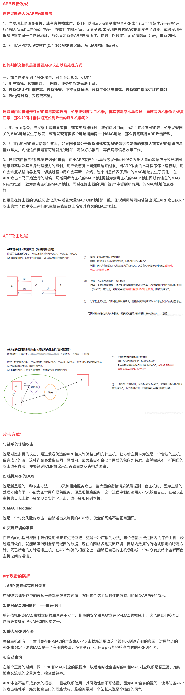

---

##### 8. **什么是SYN攻击？**

+ 攻击者短时间伪造不同 IP 地址的 SYN 请求报文，服务端每接收到一个 SYN 报文就进入 SYN_RCVD 状态，但服务端发送出去的 ACK + SYN 报文，无法得到未知 IP 主机的 ACK 应答，久而久之就会占满服务端的未连接队列，使得服务器不能为正常用户服务。

---

##### 9. **如何避免SYN攻击？**

+ 比如**降低SYN timeout时间**，使得主机尽快释放半连接的占用。

+ 当网卡接收数据包的速度大于内核处理的速度时，会有一个队列保存这些数据包。超出处理能时，对新的 SYN 直接回报 RST 复位包、丢弃连接。

+ **SYN cookie设置**，就是给每一个请求连接的IP地址分配一个Cookie，如果短时间内连续受到某个IP的重复SYN报文，就认定是受到了攻击，以后从这个IP地址来的包会被丢弃。31. **什么是SYN攻击？**

  + 攻击者短时间伪造不同 IP 地址的 SYN 请求报文，服务端每接收到一个 SYN 报文就进入 SYN_RCVD 状态，但服务端发送出去的 ACK + SYN 报文，无法得到未知 IP 主机的 ACK 应答，久而久之就会占满服务端的未连接队列，使得服务器不能为正常用户服务。

  ---

  ##### 32. **如何避免SYN攻击？**

  + 比如**降低SYN timeout时间**，使得主机尽快释放半连接的占用。
  + 当网卡接收数据包的速度大于内核处理的速度时，会有一个队列保存这些数据包。超出处理能时，对新的 SYN 直接回报 RST 复位包、丢弃连接。
  + **SYN cookie设置**，就是给每一个请求连接的IP地址分配一个Cookie，如果短时间内连续受到某个IP的重复SYN报文，就认定是受到了攻击，以后从这个IP地址来的包会被丢弃。

---

## 五.操作系统

+ linux 中查看监听网络端口命令，more和cat的区别

+ linux 改密码命令 改权限命令
+ 如何结束一个进程， -9 是什么含义、
+ ps的底层实现(我按照自己的理解，讲了一下PCB的机制，然后说大概是扫描了一下PCB的[链表](https://www.nowcoder.com/jump/super-jump/word?word=链表)，面试官好像挺满意的)。
+ 对于大文件，为什么CP比MV慢很多
+ 如果rm以及rm -f一个正在被使用的文件，会发生什么

---

### 1.操作系统基本知识

#### 基础知识

##### 1.讲一讲你理解的操作系统

+ 操作系统是管理和控制计算机硬件与软件资源的计算机程序，是直接运行在“裸机”上的最基本的系统软件，任何其他软件都必须在操作系统的支持下才能运行。
+ 要从操作系统发展的过程来能了解为什么需要有那些功能。
  + 最开始设计出的图灵机，利用控制器和穿孔卡片，可以将程序写在卡片上进行加法操作
  + 之后，冯诺依曼创造性地提出了存储程序思想，即五大模块，将程序存在内存里，利用指令指针取址，载入控制器进行执行，即单道程序。
  + 后来，为了避免IO操作耗费时间，提出多道程序交替执行，作业之间进行切换和调度，这边就引出了进程调度算法，以及怎样保存进程的上下文环境，切换回来可以继续执行。
  + 再后来，为了能让多人进行操作，提出分时系统的概念，而这就是并发的实现，核心还是任务切换；并且意识到了资源复用，于是提出虚拟内存的概念。利用内存交换和内存覆盖技术，让我们从逻辑上看起来内存变大了。以及怎么使用内存，避免内存碎片什么的，这边又提出了分页技术，页面置换算法等实现技术。
  + 然后慢慢得演变到了现在这样的操作系统。

---

##### 2.讲一讲你所认知的应用程序

所谓 应用程序，就是一个普通的文件，按照特定的格式(ELF)存储在磁盘上。操作系统可以进行加载和运行 。

---

##### 3. **冯诺依曼结构有哪几个模块?分别对应现代计算机的哪几个部分?**

+ 存储器：内存 
+ 控制器：南桥北桥 
+ 运算器：CPU 
+ 输入设备：键盘 
+ 输出设备：显示器、网卡

---

##### 4. **系统并发和并行，分得清吗?**

+ 并发是指宏观上在一段时间内能同时运行多个程序
+ 并行则指同一时刻能运行多个指令。
  + 并行需要硬件支持，如多流水线、多核处理器或者分布式计算系统。

> 操作系统通过引入进程和线程，使得程序能够并发运行。

##### 5. **局部性原理你知道吗?主要有哪两大局部性原理?各自是什么?**

+ 时间局部性：程序中的某条指令或者数据被访问过，不久之后该数据很可能再次被访问。(因为程序中存在大量的循环) 
+ 空间局部性：一旦程序访问了某个存储单元，在不久之后附近的存储单元也很有可能被访问。(因为很多数据在内存中都是连续存放的，并且程序的指令也是顺序地在内存中存放的)

---

##### 6. **ASCII、Unicode和UTF-8编码的区别?**

+ ASCII
  + ASCII 只有127个字符，表示英文字母的大小写、数字和一些符号
+ Unicode
  + Unicode将不同语言统一到一套编码格式中，通常两个字节表示一个字符，而ASCII是一个字节表示一个字符
  + 如果编译的文本是全英文的，用Unicode编码比ASCII编码需要多一倍的存储空间，在存储和传输上不划算
+ UTF-8
  + 为了解决上述问题，把Unicode编码转化为 **可变长编码** UTF-8编码，UTF-8编码将Unicode字符按数字大小编码为1-6个字节，英文字母被编码成一个字节，常用汉字被编码成三个字节

+ 三者关系：
  + 在计算机内存中，统一使用Unicode编码，当需要保存到硬盘或者需要传输的时候，就转换为UTF-8 编码
  + 用记事本编辑的时候，从文件读取的UTF-8字符被转换为Unicode字符到内存里，编辑完成后，保存的时候再把Unicode转换为UTF-8保存到文件。

---

##### 7.为什么要有用户态和内核态，哪些操作会是用户态切换到内核态

+ 操作系统按照特权等级，把进程的运行空间分为内核空间和用户空间，设置CPU 特权等级的 Ring 0 和 Ring 3。限制不同的程序之间的访问能力， 更安全。
  - 内核空间（Ring 0）具有最高权限，可以直接访问所有资源；
  - 用户空间（Ring 3）只能访问受限资源，不能直接访问内存等硬件设备，必须通过系统调用陷入到内核中，才能访问这些特权资源。

+ **用户态切换到内核态的3种方式**
  + 中断
    + 当外围设备完成用户请求的操作后，会向CPU发出相应的中断信号，这时CPU会暂停执行下一条即将要执行的指令转而去执行与中断信号对应的处理程序
  + 系统调用
    + 用户态进程通过系统调用，使用操作系统提供的服务程序完成工作，理论上还是利用中断
  + 异常
    + 当CPU在执行用户态程序时，发生了异常，这时会触发由当前运行进程切换到处理此异常的内核相关程序中，也就转到了内核态，比如缺页异常。

---

#### 中断

##### 1. Linux中异常和中断的区别

+ 中断是由硬件设备产生，通过中断控制器发送给CPU，CPU判断收到的中断来自于哪个硬件设备后发送给内核处理
+ 异常是由 CPU 执行指令的内部事件引起，如地址越界、算术溢出等。它会发送给内核处理
+ 相同点：
  + 最后都是由CPU发送给内核，由内核去处理 
  + 处理程序的流程设计上是相似的
+ 不同点：
  + 产生源不相同，中断是由硬件设备产生的，异常是由CPU产生的
  + 中断不是时钟同步的，这意味着中断可能随时到来；异常由于是CPU产生的，所以它是时钟同步的 
  + 当处理中断时，处于中断上下文中；处理异常时，处于进程上下文中

---

##### 2.软中断与硬中断的区别

+ 硬中断
  + 硬中断是由外部事件引起的因此具有随机性和突发性；
  + 硬中断的中断号是由中断控制器提供的
  + 硬中断是可屏蔽的
  + 硬中断处理程序要确保它能快速地完成任务，这样程序执行时才不会等待较长时间，称为上半部。

+ 软中断
  + 软中断是执行中断指令产生的，无面外部施加中断请求信号，因此中断的发生不是随机的而是由程序安排好的。
  + 软中断的中断号由指令直接指出，无需使用中断控制器。
  + 软中断不可屏蔽。
  +  软中断处理硬中断未完成的工作，是一种推后执行的机制，属于下半部。

---

##### 3.处理系统调用的流程

+ 当应用程序使用系统调用时，会产生一个中断。
+ 发生中断后， CPU 会中断当前在执行的用户程序，转而跳转到中断处理程序，也就是开始执行内核程序。
+ 内核处理完后，主动触发中断，把 CPU 执行权限交回给用户程序，回到用户态继续工作。

---

##### 4.系统调用的原理

+ 系统调用主要是通过中断门实现的，通过软中断int发出中断信号。
+  由于要支持的系统功能很多，不可能每个系统调用就占用一个中断向量。
+  所以规定了0x80为系统调用的中断向量号，在进行系统调用之前，向eax中写入系统调用的子功能号，再进行系统调用的时候，系统就会根据eax的值来决定调用哪个中断处理例程。

---

##### 5.中断处理机制的实现：

+ 设备产生中断，通过总线把电信号发送给中断控制器，处理器会立即停止它正在做的事，关闭中断系统，然后跳到内存中预定义的位置开始执行那里的代码。这个预定义的位置是由内核设置的，是中断处理程序的入口点。

---

##### 6.什么是中断控制器？

+ 个人理解是可以接收多个外部中断源的中断请求，并进行优先级判断，选中当前优先级最高的中断请求，并将此请求送到CPU。当CPU响应中断并进入中断服务程序的处理过程后，中断控制器仍负责对外部中断请求的管理。

---

##### 7.介绍一下系统调原理

+ 系统调用主要是通过中断门实现的，通过软中断int发出中断信号。 
+ 由于要支持的系统功能很多，不可能每个系统调用就占用一个中断向量。 所以规定了0x80为系统调用的中断向量号，在进行系统调用之前，向eax中写入系统调用的子功能号，再进行系统调用的时候，系统就会根据eax的值来决定调用哪个中断处理函数。

---

##### 8.什么是中断处理函数？

在响应一个特定中断的时候，内核会执行一个函数，该函数叫中断处理程序。产生中断的每个设备都有一个相应的中断处理程序。**一个设备的中断处理程序是它设备驱动程序的一部分。**

+ 中断处理程序与其他内核的真正区别在于：中断处理程序是被内核调用来响应中断的，而它们运行于我们称之为中断上下文的特殊上下文中。

---

#### 应用知识

##### 1.键盘敲入字符后，操作系统发生了哪些事情？

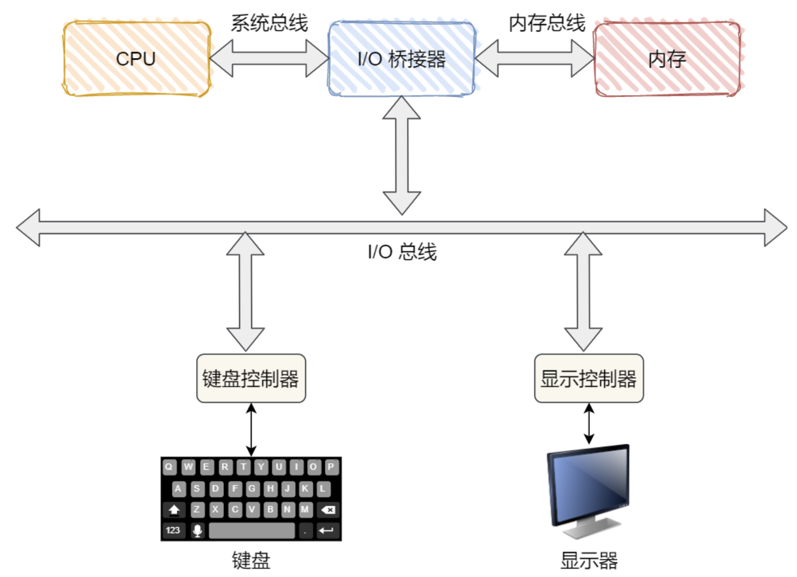

+ 那当用户输入了键盘字符，**键盘控制器** 就会产生扫描码数据，并将其缓冲在键盘控制器的寄存器中，紧接着键盘控制器通过 **总线** 给 CPU 发送 **中断请求** 。

+ CPU 收到中断请求后，操作系统会保存被中断进程的 **CPU** 上下文，然后调用键盘的 **中断处理程序** 

  >  键盘的 **中断处理程序** 是在 **键盘驱动程序** 初始化时注册的 。

+ 键盘 **中断处理函数** 的功能就是 **从键盘控制器的寄存器的缓冲区读取扫描码，再根据扫描码找到用户在键盘输入的字符，如果输入的字符是显示字符，那 就会把扫描码翻译成对应显示字符的 ASCII 码，比如用户在键盘输入的是字母 A，是显示字符，于是就会把扫描码翻译成 A 字符的 ASCII 码。**

+ 得到了显示字符的 ASCII 码后，就会把 ASCII 码放到 **「读缓冲区队列」** ，显示设备的驱动程序会定时从「读缓冲区队列」读取数据放到「写缓冲区队列」，最后把「写缓冲区队列」的数据写入显示设备控制器的寄存器中的数据缓冲区，最后将这些数据显示在屏幕上。

+ 显示出结果后，恢复被中断进程的上下文。

> + 键盘控制器是计算机内部的一种集成电路，用来接收来自键盘的输入 并将其传输到CPU ，然后再由CPU将其传递给操作系统进行解释，当键盘控制器接收到来自键盘或类似输入设备的信号时，它会产生一个被称为中断的信号，使CPU暂时停止执行，以便处理键盘控制器发送的信号。
> + 在响应一个特定中断的时候，内核会执行一个函数，该函数叫中断处理程序。产生中断的每个设备都有一个相应的中断处理程序。**一个设备的中断处理程序是它设备驱动程序的一部分。**
>   + 中断处理程序与其他内核的真正区别在于：中断处理程序是被内核调用来响应中断的，而它们运行于我们称之为中断上下文的特殊上下文中。

---

##### 2.运行helloworld程序，操作系统做了哪些事情？

+ 要启动程序执行，比如Windows上点击hello world.exe文件，告知操作系统来运行

+ （操作系统）操作系统接到请求后，就会根据文件名，到磁盘上找到hello world程序的相关信息，检查其类型是否是可执行文件；并通过程序首部信息， 确定代码和数据在可执行文件中的位置并计算出对应的磁盘块地址

  > linux ELF,  windows PE 

+ （操作系统）为了执行这个hello world程序，创建一个新的进程，并将hello world可执行文件格式映射到该进程结构，表示由该进程执行hello world程序

+ （操作系统）操作系统为hello world程序设置CPU上下文环境，并跳到程序开始处，准备执行这个程序，下一个指令周期，就是执行hello world程序

+ （CPU）**假设调度程序正好选中hello world程序**，操作系统把控制权交给了调度程序，执行hello world程序的第一条指令。程序在执行的时候，先要把程序的代码和数据读入内存，CPU才能执行，但是hello world的代码和数据还没有读入内存，就会产生缺页异常，硬件机制就会捕获缺页异常，并且把控制权交给操作系统

+ （操作系统）操作系统的内存管理模块就会分配一页空闲的物理内存，并且根据前面计算出的磁盘块地址把hello world程序的代码从磁盘读入内存，然后继续执行hello world程序，有的时候程序很大，一页内存还不够，因此在执行过程中会多次地产生缺页异常，然后从磁盘读入程序到内存

+ （CPU）hello world程序执行puts函数（系统调用，由操作系统完成），在显示器上写（显示）一字符串

+ （操作系统）找到要将字符串送往的显示设备，通常设备是由一个进程控制的，操作系统将要写的字符串送给该进程

+ （操作系统）控制设备的进程告诉设备的窗口系统它要显示字符串，窗口系统确定这是一个合法的操作，然后将字符串转换成像素，将像素写入设备的存储映像区

+ 视频硬件将像素转换成显示器可接收的一组控制/数据信号，显示器解释信号，激发液晶屏，屏幕上看到“hello world”

---

##### 3.打开电源后，操作系统干了哪些事情？

+  **第一阶段：加载BIOS**

  + 当打开计算机电源，计算机会首先加载基本输入输出系统（Basic Input Output System ）BIOS系统。
  + BIOS程序存放在主板ROM(只读存储芯片)之中、即使在关机或掉电以后该程序也不会丢失。其中包含了CPU的相关信息、设备启动顺序信息、硬盘信息、内存信息、时钟信息等等，之后，计算机就知道应该去读取哪个硬件设备了

+  **第二阶段：读取主引导记录**

  + 读取硬盘上磁道的第一个扇区，即Master Boot Record即主引导记录、它的大小是512字节，里面却存放了预启动信息、分区表信息。
  + 系统找到BIOS所指定的硬盘的主引导记录后，就会将其复制到特定地址（0×7c00地址）的物理内存中。

+  **第三阶段：GRUD引导**

  + 在操作系统内核运行之前，运行Boot Loader 。通过它来初始化硬件设备、建立内存空间的映射图，从而将系统的软硬件环境带到一个合适的状态，以便为最终调用操作系统内核做好一切准备；Grub、Lilo是常见的Boot Loader

    > Boot Loader有若干种，其中Grub、Lilo和spfdisk是常见的Boot Loader（一段小程序）。系统读取内存中的grub配置信息,并依照此配置信息来启动不同的操作系统。

+  **第四阶段：加载内核**

  + 根据grub设定的内核映像所在路径，系统读取内存映像，并进行解压缩操作。此时，屏幕一般会输出 “Uncompressing Linux” 的提示。 当解压缩内核完成后，屏幕输出“OK, booting the kernel”。
  + 系统将解压后的内核放置在内存之中，并调用start_kernel()函数来启动一系列的初始化函数并初始化各种设备，完成Linux核心环境的建立。至此，Linux内核已经建立起来了，基于Linux的程序应该可以正常运行了。

+  **最后阶段：读取程序进行登录**

  + 内核加载成功后，第一个运行的程序是/sbin/init。它根据配置文件（Debian系统是/etc/initab）产生init进程。这是Linux启动后的第一个进程，pid进程编号为1，其他进程都是它的后代。
  + 然后，init线程加载系统的各个模块，比如窗口程序和网络程序，直至执行/bin/login程序，跳出登录界面，等待用户输入用户名和密码。

---

### 2.进程与线程

#### 进程与线程知识

##### 1. ==**进程，线程和协程的区别和联系**==

+ 定义：
  + 进程： 进程是在内存中运行着的程序，是资源分配和拥有的基本单位
  + 线程：线程是轻量级的进程，是最小的执行单位
  + 协程：用户态的轻量级线程，线程内部调度的基本单位
+ 区别：
  1. **切换情况：**
     + 进程：进程CPU环境的保存以及 新调度的进程CPU环境的设置 ；涉及栈、寄存器、页表和文件句柄等
     + 线程：保存和设置程序计数器，少量寄存器和栈的内容
     + 协程：先将寄存器上下文和栈保存，等切换回来的时候再进行恢复
  2. **切换者**
     + 进程：操作系统
     + 线程：操作系统
     + 协程：用户
  3. **切换过程**
     + 进程：用户态—>内核态—>用户态
     + 线程：用户态—>内核态—>用户态
     + 协程：只有用户态
  4. **调用栈**
     + 进程：内核栈
     + 线程：内核栈
     + 协程：用户栈
  5. **拥有资源**
     + 进程：CPU资源，内存资源，文件资源，句柄等
     + 线程：程序计数器，寄存器，栈等
     + 协程：自己的寄存器上下文和栈
  6. **系统开销**
     + 进程：切换涉及到虚拟地址空间，内核栈与硬件上下文，开销较大
     + 线程：切换时只需保存和设置少量的寄存器内容，开销较小
     + 协程：直接操作栈则基本没有内核切换的开销，可以不加锁访问全局变量，所以上下文切换非常快
  7. **通信方面**
     + 进程：需要借助操作系统内核
     + 线程：线程间通信只需直接读写进程数据段，如全局变量来进行通信
     + 协程：共享内存，消息队列等

---

##### ==2. **线程与进程的比较**==

+  进程： 进程是在内存中运行着的程序，是资源分配和拥有的基本单位
+  线程：线程是轻量级的进程，是最小的执行单位
+  对比：
   +  **调度：**
      +  线程是调度的基本单位(PC程序计数器，状态码，通用寄存器，线程栈及栈指针);
      +  进程是拥有资源的基本单位(打开文件，堆，静态区，代码段等)。  
   +  **拥有资源:**
      +  线程不拥有系统资源，进程内线程可以共享隶属进程的资源;
      +  进程是拥有资源的独立单位。 
   +  **系统开销:**
      +  线程创建销毁只需要处理的 程序计数器PC值，状态码，通用寄存器值，线程栈及栈指针 即可;
      +  进程创建和销毁需要重新分配及销毁进程控制块task_struct结构。

---

##### 3. **进程被分配哪些资源**

+ 每个进程分配4G的虚拟内存，以及进程控制块。而task_struct就是存储在这1G的内核系统空间中。

+ 每个进程在内核中都有一个进程控制块(PCB)来维护进程相关的信息，Linux内核的进程控制块是 task_struct结构体。
+ **PCB**内部重要成员
  1. 进程标识符
  2. 进程当前状态
  3. 进程优先级
  4. 进程资源清单
  5. 进程相应的程序和数据地址，以便把PCB与其程序和数据联系起来。
  6. 进程同步与通信机制等等

---

##### 4. 进程的创建方法

1. fork函数

   ```c++
   #include<unistd.h> 
   pid_t pid = fork();
   ```

   + 子进程采用 写时复制(**copy on writte**) ，复制父进程的数据(堆数据、栈数据和静态数据)。 只有在进程(父/子进程)对数据执行了写操作时，复制才会发生(先是缺⻚中断，然后操作系统给子进程分配内存并复制父进程的数据)
   + 创建子进程后，父进程中打开的文件描述符默认在子进程中也是打开的，文件描述符的引用计数加1。用户根目录、当前工作目录等变量的引用计数均会加1。
   + fork之后与父进程不同的内容
     + fork的返回值不同
     + 进程ID不同 
     + 这两个进程的父进程ID不同
     +  子进程不继承父进程设置的文件锁
     + 子进程的未处理信号集设置为空集
   
2.  vfork函数

   + vfork函数的调用序列和返回值与fork相同，但两者的语义不同。
   +  vfork函数用于创建一个新进程，目的是exec一个新程序。但是它 **并不将父进程的地址空间完全复制到子进程中，因为子进程会立即调用exec(或exit)** ，于是也就不会引用该地址空间。 不过在子进程调用exec或exit之前，它在父进程的空间中运行。
   + vfork和fork之间的另一个区别是: **vfork**保证子进程先运行，在它调用**exec**或**exit**之后父进程才可能被调度运行，当子进程调用这两个函数中的任意一个时，父进程会恢复运行。

---

##### 6. 你知道哪些替换进程映像的函数？

1. exec系列函数
   + exec只是用磁盘上的一个新程序替换了当前进程的正文段、数据段、堆段和栈段
   + exec函数是不返回的，除非出错。它出错时返回-1，并设置errno。 
   + 如果没出错，则原程序中exec调用之后的代码都不会执行，原程序被exec的参数指定的程序完全替换(包括代码和数据)。

2. system函数
   + system是调用shell执行你的命令，system=fork+exec+waitpid，执行完毕之后，回到原先的程序中去。继续执行下面的部分。
     + 如果用exec调用，首先应该fork一个新的进程，然后exec.
     + system不需要再fork新进程，已经封装好了。优点：进行了所需的各种出错处理以及各种信号处理

---

##### <font color= red>7. 你知道exec函数族吗？</font>

有7种不同的exec函数可供使用，它们常常被统称为exec函数.

```c++
#include<unistd.h>
int execl(const char* pathname, const char* arg0, ... /*(char*)0*/);
int execv(const char* pathname, char* const argv[]);
int execle(const char* pathname, const char* arg0,... /*(char*)0, char*const envp[] */ );
int execve(const char* pathname, char* const argv[], char* const envp[]);
int execlp(const char* filename, const char* arg0, .../*(char*)0*/);
int execvp(const char* filename, char* const argv[]);
int fexecve(int fd, char* const argv[], char* const envp[]);
//所有函数失败返回-1，成功不返回
```

> 述exec系列函数底层都是通过execve系统调用实现

**函数间的区别：**

+ **参数区别：**

  + 前4个函数取路径名作为参数
  + 后两个函数则取文件名作为参数
  + 最后一个取文件描述符作为参数。

+ **参数表的传递 (l表示列表list，v表示矢量vector，p表示path，e表示)：**

  + 函数execl、execlp和 execle要求将新程序的每个命令行参数都说明为一个单独的参数。这种参数表以空指针结尾。
  + 另外4个函数( execv、 execvp、execve和 fexecve)，则应先构造一个指向各参数的指针数组，然后将该数组地址作为这4个函数的参数。

  > + 字母p表示函数取filename作为参数，而且用PATH环境变量寻找可执行文件
  > + 字母l表示该函数取一个参数表，与v互斥
  > + v表示函数取一个argv[]矢量
  > + 字母e表示该函数取envp[]数组，而不使用当前环境

---

##### 8.线程的创建方法

新增的线程可以通过调用**pthread_create**函数创建。

```c++
#include <pthread.h>
int pthread_create(pthread_t* thread,
                   const pthread_attr_t *attr,
                   void *(*start_rtn)(void *),
                   void * arg); 
//返回值:若成功，返回0;否则，返回错误编号
```

- pthread_t：当前Linux中可理解为：`typedef unsigned long int pthread_t`;
- tidp：传出参数，保存创建的线程ID
- attr：通常传NULL，表示使用线程默认属性。若想使用具体属性也可以修改该参数。
- start_rtn ：函数指针，指向线程主函数(线程体)，该函数运行结束，则线程结束。
- arg：线程主函数执行期间所使用的参数。

```c++
#include "apue.h"
#include <pthread.h>

pthread_t ntid;

void printids(const char *s) {
    pid_t		pid;
    pthread_t	tid;
    pid = getpid();
    tid = pthread_self();
    printf("%s pid %lu tid %lu (0x%lx)\n", s, (unsigned long)pid, (unsigned long)tid, (unsigned long)tid);
}

void * thr_fn(void *arg) {
    printids("new thread: ");
    return((void *)0);
}

int main(void){
    int	err;
    err = pthread_create(&ntid, NULL, thr_fn, NULL);
    if (err != 0)
      	err_exit(err, "can't create thread");
    printids("main thread:");
    exit(0);
}
```

---

##### 线程共享和独享的资源是哪些？

+ 共享的资源有
  + 堆  new出来的都是共享的
  + .bss和.data段——全局变量等
  + .txt 代码段
  + 文件等资源

+ 独享的资源有
  + 程序计数器：程序计数器存放当前线程正在执行的字节码的行号。字节码解释器通过改变计数器的值来获取下一条要执行的字节码。
  + 栈
  + 寄存器

##### ==9.线程上下文切换的是什么?==

+ 得看线程是不是属于同一个进程：
  + 不属于同一个进程，则切换的过程就跟进程上下文切换一样;
  + 属于同一个进程，因为虚拟内存在线程间是共享的，所以在切换时，只需要切换线程的私有数据、寄存器等不共享的数据;
+ 线程的上下文切换相比进程，开销要小很多。

---

##### ==10.用户态线程与内核态线程各有什么优势？==

+ 用户线程(**User Thread**)：在用户空间实现的线程，不由内核管理；多对一模型，即多个用户线程对应同一个内核线程
  + 优点：
    + 无需用户态与内核态的切换，所以速度特别快;
  + 缺点：
    + 操作系统不参与线程的调度，如果一个线程发起了系统调用而阻塞，那进程所包含的用户线程都不能执行了。
    + 由于时间片分配给进程，每个线程得到的时间片较少，执行会比较慢;

+ 内核线程(**Kernel Thread**)：在内核中实现的线程，由内核管理；一对一模型
  + 优点：
    + 在一个进程当中，如果某个内核线程发起系统调用而被阻塞，并不会影响其他内核线程的运行;
    + 时间片分配给线程，多线程的进程获得更多的 CPU 运行时间;
  + 缺点：
    + 线程的创建、终止和切换都是通过系统调用的方式来进行，因此对于系统来说，系统开销比较大;
+ 轻量级线程：两个模型混搭一起，就形成 M:N 模型
  + 综合各自的优点，大部分的线程上下文切换发生在用户空间，且多个线程又可以充分利用多核 CPU 的资源。

---

##### ==11.**多进程和多线程的区别是什么?换句话说，什么时候该用多线程，什么时候该用多进程?**==

多进程的创建更消耗系统资源，不过运行相对于多线程更安全，因为多线程是共享所隶属进程的资源，所以多数情况下都要加锁，但线程同步与互斥也比较简单。但多进程间的通信相比于多进程就麻烦很多，大多都要通过内核来实现。

+ 频繁创建销毁：需要频繁创建和销毁的优先使用多线程
+ 计算量大：需要大量计算的优先使用多线程， 因为需要消耗大量CPU资源且切换频繁
+ 相关性：任务间相关性比较强的用多线程，因为线程之间的数据共享和同步比较简单。
+ 多分布：可能要扩展到多机分布的用多进程。

但是实际中更常见的是进程加线程的结合方式，并不是非此即彼的。

---

##### 12. 线程的回收方法

+ pthread_join用于 阻塞等待线程退出，获取线程退出状态。 其作用对应进程中 waitpid() 函数。

  ```c++
  #include <pthread.h>
  int pthread_join(pthread_t thread, void **rval_ptr); //返回值:若成功，返回0;否则，返回错误编号
  ```

+ 参数:

  + **thread**:线程ID (【注意】:不是指针，非传出参数);

  + **retval**:存储线程结束状态。传出参数

+ 调用该函数的线程将挂起等待，直到id为thread的线程终止。thread线程以不同的方法终止，通过 pthread_join得到的终止状态是不同的

---

##### 13.线程分离方式

+ pthread_detach 实现实现线程分离

  ```c++
  #include <pthread.h>
  int pthread_detach(pthread_t tid); //返回值:若成功，返回0;否则，返回错误编号
  ```

+ 指定线程分离状态，线程主动与主控线程断开关系。 线程结束后，其退出状态不由其他线程获取，直接自己自动释放

+ 对一个已经处于 **detach** 状态的线程调用 **pthread_join** ，这样的调用将返回 **EINVAL** 错误。

---

##### 14.线程取消方式：

+ pthread_cancel函数可以杀死(取消)线程。其作用，对应进程中 kill() 函数。

  ```c++
  #include <pthread.h>
  int pthread_cancel(pthread_t tid); //返回值:若成功，返回0;否则，返回错误编号
  ```

---

##### 15.线程退出的方式：

1. Return：返回到调用者那里去，从**main**函数**return**相当于调用**exit**。 
2. 线程可以调用**pthread_cancel**终止同一进程中的另一个线程。
3. 线程可以调用**pthread_exit**终止自己。

>  多线程环境尽量少用或不使用exit函数，应使用pthread_exit，将单个线程退出。任何线程调用exit会导致进程退出，其他线程未工作结束，主控线程退出时不能return或exit。

---

##### ==16.**你知道哪些进程？**==

+ 孤儿进程：

  + 父进程已经终止的进程**,**它们的父进程都改变为**init**进程。这些进程自身变成孤儿进程，被init进程收养。

  > 由init进程收养的进程终止时不会成为僵尸进程。init被编写成无论何时只要有一个子进程终止，init就会调用 一个wait函数取得其终止状态。

+ 僵尸进程：

  + 一个已经终止、但是其父进程尚未对其进行善后处理(获取终止子进程的有关信息、释放它仍占用的资源)的进程被称为僵尸进程(zombie)，终止进程的残留资源(PCB)存放于内核中
  
+ 守护进程：

  + 是 Linux 的一种⻓期运行的后台服务进程 ，也称「精灵进程」。常⻅的 httpd、 named、sshd 等服务都是以守护进程 Daemon 方式运行的

---

##### 17.处理僵尸进程的方法

<div align = center></div>

<div align = center></div>

+ 处理僵尸进程：当一个进程结束时，它将给其父进程发送SIGCHLD信号。在父进程中捕获SIGCHLD信号，并在信号处理函数中调用waitpid函数以“彻底结束”一个子进程.

> 特别注意，僵尸进程是不能使用kill命令清除掉的。因为kill命令只是用来终止进程的，而僵尸进程已经终止。
>
> + 如果父进程没有调用wait、waitpid，怎么杀死僵尸进程
>   + 查看进程：ps -ef | grep defunct ： 1 running, 94 sleeping, 0 stopped, **0 zombie**
>   + 一般僵尸进程很难直接kill掉，可以kill僵尸父进程。父进程死后，僵尸进程成为”孤儿进程”，过继给1号进程init，init始终会负责清理僵尸进程．它产生的所有僵尸进程也跟着消失。
>   + ps -e -o ppid,stat | grep Z | cut -d " " -f2 | xargs kill -9

---

##### 18.**进程终止的几种方式**

+ 5种正常终止

  1. 从main返回

     > 等效于调用exit。

  2. 调用exit (先执行一些清理操作再进入内核)

     >  操作包括调用各终止处理程序，然后关闭所有标准I/O流。

  3. 调用 \_exit 或 \_Exit (立即进入内核) 

     > + 为进程提供一种无需运行终止处理程序或信号处理程序而终止的方法。
     >
     > + 三个都带有退出状态, exit status 

  4. 最后一个线程从其启动例程返回

  5. 从最后一个线程调用 pthread_exit

+  3种异常终止

  1. 调用 abort 

     > 产生SIGABRT信号，下一种异常终止的特例

  2. 接到一个信号

     >  信号可由进程自身，其他进程或内核产生

  3. 线程调用 pthread_cancel 函数

     >  一个线程要求取消另一个线程，若干时间后，目标线程终止

---

##### ==19.**进程组、作业和会话**==

+ 进程组：每个进程都会属于一个进程组，进程组包含一个或多个进程。进程组有进程组长，组长的进程 ID 是进程组 ID (PGID)

  ```c
  $ ps -o pid,pgid,ppid,comm | cat
    PID  PGID  PPID  COMMAND
  10179  10179 10177 bash
  10263  10263 10179 ps
  10264  10263 10179 cat
  ```

  + 下边通过简单的示例来理解进程组

    - bash：进程和进程组ID都是 10179，父进程其实是 sshd(10177)
    - ps：进程和进程组ID都是 10263，父进程是 bash(10179)，因为是在 Shell 上执行的命令
    - cat：进程组 ID 与 ps 的进程组 ID 相同，父进程同样是 bash(10179)

  + 容易理解 Bash 就是Shell进程，Shell 父进程是 sshd；ps 与 cat 通过管道符号一起运行，属于一个进程组，其父进程都是 Bash；一个进程组也被称为「作业」。

+ 会话

  +  **多个进程组构成一个「会话 」**，建立会话的进程是会话的领导进程，该进程 ID 为会话的 SID。 **会话中的每个进程组称为一个「作业」** 。会话可以有一个进程组称为会话的「前台作业」，其它进程组为「后台作业」
  + 一个会话可以有一个控制终端，当控制终端有输入和输出时都会传递给前台进程组，比如`Ctrl + Z`。**会话的意义在于能将多个作业通过一个终端控制，一个前台操作，其它后台运行。**

---

##### ==20.**什么是惊群效应**==

+ 惊群现象就是多进程（多线程）在同时阻塞等待同一个事件的时候（休眠状态），当等待的事件发生，它会唤醒等待的所有进程（或者线程），但是最终却只可能有一个进程（线程）获得这个事件的“控制权”，其他进程（线程）获取失败，只能重新进入休眠状态，这种现象和性能浪费就叫做惊群。
+ 现象的影响：
  + 这种效应使得系统对用户进程/线程频繁地做无效的调度，上下文切换，系统性能大打折扣。
  + 而且为了确保只有一个线程得到资源，用户必须对资源操作进行加锁保护，进一步加大了系统开销。
+ 例子：
  + Linux 2.6 之前。 主进程创建了socket、bind、listen之后，fork() 出来多个进程，每个子进程都开始循环处理（accept）这个listen_fd。 每个进程都阻塞在accept上，当一个新的连接到来时候，所有的进程都会被唤醒，但是其中只有一个进程会接受成功，其余皆失败，重新休眠。
  + Linux 2.6 之后的版本，Linux内核已经解决了accept（）函数的“惊群”现象，大概的处理方式就是，当内核接收到一个客户连接后，只会唤醒等待队列上的第一个进程（线程），所以如果服务器采用accept阻塞调用方式，在最新的linux系统中已经没有“惊群效应”了

---

##### 21.一个进程可以创建多少个线程？和什么有关系？

+ 一个进程可以创建的线程数由可用虚拟空间和线程的栈的大小共同决定。

+ 如果一个进程可用虚拟空间是2G，线程的栈的大小是1MB，理论上最多创建2048个线程。如果创建多于2048的话，必须修改编译器的设置，减少线程栈大小。


---

##### ==22.介绍一下进程的上下文切换==

+ 进程是由内核管理和调度的，所以进程的切换只能发生在内核态。进程的上下文切换不仅包含了虚拟内存、栈、全局变量等用户空间的资源，还包括了内核堆栈、寄存器等内核空间的资源。
+ 比如CPU运行进程1阻塞时，切换进程2进行运行，会把进程1  上下文信息保存在PCB中，CPU 中加载 进程2 的上下文进行执行.

---

##### ==23.进程上下文切换有哪些场景==

1. 时间片轮转时，当前运行的进程时间片使用结束，就从 **运行状态** 变为 **就绪状态** ，系统从就绪队列选择另外一个进程运行
2. 进程在系统资源不足(内存不足)，要等到资源满足后才可以运行，这时进程会被挂起，并由系统调度其他进程运行;
3. 当有优先级更高的进程运行时，为了保证高优先级进程的运行，当前进程会被挂起，由高优先级进程来运行;
4. 发生中断时，CPU 上的进程会被中断挂起，转而执行内核中的中断服务程序;

---

#####  ==24.介绍一下进程状态的切换==

+ 新建态： 进程刚刚被创建时没有被提交的状态
+ 终止态：进程已结束运行，回收除进程控制块之外的其他资源，并让其他进程从进程控制块中收集有关信息（将退出状态传递给父进程）

+ 就绪状态(ready)：等待被调度 
+ 运行状态(running)：运行态转变为阻塞态是进程自身主动请求的，比如进行 **系统调用** 。
+ 阻塞状态(waiting)：**不能由阻塞态之间转换为运行态。**处于阻塞态的进程需要先转换为就绪态才能够被调度

> 只有就绪态和运行态可以相互转换，其它的都是单向转换。
>
> + 就绪状态的进程通过调度算法从而获得 CPU 时间，转为运行状态；
>
> + 运行状态的进程，在分配给它的 CPU 时间片用完或者缺少所需资源就会转为就绪状态，等待下一次调度。
>
>   > 资源不包括 CPU 时间

---

##### 25.**共享是什么?**

+ 共享是指系统中的资源可以被多个并发进程共同使用。
+ 有两种共享方式:
  + 互斥共享
  + 同时共享

+ 互斥共享的资源称为临界资源，例如打印机等，在同一时刻只允许一个进程访问，需要用同步机制来实现互斥访问。

---

##### 26.**终端退出，终端运行的进程会怎样**

+ 终端在退出时会发送SIGHUP给对应的bash进程，bash进程收到这个信号后首先将它发给 session会话 下面的进 程，如果程序没有对SIGHUP信号做特殊处理，那么进程就会随着终端关闭而退出

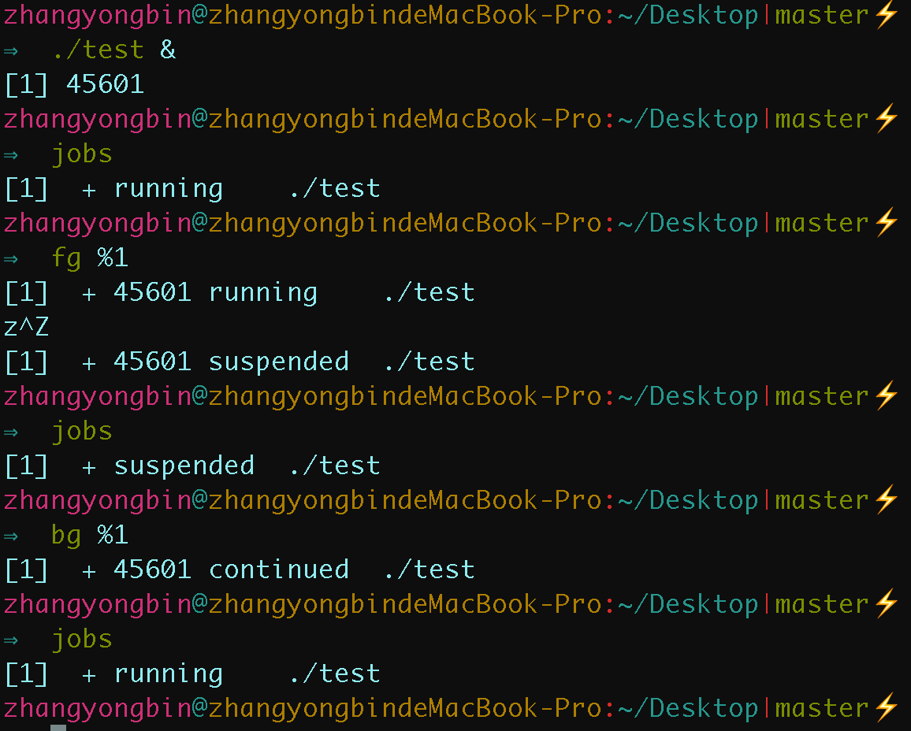

1. & ：将任务放到后台执行
2. ctrl + z：可以将一个正在前台执行的命令放到后台，并且暂停
3. jobs：查看当前有多少在后台运行的命令
4. fg：用 fg %jobnumber将选中的命令调出在前台执行，%jobnumber是通过jobs命令查到的后台正在执行的命令的序号(不是pid)
5. bg：用bg %jobnumber将选中的命令调出继续执行，%jobnumber是通过jobs命令查到的后台正在执行的命令的序号(不是pid)

---

##### 27.==**如何让进程后台运行**==

1. 命令后面加上&即可，实际上，这样是将命令放入到一个作业队列中了
2. nohup +命令 +  &，将标准输出和标准错误缺省被重定向到 nohup.out 文件中，但是需要正常退出，如使用exit，直接关闭终端会杀死进程
3. 写成守护进程

---

##### ==28.CPU/进程**调度算法你了解多少?**==

1. 先来先服务：非抢占式的调度算法，按请求顺序进行调度。有利于长作业，不利于短作业，短作业必须等待前面的长作业执行完毕才能执行
2. 短作业优先：非抢占式的调度算法，按估计运行时间最短的顺序进行调度。长作业有可能会饿死，处于一直等待短作业执行完毕的状态。
3. 最短剩余时间优先：最短作业优先的抢占式版本，按剩余运行时间的顺序进行调度。 
4. 优先级调度：为每个进程分配一个优先级，按优先级进行调度。
   + 为了防止低优先级的进程永远等不到调度，可以随着时间的推移增加等待进程的优先级。
5. 时间片轮转：
   + 将所有就绪进程按 FCFS 的原则排成一个队列，每次调度时把 CPU 时间分配给队首进程，该进程可以执行一个时间片。 当时间片用完时，由计时器发出时钟中断，调度程序便停止该进程的执行，并将它送往就绪队列的末尾，同时继续把 CPU 时间分配给队首的进程。这种每个时间片都切换会影响系统性能。
6. 多级反馈队列：可以看成是时间片轮转调度算法和优先级调度算法的结合。
   +  多级反馈队列设置了多个队列，每个队列时间片大小都不同，例如 1,2,4,8,..。进程在第一个队列没执行完，就会被移到下一个队列。

---

#### 进程间通信

##### 29.==进程同步的方法==

+ 进程同步就是控制多个进程按一定顺序执行，前提是进程间能相互告知先后顺序，所以需要利用进程间通信来实现。
+ 进程同步是一种目的，通过进程通信传输一些进程同步所需要的信息来这实现。

---

##### 31.==Linux下进程通信方式==

+ 管道
  + 无名管道：半双工通信方式，数据只能单向流动，而且只在具有亲缘关系的进程(父子)之间使用。
  + 有名管道：半双工的通信方式，允许在没有亲缘关系的进程之间使用，管道是先进先出的通信方式。
+ 消息队列：有消息的链表，存放在内核中并由消息队列标识符标识。它克服了信号传递信息少、管道只能承载无格式字节流以及缓冲区大小受限等缺点。
+ 共享内存：映射一段能被其他进程所访问的内存，这段共享内存由一个进程创建，但多个进程都可以访问。
  + 共享内存是最快的IPC方式，是针对进程间通信方式运行效率低而专门设计的。往往与信号量，配合使用来实现进程间的同步和通信。
+ 信号：用于通知接收进程某个事件已经发生，比如按下ctrl + C就是信号。
+ 信号量：是一个计数器，可以用来控制多个进程对共享资源的访问。常作为一种锁机制，实现进程、线程的对临界区的同步及互斥访问。
+ 套接字：适用于不同机器间进程通信，在本地也可作为两个进程通信的方式。

---

##### 32.你知道POSIX 与 System V的区别吗？

+ Posix是Portable Operating System Interface(可移植性操作系统接口)的简称，是IEEE 开发的一系列标准，目的是为运行在不同操作系统的应用程序提供统一的接口，实现者是不同的操作系统内核。
+ System V 是UNIX系统升级到第五版本(System V)的时候制定的，原先只有管道，第五代添加了消息队列，信号量，共享内存。
  + System V IPC不会自动删除，删除方法如下:
    + 重启OS 进程结束时
    + 调用API来进行删除 
    + 使用ipcrm命令来进行删除
      + 查看使用情况: `ipcs -a`
      + 删除共享内存:
        + `ipcrm -M key` 。按照key值来进行删除
        + `ipcrm -m msgid `。按照标识符进行删除
      +  删除消息队列:
        + `ipcrm -Q key` 按照key值来进行删除
        + `ipcrm -q msgid `按照标识符进行删除 
      + 删除信号量:
        	+ `ipcrm -S key` 按照key值来进行删除
        	+ `ipcrm -s msgid` 按照标识符进行删除

---

##### 33.简单介绍一下管道通信

+ 默认是匿名管道，最基本的IPC机制

  + 通过pipe函数创建两个文件描述符，父进程利用fd[1]进行写，将数据流入管道，子进程利用fd[0]进行读，将数据从管道流出，实现进程间通信。

+ 管道的原理: 内核使用环形队列机制，借助内核缓冲区(4k)实现。

+ 管道的局限性：

  + **采用半双工通信方式，数据只能在一个方向上流动。**
  + **只能在有公共祖先的进程间使用管道。**
  + **数据一旦被读走，数据便不在管道中存在。**

+ API 函数：

  ```c++
   #include <unistd.h>
  int pipe(int fildes[2]);
  //成功：0；失败：-1，设置errno
  ```


---

##### 34.简单介绍一下命名管道函数FIFO

+ 允许在没有亲缘关系的进程之间使用，要打开已存在的FIFO或创建新的FIFO，应先调用mkfifo，检查是否返回EEXIST错误，若返回该错误则改为调用open

+ API函数：

  ```c++
  #include<sys/types.h>
  #include<sys/stat.h>
  int mkfifo(const char *pathname,  mode_t mode);
  //pathname：一个普通的UNIX路径名，是该FIFO的名字
  // mode：指定文件权限位，类似于open的第二个参数
  //成功：0；失败：-1，设置errno
  ```

---

##### 35.简单介绍一下消息队列

+ 消息队列是内核创建的用于存放信息的链表。进程间通过操作同一个消息队列实现进程间的通信。

+ 每个消息由两个部分组成：
  + 消息编号(类型)：用于识别消息
  + 消息正文：真正的信息内容

+ 优缺点：

  + 优点：
    + 方便简单

    + 容易实现网状交叉通信，这对于管道来说是特别困难的。

  + 缺点：
    + 不能实现大规模数据的通信，对于大规模的通信还是需要利用"共享内存"来进行实现

+ 主要用到的API函数

  ```c++
  #include<sys/types.h>
  #include<sys/ipc.h>
  #include<sys/msg.h>
  key_t ftok(const char* pathname, int proj_id);//ftok 函数利用存在的路径名与整型数生成 key ，提供给msgget函数
  int msgget(key_t key, int msgflg); //创建，或者获取一个消息队列。
  int msgsnd(int msqid, const void *msgp, size_t msgsz, int msgflg);//发送消息到消息队列上
  ssize_t msgrcv(int msqid, void *msgp, size_t msgsz, long msgtyp, int msgflg);//接收消息，从消息队列中取出特定编号的消息
  int msgctl(int msqid, int cmd, struct msqid_ds *buf);//cmd指定的要求，去控制消息队列。
  ```

---

##### 36.==你知道共享内存吗？说一说你知道的内容==

+ 将一个文件或者其他对象映射到进程的地址空间，实现文件磁盘地址和进程虚拟地址空间中一段虚拟地址的一一映射。

+ 这样就可以采用指针的方式读写这一段内存，系统也会回写脏页面到对应的文件磁盘。不必再调用read,write等系统调用

+ 共享内存的优点：

  + 共享内存区是可用IPC形式中 ==最快的==。 一旦内存区映射到进程的地址空间，进程不再通过执行任何进入内核的系统调用来彼此传递数据
  + 传递消息的客户-服务器文件复制程序中涉及的通常步骤需要四次数据复制。而且这四次复制是在内核和某个进程间进行，开销很大。通过让两个或多个进程共享一个内存区，只需要进行两次复制。

+ API函数：

  ```c++
  #include<sys/mman.h>
  
  void* mmap(void *adrr, size_t length, int prot, int flags, int fd, off_t offset);
  //成功：返回创建的映射区首地址；失败：MAP_FAILED宏
  ```

  + **addr:**    	**建立映射区的首地址** ，由Linux内核指定。使用时，直接传递NULL
  + **length**：  是映射到调用进程地址空间中的字节数，它从被映射文件开头起第offset个字节处开始算。
  + **prot：**      **映射区权限** ：**PROT_READ, PROT_WRITE, PROT_READ|PROT_WRITE**
  + **flags：**     **标志位参数** (常用于设定更新物理区域、设置共享、创建匿名映射区)
    + **MAP_SHARED:**  会将映射区所做的操作反映到物理设备（磁盘）上。
    + **MAP_PRIVATE:**  映射区所做的修改不会反映到物理设备。
  + **fd：**          **用来建立映射区的文件描述符**(文件在执行这个操作之前需要open)
  + **offset：**   **映射文件的偏移(4k的整数倍)**

  ```c++
  #include<sys/mman.h>
  
  int munmap(void *addr, size_t length);
  //成功：0；  失败：-1
  ```

  + 同malloc函数申请内存空间类似的，mmap建立的映射区在使用结束后也应调用类似free的函数来释放。

---

##### 36.==共享内存的实现原理==

1. 进程启动映射过程，并在虚拟地址空间中为映射创建虚拟映射区域
2. 调用内核空间的系统调用函数mmap（不同于用户空间函数），实现文件物理地址和进程虚拟地址的一一映射关系

3. 前两个阶段仅在于创建虚拟区间并完成地址映射，但是并没有将任何文件数据的拷贝至主存。真正的文件读取是当进程发起读或写操作时。
   1. 进程的读或写操作访问虚拟地址空间这一段映射地址，通过查询页表，发现这一段地址并不在物理页面上。因为目前只建立了地址映射，真正的硬盘数据还没有拷贝到内存中，因此引发缺页异常
   2. 缺页异常进行一系列判断，确定无非法操作后，内核发起请求调页过程
   3. 调页过程先在交换缓存空间（swap cache）中寻找需要访问的内存页，如果没有则调用nopage函数把所缺的页从磁盘装入到主存中
   4. 进程可对这片主存进行读写操作，如果进行了写操作，一定时间后系统会自动回写脏页面到对应磁盘地址，也就完成了写入文件过程

---

##### 37.==你知道匿名映射吗？==

+ 映射区的缺陷：每次创建映射区一定要依赖一个文件。需要open一个temp文件，创建好了再unlink、close，麻烦。

+ <font color = red> **Linux系统提供了创建匿名映射区的方法，无需依赖文件即可创建映射区。同样需要借助标志位参数MAP_ANONYMOUS来指定。** </font>

  ```c++
  int *p;
  
  //需注意的是，MAP_ANONYMOUS和MAP_ANON这两个宏是Linux操作系统特有的宏。
  p = (int *)mmap(NULL, 4, PROT_READ|PROT_WRITE, MAP_SHARED|MAP_ANON, -1, 0);
  
  if(p == MAP_FAILED){		
    perror("mmap error");
    exit(1);
  }
  ```

+ 在类Unix系统中如无该宏定义，可使用如下两步来完成匿名映射区的建立。

  ```c++
  fd = open("/dev/zero", O_RDWR);
  p = mmap(NULL, size, PROT_READ|PROT_WRITE, MMAP_SHARED, fd, 0);
  ```

---

##### 38.简单介绍一下信号量通信机制

+ 信号量是一个整型的计数器，用于实现进程间的互斥与同步。信号量表示资源的数量，控制信号量的方式有两种原子操作:
  +  **P** 操作，把信号量减去 1，相减后
    + 如果信号量 = 0，则资源已全部被占用，进程需阻塞等待；
    + 如果信号量 > 0，则还有资源可使用，进程可正常继续执行。

  +  **V** 操作，把信号量加上 1，相加后
    + 如果信号量 = 0，则表明当前有阻塞中的进程，于是会将该进程唤醒运行;
    + 相加后如果信号量 > 0，则表明当前没有阻塞中的进程;

  + P 操作是用在进入共享资源之前，V 操作是用在离开共享资源之后，这两个操作是必须成对出现的。


---

##### 39.你知道本地套接字吗？

+ 可以利用socketpair函数来实现，和管道比最大的优势是全双工通信。「本地数据报 socket 」类型是 AF_LOCAL 和 SOCK_DGRAM。另外，AF_UNIX 和 AF_LOCAL 是等价的，所以 AF_UNIX 也属于本地 socket;

+ 目前只使用过socketpair函数

  ```c++
  #include <sys/types.h>
  #include <sys/socket.h>
  
  int socketpair(int domain, int type, int protocol, int sv[2]);
  //成功：0；失败：-1，设置errno
  ```

+ **参数分析：**

  +  **domain：** 表示协议族，在Linux下只能为AF_LOCAL或者AF_UNIX。（自从Linux 2.6.27后也支持SOCK_NONBLOCK和SOCK_CLOEXEC）
  +  **type：** 表示协议，可以是SOCK_STREAM或者SOCK_DGRAM。SOCK_STREAM是基于TCP的，而SOCK_DGRAM是基于UDP的
  +  **protocol** ：表示类型，只能为0
  +  **sv[2]**  ：套节字柄对，该两个句柄作用相同，均能进行读写双向操作

+ **函数注意事项：**

  1. 该函数只能用于UNIX域（LINUX）下。
  2. 只能用于有亲缘关系的进程（或线程）间通信。
  3. 所创建的套节字对作用是一样的，均能够可读可写（而管道PIPE只能进行单向读或写）。
  4. 在读的时候，管道内必须有内容，否则将会阻塞；简而言之，该函数是阻塞的。

> 和管道比最大的优势是全双工通信

---

##### 40.简单介绍一下信号

+ 上面说的都是常规状态下进程通信的工作模式。对于异常情况下的工作模式，就需要用「信号」的方式来通知进程。如子进程退出，会发出SIGCLD信号，父进程结束到后调用waitpid来进行回收。

+ 可以通过 kill -l 命令，查看所有的信号，常见信号：SIGHUP挂起，SIGINT中断，SIGQUIT退出，SIGALRMalarm发出，SIGCLD子进程退出

- **产生信号：**

  - 按键产生，如：Ctrl+c、Ctrl+z、Ctrl+\
  - 系统调用产生，如：kill、raise、abort
  - 软件条件产生，如：定时器alarm
  - 硬件异常产生，如：非法访问内存(段错误)、除0(浮点数例外)、内存对齐出错(总线错误)
  - 命令产生，如：kill命令

- 信号捕捉函数：

  - Signal

  ```c++
  #include <signal.h>
  //signum ： 需要捕捉的信号
  //handler ： 函数，确定捕捉函数后的操作
  typedef void (*sighandler_t)(int);
  sighandler_t signal(int signum, sighandler_t handler);
  //返回值:若成功，返回以前的信号处理配置;若出错，返回SIG_ERR
  ```

  + sigaction

  ```c++
  #include <signal.h>
  
  /*自定义的信号捕捉函数*/
  void sig_int(int signo){
  		printf("catch signal SIGINT\n");//单次打印
  }
  //sa_handler：指定信号捕捉后的处理函数名(即注册函数)。
  //sa_mask: 调用信号处理函数时，所要屏蔽的信号集合(信号屏蔽字)。
  struct sigaction act;		
  act.sa_handler = sig_int;
  sigemptyset(&act.sa_mask);		   //首先清空
  sigaddset(&act.sa_mask, SIGQUIT);//设置sa_mask屏蔽字 来屏蔽SIGQUIT
  act.sa_flags = 0;								 //运行时自动屏蔽本信号
  
  int ret = sigaction(SIGINT, &act, NULL);
  ```

---

#### 线程间同步与锁

##### ==43.Linux下的同步机制==

进程间同步与线程间同步

+ 进程：管道，消息队列，共享内存，信号量，信号，套接字

+ 线程：各种锁，信号量，条件变量

---

##### 44.==介绍几种典型的锁，你知道哪些线程锁==

加锁的目的：保证共享资源在任意时间里只有一个线程访问，这样就可以避免多线程导致共享数据错乱的问题。

1. 互斥锁和自旋锁
   + 共同点：这是最底层的两种锁。有很多高级的锁都是基于它们实现的。
   + 区别：当已有一个线程加锁后，其他线程加锁则就会失败，两者对于加锁失败后的处理方式是不一样的
   + 互斥锁加锁失败后：
     + 线程会释放 **CPU** 给其他线程；自己加锁的代码会被内核设置为阻塞，等锁被释放后，内核会在合适的时机唤醒线程
     + 互斥锁加锁失败后会从用户态陷入内核态，让内核进行切换线程，这样的上下文切换无疑增加了开销
     + 如果能确定被锁住的代码执行时间很短，就不应该用互斥锁，而应该选用自旋锁
   + 自旋锁加锁失败后
     + 线程会忙等待（最好是PAUSE，而不是while），直到它拿到锁;
     + 自旋锁通过 CPU 提供的 CAS 函数(*Compare And Swap*)，在「用户态」完成加锁和解锁操作，不会主动产生线程上下文切换，速度更快，开销也小。
2. 读写锁
   + 如果只读取共享资源用「读锁」加锁，如果要修改共享资源则用「写锁」加锁。
   + 写锁是独占锁，任何时刻只能一个线程持有，类似互斥锁和自旋锁；读锁是共享锁，可以被多个线程同时持有
   + 工作原理：
     + 当「写锁」没有被线程持有时，多个线程能够并发地持有读锁，大大提高了共享资源的访问效率
     +  一旦「写锁」被线程持有，线程获取读锁的操作被阻塞，其他写线程的获取写锁的操作也会被阻塞
3. 乐观锁与悲观锁
   + 悲观锁：多线程同时修改共享资源的概率比较高，于是很容易出现冲突，所以访问共享资源前，先要上锁。互斥锁、自旋锁、读写锁，都是属于悲观锁
   + 乐观锁：先修改完共享资源，再验证这段时间内 有没有发生冲突，如果没有其他线程在修改资源，那么操作完成，如果发现有其他线程已经修改过这个资源，就放弃本次操作。
     + 现实应用：
       + 只有在冲突概率非常低，且加锁成本非常高的场景时，才考虑使用乐观锁。
       + 在线文档可以同时多人编辑的，如果使用了悲观锁，那么只要有一个用户正在编辑文档，此时其他用户就无法打开相同的文档了，用户体验不好
       + 使用乐观锁实现多人同时编辑，允许多个用户打开同一个文档进行编辑，编辑完提交之后才验证修改的内容是否有冲突。往往是通过版本号来确定，如果修改完之后版本后一样，则成功，如果版本号不同，则提交失败。

---

##### ==45.互斥锁与信号量的异同，条件变量与信号量的异同？==

+ 条件变量的引入是为了解决互斥锁中的循环等待问题，其希望引入一种挂起、唤醒的机制来实现cpu的高效利用

+ 互斥锁有拥有者这一概念，信号量则没有。互斥锁由同一线程加放锁，信号量可以由不同线程进行PV操作。
+ 计数信号量允许多个线程，且值为剩余可用资源数量。互斥锁保证多个线程对一个共享资源的互斥访问，信号量用于协调多个线程对一系列资源的访问

+ 信号量利用条件变量、互斥锁、计数器实现，计数器就是信号量的核心，信号量是条件变量的高级抽象

---

##### ==46.信号量实现生产者消费者问题==

```c++
#define N 100
semaphore mutex = 1; 					//互斥信号量，用于临界区的互斥访问
semaphore emptyBuffers = N;		//表示缓冲区 [空槽] 的个数
semaphore fullBuffer = 0；		 //表示缓冲区 [满槽] 的个数
  
//生产者线程函数
void producer() {
  	while(TRUE) {
      	p(emptyBuffers);			//将空槽的个数 -1
      	p(mutex);							//进入临界区
      	将生成的数据放入到缓冲区中；
        V(mutex);							//离开临界区
      	V(fullBuffer);				//将满槽的个数 + 1
    }
}
//消费者线程函数
void consumer() {
  	while(TRUE) {
      	p(fullBuffer);			//将满槽的个数 -1
      	p(mutex);							//进入临界区
      	将生成的数据放入到缓冲区中；
        V(mutex);							//离开临界区
      	V(emptyBuffers);				//将空槽的个数 + 1
    }
}
```

---

##### 47.**服务器高并发的解决方案你知道多少?**

+ 应用数据与静态资源分离
  + 将静态资源(图片，视频，js，css等)单独保存到专门的静态资源服务器中，在客户端访问的时候从静态资源服务器中返回静态资源，从主服务器中返回应用数据。
+ 客户端缓存
  + 因为效率最高，消耗资源最小的就是纯静态的html页面，所以可以把网站上的页面尽可能用静态的来实现，在页面过期或者有数据更新之后再将页面重新缓存。或者先生成静态页面，然后用ajax异步请 求获取动态数据。
+ 集群和分布式
  + 集群是所有的服务器都有相同的功能，请求哪台都可以，主要起分流作用
  + 分布式是将不同的业务放到不同的服务器中，处理一个请求可能需要使用到多台服务器，起到加快请求处理的速度
  + 使用服务器集群和分布式架构使得原本属于一个服务器的计算压力分散到多个服务器上。同时加快请求处理的速度
+ 反向代理
  + 在访问服务器的时候，服务器通过别的服务器获取资源或结果返回给客户端。

---

### 3.零拷贝技术

---

##### 1.为什么需要零拷贝技术

+ 传统 I/O 的工作方式是，读取和写入数据是从用户空间到内核空间来回复制，而内核空间的数据是通过操作系统层面的 I/O 接口从磁盘读取或写入。一般会需要两个系统调用:

  ```c++
  read(file, tmp_buf, len);
  write(socket, tmp_buf, len);
  ```

+ 因为调用了两次系统调用，期间共发生了 **4** 次用户态与内核态的上下文切换，以及四次数据拷贝：

  1. DMA把磁盘上的数据拷⻉到操作系统内核的缓冲区里
  2. CPU把内核缓冲区的数据拷⻉到用户的缓冲区里，应用程序就可以使用这部分数据
  3. CPU把刚才拷⻉到用户的缓冲区里的数据，再拷⻉到内核的 socket 的缓冲区里
  4. DMA将把内核的 socket 缓冲区里的数据，拷⻉到网卡的缓冲区里

+ 要想提高文件传输的性能，就需要减少「用户态与内核态的上下文切换」和「内存拷⻉」的次数

+ 零拷贝主要的任务就是避免CPU将数据从一块存储拷贝到另外一块存储，减少不必要的拷贝，或者让别的组件来做数据传输任务，让CPU解脱出来专注于别的任务。让系统资源的利用更加有效。

+ DMA 技术也是零拷贝的应用技术一直，在进行 **I/O** 设备和内存的数据传输的时，数据搬运的工作全部交给 **DMA** 控制器，解放CPU。

---

##### 2.什么是零拷贝？

+ 零拷贝技术指CPU 不需要先将数据从一个内存区域复制到另一个内存区域，从而减少上下文切换以及 CPU 的拷贝时间。这样在数据报从网络设备到用户程序空间传递的过程中，减少数据拷贝次数，减少系统调用，实现 CPU 的零参与，彻底消除 CPU 在这方面的负载。
+ 实现零拷贝用到的最主要技术是 DMA 数据传输技术和内存区域映射技术。
  - 零拷贝机制可以减少数据在内核缓冲区和用户进程缓冲区之间反复的 I/O 拷贝操作。
  - 零拷贝机制可以减少用户进程地址空间和内核地址空间之间因为上下文切换而带来的 CPU 开销。

---

##### 3.介绍一下DMA直接内存存取（Direct Memory Access）原理

+ DMA是一种允许外围设备（硬件子系统）直接访问系统主内存的机制。也就是说，基于 DMA 访问方式，系统主内存于硬盘或网卡之间的数据传输可以绕开 CPU 的全程调度。
+ 整个数据传输操作在一个 DMA 控制器的控制下进行的。CPU 除了在数据传输开始和结束时做中断处理外，在传输过程中 CPU 可以继续进行其他的工作。CPU 计算和 I/O 操作都处于并行操作，使整个计算机系统的效率大大提高。
+ 有了 DMA 磁盘控制器接管数据读写请求以后，CPU 从繁重的 I/O 操作中解脱，数据读取操作的流程如下：
  1. 用户进程向 CPU 发起 read 系统调用读取数据，由用户态切换为内核态，然后一直阻塞等待数据的返回。
  2. CPU 在接收到指令以后对 DMA 磁盘控制器发起调度指令。
  3. DMA 磁盘控制器对磁盘发起 I/O 请求，将磁盘数据先放入磁盘控制器缓冲区，CPU 全程不参与此过程。
  4. 数据读取完成后，DMA 磁盘控制器会接受到磁盘的通知，将数据从磁盘控制器缓冲区拷贝到内核缓冲区。
  5. DMA 磁盘控制器向 CPU 发出数据读完的信号，由 CPU 负责将数据从内核缓冲区拷贝到用户缓冲区。
  6. 用户进程由内核态切换回用户态，解除阻塞状态，然后等待 CPU 的下一个执行时间钟。

---

##### 4.一些要注意的基本操作：

+ 上下文切换：当用户程序向内核发起系统调用时，CPU 将用户进程从用户态切换到内核态；当系统调用返回时，CPU 将用户进程从内核态切换回用户态。
+ CPU拷贝：由 CPU 直接处理数据的传送，数据拷贝时会一直占用 CPU 的资源。
+ DMA拷贝：由 CPU 向DMA磁盘控制器下达指令，让 DMA 控制器来处理数据的传送，数据传送完毕再把信息反馈给 CPU，从而减轻了 CPU 资源的占有率。

---

##### 5.介绍一下传统IO读写操作的过程

+ 传统读操作：

  + 当应用程序执行 read 系统调用读取一块数据的时候，如果数据已经存在于用户进程的页内存中，就直接从内存中读取数据；如果数据不存在，则先将数据从磁盘加载数据到内核空间的读缓存中，再从读缓存拷贝到用户进程的页内存中。

    ```c
    read(file_fd, tmp_buf, len);
    ```

  + 基read 系统调用会触发 2 次上下文切换，1 次 DMA 拷贝和 1 次 CPU 拷贝，发起数据读取的流程如下：

    1. 用户进程通过 read() 函数向内核发起系统调用，上下文从 **用户态切换** 为 **内核态** 。
    2. CPU利用 **DMA控制器** 将数据从 **主存或硬盘拷贝** 到 **内核空间** 的 **读缓冲区** 。
    3. CPU将 **读缓冲区** 中的数据拷贝到 **用户空间** 的 **用户缓冲区** 。
    4. 上下文从 **内核态** 切换回 **用户态** ，read 调用执行返回。

+ 传统写操作：

  + 当应用程序准备好数据，执行 **write 系统调用** 发送网络数据时，先将数据从 **用户空间的页缓存** 拷贝到 **内核空间的网络缓冲区** 中，然后再将 **写缓存中的数据** 拷贝到网卡设备完成数据发送。

    ```c
    write(socket_fd, tmp_buf, len);
    ```

  + write() 系统调用会触发 2 次上下文切换，1 次 CPU 拷贝和 1 次 DMA 拷贝，用户程序发送网络数据的流程如下：

    1. 用户进程通过 write() 函数向 **内核** 发起系统调用，上下文从 **用户态** 切换为 **内核态** 。
    2. CPU 将 **用户缓冲区中的数据** 拷贝到 **内核空间的网络缓冲区** 。
    3. CPU 利用 **DMA 控制器** 将数据从 **网络缓冲区** 拷贝到 **网卡** 进行数据传输。
    4. 上下文从 **内核态** 切换回 **用户态** ，write 系统调用执行返回。

---

##### 6.Linux下提供的零拷贝方式

在 Linux 中零拷贝技术主要有 3 个实现思路：用户态直接 I/O、减少数据拷贝次数以及写时复制技术。

-  **用户态直接 I/O ：** 应用程序直接访问硬件存储，操作系统内核只是辅助数据传输。这种方式依旧存在用户空间和内核空间的上下文切换，硬件上的数据直接拷贝至了用户空间，不经过内核空间。因此， **直接 I/O 不存在内核空间缓冲区和用户空间缓冲区之间的数据拷贝。**
-  **减少数据拷贝次数：** 在数据传输过程中，避免数据在 **用户空间缓冲区** 和 **系统内核空间缓冲区之间** 的CPU拷贝，以及数据在系统内核空间内的CPU拷贝，这也是当前主流零拷贝技术的实现思路。
-  **写时复制技术：** 写时复制指的是当多个进程共享同一块数据时，如果其中一个进程需要对这份数据进行修改，那么将其拷贝到自己的进程地址空间中，数据读取操作则不需要进行拷贝操作。

---

##### 7.Linux下零拷贝系统调用有哪些？

+ 零拷⻉技术实现的方式通常有 2 种: 

  + mmap + write

    + mmap() 直接把内核缓冲区里的数据「映射」到用户空间，这样内核与用户空间就不需要进行数据拷⻉操作。
      1. 利用 mmap() ，DMA 把磁盘的数据拷⻉到内核的缓冲区里。接着，应用进程与内核「共享」这个缓冲区
      2. 应用进程调用 write() ， CPU 将内核缓冲区的数据拷⻉到 socket 缓冲区中，这一切都发生在内核态，
      3. 最后，DMA 把内核的 socket 缓冲区里的数据，拷⻉到网卡的缓冲区里
    + 但仍需要四次上下文切换和三次拷贝

  + sendfile

    + 是一个专⻔发送文件的系统调用

      ```c++
      #include <sys/socket.h>
      ssize_t sendfile(int out_fd, int in_fd, off_t *offset, size_t count);
      /*
      	目的端文件描述符
      	源端文件描述符
      	源端的偏移量
      	复制数据的⻓
      */
      ```

    + 替代 read 和 write ，这样就可以减少一次系统调用，也就减少了 2 次上下文切换的开销。

      1.  DMA 将磁盘上的数据拷⻉到内核缓冲区里;
      2.  CPU 将 内核缓冲区数据拷贝到  socket 缓冲区中
      3.  最后，DMA 把内核的 socket 缓冲区里的数据，拷⻉到网卡的缓冲区里

    + 只有 2 次上下文切换，和 3 次数据拷⻉

  + splice

    + 调用利用了Linux提出的管道缓冲区机制， 所以至少一个描述符要为管道。

    ```c++
    #include<fcntl.h>
    ssize_t spilce(int fd_in, loff_t* off_in, int fd_out, loff_t* off_out, size_t len, unsigned int flags);
    ```

    + fd_in参数是待输入数据的文件描述符。
      + 如果fd_in是一个管道文件描述符，那么off_in参数必须被设置为NULL
      + 如果fd_in不是一个管道文件描述符，那么off_in表示从输入数据流的何处开始读取数据。
        + 此时，若off_in被设置为NULL，则表示从输入数据流的当前偏移位置读入
        + 如果off_in不是NULL，则它将指出具体偏移位置。
    + fd_out/off_out参数的含义与fd_in/off_in相同，不过用于输出数据流
    + len参数指定移动数据的长度
    + flags参数则控制数据如何移动

---

##### 9.mmap+write操作


+ 使用 mmap 的目的是将 **内核中读缓冲区的地址** 与 **用户空间的缓冲区** 进行映射，从而实现 **内核缓冲区与应用程序内存** 的共享，省去了将数据从 **内核读缓冲区** 拷贝到 **用户缓冲区** 的过程
+ 然而 **内核读缓冲区** 仍需将数据写到 **内核写缓冲区**
+ 基于 mmap + write 系统调用的零拷贝方式，整个拷贝过程会发生 4 次上下文切换，1 次 CPU 拷贝和 2 次 DMA 拷贝，用户程序读写数据的流程如下：
  1. 用户进程通过 mmap() 函数向 **内核** 发起系统调用，上下文从 **用户态** 切换为 **内核态**
  2. 将用户进程的内核空间的 **读缓冲区** 与 **用户空间的缓存区** 进行内存地址映射。
  3. CPU利用 **DMA控制器** 将数据从 **主存或硬盘** 拷贝到 **内核空间的读缓冲区** 。
  4. 上下文从 **内核态** 切换回 **用户态** ，mmap 系统调用执行返回。
  5. 用户进程通过 write() 函数向 **内核** 发起系统调用，上下文从 **用户态** 切换为 **内核态** 。
  6. CPU将 **读缓冲区** 中的数据拷贝到的 **网络缓冲区** 。
  7. CPU利用 **DMA控制器** 将数据从 **网络缓冲区** 拷贝到 **网卡** 进行数据传输。
  8. 上下文从 **内核态** 切换回 **用户态** ，write 系统调用执行返回。

> + mmap 主要的用处是提高 I/O 性能，特别是针对大文件。对于小文件，内存映射文件反而会导致碎片空间的浪费，因为内存映射总是要对齐页边界，最小单位是 4 KB，一个 5 KB 的文件将会映射占用 8 KB 内存，也就会浪费 3 KB 内存。
> + mmap 的拷贝虽然减少了 1 次拷贝，提升了效率，但也存在一些隐藏的问题。当 mmap 一个文件时，如果这个文件被另一个进程所截获，那么 write 系统调用会因为访问非法地址被 SIGBUS 信号终止，SIGBUS 默认会杀死进程并产生一个 coredump，服务器可能因此被终止。

##### 10.sendfile

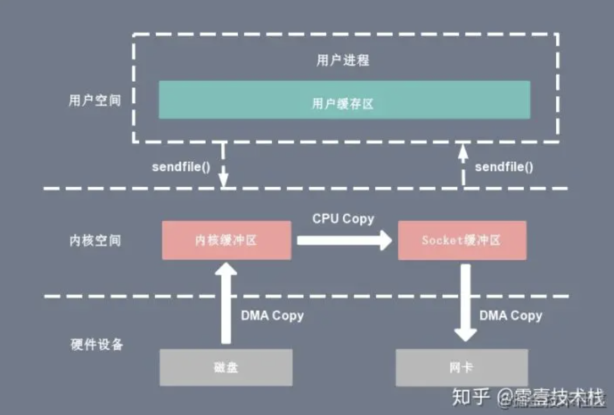

+ sendfile 系统调用的引入，不仅减少了 CPU 拷贝的次数，还减少了上下文切换的次数

  ```c
  sendfile(socket_fd, file_fd, len);
  ```

+ 通过 sendfile 系统调用，数据可以直接在内核空间内部进行 I/O 传输，从而省去了数据在用户空间和内核空间之间的来回拷贝。

  > 与 mmap 内存映射方式不同的是， sendfile 调用中 I/O 数据对用户空间是完全不可见的。也就是说，这是一次完全意义上的数据传输过程。

+ 基于 sendfile 系统调用的零拷贝方式，整个拷贝过程会发生 **2 次上下文切换， **1 次 CPU 拷贝和 2 次 DMA 拷贝，用户程序读写数据的流程如下：

  1. 用户进程通过 sendfile() 函数向 **内核** 发起系统调用，上下文从 **用户态** 切换为**内核态** 。
  2. CPU 利用 **DMA 控制器** 将数据从 **主存或硬盘拷贝** 到 **内核空间的读缓冲区** 。
  3. CPU 将 **读缓冲区** 中的数据拷贝到的 **网络缓冲区** 。
  4. CPU 利用 **DMA 控制器** 将数据从 **网络缓冲区** 拷贝到 **网卡** 进行数据传输。
  5. 上下文从 **内核态** 切换回 **用户态** ，sendfile 系统调用执行返回。

> 相比较于 mmap 内存映射的方式，sendfile 少了 2 次上下文切换，但是仍然有 1 次 CPU 拷贝操作。sendfile 存在的问题是用户程序不能对数据进行修改，而只是单纯地完成了一次数据传输过程。

---

##### 11.DMA gather copy技术


+ 这样 DMA 引擎直接利用 gather 操作将页缓存中数据打包发送到网络中即可，本质就是和虚拟内存映射的思路类似。
+ 整个过程不再有CPU的拷贝

---

##### 12.splice技术

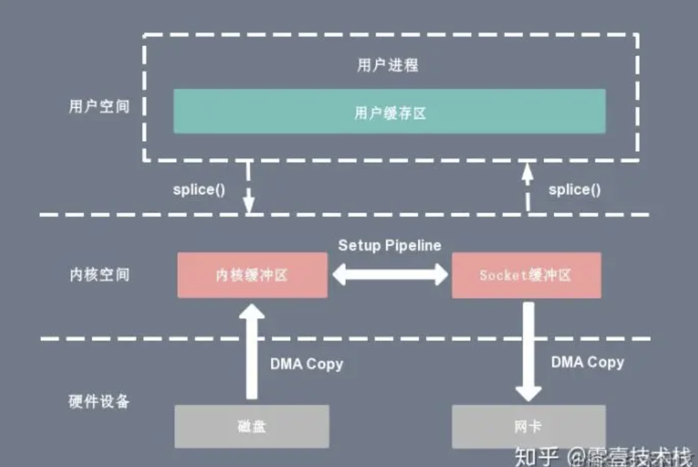

+ splice 系统调用可以在内核空间的读缓冲区（read buffer）和网络缓冲区（socket buffer）之间建立管道（pipeline），从而避免了两者之间的 CPU 拷贝操作。
+ 基于 splice 系统调用的零拷贝方式，整个拷贝过程会发生 2 次上下文切换，0 次 CPU 拷贝以及 2 次 DMA 拷贝，用户程序读写数据的流程如下：
  1. 用户进程通过 splice() 函数向 **内核** 发起系统调用，上下文从 **用户态** 切换为 **内核态** 。
  2. CPU 利用 **DMA 控制器** 将数据从 **主存或硬盘** 拷贝到 **内核空间的读缓冲区** 。
  3. CPU 在内核空间的 **读缓冲区** 和 **网络缓冲区** 之间建立 **管道** 。
  4. CPU 利用 **DMA 控制器** 将数据从 **网络缓冲区** 拷贝到 **网卡** 进行数据传输。
  5. 上下文从 **内核态** 切换回 **用户态** ，splice 系统调用执行返回

> splice 拷贝方式也同样存在用户程序不能对数据进行修改的问题。除此之外，它使用了 Linux 的管道缓冲机制，可以用于任意两个文件描述符中传输数据，但是它的两个文件描述符参数中有一个必须是管道设备。

---

##### 13.缓冲区共享技术

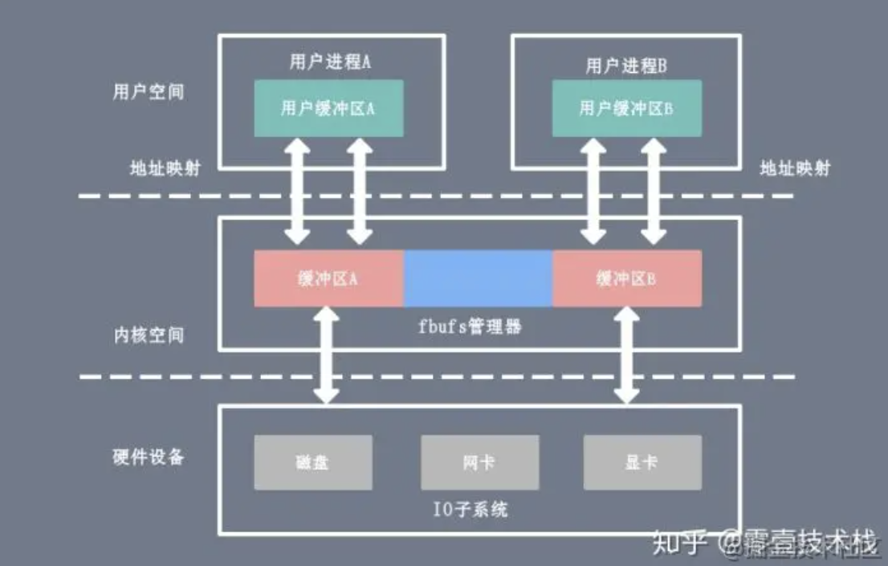

+ 传统 I/O 接口都是基于数据拷贝进行的，要避免拷贝就得去掉原先的那套接口并重新改写，所以这种方法是比较全面的零拷贝技术，目前比较成熟的一个方案是在 Solaris 上实现的 fbuf
+ fbuf 的思想是每个进程都维护着一个缓冲区池，这个缓冲区池能被同时映射到 **用户空间** 和 **内核态** ，内核和用户共享这个缓冲区池，这样就避免了一系列的拷贝操作。
+ 难度在于管理共享缓冲区池需要应用程序、网络软件以及设备驱动程序之间的紧密合作，而且如何改写 API 目前还处于试验阶段并不成熟。

### 4.死锁

##### 1.哲学家进餐问题

+ 五个哲学家围着一张圆桌，每个哲学家面前放着食物。哲学家有两种交替活动：吃饭以及思考。 当一个哲学家吃饭时，需要先拿起自己左右两边的两根筷子，并且一次只能拿起一根筷子。

+ 如果所有哲学家同时拿起左手边的筷子，那么所有哲学家都在等待其它哲学家吃完并释放自己手中的筷子，导致死锁
+ 为了防止死锁的发生，可以设置两个条件:
  + 必须同时拿起左右两根筷子;
  +  只有在两个邻居都没有进餐的情况下才允许进餐。

---

##### 2.读—写者问题

+ 允许多个进程同时对数据进行读操作，但是不允许读和写以及写和写操作同时发生。
+ 一个整型变量 count 记录在对数据进行读操作的进程数量，一个互斥量 count_mutex 用于对 count 加锁， 一个互斥量 data_mutex 用于对读写的数据加锁。

---

##### 3.==原子操作是如何实现的？==

+ 原子操作（atomic operation）指的是由多步操作组成的一个操作，要么执行完所有步骤，要么一步也不执行，不能只执行其中一个子集。

+ 单个的机器指令可以看成是原子操作（如果有编译器优化、乱序执行等情况除外）；
+ 多核系统里是多指令流并行运行的，使用内存栅障来实现，一个CPU核在执行原子操作时，其他CPU核停止对内存操作或者不对指定的内存进行操作，从而避免数据竞争问题。
+ 实现方式：基于缓存加锁与总线加锁。
  + 总线锁：使用处理器提供的一个 LOCK# 信号，当一个处理器在总线上输出此信号时，其他处理器的请求将被阻塞住，此时独占共享内存。但开销比较大
  + 缓存锁：内存区域如果被缓存在处理器的缓存行中，并且在Lock操作期间被锁定，那么当它执行锁操作回写到内存时，处理器通过修改内部的内存地址，并允许它的缓存一致性机制来保证操作的原子性
    + 不能用缓存锁的情况：
      + 操作的数据不能被缓存在处理器内部，或操作的数据跨多个缓存行(cache line)时

+ C++11提供了原子操作：`std::atomic<>` 模板类

---

##### 4.==什么是死锁？死锁产生的原因是什么==

+  指两个或多个进程在执行过程中，因争夺资源而造成的一种 **互相等待** 的现象，若无 **外力** 作用,它们都将无法推进下去

> 编程中出现的情况：
>
> + 存在一对线程中的每一个线程都需要同时锁定两个互斥元mutex来执行一些操作，此时每个线程都拥有了一个，同时等待另一个。两个线程都无法执行，等待另一个释放其互斥元。

+ 出现死锁的原因：
  1.  系统资源不足
  2. 资源分配不当等
  3. 运行推进顺序不合适

+  死锁只有同时满足四个条件才会发生:
  1. 互斥条件;
     + 进程对所需求的资源具有排他性，若有其他进程请求该资源，请求进程只能等待。
  2. 持有并等待条件;
     + 进程在所获得的资源未释放前，不能被其他进程强行夺走，只能自己释放。
  3.  不可剥夺条件;
     + 进程当前所拥有的资源在进程请求其他新资源时，由该进程继续占有。
  4. 环路等待条件;
     + 存在一种进程资源循环等待链，链中每个进程已获得的资源同时被链中下一个进程所请求。

---

##### 5.==避免死锁的方式==

破坏这四个必要条件中的一个条件，死锁情况就应该不会发生。

1. 打破互斥条件：需要允许进程同时访问某些资源
   + 这种方法受制于实际场景，不太容易实现条件；
2. 不可抢占条件：需要允许进程强行从占有者那里夺取某些资源，或者占有资源的进程不能再申请占有其他资源，必须释放手上的资源之后才能发起申请
   + 这个其实也很难找到适用场景；
3. 持有并等待条件：进程在运行前申请得到所有的资源，否则该进程不能进入准备执行状态。
   + 可能导致资源利用率和进程并发性降低；
4. 环路等待条件：避免出现资源申请环路，即对资源事先分类编号，按号分配。
   + 这种方式可以有效提高资源的利用率和系统吞吐量，但是增加了系统开销，增大了进程对资源的占用时间。

---

##### ==6.如果在死锁检查时发现了死锁情况，消除死锁的几种方式：==

1. 最简单、最常用的方法就是进行系统的重新启动，不过这种方法代价很大，意味着在这之前所有的进程已经完成的计算工作都将付之东流

2. 进程回退策略，让参与死锁的进程回退到没有发生死锁前某一点处，并由此点处继续执行，以求再次执行时不再发生死锁。

   >  虽然这是个较理想的办法，但是操作起来系统开销极大，要有堆栈这样的机构记录进程的每一步变化，以便今后的回退，有时这是无法做到的

3. 终止参与死锁的进程，收回它们占有的资源，从而解除死锁。这时又分两种情况：

   + 一次性撤消参与死锁的全部进程，剥夺全部资源；

   + 从代价最小，逐步撤消参与死锁的进程，逐步收回死锁进程占有的资源。

     > 选择逐步撤消的进程时要按照一定的原则进行，目的是：
     >
     > + 比如按进程的优先级确定进程的代价；
     > + 考虑进程运行时的代价和与此进程相关的外部作业的代价等因素；

---

##### ==7.讲出你知道的所有解决死锁的方法==

1. 鸵鸟策略
   + 因为解决死锁问题的代价很高，因此鸵鸟策略这种不采取任务措施的方案会获得更高的性能。 
   + 当发生死锁时不会对用户造成多大影响，或发生死锁的概率很低，可以采用鸵鸟策略。 大多数操作系统，包括 Unix，Linux 和 Windows，处理死锁问题的办法仅仅是忽略它。
3. 死锁恢复
   + 利用抢占恢复
   + 利用回滚恢复
   + 通过杀死进程恢复
4. 死锁预防
   + 只要破坏这四个必要条件中的一个条件
5. 死锁避免
   + 在进程运行时避免发生死锁
     + 安全检测，如果没有死锁发生，并且即使所有进程突然请求对资源的最大需求，也仍然存在某种调度次序能够使得每一个进程运行完毕，则称该状态是安全的。
     + 银行家算法

---

##### ==7.编程过程中如何避免死锁==

1. 避免使用嵌套锁
   + 如果已持有一个锁，就别再获取锁。坚持这个原则的话，使用锁几乎不会导致死锁
2. 以固定顺序获取锁
   - 如果必须获取两个或者更多的锁，则用固定顺序获取
3. 在持有锁时，避免调用用户提供的代码
   + 因为代码是用户提供的，不知道它会做什么，可能包括获取锁在内的任何事情

---

### 5.物理内存与虚拟内存

#### 虚拟内存知识

##### 1.**虚拟技术你了解吗?**

+ 虚拟技术把一个物理实体转换为更大的逻辑实体。
+ 主要有两种虚拟技术：时(时间)分复用技术 和 空(空间)分复用技术。
  + 时分复用技术：多个进程轮流占用处理器，并发执行，每次每个进程只执行一个时间片并快速切换
  + 空分复用技术：虚拟内存，OS为每个进程分配一套虚拟地址，使得每个进程从逻辑上都有自己独立的地址空间

---

##### 2.什么是虚拟内存，为什么需要？

+ OS将物理内存抽象成虚拟地址空间。使得每个进程从逻辑上都有自己独立的地址空间。
+ 利用内存覆盖技术，实现不用将程序所需要的所有代码与数据装入内存就能运行程序。
+ 虚拟内存通常是被分隔成多个物理内存碎片，还有部分暂时存储在外部磁盘存储器上，在需要时进行数据交换，加载到物理内存中来。从而使得程序从逻辑上看起来能获得了更大的内存。

---

##### 3.在用户进程和物理内存之间引入虚拟内存的优点

+ 地址空间：提供更大的地址空间，并且地址空间是连续的，使得程序编写、链接更加简单
+ 进程隔离：不同进程的虚拟地址之间没有关系，所以一个进程的操作不会对其它进程造成影响
+ 数据保护：每块虚拟内存都有相应的读写属性，这样就能保护程序的代码段不被修改，增加了系统的安全性
+ 内存映射：有了虚拟内存之后，可以直接映射磁盘上的文件（可执行文件或动态库）到虚拟地址空间。这样可以做到物理内存延时分配，只有在需要读相应的文件的时候，才将它真正的从磁盘上加载到内存中来，而在内存吃紧的时候又可以将这部分内存清空掉，提高物理内存利用效率，并且所有这些对应用程序是都透明的
+ 共享内存：比如动态库只需要在内存中存储一份，然后将它映射到不同进程的虚拟地址空间中，让进程觉得自己独占了这个文件。进程间的内存共享也可以通过映射同一块物理内存到进程的不同虚拟地址空间来实现共享
+ 物理内存管理：物理地址空间全部由操作系统管理，进程无法直接分配和回收，从而系统可以更好的利用内存，平衡进程间对内存的需求

---

##### 4.谈谈你理解的逻辑地址，线性地址，物理地址和虚拟地址

+ 物理地址：实际存在的硬件里面的空间地址
+ 虚拟地址：对物理内存的抽像描述。通过 CPU中的内存管理单元(MMU)的映射关系转换变成物理地址
+ 逻辑地址：也是虚拟地址。Intel为了兼容，将远古时代的段式内存管理方式保留下来。逻辑地址是硬件平台段式管理转换前的地址
+ 线性地址：也叫虚拟地址(virtual address)。跟逻辑地址类似，线性地址是硬件平台页式管理的转换前的地址。

---

##### ==5.用户进程申请并访问物理内存（或磁盘存储空间）的过程==

1. 用户进程向操作系统发出内存申请请求
2. 系统会检查进程的虚拟地址空间是否被用完，如果有剩余，给进程分配虚拟地址
3. 系统为这块虚拟地址创建的内存映射（Memory Mapping），并将它放进该进程的页表（Page Table）
4. 系统返回虚拟地址给用户进程，用户进程开始访问该虚拟地址
5. CPU 根据虚拟地址在此进程的页表中找到了相应的内存映射（Memory Mapping），但是这个内存映射没有和物理内存关联，于是产生缺页中断
6. 操作系统收到缺页中断后，分配真正的物理内存并将它关联到页表相应的内存映射。完成后 CPU 就可以访问内存了
7. 当然缺页中断不是每次都会发生，只有系统觉得有必要延迟分配内存的时候才用的着，也即很多时候在上面的第 3 步系统会分配真正的物理内存并和内存映射（Memory Mapping）进行关联。

---

##### 6.什么是MMU(Memory Management Unit)内存管理单元机制？

1. `MMU`：完成的工作就是虚拟地址到物理地址的转换，可以让系统中的多个程序跑在自己独立的虚拟地址空间中，相互不会影响。程序可以对底层的物理内存一无所知，物理地址可以是不连续的，但是不妨碍映射连续的虚拟地址空间。
2. `TLB`：`MMU`工作的过程就是查询页表的过程，页表放置在内存中时查询开销太大，因此专门有一小片访问更快的区域用于存放`地址转换条目`，用于提高查找效率。当页表内容有变化的时候，需要清除`TLB`，以防止地址映射出错。
3. `Cache`：处理器和存储器之间的缓存机制，用于提高访问速率，在ARMv8上会存在多级Cache，其中
   + `L1 Cache`分为`指令Cache`和`数据Cache`，在`CPU Core`的内部，支持虚拟地址寻址；
   + `L2 Cache`容量更大，同时存储指令和数据，为多个`CPU Core`共用，这多个`CPU Core`也就组成了一个`Cluster`。

---

##### 7.**讲解逻辑地址转换为物理地址的基本过程**

+ 逻辑地址通过 CPU 中的内存管理单元(MMU)的映射关系转换变成物理地址

如果是段⻚式管理，则地址转化要经过三次内存访问:

1. **访问段表，得到⻚表起始地址;**
2. **访问⻚表，得到物理⻚号;**
3. **将物理⻚号与⻚内位移组合，得到物理地址。**

---

#### 内存分页知识

##### 1.⻚表项通常有哪些字段？（最重要的5个）

+ 页号：哪一页
+ 硬盘地址：该⻚在硬盘上的地址，通常是物理块号，供调入该⻚时使用。
+ 状态位：表示该⻚是否有效，即是否在物理内存中
+ 访问字段：记录该⻚在一段时间被访问的次数
+ 修改位：表示该⻚在调入内存后是否有被修改过，由于内存中的每一⻚都在磁盘上保留一份副本
  + 如果没有修改，在置换该⻚时就不需要将该⻚写回到磁盘上，以减少系统的开销；
  + 如果已经被修改，则将该⻚重写到磁盘上，以保证磁盘中所保留的始终是最新的副本。

---

##### 2.什么是快表，那你知道多少关于快表的知识？

+ 快表，又称联想寄存器(TLB) ，是一种访问速度比内存快很多的高速缓冲存储器，用来存放当前访问的若干页表项，加速地址变换的过程。
+ 与此对应，内存中的页表常称为慢表。

---

##### 3.**地址变换中，有快表和没快表，有什么区别?**

有快表的话先访问快表，搜索快表中有无对应的页号

+ 无快表：
  1. 算页号(页表的索引)、页内偏移量 
  2. 检查页号合法性 
  3. 根据页号查页表中的页表项，找到对应的物理⻚号;
  4. 根据物理⻚号与页内偏移量得到物理地址 
  5. 访问目标内存单元
+ 有快表：
  1. 算页号、页内偏移量 
  2. 检查页号合法性 
  3. 查快表。若命中，即可知道物理⻚号，可直接计算出物理地址
  4. 若未命中则根据页号查页表中的页表项，找到对应的物理⻚号，并且将页表项复制到快表中 
  5. 根据物理⻚号与页内偏移量得到物理地址 
  6. 访问目标内存单元

---

##### ==4.什么是缺页异常(缺页中断)？==

当 CPU 访问的⻚面不在物理内存时，会产生缺⻚中断，请求操作系统将所缺⻚调入到物理内存。

缺⻚中断的处理流程：

1. 在 CPU 取指执行时，去找指令所对应的⻚表项。
2. 如果该⻚表项的状态位是「有效的」， CPU 直接访问物理内存，如果状态位是「无效的」， CPU 发送缺⻚中断请求
3. 操作系统收到了缺⻚中断后执行缺⻚异常处理函数，查找该⻚面在磁盘中位置。
4. 找到磁盘中对应的⻚面后，在物理内存中找空闲⻚，换入到物理内存中，将⻚表项中的状态位修改为「有效的」
5. 最后，CPU 重新执行导致缺⻚异常的指令。

>  第4步，找不到空闲⻚则说明此时内存已满了，这时需要「⻚面置换算法」选择一个有被修改过物理页(脏⻚)，把它换出到磁盘，然后把该被置换出去的⻚表项的状态改成「无效的」，最后把正在访问的⻚面装入到这个物理⻚中

与一般中断的区别在:

+   缺⻚中断在指令执行「期间」产生和处理中断信号，而一般中断在一条指令执行「完成」后检查和处理中断信号。
+   缺⻚中断返回到该指令的开始重新执行「该指令」，而一般中断返回回到该指令的「下一个指令」执行。

---

##### ==5.页面置换算法你知道多少？==

功能：当出现缺⻚异常需调入新⻚面而内存已满时，选择物理⻚面换出到磁盘，然后把需要访问的⻚面换入到物理内存

算法目标：尽可能减少⻚面的换入换出的次数，常⻅的⻚面置换算法有：

1. **最佳⻚面置换算法(*OPT*)** ：淘汰以后最长时间内访问次数最少的页面

   + 可以保证最低的缺页率，但操作系统无法提前预判页面访问序列。因此，最佳置换算法是无法实现的

2. **先进先出置换算法(*FIFO*)** ：选择淘汰的页面是最早进入内存的页面

   + 把调入内存的页面根据调入的先后顺序排成一个队列，需要换出页面时选择队头页面，队列的最大长度取决于系统为进程分配了多少个内存块。

   + 经常被访问的页在FIFO算法下被反复调入和调出，会出现Belady现象。（局部性原理）

     > Belady异常：当为进程分配的物理块数增大时，缺页次数不减反增的异常现象。

3. **最近最少未使用的置换算法(*LRU：least recently used*)** ：淘汰的页面是最近最久未使用的页面

   + 实现方法：用访问字段记录该页面自上次被访问以来所经历的时间 t 。当需要淘汰一个页面时， 选择现有页面中 t 值最大的，即最近最久未使用的页面。
   + 该算法的实现需要寄存器和栈的硬件支持，虽然算法性能好，但是实现困难，开销大

4. **时钟⻚面置换算法(*CLock*)** ：时钟置换算法是一种性能和开销较均衡的算法，又称CLOCK算法

   + 为每个页面设置一个访问位，把所有的⻚面都保存在「环形链表」中，表针指向最老的⻚面。
   + 当某页被访问时，访问位置为1。需要淘汰一个页面时，只需检查页的访问位：
     + 如果是0，就选择该页换出
     + 如果是1，则将它置为0，暂不换出
   + 实现简单，算法开销小；但未考虑页面是否被修改过。

5. **改进型的时钟置换算法**

   + 如果被淘汰的页面没有被修改过，不需要执行I/O操作写回外存。被淘汰的页面被修改过时，才需要写回外存。

   + 除了考虑一个页面最近有没有被访问过之外，操作系统还应考虑页面有没有被修改过。在其他条件都相同时，应优先淘汰没有修改过的页面，避免I/O操作。
   + 该算法选择一个淘汰页面最多会进行四轮扫描：若用 (访问位，修改位) 的形式表述：
     + 第一轮:淘汰(0,0) 
     + 第二淘汰(0,1)，并将扫描过的页面访问位都置为0 
     + 第三轮:淘汰 (0, 0) 
     + 第四轮:淘汰(0, 1)

---

##### 6.既然已经有分页了，为什么还要分段？

+ 之前看过的博文介绍，好像是因为Intel的历史遗留原因

+ 一开始限于技术和成本所以寄存器的位数不够，因此为了扩大寻址范围搞了个分段访问内存。而随后技术起来了，位数都扩充了，寄存器其实已经可以访问全部内存空间了，所以分段已经没用了。

+ 但是为了向前兼容还是保留着分段访问的形式，随后为了更好的管理内存（段的碎片问题），提高内存的利用率和内存交互性能引入了分页管理。所以就变成了先分段，然后再分页的段页式。

+ 当然也可以和 Linux 那样让每一段的基地址都设为 0 ，这样就等于“绕开”了段机制。

> Intel 推出的处理器限于当时的技术背景和经济，寄存器只有 16 位，而地址总线是 20 位。因为无法使用16位的寄存器访问20位的地址总线。
>
> 于是引入段的概念，让 CPU 通过「段基地址+段内偏移」来访问内存。即段基地址左移 4 位（就是乘16）再加上段内偏移，这样得到的就是 20 位的地址。
>
> 至于为什么称之为段，其实就是因为寄存器只有 16 位一段只能访问 64 KB，所以需要移动基地址，一段一段的去访问所有的内存空间。还有专门为分段而生的寄存器为段寄存器，当时里面直接存放段基地址。

----

##### 7.进程如何查询页表

+ 每个进程维护了一个单独的页表，虚拟内存和物理内存就是通过这个页表实现地址空间的映射的。

+ 当进程执行一个程序时，需要先从先内存中读取该进程的指令，然后执行，获取指令时用到的就是虚拟地址。这个虚拟地址是程序链接时确定的（内核加载并初始化进程时会调整动态库的地址范围）。为了获取到实际的数据，CPU 需要将虚拟地址转换成物理地址，CPU 转换地址时需要用到进程的页表（Page Table），而页表（Page Table）里面的数据由操作系统维护。

+ 转换过程就是上面的过程

---

#### 内存相关知识

##### 1.**程序从堆中动态分配内存时，虚拟内存上怎么操作的**

+ 在进行动态内存分配时，例如malloc()函数，操作系统会 **在硬盘中申请一段虚拟内存空间** ，分配一个页表条目(PTE)，指向硬盘上新创建的虚拟页

  > 页表:是一个存放在物理内存中的数据结构，它记录了虚拟页与物理页的映射关系

---

##### 2.**说一下你理解中的内存?他有什么作用呢?**

+ 存放数据的硬件。程序执行前需要先放入内存，然后才会被CPU进行处理

##### 3.**在多道程序环境下，系统中有多个程序并发执行，怎么区分各自程序内存的数据？**

+ 每个程序有自己的虚拟地址空间，给存储单元编地址，会映射到不同的物理地址中。

---

##### 4.**操作系统在对内存进行管理的时候需要做些什么**?

+  负责内存空间的分配与回收。
+  提供内存保护功能。保证各进程在各自存储空间内运行，互不干扰
+  提供技术从逻辑上对内存空间进行扩充。
+  提供地址转换功能，负责程序的逻辑地址与物理地址的转换。

---

##### 5.什么是动态分区分配算法？

+ 进程运行是需要内存空间的，在内存空闲分区找一个大小满足需求的内存分区。

+ 解决的问题是：如果有很多个空闲分区都能满足需求，应该选择哪一个分区进行分配？

##### ==6.**动态分区分配算法有哪几种?可以分别说说吗?**==

+ 动态分区分配算法有两大类：
  + 基于索引搜索
  + 基于顺序搜索
    +  **首次适应算法（First Fit）**：
      + 空闲分区以地址递增次序排列，使用第一个大小满足要求的空闲分区
    +  **邻近适应算法（Next Fit）：**
      + 每次从链头开始查找会导致低地址部分出现很多小的空闲分区， 每次分配查找都经过这些分区，增加了查找的开销。
      + 空闲分区以地址递增的顺序排列，可排成一个循环链表。每次分配内存时从上次查找结束的位置开始查找，选择第一个满足大小的空闲分区。
    +  **最佳适应算法（Best Fit）：**（保证大作业的使用）
      + 空闲分区按容量递增次序排列。使用大小能满足要求的第一个空闲分区。
    +  **最坏适应算法（Worst Fit）：**（减少内存碎片）
      + 空闲分区按容量递减次序排列。使用大小能满足要求的第一个空闲分区。

---

##### 7.内存覆盖是什么？有什么特点？

+ 由于程序运行时并非任何时候都要访问程序及数据的各个部分，因此可以把用户空间分成为一个固定区和若干个覆盖区。
  + 将经常活跃的部分放在固定区
  + 其余部分按照调用关系分段
    + 将即将要访问的段放入覆盖区
    + 其他段放在外存中，在需要调用前，系统将其调入覆盖区，替换覆盖区中原有的段。
+ 覆盖技术的特点：
  + 是打破了必须将一个进程的全部信息装入内存后才能运行的限制
  + 但当同时运行程序的代码量大于主存时仍不能运行，内存中能够更新的地方只有覆盖区的段，不在覆盖区的段会常驻内存。

---

##### 8.**内存交换是什么?有什么特点?**

+ 内存空间紧张时，系统将内存中某些进程暂时换出外存，把外存中具备运行条件的进程换入内存

+ 换入：把准备好竞争CPU运行的程序从辅存移到内存。 
+ 换出：把处于等待状态的程序从内存移到辅存，把内存空间腾出来。

---

##### 9.**在发生内存交换时，有些进程是被优先考虑的?你可以说一说吗?**

+ 优先换出阻塞进程;
+ 换出优先级低的进程；为了防止优先级低的进程在被调入内存后很快又被换出，有的系统还会考虑进程在内存的驻留时间

---

##### 10.**内存交换和覆盖有什么区别?**

+ 交换技术主要是在不同进程(或作业)之间进行

+ 覆盖则用于同一程序或进程中。

---

##### 11.**内存交换中，被换出的进程保存在哪里?**

+ 保存在磁盘中，也就是外存中。在具有对换功能的操作系统中，通常把磁盘空间分为文件区和对换区两部分。

  + 文件区主要用于存放文件，为了追求存储空间利用率，采用离散分配方式;

  + 对换区空间只占磁盘空间的小部分，被换出的进程数据就存放在对换区。

    > 由于对换的速度直接影响到系统的整体速度，因此通常对换区采用连续分配方式，I/O速度比文件区的更快。


---

##### 12.**内存交换你知道有哪些需要注意的关键点吗?**

2. 为了有效使用CPU，需要进程执行时间比交换时间长
3. 对换区使用连续分配方式，I/O速度更快
3. 交换需要备份存储

---

##### 13.交换空间与虚拟内存有什么关系？

> CPU调度算法是宏观的，微观还是使用页面置换算法实现的

+ 虚拟内存是对物理内存的抽象，使用置换算法将物理内存中不经常使用的部分写入磁盘，通过这种方式从逻辑上扩展系统的可用内存。当系统需要访问磁盘的部分时，会触发一个缺页异常将磁盘的部分写回物理内存。
+ 当系统的物理内存不够才使用交换空间。而交换空间对应着虚拟内存中的用来临时存储物理内存内容的磁盘空间。

---

##### 14.Windows和Linux环境下内存分布情况

+ 32为系统中一个由4G内存，分为3G用户空间，1G内核空间

+ 从 **低到高**  分别是 7 种不同的内存段:
  1. 程序文件段(.text)：包括二进制可执行代码;
  2. 已初始化数据段(.data)：包括静态常量;
  3. 未初始化数据段(.bss)：包括未初始化的静态变量; 
  4. 堆段：包括动态分配的内存，从低地址开始向上增长; 
  5. 文件映射段：包括动态库、共享内存等，从低地址开始向上增长
  6. 栈段：包括局部变量和函数调用的上下文。栈的大小是固定的，一般是 8 MB。
  7. 内核空间

---

##### 15.一般情况下在Linux/windows平台下栈空间的大小

+ Linux下：非编译器决定栈大小，由操作系统环境决定，默认是8192KB(8M)

  ```bash
  ulimit -a       # 显示当前栈的大小 (ulimit为系统命令，非编译器命令) 
  ulimit -s 32768 # 设置当前栈的大小为32M
  ```

+ Windows下：栈的大小是被记录在可执行文件中的，由编译器来设置。VC++ 6.0 默认的栈空间是1M。

  + 选择 "Project->Setting"
  + 选择 "Link"
  + 选择 "Category"中的 "Output"
  + 在 "Stack allocations"中的"Reserve:"中输栈的大小

---

##### 16.**从堆和栈上建立对象哪个快?(考察堆和栈的分配效率比较)**

+ 堆在分配和释放时要调用malloc,free,分配时会到堆空间去寻找足够大小的空间，会花费一定的时间，栈不需要这些。

+ 访问堆的一个具体单元，需要两次访问内存，第一次得取得指针，第二次才是真正的数据，而栈只需访问一次。
+ 另外，堆的内容被操作系统交换到外存的概率比栈大，栈一般是不会被交换出去的。

---

##### 17.**常见内存分配方式有哪些?**

2. 在栈上创建。在执行函数时，函数内局部变量的存储单元可以在栈上创建，函数执行结束时这些存储单元自动被释放。站分配的效率很高，但是分配的内存容量有限。
3. 从堆上分配，亦称动态内存分配。程序在运行的时候用malloc或new申请指定大小的内存，不需要时需要自己释放内存。生存期由程序员决定，使用非常灵活，但问题也最多。
3.  从静态存储区域分配。如全局变量，static变量。内存在程序编译时就已经分配好，在程序整个运行期间都存在。

---

##### 18.**常见内存分配使用错误**

1. 内存分配未成功，却使用了它。
2. 内存分配虽然成功，但是尚未初始化就引用它。
3. 内存分配成功并且已经初始化，但进行了越界操作。
4. 忘记了释放内存，造成内存泄露。
5. 释放了内存却继续使用它。

---

##### 19.**在执行malloc申请内存的时候，操作系统是怎么做的?**

+ 由brk、mmap(内存映射)这两个系统调用实现的;
+ malloc申请动态内存：
  + malloc小于128k的内存使用brk分配内存，将数据段(.data)的最高地址指针_edata往高地址推
  + malloc大于128k的内存，使用 mmap分配内存，在堆和栈之间找一块空闲内存分配

---

##### 20. **抖动你知道是什么吗?它也叫颠簸现象**

+  频繁从内存与磁盘进行的页面调度行为称为 **抖动，或颠簸** 。
+  产生抖动的主要原因是：进程频繁访问的页面数目大于可用的物理块数(分配给进程的物理块不够)
   +  为进程分配的物理块太少，会使进程发生抖动现象。
   +  为进程分配的物理块太多，又会降低系统整体的并发度，降低某些资源的利用率

---

#### 内存碎片问题

##### 1.介绍一下内部碎片与外部碎片

+ 内碎片：分配给某些进程的内存有些部分没用上，常见于固定分配方式
  + 内存总量相同，100M
  + 固定分配，将100M分割成10块，每块10M，一个程序需要45M，那么需要分配5块，第五块只用了5M， 剩下的5M就是内部碎片;
  + 分段式分配，按需分配，一个程序需要45M，就给分片45MB，剩下的55M供其它程序使用，不存在内部碎片。
+ 外碎片：内存中某些空闲区因为比较小，难以利用上，一般出现在内存动态分配方式中
  + 分段式分配：内存总量100M，依次分配5M，15M，50M，25M，程序运行一段时间之后，5M，15M的程序运行完毕释放内存，其他程序还在运行，需要分配一个10M供其它程序使用，就会存在5M+5M的外部碎片

---

##### 2.**如何消除碎片文件** 

+  外部碎片：
   +  利用 **紧凑技术** 消除，就是操作系统不时地对进程进行移动和整理。相对费时。
+  所有碎片：
   +  分⻚技术，把虚拟和物理内存空间切成一段段固定的大小⻚(4k)(Page) 。
      +  分页会出现页表过大的缺陷，这就引出了多级页表
      +  多级⻚表虽然解决了空间上的问题，但转换就多了几道转换的工序，带来了时间上的开销。
      +  这就引出了快表

---

### 5.磁盘

##### 1.读写一个磁盘块的时间的影响因素有哪些？

+ 旋转时间(主轴转动盘面，使得磁头移动到适当的扇区上)
+ 寻道时间(制动手臂移动，使得磁头移动到适当的磁道上)
+ 实际的数据传输时间

> 其中，寻道时间最长，因此磁盘调度的主要目标是使磁盘的平均寻道时间最短

##### ==2.介绍常见的几种磁盘调度算法==

1.  **先来先服务** ：按照磁盘请求的顺序进行调度。 
   + 优点：公平和简单。
   + 缺点：未对寻道做任何优化，使平均寻道时间可能较长。
2.  **最短寻道时间优先** ：优先调度与当前磁头所在磁道距离最近的磁道。
   + 优点：平均寻道时间比较低
   + 缺点：不够公平。如果新到达的磁道请求总是比一个在等待的磁道请求近，那么在等待的磁道请求会一直等待下去，也就是出现饥饿现象。
3.  **电梯扫描算法** ：与电梯运行类似，按一个方向来进行磁盘调度，直到该方向上没有未完成的磁盘请求，然后改变方向
   + 因为考虑了移动方向，因此所有的磁盘请求都会被满足，解决了 SSTF 的饥饿问题。

---

## 六.智力题

##### 1. **三人三鬼过桥**

>  有三个人跟三个鬼要过河，河上没桥只有条小船，然后船一次只能渡一个人和一个鬼，或者两个鬼或者两个人，无论在哪边岸上，只有是人比鬼少的情况下(如两鬼一人，三鬼两人，三鬼一人)人会被鬼吃，然而船又一定需要人或鬼操作才能航行(要有人或鬼划船),问,如何安全的把三人三鬼渡过河对岸?

1. 先两鬼过去。在一鬼回来。对面有一鬼。这边有三人两鬼。 
2. 再两鬼过去。在一鬼回来。对面有两鬼。这边有三人一鬼。 
3. 再两人过去。一人一鬼回来。对面一人一鬼。这边两人两鬼。
4.  最后两人过去。一鬼回来。对面三人。这边三鬼。 
5. 剩下的就三个鬼二个过去一个回来在接另外个就OK了。

---

##### ==2. **赛马找最快的马匹**==

> 25匹马5条跑道找最快的3匹马，需要跑几次? 参考回答:7 

将25匹马分成ABCDE 5组，假设每组的排名就是A1>A2>A3>A4>A5,用边相连，这里比赛5次

第6次，每组的第一名进行比赛，可以找出最快的马，这里假设A1>B1>C1>D1>E1 ；D1，E1肯定进不了前3，直接排除掉

第7次，B1 C1 A2 B2 A3比赛，可以找出第二，第三名

所以最少比赛需要7次

>  64匹马8条跑道找最快的4匹马，需要跑几次? 参考回答:11  （8+1+1+1）

1. 第一步 全部马分为8组，每组8匹，每组各跑一次，然后淘汰掉每组的后四名；此时比赛8场   

2. 取每组第一名进行一次比赛，然后淘汰最后四名所在组的所有马；这个时候总冠军已经诞生，它就是A；而其他可能跑得最快的三匹马只可能是下图中的黄域了(A2,A3,A4,B1,B2,B3,C1,C2,D1，共9匹马)

4. 只要从上面的9匹马中找出跑得最快的三匹马就可以了，但是现在只要8个跑道，随机选出8匹马进行一次比赛吧(需要比赛一场)
5. 上面比赛完，选出了前三名，但是9匹马中还有一匹马和前三名 比一比吧，这四匹马比一场，选出前三名。最后加上总冠军

>  25匹马5条跑道找最快的5匹马，需要跑几次? 参考回答:最少8次最多9次

将马分成A、B、C、D、E五组。  第1-5次比赛：各组分别进行比赛，决出各组名次  

第6次比赛：找出第一名，比较A1、B1、C1、D1、E1  ，假设是A1最快  

第7次比赛：找出第二名和第三名，比较  A2、A3、B1、B2、C1，假设A2和A3最快

第8次比赛：找出第四名和第五名，比较A4、A5、B1、B2、C1，前两名分别是第四和第五名

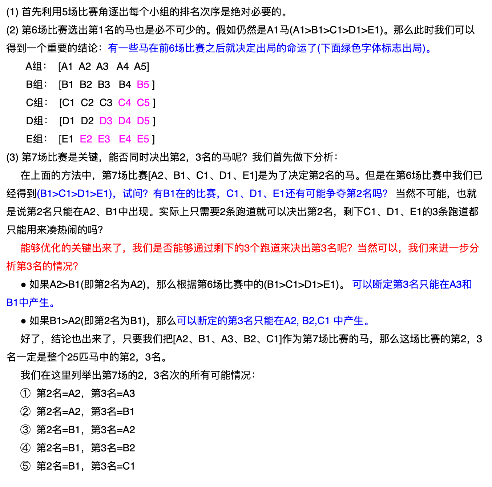

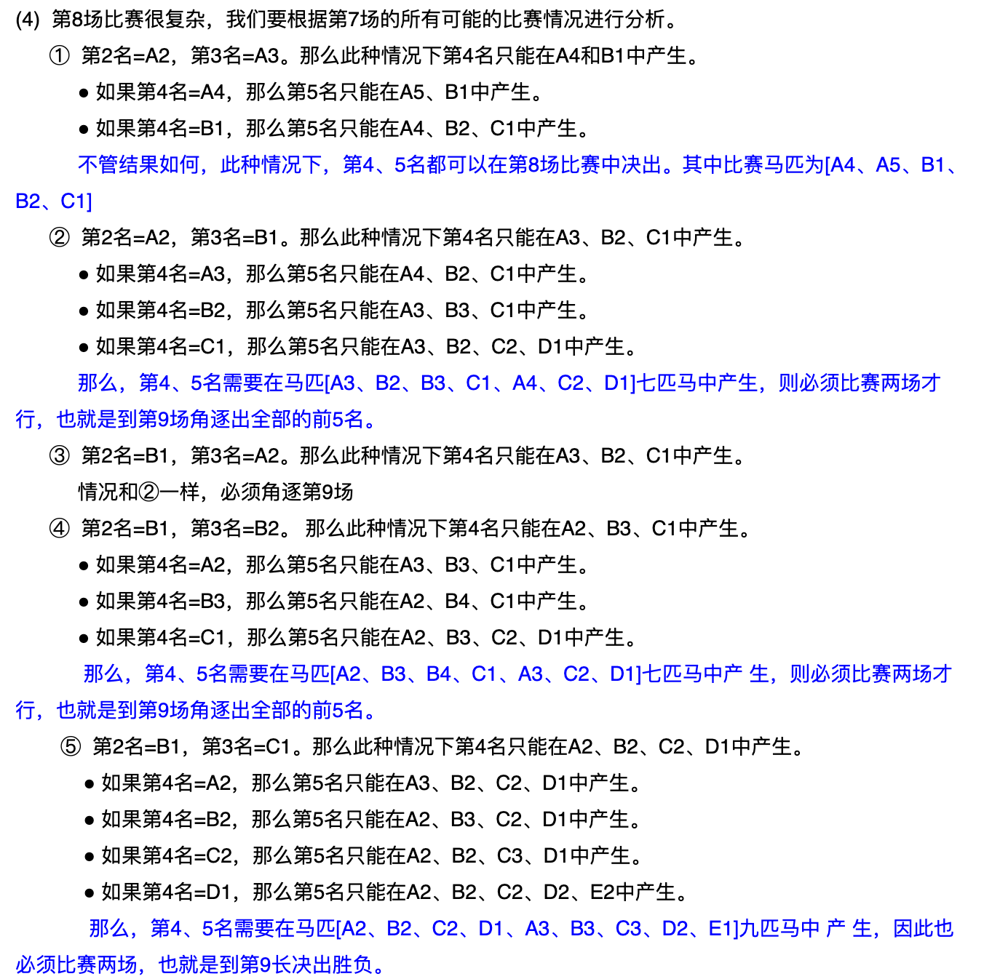

---

##### 3. **给定随机函数，生成别的随机数**

> 给定生成1到5的随机数Rand5()，如何得到生成1到7的随机数函数Rand7()

由大的生成小的容易，比如由Rand7()生成Rand5()，所以我们先构造一个大于7的随机数生成函数。 记住下面这个式子

```c++
RandNN= N( RandN()-1 ) + RandN() ;// 生成1到N^2之间的随机数 可以看作是在数轴上撒豆子。
//N是跨度/步长，是RandN()生成的数的范围长度， 
//RandN()-1的目的是生成0到N-1的数，是跳数。后面+RandN()的目的是填满中间的空隙
```

比如`Rand25= 5( Rand5()-1 ) + Rand5()`可以生成1到25之间的随机数。可以只要1到21(3*7)之间 的数字，所以可以这么写

```c++
int rand7(){
    int x=INT_MAX;
    while(x>21){
      	x=5*(rand5()-1)+rand5();
    }
  	return x%7+1;
}
```

>  用 Rand7() 实现 Rand10()

```c++
int rand10(){
    int x=INT_MAX;
    while(x>40){	//最接近的倍数
      	x=7*(rand7()-1)+rand7();
    }
  	return x%10+1;
}
```

---

##### 4. **砝码称轻重，找出最轻的**

> 有一个天平，九个砝码，其中一个砝码比另八个要轻一些，问至少要用天平称几次才能将轻的那个 找出来?

至少2次。

+ 第一次，一边3个，哪边轻就在哪边，一样重就是剩余的3个; 
+ 第二次，一边1个，哪边轻就是哪个，一样重就是剩余的那个;

> 十组砝码每组十个，每个砝码都是10g重，但是现在其中有一组砝码每个都只有9g重，有个能显示克数的秤，最少称几次能找到轻的那组? 

至少1次。

+ 将砝码分组1~10，第一组拿一个，第二组拿两个以此类推。。第十组拿十个放到秤上称出克数x，则y =550 - x，第y组就是轻的那组。

---

##### 5. **利用空瓶换饮料，最多喝几瓶**

> 1000瓶饮料，3个空瓶子能够换1瓶饮料，问最多能喝几瓶?

+ 拿走3瓶，换回1瓶，相当于减少2瓶。但是最后剩下4瓶的时候例外，这时只能换1瓶。所以我们计算 1000减2能减多少次，直到剩下4.(1000-4=996，996/2=498)所以1000减2能减498次直到剩下4瓶，最后 剩下的4瓶还可以换一瓶，所以总共是1000+498+1=1499瓶。

---

##### 6. **毒药毒白鼠，找出哪个瓶子中是毒药**

> 有1000个一模一样的瓶子，其中有999瓶是普通的水，有1瓶是毒药。任何喝下毒药的生命都会在一星期之后死亡。现在你只有10只小白鼠和1个星期的时间，如何检验出哪个瓶子有毒药?

+ 首先一共有1000瓶，2的10次方是1024，刚好大于1000，也就是说，1000瓶药品可以使用10位二进制 数就可以表示。从第一个开始:

```c++
第一瓶  :	00 0000 0001
第二瓶  :	00 0000 0010
第三瓶  :	00 0000 0011
......
第999瓶 :	11 1111 0010
第1000瓶: 11 1111 0011
```

+ 老鼠按顺序编号ABCDEFGHIJ，分别代表从低到高每一个位。 每只老鼠对应一个二进制位，如果该位上的数字为1，则给老鼠喝瓶里的药。

+ 观察，若死亡的老鼠编号为:ACFGJ，一共死去五只老鼠，则对应的编号为 10 0110 0101，则有毒的药品为该编号的药品，转为十进制数为:613号。(这才是正解，当然前提是老鼠还没被撑死)

> 8瓶酒一瓶有毒，用小老鼠测试。每次测试结果8小时后才会得出，而你只有8个小时的时间。最少需要几只老鼠测试

+ 一样，进行二进制编号

+ 其中，第一个老鼠喝下最低位为1对应的酒，第二个老鼠喝下中间位为1对应的酒，第三个老鼠喝下最高位为1对应的酒
+ 最后将所有中毒的老鼠，对应的位次进行与操作即可以知道那瓶毒药有毒了

---

##### 7. **利用烧绳子计算时间**

> 现有若干不均匀的绳子，烧完这根绳子需要一个小时，问如何准确计时15分钟，30分钟，45分钟，75分钟。。。

计算15分钟:对折之后两头烧(要求对折之后绑的够紧，否则看45分钟解法)

计算30分钟:两头烧

计算45分钟:两根，一根两头烧一根一头烧，两头烧完过了30分钟，立即将第二根另一头点燃，到烧完 又过15分钟，加起来45分钟

计算75分钟:将30和45分钟的方式加起来就可以了

---

##### 8. **在24小时里面时针分针秒针可以重合几次**

+ 24小时中时针走2圈，而分针走24圈，时针和分针重合24-2=22次，而只要时针和分针重合，秒针一定有机会重合，所以总共重合22次

---

##### 9. **100个奴隶猜帽子颜色**

> 一百个奴隶站成一纵列，每人头上随机带上黑色或白色的帽子，各人不知道自己帽子的颜色，但是能看见自己前面所有人帽子的颜色.
>
> 然后从最后一个奴隶开始，每人只能用同一种声调和音量说一个字:”黑”或”白”，
>
> 如果说中了自己帽子的颜色，就存活，说错了就拉出去斩了，说的参考回答所有奴隶都能听见。 是否 说对，其他奴隶不知道。
>
> 在这之前，所有奴隶可以聚在一起商量策略，问如果奴隶都足够聪明而且反应足够快，100个人最大存活率是多少?

1. 最后一个人如果看到奇数顶黑帽子报“黑”否则报“白”，他可能死 
2. 其他人记住这个值(实际是黑帽奇偶数)，在此之后当再听到黑时，黑帽数量减一 
3. 从倒数第二人开始，就有两个信息:记住的值与看到的值，相同报“白”，不同报“黑” 

99人能100%存活，1人50%能活

> 此题还有变种:每个奴隶只能看见前面一个人帽子颜色又能最多存活多少人?

+ 增加限制条件后，上面的方法就失效了，此时只能约定偶数位奴隶说他前一个人的帽子颜色，奇数奴隶获取信息100%存活，偶数奴隶50几率存活

---

##### 10. **小猴子搬香蕉**

> 一个小猴子边上有100根香蕉，它要走过50米才能到家，每次它最多搬50根香蕉，(多了就被压死 了)，它每走 1米就要吃掉一根，请问它最多能把多少根香蕉搬到家里?

+ 第一阶段:假如把100根香蕉分为两箱。一箱50根。

  + 第一步，把A箱搬一米，吃一根。

  + 第二步，往回走一米，吃一根。

  + 第三步，把B箱搬一米，吃一根。

  + 这样，把所有香蕉搬走一米需要吃掉三根香蕉。这样走到第几米的时候，香蕉数刚好小于50呢?

    `100-(n*3)<50 && 100-(n-1*3)>50`

  + 走到16米的时候，吃掉48根香蕉，剩52根香蕉。这步很有意思，它可以直接搬50往前走，也可以再来回搬一次，但结果都是一样的。

  + 到17米的时候，猴子还有49根香蕉。这时猴子就轻松啦，直接背着走就行。

+  第二阶段: 走一米吃一根
  + 把剩下的50-17=33米走完。还剩49-33=16根香蕉。

---

##### ==11. **高楼扔鸡蛋(经典问题)**==

> 有2个鸡蛋，从100层楼上往下扔，以此来测试鸡蛋的硬度。比如鸡蛋在第9层没有摔碎，在第10层摔碎了，那么鸡蛋不会摔碎的临界点就是9层。

+ 暴力法：
  + 把其中一个鸡蛋，从第1层开始往下扔。如果在第1层没 碎，换到第2层扔;如果在第2层没碎，换到第3层扔.......如果第59层没碎，换到第60层扔;如果第60层碎了，说明不会摔碎的临界点是第59层。
  + 在最坏情况下，这个方法需要扔100次。

+ 二分法：
  + 采用类似于二分查找的方法，把鸡蛋从一半楼层(50层)往下扔。
    +  如果第一枚鸡蛋，在50层碎了，第二枚鸡蛋，就从第1层开始扔，一层一层增长，一直扔到第49层。
    + 如果第一枚鸡蛋在50层没碎了，则继续使用二分法，在剩余楼层的一半(75层)往下扔......
  + 这个方法在最坏情况下，需要尝试50次。
+ 均匀法：
  + 做一个平方根运算，100的平方根是10。 因此尝试每10层扔一次，第一次从10层扔，第二次从20层扔，第三次从30层......一直扔到100层。 这样的最好情况是在第10层碎掉，尝试次数为 1 + 9 = 10次。 最坏的情况是在第100层碎掉，尝试次数为 10 + 9 = 19次。
  + 可以从15层开始扔，接下来从25层、35层扔......一直到95层。 这样最坏情况是在第95层碎掉，尝试次数为 9 + 9 = 18次。

+ 最优解法：

  + 假设第一次扔在第x层:

    + 如果第一个鸡蛋碎了，那么第二个鸡蛋只能从第1层开始扔，一直扔到第x-1层。总共尝试了x-1+1 = x次，刚刚好没有超出假设次数

    + 因此，要想尽量楼层跨度大一些，又要保证不超过假设的尝试次数x，那么第一次扔鸡蛋的最优选择就是第x层。

    + 那么算最坏情况，第二次你只剩下x-1次机会，按照上面的说法，你第二次尝试的位置必然是X+(X- 1);

    + 以此类推我们可得:

      `x + (x-1) + (x-2) + ... + 1 = 100`

    + 左边的多项式是各次扔鸡蛋的楼层跨度之和。由于假设尝试x次，所以这个多项式共有x项。 右边是总的楼层数100。

    + 最终x向上取整，得到 x = 14

  + 最优解在最坏情况的尝试次数是14次，第一次扔鸡蛋的楼层也是14层。最后把第一个鸡蛋没碎的情况下，所尝试的楼层数完整列举出来:

    14，27， 39， 50， 60， 69， 77， 84， 90， 95， 99， 100

> 举个例子验证下:
>
> 假如鸡蛋不会碎的临界点是65层，那么第一个鸡蛋扔出的楼层是14，27，50，60，69。这时候啪的一声 碎了。
>
> 第二个鸡蛋继续，从61层开始，61，62，63，64，65，66，啪的一声碎了。 因此得到不会碎的临界点65层，总尝试次数是 6 + 6 = 12 < 14 。

---

##### 12. **N只蚂蚁走树枝，问总距离或者总时间**

> 放N只蚂蚁在一条长度为M树枝上，蚂蚁与蚂蚁之间碰到就各自往反方向走，问总距离或者时间为多少?

+ 蚂蚁相碰就往反方向走，可以直接看做没有发生任何事:大家都相当于独立的
+ A蚂蚁与B蚂蚁相碰后你可以看做没有发生这次碰撞，这样无论是求时间还是距离都很简单了。

---

##### 13. A杯装满水是5升，B杯装满水是3升。不借助别的任何工具，只用这两个杯子如何精确的得到4升水 

1. 先用B倒进A三升水      
2. B再盛满，将A倒满：B内剩1升。  
3. 将A倒空：将B内的一升倒进A。      
4. B再盛满3升。倒进A，则得4升。

---

##### 14. N个强盗分配M个金币，求方案使得自己分配最多

> 5个海盗抢到了100枚金币，每一颗都一样的大小和价值。 他们决定这么分
>
> 1. 抽签决定自己的号码(1，2，3，4，5)
>
> 2. 首先，由1号提出分配方案，5人进行表决，当半数以上的人同意时( 不包括半数)，按照他的提案进行分配，否则将被扔入大海喂鲨鱼。
>
> 3. 1号死后，由2号提出分配方案，4人进行表决，当且仅当半超过半数的人同意时，按照他的提案进行分配，否则将被扔入大海喂鲨鱼。 
>
>    依次类推......
>
> 假设每一位海盗都足够聪明，并且利益至上，能多分一枚金币绝不少分，那么1号海盗该怎么分金币才能使自己分到最多的金币呢?

+ 从后向前推，如果1至3号强盗都喂了鲨鱼，只剩4号和5号的话，5号投反对票让4号喂鲨鱼以独吞全部金币。所以4号惟有支持3号才能保命。

+ 3号知道这一点，会提出`100,0,0`的分配方案，对4号、5号不给金币而将全部金币归为已有，知道4号一无所获但还是会投赞成票，再加上自己一票，他的方案即可通过。
+ 2号推知3号的方案，就会提出`98,0,1,1`的方案，即放弃3号，而给予4号和5号各一枚金币。 由于该方案对于4号和5号来说比在3号分配时更为有利，他们将支持他而不希望他出局而由3号来分配。 这样，2号将拿走98枚金币。
+ 2号的方案也会被1号所洞悉，1号并将提出(97，0，1，2，0)或(97，0，1，0，2)的方案， 即放弃2号，而给3号一枚金币，同时给4号(或5号)2枚金币。由于1号的这一方案对于3号和4号(或5 号)来说，相比2号分配时更优，他们将投1号的赞成票。
+ 参考回答是：1号强盗分给3号1枚金 币，分给4号或5号强盗2枚，自己独得97枚。分配方案可写成(97，0，1，2，0)或(97，0，1，0， 2)。

> 此题还有变种:就是只需要一半人同意即可，不需要一半人以上同意方案就可以通过，在其他条件不变 的情况下，1号该怎么分配才能获得最多的金币?

+ 4号：4号提出的方案的时候肯定是最终方案，因为不管5号同意不同意都能通过，所以4号5号不必担心自己被投入大海。那此时5号获得的金币为0，4号获得的金币为100。
+ 5号：因为4号提方案的时候 ，自己获取的金币为0 。所以只要4号之前的人分配给自己的金币大于0就同意该方案。
+ 4号：如果3号提的方案一定能获得通过(原因:3号给5号的金币大于0， 5号就同意 因此就能通过)，那自己获得的金币就为0，所以只要2号让自己获得的金币大于0就会同意。
+ 3号：因为到了自己提方案的时候可以给5号一金币，自己的方案就能通过，但考虑到2号提方案的时候 给4号一个金币，2号的方案就会通过，那自己获得的金币就为0。所以只要1号让自己获得的金币大于0 就会同意。
+ 2号：因为到了自己提方案的时候只要给4号一金币，就能获得通过，根本就不用顾及3 号 5号同意不同 意，所以不管1号怎么提都不会同意。
+ 1号：2号肯定不会同意。但只要给3号一块金币，5号一块金币(因为5号如果不同意，那么4号分配的时候，他什么都拿不到)就能获得通过。
+ 所以参考回答是 98，0，1，0，1。

---

##### 15. **火枪手决斗，谁活下来的概率大?**

> 彼此痛恨的甲、乙、丙三个枪手准备决斗。甲枪法最好，十发八中;乙枪法次之，十发六中;丙 枪法最差，十发四中。如果三人同时开枪，并且每人每轮只发一枪;那么枪战后，谁活下来的机会大一 些?

+ 如同田忌赛马一般，枪手甲一定要对枪手乙先。因为乙对甲的威胁要比丙对甲的威胁更大，甲应该首先干掉乙，这是甲的最佳策略。
+ 同样的道理，枪手乙的最佳策略是第一枪瞄准甲。乙一旦将甲干掉，乙和丙进行对决，乙胜算的概率自然大很多。
+ 枪手丙的最佳策略也是先对甲。乙的枪法毕竟比甲差一些，丙先把甲干掉再与乙进行对决，丙的存活概率还是要高一些。

第一轮:甲射乙，乙射甲，丙射甲。

+ 甲的活率为24%(40% X 60%)
+ 乙的活率为20%(100% - 80%)
+ 丙的活率为100%(无人射丙)。

由于丙100%存活率，因此根据上轮甲乙存活的情况来计算三人第二轮的存活几率:

+ 情况1:甲活乙死(24% X 80% = 19.2%) 甲射丙，丙射甲:甲的活率为60%，丙的活率为20%。
+  情况2:乙活甲死(20% X 76% = 15.2%) 乙射丙，丙射乙:乙的活率为60%，丙的活率为40%。 
+ 情况3:甲乙同活(24% X 20% = 4.8%) 重复第一轮。
+ 情况4:甲乙同死(76% X 80% = 60.8%) 枪战结束。

据此来计算三人活率:

+ 甲的活率为(19.2% X 60%) +  (4.8% X 24%) = 12.672%
+ 乙的活率为(15.2% X 60%) + (4.8% X 20%) = 10.08%
+ 丙的活率为(19.2% X 20%) + (15.2% X 40%) + (4.8% X 100%) + (60.8% X 100%) = 75.52%

---

##### 16. **先手必胜的问题**

> 100本书，每次能够拿1-5本，怎么拿能保证最后一次是你拿?

+ 寻找每个回合固定的拿取模式，最后一次是我拿，那么上个回合最少剩下6本。那么只要保持每个回合 结束后都剩下6的倍数，并且在这个回合中我拿的和对方拿的加起来为6(这样这个回合结束后剩下的还 是6的倍数)，就必胜。
+ 关键是第一次我必须先手拿(100%6=4)本(这不算在第一回合里面)。

---

##### 17. **掰巧克力问题或者参加辩论赛**

> 掰巧克力问题 `N*M` 块巧克力，每次掰一块的一行或一列，掰成1*1的巧克力需要多少次?

+ 每次拿起一块巧克力，掰一下(无论横着还是竖着)都会变成两块，因为所有的巧克力共有`N*M`块，所 以要掰`N*M-1`次，-1是因为最开始的一块是不用算进去的。

> 1000个人参加辩论赛，1V1，输了就退出，需要安排多少场比赛?

+ 每一场辩论赛参加两个人，消失一个人，所以可以看作是每一场辩论赛减少一个人，直到最后剩下1个 人，所以是1000-1=999场。

---

##### 18. 生日问题

> 小明和小强都是张老师的学生，张老师的生日是M月N日,
>
> 2人都知道张老师的生日是下列10组中的一天，张老师把M值告诉了小明,把N值告诉了小强，张老师问他们知道他的生日是那一天吗?
>
> 3月4日 3月5日 3月8日
>
> 6月4日 6月7日
>
> 9月1日 9月5日
>
> 12月1日 12月2日 12月8日
>
> 小明说:如果我不知道的话，小强肯定也不知道.
>
> 小强说:本来我也不知道，但是现在我知道了.
>
> 小明说:哦，那我也知道了.
>
> 请根据以上对话推断出张老师的生日是哪一天?

1. 小明肯定小强不知道是哪天，排除所有月份里有单独日的月份：6月和12月<因为如果小强的N是2或者7的话，小强就知道了，所以把6月7日与12月2日排除>，所以小明拿到的是3或者9

2. 小强本来不知道，所以小强拿到的不是2或者7，但是小强现在知道了，说明把6月与12月排除后，小强拿到的是1,4,8中的一个<这里小强肯定没拿到5，否则他不会知道是哪天的>

3. 小明现在也知道了，说明小明拿到的不是3，否则他不会知道是3月4日还是3月8日的，所以小明拿到的是9才能唯一确定生日

> 小明和小强是赵老师的学生，张老师的生日是M月N日，张老师把M值告诉小明，N值告诉小强。给他们六个选项
>
> 3月1日 3月3日 7月3日 7月5日 
>
> 9月1日 11月7日
>
> 小明说:我猜不出来
>
> 小强说:本来我也猜不出来，但是现在我知道了
>
> 问:张老师生日多少

1.小明说猜不出来，说明小明拿到的不是单独出现的9或者11，说明老师生日只能是3月或者7月

2.小强原本不知道，说明小强拿到的不是单独出现的5或者7，说明老是生日是1日或3日

3.小强现在知道了，说明小强拿到的是1，因为如果拿到的是3，那么小强就不知道是3月3日还是7月3日了

生日为：3月1日

---

##### 19. 至少多少人及格 

> 100个人回答五道试题，有81人答对第一题，91人答对第二题，85人答对第三题，79人答对第四题，74人答对第五题，答对三道题或三道题以上的人算及格， 那么，在这100人中，至少有多少人及格。

+ 那就是说不及格的人数最多时及格的人数最少．
+ 100人回答5道题，相当于做500道题，共答对的题目数量有：81+91+85+79+74=410（道），则出错的数量有：500-410=90（道），错3道以上就不及格，每人错3道时不及格人数最多，90÷3=30（人），则及格的人数是：100-30=70（人）。 

---

##### 20. 取石子（博弈游戏）

> 一共有N颗石子（或者其他乱七八糟的东西），每次最多取M颗最少取1颗，A，B轮流取，谁最后会获胜？（假设他们每次都取最优解）。

+ 假如A先取，
  + N<M，A获胜；
  +  N>M，若N能被（M + 1）整除时，A失败； 若N不能被（M + 1）整除时，A获胜；

+ 假如B先取，（同上）；

还是以A先手为例，N<M时A一次拿完（不可能给B留机会，前提就是每次取最优），不会给B留机会；

N>M时，A要想赢，必须要在自己倒数第二次取完的时候还剩下（M + 1）颗石子（此时A和B还可以再取一次就可以分出胜负游戏就结束了），这样不论B取几颗，A都获胜！但是要怎样才能控制最后一轮的石子数量？

分两种情况分析，

1. N不能被（M + 1）整除，A先拿走n颗石子（使得剩下的石子数量是（M + 1）的整数倍），那么下一次B拿走k颗石子时，A就拿走（M + 1）- k颗石子。这样不论B怎么拿A总能控制剩下的石子数量是（M + 1）的整数倍，那么最后一轮一定剩下（M + 1）颗石子；
2. N能被（M + 1）整除，A就认输吧。。。（B除非傻才会让A赢）无论A怎么拿，B可以控制石子数量（即当B拿完后总能使剩下的石子数量是（M + 1）的整数倍)，在最后一轮之前B拿完后还剩（M + 1）颗，A拿多少颗都是输。

---

