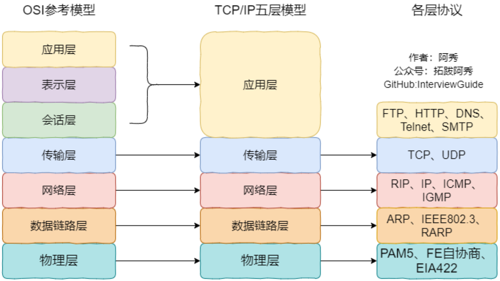

## 一.调试

### 1.gdb


---

##### gdb调试多进程的方法

`set follow-fork-mode child `命令设置gdb在fork之后跟踪子进程。

`set follow-fork-mode parent `设置跟踪父进程。 

>  注意，一定要在fork函数调用之前设置才有效。

### 2.makefile


---

## 二. 链接与编译

### 1.编译与链接过程

##### 1. **一个程序从开始运行到结束的完整过程，你能说出来多少?**

##### 2. **静态链接与动态链接的区别？ 什么是共享库？**

+ 预编译： 运行C预处理器(cpp)将C的源程序 hello.c 翻译成一个ASCII码的中间文件 hello.i. 

  >  `gcc -E hello.c -o hello.i`

  + 处理 “#include” 预编译指令，将文件内容替换到它的位置
  + 删除所有的#define，展开所有的宏定义。 
  + 处理所有的条件预编译指令，如 “#if”、“#endif”、“#ifdef”
  + 删除所有的注释
  + 添加行号和文件标识，便于编译时编译器产生调试用的行号信息

+ 编译：驱动程序运行C编译器(gcc)，将hello.i翻一个一个ASCII汇编语言文件hello.s

  >  `gcc -S hell0.i -o hello.s`

  1. 把预编译之后生成的xxx.i或xxx.ii文件，进行一系列词法分析、语法分析、语义分析及优化后，生成相应的汇编代码文件。
  2. 词法分析：将源代码程序输入到扫描机中，将其中的字符序列分割成一系列的记号，类似于有限状态机
  3. 语法分析：对由扫描器产生的记号进行语法分析，产生语法树。语法分析器完成的是对表达式语法层面的分析
  4. 语义分析：语义分析器则对表达式是否有意义进行判断，其分析的语义是静态语义——在编译期能分期的语义，相对应的动态语义是在运行期才能确定的语义。
  5. 优化：源代码级别的一个优化过程。 
  6. 目标代码生成：由代码生成器将中间代码转换成目标机器代码，生成一系列的代码序列——汇编语言表示。
  7. 目标代码优化：目标代码优化器对上述的目标机器代码进行优化，寻找合适的寻址方式、使用位移来替代乘法运算、删除多余的指令等。

+ 汇编：运行汇编器(as)，将 hello.s 翻译成一个可重定位目标文件 hello.o

  > `gcc -c hell0.s -o hello.o`

  + 汇编器用来将汇编语言源程序转换为机器指令序列。
  + 汇编结果是一个 可重定位目标文件 (如hello.o)，其中包含的是不可读的二进制代码，必须用相应的工具软件来查看其内容。

+ 链接： 运行连接器程序**(ld)**，将**hello.o**和一些必要的系统目标文件组合起来，创建一个可执行文件**prog**:

  > `gcc hell0.o -o hello`

  + 将不同的源文件产生的目标文件进行链接，从而形成一个可以执行的程序。链接分为静态链接和动态链接:
    + 静态链接：
      + 对函数库的链接是放在编译时期完成的是静态链接 。 所有相关的目标文件与牵涉到的函数库被链接合成一个可执行文件。 所有需要的函数已复制到相关位置 。Linux下文件名为`libxxx.a`的形式 。
      +  空间浪费：因为每个可执行程序中对所有需要的目标文件都要有一份副本，如果多个程序对同一个目标文件都有依赖，会出现同一个目标文件都在内存存在多个副本; 
      + 更新困难：每当修改库函数代码，都需要重新进行编译链接形成可执行程序。
      + 运行速度快：可执行程序中具备了所有执行程序所需要的任何内容， 在执行的时候运行速度快。
    + 动态链接：
      + 基本思想是把程序按照模块拆分成各个相对独立部分，库函数的链接载入推迟到程序运行时才链接在一起形成一个完整的程序，动态库文件名`lib**.so`。
      + 共享库：即使每个程序都依赖同一个库，这多个程序在执行时共享同一份副本
      + 更新方便：更新时只需要替换原来的目标文件，而无需将所有的程序再重新链接一遍
      + 性能损耗：把链接推迟到了程序运行时，所以每次执行程序都需要进行链接

---

##### 3. **介绍一下静态库与动态库的创建与使用**

+ **静态库**

  + **静态库命名规则：** lib + 库的名字 + .a

  + **制作规则：**

    + **生成对应的.o文件：** 参数 -c
    + **将生成的.o文件进行打包：** ar rcs + 静态库的名字(libMyCal.a) + 生成的所有.o文件

  + **发布和使用静态库：**

    + 发布静态库
    + 头文件

  + **例子：**

    <div align = center></div>

    + include文件夹存放头文件，src文件夹存放源文件，lib文件夹存放生成的库文件

    + 生成.o文件

      ```bash
      gcc *.c -c -I ../include 
      ```

    + 打包

      ```bash
      ar rcs libMyCal.a *.o
      mv libMyCal.a ../lib
      ```

      <div align = center></div>

    + 利用头文件和静态库来运行程序

      ```bash
      gcc main.c lib/libMyCal.a -o sum -I include
      ```

      ```bash
      # -I include头文件
      # -L 库的目录
      # -l 库的名字，去头去尾
      gcc main.c -I include -L lib -l MyCal -o sum
      ```

  + 利用 nm命令 查看静态库内容

    <div align = center></div>


  + 动态库

    + **动态库命名规则：** lib + 库的名字 + .so

    + **制作步骤：**

      + **生成与位置无关的代码(.o) ：** 参数 -fPIC -c

        <div align = center></div>

        > + 静态库.o在代码段每次位置都相同，所以是与位置有关。
        > + 动态库不会打包到程序中，只有在运行到需要时才会加载到共享库区域，每次加载时放入的位置都不同，所以与位置无关。

      + **将.o打包成动态库：** `gcc -shared  -o libMyCal.so *.o -I include`

    + **例子：**

      + 生成.o文件

        ```bash 
        gcc -fPIC -c *.c -I ../include
        ```

      + 打包成共享库

        ```bash
        gcc -shared  -o libMyCal.so *.o -I ../include
        mv libMyCal.so ../lib
        ```

        <div align = center></div>

      + 利用动态库和头文件来运行程序

        ```bash 
        gcc main.c lib/libMyCal.so -o mysum -I include
        
        gcc main.c -I include -L ./lib -l MyCal -o mysum
        ```

        <div align = center></div>

        > 没有给动态链接器指定动态库libMyCal.so的路径

    + **解决动态链接库失败的问题**

      + 直接放入系统库目录——不推荐

      + 利用export LD_LIBRARY_PATH=目录 来临时添加，终端关闭后会失效

      + 将上述方法写入bashrc——也不推荐

      + 找到动态连接器的配置文件 

        ```bash
        cd /etc
        sudo vim ld.so.conf
        # 动态库的路径写入配置文件
        /Users/zhangyongbin/Desktop/Cal/lib
        # 更新
        sudo ldconfig -v
        ```


---

##### 4. 静态链接库和动态链接库会加载在内存的哪里

+ 动态链接库(Windows的.dll和Linux的.so)及静态链接库(Windows的.lib和Linux的.a)文件都按照可执行文件格式存储
+ 静态库在编译汇编后，在链接时分成可执行文件映像，与程序一起链接成目标文件，然后进行装载运行，只要程序使用就会这么操作
  + 代码段（.text）: 程序源代码编译后的机器指令
  + 数据段（.data）: 已初始化了的全局变量和局部静态变量数据
  + .bss段（.bss）:未初始化的全局变量和局部静态变量
+ 把程序按照模块拆分成各个相对独立部分，在程序运行时才将它们链接在一起形成一个完整的程序。装载在堆与栈的中间，即MMAP位置(Memory Mapping Segment)

---

##### 5. **gcc 与 g++ 的区别？**

+ 从文件角度：
  + 后缀为 .c 的， gcc 把它当作是C程序， g++当作是C++程序；
  + 后缀为 .cpp 的，两者都会认为是 C++程序
  + 虽然 C++是 C 的超集，但是两者对语法的要求是有区别的 ： printString在 c++ 编译环境下是未定义的
+ 编译和链接的角度：
  + 编译可以用 gcc/g++； g++会自动调用 gcc，二者等价 。
  + 链接可以用 g++或者 gcc-lstce++。 因为 gcc 命令不能自动和 c ++程序使用的库链接，所以通常使用 g++来完成链接 。 

+ extern ”C”与 gcc/g++ 并无关系，无论是 gcc 还是 g++，用 extern”C”时，都是以 C 的命名方式来为symbol命名；否则，都以 C++方式命名。

---

### 2.目标文件

+  **目标文件是什么？有哪几种类型？**
  + 目标文件有三种形式:
    + 可重定位目标文件：包含二进制文件和代码，其形式在编译时和其他可重定位目标文件合并起来，创建一个可执行目标文件
      + 每个.o文件由对应的.c文件生成 
      + 每个.o文件代码和数据地址 都从 **0** 开始
    + 可执行目标文件：
      + 包含的代码和数据可以被直接复制到内存并被执行
      + 代码和数据地址为虚拟地址空间中的地址
    + 共享目标文件。
      + 特殊的可重定位目标文件，能在 装入或运行时被装入到内存并自动被链接 ，称为共享库文件

---

## 三. 计算机网络

### 0.计算机网络基础

##### 1. **OSI的七层模型是什么？有哪些功能？**

+ 物理层：底层数据传输，如网线;网卡标准。传输的数据称为比特流
+  数据链路层：定义数据的基本格式，如何传输，如何标识；如网卡MAC地址。 传输的数据称为帧
+ 网络层：定义IP编址，定义路由功能：如不同设备的数据转发。 传输的数据称为包
+ 传输层：端到端传输数据的基本功能；如 TCP、UDP。 传输的数据称为段
+ 会话层：控制应用程序之间会话能力；如不同软件数据分发给不同软件。 
+ 表示层：数据格式标识，基本压缩加密功能。
+ 应用层：各种应用软件，包括 Web 应用。

---

##### 2. **计算机网络体系为什么要按照现有体系进行分层？**

+ 模块化和标准化：根据计算机网络的功能与提供的服务将系统进行这样分层，使网络系统更易于设计，实现和标准化

+ 各层之间相互独立：高层不需要知道底层功能是如何实现的，只需知道利用底层提供的接口来获得所需要的服务
+ 灵活性好：各层的实现无论如何修改，只要提供的功能与接口保持不变，就不会对其他各层以及整个系统产生影响

---

##### 3. **网络的七层/五层模型主要的协议有哪些？**



+  **ARP(地址解析协议)：实现由 IP 地址得到 MAC 地址。**
  + 主机 A 知道主机 B 的 IP 地址，但是 ARP 高速缓存中没有该 IP 地址到 MAC 地址的映射，A 会通过广播发送 ARP 请求分组，B 收到请求后会发送 ARP 响应分组给 A 告知其 MAC 地址，随后 A 在高速缓存中写入 B 的 IP 地址到 MAC 地址的映射。
+  **RIP(内部网关协议)：基于距离向量的路由选择协议。**
  + RIP 按固定的时间间隔仅和相邻路由器交换自己的路由表，经过若干次交换之后，所有路由器最终会知道到达本自治系统中任何一个网络的最短距离和下一跳路由器地址。
+  **IP(互联网协议)：提供一种不可靠，无连接的数据包交付服务。依赖其他层协议进行差错控制。转发路由需要IP**
+  **ICMP(网际控制报文协议)：ICMP允许主机或路由器报告差错情况和提供相关异常情况的报告。**
  + ICMP报文作为IP层数据报的数据，加上数据报的首部，组成 IP 数据报发送出去。
  + ICMP报文种类：
    + 差错报告报文：（类型值：报文类别）
      + 3：终点不可达
      + 11：时间超过
      + 12：参数问题
      + 5：改变路由
    + 询问报文：
      + 8/0：会送请求或回答
      + 13/14：时间戳请求或回答
  + 应用：
    + ping：测试两台主机之间的连通性。
    + Traceroute：用来跟踪一个分组从源点到终点的路径。
+  **IGMP(网际组管理协议)：负责IP组播成员管理的协议，用来在IP主机和与其直接相邻的组播路由器之间建立、维护组播组成员关系。**

### 1.网络层


### 2.传输层

##### 1. **是什么是TCP 粘包/拆包 ？ 发生的原因？**

+ 一个完整的业务可能被TCP拆分成多个包发送，可能多个包数据到接收方接收时粘成一包，这就是TCP的拆包和粘包
+ 原因：
  + 因为TCP默认会使用 **Nagle算法** ，此算法会导致粘包。	
    + 只有上一个分组得到确认，才会发送下一个分组;
    + 收集多个小分组，在一个确认到来时一起发送。
  + 应用程序写入数据的字节大小大于套接字发送缓冲区大小
  + 进行MSS大小的TCP分段。( MSS=TCP报文段长度-TCP首部长度)

+ 解决方法：
  + 消息定长。
  + 在包尾部增加回车或者空格符等特殊字符进行分割
  + 将消息分为消息头和消息尾。
  + 使用其它复杂的协议，如RTMP协议等。

---

##### 2. **讲讲TCP KeepAlive(保活机制,即心跳包)**

+ TCP连接双方在连接空闲状态时，如果一方发生意外，另一方无法得知TCP连接已经失效，会一直维护这个连接。长时间的积累会导致非常多的半打开连接，造成端系统资源的消耗和浪费，
+ 所以 TCP 连接建立后，启用 TCP Keepalive 的一端便会启动一个计时器，当tcp_keep-alive_time时间到达 0 之后便会被发出纯 ACK 包去进行探测。根据对方的回应做出后序操作。

---

##### 3. **传输层的工作内容是什么？**

+ 从通信和信息处理的角度看，运输层向上面的应用层提供通信的服务，属于面向通信部分的最高层，也是用户功能部分的最底层。(只有网络边缘部分的主机协议栈才有运输层)

---

##### 4. **网络层与传输层的区别？**

+ 网络层是为主机之间提供逻辑通信
+ 传输层为应用进程之间提供端到端的逻辑通信

---

##### 5. **运输层有什么重要功能？**

+ 主机中实现多个应用进程分别与另一台主机中的多个应用进程通信，拥有复用与分用的能力
  + 复用： 发送方不同应用进程都能使用同一个运输层协议传输数据（加上适当的首部）
  + 分用： 接收方的运输层在剥去报文的首部后，能把数据正确的交付给对应的目的进程

---

##### 6. **在运输层中端口有什么作用？**

+ 从运输层的角度看，通信的对象是进程，而端口就代表了进程。
  + 端口用一个16位端口号进行标记
  + 只需有本地意义，只标记了本计算机应用层的各个进程

---

##### 7. **一台机器能够使用的端口号上限是多少，是否可以修改?如果想要用的端口超过这个限制怎么办? **

+ 65536个。 TCP的报文头部源端口号和目的端口号的长度是16位，表示 $2^{16}=65536$ 个不同端口号。但0到1023是知名服务端口，所以实际上会少1024个端口号。
+ 而对于服务器来说，端口数目与65536无关，受限Linux可以打开的文件数量，并且通过MaxUserPort 进行配置。

---

##### 8. **封包和拆包你听说过吗?它是基于TCP还是UDP的?**

+  封包和拆包都是基于TCP的。因为TCP是无边界的流传输，所以需要对TCP进行封包和拆包，确保发送和接收的数据不粘连。
    + 封包：在发送数据报时为每个TCP数据包加上一个包头，将数据报分为包头和包体两个部分。包头是一个固定长度的结构体，里面包含该数据包的总长度。 
  + 拆包：接收方在接收到报文后提取包头中的长度信息进行截取。

---

##### 9. **用户数据报协议UDP(User Datagram Protocol) 有什么特点？**

1. 面向报文的，对应用层交付的报文，不合并也不拆分，加上首部之后直接发送

   > + 报文太长，交给IP层之后，IP层可能会分片，降低IP层效率
   > + 报文太短，交给IP层之后，显得IP数据报首部相对长度太长，也降低IP层效率

2. 无连接的：发送消息之前不需要建立连接，减少了开销与发送数据之前的延迟
3. 尽最大努力交付：不保证可靠交付，因此主机之间不需要维持复杂的连接状态表
4. 没有拥塞控制：因此网络拥塞时不会使源主机的发送速率降低，符合多媒体通信要求
5. 支持一对一，一对多，多对一，多对多的交互通信
6. 首部开销小，只有8字节，比TCP的20字节小

---

##### 10. **介绍一下UDP的首部格式**

+ UDP有两个字段：  首部字段 和 数据字段。首部字段有8个字节，由4个字段组成，每个字段占两个字节：
  + 源端口： 源端口号。需要给对方回信时使用，不用时赋予0
  + 目的端口： 目的端口号。 在终点交付报文时必须使用
  + 长度：UDP数据报的长度，最小值为8
  + 检验和：检验UDP 数据报在传输过程中是否出错，出错则丢弃

---

##### 11. **在进行UDP编程的时候，一次发送多少bytes好?**

+ IP数据报大于1500字节(MTU)时需要分片。建议将UDP的数据控制在1472字节以下(1500-ip头-UDP头).
+ 进行Internet编程时则不同，因为Internet上的路由器可能会将MTU设为不同的值. 如果我们假定MTU为1500来发送数据的,而途经的某个网络的MTU值小于1500字节,那么系统将会使用一 系列的机制来调整MTU值,使数据报能够顺利到达目的地,这样就会做许多不必要的操作.
+ 鉴于Internet上的标准MTU值为576字节。建议在进行Internet的UDP编程时. 最好将UDP的数据长度控件在548字节(576-8-20)以内

---

##### 12. **为什么需要TCP协议？**

+ IP层是不可靠，不保证网络包的按需交付与数据完整性。
+ 如果需要保证传输过程可靠，则需要上层的TCP协议来负责，TCP能保证接收端收到的网络包是按序，无损坏的

---

##### 13. **介绍一下 传输控制协议TCP(Transmission Control Protocol)，它有什么特点？**

+ TCP是面向连接的运输层协议，在无连接，不可靠的IP层网络服务基础上提供 **可靠交付** 的 **基于字节流** 的传输层通信协议

  + 面向连接： TCP连接只支持点对点的，只有两个端点

  + 可靠的：传输过程中无论网络链路怎么变化，TCP第一能保证报文能达到接收端

  + 面向字节流： 虽然应用程序与TCP以数据块的形式交互，但TCP把上层交付下来的数据仅看成是一连串无结构的字节流

    > TCP 不保证接收方应用程序数据块与发出的数据块大小对应，但字节流必须完全一样。

+ 传输过程的特点：

  + TCP 根据对方给出的窗口值和当前网络拥塞的程度来决定一个报文段应包含多少个字节（UDP 发送的报文⻓ 度是应用进程给出的）
  + TCP 可把太⻓的数据块划分短一些再传送
  + TCP 也可等待积累有足够多的字节后再构成报文段发送出去

---

##### 14. **TCP报文段首部有哪些字段？**

+ 从前往后分别是
  + 源端口号 (2 bytes)；目的端口号 (2 bytes)
  + 序号  (4 bytes)：TCP 连接中传送的数据流的序号。序号字段的值是报文段所发送数据的第一个字节的序号。
  + 确认号  (4 bytes)：期望收到对方下一个报文数据中第一个字节的序号。
  + 数据偏移 (4 bits)：TCP 报文段的数据起始处距离 TCP 报文段的起始处有多远
  +  保留 (6 bits)：保留为今后使用，但目前应置为 0。
  + 紧急URG (1 bits)：当 URG=1 表明 **紧急指针** 有效，此报文段中有紧急数据，应尽快传送(相当于高优先级的数据)
  + 确认ACK (1 bits)：ACK=1 时确认号字段才有效。当 ACK =0 时，确认号无效。
  + 推送PSH (1 bits)： PSH=1 表示应尽快地交付接收应用进程，而不再等到整个缓存都填满了后再向上交付。
  + 复位RST (1 bits)： RST=1 表明 TCP 连接中出现严重差错，必须释放连接，然后再重新建立运输连接。
  + 同步SYN (1 bits)：SYN=1 表示这是一个连接请求或连接接受报文。
  + 终止FIN (1 bits)：用来释放一个连接。FIN=1 表明此报文段的发送端的数据已发送完毕，并要求释放运输连接。
  + 窗口 (2 bytes)：用来让对方设置发送窗口的依据，单位为字节。
  + 检验和  (2 bytes)：检验和字段检验的范围包括首部和数据这两部分
  + 紧急指针 (2 bytes)：指出在本报文段中紧急数据共有多少个字节（紧急数据放在本报文段数据的最前面）
  + 选项字段 ：长度可变
  + 填充(首部是4字节的整数倍)： 使整个首部长度是 4 字节的整数倍

##### 15. **TCP 头部有哪些信息？具体什么作用？**

##### 16. **常见TCP的连接状态有哪些?**

---

##### 17. **介绍一下TCP的连接的端点与协商内容**

+ TCP面向的是套接字，连接端点称为socket或者插口

  <div align  = center>socket = ip地址 + 端口号 </div>

+ 建立TCP连接时需要通信两端达成三个信息的共识

  + socket：即IP地址与端口号
  + 序列号：用来解决乱序问题
  + 窗口大小：用作流量控制

---

##### 18. **如何确定一个TCP连接**

+ 源地址，源端口，目的地址，目的端口，这四元组能确定一个连接
  + 源地址，目的地址 在IP头部，通过IP协议将报文发送到具体主机
  + 源端口，目的端口 在TCP头部，通过TCP协议将报文发送到具体进程

---

##### 19. **有一个 IP 的服务器监听了一个端口，它的 TCP 的最大连接数是多少？**

+ 最大TCP连接数 = 客户端 IP 数 * 客户端的端口数

+ 对 IPv4， IP 数最多为 $2^{32}$ ，端口数最多为$2^{16}$，则最大 TCP连接数为 $2^{48}$。但远不能到达这个上限值。

  > + 文件描述符限制，Socket 都是文件，要通过 ulimit 配置文件描述符的数目;
  > + 内存限制

---

##### 20. **什么是半连接队列？**

+ 服务器第一次收到客户端的 SYN 之后处于 SYN_RCVD 状态，此时双方还没有完全建立其连接，服务器会把此种状态下请求连接放在一个 **队列** 里，这就是 **半连接队列** 。
+ 对应自然有 **全连接队列**，就是已经完成三次握手，建立起连接的就会放在全连接队列中。如果队列满了就有可能会出现丢包现象。

---

##### 21. **TCP与UDP有哪些区别？**

1. 连接：
   +  TCP面向连接传输协议，传输数据之前需建立连接，UDP无连接，即可传输
2. 服务对象
   + TCP点对点
   + UDP都行
3. 传输方式
   + TCP 面向连接，基于字节流，无边界，但保证有序与可靠
   + UDP直接发送包，有边界，但可能出现丢包与乱序
4. 可靠性
   + TCP是可靠交付数据，有序，不丢失，无损伤
   + UDP尽最大努力传输，不保证可靠性
5. 拥塞控制，流量控制
   + TCP有拥塞控制与流量控制机制，保证数据传输的安全性
   + UDP没有，就算网络拥堵也不影响发送速率
6. 首部开销
   + TCP首部较长，没有使用选项字段时为20字节，开销较大
   + UDP首部只有8字节，固定不变，开销较小
7. 分片方法
   + TCP是在传输层进行分片，当数据大于MSS，TCP会进行分片，若中途丢失一个分片，只需重发对应分片即可
   + UDP是在网络层进行分片，当数据大于MTU，IP会进行分片，若中途丢失一个分片，在实现可靠传输的 UDP 时需重传整个的数据包，所以通常UDP报文应该小于MTU
8. 应用场景
   + TCP是可靠交付，用于
     + FTP文件传输
     + HTTP/HTTPS
   + UDP 无连接，可随时发送，处理简单高效
     + 包总量较小的通信，如DNS，SNMP
     + 视频，音频等多媒体通信
     + 广播通信

---

##### 22. **为什么UDP头部没有 首部长度 字段，而TCP有？**

+ TCP有可变长的 选项 字段，所以需要记录长度
+ UDP首部大小固定，无需记录

---

##### 23. **为什么 UDP 头部有「包⻓度」字段，而 TCP 头部则没有「包⻓度」字段呢?**

+ TCP 是计算负载数据⻓度:  TCP数据的⻓度 =  IP总⻓度 - IP首部⻓度 - IP首部⻓度
+ UDP其实也可以这么计算，但可能是为了网络设备硬件设计和处理方便，首部⻓度需 **4** 字节整数倍。利用字段可能可能是为了补全。

---

##### 24. **TCP连接建立过程中要解决哪些问题？**

- 要使每一方都能够确知对方的存在。
- 要允许双方协商一些参数(如最大窗口值，是否使用窗口扩大选项和时间戳选项以及服务质量等)。
- 能够对运输实体资源(如缓存大小，连接表中的项目等)进行分配。

---

##### 25.  **TCP链接建立过程**

+ 首先服务器端进程创建运输控制块TCB，处于 LISTEN(监听) 状态，等待客户端的链接到来
+ 客户端进程创建运输控制块TCB，想要建立TCB连接时， 向服务器端发送 TCB请求报文， 报文首部中的 同部位SYN=1，同时初始化序列号 seq=x， SYN报文中不能携带数据，但需要消耗一个序号。此时客户端处于 SYN-SENT(同步已发送)状态。
+ 服务器端接收到请求报文后，如果同意建立TCB连接，想客户端发送ACK确认报文报文首部中的 同部位SYN=1，ACK=1，同时初始化序列号 seq=y，确认序列 ack=x+1，此时报文中也不能携带数据，需要消耗一个序列号，此时服务器端处于 SYN-RECV(同步收到) 状态。
+ 客户端收到服务器端的确认后，需要向服务器端发送确认报文，报文中 ACK=1，SYN序列 seq=x+1，确认序列 ack=y+1。此时的确认报文可以携带数据，如果不需要携带，则不消耗序列号。此时客户端进入 ESTABLISHED 状态
+ 服务器端接收到确认报文后，也进入ESTABLISHED状态，TCP连接建立完成。

---

##### 26. **TCP建立连接中维护「序列号」的作用？**

+ 接收方可以去除重复的数据; 
+ 接收方可以根据数据包的序列号按序接收; 
+ 可以标识发送出去的数据包中， 哪些是已经被对方收到的

---

##### 27. **TCP建立连接为什么是三次握手，而不是两次或四次？**

+ TCP 建立连接时，通过三次握手能防止历史连接的建立，能减少双方不必要的资源开销，能帮助双方同步初始化序列号。序列号能够保证数据包不重复、不丢弃和按序传输。
+ 不使用「两次握手」和「四次握手」的原因:
  + 「两次握手」:无法防止历史连接的建立，会造成双方资源的浪费，也无法可靠的同步双方序列号; 
  + 「四次握手」:三次握手就已经理论上最少可靠连接建立，所以不需要使用更多的通信次数。

---

##### 28. **为什么客户端和服务端的初始序列号 ISN 是不相同的**

+ 如果序列号相同，那么就无法分辨出该报文是不是历史报文，如果历史报文被新的连接接收了，则会产生数据错乱
+ 为了安全性，防止黑客伪造的相同序列号的 TCP 报文被对方接收。

---

##### 29. **初始序列号 ISN(Initial Sequence Number) 是如何随机产生的?**

+ ISN = M + F (localhost, localport, remotehost, remoteport)

  > + M 是一个计时器，这个计时器每隔 4 毫秒加 1。
  > + F 是一个 Hash 算法，根据源 IP、目的 IP、源端口、目的端口生成一个随机数值。要保证 Hash 算法不能被外部轻易推算得出，用 MD5 算法是一个比较好的选择。

---

##### 30. **既然 IP 层会分片，为什么 TCP 层还需要 MSS 呢?**

> +  **MTU :** 一个网络包的最大⻓度，以太网中一般为 1500 字节;
> +  **MSS :** 除去 IP 和 TCP 头部之后，一个网络包所能容纳的 TCP 数据的最大⻓度;

+ 将 TCP 的整个报文(头部 + 数据)交给 IP 层进行分片的话，如果一个 **IP** 分片丢失，整个 **IP** 报文的所有分片都得重传。  IP 层本身没有超时重传机制，由传输层的 TCP 来负责超时和重传。
+ 当接收方发现 TCP 报文(头部 + 数据)的某一片丢失后，则不会响应 ACK 给对方，那么发送方的 TCP 在超时后，就重会发「整个 TCP 报文(头部 + 数据)」。非常没有效率。
+ 为了达到最佳的传输效能， TCP 协议在建立连接的时候通常要协商双方的 **MSS** 值，当 TCP 层发现数据超过 MSS 时，则就先会进行分片，经过 TCP 层分片后，如果一个 TCP 分片丢失后，进行重发时也是以 **MSS** 为单位，而不用传所有 的分片，大大增加了重传的效率。

---

##### 31. **什么是SYN攻击？**

+ 攻击者短时间伪造不同 IP 地址的 SYN 请求报文，服务端每接收到一个 SYN 报文就进入 SYN_RCVD 状态，但服务端发送出去的 ACK + SYN 报文，无法得到未知 IP 主机的 ACK 应答，久而久之就会占满服务端的未连接队列，使得服务器不能为正常用户服务。

---

##### 32. **如何避免SYN攻击？**

+ 修改 Linux 内核参数，控制队列大小和队列满时相应的处理。
  + 当网卡接收数据包的速度大于内核处理的速度时，会有一个队列保存这些数据包。超出处理能时，对新的 SYN 直接回报 RST 复位包、丢弃连接。

---

##### 33. **TCP链接释放的过程**

+ 客户端进程向服务器端发送释放连接的报文，其中 FIN=1，初始化序列号seq=u，并停止发送数据，主动关闭TCP连接，进入 **FIN-WAIT1终止等待1** 状态，等待服务器端的确认。
+ 服务器端收到客户端的释放连接报文后，发送确认报文，其中ACK=1，序列号seq=v，确认报文ack=u+1，服务器端进入 **CLOSE_WAIT关闭等待** 状态，此时TCP处于半关闭状态，客户端到服务器端的链接释放。
+ 客户端在接收到服务器端的确认报文后，进入 **FIN_WAIT2终止等待2** 状态，等待服务器端发送连接释放报文
+ 等到服务器端没有需要向客户端发送的数据时，发送连接释放报文，其中FIN=1，ACK=1，序列号seq=w，确认序列ack=u+1，服务器端进入 **LAST_ACK最后确认** 状态，等待客户端的确认
+ 客户端收到服务器端的释放连接报文后，发出确认报文，其中ACK=1，序列号seq=u+1，确认序列ack=w+1，客户端进入 **TIME_WAIT时间等待** 状态。经过时间 **2MSL** 后，客户端进入 **CLOSED** 状态。
+ 服务器端收到确认报文后，也进入 **CLOSED** 状态。

---

##### 34. **释放连接为什么需要四次挥手？**

+ 关闭连接时，客户端向服务端发送 FIN 时，仅仅表示客户端不再发送数据了但是还能接收数据。
+ 服务器收到客户端的 FIN 报文时，先回一个 ACK 应答报文，而服务端可能还有数据需要处理和发送，等服务端不再发送数据时，才发送 FIN 报文给客户端来表示同意现在关闭连接。
+ 从上面过程可知，服务端通常需要等待完成数据的发送和处理，所以服务端的 ACK 和 FIN 一般都会分开发送，从而比三次握手导致多了一次。

---

##### 35. **对于FIN_WAIT_2，CLOSE_WAIT状态和TIME_WAIT状态?你知道多少?**

+ FIN_WAIT_2:

  + 半关闭状态。
  + 发送断开请求一方还有接收数据能力，但已经没有发送数据能力。

+  CLOSE_WAIT状态:

  + 被动关闭连接一方接收到FIN包会立即回应ACK包表示已接收到断开请求。

  + 被动关闭连接一方如果还有剩余数据要发送就会进入CLOSED_WAIT状态。

+  TIME_WAIT状态:

  + 又叫2MSL等待状态。 如果客户端直接进入CLOSED状态，如果服务端没有接收到最后一次ACK包会在超时之后重新再发FIN包，此时因为客户端已经CLOSED，所以服务端就不会收到ACK而是收到RST。
  + 所以 TIME_WAIT状态目的是防止最后一次握手数据没有到达对方而触发重传FIN准备的。 在2MSL时间内，同一个socket不能再被使用，否则有可能会和旧连接数据混淆(如果新连接和旧 连接的socket相同的话)。

---

##### 36. **MSL 与 TTL 的区别是什么？**

+  MSL 是 Maximum Segment Lifetime，表示任何报文在网络上存在的最⻓时间，超过这个时间报文将被丢弃。
+  因为 TCP 报文基于是 IP 协议的，而 IP 头中有一个 TTL 字段，表示经过的最大路由数，每经过一个路由器就减 1，为 0 则被丢弃，同时发送 ICMP 报文通知源主机。
+  MSL 的单位是时间，而 TTL 是经过路由跳数。往往 **MSL** 应该要大于等于 **TTL** 消耗为 **0** 的 时间，以确保报文已被自然消亡。

---

##### 37. **为什么需要 TIME_WAIT 状态?**

+  消除旧连接的数据包，经过 2MSL 时间两个方向上的数据包都会在网络中自然消失，再出现的数据包一定都是新建立连接所产生的。
+  如果没有 TIME_WAIT状态，服务端如果没有接收到最后一次ACK包，会在超时之后重新再发FIN包，但此时客户端已经CLOSED，服务端就不会收到ACK而是收到RST。 服务端则会一直处在 LASE_ACK 状态。

---

##### 38. **为什么 TIME_WAIT 等待的时间是 2MSL?**

+  网络中可能存在来自发送方的数据包，当这些数据包被接收方处理后又会向对方发送响应，一来一回需要等待 **2** 倍的时间。
+ 在 Linux 系统里 2MSL 默认是 60 秒，那么一个 MSL 也就是 30 秒。**Linux** 系统停留在 **TIME_WAIT** 的时间为固定的 **60** 秒。

---

##### 39. **可以解释一下 ** **RTO** **，** **RTT** **和超时重传分别是什么吗?**

+ 超时重传： 发送端发送报文后若长时间未收到确认则需要重发该报文。可能有以下几种情况:
  + 发送的数据没能到达接收端，所以对方没有响应。 
  + 接收端接收到数据，但是ACK报文在返回过程中丢失。 
  + 接收端拒绝或丢弃数据。
+ RTO：从上一次发送数据，因为长期没有收到ACK响应，到下一次重发之间的时间。就是重传间隔。
  + 通常每次重传RTO是前一次重传间隔的两倍，计量单位通常是RTT。例:1RTT，2RTT，4RTT， 8RTT......
     重传次数到达上限之后停止重传。
+ RTT：数据从发送到接收到对方响应之间的时间间隔，即数据报在网络中一个往返用时。大小不稳定。

---

##### 40. **TIME_WAIT 过多的原因，有什么危害以及解决方法?**

+  原因：
  
  +  短时间内出现过多的TCP链接释放
  
+ 危害：

  +  客户端TIME_WAIT过多，就会导致端口资源被占用，被占满就会导致无法创建新的连接。
  +  服务端只监听一个端口，但是会把连接扔给处理线程，理论上监听的端口可以继续监听。但是当服务端出现大量 TIME_WAIT 时，系统资源被占满时，会导致处理不过来新的连接。

+  处理方法：

   +  调整系统内核参数：

      +   修改系统默认的 TIMEOUT 时间 tcp_fin_timeout
      +  减少保持TIME_WAIT套接字的最大数量 tcp_max_tw_buckets
      +  增加可用端口范围

   +  调整短链接为长链接

      +  短连接：连接->传输数据->关闭连接

         > 短连接是指SOCKET连接后发送后接收完数据后马上断开连接。

      +  长链接：连接->传输数据->保持连接 -> 传输数据-> ... ->关闭连接

         > 长连接指建立SOCKET连接后不管是否使用都保持连接，但安全性较差。

---

##### 41. **服务器出现大量close_wait的连接的原因是什么?有什么解决方法?**

+ 原因:

  + 服务器内部业务处理占用了过多时间，都没能处理完；或者还有数据需要发送；或者服务器的业务逻辑有问题，没有执行close()方法 
  + 服务器的父进程派生出子进程，子进程继承了socket，收到FIN的时候子进程处理但父进程没有处理该信号，导致socket的引用不为0无法回收

+ 危害：socket资源会被耗尽

+ 处理方法: 

  + 停止应用程序

  + 修改程序里的bug

---

##### 42. **TCP如何实现的可靠传输？** 

+ 首先，采用三次握手来建立TCP连接，四次握手来释放TCP连接，从而保证建立的传输信道是可靠的。
+ 其次，TCP采用了连续ARQ协议来保证数据传输的正确性，使用滑动窗口协议来保证接方能够及时处理所接收到的数据，进行流量控制。
+ 最后，TCP使用慢开始、拥塞避免、快重传和快恢复来进行拥塞控制，避免网络拥塞。

---

##### 43. **介绍一下停止等待协议**

+ **“**停止等待**”**就是每发送完一个分组就停止发送，等待对方的确认。在收到确认后再发送下一个分组。
+ 发送方如何知道对方正确收到消息的？
  + 每一个已发送的分组都设置了一个超时计时器。 只要在超时计时器到期之前收到了相应的确认，就撤销该超时计时器，继续发送下一个分组 ，否则重发
+ 如何知道收到了重复的分组，需要丢弃呢？
  + 每一个发送的分组都进行编号。接收方收到了编号相同的分组，则认为收到了重复分组，会进行丢弃，并回送确认
  + 发送方也为发送的确认也进行编号，指示该确认是对哪一个分组的确认。
  + 接收方根据确认其编号，可以确定它是对哪一个分组的确认，避免重发发送。若为重复的确认，则将其丢弃。
+ 改进：为了提高传输效率，发送方可以不使用低效率的停止等待协议，而是采用流水线传输。

---

##### 44. **介绍一下 连续ARQ协议**

+ 发送方设置
  + 发送方设置发送窗口，将发送窗口中的分组连续发送出去，而不用逐个等待对方的确认，提高了信道利用率
  + 发送方每接收到一个确认，就会把发送窗口向前滑动一个分组的位置
+ 接收方设置
  + 不需要逐个发送确认，只需对按序到达的最后一个分组发送确认，表示到这个分组为止的所有分组都已正确收到。
+ 回退N机制：如果发送方发送了前 5 个分组，而中间的第 **3** 个分组丢失了。这时接收方只能对前两个分组发出确认。发送方无法知道后面三个分组的下落，而只好把后面的三个分组都再重传一次。 
+ 优点：容易实现，即使确认丢失也不必重传
+ 缺点：不能向发送方反映出接收方已经正确收到的所有分组的信息。

---

##### 45. **介绍一下TCP的流量控制方法**

+ TCP利用滑动窗口实现流量控制。窗口用来暂时存放字节流。发送方和接收方各有一个窗口。接收方通过 TCP 报文段中的窗口字段告诉发送方自己的窗口大小，发送方根据这个值和其它信息设置自己的窗口大小。
+ 发送方：发送窗口内的字节都允许被发送，窗口左部的字节已经发送并且收到了确认，就将窗口右滑动一定距离，直到左部第一个字节不是已发送并且已确认的状态。
+ 接收方：接收窗口内的字节都允许被接收，接收窗口左部字节已经发送确认并交付主机，就向右滑动接收窗口。接收窗口只会对窗口内最后一个按序到达的字节进行确认。

---

##### 46. **介绍一下TCP的拥塞控制原理**

+ 流量控制是为了让接收方能来得及接收，而拥塞控制是为了降低整个网络的拥塞程度。否则导致网络拥塞程度更高，重发分组数目也会更多

+ TCP 主要通过四个算法来进行拥塞控制: 慢开始、拥塞避免、快重传、快恢复。

+ 发送方需要维护一个叫做拥塞窗口(cwnd)的状态变量

  >  拥塞窗口 与 发送方窗口 的区别：拥塞窗口只是一个状态变量，实际决定发送方能发送多少数据的是发送方窗口。

+ **慢开始与拥塞避免**

  + 发送的最初执行慢开始，令 cwnd = 1，只能发送 1 个报文段；当收到确认后，将 cwnd 加倍
  + 设置一个慢开始⻔限 ssthresh，当 cwnd >= ssthresh 时，进入拥塞避免，每个轮次只将 cwnd 加 1
  + 如果出现了**==超时==**，则令 ssthresh = cwnd / 2，然后重新执行慢开始。

+  **快重传与快恢复**

  + 在接收方，要求每次接收到报文段都应该对最后一个已收到的有序报文段进行确认。例如已接收到 M1，M2，此时收到 M4，应当发送对 M2 的确认。 
  + 在发送方，如果收到三个重复确认，则知道下一个报文段丢失，应执行快重传，立即重传下一个报文段。例如收到三个 M2，则 M3 丢失，立即重传 M3。
  + 在这种情况下，只是**==丢失==**个别报文段，而不是网络拥塞。因此执行快恢复，令 ssthresh = cwnd / 2 ，cwnd = ssthresh，注意到此时直接进入拥塞避免。

> 区分好 两者的区别和使用场景。
>
> +  发生超时：说明对方的确认包发不过来，说明网络拥堵，则进行慢开始和拥塞避免
> + 发生丢失：说明重复三次ACK，有丢失，则进行快重传和快恢复，避免拥塞。

---

### 3.应用层

---

##### 1. **应用层的功能是什么？**

+ 应用进利用程相应的应用层协议来使用下层网络所提供的通信服务。

---

##### 2. **介绍一下域名解析系统 DNS**

+ DNS(Domain Name Server，域名服务器) 是一个分布式数据库，提供了主机名和 IP 地址之间相互转换的服务。
+ DNS 可以使用 UDP 或 TCP 进行传输，端口号都为 53。多数情况使用 UDP 。使用TCP 情况：
  + 如果返回的响应超过的 512 字节（UDP 最大只支持 512 字节的数据）。
  + 区域传送（区域传送是主域名服务器向辅助域名服务器传送变化的那部分数据）。

---

##### 3. **介绍一下域名解析系统的工作方式：**

+  主机向本地域名服务器的查询一般都是采用递归查询。向上递归，查完后返回
+ 本地域名服务器向根域名服务器的查询的迭代查询。每次询问完都给反馈
  1. 输入域名后，浏览器先检查缓存中是否有域名映射的ip地址，有解析结束。
  2. 若无，则检查操作系统缓存(如Windows的hosts)中有无解析过的结果，有解析结束。
  3. 若无，则查找本地DNS解析器缓存，有解析结束。
  4. 若无，首先找本地DNS服务器，查询到相对应的IP地址映射或者缓存信息则结束。
  5. 若无，则根据本地DNS服务器设置的转发器进行查询：
     + 未用转发模式：
       + 本地DNS就把请求发至根DNS进行迭代查询，根DNS服务器收到请求后会判断域名(.com)由谁授权管理，返回负责该顶级域名服务器的一个IP。
       + 本地DNS服务器收到IP后，联系负责.com域的服务器，若无法解析，它会找下一级DNS服务器地址给本地DNS服务器。本地DNS服务器收到地址就找域名域服务器，重复上面动作，直至找到域名对应的主机
     + 使用转发模式：
       + 本地DNS服务器把请求转发至上一级DNS服务器，让它进行解析，若不能解析，把请求转至上上级，以此循环，直至找到，然后原路回来。最后把结果返回给本地DNS服务器，DNS服务器再返回给客户机

---

##### 4. **为什么域名解析基本上使用 UDP 协议？**

+ 因为UDP快! UDP的DNS协议只要一个请求、一个应答就好了。TCP需要三次握手建立连接

---

##### 5. **为什么区域传送使用 TCP 协议？**

+ 因为TCP协议可靠性好。从主DNS上复制内容需要进行可靠传输，而且UDP有大小限制，最大只支持 512 字节的数据。万一同步的数据大于512字节就无法使用UDP了。

---

##### 6. **介绍一下DNS的负载均衡策略**

+ 一个网站有大量用户请求，请求的资源位于同一台机器，这台机器随时可能会蹦。处理办法就是DNS负载均衡技术
+ 原理是在DNS服务器中为同一个主机名配置多个IP地址，在应答DNS查询时，DNS服务器对每个查询 **将以DNS文件中主机记录的IP地址按顺序返回不同的解析结果** ，将客户端的访问引导到不同的机器上去，使得不同的客户端访问不同的服务器，达到负载均衡的目的。

---

##### 7. **介绍一下动态主机配置协议DHCP**

+ 提供了即插即用的连网方式，让DHCP服务器自动分配IP 地址等信息，不再需要用户手动配置 。
  1. 客户端发送 Discover 报文，目的地址为 255.255.255.255:67，源地址为 0.0.0.0:68，被放入 UDP 中，该报文被广播到同一个子网的所有主机上。
  2. DHCP 服务器收到 Discover 报文之后，发送 Offer 报文给客户端，该报文包含了客户端所需要的信息
  3. 客户端选择了某个 DHCP 服务器提供的信息，那就发送 Request 报文给该 DHCP 服务器。
  4. HCP 服务器发送 Ack 报文，表示客户端此时可以使用提供给它的信息。

---

##### 8. **应用层中分别基于TCP，UDP的协议**

+ TCP：
  + FTP：定义了文件传输协议，使用21端口. 
  + Telnet：它是一种用于远程登陆的端口,23端口 
  + SMTP：定义了简单邮件传送协议，服务器开放的是25号端口。 
  + POP3：它是和SMTP对应，POP3用于接收邮件。

+ UDP：
  + DNS：用于域名解析服务，用的是53号端口 
  + SNMP：简单网络管理协议，使用161号端口
  + TFTP(Trival File Transfer Protocal)：简单文件传输协议，69

---

##### 9. **简单介绍一下HTTP协议**

+ 超文本传输协议HTTP是一个简单的请求—响应协议，运行在TCP之上，指定了客户端可能发送给服务器端的消息类型与响应类型，请求和响应消息以ASCII形式给出；而消息内容则具有一个类似MIME的格式。 

---

##### 10. **介绍一下 HTTP 请求报文与响应报文**

+ 客户端发送请求报文给服务器，服务器进行处理请求报文中的信息，并将处理结果放入响应报文中返回给客户端。

+ 请求报文结构：

  + 第一行是包含了请求方法、URL、协议版本；
  + 接下来的多行都是请求首部 Header，每个首部是以 首部名称: 值 来显示。
  + 一个空行用来分隔首部和内容主体 Body
  + 最后是请求的内容主体

  ```http
  GET http://www.example.com/ HTTP/1.1
  Accept: text/html,application/xhtml+xml,application/xml;q=0.9,image/webp,image/apng,*/*;q=0.8,application/signed-exchange;v=b3;q=0.9
  Accept-Encoding: gzip, deflate
  Accept-Language: zh-CN,zh;q=0.9,en;q=0.8
  Cache-Control: max-age=0
  Host: www.example.com
  If-Modified-Since: Thu, 17 Oct 2019 07:18:26 GMT
  If-None-Match: "3147526947+gzip"
  Proxy-Connection: keep-alive
  Upgrade-Insecure-Requests: 1
  User-Agent: Mozilla/5.0 xxx
  
  param1=1&param2=2
  ```

+ 响应报文结构：

  + 第一行包含 协议版本、状态码以及描述
  + 接下来多行也是首部内容
  + 一个空行分隔首部和内容主体
  + 最后是响应的内容主体

  ```http
  HTTP/1.1 200 OK
  Age: 529651
  Cache-Control: max-age=604800
  Connection: keep-alive
  Content-Encoding: gzip
  Content-Length: 648
  Content-Type: text/html; charset=UTF-8
  Date: Mon, 02 Nov 2020 17:53:39 GMT
  Etag: "3147526947+ident+gzip"
  Expires: Mon, 09 Nov 2020 17:53:39 GMT
  Keep-Alive: timeout=4
  Last-Modified: Thu, 17 Oct 2019 07:18:26 GMT
  Proxy-Connection: keep-alive
  Server: ECS (sjc/16DF)
  Vary: Accept-Encoding
  X-Cache: HIT
  
  <!doctype html>
  <html>
  <head>
      <title>Example Domain</title>
  	// 省略... 
  </body>
  </html>
  ```

---

##### 11. **介绍一下URL？**

+ http 使用 URL（ **U**niform **R**esource **L**ocator，统一资源定位符）来定位资源，是 URI（**U**niform **R**esource **I**dentifier，统一资源标识符）的一个子集，URL 在 URI 的基础上增加了定位能力。

  > URI 还包含 URN（Uniform Resource Name，统一资源名称），它知识用来定义一个资源的名称，并不具备定位该资源的能力。

---

##### 12. **介绍一下HTTP请求行中有哪些方法？**

+ HTTP1.0 定义了三种请求方法: GET, POST 和 HEAD方法。
+  HTTP1.1 新增了六种请求方法:OPTIONS、PUT、PATCH、DELETE、TRACE 和 CONNECT 方法。
  1. GET：请求指定的页面信息，并返回实体主体。
  2. HEAD：获取报文首部。不返回报文实体主体部分。主要用于确认 URL 的有效性以及资源更新的日期时间等。
  3. POST：向指定资源提交数据进行处理请求。数据被包含在请求体中。
  4. PUT：上传文件，但存在安全性问题，一般不使用该方法。
  5. DELETE：请求服务器删除指定的页面。
  6. CONNECT：HTTP/1.1 协议中预留给能够将连接改为管道方式的代理服务器。
  7. OPTIONS：允许客户端查看服务器的性能。
  8. TRACE：回显服务器收到的请求，主要用于测试或诊断。
  9. PATCH：是对 PUT 方法的补充，用来对已知资源进行局部更新 。

---

##### 13.  **GET与POST的区别是什么？**

1. get是获取数据，post是修改数据

2. get把请求的数据放在url上， 以分割URL和传输数据，参数之间以&相连，所以get不太安全。而post把数据放在HTTP的包体内(requrest body)

3. get提交的数据最大是2k( 限制实际上取决于浏览器)， post理论上没有限制。

4. GET产生一个TCP数据包，浏览器会把http header和data一并发送出去，服务器响应200(返回数据)； POST产生两个TCP数据包，浏览器先发送header，服务器响应100 continue，浏览器再发送data，服务器响应200 ok(返回数据)。

5. GET请求会被浏览器主动缓存，而POST不会，除非手动设置。

6. 本质区别:GET是幂等的，而POST不是幂等的

   > + 这里的幂等性：幂等性是指一次和多次请求某一个资源应该具有同样的副作用。简单来说意味着对同一URL的多个请求应该返回同样的结果。
   >
   > + 因为get 请求是幂等的，在网络不好的隧道中会尝试重试。如果用get请求增数据，会有重复操作的风险

---

##### 14. **POST 方法比 GET 方法安全?**

+ 有人说POST 比 GET 安全，因为数据在地址栏上不可见。然而，从传输的角度来说，他们都是不安全的，因为 HTTP 在网络上是明文传输的，只要在网络节点上捉包，就能完整地获取数据报文。
+ 要想安全传输，就只有加密，也就是 HTTPS。

---

##### 15. **GET** **与** **POST** **传递数据的最大长度能够达到多少呢?**

+ 很多文章都说GET方式提交的数据最多只能是1024字节，而实际上 HTTP 协议规范没有对URL长度进行限制
  + 限制是特定的浏览器及服务器对它的限制，比如IE对URL长度的限制是2083字节(2K+35字节）
  + 浏览器无限制时，这时限制服务器的操作系统，若url太长，服务器可能会因为安全方面的设置从而拒绝请求或者发生不完整的数据请求。
+ post 理论上讲是没有大小限制的，HTTP协议规范也没有进行大小限制，但实际上post所能传递的数据量 大小取决于服务器的设置和内存大小

---

##### 16. **POST** **方法会产生两个** **TCP** **数据包?你了解吗?**

+ POST 会将 header 和 body 分开发送，先发送 header，服务端返回 100 状态码再发送 body。
+ HTTP 协议中没有明确说明 POST 会产生两个 TCP 数据包，而且实际测试(Chrome)发现，header 和 body 不会分开发送。
+ 所以，header 和 body 分开发送是部分浏览器或框架的请求方法，不属于 post 必然行为。

---

##### 17. **介绍一下 HTTP 的状态码有哪些？**

+ 1XX：信息
  + **100 Continue** ：表明到目前为止都很正常，客户端可以继续发送请求或者忽略这个响应。
+ 2XX：成功
  + **200 OK**
  + **204 No Content** ：请求已经成功处理，返回的响应报文不包含实体的主体部分。
+ 3XX：重定向
  + **301 Moved Permanently** ：永久性重定向
  + **302 Found** ：临时性重定向
  + **303 See Other** ：和 302 有着相同的功能，但采用 GET 方法获取资源
  + **304 Not Modified** ： 如果不满足请求行中的条件就返回这个
+ 4XX：客户端错误
  + **400 Bad Request** ：请求报文中存在语法错误。
  + **401 Unauthorized** ：该状态码表示发送的请求需要有认证信息（BASIC 认证、DIGEST 认证）。如果之前已进行过一次请求，则表示用户认证失败。
  + **403 Forbidden** ：请求被拒绝。
  + **404 Not Found**
+ 5XX：服务器端错误
  + **500 Internal Server Error** ：服务器正在执行请求时发生错误。
  + **503 Service Unavailable** ：服务器暂时处于超负载或正在进行停机维护，现在无法处理请求

---

##### 18. **HTTP 有哪些首部字段？**

+ 通用首部字段、请求首部字段、响应首部字段和实体首部字段。
+ 具体见[HTTP 首部字段](https://github.com/ZYBO-o/Skill-Accumulation/blob/main/%E8%AE%A1%E7%AE%97%E6%9C%BA%E7%BD%91%E7%BB%9C/%E8%AE%A1%E7%AE%97%E6%9C%BA%E7%BD%91%E7%BB%9C-HTTP%E4%B8%8E%E7%BD%91%E7%BB%9C%E5%AE%89%E5%85%A8.md#%E9%80%9A%E7%94%A8%E9%A6%96%E9%83%A8%E5%AD%97%E6%AE%B5)

---

##### 19. **HTTP长连接和短连接的区别**

+ 在HTTP/1.0中默认使用短连接。也就是说，客户端和服务器每进行一次HTTP操作，就建立一次连接， 任务结束就中断连接。
+ 在HTTP/1.1起，默认使用长连接，用以保持连接特性。

---

##### 20. **为什么服务器会缓存这一项功能?如何实现的?**

+ 原因：
  + 缓解服务器压力;
  + 降低客户端获取资源的延迟：缓存通常位于内存中，读取缓存的速度更快。并且缓存服务器在地理位置上也有可能比源服务器来得近，例如浏览器缓存。
+ 实现：
  + 让代理服务器进行缓存
  +  让客户端浏览器进行缓存

---

##### 21.**一个TCP连接可以对应几个HTTP请求?**

+ 如果维持连接，一个 TCP 连接是可以发送多个 HTTP 请求的。

---

##### 22. **一个TCP 连接中 HTTP 请求发送可以一起发送么(比如一起发三个 请求，再三个响应一起接收)?**

+ HTTP/1.1 中单个 TCP 连接在同一时刻只能处理一个请求，任意两个 HTTP 请求从开始到结束的时间在同一个 TCP 连接里不能重叠。

  >  HTTP/1.1 存在 Pipelining 技术可以完成这个多个请求同时发送，但是由于浏览器默认关闭，所以可以认为这是不可行的.

+ 在 HTTP/1.1 时代，浏览器是如何提高页面加载效率的呢?

  + 维持和服务器已经建立的 TCP 连接，在同一连接上顺序处理多个请求。
  + 和服务器建立多个 TCP 连接。

+ HTTP2 中由于 Multiplexing 特点的存在，多个 HTTP 请求可以在同一个 TCP 连 接中并行进行。

---

##### 23. **浏览器对同一 Host 建立TCP连接到的数量有没有限制?**

+ 有。Chrome 最多允许对同一个 Host 建立六个 TCP 连接。不同的浏览器有一些区别。
+ 如果资源是 HTTPS 连接并且在同一个域名下，那么浏览器在 SSL 握手之后会和服务器商量能不能用 HTTP2，如果能的话就使用 Multiplexing 功能在这个连接上进行多路传输。
+ 如果都不能用，浏览器就会在一个 HOST 上建立多个 TCP 连接，连接数量的最大限制取决于浏览器设置

---

##### 24. **浏览器在与服务器建立了一个** **TCP** **连接后是否会在一个** **HTTP** **请求完成后断开?什么情况下会断开?**

+ 在 HTTP/1.0 中，一个服务器在发送完一个 HTTP 响应后，会断开链接。这样开销代价过大。
+ HTTP/1.1 把 Connection 头写进标准，并且默认开启持久连接，除非请求中写明 Connection: close，那么浏览器和服务器之间是会维持一段时间的 TCP 连接，当请求报头中声明 Connection: close 才会在请求完成后关闭连接

---

##### 25. **在浏览器中输入url地址后显示主页的过程?**

1. 根据域名，进行DNS域名解析; 
2. 拿到解析的IP地址，建立TCP连接; 
3. 向IP地址，发送HTTP请求; 
4. 服务器处理请求;
5. 返回响应结果; 
6. 关闭TCP连接; 
7. 浏览器解析HTML; 
8. 浏览器布局渲染;

---

##### 26. **键入网址到网⻚显示，期间发生了什么?**

1. 查询**DNS**，获取域名对应的**IP**。 （DNS使用了UDP协议）
   + 检查本地hosts文件是否有这个网址的映射，如果有，就调用这个IP地址映射，解析完成。
   + 如果没有，则查找本地DNS解析器缓存
   + 如果没有，查找填写或分配的首选DNS服务器，称为本地DNS服务器。
   + 则此DNS服务器就会把请求转发至上一级DNS服务器，如果上一级DNS服务器不能解析，则 继续向上请求。最终将解析结果依次返回本地DNS服务器，本地DNS服务器再返回给客户机，查询完成。
2. 客户端与服务器建立**TCP**连接(三次握手)
3. 客户机发送**HTTP**请求报文:
   + 应用层:客户端发送HTTP请求报文
   + 传输层:切分⻓数据，并确保可靠性。
   + 网络层:进行路由
   + 数据链路层:传输数据
   + 物理层:物理传输bit 
4. 经过物理层→数据链路层→网络层→传输层→应用层到达服务器端，服务器解析请求报文，发送HTTP响应报文。 
5. 客户端收到后解析HTTP响应报文
6. 浏览器开始显示HTML 
7. 浏览器重新发送请求获取图片、CSS、JS的数据。

---

##### 27. **HTTP中缓存的私有和共有字段?知道吗?**

+ private 指令规定了将资源作为私有缓存，只能被单独用户使用，一般存储在用户浏览器中。

  `Cache-Control: private`

+ public 指令规定了将资源作为公共缓存，可以被多个用户使用，一般存储在代理服务器中

  `Cache-Control: public`

---

##### 28. **HTTP** **中有个缓存机制，但如何保证缓存是最新的呢?(缓存过期机制)**

+ max-age 指令出现在请求报文，并且缓存资源的缓存时间小于该指令指定的时间，那么就能接受该缓存。

+ max-age 指令出现在响应报文，表示缓存资源在缓存服务器中保存的时间。

  `Cache-Control: max-age=31536000`

+ Expires 首部字段也可以用于告知缓存服务器该资源什么时候会过期。

  `Expires: Wed, 04 Jul 2012 08:26:05 GMT`

+ 在 HTTP/1.1 中，会优先处理 max-age 指令; 

---

##### 29. **HTTP** **如何禁用缓存?如何确认缓存?** 

+ HTTP/1.1 通过 Cache-Control 首部字段来控制缓存。

  + 禁用缓存： no-store 指令规定不能对请求或响应的任何一部分进行缓存

    `Cache-Control: no-store`

  + 确认缓存： no-cache 指令规定缓存服务器需要先向源服务器验证缓存资源的有效性，只有当缓存资源有效时才能使用该缓存对客户端的请求进行响应。

    `Cache-Control: no-cache`

---

##### 30.  **HTTP1.0和HTTP1.1的区别?**

+  **长连接** ：HTTP 1.1支持长连接（Persistent Connection）和请求的流水线（Pipelining）处理，在一个TCP连接上可以传送多个HTTP请求和响应，减少了建立和关闭连接的消耗和延迟，在HTTP1.1中默认开启`Connection： keep-alive`，一定程度上弥补了HTTP1.0每次请求都要创建连接的缺点。
+  **缓存处理**：在HTTP1.0中主要使用header里的If-Modified-Since,Expires来做为缓存判断的标准，HTTP1.1则引入了更多的缓存控制策略，可供选择的缓存头来控制缓存策略。
+  **带宽优化及网络连接的使用**：HTTP1.0中，存在一些浪费带宽的现象，例如[客户端]()只是需要某个对象的一部分，而服务器却将整个对象送过来了，并且不支持断点续传功能，HTTP1.1则在请求头引入了range头域，它允许只请求资源的某个部分，即返回码是206（Partial Content），这样就方便了开发者自由的选择以便于充分利用带宽和连接。
+  **错误通知的管理**：在HTTP1.1中新增了24个错误状态响应码，如409（Conflict）表示请求的资源与资源的当前状态发生冲突；410（Gone）表示服务器上的某个资源被永久性的删除。
+  **Host头处理**：在HTTP1.0中认为每台服务器都绑定一个唯一的IP地址，因此，请求消息中的URL并没有传递主机名（hostname）。但随着虚拟主机技术的发展，在一台物理服务器上可以存在多个虚拟主机（Multi-homed Web Servers），并且它们共享一个IP地址。HTTP1.1的请求消息和响应消息都应支持Host头域，且请求消息中如果没有Host头域会报告一个错误（400 Bad Request）。

---

##### 31.  **HTTP1.1和 HTTP2.0的区别？**

+  **新的二进制格式**： HTTP1.1的解析是基于文本。基于文本协议的格式解析存在天然缺陷，文本的表现形式有多样性，要做到健壮性考虑的场景必然很多，二进制则不同，只认0和1的组合。基于这种考虑HTTP2.0的协议解析决定采用二进制格式，实现方便且健壮。
+  **多路复用**，即连接共享，即每一个request都是用作连接共享机制的。一个request对应一个id，这样一个连接上可以有多个request，每个连接的request可以随机的混杂在一起，接收方可以根据request的 id将request再归属到各自不同的服务端请求里面。
+  **头部压缩**，HTTP1.1的头部（header）带有大量信息，而且每次都要重复发送；HTTP2.0使用encoder来减少需要传输的header大小，通讯双方各自cache一份header fields表，既避免了重复header的传输，又减小了需要传输的大小。
+  **服务端推送**：服务器除了对最初请求的响应外，服务器还可以额外的向客户端推送资源，而无需客户端明确的请求。

----

##### 32. **什么是HTTPS，为什么需要HTTPS？**

+ 原因：HTTP 有以下安全性问题：
  - 使用明文进行通信，内容可能会被窃听；
  - 不验证通信方的身份，通信方的身份有可能遭遇伪装；
  - 无法证明报文的完整性，报文有可能遭篡改。
+ HTTPS 是让 HTTP 先和 SSL（Secure Sockets Layer）通信，再由 SSL 和 TCP 通信，也就是说 HTTPS 使用了隧道进行通信。
+ 通过使用 SSL，HTTPS 具有了加密（防窃听）、认证（防伪装）和完整性保护（防篡改）。

---

#####  33.**HTTPS 和 HTTP的区别**

+ |              | HTTP               | HTTPS                                   |
  | ------------ | ------------------ | --------------------------------------- |
  | 端口         | 80                 | 443                                     |
  | 安全性       | 无加密，安全性较差 | 有加密机制，安全性较高                  |
  | 资源消耗     | 较少               | 由于加密处理，资源消耗更多              |
  | 是否需要证书 | 不需要             | 需要                                    |
  | 协议         | 运行在TCP协议之上  | 运行在SSL协议之上，SSL运行在TCP协议之上 |

---

#####  34. **什么是 SSL/TLS?**

+ SSL代表安全套接字层。是用于加密和验证应用程序(如浏览器)和Web服务器之间发送的数据的协议。
+ SSL/TLS协议的基本思路是采用公钥加密法，客户端先向服务器端索要公钥，然后用公钥加密信息，服务器收到密文后，用自己的私钥解密。
+ SSL/TLS协议作用：认证用户和服务，加密数据，维护数据的完整性。

---

##### 35. **HTTPS是如何保证数据传输的安全，整体的流程是什么? (SSL是怎么工作保证安全的)**

1. 客户端向服务器端发起SSL连接请求;
2. 服务器把公钥发送给客户端，并且服务器端保存着唯一的私钥
3. 客户端用公钥对双方通信的对称秘钥进行加密，并发送给服务器端 
4. 服务器利用自己唯一的私钥对客户端发来的对称秘钥进行解密
5. 进行数据传输，服务器和客户端双方用公有的相同的对称秘钥对数据进行加密解密，保证在数据收发过程中的安全，即使第三方获得数据包，也无法对其进行加密，解密和篡改。

+ 数字签名、摘要是证书防伪非常关键的武器。 
  + “摘要”就是对传输的内容，通过hash算法计算出一段固定长度的串。
  + 通过发送方的私钥对这段摘要进行加密，加密后得到的结果就是“数字签名”

---

##### 36. **为什么有的时候刷新页面不需要重新建立** **SSL** **连接?**

+ TCP 连接有的时候会被浏览器和服务端维持一段时间，TCP 不需要重新建立，SSL 自然也会用之前的。

---

##### 37. **SSL 中的认证中的证书是什么?了解过吗**

+ 通过使用 **证书** 来对通信方进行认证。
+ 数字证书认证机构(CA，Certificate Authority)是客户端与服务器双方都可信赖的第三方机构。
+ 服务器的运营人员向 CA 提出公开密钥的申请，CA 在判明提出申请者的身份之后，会对已申请的公开密钥做数字签名，然后分配这个已签名的公开密钥，并将该公开密钥放入公开密钥证书后绑定在一起。
+ 进行 HTTPS 通信时，服务器会把证书发送给客户端。客户端取得其中的公开密钥之后，先使用数字签 名进行验证，如果验证通过，就可以开始通信了。

---

##### 38. **如何保证公钥不被篡改?**

+ 将公钥放在数字证书中。只要证书是可信的，公钥就是可信的。
+ 公钥加密计算量太大，如何减少耗用的时间?
  + 每一次对话(session)，客户端和服务器端都生成一个"对话密钥"(session key)，用它来加密信息。"对话钥"是对称加密，所以运算速度非常快，而服务器公钥只用于加密"对话密钥"本身，这样就减少了加密运算的消耗时间。

---

##### 39. **非对称密钥加密你了解吗?优缺点?**

+ 对称密钥加密(Symmetric-Key Encryption)，加密和解密使用同一密钥。
  + 优点:运算速度快
  + 缺点:无法安全地将密钥传输给通信方

---

##### 40. **非对称密钥加密你了解吗?优缺点?**

+ 非对称密钥加密，又称公开密钥加密(Public-Key Encryption)，加密和解密使用不同的密钥。
+ 公钥所有人都可以获得，发送方获得接收方的公钥之后，使用公钥进行加密**， **接收方接收后使用私钥解密。
+ 非对称密钥除了用来加密，还可以用来进行签名。因为私钥无法被其他人获取，因此发送方使用其私钥进行签名，通信接收方使用发送方的公钥对签名进行解密，就能判断这个签名是否正确。
  + 优点:可以更安全地将公开密钥传输给通信发送方;
  + 缺点:运算速度慢

---

##### 41. **HTTPS 采用的加密方式有哪些?是对称还是非对称?**

+ HTTPS 采用混合的加密机制
  + 使用非对称密钥加密用于传输对称密钥来保证传输过程的安全性，之后使用对称密钥加密进行通信来保证通信过程的效率。
  + 确保传输安全过程(其实就是rsa原理):
    1. Client给出协议版本号、一个客户端生成的随机数(Client random)，以及客户端支持的加密方法。
    2. Server确认双方使用的加密方法，并给出数字证书、以及一个服务器生成的随机数(Server random)。
    3. Client确认数字证书有效，然后生成呀一个新的随机数(Premaster secret)，并使用数字证书中的公钥，加密这个随机数，发给Server。
    4. Server使用自己的私钥，获取Client发来的随机数(Premaster secret)。
    5. Client和Server根据约定的加密方法，使用前面的三个随机数，生成”对话密钥”(session key)，用来加密接下来的整个对话过程。

---

##### 42.  **Cookie是什么？**

+ 引入原因：
  + HTTP 协议是无状态的，主要是为了让 HTTP 协议尽可能简单，使得它能够处理大量事务。HTTP/1.1 引入 Cookie 来保存状态信息。
+ 是什么：
  + Cookie 是服务器发送到用户浏览器并保存在本地的一小块数据，在浏览器之后向同一服务器再次发起请求时被携带上，告知服务端两个请求是否来自同一浏览器。由于请求携带 Cookie 数据，因此会带来额外的性能开销
  + Cookie 曾用于客户端数据的存储，因为当时没有其它合适的存储办法，随着现代浏览器开始支持各种各样的存储方式，Cookie 渐渐被淘汰。新的浏览器 API 已经允许开发者直接将数据存储到本地，如使用 Web storage API（本地存储和会话存储）或 IndexedDB。

---

##### 43. **Cookie有什么作用/用途？**

+ 话状态管理(如用户登录状态、购物车、游戏分数或其它需要记录的信息)
+  个性化设置(如用户自定义设置、主题等)
+ 浏览器行为跟踪(如跟踪分析用户行为等)

---

##### 44. **Session是什么？**

+ 除了可以将用户信息通过 Cookie 存储在用户浏览器，也可以利用 Session 存储在服务器端，这样更加安全。
+ Session 可以存储在服务器上的文件、数据库或内存中。也可以存储在 Redis 这种内存型数据库中，效率会更高。

---

##### 45. **使用 Session 维护用户登录状态的过程是怎么？**

1. 用户进行登录时，提交包含用户名，密码的表单，放入 HTTP 请求报文中；
2. 服务器验证用户名和密码，如果正确则把用户信息存储到 Redis 中，它在 Redis 中的 Key 称为 Session ID；
3. 服务器返回的响应报文的 Set-Cookie 首部字段包含了这个 Session ID，客户端收到响应报文后将该 Cookie 值存入浏览器中；
4. 客户端之后对同一个服务器进行请求时会包含该 Cookie 值，服务器收到之后提取出 Session ID，从 Redis 中取出用户信息，继续之前的业务操作。

>  注意： Session ID 的安全性问题，不能让它被恶意攻击者轻易获取，那么就不能产生一个容易被猜 到的 Session ID 值。此外，还需要经常重新生成 Session ID。在对安全性要求极高的场景下，例如 转账等操作，除了使用 Session 管理用户状态之外，还需要对用户进行重新验证，比如重新输入密 码，或者使用短信验证码等方式。

---

##### 46. **Session 的工作原理是什么？**

+ 工作原理是客户端登录完成之后，服务器会创建对应的 session，创建完之后，会把 session 的 id 发送给客户端
+ 客户端再存储到浏览器中。这样客户端每次访问服务器时，都会带着 session id
+ 服务器拿到 session id 之后，在内存找到与之对应的 session 这样就可以正常工作了。

---

##### 47. **Cookie与Session 的区别与对比**

+ Cookie是客户端保持状态的方法。
  + 简单理解就是存储由服务器发至客户端并由客户端保存的一段字符串。为了保持会话，服务器在响应客户端请求时将Cookie字符串放在Set-Cookie下，客户端收到Cookie之后保存这段字符串，之后再请求时候带上Cookie就可以被识别。
  + Cookie在客户端的保存形式有两种：
    + 会话Cookie：会话Cookie将服务器返回的Cookie字符串保持在内存中，关闭浏览器之后自动销毁
    + 持久Cookie：持久Cookie则存储在客户端磁盘，有效期内客户端再次请求时都可以直接从本地取出，可以被多个浏览器代理所共享
+ Session是服务器保持状态的方法
  + Session保存在服务器上的数据库、或文件或内存中，每个用户有独立的 Session 记录用户的操作。
  + 可以理解为每个用户有一个独一无二的Session ID 作为 Session文件的Hash键，通过这个值可以锁定具体的Session 结构的数据，这个Session结构中存储了用户操作行为。

---

##### 48. **Cookie 与 Session 的怎么选择**

+ Cookie 只能存储 ASCII 码字符串，Session 可以存储任何类型的数据，在考虑数据复杂性时首选 Session；
+ Cookie 存储在浏览器中容易被恶意查看。若非要将一些隐私数据存在 Cookie 中，可以将 Cookie 值进行加密，然后在服务器进行解密；
+ 对于大型网站，若用户所有的信息都存储在 Session 中，开销非常大，不建议将所有用户信息都存储到 Session 中

---

##### 49 .**知道SQL注入攻击吗?**

+ 攻击者在HTTP请求中注入恶意的SQL代码，服务器使用参数构建数据库SQL命令时，恶意SQL被一起构造，并在数据库中执行。
+  如用户登录，输入用户名 lianggzone，密码 ‘ or ‘1’=’1 ，如果此时使用参数构造的方式，就会出现
   `select * from user where name = ‘lianggzone’ and password = ‘’ or ‘1’=‘1’ `。不管用户名和密码是什么，使查询出来的用户列表不为空。
+ 如何防范SQL注入攻击使用预编译的PrepareStatement是必须的，但是一般从两个方面同时入手：
  + Web端
    + 有效性检验。
    + 限制字符串输入的长度。
  +  服务端
    + 不用拼接SQL字符串。
    + 使用预编译的PrepareStatement。 
    + 有效性检验。(为什么服务端还要做有效性检验?第一准则，外部都是不可信的，防止攻击者绕过 Web端请求)
    + 过滤SQL需要的参数中的特殊字符。比如单引号、双引号。

---

##### 50. **Linux系统是如何收发网络包的？**

+ 发送流程：
  + 首先，会先进入到网络接口层，在这一层会检查报文的合法性，如果不合法则丢弃，合法则会找出该网络包的上层 协议的类型， 比如是 IPv4，还是 IPv6，接着再去掉帧头和帧尾，然后交给网络层。
  +  到了网络层，则取出 IP 包，判断网络包下一步的走向，比如是交给上层处理还是转发出去。当确认这个网络包要发送给本机 后，就会从 IP 头里看看上一层协议的类型是 TCP 还是 UDP，接着去掉 IP 头，然后交给传输层。
  + 传输层取出 TCP 头或 UDP 头，根据四元组「源 IP、源端口、目的 IP、目的端口」 作为标识，找出对应的 Socket，并把数据拷 ⻉到 Socket 的接收缓冲区。
  + 最后，应用层程序调用 Socket 接口，从内核的 Socket 接收缓冲区读取新到来的数据到应用层。 至此，一个网络包的接收过程 就已经结束了，你也可以从下图左边部分看到网络包接收的流程，右边部分刚好反过来，它是网络包发送的流程。
+ 接收流程：
  + 首先，应用程序会调用 Socket 发送数据包的接口，由于这个是系统调用，所以会从用户态陷入到内核态中的 Socket 层，Socket 层会将应用层数据拷⻉到 Socket 发送缓冲区中。
  + 接下来，网络协议栈从 Socket 发送缓冲区中取出数据包，并按照 TCP/IP 协议栈从上到下逐层处理。 如果使用的是 TCP 传输协 议发送数据，那么会在传输层增加 TCP 包头，然后交给网络层，网络层会给数据包增加 IP 包，然后通过查询路由表确认下一跳的 IP，并按照 MTU 大小进行分片。 分片后的网络包，就会被送到网络接口层，在这里会 通过 ARP 协议获得下一跳的 MAC 地址，然后增加帧头和帧尾，放到发包队列中。
  +  这一些准备好后，会触发软中断告诉网卡驱动程序，这里有新的网络包需要发送，最后驱动程序通过 DMA，从发 包队列中读取 网络包，将其放入到硬件网卡的队列中，随后物理网卡再将它发送出去。

---

#####  51. **DDos** **攻击了解吗?**

+ 拒绝服务 (DoS) 攻击是一种恶意尝试，它在短时间内发起大量请求，耗尽服务器的资源，无法响应正常的访问，造成网站实质下线。

+ DDOS 里面的 DOS 是 denial of service（停止服务）的缩写，表示这种攻击的目的，就是使得服务中断。最前面的那个 D 是 distributed （分布式），表示攻击不是来自一个地方，而是来自四面八方，因此更难防。

+ DDos 预防:

  + 限制SYN/ICMP流量：路由器上配置SYN/ICMP的最大流量来限制SYN/ICMP封包所能占有的最高频宽，出现大量的超过所限定的SYN/ICMP流量时，说明不是正常的网络访问

  + 网站请求IP过滤 ：通过限制单位时间内的POST请求、404页面等访问操作，来过滤掉次数过多的异常行为。
  + 关闭不必要的服务/端口

---

##### 52. **XSS** **攻击是什么?(低频)**

+ XSS跨站脚本攻击：攻击者想尽一切方法将一段脚本内容放到目标网站的目标浏览器上解释执行

+ 如何防范XSS攻击

  + 前端，服务端，同时需要字符串输入的长度限制。 

  + 前端，服务端，同时需要对HTML转义处理。将其中的”<”,”>”等特殊字符进行转义编码。

    >  防 XSS 的核心是必须对输入的数据做过滤处理。

---

##### 53. **CSRF** **攻击?你知道吗?**

+ 跨站点请求伪造，指攻击者通过跨站请求，以合法的用户的身份进行非法操作。
+ 可以这么理解：攻击者盗用你的身份以第三方网站发送恶意请求。CRSF能做的事情包括利用你的身份发邮件，发短信，进行交易转账，甚至盗取账号信息。

+ 如何防范？
  +  **验证请求来源地址；** 在HTTP Header中有一个字段Referer，它记录了HTTP请求的来源地址。如果Referer是其他网站，就有可能是CSRF攻击，则拒绝该请求。但是，服务器并非都能取到Referer。很多用户出于隐私保护的考虑，限制了Referer的发送。
  +  **关键操作添加验证码；** 通常情况下，验证码能够很好的遏制CSRF攻击，但是很多情况下，出于用户体验考虑，验证 码只能作为一种辅助手段，而不是最主要的解决方案。
  +  **在请求地址添加 token 并验证。** 在HTTP请求中进行token验证，如果请求中没有token或者token内容不正确，则认为CSRF攻 击而拒绝该请求。

---

##### 54. **文件上传漏洞是如何发生的?你有经历过吗? 如何预防**

+ 文件上传漏洞，指的是用户上传一个可执行的脚本文件，并通过此脚本文件获得了执行服务端命令的能力。
+  许多第三方框架、服务，都曾经被爆出文件上传漏洞，比如很早之前的Struts2，以及富文本编辑器等 等，可被攻击者上传恶意代码，有可能服务端就被人黑了。
+ 预防：
  + 判断文件类型。在判断文件类型的时候，可以结合使用MIME Type，后缀检查等方式。因为对于上传文件，不能简单地通过后缀名称来判断文件的类型，因为攻击者可以将可执行文件的后缀名称改为图片或其他后缀类型，诱导用户执行。
  + 对上传的文件类型进行白名单校验，只允许上传可靠类型。
  + 上传的文件需要进行重新命名，使攻击者无法猜想上传文件的访问路径，将极大地增加攻击成本， 同时向shell.php.rar.ara这种文件，因为重命名而无法成功实施攻击。
  + 限制上传文件的大小。
  + 单独设置文件服务器的域名。

---

## 四.操作系统

### 1.Linux 命令

+ linux 中查看监听网络端口命令，more和cat的区别
+ linux 改密码命令 改权限命令
+ 如何结束一个进程， -9 是什么含义、
+ ps的底层实现(我按照自己的理解，讲了一下PCB的机制，然后说大概是扫描了一下PCB的[链表](https://www.nowcoder.com/jump/super-jump/word?word=链表)，面试官好像挺满意的)。
+ 对于大文件，为什么CP比MV慢很多
+ 如果rm以及rm -f一个正在被使用的文件，会发生什么

---

### 2.操作系统基本知识

##### 1. **冯诺依曼结构有哪几个模块?分别对应现代计算机的哪几个部分?**

+ 存储器：内存 
+ 控制器：南桥北桥 
+ 运算器：CPU 
+ 输入设备：键盘 
+ 输出设备：显示器、网卡

---

##### 2. **系统并发和并行，分得清吗?**

+ 并发是指宏观上在一段时间内能同时运行多个程序，而并行则指同一时刻能运行多个指令。
+ 并行需要硬件支持，如多流水线、多核处理器或者分布式计算系统。

> 操作系统通过引入进程和线程，使得程序能够并发运行。

##### 3. **局部性原理你知道吗?主要有哪两大局部性原理?各自是什么?**

+ 时间局部性：如果执行了程序中的某条指令，那么不久后这条指令很有可能再次执行；如果某个数据被访问过，不久之后该数据很可能再次被访问。(因为程序中存在大量的循环) 
+ 空间局部性：一旦程序访问了某个存储单元，在不久之后，其附近的存储单元也很有可能被访问。(因为很多数据在内存中都是连续存放的，并且程序的指令也是顺序地在内存中存放的)

---

##### 4. Linux中异常和中断的区别

+ 中断是由硬件设备产生的，从物理上说就是电信号，之后通过中断控制器发送给CPU，CPU判断收到的中断来自于哪个硬件设备(这定义在内核中)，最后由CPU发送给内核，内核处理中断。
+ 异常是由 CPU 执行指令的内部事件引起，如地址越界、算术溢出等。它会发送给内核，要求内核处理这些异常
+ 相同点：
  + 最后都是由CPU发送给内核，由内核去处理 
  + 处理程序的流程设计上是相似的
+ 不同点：
  + 产生源不相同，异常是由CPU产生的，而中断是由硬件设备产生的 
  + 内核需要根据是异常还是中断调用不同的处理程序 
  + 中断不是时钟同步的，这意味着中断可能随时到来；异常由于是CPU产生的，所以它是时钟同步的 
  + 当处理中断时，处于中断上下文中；处理异常时，处于进程上下文中

---

##### 5. **ASCII、Unicode和UTF-8编码的区别?**

+ ASCII
  + ASCII 只有127个字符，表示英文字母的大小写、数字和一些符号
+ Unicode
  + Unicode将不同语言统一到一套编码格式中，通常两个字节表示一个字符，而ASCII是一个字节表示一个字符
  + 如果编译的文本是全英文的，用Unicode编码比ASCII编码需要多一倍的存储空间，在存储和传输上不划算
+ UTF-8
  + 为了解决上述问题，把Unicode编码转化为 **可变长编码** UTF-8编码，UTF-8编码将Unicode字符按数字大小编码为1-6个字节，英文字母被编码成一个字节，常用汉字被编码成三个字节

+ 三者关系：
  + 在计算机内存中，统一使用Unicode编码，当需要保存到硬盘或者需要传输的时候，就转换为UTF-8 编码
  + 用记事本编辑的时候，从文件读取的UTF-8字符被转换为Unicode字符到内存里，编辑完成后，保存的时候再把Unicode转换为UTF-8保存到文件。

---

##### 6.为什么要有用户态和内核态，哪些操作会是用户态切换到内核态

+ 由于需要限制不同的程序之间的访问能力, 防止他们获取别的程序的内存数据, 或者获取外围设备的数据, 并发送到网络, CPU划分出两个权限等级 – 用户态和内核态。
+ **用户态切换到内核态的3种方式**
  + 系统调用
    + 用户态进程通过系统调用申请使用操作系统提供的服务程序完成工作，系统调用的核心还是使用了操作系统为用户特别开放的一个中断来实现，例如Linux的int 80h中断
  + 中断
    + 当外围设备完成用户请求的操作后，会向CPU发出相应的中断信号，这时CPU会暂停执行下一条即将要执行的指令转而去执行与中断信号对应的处理程序
    + 如果先前执行的指令是用户态下的程序，那么这个转换的过程自然也就发生了由用户态到内核态的切换。
  + 异常
    + 当CPU在执行运行在用户态下的程序时，发生了某些事先不可知的异常，这时会触发由当前运行进程切换到处理此异常的内核相关程序中，也就转到了内核态，比如缺页异常。

---

### 3.进程与线程

##### 1. **进程，线程和协程的区别和联系**

+ 定义：
  + 进程： 进程是在内存中运行着的程序，是资源分配和拥有的基本单位
  + 线程：线程是轻量级的进程，是最小的执行单位
  + 协程：用户态的轻量级线程，线程内部调度的基本单位
+ 区别：
  1. **切换情况：**
     + 进程：进程CPU环境的保存以及 新调度的进程CPU环境的设置 ；涉及栈、寄存器、页表和文件句柄等
     + 线程：保存和设置程序计数器，少量寄存器和栈的内容
     + 协程：先将寄存器上下文和栈保存，等切换回来的时候再进行恢复
  2. **切换者**
     + 进程：操作系统
     + 线程：操作系统
     + 协程：用户
  3. **切换过程**
     + 进程：用户态—>内核态—>用户态
     + 线程：用户态—>内核态—>用户态
     + 协程：只有用户态
  4. **调用栈**
     + 进程：内核栈
     + 线程：内核栈
     + 协程：用户栈
  5. **拥有资源**
     + 进程：CPU资源，内存资源，文件资源，句柄等
     + 线程：程序计数器，寄存器，栈等
     + 协程：自己的寄存器上下文和栈
  6. **系统开销**
     + 进程：切换涉及到虚拟地址空间，内核栈与硬件上下文，开销较大
     + 线程：切换时只需保存和设置少量的寄存器内容，开销较小
     + 协程：直接操作栈则基本没有内核切换的开销，可以不加锁访问全局变量，所以上下文切换非常快
  7. **通信方面**
     + 进程：需要借助操作系统内核
     + 线程：线程间通信只需直接读写进程数据段，如全局变量来进行通信
     + 协程：共享内存，消息队列等

---

##### 2. **线程与进程的比较**

+  进程： 进程是在内存中运行着的程序，是资源分配和拥有的基本单位
+  线程：线程是轻量级的进程，是最小的执行单位
+  对比：
   +  调度：
      +  线程是调度的基本单位(PC，状态码，通用寄存器，线程栈及栈指针);
      +  进程是拥有资源 的基本单位(打开文件，堆，静态区，代码段等)。 
   +  并发性：
      +  一个进程内多个线程可以并发(最好和CPU核数相等);
      +  多个进程可以并发。 
   +  拥有资源:
      +  线程不拥有系统资源，但一个进程的多个线程可以共享隶属进程的资源;
      +  进程是拥有资源的独立单位。 
   +  系统开销:
      +  线程创建销毁只需要处理PC值，状态码，通用寄存器值，线程栈及栈指针即可;
      +  进程创建和销毁需要重新分配及销毁task_struct结构。

---

##### 3. **介绍一下进程控制块PCB，及其中的内容**

+ 每个进程在内核中都有一个进程控制块(PCB)来维护进程相关的信息，Linux内核的进程控制块是 task_struct结构体。
+ **PCB**内部重要成员
  1. 进程标识符
  2. 进程当前状态
  3. 进程优先级
  4. 进程资源清单
  5. 进程相应的程序和数据地址，以便把PCB与其程序和数据联系起来。
  6. 进程同步与通信机制等等

---

##### 4. 进程的创建方法

1. fork函数

   ```c++
   #include<unistd.h> 
   pid_t pid = fork();
   ```

   + 子进程采用 写时复制(**copy on writte**) ，复制父进程的数据(堆数据、栈数据和静态数据)。 只有在进程(父/子进程)对数据执行了写操作时，复制才会发生(先是缺⻚中断，然后操作系统给子进程分配内存并复制父进程的数据)
   + 创建子进程后，父进程中打开的文件描述符默认在子进程中也是打开的，文件描述符的引用计数加1。用户根目录、当前工作目录等变量的引用计数均会加1。
   + fork之后与父进程不同的内容
     + fork的返回值不同
     + 进程ID不同 
     + 这两个进程的父进程ID不同
     +  子进程不继承父进程设置的文件锁
     + 子进程的未处理闹钟被清除
     + 子进程的未处理信号集设置为空集

2.  vfork函数

   + vfork函数的调用序列和返回值与fork相同，但两者的语义不同。
   +  vfork函数用于创建一个新进程，目的是exec一个新程序。但是它 **并不将父进程的地址空间完全复制到子进程中，因为子进程会立即调用exec(或exit)** ，于是也就不会引用该地址空间。 不过在子进程调用exec或exit之前，它在父进程的空间中运行。
   + 这种优化工作方式在某些UNIX系统的实现中提高了效率，但如果子进程修改数据(除了用于存放 vfork返回值的变量)、进行函数调用、或者没有调用exec 或exit就返回都可能会带来未知的结果。
   + vfork和fork之间的另一个区别是: **vfork**保证子进程先运行，在它调用**exec**或**exit**之后父进程才可能被调度运行，当子进程调用这两个函数中的任意一个时，父进程会恢复运行。

---

##### 6. 你知道哪些替换进程映像的函数？

1. exec系列函数
   + exec只是用磁盘上的一个新程序替换了当前进程的正文段、数据段、堆段和栈段
   + exec函数是不返回的，除非出错。它出错时返回-1，并设置errno。 
   + 如果没出错，则原程序中exec调用之后的代码都不会执行，此时原程序已被exec的参数指定的程序完全替换(包括代码和数据)。

2. system函数
   + exec是直接用新的进程去代替原来的程序运行，运行完毕之后不回到原先的程序中 。system是调用shell执行你的命令，system=fork+exec+waitpid，执行完毕之后，回到原先的程序中去。继续执行下面的部分。
     + 如果用exec调用，首先应该fork一个新的进程，然后exec.
     + system不需要再fork新进程，已经封装好了。优点：进行了所需的各种出错处理以及各种信号处理

---

##### 7. 你知道exec函数族吗？

有7种不同的exec函数可供使用，它们常常被统称为exec函数.

```c++
#include<unistd.h>
int execl(const char* pathname, const char* arg0, ... /*(char*)0*/);
int execv(const char* pathname, char* const argv[]);
int execle(const char* pathname, const char* arg0,... /*(char*)0, char*const envp[] */ );
int execve(const char* pathname, char* const argv[], char* const envp[]);
int execlp(const char* filename, const char* arg0, .../*(char*)0*/);
int execvp(const char* filename, char* const argv[]);
int fexecve(int fd, char* const argv[], char* const envp[]);
//所有函数失败返回-1，成功不返回
```

> 述exec系列函数底层都是通过execve系统调用实现

**函数间的区别：**

+ **参数区别：**

  + 前4个函数取路径名作为参数
  + 后两个函数则取文件名作为参数
  + 最后一个取文件描述符作为参数。

+ **参数表的传递 (l表示列表list，v表示矢量vector，p表示path，e表示)：**

  + 函数execl、execlp和 execle要求将新程序的每个命令行参数都说明为一个单独的参数。这种参数表以空指针结尾。
  + 另外4个函数( execv、 execvp、execve和 fexecve)，则应先构造一个指向各参数的指针数组，然后将该数组地址作为这4个函数的参数。

  > + 字母p表示函数取filename作为参数，而且用PATH环境变量寻找可执行文件
  > + 字母l表示该函数取一个参数表，与v互斥
  > + v表示函数取一个argv[]矢量
  > + 字母e表示该函数取envp[]数组，而不使用当前环境

---

##### 8.线程的创建方法

新增的线程可以通过调用**pthread_create**函数创建。

```c++
#include <pthread.h>
int pthread_create(pthread_t* thread,
                   const pthread_attr_t *attr,
                   void *(*start_rtn)(void *),
                   void * arg); 
//返回值:若成功，返回0;否则，返回错误编号
```

- pthread_t：当前Linux中可理解为：`typedef unsigned long int pthread_t`;
- tidp：传出参数，保存系统为我们分配好的线程ID
- attr：通常传NULL，表示使用线程默认属性。若想使用具体属性也可以修改该参数。
- start_rtn ：函数指针，指向线程主函数(线程体)，该函数运行结束，则线程结束。
- arg：线程主函数执行期间所使用的参数。

```c++
#include "apue.h"
#include <pthread.h>

pthread_t ntid;

void printids(const char *s) {
    pid_t		pid;
    pthread_t	tid;
    pid = getpid();
    tid = pthread_self();
    printf("%s pid %lu tid %lu (0x%lx)\n", s, (unsigned long)pid, (unsigned long)tid, (unsigned long)tid);
}

void * thr_fn(void *arg) {
    printids("new thread: ");
    return((void *)0);
}

int main(void){
    int	err;
    err = pthread_create(&ntid, NULL, thr_fn, NULL);
    if (err != 0)
      	err_exit(err, "can't create thread");
    printids("main thread:");
    exit(0);
}
```

---

##### 9.线程上下文切换的是什么?

+ 得看线程是不是属于同一个进程：
  + 不属于同一个进程，则切换的过程就跟进程上下文切换一样;
  + 属于同一个进程，因为虚拟内存是共享的，所以在切换时，虚拟内存这些资源就保持不动，只需要切换线程的私有数据、寄存器等不共享的数据;
+ 线程的上下文切换相比进程，开销要小很多。

---

##### 10.用户态线程与内核态线程各有什么优势？

+ 用户线程(**User Thread**)：在用户空间实现的线程，不是由内核管理的线程，是由用户态的线程库来完成线程的管理;
  + 用户级线程的模型是多对一的关系，即多个用户线程对应同一个内核线程
  + 优点：
    + 用户线程的切换由线程库函数来完成的，无需用户态与内核态的切换，所以速度特别快;
  + 缺点：
    + 操作系统不参与线程的调度，如果一个线程发起了系统调用而阻塞，那进程所包含的用户线程都不能执行了。
    + 由于时间片分配给进程，故与其他进程比，在多线程执行时，每个线程得到的时间片较少，执行会比较慢;

+ 内核线程(**Kernel Thread**)：在内核中实现的线程，是由内核管理的线程;
  + 模型是一对一的关系，即一个用户线程对应一个内核线程
  + 优点：
    + 在一个进程当中，如果某个内核线程发起系统调用而被阻塞，并不会影响其他内核线程的运行;
    + 时间片分配给线程，多线程的进程获得更多的 CPU 运行时间;
  + 缺点：
    + 线程的创建、终止和切换都是通过系统调用的方式来进行，因此对于系统来说，系统开销比较大;
+ 轻量级线程：
  + 根据前面的两个模型混搭一起，就形成 M:N 模型
  + 综合了前两种优点，大部分的线程上下文发生在用户空间，且多个线程又可以充分利用多核 CPU 的资源。

---

##### 11.**多进程和多线程的区别是什么?换句话说，什么时候该用多线程，什么时候该用多进程?**

+ 频繁修改：需要频繁创建和销毁的优先使用多线程
+ 计算量：需要大量计算的优先使用多线程， 因为需要消耗大量CPU资源且切换频繁
+ 相关性：任务间相关性比较强的用多线程，相关性比较弱的用多进程。因为线程之间的数据共享和同步比较简单。
+ 多分布：可能要扩展到多机分布的用多进程，多核分布的用多线程。

但是实际中更常见的是进程加线程的结合方式，并不是非此即彼的。

---

##### 12.**服务器高并发的解决方案你知道多少?**

+ 应用数据与静态资源分离
  + 将静态资源(图片，视频，js，css等)单独保存到专门的静态资源服务器中，在客户端访问的时候从静态资源服务器中返回静态资源，从主服务器中返回应用数据。
+ 客户端缓存
  + 因为效率最高，消耗资源最小的就是纯静态的html页面，所以可以把网站上的页面尽可能用静态的来实现，在页面过期或者有数据更新之后再将页面重新缓存。或者先生成静态页面，然后用ajax异步请 求获取动态数据。
+ 集群和分布式
  + 集群是所有的服务器都有相同的功能，请求哪台都可以，主要起分流作用
  + 分布式是将不同的业务放到不同的服务器中，处理一个请求可能需要使用到多台服务器，起到加快请求处理的速度
  + 使用服务器集群和分布式架构使得原本属于一个服务器的计算压力分散到多个服务器上。同时加快请求处理的速度
+ 反向代理
  + 在访问服务器的时候，服务器通过别的服务器获取资源或结果返回给客户端。

---

##### 13. 线程的回收方法

+ pthread_join用于 阻塞等待线程退出，获取线程退出状态。 其作用对应进程中 waitpid() 函数。

  ```c++
  #include <pthread.h>
  int pthread_join(pthread_t thread, void **rval_ptr); //返回值:若成功，返回0;否则，返回错误编号
  ```

+ 参数:

  + **thread**:线程ID (【注意】:不是指针，非传出参数);

  + **retval**:存储线程结束状态。传出参数

+ 调用该函数的线程将挂起等待，直到id为thread的线程终止。thread线程以不同的方法终止，通过 pthread_join得到的终止状态是不同的

---

##### 14.线程分离方式

+ pthread_detach 实现实现线程分离

  ```c++
  #include <pthread.h>
  int pthread_detach(pthread_t tid); //返回值:若成功，返回0;否则，返回错误编号
  ```

+ 指定线程分离状态，线程主动与主控线程断开关系。 线程结束后，其退出状态不由其他线程获取，直接自己自动释放

+ 对一个已经处于 **detach** 状态的线程调用 **pthread_join** ，这样的调用将返回 **EINVAL** 错误。

---

##### 15.线程取消方式：

+ pthread_cancel函数可以杀死(取消)线程。其作用，对应进程中 kill() 函数。

  ```c++
  #include <pthread.h>
  int pthread_cancel(pthread_t tid); //返回值:若成功，返回0;否则，返回错误编号
  ```

---

##### 16.线程退出的方式：

1. Return：返回到调用者那里去，从**main**函数**return**相当于调用**exit**。 
2. 线程可以调用**pthread_cancel**终止同一进程中的另一个线程。
3. 线程可以调用**pthread_exit**终止自己。

>  多线程环境尽量少用或不使用exit函数，应使用pthread_exit，将单个线程退出。任何线程调用exit会导致进程退出，其他线程未工作结束，主控线程退出时不能return或exit。

---

##### 17.**你知道哪些进程？**

+ 孤儿进程：

  + 父进程已经终止的进程**,**它们的父进程都改变为**init**进程。这些进程自身变成孤儿进程，被init进程收养。

  > 由init进程收养的进程终止时不会成为僵尸进程。init被编写成无论何时只要有一个子进程终止，init就会调用 一个wait函数取得其终止状态。

+ 僵尸进程：

  + 一个已经终止、但是其父进程尚未对其进行善后处理(获取终止子进程的有关信息、释放它仍占用的资源)的进程被称为僵死进程(zombie)，终止进程的残留资源(PCB)存放于内核中
  + 处理僵尸进程：当一个进程结束时，它将给其父进程发送SIGCHLD信号。在父进程中捕获SIGCHLD信号，并在信号处理函数中调用waitpid函数以“彻底结束”一个子进程.

  > 特别注意，僵尸进程是不能使用kill命令清除掉的。因为kill命令只是用来终止进程的，而僵尸进程已经终止。
  >
  > + 如果父进程没有调用wait、waitpid，怎么杀死僵尸进程
  >   + 查看进程：ps -ef | grep defunct ： 1 running, 94 sleeping, 0 stopped, **0 zombie**
  >   + 一般僵尸进程很难直接kill掉，可以kill僵尸父进程。父进程死后，僵尸进程成为”孤儿进程”，过继给1号进程init，init始终会负责清理僵尸进程．它产生的所有僵尸进程也跟着消失。
  >   + ps -e -o ppid,stat | grep Z | cut -d " " -f2 | xargs kill -9

+ 守护进程：

  + 是 Linux 的一种⻓期运行的后台服务进程 ，也称「精灵进程」。常⻅的 httpd、 named、sshd 等服务都是以守护进程 Daemon 方式运行的

---

##### 18.**进程终止的几种方式**

+ 5种正常终止

  1. 从main返回

     > 等效于调用exit。

  2. 调用exit (先执行一些清理操作再进入内核)

     >  操作包括调用各终止处理程序，然后关闭所有标准I/O流。

  3. 调用 \_exit 或 \_Exit (立即进入内核) 

     > + 为进程提供一种无需运行终止处理程序或信号处理程序而终止的方法。
     >
     > + 三个都带有退出状态, exit status 

  4. 最后一个线程从其启动例程返回

  5. 从最后一个线程调用 pthread_exit

+  3种异常终止

  1. 调用 abort 

     > 产生SIGABRT信号，下一种异常终止的特例

  2. 接到一个信号

     >  信号可由进程自身，其他进程或内核产生

  3. 最后一个线程对取消 (cancellation) 请求做出响应 

     >  一个线程要求取消另一个线程，若干时间后，目标线程终止

---

##### 19.**进程组、作业和会话**

+ 进程组：每个进程都会属于一个进程组，进程组包含一个或多个进程。进程组有进程组长，组长的进程 ID 是进程组 ID (PGID)

  ```c
  $ ps -o pid,pgid,ppid,comm | cat
    PID  PGID  PPID  COMMAND
  10179  10179 10177 bash
  10263  10263 10179 ps
  10264  10263 10179 cat
  ```

  + 下边通过简单的示例来理解进程组

    - bash：进程和进程组ID都是 10179，父进程其实是 sshd(10177)
    - ps：进程和进程组ID都是 10263，父进程是 bash(10179)，因为是在 Shell 上执行的命令
    - cat：进程组 ID 与 ps 的进程组 ID 相同，父进程同样是 bash(10179)

  + 容易理解 Bash 就是Shell进程，Shell 父进程是 sshd；ps 与 cat 通过管道符号一起运行，属于一个进程组，其父进程都是 Bash；一个进程组也被称为「作业」。

+ 会话

  + 多个进程组构成一个「会话」，建立会话的进程是会话的领导进程，该进程 ID 为会话的 SID。会话中的每个进程组称为一个「作业」。会话可以有一个进程组称为会话的「前台作业」，其它进程组为「后台作业」
  + 一个会话可以有一个控制终端，当控制终端有输入和输出时都会传递给前台进程组，比如`Ctrl + Z`。**会话的意义在于能将多个作业通过一个终端控制，一个前台操作，其它后台运行。**

---

##### 20.**什么是惊群效应**

+ 惊群现象就是多进程（多线程）在同时阻塞等待同一个事件的时候（休眠状态），当等待的事件发生，它会唤醒等待的所有进程（或者线程），但是最终却只可能有一个进程（线程）获得这个事件的“控制权”，其他进程（线程）获取失败，只能重新进入休眠状态，这种现象和性能浪费就叫做惊群。
+ 现象的影响：
  + 这种效应使得系统对用户进程/线程频繁地做无效的调度，上下文切换，系统性能大打折扣。
  + 而且为了确保只有一个线程得到资源，用户必须对资源操作进行加锁保护，进一步加大了系统开销。
+ 例子：
  + Linux 2.6 之前。 主进程创建了socket、bind、listen之后，fork() 出来多个进程，每个子进程都开始循环处理（accept）这个listen_fd。 每个进程都阻塞在accept上，当一个新的连接到来时候，所有的进程都会被唤醒，但是其中只有一个进程会接受成功，其余皆失败，重新休眠。
  + Linux 2.6 之后的版本，Linux内核已经解决了accept（）函数的“惊群”现象，大概的处理方式就是，当内核接收到一个客户连接后，只会唤醒等待队列上的第一个进程（线程），所以如果服务器采用accept阻塞调用方式，在最新的linux系统中已经没有“惊群效应”了

---

##### 21.一个进程可以创建多少个线程？和什么有关系？

+ 理论上，一个进程可用虚拟空间是2G，默认情况下，线程的栈的大小是1MB，理论上最多创建2048个线程。如果创建多于2048的话，必须修改编译器的设置。

+ 因此，一个进程可以创建的线程数由可用虚拟空间和线程的栈的大小共同决定，只要虚拟空间足够，那么新线程的建立就会成功。如果需要创建超过2K以上的线程，减小你线程栈的大小就可以实现了

---

##### 22.介绍一下进程的上下文切换

+ 进程是由内核管理和调度的，所以进程的切换只能发生在内核态。所以，进程的上下文切换不仅包含了虚拟内存、栈、全局变量等用户空间的资源，还包括了内核堆栈、寄 存器等内核空间的资源。
+ 通常，会把交换的信息保存在进程的 PCB中，当要运行进程2时，需要把进程1的 PCB 取出上下文进行保存，CPU 中加载 进程2 的上下文，进程2进行执行.

---

##### 23.进程上下文切换有哪些场景

1. 时间片轮转时，当进程1的时间片耗尽了，进程1就从运行状态变为就绪状态，系统从就绪队列选择另外一个进程运行
2. 进程在系统资源不足(内存不足)，要等到资源满足后才可以运行，这时进程会被挂 起，并由系统调度其他进程运行;
3. 当有优先级更高的进程运行时，为了保证高优先级进程的运行，当前进程会被挂起，由高优先级进程来运行;
4. 发生硬件中断时，CPU 上的进程会被中断挂起，转而执行内核中的中断服务程序;

---

#####  24.介绍一下进程状态的切换

+ 新建态： 对应于进程刚刚被创建时没有被提交的状态，并等待系统完成创建进程的所有必要信息。
+ 终止态：进程已结束运行，回收除进程控制块之外的其他资源，并让其他进程从进程控制块中收集有关信息（如记帐和将退出代码传递给父进程）

+ 就绪状态(ready)：等待被调度 
+ 运行状态(running)
+ 阻塞状态(waiting)：等待资源
  + 只有就绪态和运行态可以相互转换，其它的都是单向转换。就绪状态的进程通过调度算法从而获得 CPU 时间，转为运行状态；而运行状态的进程，在分配给它的 CPU 时间片用完之后就会转为就绪状态，等待下一次调度。
  + 阻塞状态是缺少需要的资源从而由运行状态转换而来，但是该资源不包括 CPU 时间，缺少 CPU 时间 会从运行态转换为就绪态。

---

##### 25.**共享是什么?**

+ 共享是指系统中的资源可以被多个并发进程共同使用。
+ 有两种共享方式:
  + 互斥共享
  + 同时共享

+ 互斥共享的资源称为临界资源，例如打印机等，在同一时刻只允许一个进程访问，需要用同步机制来实现互斥访问。

---

##### 26.**终端退出，终端运行的进程会怎样**

+ 终端在退出时会发送SIGHUP给对应的bash进程，bash进程收到这个信号后首先将它发给session下面的进 程，如果程序没有对SIGHUP信号做特殊处理，那么进程就会随着终端关闭而退出

---

##### 27.**如何让进程后台运行**

1. 命令后面加上&即可，实际上，这样是将命令放入到一个作业队列中了
2. nohup + &，将标准输出和标准错误缺省会被重定向到 nohup.out 文件中，忽略所有挂断 (SIGHUP)信号
3. 写成守护进程

---

##### 28.**进程调度算法你了解多少?**

1. 先来先服务：非抢占式的调度算法，按请求顺序进行调度。有利于长作业，不利于短作业，短作业必须一直等待前面的长作业执行完毕才能执行
2. 短作业优先：非抢占式的调度算法，按估计运行时间最短的顺序进行调度。长作业有可能会饿死，处于一直等待短作业执行完毕的状态。
3. 最短剩余时间优先：最短作业优先的抢占式版本，按剩余运行时间的顺序进行调度。 
4. 时间片轮转：
   + 将所有就绪进程按 FCFS 的原则排成一个队列，每次调度时把 CPU 时间分配给队首进程，该进程可以执行一个时间片。 当时间片用完时，由计时器发出时钟中断，调度程序便停止该进程的执行，并将它送往就绪队列的末尾，同时继续把 CPU 时间分配给队首的进程。受时间片设置影响，太短太长都不行。
5. 优先级调度：为每个进程分配一个优先级，按优先级进行调度。
   + 为了防止低优先级的进程永远等不到调度，可以随着时间的推移增加等待进程的优先级。
6. 多级反馈队列：可以看成是时间片轮转调度算法和优先级调度算法的结合。
   +  一个进程需要执行 100 个时间片，如果采用时间片轮转调度算法，那么需要交换 100 次。
   +  多级队列是为这种需要连续执行多个时间片的进程考虑，它设置了多个队列，每个队列时间片大小都不同，例如 1,2,4,8,..。进程在第一个队列没执行完，就会被移到下一个队列。

---

##### 29.进程同步的四种方法

1. 临界区：对临界资源进行访问的那段代码称为临界区。 

   + 为了互斥访问临界资源，每个进程在进入临界区之前，需要先进行检查。

2. 同步与互斥：

   + 同步：多个进程因为合作产生的直接制约关系，使得进程有一定的先后执行关系。
   + 互斥：多个进程在同一时刻只有一个进程能进入临界区。

3. 信号量：是一个整型变量，对其执行 down 和 up 操作，也就是常见的 P 和 V 操作。

   +  **down** : 如果信号量大于 0 ，执行 -1 操作;如果信号量等于 0，进程睡眠，等待信号量大于 0; 

   +  **up** :对信号量执行 +1 操作，唤醒睡眠的进程让其完成 down 操作。

     >  down 和 up 操作需要被设计成原语，不可分割，通常的做法是在执行这些操作的时候屏蔽中断

   + 如果信号量的取值只能为 0 或者 1，那么就成为了互斥量(Mutex) ，0 表示临界区已经加锁，1 表示临界区解锁。

4. 管程：使用信号量机制实现的生产者消费者问题需要做很多控制，管程把控制的代码独立出来，不仅不容易出错，也使得客户端代码调用更容易。

   + 在一个时刻只能有一个进程使用管程。进程在无法继续执行的时候不能一直占用管程

---

##### 30.信号量实现生产者消费者问题

```c++
#define N 100
semaphore mutex = 1; 					//互斥信号量，用于临界区的互斥访问
semaphore emptyBuffers = N;		//表示缓冲区 [空槽] 的个数
semaphore fullBuffer = 0；		 //表示缓冲区 [满槽] 的个数
  
//生产者线程函数
void producer() {
  	while(TRUE) {
      	p(emptyBuffers);			//将空槽的个数 -1
      	p(mutex);							//进入临界区
      	将生成的数据放入到缓冲区中；
        V(mutex);							//离开临界区
      	V(fullBuffer);				//将满槽的个数 + 1
    }
}
//消费者线程函数
void consumer() {
  	while(TRUE) {
      	p(fullBuffer);			//将满槽的个数 -1
      	p(mutex);							//进入临界区
      	将生成的数据放入到缓冲区中；
        V(mutex);							//离开临界区
      	V(emptyBuffers);				//将空槽的个数 + 1
    }
}
```

---

##### 31.Linux下进程通信方式

+ 管道
  + 无名管道：半双工通信方式，数据只能单向流动，而且只在具有亲缘关系的进程(父子)之间使用。
  + 有名管道：半双工的通信方式，允许在没有亲缘关系的进程之间使用，管道是先进先出的通信方式。
+ 消息队列：有消息的链表，存放在内核中并由消息队列标识符标识。它克服了信号传递信息少、管道只能承载无格式字节流以及缓冲区大小受限等缺点。
+ 共享内存：映射一段能被其他进程所访问的内存，这段共享内存由一个进程创建，但多个进程都可以访问。
  + 共享内存是最快的IPC方式，是针对进程间通信方式运行效率低而专门设计的。往往与信号量，配合使用来实现进程间的同步和通信。
+ 套接字：适用于不同机器间进程通信，在本地也可作为两个进程通信的方式。
+ 信号：用于通知接收进程某个事件已经发生，比如按下ctrl + C就是信号。
+ 信号量：是一个计数器，可以用来控制多个进程对共享资源的访问。常作为一种锁机制，实现进程、线程的对临界区的同步及互斥访问。

---

##### 32.你知道POSIX 与 System V的区别吗？

+ Posix是Portable Operating System Interface(可移植性操作系统接口)的简称，是IEEE 开发的一系列标准，目的是为运行在不同操作系统的应用程序提供统一的接口，实现者是不同的操作系统内核。
+ System V 是UNIX系统升级到第五版本(System V)的时候制定的，原先只有管道，第五代添加了消息队列，信号量，共享内存。
  + System V IPC不会自动删除，删除方法如下:
    + 重启OS 进程结束时
    + 调用API来进行删除 
    + 使用ipcrm命令来进行删除
      + 查看使用情况: `ipcs -a`
      + 删除共享内存:
        + `ipcrm -M key` 。按照key值来进行删除
        + `ipcrm -m msgid `。按照标识符进行删除
      +  删除消息队列:
        + `ipcrm -Q key` 按照key值来进行删除
        + `ipcrm -q msgid `按照标识符进行删除 
      + 删除信号量:
        	+ `ipcrm -S key` 按照key值来进行删除
        	+ `ipcrm -s msgid` 按照标识符进行删除

---

##### 33.简单介绍一下管道通信

+ 最基本的IPC机制， **只作用于有血缘关系的进程之间。** 有如下特质：

  + 其本质是一个伪文件(实为内核缓冲区) 
  + 由两个文件描述符引用，fd[0]表示读端，fd[1]表示写端。
  + 规定数据从管道的写端流入管道，从读端流出。

+ 管道的原理: 

  + **管道实为内核使用环形队列机制，借助内核缓冲区(4k)实现。**

+ 管道的局限性：

  + **数据自己读不能自己写。**
  + **数据一旦被读走，便不在管道中存在。**
  + **采用半双工通信方式，数据只能在一个方向上流动。**
  + **只能在有公共祖先的进程间使用管道。**

+ API 函数：

  ```c++
   #include <unistd.h>
  int pipe(int fildes[2]);
  //成功：0；失败：-1，设置errno
  ```

+ 父进程关闭管道读端，子进程关闭管道写端。父进程可以向管道中写入数据，子进程将管道中的数据读出。由于管道是利用环形队列实现的，数据从写端流入管道，从读端流出，这样就实现了进程间通信。

---

##### 34.简单介绍一下命名管道函数FIFO

+ 允许在没有亲缘关系的进程之间使用，管道是先进先出的通信方式。

+ API函数：

  ```c++
  #include<sys/types.h>
  #include<sys/stat.h>
  int mkfifo(const char *pathname,  mode_t mode);
  //pathname：一个普通的UNIX路径名，是该FIFO的名字
  // mode：指定文件权限位，类似于open的第二个参数
  //成功：0；失败：-1，设置errno
  ```

+ 要打开已存在的FIFO或创建新的FIFO，应先调用mkfifo，检查是否返回EEXIST错误，若返回该错误则改为调用open

---

##### 35.简单介绍一下消息队列

+ 消息队列是内核创建的用于存放信息的链表。通信的进程通过共享操作同一个消息队列实现进程间通信。

+ 每个消息由两个部分组成：
  + 消息编号(类型)：用于识别消息
  + 消息正文：真正的信息内容

+ 优缺点：

  + 优点：
    + 方便简单

    + 容易实现网状交叉通信，这对于管道来说是特别困难的。

  + 缺点：
    + 不能实现大规模数据的通信，对于大规模的通信还是需要利用"共享内存"来进行实现

+ 主要用到的API函数

  ```c++
  #include<sys/types.h>
  #include<sys/ipc.h>
  #include<sys/msg.h>
  key_t ftok(const char* pathname, int proj_id);//ftok 函数利用存在的路径名与整型数生成 key ，提供给msgget函数
  int msgget(key_t key, int msgflg); //创建，或者获取一个消息队列。
  int msgsnd(int msqid, const void *msgp, size_t msgsz, int msgflg);//发送消息到消息队列上
  ssize_t msgrcv(int msqid, void *msgp, size_t msgsz, long msgtyp, int msgflg);//接收消息，从消息队列中取出特定编号的消息
  int msgctl(int msqid, int cmd, struct msqid_ds *buf);//cmd指定的要求，去控制消息队列。
  ```

---

##### 36.你知道共享内存吗？说一说你知道的内容

+ 存储映射I/O (Memory-mapped I/O) 将一个磁盘文件与存储空间中的缓冲区相映射。从缓冲区中取数据，就相当于读文件中的相应字节 。

+ 于此类似，将数据存入缓冲区，相应的字节就自动写入文件。就可在不使用read和write函数的情况下，使用地址（指针）完成I/O操作。

+ 共享内存的优点：

  + 共享内存区是可用IPC形式中 ==最快的==。 一旦内存区映射到共享进程的地址空间，进程不再通过执行任何进入内核的系统调用来彼此传递数据。
  + 传递消息的客户-服务器文件复制程序中涉及的通常步骤需要四次数据复制。而且这四次复制是在内核和某个进程间进行，开销很大。通过让两个或多个进程共享一个内存区，只需要进行两次复制。

+ API函数：

  ```c++
  #include<sys/mman.h>
  
  void* mmap(void *adrr, size_t length, int prot, int flags, int fd, off_t offset);
  //成功：返回创建的映射区首地址；失败：MAP_FAILED宏
  ```

  + **addr:**    	**建立映射区的首地址** ，由Linux内核指定。使用时，直接传递NULL
  + **length**：  是映射到调用进程地址空间中的字节数，它从被映射文件开头起第offset个字节处开始算。
  + **prot：**      **映射区权限** ：**PROT_READ, PROT_WRITE, PROT_READ|PROT_WRITE**
  + **flags：**     **标志位参数** (常用于设定更新物理区域、设置共享、创建匿名映射区)
    + **MAP_SHARED:**  会将映射区所做的操作反映到物理设备（磁盘）上。
    + **MAP_PRIVATE:**  映射区所做的修改不会反映到物理设备。
  + **fd：**          **用来建立映射区的文件描述符**(文件在执行这个操作之前需要open)
  + **offset：**   **映射文件的偏移(4k的整数倍)**

  ```c++
  #include<sys/mman.h>
  
  int munmap(void *addr, size_t length);
  //成功：0；  失败：-1
  ```

  + 同malloc函数申请内存空间类似的，mmap建立的映射区在使用结束后也应调用类似free的函数来释放。

---

##### 37.你知道匿名映射吗？

+ 映射区的缺陷：每次创建映射区一定要依赖一个文件。需要open一个temp文件，创建好了再unlink、close，麻烦。

+ <font color = red> **Linux系统提供了创建匿名映射区的方法，无需依赖文件即可创建映射区。同样需要借助标志位参数MAP_ANONYMOUS来指定。** </font>

  ```c++
  int *p;
  
  //需注意的是，MAP_ANONYMOUS和MAP_ANON这两个宏是Linux操作系统特有的宏。
  p = (int *)mmap(NULL, 4, PROT_READ|PROT_WRITE, MAP_SHARED|MAP_ANON, -1, 0);
  
  if(p == MAP_FAILED){		
    perror("mmap error");
    exit(1);
  }
  ```

+ 在类Unix系统中如无该宏定义，可使用如下两步来完成匿名映射区的建立。

  ```c++
  fd = open("/dev/zero", O_RDWR);
  p = mmap(NULL, size, PROT_READ|PROT_WRITE, MMAP_SHARED, fd, 0);
  ```

---

##### 38.简单介绍一下信号量通信机制

+ 如果多个进程同时修改同一个共享内存，很有可能冲突。为了防止竞争共享资源，需要保护机制，信号量机制就是其中一种

+ 信号量是一个整型的计数器，主要用于实现进程间的互斥与同步

+ 信号量表示资源的数量，控制信号量的方式有两种原子操作:

  +  **P** 操作，把信号量减去 1，相减后
    + 如果信号量 < 0，则表明资源已被占用，进程需阻塞等待；
    + 如果信号量 >= 0，则表明还有资源可使用，进程可正常继续执行。

  +  **V** 操作，这个操作会把信号量加上 1，相加后
    + 如果信号量 <= 0，则表明当前有阻塞中的进程，于是会将该进程唤醒运行;
    + 相加后如果信号量 > 0，则表明当前没有阻塞中的进程;

  + P 操作是用在进入共享资源之前，V 操作是用在离开共享资源之后，这两个操作是必须成对出现的。

---

##### 39.你知道本地套接字吗？

+ socket编程
  + 「本地字节流 socket 」类型是 AF_LOCAL 和 SOCK_STREAM，「本地数据 报 socket 」类型是 AF_LOCAL 和 SOCK_DGRAM。另外，AF_UNIX 和 AF_LOCAL 是等价的，所以 AF_UNIX 也属于本地 socket;

+ 目前只使用过socketpair函数

  ```c++
  #include <sys/types.h>
  #include <sys/socket.h>
  
  int socketpair(int domain, int type, int protocol, int sv[2]);
  //成功：0；失败：-1，设置errno
  ```

+ **参数分析：**

  +  **domain：** 表示协议族，在Linux下只能为AF_LOCAL或者AF_UNIX。（自从Linux 2.6.27后也支持SOCK_NONBLOCK和SOCK_CLOEXEC）
  +  **type：** 表示协议，可以是SOCK_STREAM或者SOCK_DGRAM。SOCK_STREAM是基于TCP的，而SOCK_DGRAM是基于UDP的
  +  **protocol** ：表示类型，只能为0
  +  **sv[2]**  ：套节字柄对，该两个句柄作用相同，均能进行读写双向操作

+ **函数注意事项：**

  1. 该函数只能用于UNIX域（LINUX）下。
  2. 只能用于有亲缘关系的进程（或线程）间通信。
  3. 所创建的套节字对作用是一样的，均能够可读可写（而管道PIPE只能进行单向读或写）。
  4. 在读的时候，管道内必须有内容，否则将会阻塞；简而言之，该函数是阻塞的。

> 和管道比最大的优势是全双工通信

---

##### 40.简单介绍一下信号

+ 上面说的都是常规状态下进程通信的工作模式。对于异常情况下的工作模式，就需要用「信号」的方 式来通知进程。

+ 可以通过 kill -l 命令，查看所有的信号:

- **产生信号：**

  - 按键产生，如：Ctrl+c、Ctrl+z、Ctrl+\
  - 系统调用产生，如：kill、raise、abort
  - 软件条件产生，如：定时器alarm
  - 硬件异常产生，如：非法访问内存(段错误)、除0(浮点数例外)、内存对齐出错(总线错误)
  - 命令产生，如：kill命令

- 信号捕捉函数：

  - Signal

  ```c++
  #include <signal.h>
  //signum ： 需要捕捉的信号
  //handler ： 函数，确定捕捉函数后的操作
  typedef void (*sighandler_t)(int);
  sighandler_t signal(int signum, sighandler_t handler);
  //返回值:若成功，返回以前的信号处理配置;若出错，返回SIG_ERR
  ```

  + sigaction

  ```c++
  #include <signal.h>
  
  /*自定义的信号捕捉函数*/
  void sig_int(int signo){
  		printf("catch signal SIGINT\n");//单次打印
  }
  //sa_handler：指定信号捕捉后的处理函数名(即注册函数)。
  //sa_mask: 调用信号处理函数时，所要屏蔽的信号集合(信号屏蔽字)。
  struct sigaction act;		
  act.sa_handler = sig_int;
  sigemptyset(&act.sa_mask);		   //首先清空
  sigaddset(&act.sa_mask, SIGQUIT);//设置sa_mask屏蔽字 来屏蔽SIGQUIT
  act.sa_flags = 0;								 //运行时自动屏蔽本信号
  
  int ret = sigaction(SIGINT, &act, NULL);
  ```

---

##### 41.你知道零拷贝吗？为什么需要

+ 传统 I/O 的工作方式是，读取和写入数据是从用户空间到内核空间来回复制，而内核空间的数据是通过操作系统层面的 I/O 接口从磁盘读取或写入。一般会需要两个系统调用:

  ```c++
  read(file, tmp_buf, len);
  write(socket, tmp_buf, len);
  ```

+ 因为调用了两次系统调用，期间共发生了 **4** 次用户态与内核态的上下文切换，以及四次数据拷贝：

  1. DMA把磁盘上的数据拷⻉到操作系统内核的缓冲区里
  2. CPU把内核缓冲区的数据拷⻉到用户的缓冲区里，应用程序就可以使用这部分数据
  3. CPU把刚才拷⻉到用户的缓冲区里的数据，再拷⻉到内核的 socket 的缓冲区里
  4. DMA将把内核的 socket 缓冲区里的数据，拷⻉到网卡的缓冲区里

+ 要想提高文件传输的性能，就需要减少「用户态与内核态的上下文切换」和「内存拷⻉」的次数

+ 零拷贝主要的任务就是避免CPU将数据从一块存储拷贝到另外一块存储，减少不必要的拷贝，或者让别的组件来做数据传输任务，让CPU解脱出来专注于别的任务。让系统资源的利用更加有效。
+  DMA 技术也是零拷贝的应用技术一直，在进行 **I/O** 设备和内存的数据传输的时，数据搬运的工作全部交给 **DMA** 控制器，解放CPU。

---

##### 42.如何实现零拷贝？有哪些技术

+ 零拷⻉技术实现的方式通常有 2 种: 
  + mmap + write

    + mmap() 直接把内核缓冲区里的数据「映射」到用户空间，这样内核与用户空间就不需要进行数据拷⻉操作。
      1. 利用 mmap() ，DMA 把磁盘的数据拷⻉到内核的缓冲区里。接着，应用进程与内核「共享」这个缓冲区
      2. 应用进程调用 write() ， CPU 将内核缓冲区的数据拷⻉到 socket 缓冲区中，这一切都发生在内核态，
      3. 最后，DMA 把内核的 socket 缓冲区里的数据，拷⻉到网卡的缓冲区里
    + 但仍需要四次上下文切换和三次拷贝

  + sendfile

    + 是一个专⻔发送文件的系统调用

      ```c++
      #include <sys/socket.h>
      ssize_t sendfile(int out_fd, int in_fd, off_t *offset, size_t count);
      /*
      	目的端文件描述符
      	源端文件描述符
      	源端的偏移量
      	复制数据的⻓
      */
      ```

    + 替代 read 和 write ，这样就可以减少一次系统调用，也就减少了 2 次上下文切换的开销。

      1.  DMA 将磁盘上的数据拷⻉到内核缓冲区里;
      2. CPU 将 内核缓冲区数据拷贝到  socket 缓冲区中
      3. 最后，DMA 把内核的 socket 缓冲区里的数据，拷⻉到网卡的缓冲区里

    + 只有 2 次上下文切换，和 3 次数据拷⻉

  + splice

    + 调用利用了Linux提出的管道缓冲区机制， 所以至少一个描述符要为管道。

    ```c++
    #include<fcntl.h>
    ssize_t spilce(int fd_in, loff_t* off_in, int fd_out, loff_t* off_out, size_t len, unsigned int flags);
    ```

    + fd_in参数是待输入数据的文件描述符。
      + 如果fd_in是一个管道文件描述符，那么off_in参数必须被设置为NULL
      + 如果fd_in不是一个管道文件描述符，那么off_in表示从输入数据流的何处开始读取数据。
        + 此时，若off_in被设置为NULL，则表示从输入数据流的当前偏移位置读入
        + 如果off_in不是NULL，则它将指出具体偏移位置。
    + fd_out/off_out参数的含义与fd_in/off_in相同，不过用于输出数据流
    + len参数指定移动数据的长度
    + flags参数则控制数据如何移动

---

##### 43.Linux下的同步机制

+ POSIX信号量：可用于进程同步，也可用于线程同步。

+ POSIX互斥锁 + 条件变量：只能用于线程同步。

---

##### 44.介绍几种典型的锁，你知道哪些线程锁

加锁的目的：保证共享资源在任意时间里只有一个线程访问，这样就可以避免多线程导致共享数据错乱的问题。

1. 互斥锁和自旋锁
   + 共同点：这是最底层的两种锁。有很多高级的锁都是基于它们实现的。
   + 区别：当已有一个线程加锁后，其他线程加锁则就会失败，两者对于加锁失败后的处理方式是不一样的
   + 互斥锁加锁失败后：
     + 线程会释放 **CPU** 给其他线程；自己加锁的代码会被内核设置为阻塞，等锁被释放后，内核会在合适的时机唤醒线程
     + 互斥锁加锁失败后会从用户态陷入内核态，让内核进行切换线程，这样的上下文切换无疑增加了开销
     + 如果能确定被锁住的代码执行时间很短，就不应该用互斥锁，而应该选用自旋锁
   + 自旋锁加锁失败后
     + 线程会忙等待（最好是PAUSE，而不是while），直到它拿到锁;
     + 自旋锁通过 CPU 提供的 CAS 函数(*Compare And Swap*)，在「用户态」完成加锁和解锁操作，不会主动产生线程上下文切换，速度更快，开销也小。
2. 读写锁
   + 由「读锁」和「写锁」构成，如果只读取共享资源用「读锁」加锁，如果要修改共享资源则用「写锁」加锁。
   + 工作原理：
     + 当「写锁」没有被线程持有时，多个线程能够并发地持有读锁，大大提高了共享资源的访问效率
     +  一旦「写锁」被线程持有，读线程获取读锁的操作被阻塞，其他写线程的获取写锁的操作也会被阻塞
   + 写锁是独占锁，任何时刻只能一个线程持有，类似互斥锁和自旋锁；读锁是共享锁，可以被多个线程同时持有
3. 乐观锁与悲观锁
   + 悲观锁：多线程同时修改共享资源的概率比较高，于是很容易出现冲突，所以访问共享资源前，先要上锁。互斥锁、自旋锁、读写锁，都是属于悲观锁
   + 乐观锁：先修改完共享资源，再验证这段时间内 有没有发生冲突，如果没有其他线程在修改资源，那么操作完成，如果发现有其他线程已经修改过这个资源，就放弃本次操作。
     + 现实应用：
       + 只有在冲突概率非常低，且加锁成本非常高的场景时，才考虑使用乐观锁。
       + 在线文档可以同时多人编辑的，如果使用了悲观锁，那么只要有一个用户正在编辑文档，此时其他用户就无法打开相同的文档了，用户体验不好
       + 使用乐观锁实现多人同时编辑，允许多个用户打开同一个文档进行编辑，编辑完提交之后才验证修改的内容是否有冲突。往往是通过版本号来确定，如果修改完之后版本后一样，则成功，如果版本号不同，则提交失败。

---

##### 45.互斥锁与信号量的异同，条件变量与信号量的异同？

+ 条件变量的引入是为了解决互斥锁中的循环等待问题，其希望引入一种挂起、唤醒的机制来实现cpu的高效利用

+ 互斥锁有拥有者这一概念，信号量则没有。互斥锁由同一线程加放锁，信号量可以由不同线程进行PV操作。
+ 计数信号量允许多个线程，且值为剩余可用资源数量。互斥锁保证多个线程对一个共享资源的互斥访问，信号量用于协调多个线程对一系列资源的访问

+ 信号量利用条件变量、互斥锁、计数器实现，计数器就是信号量的核心，信号量是条件变量的高级抽象

---

### 4.死锁

##### 1.哲学家进餐问题

+ 五个哲学家围着一张圆桌，每个哲学家面前放着食物。哲学家有两种交替活动：吃饭以及思考。 当一个哲学家吃饭时，需要先拿起自己左右两边的两根筷子，并且一次只能拿起一根筷子。

+ 如果所有哲学家同时拿起左手边的筷子，那么所有哲学家都在等待其它哲学家吃完并释放自己手中的筷子，导致死锁
+ 为了防止死锁的发生，可以设置两个条件:
  + 必须同时拿起左右两根筷子;
  +  只有在两个邻居都没有进餐的情况下才允许进餐。

---

##### 2.读—写者问题

+ 允许多个进程同时对数据进行读操作，但是不允许读和写以及写和写操作同时发生。
+ 一个整型变量 count 记录在对数据进行读操作的进程数量，一个互斥量 count_mutex 用于对 count 加锁， 一个互斥量 data_mutex 用于对读写的数据加锁。

---

##### 3.原子操作是如何实现的？

+ 处理器使用基于对缓存加锁或总线加锁的方式来实现多处理器之间的原子操作。
+ 首先处理器会自动保证基本的内存操作的原子性。保证从系统内存中读取或者写入一个字节是原子的。复杂的内存操作处理器不能自动保证其原子性的，比如跨总线宽度、跨多个缓存行和跨页表的访问。但是提供 总线锁定 和 缓存锁定 两个机制来保证复杂内存操作的原子性。
  + 总线锁保证原子性
    + 总线锁就是使用处理器提供的一个 LOCK# 信号，当一个处理器在总线上输出此信号时，其他处理器的请求将被阻塞住，那么该处理器可以独占共享内存。但开销比较大
  + 缓存锁保证原子性
    + 内存区域如果被缓存在处理器的缓存行中，并且在Lock操作期间被锁定，那么当它执行锁操作回写到内存时，处理器通过修改内部的内存地址，并允许它的缓存一致性机制来保证操作的原子性
    + 不能用缓存锁的情况：
      + 操作的数据不能被缓存在处理器内部，或操作的数据跨多个缓存行(cache line)时
      + 有些处理器不支持缓存锁定。对于Intel 486和Pentium处理器

---

##### 4.什么是死锁？死锁产生的原因是什么

+  当两个线程为了保护两个不同的共享资源而使用了两个互斥锁，这两个互斥锁应用不当时，可能会造成两个线程都在等待对方释放锁，在没有外力的作用下，这些线程会一直相互等待，没办法继续运行，这种情况就是发生了死锁。
+ 死锁只有同时满足以下四个条件才会发生:
  1. 互斥条件;
     + 进程对所需求的资源具有排他性，若有其他进程请求该资源，请求进程只能等待。
  2. 持有并等待条件;
     + 进程在所获得的资源未释放前，不能被其他进程强行夺走，只能自己释放。
  3.  不可剥夺条件;
     + 进程当前所拥有的资源在进程请求其他新资源时，由该进程继续占有。
  4. 环路等待条件;
     + 存在一种进程资源循环等待链，链中每个进程已获得的资源同时被链中下一个进程所请求。

---

##### 5.避免死锁的方式

死锁是由四个必要条件导致的，只要破坏这四个必要条件中的一个条件，死锁情况就应该不会发生。

1. 打破互斥条件：需要允许进程同时访问某些资源
   + 这种方法受制于实际场景，不太容易实现条件；
2. 打破不可抢占条件：需要允许进程强行从占有者那里夺取某些资源，或者占有资源的进程不能再申请占有其他资源，必须释放手上的资源之后才能发起申请
   + 这个其实也很难找到适用场景；
3. 进程在运行前申请得到所有的资源，否则该进程不能进入准备执行状态。
   + 可能导致资源利用率和进程并发性降低；
4. 避免出现资源申请环路，即对资源事先分类编号，按号分配。
   + 这种方式可以有效提高资源的利用率和系统吞吐量，但是增加了系统开销，增大了进程对资源的占用时间。

---

##### 6.讲出你知道的所有解决死锁的方法

1. 鸵鸟策略
   + 因为解决死锁问题的代价很高，因此鸵鸟策略这种不采取任务措施的方案会获得更高的性能。 
   + 当发生死锁时不会对用户造成多大影响，或发生死锁的概率很低，可以采用鸵鸟策略。 大多数操作系统，包括 Unix，Linux 和 Windows，处理死锁问题的办法仅仅是忽略它。
2. 死锁检测
3. 死锁恢复
   + 利用抢占恢复
   + 利用回滚恢复
   + 通过杀死进程恢复
4. 死锁预防
   + 只要破坏这四个必要条件中的一个条件
5. 死锁避免
   + 在进程运行时避免发生死锁
     + 安全检测，如果没有死锁发生，并且即使所有进程突然请求对资源的最大需求，也仍然存在某种调度次序能够使得每一个进程运行完毕，则称该状态是安全的。
     + 银行家算法

---

##### 7.模拟死锁产生的原因

通过代码的形式进行演示，需要两个线程和两个互斥量。

```c++
#include <iostream>
#include <vector>
#include <list>
#include <thread>
#include <mutex> //引入互斥量头文件 using namespace std;
class A {
public:
  //插入消息，模拟消息不断产生 
  void insertMsg() {
      for (int i = 0; i < 100; i++) {
          cout << "插入一条消息:" << i << endl; 
          my_mutex1.lock(); //语句1 
          my_mutex2.lock(); //语句2 
          Msg.push_back(i); 
          my_mutex2.unlock(); 
          my_mutex1.unlock();
      } 
  }
  //读取消息
  void readMsg() {
      int MsgCom;
      for (int i = 0; i < 100; i++) {
          MsgCom = MsgLULProc(i);
          if (MsgLULProc(MsgCom)) 
              cout << "消息已读出" << MsgCom << endl; //读出消息了
          else //消息暂时为空
							cout << "消息为空" << endl; 	
      }
  }
  //加解锁代码
  bool MsgLULProc(int &command) {
  		int curMsg; 
    	my_mutex2.lock(); 	//语句3 
    	my_mutex1.lock(); 	//语句4 
    	if (!Msg.empty()) { //读取消息，读完删除 
					command = Msg.front(); 
          Msg.pop_front();
          my_mutex1.unlock();
          my_mutex2.unlock();
          return true;
       }
      my_mutex1.unlock();
      my_mutex2.unlock();
      return false;
  }
private:
		std::list<int> Msg;   //消息变量 
  	std::mutex my_mutex1; //互斥量对象1 
  	std::mutex my_mutex2; //互斥量对象2
};
int main() {
    A a;
    //创建一个插入消息线程
    std::thread insertTd(&A::insertMsg, &a); //这里要传入引用保证是同一个对象 
  	//创建一个读取消息线程
    std::thread readTd(&A::readMsg, &a); //这里要传入引用保证是同一个对象 
  	insertTd.join();
    readTd.join();
    return 0;
}
```

语句1和语句2表示线程A先锁资源1，再锁资源2，语句3和语句4表示线程B先锁资源2再锁资源1，具备死锁产生的条件

---

##### 8.如果在死锁检查时发现了死锁情况，消除死锁的几种方式：

1. 最简单、最常用的方法就是进行系统的重新启动，不过这种方法代价很大，它意味着在这之前所有的进程已经完成的计算工作都将付之东流，包括参与死锁的那些进程，以及未参与死锁的进程；

2. 撤消进程，剥夺资源。终止参与死锁的进程，收回它们占有的资源，从而解除死锁。这时又分两种情况：

   + 一次性撤消参与死锁的全部进程，剥夺全部资源；

   + 逐步撤消参与死锁的进程，逐步收回死锁进程占有的资源。

     > 选择逐步撤消的进程时要按照一定的原则进行，目的是撤消那些代价最小的进程：
     >
     > + 比如按进程的优先级确定进程的代价；
     > + 考虑进程运行时的代价和与此进程相关的外部作业的代价等因素；

3. 进程回退策略，让参与死锁的进程回退到没有发生死锁前某一点处，并由此点处继续执行，以求再次执行时不再发生死锁。

   >  虽然这是个较理想的办法，但是操作起来系统开销极大，要有堆栈这样的机构记录进程的每一步变化，以便今后的回退，有时这是无法做到的。

---

### 5.内存

##### 1.**虚拟技术你了解吗?**

+ 虚拟技术把一个物理实体转换为多个逻辑实体。
+ 主要有两种虚拟技术：时(时间)分复用技术 和 空(空间)分复用技术。
  + 多进程与多线程：多个进程能在同一个处理器上并发执行使用了时分复用技术，让每个进程轮流占用处理器，每次只执行一小个时间片并快速切换。
  + 虚拟内存使用了空分复用技术，它将物理内存抽象为地址空间，每个进程都有各自的地址空间。地址空间的页被映射到物理内存，地址空间的页并不需要全部在物理内存中，当使用到一个没有在物理内存的页时，执行页面置换算法，将该页置换到内存中。

---

##### 2.**虚拟内存的目的是什么?**

+ 虚拟内存的目的是为了让物理内存扩充成更大的逻辑内存，从而让程序获得更多的可用内存。
  1. 为了更好的管理内存，操作系统将内存抽象成地址空间。每个程序拥有自己的地址空间，这个地址空间被分割成多个块，每一块称为一页。
  2. 这些页被映射到物理内存，但不需要映射到连续的物理内存，也不需要所有页都必须在物理内存中。当程序引用到不在物理内存中的页时，由硬件执行必要的映射，将缺失的部分装入物理内存并重新执行失败的指令。
+ 所以虚拟内存允许程序不用将地址空间中的每一页都映射到物理内存，也就是说一个程序不需要全部调入内存就可以运行，这使得有限的内存运行大程序成为可能。

---

##### 3.谈谈你理解的逻辑地址，线性地址，物理地址和虚拟地址

+ 物理地址：用于内存芯片级的单元寻址，与处理器和CPU连接的地址总线相对应。

+ 虚拟地址：是相对于物理内存来进行的抽像描述。现代操作系统提供了虚拟内存。进程使用虚拟内存中的地址，由操作系统协助相关硬件，把它“转换”成真正的物理地址。

+ 逻辑地址：Intel为了兼容，将远古时代的段式内存管理方式保留了下来。逻辑地址指的是机器语言指令中，用来指定一个操作数或者是一条指令的地址。
+ 线性地址：也叫虚拟地址(virtual address)。跟逻辑地址类似，也是一个不真实的地址，如果逻辑地址是对应的硬件平台段式管理转换前地址，那线性地址则对应了硬件页式内存的转换前地址。

---

##### 4.**讲解逻辑地址转换为物理地址的基本过程**

如果是段⻚式，则地址变换中要得到物理地址须经过三次内存访问:

1. **访问段表，得到⻚表起始地址;**
2. **访问⻚表，得到物理⻚号;**
3. **将物理⻚号与⻚内位移组合，得到物理地址。**

可用软、硬件相结合的方法实现段⻚式地址变换，这样虽然增加了硬件成本和系统开销，但提高了内存的利用率。

---

##### 5.什么是快表，那你知道多少关于快表的知识？

快表，又称联想寄存器(TLB) ，是一种访问速度比内存快很多的高速缓冲存储器，用来存放当前访问的若干页表项，以加速地址变换的过程。与此对应，内存中的页表常称为慢表。

---

##### 6.**地址变换中，有快表和没快表，有什么区别?**

+ 无快表：
  1. 算页号、页内偏移量 
  2. 检查页号合法性 
  3. 查页表，找到页面存放的内存块号 
  4. 根据内存块号与页内偏移量得到物理地址 
  5. 访问目标内存单元变换
+ 有快表：
  1. 算页号、页内偏移量 
  2. 检查页号合法性 
  3. 查快表。若命中，即可知道页面存放的内存块号，可直接进行
  4. 若未命中则查页表，找到页面存放的内存块号，并且将页表项复制到快表中 
  5. 根据内存块号与页内偏移量得到物理地址 
  6. 访问目标内存单元

---

##### 7.**程序从堆中动态分配内存时，虚拟内存上怎么操作的**

+ 在进行动态内存分配时，例如malloc()函数，操作系统会在硬盘中创建或申请一段虚拟内存空间，并更新到页表(分配一个页表条目(PTE)，使该PTE指向硬盘上这个新创建的虚拟页)，通过PTE建立虚拟页和物理页的映射关系。

  > 页表:是一个存放在物理内存中的数据结构，它记录了虚拟页与物理页的映射关系

---

##### 8.**说一下你理解中的内存?他有什么作用呢?**

+ 内存是用来存放数据的硬件。程序执行前需要先放入内存，然后才会被CPU进行处理
+ 在多道程序环境下，系统中有多个程序并发执行，怎么区分各自程序内存的数据？
  + 给内存的存储单元编地址，每个程序有自己的虚拟地址空间，会映射到不同的物理地址中。

---

##### 9.**操作系统在对内存进行管理的时候需要做些什么**?

+  操作系统负责内存空间的分配与回收。
+  操作系统需要提供某种技术从逻辑上对内存空间进行扩充。
+  操作系统需要提供地址转换功能，负责程序的逻辑地址与物理地址的转换。
+  操作系统需要提供内存保护功能。保证各进程在各自存储空间内运行，互不干扰

---

##### 10.**动态分区分配算法有哪几种?可以分别说说吗?**

+ 动态分区分配：进程的实际需要动态地为之分配内存空间，使分区的大小刚好与作业的大小相等。

+ 解决的问题是：在动态分区分配方式中，如果有很多个空闲分区都能满足需求时，应该选择哪一个分区进行分配？

+ 动态分区分配算法有两大类：
  + 基于索引搜索
  + 基于顺序搜索
    +  **首次适应算法（First Fit）**：地址开始查找，找到第一个能满足大小的空闲分区。
      + 空闲分区以地址递增次序排列。分配内存时顺序查找空闲分区链(表)，使用第一个大小满足要求的空闲分区
    +  **邻近适应算法（Next Fit）：**
      + 从链头开始查找会导致低地址部分出现很多小的空闲分区， 每次分配查找都经过这些分区，增加了查找的开销。如果每次都从上次查找结束的位置开始检索，就能解决上述问题。
      + 空闲分区以地址递增的顺序排列，可排成一个循环链表。每次分配内存时从上次查找结束的位置开始查找空闲分区链(或空闲分区表)，找到大小能满足要求的第一个空闲分区。
    +  **最佳适应算法（Best Fit）：**
      + 动态分区分配是一种连续分配方式，为各进程分配的空间必须是连续的一整片区域。为了保证“大进程”到来时能有连续的大片空间，优先使用更小的空闲区，尽可能多地留下大片的空闲区。
      + 空闲分区按容量递增次序链接。每次分配内存时顺序查找空闲分区链(或空闲分区表)，找到大小能满足要求的第一个空闲分区。
    +  **最坏适应算法（Worst Fit）：**
      + 为了解决最佳适应算法的问题，即留下太多难以利用的小碎片，可以在每次分配时优先使用最大的连续空闲区，这样分配后剩余的空闲区就不会太小，更方便使用。
      + 空闲分区按容量递减次序链接。每次分配内存时顺序查找空闲分区链(或空闲分区表)，找到大小能满足要求的第一个空闲分区。

---

##### 11.内存覆盖是什么？有什么特点？

+ 由于程序运行时并非任何时候都要访问程序及数据的各个部分，因此可以把用户空间分成为一个固定区和若干个覆盖区。将经常活跃的部分放在固定区，其余部分按照调用关系分段，将即将要访问的段放入覆盖区，其他段放在外存中，在需要调用前，系统将其调入覆盖区，替换覆盖区中原有的段。
+ 覆盖技术的特点：是打破了必须将一个进程的全部信息装入内存后才能运行的限制，但当同时运行程序的代码量大于主存时仍不能运行，内存中能够更新的地方只有覆盖区的段，不在覆盖区的段会常驻内存。

---

##### 12.**内存交换是什么?有什么特点?**

+ 内存空间紧张时，系统将内存中某些进程暂时换出外存，把外存中某些已具备运行条件的进程换入内存(进程在内存与磁盘间动态调度)

+ 换入：把准备好竞争CPU运行的程序从辅存移到内存。 
+ 换出：把处于等待状态(或CPU调度原则下被剥夺运行权力)的程序从内存移到辅存，把内存空间腾出来。

---

##### 13.**在发生内存交换时，有些进程是被优先考虑的?你可以说一说吗?**

+ 优先换出阻塞进程;
+ 换出优先级低的进程；为了防止优先级低的进程在被调入内存后很快又被换出，有的系统还会考虑进程在内存的驻留时间(注意: PCB 会常驻内存，不会被换出外存)

---

##### 14.**内存交换和覆盖有什么区别?**

+ 交换技术主要是在不同进程(或作业)之间进行

+ 覆盖则用于同一程序或进程中。

---

##### 15.**内存交换中，被换出的进程保存在哪里?**

+ 保存在磁盘中，也就是外存中。

+ 具有对换功能的操作系统中，通常把磁盘空间分为文件区和对换区两部分。

  + 文件区主要用于存放文件，主要追求存储空间的利用率，因此对文件区空间的管理采用离散分配方式;

  + 对换区空间只占磁盘空间的小部分，被换出的进程数据就存放在对换区。

    > 由于对换的速度直接影响到系统的整体速度，因此对换区空间的管理主要追求换入换出速度，因此通常对换区采用连续分配方式 。总之，对换区的I/O速度比文件区的更快。

---

##### 16.**内存交换你知道有哪些需要注意的关键点吗?**

1. 交换需要备份存储，通常是快速磁盘，它必须足够大，并且提供对这些内存映像的直接访问。
2. 为了有效使用CPU，需要进程执行时间比交换时间长，影响交换时间的主要是转移时间，转移时间与交换的空间内存成正比。
3. 交换空间通常作为磁盘的一整块，且独立于文件系统，因此使用就可能很快

---

##### 17.交换空间与虚拟内存有什么关系？

+ 交换空间
  + Linux 中的交换空间(Swap space)在 **物理内存** (RAM)被充满时被使用。如果系统需要更多的内存资源，而物理内存已经充满，内存中不活跃的页就会被移到交换空间去。
  + 虽然交换空间可以为带有少量内存的机器提供帮助，但是这种方法不应该被当做是对内存的取代。交换空间位于硬盘驱动器上，它比进入物理内存要慢。
  + 交换空间的总大小应该相当于你的计算机内存的两倍和 32 MB这两个值中较大的一个，但是它不能超过 2048MB(2 GB)。
+ 虚拟内存
  + 虚拟内存是文件数据交叉链接的活动文件。虚拟内存使用的是硬盘的空间。因为内存空间比硬盘空间小太多所以运用了虚拟内存技术，即拿出一部分硬盘空间来充 当内存使用。，

---

##### 18.Windows和Linux环境下内存分布情况

从 **低到高**  分别是 7 种不同的内存段:

1. 程序文件段：包括二进制可执行代码;
2. 已初始化数据段：包括静态常量;
3. 未初始化数据段：包括未初始化的静态变量; 
4. 堆段：包括动态分配的内存，从低地址开始向上增长; 
5. 文件映射段：包括动态库、共享内存等，从低地址开始向上增长(跟硬件和内核版本有关) 
6. 栈段：包括局部变量和函数调用的上下文。栈的大小是固定的，一般是 8 MB。系统也提供了参数以便我们自定义大小
7. 内核空间

---

##### 19.一般情况下在Linux/windows平台下栈空间的大小

+ Linux下：非编译器决定栈大小，由操作系统环境决定，默认是8192KB(8M)

  ```bash
  ulimit -a       # 显示当前栈的大小 (ulimit为系统命令，非编译器命令) 
  ulimit -s 32768 # 设置当前栈的大小为32M
  ```

+ Windows下：栈的大小是被记录在可执行文件中的，由编译器来设置。VC++ 6.0 默认的栈空间是1M。

  + 选择 "Project->Setting"
  + 选择 "Link"
  + 选择 "Category"中的 "Output"
  + 在 "Stack allocations"中的"Reserve:"中输栈的大小

---

##### 20.**从堆和栈上建立对象哪个快?(考察堆和栈的分配效率比较)**

+ 从分配和释放方面：
  + 堆在分配和释放时都要调用函数(malloc,free)，比如分配时会到堆空间去寻找足够大小的空间(因为多次分配释放后会造成内存碎片)，这些都会花费一定的时间，而栈却不需要这些。
+ 从访问时间方面：
  + 访问堆的一个具体单元，需要两次访问内存，第一次得取得指针，第二次才是真正的数据，而栈只需访问一次。
  + 另外，堆的内容被操作系统交换到外存的概率比栈大，栈一般是不会被交换 出去的。

---

##### 21.**常见内存分配方式有哪些?**

1.  从静态存储区域分配。内存在程序编译的时候就已经分配好，这块内存在程序的整个运行期间都存在。例如全局变量，static变量。
2. 在栈上创建。在执行函数时，函数内局部变量的存储单元都可以在栈上创建，函数执行结束时这些存储单元自动被释放。栈内存分配运算内置于处理器的指令集中，效率很高，但是分配的内存容量有限。
3. 从堆上分配，亦称动态内存分配。程序在运行的时候用malloc或new申请任意多少的内存，程序员自己负责在何时用free或delete释放内存。动态内存的生存期由我们决定，使用非常灵活，但问题也最多。

---

##### 22.**常见内存分配内存错误**

1. 内存分配未成功，却使用了它。
   + malloc或new申请内存，用if(p!=NULL)进行防错处理。
2. 内存分配虽然成功，但是尚未初始化就引用它。
   + 没有初始化的观念;
   + 误以为内存的缺省初值全为零
3. 内存分配成功并且已经初始化，但操作越过了内存的边界。
4. 忘记了释放内存，造成内存泄露。
   + 动态内存的申请与释放必须配对，malloc/free，new/delete
5. 释放了内存却继续使用它。

---

##### 23.**在执行malloc申请内存的时候，操作系统是怎么做的?**

+ 从操作系统层面上看，malloc 是通过两个系统调用来实现的: brk和mmap
+ 进程先通过这两个系统调用获取或者扩大进程的虚拟内存，获得相应的虚拟地址，在访问这些虚拟地址的时候，通过缺页中断，让内核分配相应的物理内存，这样内存分配才算完成。

> + brk是将进程数据段(.data)的最高地址指针向高处移动，这一步可以扩大进程在运行时的堆大小 
> + mmap是在进程的虚拟地址空间中寻找一块空闲的虚拟内存，这一步可以获得一块可以操作的堆内存。
> + 通常，分配的内存小于128k时，使用brk调用来获得虚拟内存，大于128k时就使用mmap来获得虚拟内存。

---

##### 24. **抖动你知道是什么吗?它也叫颠簸现象**

+  刚刚换出的页面立刻换入内存，刚刚换入的页面又要换出外存，这种频繁的页面调度行为称为 **抖动，或颠簸** 。
+  产生抖动的主要原因是：进程频繁访问的页面数目高于可用的物理块数(分配给进程的物理块不够)
   +  为进程分配的物理块太少，会使进程发生抖动现象。
   +  为进程分配的物理块太多，又会降低系统整体的并发度，降低某些资源的利用率

---

##### 25.介绍一下内部碎片与外部碎片

+ 内碎片：分配给某些进程的内存区域中有些部分没用上，常见于固定分配方式
  + 内存总量相同，100M
  + 固定分配，将100M分割成10块，每块10M，一个程序需要45M，那么需要分配5块，第五块只用了5M， 剩下的5M就是内部碎片;
  + 分段式分配，按需分配，一个程序需要45M，就给分片45MB，剩下的55M供其它程序使用，不存在内部碎片。
+ 外碎片：内存中某些空闲区因为比较小，而难以利用上，一般出现在内存动态分配方式中
  + 分段式分配：内存总量100M，依次分配5M，15M，50M，25M，程序运行一段时间之后，5M，15M的程序运行完毕释放内存，其他程序还在运行，需要分配一个10M供其它程序使用，就会存在5M+5M的外部碎片

---

##### 26.**如何消除碎片文件** 

+  对于外部碎片，通过 **紧凑技术** 消除，就是操作系统不时地对进程进行移动和整理。但是这需要动态重定位寄存器地支持，且相对费时。
+ 分⻚技术就是为了解决碎片问题，分页是把整个虚拟和物理内存空间切成一段段固定尺寸的大小。 这样一个连续并且尺寸固定的内存空间就是⻚(Page) 。
+ 分页会出现页表过大的缺陷，这就引出了多级页表
+ 多级⻚表虽然解决了空间上的问题，但是虚拟地址到物理地址的转换就多了几道转换的工序，这显然就降低了这俩地址转换的速度，也就是带来了时间上的开销。这就引出了TLB

---

##### 27.⻚表项通常有哪些字段？

+ 页号：

+ 状态位：表示该⻚是否有效，即是否在物理内存中
+ 访问字段：记录该⻚在一段时间被访问的次数，供⻚面置换算法选择出⻚面时参考。
+ 修改位：表示该⻚在调入内存后是否有被修改过，由于内存中的每一⻚都在磁盘上保留一份副本
  + 如果没有修改，在置换该⻚时就不需要将该⻚写回到磁盘上，以减少系统的开销；
  + 如果已经被修改，则将该⻚重写到磁盘上，以保证磁盘中所保留的始终是最新的副本。
+ 硬盘地址：用于指出该⻚在硬盘上的地址，通常是物理块号，供调入该⻚时使用。

---

##### 28.什么是缺页异常(缺页中断)？

当 CPU 访问的⻚面不在物理内存时，会产生缺⻚中断，请求操作系统将所缺⻚调入到物理内存。与一般中断的区别在:

+   缺⻚中断在指令执行「期间」产生和处理中断信号，而一般中断在一条指令执行「完成」后检查和处理中断信号。
+  缺⻚中断返回到该指令的开始重新执行「该指令」，而一般中断返回回到该指令的「下一个指令」执行。

缺⻚中断的处理流程：

1. 在 CPU 里访问一条 Load M 指令，然后 CPU 会去找 M 所对应的⻚表项。
2. 如果该⻚表项的状态位是「有效的」， CPU 直接访问物理内存，如果状态位是「无效的」， CPU 发送缺⻚中断请求
3. 操作系统收到了缺⻚中断，执行缺⻚中断处理函数，先会查找该⻚面在磁盘中位置。
4. 找到磁盘中对应的⻚面后换入到物理内存中，换入前要在物理内存中找空闲⻚，如果找到就把⻚面换入到物理内存中
5. ⻚面从磁盘换入到物理内存完成后，则把⻚表项中的状态位修改为「有效的」
6. 最后，CPU 重新执行导致缺⻚异常的指令。

>  第4步，找不到空闲⻚则说明此时内存已满了，这时需要「⻚面置换算法」选择一个有被修改过物理页(脏⻚)，把它换出到磁盘，然后把该被置换出去的⻚表项的状态改成「无效的」，最后把正在访问的⻚面装入到这个物理⻚中

---

##### 29.页面置换算法你知道多少？

功能：当出现缺⻚异常需调入新⻚面而内存已满时，选择一个物理⻚面换出到磁盘，然后把需要访问的⻚面换入到物理⻚

算法目标：尽可能减少⻚面的换入换出的次数，常⻅的⻚面置换算法有：

1.  **最佳⻚面置换算法(*OPT*)** ：淘汰的页面是以后在最长时间内不再被访问的页面

   + 可以保证最低的缺页率，但操作系统无法提前预判页面访问序列。因此，最佳置换算法是无法实现的

2.  **先进先出置换算法(*FIFO*)** ：选择淘汰的页面是最早进入内存的页面

   + 把调入内存的页面根据调入的先后顺序排成一个队列，需要换出页面时选择队头页面，队列的最大长度取决于系统为进程分配了多少个内存块。

   + 经常被访问的页在FIFO算法下被反复调入和调出，会出现Belady现象。

     > Belady异常：当为进程分配的物理块数增大时，缺页次数不减反增的异常现象。

3.  **最近最久未使用的置换算法(*LRU：least recently used*)** ：淘汰的页面是最近最久未使用的页面

   + 实现方法：用访问字段记录该页面自上次被访问以来所经历的时间 t 。当需要淘汰一个页面时， 选择现有页面中 t 值最大的，即最近最久未使用的页面。
   + 该算法的实现需要寄存器和栈的硬件支持，虽然算法性能好，但是实现困难，开销大

4.  **时钟⻚面置换算法(*CLock*)** ：时钟置换算法是一种性能和开销较均衡的算法，又称CLOCK算法

   + 为每个页面设置一个访问位，把所有的⻚面都保存在一个类似钟面的「环形链表」中，表针指向最老的⻚面。
   + 当某页被访问时，访问位置为1。需要淘汰一个页面时，只需检查页的访问位：
     + 如果是0，就选择该页换出
     + 如果是1，则将它置为0，暂不换出
   + 实现简单，算法开销小；但未考虑页面是否被修改过。

5.  **改进型的时钟置换算法**

   + 如果被淘汰的页面没有被修改过，不需要执行I/O操作写回外存。被淘汰的页面被修改过时，才需要写回外存。

   + 除了考虑一个页面最近有没有被访问过之外，操作系统还应考虑页面有没有被修改过。在其他条件都相同时，应优先淘汰没有修改过的页面，避免I/O操作。
   + 该算法选择一个淘汰页面最多会进行四轮扫描：若用 (访问位，修改位) 的形式表述：
     + 第一轮:淘汰(0,0) 
     + 第二淘汰(0,1)，并将扫描过的页面访问位都置为0 
     + 第三轮:淘汰 (0, 0) 
     + 第四轮:淘汰(0, 1)

---

### 6.磁盘

##### 1.读写一个磁盘块的时间的影响因素有哪些？

+ 旋转时间(主轴转动盘面，使得磁头移动到适当的扇区上)
+ 寻道时间(制动手臂移动，使得磁头移动到适当的磁道上)
+ 实际的数据传输时间

> 其中，寻道时间最长，因此磁盘调度的主要目标是使磁盘的平均寻道时间最短

##### 2.介绍常见的几种磁盘调度算法

1.  **先来先服务** ：按照磁盘请求的顺序进行调度。 
   + 优点：公平和简单。
   + 缺点：未对寻道做任何优化，使平均寻道时间可能较长。
2.  **最短寻道时间优先** ：优先调度与当前磁头所在磁道距离最近的磁道。
   + 优点：平均寻道时间比较低
   + 缺点：不够公平。如果新到达的磁道请求总是比一个在等待的磁道请求近，那么在等待的磁道请求会一直等待下去，也就是出现饥饿现象。
3.  **电梯扫描算法** ：与电梯运行类似，按一个方向来进行磁盘调度，直到该方向上没有未完成的磁盘请求，然后改变方向
   + 因为考虑了移动方向，因此所有的磁盘请求都会被满足，解决了 SSTF 的饥饿问题。

---

## 五.数据库

### 1.Mysql

+ 数据库锁有哪些，造成原因

+ 如果在数据库上进行了误操作该怎么处理

+ 数据库sga问题

+ B树和B+树的区别，ACID, 索引种类，explain关键字

+ 介绍一下数据库索引(B+树、哈希索引、LSM树之类)

+  Mysql如何实现主从一致性

---

#####   1. **你知道关系型和非关系型数据库吗？区别了解多少?**

+ 关系型数据库
  + 采用关系模型来组织数据的数据库。关系模式简单来说就是二维表格模型。代表：SQL Server,Oracle,Mysql
  + 优点：
    + 容易理解，二维表的结构非常贴近现实世界
    + 使用方便，通用的sql语句使得操作关系型数据库非常方便。
    + 易于维护，数据库的ACID属性，大大降低了数据冗余和数据不一致的概率。
  + 缺点：
    + 不适合海量数据的读写效率。对于传统关系型数据库来说，硬盘I/o是一个很大的挑战。
    + 无高扩展性和可用性。在基于web的结构中，数据库是最难以横向拓展的
+ 非关系型数据库
  + 非关系型数据库也叫NOSQL，采用键值对的形式进行存储。代表：MongoDB，Redis
  + 优点：
    + 不需要经过SQL层的解析，读写效率高。 
    + 基于键值对，数据的扩展性很好。 
    + 支持多种类型数据的存储，如图片，文档等等。
  + 缺点：
    + 由于Nosql约束少，不能像sql那样通过字段属性的查询。适合存储较为简单的数据。
    + 有一些不能够持久化数据，所以需要和关系型数据库结合。

---

##### 2. 说一下MySQL是如何执行一条SQL的?具体步骤有哪些?

1. 客户端请求->
2. 连接器 (验证用户身份，给予权限) ->
3. 查询缓存(存在缓存则直接返回，不存在则执行后续操作)->
4. 分析器 (对SQL进行词法分析和语法分析操作) ->
5. 优化器(主要对执行的sql优化选择最优的执行方案方法) ->
6. 执行器(查看是否有执行权限，然后使用引擎提供的接口)-> 
7. 去引擎层获取数据返回(如果开启查询缓存则会缓存查询结果)

---

##### 3. **你了解MySQL的内部构造吗?**

以分为服务层和存储引擎层两部分：

+ 服务层： **连接器、查询缓存、分析器、优化器、执行器等**，涵盖MySQL的大多数核心服务功能，以及所有的内置函数，跨存储引擎的功能都在这一层实现，比如存储过程、触发器、视图等。
+ 存储引擎层：**负责数据的存储和提取**。其架构模式是插件式的，支持InnoDB、MyISAM、Memory等多个存储引擎。现在最常用的存储引擎是InnoDB

---

##### 4. 数据库引擎InnoDB与MyISAM的区别

+ MySQL5.7后的默认的事务型引擎。它被设计成为大量的短期事务，短期事务大部分情况下是正常提交的，很少被回滚。InnoDB的性能与自动崩溃恢复的特性，使得它在非事务存储需求中也很流行。优先考虑InnoDB引擎，除非有特别的原因使用其他引擎。
+ MySQL 5.1 及之前的版本，MyISAM是默认引擎。提供了大量的特性，包括压缩表、空间数据索引等。但MyISAM并不支持事务以及行级锁，缺陷是崩溃后无法安全恢复。
+ 区别：
  + 事务: InnoDB 是事务型的，可以使用 Commit 和 Rollback 语句。
  +  并发: MyISAM 只支持表级锁，而 InnoDB 还支持行级锁。 
  + 外键: InnoDB 支持外键。
  + 备份: InnoDB 支持在线热备份。
  + 崩溃恢复: MyISAM 崩溃后发生损坏的概率比 InnoDB 高很多，而且恢复的速度也更慢。
  +  其它特性: MyISAM 支持压缩表和空间数据索引。

---

##### 5.数据库并发事务会带来什么问题

数据库并发会带来脏读、幻读、丢弃更改、不可重复读这四个常见问题，其中:

+  **脏读** :在第一个修改事务和读取事务进行的时候，读取事务读到的数据为100，这是修改之后的数据后为满足一致性等特性而做了回滚操作，那么读取事务得到的结果就是脏数据了。
+  **幻读** ：一般是T1在某个范围内进行修改操作(增加或者删除)，而T2读取该范围导致读到的数据是修改之后不同的数据；强调范围和新增/删除
+  **丢弃修改** : T1 和 T2 两个事务都对一个数据进行修改，T1 先修改，T2 随后修改，T2 的修改覆盖了 T1 的修改。
+  **不可重复读** : T2 读取一个数据，然后T1 对该数据做了修改。如果 T2 再次读取这个数据，此时读取的结果和第一次读取的结果不同。

---

##### 6. **不可重复读和幻读区别是什么?可以举个例子吗?**

+  **不可重复读的重点是修改，幻读的重点在于新增或者删除。**
  + (同样的条件, 读取过的数据, 再次读取出来发现值不一样了 ):事务1中的A先生读取自己的工资为 1000的操作还没完成，事务2中的B先生就修改了A的工资为2000，导致A再读自己的工资时工资 变为 2000 ;这就是不可重复读。
  + (同样的条件, 第1次和第2次读出来的记录数不一样 ):假如工资单表中工资大于3000的有4人， 事务1读取了所有工资大于3000的人共查到4条记录，这时事务2又插入了一条工资大于3000的记录，事务1再次读取时查到的记录就变为了5条，这样就导致了幻读。

---

##### 7. **数据库悲观锁和乐观锁的原理和应用场景分别有什么?**

+  悲观锁，先获取锁，再进行业务操作，一般就是利用类似 SELECT ... FOR UPDATE 这样的语句，对数据加锁，避免其他事务意外修改数据。
  + 当数据库执行SELECT ... FOR UPDATE时会获取被select中的数据行的行锁，select for update获取的行锁会在当前事务结束时自动释放，因此必须在事务中使用。
+ 乐观锁，先进行业务操作，只在最后实际更新数据时进行检查数据是否被更新过。腾讯上的电子文档

---

##### **MyISAM和InnoDB实现B树索引方式的区别是什么?**

+ MyISAM，B+Tree叶节点的data域存放的是数据记录的地址，在索引检索的时候，首先按照B+Tree搜 索算法搜索索引，如果指定的key存在，则取出其data域的值，然后以data域的值为地址读取相应的数 据记录，这被称为“非聚簇索引”
+ InnoDB，其数据文件本身就是索引文件，相比MyISAM，索引文件和数据文件是分离的，其表数据文件本身就是按B+Tree组织的一个索引结构，树的节点data域保存了完整的数据记录，这个索引的 key是数据表的主键，因此InnoDB表数据文件本身就是主索引，这被称为“聚簇索引”或者聚集索引， 而其余的索引都作为辅助索引，辅助索引的data域存储相应记录主键的值而不是地址，这也是和 MyISAM不同的地方。
+ 在根据主索引搜索时，直接找到key所在的节点即可取出数据;在根据辅助索引查找时，则需要先取 出主键的值，再走一遍主索引。因此，在设计表的时候，不建议使用过长的字段为主键，也不建议使 用非单调的字段作为主键，这样会造成主索引频繁分裂。

---

##### **Innodb为什么要用自增id作为主键?**

+ 使用自增主键，每次插入新的记录时会顺序添加到当前索引节点的后续位置，当一页写满，就会自动开辟一个新的页
+ 使用非自增主键(如果身份证号或学号等)，由于每次插入主键的值近似于随机，每次新纪录都要被插到现有索引页得中间某个位置， 频繁的移动、分页操作造成了大量的碎片，形成不够紧凑的索引结构，后续不得不通过optimize table来重建表并优化填充页面。

---

#####  MySQL优化了解吗?说一下从哪些方面可以做到性能优化?

+ 为搜索字段创建索引
+ 避免使用 Select *，列出需要查询的字段 
+ 垂直分割分表
+ 选择正确的存储引擎

---

##### **数据库中的主键、超键、候选键、外键是什么?**

+  **超键** : 在关系中能唯一标识 **元组的属性集** 称为关系模式的超键 
+  **候选键** : 不含有 **多余属性的超键** 称为候选键。也就是在候选键中，若再删除属性，就不是键了!
+  **主键** : **用户选作元组标识的一个候选键程序主键**
+  **外键** : 如果关系模式 **R中属性K是其它模式的主键** ，那么 **k在模式R中称为外键** 。

在学生表中：

1. 超键 : 学号是标识学生实体的唯一标识。那么该元组的超键就为学号。 除此之外还可以把它跟其他属性组合起来，比如:(学号，性别)，(学号，年龄)
2. 候选键：学号是一个可以唯一标识元组的唯一标识，因此学号是一个候选键，实际上，候选键是超键的子集，比如 (学号，年龄)是超键，但是它不是候选键。因为它还有了额外的 属性。
3. 主键：元组的候选键为学号，但是我们选定他作为该元组的唯一标识，那么学号就为主键。
4. 外键：是相对于主键的，比如在学生记录里，主键为学号，在成绩单表中也有学号字段，因此学号为成绩单表的外键，为学生表的主键。

---

##### 说一说Drop、Delete与Truncate的共同点和区别

+ Drop、Delete、Truncate都表示删除，但是三者有一些差别: 

  +  **Delete** ：用来删除表的全部或者一部分数据行，执行delete之后，用户需要提交(commmit)或者回滚 (rollback)来执行删除或者撤销删除，会触发这个表上所有的delete触发器。
  +  **Truncate** ：删除表中的所有数据，这个操作不能回滚，也不会触发这个表上的触发器，TRUNCATE比 delete更快，占用的空间更小。 
  +  **Drop** ：命令从数据库中删除表，所有的数据行，索引和权限也会被删除，所有的DML触发器也不会被触 发，这个命令也不能回滚。

  删除部分数据行用Delete；在保留表而删除所有数据用Truncate。不再需要一张表用Drop；

---

##### **SQL中的NOW()和CURRENT_DATE()两个函数有什么区别?**

+ NOW()命令用于显示当前年份，月份，日期，小时，分钟和秒。
+ CURRENT_DATE()仅显示当前年份，月份和日期

---

##### MySQL中为什么要有事务回滚机制?

+ 在MySQL 中，恢复机制是通过回滚日志(undo log)实现的，所有事务进行的修改都会先记录到这个回滚日志中，然后在对数据库中的对应行进行写入。 当事务已经被提交之后，就无法再次回滚了。

+ 回滚日志的作用：
  + 在发生错误或者用户执行 ROLLBACK 时提供回滚相关的信息
  + 在整个系统发生崩溃、数据库进程直接被杀死后，当用户再次启动数据库进程时，还能够立刻通过查询回滚日志将之前未完成的事务进行回滚

---

##### MySQL中CHAR和VARCHAR的区别有哪些?

+ char的长度是不可变的，用空格填充到指定长度大小，而varchar的长度是可变的。 
+ char的存取数度还是要比varchar要快得多 char的存储方式是:对英文字符(ASCII)占用1个字节，对一个汉字占用两个字节。
+ varchar的存储方 式是:对每个英文字符占用2个字节，汉字也占用2个字节

---

##### 你知道哪些数据库结构优化的手段？

+ **范式优化** : 比如消除冗余(节省空间。。) 
+  **反范式优化** :比如适当加冗余等(减少join)
+  **限定数据的范围**: 务必禁止不带任何限制数据范围条件的查询语句
+   **读写分离**: 经典的数据库拆分方案，主库负责写，从库负责读
+  **拆分表** :分区将数据在物理上 [面经1️⃣.md](面经1️⃣.md) 分隔开，不同分区的数据可以制定保存在处于不同磁盘上的数据文件里。这样，当对这个表进行查询时，只需要在表分区中进行扫描，而不必进行全表扫描，明显缩短查询时间

---

##### 什么是事务，它有哪些特性？

+ 事务是指是程序中一系列严密的逻辑操作，而且所有操作必须全部成功完成，否则在每个操作中所作的所有更改都会被撤消。可以通俗理解为：就是把多件事情当做一件事情来处理，好比大家同在一条船上，要活一起活，要完一起完 
+ 特性 **（ACID）** ：
  + 原子性：操作这些指令时，要么全部执行成功，要么全部不执行。只要其中一个指令执行失败，所有的指令都执行失败，数据进行回滚，回到执行指令前的数据状态。
  + 一致性：事务的执行使数据从一个状态转换为另一个状态，但是对于整个数据的完整性保持稳定。
  + 隔离性：当多个用户并发访问数据库时，比如操作同一张表时，数据库为每一个用户开启的事务，不能被其他事务的操作所干扰，多个并发事务之间要相互隔离。
  + 持久性：当事务正确完成后，它对于数据的改变是永久性的。

---

##### 数据库如何保证原子性

+ 利用 Innodb 的回滚日志是实现原子性的关键，当事务执行失败调用了**rollback**，让事务需要回滚，撤销所有已经成功执行的 SQL语句，将数据回滚到修改之前的样子。

---

##### 数据库如何保证一致性

+ 从两个层面来讲解：
  +  **数据库层面** ，数据库通过原子性、隔离性、持久性来保证一致性。也就是说ACID四大特性之中， C(一致性)是目的，A(原子性)、I(隔离性)、D(持久性)是手段，是为了保证一致性，数据库必须要实现AID三大特性，才有可能实现一致性。
  +  **应用层面** ，通过代码判断数据库数据是否有效，然后决定回滚还是提交数据

---

##### 数据库如何保证持久性

+ 利用Innodb的 **redo log** ，即重写日志。
+ 当做数据修改的时候，不仅在内存中操作，还会在 **redo log** 中记录这次操作。当事务提交的时候，会将重写日志进行刷盘(重写日志一部分在内存中，一部分在磁盘上)。
+ 当数据库宕机重启的时候，会将redo log中的内容恢复到数据库中，再根据 **undo log** 和 **binlog** 内容决定回滚数据还是提交数据。

---

##### 什么是索引？为什么使用索引？

+ 索引是一个单独的、存储在磁盘上的数据库结构，它们包含着对数据表里所有记录的引用指针。
+ 原因：
  + 通过创建唯一性索引，可以保证数据库表中每一行数据的唯一性。
  + 最主要的原因是可以大大加快数据的检索速度
  + 帮助服务器避免排序和临时表
  + 可以加速表和表之间的连接，特别是在实现数据的参考完整性方面特别有意义

---

##### **什么时候需要建立数据库索引呢?**

+ 在最频繁使用的、用以缩小查询范围的字段,需要排序的字段上建立索引。 
+ 不宜:
  + 1)对于查询中很少涉及的列或者重复值比较多的列 
  + 2)对于一些特殊的数据类型，不宜建立索引，比如文本字段(text)等。

---

##### MYSQL中有哪些索引？有什么特点？

+  **普通索引** ：是MySQL中的基本索引类型，允许在定义索引的列中插入重复值和空值；仅加速查询
+  **唯一索引** ：索引列的值必须唯一，但允许有空值。加速查询 + 列值唯一(可以有null)
+  **主键索引** ：加速查询 + 列值唯一(不可以有null) + 表中只有一个 **组合索引** ：多列值组成一个索引，专门用于组合搜索，其效率大于索引合并
+  **全文索引** ：全文索引类型为FULLTEXT，在定义索引的列上支持值的全文查找，允许在这些索引列中插入重复值和空值。对文本的内容进行分词，进行搜索
+  **索引合并** ：使用多个单列索引组合搜索 
+  **覆盖索引** ：select的数据列只用从索引中就能够取得，不必读取数据行，换句话说查询列要被所建的 索引覆盖 
+  **聚簇索引** ：表数据是和主键一起存储的，主键索引的叶结点存储行数据(包含了主键值)，二级索引的 叶结点存储行的主键值。使用的是B+树作为索引的存储结构，非叶子节点都是索引关键字，但非叶 子节点中的关键字中不存储对应记录的具体内容或内容地址。叶子节点上的数据是主键与具体记录 (数据内容)

---

##### **覆盖索引是什么?**

+  如果一个索=引包含(或者说覆盖)所有需要查询的字段的值，我们就称 之为“覆盖索引”。

+  在InnoDB存储引擎中，如果不是主键索引，叶子节点存储的是主键+列值。最终还是要“回表”，也就是要通过主键再查找一次,这样就会比较慢。覆盖索引就是把要查询出的列和索引是对应的，不做回表操作!

---

#####  **什么是聚合索引 ?**

+ 聚簇索引就是按照拼音查询，非聚簇索引就是按照偏旁等来进行查询。
+ 其实，我们的汉语字典的正文本身就是一个聚集索引。比如，我们要查"安"字，就会很自然地翻开字典 的前几页，因为"安"的拼音是"an"，而按照拼音排序 汉字的字典是以英文字母"a"开头并以"z"结尾的， 那么"安"字就自然地排在字典的前部。如果您翻完了所有以"a"开头的部分仍然找不到这个字，那么就 说明您的字典中没有这个字;同样的，如果查"张"字，那您也会将您的字典翻到最后部分，因为"张"的 拼音是"zhang"。也就是说，字典的正文部分本身 就是一个目录，您不需要再去查其他目录来找到您需 要找的内容。

---

##### **什么是非聚合索引？**

如果您认识某个字，您可以快速地从自动中查到这个字。但您也可能会遇到您不认识的字，不知道它的 发音，这时候，您就不能按照刚才的方法找到您要查的字，而 需要去根据"偏旁部首"查到您要找的字， 然后根据这个字后的页码直接翻到某页来找到您要找的字。但您结合"部首目录"和"检字表"而查到的字 的排序并不是 真正的正文的排序方法，比如您查"张"字，我们可以看到在查部首之后的检字表中"张"的 页码是672页，检字表中"张"的上面是"驰"字，但页码却是63 页，"张"的下面是"弩"字，页面是390页。 很显然，这些字并不是真正的分别位于"张"字的上下方，现在您看到的连续的"驰、张、弩"三字实际上 就是他 们在非聚集索引中的排序，是字典正文中的字在非聚集索引中的映射。我们可以通过这种方式来 找到您所需要的字，但它需要两个过程，先找到目录中的结果，然后 再翻到您所需要的页码。

**我们把这种目录纯粹是目录，正文纯粹是正文的排序方式称为"非聚集索引"。**

---

##### **聚集索引与非聚集索引的区别是什么?**

+ 非聚集索引和聚集索引的区别在于， 通过聚集索引可以查到需要查找的数据， 而通过非聚集索引可以 查到记录对应的主键值 ， 再使用主键的值通过聚集索引查找到需要的数据。 聚集索引和非聚集索引的根本区别是表记录的排列顺序和与索引的排列顺序是否一致。
+ 聚集索引(Innodb)的叶节点就是数据节点，而非聚集索引(MyisAM)的叶节点仍然是索引节点，只不 过其包含一个指向对应数据块的指针。

---

##### MySQL索引主要使用的两种数据结构是什么?

+ **哈希索引** ，对于哈希索引来说，底层的数据结构肯定是哈希表，因此 **在绝大多数需求为单条记录查询** 的时候，可以选择哈希索引，查询性能最快；其余大部分场景，建议选择BTree索引

+  **BTree索引** ，Mysql的BTree索引的是B+Tree，BTREE索引就是一种将索引值按一定的算法，存入一个树形的数据结构中(二叉树)，每次查询都是从树的入口root开始，依次遍历node，获取leaf。

但对于主要的两种存储引擎(MyISAM和InnoDB)的实现方式是不同的。

---

##### **为什么MySQL索引要使用B+树，而不是B树或者红黑树?**


---

##### **为什么MySQL索引适用用B+树而不用hash表和B树?**


---

##### **既然Hash比B+树更快，为什么MySQL用B+树来存储索引呢?**


---

##### 文件索引和数据库索引为什么使用B+树?(第9个问题的详细回答)


---

**为什么说B+tree比B 树更适合实际应用中操作系统的文件索引和数据库索引?**

+ B+tree的磁盘读写代价更低，B+tree的查询效率更加稳定 
+ 主要原因：B+树只要遍历叶子节点就可以实现整棵树的遍历，而且在 数据库中基于范围的查询是非常频繁的，而B树只能中序遍历所有节点，效率太低。
+ **B+树的特点**
  + 所有关键字都出现在叶子结点的链表中(稠密索引)，且链表中的关键字恰好是有序的；不可能在非叶子结点命中；非叶子结点相当于是叶子结点的索引(稀疏索引)，叶子结点相当于是存储(关键字)数据的数据层


---

##### **听说过视图吗?那游标呢?**

+ 视图是一种虚拟的表，通常是有一个表或者多个表的行或列的子集，具有和物理表相同的功能 
+ 游标是对查询出来的结果集作为一个单元来有效的处理。一般不使用游标，但是需要逐条处理数据的时候，游标显得十分重要。

---

##### 数据库高并发是我们经常会遇到的，你有什么好的解决方案吗?

+ 在web服务框架中加入缓存。在服务器与数据库层之间加入缓存层，将高频访问的数据存入缓存中， 减少数据库的读取负担。 
+ 增加数据库索引，进而提高查询速度。(不过索引太多会导致速度变慢，并且数据库的写入会导致索 引的更新，也会导致速度变慢)

+ 主从读写分离，让主服务器负责写，从服务器负责读。
+ 将数据库进行拆分，使得数据库的表尽可能小，提高查询的速度。
+ 使用分布式架构，分散计算压力。


### 2.Redis


