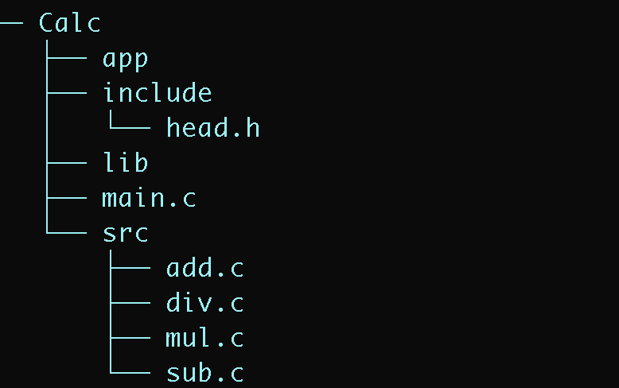
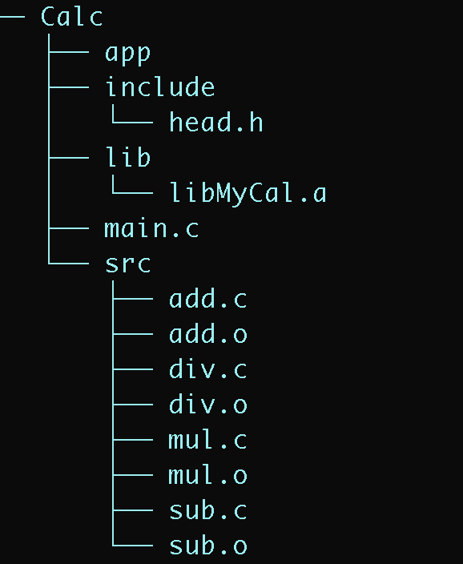
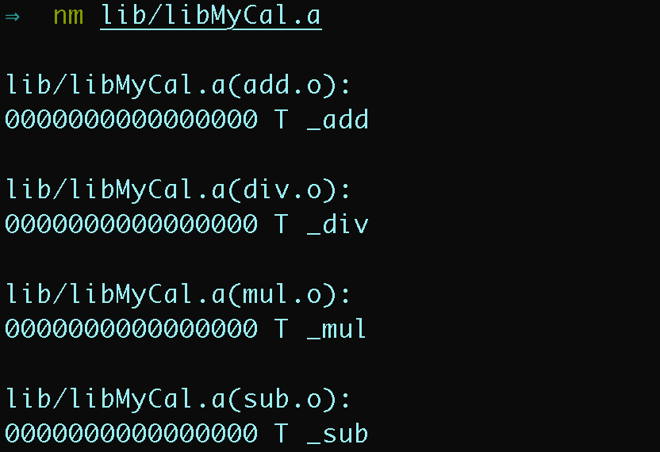
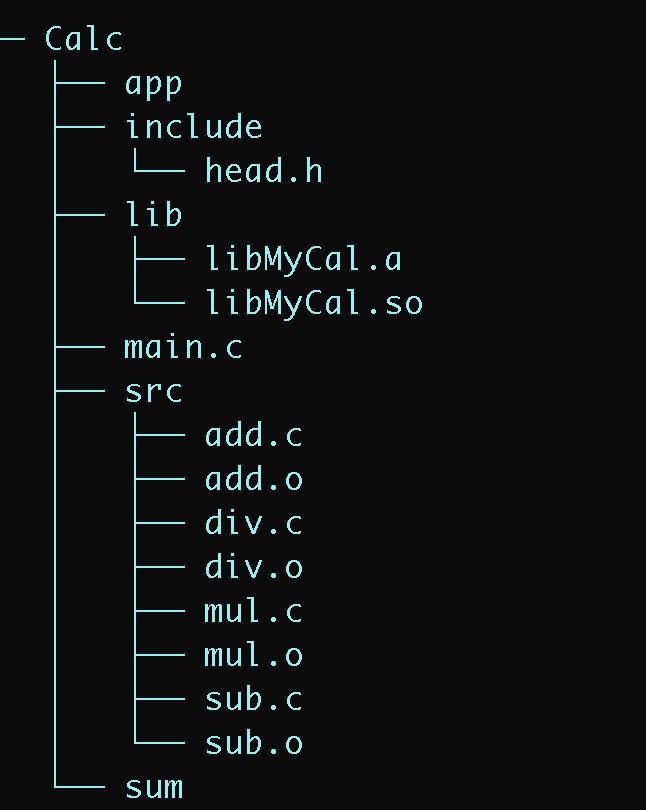
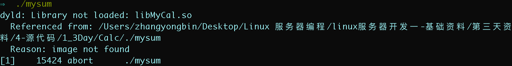
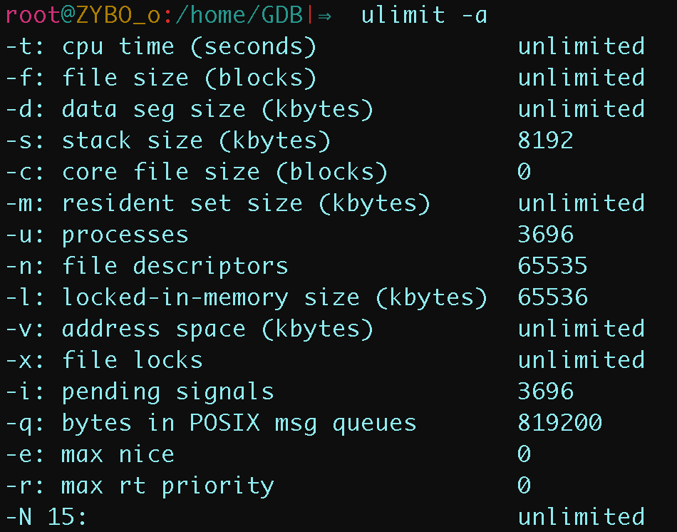
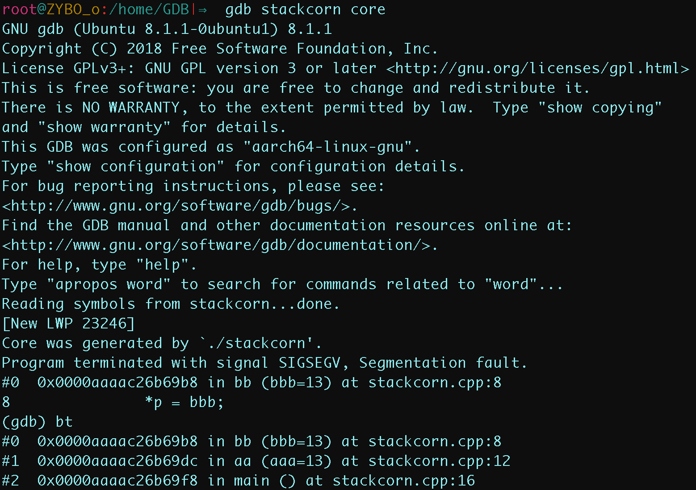

## 一. **刷题**

### 面试问过的

+ 给定一个数组num和两个数字L和R，数组长度为n，问你这个数组里面有多少个连续的子数组，满足这个子数组中的最大值大于等于L，小于等于R。
+ 给一个字符串，输出最长连续子串。
+ n的所有最小因数集合，如8，其最小质数集合为{1,2,2,2}
+ 手撕 unique_pointer
+ 布隆过滤器
+ hash表解决冲突的方法
+ 红黑树性质
+ redis中的数据结构
+ 跳表插入删除过程
+ 去掉字符串开头和末尾的空格
+ 大数相加
+ 最长公共子序列LCS
+ 最小编辑距离
+ 二叉树中两个节点的最近公共父节点
+ 数据流的中位数
+ [算法题](https://www.nowcoder.com/jump/super-jump/word?word=算法题)是两个[排序](https://www.nowcoder.com/jump/super-jump/word?word=排序)数组，找中位数。我回答了lc上的O(log M +N )的最优解方法
+ 40E个数，找出唯一不存在的数？进行(内存)优化？大数据问题都是用[哈希表](https://www.nowcoder.com/jump/super-jump/word?word=哈希表)进行分组，每一组做一次遍历，就可以大大减少内存占用
+ 1~N，其中有两个数重复，找出重复的数？
+ 写个单例模式的例子
+ 设计题，快速找出所有微信关系里的单向好友
+ 一个字符串ajxnhdbdosjbsorange,模式“o*ge”,找到匹配的最小字符串下标范围。
+ hashfunc一般怎么实现(除法散列，乘法散列 等等)
+ hashmap发生冲突怎么解决([链表](https://www.nowcoder.com/jump/super-jump/word?word=链表)法、开放寻址法等等)
+ 1亿个数怎么找中位数(哈希分组，然后快排寻找)
+ 一个字符串，比如abc123/f/ecd,连续的数字或者连续的字母，或者反斜杠后和后面一个字符，视为一个整体，反转之。比如这时输出应该是cd/e/f123abc.(一开始用了栈来做，非常简单。然后面试官问有没有其他方法，我就说一个先分段反转再整体反转的原地做法。
+ 开放寻址法要如何查找一个元素
+ 一个无序数组,如何寻找第n大的数(BFPTR[算法](https://www.nowcoder.com/jump/super-jump/word?word=算法))
+ 单向[链表]()中如何高效删除一个结点（只给定头指针和指向当前结点的指针）  
+ 给定n个正整数，如何找出最小的K个正整数 
+ 给定一组整数1000以内，如何高效去除重复的数
+ 字符串中查找是否有子串，写完以后要求给出测试用例


---

## ==二.C++重难点==

##### 1.介绍一下智能指针

+ 智能指针是一个类，这个类的构造函数中传入一个普通指针，析构函数中释放传入的指针。

  >  智能指针的类都是栈上的对象，所以当函数（或程序）结束时会自动被释放

+ C++ 11中新增了三个 智能指针： shared+ptr, unique_ptr, weak_ptr
+ 注意事项：
  + 构造函数是`explicit`的，即不能将内置指针隐式转换为智能指针
  + 内置指针构造智能指针时必须立即构造，禁止混合使用这两种指针
+ 使用智能指针的三个情况：
  + **不知道需要使用多少对象（容器）**
  + **不知道所需对象的准确类型（多态）**
  + **需在多个对象间共享数据**

---

##### 2.介绍一下shared_ptr的使用

+ shared_ptr是基于引用计数的智能指针。当内存的引用计数为0的时候这个内存会被释放。
+ 最安全的分配和使用动态内存的方法是调用`make_shared`函数

---

##### 3.介绍一下 unique_ptr的使用

+ 与shared_ptr不同的是同一时刻只能有一个unique_ptr指向给定对象；
+ 也不支持复制和赋值，直接赋值会编译出错。实在想赋值的话，需要使用：`std::move`。

---

##### 4.介绍一下 weak_ptr 的使用

+ 是一种不控制指向对象生存期的智能指针，它指向一个由shared_ptr管理的对象
+ weak_ptr绑定到shared_ptr指向的对象时，不会改变引用计数，一旦对象shared_ptr的引用计数清零，对象就会被释放，即使有weak_ptr指向它。
+ 由于weak_ptr的对象可能不存在，所以不能用weak_ptr直接访问对象，可以用lock函数先检查指向对象是否存在，若存在则返回指向该对象的shared_ptr，不存在则返回空的shared_ptr

---

##### 5.智能指针的线程安全问题你知道吗？

+ 智能指针有2个成员，引用计数是原子类型的，但原始指针并不是；所以综合来说就不是线程安全的。

+ 多个线程同时读同一个shared_ptr对象是线程安全的，但是如果是多个线程对同一个shared_ptr对象进行读和写，则需要加锁。

---

##### 6.怎么解决智能指针出现的循环引用问题

+ 循环引用就是：两个对象互相使用一个shared_ptr成员变量指向对方。可能会出现类似于死锁的现象
+ 弱指针用于专门解决shared_ptr循环引用的问题，weak_ptr的存在与否并不影响对象的引用计数器。

---

##### 7.介绍一下什么是右值

+ 左值：可以出现在 = 左边的值
+ 右值：只能出现在 = 右边的值；如临时对象

##### 8.什么是右值引用

+ `右值引用` 通过`&&`来 必须绑定 `右值` 的引用，
  + 右值引用只能绑定将要被销毁的对象，故可将右值引用的资源安全地移动到另一个对象

##### 9.std::move 怎么使用？

+ `std::move`函数可将左值显式转换为它对应的右值引用类型。处理完后，除对它赋值或销毁外，不可再使用它的值。

##### 10.什么是移动构造函数

+ 代码构造和拷贝构造函数类似，但是内存的处理不是拷贝而是转移。注意参数类型是右值引用。

- 移动构造函数的参数，移动构造函数的初值是一个右值引用 &&。往往是利用浅拷贝进行实现。
  - 拷贝构造函数的参数是左值引用，函数体往往是利用深拷贝进行实现。
- 用一个右值，或者将亡值初始化另一个对象的时候，才会调用移动构造函数。可以使用move语句，将左值变成一个将亡值，这样传入就会告诉编译器调用移动构造函数。
  - vector::push_back使用std::move提高性能
    + 直接把传来的资源利用浅拷贝给偷过来，减少了开销

##### 11.介绍一下 lambda 表达式

+ 是一个可调用的代码单元，也就是一个未命名的`内联函数`。它有捕获列表、返回类型、形参列表、函数体，可定义在函数内部
  + `[capture list](parameter list) -> return type {function body}`
+ `lambda实际是匿名类`：定义lambda时，编译器生成一个与其对应的未命名的类类型

##### 12.介绍一下 bind 使用


## 三. STL

### STL基本介绍

##### 1.介绍一下STL 提供六大组件

**1、容器（containers）**：各种数据结构，如vector, list, deque, set, map。从实现角度看，容器是一种 class template。

**2、算法（algorithms）**：各种常用的算法，如 sort, search, copy, erase…从实现角度来看，算法是一种 function template。

**3、迭代器（iterators）**：扮演容器与算法之间的胶合剂，是所谓的“泛型指针”。从实现角度来看，迭代器是一种将 operator *, operator ->, operator++, operator– 等指针相关操作予以重载的class template。

**4、仿函数（functors）**：行为类似函数，可以作为算法的某种策略。从实现角度来看，仿函数是一种重载了 operator() 的 class 或class template。

**5、适配器（adapters）**：一种用来修饰容器或仿函数或迭代器接口的东西。例如 STL 提供的 queue 和 stack，虽然看似容器，其实只能算是一种容器适配器，因为底层由 deque 实现。

**6、配置器（allocator）**：负责空间配置与管理，从实现角度来看，配置器是一个实现了动态空间配置、空间管理、空间释放的 class template。

> Array 与 forward_list是 C++ 11新增的 

---

### string

##### 1. string 与 C字符串的转换

+  data() 以字符数组的形式返回字符串内容，但并不添加 `'\0'`;
+  c_str() 返回一个以 `'\0'` 结尾的字符数组;
+  copy() 则把字符串的内容复制或写入既有的 c_string 或字符数组内。

> 需要注意的是， C++字符串并不以喻’结尾。

```c++
int copy(p, n, size_type _Off = 0);//将所调用的对象中第 string _Off 位置的 n 个字符复制到 p 指向的空间
str = "hello world";
const char * cstr1 = str.data();
const char * cstr = str.c_str();
cout << cstr1 << " " << cstr2<< endl;//hello world
str = "OK";
cout << cstr1 << " " << cstr2<< endl;//OK OK 
```

---

##### 2.string 与 int 类型的转换

+ int 转为 string 的方法

  ```c++
  int snprintf(char *str, size_t size, co口st char *format, ...)
    
  char a[20] ;
  int i = snprintf(a, 9, "%d",   12345) ;
  cout << i <<" "<< a << endl;	//5 12345
  ```

  + 它将可变个参数 (...) 按照 format格式化成字符串，然后将其复制到str中

+ string 转为 int 类型

  + 使用 strtol, stroll, strtoul 或 strtoull 等函数

    ```c++
    char *endptr ;
    char nptr []= ” 123abc”;
    int ret =strtol(nptr, &endptr, 10 ); //指定为十进制
    cout<<”ret:”<<ret<<" "<<endptr:”<< endptr<<endl;
    //ret:123 endptr:abc
    ```

---

##### 3.string的操作方法

+ string 的截取操作：
  + `string substr (size_t pos = 0, size_t len = npos) const;`：拷贝 pos 位置开始的 len 长的字符串作为子串，pos默认为0

+ string的插入操作：
  + `s.insert(pos, args)` ：在pos之前插入args指定的字符
    + pos可以是下标，也可以是迭代器
  + `s.append(args)` ：将 args 追加到 s

+ string 的修改操作：
  + `s.assgin(args)`：将args替换string中的字符
  + `s.replace(range, args)`：将args代替 s 中 range 范围的字符串
    + range 可以是一个下标和长度，也可以是一对指向 s 的迭代器
+ string的删除操作：
  + `s.erase(pos,len)`：删除从 pos 开始 的 len 个字符，如果 len 被省略，则删除 pos 后的所有字符 

+ 比较大小：compare函数

---

##### 4. string 的搜索操作：

+ `s.find(args)` ：查找 s 中args第一次出现的位置
+  `s.rfind(args)` ：查找 s 中args最后一次出现的位置
+ `s.find_first_of(args)` ：查找 s 中args中任意一个字符第一次出现的位置
+ `s.find_last_of(args)` ：查找 s 中args中任意一个字符最后一次出现的位置
+ `s.find_first_not_of(args)` ：查找 s 中查找第一个不在args中的位置
+ `s.find_last_not_of(args)` ：查找 s 中查找最后一个不在args中的位置

找到返回下标，不在返回`string::npos`，是一个static成员，初始化为 -1

> args: (c,pos)  从s中位置pos开始查找c

---

### Array

##### 1. 介绍一下Array

+ `std::array` 是封装固定大小数组的容器。底层为静态数组，大小固定，不可扩容，但操作更安全。
+ 结合了 C 风格数组的性能、可访问性与容器的优点，比如可获取大小、支持赋值、随机访问迭代器等。

---

### vector

##### 1.vector元素怎么排序

+ 在类中定义重载<函数
+ 定义比较函数，sort参数中应用比较函数

---

##### 2.vector的操作方式

+ vector的查找：`find(vec.begin(), vec.end(), num)`

  + 使用 find 函数在 vector 中进行查找 

+ vector的删除： （返回删除元素之后元素的迭代器）

  ```c
  iterator erase (iterator position) 
  iterator erase (iterator first , iterator last ) 
  vec.pop_back()
  ```

  + 需要注意的是，删除非最后元素之后迭代器会失效，所以操作之后需要重新更新 迭代器

    ```c
    vector<int>::iterator iter = vec.begin();
    for(; iter != vec.end(); ){
      	if(*iter == 3) {
          	iter = vec.erase(iter);
        } else {
          	++ iter;
        }
    }
    ```

+ vector的增加

  + push_back：在容器最后添加元素
  + emplace_back：在容器最后构建元素
  + insert：在位置前插入

  ```c++
  //在指定位置 loc 前插入值为 val 的元素，返回指向这个元素的迭代器
  iterator insert (iterator loc , const TYPE &val ) ;
  //在指定位置 loc 前插入 num 个值为 val 的元素
  void insert( iterator loc , size_type num, const TYPE &val) ; 
  //在指定位置 loc 前插入区间[ start, end)的所有元素
  void insert( iterator loc , input_iterator start, input_iterator end) ;
  ```

---

##### 3.vector的内存管理

+ v.size()：获得容器中有多少元素
+ v.capacity()：获得容器在它已经分配的内存中可以容纳多少元素 
+ v.resize(Container::size_type n)：强制把容器改为容纳 n个元素 ，不影响capacity
  + n 小于size，容器尾部的元素会被销毁
  + n 大于size，新默认构造的元素会添加到容器尾部。 如果 n 大于capacity，在元素加入之前会进行重新分配 
+ v.reserve(Container::size_type n)：强制容器把它的容量改为不小于n，不影响size
  + 小于等于当前capacity时，reserve什么都不做
  + 大于当前capacity时，reserve扩张容量

- v.shrink_to_fit()：C++11方法，要求vector/string/deque退回多余的空间，但具体实现可忽略此要求。不保证能退回

vector采用的`内存扩张策略`一般是：在每次需要分配新空间时，将当前容量翻倍。但具体实现可使用不同策略

---

##### 4. vector的迭代器类型与数据成员

+ 迭代器类型： `Random Access Iterator` 
+ 数据成员：三个迭代器(指针) `first,last,end`

---

##### 5. vector 上常见操作的复杂度（效率）

- 随机访问——常数 *O(1)*
- 在结尾或起始插入或移除元素——常数 *O(1)*
- 插入或移除元素——线性 *O(n)*

---

### deque

##### 1. 介绍一下 deque

+ `std::deque` （ double-ended queue ，双端队列）是有下标顺序容器，它允许在其首尾两段快速插入及删除。另外，在 deque 任一端插入或删除不会非法化指向其余元素的指针或引用。

---

##### 2. 与vector比有什么优势

+ 与 `std::vector` 相反， deque 的元素不是相接存储的：典型实现用单独分配的固定大小数组的序列，外加额外的登记，这表示下标访问必须进行二次指针解引用，与之相比 vector 的下标访问只进行一次。
+ deque 的存储按需自动扩展及收缩。扩张 deque 比扩张vector更优，因为它不涉及到复制既存元素到新内存位置。

---

##### 3. deque的迭代器类型与数据成员：

+ 迭代器类型： `Random Access Iterator`
+ 数据成员：一个迭代器，内部拥有四个指针 `head, tail, cur, node`

---

##### 4. deque 上常见操作的复杂度（效率）

- 随机访问——常数 *O(1)*
- 在结尾或起始插入或移除元素——常数 *O(1)*
- 插入或移除元素——线性 *O(n)*

---

### forward_list

##### 1. 介绍一下 forward_list

+ `std::forward_list` 是支持从容器中的任何位置快速插入和移除元素的容器。不支持快速随机访问。它实现为单链表，且实质上与其在 C 中实现相比无任何开销。
+ 与 `std::list` 相比，此容器在不需要双向迭代时提供更有效地利用空间的存储。

+ 在链表内或跨数个链表添加、移除和移动元素，不会非法化当前指代链表中其他元素的迭代器。然而，在从链表移除元素时，指代对应元素的迭代器或引用会被非法化。

---

##### 2. forward_list 操作

```c++
lst.insert_after(p,...);//p为迭代器
emplace_after(p,args);  //在p位置后面构建一个元素
lst.erase_after(p);			//删除 p 后面的元素
lst.erase_after(b,e);		//删除 [b,e) 之间的元素
```

- 对forward_list（单向链表）的元素做插入/删除，需要知道其`前驱`。
- forward_list的插入/删除改变的不是指定元素，而是指定元素之后的一个元素
- forward_list定义了`before_begin`迭代器，它指向首元素之前，称为`首前迭代器` ，不能解引用

---

##### 3. forward_list的迭代器类型与数据成员：

+ 迭代器类型： `Forward Iterator` ，不支持 -- 操作，其余都支持
+ 数据成员：一个指针 `head` ,表示头结点

---

##### 4. forward_list 上常见操作的复杂度（效率）

- 插入或移除元素——常数 *O(1)*
- 查询操作——线性 *O(n)*

---

### list

##### 1. 介绍一下list

+ `std::list` 是支持常数时间从容器任何位置插入和移除元素的容器。不支持快速随机访问。它通常实现为双向链表。与 `std::forward_list` 相比，此容器提供双向迭代但在空间上效率稍低。
+ 在 list 内或在数个 list 间添加、移除和移动元素不会非法化迭代器或引用。迭代器仅在对应元素被删除时非法化。

---

##### 2. list的迭代器类型与数据成员：

+ 迭代器类型： `Bidirectional Iterator` ，支持 -- 操作
+ 数据成员：一个尾指针 `node` ,实现环状链表

---

##### 3. list 上常见操作的复杂度（效率）

- 插入或移除元素——常数 *O(1)*
- 查询操作——线性 *O(n)* 

---

### 关联容器

实现在C++中，set 和 map 分别提供了以下三种数据结构，其底层实现以及优劣如下表所示：

| 集合                 | 底层实现 | 是否有序 | 数值是否可以重复 | 能否更改数值 | 查询效率   | 增删效率   |
| -------------------- | -------- | -------- | ---------------- | ------------ | ---------- | ---------- |
| `std::set`           | 红黑树   | 有序     | 否               | 否           | $O(log_n)$ | $O(log_n)$ |
| `std::multiset`      | 红黑树   | 有序     | 是               | 否           | $O(log_n)$ | $O(log_n)$ |
| `std::unordered_set` | 哈希表   | 无序     | 否               | 否           | $O(1)$     | $O(1)$     |

`std::unordered_set`底层实现为哈希表，`std::set` 和`std::multiset` 的底层实现是红黑树， **红黑树是一种平衡二叉搜索树，所以key值是有序的，但key不可以修改，改动key值会导致整棵树的错乱，所以只能删除和增加。**

| 映射                 | 底层实现 | 是否有序 | 数值是否可以重复 | 能否更改数值 | 查询效率   | 增删效率   |
| -------------------- | -------- | -------- | ---------------- | ------------ | ---------- | ---------- |
| `std::map`           | 红黑树   | Key有序  | key不可重复      | key不可修改  | $O(log_n)$ | $O(log_n)$ |
| `std::multimap`      | 红黑树   | Key有序  | key可重复        | key不可修改  | $O(log_n)$ | $O(log_n)$ |
| `std::unordered_map` | 哈希表   | Key无序  | key不可重复      | key不可修改  | $O(1)$     | $O(1)$     |

`std::unordered_map` 底层实现为哈希表，`std::map` 和`std::multimap` 的底层实现是红黑树。同理，`std::map` 和`std::multimap` 的key也是有序的（这个问题也经常作为面试题，考察对语言容器底层的理解）。

当我们要使用集合来解决哈希问题的时候，优先使用unordered_set，因为它的查询和增删效率是最优的，如果需要集合是有序的，那么就用set，如果要求不仅有序还要有重复数据的话，那么就用multiset。

##### 1.红黑树基础介绍

+ 红黑树是一种二叉查找树，但在每个结点上增加一个存储位表示结点的颜色，可以是 Red或 Black。 通过对任何一条从根到叶子的路径上各个结点着色方式的限制，确保没有一条路径会比其他路径长出两倍，因而是接近平衡的。
+ 红黑树在二叉查找树的基础上增加了着色和相关的性质使得红黑树相对平衡，保证了一棵 n 个结点的红黑树始终保持了 Iogn 的高度，从而保证了红黑树的查找 、 插入、删除的时间复杂度最坏为 O(logn)。性质如下：
  + 每个结点要么是红的要么是黑的
  + 根结点是黑的
  + 每个叶结点都是黑的
  + 如果一个结点是红的，那么它的两个儿子都是黑的
  + 对于任意结点而言，从一个节点到该节点的子孙节点的所有路径上包含相同数目的黑节点。
+ 对红黑树进行插入和删除等操作时，可能会破坏红黑树的性质 。 可以通过对结点进行重新着色，以及对树进行相关的旋转操作，修改树中某些结点的颜色及指针结构，来达到操作后继续保持性质或平衡的目的 。

##### 2.哈希表

+ 哈希表是根据关键码的值而直接进行访问的数据结构。数组就是一张哈希表。 关键码是数组的索引下表，通过下表直接访问数组中的元素。
+ 一般哈希表都是用来快速判断一个元素是否出现集合里。
+ 哈希函数，把值直接映射到哈希表上的索引，通过查询索引快速知道值是否在表中。

+  **<font color = red>此时为了保证映射出来的索引数值都落在哈希表上，再次对数值做一个取模的操作，保证值可以映射到哈希表上了。</font>** 如果元素数量大于哈希表的大小，会有元素同时映射到同一个索引下表的位置。出现 **「哈希碰撞」**。

解决哈希碰撞的方法：

+ 拉链法：
  + 位置发生了冲突，发生冲突的元素都被存储在链表中。
  + 拉链法就是要选择适当的哈希表的大小，数组空值会浪费大量内存，链表太长会在查找上浪费太多时间。
+ 线性探测法：
  + 使用线性探测法，一定要保证tableSize大于dataSize。依靠哈希表中的空位来解决碰撞问题。
  + 例如冲突的位置，放了A，那么就向下找一个空位放置B的信息。所以要求tableSize一定要大于dataSize ，要不然哈希表上就没有空置的位置来存放冲突的数据了。

---

### map

##### 1. map的本质与功能

+ `std::map` 是有序键值对容器，它的元素的键是唯一的。对于迭代器来说，不可以修改键值，只 能修改其对应的实值。 
+ map 通常实现为红黑树。具有对数据自动排序的功能，在 map 内部所有的数据都是有序的 。

##### 2. map的增删改查

+  **map类型值：**
  +  `key_type`：关键字类型
  + `mapped_type`：值类型
  + `value_type`是key-value对pair类型

+  **map的插入**

  + 插入 pair 数据：`map.insert(pair<type,type>(,))`
  + 插入 value_type 数据： `map.insert(map<type,type>::value_type(,))`
  + 数组的方式插入数据： `map[key_type] = mapped_type` ；可以覆盖修改原有数据

+  **map 的遍历**

  + auto 的方式来遍历

  + 利用迭代器：

    ```c++
    map<int , string>::iterator iter ;
    for(iter = Map.begin();iter ! = Map.end(); iter++)
      	cout << iter->first<< " " << iter->second << endl;
    ```

+  **map的查找**

  + 利用 count
  + 利用 find 
    + 数据出现时，返回数据所在位置的迭代器
    + 没有要查找的数据，返回 end() 迭代器 。

+  **map的删除**

  + 利用键值：`map.erase(k)` 返回 size_type类型的值以表示删除的元素个数
  + 利用迭代器：`map.erase(p)` 返回 void类型
  + 利用迭代器范围：`map.erase(b,e)` 返回 void类型 ；删除范围：[b,e)

  > 注意事项：利用迭代器删除时最好还是将输入的迭代器备份一下

##### 3. map排序

+ 按照 key 从大到小排序：
  + 定义时排序： `map<string, int, greater<string>> Map`
  + 利用vector：将map以pair对的形式导入vector，然后利用sort进行排序
    + `sort(v.begin(), v.end(),[](pair<int,string>a,pair<int,string>b){return a.first > b.first;});`
+ key(第一个元素)是一个结构体：在结构体中重载 < 运算符
+ 按照 value 进行排序： 
  + 利用 vector，将 first 修改成 second

---

##### 4. map的迭代器类型与数据成员：

+ 迭代器类型： `Bidirectional Iterator` 
+ 数据成员：一个指针指向红黑树；红黑树成员：一个size_t变量表示树的大小，一个header指针

---

##### 5. map 上常见操作的复杂度（效率）

- 搜索，移除和插入： $logn$

### set

##### 1.set的本质与功能

`std::set` 是关联容器，含有 `Key` 类型对象的已排序集。用比较函数 Compare 进行排序。搜索、移除和插入拥有对数复杂度。 `set` 通常以红黑树实现。

---

##### 2.为何 map 和 set 的插入删除效率比用其他序列容器高 ?

+ 因为关联容器不需要做内存拷贝和内存移动 。 set容器内所有元素都是以节点的方式来存储，节点结构和链表差不多
+ 插入只要把节点的指针指向新的节点；删除把指向删除节点的指针指向其他节点。 只需修改指针操作，和内存移动没有关系 。

---

##### 3.为何每次 insert之后，以前保存的 iterator不会 失效?

+ iterator相当于指向节点的指针，内存没有变，指向内存的指针不会失效。 
+ 对于vector，每一次删除和插入，指针都有可能失效，push_back也是如此 。 因为有时需要开辟新内存将原有数据移动入内，这样原指针全部失效。

---

##### 4.当数据元素增多时， set 的插入和搜索速度变化如何?

+ set使用的是二分查找，当数据量增大一倍的时候，搜索次数只不过多了 1 次。是$log2$的关系。

---

##### 5.set的增删查操作

+ set的插入操作
  + 在 pos位置之前插入 value，返回新元素位置
  + 将迭代区间[&first, &last)内所有的元素 ，插入到 set容器。
+ set的删除操作
  + `size_type erase(value)`移除 set容器内元素值为 value 的所有元素，返回移除的元素个数。
  + `void erase(&pos)`移除 pos位置上的元素，无返回值。
  + `void erase(&first, &last)`移除迭代区间``[&first, &last)``内的元素，无返回值 。
+ set的查找
  + `count(value)`返回 set对象内元素值为 value 的元素个数 。
  + `iterator find(value)`返回 value所在位置，找不到 value将返回 end()。

---

##### 6. set的迭代器类型与数据成员：

+ 迭代器类型： `Bidirectional Iterator` 
+ 数据成员：一个指针指向红黑树；红黑树成员：一个size_t变量表示树的大小，一个header指针

---

##### 7. set 上常见操作的复杂度（效率）

- 搜索，移除和插入： $logn$

### unordered_map 与 unordered_set

##### 介绍一下

+ multimap， unordered_set是关联容器，底层由 哈希表 实现。在内部，元素并不以任何特别顺序排序，而是组织进桶中，元素被放入哪个桶完全依赖其值的哈希。 两者的差别在于前者重复key 或者 重复 value 。STL默认使用拉链法来解决哈希冲突问题

---

##### 迭代器类型与数据成员：

+ 迭代器类型： `Forward Iterator` 
+ 数据成员：
  + 一个指针指向哈希表；
  + 哈希表内部成员：
    + 一个 size_t 变量表示哈希表中元素数量
    + 一个内部存放 node 结点指针的 vector

---

##### 常见操作的复杂度（效率）

- 插入，移除以及查询元素——常数 *O(1)*

---

### 容器适配器

+ Queue 先进先出，stack 先进后出；底层默认由 deque 实现
+ Priority_queue 优先队列，底层由 vector 实现，默认为大顶堆，提供 *O(1)* 复杂度的最大元素查询，  $O(logn)$ 代价的插入与释出

---

## 四.网络编程相关

+ 讲讲非阻塞socket
+ 文件读经历了哪些过程

---


### 1.socket

##### 1.内存中的多字节数据的大小端

+  **CP/IP协议规定，网络数据流应采用大端字节序，计算机为小端存储，即低地址高字节。**

  + 大端字节序：低地址存高位
  + 小端字节序：低地址存低位

  ```c
  int a = 0x12345678
  1003:大端:12	小端:78
  1002:大端:34	小端:56
  1001:大端:56	小端:34
  1000:大端:78	小端:12
  ```

---

##### 2. **介绍一下你知道的网络字节序和主机字节序的转换函数：**

+ h表示host，n表示network，l表示32位长整数，s表示16位短整数。
  + hton： **将数据从主机字节序转换成网络字节序**
  + ntoh： **将数据从网络字节序转换为主机字节序**

---

##### 3.你知道哪些IP转换函数？

+ 对于IPv4地址和IPv6地址都适用。函数名中p和n分别代表表达(presentation)和数值(numeric)。

```c
#include <arpa/inet.h>

/*将strptr中的IP字符串传给addrptr*/
int inet_pton(int family, const char *strptr, void*addrptr);
inet_pton( AF_INET, ip, &address.sin_addr );
//返回：若成功则为1，若输入不是有效的表达格式则为 0，若出错则为-1
/*将addrptr中的数据传给strptr*/
const char *inet_ntop(int family, const void *addrptr, char *strptr, size_t len);
printf("client IP:%s\tport:%d\n",  
  			inet_ntop(AF_INET, &clie_addr.sin_addr.s_addr,clie_IP, sizeof(clie_IP)), 	
				ntohs(clie_addr.sin_port));
//返回：若成功则为指向结果的指针，若出错则为NULL
```

---

##### 4.bind函数的使用

+ 将 文件描述符 和 IP地址与端口号信息 绑定在一起，使sockfd这个用于网络通讯的文件描述符监听address所描述的地址和端口号。

```c++
struct sockaddr_in clien_addr;
bzero(&clien_addr,sizeof(clien_addr));
clien_addr.sin_family = AF_INET;
inet_pton(AF_INET, ip, &clien_addr.sin_addr);
clien_addr.sin_port = hton(port);

bind(listenfd, (struct sockaddr*)&clien_addr, sizeof(clien_addr));
```

---

##### 5.为什么需要端口复用

+ 当端口占用的进程结束任务后断开连接，在TCP断开链接需要四次握手，等待一个TIME_WAIT时间后断开TCP连接，才能继续使用端口。
+ SO_REUSEADDR这个选项就是告诉OS如果一个端口处于TIME_WAIT状态,  不需要继续等待TIME_WAIT时间结束直接使用。

```c
int opt = 1;
setsockopt(listenfd, SOL_SOCKET, SO_REUSEADDR, &opt, sizeof(opt));   
setsockopt(sockfd, SOL_SOCKET, SO_REUSEADDR, (const voidvoid *)&opt, sizeof(opt));
```

---

##### 6. **TCP进行socket编程的步骤**

- 服务端和客户端初始化 socket ，得到文件描述符; 
- 服务端调用 bind ，将绑定在 IP 地址和端口; 
- 服务端调用 listen ，进行监听;
- 服务端调用 accept ，等待客户端连接；
- 客户端调用 connect ，向服务器端的地址和端口发起连接请求;
- 服务端 accept 返回用于传输的 socket 的文件描述符;
- 客户端调用 write 写入数据;服务端调用 read 读取数据;
- 客户端断开连接时，会调用 close ，那么服务端 read 读取数据的时候，就会读取到了 EOF ， 待处理完数据后，
- 服务端调用 close ，表示连接关闭。

---

##### 7. **服务器端会维护哪两个队列？** 

- 未完成连接队列(SYN 队列):接收到一个 SYN 建立连接请求，处于 SYN_RCVD 状态; 
- 已完成连接队列(Accpet 队列):已完成 TCP 三次握手过程，处于 ESTABLISHED 状态;

---

##### 8. **服务器端进行TCP连接(socket连接)时，内核的工作流程**

- 当客户端发送的SYN请求报文到达后，插入到SYN 队列，随后给对方发送ACK确认报文
- 当接收到客户端的ACK确认报文后，应用程序从Accpet 队列中取出已完成连接的socket

##### 9. **socket的各个步骤对应 TCP 握手中的哪些阶段？**

- 客户端初始化 socket ，调用 connect 后，进入SYS-SENT状态，是第一次握手阶段
- 服务器端初始化 socket ，调用 bind 绑定在 IP 地址和端口，调用 listen 进行监听后，进入Listen状态
- 服务器端在接收到客户端的 SYN 请求报文后， 调用 accept ，等待客户端连接，并回复ACK确认报文，进入 SYN-RCVD状态
- 客户端接收到ACK确认报文后，connect函数返回文件操作符，回复ACK确认报文，进入established状态
- 服务器端收到对方的ACK确认报文后，accpet API 函数返回 文件操作符，进入established状态

##### 10. **为什么一个socket可以accept多次？**

- 输入参数 fd 是从 socket， bind， listen 中沿用下来的 socket 句柄值，是在指定的端口处监昕所有的连接请求。
- 调用 accept() 是从 socket fd 的请求队列抽取第一个连接信息，创建新的同类型 socket 句柄 fd 来进行后续操作。
- 两个fd 是不同的，所以能 accept 多次

##### 11. **客户端调用close后，连接是断开的流程是什么?**

- 就是四次挥手流程

##### 12. **IO有哪两种操作？**

- 同步IO：必须等待 IO 操作完成后，控制权才返回给用户进程 。 
- 异步IO：无须等待 IO 操作完成，就将控制权返回给用户进程 。 

##### 13. **网络IO发生时，设计哪些对象与操作？**

- 会涉及两个系统对象：调用这个 IO 的 进程，系统内核。
- 当一个 read操作发生时，会经历两个阶段:
  - 等待数据准备; 
  - 将数据从内核拷贝到进程中。


### 2.IO复用

##### 1. **简单介绍一下4中IO模型。**

- 阻塞IO：阻塞是指 IO 操作需要彻底完成后才返回到用户空间

  > 阻塞 IO 模型的特点就是：在 IO 执行的两个阶段(等待数据和拷贝数据)都被阻塞了 。

- 非阻塞IO：非阻塞是指 IO 操作被调用后立即返回给用户一个状态值， 不需要等到 IO 操作彻底完成。

  > `fcntl( fd, F_SETFL, O_NONBLOCK );` 来设置socket成为非阻塞IO

- 多路IO复用（事件驱动IO）：可以监视多个描述符， 一旦某个描述符就绪( 读就绪或写就绪)，能够通知程序进行相应的读写操作。 

  > 调用API后整个进程会被阻塞，而且存在两个系统调用(select与revcfrom)，如果连接数不多，不能体现优势。

- 异步IO：

  - 用户角度：用户进程发起 read操作之后，立刻就可以开始去做其他的事;
  - 内核角度：当它收到一个异步的 read请求操作之后，首先会立刻返回，所以不会对用户进程产生任何阻塞。 然后，内核会等待数据准备完成，然后将数据拷贝到用户内存中，当这一切完成后，内核会给用户进程发送一个信号，返回 read操作已完成的信息 。

> + 阻塞 IO、非阻塞 IO 及多路 IO 复用都属于同步 IO。
> + 非阻塞 IO在执行 recvfrom 候，若内核的数据没有准备好，不会阻塞进程 。 但当内核中数据准备好时， recvfrom 会将数据从内核拷贝到用户内存中，这时进程仍被阻塞。 
> + 异步 IO 不同， 当进程发起 IO 操作之后，就直接返回，直到内核发送一个信号，告诉进程 IO 已完成，整个过程中进程完全没有被阻塞。

---

##### 2. **介绍一下 select 系统调用设计的函数**

```c++
#include <sys/select.h>
void FD_ZERO(fd_set *set); 						//把文件描述符集合里所有位清0
void FD_CLR(int fd, fd_set *set); 		//把文件描述符集合里fd清0
int  FD_ISSET(int fd, fd_set *set); 	//测试文件描述符集合里fd是否置1
void FD_SET(int fd, fd_set *set); 		//把文件描述符集合里fd位置1

struct timeval {
  	long tv_sec; /* seconds */  
  	long tv_usec; /* microseconds */
};

int select(int nfds, fd_set *readfds, fd_set *writefds, fd_set *exceptfds, 
           struct timeval *timeout);
```

**参数：**

+ nfds： 指定被监听的文件描述符的总数。通常设置为被监听的所有fd中的最大值加1，因为fd从0开始计数的。

+ readfds：  监控有读数据到达文件描述符集合，传入传出参数

+ writefds： 监控写数据到达文件描述符集合，传入传出参数

+ exceptfds： 监控异常发生达文件描述符集合,如带外数据到达异常，传入传出参数

+ timeout： 定时阻塞监控时间，3种情况

  1. NULL，永远等下去

  2. 设置timeval，等待固定时间

  3. 设置timeval里时间均为0，检查描述字后立即返回，轮询

**返回值：**

+ 成功： **所监听的所有 监听集合中，满足条件的总数**
+ 失败： 返回 -1 并设置errno

---

##### 3.**介绍一下 poll 系统调用函数**

```c
#include <poll.h>

struct pollfd {
    int fd; /* 文件描述符 */
		short events; /* 监控的事件：主要是 POLLIN,POLLOUT,POLLERR */
		short revents; /* 监控事件中满足条件返回的事件，由内核填充 */
};

int poll(struct pollfd *fds, nfds_t nfds, int timeout);
```

**参数：**

+ fds： pollfd结构类型的数组，它指定所有我们感兴趣的文件描述符上发生的可读，可写和异常等事件。
+ nfds： 指定被监听时间集合fds的大小。
+ timeout： 毫秒级等待
  + -1：阻塞等待，#define INFTIM -1         Linux中没有定义此宏
  + = 0：立即返回，不阻塞进程
  + \> 0：等待指定毫秒数，如当前系统时间精度不够毫秒，向上取值

**返回值：**

+ 成功： 所监听的所有 监听集合中，满足条件的总数
+ 失败： 返回 -1 并设置errno

---

##### 4. 介绍一下 epoll 系统调用函数

+ epoll_create 函数：创建一个epoll句柄，参数size用来告诉内核监听的文件描述符的个数

  ```c++
  #include <sys/epoll.h>
  
  int epoll_create(int size);
  ssize_t efd = epoll_create(OPEN_MAX);   
  ```

  + 参数：
    + size：监听数目(告诉Linux内核创建多大的epoll模型)，创建多大结点的红黑树，只是建议值，
  + 返回值：
    + 成功返回 文件描述符，指向红黑树的根
    + 失败返回 -1

+ epoll_ctl 函数：控制某个epoll监控的文件描述符上的事件：注册、修改、删除。

  ```c++
  struct epoll_event {
  			__uint32_t events; /* Epoll events */
  			epoll_data_t data; /* User data variable */
  };
  typedef union epoll_data {
      int fd;					//与epoll_ctl函数中的fd对应
      ...
  } epoll_data_t;
  
  int epoll_ctl(int epfd, int op, int fd, struct epoll_event *event);
  /*
  	epoll_event中的 events:
  	EPOLLIN ：	表示对应的文件描述符可以读（包括对端SOCKET正常关闭）
  	EPOLLOUT：	表示对应的文件描述符可以写
  */
  struct epoll_event tep;
  tep.events = EPOLLIN; 
  tep.data.fd = listenfd;          
  res = epoll_ctl(efd, EPOLL_CTL_ADD, listenfd, &tep); 
  ```

  + 参数：
    + epfd ： epoll_create成功返回的文件描述符，即红黑树树根
    + op ： 在红黑树树上进心增删改：
      + EPOLL_CTL_ADD (注册新的fd到epfd)
      + EPOLL_CTL_MOD (修改已经注册的fd的监听事件)
      + EPOLL_CTL_DEL (从epfd删除一个fd)
    + fd ： 具体需要操作的文件描述符
    + event： 告诉内核需要监听的事件(往往只需要 events 与 data.fd)
  + 返回值：
    + 成功返回 0
    + 失败返回 -1

+ epoll_wait函数： 等待所监控文件描述符上有事件的产生，类似于 select() 调用。

  ```c++
  #include <sys/epoll.h>
  
  int epoll_wait(int epfd, struct epoll_event *events, int maxevents, int timeout);
  struct epoll_event ep[OPEN_MAX];
  nready = epoll_wait(efd, ep, OPEN_MAX, -1); 
  ```

  + 参数：

    + epfd ： epoll_create成功返回的文件描述符，即红黑树树根

    + events ： 是一个传出参数数组
  
      > epoll_ctl中是传入变量的地址，这个变量初始化好就行
      >
      > epoll_wait中是传入数组，传出满足事件的文件描述符，每个元素都是epoll_event结构体

    + maxevents ： 告之内核这个events有多大，这个maxevents的值不能大于创建epoll_create()时的size，

    + timeout ：是超时时间
  
      +  -1： 阻塞
      +  0： 立即返回，非阻塞
      +  \>0： 指定毫秒

  + 返回值：
  
    + 成功返回有多少文件描述符就绪
    + 时间到时返回0，
    + 出错返回-1

---

##### 5. **介绍一下 epoll 的两种触发模式**

+ **Level Triggered (LT 水平触发)** ：epoll的默认触发方式，既支持阻塞模式，也支持非阻塞模式，当被监控的文件描述符上有可读写事件发生时，epoll_wait()会通知处理程序去读写。一次性读写完未全部完成，那么下次调用 epoll_wait()时，还会通知在上次没读写完的文件描述符上继续读写

+ **Edge Triggered (ET 边缘触发)** ： 只支持非阻塞模式，当被监控的文件描述符上有可读写事件发生时，epoll_wait() 会通知处理程序去读写。一次性全部读写完未完成，那么下次调用epoll_wait()时，不会通知，即只会通知一次，直到该文件描述符上出现第二次可读写事件。

  > 最好是利用边缘触发，使用非阻塞fd，套上while循环将数据一次性读写完成，这样效率更高。

---

##### 6. **在ET模式下当多个连接同时到达时该怎么处理？**

+ 理论上如果多个连接同时到达，服务器的TCP就绪队列瞬间积累多个就绪连接，由于是边缘触发模式，epoll只会通知一次，accept只处理一个连接，导致TCP就绪队列中剩下的连接都得不到处理。

+ 解决办法是用while循环包住accept调用，处理完TCP就绪队列中的所有连接后再退出循环。如何知道是否处理完就绪队列中的所有连接呢？accept返回-1并且errno设置为EAGAIN就表示所有连接都处理完。

---

##### 7. **nigix的实现中多个连接同时到达如何处理？**

+ nigix 中 ，accept函数调用使用水平触发的fd，就是出于对丢失连接的考虑，所以不存在丢失连接的问题。
+ 但是若系统中有大量不需要读写的就绪文件描述符，而它们每次都会返回，会大大降低处理程序检索自己关心的就绪文件描述符的效率。

---

##### 8. **使用Linux epoll模型，水平触发模式；当socket可写时，会不停的触发socket可写的事件，如何处理？**

+ 平时不要把该描述符放进event_poll结构体中，当需要写该fd的时候，调用epoll_ctl把fd加入eventpoll里监听，可写的时候就往里写，写完再次调用epoll_ctl把fd移出event_poll，这种方法在发送很少数据的时候仍要执行两次epoll_ctl操作，有一定的操作代价
+ 改进一下就是：平时不要把该描述符放进event_poll结构体中，需要写的时候调用write或者send写数据，如果返回值是EAGAIN（写缓冲区满了），那么这时候才执行第一种方法的步骤。

---

##### 9. **比较IO复用 select，poll，epoll 的区别**

+ select、 poll和 epoll都是多路 IO 复用机制。 可以监视多个描述符， 一旦某个描述符就绪，会通知程序进行相应的读写操作。 但它们本质上都是同步 IO，因为它们都需要在读写事件就绪后自己负责进行读写，是阻塞的。

+ select的优缺点：

  + 优点：
    + select目前几乎在所有的平台上支持，其良好跨平台支持也是它的一个优点。
    + select()对于超时值提供了更好的精度，而 poll()是精度较差。
  + 缺点：
    + select能监听的文件描述符个数受限于FD_SETSIZE,一般为1024
    + select采用的是轮询模型，如果链接客户端过多，会大大降低服务器响应效率

+ poll的优缺点：

  + 优点：
    + 可以修改文件描述符的上限数目，优于select
    + 将监听集合 和 返回集合 实现了分离，不像select那么麻烦，搜索范围更小
    + poll在应付大数目的文件描述符时速度更快，对于 select 来说内核需要检查大量描述符对应的set中的每一个比特位，比较费时。
  + 缺点：
    + 但还是需要将数组全部变量，找出已连接的文件描述符，而不是直接返回满足的文件描述符数组。

+ epoll 的优点：

  + 支持ET边缘触发模式，其余两者只支持LT水平触发模式。

  + 不是使用轮询的方式，不会随着fd数目的增加而降低效率。只有活跃可用的fd才会调用callback函数；selet 与 poll 调用时都会对连接进行线性遍历，所以随着FD的增加会造成遍历速度慢的“线性下降性能问题”。

  + 使用 mmap共享内存的方式，加速内核与用户空间的消息传递

    > 3者都需要内核把fd消息通知给用户空间，如何避免不必要的内存拷贝就显得尤为重要 。 
    >
    > epoll 通过内核 与用户空间 mmap 处于同一块内存实现的 。
    >
    > poll将传入的 pollfd数组拷贝到内核空间，因为拷贝操作和数组长度相关，时间上来看，这是一个 O(n)操作


---


---

## 五.WebServer项目相关

* 利用正则与状态机解析HTTP请求报文，实现处理静态资源的请求；
* 利用标准库容器封装char，实现自动增长的缓冲区；
* 基于小根堆实现的定时器，关闭超时的非活动连接；

---

##### 自我介绍

+ 来自东南大学网络空间安全学院，专业是计算机专业，专硕。
+ 比较熟悉C/C++基本语法，对操作系统，计算机网络比较了解
+ 所以应聘贵公司的后端开发岗位

---

##### **介绍一下你的WebServer项目**

+ 自己改写了一个简单的Reactor高并发模型服务器。
+ 主线程初始化一个线程池，然后建立socket链接，进行绑定IP与端口，创建socketfd，利用IO复用技术Epoll模型，创建efd，将socketfd添加至efd中，进行监听事件与数据读写。
+ 定义httpconn类封装任务事件，包括socket文件描述符，地址信息，读写缓存区，解析HTTP报文的成员函数；
+ 如果监听到连接事件发生，则进行accpet连接，将新建socket文件描述符添加至epoll中进行监听。
+ 如果监听到读事件发生，则将读数据的操作交给线程池中的线程，将传来的数据一次性读入读缓冲区
+ 数据读完之后，将任务封装成 http_conn 类，线程池中子线程取出队首任务，执行任务中的process函数，即解析HTTP请求，生成响应写入写缓冲区，触发可写操作。
+ 监听到可写操作，主线程让子线程去完成写操作，将写缓冲区的内容写给客户端

---

##### 解析消息的流程process

- 解析消息 process_read
  - 当解析遇到空行时，说明消息头部字段解析完成，接下来解析的就是消息体
  - 如果不是空行，则进行解析消息头的各个信息，比如connect，等等
  - 等消息解析完之后就去分析目标文件的属性
- 分析目标文件的属性 do_request
  - 将服务器中的资源根目录与请求内容结合，找到对应的资源的路径
  - 然后分析路径与权限是否合法
  - 最后打开寻找的路径的文件，创建内存映射，将需要写回的资源映射到地址上，等待之后的发送
- 生成响应 process_write
  - 判断解析请求的返回值，根据请求结果来做对应的操作，如No resource等
    - 添加响应状态行，响应头
  - 将消息头和消息体分散写 write，使用writv
    - 消息头就是上面根据请求来设置的消息头内容
    - 消息体是mmap映射的资源

---

##### **介绍一下服务器程序中的事件处理模式**

+ 简单介绍：
  + Reactor模式：利用I/O复用，让主线程调用 epoll_wait 等待 socket 上有数据可读与可写。当epoll_wait 通知主线程后，主线程将 socket 事件放入请求队列，唤醒的线程来处理数据的读写与后续的业务逻辑
  + Proactor模式：利用 异步I/O aio_read 与 aio_write 让内核来进行 socket 的读写操作，等操作完成后内核通知主线程，主线程将唤醒工作线程来处理后续的业务逻辑与事件注册
  + 同步IO模拟Proactor模式： 主线程调用 epoll_wait 等待 socket 上有数据可读与可写。当epoll_wait 通知主线程后，主线程将数据读完之后封装成请求队列中的元素，唤醒工作线程完成后续的逻辑业务与事件注册。
+ **Reactor模式**
  + 要求主线程 (I/O处理单元) 只负责监听文件描述上是否有事件发生，有则立即将该事件通知工作线程(逻辑单元)，将socket可读可写事件放入请求队列，交给工作线程处理。除此之外，工作线程不做任何实质性的工作。读写数据，连接新的连接，处理客户请求接在工作线程完成。
  + 使用同步 I/O 模型实现的工作流程：
    1. 主线程 在epoll 内核事件表中注册 socket 的读就绪事件
    2. 主线程调用 epoll_wait 等待 socket 上有数据可读
    3. 有数据可读时，epoll_wait 通知主线程，主线程将 socket 可读事件放入请求队列
    4. 睡眠在请求队列中的某个工作线程被唤醒，它从socket 读取数据，并处理客户请求，然后往 epoll 事件表中注册 socket 上的写就绪事件
    5. 主线程调用 epoll_wait 等待 socket 可写
    6. socket 可写时， epoll_wait 通知主线程，主线程将 socket 可写事件放入请求队列
    7. 睡眠在请求队列中的某个工作线程被唤醒，它往 socket 上写入服务器处理客户请求的结果
+  **Proactor模式：**
  + 将所有I/O操作都交给主线程和内核处理(读写)，工作线程只负责业务逻辑。
  + 使用异步I/O模型实现的工作流程：
    1. 主线程调用 aio_read 函数向内核注册 socket 上的读完成事件，并告诉内核 用户读缓冲区的位置，以及读操作完成时如何通知应用程序，可用信号
    2. 主线程继续处理其他逻辑
    3. 当 socket 上的数据被读入用户缓冲区后，内核将向应用程序发送信号，通知数据可用
    4. 应用程序预先定义的信号处理函数选择一个工作线程来处理客户请求。处理完成之后调用 aio_write 函数向内核注册 socket 上的写完成事件，并告诉内核 用户写缓冲区的位置，以及写操作完成时如何通知应用程序
    5. 主线程继续处理其他逻辑
    6. 当用户缓冲区数据写入 socket 后，内核将向应用程序发送信号，通知数据已发送
    7. 应用程序预先定义的信号处理函数选择一个工作线程做善后工作，比如是否关闭socket
+  **同步I/O模拟Proactor模式：**
  + 主线程执行数据读写操作，完成之后主线程向工作线程通知这一"完成事件"。从工作线程的角度看，它们只需对读写的结果进行逻辑处理。
  + 使用同步 I/O 模型模拟出Proactor模式的工作流程如下：
    1. 主线程 在epoll 内核事件表中注册 socket 的读就绪事件
    2. 主线程调用 epoll_wait 等待 socket 上有数据可读
    3. 有数据可读时，epoll_wait 通知主线程，主线程从 socket 中循环读完数据，将数据封装成一个请求对象放入请求队列
    4. 睡眠在请求队列中的某个工作线程被唤醒，它获得请求对象并处理客户请求，然后往 epoll 事件表中注册 socket 上的写就绪事件
    5. 主线程调用 epoll_wait 等待 socket 可写
    6. socket 可写时， epoll_wait 通知主线程，主线程往 socket 上写入服务器处理客户请求的结果

---

##### **线程池的优点是什么？**

+ 线程池旨在降低创建和销毁线程的频率，使其维持合理数量的线程，并让空闲的线程重新承担新的任务 。
+ 连接池是指维持连接的缓存池，尽量重用已有的连接，降低创建和关闭连接的频率。
+ 这两种技术能降低系统开销，但当请求数目远远大于池中元素的数目时，没有显著的效果。特别是在阻塞IO下。

---

##### 如何设计一个多线程下安全的队列

```c++
struct Pool {
  std::mutex mtx;
  std::condition_variable cond;
  bool isClosed;
  std::queue<int> value;
};
```

---

##### 你是怎么设计线程池的？

+ 定义了一个ThreadPool类，其中的将一个Pool类与Pool类型的智能指针pool。其中Pool类有四个元素，分别为：
  + mutex锁 mtx
  + 条件变量 cond
  + bool 类型的标志，表示是否关闭线程池
  + 任务队列 tasks，元素是Function函数
+ 首先定义构造函数：
  + 默认传入参数ThreadCount表示创建8个线程，初试列表中动态创建一个动态指针对象，即定义一个线程池。
  + 在构造函数体中，进行for循环，利用Thread函数创建线程，并设置为分离detach，其中thread参数是lambda函数，在lambda函数中，将新建的线程池对象传入其中，lambda函数体中先用unique_lock锁住，然后进行while循环，不断取出任务队列，进行任务操作，当队列为空时，阻塞等待有工作线程入队的通知
+ 定义析构函数，析构函数体中将bool 标志设置为关闭线程池，通知所有线程，则所有线程函数都break while循环
+ 定义添加任务函数 AddTask，首先进行lock_guard加锁，然后将传来的task参数初始化封装成任务，并添加到任务队列中。解锁，并利用条件变量通知线程池中的一个线程。

```c++
//条件变量的定义：
std::condition_variable cond;
std::mutex mtx;
std::unique_lock<std::mutex> locker(mtx);
//条件变量进行阻塞
cond.wait(locker);
//唤醒所有线程
cond.notify_all();
//唤醒一个线程
cond.notify_one(); 
```

---

+  项目里实现了哪些HTTP请求呢，处理的时候如何分辨这些请求呢？
+  设想这样一种场景，我的web服务器里面有一张表格，现在浏览器需要请求这个表格中 id=张三 的内容，同时返回到浏览器也需要以表格的形式展现。

---

##### 为什么需要定时器

+ 因为系统中的文件描述符资源有限，如果一直存在不活跃的文件描述符，会消耗文件资源

---

##### 有什么方法来实现定时器？为什么利用最小根堆来设计定时器的？

+ 时间轮：
+ 时间堆：定时器的触发是由于时间到了，因此只有时间最短的定时器会首先被触发，通过这个原理，可以采用最小堆，将按时间顺序排序，堆顶元素是时间最短的定时器，因此只要判断堆顶元素是否被触发即可。只有堆顶定时器的时间到了，才会到其他时间较晚的定时器的时间。
+ 最小根堆的设计：
  + 每个结点的值都小于或等于其左右孩子结点的值，称为小顶堆。使用数组来模拟堆的实现，先从最后一个非叶子结点开始 size()/2。从左至右，从下至上进行调整。当发现子结点比父节点大的时候就进行交换，知道根结点，这样就设计出了最小根堆。

对于时间轮：

+ 添加一个定时器的时间复杂度是O(1)

+ 删除一个定时器的时间复杂度也是O(1)

+ 执行一个定时器的时间复杂度是O(n)

对时间堆：

+ 添加一个定时器的时间复杂度是O(lgn)
+ 删除一个定时器的时间复杂度是O(1)
+ 执行一个定时器的时间复杂度是O(1)

因此，时间堆的效率是很高的。

---

##### 如何设计的自动增长缓冲区

+ 设计了一个buffer类，主要元素有：
  + `vector<char>` 封装的 buffer_
  + 原子类型的 `atomic<size_t> readPos_;` 标记已读位置
  + 原子类型的 `atomic<size_t> writePos_;` 标记已写位

写入字符串时，如果缓冲区剩余写的位置不够，可以先看 剩余大小与已读完总和的大小，如果大于将要写入的大小，则将剩余需要读的内容移到vector最前面，更新 readPos_ 和 WritePos_。如果不够，则进行扩容写入的大小，再更新readPos和writePos。

---

##### 如何利用正则表达式来解析HTTP响应的？

```c++
// ~ 匹配字符串： |任意非空 任意非空 HTTP/任意非空|   --> 三个group ()  ()  ()
// ~ 例子：       GET http://hello.html HTTP/1.1
string line = "GET https://www.baidu.com HTTP/1.1";
regex patten("^([^ ]*) ([^ ]*) HTTP/([^ ]*)$");
smatch subMatch;
if(regex_match(line, subMatch, patten)) {
  for(int i = 1; i < subMatch.size(); ++i)
    cout << subMatch[i] << endl;
}
```

```c++
string line ="Connection : keep-alive";
regex patten("^([^:]*): ?(.*)$");
smatch subMatch;
// ~ 匹配整个 line 成功时
regex_match(line, subMatch, patten);

for(int i = 1; i < subMatch.size(); ++ i) {
  cout << subMatch[i] << endl;
}
```

---

## 六.实习事项

### 物理层小基站项目功能及其自己负责的部分


---

### 链接

##### 1.介绍一下静态库与动态库

- 库是写好的现有的，成熟的，可以复用的代码。本质上是可执行代码的二进制形式。
- 静态库（.a、.lib）和动态库（.so、.dll）。所谓静态、动态是指链接
- 静态库：
  - 将可重定位目标文件以一种特定的方式打包成一个单独的文件`lib**.a`，在链接时，将其内容拷贝到可执行文件中。
  - 优点：
    - 可执行程序中具备了执行程序需要的所有内容， 执行时运行速度快。
  - 缺点：
    - 每个可执行程序中都有目标文件的一份副本，会造成空间浪费
    - 每次修改完库代码，都需要重新进行编译链接形成可执行程序，更新困难。
- 动态库：
  - 和静态库类似，打包成`lib.**so`文件，不同的是，在链接时仅仅“拷贝”一些重定位和符号表信息，在程序运行时完成真正的链接过程。
  - 优点：
    - 即使每个程序都依赖同一个库，在执行时共享同一份副本，节省了空间
    - 更新时只需要替换原来的目标文件，而无需再重新链接一遍，更新方便
  - 缺点：
    - 把链接推迟到了程序运行时，所以每次执行程序都需要进行链接，会有性能损耗

---

##### 2. 静态链接库和动态链接库会加载在内存的哪里

- 静态库在链接时与程序一起链接成可执行文件，然后在内存中装载运行：虚拟内存中分布在
  - 代码段（.text）: 程序源代码编译后的机器指令
  - 已初始化数据段（.data）: 已初始化了的全局变量和局部静态变量数据
  - 未初始化段（.bss）:未初始化的全局变量和局部静态变量
- 动态库装载在堆与栈中间的文件映射段

---

##### 3. **一个程序从开始运行到结束的完整过程，你能说出来多少?**

> 以运行hello.c文件为例子：
>
> 1. 使用预处理器，将源程序 hello.c 翻译成ASCII的中间文件 hello.i		                    `gcc -E hello.c -o hello.i` 
> 2. 使用编译器，将 hello.i 生成 汇编语言文件 hello.s                                                   `gcc -S hello.i -o hello.s`
> 3. 使用汇编器，将 hello.s 翻译成 可执行目标文件 hello.o                                          `gcc -c hello.s -o hello.o`
> 4. 使用连接器，将hello.o 和一些必要的系统目标文件链接成可执行文件 hello        `gcc hello.o -o hello`

- 预编译： 运行C预处理器(cpp)将C的源程序 hello.c 翻译成一个ASCII码的中间文件 hello.i. 

  > `gcc -E hello.c -o hello.i`

  - 处理 “#include” 预编译指令，将文件内容替换到它的位置
  - 删除所有的#define，展开所有的宏定义。 
  - 处理所有的条件预编译指令，如 “#if”、“#endif”、“#ifdef”
  - 删除所有的注释
  - 添加行号和文件标识，便于编译时编译器产生调试用的行号信息

- 编译：驱动程序运行C编译器(gcc)，将hello.i翻一个一个ASCII汇编语言文件hello.s

  > `gcc -S hell0.i -o hello.s`

  1. 把预编译之后生成的xxx.i或xxx.ii文件，进行一系列词法分析、语法分析、语义分析及优化后，生成相应的汇编代码文件。
  2. 词法分析：将源代码程序输入到扫描机中，将其中的字符序列分割成一系列的记号，类似于有限状态机
  3. 语法分析：对由扫描器产生的记号进行语法分析，产生语法树。语法分析器完成的是对表达式语法层面的分析
  4. 语义分析：语义分析器则对表达式是否有意义进行判断，其分析的语义是静态语义——在编译期能分期的语义，相对应的动态语义是在运行期才能确定的语义。
  5. 优化：源代码级别的一个优化过程。 
  6. 目标代码生成：由代码生成器将中间代码转换成目标机器代码，生成一系列的代码序列——汇编语言表示。
  7. 目标代码优化：目标代码优化器对上述的目标机器代码进行优化，寻找合适的寻址方式、使用位移来替代乘法运算、删除多余的指令等。

- 汇编：运行汇编器(as)，将 hello.s 翻译成一个可重定位目标文件 hello.o

  > `gcc -c hell0.s -o hello.o`

  - 汇编器用来将汇编语言源程序转换为机器指令序列。
  - 汇编结果是一个 可重定位目标文件 (如hello.o)，其中包含的是不可读的二进制代码，必须用相应的工具软件来查看其内容。

- 链接： 运行连接器程序**(ld)**，将**hello.o**和一些必要的系统目标文件组合起来，创建一个可执行文件**prog**:

  > `gcc hell0.o -o hello`

  - 将不同的源文件产生的目标文件进行链接，从而形成一个可以执行的程序。链接分为静态链接和动态链接:
    - 静态链接：
      - 对函数库的链接是放在编译时期完成的是静态链接 。 所有相关的目标文件与牵涉到的函数库被链接合成一个可执行文件。Linux下文件名为`libxxx.a`的形式 。
    - 动态链接：
      - 把程序按照模块拆分成各个相对独立部分，库函数的链接载入推迟到程序运行时才链接在一起形成一个完整的程序，动态库文件名`lib**.so`。

---

##### 4. **介绍一下静态库与动态库的创建与使用**

- **静态库**

  - **静态库命名规则：** lib + 库的名字 + .a

  - **制作规则：**

    - **生成对应的.o文件：** 参数 -c
    - **将生成的.o文件进行打包：** ar rcs + 静态库的名字(libMyCal.a) + 生成的所有.o文件

  - **发布和使用静态库：**

    - 发布静态库
    - 头文件

  - **例子：**

    <div align = center></div>

    - include文件夹存放头文件，src文件夹存放源文件，lib文件夹存放生成的库文件

    - 生成.o文件

      ```
       gcc *.c -c -I ../include 
      ```

    - 打包

      ```
       ar rcs libMyCal.a *.o
       mv libMyCal.a ../lib
      ```

      <div align = center></div>

    - 利用头文件和静态库来运行程序

      ```
       gcc main.c lib/libMyCal.a -o sum -I include
      ```

      ```
       # -I include头文件
       # -L 库的目录
       # -l 库的名字，去头去尾
       gcc main.c -I include -L lib -l MyCal -o sum
      ```

  - 利用 nm命令 查看静态库内容

    <div align = center></div>

- 动态库

  - **动态库命名规则：** lib + 库的名字 + .so

  - **制作步骤：**

    - **生成与位置无关的代码(.o) ：** 参数 -fPIC -c

      <div align = center></div>

      > - 静态库.o在代码段每次位置都相同，所以是与位置有关。
      > - 动态库不会打包到程序中，只有在运行到需要时才会加载到共享库区域，每次加载时放入的位置都不同，所以与位置无关。

    - **将.o打包成动态库：** `gcc -shared  -o libMyCal.so *.o -I include`

  - **例子：**

    - 生成.o文件

      ```
       gcc -fPIC -c *.c -I ../include
      ```

    - 打包成共享库

      ```
       gcc -shared  -o libMyCal.so *.o -I ../include
       mv libMyCal.so ../lib
      ```

      <div align = center></div>

    - 利用动态库和头文件来运行程序

      ```
       gcc main.c lib/libMyCal.so -o mysum -I include
       
       gcc main.c -I include -L ./lib -l MyCal -o mysum
      ```

      <div align = center></div>

      > 没有给动态链接器指定动态库libMyCal.so的路径

  - **解决动态链接库失败的问题**

    - 直接放入系统库目录——不推荐

    - 利用export LD_LIBRARY_PATH=目录 来临时添加，终端关闭后会失效

    - 将上述方法写入bashrc——也不推荐

    - 找到动态连接器的配置文件 

      ```
       cd /etc
       sudo vim ld.so.conf
       # 动态库的路径写入配置文件
       /Users/zhangyongbin/Desktop/Cal/lib
       # 更新
       sudo ldconfig -v
      ```

---

##### 6. **gcc 与 g++ 的区别？**

- 从文件角度：
  - 后缀为 .c 的， gcc 把它当作是C程序， g++当作是C++程序；
  - 后缀为 .cpp 的，两者都会认为是 C++程序
  - 虽然 C++是 C 的超集，但是两者对语法的要求是有区别的 ： printString在 c++ 编译环境下是未定义的
- 编译和链接的角度：
  - 编译可以用 gcc/g++； g++会自动调用 gcc，二者等价 。
  - 链接可以用 g++或者 gcc-lstce++。 因为 gcc 命令不能自动和 c ++程序使用的库链接，所以通常使用 g++来完成链接 。 
- extern ”C”与 gcc/g++ 并无关系，无论是 gcc 还是 g++，用 extern”C”时，都是以 C 的命名方式来为symbol命名；否则，都以 C++方式命名。

---

### GDB

##### 1.你知道哪些gdb基本命令

|        命令        | 简写 | 命令说明                                                     |
| :----------------: | :--: | ------------------------------------------------------------ |
|        list        |  l   | 列出 函数代码及其行数 。(最好还是打开代码)                   |
|       break        |  b   | 设置断点，可以指定 **行数** 或者 **函数名称**                |
|        run         |  r   | 开始运行程序，到断点的位置会停下来                           |
|        next        |  n   | 执行当前语句，不会进入函数内部                               |
|        step        |  s   | 执行当前语句，可进入函数内部，但如果是库函数或第三方函数没有源代码，则进不去 |
|       print        |  p   | 显示变量值，也可以执行语句并输出                             |
|      continue      |  c   | 继续指向程序，直到遇到下一个断点                             |
| set var name = val |      | 设置变量的值，                                               |
|      set args      |      | 设置主程序的参数，如果参数有特殊字符，用 "" 进行包起来       |
|       finish       |  f   | 退出函数                                                     |
|        quit        |  q   | 退出调试                                                     |
|                    |  bt  | 查看调用栈                                                   |
|                    | info | 可以查看断点，进程(info inferiors)，线程(info threads)等     |

##### 2.怎么利用gdb调试段错误，怎么调试core文件

> [1]    23204 segmentation fault (core dumped)  ./stackcorn

+ 首先利用 `ulimit -a` 来查看系统参数设置

  

  > + 最大文件描述符：65536
  >
  > + 栈大小：8M

+ 将 core file size 修改成不限制 ： `ulimit -c unlimited`

+ 这就继续运行程序就能生成 core 文件，然后利用gdb调试 core ： `gdb programName coreName`

+ 会直接跳到出问题的行数，然后利用 `bt` 来查看调用栈

  

---

##### 3.如何调试一个正在运行的程序

> 可以将运行时在后面 + & 挂在后台运行

+ 首先得知道程序名称
+ 利用 `ps --ef|grep processName` 查找到进程ID
+ 利用 `gdb -p ID` 进行调试，此时程序会停下来，根据调试情况再运行

---

##### 4.如何调试多进程程序

>  在创建进程代码之前输入命令

+ 调试父进程 ： `set follow-fork-node parent` 默认模式
+ 调试子进程 ：`set follow-fork-node child`
+ 设置调试模式：
  + `set detach-on-fork on`  ： 默认模式，调试当前进程的时候其他进程继续执行
  + `set detach-on-fork off`：调试当前进程的时候其他进程被gdb挂起
+ 查看调试的进程：`info inferiors`
+ 切换当前调试的进程：inferior 进程编号

---

##### 5.如何调试多线程程序

> + 查看当前运行的进程： `ps aux|grep programName`
> + 查看当前运行的线程：`ps -aL|grep programName `
> + 查看主线程与子线程关系：`pstree -p 主线程id`

+ 查看线程：`info threads`
+ 切换线程：`thread 线程编号`
+ 只运行当前线程：`set scheduler-locking on`
+ 运行全部的线程：`set scheduler-locking off`
+ 指定某个线程执行某几个gdb命令：`thread apply 线程编号1 线程编号2 gdb命令`
+ 指定全部线程执行某个gdb命令：`thread apply all gdb命令`

---

##### 6.如何调试多文件程序

+ 同一个文件夹中的文件，可以用 `break file1.cpp: linenum`

+ 不同文件夹下用`directory` 命令修改路径：

  ```bash
  (gdb) directory ../test1/ #进入文件
  Source directories searched: /mnt/hgfs/share/C++/GDB/ManyFiles/../test1:$cdir:$cwd 
  (gdb) b test1.cpp:2	#设置断点
  Breakpoint 1 at 0x4008b2: file ../test1/test1.cpp, line 2.
  (gdb) r
  Starting program: /mnt/hgfs/share/C++/GDB/ManyFiles/test 
  
  Breakpoint 1, test1 () at ../test1/test1.cpp:5
  5    cout<<"test1"<<endl;
  (gdb) info b
  Num     Type           Disp Enb Address            What
  1       breakpoint     keep y   0x00000000004008b2 in test1() at ../test1/test1.cpp:2
  breakpoint already hit 1 time
  ```

---

##### 7.服务器运行日志

> 设置断点或者单步跟踪可能会严重干扰多进程或多线程之间的竞争状态，导致我们看到的是一个假象。
>
> 一旦对某一个线程设置了断点，该线程在断点处停住了，只剩下另一个进程在跑。这时候并发的场景就被破坏了，通过调试器看到的知识一个和谐的场景。

+ 输出log日志，可以避免断点和单步所导致的副作用
+ 在屏幕通过打印输出日志：
  + 屏幕显示的内容有限，而且没有时间显示
+ 自己封装一个日志类，然后将程序运行的情况，比如输出时间，进程ID，重要的变量内容等，详细记录在日志中，这样通过查日志的方式知道程序的运行状态，判断程序的错误出现在哪里

---

### Makefile


---

## 七.智力题


---

## 八.综合面试

## 智力题 楼层丢鸡蛋

## 8个赛道，64匹马，要选前4，需要多少轮。

## 一个检测试剂10分钟检测一位病人，工厂有1000人，最少多少支试剂能10分钟内检测出来哪一位患病？讲出原理（小猪喝水问题的变种

## 1-100，报号，每次剔除奇数位置的人，问这样剔除以后最后剩下的是几号？64

## 自我介绍，将自己的经历和项目做一些介绍； 

自己所做邻域的国内外现状、学术界和工业界的状况（因为我研究生期间做的内容比较小众）； 

## 应聘季自己应聘的优势和劣势； 

## 对华为的文化怎么理解； 

## 自己最喜欢的学习方式； 

## 将来的职业规划；