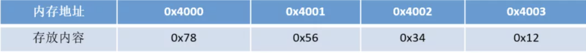
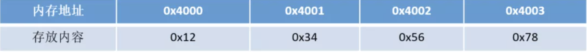
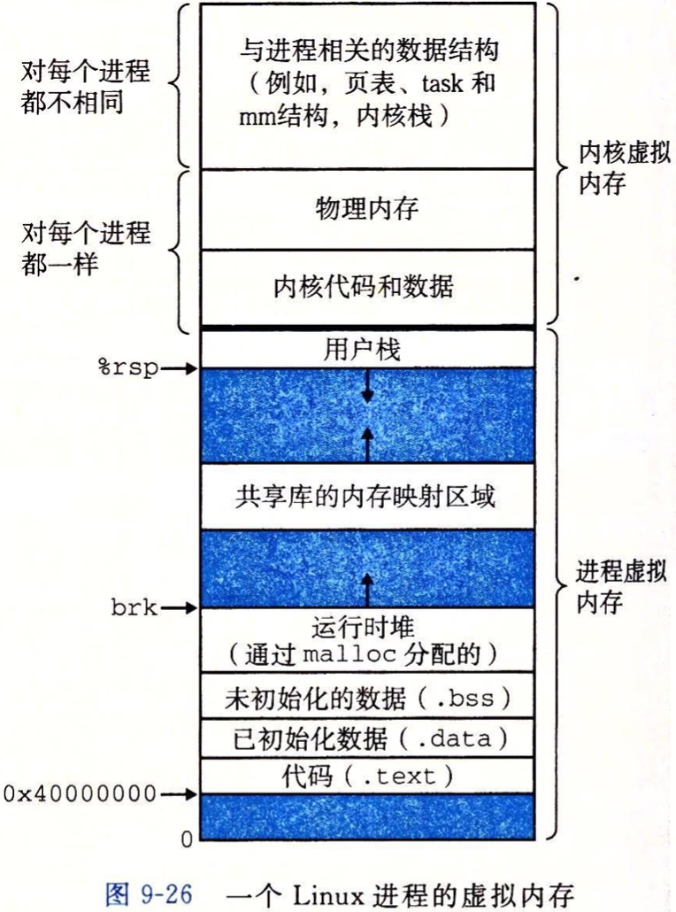

## 一. **刷题**

### 面试问过的

+ 给定一个数组num和两个数字L和R，数组长度为n，问你这个数组里面有多少个连续的子数组，满足这个子数组中的最大值大于等于L，小于等于R。
+ 给一个字符串，输出最长连续子串。
+ n的所有最小因数集合，如8，其最小质数集合为{1,2,2,2}
+ 手撕 unique_pointer
+ 布隆过滤器
+ hash表解决冲突的方法
+ 红黑树性质
+ redis中的数据结构
+ 跳表插入删除过程
+ 去掉字符串开头和末尾的空格
+ 大数相加
+ 最长公共子序列LCS
+ 最小编辑距离
+ 二叉树中两个节点的最近公共父节点
+ 数据流的中位数
+ [算法题](https://www.nowcoder.com/jump/super-jump/word?word=算法题)是两个[排序](https://www.nowcoder.com/jump/super-jump/word?word=排序)数组，找中位数。我回答了lc上的O(log M +N )的最优解方法
+ 40E个数，找出唯一不存在的数？进行(内存)优化？大数据问题都是用[哈希表](https://www.nowcoder.com/jump/super-jump/word?word=哈希表)进行分组，每一组做一次遍历，就可以大大减少内存占用
+ 1~N，其中有两个数重复，找出重复的数？
+ 写个单例模式的例子
+ 设计题，快速找出所有微信关系里的单向好友
+ 一个字符串ajxnhdbdosjbsorange,模式“o*ge”,找到匹配的最小字符串下标范围。
+ hashfunc一般怎么实现(除法散列，乘法散列 等等)
+ hashmap发生冲突怎么解决([链表](https://www.nowcoder.com/jump/super-jump/word?word=链表)法、开放寻址法等等)
+ 1亿个数怎么找中位数(哈希分组，然后快排寻找)
+ 一个字符串，比如abc123/f/ecd,连续的数字或者连续的字母，或者反斜杠后和后面一个字符，视为一个整体，反转之。比如这时输出应该是cd/e/f123abc.(一开始用了栈来做，非常简单。然后面试官问有没有其他方法，我就说一个先分段反转再整体反转的原地做法。
+ 开放寻址法要如何查找一个元素
+ 一个无序数组,如何寻找第n大的数(BFPTR[算法](https://www.nowcoder.com/jump/super-jump/word?word=算法))
+ 单向[链表]()中如何高效删除一个结点（只给定头指针和指向当前结点的指针）  
+ 给定n个正整数，如何找出最小的K个正整数 
+ 给定一组整数1000以内，如何高效去除重复的数
+ 字符串中查找是否有子串，写完以后要求给出测试用例


##  二 .C++

+ 在一台内存为2G的机器上，malloc(20G)会怎么样？new 20G呢？
+ 虚函数的作用及实现原理
+ 局部变量、全局变量、常量还有malloc开辟的内存变量分别放在哪个区
+ 全局变量的初始化位置
+ 游戏中，有些资源文件需要频繁使用，如何进行加速  
+ 游戏中，如果有一个AOE的BUFF（类似皇子的旗子E技能），如何实时快速计算这些技能的影响单位 

---

### C相关问题

##### 1. **C程序如何启动和终止的**

+ 启动：内核调用一个exec函数，并将命令行参数传递给启动例程，然后启动例程调用main函数。
+ 终止：显式或隐式地(通过调用exit)调用\_exit或 \_Exit函数。也可能是信号使其终止。

---

##### 2. **atexit函数**

+ atexit函数类似于C++类中的析构函数，在main函数结束之后被exit调用，调用顺序与登记顺序相反。同一函数如若登记多次也会被调用多次。
+ `atexit`的参数是一个函数地址，无需传递参数,也不期望返回值。

---

##### 3. ==**C程序的存储地址空间布局**==

+ 从低地址往高地址分别为： 正文段—> 初始化数据段—> 未初始化数据段—> 堆——>栈。
+ 它们的主要作用：
  + 正文段：这部分是共享的，也是只读的，是CPU执行的机器指令部分。
  + 已初始化数据段：包含程序中需明确地赋初值的变量
  + 未初始化数据段：在程序执行之前，内核将该段中的数据初始化为0或空指针。
  + 堆：动态分配存储的区域
  + 栈：自动变量与函数调用所需要保存信息的区域

---

##### 4. ==**讲一下存储空间分配函数——malloc, realloc, calloc各自的用法**==

+ `void *malloc(size_t size);`  分配指定字节数的存储区
+ `void *calloc(size_t nobj, size_t size);` 分配指定 数目 的存储空间， 初始化为0
+ `void *realloc(void *ptr, size_t newsize);` 将指针指定的存储区大小进行修改

```c
int *a = (int*)calloc(n, sizeof(int));
int * a = (int*)malloc(sizeof(int) * n);
realloc(a, sizeof(int) * 2*n);
```

---

##### 5. **C++ 中的 string 与 C 中的 `char *` 有什么区别？**

+ string继承自 basic_string ，是对 `char` 进行了封装，包含 char 数组，容量，长度等属性
+ string可以动态扩展，每次扩展是原空间的两倍，将原内容拷贝进去。

---

##### 6.C++和Python的区别

包括但不限于:

+ Python是脚本语言，解释执行的，C++是编译语言，是需要编译后在特定平台运行的。
+  python可以很方便的跨平台，但是效率没有C++高。
+ Python使用缩进来区分不同的代码块，C++使用花括号来区分
+ C++中需要事先定义变量的类型，而Python不需要
+ Python的库函数比C++的多，调用起来很方便

---

##### 7.C和C++的区别

+ C++提出了面向对象的概念，使用class或struct定义类，而C是面向过程，struct是结构体
+ C++可以重载，覆盖实现多态，C语言不允许。
+ C++可以继承，C也不允许
+ 在C++中，除了值和指针之外，新增了引用。

- C++中new和delete是对内存分配的运算符，取代了C中的malloc和free。
- C++中用来做控制态输入输出的iostream类库替代了标准C中的stdio函数库

---

#####  8.C++与Java的区别

- Java语言完全面向对象，给开发人员提供了更为简洁的语法
- Java的可移植性更强，JVM可以安装到任何的操作系统上
- Java语言中没有指针的概念，引入了真正的数组，将指针从语言中去掉，防止指针操作不规范带来的安全问题
- C++的执行效率与编译速度更快

**垃圾回收**

- C++用析构函数回收垃圾，写C和C++程序时一定要注意内存的申请和释放
- Java语言不使用指针，内存的分配和回收都是自动进行的，程序员无须考虑内存碎片的问题

---

##### 9.extern"C"的用法

+ 告诉C++编译器，下面的代码按照C的方式进行编译。通常在C++程序中使用C函数或者模块时，需要用到这个功能。

---

##### 10.C和C++的类型安全

+ 可以等价于内存安全，类型安全的代码不会试图访问自己没被授权的内存区域。
+ 有时候也用“类型安全”形容某个程序，查看程序是否隐含类型错误。

- C语言中
  - malloc函数类型不匹配时，编译器并不会报错：`int* pInt=(int*)malloc(100*sizeof(char))`
- C++中
  - new对比与malloc就更安全了，因为返回的指针类型严格与对象匹配

---

##### ==11.如何用代码判断大小端存储==

+ 大端存储：字数据的高字节存储在低地址中

+ 小端存储：字数据的低字节存储在低地址中

例如：32bit的数字0x12345678

小端模式中的存储方式为：

<div align="center">
    
</div>


大端模式中的存储方式为：

<div align="center">
    
</div>

+ 使用强制类型转换 ： 借助int型转换成char型，只会留下低地址的部分

```c++
int a = 0x1234;
char c = (char)(a);
if (c == 0x12)
  cout << "big endian" << endl;
else if(c == 0x34)
  cout << "little endian" << endl;
```

---

##### 12.如何获得结构成员相对于结构开头的字节偏移量（offsetof(Obj,int)）

使用<stddef.h>头文件中的，offsetof宏。

```c++
#include <iostream>
#include <stddef.h>
using namespace std;
#pragma pack(4) //指定4字节对齐方式就可以了。
struct S {
    int x;
    char y;
    int z;
    double a;
};
int main(){
    cout << offsetof(S, x) << endl; // 0
    cout << offsetof(S, y) << endl; // 4
    cout << offsetof(S, z) << endl; // 8
    cout << offsetof(S, a) << endl; // 12
    return 0;
}
```

---

### C++基本介绍

---

+  struct和union的区别

---

##### ==1. 聊一聊C++面向对象的三大特性==

> C++ 的三大特性就是继承，封装和多态。

+ 封装：用变量和方法组合封装成类，可以对它们进行信息隐藏，只让可信的对象和类进行操作。

+ 继承：让某种类型对象获得另一个类型对象的属性和方法。有三种继承方式：
  + 实现继承：指使用基类的属性和方法而无需再隐藏或覆盖
  + 接口继承：指仅使用属性和方法的名称、但是子类必须提供实现的能力
  + 可视继承：(C++里好像不怎么用)
+ 多态：同一事物表现出不同事物的能力。实现多态的两种方式：
  + 覆盖： 是指子类override父类的虚函数。
  + 重载：是指允许存在多个同名函数，而函数的参数表不同

---

### 变量与基本类型

---

##### 1. **声明与定义的区别**

+ 声明仅仅将变量声明的位置与类型提供给编译器，并不分配内存。
+ 定义时会直接分配存储空间。相同变量可在多处声明，但只能一处定义。

---

##### 2. **什么情况下必须用到初始化成员列表**

+ 初始化const成员
+ 初始化reference成员
+ 调用基类的构造函数，这个基类构造函数有参数
+ 调用数据成员对象的构造函数，这个数据成员对象本身的构造函数有参数

---

##### 3. ==**常量指针与指针常量的区别**==

+ 常量指针指常量的指针，注重常量，不能修改指定的值 ：`int const *p` 或 `const int *p` ；是底层const修饰
+ 指针常量指不能修改指针的指向，指针是一个常量： `int *const p` 。；是顶层const修饰

---

##### 4.**介绍野指针与空悬指针，如何避免？**

+ 野指针：没有初始化的指针
+ 空悬指针： 最初指向的内存已经被释放了的指针。
+ 解决方法：使用完置空，或者使用智能指针。

---

##### 5.  区别以下指针类型？

- `int* p[10]`
  - 表示指针数组， **强调数组概念** ，是一个数组变量，数组大小为10，数组内每个元素都是指向int类型的指针变量。
- `int (*p)[10]`
  - 表示数组指针， **强调是指针** ，只有一个变量，是指针类型，不过指向的是一个int类型的数组，这个数组大小是10。
- `int *p(int)`
  - 是函数声明，函数名是p，参数是int类型的，返回值是int *类型的。
- `int (*p)(int)`
  - 是函数指针，强调是指针，该指针指向的函数具有int类型参数，并且返回值是int类型的。

---

##### 6.==指针和引用的区别==

- 指针是一个存储地址的变量，占内存；引用原变量的别名，不占内存
- 指针可以有 **多级** ，引用只有一级
- 指针可以先声明，之后在定义；引用必须在定义 **初始化**
- 指针在初始化后 **可以改变指向** ，而引用在初始化之后 **不可再改变**

- 使用`sizeof` ，
  - 指针得到的是本指针的大小
  - 引用得到的是指向变量的大小

+ **当把指针作为参数进行传递时，使用的是地址传递，函数复制了一份指针副本；引用是使用引用传递</font>**

---

##### 7.==C++中static成员变量的作用==

+ 静态数据成员在类中声明，在类外定义，存储在全局数据区。只有一份拷贝让类的所有对象共享访问。

+ 使用静态数据成员有两个优势：
  + 静态数据成员没有进入程序的全局名字空间，不会与程序中其它全局名字冲突
  + 可以实现信息隐藏。封装成private成员变量，而全局变量不能

##### ==8.C++中static成员函数的作用==

+ 静态成员函数只与类本身相关，不与任何对象绑定，没有this指针。因此调用速度与类的全局函数速度更快
+ 它无法访问非静态数据成员与非静态成员函数，它只能调用其余的静态成员函数与静态成员变量。
  + 调用格式：＜类名＞::＜静态成员函数名＞

##### 9.C++中const成员

- 必须有构造函数；只能通过构造函数初始化列表进行初始化
- 不能在类中声明时初始化，不同类对其const数据成员的值可以不同

##### 10. **const成员函数**

+ const对象不可以调用非const成员函数；
+ 非const对象都可以调用；
+ 不可以改变非mutable（用该关键字声明的变量可以在const成员函数中被修改）数据的值

---

##### 11.constexpr与常量表达式

+ **常量表达式** 是指 **值不会改变** 并且在 **编译过程就能得到计算结果** 的表达式。
  + 一个对象（或表达式）是不是常量表达式由它的数据类型和初始值共同决定。

+ C++将 变量声明为constexpr类型，以便由编译器来验证变量的值是否是一个常量表达式 。

---

##### ==12.auto、decltype的用法==

+ C++11新标准引入了auto类型让编译器去分析表达式所属的类型。 auto 定义的变量必须有初始化。

+ decltype作用是选择并返回 操作数 的数据类型。 编译器只分析操作数并得到它的类型，不一定要初始化变量。

  ```c++
  int i = 3, &j = i;
  decltype(j) k = 5; // k的类型是 int&
  decltype(j + 0) t = 5; // 此时是int类型
  decltype((i)) c = 5; // k的类型是 int&
  ```

---

##### 13.define宏定义和const的区别

+ 宏定义
  + define是 **预处理** 时展开，只做替换，不做类型检查和计算，容易产生错误；
  + 宏定义的数据没有分配内存空间
+ const
  + const是在编译、运行的时候起作用；const常量有数据类型，编译器可以进行类型安全检查；
    + const定义的变量要分配内存空间。

---

### 字符串，向量和数组

##### 1.数组名和指针（这里为指向数组首元素的指针）区别？

- 二者均可通过增减偏移量来访问数组中的元素。
- 数组名不是真正意义上的指针，不能自增、自减；可以理解为常指针。
- 数组名当做形参传递给调用函数后，会失去原有特性，退化成一般指针，多了自增、自减操作，但sizeof运算符不能再得到原数组的大小了。

---

##### ==2.拷贝初始化和直接初始化==

+ 直接初始化是让编译器选择参数最匹配的构造函数来进行初始化
+ 拷贝初始化是让编译器将右侧运算对象拷贝到正在创建的对象中，用拷贝构造函数来完成

---

##### 3.strlen和sizeof区别？

- sizeof是运算符，并不是函数，结果在编译时得到而非运行中获得，不能用来得到动态分配（运行时分配）存储空间的大小。sizeof参数可以是任何数据的类型或者数据
- strlen是字符处理的库函数。参数只能是字符指针且结尾是'\0'的字符串。

---

### 函数

##### 1.形参与实参的区别

+ 进行函数调用时，将实参的内容复制一份传送给形参。
+ 形参只有在函数内部有效，在函数被调用时分配内存单元，在调用结束时，即刻释放所分配的内存。

---

#####  2. using 与 typedef

> 在用来定义类型的成员必须先定义后使用，这一点和普通成员变量有所区别。

**typedef**  ：别名命名方式： `typedef std::string::size_type pos`

**using** ：别名命名方式： `using pos = std::string::size_type`

---

##### 3.宏定义和typedef区别？

- 宏主要用于文本替换；typedef主要用于定义类型别名。

- 宏替换发生在预编译阶段；typedef是编译的一部分。

- 宏不检查类型；typedef会检查数据类型。

- 宏不是语句，不在在最后加分号；typedef是语句，要加分号标识结束。

  > 注意对指针的操作，`typedef char * p_char`和`#define p_char char *`区别巨大。

---

##### 4.宏定义和函数有何区别？

- 宏在在预编译阶段进行文本替换，函数调用在运行时需要跳转到具体调用函数。
- 宏定义属于在结构中插入代码，没有返回值；函数调用具有返回值。
- 宏定义不进行类型检查；函数参数具有类型，需要进行检查。
- 宏定义不是语句不要在最后加分号。

---

##### 5.含有可变形参的函数——使用initializer_list标准库

+ 函数的形参数量未知但是类型相同时可用。initializer_list对象中的元素永远是常量。
+ 如果想向initializer_list形参中传递一个值的序列，则必须把序列放在一对花括号内。

```c++
void print(initializer_list<string> s) {
    for(auto i : s )
        cout << i << endl;
}
int main() {
    print({"hello", "initializer_list"});
    return 0;
;}
```

---

##### 6.对尾置返回类型了解吗？

+ 尾置返回类型跟在形参列表后面并以一个`->`符号开头。在本该出现返回类型的地方放置一个auto:

```c++
//声明一个返回指向数组的指针的函数
//传统定义
int (* func1(int arr[][3], int n))[3] {
    return &arr[n];
}
//使用尾置返回类型后
auto func1(int arr[][3], int n) -> int(*)[3] {
    return &arr[n];
}
```

---

##### 7.什么是函数指针

+ 想要声明一个可以指向该函数的指针，只需要用指针代替函数名即可。

```c++
bool print(const string s1, const string s2) {
    if(s1 > s2)
        return true;
}
int main() {
    bool (*pf)(const string, const string );
    //pf = &print;
    pf = print;
    cout << pf("hello", "world");
}
```

---

##### 8.什么是内联函数

+ 形式在函数声明之前加上 inline ，通常是将它在每一个调用点上"内联地"展开。这样会消除函数的运行开销。一般来说，内联机制用于优化规模较小，流程直接，频繁调用的函数。

---

##### 9.内联函数与宏定义的区别

- 内联函数在编译时展开，宏在预编译时展开
- 内联函数直接嵌入到目标代码中，宏是简单的做文本替换
- 内联函数有类型检测、语法判断等功能，而宏没有
- 内联函数本身是函数，强调函数特性，具有重载等功能。

---

##### 10.在传递函数参数时，什么时候该使用指针，什么时候该使用引用？

+ 需要返回函数内局部变量的内存的时候用指针。使用指针传参需要开辟内存，用完要记得释放指针，不然会内存泄漏。而返回局部变量的引用是没有意义的
+ 对栈空间大小比较敏感(比如递归)的时候使用引用。使用引用传递不需要创建临时变量，开销要更小

+ 类对象作为参数传递的时候使用引用，这是C++类对象传递的标准方式

---

##### 11.值传递，指针传递，引用传递的取别和效率

1. 值传递：有一个形参向函数所属的栈拷贝数据的过程，如果值传递的对象是类或是大的结构体对象，将耗费一定的时间和空间。(传递的是值)
2. 指针传递：同样有一个形参向函数所属的栈拷贝数据的过程，但拷贝的数据是一个固定为4字节的地址。(传值，传递的是地址值)
3. 引用传递：同样有上述的数据拷贝过程，其实是传递地址的，相当于为该数据所在的地址起了一个别名。三者效率最高(传地址)

---

##### 12.函数重载

+ 在C++中，利用name mangling（倾轧）技术来实现重载，通过命名倾轧来改名函数名，区分参数不同的同名函数。

```c++
void print(int a); // print_i
void print(char a); // print_c
void print(int a, char b); // print_ic
void print(char a, int b); // print_ci
```

---

##### ==13.C++中的压栈过程==

---

### 类

##### 1.初始化和赋值的区别

- 对于简单类型来说，初始化和赋值没什么区别。类中成员初始化顺序与它们在类定义中的出现顺序一致
- 对于类来说，定义时，初始化会调用构造函数，赋值初始化会调用拷贝构造函数，如果是定义好的变量进行赋值，会调用赋值操作符重载函数。

---

##### 2.拷贝构造函数与赋值运算符重载的区别

+  赋值运算符是运算符重载，拷贝构造函数是函数
+  赋值运算符需要检查是否和源对象相同，不相同时，如果原对象有内存分配的话，需要先把内存释放掉。拷贝构造函数是直接构造一个新的类对象，不需要比对。
+  并不是所有出现"="的地方 都是使用赋值运算符重载，新建对象使用 “=” 时会调用拷贝构造函数。

```c++
Student s;
Student s1 = s; // 调用拷贝构造函数 Student s2;
s2 = s; // 赋值运算符操作
```

---


##### 3.哪些情况必须用到成员列表的初始化

1. 当初始化一个引用成员时;
2. 当初始化一个const成员时;
3. 当调用一个基类的构造函数，而它拥有一组参数时; 
4. 当调用一个数据成员是类的构造函数，而数据成员本身的构造函数拥有一组参数时;

> 编译器会一一操作初始化列表，以适当的顺序在构造函数之内安插初始化操作，并且在任何显示用 户代码之前;
>

---

##### 4.==C中内存对齐原则与补齐原则？==

```c++
struct number_2{
    char a;
    int b;
    double c;
}st2;
```

> st2所占内存并非1+4+8=13个，而是16个>13个。

+  **对齐原则： 变量按照定义顺序放到内存中时并不是紧密排列的。它都会认为内存是以它自己的大小来划分的，放置的位置一定会在自己宽度的整数倍上开始。**

```c++
struct number_4{
    char a;
    int b;
    char c;
}st4;
```

> sizeof(st4)=12,而不是4+4+1=9。

+ 补齐原则： 在经过对齐原则分析后，检查计算存储单元是否为所有元素中所占内存最大的元素的长度的整数倍
  + 是，则结束
  + 若不是，则补齐为它的整数倍。

+ **作用：**
  + 移植原因：不是所有的硬件平台都能访问任意地址上的任意数据的；这样补齐对移植后操作更友好。
  + 性能原因：程序员看来，内存是由字节组成。而CPU在读取内存时是一块块进行读取的，块的大小可以是2，4，8，16字节。经过内存对齐/补齐后，CPU的内存访问速度大大提升。


---

##### 5.==C++类的对象存储空间？==

对于类实例化一个对象，我们要计算这个对象所占的存储空间大小，其存储空间大小计算为（权威解答）：

+ **非静态成员变量总和；**
+   **编译器做出的数据对齐处理；**
+  **支持虚函数所产生的负担**

以上三个加起来就是目前对象占有的存储空间的大小。

```c++
class Test {
};
int main() {
    Test test0;
    cout << sizeof(test0) << endl;
}
```

> 输出为：1
>
> 空类，没有任何成员变量和成员函数，编译器是支持空类实例化对象的，对象必须要被分配内存空间才有意义，这里编译器默认分配了 1Byte 内存空间(不同的编译器可能不同)

```c++
class Test {
private:
    int i;
    char c;
    double d;
};
int main() {
    Test test1;
    cout << sizeof(test1) << endl;
}
// 输出为：16

class A{};
class Test {
private:
    int i;
    char c;
    double d;
    A a;
};
int main() {
    Test test2;
    cout << sizeof(test2) << endl;
}
//输出为：24

class A {
private:
    double dd;
    int ii;
    int* pp;
};
class Test {
private:
    int i;
    A a;
    double d;
    char* p;
};
int main() {
  	A a;
    Test test3;
    cout << sizeof(test3) << endl;
  	cout << sizeof(a) << endl;
    cout << sizeof(test1.pp) << endl;
}
//输出为：
//48
//24
//8
```

> - 这里的类的内存对齐原则与前面写的结构体的内存对齐原则是一样的(不太了解的可以移步我之前的《C/C++中内存对齐问题的一些理解》查看)
> - 测试三中，32bit 目标平台寻址空间是 4Byte(32bit)，所以指针是 4Byte的；64bit 目标平台寻址空间是 8Byte(64bit)，所以指针是 8Byte
> - 另外，静态成员变量是在编译阶段就在静态区分配好内存的，所以静态成员变量的内存大小不计入类空间

```c++
class A {
public:
    int n;
    char c;
    short s;
};
class Test {
public:
    Test() {
    }
    int func0() {
        return n;
    }
    friend int func1();

    int func2() const {
        return s;
    }
    inline void func3() {
        cout << "inline function" << endl;
    }
    static void func4() {
        cout << "static function" << endl;
    }
    virtual void func5() {
        cout << "virtual function" << endl;
    }
    ~Test() {
    }

private:
    int n;
    char c;
    short s;
};

int func1() {
    Test t;
    return t.c;
}
int main() {
  	A a;
    Test test4;
    cout << sizeof(test4) << endl;
  	cout << sizeof(a) << endl;
    cout << sizeof(test1.n) << endl;
  	cout << sizeof(test1.c) << endl;
  	cout << sizeof(test1.s) << endl;
}
//输出:
//16
//8
//4
//1
//2
```

> - 因 C++中成员函数和非成员函数都是存放在代码区的，故类中一般成员函数、友元函数，内联函数还是静态成员函数都不计入类的内存空间，测试一和测试二对比可证明这一点
> - 测试三中，因出现了虚函数，故类要维护一个指向虚函数表的指针，分别在 x86目标平台和x64目标平台下编译运行的结果可证明这一点，x64下虚函数表占了8字节

---

##### 6.C++中struct和class的区别

+ 相同点
  + 两者都拥有成员函数、公有和私有部分
  + 任何可以使用struct完成的工作，同样可以使用class完成

+ 不同点
  + struct默认成员是公有的，class则默认是私有的
  + struct模式是public继承，class默认是private继承
  + class可以作为模板类型，struct不行

---

##### 7.C++和C的struct区别

- C语言中：struct是用户自定义数据类型（UDT），是结构体；没有权限的设置的，可以封装数据却不可以隐藏数据，而且成员不可以是函数
- C++中struct是抽象数据类型（ADT）是类，具有访问权限，具有成员函数，成员默认访问说明符为public（为了与C兼容）

---

##### 8.public，protected和private访问和继承权限/public/protected/private的区别？

+ 访问权限：
  + public的变量和函数在类的内部外部都可以访问。
  + protected的变量和函数只能在类的内部和其派生类中访问。
  + private修饰的元素只能在类内访问。

+ 继承权限
  + public继承：
    + 基类的成员作为派生类的成员时保持原有的状态
  + protected继承：
    + 基类的公有成员和保护成员都成为派生类的保护成员，只能被它的派生类成员函数或友元函数访问，基类的私有成员仍然是私有的
  + private继承：
    + 基类的公有成员和保护成员都成为派生类的私有成员，基类的成员只能由自己派生类访问，无法再往下继承


---

##### 9.==volatile、mutable和explicit关键字的用法==

+ volatile 关键字是一种类型修饰符，在c/c++中的作用：
  + 告诉编译器不要将定义的变量优化掉。
  + 让编译器每次操作该变量时一定要从内存中真正取出，而不是使用已经存在寄存器中的值

+  **多线程下使用volatile的原因** 
  + 当两个线程都用一个要改变值的变量时，用volatile声明，防止优化编译器把变量从内存装入CPU寄存器。如果变量被装入寄存器，两个线程有可能一个使用内存中的变量，一个使用寄存器中的变量，这会造成程序的错误执行。

+ mutable 是为了突破 const 的限制而设置的。被 mutable 修饰的变量将永远处于可变的状态，在 const 函数中，甚至类对象是 const，其 mutable 成员也可以被修改。

+ explicit关键字用来修饰类的构造函数，被修饰的构造函数不能发生相应的隐式类型转换，只能以显示的方式进行类型转换。explicit 关键字作用于单个参数的构造函数。

---

##### 10.C++中类的数据成员和成员函数内存分布

类分为成员变量和成员函数：

+ 类对象的地址是类所包含的这一片内存空间的首地址，这个首地址对应某个成员变量的地址，不过也可能是虚指针的地址。
+ 成员函数不占用对象的内存。函数都是存放在代码区，包括静态成员函数。静态成员函数与一般成员函数的唯一区别就是没有this指针


```c++
#include <iostream>
using namespace std;
class Person{
public:
    Person(){
    		this->age = 23;
    }
    void printAge(){
        cout << this->age <<endl;
    }
    ~Person(){}
public:
		int age; 
};
int main() {
    Person p;
    cout << "对象地址:"<< &p <<endl;
    cout << "age地址:"<< &(p.age) <<endl;
    cout << "对象大小:"<< sizeof(p) <<endl; cout << "age大小:"<< sizeof(p.age) <<endl; return 0;
}
//输出结果 
//对象地址:0x7fffec0f15a8 
//age地址:0x7fffec0f15a8 
//对象大小:4
//age大小:4
```

---

##### ==11.类对象的大小受哪些因素影响==

+ 类的非静态成员变量大小，静态成员不占据类的空间，成员函数也不占据类的空间大小; 
+ 虚函数的话，会在类对象插入vptr指针，加上指针大小;
+ 如果是派生类，继承的基类部分的数据成员也存在派生类的内存空间中

```c++
class A {};
int main(){
		cout<<sizeof(A)<<endl;// 输出 1; A a;
		cout<<sizeof(a)<<endl;// 输出 1; return 0;
}
```

空类的大小是1， 在C++中空类会占一个字节，这是为了让对象的实例能够相互区别。

当该空白类作为基类时，该类的大小就优化为0了，子类的大小就是子类本身的大小。这就是所谓的空白基类最优化。

```c++
class A { 
  	virtual Fun(){} 
};
int main(){
    cout<<sizeof(A)<<endl;// 输出 4(32位机器)/8(64位机器); A a;
    cout<<sizeof(a)<<endl;// 输出 4(32位机器)/8(64位机器); return 0;
}
```

因为有虚函数的类对象中都有一个虚函数表指针 __vptr，其大小是4字节

```c++
class A { static int a; };
int main(){
		cout<<sizeof(A)<<endl;// 输出 1; 
  	A a;
		cout<<sizeof(a)<<endl;// 输出 1; 
  	return 0;
}
```

```C++
class A { int a; };
int main(){
    cout<<sizeof(A)<<endl;// 输出 4; 
  	A a;
    cout<<sizeof(a)<<endl;// 输出 4; 
  	return 0;
}
```

```c++
class A { static int a; int b; };;
int main(){
    cout<<sizeof(A)<<endl;// 输出 4; 
  	A a;
    cout<<sizeof(a)<<endl;// 输出 4;静态成员a不占用类的大小，所以类的大小就是b变量的大小 即4个字节 
  	return 0;
}
```

---

##### 12.介绍一下this指针

+ this指针是类的指针，指向对象的首地址。在成员函数中作为隐藏参数使用，在全局函数、静态成员函数中都不能用this。 


##### 13.this指针是什么时候创建的?

+ this在成员函数的开始执行前构造，在成员的执行结束后清除。

##### 14.this 指针存放在何处? 

+ this指针会因编译器不同而有不同的放置位置。可能是栈，也可能是寄存器，甚至全局变量。

##### 15. **this指针是如何传递类中的函数的**

+ this是通过成员函数参数的首参来传递的。在调用之前，编译器会把对应的对象地址放到eax（寄数寄存器）中。在类实例化时，只分配类中的成员变量空间，并没有为成员函数分配空间。自从类的函数定义完成后，它就在那儿，不会跑的.

##### 16.**每个类编译后，是否创建一个类中函数表保存函数指针，以便用来调用函数?**

+ 只有虚函数才会被放到函数表中。而且即使是虚函数，如果是静态绑定，也不会使用虚指针来调用，而是直接利用this指针调用该函数。

##### 17.在成员函数中调用delete this会出现什么问题?对象还可以使用吗?

+ 当调用delete this时，类对象的内存空间被释放。
+ 在delete this之后只要不涉及到this指针的内容，都能够正常运行。一旦涉及到this指针，就会出现不可预期的问题。

##### 18.如果在类的析构函数中调用delete this，会发生什么?

+ 会导致堆栈溢出。
+ delete的本质是 **“为将被delete的对象调用一个或多个析构函数，然后，释放内存”** 。显然，delete this会去调用本对象的析构函数，而析构函数中又调用delete this，形成无限递归，造成堆栈溢出，系统崩溃。

##### 19.**this指针调用成员变量时，堆栈会发生什么变化?**

+ 类调用成员函数时，编译器会自动将this指针，也就是对象的地址作为隐含参数传递给函数。通过this指针就知道具体是哪个对象调用。
+ 所以，this指针首先入栈，然后成员函数的参数从右向左进行入栈，最后函数返回地址入栈。

---

##### 20.有关友元

- 类通过增加friend关键字在函数开头进行声明来将其作为友元，这样就允许函数访问自己的非公有成员。
- 友元声明只能在类的内部，但是 **声明友元之外必须再专门对函数进行一次声明。**

```c++
class Sales_data{
    friend Sales_data add (const Sales_data&, const Sales_data&);
  	...
public:
    Sales_data() = default;
    ...

private:
    double avg_price () const
        { return unit_sold ? revenue/unit_sold : 0; }
    string bookNo;
    ...
};
Sales_data add (const Sales_data&, const Sales_data&);
```

- 当一个类指定了友元类，则友元类的成员函数可以访问此类包括非公有成员在内的所有成员。
- 友元不具有传递性。
- 也可以令成员函数作为友元。
- 当类想把一组重载函数声明成友元时，必须每一个都进行声明。

---

### 动态内存


##### ==1.linux进程的内存分布==

从低地址到高地址：

1. 代码段(.text)：由各个函数产生，最终经过编绎和汇编生成二进制机器代码，该部分空间只能读，不可写；
2. 初始化数据段(.data)：包含程序中需明确地赋初值的变量
3. 未初始化数据段(. bss:block started by symbol)，在程序执行之前，内核将该段中的数据初始化为0或空指针。
4. 堆：就是平时所说的动态内存， `malloc/new` 分配的内存来源于此。
5. 文件映射区域：如动态库、共享内存mmap等映射物理空间的内存。
6. 栈：用于维护函数调用的上下文空间，一般为 8 M ，可通过 `ulimit –s` 查看。
7. 内核虚拟空间：用户代码不可见的内存区域，由内核管理(页表就存放在内核虚拟空间)



---

##### 2.==**C程序的存储地址空间布局**==

+ 从低地址往高地址分别为： 正文段—> 初始化数据段—> 未初始化数据段—> 堆——>栈。
+ 它们的主要作用：
  + 正文段：这部分是共享的，也是只读的，是CPU执行的机器指令部分。
  + 已初始化数据段：包含程序中需明确地赋初值的变量
  + 未初始化数据段：在程序执行之前，内核将该段中的数据初始化为0或空指针。
  + 堆：动态分配存储的区域
  + 栈：自动变量与函数调用所需要保存信息的区域

---

##### 3.==C++的内存分区管理方式==

首先说明,在C++中，内存分为5个区：堆、占、自由存储区、全局/静态存储区、常量存储区

+ **栈：** 是由编译器在需要时自动分配，不需要时自动清除的变量存储区。通常存放局部变量、函数参数等。
+ **堆：** C++两个动态内存区域之一，使用malloc、free以及他们的变形体来进行分配和回收。
+ **自由存储区：** 是另一个动态存储区域，使用new和delete来予以分配和释放。
+ **全局/静态存储区：** 全局变量和静态变量被分配到同一块内存中
+ **常量存储区：** 这是一块特殊存储区，里边存放常量，不允许修改。

> 在C语言中，全局变量又分为初始化的和未初始化的，C++中没有这一区分。

```c
//main.cpp
int   a   =   0;   //全局初始化区
char   *p1;        //全局未初始化区
int main(){
  int   b;                     //栈
	char   s[]   =   "abc";      // 栈
	char   *p2;                  //栈
	char   *p3   =   "123456";   // 123456/0在常量区，p3在栈上。
	static int c = 0；           // 全局（静态）初始化区
	p1 =   (char *)malloc(10)
	p2 =   (char *)malloc(20)    // 分配得来得10和20字节的区域就在堆区。
	strcpy(p1, "123456");        // 123456/0放在常量区，编译器可能会将它与p3所指向的"123456"优化成一个地方。
}
```

> 注意：堆和自由存储区其实不过是同一块区域，
>
> new底层实现代码中调用了malloc，new可以看成是malloc智能化的高级版本

---

##### 4.堆和自由存储区是不是同一块区域

+ 堆 是c语言和操作系统的术语。是操作系统所维护的一块特殊内存，提供了动态分配的功能，通过malloc和free从中分配和释放。

+ 自由存储区是C++中的概念。通过new和delete动态分配和释放，通过new申请的内存区域可称为自由存储区。

+  C++编译器默认用堆来实现自由存储区

  >  缺省的全局运算符new和delete会按照malloc和free的方式来实现，这时由new运算符分配的对象，说它在堆上也对，说它在自由存储区也对。

---

#####  5.==堆和栈的区别==

- **申请方式不同**：栈由系统自动分配；堆是自己申请和释放的。
- **申请大小限制不同：** 
  - 栈是从栈顶向低地址扩展，栈顶和栈底是之前预设好的，大小固定
  - 堆向高地址扩展，是不连续的内存区域，大小可以灵活调整。
- **申请效率不同**：栈由系统分配，速度快，不会有碎片；堆由程序员分配，速度慢，且会有碎片。

---

##### 6.==堆和栈谁快？==

+ 栈快

+ 操作系统会分配专门的寄存器存放栈的地址，入栈出栈操作也十分简单，并且由专门的指令执行，所以栈的效率比堆高。

+ 堆的操作是由C/C++函数库提供的，在分配堆内存时需要寻找合适大小的内存。并且获取堆的内容需要两次访问，第一次访问指针，第二次根据指针保存的地址访问内存，因此堆比较慢。

---

##### ==7.new / delete 与 malloc / free的异同==

+ 相同点：
  + 都可用于内存的动态申请和释放
+ 不同点：
  + new / delete是C++ **运算符** ，malloc / free是C/C++语言标准库函数
  + new是类型安全的，在编译时会指出错误`bad_alloc`，而malloc不是
  + 在构造函数与析构函数角度回答
  + new自动计算要分配的空间大小`new int[4]`，malloc需要手工计算`malloc(sizeof(int)*4)`
  + new/delete是保留字，不需要头文件支持；malloc/free需要头文件库函数支持。

---

##### ==8.new和delete是如何实现的,实现原理是什么？==

+ new的实现过程：
  + 先调用 **operator new** 标准库函数，分配内存，然后保存一个指定类型的对象；
  + 然后调用该类型的构造函数初始化对象；
  + 最后返回构造后的对象的指针
+ delete的实现过程：
  + 对指针指向的对象运行对应的析构函数；
  + 然后调用 **operator delete** 标准库函数释放该对象所用内存

---

##### 9.==malloc 与 free 的实现原理==

+ 两个函数底层是由brk、mmap、munmap这些系统调用实现的;
+ malloc申请动态内存：
  + malloc小于128k的内存使用brk分配，将_edata指针往高地址推；brk分配的内存要等到高地址内存释放以后才能释放
  + malloc大于128k的内存，使用 mmap分配内存，在堆和栈之间的文件映射区找一块空闲内存分配；free利用ummap可以单独释放。
+ 函数返回的指针是指向堆里面的一块内存。
+ 操作系统中有一个记录空闲内存地址的链表。当操作系统收到程序的申请时，就会遍历该链表，然后就寻找第一个空间大于所申请空间的堆结点，然后就将该结点从空闲结点链表中删除，并将该结点的空间分配给程序。

---

##### 10.malloc 申请的存储空间能用delete释放吗？

+ 不能，malloc/free，new和delete 按照要求是需要对应使用的
+ malloc/free不能执行构造函数与析构函数
+ 不过从理论上说使用malloc申请的内存是可以通过delete释放的。而且自己也做过实验都成功了，但不能保证每次C++的运行时都能正常。

---

##### 11.==new 与 malloc 的区别==

+ malloc和free是标准库函数，支持覆盖；new和delete是运算符，并且支持重载。
+ malloc/free仅仅分配和回收内存空间，不具备调用构造函数和析构函数功能；new/delete除了分配回收功能外，还能调用构造函数和析构函数
+ malloc返回的是void类型指针（必须进行类型转换），new返回的是具体类型指针。

---

##### 12.delete和delete[]区别？

+ delete只会调用一次析构函数。
+ delete[]会从后往前调用数组中每个元素的析构函数。

---

##### 13.delete[] 怎么知道释放内存的大小的

+ C++ 的做法是在 **new操作** 分配数组空间时多分配了 4 个字节专门保存数组的大小，在 delete [] 时就可以取出这个保存的数，就知道了需要调用析构函数多少次了。

---

##### 14.==既然有了malloc/free，C++中为什么还需要new/delete?==

+ malloc/free和new/delete都是用来申请内存和回收内存的。 
+ C++中创建对象的时候还需要执行构造函数，销毁的时候要执行析构函数。而malloc/free是库函数，是已经编译的代码，不能把构造函数和析构函数的功能强加给它们，所以new/delete 是必不可少的。

---

##### ==15.被free回收的内存是立即返还给操作系统吗？==

+ 不是的，被free回收的内存会首先被ptmalloc使用双链表保存起来，当用户下一次申请内存时会先从链表中寻找合适的返回。这样就避免了频繁的系统调用，占用过多的系统资源。
+ 同时ptmalloc 也会尝试对小块内存进行合并，避免过多的内存碎片。

---

##### 16.有几种类型的new

+  **plain new** ：普通的new，常用的new

  +  **plain new** 在空间分配失败的情况下，抛出异常 **std::bad_alloc** 而不是返回NULL，通过判断返回值是否为NULL是徒劳的

  ```c++
  void* operator new(std::size_t) throw(std::bad_alloc);
  char *p = new char[10e11];
  ```

+  **nothrow new** : 

  + 在空间分配失败的情况下是不抛出异常，而是返回NULL

  ```c
  void * operator new(std::size_t,const std::nothrow_t&) throw();
  char *p = new(nothrow) char[10e11];
  ```

+  ==**placement new**== ：允许在一块已经分配成功的内存上重新构造对象或对象数组。

  + 主要用途是反复使用一块较大的动态分配的内存来构造不同类型的对象或对象数组
  + placement new构造起来的对象数组，要显式的调用他们的析构函数来销毁（析构函数并不释放对象的内存），不要使用delete，因为placement new构造起来的对象或数组大小并不一定等于原来分配的内存大小，使用delete会造成内存泄漏或者之后释放内存时出现运行时错误。

  ```c++
  char *p = new(nothrow) char[sizeof ADT + 1];
  if (p == NULL) {
    	cout << "alloc failed" << endl;
  }
  ADT *q = new(p) ADT;  //placement new:不必担心失败，只要p所指对象的的空间足够ADT创建即可
  //delete q;           //错误!不能在此处调用delete q;
  q->ADT::~ADT();       //显示调用析构函数
  delete[] p;
  ```

---

##### ==17.C++中NULL和nullptr区别==

+ NULL在C++中存在二义性，宏定义为`#define NULL 0`，既是整数，也是一个指针。作为实参传给形参为`void* p`是会报二义性错误。
+ C++ 11为了解决这个问题而提出了 nullptr ，若想使用整数特性，就赋值为0，若想使用指针特性，就赋值为nullptr
+ 优先用nullptr

---

##### 18.allocator作用

+ C++中new首先会分配内存，然后自动的完成对象构造
+ allocator将这两部分拆开，可以先分配对象，在需要构造时利用 construt 进行构造

```c++
allocator<char> str;
char* base = str.allocate(10), *p = base; //内存分配
str.construct(p++, 'a');  //对象构造并初始化
str.construct(p++, 'b');
cout << base[0] << base[1];
```

> allocator对应 dealloctor ；construct 对应 destory

---

##### ==19.深拷贝和浅拷贝的区别==

+ 浅拷贝只是拷贝一个指针，没有新开辟一个地址，拷贝的指针和原来的指针指向同一块地址，如果原来的指针所指向的资源释放了，再释放浅拷贝的指针的资源就会出现错误。
+ 深拷贝不仅拷贝值，还开辟出一块新的空间用来存放新的值，即使原先的对象被析构掉，释放内存了也不会影响到深拷贝得到的值。
  + 在实现拷贝赋值的时候，如果有指针变量的话是需要自己实现深拷贝的。

---

##### ==20.什么是对象复用，零拷贝技术，C++中哪里用到了==

+ 对象复用：
  + 对象复用其本质是 享元 设计模式。 通过将对象存储到“对象池”中实现对象的重复利用，可以避免多次重复创建对象的开销，节约系统资源。
+ 零拷贝技术：
  + 避免 CPU 将数据从一块存储拷贝到另外一块存储的技术。可以减少数据拷贝和共享总线操作的次数。
  + vector的一个成员函数 **emplace_back() **很好地体现了零拷贝技术
    + 使用 **push_back() **函数需要调用拷贝构造函数和移动构造函数，
    + 使用 **emplace_back()** 插入的元素原地构造，不需要触发拷贝构造和转移构造，效率更高

---

### 重载与类型转换

##### ==1.C++的四种强制转换类型==

**=reinterpret_cast** ：`reinpreter_cast (expression)`

+ 

**const_cast** ：`const_cast<type-id>( expression )` 

+ 修改类型的const或volatile属性。可以使一个不是const类型的数据转换成const类型的
  + 常量指针被转化成非常量的指针
  + 常量引用被转换成非常量的引用
  + const_cast一般用于修改指针。如const char *p形式。

**static_cast** ：`static_cast < type-id > ( expression )`

+ 该运算符把expression转换为type-id类型，但没有运行时类型检查来保证转换的安全性。
  + void指针->其他类型指针
  + 改变通常的标准转换
  + 避免出现可能多种转换的歧义

**dynamic_cast**：`dynamic_cast < type-id > ( expression )`

+ 该运算符把expression转换成type-id类型的对象。Type-id必须是类的指针、类的引用或者void *；如果type-id是类指针类型，那么expression也必须是一个指针，如果type-id是一个引用，那么expression也必须是一个引用

---

### 面向对象程序设计

##### 1.继承中类的作用域

+ 类存在继承关系时，派生类的作用域嵌套在基类作用域中。若一个名字在派生类中无法解析，则去基类中寻找定义。由于继承关系的类作用域嵌套，所以派生类可直接访问基类成员（而不需指定基类作用域）。
+ 声明在内层作用域的函数不会重载外层作用域的函数，故派生类中的函数也不会重载其基类的成员。不同作用域中的函数不是重载关系。但可手动指定作用域来访问

```c++
struct Base{
    int memfcn();
};
struct Derived: Base{
    int memfcn(int);    //隐藏基类中的该名字
};
Base b;
Derived d;
b.memfcn();             //对，调用Base::memfcn
d.memfcn(10);           //对，调用Derived::memfcn
d.memfcn();             //错，基类的函数在派生类中被隐藏而非重载
d.Base::memfcn();       //对，显式调用基类函数Base::memfcn
```

---

##### 2.类对其继承而来的成员的访问权限受什么影响？

- 基类中该成员的访问说明符
- 类派生列表中的访问说明符

---

##### 3.派生类的成员能否访问直接基类的成员与什么有关？

+ 派生类的成员/友元能否访问直接基类的成员，只与直接基类成员的访问说明符有关，与派生访问说明符无关
+ 假设D继承自B，则基类部分的访问控制：

  - 若是`public继承`：D的基类部分在D中public，D的所有用户都可访问其基类部分
  - 若是`protected继承`：D的基类部分在D中protected，D的派生类成员/友元可访问其基类部分（基类部分的public成员在D中变为protected）
  - 若是`private继承`：D的基类部分在D中private，只有D的成员/友元可访问其基类部分（基类部分的成员在D中都变为private）

---

##### 4.==C++有哪几种的构造函数==

C++中的构造函数可以分为4类：

- **默认构造函数**
- **初始化构造函数（有参数）**
- **拷贝构造函数**
- **移动构造函数（move和右值引用）**
- **委托构造函数**
- **转换构造函数**

举个例子：

```c++
#include <iostream>
using namespace std;

class Student{
public:
    Student(){//默认构造函数，没有参数
        this->age = 20;
        this->num = 1000;
    };  
    Student(int a, int n):age(a), num(n){}; //初始化构造函数，有参数和参数列表
    Student(const Student& s){//拷贝构造函数，这里与编译器生成的一致
        this->age = s.age;
        this->num = s.num;
    }; 
    Student(int r){   //转换构造函数,形参是其他类型变量，且只有一个形参
        this->age = r;
        this->num = 1002;
    };
  	Student(std::istream &is) : Student() {//委托构造函数，他委托给了默认构造函数。当这些受委托的构造函数执行完后，接着执行istream&构造函数体的内容。
      	read(is, *this);
    }
    ~Student(){}
public:
    int age;
    int num;
};

int main(){
    Student s1;
    Student s2(18,1001);
    int a = 10;
    Student s3(a);
    Student s4(s3);

    printf("s1 age:%d, num:%d\n", s1.age, s1.num);
    printf("s2 age:%d, num:%d\n", s2.age, s2.num);
    printf("s3 age:%d, num:%d\n", s3.age, s3.num);
    printf("s2 age:%d, num:%d\n", s4.age, s4.num);
    return 0;
}
//运行结果
//s1 age:20, num:1000
//s2 age:18, num:1001
//s3 age:10, num:1002
//s2 age:10, num:1002
```

- 默认构造函数和初始化构造函数在定义类的对象，完成对象的初始化工作
- 复制构造函数用于复制本类的对象
- 转换构造函数用于将其他类型的变量，隐式转换为本类对象

---

##### 5.什么情况下会调用拷贝构造函数

- 用类的一个实例化对象去初始化另一个对象的时候
- 函数的参数是类的对象时（非引用传递）
  - 调用函数时先根据传入的实参产生临时对象，再用拷贝构造去初始化这个临时对象
- 函数的返回值是函数体内局部对象的类的对象时 ,此时虽然发生（Named return Value优化）NRV优化，但是由于返回方式是值传递，所以会在返回值的地方调用拷贝构造函数（Linux g++不会调用，Windows VS19会）
  - 产生临时对象，调用拷贝构造函数把返回对象拷贝给临时对象，函数执行完先析构局部变量，再析构临时对象，  依然会调用拷贝构造函数

---

##### 6.为什么拷贝构造函数必须是引用传递？

+ 如果不是引用类型，为了调用拷贝构造函数，我们必须拷贝它的实参，但为了拷贝实参，我们又需要调用拷贝构造函数，如此无限循环，造成错误。

---

##### 7.派生类拷贝控制成员时的注意事项

- 派生类定义拷贝/移动构造函数时，通常应在`初值列表`中显式调用基类的对应函数来初始化对象的基类部分。否则基类部分被`默认初始化`
- 派生类的赋值算符也必须显式调用基类的赋值算符，来为基类部分赋值
- 成员构造的顺序：先执行基类构造函数，再执行派生类构造函数，直到继承链底端
- 成员析构的顺序：先执行派生类析构函数，再执行基类析构函数，直到继承链顶端

---

##### 8.能否在构造函数中抛出异常？

1. 构造函数中尽量不要抛出异常，能避免的就避免，如果必须，要考虑不要内存泄露！（智能指针）
2. 有时在构造函数中抛出异常，可能会导致构造不完全，使得析构函数不能被调用，造成内存泄露或系统资源未被释放。

---

##### 9.能否在析构函数中抛出异常？

1. 不要在析构函数中抛出异常！会导致程序过早结束或出现不明确的行为。

2. 如果某个操作可能会抛出异常，class应提供一个普通函数（而非析构函数），来执行该操作。目的是给客户一个处理错误的机会。

   + 在下面这个例子中，如果定义了students[10]之后，经过一些操作进行 delete[]，按从后往前的顺序逐个析构，但是析构第一个时抛出异常，剩下的9个就无法继续析构了，造成资源泄露。

   ```c++
   class student{
   		~student(){}//抛出异常
   }
   class Class {
     	vector<student> sudents;
     	...
   }
   ```

---

##### 10.类什么时候会析构

1. 对象生命周期结束，被销毁时;
2. delete指向对象的指针
3. 对象i是对象o的成员，o的析构函数被调用时，对象i的析构函数也被调用。

---

##### 11.delete的使用

+ 如果不希望类提供拷贝构造/移动构造的功能，则只进行声明，并在后面加上`=delete`

```c++
class B{
public:
    B();
    B(const B &)=delete;//定义了拷贝构造函数，且定义为删除。因此B没有移动构造函数。因此既不能拷贝又不能移动
};
class D: public B{};//基类定义了拷贝构造函数，且定义为删除。则派生类的合成拷贝构造函数也是删除，且没有移动构造函数
D d;
D d2(d);            //错，D的合成拷贝构造函数被删除
D d3(std::move(d)); //错，D没有移动构造函数，而合成拷贝构造函数被删除
```

---

##### 12.构造函数可以继承吗？

+ 不能继承默认/拷贝/移动构造函数。若派生类未定义它们，编译器将合成它们

+ 派生类继承基类构造函数的方式是提供一条`using声明`语句。这条using语句不是为了使名字可见，而是令编译器产生代码：对于基类的每个构造函数，编译器都生成一个对应的形参列表完全相同的派生类构造函

```c++
/* 上下文：Bulk_quote继承自Disc_quote */
class Bulk_quote:public Disc_quote{
public:
    using Disc_quote::Disc_quote;   //使用using声明继承基类的构造函数
    double net_price(size_t) const;
};
```

---

##### 13.构造函数的执行步骤是什么？

1) 在派生类构造函数中，所有的虚基类及上一层基类的构造函数调用;
2) 对象的vptr被初始化;
3) 如果有成员初始化列表，将在构造函数体内扩展开来，这必须在vptr被设定之后才做; 
4) 执行程序员所提供的代码;

---

##### 14.什么情况下会自动生成默认构造函数

1. 带有默认构造函数的类成员对象，其本身没有定义任何构造函数
2. 带有默认构造函数的基类，派生出没有构造函数的派生类

3. 带有虚函数的类，虚函数的引入需要进入虚表，指向虚表的指针，该指针是在构造函数中初始化的，所以没有构造函数的话该指针无法被初始化;

---

##### 15.什么时候需要合成拷贝构造函数?

1. 对一个对象做显示的初始化操作，X xx = x
2. 当对象被当做参数交给某个函数时
3. 当函数传回一个类对象时

---

##### 16.构造函数、析构函数、虚函数可否声明为内联函数

+ 将这些函数声明为内联函数，在语法上没有错误。因为inline只是个建议，编译器并不一定真正的内联。
+ 构造函数和析构函数声明为内联函数是没有意义的，因为编译器会在构造和析构函数中进行申请/释放内存，构造/析构对象等，并不像看上去的那么精简。
+ 当虚函数体不复杂时：
  + 派生类的指针调用声明为inline的虚函数时，不会内联展开；
  + 对象本身调用虚函数时，会内联展开

---

##### 17.介绍一下C++中的静态类型与动态类型

+ `静态类型`在编译期已知，是变量/表达式声明时的类型
+ `动态类型`到运行期才可知，是变量/表达式在内存中对象的类型

只有基类的引用/指针才可能发生静态类型和动态类型不一致的情况，即编译时绑定和运行时绑定。

---

##### 18.什么是编译时绑定和运行时绑定？

+ 使用指针/引用调用虚函数，并且进行了向上转型时，由运行时的对象类型决定调用哪个虚函数：this->vptr->vtable[i]->vfunc

  ```c
  child* c = new Parent();
  c->virtualFunc();
  ```

+ 普通成员函数： 在编译期间就已经知道函数的版本，直接定位到类中的方法。

---

##### 19.哪些情况下，可以把类的引用/指针绑定到一个对象

1. 引用/指针的类型与对象一致
2. 将基类类型的引用/指针绑定到派生类对象
3. 对象的类型含有可接收的const转换规则

---

##### 20.类类型的转换与继承，即基类与继承类之间的转换

- `基类引用/指针可指向派生类`：可以让派生类向基类转换
  - 派生类都有基类部分，基类引用/指针可绑定到基类部分
- `派生类引用/指针不可指向基类`：不可以让基类向派生类的转换
  - 派生类派生的那部分基类并没有。
- 特别是，即使基类的引用/指针绑定到派生类，也不可将其赋值给该派生类类型的引用/指针

```c
/* 上下文：Bulk_quote由Quote派生而来 */
Bulk_quote bulk;
Quote *itemP=&bulk;         //对，基类指针可指向派生类对象
Bulk_quote *bulkP=itemp;    //错，基类指针不可转为派生类指针，即使该基类指针实际指向该派生类类型
```

> 从派生类到基类的类型转换只对引用/指针有效

---

##### ==21.介绍一下虚函数的作用和实现原理==

+ 虚函数：函数前面用 virtual 来修饰

+ 作用：主要是实现了多态的机制。当设计者希望派生类override基类中的某个方法时，就把它定义成虚函数。
+ 实现原理：**虚表指针 + 虚函数表**
  + 类定义虚函数后，编译器为每个类对象添加一个隐藏成员，隐藏成员中保存了一个指向虚函数表的虚表指针（vptr），虚函数表（virtual function table, vtbl）是一个数组，里面存放的都是虚函数地址。 

---

##### 22.==虚函数与纯虚函数的区别==

+ 声明不同：
  + 虚函数是virtual void funtion1(); 
  + 纯虚函数是virtual void funtion1() = 0；
+  函数实现角度：
  + **虚函数必须实现的**，哪怕是空实现，如果不实现，编译器会报错
  + **纯虚函数一定没有实现**，只是一个接口
+ 继承给子类后：
  + 虚函数在子类里面可以不override；
  + 纯虚必须在子类中国一定要重新复写；

---

##### 23.==虚函数的使用注意事项==

+ 由于只有运行时才知道调用了哪个虚函数，故所有虚函数都必须有定义

+ 虚函数调用的版本：

  - 通过引用/指针调用虚函数时，进行动态编译，函数的版本由运行时的对象类型决定
  - 通过非引用非指针表达式调用虚函数时，进行静态编译，在编译期间就知道函数的版本，直接定位到类中的方法。

+ 当派生类的虚函数调用它覆盖的基类虚函数时，需要手动指定虚函数版本，回避动态绑定

  ```c++
  double discounted=baseP->net_price(42);             //指针调用虚函数，在运行时确定版本
  double undiscounted=baseP->Quote::net_price(42);    //手动指定执行Quote中的版本
  ```

---

##### 24.介绍一下抽象基类

+ 若一个基类只用于对其派生类提供抽象，不希望产生该基类的实例，则可将该基类定义为`抽象基类(ABC)`
+ 将虚函数定义为`纯虚函数`，即将基类定义为抽象类。
+ 将虚函数定义为纯虚函数的方法是在函数体的位置写`=0`，且只能出现在类内部的虚函数声明语句处

---

##### 25.虚函数有什么代价？

1) 带有虚函数的类，每一个类会产生一个虚函数表，用来存储指向虚成员函数的指针;
2) 带有虚函数的类的每一个对象，都会有有一个指向虚表的指针，会增加对象的空间大小;
3) 不能再是inline内敛函数，因为内敛函数在编译阶段进行替代，而虚函数有时需要动态绑定，在运行时才知道调用哪个

----

##### 26.哪些函数不能是虚函数？

1. 构造函数，构造函数初始化对象，派生类必须知道基类函数干了什么，才能进行构造；当有虚函数时，每一个类有一个虚表，每一个对象有一个虚表指针，虚表指针在构造函数中初始化;

2. 内联函数，内联函数表示在编译阶段进行函数体的替换操作，而虚函数意味着在运行期间进行类型确定，所以内联函数不能是虚函数;

3. 静态函数，静态函数不属于对象属于类，静态成员函数没有this指针，因此静态函数设置为虚函数没 有任何意义。

4. 友元函数，友元函数不属于类的成员函数，不能被继承。对于没有继承特性的函数没有虚函数的说 法。

5. 普通函数，普通函数不属于类的成员函数，不具有继承特性，因此普通函数没有虚函数。

---

##### ==27.你了解虚函数表和虚表指针吗？== 

+ 类中含有virtual关键字修饰的方法时，编译器会自动生成虚表；是全局共享的元素，在编译时就构造完成。虚函数表类似一个数组，

+ 虚表指针：在含有虚函数的类实例化对象时，对象地址的前四个字节存储的指向虚表的指针vptr

---

##### 28.==基类的虚函数表存放在内存的什么区，虚表指针vptr的初始化时间==

+ C++中虚函数表位于只读数据段（.rodata），也就是C++内存模型中的常量区；
+ 虚函数则位于代码段（.text），也就是C++内存模型中的代码区。
+ 虚表指针`vptr`跟虚函数密不可分，对于有虚函数或者继承于拥有虚函数的基类，对该类进行实例化时，在构造函数执行时会对虚表指针进行初始化，并且存在对象内存布局的最前面。

---

##### 29. 使用虚函数有什么便利之处吗？

+ 在容器中存储 基类指针，就能直接指不同的派生类对象了，不需要再甄别具体类型

---

##### 30.final与 override关键字

+ override：
  + 指定子类的这个虚函数是重写的父类的，万一名字不小心打错了的话，编译器是不会编译通过的，更安全也更醒目
+ final：
  + 当不希望类被继承或虚函数被重写，在类名和虚函数后添加final关键字，添加后被继承或重写，编译器会报错。

---

##### 31.为什么析构函数一般写成虚函数

原因：在实现多态时，当用基类操作派生类，析构时防止只析构基类而不析构派生类的状况发生

+ 如果析构函数不被声明成虚函数，当基类指针指向派生类对象时，，删除该基类的指针则编译器实施静态绑定，只会调用基类的析构函数而不调用派生类析构函数，这样就会造成派生类对象析构不完全，造成内存泄漏。

+ 由于类的多态性，设置为虚函数时，调用该指针指向的派生类析构函数，而派生类的析构函数又自动调用基类的析构函数，这样整个派生类的对象完全被释放。

---

##### 32.C++中的重载、重写（覆盖）和隐藏的区别

+ 重载 overload
  + 在同一范围定义中的同名成员函数才存在重载关系。主要特点是函数名相同，参数类型和数目有所不同
+ 重写（覆盖） override
  + 在派生类中覆盖基类中的同名函数，重写函数体**，**要求基类函数必须是虚函数且参数类型，个数，返回值都相同

> 重写并不在同一个范围内，是垂直关系(父与子)

+ 隐藏
  + 隐藏指的是某些情况下，派生类中的函数屏蔽了基类中的同名函数；想调用基类中的函数必须指明，否则报错

```c++
class A{
public:
    virtual void fun(int a){
        cout << "A中的fun函数" << endl;
    }
};
class B : public A{
public:
   virtual void fun(char* a){//隐藏父类的fun函数
       cout << "B中的fun函数" << endl;
   }
};
int main(){
    B b;
    b.fun(2);    //报错，调用的是B中的fun函数，参数类型不对
    b.A::fun(2); //调用A中fun函数
    return 0;
}
```

---

##### 33.C++ 中的多态是如何实现的？

多态同一事物表现出不同事物的能力。C++实现多态的两种方式：

+ 覆盖/重写 override： 是指子类重新定义父类的虚函数的做法。实现运行时绑定
+ 重载：是指同意范围允许存在多个同名函数，但函数的参数表不同

---

##### 34.C++中如何利用虚函数表和虚函数指针来实现多态的？

+ 编译器发现基类中有虚函数时，会自动为每个含有虚函数的类生成一份一维数组的虚表，保存虚函数的入口地址；虚表可以继承，如果子类没有重写虚函数，那么子类虚表中仍然会有该函数的地址，只不过这个地址指向的是基类的虚函数实现。如果基类3个虚函数，那么基类的虚表中就有三项(虚函数地址)，派生类也会有虚表，至少有三项
+ 如果派生类重写了相应的虚函数，那么虚表中的地址就会改变，指向自身的虚函数实现。如果派生类有自己的虚函数，那么虚表中就会添加该项。
+ 编译器会在每个对象的前四个字节中保存一个虚表指针vptr，指向对象所属类的虚表。在构造时，根据对象的类型去初始化虚指针vptr，从而让vptr指向正确的虚表，从而在调用虚函数时，能找到正确的函数

---

##### 35.构造函数能否声名称虚函数

+ 构造函数不能定义为虚函数。在构造函数中可以调用虚函数，不过此时调用的是正在构造的类中的虚函数，而不是子类的虚函数，因为此时子类尚未构造好。
+ 虚函数对应一个vtable(虚函数表)，类中存储一个vptr指向这个vtable。如果构造函数是虚函数，就需要通过vtable调用，可是对象没有初始化就没有vptr，无法找到vtable，所以构造函数不能是虚函数。

---

##### 36.静态函数能定义为虚函数吗？

+ static成员不属于任何类对象或类实例，即使给此函数加上virutal也是没有任何意义的。
+ 虚函数的调用关系:this -> vptr -> vtable ->virtual function。静态成员函数没有this指针，无法调用虚函数

---

### 模板类


---

### 异常


---

### ==C++重难点==

##### 1.介绍一下智能指针

+ 智能指针是一个类，这个类的构造函数中传入一个普通指针，析构函数中释放传入的指针。

  >  智能指针的类都是栈上的对象，所以当函数（或程序）结束时会自动被释放

+ C++ 11中新增了三个 智能指针： shared+ptr, unique_ptr, weak_ptr
+ 注意事项：
  + 构造函数是`explicit`的，即不能将内置指针隐式转换为智能指针
  + 内置指针构造智能指针时必须立即构造，禁止混合使用这两种指针
+ 使用智能指针的三个情况：
  + **不知道需要使用多少对象（容器）**
  + **不知道所需对象的准确类型（多态）**
  + **需在多个对象间共享数据**

---

##### 2.介绍一下shared_ptr的使用

+ shared_ptr是基于引用计数的智能指针。当内存的引用计数为0的时候这个内存会被释放。
+ 最安全的分配和使用动态内存的方法是调用`make_shared`函数

---

##### 3.介绍一下 unique_ptr的使用

+ 与shared_ptr不同的是同一时刻只能有一个unique_ptr指向给定对象；
+ 也不支持复制和赋值，直接赋值会编译出错。实在想赋值的话，需要使用：`std::move`。

---

##### 4.介绍一下 weak_ptr 的使用

+ 是一种不控制指向对象生存期的智能指针，它指向一个由shared_ptr管理的对象
+ weak_ptr绑定到shared_ptr指向的对象时，不会改变引用计数，一旦对象shared_ptr的引用计数清零，对象就会被释放，即使有weak_ptr指向它。
+ 由于weak_ptr的对象可能不存在，所以不能用weak_ptr直接访问对象，可以用lock函数先检查指向对象是否存在，若存在则返回指向该对象的shared_ptr，不存在则返回空的shared_ptr

---

##### 5.智能指针的线程安全问题你知道吗？

+ 智能指针有2个成员，引用计数是原子类型的，但原始指针并不是；所以综合来说就不是线程安全的。

+ 多个线程同时读同一个shared_ptr对象是线程安全的，但是如果是多个线程对同一个shared_ptr对象进行读和写，则需要加锁。

---

##### 6.怎么解决智能指针出现的循环引用问题

+ 循环引用就是：两个对象互相使用一个shared_ptr成员变量指向对方。可能会出现类似于死锁的现象
+ 弱指针用于专门解决shared_ptr循环引用的问题，weak_ptr的存在与否并不影响对象的引用计数器。

---

##### 7.介绍一下什么是右值

+ 左值：可以出现在 = 左边的值
+ 右值：只能出现在 = 右边的值；如临时对象

##### 8.什么是右值引用

+ `右值引用` 通过`&&`来 必须绑定 `右值` 的引用，
  + 右值引用只能绑定将要被销毁的对象，故可将右值引用的资源安全地移动到另一个对象

##### 9.std::move 怎么使用？

+ `std::move`函数可将左值显式转换为它对应的右值引用类型。处理完后，除对它赋值或销毁外，不可再使用它的值。

##### 10.什么是移动构造函数

- 移动构造函数的参数，移动构造函数的初值是一个右值引用 &&。往往是利用浅拷贝进行实现。
  - 拷贝构造函数的参数是左值引用，函数体往往是利用深拷贝进行实现。
- 用一个右值，或者将亡值初始化另一个对象的时候，才会调用移动构造函数。可以使用move语句，将左值变成一个将亡值，这样传入就会告诉编译器调用移动构造函数。
  - vector::push_back使用std::move提高性能
    + 直接把传来的资源利用浅拷贝给偷过来，减少了开销

##### 11.介绍一下 lambda 表达式

+ 是一个可调用的代码单元，也就是一个未命名的`内联函数`。它有捕获列表、返回类型、形参列表、函数体，可定义在函数内部
  + `[capture list](parameter list) -> return type {function body}`
+ `lambda实际是匿名类`：定义lambda时，编译器生成一个与其对应的未命名的类类型

##### 12.介绍一下 bind 使用


## 三. STL

### STL基本介绍

##### 1.介绍一下STL 提供六大组件

**1、容器（containers）**：各种数据结构，如vector, list, deque, set, map。从实现角度看，容器是一种 class template。

**2、算法（algorithms）**：各种常用的算法，如 sort, search, copy, erase…从实现角度来看，算法是一种 function template。

**3、迭代器（iterators）**：扮演容器与算法之间的胶合剂，是所谓的“泛型指针”。从实现角度来看，迭代器是一种将 operator *, operator ->, operator++, operator– 等指针相关操作予以重载的class template。

**4、仿函数（functors）**：行为类似函数，可以作为算法的某种策略。从实现角度来看，仿函数是一种重载了 operator() 的 class 或class template。

**5、适配器（adapters）**：一种用来修饰容器或仿函数或迭代器接口的东西。例如 STL 提供的 queue 和 stack，虽然看似容器，其实只能算是一种容器适配器，因为底层由 deque 实现。

**6、配置器（allocator）**：负责空间配置与管理，从实现角度来看，配置器是一个实现了动态空间配置、空间管理、空间释放的 class template。

> Array 与 forward_list是 C++ 11新增的 

---

### string

##### 1. string 与 C字符串的转换

+  data() 以字符数组的形式返回字符串内容，但并不添加 `'\0'`;
+  c_str() 返回一个以 `'\0'` 结尾的字符数组;
+  copy() 则把字符串的内容复制或写入既有的 c_string 或字符数组内。

> 需要注意的是， C++字符串并不以喻’结尾。

```c++
int copy(p, n, size_type _Off = 0);//将所调用的对象中第 string _Off 位置的 n 个字符复制到 p 指向的空间
str = "hello world";
const char * cstr1 = str.data();
const char * cstr = str.c_str();
cout << cstr1 << " " << cstr2<< endl;//hello world
str = "OK";
cout << cstr1 << " " << cstr2<< endl;//OK OK 
```

---

##### 2.string 与 int 类型的转换

+ int 转为 string 的方法

  ```c++
  int snprintf(char *str, size_t size, co口st char *format, ...)
    
  char a[20] ;
  int i = snprintf(a, 9, "%d",   12345) ;
  cout << i <<" "<< a << endl;	//5 12345
  ```

  + 它将可变个参数 (...) 按照 format格式化成字符串，然后将其复制到str中

+ string 转为 int 类型

  + 使用 strtol, stroll, strtoul 或 strtoull 等函数

    ```c++
    char *endptr ;
    char nptr []= ” 123abc”;
    int ret =strtol(nptr, &endptr, 10 ); //指定为十进制
    cout<<”ret:”<<ret<<" "<<endptr:”<< endptr<<endl;
    //ret:123 endptr:abc
    ```

---

##### 3.string的操作方法

+ string 的截取操作：
  + `string substr (size_t pos = 0, size_t len = npos) const;`：拷贝 pos 位置开始的 len 长的字符串作为子串，pos默认为0

+ string的插入操作：
  + `s.insert(pos, args)` ：在pos之前插入args指定的字符
    + pos可以是下标，也可以是迭代器
  + `s.append(args)` ：将 args 追加到 s

+ string 的修改操作：
  + `s.assgin(args)`：将args替换string中的字符
  + `s.replace(range, args)`：将args代替 s 中 range 范围的字符串
    + range 可以是一个下标和长度，也可以是一对指向 s 的迭代器
+ string的删除操作：
  + `s.erase(pos,len)`：删除从 pos 开始 的 len 个字符，如果 len 被省略，则删除 pos 后的所有字符 

+ 比较大小：compare函数

---

##### 4. string 的搜索操作：

+ `s.find(args)` ：查找 s 中args第一次出现的位置
+  `s.rfind(args)` ：查找 s 中args最后一次出现的位置
+ `s.find_first_of(args)` ：查找 s 中args中任意一个字符第一次出现的位置
+ `s.find_last_of(args)` ：查找 s 中args中任意一个字符最后一次出现的位置
+ `s.find_first_not_of(args)` ：查找 s 中查找第一个不在args中的位置
+ `s.find_last_not_of(args)` ：查找 s 中查找最后一个不在args中的位置

找到返回下标，不在返回`string::npos`，是一个static成员，初始化为 -1

> args: (c,pos)  从s中位置pos开始查找c

---

### Array

##### 1. 介绍一下Array

+ `std::array` 是封装固定大小数组的容器。底层为静态数组，大小固定，不可扩容，但操作更安全。
+ 结合了 C 风格数组的性能、可访问性与容器的优点，比如可获取大小、支持赋值、随机访问迭代器等。

---

### vector

##### 1.vector元素怎么排序

+ 在类中定义重载<函数
+ 定义比较函数，sort参数中应用比较函数

---

##### 2.vector的操作方式

+ vector的查找：`find(vec.begin(), vec.end(), num)`

  + 使用 find 函数在 vector 中进行查找 

+ vector的删除： （返回删除元素之后元素的迭代器）

  ```c
  iterator erase (iterator position) 
  iterator erase (iterator first , iterator last ) 
  vec.pop_back()
  ```

  + 需要注意的是，删除非最后元素之后迭代器会失效，所以操作之后需要重新更新 迭代器

    ```c
    vector<int>::iterator iter = vec.begin();
    for(; iter != vec.end(); ){
      	if(*iter == 3) {
          	iter = vec.erase(iter);
        } else {
          	++ iter;
        }
    }
    ```

+ vector的增加

  + push_back：在容器最后添加元素
  + emplace_back：在容器最后构建元素
  + insert：在位置前插入

  ```c++
  //在指定位置 loc 前插入值为 val 的元素，返回指向这个元素的迭代器
  iterator insert (iterator loc , const TYPE &val ) ;
  //在指定位置 loc 前插入 num 个值为 val 的元素
  void insert( iterator loc , size_type num, const TYPE &val) ; 
  //在指定位置 loc 前插入区间[ start, end)的所有元素
  void insert( iterator loc , input_iterator start, input_iterator end) ;
  ```

---

##### 3.vector的内存管理

+ v.size()：获得容器中有多少元素
+ v.capacity()：获得容器在它已经分配的内存中可以容纳多少元素 
+ v.resize(Container::size_type n)：强制把容器改为容纳 n个元素 ，不影响capacity
  + n 小于size，容器尾部的元素会被销毁
  + n 大于size，新默认构造的元素会添加到容器尾部。 如果 n 大于capacity，在元素加入之前会进行重新分配 
+ v.reserve(Container::size_type n)：强制容器把它的容量改为不小于n，不影响size
  + 小于等于当前capacity时，reserve什么都不做
  + 大于当前capacity时，reserve扩张容量

- v.shrink_to_fit()：C++11方法，要求vector/string/deque退回多余的空间，但具体实现可忽略此要求。不保证能退回

vector采用的`内存扩张策略`一般是：在每次需要分配新空间时，将当前容量翻倍。但具体实现可使用不同策略

---

##### 4. vector的迭代器类型与数据成员

+ 迭代器类型： `Random Access Iterator` 
+ 数据成员：三个迭代器(指针) `first,last,end`

---

##### 5. vector 上常见操作的复杂度（效率）

- 随机访问——常数 *O(1)*
- 在结尾或起始插入或移除元素——常数 *O(1)*
- 插入或移除元素——线性 *O(n)*

---

### deque

##### 1. 介绍一下 deque

+ `std::deque` （ double-ended queue ，双端队列）是有下标顺序容器，它允许在其首尾两段快速插入及删除。另外，在 deque 任一端插入或删除不会非法化指向其余元素的指针或引用。

---

##### 2. 与vector比有什么优势

+ 与 `std::vector` 相反， deque 的元素不是相接存储的：典型实现用单独分配的固定大小数组的序列，外加额外的登记，这表示下标访问必须进行二次指针解引用，与之相比 vector 的下标访问只进行一次。
+ deque 的存储按需自动扩展及收缩。扩张 deque 比扩张vector更优，因为它不涉及到复制既存元素到新内存位置。

---

##### 3. deque的迭代器类型与数据成员：

+ 迭代器类型： `Random Access Iterator`
+ 数据成员：一个迭代器，内部拥有四个指针 `head, tail, cur, node`

---

##### 4. deque 上常见操作的复杂度（效率）

- 随机访问——常数 *O(1)*
- 在结尾或起始插入或移除元素——常数 *O(1)*
- 插入或移除元素——线性 *O(n)*

---

### forward_list

##### 1. 介绍一下 forward_list

+ `std::forward_list` 是支持从容器中的任何位置快速插入和移除元素的容器。不支持快速随机访问。它实现为单链表，且实质上与其在 C 中实现相比无任何开销。
+ 与 `std::list` 相比，此容器在不需要双向迭代时提供更有效地利用空间的存储。

+ 在链表内或跨数个链表添加、移除和移动元素，不会非法化当前指代链表中其他元素的迭代器。然而，在从链表移除元素时，指代对应元素的迭代器或引用会被非法化。

---

##### 2. forward_list 操作

```c++
lst.insert_after(p,...);//p为迭代器
emplace_after(p,args);  //在p位置后面构建一个元素
lst.erase_after(p);			//删除 p 后面的元素
lst.erase_after(b,e);		//删除 [b,e) 之间的元素
```

- 对forward_list（单向链表）的元素做插入/删除，需要知道其`前驱`。
- forward_list的插入/删除改变的不是指定元素，而是指定元素之后的一个元素
- forward_list定义了`before_begin`迭代器，它指向首元素之前，称为`首前迭代器` ，不能解引用

---

##### 3. forward_list的迭代器类型与数据成员：

+ 迭代器类型： `Forward Iterator` ，不支持 -- 操作，其余都支持
+ 数据成员：一个指针 `head` ,表示头结点

---

##### 4. forward_list 上常见操作的复杂度（效率）

- 插入或移除元素——常数 *O(1)*
- 查询操作——线性 *O(n)*

---

### list

##### 1. 介绍一下list

+ `std::list` 是支持常数时间从容器任何位置插入和移除元素的容器。不支持快速随机访问。它通常实现为双向链表。与 `std::forward_list` 相比，此容器提供双向迭代但在空间上效率稍低。
+ 在 list 内或在数个 list 间添加、移除和移动元素不会非法化迭代器或引用。迭代器仅在对应元素被删除时非法化。

---

##### 2. list的迭代器类型与数据成员：

+ 迭代器类型： `Bidirectional Iterator` ，支持 -- 操作
+ 数据成员：一个尾指针 `node` ,实现环状链表

---

##### 3. list 上常见操作的复杂度（效率）

- 插入或移除元素——常数 *O(1)*
- 查询操作——线性 *O(n)* 

---

### 关联容器

实现在C++中，set 和 map 分别提供了以下三种数据结构，其底层实现以及优劣如下表所示：

| 集合                 | 底层实现 | 是否有序 | 数值是否可以重复 | 能否更改数值 | 查询效率   | 增删效率   |
| -------------------- | -------- | -------- | ---------------- | ------------ | ---------- | ---------- |
| `std::set`           | 红黑树   | 有序     | 否               | 否           | $O(log_n)$ | $O(log_n)$ |
| `std::multiset`      | 红黑树   | 有序     | 是               | 否           | $O(log_n)$ | $O(log_n)$ |
| `std::unordered_set` | 哈希表   | 无序     | 否               | 否           | $O(1)$     | $O(1)$     |

`std::unordered_set`底层实现为哈希表，`std::set` 和`std::multiset` 的底层实现是红黑树， **红黑树是一种平衡二叉搜索树，所以key值是有序的，但key不可以修改，改动key值会导致整棵树的错乱，所以只能删除和增加。**

| 映射                 | 底层实现 | 是否有序 | 数值是否可以重复 | 能否更改数值 | 查询效率   | 增删效率   |
| -------------------- | -------- | -------- | ---------------- | ------------ | ---------- | ---------- |
| `std::map`           | 红黑树   | Key有序  | key不可重复      | key不可修改  | $O(log_n)$ | $O(log_n)$ |
| `std::multimap`      | 红黑树   | Key有序  | key可重复        | key不可修改  | $O(log_n)$ | $O(log_n)$ |
| `std::unordered_map` | 哈希表   | Key无序  | key不可重复      | key不可修改  | $O(1)$     | $O(1)$     |

`std::unordered_map` 底层实现为哈希表，`std::map` 和`std::multimap` 的底层实现是红黑树。同理，`std::map` 和`std::multimap` 的key也是有序的（这个问题也经常作为面试题，考察对语言容器底层的理解）。

当我们要使用集合来解决哈希问题的时候，优先使用unordered_set，因为它的查询和增删效率是最优的，如果需要集合是有序的，那么就用set，如果要求不仅有序还要有重复数据的话，那么就用multiset。

##### 1.红黑树基础介绍

+ 红黑树是一种二叉查找树，但在每个结点上增加一个存储位表示结点的颜色，可以是 Red或 Black。 通过对任何一条从根到叶子的路径上各个结点着色方式的限制，确保没有一条路径会比其他路径长出两倍，因而是接近平衡的。
+ 红黑树在二叉查找树的基础上增加了着色和相关的性质使得红黑树相对平衡，保证了一棵 n 个结点的红黑树始终保持了 Iogn 的高度，从而保证了红黑树的查找 、 插入、删除的时间复杂度最坏为 O(logn)。性质如下：
  + 每个结点要么是红的要么是黑的
  + 根结点是黑的
  + 每个叶结点都是黑的
  + 如果一个结点是红的，那么它的两个儿子都是黑的
  + 对于任意结点而言，从一个节点到该节点的子孙节点的所有路径上包含相同数目的黑节点。
+ 对红黑树进行插入和删除等操作时，可能会破坏红黑树的性质 。 可以通过对结点进行重新着色，以及对树进行相关的旋转操作，修改树中某些结点的颜色及指针结构，来达到操作后继续保持性质或平衡的目的 。

##### 2.哈希表

+ 哈希表是根据关键码的值而直接进行访问的数据结构。数组就是一张哈希表。 关键码是数组的索引下表，通过下表直接访问数组中的元素。
+ 一般哈希表都是用来快速判断一个元素是否出现集合里。
+ 哈希函数，把值直接映射到哈希表上的索引，通过查询索引快速知道值是否在表中。

+  **<font color = red>此时为了保证映射出来的索引数值都落在哈希表上，再次对数值做一个取模的操作，保证值可以映射到哈希表上了。</font>** 如果元素数量大于哈希表的大小，会有元素同时映射到同一个索引下表的位置。出现 **「哈希碰撞」**。

解决哈希碰撞的方法：

+ 拉链法：
  + 位置发生了冲突，发生冲突的元素都被存储在链表中。
  + 拉链法就是要选择适当的哈希表的大小，数组空值会浪费大量内存，链表太长会在查找上浪费太多时间。
+ 线性探测法：
  + 使用线性探测法，一定要保证tableSize大于dataSize。依靠哈希表中的空位来解决碰撞问题。
  + 例如冲突的位置，放了A，那么就向下找一个空位放置B的信息。所以要求tableSize一定要大于dataSize ，要不然哈希表上就没有空置的位置来存放冲突的数据了。

---

### map

##### 1. map的本质与功能

+ `std::map` 是有序键值对容器，它的元素的键是唯一的。对于迭代器来说，不可以修改键值，只 能修改其对应的实值。 
+ map 通常实现为红黑树。具有对数据自动排序的功能，在 map 内部所有的数据都是有序的 。

##### 2. map的增删改查

+  **map类型值：**
  +  `key_type`：关键字类型
  + `mapped_type`：值类型
  + `value_type`是key-value对pair类型

+  **map的插入**

  + 插入 pair 数据：`map.insert(pair<type,type>(,))`
  + 插入 value_type 数据： `map.insert(map<type,type>::value_type(,))`
  + 数组的方式插入数据： `map[key_type] = mapped_type` ；可以覆盖修改原有数据

+  **map 的遍历**

  + auto 的方式来遍历

  + 利用迭代器：

    ```c++
    map<int , string>::iterator iter ;
    for(iter = Map.begin();iter ! = Map.end(); iter++)
      	cout << iter->first<< " " << iter->second << endl;
    ```

+  **map的查找**

  + 利用 count
  + 利用 find 
    + 数据出现时，返回数据所在位置的迭代器
    + 没有要查找的数据，返回 end() 迭代器 。

+  **map的删除**

  + 利用键值：`map.erase(k)` 返回 size_type类型的值以表示删除的元素个数
  + 利用迭代器：`map.erase(p)` 返回 void类型
  + 利用迭代器范围：`map.erase(b,e)` 返回 void类型 ；删除范围：[b,e)

  > 注意事项：利用迭代器删除时最好还是将输入的迭代器备份一下

##### 3. map排序

+ 按照 key 从大到小排序：
  + 定义时排序： `map<string, int, greater<string>> Map`
  + 利用vector：将map以pair对的形式导入vector，然后利用sort进行排序
    + `sort(v.begin(), v.end(),[](pair<int,string>a,pair<int,string>b){return a.first > b.first;});`
+ key(第一个元素)是一个结构体：在结构体中重载 < 运算符
+ 按照 value 进行排序： 
  + 利用 vector，将 first 修改成 second

---

##### 4. map的迭代器类型与数据成员：

+ 迭代器类型： `Bidirectional Iterator` 
+ 数据成员：一个指针指向红黑树；红黑树成员：一个size_t变量表示树的大小，一个header指针

---

##### 5. map 上常见操作的复杂度（效率）

- 搜索，移除和插入： $logn$

### set

##### 1.set的本质与功能

`std::set` 是关联容器，含有 `Key` 类型对象的已排序集。用比较函数 Compare 进行排序。搜索、移除和插入拥有对数复杂度。 `set` 通常以红黑树实现。

---

##### 2.为何 map 和 set 的插入删除效率比用其他序列容器高 ?

+ 因为关联容器不需要做内存拷贝和内存移动 。 set容器内所有元素都是以节点的方式来存储，节点结构和链表差不多
+ 插入只要把节点的指针指向新的节点；删除把指向删除节点的指针指向其他节点。 只需修改指针操作，和内存移动没有关系 。

---

##### 3.为何每次 insert之后，以前保存的 iterator不会 失效?

+ iterator相当于指向节点的指针，内存没有变，指向内存的指针不会失效。 
+ 对于vector，每一次删除和插入，指针都有可能失效，push_back也是如此 。 因为有时需要开辟新内存将原有数据移动入内，这样原指针全部失效。

---

##### 4.当数据元素增多时， set 的插入和搜索速度变化如何?

+ set使用的是二分查找，当数据量增大一倍的时候，搜索次数只不过多了 1 次。是$log2$的关系。

---

##### 5.set的增删查操作

+ set的插入操作
  + 在 pos位置之前插入 value，返回新元素位置
  + 将迭代区间[&first, &last)内所有的元素 ，插入到 set容器。
+ set的删除操作
  + `size_type erase(value)`移除 set容器内元素值为 value 的所有元素，返回移除的元素个数。
  + `void erase(&pos)`移除 pos位置上的元素，无返回值。
  + `void erase(&first, &last)`移除迭代区间``[&first, &last)``内的元素，无返回值 。
+ set的查找
  + `count(value)`返回 set对象内元素值为 value 的元素个数 。
  + `iterator find(value)`返回 value所在位置，找不到 value将返回 end()。

---

##### 6. set的迭代器类型与数据成员：

+ 迭代器类型： `Bidirectional Iterator` 
+ 数据成员：一个指针指向红黑树；红黑树成员：一个size_t变量表示树的大小，一个header指针

---

##### 7. set 上常见操作的复杂度（效率）

- 搜索，移除和插入： $logn$

### unordered_map 与 unordered_set

##### 介绍一下

+ multimap， unordered_set是关联容器，底层由 哈希表 实现。在内部，元素并不以任何特别顺序排序，而是组织进桶中，元素被放入哪个桶完全依赖其值的哈希。 两者的差别在于前者重复key 或者 重复 value 。STL默认使用拉链法来解决哈希冲突问题

---

##### 迭代器类型与数据成员：

+ 迭代器类型： `Forward Iterator` 
+ 数据成员：
  + 一个指针指向哈希表；
  + 哈希表内部成员：
    + 一个 size_t 变量表示哈希表中元素数量
    + 一个内部存放 node 结点指针的 vector

---

##### 常见操作的复杂度（效率）

- 插入，移除以及查询元素——常数 *O(1)*

---

### 容器适配器

+ Queue 先进先出，stack 先进后出；底层默认由 deque 实现
+ Priority_queue 优先队列，底层由 vector 实现，默认为大顶堆，提供 *O(1)* 复杂度的最大元素查询，  $O(logn)$ 代价的插入与释出

---

## 四.网络编程相关

+ 讲讲非阻塞socket
+ 文件读经历了哪些过程

---


### 1.socket

##### 1.内存中的多字节数据的大小端

+  **CP/IP协议规定，网络数据流应采用大端字节序，计算机为小端存储，即低地址高字节。**

  + 大端字节序：低地址存高位
  + 小端字节序：低地址存低位

  ```c
  int a = 0x12345678
  1003:大端:12	小端:78
  1002:大端:34	小端:56
  1001:大端:56	小端:34
  1000:大端:78	小端:12
  ```

---

##### 2. **介绍一下你知道的网络字节序和主机字节序的转换函数：**

+ h表示host，n表示network，l表示32位长整数，s表示16位短整数。
  + hton： **将数据从主机字节序转换成网络字节序**
  + ntoh： **将数据从网络字节序转换为主机字节序**

---

##### 3.你知道哪些IP转换函数？

+ 对于IPv4地址和IPv6地址都适用。函数名中p和n分别代表表达(presentation)和数值(numeric)。

```c
#include <arpa/inet.h>

/*将strptr中的IP字符串传给addrptr*/
int inet_pton(int family, const char *strptr, void*addrptr);
inet_pton( AF_INET, ip, &address.sin_addr );
//返回：若成功则为1，若输入不是有效的表达格式则为 0，若出错则为-1
/*将addrptr中的数据传给strptr*/
const char *inet_ntop(int family, const void *addrptr, char *strptr, size_t len);
printf("client IP:%s\tport:%d\n",  
  			inet_ntop(AF_INET, &clie_addr.sin_addr.s_addr,clie_IP, sizeof(clie_IP)), 	
				ntohs(clie_addr.sin_port));
//返回：若成功则为指向结果的指针，若出错则为NULL
```

---

##### 4.bind函数的使用

+ 将 文件描述符 和 IP地址与端口号信息 绑定在一起，使sockfd这个用于网络通讯的文件描述符监听address所描述的地址和端口号。

```c++
struct sockaddr_in clien_addr;
bzero(&clien_addr,sizeof(clien_addr));
clien_addr.sin_family = AF_INET;
inet_pton(AF_INET, ip, &clien_addr.sin_addr);
clien_addr.sin_port = hton(port);

bind(listenfd, (struct sockaddr*)&clien_addr, sizeof(clien_addr));
```

---

##### 5.为什么需要端口复用

+ 当端口占用的进程结束任务后断开连接，在TCP断开链接需要四次握手，等待一个TIME_WAIT时间后断开TCP连接，才能继续使用端口。
+ SO_REUSEADDR这个选项就是告诉OS如果一个端口处于TIME_WAIT状态,  不需要继续等待TIME_WAIT时间结束直接使用。

```c
int opt = 1;
setsockopt(listenfd, SOL_SOCKET, SO_REUSEADDR, &opt, sizeof(opt));   
setsockopt(sockfd, SOL_SOCKET, SO_REUSEADDR, (const voidvoid *)&opt, sizeof(opt));
```

---

##### 6. **TCP进行socket编程的步骤**

- 服务端和客户端初始化 socket ，得到文件描述符; 
- 服务端调用 bind ，将绑定在 IP 地址和端口; 
- 服务端调用 listen ，进行监听;
- 服务端调用 accept ，等待客户端连接；
- 客户端调用 connect ，向服务器端的地址和端口发起连接请求;
- 服务端 accept 返回用于传输的 socket 的文件描述符;
- 客户端调用 write 写入数据;服务端调用 read 读取数据;
- 客户端断开连接时，会调用 close ，那么服务端 read 读取数据的时候，就会读取到了 EOF ， 待处理完数据后，
- 服务端调用 close ，表示连接关闭。

---

##### 7. **服务器端会维护哪两个队列？** 

- 未完成连接队列(SYN 队列):接收到一个 SYN 建立连接请求，处于 SYN_RCVD 状态; 
- 已完成连接队列(Accpet 队列):已完成 TCP 三次握手过程，处于 ESTABLISHED 状态;

---

##### 8. **服务器端进行TCP连接(socket连接)时，内核的工作流程**

- 当客户端发送的SYN请求报文到达后，插入到SYN 队列，随后给对方发送ACK确认报文
- 当接收到客户端的ACK确认报文后，应用程序从Accpet 队列中取出已完成连接的socket

##### 9. **socket的各个步骤对应 TCP 握手中的哪些阶段？**

- 客户端初始化 socket ，调用 connect 后，进入SYS-SENT状态，是第一次握手阶段
- 服务器端初始化 socket ，调用 bind 绑定在 IP 地址和端口，调用 listen 进行监听后，进入Listen状态
- 服务器端在接收到客户端的 SYN 请求报文后， 调用 accept ，等待客户端连接，并回复ACK确认报文，进入 SYN-RCVD状态
- 客户端接收到ACK确认报文后，connect函数返回文件操作符，回复ACK确认报文，进入established状态
- 服务器端收到对方的ACK确认报文后，accpet API 函数返回 文件操作符，进入established状态

##### 10. **为什么一个socket可以accept多次？**

- 输入参数 fd 是从 socket， bind， listen 中沿用下来的 socket 句柄值，是在指定的端口处监昕所有的连接请求。
- 调用 accept() 是从 socket fd 的请求队列抽取第一个连接信息，创建新的同类型 socket 句柄 fd 来进行后续操作。
- 两个fd 是不同的，所以能 accept 多次

##### 11. **客户端调用close后，连接是断开的流程是什么?**

- 就是四次挥手流程

##### 12. **IO有哪两种操作？**

- 同步IO：必须等待 IO 操作完成后，控制权才返回给用户进程 。 
- 异步IO：无须等待 IO 操作完成，就将控制权返回给用户进程 。 

##### 13. **网络IO发生时，设计哪些对象与操作？**

- 会涉及两个系统对象：调用这个 IO 的 进程，系统内核。
- 当一个 read操作发生时，会经历两个阶段:
  - 等待数据准备; 
  - 将数据从内核拷贝到进程中。


### 2.IO复用

##### 1. **简单介绍一下4中IO模型。**

- 阻塞IO：阻塞是指 IO 操作需要彻底完成后才返回到用户空间

  > 阻塞 IO 模型的特点就是：在 IO 执行的两个阶段(等待数据和拷贝数据)都被阻塞了 。

- 非阻塞IO：非阻塞是指 IO 操作被调用后立即返回给用户一个状态值， 不需要等到 IO 操作彻底完成。

  > `fcntl( fd, F_SETFL, O_NONBLOCK );` 来设置socket成为非阻塞IO

- 多路IO复用（事件驱动IO）：可以监视多个描述符， 一旦某个描述符就绪( 读就绪或写就绪)，能够通知程序进行相应的读写操作。 

  > 调用API后整个进程会被阻塞，而且存在两个系统调用(select与revcfrom)，如果连接数不多，不能体现优势。

- 异步IO：

  - 用户角度：用户进程发起 read操作之后，立刻就可以开始去做其他的事;
  - 内核角度：当它收到一个异步的 read请求操作之后，首先会立刻返回，所以不会对用户进程产生任何阻塞。 然后，内核会等待数据准备完成，然后将数据拷贝到用户内存中，当这一切完成后，内核会给用户进程发送一个信号，返回 read操作已完成的信息 。

> + 阻塞 IO、非阻塞 IO 及多路 IO 复用都属于同步 IO。
> + 非阻塞 IO在执行 recvfrom 候，若内核的数据没有准备好，不会阻塞进程 。 但当内核中数据准备好时， recvfrom 会将数据从内核拷贝到用户内存中，这时进程仍被阻塞。 
> + 异步 IO 不同， 当进程发起 IO 操作之后，就直接返回，直到内核发送一个信号，告诉进程 IO 已完成，整个过程中进程完全没有被阻塞。

---

##### 2. **介绍一下 select 系统调用设计的函数**

```c++
#include <sys/select.h>
void FD_ZERO(fd_set *set); 						//把文件描述符集合里所有位清0
void FD_CLR(int fd, fd_set *set); 		//把文件描述符集合里fd清0
int  FD_ISSET(int fd, fd_set *set); 	//测试文件描述符集合里fd是否置1
void FD_SET(int fd, fd_set *set); 		//把文件描述符集合里fd位置1

struct timeval {
  	long tv_sec; /* seconds */  
  	long tv_usec; /* microseconds */
};

int select(int nfds, fd_set *readfds, fd_set *writefds, fd_set *exceptfds, 
           struct timeval *timeout);
```

**参数：**

+ nfds： 指定被监听的文件描述符的总数。通常设置为被监听的所有fd中的最大值加1，因为fd从0开始计数的。

+ readfds：  监控有读数据到达文件描述符集合，传入传出参数

+ writefds： 监控写数据到达文件描述符集合，传入传出参数

+ exceptfds： 监控异常发生达文件描述符集合,如带外数据到达异常，传入传出参数

+ timeout： 定时阻塞监控时间，3种情况

  1. NULL，永远等下去

  2. 设置timeval，等待固定时间

  3. 设置timeval里时间均为0，检查描述字后立即返回，轮询

**返回值：**

+ 成功： **所监听的所有 监听集合中，满足条件的总数**
+ 失败： 返回 -1 并设置errno

---

##### 3.**介绍一下 poll 系统调用函数**

```c
#include <poll.h>

struct pollfd {
    int fd; /* 文件描述符 */
		short events; /* 监控的事件：主要是 POLLIN,POLLOUT,POLLERR */
		short revents; /* 监控事件中满足条件返回的事件，由内核填充 */
};

int poll(struct pollfd *fds, nfds_t nfds, int timeout);
```

**参数：**

+ fds： pollfd结构类型的数组，它指定所有我们感兴趣的文件描述符上发生的可读，可写和异常等事件。
+ nfds： 指定被监听时间集合fds的大小。
+ timeout： 毫秒级等待
  + -1：阻塞等待，#define INFTIM -1         Linux中没有定义此宏
  + = 0：立即返回，不阻塞进程
  + \> 0：等待指定毫秒数，如当前系统时间精度不够毫秒，向上取值

**返回值：**

+ 成功： 所监听的所有 监听集合中，满足条件的总数
+ 失败： 返回 -1 并设置errno

---

##### 4. 介绍一下 epoll 系统调用函数

+ epoll_create 函数：创建一个epoll句柄，参数size用来告诉内核监听的文件描述符的个数

  ```c++
  #include <sys/epoll.h>
  
  int epoll_create(int size);
  ssize_t efd = epoll_create(OPEN_MAX);   
  ```

  + 参数：
    + size：监听数目(告诉Linux内核创建多大的epoll模型)，创建多大结点的红黑树，只是建议值，
  + 返回值：
    + 成功返回 文件描述符，指向红黑树的根
    + 失败返回 -1

+ epoll_ctl 函数：控制某个epoll监控的文件描述符上的事件：注册、修改、删除。

  ```c++
  struct epoll_event {
  			__uint32_t events; /* Epoll events */
  			epoll_data_t data; /* User data variable */
  };
  typedef union epoll_data {
      int fd;					//与epoll_ctl函数中的fd对应
      ...
  } epoll_data_t;
  
  int epoll_ctl(int epfd, int op, int fd, struct epoll_event *event);
  /*
  	epoll_event中的 events:
  	EPOLLIN ：	表示对应的文件描述符可以读（包括对端SOCKET正常关闭）
  	EPOLLOUT：	表示对应的文件描述符可以写
  */
  struct epoll_event tep;
  tep.events = EPOLLIN; 
  tep.data.fd = listenfd;          
  res = epoll_ctl(efd, EPOLL_CTL_ADD, listenfd, &tep); 
  ```

  + 参数：
    + epfd ： epoll_create成功返回的文件描述符，即红黑树树根
    + op ： 在红黑树树上进心增删改：
      + EPOLL_CTL_ADD (注册新的fd到epfd)
      + EPOLL_CTL_MOD (修改已经注册的fd的监听事件)
      + EPOLL_CTL_DEL (从epfd删除一个fd)
    + fd ： 具体需要操作的文件描述符
    + event： 告诉内核需要监听的事件(往往只需要 events 与 data.fd)
  + 返回值：
    + 成功返回 0
    + 失败返回 -1

+ epoll_wait函数： 等待所监控文件描述符上有事件的产生，类似于 select() 调用。

  ```c++
  #include <sys/epoll.h>
  
  int epoll_wait(int epfd, struct epoll_event *events, int maxevents, int timeout);
  struct epoll_event ep[OPEN_MAX];
  nready = epoll_wait(efd, ep, OPEN_MAX, -1); 
  ```

  + 参数：

    + epfd ： epoll_create成功返回的文件描述符，即红黑树树根

    + events ： 是一个传出参数数组
  
      > epoll_ctl中是传入变量的地址，这个变量初始化好就行
      >
      > epoll_wait中是传入数组，传出满足事件的文件描述符，每个元素都是epoll_event结构体

    + maxevents ： 告之内核这个events有多大，这个maxevents的值不能大于创建epoll_create()时的size，

    + timeout ：是超时时间
  
      +  -1： 阻塞
      +  0： 立即返回，非阻塞
      +  \>0： 指定毫秒

  + 返回值：
  
    + 成功返回有多少文件描述符就绪
    + 时间到时返回0，
    + 出错返回-1

---

##### 5. **介绍一下 epoll 的两种触发模式**

+ **Level Triggered (LT 水平触发)** ：epoll的默认触发方式，既支持阻塞模式，也支持非阻塞模式，当被监控的文件描述符上有可读写事件发生时，epoll_wait()会通知处理程序去读写。一次性读写完未全部完成，那么下次调用 epoll_wait()时，还会通知在上次没读写完的文件描述符上继续读写

+ **Edge Triggered (ET 边缘触发)** ： 只支持非阻塞模式，当被监控的文件描述符上有可读写事件发生时，epoll_wait() 会通知处理程序去读写。一次性全部读写完未完成，那么下次调用epoll_wait()时，不会通知，即只会通知一次，直到该文件描述符上出现第二次可读写事件。

  > 最好是利用边缘触发，使用非阻塞fd，套上while循环将数据一次性读写完成，这样效率更高。

---

##### 6. **在ET模式下当多个连接同时到达时该怎么处理？**

+ 理论上如果多个连接同时到达，服务器的TCP就绪队列瞬间积累多个就绪连接，由于是边缘触发模式，epoll只会通知一次，accept只处理一个连接，导致TCP就绪队列中剩下的连接都得不到处理。

+ 解决办法是用while循环包住accept调用，处理完TCP就绪队列中的所有连接后再退出循环。如何知道是否处理完就绪队列中的所有连接呢？accept返回-1并且errno设置为EAGAIN就表示所有连接都处理完。

---

##### 7. **nigix的实现中多个连接同时到达如何处理？**

+ nigix 中 ，accept函数调用使用水平触发的fd，就是出于对丢失连接的考虑，所以不存在丢失连接的问题。
+ 但是若系统中有大量不需要读写的就绪文件描述符，而它们每次都会返回，会大大降低处理程序检索自己关心的就绪文件描述符的效率。

---

##### 8. **使用Linux epoll模型，水平触发模式；当socket可写时，会不停的触发socket可写的事件，如何处理？**

+ 平时不要把该描述符放进event_poll结构体中，当需要写该fd的时候，调用epoll_ctl把fd加入eventpoll里监听，可写的时候就往里写，写完再次调用epoll_ctl把fd移出event_poll，这种方法在发送很少数据的时候仍要执行两次epoll_ctl操作，有一定的操作代价
+ 改进一下就是：平时不要把该描述符放进event_poll结构体中，需要写的时候调用write或者send写数据，如果返回值是EAGAIN（写缓冲区满了），那么这时候才执行第一种方法的步骤。

---

##### 9. **比较IO复用 select，poll，epoll 的区别**

+ select、 poll和 epoll都是多路 IO 复用机制。 可以监视多个描述符， 一旦某个描述符就绪，会通知程序进行相应的读写操作。 但它们本质上都是同步 IO，因为它们都需要在读写事件就绪后自己负责进行读写，是阻塞的。

+ select的优缺点：

  + 优点：
    + select目前几乎在所有的平台上支持，其良好跨平台支持也是它的一个优点。
    + select()对于超时值提供了更好的精度，而 poll()是精度较差。
  + 缺点：
    + select能监听的文件描述符个数受限于FD_SETSIZE,一般为1024
    + select采用的是轮询模型，如果链接客户端过多，会大大降低服务器响应效率

+ poll的优缺点：

  + 优点：
    + 可以修改文件描述符的上限数目，优于select
    + 将监听集合 和 返回集合 实现了分离，不像select那么麻烦，搜索范围更小
    + poll在应付大数目的文件描述符时速度更快，对于 select 来说内核需要检查大量描述符对应的set中的每一个比特位，比较费时。
  + 缺点：
    + 但还是需要将数组全部变量，找出已连接的文件描述符，而不是直接返回满足的文件描述符数组。

+ epoll 的优点：

  + 支持ET边缘触发模式，其余两者只支持LT水平触发模式。

  + 不是使用轮询的方式，不会随着fd数目的增加而降低效率。只有活跃可用的fd才会调用callback函数；selet 与 poll 调用时都会对连接进行线性遍历，所以随着FD的增加会造成遍历速度慢的“线性下降性能问题”。

  + 使用 mmap共享内存的方式，加速内核与用户空间的消息传递

    > 3者都需要内核把fd消息通知给用户空间，如何避免不必要的内存拷贝就显得尤为重要 。 
    >
    > epoll 通过内核 与用户空间 mmap 处于同一块内存实现的 。
    >
    > poll将传入的 pollfd数组拷贝到内核空间，因为拷贝操作和数组长度相关，时间上来看，这是一个 O(n)操作


---


---

## 五.WebServer项目相关

* 利用正则与状态机解析HTTP请求报文，实现处理静态资源的请求；
* 利用标准库容器封装char，实现自动增长的缓冲区；
* 基于小根堆实现的定时器，关闭超时的非活动连接；

---

##### 自我介绍

+ 来自东南大学网络空间安全学院，专业是计算机专业，专硕。
+ 比较熟悉C/C++基本语法，对操作系统，计算机网络比较了解
+ 所以应聘贵公司的后端开发岗位

---

##### **介绍一下你的WebServer项目**

+ 自己改写了一个简单的Reactor高并发模型服务器。
+ 主线程初始化一个线程池，然后建立socket链接，进行绑定IP与端口，创建socketfd，利用IO复用技术Epoll模型，创建efd，将socketfd添加至efd中，进行监听事件与数据读写。
+ 定义httpconn类封装任务事件，包括socket文件描述符，地址信息，读写缓存区，解析HTTP报文的成员函数；
+ 如果监听到连接事件发生，则进行accpet连接，将新建socket文件描述符添加至epoll中进行监听。
+ 如果监听到读事件发生，则将读数据的操作交给线程池中的线程，将传来的数据一次性读入读缓冲区
+ 数据读完之后，将任务封装成 http_conn 类，线程池中子线程取出队首任务，执行任务中的process函数，即解析HTTP请求，生成响应写入写缓冲区，触发可写操作。
+ 监听到可写操作，主线程让子线程去完成写操作，将写缓冲区的内容写给客户端

---

##### 解析消息的流程process

- 解析消息 process_read
  - 当解析遇到空行时，说明消息头部字段解析完成，接下来解析的就是消息体
  - 如果不是空行，则进行解析消息头的各个信息，比如connect，等等
  - 等消息解析完之后就去分析目标文件的属性
- 分析目标文件的属性 do_request
  - 将服务器中的资源根目录与请求内容结合，找到对应的资源的路径
  - 然后分析路径与权限是否合法
  - 最后打开寻找的路径的文件，创建内存映射，将需要写回的资源映射到地址上，等待之后的发送
- 生成响应 process_write
  - 判断解析请求的返回值，根据请求结果来做对应的操作，如No resource等
    - 添加响应状态行，响应头
  - 将消息头和消息体分散写 write，使用writv
    - 消息头就是上面根据请求来设置的消息头内容
    - 消息体是mmap映射的资源

---

##### **介绍一下服务器程序中的事件处理模式**

+ 简单介绍：
  + Reactor模式：利用I/O复用，让主线程调用 epoll_wait 等待 socket 上有数据可读与可写。当epoll_wait 通知主线程后，主线程将 socket 事件放入请求队列，唤醒的线程来处理数据的读写与后续的业务逻辑
  + Proactor模式：利用 异步I/O aio_read 与 aio_write 让内核来进行 socket 的读写操作，等操作完成后内核通知主线程，主线程将唤醒工作线程来处理后续的业务逻辑与事件注册
  + 同步IO模拟Proactor模式： 主线程调用 epoll_wait 等待 socket 上有数据可读与可写。当epoll_wait 通知主线程后，主线程将数据读完之后封装成请求队列中的元素，唤醒工作线程完成后续的逻辑业务与事件注册。
+ **Reactor模式**
  + 要求主线程 (I/O处理单元) 只负责监听文件描述上是否有事件发生，有则立即将该事件通知工作线程(逻辑单元)，将socket可读可写事件放入请求队列，交给工作线程处理。除此之外，工作线程不做任何实质性的工作。读写数据，连接新的连接，处理客户请求接在工作线程完成。
  + 使用同步 I/O 模型实现的工作流程：
    1. 主线程 在epoll 内核事件表中注册 socket 的读就绪事件
    2. 主线程调用 epoll_wait 等待 socket 上有数据可读
    3. 有数据可读时，epoll_wait 通知主线程，主线程将 socket 可读事件放入请求队列
    4. 睡眠在请求队列中的某个工作线程被唤醒，它从socket 读取数据，并处理客户请求，然后往 epoll 事件表中注册 socket 上的写就绪事件
    5. 主线程调用 epoll_wait 等待 socket 可写
    6. socket 可写时， epoll_wait 通知主线程，主线程将 socket 可写事件放入请求队列
    7. 睡眠在请求队列中的某个工作线程被唤醒，它往 socket 上写入服务器处理客户请求的结果
+  **Proactor模式：**
  + 将所有I/O操作都交给主线程和内核处理(读写)，工作线程只负责业务逻辑。
  + 使用异步I/O模型实现的工作流程：
    1. 主线程调用 aio_read 函数向内核注册 socket 上的读完成事件，并告诉内核 用户读缓冲区的位置，以及读操作完成时如何通知应用程序，可用信号
    2. 主线程继续处理其他逻辑
    3. 当 socket 上的数据被读入用户缓冲区后，内核将向应用程序发送信号，通知数据可用
    4. 应用程序预先定义的信号处理函数选择一个工作线程来处理客户请求。处理完成之后调用 aio_write 函数向内核注册 socket 上的写完成事件，并告诉内核 用户写缓冲区的位置，以及写操作完成时如何通知应用程序
    5. 主线程继续处理其他逻辑
    6. 当用户缓冲区数据写入 socket 后，内核将向应用程序发送信号，通知数据已发送
    7. 应用程序预先定义的信号处理函数选择一个工作线程做善后工作，比如是否关闭socket
+  **同步I/O模拟Proactor模式：**
  + 主线程执行数据读写操作，完成之后主线程向工作线程通知这一"完成事件"。从工作线程的角度看，它们只需对读写的结果进行逻辑处理。
  + 使用同步 I/O 模型模拟出Proactor模式的工作流程如下：
    1. 主线程 在epoll 内核事件表中注册 socket 的读就绪事件
    2. 主线程调用 epoll_wait 等待 socket 上有数据可读
    3. 有数据可读时，epoll_wait 通知主线程，主线程从 socket 中循环读完数据，将数据封装成一个请求对象放入请求队列
    4. 睡眠在请求队列中的某个工作线程被唤醒，它获得请求对象并处理客户请求，然后往 epoll 事件表中注册 socket 上的写就绪事件
    5. 主线程调用 epoll_wait 等待 socket 可写
    6. socket 可写时， epoll_wait 通知主线程，主线程往 socket 上写入服务器处理客户请求的结果

---

##### **线程池的优点是什么？**

+ 线程池旨在降低创建和销毁线程的频率，使其维持合理数量的线程，并让空闲的线程重新承担新的任务 。
+ 连接池是指维持连接的缓存池，尽量重用已有的连接，降低创建和关闭连接的频率。
+ 这两种技术能降低系统开销，但当请求数目远远大于池中元素的数目时，没有显著的效果。特别是在阻塞IO下。

---

##### 如何设计一个多线程下安全的队列

```c++
struct Pool {
  std::mutex mtx;
  std::condition_variable cond;
  bool isClosed;
  std::queue<int> value;
};
```

---

##### 你是怎么设计线程池的？

+ 定义了一个ThreadPool类，其中的将一个Pool类与Pool类型的智能指针pool。其中Pool类有四个元素，分别为：
  + mutex锁 mtx
  + 条件变量 cond
  + bool 类型的标志，表示是否关闭线程池
  + 任务队列 tasks，元素是Function函数
+ 首先定义构造函数：
  + 默认传入参数ThreadCount表示创建8个线程，初试列表中动态创建一个动态指针对象，即定义一个线程池。
  + 在构造函数体中，进行for循环，利用Thread函数创建线程，并设置为分离detach，其中thread参数是lambda函数，在lambda函数中，将新建的线程池对象传入其中，lambda函数体中先用unique_lock锁住，然后进行while循环，不断取出任务队列，进行任务操作，当队列为空时，阻塞等待有工作线程入队的通知
+ 定义析构函数，析构函数体中将bool 标志设置为关闭线程池，通知所有线程，则所有线程函数都break while循环
+ 定义添加任务函数 AddTask，首先进行lock_guard加锁，然后将传来的task参数初始化封装成任务，并添加到任务队列中。解锁，并利用条件变量通知线程池中的一个线程。

```c++
//条件变量的定义：
std::condition_variable cond;
std::mutex mtx;
std::unique_lock<std::mutex> locker(mtx);
//条件变量进行阻塞
cond.wait(locker);
//唤醒所有线程
cond.notify_all();
//唤醒一个线程
cond.notify_one(); 
```

---

+  项目里实现了哪些HTTP请求呢，处理的时候如何分辨这些请求呢？
+  设想这样一种场景，我的web服务器里面有一张表格，现在浏览器需要请求这个表格中 id=张三 的内容，同时返回到浏览器也需要以表格的形式展现。

---

##### 为什么需要定时器

+ 因为系统中的文件描述符资源有限，如果一直存在不活跃的文件描述符，会消耗文件资源

---

##### 有什么方法来实现定时器？为什么利用最小根堆来设计定时器的？

+ 时间轮：
+ 时间堆：定时器的触发是由于时间到了，因此只有时间最短的定时器会首先被触发，通过这个原理，可以采用最小堆，将按时间顺序排序，堆顶元素是时间最短的定时器，因此只要判断堆顶元素是否被触发即可。只有堆顶定时器的时间到了，才会到其他时间较晚的定时器的时间。
+ 最小根堆的设计：
  + 每个结点的值都小于或等于其左右孩子结点的值，称为小顶堆。使用数组来模拟堆的实现，先从最后一个非叶子结点开始 size()/2。从左至右，从下至上进行调整。当发现子结点比父节点大的时候就进行交换，知道根结点，这样就设计出了最小根堆。

对于时间轮：

+ 添加一个定时器的时间复杂度是O(1)

+ 删除一个定时器的时间复杂度也是O(1)

+ 执行一个定时器的时间复杂度是O(n)

对时间堆：

+ 添加一个定时器的时间复杂度是O(lgn)
+ 删除一个定时器的时间复杂度是O(1)
+ 执行一个定时器的时间复杂度是O(1)

因此，时间堆的效率是很高的。

---

##### 如何设计的自动增长缓冲区

+ 设计了一个buffer类，主要元素有：
  + `vector<char>` 封装的 buffer_
  + 原子类型的 `atomic<size_t> readPos_;` 标记已读位置
  + 原子类型的 `atomic<size_t> writePos_;` 标记已写位

写入字符串时，如果缓冲区剩余写的位置不够，可以先看 剩余大小与已读完总和的大小，如果大于将要写入的大小，则将剩余需要读的内容移到vector最前面，更新 readPos_ 和 WritePos_。如果不够，则进行扩容写入的大小，再更新readPos和writePos。

---

##### 如何利用正则表达式来解析HTTP响应的？

```c++
// ~ 匹配字符串： |任意非空 任意非空 HTTP/任意非空|   --> 三个group ()  ()  ()
// ~ 例子：       GET http://hello.html HTTP/1.1
string line = "GET https://www.baidu.com HTTP/1.1";
regex patten("^([^ ]*) ([^ ]*) HTTP/([^ ]*)$");
smatch subMatch;
if(regex_match(line, subMatch, patten)) {
  for(int i = 1; i < subMatch.size(); ++i)
    cout << subMatch[i] << endl;
}
```

```c++
string line ="Connection : keep-alive";
regex patten("^([^:]*): ?(.*)$");
smatch subMatch;
// ~ 匹配整个 line 成功时
regex_match(line, subMatch, patten);

for(int i = 1; i < subMatch.size(); ++ i) {
  cout << subMatch[i] << endl;
}
```


---

## 六.智力题


---

## 七综合面试

## 智力题 楼层丢鸡蛋

## 8个赛道，64匹马，要选前4，需要多少轮。

## 一个检测试剂10分钟检测一位病人，工厂有1000人，最少多少支试剂能10分钟内检测出来哪一位患病？讲出原理（小猪喝水问题的变种

## 1-100，报号，每次剔除奇数位置的人，问这样剔除以后最后剩下的是几号？64

## 自我介绍，将自己的经历和项目做一些介绍； 

自己所做邻域的国内外现状、学术界和工业界的状况（因为我研究生期间做的内容比较小众）； 

## 应聘季自己应聘的优势和劣势； 

## 对华为的文化怎么理解； 

## 自己最喜欢的学习方式； 

## 将来的职业规划；