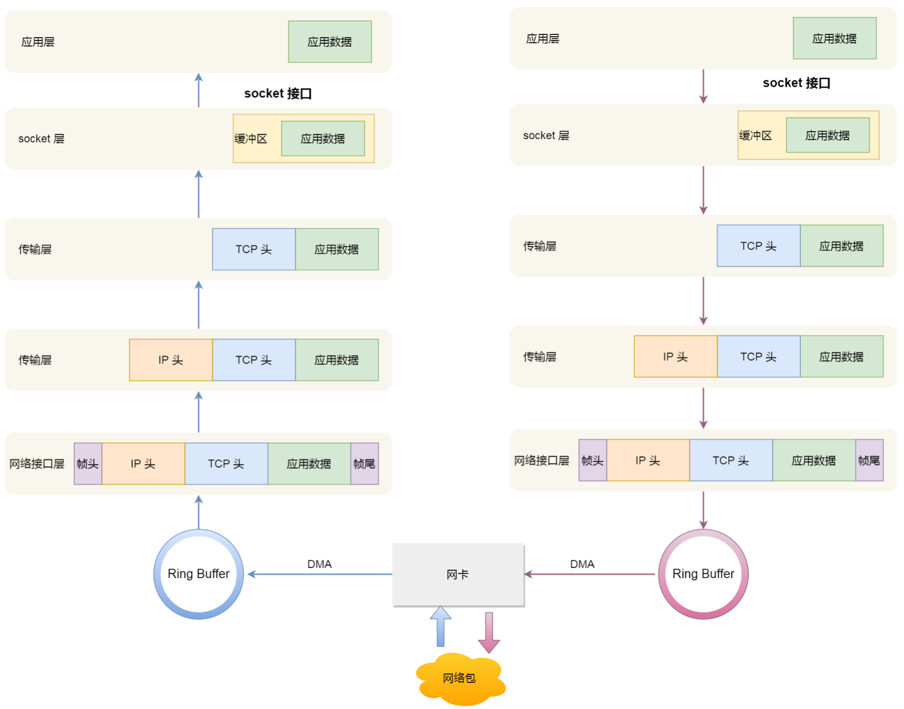

### 六.TCP可靠传输的实现

TCP为了提供可靠传输：

（1）首先，采用三次握手来建立TCP连接，四次握手来释放TCP连接，从而保证建立的传输信道是可靠的。

（2）其次，TCP采用了连续ARQ协议（回退N，åGo-back-N；超时自动重传）来保证数据传输的正确性，使用滑动窗口协议来保证接方能够及时处理所接收到的数据，进行流量控制。

（3）最后，TCP使用慢开始、拥塞避免、快重传和快恢复来进行拥塞控制，避免网络拥塞。

### 七.可靠传输的工作原理

理想的传输客户端调用 close ，表明客户端没有数据需要发送了，则此时会向服务端发送 FIN 报文，进入 FIN_WAIT_1 状态;

服务端接收到了 FIN 报文，TCP 协议栈会为 FIN 包插入一个文件结束符 EOF 到接收缓冲区中，应用程序 可以通过 read 调用来感知这个 FIN 包。这个 EOF 会被放在已排队等候的其他已接收的数据之后，这就 意味着服务端需要处理这种异常情况，因为 EOF 表示在该连接上再无额外数据到达。此时，服务端进入 CLOSE_WAIT 状态;

接着，当处理完数据后，自然就会读到 EOF ，于是也调用 close 关闭它的套接字，这会使得客户端会发 出一个 FIN 包，之后处于 LAST_ACK 状态;

客户端接收到服务端的 FIN 包，并发送 ACK 确认包给服务端，此时客户端将进入 TIME_WAIT 状态; 服务端收到 ACK 确认包后，就进入了最后的 CLOSE 状态;

客户端经过 2MSL 时间之后，也进入 CLOSE 状态;条件有以下两个特点：

- 杭州传输信道不产生差错。
- 不管发送方以多快的速度发送数据，接收方总是来得及处理收到的数据。

然而实际的网络都不具备以上两个理想条件**。必须使用一些可靠传输协议，在不可靠的传输信道实现可靠传输。**

那么在TCP中就有两种方式来实现可靠传输了

- **停止等待协议**
- **连续 ARQ 协议**

#### 1.停止等待协议

**“停止等待”就是每发送完一个分组就停止发送，等待对方的确认。在收到确认后再发送下一个分组。**

停止等待协议有两种情况：**① 无差错情况** 、**② 出现差错情况**

**① 无差错情况**

 **②出现差错情况**

在接收方 B 会出现两种情况：

- **B 接收 M1 时检测出了差错**，就丢弃 M1，其他什么也不做（不通知 A 收到有差错的分组）。
- **M1 在传输过程中丢失了**，这时 B 当然什么都不知道，也什么都不做。

在这两种情况下，**B 都不会发送任何信息。** 但**A都必须重发分组**，直到B正确接收为止，这样才能实现可靠通信。

**问题**：A如何知道 B 是否正确收到了 M1 呢？ **解决方法**：超时重传

- A 为每一个已发送的分组都设置了一个超时计时器。
- A 只要在超时计时器到期之前收到了相应的确认，就撤销该超时计时器，继续发送下一个分组 M2 。
- 若A在超时计时器规定时间内没有收到B的确认，就认为分组错误或丢失，就重发该分组。

**问题**：若分组正确到达B，但B回送的确认丢失或延迟了，A未收到B的确认，会超时重发。B 可能会收到重复的 M1 。B如何知道收到了重复的分组，需要丢弃呢？ **解决方法**：编号

- A为每一个发送的分组都进行编号。若B收到了编号相同的分组，则认为收到了重复分组，丢弃重复的分组，并回送确认。
- B为发送的确认也进行编号，指示该确认是对哪一个分组的确认。
- A根据确认及其编号，可以确定它是对哪一个分组的确认，避免重发发送。若为重复的确认，则将其丢弃。

注意：

- **在发送完一个分组后，必须暂时保留已发送的分组的副本，以备重发。**
- **分组和确认分组都必须进行编号。**
- 超时计时器的重传时间应当比数据在分组传输的平均往返时间更长一些。

通常 A 最终总是可以收到对所有发出的分组的确认。如果 A 不断重传分组但总是收不到确认，就说明通信线路太差，不能进行通信。

使用上述的确认和重传机制，我们就可以在不可靠的传输网络上实现可靠的通信。

像上述的这种可靠传输协议常称为自动重传请求 ARQ  (Automatic Repeat reQuest)。意思是重传的请求是自动进行的，接收方不需要请求发送方重传某个出错的分组。

**为了提高传输效率，发送方可以不使用低效率的停止等待协议，而是采用流水线传输。**

> 流水线传输就是发送方可连续发送多个分组，不必每发完一个分组就停顿下来等待对方的确认。这样可使信道上一直有数据不间断地传送。

#### 2.连续 ARQ 协议

- 发送方维持的发送窗口，它的意义是：**位于发送窗口内的分组都可连续发送出去，而不需要等待对方的确认。这样，信道利用率就提高了。**
- **连续 ARQ 协议规定，发送方每收到一个确认，就把发送窗口向前滑动一个分组的位置。**

即不必对收到的分组逐个发送确认，**而是对按序到达的最后一个分组发送确认，这样就表示：到这个分组为止的所有分组都已正确收到了。**

优点：**容易实现，即使确认丢失也不必重传。** 缺点：**不能向发送方反映出接收方已经正确收到的所有分组的信息。**

如果发送方发送了前 5 个分组，**而中间的第 3 个分组丢失了**。这时接收方只能对前两个分组发出确认**。发送方无法知道后面三个分组的下落，而只好把后面的三个分组都再重传一次。** 这就叫做 Go-back-N（回退 N），**表示需要再退回来重传已发送过的 N 个分组。**

---

### 八.TCP的流量控制

TCP利用滑动窗口实现流量控制。

+ 窗口是缓存的一部分，用来暂时存放字节流。发送方和接收方各有一个窗口，接收方通过 TCP 报文段中的窗口字段告诉发送方自己的窗口大小，发送方根据这个值和其它信息设置自己的窗口大小。

+ 发送窗口内的字节都允许被发送，接收窗口内的字节都允许被接收。如果发送窗口左部的字节已经发送并且收到了确认，那么就将发送窗口向右滑动一定距离，直到左部第一个字节不是已发送并且已确认的状态；接收窗口的滑动类似，接收窗口左部字节已经发送确认并交付主机，就向右滑动接收窗口。

+ 接收窗口只会对窗口内最后一个按序到达的字节进行确认，例如接收窗口已经收到的字节为 {31, 34, 35}，其中 {31} 按序到达，而 {34, 35} 就不是，因此只对字节 31 进行确认。发送方得到一个字节的确认之后，就知道这个字节之前的所有字节都已经被接收。

---

### 九.TCP的拥塞控制

如果网络出现拥塞，分组将会丢失，此时发送方会继续重传，从而导致网络拥塞程度更高。因此当出现拥塞时，应当控制发送方的速率。这一点和流量控制很像，但是出发点不同。流量控制是为了让接收方能来得及接收，而拥塞控制是为了降低整个网络的拥塞程度。

TCP 主要通过四个算法来进行拥塞控制： **慢开始、拥塞避免、快重传、快恢复。**

发送方需要维护一个叫做拥塞窗口（cwnd）的状态变量，注意拥塞窗口与发送方窗口的区别：拥塞窗口只是一个状态变量，实际决定发送方能发送多少数据的是发送方窗口。

为了便于讨论，做如下假设：

- 接收方有足够大的接收缓存，因此不会发生流量控制；
- 虽然 TCP 的窗口基于字节，但是这里设窗口的大小单位为报文段。

#### 1. 慢开始与拥塞避免

发送的最初执行慢开始，令 cwnd = 1，发送方只能发送 1 个报文段；当收到确认后，将 cwnd 加倍，因此之后发送方能够发送的报文段数量为：2、4、8 ...

注意到慢开始每个轮次都将 cwnd 加倍，这样会让 cwnd 增长速度非常快，从而使得发送方发送的速度增长速度过快，网络拥塞的可能性也就更高。设置一个慢开始门限 ssthresh，当 cwnd >= ssthresh 时，进入拥塞避免，每个轮次只将 cwnd 加 1。

如果出现了超时，则令 ssthresh = cwnd / 2，然后重新执行慢开始。

#### 2.快重传与快恢复

在接收方，要求每次接收到报文段都应该对最后一个已收到的有序报文段进行确认。例如已经接收到 M1 和 M2，此时收到 M4，应当发送对 M2 的确认。

在发送方，如果收到三个重复确认，那么可以知道下一个报文段丢失，此时执行快重传，立即重传下一个报文段。例如收到三个 M2，则 M3 丢失，立即重传 M3。

在这种情况下，只是丢失个别报文段，而不是网络拥塞。因此执行快恢复，令 ssthresh = cwnd / 2 ，cwnd = ssthresh，注意到此时直接进入拥塞避免。

慢开始和快恢复的快慢指的是 cwnd 的设定值，而不是 cwnd 的增长速率。慢开始 cwnd 设定为 1，而快恢复 cwnd 设定为 ssthresh。

---

### 十.键入网址到网⻚显示，期间发生了什么?

**1、查询DNS，获取域名对应的IP。**

+ 检查本地hosts文件是否有这个网址的映射，如果有，就调用这个IP地址映射，解析完成。

+ 如果没有，则查找本地DNS解析器缓存是否有这个网址的映射，如果有，返回映射，解析完成。

+ 如果没有，则查找填写或分配的首选DNS服务器，称为本地DNS服务器。服务器接收到查询时：
  + 如果要查询的域名包含在本地配置区域资源中，返回解析结果，查询结束，此解析具有权威性。
  + 如果要查询的域名不由本地DNS服务器区域解析，但服务器缓存了此网址的映射关系，返回解析结果，查询结束，此解析不具有权威性。

+ 如果本地DNS服务器也失效：
  + 如果未采用转发模式（迭代），本地DNS就把请求发至13台根DNS，根DNS服务器收到请求后，会判断这个域名（如.com）是谁来授权管理，并返回一个负责该顶级域名服务器的IP，本地DNS服务器收到顶级域名服务器IP信息后，继续向该顶级域名服务器IP发送请求，该服务器如果无法解析，则会找到负责这个域名的下一级DNS服务器（如[http://baidu.com](https://link.zhihu.com/?target=http%3A//baidu.com)）的IP给本地DNS服务器，循环往复直至查询到映射，将解析结果返回本地DNS服务器，再由本地DNS服务器返回解析结果，查询完成。
  + 如果采用转发模式（递归），则此DNS服务器就会把请求转发至上一级DNS服务器，如果上一级DNS服务器不能解析，则继续向上请求。最终将解析结果依次返回本地DNS服务器，本地DNS服务器再返回给客户机，查询完成。

**2、客户端与服务器建立TCP连接（三次握手）**

**3、客户机发送HTTP请求报文：**

（1）应用层：客户端发送HTTP请求报文

（2）传输层：切分长数据，并确保可靠性。

（3）网络层：进行路由

（4）数据链路层：传输数据

（5）物理层：物理传输bit

**4、**服务器端经过物理层→数据链路层→网络层→传输层→应用层，解析请求报文，发送HTTP响应报文。

 **5、**客户端解析HTTP响应报文

**6、**浏览器开始显示HTML

**7、**浏览器重新发送请求获取图片、CSS、JS的数据。

**8、**如果有AJAX，浏览器发送AJAX请求，及时更新页面。

### 十一.Linux系统是如何收发网络包的

网卡是计算机里的一个硬件，专⻔负责接收和发送网络包，当网卡接收到一个网络包后，会通过 DMA 技术，将网络包放入到 Ring Buffer，这个是一个环形缓冲区。 那接收到网络包后，应该怎么告诉操作系统这个网络包已经到达了呢? 最简单的一种方式就是触发中断，也就是每当网卡收到一个网络包，就触发一个中断告诉操作系统。

但是，这存在一个问题，在高性能网络场景下，网络包的数目会非常多，那么就会触发非常多的中断，要知道当 CPU 收到了中断，就会停下手里的事情，而去处理这些网络包，处理完毕后，才会回去继续其他事情，那么频繁地触发中断，则会导致 CPU 一直没玩没了的处理中断，而导致其他任务可能无法继续前进，从而影响系统的整体 效率。

所以为了解决频繁中断带来的性能开销，Linux 内核在 2.6 版本中引入了 **NAPI** 机制，它是混合「中断和轮询」的方式来接收网络包，它的核心概念就是不采用中断的方式读取数据，而是首先采用中断唤醒数据接收的服务程序， 然后 poll 的方法来轮询数据。

  

比如，当有网络包到达时，网卡发起硬件中断，于是会执行网卡硬件中断处理函数，中断处理函数处理完需要「暂 时屏蔽中断」，然后唤醒「软中断」来轮询处理数据，直到没有新数据时才恢复中断，这样一次中断处理多个网络包，于是就可以降低网卡中断带来的性能开销。

那软中断是怎么处理网络包的呢?它会从 Ring Buffer 中拷⻉数据到内核 struct sk_buff 缓冲区中，从而可以作为一 个网络包交给网络协议栈进行逐层处理。

+ 首先，会先进入到网络接口层，在这一层会检查报文的合法性，如果不合法则丢弃，合法则会找出该网络包的上层 协议的类型，比如是 IPv4，还是 IPv6，接着再去掉帧头和帧尾，然后交给网络层。
+ 到了网络层，则取出 IP 包，判断网络包下一步的走向，比如是交给上层处理还是转发出去。当确认这个网络包要发送给本机后，就会从 IP 头里看看上一层协议的类型是 TCP 还是 UDP，接着去掉 IP 头，然后交给传输层。
+ 传输层取出 TCP 头或 UDP 头，根据四元组「源 IP、源端口、目的 IP、目的端口」 作为标识，找出对应的 Socket，并把数据拷⻉到 Socket 的接收缓冲区。
+ 最后，应用层程序调用 Socket 接口，从内核的 Socket 接收缓冲区读取新到来的数据到应用层。 至此，一个网络包的接收过程就已经结束了，你也可以从下图左边部分看到网络包接收的流程，右边部分刚好反过来，它是网络包发送的流程。

+ 首先，应用程序会调用 Socket 发送数据包的接口，由于这个是系统调用，所以会从用户态陷入到内核态中的 Socket 层，Socket 层会将应用层数据拷⻉到 Socket 发送缓冲区中。	 		
+ 接下来，网络协议栈从 Socket 发送缓冲区中取出数据包，并按照 TCP/IP 协议栈从上到下逐层处理。 如果使用的是 TCP 传输协议发送数据，那么会在传输层增加 TCP 包头，然后交给网络层，网络层会给数据包增加
+ IP 包，然后通过查询路由表确认下一跳的 IP，并按照 MTU 大小进行分片。 分片后的网络包，就会被送到网络接口层，在这里会通过 ARP 协议获得下一跳的 MAC 地址，然后增加帧头和帧尾，放到发包队列中。
+ 这一些准备好后，会触发软中断告诉网卡驱动程序，这里有新的网络包需要发送，最后驱动程序通过 DMA，从发 包队列中读取网络包，将其放入到硬件网卡的队列中，随后物理网卡再将它发送出去。

