### 一.网络层的基本概念

#### 1.工作内容

**网络层** 是OSI模型中的第三层（TCP/IP模型中的网际层），提供 **路由** 和 **寻址** 的功能，使两终端系统能够互连且决定最佳路径，**实现主机与主机之间的通信，也叫点对点(end to end)通信**；并具有一定的拥塞控制和流量控制的能力。

因为网络层是整个互联网的核心，因此应当让网络层尽可能简单。使得网络层向上只提供简单灵活的、无连接的、尽最大努力交互的数据报服务。

---

### 二.IP地址编址方式

#### 1.IP地址及其表示方法

IP地址(IPv4 地址)：由 32 位正整数来表示，IP 地址在计算机是以二进制的方式处理的。

> 为了方便记忆采用了点分十进制的标记方式，将32位IP地址以每8位为组，分为4组，以「 . 」隔开，再将每组转换成十进制。

IP 地址最大值也就是 ： $2^{32} = 4294967296$ , 最大允许 43 亿台计算机连接到网络。

实际上，IP地址并不是根据主机台数来配置的，而是以网卡。像服务器、路由器等设备都是有2个以上的网卡，即会有 2 个以上的 IP 地址。

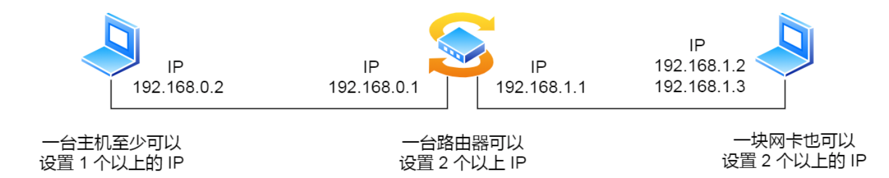

IP 地址的编址方式经历了三个历史阶段：

- 分类
- 子网划分
- 无分类

IP地址由两部分组成，网络号和主机号，其中不同分类具有不同的网络号长度，并且是固定的。

IP 地址 ::= {< 网络号 >, < 主机号 >}

>  **Question： 为什么要分离网络号和主机号?**
>
> 因为两台计算机要通讯，首先要判断是否处于同一个广播域内，即网络地址是否相同。如果相同，表明接受方在本网络上，那么把数据包直接发送到目标主机。

#### 2.IP地址分类

下图给出了各种IP地址的网络号字段和主机号字段，这里A类，B类，C类地址都是单播地址，是最常用的。

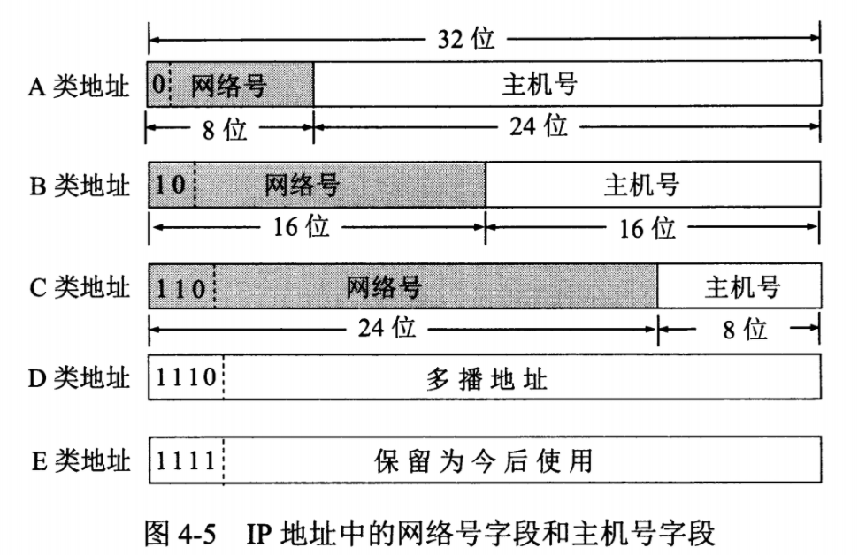

三种常用类别IP地址的注意事项：

> **A 类地址**
>
> + 网络号字段占一个字节，只有7位可供使用，但可指派的网络号是126个(2^7 - 2)，减2的原因：
>   + IP地址网络地址号全0表示this，是一个保留地址，表示“本网络”
>   + 网络地址号为127留作本地软件 **环回测试** 本主机的进程之间的通信之用
> + 主机号占3个字节，最大主机数是2^24 - 2，减2的原因：
>   + 全0的主机号字段表示该IP地址是“本主机”所连接到的单个网络地址。
>   + 全1表示all，表示该网络上的所有主机。
>
> **B 类地址**
>
> + 网络地址号占两个字节，前面10已经固定，剩余14位可以进行分配。因为不会出现两个字节全0或全1的情况，所以不存在减2的问题。但是128.0.0.0还是不指派，能指派的最小网络地址是128.1.0.0。因此B类地址可指派的网络数为2^14 - 1。
> + B类地址的每一个网络上的最大主机数是2^16 - 2，减2是因为要扣除全0全1的主机号。
>
> **C类地址**
>
> + 网络号与B类地址一样，192.0.0.0 不指派，最小的网络号为192.0.1.0
> + C类地址的每一个网络上的最大主机数是2^8 - 2，减2是因为要扣除全0全1的主机号。
>
> **D类地址**
>
> + D类常被用于**多播**，多播用于**将包发送给特定组内的所有主机**。
> + 由于广播无法穿透路由，若想给其他网段发送同样的包，就可以使用可以穿透路由的多播。

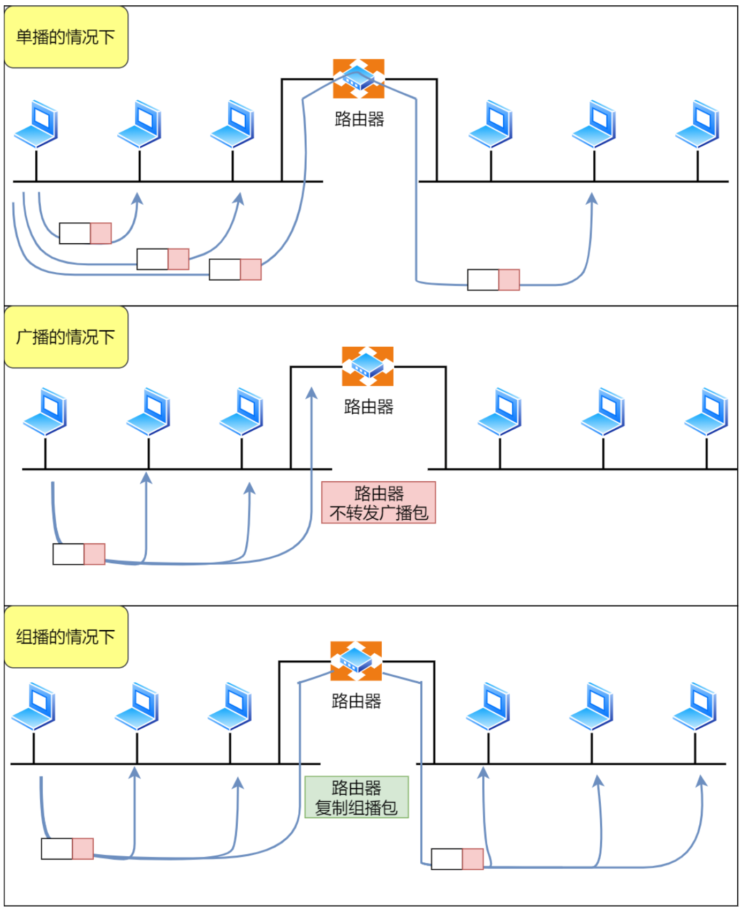

多播使用的 D 类地址，其前四位是 1110 就表示是多播地址，而剩下的 28 位是多播的组编号。 

从 224.0.0.0 ~ 239.255.255.255 都是多播的可用范围，其划分为以下三类:

+ 224.0.0.0 ~ 224.0.0.255 为预留的组播地址，只能在局域网中，路由器是不会进行转发的。
+ 224.0.1.0 ~ 238.255.255.255 为用户可用的组播地址，可以用于 Internet 上。
+ 239.0.0.0 ~ 239.255.255.255 为本地管理组播地址，可供内部网在内部使用，仅在特定的本地范围内有效。

#### 3.IP地址与硬件地址(网络层与数据链路层的区别与关系)

从层次的角度上看：

+ 硬件地址是数据链路层和物理层使用的地址
+ IP地址是网络层和以上各层使用的地址，是一种逻辑地址

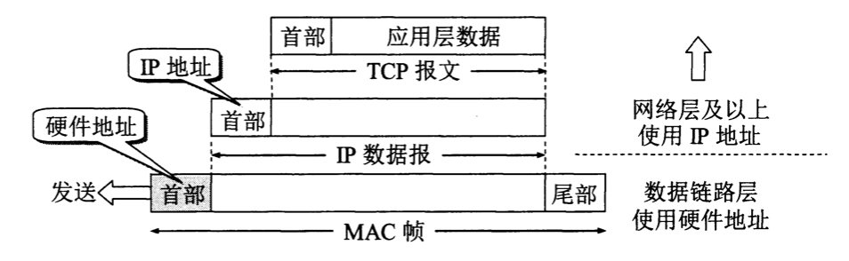

在发送数据时，数据从高层下到底层，然后才到通信链路上传输。使用IP地址的IP数据报一旦交给了数据链路层，就被封装成了MAC帧。MAC帧在传送时使用的源地址和目的地址都是硬件地址，这两个硬件地址都写在了MAC帧的首部。

+ IP地址在IP数据报的首部
+ 硬件地址在MAC帧的首部

IP地址放入数据链路层的MAC帧中以后，整个IP数据报就称为了MAC帧的数据，因而在数据链路层看不到数据报的IP地址。

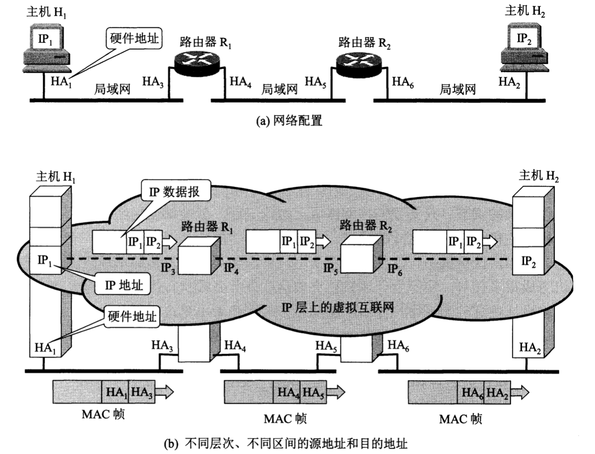

从上图可以看出，**IP** 的作用是主机之间通信用的，而 **MAC** 的作用则是实现「直连」的两个设备之间通信，而 **IP** 则负责在「没有直连」的两个网络之间进行通信传输。

以生活中的例子进行讲解：

去一个很远的地方旅行，制定了一个行程表，其间需先后乘坐⻜机、地铁、公交⻋才能抵达目的地，为此需要买⻜机票，地铁票等。

+ ⻜机票和地铁票都是去往特定的地点的，每张票只能够在某一限定区间内移动，此处的「区间内」就如同通信网络中数据链路。区间内的出发点好比源 MAC 地址，目标地点好比目的 MAC 地址。
+ 整个旅游行程表就相当于网络层，充当远程定位的功能，行程的开始好比源 IP，行程的终点好比目的 IP 地址。

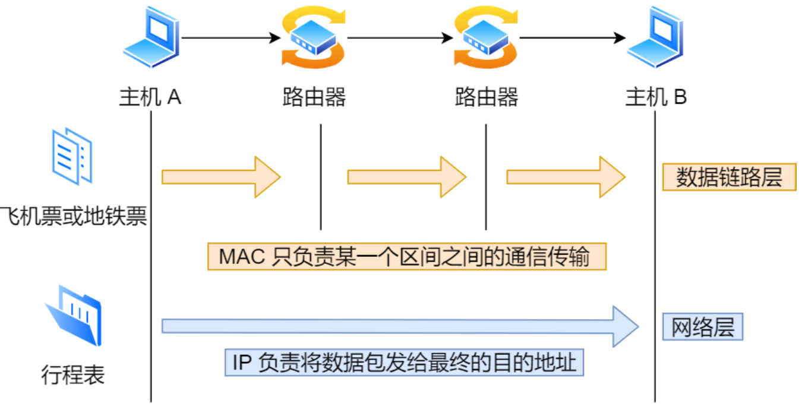

如果只有行程表而没有⻋票，就无法搭乘交通工具到达目的地。相反，如果除了⻋票而没有行程表，也很难到达目的地。因为不知道该坐什么⻋，也不知道该在哪里换乘。

因此，只有两者兼备，既有某个区间的⻋票又有整个旅行的行程表，才能保证到达目的地。**与此类似，计算机网络 中也需要「数据链路层」和「网络层」这个分层才能实现向最终目标地址的通信。**

#### 4.IP地址分类的优缺点

:large_blue_diamond: **优点**

+ 不管是路由器还是主机解析到一个 IP 地址时候，能清晰明了的找出网络地址和主机地址。

:large_orange_diamond: **缺点**

+ **同一网络下没有地址层次**，比如一个公司里用了 B 类地址，但是可能需要根据生产环境、测试环境、开发环境来划分地址层次，而这种 IP 分类是没有地址层次划分的功能，**所以这就缺少地址的灵活性。**
+ A、B、C类有个尴尬处境，就是不能很好的与现实网络匹配。
  + C 类地址能包含的最大主机数实在太少了，只有 254 个，估计一个网吧都不够用。
  + 而 B 类地址能包含的最大主机数又太多了，6 万多台机器放在一个网络下面，一般的企业基本达不到这个规模，闲着的地址就是浪费。

这两个缺点，都可以在 **CIDR** 无分类地址解决。

---

### 三.IP地址子网划分

#### 1.划分子网

##### (1).划分子网的基本思路

划分子网纯属一个单位内部的事情。单位对外仍然表现为没有划分子网的网络。从主机号借用若干个位作为子网号 subnet-id，而主机号 host-id 也就相应减少了若干个位。

+ 例子

  + 下图是一个B类IP地址，网络地址是145.13.0.0(网络号为145.13)。凡目的地址为145.13.x.x的数据报都是被送到这个网络上的路由器R1。

    
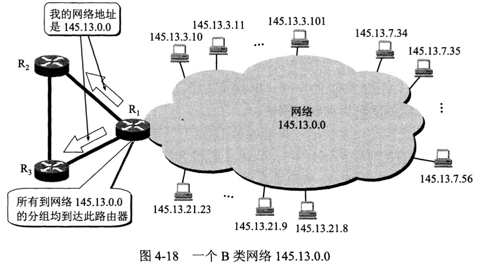

  + 下图把网络划分为三个子网。假定子网号占8位，因此在增加了子网号之后，主机号就只有8位。所以划分的三个子网分别是：145.13.3.0，145.13.7.0，和145.13.21.0。划分为三个子网后对外仍是一个网络，其网络地址仍是145.13.0.0。但网络145.13.0.0上的路由器R1在收到外来的数据报后，再根据数据报的目的地址把它转发到相应的子网。

    
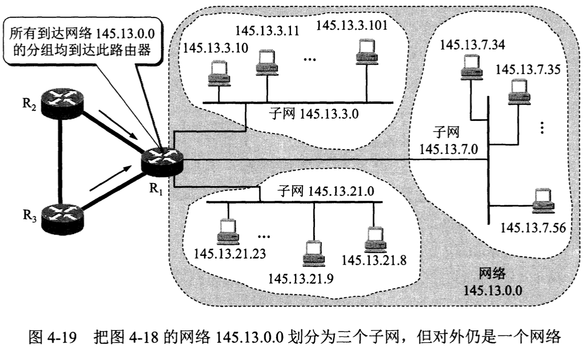

当没有划分子网时，IP 地址是两级结构。划分子网后 IP 地址就变成了**三级结构**。划分子网只是把 IP 地址的主机号 host-id 这部分进行再划分，而**不改变 IP 地址原来的网络号 net-id。** 

**优点:**

1. 减少了 IP 地址的浪费
2. 使网络的组织更加灵活
3. 更便于维护和管理

##### (2).子网掩码

从一个 IP 数据报的首部并无法判断源主机或目的主机所连接的网络是否进行了子网划分。使用子网掩码 (subnet mask) 可以找出 IP 地址中的子网部分。 

规则：

+ 子网掩码长度 ＝ 32 位
+ 某位 ＝ 1：IP地址中的对应位为网络号和子网号
+ 某位 ＝ 0：IP地址中的对应位为主机号 

IP地址的各字段和子网掩码如下图所示：

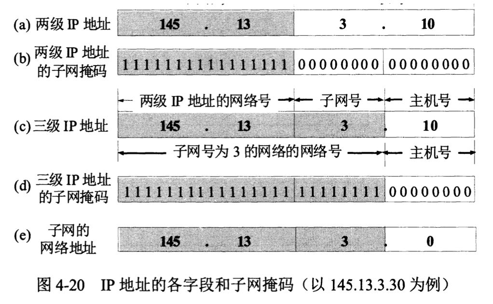

三类IP地址的网络地址和相应的默认子网掩码如下图所示：

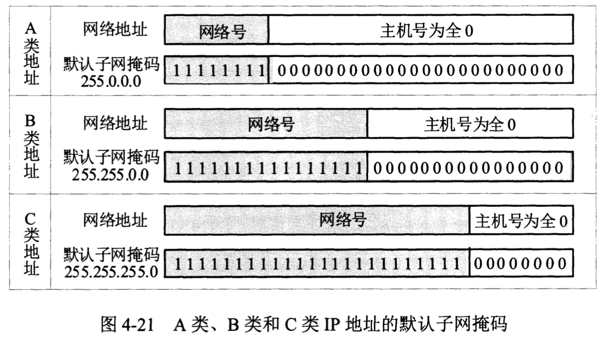

**子网掩码是一个网络或一个子网的重要属性。** 路由器在和相邻路由器交换路由信息时，必须把自己所在网络（或子网）的子网掩码告诉相邻路由器。

+ 利用子网掩码求网络地址的例子：

  已知IP 地址是 141.14.72.24，子网掩码是255.255.192.0。试求网络地址。

  
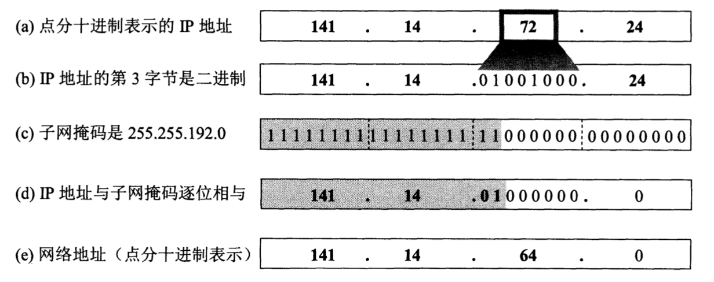

#### 2.使用子网时分组的转发

在划分子网情况下路由器转发分组的算法： 

1. 从收到的分组的首部提取目的 IP 地址 D。
2. 先用各网络的子网掩码和 D 逐位相“与”，看是否和相应的网络地址匹配。若匹配，则将分组直接交付。否则就是间接交付，执行步骤3.
3. 若路由表中有目的地址为 D 的特定主机路由，则将分组传送给指明的下一跳路由器；否则，执行步骤4.
4. 对路由表中的每一行，将子网掩码和 D 逐位相“与”。若结果与该行的目的网络地址匹配，则将分组传送给该行指明的下一跳路由器；否则，执行步骤5.
5. 若路由表中有一个默认路由，则将分组传送给路由表中所指明的默认路由器；否则，执行步骤6.
6. 报告转发分组出错。

#### 3.无分类编址(构建超网)

无分类编址 CIDR 消除了传统 A 类、B 类和 C 类地址以及划分子网的概念，使用网络前缀和主机号来对 IP 地址进行编码，网络前缀的长度可以根据需要变化。

IP 地址 ::= {< 网络前缀号 >, < 主机号 >}

CIDR 的记法上采用在 IP 地址后面加上网络前缀长度的方法，例如 128.14.35.7/20 表示 **前 20 位为网络前缀。**

CIDR 的地址掩码可以继续称为子网掩码，子网掩码首 1 长度为网络前缀的长度。

一个 CIDR 地址块中有很多地址，一个 CIDR 表示的网络就可以表示原来的很多个网络，并且在路由表中只需要一个路由就可以代替原来的多个路由，减少了路由表项的数量。把这种通过使用网络前缀来减少路由表项的方式称为路由聚合，也称为 **构成超网** 。

在路由表中的项目由“网络前缀”和“下一跳地址”组成，在查找时可能会得到不止一个匹配结果，应当采用最长前缀匹配来确定应该匹配哪一个。

### 四.IP 协议与数据报格式

#### 1.IP协议简介

IP协议属于网络层协议，所有的TCP, UDP, ICMP, IGMP数据都通过IP数据报传输。IP提供了一种不可靠，无连接的数据包交付服务。依赖其他层的协议进行差错控制。

+  **不可靠:** IP数据报不保证能成功的到达目的地，如果出现错误则选择丢弃该数据，然后发送ICMP消息报给信源端 
+ **无连接:** IP不提供任何后续数据报的状态信息，每个数据报处理都是独立的。如果一个信源发送了连续的两个数据报，每个数据报选择独立的路由，两个数据可能不同时到达。IP通信双方都不长久地维持对方的任何信息。这样上层协议每次发送数据的时候，都必须明确指定对方的IP地址。

与 IP 协议配套使用的还有三个协议：

- 地址解析协议 ARP（Address Resolution Protocol）
- 网际控制报文协议 ICMP（Internet Control Message Protocol）
- 网际组管理协议 IGMP（Internet Group Management Protocol）

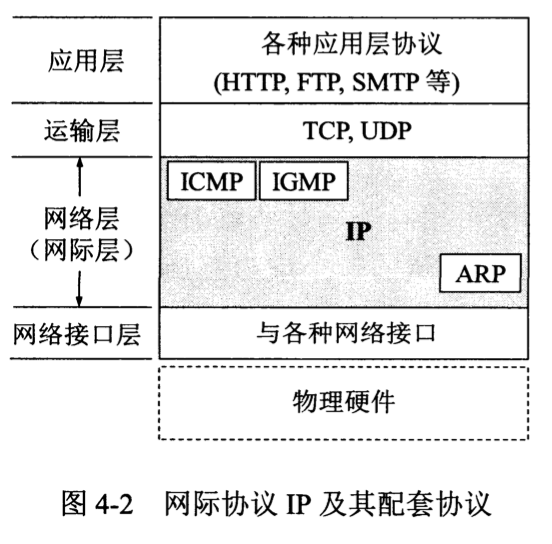

> ARP 画在最下面，因为IP经常使用这个协议。
>
> ICMP与IGMP画在这一层的上部，因为它们要使用IP协议。

#### 2.IP数据报的格式

在TCP/IP的标准中，各种数据格式常常以32位(4字节)为单位来进行描述。下图为IP数据报的完整格式。

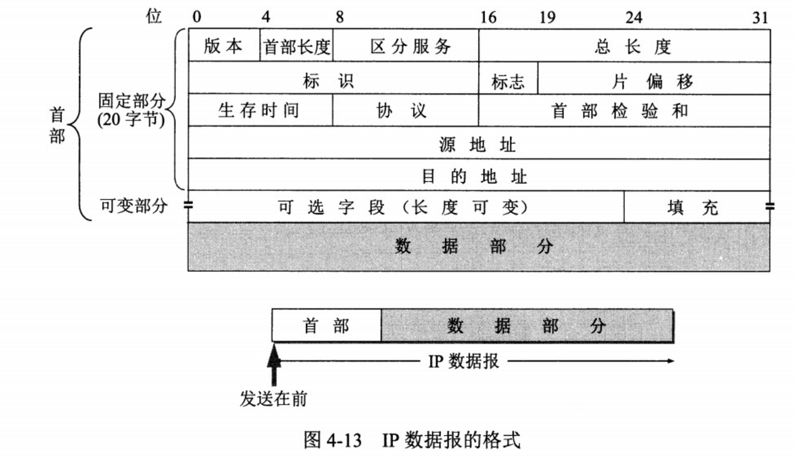

- **版本** : 有 4（IPv4）和 6（IPv6）两个值；

- **首部长度** : 占 4 位，因此最大值为 15。值为 1 表示的是 1 个 32 位字的长度，也就是 4 字节。因为固定部分长度为 20 字节，因此该值最小为 5。如果可选字段的长度不是 4 字节的整数倍，就用尾部的填充部分来填充。

- **区分服务** : 用来获得更好的服务，一般情况下不使用。

- **总长度** : 包括首部长度和数据部分长度。

- **生存时间** ：TTL，它的存在是为了防止无法交付的数据报在互联网中不断兜圈子。以路由器跳数为单位，当 TTL 为 0 时就丢弃数据报。

- **协议** ：指出携带的数据应该上交给哪个协议进行处理，例如 ICMP、TCP、UDP 等。

- **首部检验和** ：因为数据报每经过一个路由器，都要重新计算检验和，因此检验和不包含数据部分可以减少计算的工作量。

- **标识** : 在数据报长度过长从而发生分片的情况下，相同数据报的不同分片具有相同的标识符。

- **片偏移** : 和标识符一起，用于发生分片的情况。片偏移的单位为 8 字节。

  
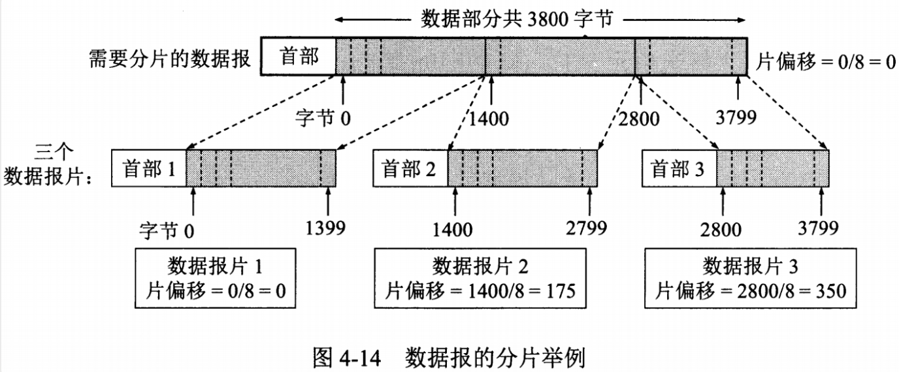

- 生存时间（TTL，time to live）：占用8位二进制位，它指定了数据报可以在网络中传输的最长时间。

- 协议：占用8位，协议字段指出此数据报携带的数据是使用何种协议，以便使用目的主机的IP层知道应该将数据部分上交给那个协议进行处理。

  + 一些协议和相应的协议字段值如下：

    
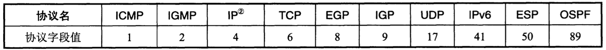

- 首部检验和：占用16位，用于 **数据报首部** 数据有效性的校验，可以保证IP报头区在传输时的正确性和完整性。头部检验和字段是根据IP协议头计算出的检验和，它不对头部后面的数据进行计算。

- 源地址：占用32位二进制数，表示发送端IP地址。

- 目的地址：占用32位二进制数，表述目的端IP地址。

#### 3.IP层转发分组的流程

在路由表中，对每一条路由最主要的是以下两个信息：

(目的网络地址，下一条地址)

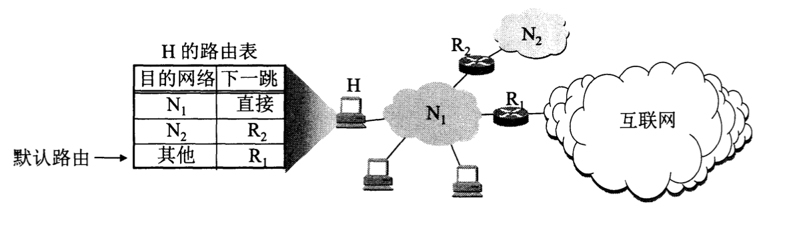

**路由分组转发算法：**

1. 从数据报的首部提取目的主机的IP地址D，得出目的网络地址为N。
2. 若N就是与此路由器直接相连的某个网络地址，则直接交付；否则执行步骤3。
3. 若路由表中有目的地址为D的特定主机路由，则把数据报传送给路由表中所指明的下一路由器；否则执行步骤4.
4. 若路由表中有到达网络N的路由，则把数据报传送给路由表中所指明的下一跳路由器；否则，执行步骤5.
5. 若路由器中有一个默认路由，则把数据报传送给路由表中所指明的默认路由器；否则执行步骤6.
6. 报告转发分组出错

### 五.地址解析协议ARP

网络层实现主机之间的通信，而链路层实现具体每段链路之间的通信。因此在通信过程中，IP 数据报的源地址和目的地址始终不变，而 MAC 地址随着链路的改变而改变。

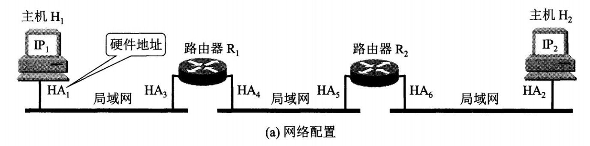

ARP 实现由 IP 地址得到 MAC 地址。

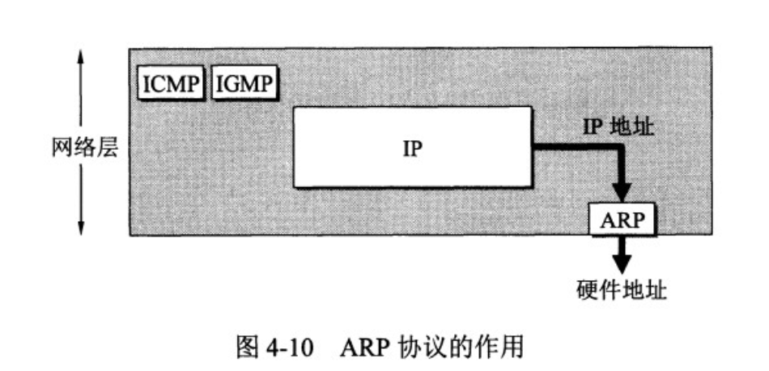

每个主机都有一个 ARP 高速缓存，里面有本局域网上的各主机和路由器的 IP 地址到 MAC 地址的映射表。

如果主机 A 知道主机 B 的 IP 地址，但是 ARP 高速缓存中没有该 IP 地址到 MAC 地址的映射，此时主机 A 通过广播的方式发送 ARP 请求分组，主机 B 收到该请求后会发送 ARP 响应分组给主机 A 告知其 MAC 地址，随后主机 A 向其高速缓存中写入主机 B 的 IP 地址到 MAC 地址的映射。

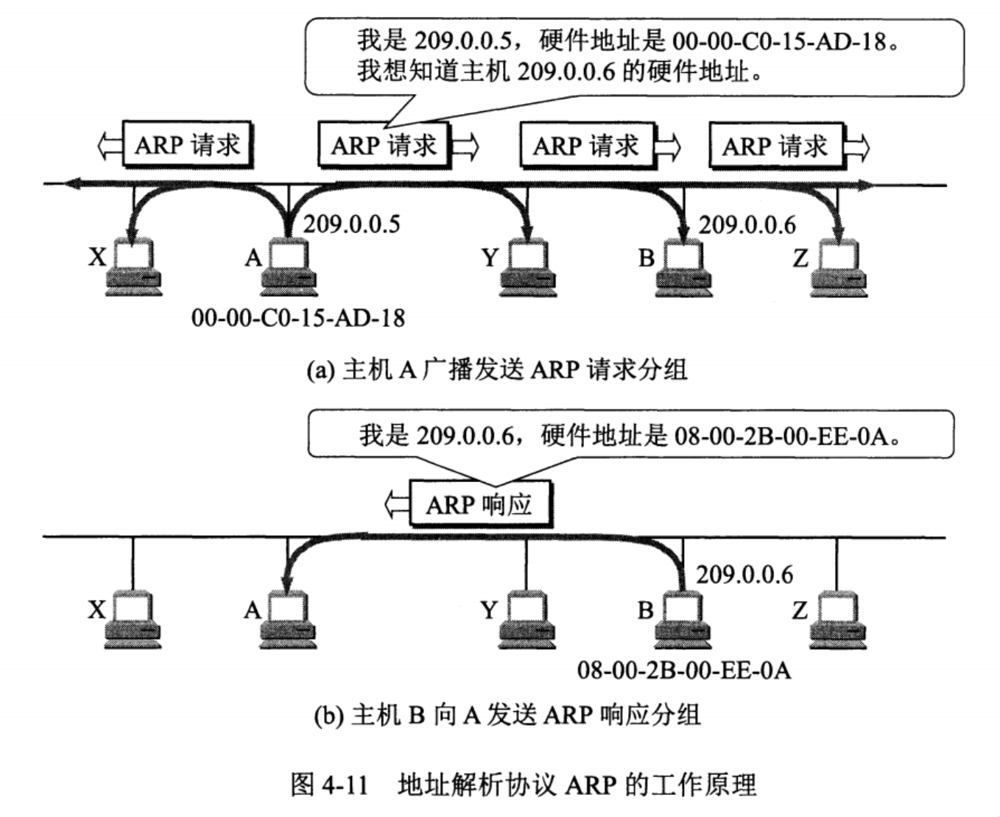

> MAC 地址的缓存是有一定期限的，超过这个期限，缓存的内容将被清除。

### 六.网际控制报文协议 ICMP

#### 1.ICMP的基本概念

为了更有效地转发 IP 数据报和提高交付成功的机会，在网络层使用了网际控制报文协议ICMP(Internet Control Message Protocol)。ICMP报文作为IP层数据报的数据，加上数据报的首部，组成 IP 数据报发送出去。

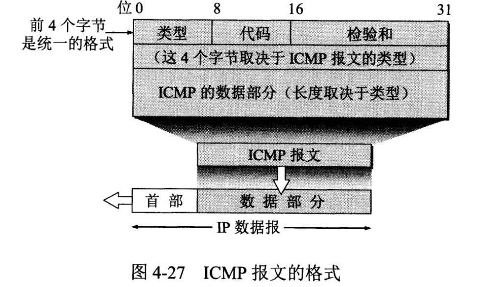 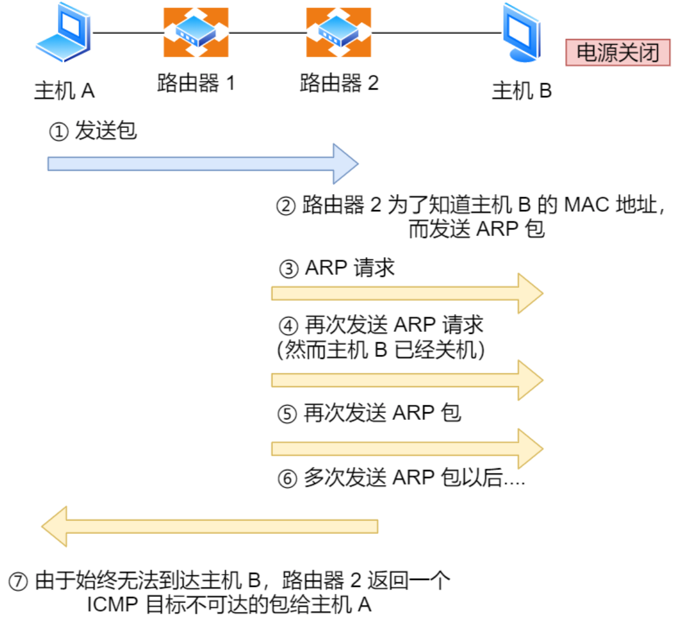

ICMP 主要的功能: **确认 IP 包是否成功送达目标地址、报告发送过程中 IP 包被废弃的原因和改善网络设置等。**在 IP 通信中如果某个 IP 包因为某种原因未能达到目标地址，那么这个具体的原因将**由 ICMP 负责通知。**

如上图例子，主机 A 向主机 B 发送了数据包，由于某种原因，途中的路由器 2 未能发现主机 B 的存在， 这时，路由器 2 就会向主机 A 发送一个 ICMP 目标不可达数据包，说明发往主机 B 的包未能成功。

ICMP 的这种通知消息会使用 IP 进行发送 。

因此，从路由器 2 返回的 ICMP 包会按照往常的路由控制先经过路由器 1 再转发给主机 A 。收到该 ICMP包的主机 A 则分解 ICMP 的首部和数据域以后得知具体发生问题的原因。

ICMP 报文分为差错报告报文和询问报文。

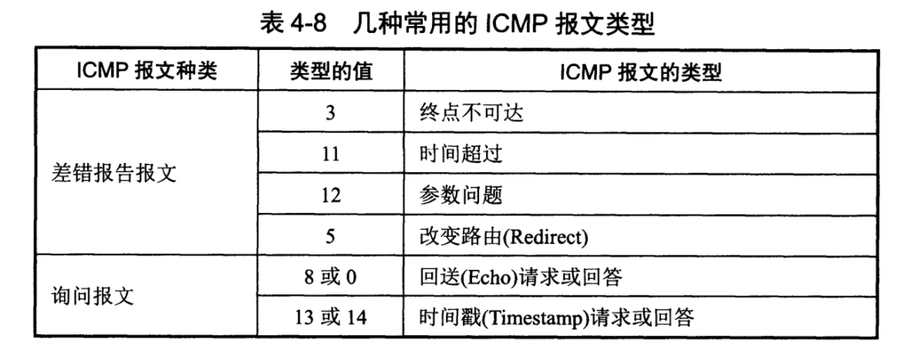

#### 2.ICMP 的应用

##### (1). Ping

Ping 是 ICMP 的一个重要应用，主要用来测试两台主机之间的连通性。

##### 2. Traceroute

Traceroute 是 ICMP 的另一个应用，用来跟踪一个分组从源点到终点的路径。

> 两个应用的具体实现间后面应用

### 七. IPv6

#### 1.IPv6特征

IPv6 仍支持无连接的传送，但将协议数据单元 PDU 称为分组。为方便起见，本书仍采用数据报这一名词。
所引进的主要变化如下：

+ 更大的地址空间。IPv6 将地址从 IPv4 的 32 位 增大到了 128 位。 
+ IPv6 包头包首部⻓度采用固定的值 40 字节，去掉了包头校验和，简化了首部结构，减轻了路由器负荷，大 大**提高了传输的性能。**
+ IPv6 有应对伪造 IP 地址的网络安全功能以及防止线路窃听的功能，大大**提升了安全性。**
+ 支持即插即用（即自动配置）。因此 IPv6 不需要使用 DHCP。

#### 2.IPv6数据报格式

IPv6 数据报由两大部分组成：

- 基本首部 (base header)
- 有效载荷 (payload)。有效载荷也称为净负荷。有效载荷允许有零个或多个扩展首部 (extension header)，再后面是数据部分。

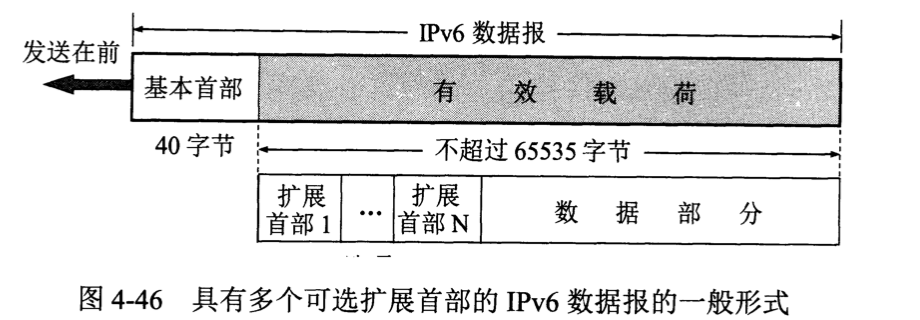

与IPv4相比，IPv6对首部中的某些字段进行了如下的更改：

+ 取消了首部长度字段，因为它的首部长度是固定的。
+ 取消了服务类型字段，因为优先级和流标号字段实现了服务类型字段的功能。
+ 取消了总长度字段，改为有效载荷长度字段。
+ 取消了标识，标志，片偏移字段，因为这些功能已经包含在分片扩展首部中。
+ 把TTL字段改为跳数限制字段，但作用是一样的。
+ 取消了协议字段，改用下一个首部字段。
+ 取消了检验和字段，这样就加快了路由器处理数据的速度。
+ 取消了选项字段，而用扩展首部来实现选项功能。

IPv6基本首部中各字段的作用：

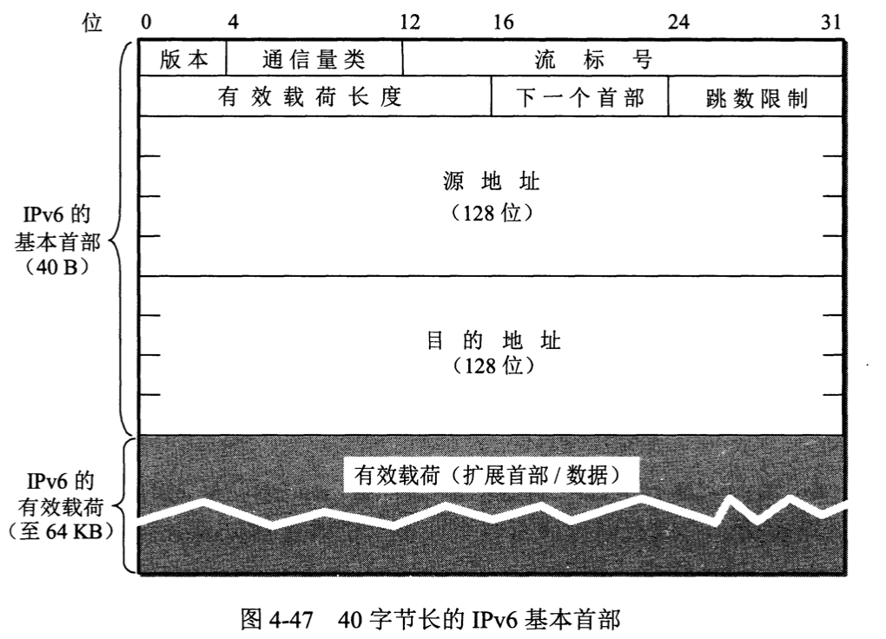

+ **版本（Version）**
  + 版本字段用来表示IP数据报使用的是IPv6协议封装，占4位，对应值为6（0110）。

+ **通信分类（Traffic Class）**
  + 通信分类字段用来标识对应IPv6的通信流类别，或者说是优先级别，占8位。

+ **流标签（Flow Label）**
  + 流标签字段时IPv6数据报中新增的一个字段，占20位，可用来标记报文的数据流类型，以便在网络层区分不同的报文。流标签字段有源节点分配，通过流标签、源地址、目的地址三元组方式就可以唯一标识一条通信流，而不用像IPv4那样需要使用五元组方式（源地址、目的地址、源端口、目的端口和传输层协议号）。这样发动的最大好处有两点：一是流标签可以和任意的关联，需要标识不同类型的流（可以是非五元组）时，无需对流标签做改动；二是流标签在IPv6基本头中，使用IPSec时此域对转发路由器可见，因此转发路由器可以在使用IPv6报文IPSec的情况下仍然可以通过三元组（流标签、源地址、目的地址）针对特定的流进行QoS（质量服务）处理。

+ **有效载荷长度（PayLoad Length）**
  + 有效载荷长度字段是以字节为单位的标识IPv6数据报中有效载荷部分（包括所有扩展报头部分）的总长度，也就是除了IPv6的基本报头以外的其他部分的总长度，占20位。

+ **下一个头部（Next Header）**
  + 下一个头部字段用来标识当前报头（或者扩展报头）的下一个头部类型，占8位。每种扩展报头都有其对应的值。下一个头部字段内定义的扩展报头类型与IPv4中的协议字段值类似，但在IPv6数据报中，紧接着IPv6报头的可能不是上层协议头部（当没有扩展报头或者为最后一个扩展报头时才是上层协议头），而是IPv6扩展报头。这一机制下处理扩展报头更搞笑，因为标识了数据报中对应的上层协议或者扩展报头类型，转发路由器只需处理必须处理的扩展报头，提高了转发效率。

+ **跳数限制（Hop Limit）**
  + 跳数限制于IPv4报文中的TTL字段类似，指定了报文可以有效转发的次数，占8位。报文每经过一个路由器结点，跳数值就减1，当此字段值减到0时，则直接丢弃该报文。

+ **源地址（Source IP Address）**
  + 源IP地址字段标识了发送该IPv6报文源节点的IPv6地址，占128位。

+ **目的IP地址（Destination IP Address）**
  + 目的IP地址字段标识了IPv6报文的接受节点的IPv6地址，占128位。

#### 3.IPv4 转 IPv6

向 IPv6 过渡只能采用逐步演进的办法，同时，还必须使新安装的 IPv6 系统能够向后兼容：IPv6 系统必须能够接收和转发 IPv4 分组，并且能够为 IPv4 分组选择路由。

两种向 IPv6 过渡的策略：

- 使用双协议栈
- 使用隧道技术

##### 双协议栈

双协议栈 (dual stack) 是指在完全过渡到 IPv6 之前，使一部分主机（或路由器）装有两个协议栈，一个 IPv4 和一个 IPv6。 双协议栈的主机（或路由器）记为 IPv6/IPv4，表明它同时具有两种 IP 地址：一个 IPv6 地址和一个 IPv4 地址 双协议栈主机在和 IPv6 主机通信时是采用 IPv6 地址，而和 IPv4 主机通信时就采用 IPv4 地址 根据 DNS 返回的地址类型可以确定使用 IPv4 地址还是 IPv6 地址

##### 隧道技术

在 IPv6 数据报要进入 IPv4 网络时，把 IPv6 数据报封装成为 IPv4 数据报，整个的 IPv6 数据报变成了 IPv4 数据报的数据部分 当 IPv4 数据报离开 IPv4 网络中的隧道时，再把数据部分（即原来的 IPv6 数据报）交给主机的 IPv6 协议栈

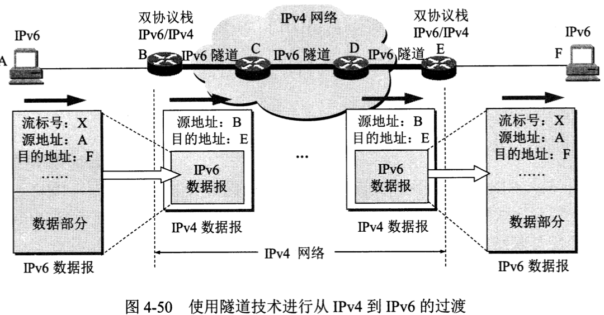

---

### 八.路由器简介

#### 1.路由器的作用

路由器是一种典型的网络层设备。是一种具有多个输入端口和多个输出端口的专用计算机，其任务是转发分组。从路由器某个输入端口收到的分组，按照分组要去的目的地，把该分组从路由器的某个合适的输出端口转发给下一跳路由器。下一跳路由器也是按照这种方法处理分组，直到该分组到达终点。

**路由器的主要作用是：**

- 连通不同的网络。
- 选择信息传送的线路。选择通畅快捷的近路，能大大提高通信速度，减轻网络系统通信负荷，节约网络系统资源，提高网络系统畅通率，从而让网络系统发挥出更大的效益来。

#### 2.路由器的结构

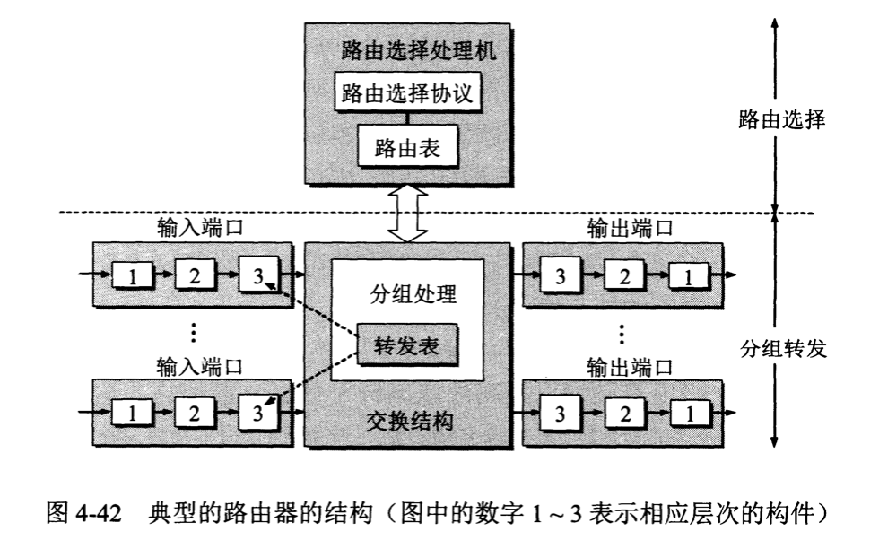

从上图可以看出路由器从功能上可以划分为： **路由选择** 和 **分组转发** 。

**路由选择：**

+ 路由选择也叫做控制部分，核心部件是路由处理机。任务是根据所选定的路由选择协议构建出路由表，同时经常或定期地和相邻路由器交换路由信息而不断地更新和维护路由表。

**分组转发：**

+ 分组转发结构由三个部分组成： **交换结构** 、 **一组输入端口** 和 **一组输出端口** 。
  + 交换结构的作用就是根据转发表对分组进行处理，将某个输入端口进入的分组从一个合适的输出端口转发出去。

#### 3.路由器分组转发流程

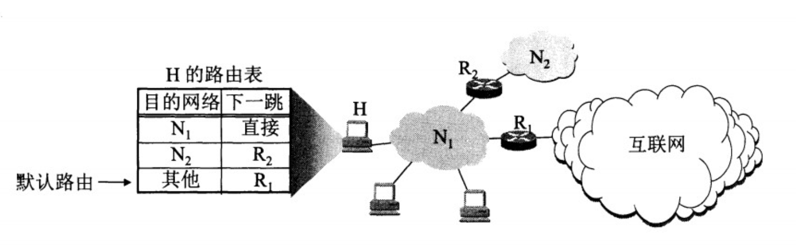

- 从数据报的首部提取目的主机的 IP 地址 D，得到目的网络地址 N。
- 若 N 就是与此路由器直接相连的某个网络地址，则进行直接交付；
- 若路由表中有目的地址为 D 的特定主机路由，则把数据报传送给表中所指明的下一跳路由器；
- 若路由表中有到达网络 N 的路由，则把数据报传送给路由表中所指明的下一跳路由器；
- 若路由表中有一个默认路由，则把数据报传送给路由表中所指明的默认路由器；
- 报告转发分组出错。

####  4.**IP** 地址与路由控制示例

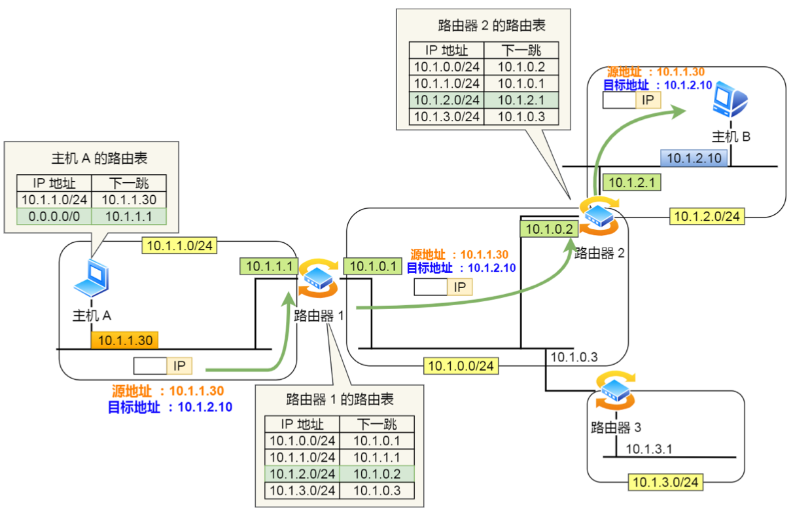

1. 主机 A 要发送一个 IP 包，其源地址是 10.1.1.30 和目标地址是 10.1.2.10 ，由于没有在主机 A 的路由表 找到与目标地址 10.1.2.10 的网络地址，于是包被转发到默认路由(路由器 1 )

2. 路由器 1 收到 IP 包后，也在路由器 1 的路由表匹配与目标地址相同的网络地址记录，发现匹配到了，于是就把 IP 数据包转发到了 10.1.0.2 这台路由器 2

3. 路由器 2 收到后，同样对比自身的路由表，发现匹配到了，于是把 IP 包从路由器 2 的 10.1.2.1 这个接口出去，最终经过交换机把 IP 数据包转发到了目标主机

---

### 九.路由选择协议

路由选择协议都是自适应的，能随着网络通信量和拓扑结构的变化而自适应地进行调整。

互联网可以划分为许多较小的自治系统 AS，一个 AS 可以使用一种和别的 AS 不同的路由选择协议。

可以把路由选择协议划分为两大类：

- 自治系统内部的路由选择：RIP 和 OSPF
- 自治系统间的路由选择：BGP

#### 1.内部网关协议 RIP

RIP 是一种基于距离向量的路由选择协议。距离是指跳数，直接相连的路由器跳数为 1。跳数最多为 15，超过 15 表示不可达。

RIP 按固定的时间间隔仅和相邻路由器交换自己的路由表，经过若干次交换之后，所有路由器最终会知道到达本自治系统中任何一个网络的最短距离和下一跳路由器地址。

距离向量算法：

- 对地址为 X 的相邻路由器发来的 RIP 报文，先修改报文中的所有项目，把下一跳字段中的地址改为 X，并把所有的距离字段加 1；
- 对修改后的 RIP 报文中的每一个项目，进行以下步骤：
  - 若原来的路由表中没有目的网络 N，则把该项目添加到路由表中；
  - 否则：若下一跳路由器地址是 X，则把收到的项目替换原来路由表中的项目；否则：若收到的项目中的距离 d 小于路由表中的距离，则进行更新（例如原始路由表项为 Net2, 5, P，新表项为 Net2, 4, X，则更新）；否则什么也不做。
- 若 3 分钟还没有收到相邻路由器的更新路由表，则把该相邻路由器标为不可达，即把距离置为 16。

RIP 协议实现简单，开销小。但是 RIP 能使用的最大距离为 15，限制了网络的规模。并且当网络出现故障时，要经过比较长的时间才能将此消息传送到所有路由器。

#### 2. 内部网关协议 OSPF

开放最短路径优先 OSPF，是为了克服 RIP 的缺点而开发出来的。

开放表示 OSPF 不受某一家厂商控制，而是公开发表的；最短路径优先表示使用了 Dijkstra 提出的最短路径算法 SPF。

OSPF 具有以下特点：

- 向本自治系统中的所有路由器发送信息，这种方法是洪泛法。
- 发送的信息就是与相邻路由器的链路状态，链路状态包括与哪些路由器相连以及链路的度量，度量用费用、距离、时延、带宽等来表示。
- 只有当链路状态发生变化时，路由器才会发送信息。

所有路由器都具有全网的拓扑结构图，并且是一致的。相比于 RIP，OSPF 的更新过程收敛的很快。

#### 3.外部网关协议 BGP

BGP（Border Gateway Protocol，边界网关协议）

AS 之间的路由选择很困难，主要是由于：

- 互联网规模很大；
- 各个 AS 内部使用不同的路由选择协议，无法准确定义路径的度量；
- AS 之间的路由选择必须考虑有关的策略，比如有些 AS 不愿意让其它 AS 经过。

BGP 只能寻找一条比较好的路由，而不是最佳路由。

每个 AS 都必须配置 BGP 发言人，通过在两个相邻 BGP 发言人之间建立 TCP 连接来交换路由信息。

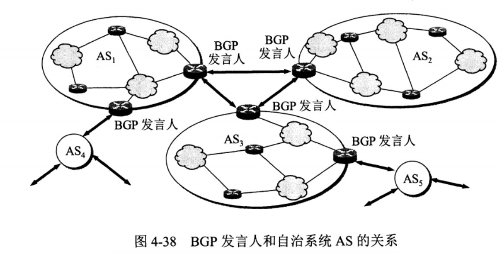

---

### 十.因特网组管理协议

#### 1.IGMP协议介绍

前面了解了组播地址 即 D 类地址，既然是组播，那就说明是只有一组的主机能收到数据包，不在一组的主机不能收到数组包，这就需要 IGMP 协议进行管理了。

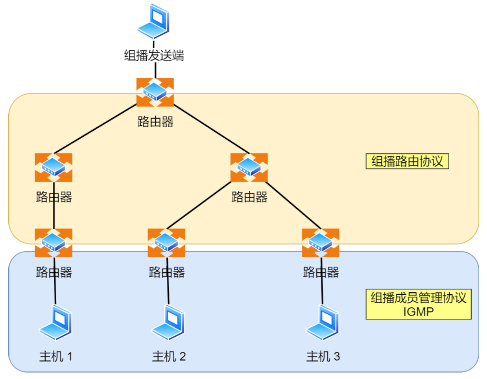

**IGMP 是因特网组管理协议，工作在主机(组播成员)和最后一跳路由之间**，如上图中的蓝色部分。

+ IGMP 报文向路由器申请加入和退出组播组，**默认情况下路由器是不会转发组播包到连接中的主机，除非主机 通过 IGMP 加入到组播组，**主机申请加入到组播组时，路由器就会记录 IGMP 路由器表，路由器后续就会转 发组播包到对应的主机了。

+ IGMP 报文采用 IP 封装，IP 头部的协议号为 2，而且 TTL 字段值通常为 1，因为 IGMP 是工作在主机与连接 的路由器之间。

#### 2.IGMP工作机制

IGMP 分为了三个版本分别是，IGMPv1、IGMPv2、IGMPv3。以 IGMPv2 作为例子，介绍常规查询与响应和离开组播组这两个工作机制。

##### 常规查询与响应工作机制

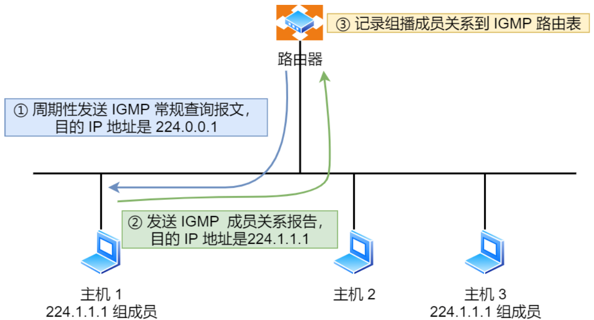

1. 路由器会周期性发送目的地址为 224.0.0.1 (表示同一网段内所有主机和路由器) **IGMP** 常规查询报文。
2. 主机1 和 主机 3 收到这个查询，随后会启动「报告延迟计时器」，计时器的时间是随机的，通常是 0~10 秒，计时器超时后主机就会发送 **IGMP** 成员关系报告报文(源 IP 地址为自己主机的 IP 地址，目的 IP 地址为 组播地址)。如果在定时器超时之前，收到同一个组内的其他主机发送的成员关系报告报文，则自己不再发 送，这样可以减少网络中多余的 IGMP 报文数量。
3. 路由器收到主机的成员关系报文后，就会在 IGMP 路由表中加入该组播组，后续网络中一旦该组播地址的数 据到达路由器，它会把数据包转发出去。

##### 离开组播组工作机制

离开组播组的情况一，网段中仍有该组播组:

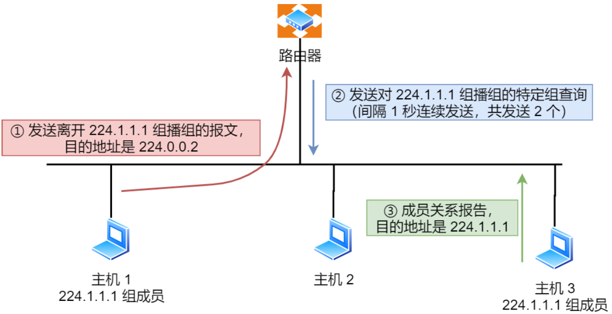

1. 主机 1 要离开组 224.1.1.1，发送 IGMPv2 离组报文，报文的目的地址是 224.0.0.2(表示发向网段内的所有 路由器)
2. 路由器 收到该报文后，以 1 秒为间隔连续发送 IGMP 特定组查询报文(共计发送 2 个)，以便确认该网络是 否还有 224.1.1.1 组的其他成员。
3. 主机 3 仍然是组 224.1.1.1 的成员，因此它立即响应这个特定组查询。路由器知道该网络中仍然存在该组播组 的成员，于是继续向该网络转发 224.1.1.1 的组播数据包。

离开组播组的情况二，网段中没有该组播组:

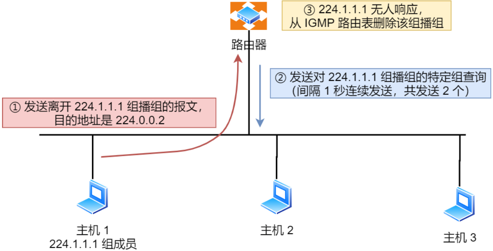

1. 主机 1 要离开组播组 224.1.1.1，发送 IGMP 离组报文。

2. 路由器收到该报文后，以 1 秒为间隔连续发送 IGMP 特定组查询报文(共计发送 2 个)。此时在该网段内， 组 224.1.1.1 已经没有其他成员了，因此没有主机响应这个查询。

3. 一定时间后，路由器认为该网段中已经没有 224.1.1.1 组播组成员了，将不会再向这个网段转发该组播地址的 数据包。

### 十一.虚拟专用网

由于 IP 地址的紧缺，一个机构能申请到的 IP 地址数往往远小于本机构所拥有的主机数。并且一个机构并不需要把所有的主机接入到外部的互联网中，机构内的计算机可以使用仅在本机构有效的 IP 地址（专用地址）。

有三个专用地址块：

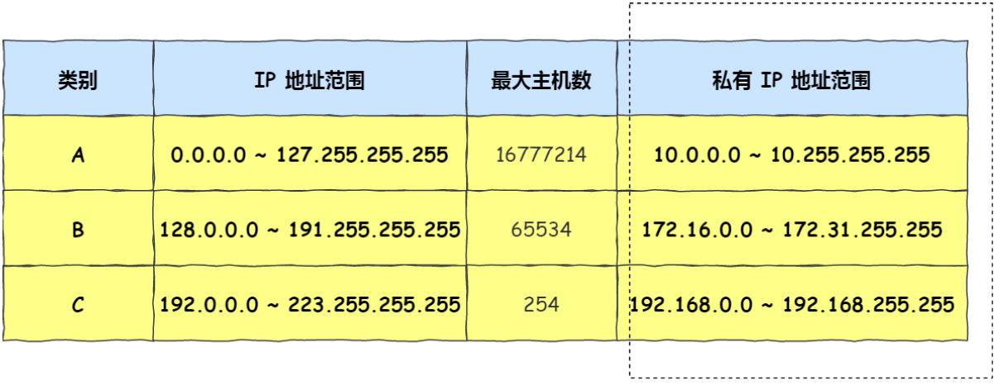

VPN 使用公用的互联网作为本机构各专用网之间的通信载体。专用指机构内的主机只与本机构内的其它主机通信；虚拟指好像是，而实际上并不是，它有经过公用的互联网。

下图中，场所 A 和 B 的通信经过互联网，如果场所 A 的主机 X 要和另一个场所 B 的主机 Y 通信，IP 数据报的源地址是 10.1.0.1，目的地址是 10.2.0.3。数据报先发送到与互联网相连的路由器 R1，R1 对内部数据进行加密，然后重新加上数据报的首部，源地址是路由器 R1 的全球地址 125.1.2.3，目的地址是路由器 R2 的全球地址 194.4.5.6。路由器 R2 收到数据报后将数据部分进行解密，恢复原来的数据报，此时目的地址为 10.2.0.3，就交付给 Y。

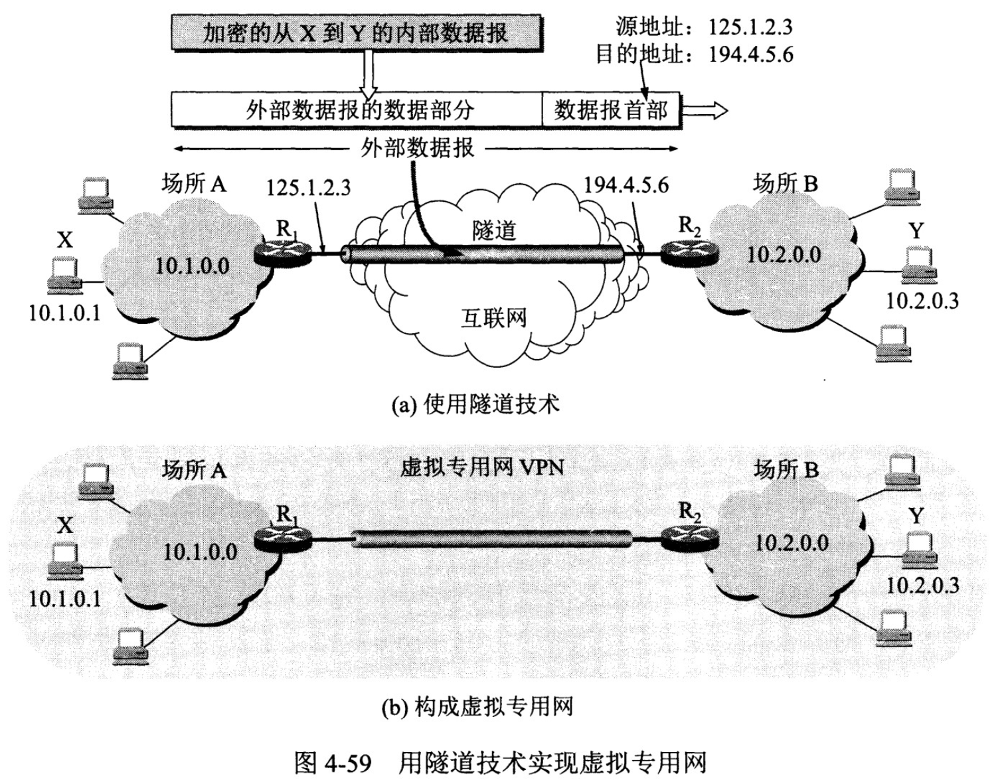

---

### 十二.VPN网络地址转换协议 NAT

#### 1.NAT功能简介

IPv4 的地址是非常紧缺的，在前面提到可以通过无分类地址来减缓 IPv4 地址耗尽的速度，但效果有限，于是提出了一种网络地址转换 **NAT** 的方法，再次缓解了 IPv4 地址耗尽的问题。

由于绝大多数的网络应用都是使用传输层协议 TCP 或 UDP 来传输数据的。 因此，可以把 IP 地址 + 端口号一起进行转换。 这样，就用一个全球 IP 地址就可以了，这种转换技术就叫网络地址与端口转换 **NAPT**。

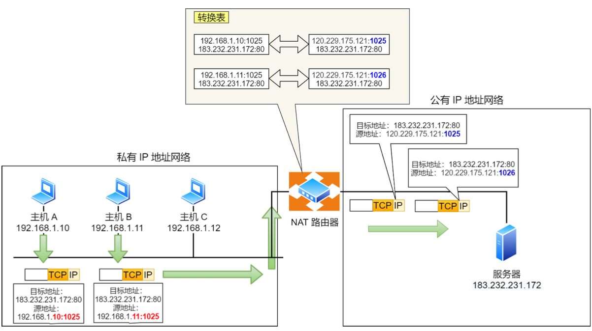

图中有两个客户端 192.168.1.10 和 192.168.1.11 同时与服务器 183.232.231.172 进行通信，并且这两个客户端的 本地端口都是 1025。

此时，两个私有 **IP** 地址都转换 **IP** 地址为公有地址 **120.229.175.121**，但是以不同的端口号作为区分。

于是，生成一个NAPT路由器的转换表，就可以正确地转换地址跟端口的组合，令客户端A、B同时与服务器之间进行通信。

这种转换表在 NAT 路由器上自动生成。例如，在 TCP 的情况下，建立 TCP 连接首次握手时的 SYN 包一经发出，就会生成这个表。而后又随着收到关闭连接时发出 FIN 包的确认应答从表中被删除。

#### 2.NAT缺陷与解决方式

由于 NAT/NAPT 都依赖于自己的转换表，因此会有以下的问题:

+ **外部无法主动与 NAT 内部服务器建立连接，因为 NAPT 转换表没有转换记录。** 
+ **转换表的生成与转换操作都会产生性能开销。**
+ **通信过程中，如果 NAT 路由器重启了，所有的 TCP 连接都将被重置。**

解决的方法主要有两种方法。

+ **第一种就是改用 IPv6**

+ **第二种 *NAT* 穿透技术**

  > NAT 穿越技术拥有这样的功能，它能够让网络应用程序主动发现自己位于 NAT 设备之后，并且会主动获得 NAT 设 备的公有 IP，并为自己建立端口映射条目，注意这些都是 NAT设备后的应用程序自动完成的。
  >
  > 说人话，就是客户端主动从 NAT 设备获取公有 IP 地址，然后自己建立端口映射条目，然后用这个条目对外通信， 就不需要 NAT 设备来进行转换了。