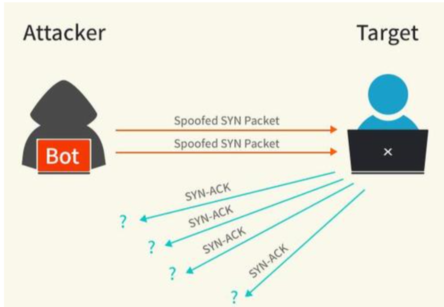
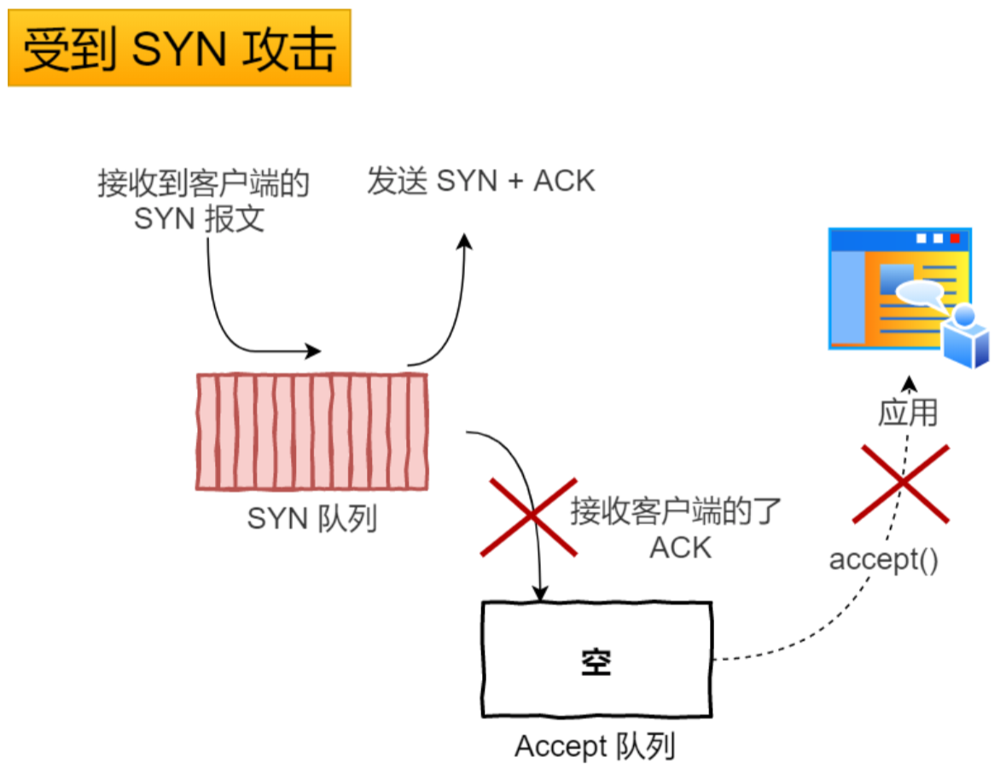
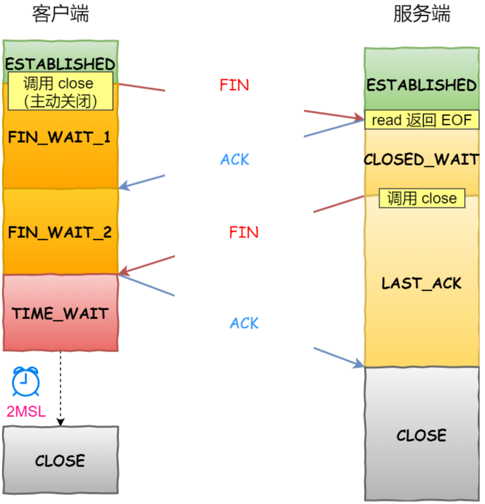
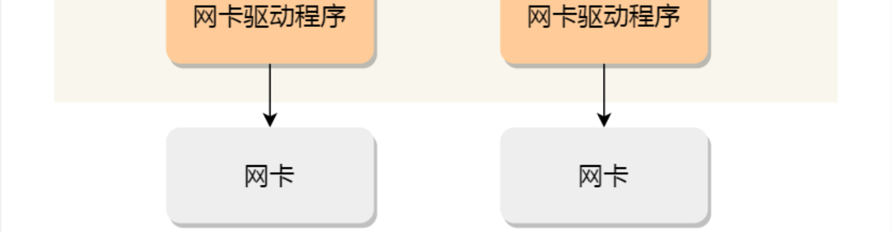

### 一.传输层的基本概念

#### 1.工作内容

从通信和信息处理的角度看，运输层向它上面的应用层提供通信服务，它**属于面向通信部分的最高层，同时也是用户功能中的最低层。**

 当网络的边缘部分中的两个主机使用网络的核心部分的功能进行端到端的通信时，**只有位于网络边缘部分的主机的协议栈才有运输层**，而网络核心部分中的路由器在转发分组时都只用到下三层的功能。

#### 2.**网络层和运输层的不同** 

- 网络层是为主机之间提供逻辑通信
- 运输层为应用进程之间提供端到端的逻辑通信

<div align = center></div>

#### 3.运输层的重要功能

在一台主机中经常有**多个应用进程同时分别和另一台主机中的多个应用进程通信。** 这表明运输层有一个很重要的功能—— **复用 (multiplexing)** 和 **分用 (demultiplexing)** 。

<div align = center></div>

+ **复用：**

  在发送方不同的应用程序都可以使用同一个运输层协议传输数据(加上适当的首部)。

+ **分用：**

  接收方的运输层在剥去报文的首部后能够把这些数据正确交付目的应用进程。

#### 4. 端口

网络层中，通信的对象为不同的主机，而从运输层的角度来看**，通信的对象为进程，而端口就代表了进程** 。也就是说，通过 ip 找到主机，通过端口找到对应进程。

- 端口用一个 16 位端口号进行标志。
- 端口号**只具有本地意义，即端口号只是为了标志本计算机应用层中的各进程。**

由此可见，两个计算机中的进程要互相通信**，不仅必须知道对方的 IP 地址（为了找到对方的计算机），而且还要知道对方的端口号（为了找到对方计算机中的应用进程）**

#### 5.屏蔽作用

运输层向高层用户屏蔽了下面网络核心的细节，它使应用进程看见的就是好像在两个运输层实体之间有一条端到端的逻辑通信信道。

<div align = center></div>

---

### 二.用户数据报协议UDP（User Datagram Protocol）

UDP **只在 IP 的数据报服务之上增加了很少一点的功能**：

- **复用和分用的功能**
- **差错检测的功能**

#### 1.特点

**① UDP 是无连接的**，发送数据之前不需要建立连接，，因此减少了开销和发送数据之前的时延。

**② UDP 使用尽最大努力交付**，即不保证可靠交付，因此主机不需要维持复杂的连接状态表。

**③ UDP 是面向报文的**。UDP 对应用层交下来的报文，既不合并，也不拆分，而是保留这些报文的边界。UDP 一次交付一个完整的报文。

**④ UDP 没有拥塞控制**，因此网络出现的拥塞不会使源主机的发送速率降低。这对某些实时应用是很重要的。很适合多媒体通信的要求。

**⑤ UDP 支持一对一、一对多、多对一和多对多的交互通信。**

**⑥ UDP 的首部开销小**，只有 8 个字节，比 TCP 的 20 个字节的首部要短。

#### 2.UDP是面向报文的

**UDP 对应用层交下来的报文，既不合并，也不拆分，而是保留这些报文的边界。** **应用层交给 UDP 多长的报文，UDP 就照样发送，即一次发送一个报文。**

**接收方 UDP 对 IP 层交上来的 UDP 用户数据报，在去除首部后就原封不动地交付上层的应用进程，一次交付一个完整的报文。** 应用程序必须选择合适大小的报文。

- 若报文太长，UDP 把它交给 IP 层后，IP 层在传送时可能要进行分片，这会降低 IP 层的效率。
- 若报文太短，UDP 把它交给 IP 层后，会使 IP 数据报的首部的相对长度太大，这也降低了 IP 层的效率。

#### 3.UDP首部格式

用户数据报 UDP 有两个字段：**数据字段和首部字段**。首部字段有 8 个字节，由 4 个字段组成，每个字段都是 2 个字节，各字段的含义如下：

- **源端口：**源端口号。在需要对方回信时选用。不需要时可全用0.
- **目的端口：**目的端口号。在终点交付报文时必须使用。
- **长度：**  UDP用户数据报的长度，其最小值为8。
- **检验和：** 检验UDP用户数据报在传输中是否有错。有错就丢弃。

<div align = center></div>

+ 在计算检验和时，临时把 12 字节的**“伪首部”**和 UDP 用户数据报连接在一起。伪首部仅仅是为了计算检验和。

---

### 三.传输控制协议TCP（Transmission Control Protocol）

#### 1.为什么需要TCP协议？

**IP 层**是「不可靠」的，它不保证网络包的交付、不保证网络包的按序交付、也不保证网络包中的数据的完整性。

如果需要保障网络数据包的可靠性，那么就需要由上层(传输层)的 TCP 协议来负责。因为 TCP 是一个工作在**传输层的可靠数据传输的服务**，它能确保接收端接收的网络包是无损坏、无间隔、非冗余和按序的。

#### 2.什么是TCP协议？

TCP 是**面向连接**的运输层协议，在无连接的、不可靠的 IP 网络服务基础之上提供**可靠交付**的**基于字节流**的传输层通信协议。

- **面向连接**

  + 每条 TCP 连接只能有**两个端点** (endpoint)，每一条 TCP 连接只能是**点对点**的，不能像 UDP 协议可以一个主机同时向多个主机发送消息，也就是一对多是无法做到的;

- **可靠的**

  + 无论的网络链路中出现了怎样的链路变化，TCP 都可以保证一个报文一定能够到达接收端;

- **面向字节流**

  + TCP 中的"流"(stream) 指的是流入或流出进程的字节序列。
  + **"面向字节流"**的含义是：虽然应用程序和 TCP 的交互是一次一个数据块，但 TCP 把应用程序交下来的数据看成仅仅是一连串无结构的字节流。

  TCP **不保证**接收方应用程序所收到的数据块和发送方应用程序所发出的**数据块具有对应大小的关系**。 但接收方应用程序收到的字节流必须和发送方应用程序发出的**字节流完全一样**。

  <div align = center></div>

#### 3.注意点

- TCP 连接是一条**虚连接**而不是一条真正的物理连接。
- TCP 对应用进程一次把多长的报文发送到 TCP 的缓存中是不关心的。
- TCP 根据对方给出的**窗口值**和当前**网络拥塞的程度**来决定一个报文段应包含多少个字节（UDP 发送的报文长度是应用进程给出的）。
- TCP 可把太长的数据块划分短一些再传送。
- TCP 也可等待积累有足够多的字节后再构成报文段发送出去。

#### 4.TCP报文段首部格式图及其字段含义

<div align = center></div>

- **源端口和目的端口字段**——各占 2 字节。端口是运输层与应用层的服务接口。运输层的复用和分用功能都要通过端口才能实现。
- **序号字段**——占 4 字节。TCP 连接中传送的数据流中的每一个字节都编上一个序号。序号字段的值则指的是本报文段所发送的数据的第一个字节的序号。
- **确认号字段**——占 4 字节，是期望收到对方的下一个报文段的数据的第一个字节的序号。
- **数据偏移（即首部长度）**——占 4 位，它指出 TCP 报文段的数据起始处距离 TCP 报文段的起始处有多远。“数据偏移”的单位是 32 位字（以 4 字节为计算单位）。
- **保留字段**——占 6 位，保留为今后使用，但目前应置为 0。
- **紧急 URG** —— 当 URG = 1 时，表明紧急指针字段有效。它告诉系统此报文段中有紧急数据，应尽快传送(相当于高优先级的数据)。
- **确认 ACK** —— 只有当 ACK =1 时确认号字段才有效。当 ACK =0 时，确认号无效。
- **推送 PSH (PuSH)** —— 接收 TCP 收到 PSH = 1 的报文段，就尽快地交付接收应用进程，而不再等到整个缓存都填满了后再向上交付。
- **复位 RST (ReSeT)** —— 当 RST=1 时，表明 TCP 连接中出现严重差错（如由于主机崩溃或其他原因），必须释放连接，然后再重新建立运输连接。
- **同步 SYN** —— 同步 SYN = 1 表示这是一个连接请求或连接接受报文。
- **终止 FIN (FINish)** —— 用来释放一个连接。FIN=1 表明此报文段的发送端的数据已发送完毕，并要求释放运输连接。
- **窗口大小** —— 占 2 字节，用来让对方设置发送窗口的依据，单位为字节。
- **检验和** —— 占 2 字节。检验和字段检验的范围包括首部和数据这两部分。在计算检验和时，要在 TCP 报文段的前面加上 12 字节的伪首部。
- **紧急指针字段** —— 占 16 位，指出在本报文段中紧急数据共有多少个字节（紧急数据放在本报文段数据的最前面）。
- **选项字段** —— 长度可变。TCP 最初只规定了一种选项，即最大报文段长度 MSS。MSS 告诉对方 TCP：“我的缓存所能接收的报文段的数据字段的最大长度是 MSS 个字节。”
- **填充** —— 这是为了使整个首部长度是 4 字节的整数倍

#### 4.TCP的链接

在TCP中，面向的既不是IP，又不是端口，**它面向的是套接字**。**TCP 连接的端点叫做套接字 (socket) 或插口。端口号拼接到 (contatenated with) IP 地址即构成了套接字。**

<div align = center></div>

<div align = center></div>

##### **连接的概念：**

+ 简单来说就是，用于保证可靠性和流量控制维护的某些状态信息，这些信息的组合，包括**Socket**、序列号和窗口 大小称为连接。

所以我们可以知道，建立一个 TCP 连接是需要客户端与服务器端达成上述三个信息的共识。

+ **Socket**: 由 IP 地址和端口号组成 
+ **序列号:** 用来解决乱序问题等 
+ **窗口大小:** 用来做流量控制

##### 如何唯一确定一个 TCP 连接

+ TCP 四元组可以唯一的确定一个连接，四元组包括如下: 

<div align = center></div>

> 源地址和目的地址的字段(32位)是在 IP 头部中，作用是通过 IP 协议发送报文给对方主机。
>
> 源端口和目的端口的字段(16位)是在 TCP 头部中，作用是告诉 TCP 协议应该把报文发给哪个进程。

##### 有一个 IP 的服务器监听了一个端口，它的 TCP 的最大连接数是多少

服务器通常固定在某个本地端口上监听，等待客户端的连接请求。 因此，客户端 IP 和 端口是可变的，其理论值计算公式如下:

<div align = center>最大TCP连接数 = 客户端 IP 数 * 客户端的端口数</div>

对 IPv4，客户端的 IP 数最多为 2 的 32 次方，客户端的端口数最多为 2 的 16 次方，也就是服务端单机最 大 TCP 连接数，约为 2 的 48 次方。

当然，服务端最大并发 TCP 连接数远不能达到理论上限。

+ 首先主要是**文件描述符限制**，Socket 都是文件，所以首先要通过 ulimit 配置文件描述符的数目; 
+ 另一个是**内存限制**，每个 TCP 连接都要占用一定内存，操作系统的内存是有限的。

### 四.TCP 与 UDP 区别

**1. 连接**

+ TCP 是面向连接的传输层协议，传输数据前先要建立连接。 UDP 是不需要连接，即刻传输数据。

**2. 服务对象**

+ TCP 是一对一的两点服务，即一条连接只有两个端点。 UDP 支持一对一、一对多、多对多的交互通信 

**3. 可靠性**

+ TCP 是可靠交付数据的，数据可以无差错、不丢失、不重复、按需到达。   UDP 是尽最大努力交付，不保证可靠交付数据。

**4. 拥塞控制、流量控制**

+ TCP 有拥塞控制和流量控制机制，保证数据传输的安全性。  UDP 则没有，即使网络非常拥堵了，也不会影响 UDP 的发送速率。

**5. 首部开销**

+ TCP 首部⻓度较⻓，会有一定的开销，首部在没有使用「选项」字段时是 20 个字节，如果使用了「选项」字段则会变⻓的。

+ UDP 首部只有 8 个字节，并且是固定不变的，开销较小。 

**6. 传输方式**

+ TCP 是流式传输，没有边界，但保证顺序和可靠。
+ UDP 是一个包一个包的发送，是有边界的，但可能会丢包和乱序。

**7. 分片不同**

+ TCP 的数据大小如果大于 MSS 大小，则会在传输层进行分片，目标主机收到后，也同样在传输层组装 TCP 数据包，如果中途丢失了一个分片，只需要传输丢失的这个分片。

+ UDP 的数据大小如果大于 MTU 大小，则会在 IP 层进行分片，目标主机收到后，在 IP 层组装完数据，接着 再传给传输层，但是如果中途丢了一个分片，在实现可靠传输的 UDP 时则就需要􏰀传所有的数据包，这样 传输效率非常差，所以通常 UDP 的报文应该小于 MTU。

**8. 应用场景**

+ 由于 TCP 是面向连接，能保证数据的可靠性交付，因此经常用于:
  + FTP 文件传输
  +  HTTP / HTTPS

+ 由于 UDP 面向无连接，它可以随时发送数据，再加上UDP本身的处理既简单又高效，因此经常用于:
  + 包总量较少的通信，如 DNS 、 SNMP 等 
  + 视频、音频等多媒体通信
  + 广播通信

**9. 为什么 UDP 头部没有「首部⻓度」字段，而 TCP 头部有「首部⻓度」字段呢?**

+ 原因是 TCP 有可变⻓的「选项」字段，而 UDP 头部⻓度则是不会变化的，无需多一个字段去记录 UDP 的首部⻓ 度。

**10. 为什么 UDP 头部有「包⻓度」字段，而 TCP 头部则没有「包⻓度」字段呢?**

+ TCP 是计算负载数据⻓度:  $TCP数据的长度 = IP总长度 - IP首部长度 - TCP首部长度$
+ 其中 IP 总⻓度 和 IP 首部⻓度，在 IP 首部格式是已知的。TCP 首部⻓度，则是在 TCP 首部格式已知的，可以求得 TCP 数据的⻓度。
+ UDP 也是基于 IP 层，理论 UDP 的数据⻓度也可以通过这个公式计算， 为何还要有 「包⻓度」呢?
  + 确实感觉 UDP 「包⻓度」是冗余的。 因为为了网络设备硬件设计和处理方便，首部⻓度需要是 **4** 字节的整数倍。
  + 如果去掉 UDP 「包⻓度」字段，那 UDP 首部⻓度就不是 4 字节的整数倍了，所以这可能是为了补全 UDP 首部⻓度是 4 字节的整数倍，才补充了「包⻓度」字段。

---

### 五.TCP的运输链接管理

> TCP 是面向连接的协议，所以使用 TCP 前必须先建立连接，而建立连接是通过三次握手来进行的。

TCP是面向连接的协议，运输过程有三个阶段：**连接建立，数据传送，连接释放。**运输连接的管理就是使运输连接的建立和释放都能正常的运行。

在TCP连接建立过程中要解决以下三个问题：

+ 要使每一方都能够确知对方的存在。
+ 要允许双方协商一些参数(如最大窗口值，是否使用窗口扩大选项和时间戳选项以及服务质量等)。
+ 能够对运输实体资源(如缓存大小，连接表中的项目等)进行分配。

TCP连接的建立采用客户服务器方式。主动发起连接建立的应用进程叫做客户，而被动等待连接建立的应用进程叫做服务器。

#### 1.TCP 的链接建立

<div align = center>
 </div>

假设 A 为客户端，B 为服务器端。

- 首先 B 的TCP服务器创建传输控制块TCB，准备接受客户进程的连接请求。服务器进程处于 LISTEN（监听）状态，等待客户的连接请求。

- A 的TCP客户进程也是首先创建传输控制模块TCB。然后在打算建立TCP连接时，向 B 发送连接请求报文，首部中的同步位SYN=1，同时选择一个初始的序号 x。TCP规定，SYN报文段**不能携带数据**，但要消耗一个序号。这时TCP客户进程进入SYN-SENT(同步已发送)状态。

- B 收到连接请求报文，如果同意建立连接，则向 A 发送连接确认报文，在确认报文段中应把 SYN=1，ACK=1，确认号为 x+1，同时也选择一个初始的序号 seq = y。这个报文段**也不能携带数据**，用样要消耗一个序号。这时TCP服务器进程进入SYN-RCVD(同步收到)状态。

  <div align = center>
   </div>

- A 收到 B 的连接确认报文后，还要向 B 发出确认，确认报文段的ACK位置置为1，确认号为 ack = y+1，而自己的序号为 seq = x+1。TCP规定，ACK报文段**可以携带数据。但如果不携带数据则不消耗序号**，这种情况下，下一个数据报的需要仍为 seq = x+1。这时TCP建立已经建立，A进入状态。

- B 收到 A 的确认后，也进入ESTABLISHED状态，连接建立。

##### 如何在 Linux 系统中查看 TCP 状态?

TCP 的连接状态查看，在 Linux 可以通过 netstat -napt 命令查看。

 <div align = center></div>

##### 为什么是三次握手?不是两次、四次?

因为 **TCP** 连接是用于保证可靠性和流量控制维护的某些状态信息，这些信息的组合，包括**Socket**、序列号和窗口大小称为连 接。所以，重要的是为什么三次握手才可以初始化**Socket**、序列号和窗口大小并建立 **TCP** 连接。 接下来以三个方面分析三次握手的原因:

+ 三次握手才可以阻止重复历史连接的初始化(主要原因)
+ 三次握手才可以同步双方的初始序列号
+ 三次握手才可以避免资源浪费

**原因一: 避免历史连接**

RFC 793 指出的 TCP 连接使用三次握手的首要原因就是**防止旧的重复连接初始化造成混乱。**

网络环境是错综复杂的，往往并不是期望的一样，先发送的数据包就先到达目标主机，反而它很骚，可能会由于网络拥堵等原因，会使得旧的数据包先到达目标主机，那么这种情况下 TCP 三次握手是如何 避免的呢?

 <div align = center></div> <div align = center></div>

客户端连续发送多次 SYN 建立连接的报文，在**网络拥堵**情况下:

+ 一个「旧 SYN 报文」比「最新的 SYN 」 报文早到达了服务端;
+ 那么此时服务端就会回一个 **SYN + ACK** 报文给客户端;
+ 客户端收到后可以根据自身的上下文，判断这是一个历史连接(序列号过期或超时)，那么客户端就会发送 **RST** 报文给服务端，表示中止这一次连接。

如果是两次握手连接，就不能判断当前连接是否是历史连接，三次握手则可以在客户端(发送方)准备发送第三次
报文时，客户端因有足够的上下文来判断当前连接是否是历史连接:

+ 如果是历史连接(序列号过期或超时)，则第三次握手发送的报文是 **RST** 报文，以此中止历史连接;
+ 如果不是历史连接，则第三次发送的报文是 ACK 报文，通信双方就会成功建立连接; 

所以，TCP 使用三次握手建立连接的最主要原因是防止历史连接初始化了连接。

**原因二: 同步双方初始序列号**

TCP 协议的通信双方， 都必须维护一个「序列号」， 序列号是可靠传输的一个关键因素，它的作用:

+ 接收方可以去除重复的数据; 
+ 接收方可以根据数据包的序列号按序接收; 
+ 可以标识发送出去的数据包中， 哪些是已经被对方收到的;

可⻅，序列号在 TCP 连接中占据着非常􏰀要的作用，所以当客户端发送携带「初始序列号」的 **SYN** 报文的时 候，需要服务端回一个 **ACK** 应答报文，表示客户端的 SYN 报文已被服务端成功接收，那当服务端发送「初始序 列号」给客户端的时候，依然也要得到客户端的应答回应，**这样一来一回，才能确保双方的初始序列号能被可靠的 同步。**

<div align = center></div>

四次握手其实也能够可靠的同步双方的初始化序号，但由于**第二步和第三步可以优化成一步，所以就成了「三次握 手」。**

而两次握手只保证了一方的初始序列号能被对方成功接收，没办法保证双方的初始序列号都能被确认接收。

**原因三: 避免资源浪费**

如果只有「两次握手」，当客户端的 SYN 请求连接在网络中阻塞，客户端没有接收到 ACK 报文，就会重新发 送 SYN ，由于没有第三次握手，服务器不清楚客户端是否收到了自己发送的建立连接的 ACK 确认信号，所以 每收到一个 SYN 就只能先主动建立一个连接，这会造成什么情况呢?

如果客户端的 SYN 阻塞了，重复发送多次 SYN 报文，那么服务器在收到请求后就会**建立多个冗余的无效链 接，造成不必要的资源浪费。**

 <div align = center></div> <div align = center></div>

即两次握手会造成消息滞留情况下，服务器􏰀复接受无用的连接请求 SYN 报文，而造成􏰀复分配资源。

 **小结**

TCP 建立连接时，通过三次握手能防止历史连接的建立，能减少双方不必要的资源开销，能帮助双方同步初始化序 列号。序列号能够保证数据包不重复、不丢弃和按序传输。

不使用「两次握手」和「四次握手」的原因:

+ 「两次握手」:无法防止历史连接的建立，会造成双方资源的浪费，也无法可靠的同步双方序列号;
+ 「四次握手」:三次握手就已经理论上最少可靠连接建立，所以不需要使用更多的通信次数。

##### 为什么客户端和服务端的初始序列号 ISN 是不相同的?

如果一个已经失效的连接被重用了，但是该旧连接的历史报文还残留在网络中，**如果序列号相同，那么就无法分辨**
**出该报文是不是历史报文，如果历史报文被新的连接接收了，则会产生数据错乱。**

所以，每次建立连接前重新初始化一个序列号主要是为了通信双方能够根据序号将不属于本连接的报文段丢弃。 另一方面是为了安全性，防止黑客伪造的相同序列号的 TCP 报文被对方接收。

**初始序列号 ISN 是如何随机产生的?**

起始 ISN 是基于时钟的，每 4 毫秒 + 1，转一圈要 4.55 个小时。 RFC1948 中提出了一个较好的初始化序列号 ISN 随机生成算法。 

<div align = center>ISN = M + F (localhost, localport, remotehost, remoteport)</div>

+ M 是一个计时器，这个计时器每隔 4 毫秒加 1。
+ F 是一个 Hash 算法，根据源 IP、目的 IP、源端口、目的端口生成一个随机数值。要保证 Hash 算法不能被外部轻易推算得出，用 MD5 算法是一个比较好的选择。

**既然 IP 层会分片，为什么 TCP 层还需要 MSS 呢?**

 <div align = center></div>

+ **MTU :** 一个网络包的最大⻓度，以太网中一般为 1500 字节;
+  **MSS :** 除去 IP 和 TCP 头部之后，一个网络包所能容纳的 TCP 数据的最大⻓度;

如果在 TCP 的整个报文(头部 + 数据)交给 IP 层进行分片，会有什么异常呢?

当 IP 层有一个超过 MTU 大小的数据(TCP 头部 + TCP 数据)要发送，那么 IP 层就要进行分片，把数据分片成若干片，保证每一个分片都小于 MTU。把一份 IP 数据报进行分片以后，由目标主机的 IP 层来进行重新组装后， 再交给上一层 TCP 传输层。

这看起来井然有序，但这存在隐患的，**那么当如果一个 IP 分片丢失，整个 IP 报文的所有分片都得重传。** 因为 IP 层本身没有超时􏰀传机制，它由传输层的 TCP 来负责超时和重传。

当接收方发现 TCP 报文(头部 + 数据)的某一片丢失后，则不会响应 ACK 给对方，那么发送方的 TCP 在超时 后，就会􏰀发「整个 TCP 报文(头部 + 数据)」。

因此，可以得知由 IP 层进行分片传输，是非常没有效率的。

所以，为了达到最佳的传输效能 TCP 协议在**建立连接的时候通常要协商双方的 MSS 值**，当 TCP 层发现数据超过 MSS 时，则就先会进行分片，当然由它形成的 IP 包的⻓度也就不会大于 MTU ，自然也就不用 IP 分片了。

<div align = center></div>

经过 TCP 层分片后，如果一个 TCP 分片丢失后，进行重发时也是以 **MSS** 为单位，而不用􏰀传所有的分片，大大 增加了􏰀传的效率。

##### **什么是 SYN 攻击?如何避免 SYN 攻击?**

***SYN* 攻击**

都知道 TCP 连接建立是需要三次握手，假设攻击者短时间伪造不同 IP 地址的 SYN 报文，服务端每接收到 一个 SYN 报文，就进入 SYN_RCVD 状态，但服务端发送出去的 ACK + SYN 报文，无法得到未知 IP 主机的 ACK 应答，久而久之就会占满服务端的 **SYN** 接收队列(未连接队列)，使得服务器不能为正常用户服务。

<div align = center></div>

**避免 *SYN* 攻击方式一**

其中一种解决方式是通过修改 Linux 内核参数，控制队列大小和当队列满时应做什么处理。

+ 当网卡接收数据包的速度大于内核处理的速度时，会有一个队列保存这些数据包。控制该队列的最大值如下参数:

  net.core.netdev_max_backlog

+ SYN_RCVD 状态连接的最大个数: 

  net.ipv4.tcp_max_syn_backlog

+ 超出处理能时，对新的 SYN 直接回报 RST，丢弃连接:

  net.ipv4.tcp_abort_on_overflow

**避免 *SYN* 攻击方式二**

先来看下 Linux 内核的 SYN (未完成连接建立) 队列与 Accpet (已完成连接建立) 队列是如何工作的?

**正常流程:**

+ 当服务端接收到客户端的 SYN 报文时，会将其加入到内核的「 SYN 队列」; 
+ 接着发送 SYN + ACK 给客户端，等待客户端回应 ACK 报文;
+ 服务端接收到 ACK 报文后，从「 SYN 队列」移除放入到「 Accept 队列」; 
+ 应用通过调用 accpet() socket 接口，从「 Accept 队列」取出连接。

<div align = center></div>

**应用程序过慢:**

+ 如果应用程序过慢时，就会导致「 Accept 队列」被占满。

**受到 SYN 攻击:**

+ 如果不断受到 SYN 攻击，就会导致「 SYN 队列」被占满。
+ `tcp_syncookies` 的方式可以应对 SYN 攻击的方法: `net.ipv4.tcp_syncookies = 1`

**SYN 队列满:**

+ 当 「 SYN 队列」满之后，后续服务器收到 SYN 包，不进入「 SYN 队列」; 
+ 计算出一个 cookie 值，再以 SYN + ACK 中的「序列号」返回客户端，

+ 服务端接收到客户端的应答报文时，服务器会检查这个 ACK 包的合法性。如果合法，直接放入到「 Accept 队列」。

+ 最后应用通过调用 accpet() socket 接口，从「 Accept 队列」取出的连接。

#### 2.TCP 的连接释放

<div align = center></div>

以下描述不讨论序号和确认号，因为序号和确认号的规则比较简单。并且不讨论 ACK，因为 ACK 在连接建立之后都为 1。

- **第一次挥手：**A的应用进程先向其TCP发出连接释放报文段（FIN=1，序号seq=u），并停止再发送数据，主动关闭TCP连接，进入FIN-WAIT-1（终止等待1）状态，等待B的确认。
- **第二次挥手：**B收到连接释放报文段后即发出确认报文段，（ACK=1，确认号ack=u+1，序号seq=v），B进入CLOSE-WAIT（关闭等待）状态，此时的TCP处于半关闭状态，A到B的连接释放。
- A收到B的确认后，进入FIN-WAIT-2（终止等待2）状态，等待B发出的连接释放报文段。
- **第三次挥手**：B没有要向A发出的数据，B发出连接释放报文段（FIN=1，ACK=1，序号seq=w，确认号ack=u+1），B进入LAST-ACK（最后确认）状态，等待A的确认。
- **第四次挥手：**A收到B的连接释放报文段后，对此发出确认报文段（ACK=1，seq=u+1，ack=w+1），A进入TIME-WAIT（时间等待）状态。此时TCP未释放掉，需要经过时间等待计时器设置的时间2MSL后，A才进入CLOSED状态。

> 这里一点需要注意是:主动关闭连接的，才有 **TIME_WAIT** 状态。

##### 为什么挥手需要四次?

再来回顾下四次挥手双方发 FIN 包的过程，就能理解为什么需要四次了。

+ 关闭连接时，客户端向服务端发送 FIN 时，仅仅表示客户端不再发送数据了但是还能接收数据。
+ 服务器收到客户端的 FIN 报文时，先回一个 ACK 应答报文，而服务端可能还有数据需要处理和发送，等 服务端不再发送数据时，才发送 FIN 报文给客户端来表示同意现在关闭连接。

从上面过程可知，服务端通常需要等待完成数据的发送和处理，所以服务端的 ACK 和 FIN 一般都会分开发 送，从而比三次握手导致多了一次。

##### 为什么 TIME_WAIT 等待的时间是 2MSL?

MSL 是 Maximum Segment Lifetime，报文最大生存时间，它是任何报文在网络上存在的最⻓时间，超过这个时间报文将被丢弃。因为 TCP 报文基于是 IP 协议的，而 IP 头中有一个 TTL 字段，是 IP 数据报可以经过的最大路 由数，每经过一个处理他的路由器此值就减 1，当此值为 0 则数据报将被丢弃，同时发送 ICMP 报文通知源主机。

**MSL 与 TTL 的区别:** MSL 的单位是时间，而 TTL 是经过路由跳数。所以 **MSL** 应该要大于等于 **TTL** 消耗为 **0** 的 时间，以确保报文已被自然消亡。

TIME_WAIT 等待 2 倍的 MSL，比较合理的解释是: **网络中可能存在来自发送方的数据包，当这些发送方的数据包 被接收方处理后又会向对方发送响应，所以一来一回需要等待 2 倍的时间。**

比如如果被动关闭方没有收到断开连接的最后的 ACK 报文，就会触发超时重发 Fin 报文，另一方接收到 FIN 后， 会重发 ACK 给被动关闭方， 一来一去正好 2 个 MSL。

2MSL 的时间是从**客户端接收到 FIN 后发送 ACK 开始计时的。**如果在 TIME-WAIT 时间内，因为客户端的 ACK 没有传输到服务端，客户端又接收到了服务端􏰀发的 FIN 报文，那么 **2MSL** 时间将重新计时。

在 Linux 系统里 2MSL 默认是 60 秒，那么一个 MSL 也就是 30 秒。**Linux 系统停留在 TIME_WAIT 的时 间为固定的 60 秒。**

其定义在 Linux 内核代码里的名称为 TCP_TIMEWAIT_LEN:

```c
#define TCP_TIMEWAIT_LEN (60*HZ) /* how long to wait to destroy TIME-WAIT
                                     state, about 60 seconds  */
```

如果要修改 TIME_WAIT 的时间⻓度，只能修改 Linux 内核代码里 TCP_TIMEWAIT_LEN 的值，并􏰀新编译 Linux 内核。

##### 为什么需要 TIME_WAIT 状态?

主动发起关闭连接的一方，才会有 TIME-WAIT 状态。 需要 TIME-WAIT 状态，主要是两个原因:

+ 防止具有相同「四元组」的「旧」数据包被收到;

+ 保证「被动关闭连接」的一方能被正确的关闭，即保证最后的 ACK 能让被动关闭方接收，从而帮助其正常关闭;

**原因一:防止旧连接的数据包**

假设 TIME-WAIT 没有等待时间或时间过短，被延迟的数据包抵达后会发生什么呢?

<div align = center></div>

+ 如上图⻩色框框服务端在关闭连接之前发送的 SEQ = 301 报文，被网络延迟了。
+ 这时有相同端口的 TCP 连接被复用后，被延迟的 SEQ = 301 抵达了客户端，那么客户端是有可能正常接收这个过期的报文，这就会产生数据错乱等严重的问题。

所以，TCP 就设计出了这么一个机制，经过 2MSL 这个时间，足以让两个方向上的数据包都被丢弃，使得原来连接的数据包在网络中都自然消失，再出现的数据包一定都是新建立连接所产生的。

**原因二:保证连接正确关闭**

在 RFC 793 指出 TIME-WAIT 另一个重要的作用是: **等待足够的时间以确保最后的 ACK 能让被动关闭方接收，从而帮助其正常关闭。**

假设 TIME-WAIT 没有等待时间或时间过短，断开连接会造成什么问题呢?

+ 如上图红色框框客户端四次挥手的最后一个 ACK 报文如果在网络中被丢失了，此时如果客户端 TIME-WAIT 过短或没有，则就直接进入了 CLOSED 状态了，那么服务端则会一直处在 LASE_ACK 状态。
+  当客户端发起建立连接的 SYN 请求报文后，服务端会发送 RST 报文给客户端，连接建立的过程就会被终止。

如果 TIME-WAIT 等待足够⻓的情况就会遇到两种情况:

+ 服务端正常收到四次挥手的最后一个 ACK 报文，则服务端正常关闭连接。
+  服务端没有收到四次挥手的最后一个 ACK 报文时，则会重发 FIN 关闭连接报文并等待新的 ACK 报文。

 所以客户端在 TIME-WAIT 状态等待 2MSL 时间后，就可以保证双方的连接都可以正常的关闭。

##### **TIME_WAIT 过多有什么危害?**

如果服务器有处于 TIME-WAIT 状态的 TCP，则说明是由服务器方主动发起的断开请求。 

过多的 TIME-WAIT 状态主要的危害有两种:

+ 第一是内存资源占用;
+ 第二是对端口资源的占用，一个 TCP 连接至少消耗一个本地端口;

第二个危害是会造成严重的后果的，要知道，端口资源也是有限的，一般可以开启的端口为 32768~61000 ，也可以通过如下参数设置指定：` net.ipv4.ip_local_port_range`

**如果发起连接一方的 TIME_WAIT 状态过多，占满了所有端口资源，则会导致无法创建新连接。** 

客户端受端口资源限制:

+ 客户端TIME_WAIT过多，就会导致端口资源被占用，因为端口就65536个，被占满就会导致无法创建新的连接。

服务端受系统资源限制:

+ 由于一个四元组表示 TCP 连接，理论上服务端可以建立很多连接，服务端确实只监听一个端口 但是会把连接 扔给处理线程，所以理论上监听的端口可以继续监听。但是线程池处理不了那么多一直不断的连接了。所以 当服务端出现大量 TIME_WAIT 时，系统资源被占满时，会导致处理不过来新的连接。

##### 如何优化 TIME_WAIT?

这里给出优化 TIME-WAIT 的几个方式，都是有利有弊:

+ 打开 net.ipv4.tcp_tw_reuse 和 net.ipv4.tcp_timestamps 选项;
+ net.ipv4.tcp_max_tw_buckets
+ 程序中使用 SO_LINGER ，应用强制使用 RST 关闭。

**方式一: net.ipv4.tcp_tw_reuse 和 tcp_timestamps**

 如下的 Linux 内核参数开启后，则可以**复用处于 TIME_WAIT 的 socket 为新的连接所用。**

有一点需要注意的是，**tcp_tw_reuse 功能只能用客户端(连接发起方)，因为开启了该功能，在调用 connect() 函数时，内核会随机找一个 time_wait 状态超过 1 秒的连接给新的连接复用。**

`net.ipv4.tcp_tw_reuse = 1`

使用这个选项，还有一个前提，需要打开对 TCP 时间戳的支持，即

 `net.ipv4.tcp_timestamps=1`(默认即为 1)

这个时间戳的字段是在 TCP 头部的「选项」里，用于记录 TCP 发送方的当前时间戳和从对端接收到的最新时间戳。

由于引入了时间戳，我们在前面提到的 2MSL 问题就不复存在了，因为􏰀复的数据包会因为时间戳过期被自然丢弃。

**方式二: net.ipv4.tcp_max_tw_buckets**

这个值默认为 18000，当系统中处于 TIME_WAIT 的连接**一旦超过这个值时，系统就会将后面的 TIME_WAIT 连接**

**状态重置。**

> 这个方法过于暴力，而且治标不治本，带来的问题远比解决的问题多，不推荐使用。

**方式三: 程序中使用 SO_LINGER**

 我们可以通过设置 socket 选项，来设置调用 close 关闭连接行为。

```c
 struct linger so_linger;
 so_linger.l_onoff = 1;
 so_linger.l_linger = 0;
 setsockopt(s, SOL_SOCKET, SO_LINGER, &so_linger,sizeof(so_linger));
```

如果 l_onoff 为非 0， 且 l_linger 值为 0，那么调用 close 后，会立该发送一个 RST 标志给对端，该 TCP 连接 将跳过四次挥手，也就跳过了 TIME_WAIT 状态，直接关闭。

但这为跨越 TIME_WAIT 状态提供了一个可能，不过是一个非常危险的行为，不值得提倡。

##### 如果已经建立了连接，但是客户端突然出现故障了怎么办?

TCP 有一个机制是保活机制。这个机制的原理是这样的:

定义一个时间段，在这个时间段内，如果没有任何连接相关的活动，TCP 保活机制会开始作用，每隔一个时间间 隔，发送一个探测报文，该探测报文包含的数据非常少，如果连续几个探测报文都没有得到响应，则认为当前的 TCP 连接已经死亡，系统内核将错误信息通知给上层应用程序。

在 Linux 内核可以有对应的参数可以设置保活时间、保活探测的次数、保活探测的时间间隔，以下都为默认值:

```c
 net.ipv4.tcp_keepalive_time=7200
 net.ipv4.tcp_keepalive_intvl=75
 net.ipv4.tcp_keepalive_probes=9
```

+ tcp_keepalive_time=7200:表示保活时间是 7200 秒(2小时)，也就 2 小时内如果没有任何连接相关的活 动，则会启动保活机制
+ tcp_keepalive_intvl=75:表示每次检测间隔 75 秒;
+ tcp_keepalive_probes=9:表示检测 9 次无响应，认为对方是不可达的，从而中断本次的连接。

也就是说在 Linux 系统中，最少需要经过 2 小时 11 分 15 秒才可以发现一个「死亡」连接。

<div align = center></div>

这个时间是有点⻓的，我们也可以根据实际的需求，对以上的保活相关的参数进行设置。 如果开启了 TCP 保活，需要考虑以下几种情况:

第一种，对端程序是正常工作的。当 TCP 保活的探测报文发送给对端, 对端会正常响应，这样 **TCP** 保活时间会被 重置，等待下一个 TCP 保活时间的到来。

第二种，对端程序崩溃并重启。当 TCP 保活的探测报文发送给对端后，对端是可以响应的，但由于没有该连接的 有效信息，会产生一个 **RST** 报文，这样很快就会发现 TCP 连接已经被重置。

第三种，是对端程序崩溃，或对端由于其他原因导致报文不可达。当 TCP 保活的探测报文发送给对端后，石沉大 海，没有响应，连续几次，达到保活探测次数后，**TCP** 会报告该 **TCP** 连接已经死亡。

#### 3.socket编程

##### TCP进行socket编程的步骤：

+ 服务端和客户端初始化 socket ，得到文件描述符;
+ 服务端调用 bind ，将绑定在 IP 地址和端口;
+ 服务端调用 listen ，进行监听;
+ 服务端调用 accept ，等待客户端连接;
+ 客户端调用 connect ，向服务器端的地址和端口发起连接请求;
+ 服务端 accept 返回用于传输的 socket 的文件描述符;
+ 客户端调用 write 写入数据;服务端调用 read 读取数据;
+ 客户端断开连接时，会调用 close ，那么服务端 read 读取数据的时候，就会读取到了 EOF ，待处理完 数据后，服务端调用 close ，表示连接关闭。

这里需要注意的是，服务端调用 accept 时，连接成功了会返回一个已完成连接的 socket，后续用来传输数据。

所以，监听的 socket 和真正用来传送数据的 socket，是「两个」 socket，一个叫作监听 **socket**，一个叫作已完 成连接 **socket**。

成功连接建立之后，双方开始通过 read 和 write 函数来读写数据，就像往一个文件流里面写东⻄一样。

##### listen 时候参数 backlog 的意义?

Linux内核中会维护两个队列:

+ 未完成连接队列(SYN 队列):接收到一个 SYN 建立连接请求，处于 SYN_RCVD 状态;
+ 已完成连接队列(Accpet 队列):已完成 TCP 三次握手过程，处于 ESTABLISHED 状态;

<div align = center></div>

```c
int listen (int socketfd, int backlog)
```

+ 参数一 socketfd 为 socketfd 文件描述符
+ 参数二 backlog，这参数在历史版本有一定的变化

在早期 Linux 内核 backlog 是 SYN 队列大小，也就是未完成的队列大小；在 Linux 内核 2.2 之后，backlog 变成 accept 队列，也就是已完成连接建立的队列⻓度，所以现在通常认为**backlog** 是 **accept** 队列。

但是上限值是内核参数 **somaxconn** 的大小，也就说 **accpet** 队列⻓度 **= min(backlog, somaxconn)**。

##### accept 发生在三次握手的哪一步?

观察客户端连接服务端时，发送了什么?

<div align = center></div>

+ 客户端的协议栈向服务器端发送了 SYN 包，并告诉服务器端当前发送序列号 client_isn，客户端进入 SYN_SENT 状态;
+ 服务器端的协议栈收到这个包之后，和客户端进行 ACK 应答，应答的值为 client_isn+1，表示对 SYN 包 client_isn 的确认，同时服务器也发送一个 SYN 包，告诉客户端当前我的发送序列号为 server_isn，服务器端 进入 SYN_RCVD 状态;

+ 客户端协议栈收到 ACK 之后，使得应用程序从 connect 调用返回，表示客户端到服务器端的单向连接建立 成功，客户端的状态为 ESTABLISHED，同时客户端协议栈也会对服务器端的 SYN 包进行应答，应答数据为 server_isn+1;

+ 应答包到达服务器端后，服务器端协议栈使得 accept 阻塞调用返回，这个时候服务器端到客户端的单向连 接也建立成功，服务器端也进入 ESTABLISHED 状态。

从上面的描述过程，我们可以得知客户端 **connect** 成功返回是在第二次握手，服务端 **accept** 成功返回是在三次握 手成功之后。

##### **客户端调用 close 了，连接是断开的流程是什么?**

查看客户端主动调用了 close ，会发生什么?

<div align = center></div>

+ 客户端调用 close ，表明客户端没有数据需要发送了，则此时会向服务端发送 FIN 报文，进入 FIN_WAIT_1 状态;
+ 服务端接收到了 FIN 报文，TCP 协议栈会为 FIN 包插入一个文件结束符 EOF 到接收缓冲区中，应用程序 可以通过 read 调用来感知这个 FIN 包。这个 EOF 会被**放在已排队等候的其他已接收的数据之后**，这就意味着服务端需要处理这种异常情况，因为 EOF 表示在该连接上再无额外数据到达。此时，服务端进入 CLOSE_WAIT 状态;
+ 接着，当处理完数据后，自然就会读到 EOF ，于是也调用 close 关闭它的套接字，这会使得客户端会发 出一个 FIN 包，之后处于 LAST_ACK 状态;
+ 客户端接收到服务端的 FIN 包，并发送 ACK 确认包给服务端，此时客户端将进入 TIME_WAIT 状态; 
+ 服务端收到 ACK 确认包后，就进入了最后的 CLOSE 状态;
+ 客户端经过 2MSL 时间之后，也进入 CLOSE 状态;


### 五.TCP可靠传输的实现

TCP为了提供可靠传输：

（1）首先，采用三次握手来建立TCP连接，四次握手来释放TCP连接，从而保证建立的传输信道是可靠的。

（2）其次，TCP采用了连续ARQ协议（回退N，Go-back-N；超时自动重传）来保证数据传输的正确性，使用滑动窗口协议来保证接方能够及时处理所接收到的数据，进行流量控制。

（3）最后，TCP使用慢开始、拥塞避免、快重传和快恢复来进行拥塞控制，避免网络拥塞。

### 六.可靠传输的工作原理

理想的传输客户端调用 close ，表明客户端没有数据需要发送了，则此时会向服务端发送 FIN 报文，进入 FIN_WAIT_1 状态;

服务端接收到了 FIN 报文，TCP 协议栈会为 FIN 包插入一个文件结束符 EOF 到接收缓冲区中，应用程序 可以通过 read 调用来感知这个 FIN 包。这个 EOF 会被放在已排队等候的其他已接收的数据之后，这就 意味着服务端需要处理这种异常情况，因为 EOF 表示在该连接上再无额外数据到达。此时，服务端进入 CLOSE_WAIT 状态;

接着，当处理完数据后，自然就会读到 EOF ，于是也调用 close 关闭它的套接字，这会使得客户端会发 出一个 FIN 包，之后处于 LAST_ACK 状态;

客户端接收到服务端的 FIN 包，并发送 ACK 确认包给服务端，此时客户端将进入 TIME_WAIT 状态; 服务端收到 ACK 确认包后，就进入了最后的 CLOSE 状态;

客户端经过 2MSL 时间之后，也进入 CLOSE 状态;条件有以下两个特点：

- 杭州传输信道不产生差错。
- 不管发送方以多快的速度发送数据，接收方总是来得及处理收到的数据。

然而实际的网络都不具备以上两个理想条件**。必须使用一些可靠传输协议，在不可靠的传输信道实现可靠传输。**

那么在TCP中就有两种方式来实现可靠传输了

- **停止等待协议**
- **连续 ARQ 协议**

#### 1.停止等待协议

**“停止等待”就是每发送完一个分组就停止发送，等待对方的确认。在收到确认后再发送下一个分组。**

停止等待协议有两种情况：**① 无差错情况** 、**② 出现差错情况**

**① 无差错情况**

<div align = center></div>

 **②出现差错情况**

在接收方 B 会出现两种情况：

- **B 接收 M1 时检测出了差错**，就丢弃 M1，其他什么也不做（不通知 A 收到有差错的分组）。
- **M1 在传输过程中丢失了**，这时 B 当然什么都不知道，也什么都不做。

在这两种情况下，**B 都不会发送任何信息。** 但**A都必须重发分组**，直到B正确接收为止，这样才能实现可靠通信。

**问题**：A如何知道 B 是否正确收到了 M1 呢？ **解决方法**：超时重传

- A 为每一个已发送的分组都设置了一个超时计时器。
- A 只要在超时计时器到期之前收到了相应的确认，就撤销该超时计时器，继续发送下一个分组 M2 。
- 若A在超时计时器规定时间内没有收到B的确认，就认为分组错误或丢失，就重发该分组。

**问题**：若分组正确到达B，但B回送的确认丢失或延迟了，A未收到B的确认，会超时重发。B 可能会收到重复的 M1 。B如何知道收到了重复的分组，需要丢弃呢？ **解决方法**：编号

- A为每一个发送的分组都进行编号。若B收到了编号相同的分组，则认为收到了重复分组，丢弃重复的分组，并回送确认。
- B为发送的确认也进行编号，指示该确认是对哪一个分组的确认。
- A根据确认及其编号，可以确定它是对哪一个分组的确认，避免重发发送。若为重复的确认，则将其丢弃。

<div align = center></div>

注意：

- **在发送完一个分组后，必须暂时保留已发送的分组的副本，以备重发。**
- **分组和确认分组都必须进行编号。**
- 超时计时器的重传时间应当比数据在分组传输的平均往返时间更长一些。

通常 A 最终总是可以收到对所有发出的分组的确认。如果 A 不断重传分组但总是收不到确认，就说明通信线路太差，不能进行通信。

使用上述的确认和重传机制，我们就可以在不可靠的传输网络上实现可靠的通信。

像上述的这种可靠传输协议常称为自动重传请求 ARQ  (Automatic Repeat reQuest)。意思是重传的请求是自动进行的，接收方不需要请求发送方重传某个出错的分组。

**为了提高传输效率，发送方可以不使用低效率的停止等待协议，而是采用流水线传输。**

> 流水线传输就是发送方可连续发送多个分组，不必每发完一个分组就停顿下来等待对方的确认。这样可使信道上一直有数据不间断地传送。

<div align = center></div>

#### 2.连续 ARQ 协议

- 发送方维持的发送窗口，它的意义是：**位于发送窗口内的分组都可连续发送出去，而不需要等待对方的确认。这样，信道利用率就提高了。**
- **连续 ARQ 协议规定，发送方每收到一个确认，就把发送窗口向前滑动一个分组的位置。**

即不必对收到的分组逐个发送确认，**而是对按序到达的最后一个分组发送确认，这样就表示：到这个分组为止的所有分组都已正确收到了。**

优点：**容易实现，即使确认丢失也不必重传。** 缺点：**不能向发送方反映出接收方已经正确收到的所有分组的信息。**

如果发送方发送了前 5 个分组，**而中间的第 3 个分组丢失了**。这时接收方只能对前两个分组发出确认**。发送方无法知道后面三个分组的下落，而只好把后面的三个分组都再重传一次。** 这就叫做 Go-back-N（回退 N），**表示需要再退回来重传已发送过的 N 个分组。**

<div align = center></div>


---

### 七.TCP的流量控制

TCP利用滑动窗口实现流量控制。

+ 窗口是缓存的一部分，用来暂时存放字节流。发送方和接收方各有一个窗口，接收方通过 TCP 报文段中的窗口字段告诉发送方自己的窗口大小，发送方根据这个值和其它信息设置自己的窗口大小。

+ 发送窗口内的字节都允许被发送，接收窗口内的字节都允许被接收。如果发送窗口左部的字节已经发送并且收到了确认，那么就将发送窗口向右滑动一定距离，直到左部第一个字节不是已发送并且已确认的状态；接收窗口的滑动类似，接收窗口左部字节已经发送确认并交付主机，就向右滑动接收窗口。

+ 接收窗口只会对窗口内最后一个按序到达的字节进行确认，例如接收窗口已经收到的字节为 {31, 34, 35}，其中 {31} 按序到达，而 {34, 35} 就不是，因此只对字节 31 进行确认。发送方得到一个字节的确认之后，就知道这个字节之前的所有字节都已经被接收。

<div align = center></div>


---

### 八.TCP的拥塞控制

如果网络出现拥塞，分组将会丢失，此时发送方会继续重传，从而导致网络拥塞程度更高。因此当出现拥塞时，应当控制发送方的速率。这一点和流量控制很像，但是出发点不同。流量控制是为了让接收方能来得及接收，而拥塞控制是为了降低整个网络的拥塞程度。

<div align = center></div>

TCP 主要通过四个算法来进行拥塞控制： **慢开始、拥塞避免、快重传、快恢复。**

发送方需要维护一个叫做拥塞窗口（cwnd）的状态变量，注意拥塞窗口与发送方窗口的区别：拥塞窗口只是一个状态变量，实际决定发送方能发送多少数据的是发送方窗口。

为了便于讨论，做如下假设：

- 接收方有足够大的接收缓存，因此不会发生流量控制；
- 虽然 TCP 的窗口基于字节，但是这里设窗口的大小单位为报文段。

<div align = center></div>

#### 1. 慢开始与拥塞避免

发送的最初执行慢开始，令 cwnd = 1，发送方只能发送 1 个报文段；当收到确认后，将 cwnd 加倍，因此之后发送方能够发送的报文段数量为：2、4、8 ...

注意到慢开始每个轮次都将 cwnd 加倍，这样会让 cwnd 增长速度非常快，从而使得发送方发送的速度增长速度过快，网络拥塞的可能性也就更高。设置一个慢开始门限 ssthresh，当 cwnd >= ssthresh 时，进入拥塞避免，每个轮次只将 cwnd 加 1。

如果出现了超时，则令 ssthresh = cwnd / 2，然后重新执行慢开始。

#### 2.快重传与快恢复

在接收方，要求每次接收到报文段都应该对最后一个已收到的有序报文段进行确认。例如已经接收到 M1 和 M2，此时收到 M4，应当发送对 M2 的确认。

在发送方，如果收到三个重复确认，那么可以知道下一个报文段丢失，此时执行快重传，立即重传下一个报文段。例如收到三个 M2，则 M3 丢失，立即重传 M3。

在这种情况下，只是丢失个别报文段，而不是网络拥塞。因此执行快恢复，令 ssthresh = cwnd / 2 ，cwnd = ssthresh，注意到此时直接进入拥塞避免。

慢开始和快恢复的快慢指的是 cwnd 的设定值，而不是 cwnd 的增长速率。慢开始 cwnd 设定为 1，而快恢复 cwnd 设定为 ssthresh。

<div align = center></div>


---

### 十.键入网址到网⻚显示，期间发生了什么?

**1、查询DNS，获取域名对应的IP。**

+ 检查本地hosts文件是否有这个网址的映射，如果有，就调用这个IP地址映射，解析完成。

+ 如果没有，则查找本地DNS解析器缓存是否有这个网址的映射，如果有，返回映射，解析完成。

+ 如果没有，则查找填写或分配的首选DNS服务器，称为本地DNS服务器。服务器接收到查询时：
  + 如果要查询的域名包含在本地配置区域资源中，返回解析结果，查询结束，此解析具有权威性。
  + 如果要查询的域名不由本地DNS服务器区域解析，但服务器缓存了此网址的映射关系，返回解析结果，查询结束，此解析不具有权威性。

+ 如果本地DNS服务器也失效：
  + 如果未采用转发模式（迭代），本地DNS就把请求发至13台根DNS，根DNS服务器收到请求后，会判断这个域名（如.com）是谁来授权管理，并返回一个负责该顶级域名服务器的IP，本地DNS服务器收到顶级域名服务器IP信息后，继续向该顶级域名服务器IP发送请求，该服务器如果无法解析，则会找到负责这个域名的下一级DNS服务器（如[http://baidu.com](https://link.zhihu.com/?target=http%3A//baidu.com)）的IP给本地DNS服务器，循环往复直至查询到映射，将解析结果返回本地DNS服务器，再由本地DNS服务器返回解析结果，查询完成。
  + 如果采用转发模式（递归），则此DNS服务器就会把请求转发至上一级DNS服务器，如果上一级DNS服务器不能解析，则继续向上请求。最终将解析结果依次返回本地DNS服务器，本地DNS服务器再返回给客户机，查询完成。

**2、客户端与服务器建立TCP连接（三次握手）**

**3、客户机发送HTTP请求报文：**

（1）应用层：客户端发送HTTP请求报文

（2）传输层：切分长数据，并确保可靠性。

（3）网络层：进行路由

（4）数据链路层：传输数据

（5）物理层：物理传输bit

**4、**服务器端经过物理层→数据链路层→网络层→传输层→应用层，解析请求报文，发送HTTP响应报文。

 **5、**客户端解析HTTP响应报文

**6、**浏览器开始显示HTML

**7、**浏览器重新发送请求获取图片、CSS、JS的数据。

**8、**如果有AJAX，浏览器发送AJAX请求，及时更新页面。

### 十一.Linux系统是如何收发网络包的

网卡是计算机里的一个硬件，专⻔负责接收和发送网络包，当网卡接收到一个网络包后，会通过 DMA 技术，将网络包放入到 Ring Buffer，这个是一个环形缓冲区。 那接收到网络包后，应该怎么告诉操作系统这个网络包已经到达了呢? 最简单的一种方式就是触发中断，也就是每当网卡收到一个网络包，就触发一个中断告诉操作系统。

但是，这存在一个问题，在高性能网络场景下，网络包的数目会非常多，那么就会触发非常多的中断，要知道当 CPU 收到了中断，就会停下手里的事情，而去处理这些网络包，处理完毕后，才会回去继续其他事情，那么频繁地触发中断，则会导致 CPU 一直没玩没了的处理中断，而导致其他任务可能无法继续前进，从而影响系统的整体 效率。

所以为了解决频繁中断带来的性能开销，Linux 内核在 2.6 版本中引入了 **NAPI** 机制，它是混合「中断和轮询」的方式来接收网络包，它的核心概念就是不采用中断的方式读取数据，而是首先采用中断唤醒数据接收的服务程序， 然后 poll 的方法来轮询数据。

<div align = center>
  
</div>

比如，当有网络包到达时，网卡发起硬件中断，于是会执行网卡硬件中断处理函数，中断处理函数处理完需要「暂 时屏蔽中断」，然后唤醒「软中断」来轮询处理数据，直到没有新数据时才恢复中断，这样一次中断处理多个网络包，于是就可以降低网卡中断带来的性能开销。

那软中断是怎么处理网络包的呢?它会从 Ring Buffer 中拷⻉数据到内核 struct sk_buff 缓冲区中，从而可以作为一 个网络包交给网络协议栈进行逐层处理。


+ 首先，会先进入到网络接口层，在这一层会检查报文的合法性，如果不合法则丢弃，合法则会找出该网络包的上层 协议的类型，比如是 IPv4，还是 IPv6，接着再去掉帧头和帧尾，然后交给网络层。
+ 到了网络层，则取出 IP 包，判断网络包下一步的走向，比如是交给上层处理还是转发出去。当确认这个网络包要发送给本机后，就会从 IP 头里看看上一层协议的类型是 TCP 还是 UDP，接着去掉 IP 头，然后交给传输层。
+ 传输层取出 TCP 头或 UDP 头，根据四元组「源 IP、源端口、目的 IP、目的端口」 作为标识，找出对应的 Socket，并把数据拷⻉到 Socket 的接收缓冲区。
+ 最后，应用层程序调用 Socket 接口，从内核的 Socket 接收缓冲区读取新到来的数据到应用层。 至此，一个网络包的接收过程就已经结束了，你也可以从下图左边部分看到网络包接收的流程，右边部分刚好反过来，它是网络包发送的流程。

<div align = center></div>

+ 首先，应用程序会调用 Socket 发送数据包的接口，由于这个是系统调用，所以会从用户态陷入到内核态中的 Socket 层，Socket 层会将应用层数据拷⻉到 Socket 发送缓冲区中。	 		
+ 接下来，网络协议栈从 Socket 发送缓冲区中取出数据包，并按照 TCP/IP 协议栈从上到下逐层处理。 如果使用的是 TCP 传输协议发送数据，那么会在传输层增加 TCP 包头，然后交给网络层，网络层会给数据包增加
+ IP 包，然后通过查询路由表确认下一跳的 IP，并按照 MTU 大小进行分片。 分片后的网络包，就会被送到网络接口层，在这里会通过 ARP 协议获得下一跳的 MAC 地址，然后增加帧头和帧尾，放到发包队列中。
+ 这一些准备好后，会触发软中断告诉网卡驱动程序，这里有新的网络包需要发送，最后驱动程序通过 DMA，从发 包队列中读取网络包，将其放入到硬件网卡的队列中，随后物理网卡再将它发送出去。

