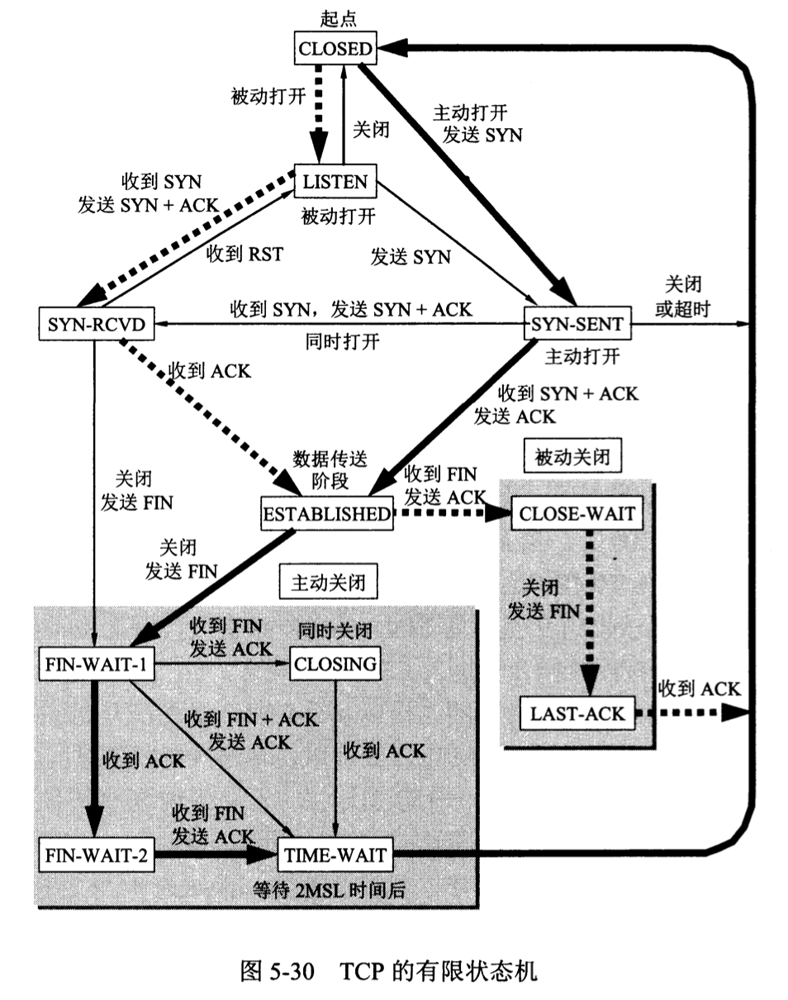

# 计算机网络—传输层学习

## 一.传输层的基本概念

### 1.工作内容

从通信和信息处理的角度看，运输层向它上面的应用层提供通信服务，它**属于面向通信部分的最高层，同时也是用户功能中的最低层。**

 当网络的边缘部分中的两个主机使用网络的核心部分的功能进行端到端的通信时，**只有位于网络边缘部分的主机的协议栈才有运输层**，而网络核心部分中的路由器在转发分组时都只用到下三层的功能。

### 2.**网络层和运输层的不同** 

- 网络层是为主机之间提供逻辑通信
- 运输层为应用进程之间提供端到端的逻辑通信

### 3.运输层的重要功能

在一台主机中经常有**多个应用进程同时分别和另一台主机中的多个应用进程通信。** 这表明运输层有一个很重要的功能—— **复用 (multiplexing)** 和 **分用 (demultiplexing)** 。

+ **复用：**

  在发送方不同的应用程序都可以使用同一个运输层协议传输数据(加上适当的首部)。

+ **分用：**

  接收方的运输层在剥去报文的首部后能够把这些数据正确交付目的应用进程。

### 4. 端口

既然提到了运输层为应用进程之间提供端到端的逻辑通信，那么就要详细说一说端口的概念

网络层中，通信的对象为不同的主机，而从运输层的角度来看**，通信的对象为进程，而端口就代表了进程**

也就是说，通过 ip 找到主机，通过端口找到对应进程

- 端口用一个 16 位端口号进行标志。
- 端口号**只具有本地意义，即端口号只是为了标志本计算机应用层中的各进程。**

由此可见，两个计算机中的进程要互相通信**，不仅必须知道对方的 IP 地址（为了找到对方的计算机），而且还要知道对方的端口号（为了找到对方计算机中的应用进程）**

### 5.屏蔽作用

运输层向高层用户屏蔽了下面网络核心的细节，它使应用进程看见的就是好像在两个运输层实体之间有一条端到端的逻辑通信信道。

### 6.需要学习的主要内容

1. 用户数据报协议UDP
2. 传输控制协议TCP
3. TCP报文段的首部格式
4. 可靠传输的工作原理
5. TCP可靠传输的实现
6. TCP的流量控制
7. TCP的拥塞控制
8. TCP的运输链接管理

---

## 二.用户数据报协议UDP

> UDP 和是TCP的特点：
>
> - 用户数据报协议 UDP（User Datagram Protocol）是无连接的，尽最大可能交付，没有拥塞控制，面向报文（对于应用程序传下来的报文不合并也不拆分，只是添加 UDP 首部），支持一对一、一对多、多对一和多对多的交互通信。
> - 传输控制协议 TCP（Transmission Control Protocol）是面向连接的，提供可靠交付，有流量控制，拥塞控制，提供全双工通信，面向字节流（把应用层传下来的报文看成字节流，把字节流组织成大小不等的数据块），每一条 TCP 连接只能是点对点的（一对一）。

UDP **只在 IP 的数据报服务之上增加了很少一点的功能**：

- **复用和分用的功能**
- **差错检测的功能**

### 1.特点

**① UDP 是无连接的**，发送数据之前不需要建立连接，，因此减少了开销和发送数据之前的时延。

**② UDP 使用尽最大努力交付**，即不保证可靠交付，因此主机不需要维持复杂的连接状态表。

**③ UDP 是面向报文的**。UDP 对应用层交下来的报文，既不合并，也不拆分，而是保留这些报文的边界。UDP 一次交付一个完整的报文。

**④ UDP 没有拥塞控制**，因此网络出现的拥塞不会使源主机的发送速率降低。这对某些实时应用是很重要的。很适合多媒体通信的要求。

**⑤ UDP 支持一对一、一对多、多对一和多对多的交互通信。**

**⑥ UDP 的首部开销小**，只有 8 个字节，比 TCP 的 20 个字节的首部要短。

### 2.UDP是面向报文的

发送方 UDP 对应用程序交下来的报文，在添加首部后就向下交付 IP 层。**UDP 对应用层交下来的报文，既不合并，也不拆分，而是保留这些报文的边界。** **应用层交给 UDP 多长的报文，UDP 就照样发送，即一次发送一个报文。**

**接收方 UDP 对 IP 层交上来的 UDP 用户数据报，在去除首部后就原封不动地交付上层的应用进程，一次交付一个完整的报文。** 应用程序必须选择合适大小的报文。

- 若报文太长，UDP 把它交给 IP 层后，IP 层在传送时可能要进行分片，这会降低 IP 层的效率。
- 若报文太短，UDP 把它交给 IP 层后，会使 IP 数据报的首部的相对长度太大，这也降低了 IP 层的效率。

### 3.UDP首部格式

用户数据报 UDP 有两个字段：**数据字段和首部字段**。首部字段有 8 个字节，由 4 个字段组成，每个字段都是 2 个字节，各字段的含义如下：

- **源端口：**源端口号。在需要对方回信时选用。不需要时可全用0.
- **目的端口：**目的端口号。在终点交付报文时必须使用。
- **长度：**  UDP用户数据报的长度，其最小值为8。
- **检验和：** 检验UDP用户数据报在传输中是否有错。有错就丢弃。

+ 在计算检验和时，临时把 12 字节的**“伪首部”**和 UDP 用户数据报连接在一起。伪首部仅仅是为了计算检验和。

---

## 三.传输控制协议TCP

### 1.特点

- TCP 是**面向连接**的运输层协议，在无连接的、不可靠的 IP 网络服务基础之上提供**可靠交付**的服务。为此，在 IP 的数据报服务基础之上，增加了保证可靠性的一系列措施。

- TCP 是**面向连接的运输层协议。**

- 每一条 TCP 连接只能有**两个端点** (endpoint)，每一条 TCP 连接只能是**点对点**的（一对一）。

- TCP 提供**可靠交付**的服务。

- TCP 提供全双工通信。

- **面向字节流**

  + TCP 中的“流”(stream) 指的是流入或流出进程的字节序列。
  + “面向字节流”的含义是：虽然应用程序和 TCP 的交互是一次一个数据块，但 TCP 把应用程序交下来的数据看成仅仅是一连串无结构的字节流。

  TCP **不保证**接收方应用程序所收到的数据块和发送方应用程序所发出的**数据块具有对应大小的关系**。 但接收方应用程序收到的字节流必须和发送方应用程序发出的**字节流完全一样**。

  

### 2.注意点

- TCP 连接是一条**虚连接**而不是一条真正的物理连接。
- TCP 对应用进程一次把多长的报文发送到 TCP 的缓存中是不关心的。
- TCP 根据对方给出的**窗口值**和当前**网络拥塞的程度**来决定一个报文段应包含多少个字节（UDP 发送的报文长度是应用进程给出的）。
- TCP 可把太长的数据块划分短一些再传送。
- TCP 也可等待积累有足够多的字节后再构成报文段发送出去。

### 4.TCP的链接

在TCP中，面向的既不是IP，又不是端口，**它面向的是套接字**。**TCP 连接的端点叫做套接字 (socket) 或插口。端口号拼接到 (contatenated with) IP 地址即构成了套接字。**

---

## 四.TCP报文段的首部格式

### 1.TCP报文段首部格式图

### 2.各字段的含义

- **源端口和目的端口字段**——各占 2 字节。端口是运输层与应用层的服务接口。运输层的复用和分用功能都要通过端口才能实现。
- **序号字段**——占 4 字节。TCP 连接中传送的数据流中的每一个字节都编上一个序号。序号字段的值则指的是本报文段所发送的数据的第一个字节的序号。
- **确认号字段**——占 4 字节，是期望收到对方的下一个报文段的数据的第一个字节的序号。
- **数据偏移（即首部长度）**——占 4 位，它指出 TCP 报文段的数据起始处距离 TCP 报文段的起始处有多远。“数据偏移”的单位是 32 位字（以 4 字节为计算单位）。
- **保留字段**——占 6 位，保留为今后使用，但目前应置为 0。
- **紧急 URG** —— 当 URG = 1 时，表明紧急指针字段有效。它告诉系统此报文段中有紧急数据，应尽快传送(相当于高优先级的数据)。
- **确认 ACK** —— 只有当 ACK =1 时确认号字段才有效。当 ACK =0 时，确认号无效。
- **推送 PSH (PuSH)** —— 接收 TCP 收到 PSH = 1 的报文段，就尽快地交付接收应用进程，而不再等到整个缓存都填满了后再向上交付。
- **复位 RST (ReSeT)** —— 当 RST=1 时，表明 TCP 连接中出现严重差错（如由于主机崩溃或其他原因），必须释放连接，然后再重新建立运输连接。
- **同步 SYN** —— 同步 SYN = 1 表示这是一个连接请求或连接接受报文。
- **终止 FIN (FINish)** —— 用来释放一个连接。FIN=1 表明此报文段的发送端的数据已发送完毕，并要求释放运输连接。
- **终止 FIN (FINish)** —— 用来释放一个连接。FIN=1 表明此报文段的发送端的数据已发送完毕，并要求释放运输连接。
- **检验和** —— 占 2 字节。检验和字段检验的范围包括首部和数据这两部分。在计算检验和时，要在 TCP 报文段的前面加上 12 字节的伪首部。
- **紧急指针字段** —— 占 16 位，指出在本报文段中紧急数据共有多少个字节（紧急数据放在本报文段数据的最前面）。
- **选项字段** —— 长度可变。TCP 最初只规定了一种选项，即最大报文段长度 MSS。MSS 告诉对方 TCP：“我的缓存所能接收的报文段的数据字段的最大长度是 MSS 个字节。”

> MSS 与接收窗口值没有关系。 若选择较小的 MSS 长度，网络的利用率就降低。 若 TCP 报文段非常长，那么在 IP 层传输时就有可能要分解成多个短数据报片。在终点要把收到的各个短数据报片装配成原来的 TCP 报文段。当传输出错时还要进行重传。这些也都会使开销增大。 因此，MSS 应尽可能大些，只要在 IP 层传输时不需要再分片就行。 但最佳的 MSS 是很难确定的。

---

## 五.可靠传输的工作原理

理想的传输条件有以下两个特点：

- 传输信道不产生差错。
- 不管发送方以多快的速度发送数据，接收方总是来得及处理收到的数据。

然而实际的网络都不具备以上两个理想条件**。必须使用一些可靠传输协议，在不可靠的传输信道实现可靠传输。**

那么在TCP中就有两种方式来实现可靠传输了

- **停止等待协议**
- **连续 ARQ 协议**

### 1.停止等待协议

**“停止等待”就是每发送完一个分组就停止发送，等待对方的确认。在收到确认后再发送下一个分组。**

停止等待协议有两种情况：**① 无差错情况** 、**② 出现差错情况**

**① 无差错情况**

 **②出现差错情况**

在接收方 B 会出现两种情况：

- **B 接收 M1 时检测出了差错**，就丢弃 M1，其他什么也不做（不通知 A 收到有差错的分组）。
- **M1 在传输过程中丢失了**，这时 B 当然什么都不知道，也什么都不做。

在这两种情况下，**B 都不会发送任何信息。** 但**A都必须重发分组**，直到B正确接收为止，这样才能实现可靠通信。

**问题**：A如何知道 B 是否正确收到了 M1 呢？ **解决方法**：超时重传

- A 为每一个已发送的分组都设置了一个超时计时器。
- A 只要在超时计时器到期之前收到了相应的确认，就撤销该超时计时器，继续发送下一个分组 M2 。
- 若A在超时计时器规定时间内没有收到B的确认，就认为分组错误或丢失，就重发该分组。

**问题**：若分组正确到达B，但B回送的确认丢失或延迟了，A未收到B的确认，会超时重发。B 可能会收到重复的 M1 。B如何知道收到了重复的分组，需要丢弃呢？ **解决方法**：编号

- A为每一个发送的分组都进行编号。若B收到了编号相同的分组，则认为收到了重复分组，丢弃重复的分组，并回送确认。
- B为发送的确认也进行编号，指示该确认是对哪一个分组的确认。
- A根据确认及其编号，可以确定它是对哪一个分组的确认，避免重发发送。若为重复的确认，则将其丢弃。

注意：

- **在发送完一个分组后，必须暂时保留已发送的分组的副本，以备重发。**
- **分组和确认分组都必须进行编号。**
- 超时计时器的重传时间应当比数据在分组传输的平均往返时间更长一些。

通常 A 最终总是可以收到对所有发出的分组的确认。如果 A 不断重传分组但总是收不到确认，就说明通信线路太差，不能进行通信。

使用上述的确认和重传机制，我们就可以在不可靠的传输网络上实现可靠的通信。

像上述的这种可靠传输协议常称为自动重传请求 ARQ  (Automatic Repeat reQuest)。意思是重传的请求是自动进行的，接收方不需要请求发送方重传某个出错的分组。

**为了提高传输效率，发送方可以不使用低效率的停止等待协议，而是采用流水线传输。**

> 流水线传输就是发送方可连续发送多个分组，不必每发完一个分组就停顿下来等待对方的确认。这样可使信道上一直有数据不间断地传送。

### 2.连续 ARQ 协议

- 发送方维持的发送窗口，它的意义是：**位于发送窗口内的分组都可连续发送出去，而不需要等待对方的确认。这样，信道利用率就提高了。**
- **连续 ARQ 协议规定，发送方每收到一个确认，就把发送窗口向前滑动一个分组的位置。**

即不必对收到的分组逐个发送确认，**而是对按序到达的最后一个分组发送确认，这样就表示：到这个分组为止的所有分组都已正确收到了。**

优点：**容易实现，即使确认丢失也不必重传。** 缺点：**不能向发送方反映出接收方已经正确收到的所有分组的信息。**

如果发送方发送了前 5 个分组，**而中间的第 3 个分组丢失了**。这时接收方只能对前两个分组发出确认**。发送方无法知道后面三个分组的下落，而只好把后面的三个分组都再重传一次。** 这就叫做 Go-back-N（回退 N），**表示需要再退回来重传已发送过的 N 个分组。**

---

## 六.TCP可靠传输的实现

TCP为了提供可靠传输：

（1）首先，采用三次握手来建立TCP连接，四次握手来释放TCP连接，从而保证建立的传输信道是可靠的。

（2）其次，TCP采用了连续ARQ协议（回退N，Go-back-N；超时自动重传）来保证数据传输的正确性，使用滑动窗口协议来保证接方能够及时处理所接收到的数据，进行流量控制。

（3）最后，TCP使用慢开始、拥塞避免、快重传和快恢复来进行拥塞控制，避免网络拥塞。

---

## 七.TCP的流量控制

TCP利用滑动窗口实现流量控制。

+ 窗口是缓存的一部分，用来暂时存放字节流。发送方和接收方各有一个窗口，接收方通过 TCP 报文段中的窗口字段告诉发送方自己的窗口大小，发送方根据这个值和其它信息设置自己的窗口大小。

+ 发送窗口内的字节都允许被发送，接收窗口内的字节都允许被接收。如果发送窗口左部的字节已经发送并且收到了确认，那么就将发送窗口向右滑动一定距离，直到左部第一个字节不是已发送并且已确认的状态；接收窗口的滑动类似，接收窗口左部字节已经发送确认并交付主机，就向右滑动接收窗口。

+ 接收窗口只会对窗口内最后一个按序到达的字节进行确认，例如接收窗口已经收到的字节为 {31, 34, 35}，其中 {31} 按序到达，而 {34, 35} 就不是，因此只对字节 31 进行确认。发送方得到一个字节的确认之后，就知道这个字节之前的所有字节都已经被接收。

---

## 八.TCP的拥塞控制

如果网络出现拥塞，分组将会丢失，此时发送方会继续重传，从而导致网络拥塞程度更高。因此当出现拥塞时，应当控制发送方的速率。这一点和流量控制很像，但是出发点不同。流量控制是为了让接收方能来得及接收，而拥塞控制是为了降低整个网络的拥塞程度。

TCP 主要通过四个算法来进行拥塞控制： **慢开始、拥塞避免、快重传、快恢复。**

发送方需要维护一个叫做拥塞窗口（cwnd）的状态变量，注意拥塞窗口与发送方窗口的区别：拥塞窗口只是一个状态变量，实际决定发送方能发送多少数据的是发送方窗口。

为了便于讨论，做如下假设：

- 接收方有足够大的接收缓存，因此不会发生流量控制；
- 虽然 TCP 的窗口基于字节，但是这里设窗口的大小单位为报文段。

### 1. 慢开始与拥塞避免

发送的最初执行慢开始，令 cwnd = 1，发送方只能发送 1 个报文段；当收到确认后，将 cwnd 加倍，因此之后发送方能够发送的报文段数量为：2、4、8 ...

注意到慢开始每个轮次都将 cwnd 加倍，这样会让 cwnd 增长速度非常快，从而使得发送方发送的速度增长速度过快，网络拥塞的可能性也就更高。设置一个慢开始门限 ssthresh，当 cwnd >= ssthresh 时，进入拥塞避免，每个轮次只将 cwnd 加 1。

如果出现了超时，则令 ssthresh = cwnd / 2，然后重新执行慢开始。

### 2.快重传与快恢复

在接收方，要求每次接收到报文段都应该对最后一个已收到的有序报文段进行确认。例如已经接收到 M1 和 M2，此时收到 M4，应当发送对 M2 的确认。

在发送方，如果收到三个重复确认，那么可以知道下一个报文段丢失，此时执行快重传，立即重传下一个报文段。例如收到三个 M2，则 M3 丢失，立即重传 M3。

在这种情况下，只是丢失个别报文段，而不是网络拥塞。因此执行快恢复，令 ssthresh = cwnd / 2 ，cwnd = ssthresh，注意到此时直接进入拥塞避免。

慢开始和快恢复的快慢指的是 cwnd 的设定值，而不是 cwnd 的增长速率。慢开始 cwnd 设定为 1，而快恢复 cwnd 设定为 ssthresh。

---

## 九.TCP的运输链接管理

TCP是面向连接的协议，运输过程有三个阶段：连接建立，数据传送，连接释放。运输连接的管理就是使运输连接的建立和释放都能正常的运行。

在TCP连接建立过程中要解决以下三个问题：

+ 要使每一方都能够确知对方的存在。
+ 要允许双方协商一些参数(如最大窗口值，是否使用窗口扩大选项和时间戳选项以及服务质量等)。
+ 能够对运输实体资源(如缓存大小，连接表中的项目等)进行分配。

TCP连接的建立采用客户服务器方式。主动发起连接建立的应用进程叫做客户，而被动等待连接建立的应用进程叫做服务器。

### 1.TCP 的链接建立

假设 A 为客户端，B 为服务器端。

- 首先 B 的TCP服务器创建传输控制块TCB，准备接受客户进程的连接请求。服务器进程处于 LISTEN（监听）状态，等待客户的连接请求。
- A 的TCP客户进程也是首先创建传输控制模块TCB。然后在打算建立TCP连接时，向 B 发送连接请求报文，首部中的同步位SYN=1，同时选择一个初始的序号 x。TCP规定，SYN报文段不能懈怠数据，但要消耗一个序号。这时TCP客户进程进入SYN-SENT(同步已发送)状态。
- B 收到连接请求报文，如果同意建立连接，则向 A 发送连接确认报文，在确认报文段中应把 SYN=1，ACK=1，确认号为 x+1，同时也选择一个初始的序号 seq = y。这个报文段也不能携带数据，用样要消耗一个序号。这时TCP服务器进程进入SYN-RCVD(同步收到)状态。
- A 收到 B 的连接确认报文后，还要向 B 发出确认，确认报文段的ACK位置置为1，确认号为 ack = y+1，而自己的序号为 seq = x+1。TCP规定，ACK报文段可以携带数据。但如果不携带数据则不消耗序号，这种情况下，下一个数据报的需要仍为 seq = x+1。这时TCP建立已经建立，A进入状态。
- B 收到 A 的确认后，也进入ESTABLISHED状态，连接建立。

#### **三次握手的原因**

第三次握手是为了防止失效的连接请求到达服务器，让服务器错误打开连接。

客户端发送的连接请求如果在网络中滞留，那么就会隔很长一段时间才能收到服务器端发回的连接确认。客户端等待一个超时重传时间之后，就会重新请求连接。但是这个滞留的连接请求最后还是会到达服务器，如果不进行三次握手，那么服务器就会打开两个连接。如果有第三次握手，客户端会忽略服务器之后发送的对滞留连接请求的连接确认，不进行第三次握手，因此就不会再次打开连接。

#### **为什么要采用三次握手，而不是两次握手** 

这主要是为了防止已失效的连接请求报文段突然又传送到服务器，产生错误。

已失效的连接请求报文段的产生原因：当客户A发送连接请求，但因连接请求报文丢失而未收到确认。于是A会再次重传一次连接请求，此时服务器端B收到再次重传的连接请求，建立了连接，然后进行数据传输，数据传输完了后，就释放了此连接。假设A第一次发送的连接请求并没有丢失，而是在网络结点中滞留了太长时间，以致在AB通信完后，才到达B。此时这个连接请求其实已经是被A认为丢失的了。如果不进行第三次握手，那么服务器B可能在收到这个已失效的连接请求后，进行确认，然后单方面进入ESTABLISHED状态，而A此时并不会对B的确认进行理睬，这样就白白的浪费了服务器的资源。

### 2.TCP 的连接释放

以下描述不讨论序号和确认号，因为序号和确认号的规则比较简单。并且不讨论 ACK，因为 ACK 在连接建立之后都为 1。

- 第一次挥手：A的应用进程先向其TCP发出连接释放报文段（FIN=1，序号seq=u），并停止再发送数据，主动关闭TCP连接，进入FIN-WAIT-1（终止等待1）状态，等待B的确认。
- 第二次挥手：B收到连接释放报文段后即发出确认报文段，（ACK=1，确认号ack=u+1，序号seq=v），B进入CLOSE-WAIT（关闭等待）状态，此时的TCP处于半关闭状态，A到B的连接释放。
- A收到B的确认后，进入FIN-WAIT-2（终止等待2）状态，等待B发出的连接释放报文段。
- 第三次挥手：B没有要向A发出的数据，B发出连接释放报文段（FIN=1，ACK=1，序号seq=w，确认号ack=u+1），B进入LAST-ACK（最后确认）状态，等待A的确认。
- 第四次挥手：A收到B的连接释放报文段后，对此发出确认报文段（ACK=1，seq=u+1，ack=w+1），A进入TIME-WAIT（时间等待）状态。此时TCP未释放掉，需要经过时间等待计时器设置的时间2MSL后，A才进入CLOSED状态。

#### **四次挥手的原因**

客户端发送了 FIN 连接释放报文之后，服务器收到了这个报文，就进入了 CLOSE-WAIT 状态。这个状态是为了让服务器端发送还未传送完毕的数据，传送完毕之后，服务器会发送 FIN 连接释放报文。

#### **挥手为什么需要四次?** 

**第一种回答**

因为当服务端收到客户端的SYN连接请求报文后，可以直接发送SYN+ACK报文。其中ACK报文是用来应 答的，SYN报文是用来同步的。但是关闭连接时，当服务端收到FIN报文时，很可能并不会立即关闭 SOCKET，所以只能先回复一个ACK报文，告诉客户端，"你发的FIN报文我收到了"。只有等到我服务端 所有的报文都发送完了，我才能发送FIN报文，因此不能一起发送。故需要四次挥手。

**第二种回答**

任何一方都可以在数据传送结束后发出连接释放的通知，待对方确认后进入半关闭状态。当另一方也没 有数据再发送的时候，则发出连接释放通知，对方确认后就完全关闭了TCP连接。举个例子:A 和 B 打 电话，通话即将结束后，A 说“我没啥要说的了”，B回答“我知道了”，但是 B 可能还会有要说的话，A 不 能要求 B 跟着自己的节奏结束通话，于是 B 可能又巴拉巴拉说了一通，最后 B 说“我说完了”，A 回答 “知道了”，这样通话才算结束。

#### **TIME_WAIT**

客户端接收到服务器端的 FIN 报文后进入此状态，此时并不是直接进入 CLOSED 状态，还需要等待一个时间计时器设置的时间 2MSL。这么做有两个理由：

- 确保最后一个确认报文能够到达。如果 B 没收到 A 发送来的确认报文，那么就会重新发送连接释放请求报文，A 等待一段时间就是为了处理这种情况的发生。
- 等待一段时间是为了让本连接持续时间内所产生的所有报文都从网络中消失，使得下一个新的连接不会出现旧的连接请求报文。

### 3.TCP的有限状态机

