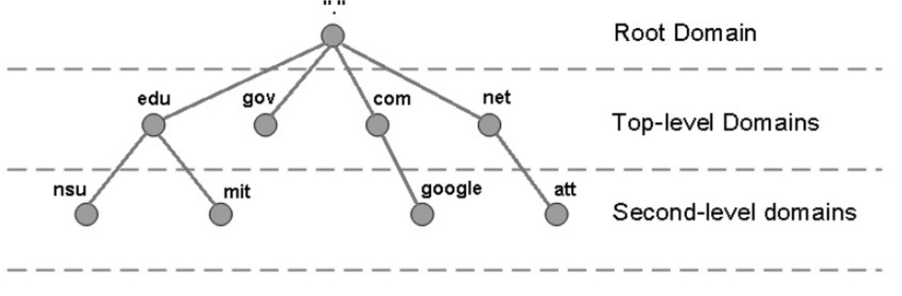
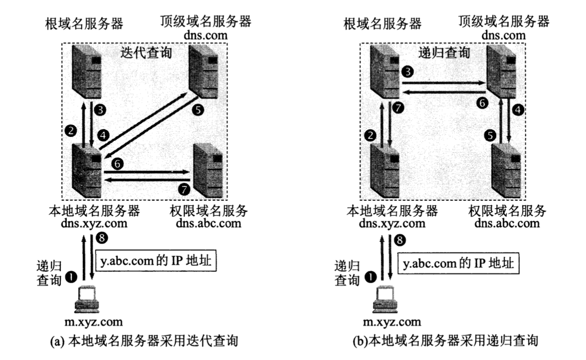
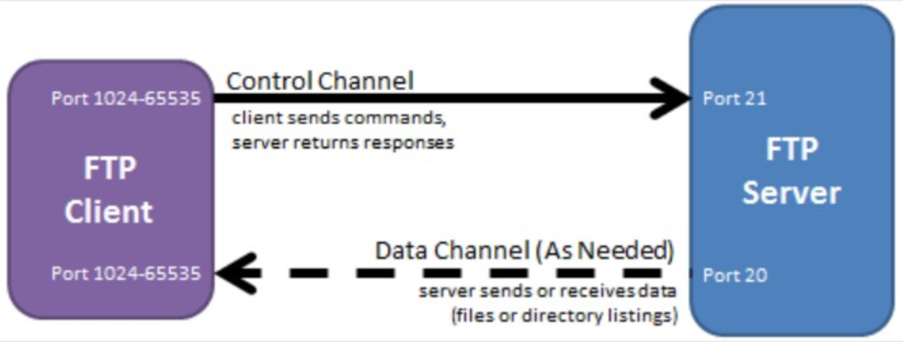
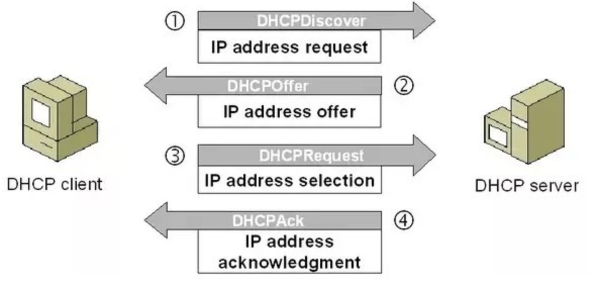

# 计算机网络—应用层学习

## 一.应用层的基本概念

### 1.工作内容

前面的都是讨论计算机网络提供通信服务的过程，这部分是讨论这些通信服务是如何提供给应用进程来使用的，以及各种应用进程通过什么样的应用层协议来使用网络所提供的这些通信服务。

运输层为应用进程提供了端到端的通信服务。但不同的网络应用的应用进程之间，还需要有不同的通信规则。因此在运输层协议之上，还需要有应用层协议。因为每一个应用层协议都是为了解决某一类应用问题，而问题的解决又必须通过位于不同主机中的多个应用进程之间的通信和协同工作来完成。应用进程之间的这种通信必须遵循严格的规则。应用层的具体内容就是精确定义这些通信规则。

具体来说，应用层协议应当定义：

+ 应用进程交换的报文协议，如请求报文与响应报文。
+ 各种报文类型的语法，如报文中的各字段及其详细描述。
+ 字段的语义，即包含在字段中的信息的含义。
+ 进程何时，如何发送报文，以及对报文进行响应的规则。

### 2.需要学习的主要内容

1. 域名系统DNS
2. 文件传输协议
3. 远层终端协议
4. 超文本传输协议HTTP
5. 动态主机配置协议DHCP
6. Web页面请求过程

---

## 二.域名系统DNS

### 1.域名系统概述

DNS 是一个分布式数据库，提供了主机名和 IP 地址之间相互转换的服务。这里的分布式数据库是指，每个站点只保留它自己的那部分数据。

域名具有层次结构，从上到下依次为：根域名、顶级域名、二级域名。

DNS 可以使用 UDP 或者 TCP 进行传输，使用的端口号都为 53。大多数情况下 DNS 使用 UDP 进行传输，这就要求域名解析器和域名服务器都必须自己处理超时和重传从而保证可靠性。在两种情况下会使用 TCP 进行传输：

- 如果返回的响应超过的 512 字节（UDP 最大只支持 512 字节的数据）。
- 区域传送（区域传送是主域名服务器向辅助域名服务器传送变化的那部分数据）。

### 2.域名解析系统

**主机向本地域名服务器的查询一般都是采用递归查询**。如果主机所询问的本地域名服务器不知道被查询域名的 IP 地址，那么本地域名服务器就以 DNS 客户的身份，向其他根域名服务器继续发出查询请求报文。

**本地域名服务器向根域名服务器的查询通常是采用迭代查询**。当根域名服务器收到本地域名服务器的迭代查询请求报文时，要么给出所要查询的 IP 地址，要么告诉本地域名服务器：“你下一步应当向哪一个域名服务器进行查询”。然后让本地域名服务器进行后续的查询。

---

## 三.文件传输协议

### 1. 概述

**文件传送协议 FTP** (File Transfer Protocol) 是互联网上使用得最广泛的文件传送协议。

**FTP 提供交互式的访问，允许客户指明文件的类型与格式，并允许文件具有存取权限。**

FTP 屏蔽了各计算机系统的细节，因而适合于在异构网络中任意计算机之间传送文件。

### 2. 工作

FTP 使用 TCP 进行连接，它需要两个连接来传送一个文件：

- 控制连接：服务器打开端口号 21 等待客户端的连接，客户端主动建立连接后，使用这个连接将客户端的命令传送给服务器，并传回服务器的应答。
- 数据连接：用来传送一个文件数据。

根据数据连接是否是服务器端主动建立，FTP 有主动和被动两种模式：

- 主动模式：服务器端主动建立数据连接，其中服务器端的端口号为 20，客户端的端口号随机，但是必须大于 1024，因为 0~1023 是熟知端口号。

- 被动模式：客户端主动建立数据连接，其中客户端的端口号由客户端自己指定，服务器端的端口号随机。

---

## 四.远层终端协议

- TELNET 是一个简单的远程终端协议，也是互联网的正式标准。
- 用户用 TELNET 就可在其所在地通过 TCP 连接注册（即登录）到远地的另一个主机上（使用主机名或 IP 地址）。
- TELNET 能将用户的击键传到远地主机，同时也能将远地主机的输出通过 TCP 连接返回到用户屏幕。这种服务是透明的，因为用户感觉到好像键盘和显示器是直接连在远地主机上。

> 现在由于 PC 的功能越来越强，用户已较少使用 TELNET 了。 TELNET 也使用客户服务器方式。在本地系统运行 TELNET 客户进程，而在远地主机则运行 TELNET 服务器进程。 和 FTP 的情况相似，服务器中的主进程等待新的请求，并产生从属进程来处理每一个连接。

---

## 五.超文本传输协议HTTP

> HTTP (HyperText Transfer Protocol) 超文本传输协议，它是一个简单的请求-响应协议 ，它指定了客户端可能发送给服务器什么样的消息以及得到什么样的响应 ，所有的WWW文件都遵循这个标准，它是TCP/IP中的一个应用层协议

### 1.怎么理解 HTTP 协议呢？

当我们在浏览器地址栏上输入URL后，浏览器会通过DNS解析到对应IP上，浏览器而根据这个IP将IP地址与Web服务器进行通信，这个通信的协议就是HTTP协议，说白了，HTTP协议就是规定了客户端和服务器端之间通讯的一种规范和格式，只有两者都遵循这个协议，两者在接受和响应请求的时候才能达到一致.

统一资源定位符：

 <协议>:// <主机> : <端口> / <路径> 

### 2.HTTP请求

浏览器向服务器请求某个web资源，称浏览器向服务器发送了一个http请求（客户端 --> 服务器）

**请求格式：**

1、请求首行

2、请求头

3、空行

4、请求体（或称之为请求正文）

#### **(1) 请求行**

常见的请求方法有**GET和POST**

在浏览器**地址栏中发送请求**，以及**点击超链接**都是**GET**请求

**提交表单**既可以使用GET，也可以使用POST方式，**推荐使用POST方式**，**查询数据的时候推荐使用GET方式**

GET：没有请求体，但空行是存在的，附带的参数有限制，数据容量不能超过1k

POST：存在请求体，可以在请求的实体内容中向服务器发送数据，传送的数据量是无限制的

#### **(2) 请求头**

- Accept-Charset: ISO-8859-1 ：客户端告诉服务器，所支持的字符集格式
- Accept-Encoding: gzip,deflate,br ：客户端告诉服务器，所支持的压缩格式
- Accept-Language: en-us,zh-cn ：客户端告诉服务器，它的语言环境
- Connection: close/Keep-Alive ：客户端告诉服务器，请求完后是断开链接或保持链接
- Cookie ：客户端告诉服务器，所带来的的cookie（后面讲）
- Host:xxxxxx ：客户端告诉服务器，想访问哪台主机
- User-Agent ：User-Agent: Mozilla/5.0 (Windows NT 10.0; Win64; x64) AppleWebKit/537.36 (KHTML, like Gecko) Chrome/74.0.3729.131 Safari/537.36：表示浏览器内核
- Referer ：xxxxx：客户端告诉服务器，客户机从哪个页面来的，防盗链，前发出请求的地址，例如在浏览器地址栏直接访问服务器，那么没有这个请求头。如果是在`www.baidu.com`页面上点击链接访问的服务器，那么这个头的值`www.baidu.com`
- Content-Type：如果是POST请求，会有这个头，默认值为application/x-www-form-urlencoded，表示请求体内容使用url编码

---

## 六.动态主机配置协议DHCP

DHCP (Dynamic Host Configuration Protocol) 提供了即插即用的连网方式，用户不再需要手动配置 IP 地址等信息。

DHCP 配置的内容不仅是 IP 地址，还包括子网掩码、网关 IP 地址。

DHCP 工作过程如下：

1. 客户端发送 Discover 报文，该报文的目的地址为 255.255.255.255:67，源地址为 0.0.0.0:68，被放入 UDP 中，该报文被广播到同一个子网的所有主机上。如果客户端和 DHCP 服务器不在同一个子网，就需要使用中继代理。
2. DHCP 服务器收到 Discover 报文之后，发送 Offer 报文给客户端，该报文包含了客户端所需要的信息。因为客户端可能收到多个 DHCP 服务器提供的信息，因此客户端需要进行选择。
3. 如果客户端选择了某个 DHCP 服务器提供的信息，那么就发送 Request 报文给该 DHCP 服务器。
4. DHCP 服务器发送 Ack 报文，表示客户端此时可以使用提供给它的信息。

---

## 七.Web页面请求过程

### 1. DHCP 配置主机信息

- 假设主机最开始没有 IP 地址以及其它信息，那么就需要先使用 DHCP 来获取。
- 主机生成一个 DHCP 请求报文，并将这个报文放入具有目的端口 67 和源端口 68 的 UDP 报文段中。
- 该报文段则被放入在一个具有广播 IP 目的地址(255.255.255.255) 和源 IP 地址（0.0.0.0）的 IP 数据报中。
- 该数据报则被放置在 MAC 帧中，该帧具有目的地址 FF:FF:FF:FF:FF:FF，将广播到与交换机连接的所有设备。
- 连接在交换机的 DHCP 服务器收到广播帧之后，不断地向上分解得到 IP 数据报、UDP 报文段、DHCP 请求报文，之后生成 DHCP ACK 报文，该报文包含以下信息：IP 地址、DNS 服务器的 IP 地址、默认网关路由器的 IP 地址和子网掩码。该报文被放入 UDP 报文段中，UDP 报文段有被放入 IP 数据报中，最后放入 MAC 帧中。
- 该帧的目的地址是请求主机的 MAC 地址，因为交换机具有自学习能力，之前主机发送了广播帧之后就记录了 MAC 地址到其转发接口的交换表项，因此现在交换机就可以直接知道应该向哪个接口发送该帧。
- 主机收到该帧后，不断分解得到 DHCP 报文。之后就配置它的 IP 地址、子网掩码和 DNS 服务器的 IP 地址，并在其 IP 转发表中安装默认网关。

### 2.ARP 解析 MAC 地址

- 主机通过浏览器生成一个 TCP 套接字，套接字向 HTTP 服务器发送 HTTP 请求。为了生成该套接字，主机需要知道网站的域名对应的 IP 地址。
- 主机生成一个 DNS 查询报文，该报文具有 53 号端口，因为 DNS 服务器的端口号是 53。
- 该 DNS 查询报文被放入目的地址为 DNS 服务器 IP 地址的 IP 数据报中。
- 该 IP 数据报被放入一个以太网帧中，该帧将发送到网关路由器。
- DHCP 过程只知道网关路由器的 IP 地址，为了获取网关路由器的 MAC 地址，需要使用 ARP 协议。
- 主机生成一个包含目的地址为网关路由器 IP 地址的 ARP 查询报文，将该 ARP 查询报文放入一个具有广播目的地址（FF:FF:FF:FF:FF:FF）的以太网帧中，并向交换机发送该以太网帧，交换机将该帧转发给所有的连接设备，包括网关路由器。
- 网关路由器接收到该帧后，不断向上分解得到 ARP 报文，发现其中的 IP 地址与其接口的 IP 地址匹配，因此就发送一个 ARP 回答报文，包含了它的 MAC 地址，发回给主机。

### 3.DNS 解析域名

- 知道了网关路由器的 MAC 地址之后，就可以继续 DNS 的解析过程了。
- 网关路由器接收到包含 DNS 查询报文的以太网帧后，抽取出 IP 数据报，并根据转发表决定该 IP 数据报应该转发的路由器。
- 因为路由器具有内部网关协议（RIP、OSPF）和外部网关协议（BGP）这两种路由选择协议，因此路由表中已经配置了网关路由器到达 DNS 服务器的路由表项。
- 到达 DNS 服务器之后，DNS 服务器抽取出 DNS 查询报文，并在 DNS 数据库中查找待解析的域名。
- 找到 DNS 记录之后，发送 DNS 回答报文，将该回答报文放入 UDP 报文段中，然后放入 IP 数据报中，通过路由器反向转发回网关路由器，并经过以太网交换机到达主机。

### 4. HTTP 请求页面

- 有了 HTTP 服务器的 IP 地址之后，主机就能够生成 TCP 套接字，该套接字将用于向 Web 服务器发送 HTTP GET 报文。
- 在生成 TCP 套接字之前，必须先与 HTTP 服务器进行三次握手来建立连接。生成一个具有目的端口 80 的 TCP SYN 报文段，并向 HTTP 服务器发送该报文段。
- HTTP 服务器收到该报文段之后，生成 TCP SYN ACK 报文段，发回给主机。
- 连接建立之后，浏览器生成 HTTP GET 报文，并交付给 HTTP 服务器。
- HTTP 服务器从 TCP 套接字读取 HTTP GET 报文，生成一个 HTTP 响应报文，将 Web 页面内容放入报文主体中，发回给主机。
- 浏览器收到 HTTP 响应报文后，抽取出 Web 页面内容，之后进行渲染，显示 Web 页面。