# 计算机网络—数据链路层学习

## 一.数据链路层的基本概念

### 1.工作内容

数据链路层在物理层提供服务的基础上向网络层提供服务，其主要作用是 **加强物理层传输原始比特流的功能，将物理层提供的可能出错的物理连接改造成为逻辑上无差错的数据链路，使之对网络层表现为一条无差错的链路。**

数据链路层属于计算机网络的低层，数据链路层使用的信道主要有以下两种类型：

- **点对点信道**。这种信道使用**一对一**的点对点通信方式。
- **广播信道**。这种信道使用**一对多的广播通信方式**，因此过程比较复杂。广播信道上连接的主机很多，因此必须**使用专用的共享信道协议来协调这些主机的数据发送**。

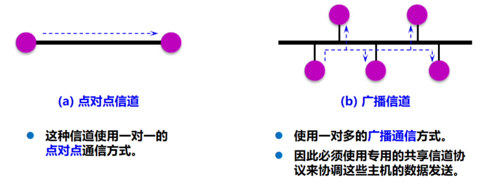

当我们专心研究数据链路层找那个的问题的时候，在许多情况下我们可以**只关心在协议栈中水平方向的各数据链路层**，于是当主机 H1 向主机 H2 发送数据的时候，我们可以**想象数据就是在数据链路层中从左向右沿着水平方法传送的**

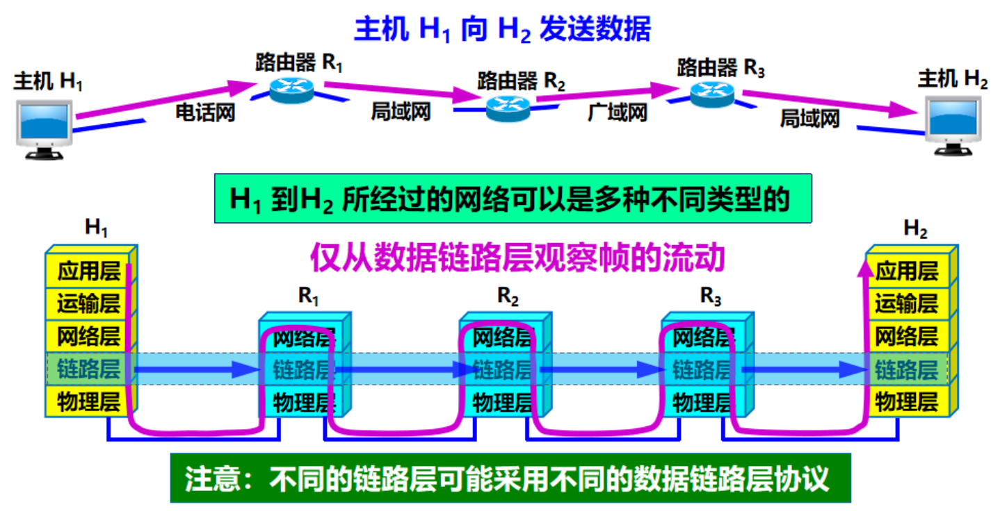

### 2.需要学习的主要内容

1. 数据链路层的点对点信道和广播信道的特点，以及这两中信道所使用的协议(PPP协议以及CSMA/CD协议)的特点。
2. 数据链路层的三个基本问题：封装成帧，透明传输，差错控制。
3. 以太网MAC层的硬件地址

---

## 二.使用点对点信道的数据链路层

### 1.数据链路与帧

#### (1).链路

**链路**：一个节点到相邻节点的一段物理路线，而中间任何其他的交换节点

- 在数据通信的时候，两台计算机之间的通信路径往往要经过许多段这样的链路，可见链路只是一条路径的组成部分

#### (2).数据链路

**数据链路 (data link)**：**除了物理线路外，还必须有通信协议来控制这些数据的传输**。若把实现这些协议的硬件和软件加到链路上，就构成了数据链路

- 现在最常用的方法是使用适配器（即网卡）来实现这些协议的硬件和软件
- **一般的适配器都包括了数据链路层和物理层这两层的功能**

也有人采用另外的术语。这就是把**链路分为物理链路和逻辑链路**

- 物理链路就是上面所说的链路
- 逻辑链路就是上面的数据链路，是物理链路加上必要的通信协议

#### (3).帧

**数据链路层传送的是帧**

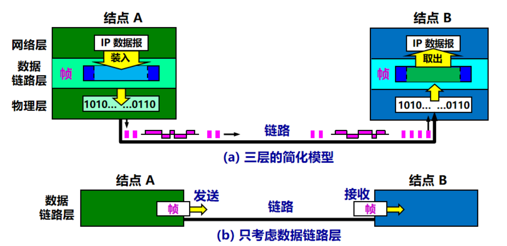

**点对点信道的数据链路层在进行通信时的主要步骤如下：**

+ 结点A的数据链路层把网络层交下来的IP数据报添加首部和尾部封装成帧。
+ 结点A把封装好的帧发送给结点B的链路层。
+ 若结点B的数据链路层收到的帧无差错，则从收到的帧中提取出IP数据报交给上面的网络层；否则丢弃这个帧。

### 2.三个基本问题

#### (1).封装成帧

**封装成帧 (framing) 就是在一段数据的前后分别添加首部和尾部，然后就构成了一个帧**

首部和尾部的一个重要作用就是进行**帧定界**

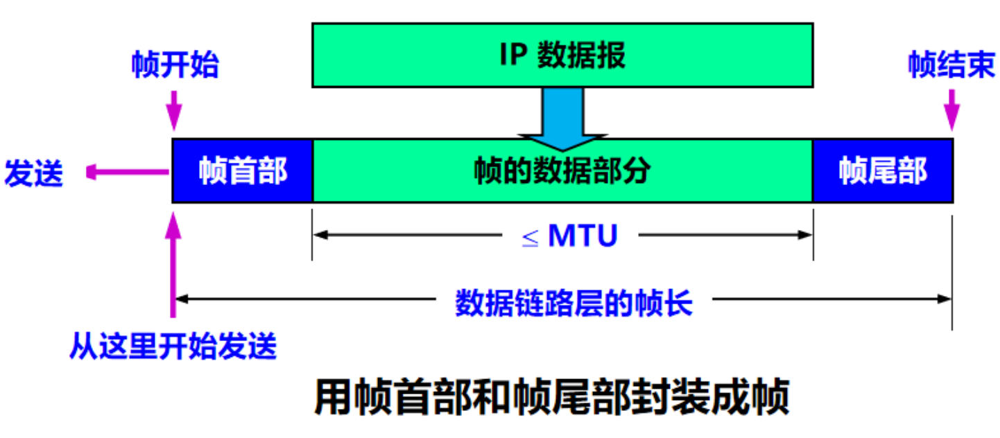

当数据是由可打印的 ASCII 码组成的文本文件时，帧定界可以使用特殊的帧定界符

控制字符 SOH (Start Of Header) 放在一帧的最前面，表示帧的首部开始。另一个控制字符 EOT (End Of Transmission) 表示帧的结束

> ASCII 码是7位编码，一共可以组成128个不同的 ASCII 码，其中可打印的有95个，不可打印的有33个，请注意，SOH 和 EOT     都是控制字符的名称，他们的十六进制编码分别为 01（二进制是 00000001）和 04（00000100）SOH（或 EOT） 并不是 S，O，H （或 E，O，T）三个字符

#### (2).透明传输

如果数据中的某个字节的二进制代码恰好和 SOH 或 EOT 一样，数据链路层就会错误地“找到帧的边界”

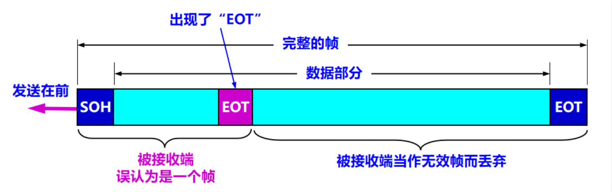

**解决方法：字节填充 (byte stuffing) 或字符填充 (character stuffing)**

- 发送端的数据链路层在数据中出现控制字符“SOH”或“EOT”的前面插入一个转义字符“ESC”（其十六进制编码是1B）
- 接收端的数据链路层在将数据送往网络层之前删除插入的转义字符
- 如果转义字符也出现在数据当中，那么应在转义字符前面插入一个转义字符 ESC。当接收端收到连续的两个转义字符时，就删除其中前面的一个

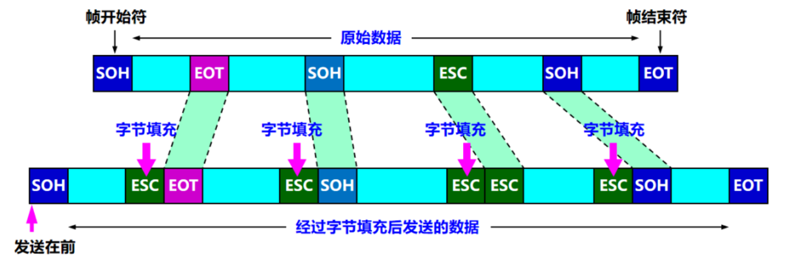

#### (3).差错控制

在传输过程中可能会产生比特差错：1 可能会变成 0， 而 0 也可能变成 1

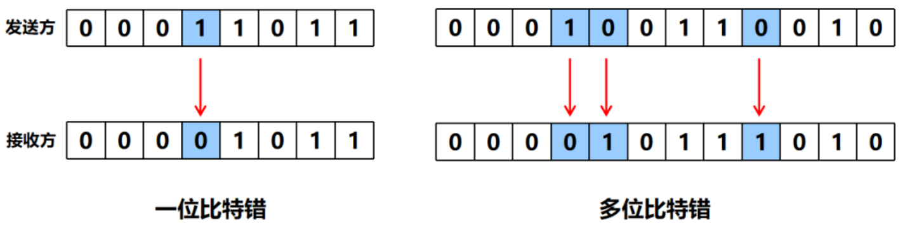

**纠错方法：循环冗余检验**

在数据链路层传送的帧中，广泛**使用了循环冗余检验 CRC 的检错技术**

在发送端，先把数据划分为组。假定每组 k 个比特

在每组 M（待传送数据） 后面再添加供差错检测用的 n 位冗余码，然后一起发送出去

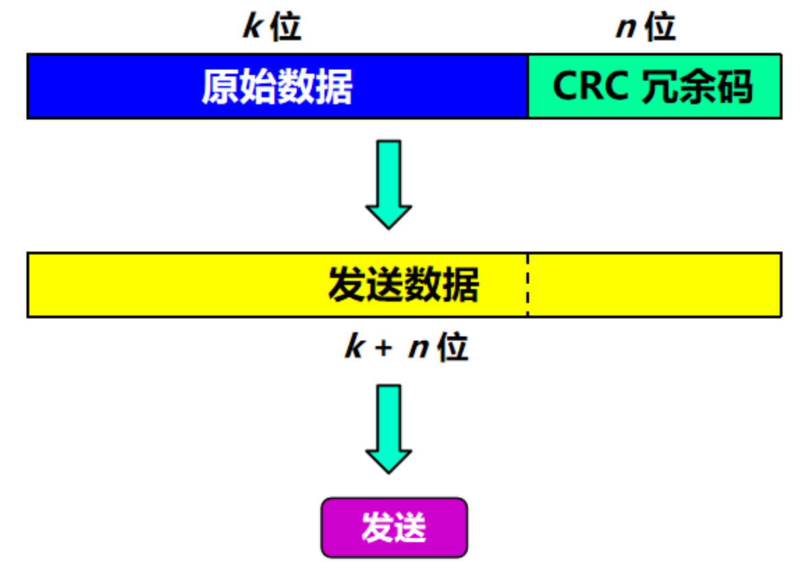

**冗余码如何计算：**

- 用二进制的模 2 运算进行 2^n 乘 M 的运算，这相当于在 M 后面添加 n 个 0
- 得到的 (k + n) 位的数除以事先选定好的长度为 (n + 1) 位的除数 P，得出商是 Q 而余数是 R，余数 R 除数 P 少 1 位，即 R 是 n 位
- 将余数 R 作为冗余码拼接在数据 M 后面，一起发送出去

**举例：**

现在 k = 6, M = 101001

设 n = 3, 除数 P = 1101

被除数是 2^nM = 101001000

模 2 运算的结果是：商 Q = 110101，余数 R = 001

把余数 R 作为冗余码添加在数据 M 的后面发送出去。发送的数据是：2nM + R，即：101001001，共 (k + n) 位

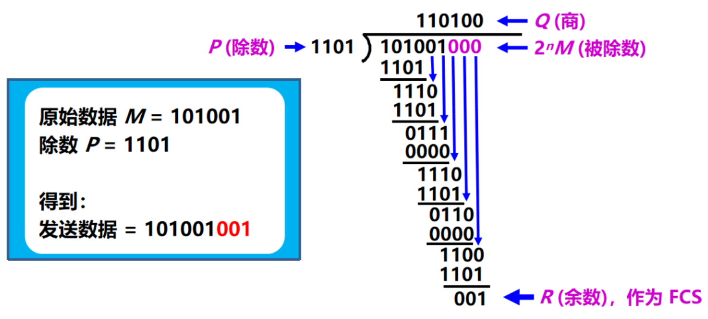

**接收方如何判定**

- 若得出的余数 R = 0，则判定这个帧没有差错，就接受 (accept)
- 若余数 R ≠ 0，则判定这个帧有差错，就丢弃

但这种检测方法并不能确定究竟是哪一个或哪几个比特出现了差错

只要经过严格的挑选，并使用位数足够多的除数 P，那么出现检测不到的差错的概率就很小很小

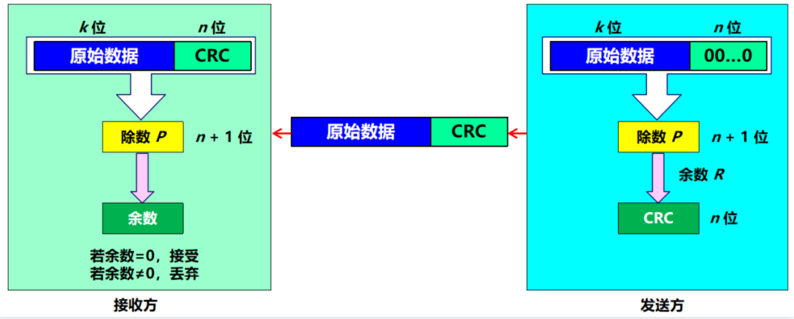

### 3.ppp协议

**对于点对点的链路，目前使用得最广泛的数据链路层协议是点对点协议 PPP (Point-to-Point Protocol)**

+ 具体内容可以去看谢希仁版本的计算机网络教材

---

## 三.**使用广播信道的数据链路层**

> 局域网就是使用的广播信道

### 1.局域网的数据链路层

**局域网最主要的特点是：**

- 网络为一个单位所拥有
- 地理范围和站点数目均有限

**局域网具有如下主要优点：**

- 具有广播功能，从一个站点可很方便地访问全网，局域网上的主机可共享连接在局域网上的各种硬件和软件资源
- 便于系统的扩展和逐渐地演变，各设备的位置可灵活调整和改变
- 提高了系统的可靠性、可用性和残存性

**局域网的拓扑结构：**

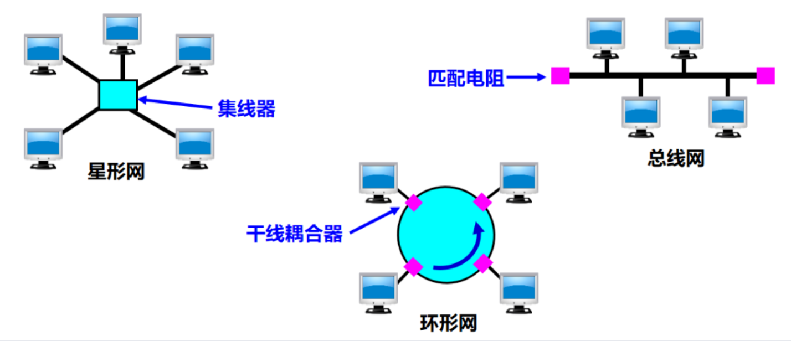

### 2. 数据链路层的两个子层

为了使数据链路层能更好地适应多种局域网标准，IEEE 802 委员会就将局域网的数据链路层拆成两个子层：

- **逻辑链路控制 LLC** (Logical Link Control)子层
  + LLC 的主要功能是发送时在 MAC 层上多路复用协议，并在接收时同样地多路分解协议。
  + LLC 提供跳到跳的流和差错控制，像是路由器和路由器之间这种相邻节点的数据传输称为 `一跳`。
  + 它允许通过计算机网络进行多点通信。
- **媒体接入控制 MAC** (Medium Access Control)子层
  + MAC 层为 LLC 和 OSI 网络的上层提供了物理层的抽象。
  + MAC 层负责封装帧，以便通过物理介质进行传输。
  + MAC 层负责解析源和目标地址。
  + MAC 层还负责在冲突的情况下执行冲突解决并启动重传。
  + MAC 层负责生成帧校验序列，从而有助于防止传输错误。

与接入到传输媒体有关的内容都放在 MAC子层，而 LLC 子层则与传输媒体无关

不管采用何种协议的局域网，对 LLC 子层来说都是透明的

### 3.适配器的作用

网络接口板又称为**通信适配器** (adapter) 或**网络接口卡** NIC (Network Interface Card)，或**“网卡”**

适配器的重要功能：

- **进行串行/并行转换**
- **对数据进行缓存**
- **在计算机的操作系统安装设备驱动程序**
- **实现以太网协议**

### 4.CSMA/CD协议

+ 具体内容可以去看谢希仁版本的计算机网络教材

---

## 四. 以太网的 MAC 层

在局域网中，硬件地址又称为物理地址，或 MAC 地址。 802 标准所说的“地址”严格地讲应当是每一个站的“名字”或标识符。

### 1.MAC地址组成

- IEEE 802 标准规定 MAC 地址字段可采用 6 字节 ( 48位) 或 2 字节 ( 16 位) 这两种中的一种
- IEEE 的注册管理机构 RA 负责向厂家分配地址字段 6 个字节中的前三个字节 (即高位 24 位)，称为组织唯一标识符
- 地址字段 6 个字节中的后三个字节 (即低位 24 位) 由厂家自行指派，称为扩展唯一标识符，**必须保证生产出的适配器没有重复地址**

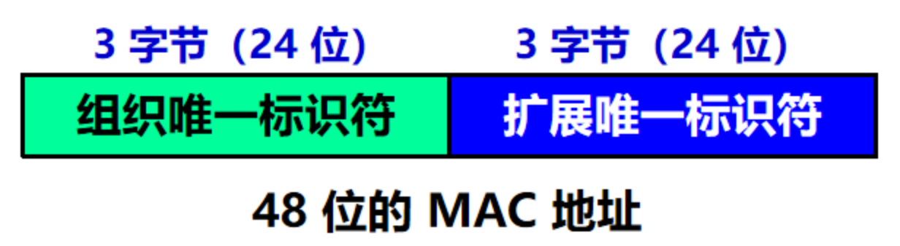

- 一个地址块可以生成 224 个不同的地址。这种 48 位地址称为 MAC-48，它的通用名称是 EUI-48
- 生产适配器时，6 字节的 MAC 地址已被固化在适配器的 ROM，因此，MAC 地址也叫做硬件地址 (hardware address) 或物理地址
- “MAC 地址”实际上就是适配器地址或适配器标识符 EUI-48

### 2.适配器检查MAC

所有的适配器都至少能够识别前两种帧，即能够识别**单播地址和广播地址**

以混杂方式 (promiscuous mode) 工作的以太网适配器只要**“听到”有帧在以太网上传输就都接收下来**

### 3.MAC 帧的格式

常用的以太网 MAC 帧格式有两种标准：

- DIX Ethernet V2 标准（常用）
- IEEE 的 802.3 标准

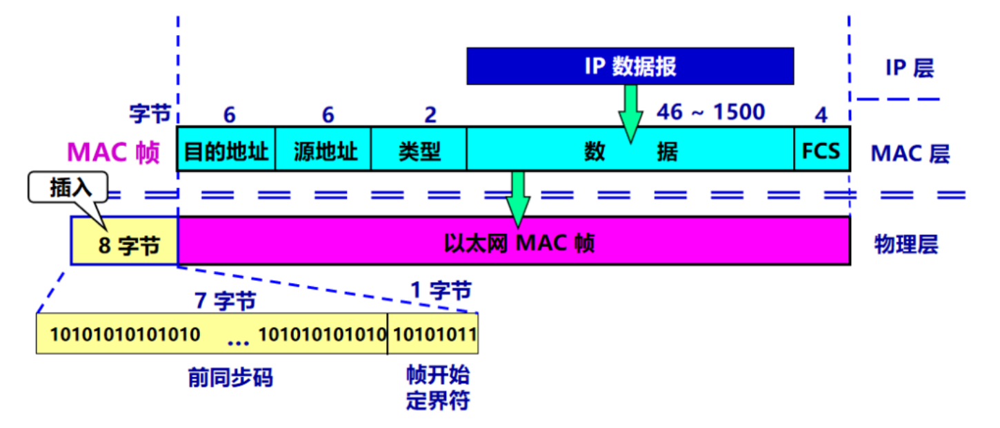

- 以太帧的本体的前端是以太网的首部，总共占用 14 字节，分别是 6 字节的目标 MAC 地址、6 字节的源 MAC 地址和 2 字节的上层协议类型，后面是数据部分，占用 46 - 1500 字节，最后是 `FCS(Frame Check Sequence，帧检验序列)` 4 个字节。FCS 用于检查帧是否有所损坏，因为在通信过程中由于噪声干扰，可能会导致数据出现乱码位。
- 类型字段用来标志上一层使用的是什么协议，以便把收到的 MAC 帧的数据上交给上一层的这个协议
- 数据字段的正式名称是 MAC 客户数据  d字段，最小长度 64 字节 - 18 字节的首部和尾部 = 数据字段的最小长度（46字节）
- 当数据字段的长度小于 46 字节时，应在数据字段的后面加入整数字节的填充字段，以保证以太网的 MAC 帧长不小于 64 字节
- 在帧的前面插入（硬件生成）的 8 字节中，第一个字段共 7 个字节，是前同步码，用来迅速实现 MAC 帧的比特同步。第二个字段 1 个字节是帧开始定界符，表示后面的信息就是 MAC 帧。

**无效的 MAC 帧**

- 数据字段的长度与长度字段的值不一致
- 帧的长度不是整数个字节
- 用收到的帧检验序列 FCS 查出有差错
- 数据字段的长度不在 46 ~ 1500 字节之间
- 有效的 MAC 帧长度为 64 ~ 1518 字节之间