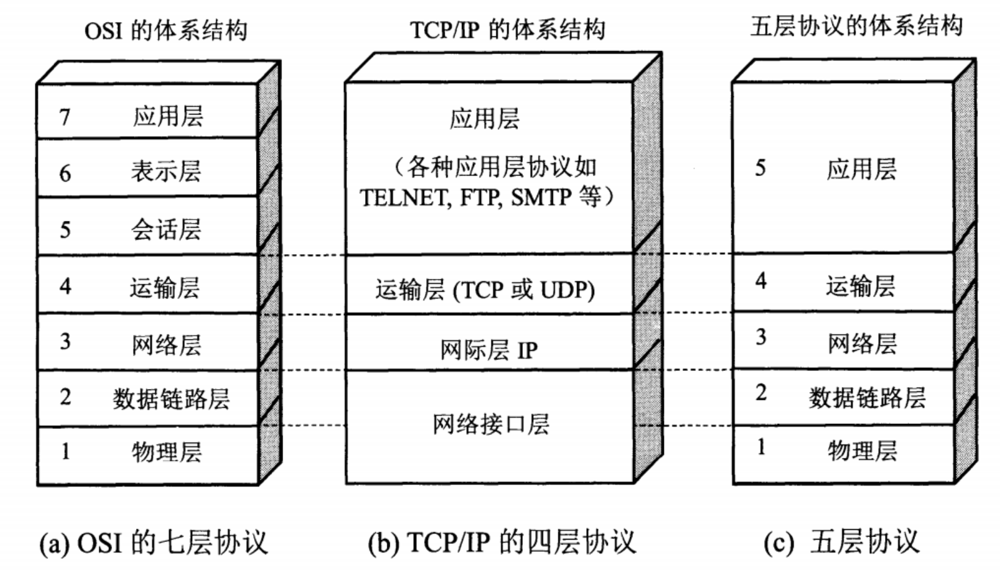
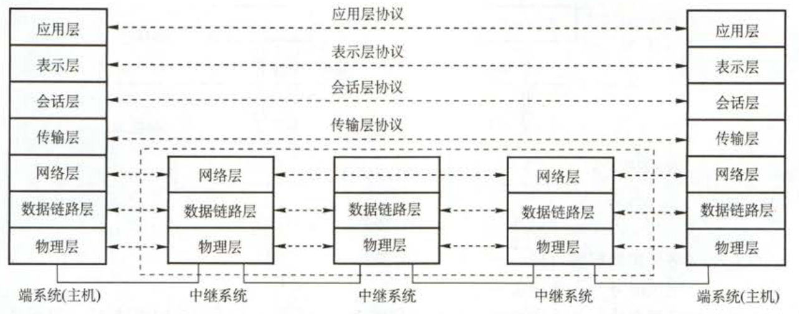
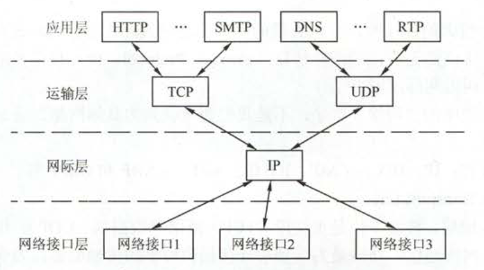
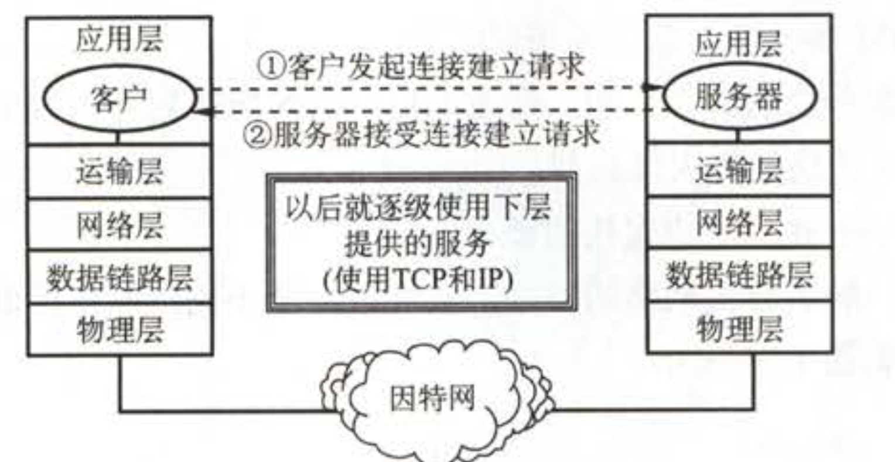

# 计算机网络概述

## 一.计算机网络的概念

### 1.基本概念

一般认为，计算机网络是一个将分散的，具有独立功能的计算机系统，通过通信设备与线路连接起来，由功能完善的软件实现资源分享和信息传递的系统。简而言之，计算机网络就是一些互联的，自治的计算机系统的集合。

> 《计算机王道复习指导》中的定义。

### 2.计算机网络的功能

计算机网络主要有以下五个功能：

+  **数据通信：**
  + 是网络中最基本也是最重要的功能，用来实现联网计算机之间的各种信息的传输，并实现将分散在不同地理位置的计算机联系起来，进行统一的调配，控制和管理。
+  **资源共享：**
  + 可以是软件共享，数据共享，也可以是硬件共享。使计算机网络中的资源互通有无，分工协作，从而极大地提高硬件资源，软件资源和数据资源的利用率。
+  **提高可靠性：**
  + 计算机网络中的各台计算机可以通过网络互为替代机。
+  **负载均衡：**
  + 将工作任务均衡地分配给计算机网络中的各台计算机。

## 二.计算机体系结构

> 主要分为OSI的七层结构，TCP/IP的四层结构，五层结构。

### 1.OSI参考模型

国际标准化组织(ISO)提出的网络体系结构模型，称为开放系统互联参考模型(OSI/RM)，简称为OSI参考模型。其中有七层，低三层统称为通信子网，是为了联网而附加上去的通信设备，完成数据的传输功能。高三层统称为资源子网，相当于计算机系统，完成数据的处理等功能。传输层承上启下。七层结构图如下所示：

各层主要功能：

+ 物理层(Physical Layer)

  > 物理层的传输单位是比特，任务是透明的传输比特流，功能是在物理媒体上为数据端设备透明的传输原始比特流。

+ 数据链路层(Data Link Layer)

  > 数据链路层的传输单位是帧，任务是将网络层传下来的IP数据报封装成帧。数据链路层的功能可以概括为： **封装成帧，差错控制，流量控制和传输管理。**

+ 网络层(Network Layer)

  > 网络层的传输单位是数据报，它关心的是通信子网的运行控制， **主要任务是把网络层的协议数据单元(分组)从源端传到目的端，为分组交换网上的不同主机提供通信服务。** 关键问题是对分组进行路由选择，并实现流量控制，拥塞控制，差错控制和网际互联等功能。

+ 传输层(Transport Layer)

  > 传输层的传输单位是报文段(TCP)或用户数据报(UDP)， **传输层的任务是负责主机中两个进程之间的通信。** 功能是端到端连接提供可靠的传输服务；为端到端连接提供流量控制，差错控制，服务质量数据传输管理等服务。

+ 会话层(Session Layer)

  > 会话层是用户应用程序和网络之间的接口， **主要任务是：向两个实体的表示层提供建立和使用连接的方法。** 将不同实体之间的表示层的连接称为会话，也称为同步(SYN)。因此会话层的任务就是组织和协调两个会话进程之间的通信，并对数据交换进行管理。

+ 表达层(Presentation Layer)

  > 表达层对来自应用层的命令和数据进行解释，对各种语法赋予相应的含义，并按照一定的格式传送给会话层。其 **主要功能是处理用户信息的表示问题，如数据格式处理，数据的编码，压缩和解压缩以及数据的加密和解密。**

+ 应用层(Application Layer)

  > 应用是计算机用户，以及各种应用程序和网络之间的接口， **其功能是直接向用户提供服务，完成用户希望在网络上完成的各种工作。** 它在其他6层工作的基础上，负责完成网络中应用程序与网络操作系统之间的联系，建立与结束使用者之间的联系，并完成网络用户提出的各种网络服务及应用所需的监督、管理和服务等各种协议。此外，该层还负责协调各个应用程序间的工作。

### 2.TCP/IP 模型

ARPA在研究ARPAnet时提出了TCP/IP模型。由于得到广泛应用而称为了事实上的国际标准。TCP/IP的层次结构以及各层的主要协议如下图所示：

各层主要功能：

+  网络接口层：

  > 类似于OSI中的物理层和数据链路层，包括用于协作IP数据在已有网络介质上传输的协议。实际上TCP/IP标准并不定义与ISO数据链路层和物理层相对应的功能。相反，它定义像地址解析协议(Address Resolution Protocol,ARP)这样的协议，提供TCP/IP协议的数据结构和实际物理硬件之间的接口。

+ 网际层(主机-主机)：

  > 对应于OSI七层参考模型的网络层。本层包含IP协议、RIP协议(Routing Information Protocol，路由信息协议)，负责数据的包装、寻址和路由。同时还包含网间控制报文协议(Internet Control Message Protocol,ICMP)用来提供网络诊断信息。

+ 传输层(应用-应用，或进程-进程)：

  > 对应于OSI七层参考模型的传输层，它提供两种端到端的通信服务。其中TCP协议(Transmission Control Protocol)提供可靠的数据流运输服务，UDP协议(Use Datagram Protocol)提供不可靠的用户数据报服务。

+ 应用层(用户-用户)：

  > 对应于OSI七层参考模型的应用层和表达层。因特网的应用层协议包括Finger、Whois、FTP(文件传输协议)、Gopher、HTTP(超文本传输协议)、Telent(远程终端协议)、SMTP(简单邮件传送协议)、IRC(因特网中继会话)、NNTP（网络新闻传输协议）等。

### 3.五层协议的体系结构

#### OSI与TCP/IP模型的优缺点：

+ OSI引入了服务、接口、协议、分层的概念，TCP/IP借鉴了OSI的这些概念建立TCP/IP模型。

+ OSI先有模型，后有协议，先有标准，后进行实践；而TCP/IP则相反，先有协议和应用再提出了模型，且是参照的OSI模型。

+ OSI是一种理论下的模型，而TCP/IP已被广泛使用，成为网络互联事实上的标准。

#### 五层协议的体系结构

在学习计算机网络时往往采取这种的方法，即综合OSI和TCP/IP的优点，采用下图中的五层协议的体系结构进行学习：

---

七层体系结构总结图：

