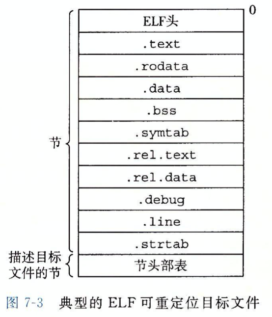

链接(linking)是将各种代码和数据部分收集起来并组合成为一个单一文件的过程，这个文件可被加载到存储器并执行。链接可以执行于编译时(compile time)，也可以执行于加载时(load time)，甚至执行于运行时(run time)。

链接器在软件开发中扮演着一个关键的角色，因为它们使得分离编译(separate compilation)成为可能。

## 一.编译器驱动程序

大多数编译系统提供**编译驱动程序**（compiler driver），为用户根据需求调用语言预处理器、编译器、汇编器和链接器。

在GCC编译过程中介绍过编译过程：

<div align = center></div>

1.  **驱动程序首先运行C预处理器(cpp)将C的源程序hello.c翻译成一个ASCII码的中间文件hello.i.**

   > + 处理源文件中`#`开头的预编译指令
   >   + 删除`#define`并展开所定义的宏
   >   + 处理所有条件预编译指令，如`#if`，`ifdef`,`endif`等
   >   + 插入头文件到`#include`处，结义递归方式进行处理
   >   + 删除所有注释
   >   + 添加行号和文件名标识，以便编译时编译器产生调试所用到的行号信息
   >   + 保留所有`#progma`编译指令

2.  **接下来，驱动程序运行C编译器(gcc)，将hello.i翻一个一个ASCII汇编语言文件hello.s**

   > 编译过程就是将预处理后得到的预处理文件(如hello.i) 进行词法分析，语法分析，语义分析并优化，生成汇编代码文件。

3.   **然后驱动程序运行汇编器(as)，将hello.s翻译成一个** **可重定位目标文件hello.o**

   > 汇编器用来将汇编语言源程序转换为机器指令序列。
   >
   > 汇编结果是一个 **可重定位目标文件** (如hello.o)，其中包含的是不可读的二进制代码，必须用相应的工具软件来查看其内容。

4.  **驱动程序运行连接器程序(ld)，将hello.o和一些必要的系统目标文件组合起来，创建一个可执行文件prog：**

   ```bash
   ld -o prog [system object files and args] hello.o
   ```

5.  **要运行可执行文件prog，在Linux shell的命令行上输入它的名字：**

   ```bash
   linux> ./prog
   ```

6.  **shell调用操作系统中一个叫做加载器(loader)的函数，将可执行问价prog中的代码和数据复制到内存，然后将控制转移到这个程序的开头。**


## 二.链接的由来与作用


## 三.静态链接

像Linux LD程序这样的 **静态连接器(static linker)**  以一组 **可重定位目标文件** 和 **命令行参数** 作为输入，生成一个完全链接的，可以加载和运行的可执行目标文件作为输出。

输入的可重定位目标文件由各种不同的 **代码** 和 **数据节(section)** 组成，每一节都是一个连续的字节序列。指令在一节中，初始化了的全局变量在另一节中，而未初始化的变量在另外的一节中。

<div align = center></div>

为了创建可执行文件，链接器必须完成两个主要任务：

- **符号解析（symbol resolution）**，将每一个符号引用和一个符号定义关联起来
- **重定位（relocation）**，编译器和汇编器生成从地址 0 开始的代码和数据节。链接器通过把每个符号定义域一个存储器位置联系起来，然后修改所有对这些符号的引用，使得它们指向这个存储器位置，从而重定位这些节。

链接器的基本事实： 目标文件纯粹是字节块的集合。这些块中，有些包含程序代码，有些则包含程序数据，而其他的则包含指导链接器和加载器的数据结构。 链接器将这些块连接起来，确定被连接块的运行时位置，并且修改代码和数据块中的各种位置。链接器对目标机器了解甚少。产生目标文件的编译器和汇编器已经完成了大部分工作。


## .目标文件

目标文件有三种形式：

- **可重定位目标文件。** 包含二进制文件和代码，其形式在编译时和其他可重定位目标文件合并起来，创建一个可执行目标文件
- **可执行目标文件。** 其形式可被拷贝到存储器并执行
- **共享目标文件。** 一种特殊类型的可重定位目标文件，可以在加载或者运行时被动态地加载到存储器并链接。

编译器和汇编器生成可重定位目标文件（包括共享目标文件），链接器生成可执行目标文件。从技术上讲，一个目标模块就是一个字节序列，而一个目标文件就是一个以文件形式存放在磁盘上的目标模块。


## .可重定位目标文件

下图为典型的 ELF 可重定位目标文件的格式。

ELF 头(ELF header)以一个 16 字节的序列开始，这个序列描述了生成该文件的系统的字的大小和字节顺序。

ELF头剩下的部分包含 **帮助链接器语法分析** 和 **解释目标文件** 的信息。其中包括：

ELF头的大小，目标文件的类型(如可重定位，可执行或可共享)，机器类型，字节头部表的文件偏移，以及字节头部表中条目的大小和数量。

<div align = center></div>


夹在ELF头和字节头部表之间的都是节。一个典型的ELF可重定位目标文件包含下面几个节：

+ **.text** ：代码段。存放已编译程序的机器代码，一般是只读的。
+ **.rodata**  ：只读数据段。此段的数据不可修改,存放常量。比如，printf中的格式化语句。
+ **.data**  ：数据段。存放已初始化的全局变量和静态C变量。 局部C变量在运行时被保存在栈中，既不出现在.data节中，也不出现在.bss节中。
+ **.bss**  ： bss段。未初始化全局变量和静态C变量，以及所有被初始化为0的全局和静态变量。仅是占位符，**不占据任何实际磁盘空间**。目标文件格式区分初始化和非初始化是为了空间效率。
+ **.symtab** ：符号表，它存放在程序中定义和引用的函数和全局变量的信息。
+ **.rel.txt** ：.text节的重定位信息，当链接器把这个目标文件和其他文件组合时，需要修改这些位置。
+ **.rel.data** ：.data节的重定位信息，用于对被模块使用或定义的全局变量进行重定位的信息。
+ **.debug** ：调试符号表，其条目是程序中定义的局部变量和类型定义，程序中定义和引用的全局变量，以及原始的C源文件。
+ .**line** ：原始C源程序中行号和 .text 节中机器指令之间的映射。只有 -g 编译时才会得到。
+ **.strtab** ：一个字符串表，包含 symtab和 debug节中符号及节名。


## .符号和符号表

每个重定位的目标模块m都有一个符号表，包含m所定义和引用的符号的信息。在链接器的上下文中，有三种不同的符号：

1. 由模块m定义并能够被其他模块引用的全局符号。全局链接器符号对应于非静态的C函数和全局变量。
2. 由其他模块定义并被模块m所引用的全局符号。这些符号称为外部符号，对应于在其他模块中定义的非静态C函数和全局变量。
3. 只被模块m定义和引用的局部符号。它们对应于带static属性的C函数和全局变量。这些符号在模块m中任何位置可见，但是不能被其他模块引用。

C 程序员使用 static 属性在模块内部隐藏变量和函数声明。


##                                                                                                                                                                                                                                                                                                                                                                                                                                                                                                                                                                                                                                                                                                                                                                                                                             .符号解析


