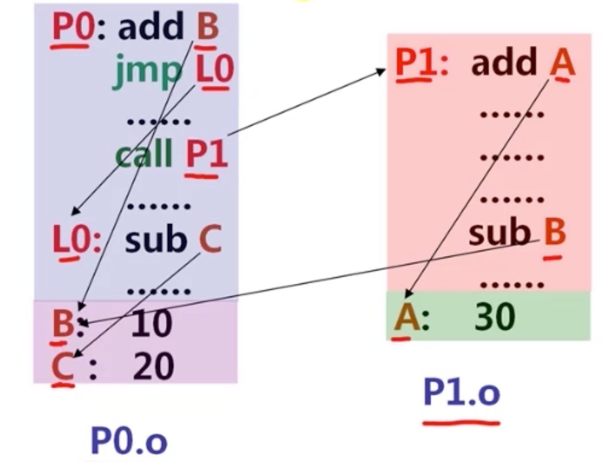
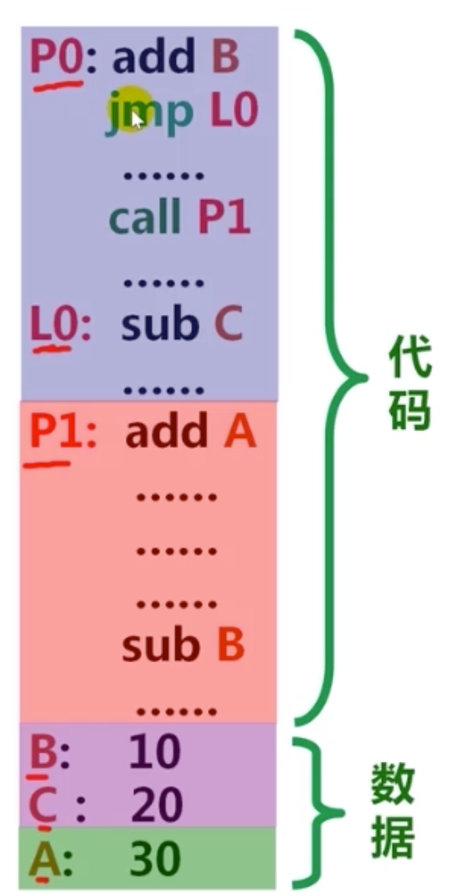
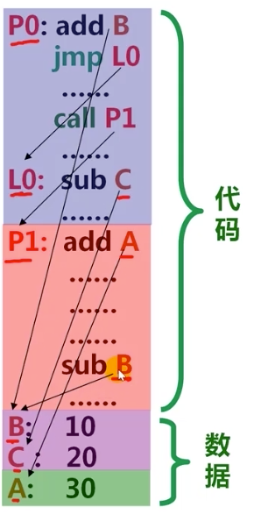
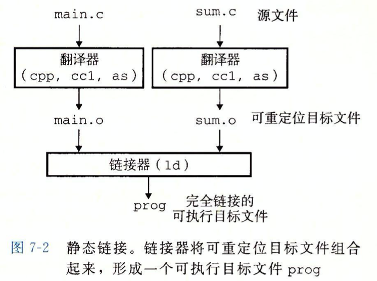
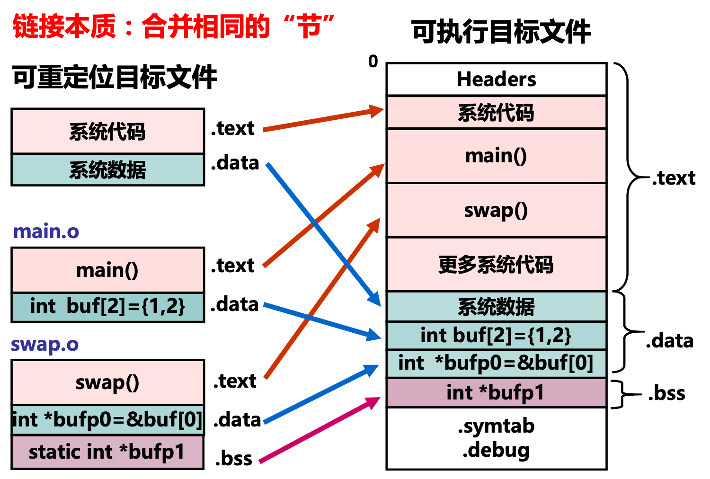
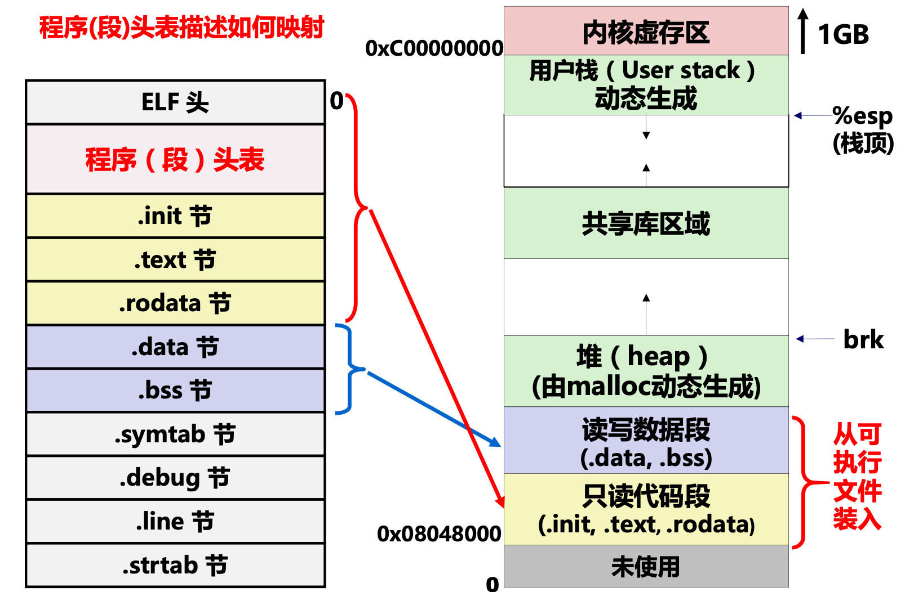
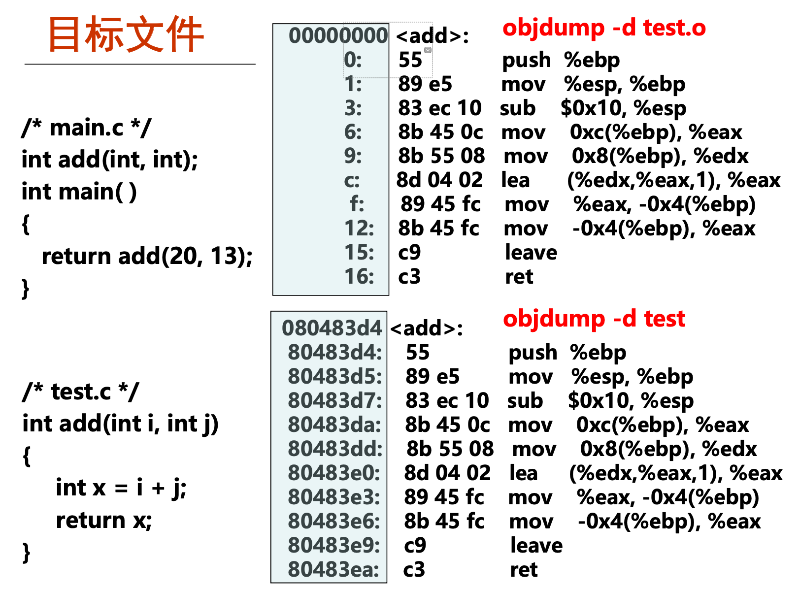
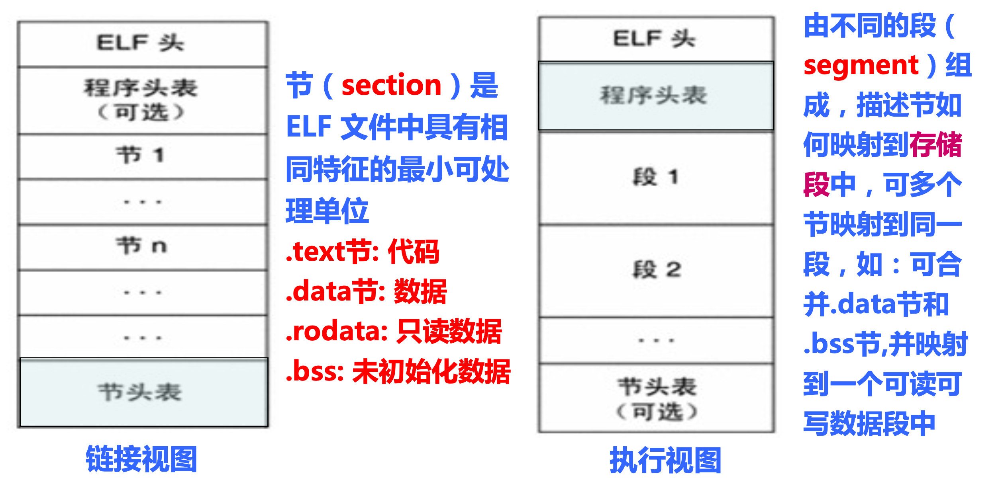
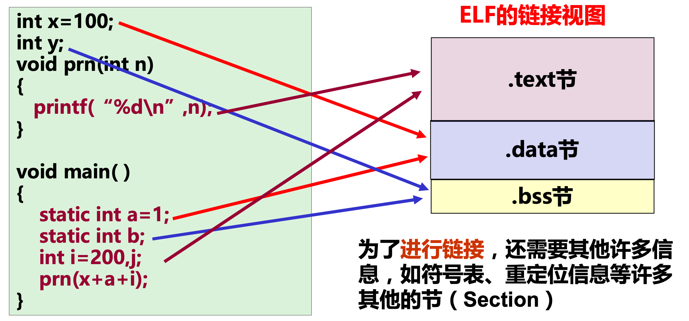

链接(linking)是将各种代码和数据部分收集起来并组合成为一个单一文件的过程，这个文件可被加载到存储器并执行。链接可以执行于编译时(compile time)，也可以执行于加载时(load time)，甚至执行于运行时(run time)。

链接器在软件开发中扮演着一个关键的角色，因为它们使得分离编译(separate compilation)成为可能。

## 一.编译器驱动程序

大多数编译系统提供**编译驱动程序**（compiler driver），为用户根据需求调用语言预处理器、编译器、汇编器和链接器。

在GCC编译过程中介绍过编译过程：

<div align = center></div>

1.  **驱动程序首先运行C预处理器(cpp)将C的源程序hello.c翻译成一个ASCII码的中间文件hello.i.**

   > + 处理源文件中`#`开头的预编译指令
   >   + 删除`#define`并展开所定义的宏
   >   + 处理所有条件预编译指令，如`#if`，`ifdef`,`endif`等
   >   + 插入头文件到`#include`处，结义递归方式进行处理
   >   + 删除所有注释
   >   + 添加行号和文件名标识，以便编译时编译器产生调试所用到的行号信息
   >   + 保留所有`#progma`编译指令

2.  **接下来，驱动程序运行C编译器(gcc)，将hello.i翻一个一个ASCII汇编语言文件hello.s**

   > 编译过程就是将预处理后得到的预处理文件(如hello.i) 进行词法分析，语法分析，语义分析并优化，生成汇编代码文件。

3. **然后驱动程序运行汇编器(as)，将hello.s翻译成一个** **可重定位目标文件hello.o**

   > 汇编器用来将汇编语言源程序转换为机器指令序列。
   >
   > 汇编结果是一个 **可重定位目标文件** (如hello.o)，其中包含的是不可读的二进制代码，必须用相应的工具软件来查看其内容。

   + 上述预处理，编译和汇编这三个阶段针对一个模块(.c文件)进行处理，得到对应的一个可重定位目标文件(.o文件)

4. **驱动程序运行连接器程序(ld)，将hello.o和一些必要的系统目标文件组合起来，创建一个可执行文件prog：**

   ```bash
   ld -o prog [system object files and args] hello.o
   ```

   + 链接是将多个可重复定位目标文件合并以生成可执行目标文件。

5.  **要运行可执行文件prog，在Linux shell的命令行上输入它的名字：**

   ```bash
   linux> ./prog
   ```

6.  **shell调用操作系统中一个叫做加载器(loader)的函数，将可执行问价prog中的代码和数据复制到内存，然后将控制转移到这个程序的开头。**

---


## 二.链接的由来与作用

### 1.链接的由来

#### 机器语言

原始的链接概念早在高级编程语言出现之前就已存在； 最早程序员用机器语言编写程序，并记录在纸带或卡片上

> 穿孔表示0，未穿孔表示1
> 假设:0010-jmp

```css
0101 0110 
0010 0101 
......
......
0110 0111
......
```

若在第5条指令前加入 指令，则程序员需 **重新计算jmp指令的目标地 址(重定位)，然后重新打孔。**

:large_orange_diamond:  对于这种方法太原始了，程序员无法忍受。所以提出了用符号表示而不用0/1表示!

#### 汇编语言

汇编语言用符号表示跳转位置和变量位置，简化了问题。

<div align = center></div>

+ **用助记符表示操作码** (0101用add表示)
+ **用符号表示位置** (0110所在的位置用B表示)
+ **用助记符表示寄存器**

虽然一定程度上简化了操作，但是程序员需要记忆的符号太多，效率仍不够高。所以出现了高级语言程序模块。

#### 高级程序语言 

+ 高级程序语言利用 **符号定义** 来表示子程序(函数)的起始地址和变量起始地址。
+  调用子程序(函数或过程)和使用变量即是 **符号的引用(reference)**  
+ 一个模块定义的符号可以被另一个模块引用

**最终须 编译， 链接(合并)，链接时须在符号引用处填入定义处的地址**

### 2.链接的步骤

#### (1).确定符号引用关系

> 在所有的符号定义与符号引用之间建立关联

<div align = center></div>

#### (2).合并相关.o文件

> 将相关文件的代码合并在一起，并将相关的数据合并在一起

<div align = center></div>

#### (3).确定每个符号的地址

#### (4).在指令中填入新地址

<div align = center></div>

> 步骤1：符号解析
>
> 步骤2—4：重定位

上述合并及其操作都是在 **虚拟地址空间** 中完成的。

### 3.链接的作用

#### 模块化

1. **一个程序可以分成很多源程序文件** 
2. **可构建公共函数库，如数学库，标准C库等**

(多人开发，代码重用，开发效率高)

#### 效率高

1. **时间上，可分开编译；只需重新编译被修改的源程序文件，然后重新链接** 
2. **空间上，无需包含共享库所有代码；源文件中无需包含共享库函数的源码，只要直接调用即可**

3. **可执行文件和运行时的内存中只需包含所调用函数的代码，而不需要包含整个共享库**

---


## 三.静态链接的步骤与本质

### 1.静态链接的步骤

像Linux LD程序这样的 **静态连接器(static linker)**  以一组 **可重定位目标文件** 和 **命令行参数** 作为输入，生成一个完全链接的，可以加载和运行的可执行目标文件作为输出。

输入的可重定位目标文件由各种不同的 **代码** 和 **数据节(section)** 组成，每一节都是一个连续的字节序列。指令在一节中，初始化了的全局变量在另一节中，而未初始化的变量在另外的一节中。

<div align = center></div>

为了创建可执行文件，链接器必须完成两个主要任务：

- **符号解析（symbol resolution）**，将每一个符号引用和一个符号定义关联起来
- **重定位（relocation）**，编译器和汇编器生成从地址 0 开始的代码和数据节。链接器通过把每个符号定义域一个存储器位置联系起来，然后修改所有对这些符号的引用，使得它们指向这个存储器位置，从而重定位这些节。

链接器的基本事实： 目标文件纯粹是字节块的集合。这些块中，有些包含程序代码，有些则包含程序数据，而其他的则包含指导链接器和加载器的数据结构。 链接器将这些块连接起来，确定被连接块的运行时位置，并且修改代码和数据块中的各种位置。链接器对目标机器了解甚少。产生目标文件的编译器和汇编器已经完成了大部分工作。

### 2.静态链接过程的本质

#### 链接过程的本质

链接过程的本质是将每个模块的各种节合并在一起。

<div align = center></div>

> 右边模块已经进行了符号解析与重定位，有了自己的地址。 **生成的可执行目标文件已经存放在磁盘中。**

#### 可执行文件存储映像

<div align = center></div>

+ 程序(段)头的作用是 **描述下面的各种节是如何与磁盘空间进行映射的。**
+ 链接时，程序并不知道将会载入内存，在何处执行。所以引入了虚拟地址空间，将程序合并到虚拟地址空间中。
  + 只读数据和代码 映射到 只读代码段
  + 数据 映射到 读写数据段
  + **以上两个段都是从可执行文件装入的，而装入时的地址是通过程序头表来描述的。**

#### 例子讲解

<div align = center></div>

+ 在test.c只是生成可重定位目标文件时，地址还没发生改变
+ 将test.o 与 main.o进行链接生成可执行目标文件之后，地址就是虚拟地址空间了。

---


## 四.目标文件

### 1.目标文件种类介绍

目标文件有三种形式：

:diamond_shape_with_a_dot_inside: **可重定位目标文件**

包含二进制文件和代码，其形式在编译时和其他可重定位目标文件合并起来，创建一个可执行目标文件

+ 每个.o文件由对应的.c文件生成
+ 每个.o文件代码和数据地址 **都从0开始**

:diamond_shape_with_a_dot_inside: **可执行目标文件。**

+ 包含的代码和数据可以被直接复制到内存并被执行
+ 代码和数据地址为虚拟地址空间中的地址

:diamond_shape_with_a_dot_inside: **共享目标文件。**

+  特殊的可重定位目标文件，能在 **装入或运行时被装入到内存并自动被链接** ，称为共享库文件
+ Windows 中称其为 Dynamic Link Libraries (DLLs)

编译器和汇编器生成可重定位目标文件（包括共享目标文件），链接器生成可执行目标文件。从技术上讲，一个目标模块就是一个字节序列，而一个目标文件就是一个以文件形式存放在磁盘上的目标模块。

### 2.目标文件的格式

:diamond_shape_with_a_dot_inside: **目标代码(Object Code)**

+ 指编译器和汇编器处理源代码后所生成的机器语言目标代码

:diamond_shape_with_a_dot_inside: **目标文件(Object File)**

+ 指包含目标代码的文件

:diamond_shape_with_a_dot_inside: **标准的几种目标文件格式**

+  **DOS操作系统(最简单) :** COM格式，文件中仅包含代码和数据，且被加载到固定位置
+  **System V UNIX早期版本:** COFF格式，文件中不仅包含代码和数据 ，还包含重定位信息、调试信息、符号表等其他信息，由一组严格定义的数据结构序列组成
+   **Windows:**  PE格式(COFF的变种)，称为可移植可执行( Portable Executable，简称PE)
+   **Linux等类UNIX:** ELF格式(COFF的变种)，称为可执行可链接( Executable and Linkable Format，简称ELF)

### 3.目标文件视图

>  因为Linux中的目标文件格式为ELF—可执行可链接格式，所以视图分为
>
> + 链接视图：被链接
> + 执行视图：被执行

<div align = center></div>

#### 链接视图—可重定位目标文件

+ 可被链接(合并)生成 **可执行文件** 或 **共享目标文件**
+ 静态链接库文件由若干个可重定位目标文件组成
+ 包含代码、数据 **(已初始化的全局变量和局部静态变量.data和未初始化的全局变量和局部静态变量.bss)**
+ 包含 **重定位信息** (指出哪些符号引用处需要重定位)
+ 文件扩展名为.o (相当于Windows中的 .obj文件)

<div align = center></div>

#### 执行视图—可执行目标文件

- 包含代码、数据 (已初始化.data和未初始化.bss)
- 定义的所有变量和函数 **已有确定地址** (虚拟地址空间中的地址)
- 符号引用处 **已被重定位** ，以指向所引用的定义符号
- 没有文件扩展名或默认为a.out(相当于Windows中的 .exe文件)
- 可被CPU **直接执行** ，指令地址和指令给出的操作数地址都是虚拟地址

