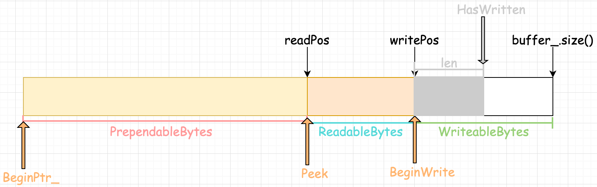

## buffer——缓存区设置

> 利用标准库容器封装char，实现自动增长的缓冲区；

```
  源代码
 ├── code          
 │   ├── buffer
 │   │   ├── buffer.h
 │   │   ├── buffer.cpp
```

### 1.定义buffer类

```c++
 class Buffer {
 public:
     Buffer(int initBuffSize = 1024);
     ~Buffer() = default;
     ...//功能函数
 private:
     std::vector<char> buffer_;
     std::atomic<std::size_t> readPos_;  // ~ 原子类型的 读写标记位置
     std::atomic<std::size_t> writePos_;
 };
```

buffer的各个指向变量如下所示：





### 2.buffer的扩容方式

- 如果`WritableBytes() + PrependableBytes() < len`，说明剩余的字节数加上可重写的字节数都不够，则利用`vector<char>` 的`resize()`函数进行扩容操作。

- 否则将`ReadableBytes`部分的字符串直接`copy` 到 `BeginPtr_` 处，更新`readPos_`与`writePos_` 。

  ```c++
   size_t readable = ReadableBytes();
   std::copy(BeginPtr_() + readPos_, BeginPtr_() + writePos_, BeginPtr_());
   readPos_ = 0;
   writePos_ = readPos_ + readable;
   assert(readable == ReadableBytes());
  ```

### 3.buffer的Append(扩充)方式

- 如果满足在buffer中可写，如果不够，则进行扩容操作。
- 将长度为`len`的`str`字符串`copy`到`BeginWrite`处。
- 使用`HasWritten`更新`writePos_`。

```c++
 EnsureWriteable(len);
 std::copy(str, str + len, BeginWrite());//将str拷贝到writePos_开始的相应区间内
 HasWritten(len); // ~ writePos_ 移动相应位置
```

### 4.buffer的WriteFd方式

- 将`buffer`中`[readPos_ writePos_)`的内容写到 `fd`
- 更新`readPos_`

```C++
size_t readSize = ReadableBytes();
ssize_t len = write(fd, Peek(), readSize); //将 [readPos_ writePos_) 内容写到 fd
if(len < 0) {
    *saveErrno = errno;
    return len;
} 
readPos_ += len;//到此，[readPos_ writePos_)内容全部读完
return len;
```

### 5.buffer的ReadFd方式

- 定义一块`buff`缓冲区
- 利用`readv`从`fd`读数据，这样如果`Buffer`中剩余的缓冲区不够时会保存至`buff`中。 
  - 如果所读的数据长度`len`小于`WritableBytes`，则默认读入了`Buffer`中，只需要更新`writePos_`即可。
  - 否则，先将`buff`中的数据写入`WritableBytes`中，再将剩余的数据进行`Append`操作。

```C++
char buff[65535];
struct iovec iov[2];
const size_t writable = WritableBytes();
iov[0].iov_base = BeginPtr_() + writePos_;
iov[0].iov_len = writable;
iov[1].iov_base = buff;
iov[1].iov_len = sizeof(buff);
const ssize_t len = readv(fd, iov, 2);
if(len < 0)
  	*saveErrno = errno;
else if(static_cast<size_t>(len) <= writable) {//数据先往 buffer_ 里面读
  	writePos_ += len;
}
//如果 buffer_ 剩余的字节不够，将剩余的内容读入buff 中；之后通过 Append 将buffer中的内容添加到 buffer_ 中，如果总的字节数不够，会调用 Makespace 重新分配内存空间
else {
  	writePos_ = buffer_.size();
  	Append(buff, len - writable);
}
```